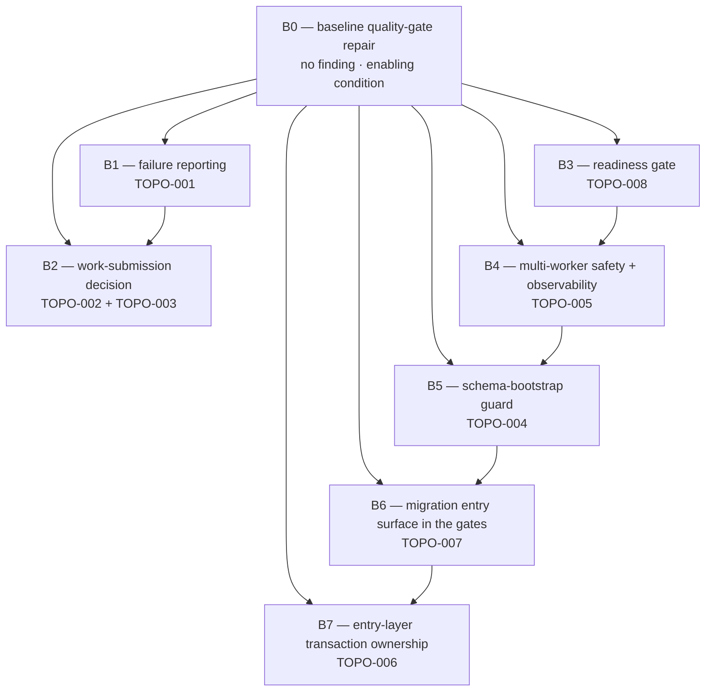

# Purpose

This plan decomposes the validated audit of phase `01-process-architecture` into
dependency-safe execution blocks. Each block is implemented, locally validated and
committed by exactly one Implementor. The blocks together cover every surviving
system finding (`TOPO-001` … `TOPO-008`) plus one inserted baseline block, `B0`.

The unit of work is a **block**, not a finding. A block is the smallest unit that
can be reviewed as a whole: either the change is meaningless without all its parts,
or splitting it would put a half-migrated state in front of a reviewer. Every block
is one commit.

| Item | Value |
|---|---|
| Audit phase | `01-process-architecture` |
| Plan date | 2026-09-30 |
| Source plan | `.ai/audit/99-validation/01-process-architecture-validated-findings.md` — the **validated audit report**. The source of truth for findings, severities, risk ratings and the six-step roadmap. |
| Underlying audit | `.ai/audit/01-process-architecture/findings.md` — the step-by-step remediation text the validation cites. Authoritative for recommendation wording. |
| Code-context artefact | Supplied by the Coordinator at `C:\Users\Om\AppData\Local\Temp\kilo\mkobi-topo01-code-context.md` (608 lines, sections A–F). **Readability caveat, stated deliberately:** the Planner's sandbox denies the external-directory root, so the artefact could not be opened. Rather than paraphrase it from memory, the Planner re-derived every claim this plan relies on directly against the working tree with read-only `rg` / symbol reads / `ruff` / `mypy`. Where the re-derivation did not reproduce the artefact, this plan says so and carries the measured figure instead. Three such corrections are recorded in §Anchor authority (drift), in B0 (mypy count) and in B1 (driver attribution). No anchor in this plan is copied from an unread source. |
| Sibling plan | `.ai/plans/01-configuration-secrets-remediation-execution.md` — **already executed** (SPEC.md version row `3.12`, plus a later working-tree adjustment adding the liveness signal to `/health/detailed`). **Do not repeat it.** It remains the house-style reference for document shape. Note that the numeric prefix is plan sequence, not audit-phase number: this file takes `02-` because `01-` is taken. |
| Task template | `.ai/tasks/templates/task_template.yaml` — the shape every `{task_description}` block below follows. |
| Owner | Tech Lead (scope rulings R1–R10) → Planner (this document) → Implementor, one block at a time |
| Status | `draft` — no block has started |

> ## Anchor authority
>
> **Every instruction in this plan is expressed as a semantic code unit: file path
> plus module, class, function or method. Line numbers never appear as
> instructions.** The source plan's own line anchors have drifted, and this plan
> inherits the problem it is documenting.
>
> Three paths named by the plan do not exist. Use the right-hand column:
>
> | Plan names | Actual path |
> |---|---|
> | `src/mkobi/data_worker.py` | `src/mkobi/workers/data_worker.py` |
> | `src/mkobi/core/config.py` | `src/mkobi/config.py` |
> | `tests/test_rq_worker_wrapper.py` | `tests/test_rq_worker.py` |
>
> Additional drift found by re-derivation, recorded once here rather than per block:
>
> - The plan cites `alembic/versions/20250915_0004_add_error_code_to_processing_logs.py`.
>   The only revision carrying that name is
>   `alembic/versions/82739c97fde1_add_error_code_column_to_processing_.py`.
>   Moot under R4 (`alembic/versions/` is out of scope), recorded for completeness.
> - The plan cites the `app` service in `docker/docker-compose.yml` by two different
>   line anchors. There is one `app` service, defined by the `app:` key. The
>   `nginx:` service's `depends_on` is the short list form (`- app`), not a map —
>   see B3, which converts it.
> - The plan cites `alembic/env.py` `:43` and `:86`. It defines a module-level
>   `MIGRATION_ADVISORY_LOCK_KEY` and a `run_async_migrations` coroutine that
>   acquires and releases it. Both are named, not numbered, in B5.
> - `mypy` reports **three** `arg-type` violations at HEAD, not the two the artefact
>   counted. See B0; this is why B0 is not optional.
> - Twelve existing tests drive the worker's file-processing branch, and all twelve
>   pass a non-`None` `db_session`. The *total* is right but the artefact's
>   per-file split is not: `tests/test_data_worker.py` contains **no** driver of
>   `_process_csv_file_async` at all. See B1.

---

## Scope rulings (R1–R10)

Decided by the Tech Lead. **Not re-litigated by any downstream agent.** Restated
here so the document is self-contained for an Implementor who reads nothing else.

| ID | Ruling |
|---|---|
| **R1** | **Block boundaries and order are fixed.** Execute strictly sequentially, one Implementor at a time, never two. Do not merge or split a block. Maximum 2 parallel subagents overall. |
| **R2** | **Roadmap step 6 (the `_FILE` suffix heuristic) is DELETED from the programme.** Already implemented in commits `b23a9cb` + `8747be7`, runtime-verified clean, pinned by 9 tests in `tests/test_config.py::TestSettingsDockerSecrets`, and recorded in `docs/SPEC.md` (version row `3.12`). Executing it would re-implement the existing `SECRET_FIELD_REGISTRY` allow-list in `src/mkobi/config.py`, which this Planner confirmed present (`SECRET_FIELD_REGISTRY`, `_secret_field_env_names`, `_all_field_env_names`). The only surviving `config.py` item — `Settings._ensure_upload_dir` creating a directory at settings construction — is **out of scope / deferred**; the reason is recorded explicitly in §Deferred, because this deferral is exactly how step 6 got stranded the first time, and a silent drop is what must be avoided. |
| **R3** | **A new block `B0` (baseline quality-gate repair) is inserted before every other block.** Both gates are already red at HEAD, so no downstream Implementor can satisfy "gates pass". `B0` **must be its own commit** and **must NOT be folded into roadmap step 1**, even though two of its violations sit in the exact file step 1 edits — that is precisely the scope-leak risk. `B0` also restates the plan's `VAL-002` premise: it is no longer true that the gates are green, so `VAL-002`'s ordering argument survives only as "guard before gate coverage". |
| **R4** | **Roadmap step 4's gate widening is simplified.** The executable form is: add `alembic/env.py` to **both** the ruff path and the mypy path in `Makefile.ps1` (`Invoke-Lint`, `Invoke-Typecheck`). One commit, two one-line path edits. The `alembic/versions/` "fix or exclude the four violations" decision **does not exist**: `alembic/env.py` is clean under both tools. No `pyproject.toml` change is required — `[tool.mypy] exclude = ["alembic/"]` applies only to directory recursion, so naming the file on the command line bypasses it. |
| **R5** | **Roadmap step 5 is scoped down and split in two directions.** *In scope:* the approval-route move into a new `AuthService.approve_registration_request`, **plus** the `IAuthService` ABC extension in `src/mkobi/interfaces/service_interfaces.py` (`AuthService` implements it; leaving it un-extended reintroduces interface/implementation drift), **plus** the structurally identical pre-commit Redis write in `AuthService.reset_password_admin` — same defect class, same file, a few-line reorder, and leaving it would knowingly leave a sibling defect behind. *Out of scope / deferred:* the plan's blanket "move the `db.commit()` / `db.rollback()` calls out of the ten route bodies". That is a separate transaction-boundary initiative, not this finding. Deferred with evidence and a count in §Deferred. |
| **R6** | **Roadmap step 3's `start_period` reduction is DROPPED.** `VAL-006` stands: `start_period` suppresses failure *counting*; it never manufactures a healthy verdict. Therefore **roadmap step 3 becomes two blocks** — the readiness gate (`TOPO-008`, compose-only) and multi-worker safety + observability (`TOPO-005`). Three corrections from re-derivation must reach the Implementor and are carried in B3 and B4: (a) `docker/Dockerfile`'s `prod` stage has its own image-level `HEALTHCHECK` with **no** `start_period`, so the `start_period` property is compose-only; (b) re-enabling the dev `app` healthcheck makes `.\Makefile.ps1 up --wait` actually gate on `/health`, and the dev `rq-worker` healthcheck is *also* disabled, so a `service_healthy` chain would be asymmetric unless both are handled; (c) `/health/detailed` consumer safety is confirmed — `tests/test_health.py` asserts membership only, never an exact key set. |
| **R7** | **Roadmap step 2 is a decision block.** No downstream agent may choose between Direction A (adopt RQ) and Direction B (remove the RQ surface). Its sequence is **Researcher (select the path) → Planner (produce the Implementor task) → Implementor**. Two corrections the plan does not know must be carried into the block: the submission seam is reached from **two** product entry points (`src/mkobi/services/file_processing.py` and `src/mkobi/services/data_service.py`) with **six** existing tests patching it; and `rq` is a hard import-time contract in `src/mkobi/main.py` (`REQUIRED_MODULES` + `check_dependencies()` at module scope, `SystemExit(1)`) plus a `pyproject.toml` dependency, so Direction B is a service deletion **plus** a dependency removal **plus** an import-contract change. The two items common to both directions ship **inside** this block, first — see B2 §Implementation sequence for the reasoning. |
| **R8** | **Anchors are symbols only.** The three plan-named paths that do not exist are corrected in the §Anchor authority callout above. |
| **R9** | **Documentation scope and protection.** Audit phase 10 already recorded `OPS-002` as a duplicate of `TOPO-002` and ruled that **phase 01 owns the architectural decision** while **phase 10 owns the `rq-worker` documentation correction**. This programme therefore owns the code + compose + test side of the fork and must **cross-reference, not duplicate**, phase 10's doc work. Protected artefacts no Implementor or Doc-specialist may touch: `AGENTS.md` (another agent is rewriting it in place this session), `.kilo/**`, `.ai/audit/**`, `.ai/plans/**`, `.ai/tasks/**`, `docs/STRUCT.md` (generated, >100k lines). |
| **R10** | **Deployment sequencing is a deploy note, not a code constraint.** The plan requires roadmap steps 1 and 2 not to ship in the same release. Since each block is a separate commit, this is recorded as an explicit operator note on both B1 and B2. Also recorded: `.\Makefile.ps1 up --wait` behaviour changes once dev healthchecks are re-enabled (B3). |

---

## Block map and dependency order



`B0` is a root-edge to every block because no block can be validated until the
gates are green. The other edges are real content dependencies, each stated on the
block itself. Execution is strictly sequential in the order below (R1).

| Order | Block | Findings covered | Extra agents |
|---|---|---|---|
| 1 | **B0** — baseline quality-gate repair | *(none — enabling condition)* | Implementor only |
| 2 | **B1** — failure reporting | `TOPO-001` | Implementor only |
| 3 | **B2** — work-submission decision | `TOPO-002` + `TOPO-003` | **Researcher → Planner → Implementor** |
| 4 | **B3** — readiness gate | `TOPO-008` | Implementor only |
| 5 | **B4** — multi-worker safety + observability | `TOPO-005` | **Researcher** (narrow) + Implementor |
| 6 | **B5** — schema-bootstrap guard | `TOPO-004` | Implementor only |
| 7 | **B6** — migration entry surface in the gates | `TOPO-007` | Implementor only |
| 8 | **B7** — entry-layer transaction ownership | `TOPO-006` | Implementor only |

### Finding coverage ledger

| Finding | Block | Notes |
|---|---|---|
| `TOPO-001` | B1 | Silent failure reporting in the CSV worker. |
| `TOPO-002` | B2 | **Merged** with `TOPO-003`. Justification on B2. |
| `TOPO-003` | B2 | **Merged** — see B2 §Why one block. |
| `TOPO-004` | B5 | |
| `TOPO-005` | B4 | |
| `TOPO-006` | B7 | Scoped per R5. |
| `TOPO-007` | B6 | Simplified per R4. |
| `TOPO-008` | B3 | |
| *(roadmap step 6)* | — | Deleted per R2. See §Deferred. |
| *(route commit/rollback refactor)* | — | Deferred per R5. See §Deferred. |
| *(a 10th `mypy` violation the artefact did not count)* | B0 | Measured at HEAD; see B0. |

### The three places the source plan is not executable as written

The plan flags three. Re-derivation against the working tree found three more.
All six are normalised here; none is a scope expansion.

1. **Roadmap step 4 → B6.** The plan's `ruff check src/ tests/ alembic/` lands red
   on four pre-existing `alembic/versions/` violations. Executable form per R4:
   name `alembic/env.py` only, on both paths.
2. **Roadmap step 3 → B3/B4.** The plan's `start_period` reduction is refuted by its
   own impact assessment (`VAL-006`). Dropped per R6; step 3 becomes two blocks.
3. **Roadmap step 2 → B2.** The plan's A-or-B choice is not an instruction. Turned
   into a three-phase decision block per R7.
4. **Roadmap step 5 → B7.** The plan's blanket "move `db.commit()` / `db.rollback()`
   out of the ten route bodies" is not a remediation for this finding; it is a
   separate transaction-boundary initiative spanning 5 route modules, and the plan
   under-counts its own blast radius (it names two commit-without-rollback
   handlers; there are three). Executable form per R5: two named moves.
5. **`TOPO-005` → B4.** The plan offers two alternative remedies as co-equal
   ("or": reduce `--workers` to 1). That framing is wrong — the alternative is a
   capability regression that contradicts B2, and the plan's own routing analysis
   demands multi-replica safety regardless. The Planner resolves this: the Redis
   lease is the only remedy correct under every upstream outcome, so the lease is
   settled and the alternative is deferred with its reason. A genuinely open
   sub-question survives and goes to a Researcher. Reasoning on B4.
6. **`mypy` count → B0.** The artefact measured two `arg-type` violations; there are
   **three**. `src/mkobi/config.py` carries a third, at the
   `_all_field_env_names(settings_cls)` call site, because the callee is
   `@functools.cache`-decorated and its parameter is a `type[BaseModel]`. It is
   real, it is red today, and it arrived with the executed sibling programme. B0
   carries all three, because an Implementor who fixes only two leaves the gate
   red and cannot validate their own block.

---

## B0 — baseline quality-gate repair

**Findings covered:** none. B0 is an *enabling condition*, inserted by R3.

### Why one block

B0 restores the ability to *validate* anything. Its four violations share no
logic, no file pair and no defect class — one unused import and three type
contradictions. The only thing binding them is that they are all pre-existing
gate failures at HEAD, and that is enough: a reviewer must see them as one
commit, because the commit message is the only durable record that the baseline
was red and why. Splitting them would let each later Implementor re-diagnose a
symptom they did not cause, and B1's commit would end up carrying an unrelated
`config.py` type fix — the scope leak R3 forbids.

### Depends on

Nothing. B0 is a root-edge to every other block, because no Implementor
downstream can satisfy "gates pass" while the gates are red.

### Exact semantic code units touched

| Path | Unit | Violation |
|---|---|---|
| `src/mkobi/services/processing_log_service.py` | module import block, the `sqlalchemy` import group | `F401`: `sqlalchemy.text` imported, never referenced. |
| `src/mkobi/workers/data_worker.py` | the `save_filter_values` call inside the aggregate-persistence step of `_process_csv_file_async`'s `_run_with_transaction` closure | `arg-type`: argument 3 is `list[str \| int \| float \| bool]`; the parameter declares `list[str]`. |
| `src/mkobi/workers/data_worker.py` | the same call in the second, non-transactional aggregate-persistence path of the same function | the same `arg-type`. |
| `src/mkobi/config.py` | the `_all_field_env_names(settings_cls)` call inside `_secret_field_env_names` | `arg-type`: argument 1 to `_lru_cache_wrapper.__call__` is `type[Any]`, expected `Hashable`. |
| `src/mkobi/db/repositories/dashboard_filter_values_repo.py` | `DashboardFilterValuesRepository.save_filter_values` — **declaration read** to decide direction; edit only if the declaration route is chosen | — |

### Implementation sequence

1. **Measure before editing.** Run the lint and typecheck targets and record the
   exact output. Do not proceed on a remembered count.
2. Remove the unused `sqlalchemy` import from `processing_log_service.py`, after
   confirming the module references no `text`.
3. Resolve the two `save_filter_values` `arg-type` violations, and apply the
   resolution to **both** call sites. Direction, in order of preference:
   - *Coerce at extraction* — the aggregated frame yields mixed scalar types for a
     filter dimension, so the values are converted to `str` where they are
     produced. This keeps the repository's `list[str]` contract honest and makes
     the persisted value the same text a later filter query matches against.
   - *Widen the declaration* — only if the values genuinely must retain their
     types. This pushes coercion into a repository layer with no reason to know
     about aggregation, and is the weaker option.
   A fix applied to one call site and not the other leaves the gate red.
4. Resolve the `config.py` `arg-type` without touching the secret allow-list
   semantics that `docs/SPEC.md` version row `3.12` records. The cause is a
   `@functools.cache`-decorated callee taking a class object. Acceptable: make the
   parameter acceptable to the cache's `Hashable` bound, or drop the memoisation.
   Not acceptable: a blanket `# type: ignore` — `warn_unused_ignores = true` is set
   in `pyproject.toml`, so an ignore that later becomes unnecessary becomes a
   second error.
5. Re-run both gates. Both must report success before the commit.

### Architectural constraints

- Type hints everywhere; no new `Any`, no bare `type`.
- The `config.py` fix must not alter the runtime behaviour of `SecretsFileSource`
  or the derived-name sets.
- No `print()`, English only. No `HTTPException`, no new `StrEnum` needed here.
- Clean Architecture is not engaged — these are three independent one-line-class
  corrections in unrelated layers.

### Required tests

No new test is required: B0 changes no behaviour, it makes three type
contradictions and one dead import visible to tools that already cover them. The
requirement is a **regression gate**, not new coverage.

| Existing test home | Must stay green because |
|---|---|
| `tests/test_config.py` (all classes, including `TestSettingsDockerSecrets`) | The `config.py` fix touches the memoised name-derivation path the `*_FILE` secret allow-list depends on. |
| `tests/test_data_worker.py` (all classes) | Covers the worker's status-write and stale-sweep helpers, which the edited call sites feed. |
| `tests/test_filter_persistence.py` and `tests/test_filter_values_consistency.py` | If the fix coerces at extraction, these observe the persisted filter values. A coercion bug surfaces as a filter-value mismatch, not as a type error. |

### Verification commands

```
.\Makefile.ps1 lint
.\Makefile.ps1 typecheck
.\Makefile.ps1 test-select -k "TestSettingsDockerSecrets" -v
.\Makefile.ps1 test-select -k "filter_values or filter_persistence" -v
.\Makefile.ps1 test
.\Makefile.ps1 check
```

`.\Makefile.ps1 check` runs `Invoke-Lint`, `Invoke-Typecheck`, `Invoke-FeLint`,
`Invoke-FeTest`, each guarded by `if ($LASTEXITCODE -ne 0) { return }`. **Today it
short-circuits at lint**, so a green `check` is not evidence that the other three
gates ran. Until B0 lands, `check` is not a usable signal; B0 is what makes it
usable again.

### Risks

| Class | Risk | Mitigation |
|---|---|---|
| Implementation | Wrong direction for the `save_filter_values` types, converting a type error into a runtime coercion bug. | Step 3 orders the options and names the weak one. The filter-persistence tests are the detector and are in the verification list, not left to the full suite. |
| Implementation | The `config.py` fix changes memoisation semantics (recompute on every call). | `warn_unused_ignores = true` forces a real fix. `TestSettingsDockerSecrets` is the detector. |
| Regression | A "harmless" import removal hides an intended re-export. | `no_implicit_reexport = true` is set, so a re-export would already be an error; grep the module for `text` before removing anyway. |
| Rollout | None — no behaviour change, no data, no API surface. | — |
| Compatibility | None. | — |

### Rollout / revert

Single commit; revert is `git revert`. **No data migration** and none is
implied: no schema, no stored artefact and no runtime path depends on these four
lines.

### Required agents

**Implementor only.** *No Auditor* — the baseline is reproducible from the two
gate targets and was measured independently twice; a re-audit would return the
same answer at cost. *No Researcher* — the two open judgements (coercion
direction, cache remedy) are small, bounded and resolvable from code already in
the repository. *No Planner* — B0 contains no design.

### `{task_description}` — `TSK_00`

```yaml
id: TSK_00
title: "Repair the baseline quality gates so every later block can be validated"
phase: 2
status: ready
severity: high
risk: low
estimate: xs
blocks: [B0]
depends_on: []
parallel_with: []

scope_decision:
  decision: "in scope - this block is the enabling condition for the whole programme"
  rationale: >-
    Both gates are red at HEAD and Invoke-Check short-circuits at lint, so
    typecheck and the frontend gates never run. No downstream Implementor can
    satisfy "gates pass" until this lands. The exit criterion is therefore
    "both gates report success", never "the known violations are gone": a third
    mypy violation exists that the source artefact did not count.
  routed_to_doc: false
  routed_to_ops: false

context:
  - "src/mkobi/services/processing_log_service.py imports sqlalchemy.text in its module import block and never references it (F401)."
  - "src/mkobi/workers/data_worker.py calls DashboardFilterValuesRepository.save_filter_values with a list whose element type is wider than the declared list[str], in two places inside _process_csv_file_async."
  - "src/mkobi/config.py calls the @functools.cache-decorated _all_field_env_names with a class object; mypy rejects it because the parameter type is not Hashable."
  - "warn_unused_ignores is true in pyproject.toml, so a blanket type: ignore that later becomes unnecessary becomes a second error."
  - "no_implicit_reexport is true, so the unused import is genuinely unused rather than a re-export."

targets:
  paths:
    - src/mkobi/services/processing_log_service.py
    - src/mkobi/workers/data_worker.py
    - src/mkobi/config.py
    - src/mkobi/db/repositories/dashboard_filter_values_repo.py
  symbols:
    - "mkobi.services.processing_log_service (module import block, sqlalchemy group)"
    - "mkobi.workers.data_worker._process_csv_file_async (save_filter_values call in the _run_with_transaction closure)"
    - "mkobi.workers.data_worker._process_csv_file_async (save_filter_values call in the second aggregate-persistence path)"
    - "mkobi.config._secret_field_env_names (the _all_field_env_names call site)"
    - "mkobi.config._all_field_env_names"
    - "mkobi.db.repositories.dashboard_filter_values_repo.DashboardFilterValuesRepository.save_filter_values (declaration; read to decide direction)"

semantic_anchors:
  - "module: src/mkobi/services/processing_log_service.py :: unused `from sqlalchemy import text`"
  - "function: src/mkobi/workers/data_worker.py :: _process_csv_file_async"
  - "function: src/mkobi/config.py :: _secret_field_env_names"
  - "function: src/mkobi/config.py :: _all_field_env_names"
  - "class: src/mkobi/db/repositories/dashboard_filter_values_repo.py :: DashboardFilterValuesRepository"
  - "method: src/mkobi/db/repositories/dashboard_filter_values_repo.py :: DashboardFilterValuesRepository.save_filter_values"
  - "config: pyproject.toml :: [tool.mypy]"

out_of_scope:
  - "Any change to SECRET_FIELD_REGISTRY or the derived environment-name sets in src/mkobi/config.py."
  - "Any change to src/mkobi/config.py :: Settings._ensure_upload_dir (deferred; see the Deferred section of the parent plan)."
  - "Editing tests/ or docs/ to make a gate pass."

requirements:
  - "Record the exact pre-change output of both gates before editing anything."
  - "Remove the unused sqlalchemy import only after confirming the module references no `text`."
  - "Fix both save_filter_values call sites in _process_csv_file_async together; a single-site fix leaves the gate red."
  - "Preferred direction for those call sites: coerce the extracted values to str where they are produced, keeping the repository's list[str] contract. Record a written reason if you widen the declaration instead."
  - "Resolve the config.py type error with a real fix, not a blanket type: ignore (warn_unused_ignores is true)."
  - "Do not change runtime behaviour of SecretsFileSource or the derived environment-name sets."
  - "English only. No print(). Type hints on anything you add."
  - "This block must be its own commit. Do not fold any roadmap step 1 edit into it."

acceptance_criteria:
  - "Invoke-Lint reports no errors."
  - "Invoke-Typecheck reports Success with no errors."
  - "TestSettingsDockerSecrets passes unchanged."
  - "tests/test_filter_persistence.py and tests/test_filter_values_consistency.py pass unchanged."
  - "The commit touches only the files named in targets.paths."
  - "The commit message states that the gates were red at HEAD before this change."

verification:
  - "Invoke-Lint"
  - "Invoke-Typecheck"
  - "Invoke-TestSelect (k=TestSettingsDockerSecrets, -v)"
  - "Invoke-TestSelect (k=filter_values or filter_persistence, -v)"
  - "Invoke-Test"
  - "Invoke-Check"

risk_notes:
  - "Invoke-Check short-circuits at lint, so a green check is not evidence the other gates ran. Run Invoke-Typecheck explicitly."
  - "Coercing at the wrong layer produces a runtime value mismatch no type checker will catch; the filter-persistence tests are the detector and must be run, not assumed."

context_refs:
  - .ai/audit/99-validation/01-process-architecture-validated-findings.md
  - .ai/audit/01-process-architecture/findings.md
  - docs/SPEC.md
```

---

## B1 — failure reporting in the CSV worker

**Findings covered:** `TOPO-001`.

### Why one block

The defect is a single control-flow fact: a failure inside the worker's file
processing is reported nowhere. Everything the fix needs — the transaction
boundary, the compensating write, the dead statement that should have carried
it, the temp-file cleanup that already runs — lives inside one function,
`_process_csv_file_async`. Splitting "move the write" from "prove the write
happens" would ship the second half with nothing to assert against, and the
first half untested. This is the smallest block in the programme that is still
complete on its own.

### Depends on

- **B0** — the block edits `_process_csv_file_async`, the same function B0 touches
  for the `save_filter_values` types. B0 lands first and separately so B1's diff
  is reviewable on its own (R3).

### Exact semantic code units touched

| Path | Unit | Change |
|---|---|---|
| `src/mkobi/workers/data_worker.py` | `_process_csv_file_async` — the failure-reporting path, the `except Exception` handler nested inside `async with session.begin()` within the `_run_with_transaction` closure, and the unreachable statement block after that `async with` closes | The compensating `FAILED` status write must execute against a **fresh** session, after the failed transaction has rolled back, and the exception must still escape. |
| `src/mkobi/workers/data_worker.py` | `_process_csv_file_async` — the process-exit branch that runs outside the session context | The dead block after `async with session.begin()` interpolates `error_msg` and `error_code`, which are bound **only** inside the inner `except`. It is unreachable today and must be removed or repaired, not left as a second silent no-op. |
| `src/mkobi/workers/data_worker.py` | `process_csv_background` and `process_csv_background_sync` | Read-only. They pass `db_session=None` down to the function above, which is why production reaches the branch the tests never do. |

### The two traps in this block, stated before the sequence

1. **The `NameError` trap.** The `except Exception as e:` handler binds
   `error_msg` and `error_code`; the statement block after the `async with`
   closes reads them. On the current code that block is unreachable, so the
   reads are harmless. The naive fix — delete the `raise` and let control fall
   through — makes the block reachable. For a failure originating *inside* the
   nested `try`, the two names are bound and the read succeeds. For a failure
   originating *before* it — `get_session()`, or `session.begin()` itself — they
   are not, and the fall-through converts today's silent no-op into a runtime
   `NameError` in the error path. The fix must therefore either keep the `raise`
   and perform the write from an enclosing handler, or bind the two names at the
   function's outer scope. **Deleting the `raise` is not a fix.**
2. **The commit-on-exit trap, which follows from the same edit.** `session.begin()`
   is a context manager: leaving it *normally* commits. Catching the exception
   inside its body and falling out of it asks SQLAlchemy to commit a session that
   is in a failed state. The write must happen after the transaction has exited,
   on its own session, with the exception still propagating. The executable shape
   is an enclosing `try`/`except` (or a `finally` placed outside the
   `async with`) that calls the status write with no session argument, using the
   path that opens its own session and transaction — the same convention
   `mark_orphaned_uploaded_logs_failed` and `cleanup_stale_processing_logs` already
   use for their `session is None` case.

### Implementation sequence

1. Read `_process_csv_file_async` end to end, including the nested
   `_run_with_transaction` closure, and locate every exit path that currently
   returns without reporting. There is more than one: the early validation
   returns and the dead block each have their own failure vocabulary.
2. Add or use the `db_session is None` path of the status-update helper so the
   compensating write can run without a caller-supplied session. The pattern
   already exists in this module — copy its shape rather than inventing one.
3. Restructure the failure path so the write happens **after** the transaction has
   exited, on a fresh session, and the original exception still propagates. Do not
   swallow it; the worker must keep failing loudly in its own logs.
4. Resolve the dead block explicitly: either delete it, or repair it so it cannot
   read unbound names. Deleting is preferred if the enclosing handler now covers
   every case it covered — verify that before removing.
5. Leave the temp-file cleanup and the success result unchanged. This block is
   about *reporting*, not about recovery.
6. Add the test described below. It is part of the block, not a follow-up.

### Architectural constraints

- Async-only SQLAlchemy 2.0; the compensating write must be `await`ed.
- Layering: this is worker/infrastructure code. It must not call an API-layer
  function, and it must not raise `HTTPException`. If the status write needs an
  error signal, use the existing `StrEnum` constants in `src/mkobi/models/enums.py`;
  do not add a new literal string.
- English-only comments and log messages. `logger = logging.getLogger(__name__)` is
  already in place — no `print()`.
- Type hints on anything added, including the new enclosing handler.
- **No frontend change is needed.** The Planner verified the consumer: the upload
  polling query in `frontend/src/features/upload/api/uploadApi.ts` stops polling
  when the status is `COMPLETED` or `FAILED`, so the terminal state this block
  starts producing is already rendered. `frontend/src/shared/types/enums.ts`
  already carries `UPLOADED`, `PROCESSING`, `COMPLETED` and `FAILED`. Do not
  touch the frontend in this block.

### Required tests

**This block must add exactly one new test, and it is the most important test in
the programme** — not because the fix is hard, but because nothing in the
repository currently exercises the code path production uses.

#### The driver-count finding

`TOPO-001`'s production branch is the `db_session is None` branch of
`_process_csv_file_async`. Verified inventory of existing drivers:

| Test file | Driver | `db_session` argument |
|---|---|---|
| `tests/test_upload_api.py` | 2× `process_csv_background(` + 1× `_process_csv_file_async(` | `async_db_session` (a real session) |
| `tests/test_e2e_upload.py` | 3× `process_csv_background(` | `async_db_session` |
| `tests/test_filter_values_consistency.py` | 3× `process_csv_background(` | `async_db_session` |
| `tests/test_filter_persistence.py` | 2× `process_csv_background(` | `async_db_session` |
| `tests/test_file_cleanup.py` → `TestTempFileCleanupOnProcessingFailure` | 1× `_process_csv_file_async(` | an `AsyncMock` session |

**Twelve drivers, all twelve pass a non-`None` `db_session`.** The total is
correct; the per-file split reported by the code-context artefact is not —
`tests/test_data_worker.py` contains **no** driver of `_process_csv_file_async`
at all. It exercises `_update_processing_log_status` and
`cleanup_stale_processing_logs` directly, which is why it cannot see this defect.
Do not go looking for the branch in `test_data_worker.py`; it is not there.

The consequence is exact: **the new test is the first and only driver of the
production branch.** Whatever it fails to assert, nothing else will.

#### Where it goes and what it asserts

Home: a new test class in `tests/test_file_cleanup.py`, immediately beside
`TestTempFileCleanupOnProcessingFailure`, reusing that class's scaffolding — a
malformed CSV in `tmp_path`, and patched
`mkobi.workers.data_worker._store_aggregates` to force a failure *after* the
transaction has begun rather than during parsing. Placing it here rather than in
`tests/test_data_worker.py` is deliberate: the scaffolding is already correct and
proven, and duplicating it elsewhere is the kind of near-duplicate that rots.

Assertions, in priority order. The first is the one that actually pins the fix:

1. **The write escaped the transaction.** The patched
   `_update_processing_log_status` is awaited exactly once, with
   `status=ProcessingStatus.FAILED`, a populated error message, and **no session
   argument**. Asserting the absence of a session argument is what distinguishes
   the real fix from "the write ran, but on the session that was about to roll
   back" — which is the whole defect.
2. **The failure still propagates.** The call must raise. A fix that makes the
   worker return a success-looking result is not a fix.
3. **A `NameError` did not replace the silent no-op.** Any failure originating
   *before* the nested `try` — a `get_session()` failure, a `session.begin()`
   failure — must still produce a `FAILED` write, not a `NameError`. At minimum,
   drive one such path; this is the trap from the section above, and a test that
   only exercises the inner-`try` failure will pass against the broken
   fall-through fix.
4. **The temp file is still cleaned up.** The block must not regress the existing
   guarantee that `TestTempFileCleanupOnProcessingFailure` already asserts.
5. No assertion on log text. The behaviour under test is the database state, not
   the message.

### Verification commands

```
.\Makefile.ps1 lint
.\Makefile.ps1 typecheck
.\Makefile.ps1 test-select -k "TempFileCleanup" -v
.\Makefile.ps1 test-select -k "test_file_cleanup" -v
.\Makefile.ps1 test
.\Makefile.ps1 check
```

Tests run only in Docker, against the `mkobi-test` compose project
(`docker/docker-compose.test.yml`, PostgreSQL on host port 5434). Host-local
`uv run pytest` fails: there is no test database on `localhost`.

### Risks

| Class | Risk | Mitigation |
|---|---|---|
| Implementation | Deleting the `raise` to "unblock" the dead code. This is the most likely mistake in the block and it converts a silent no-op into a `NameError` in the error path. | The trap is stated above the sequence, and assertion 3 in the test list exists specifically to fail against that mistake. |
| Implementation | Performing the write inside the transaction. SQLAlchemy would then commit a failed session, and the `FAILED` row would roll back with the transaction it was supposed to survive. | Assertion 1 (no session argument) is the detector. |
| Implementation | Widening the fix to also change what the worker *returns* on failure. | Out of scope. The block is about reporting; the success-result contract is unchanged. |
| Regression | The compensating write opens a new session while the outer one still holds a connection. Under pool exhaustion this could deadlock. | The write runs after the outer session's context has exited, so at most one connection is held at a time. Preserve that ordering; it is the reason for the "after the transaction has exited" requirement. |
| Rollout | Failures that were previously invisible become visible as `FAILED` rows. Existing `FAILED` rows in production will be affected by `cleanup_old_processing_logs` retention, which already deletes terminal states older than the retention window. Expected, not a regression. | No action. Do not change retention in this block. |
| Compatibility | A client that polls a log which now transitions to `FAILED` will see it. The frontend already stops polling on `FAILED` and already renders it. | Verified in `frontend/src/features/upload/api/uploadApi.ts`. No frontend change. |

### Rollout / revert

Single commit; revert is `git revert`. **No data migration.** The block writes
`processing_logs` rows using the existing schema and the existing
`ProcessingStatus.FAILED` value. It does not add a column, an index or a status.
Rows already stuck in a non-terminal state are **not** retroactively corrected by
this change — the pre-existing sweep in `mark_orphaned_uploaded_logs_failed`
continues to handle those. Reverting restores the silent behaviour; it does not
require undoing any data, because the rows written are ordinary log rows that
the retention sweep will collect on its own schedule.

> **Operator note (R10).** The source plan requires roadmap steps 1 and 2 not to
> ship in the same release. This is B1. **B1 and B2 must be deployed in separate
> releases.**

### Required agents

**Implementor only.** *No Auditor* — the finding is confirmed, the driver
inventory is now measured rather than reported, and the defect is visible in one
function's control flow. *No Researcher* — the trap is a two-line scoping fact
about Python name binding, fully specified above; there is no design space to
explore. *No Planner* — the change shape is fixed by the transaction semantics.
A Planner here would add latency to the cheapest block in the programme.

### `{task_description}` — `TSK_01`

```yaml
id: TSK_01
title: "Report CSV processing failures instead of dropping them"
phase: 2
status: ready
severity: high
risk: medium
estimate: m
blocks: [B1]
depends_on: [TSK_00]
parallel_with: []

scope_decision:
  decision: "in scope - the compensating FAILED write is unreachable, so processing failures are never reported"
  rationale: >-
    Inside _process_csv_file_async the failure path calls
    _update_processing_log_status, then re-raises. Because the re-raise happens
    inside the inner try nested in `async with session.begin()`, the call is
    always rolled back by the very exception it is reporting. A processing log
    that fails therefore stays in its non-terminal state and looks live forever.
  routed_to_doc: false
  routed_to_ops: false

context:
  - "The production branch is the `db_session is None` path of _process_csv_file_async. All twelve existing drivers of that function pass a non-None db_session, so no shipped test reaches it."
  - "Twelve drivers, measured: tests/test_upload_api.py (2x process_csv_background + 1x _process_csv_file_async, async_db_session), tests/test_e2e_upload.py (3x, async_db_session), tests/test_filter_values_consistency.py (3x, async_db_session), tests/test_filter_persistence.py (2x, async_db_session), tests/test_file_cleanup.py::TestTempFileCleanupOnProcessingFailure (1x, AsyncMock session). tests/test_data_worker.py contains no driver of this function at all."
  - "NAMEERROR TRAP: the statement block after `async with session.begin()` closes reads error_msg and error_code, which are bound only inside the inner `except Exception as e:` handler. It is unreachable today. Deleting the `raise` makes it reachable, and for a failure originating before the nested try (get_session(), session.begin()) those names are unbound, turning a silent no-op into a runtime NameError."
  - "COMMIT-ON-EXIT TRAP: session.begin() commits when its body exits normally. Catching the exception inside that body and falling out asks SQLAlchemy to commit a failed session. The write must run after the transaction has exited, on a fresh session, with the exception still propagating."
  - "This module already has the correct pattern: mark_orphaned_uploaded_logs_failed and cleanup_stale_processing_logs each take an optional session and open their own session+transaction when it is None. Copy that shape."
  - "No frontend change is needed: the polling query in frontend/src/features/upload/api/uploadApi.ts stops polling on COMPLETED or FAILED, and frontend/src/shared/types/enums.ts already carries those values."

targets:
  paths:
    - src/mkobi/workers/data_worker.py
    - tests/test_file_cleanup.py
  symbols:
    - "mkobi.workers.data_worker._process_csv_file_async"
    - "mkobi.workers.data_worker._process_csv_file_async (the _run_with_transaction closure)"
    - "mkobi.workers.data_worker._update_processing_log_status (the db_session is None path, to be added or reused)"
    - "mkobi.workers.data_worker.mark_orphaned_uploaded_logs_failed (reference implementation of the optional-session shape)"
    - "mkobi.workers.data_worker.cleanup_stale_processing_logs (reference implementation of the optional-session shape)"
    - "mkobi.workers.data_worker.process_csv_background (read-only: confirms db_session=None in production)"
    - "mkobi.workers.data_worker.process_csv_background_sync (read-only: same)"
    - "tests.test_file_cleanup.TestTempFileCleanupOnProcessingFailure (scaffolding reference; do not modify)"
    - "tests.test_file_cleanup (new test class to add)"

semantic_anchors:
  - "function: src/mkobi/workers/data_worker.py :: _process_csv_file_async"
  - "function: src/mkobi/workers/data_worker.py :: _update_processing_log_status"
  - "function: src/mkobi/workers/data_worker.py :: mark_orphaned_uploaded_logs_failed"
  - "function: src/mkobi/workers/data_worker.py :: cleanup_stale_processing_logs"
  - "function: src/mkobi/workers/data_worker.py :: process_csv_background"
  - "function: src/mkobi/workers/data_worker.py :: process_csv_background_sync"
  - "enum: src/mkobi/models/enums.py :: ProcessingStatus (use the existing FAILED member; add no literal string)"
  - "class: tests/test_file_cleanup.py :: TestTempFileCleanupOnProcessingFailure"
  - "module: tests/test_file_cleanup.py"

out_of_scope:
  - "Changing what the worker returns on failure. The success-result contract is unchanged."
  - "Changing temp-file cleanup, retention windows, or cleanup_old_processing_logs."
  - "Any frontend change. The terminal state is already handled by the existing polling query."
  - "Any change to alembic/ or the processing_logs schema."

requirements:
  - "The compensating FAILED write must run AFTER the failed transaction has exited, on a session the helper opens itself, and the original exception must still propagate."
  - "Never delete the `raise` as the mechanism. If you remove the dead block, first prove the enclosing handler covers every case it covered."
  - "Resolve the dead statement block explicitly: delete it, or repair it so it cannot read unbound names. Deleting is preferred if coverage is complete; say which you did and why."
  - "Reuse the module's existing optional-session pattern. Do not invent a second mechanism."
  - "Add exactly one new test class in tests/test_file_cleanup.py, beside TestTempFileCleanupOnProcessingFailure, reusing its scaffolding (malformed CSV in tmp_path, patched _store_aggregates to force a failure after the transaction begins)."
  - "The new test must assert, in this order: (1) the patched _update_processing_log_status is awaited once with status=ProcessingStatus.FAILED, a populated error message, and NO session argument; (2) the call still raises; (3) a failure originating before the nested try still produces a FAILED write and not a NameError; (4) the temp file is still cleaned up."
  - "Assertion 1 is the one that pins the fix: the absence of a session argument is what distinguishes a real fix from a write that rolls back with the transaction it was reporting."
  - "Do not assert on log text."
  - "English only. No print(). logger is already configured in this module. Type hints on anything you add."
  - "Do not add a new status value or a new StrEnum member."

acceptance_criteria:
  - "A processing failure with db_session omitted leaves the processing log in FAILED in the database, not in its previous non-terminal state."
  - "The exception still propagates out of _process_csv_file_async."
  - "No NameError is reachable from any failure path in the function, including failures in get_session() and in session.begin()."
  - "The new test fails against the pre-change code and passes after it."
  - "tests/test_file_cleanup.py passes in full, including the pre-existing TestTempFileCleanupOnProcessingFailure."
  - "Invoke-Lint and Invoke-Typecheck report success."
  - "The commit touches only the two files named in targets.paths."

verification:
  - "Invoke-Lint"
  - "Invoke-Typecheck"
  - "Invoke-TestSelect (k=TempFileCleanup, -v)"
  - "Invoke-TestSelect (k=test_file_cleanup, -v)"
  - "Invoke-Test"
  - "Invoke-Check"

risk_notes:
  - "Tests run only in Docker against the mkobi-test compose project. Host-local pytest has no test database."
  - "Invoke-Check short-circuits at lint; run Invoke-Typecheck explicitly."
  - "Writing the FAILED row on a second session while the first still holds a connection can deadlock under pool exhaustion. Preserve the ordering: the outer session's context must have exited before the compensating write opens its own."

context_refs:
  - .ai/audit/99-validation/01-process-architecture-validated-findings.md
  - .ai/audit/01-process-architecture/findings.md
  - frontend/src/features/upload/api/uploadApi.ts
```

---

## B2 — work submission: unfinished migration to RQ

**Findings covered:** `TOPO-002` **and `TOPO-003` — merged.**

### Why one block (and why the merge is declared)

`TOPO-002` and `TOPO-003` are two halves of one unfinished migration. The
submission path is broken in both directions simultaneously: the queue a job is
handed to (`TaskQueue`, an in-process `asyncio.Queue`) is not the queue a worker
consumes (`rq`, backed by Redis), *and* `TaskQueue` has no dispatcher at all
outside a lifespan that production never runs. Neither half is observable,
debuggable or fixable in isolation: adopting RQ without repairing the dispatcher
leaves the multi-replica amplifier the migration was supposed to remove, and
removing RQ without first establishing that nothing needs it leaves the
submission path worse. The source plan joins them at roadmap step 2 for the same
reason. **Merged, declared.**

The block is a **three-phase decision block** (R7). No agent in this programme
chooses the direction.

### Phase structure

| Phase | Agent | Output |
|---|---|---|
| 1 | **Researcher** | A written decision between Direction A (adopt RQ as the single submission and execution path) and Direction B (remove the RQ surface; make the request handler the execution path). With a rationale, a blast-radius list, and a recommendation. |
| 2 | **Planner** | Converts the Researcher's decision into the Implementor task: exact symbol-level edit list, test rewrite list, ordering, and a rollback plan. |
| 3 | **Implementor** | Executes the Planner's task. One commit. |

Phase 1's task YAML (`TSK_02_RESEARCH`) is emitted below. Phase 2's is emitted
below. **Phase 3's is deliberately not emitted** — its content is not knowable
before Phase 1, and emitting a plausible-looking one would invite exactly the
pre-emptive choice R7 forbids.

### Depends on

- **B0** — the gates must be green before the Researcher measures anything, and
  before the Implementor validates the result.
- **B1** — real dependency, not ordering hygiene. B1 makes processing failures
  visible; without that, neither direction's behaviour can be *observed*, and the
  Researcher's core question — "does anything actually consume the RQ queue?" —
  becomes unanswerable. B1 also establishes the `task_id` semantics that Phase 1
  step 1 must preserve.

### Exact semantic code units — the full surface, both directions

Read this as the shared inventory. Phase 1 selects a subset; it does not
rediscover the surface.

#### The submission seam (both directions must change it)

| Path | Unit | Note |
|---|---|---|
| `src/mkobi/core/task_queue.py` | `TaskQueue`, its `enqueue`, `enqueue_with_worker`, `process_next`, `shutdown` methods | The entire module is the in-memory queue. Direction A rewrites `enqueue_with_worker` to call `rq.Queue.enqueue`; Direction B deletes the module. |
| `src/mkobi/core/task_queue.py` | `enqueue_job` (module-level), `get_task_queue`, `default_queue` | Direction B removes all three. |
| `src/mkobi/services/file_processing.py` | `enqueue_processing_job` | The single submission seam. Calls `enqueue_job` with `process_csv_background`. |
| `src/mkobi/services/file_processing.py` | the caller of `enqueue_processing_job` inside the upload flow (the "move the file, then submit" sequence, including its own rollback-and-clean-up path) | Entry point 1 of 2. |
| `src/mkobi/services/data_service.py` | `trigger_processing` | Entry point 2 of 2. Calls `enqueue_processing_job` after its own `db.commit()`. |

#### The import-time contract (Direction B only, and this is the part the plan misses)

| Path | Unit | Note |
|---|---|---|
| `src/mkobi/main.py` | `REQUIRED_MODULES` | Contains `"rq"`. |
| `src/mkobi/main.py` | `check_dependencies()` | Called at **module scope**, raises `SystemExit(1)`. |
| `pyproject.toml` | the `dependencies` list | `rq` is a declared runtime dependency. |

Direction B is therefore **not** a service deletion. It is a service deletion
**plus** a dependency removal **plus** an import-contract change. An Implementor
who deletes `rq_worker_wrapper.py` and the compose service but leaves `"rq"` in
`REQUIRED_MODULES` produces an application that cannot start in any environment
without `rq` installed — which is the opposite of the intent.

#### The dispatcher (Direction A, partially)

| Path | Unit | Note |
|---|---|---|
| `src/mkobi/app.py` | `lifespan` — the `queue_worker` inner coroutine, the `stale_cleanup_task`, the `finally` block that cancels the queue worker and disposes the DB engine | See "the two common items" below. |

#### The worker process

| Path | Unit | Note |
|---|---|---|
| `src/mkobi/rq_worker_wrapper.py` | `check_redis_connection`, `start_rq_worker` | Direction A: must call the *sync* execution path, not `asyncio.run` on an async one. Direction B: deleted. |
| `src/mkobi/workers/data_worker.py` | `process_csv_background_sync` | The only RQ-callable entry point that exists. Direction A: becomes the job. |
| `docker/docker-compose.yml` | the `rq-worker` service | Direction B: deleted. |
| `docker/Dockerfile` | the `prod` stage `CMD` | Direction B: `--workers 4` stays; only the worker image path changes. |
| `docker/docker-compose.override.yml` | the `rq-worker` service | Direction B: deleted. |

#### Observability the decision changes

| Path | Unit | Note |
|---|---|---|
| `docker/docker-compose.yml` | the `rq-worker` `healthcheck` | Today it runs a **Redis ping** through a Python one-liner. A ping cannot distinguish a live worker from a dead one — the exact failure mode `OPS-002` describes. **Under Direction A this must be replaced with a check that actually observes the worker.** Under Direction B the service is gone. |
| `docker/docker-compose.override.yml` | the `rq-worker` `healthcheck: disable: true` | The dev override disables it. Under Direction A it must be enabled, or the dev tier has no worker signal at all. This is R6(b)'s asymmetry. |

#### The common items — decided to ship inside this block, first

Two items are correct under both directions and are executable either way:

1. **The missing `get_task_queue().shutdown()` call.** `lifespan`'s `finally`
   cancels the queue-worker task and disposes the DB engine, but never calls
   `TaskQueue.shutdown()`, which exists precisely to warn about pending work being
   lost. Ordering matters: the shutdown call belongs **before** the queue-worker
   cancel, so the warning reflects the queue's state at the moment the worker
   stops taking from it.
2. **The discarded `task_id`.** `enqueue_job` returns a task id that
   `enqueue_processing_job` discards. The log the client polls is created before
   submission, so the id being dropped is genuinely the queue's own id and not the
   log id — propagating it means the log can carry a handle on the job that
   actually runs it.

**Decision: these ship inside B2, as the first implementation step after the
direction is selected — not as a separate block that lands first.** Three
reasons, and the third is decisive:

- *They are direction-independent in effect but not in shape.* Under Direction A
  the id to propagate is an RQ job id; under Direction B there is no in-memory id
  at all and the "propagation" reduces to deleting the discard. A separate earlier
  block would have to guess which shape to write, and would be re-reviewed against
  a direction it does not know.
- *The shutdown call is actively undone by Direction B.* Direction B deletes
  `TaskQueue`, and with it `shutdown()`. A block that landed earlier and added the
  call would leave a commit whose entire content the next commit removes.
- *Ordering is already forced.* B2 depends on B1, and B1 is second. There is no
  free slot before B2 that would not also have to be a root-edge.

### Implementation sequence

**Phase 1 — Researcher.** Select the direction. The decision record must state:
the chosen direction; the rationale in terms of what production actually needs;
the full file-and-symbol blast radius, verified against the tree rather than
assumed from this plan; the effect on the twelve-plus tests that drive the
submission path; the effect on the `rq-worker` healthcheck in both tiers; and a
recommendation with the strongest counter-argument named. The Researcher must
**not** edit code.

**Phase 2 — Planner.** Convert the decision into an Implementor task: ordered
symbol-level edits; the test migration list, test by test; the exact verification
commands; the rollback plan; and the decision on whether the two common items
survive in the shipped direction (item 2 changes shape, as above).

**Phase 3 — Implementor.** In this order:
1. Land the two common items that survive the direction (see above).
2. Change the seam — `enqueue_processing_job` in `file_processing.py`, and
   `trigger_processing` in `data_service.py` if the direction requires it.
3. Direction-specific core: rewrite `TaskQueue.enqueue_with_worker` for A, or
   delete the module and its call sites for B.
4. Direction-specific contract: for B, remove `"rq"` from `REQUIRED_MODULES`,
   delete the `pyproject.toml` dependency, and delete `rq_worker_wrapper.py` —
   all three, or the application will not start.
5. Direction-specific worker wiring: for A, make `rq_worker_wrapper` call
   `process_csv_background_sync`; for B, delete the compose services.
6. Healthcheck: for A, replace the Redis-ping check with a real worker check and
   enable it in the dev override; for B, nothing to do.
7. Migrate the tests, one by one, in the same commit.

### Architectural constraints

- **Layering is the whole point of this block.** `file_processing.py` and
  `data_service.py` are services. The submission mechanism belongs behind the
  service boundary; neither service may import `rq` directly. Under Direction A
  the RQ detail stays inside `src/mkobi/core/task_queue.py`. If a service needs a
  new import to make this work, the seam has been placed wrongly.
- Async-only on the request path. SQLAlchemy 2.0 async sessions only.
- `StrEnum` constants from `src/mkobi/models/enums.py`; no new string literals
  for statuses.
- RFC 7807 errors: any new failure path raises `AppException` with an
  `ErrorCode` from `src/mkobi/models/enums.py`. No direct `HTTPException`. Under
  Direction A, a failure to enqueue is exactly the case that must keep producing
  the existing `AppException` with `ErrorCode.FILE_PROCESSING_ERROR` — the
  in-memory `enqueue_job` already wraps its failure that way, and the shape must
  survive the change.
- Polars only; no `print()`; English only; type hints everywhere.
- `.\Makefile.ps1` is the canonical command entry point. `uv run pytest` on the
  host has no test database.

### Required tests

Existing homes, by area:

| Test home | What it covers today | What the direction change must do to it |
|---|---|---|
| `tests/test_data_service.py` | 6 tests patch the seam: 3 patch `mkobi.services.file_processing.enqueue_job`, 3 patch `mkobi.services.data_service.enqueue_processing_job`. | These are the **contract tests for submission**. Under either direction, at least one must keep asserting that a submission attempt *happened* and that the returned/recorded handle is the queue's. A direction that silently stops submitting would pass a suite where all six are deleted — so **deleting or neutering these six is not an acceptable outcome**; each must be re-pointed at the surviving seam, or replaced with its equivalent. |
| `tests/test_rq_worker.py` (not `test_rq_worker_wrapper.py` — R8) | `TestRQWorkerRetry` and `TestStartRQWorker` cover the Redis retry/backoff and the `SystemExit` path. | Direction A: the class path changes to `process_csv_background_sync`, so these tests are **wrong, not just stale** — they currently assert the RQ worker start-up contract that Direction A keeps but must re-point. Direction B: the module under test is deleted and the file is deleted with it. |
| `tests/test_upload_api.py`, `tests/test_e2e_upload.py`, `tests/test_filter_values_consistency.py`, `tests/test_filter_persistence.py` | Drive `process_csv_background` / `_process_csv_file_async` **directly**, bypassing submission entirely. | Unaffected by the direction. That is precisely why they could not detect the defect; do not treat them as coverage for this block. |
| `tests/test_data_worker.py` | Helpers, no submission coverage. | Unaffected. |
| `tests/test_health.py` | `/health` and `/health/detailed`. | Only if the direction changes the health surface. It should not; `/health/detailed` remains a DB + static-files report. |

New tests required, named by what they must assert about **logic and component
interaction**, not implementation detail:

- **Submission is observable.** After a successful upload through the HTTP path,
  the submission mechanism has been invoked with the expected job arguments —
  the file path, the dashboard id, the task id — and the caller's log id is
  correlated to it. This is the assertion that did not exist before and is the one
  that would have caught `TOPO-002`.
- **Submission failure produces the documented HTTP error.** Force the submission
  to raise; assert the response is RFC 7807 with the expected `code` from
  `ErrorCode` and a non-empty `detail`, and that the transaction rolled back.
  Assert the `code` field, not the message text.
- **Direction A only: the job is enqueued to RQ and the in-memory queue is no
  longer on the request path.** Assert the RQ queue received the job (against a
  test Redis) and that no `TaskQueue` instance is reachable from the request path.
- **Direction B only: the application still starts.** A test that imports the
  application entry point in an environment without `rq` available must succeed.
  This is the only thing that catches an incomplete import-contract change, and
  the `SystemExit(1)` in `check_dependencies()` means the failure mode is a
  process that refuses to boot — not an import error a test would report nicely.
- **Both: the common items.** Assert `TaskQueue.shutdown()` is called during
  lifespan teardown, and that it is called *before* the queue-worker task is
  cancelled. Under Direction A, assert the same for the RQ queue's shutdown.

### Verification commands

```
.\Makefile.ps1 lint
.\Makefile.ps1 typecheck
.\Makefile.ps1 test-select -k "test_data_service" -v
.\Makefile.ps1 test-select -k "test_rq_worker" -v
.\Makefile.ps1 test-select -k "test_upload_api" -v
.\Makefile.ps1 test
.\Makefile.ps1 fe-lint
.\Makefile.ps1 fe-test
.\Makefile.ps1 check
```

Direction A additionally requires, because the whole point is that a separate
process now does the work:

```
.\Makefile.ps1 up
.\Makefile.ps1 logs rq-worker
```

— and a manual upload through the running dev stack, confirming the log transitions
and that the worker log shows the job. This is the one block in the programme
whose correctness cannot be established by the test suite alone.

### Risks

| Class | Risk | Mitigation |
|---|---|---|
| Implementation | **Direction chosen without evidence** — a downstream agent picking A or B because it seems more natural. | R7 plus the phase structure. Phase 1 is a named agent with a written output; Phase 3 has no task until Phases 1–2 are done. |
| Implementation | Direction B performed incompletely: service deleted, `"rq"` left in `REQUIRED_MODULES` → the application cannot start anywhere. | Phase 3 step 4 names all three sub-changes, and the required test asserts the app starts without `rq`. |
| Implementation | The six seam-patching tests are deleted rather than re-pointed, and coverage silently drops to zero. | Stated in the test table as a non-acceptable outcome, and the "submission is observable" test is the replacement. |
| Implementation | `rq_worker_wrapper` under Direction A continues to call an async function. The RQ worker is a **synchronous** process; `asyncio.run` on a coroutine that touches an async engine there will not work. The existing `process_csv_background_sync` exists for this. | Phase 3 step 5 names it. `tests/test_rq_worker.py::TestStartRQWorker` is the detector. |
| Regression | Under Direction A, submission now crosses a network boundary, so an enqueue can succeed while the job later fails. The `AppException`-on-enqueue-failure contract still holds, but the failure surface widens. | Accepted and stated. The `task_id` propagation and B1's failure reporting together make the widened surface observable — which is why B1 is a hard dependency. |
| Rollout | **Under Direction A, an in-flight dev stack has jobs in the old in-memory queue that will never be picked up**, and vice versa. | Rollback note below. Redeploy with a full `.\Makefile.ps1 down` / `up`; do not attempt to drain across the change. |
| Regression | Under Direction A, the `rq-worker` healthcheck still pings Redis, so the stack reports healthy with a dead worker — the very condition the block exists to remove. | Phase 3 step 6. Explicitly listed as a required change, not an optional one. |
| Compatibility | The `rq` dependency removal under Direction B is a **packaging** change as well as a code change: the test image and dev image both build from `uv.lock`. Removing from `pyproject.toml` without regenerating the lock leaves the image installing `rq` anyway, and the "app starts without rq" test would then be testing nothing. | The Implementor must regenerate the lock and say so in the commit. Flagged here so it is not discovered late. |

### Rollout / revert

Single commit; revert is `git revert`. **No data migration in either direction.**

- **Direction A** is a *behavioural* deploy: the moment it lands, the in-process
  `queue_worker` is no longer the executor. Deploy with a full stack restart.
  `pending tasks are lost` on both sides of the boundary — the old
  `TaskQueue.shutdown()` warning and RQ's own queue contents — so drain or accept
  the loss deliberately, in writing, before deploying.
- **Direction B** is a *subtractive* deploy: the worker service and the dependency
  disappear. Jobs in the RQ queue at deploy time are stranded permanently. Same
  drain-or-accept requirement.
- Reverting either direction returns the stack to a single-executor in-process
  topology. Revert cleanly; no data to undo, because no schema, no column and no
  stored artefact is involved.

> **Operator note (R10).** The source plan requires roadmap steps 1 and 2 not to
> ship in the same release. This is B2. **B1 and B2 must be deployed in separate
> releases.** This matters more under Direction A than it looks: shipping B1's
> observable failures and B2's topology change together makes it impossible to
> attribute a production incident to either.

### Required agents

**Researcher → Planner → Implementor. All three, and this is the only block where
all three are required.**

- *Researcher* — because two defensible architectures exist and the evidence
  needed to choose between them is not in this plan. The question is not "which
  looks better"; it is "what does production actually need, given that the RQ
  worker has run and never received a job, and that request-handler execution is
  now feasible". Only an agent that can go and look can answer it.
- *Planner* — because the decision record is not an edit list. Direction A and
  Direction B produce different symbol sets, different test migrations and
  different rollback plans, and Phase 3 must not improvise them. The Planner
  converts a decision into an ordered, reviewable task.
- *Implementor* — to execute whichever task Phase 2 produced.
- *No Auditor* — the two findings are confirmed in detail and the current-state
  inventory is in this block. What is missing is a **decision**, and auditing is
  not how you get one.

### `{task_description}` — `TSK_02_RESEARCH` (Phase 1)

```yaml
id: TSK_02_RESEARCH
title: "Decide the work-submission architecture: adopt RQ, or remove the RQ surface"
phase: 2
status: ready
severity: high
risk: high
estimate: m
blocks: [B2]
depends_on: [TSK_01]
parallel_with: []
agent: researcher

scope_decision:
  decision: "decision only - no code is edited in this task"
  rationale: >-
    TOPO-002 and TOPO-003 are two halves of one unfinished migration, and both
    directions of repair are defensible. Choosing between them is a production
    architecture decision with a package-level consequence under Direction B, so
    it must be made from evidence and recorded, not inferred by an implementor.
  routed_to_doc: false
  routed_to_ops: false

context:
  - "Direction A: adopt RQ as the single submission and execution path. Direction B: remove the RQ surface and make the request handler the execution path."
  - "Both findings must be closed by whichever direction is chosen. Submitting to an in-process asyncio.Queue that no production process drains is TOPO-003; submitting to a Redis queue that no consumer reads is TOPO-002."
  - "THE SEAM IS REACHED FROM TWO PRODUCT ENTRY POINTS, not one: src/mkobi/services/file_processing.py (the upload flow's move-then-submit sequence) and src/mkobi/services/data_service.py::trigger_processing. Both call enqueue_processing_job in src/mkobi/services/file_processing.py, which is the single place to change."
  - "SIX EXISTING TESTS PATCH THE SEAM: three patch mkobi.services.file_processing.enqueue_job and three patch mkobi.services.data_service.enqueue_processing_job, all in tests/test_data_service.py."
  - "rq IS AN IMPORT-TIME CONTRACT, not just a dependency. src/mkobi/main.py lists \"rq\" in REQUIRED_MODULES and calls check_dependencies() at module scope, which raises SystemExit(1). Direction B is therefore a service deletion PLUS a pyproject.toml dependency removal PLUS an import-contract change. Any two of the three is a broken application that cannot start."
  - "Direction A must use process_csv_background_sync in src/mkobi/workers/data_worker.py: the RQ worker is a synchronous process, and the existing start_rq_worker path uses asyncio.run, which cannot drive an async engine there."
  - "THE rq-worker HEALTHCHECK IS A REDIS PING in docker/docker-compose.yml, and it is disabled entirely in docker/docker-compose.override.yml. A ping cannot distinguish a live worker from a dead one. Under Direction A both must change."
  - "test_upload_api.py, test_e2e_upload.py, test_filter_values_consistency.py and test_filter_persistence.py drive process_csv_background directly and bypass submission entirely. They are NOT coverage for this decision and their greenness says nothing about it."
  - "Audit phase 10 recorded OPS-002 as a duplicate of TOPO-002 and ruled that phase 01 owns the architectural decision while phase 10 owns the rq-worker documentation correction. Do not edit docs/11-guides/docker.md to record the outcome; record the cross-reference instead."

targets:
  paths:
    - src/mkobi/core/task_queue.py
    - src/mkobi/services/file_processing.py
    - src/mkobi/services/data_service.py
    - src/mkobi/main.py
    - src/mkobi/rq_worker_wrapper.py
    - src/mkobi/workers/data_worker.py
    - src/mkobi/app.py
    - pyproject.toml
    - docker/docker-compose.yml
    - docker/docker-compose.override.yml
    - docker/Dockerfile
    - tests/test_data_service.py
    - tests/test_rq_worker.py
  symbols:
    - "mkobi.core.task_queue.TaskQueue"
    - "mkobi.core.task_queue.TaskQueue.enqueue"
    - "mkobi.core.task_queue.TaskQueue.enqueue_with_worker"
    - "mkobi.core.task_queue.TaskQueue.process_next"
    - "mkobi.core.task_queue.TaskQueue.shutdown"
    - "mkobi.core.task_queue.enqueue_job"
    - "mkobi.core.task_queue.get_task_queue"
    - "mkobi.core.task_queue.default_queue"
    - "mkobi.services.file_processing.enqueue_processing_job"
    - "mkobi.services.file_processing (the upload flow's move-then-submit call site)"
    - "mkobi.services.data_service.trigger_processing"
    - "mkobi.main.REQUIRED_MODULES"
    - "mkobi.main.check_dependencies"
    - "mkobi.rq_worker_wrapper.check_redis_connection"
    - "mkobi.rq_worker_wrapper.start_rq_worker"
    - "mkobi.workers.data_worker.process_csv_background"
    - "mkobi.workers.data_worker.process_csv_background_sync"
    - "mkobi.app.lifespan"
    - "mkobi.app.lifespan (the queue_worker inner coroutine)"
    - "tests.test_data_service (the six seam-patching tests)"

semantic_anchors:
  - "module: src/mkobi/core/task_queue.py"
  - "class: src/mkobi/core/task_queue.py :: TaskQueue"
  - "function: src/mkobi/core/task_queue.py :: enqueue_job"
  - "function: src/mkobi/core/task_queue.py :: get_task_queue"
  - "function: src/mkobi/services/file_processing.py :: enqueue_processing_job"
  - "function: src/mkobi/services/data_service.py :: trigger_processing"
  - "module: src/mkobi/main.py :: REQUIRED_MODULES (contains \"rq\")"
  - "function: src/mkobi/main.py :: check_dependencies (called at module scope, SystemExit(1))"
  - "function: src/mkobi/rq_worker_wrapper.py :: start_rq_worker"
  - "function: src/mkobi/workers/data_worker.py :: process_csv_background"
  - "function: src/mkobi/workers/data_worker.py :: process_csv_background_sync"
  - "function: src/mkobi/app.py :: lifespan"
  - "config: docker/docker-compose.yml :: the rq-worker service (command and healthcheck)"
  - "config: docker/docker-compose.override.yml :: the rq-worker service (healthcheck disable)"
  - "config: docker/Dockerfile :: the prod stage CMD"
  - "config: pyproject.toml :: dependencies (contains rq)"
  - "module: tests/test_data_service.py"
  - "module: tests/test_rq_worker.py"

out_of_scope:
  - "Editing any file. This task produces a written decision only."
  - "Editing docs/11-guides/docker.md or docs/10-deployment/deployment.md. Phase 10 owns the rq-worker documentation correction; record a cross-reference instead."
  - "Touching AGENTS.md, .kilo/**, .ai/**, or docs/STRUCT.md."
  - "Changing the queue's public API shape for reasons unrelated to the decision."

requirements:
  - "Verify the current state of every symbol in targets.symbols against the tree. Do not rely on the inventory above; record any divergence in your output."
  - "State the chosen direction and the reason, in terms of what production needs - not which direction is less work."
  - "Produce a file-and-symbol blast radius for the chosen direction, at the same granularity as targets.symbols."
  - "Name the tests that must be rewritten, test by test, and say what each becomes. Deleting coverage without a replacement is not an outcome you may propose."
  - "Address the import-contract consequence explicitly under Direction B: all three of the service deletion, the pyproject.toml dependency removal (including uv.lock regeneration) and the REQUIRED_MODULES change, or the application will not start."
  - "Address the rq-worker healthcheck under Direction A: a Redis ping cannot distinguish a live worker from a dead one, and the dev override disables the check entirely. Both tiers need a real worker signal."
  - "State the rollback shape for the chosen direction and what happens to in-flight jobs at the boundary."
  - "Name the strongest counter-argument to your recommendation and say why you did not choose it."
  - "Do not choose a middle path or a partial adoption. One direction, or a stated reason the block must be re-planned."

acceptance_criteria:
  - "A written decision exists that closes both TOPO-002 and TOPO-003, or states that the block must be re-planned and why."
  - "The blast radius is at symbol granularity and has been verified against the working tree."
  - "The test migration is listed test-by-test with replacements named."
  - "The import-contract and healthcheck consequences are addressed for the chosen direction."
  - "No file in the repository was modified."

verification:
  - "Read-only inspection of every symbol in targets.symbols"
  - "Read-only inspection of tests/test_data_service.py, tests/test_rq_worker.py, tests/test_upload_api.py, tests/test_e2e_upload.py"
  - "No build, no test run, no edit"

risk_notes:
  - "Choosing on effort grounds produces a direction that is cheaper to build and wrong to operate. The decision is operational, not aesthetic."
  - "Under Direction B, removing rq from pyproject.toml without regenerating uv.lock leaves the images installing it anyway, and the 'app starts without rq' test would pass without testing anything."

context_refs:
  - .ai/audit/99-validation/01-process-architecture-validated-findings.md
  - .ai/audit/01-process-architecture/findings.md
  - .ai/audit/10-production-ops/findings.md
  - docs/11-guides/task-queue-migration.md
```

### `{task_description}` — `TSK_02_PLAN` (Phase 2)

```yaml
id: TSK_02_PLAN
title: "Convert the work-submission decision into an Implementor task"
phase: 2
status: blocked
severity: high
risk: high
estimate: s
blocks: [B2]
depends_on: [TSK_02_RESEARCH]
parallel_with: []
agent: planner
blocked_reason: "requires the TSK_02_RESEARCH decision record"

scope_decision:
  decision: "planning only - no code is edited in this task"
  rationale: >-
    The decision record states a direction; it does not state an ordered edit
    list. Direction A and Direction B produce different symbol sets, different
    test migrations and different rollback plans, and the Implementor must not
    improvise any of them.
  routed_to_doc: false
  routed_to_ops: false

context:
  - "Your input is the TSK_02_RESEARCH decision record. If it is missing or concludes the block must be re-planned, stop and say so."
  - "The implementation order is fixed by the parent plan: (1) the two common items, (2) the seam in file_processing.py::enqueue_processing_job, (3) the direction-specific core, (4) the direction-specific contract, (5) the direction-specific worker wiring, (6) the healthcheck, (7) the tests."
  - "The two common items: call get_task_queue().shutdown() in lifespan's finally block BEFORE the queue-worker cancel, and propagate the task_id that enqueue_job returns and enqueue_processing_job currently discards. Under Direction B the first item is deleted with the module and the second reduces to removing the discard - say which is which in your task."
  - "Layering: the RQ detail stays behind the service boundary. If your edit list requires a service module to import rq, the seam is placed wrongly - fix the plan, not the constraint."

targets:
  paths:
    - src/mkobi/core/task_queue.py
    - src/mkobi/services/file_processing.py
    - src/mkobi/services/data_service.py
    - src/mkobi/main.py
    - src/mkobi/rq_worker_wrapper.py
    - src/mkobi/workers/data_worker.py
    - src/mkobi/app.py
    - pyproject.toml
    - uv.lock
    - docker/docker-compose.yml
    - docker/docker-compose.override.yml
    - tests/test_data_service.py
    - tests/test_rq_worker.py
  symbols:
    - "every symbol the TSK_02_RESEARCH decision record names, re-verified against the tree"

semantic_anchors:
  - "input: the TSK_02_RESEARCH decision record (symbol list and blast radius)"
  - "function: src/mkobi/services/file_processing.py :: enqueue_processing_job (the seam)"
  - "function: src/mkobi/app.py :: lifespan (the finally block and the queue_worker coroutine)"
  - "module: tests/test_data_service.py (the six seam-patching tests)"

out_of_scope:
  - "Editing any file."
  - "Re-opening the direction decision. If you believe the decision is wrong, return it with reasons; do not silently take the other branch."
  - "Adding a third direction."

requirements:
  - "Produce one Implementor task YAML on the repository's task template, with semantic anchors only and no line numbers."
  - "Order the edits so the tree is coherent after every step, and so no intermediate state can be deployed by accident. Say which steps are independently revertible."
  - "List the exact test rewrites, test by test, with the assertion each new test must make about logic or component interaction."
  - "State the verification commands, including the manual dev-stack check that direction A requires and that the suite cannot substitute for."
  - "State the rollback plan and the in-flight-job consequence for the chosen direction."
  - "Carry forward the operator note that B1 and B2 must not ship in the same release."
  - "Keep the implementation inside one commit, per the parent plan's R1."

acceptance_criteria:
  - "A single Implementor task exists, is ordered, and covers every symbol in the decision record's blast radius."
  - "No symbol in the blast radius is unaccounted for: each is either edited, deleted, or explicitly left alone with a reason."
  - "The test migration preserves the property that submission is observable. Deleting the six seam-patching tests without replacement is not an acceptable output."
  - "The rollback plan is written and includes the in-flight-job consequence."

verification:
  - "Read-only re-verification of every symbol in the decision record's blast radius"
  - "No build, no test run, no edit"

risk_notes:
  - "The Implementor's most likely failure is an incomplete Direction B. Put the three sub-changes in the requirements with the consequence spelled out, not in a footnote."
  - "Layering violations are easier to prevent in the plan than to catch in review."

context_refs:
  - .ai/audit/99-validation/01-process-architecture-validated-findings.md
  - .ai/plans/02-process-architecture-remediation-execution.md
```

### `{task_description}` — `TSK_02_IMPL` (Phase 3) — **DELIBERATELY NOT EMITTED**

The Implementor task for this block is **not written here, on purpose.**

Its content is not knowable before Phase 1. Emitting a plausible-looking task
YAML now would create exactly the failure R7 exists to prevent: a downstream
agent reading a concrete edit list and executing it, with the direction already
decided by a Planner who was never given the evidence.

**What Phase 3's task must contain**, so the Phase 2 Planner has a specification
to meet:

- Every element of `.ai/tasks/templates/task_template.yaml`, filled in.
- `depends_on: [TSK_02_PLAN]`, `blocks: [B2]`, one commit.
- An ordered `semantic_anchors` list covering the Phase 1 blast radius, with no
  line numbers.
- A `requirements` list that leads with the two common items, then the
  direction-specific contract (all three sub-changes under Direction B), then the
  healthcheck change under Direction A.
- An `acceptance_criteria` list containing, at minimum: submission is observable
  and correlated to the caller's log id; a submission failure returns RFC 7807 with
  the expected `ErrorCode`; the six seam-patching tests are re-pointed, not
  deleted; `TaskQueue.shutdown()` is called before the queue-worker cancel; and
  the direction-specific start-up test passes.
- `verification` including the manual dev-stack check for Direction A.
- `risk_notes` carrying the operator note that B1 and B2 must not ship in the
  same release.

---

## B3 — readiness gate

**Findings covered:** `TOPO-008`.

### Why one block

The finding is a single ordering fact: nothing waits for the application to be
actually serving. `nginx` starts as soon as the `app` container starts, and the
production `app` container reports itself healthy on a `curl` to `/health` that
*is* defined — so the fix is to make the dependency condition real, and to make
the dev tier exercise the same gate. That is one edit in one compose file plus
the matching override. It is a separate block from B4 because it is
**compose-only**: it touches no Python, it is reviewable in minutes, and it can be
reverted in minutes. Bundling it with a Python change would make the cheapest
rollback in the programme impossible.

### Depends on

- **B0** — the gates must be green before any commit is made, and this block is a
  commit like any other.
- **B2** — see the note below. Not because this block needs the submission
  decision, but because under **Direction A** the `rq-worker` healthcheck change
  belongs to B2, and both blocks edit the `rq-worker` service. Running B3 first
  keeps the two healthcheck edits in separate commits and separately revertible.

### Exact semantic code units touched

| Path | Unit | Change |
|---|---|---|
| `docker/docker-compose.yml` | the `nginx:` service's `depends_on` | Currently the short list form (`- app`), which expresses "started", not "ready". Convert to the long map form with `condition: service_healthy`. |
| `docker/docker-compose.override.yml` | the `app:` service's `healthcheck: disable: true` | Remove the disable so the dev tier inherits the base file's `curl -f http://localhost:8000/health` check. |
| `docker/docker-compose.override.yml` | the `rq-worker:` service's `healthcheck: disable: true` | **See the asymmetry note below. This edit is conditional on B2's outcome.** |

### The three corrections that must reach the Implementor

1. **The `start_period` property is compose-only.** The plan's roadmap step 3
   also proposed reducing `start_period`. That is dropped per R6 — `start_period`
   suppresses failure *counting*, it never manufactures a healthy verdict, and
   reducing it makes a slow-but-correct boot look dead sooner. Note separately
   that `docker/Dockerfile`'s `prod` stage carries its **own image-level
   `HEALTHCHECK` with no `start_period` at all**, so any compose-level
   `start_period` only governs the compose-defined check. Do not edit the
   Dockerfile's `HEALTHCHECK` in this block.
2. **The base `app` healthcheck already probes `/health`.** Verified: it runs
   `curl -f http://localhost:8000/health` with a `start_period`. So the plan's
   primary recommendation — make `nginx` wait for `service_healthy` — **is**
   executable as written, and the resulting gate is a real `/health` gate, not a
   proxy. This is worth stating explicitly because the neighbouring `rq-worker`
   check *is* a Redis ping, and assuming they are alike would have made the
   nginx gate worthless.
3. **The dev override disables the `rq-worker` healthcheck too.** Re-enabling only
   the `app` check makes `.\Makefile.ps1 up --wait` gate on the application's
   readiness while leaving the worker with no signal at all — the asymmetry R6(b)
   warns about. This block must either enable both or, if B2's direction removes
   the `rq-worker` service, remove the dev override's `rq-worker` block entirely
   rather than leaving a disabled healthcheck on a service that should not be
   there.

### Implementation sequence

1. Read the `nginx`, `app` and `rq-worker` service definitions in
   `docker/docker-compose.yml` and their counterparts in the override, and
   confirm the current state matches the table above.
2. Convert the `nginx` `depends_on` to the long form keyed on `app` with
   `condition: service_healthy`. Preserve `profiles: [production]` — `nginx` is
   production-only and the dev stack must not start gaining a proxy.
3. Remove the `healthcheck: disable: true` from the override's `app` service.
4. Resolve the `rq-worker` asymmetry per correction 3, taking B2's outcome into
   account. If B2 has not landed, the safest action consistent with this block is
   to leave the dev `rq-worker` healthcheck disabled and say so in the commit
   message, because enabling a Redis-ping check in dev adds a wait without adding
   a signal. If B2 already landed, mirror whatever it did.
5. Validate the compose files resolve. `docker compose config` is the check; do not
   start the stack as a validation step for this block alone.

### Architectural constraints

- Compose-only. **No Python file changes in this block.** The temptation to add a
  readiness endpoint is out of scope; `/health` already exists and already probes
  the database.
- `.\Makefile.ps1` is the canonical entry point for every compose invocation. Do
  not call `docker compose` directly, and do not pass `--project-directory` (it
  resolves the services' `build.context: ..` to the repo's parent).
- Do not change any credential, tier pin or environment default. The base file's
  `ENV: production` pin and the `${...:?}` guards were established by the
  executed sibling programme and are not this block's business.
- English only, in comments.

### Required tests

No new test. Compose-file readiness is not unit-testable, and this repository has
no compose-config test harness. The verification is `docker compose config` plus
an operator check. What must be asserted instead is **regression safety on the
existing health tests**, because a healthcheck change must not have altered the
health endpoints themselves:

| Existing test home | Must stay green because |
|---|---|
| `tests/test_health.py` | Both `/health` and `/health/detailed` are untouched by this block, and this is the only test that covers them. Any change here means the block leaked into Python. |
| `tests/test_cors.py` | `nginx` sits in front of the app; the CORS tests cover the origin handling a proxied request depends on. Low risk, but cheap to run. |

For the operator check, the assertion is behavioural, not textual: with the
production profile started, `nginx` must not report started/running until the
`app` container reports healthy — and the `app` health status must come from the
`/health` curl, not from a container that merely exists.

### Verification commands

```
docker compose -p mkobi -f docker/docker-compose.yml -f docker/docker-compose.override.yml config
.\Makefile.ps1 lint
.\Makefile.ps1 typecheck
.\Makefile.ps1 test-select -k "test_health" -v
.\Makefile.ps1 test
```

Operator check, explicitly not a substitute for the above:

```
.\Makefile.ps1 up
.\Makefile.ps1 ps
```

> **Behaviour change (R10).** `.\Makefile.ps1 up --wait` currently returns as soon
> as the containers are *started*, because the dev override disables the `app`
> healthcheck. After this block it will **wait for `/health` to answer**, which
> means it waits for the database round-trip that `/health` performs. `up` will be
> slower, and it will now fail loudly instead of returning on a half-started
> stack. This is the intended effect; it is called out so that nobody reads the
> first slow `up` as a regression.

### Risks

| Class | Risk | Mitigation |
|---|---|---|
| Rollout | **In dev, `up --wait` now gates on `/health`**, which itself queries the database. If the database is slow to accept connections, `up` takes longer or times out where it previously returned instantly. | The `app` service already declares `depends_on: db: service_healthy`, so the database is healthy before the app starts. The added wait is the app's own boot, not a new dependency. Called out in the operator note. |
| Implementation | Converting `nginx`'s `depends_on` to the long form accidentally gives `nginx` a default profile and puts a reverse proxy in the dev stack. | Step 2 names `profiles: [production]` as must-preserve, and the `docker compose config` check is the detector. |
| Implementation | Enabling the dev `rq-worker` healthcheck whose check is a Redis ping, adding a wait that carries no information. | Correction 3 makes leaving it disabled the default, with enabling conditional on B2. |
| Regression | None in Python: the block changes no application code. | `tests/test_health.py` is the tripwire. |
| Compatibility | An operator script that polls `docker compose ps` for a started state now sees `app` in `health: starting` for longer. | Cosmetic. Documented. |
| Rollout | Production `nginx` now waits for `app` healthy. If `/health` fails for a reason unrelated to readiness — for example the `SELECT 1` fails on a transient — the proxy does not start and an operator sees an absent proxy rather than a 502. | This is the finding's intent: fail at startup, not at request time. The `app` healthcheck's `retries` and `start_period` bound how long the wait can last; neither is modified by this block. |

### Rollout / revert

Single commit; revert is `git revert`. **No data migration, no schema change, no
application code.** Reverting the compose file restores the previous
start-ordering behaviour immediately on the next `up`; there is nothing to
un-apply to a running system, because `depends_on` and `healthcheck` are
evaluated at container start.

### Required agents

**Implementor only.** *No Auditor* — the finding is a two-line ordering fact,
fully verified above, with the three corrections already resolved. *No
Researcher* — there is no design space; the change is dictated by Compose
semantics. *No Planner* — the edit list is three lines in two files.
Reserving a Planner for a three-line compose change would be exactly the kind of
uniformity this plan is told to avoid.

### `{task_description}` — `TSK_03`

```yaml
id: TSK_03
title: "Make the reverse proxy wait for a ready application"
phase: 2
status: ready
severity: high
risk: low
estimate: xs
blocks: [B3]
depends_on: [TSK_00, TSK_02_IMPL]
parallel_with: []

scope_decision:
  decision: "in scope - the readiness gate is the finding; the start_period reduction is not"
  rationale: >-
    TOPO-008 is that nothing waits for the application to be serving: nginx
    declares only "started" for app, so the proxy can serve traffic to a
    container that has not finished booting. Making the condition service_healthy
    closes it. The start_period reduction the source plan bundled in is dropped:
    start_period suppresses failure counting, it never manufactures a healthy
    verdict, and reducing it makes a slow-but-correct boot look dead sooner.
  routed_to_doc: false
  routed_to_ops: true

context:
  - "The base docker/docker-compose.yml already defines an app healthcheck that runs `curl -f http://localhost:8000/health` with a start_period, retries and interval. The plan's primary recommendation is therefore executable as written: the resulting gate is a real /health gate."
  - "Do not confuse it with the rq-worker healthcheck in the same file, which runs a Redis ping through a Python one-liner. A ping cannot distinguish a live worker from a dead one. That check belongs to B2 under Direction A; this block does not repair it."
  - "docker/Dockerfile's prod stage has its own image-level HEALTHCHECK with no start_period. Do not edit it. The start_period property is compose-only."
  - "docker/docker-compose.override.yml disables the healthcheck for BOTH app and rq-worker. Enabling only the app check makes `up --wait` gate on application readiness while leaving the worker with no signal - the asymmetry to resolve."
  - "nginx is production-only via profiles: [production]. Converting depends_on must not give it a default profile."

targets:
  paths:
    - docker/docker-compose.yml
    - docker/docker-compose.override.yml
  symbols:
    - "docker/docker-compose.yml :: the `nginx:` service (depends_on)"
    - "docker/docker-compose.yml :: the `app:` service (healthcheck, read-only reference)"
    - "docker/docker-compose.yml :: the `rq-worker:` service (healthcheck, read-only reference)"
    - "docker/docker-compose.override.yml :: the `app:` service (healthcheck: disable: true)"
    - "docker/docker-compose.override.yml :: the `rq-worker:` service (healthcheck: disable: true)"

semantic_anchors:
  - "config: docker/docker-compose.yml :: service key `nginx`, property `depends_on`"
  - "config: docker/docker-compose.yml :: service key `app`, property `healthcheck` (read only)"
  - "config: docker/docker-compose.yml :: service key `rq-worker`, property `healthcheck` (read only)"
  - "config: docker/docker-compose.override.yml :: service key `app`, property `healthcheck`"
  - "config: docker/docker-compose.override.yml :: service key `rq-worker`, property `healthcheck`"
  - "config: docker/Dockerfile :: the prod stage HEALTHCHECK (read only; do not edit)"
  - "function: src/mkobi/app.py :: create_app (read only; the route the curl targets)"

out_of_scope:
  - "Any Python change. This block is compose-only."
  - "Any change to the app healthcheck's interval, timeout, retries or start_period."
  - "Any change to docker/Dockerfile."
  - "Touching the rq-worker healthcheck's Redis ping; that is B2's job under Direction A."
  - "Adding a new readiness endpoint. /health already exists and already probes the database."
  - "Any credential, tier pin or environment default. The ENV: production pin and the ${...:?} guards are the executed sibling programme's work."

requirements:
  - "Convert the nginx depends_on to the long map form keyed on app with condition: service_healthy."
  - "Preserve nginx's production-only profile. Verify the dev stack does not gain a proxy."
  - "Remove `healthcheck: disable: true` from the override's app service so the dev tier inherits the base /health check."
  - "Resolve the rq-worker asymmetry and state what you did in the commit message. Default: leave the dev rq-worker healthcheck disabled if B2 has not landed, because enabling a Redis-ping check adds a wait without adding a signal. If B2 has landed, mirror what it did."
  - "Validate with `docker compose -p mkobi -f docker/docker-compose.yml -f docker/docker-compose.override.yml config`. Do not start the stack as a validation step for this block."
  - "Use .\\Makefile.ps1 for every compose invocation. Never pass --project-directory: it resolves the services' build.context `..` to the repo's parent directory."
  - "English comments only."

acceptance_criteria:
  - "With the production profile started, nginx is not started until the app container reports healthy, and the app health status comes from the /health curl."
  - "The dev stack does not include nginx."
  - "`up --wait` now waits for /health in the dev tier, and that change is stated in the commit message."
  - "tests/test_health.py passes unchanged, which is the tripwire for a Python leak."
  - "Both compose files pass `docker compose config`."
  - "No file outside targets.paths is modified."

verification:
  - "docker compose -p mkobi -f docker/docker-compose.yml -f docker/docker-compose.override.yml config"
  - "Invoke-Lint"
  - "Invoke-Typecheck"
  - "Invoke-TestSelect (k=test_health, -v)"
  - "Invoke-Test"
  - "Operator check: Invoke-Up followed by Invoke-Ps"

risk_notes:
  - "In dev, `up --wait` now gates on /health, which performs a database round-trip. up gets slower and now fails loudly on a half-started stack. That is the intended effect, not a regression."
  - "The rq-worker healthcheck in the base file is a Redis ping, not a worker check. Do not read the app check as evidence that the rq-worker check is equally meaningful."
  - "Do not paste the output of `config` into a shared channel; it resolves secrets."

context_refs:
  - .ai/audit/99-validation/01-process-architecture-validated-findings.md
  - .ai/audit/01-process-architecture/findings.md
  - docs/11-guides/docker.md
  - docs/05-health/health-api.md
```

---

## B4 — multi-worker safety and reconciler observability

**Findings covered:** `TOPO-005`.

### Why one block

Two symptoms, one cause and one missing signal. Because production runs four
uvicorn workers, four `lifespan` instances each start the same periodic reconciler
and each run the same boot preconditions; and because the reconciler logs only on
failure and only when there is work, a dead loop is indistinguishable from an idle
one. Both halves must land together: the lease without the signal leaves a
multi-replica deploy that is at least correct but still invisible, and the signal
without the lease reports one worker's health while three others duplicate it.
The changes also share a file (`src/mkobi/app.py` `lifespan`) and a concept (the
reconciler's identity across replicas), so a reviewer must see them as one change.

### Depends on

- **B0** — gate repair.
- **B3** — B3 makes `up --wait` gate on `/health`, which means the observability
  half of this block is observable from the operator's normal workflow. Landing
  B3 first also means this block's compose interaction, if any, is layered on a
  settled `up` behaviour.

### The remedy is settled; one sub-question is not

**The source plan offers two co-equal remedies** — "coordinate the duplicate
sweeps with a Redis-backed lease" *or* "eliminate the duplication by reducing
`--workers` to 1". The Planner resolves this rather than passing it on, because
it is not genuinely open:

- The lease is required under **every** upstream outcome. Whichever direction B2
  chose, production still runs four serving processes, so four `lifespan`
  instances still start the reconciler. The duplication is a property of the
  replica count, not of the submission mechanism.
- The alternative is a **capability regression that contradicts B2**. If B2 chose
  Direction A, the entire point of RQ is decoupling work from the serving process;
  capping the app at one worker re-couples request-serving capacity to a single
  process and throws away horizontal scale. If B2 chose Direction B, the
  request handler is the executor, and one worker is one process doing the
  aggregation inline — a throughput ceiling the plan never priced.
- The plan's own routing analysis says multi-replica safety is required
  *regardless* of the submission topology. An alternative that removes the
  multi-replica case does not answer the analysis; it deletes the question.

**Settled: the Redis-backed lease.** The `--workers 4` → `--workers 1` alternative
is recorded in §Deferred with this reasoning, so the decision is visible to a
reader six months from now rather than buried.

**Genuinely open, and it is narrow.** The lease introduces a question the plan
does not ask: *what happens when Redis is unavailable at the moment the reconciler
would acquire the lease?* Two defensible answers — skip the sweep (fail-open:
nobody reconciles, silently) or run it without the lease (fail-closed: all four
workers sweep, the pre-existing behaviour, and the lease provides no protection
at exactly the moment it is needed). This is not a preference; it determines
whether a Redis outage silently disables the reconciler. It goes to a **Researcher**
as a named sub-question, scoped to the failure mode and its operational
consequence, not to a general design exercise.

The observability half has one judgement the Planner makes and one it leaves: the
signal must distinguish *running with nothing to do* from *not running* — which
requires both a liveness fact and a recency fact, so the entry carries a status
and a last-success timestamp. The exact key names are the Implementor's
mechanical choice, and the Doc-specialist records them.

### Exact semantic code units touched

| Path | Unit | Change |
|---|---|---|
| `src/mkobi/app.py` | `lifespan` — the `stale_cleanup_task` creation and the surrounding coroutine | Guard the reconciler so only the lease holder sweeps. |
| `src/mkobi/app.py` | `lifespan` — the `queue_worker` inner coroutine's loop | Publish liveness and last-success into a shared state holder. Read-only for this block's lease work. |
| `src/mkobi/app.py` | `lifespan`'s `finally` block | Stop the reconciler and release the lease on shutdown, before engine disposal. |
| `src/mkobi/app.py` | `detailed_health_check` | Add a component entry reporting the reconciler. |
| `src/mkobi/workers/data_worker.py` | `start_stale_processing_cleanup_task`, `cleanup_stale_processing_logs` | The sweep itself. Change is limited to lease acquisition and liveness publication; the sweep's query and its transitions are not in scope. |
| `src/mkobi/workers/data_worker.py` | `mark_orphaned_uploaded_logs_failed` | Boot-time orphan repair — also runs once per `lifespan`, hence once per worker. Same lease guard applies. |
| `src/mkobi/core/redis.py` (or wherever `get_async_redis_client` lives) | the async Redis client accessor | Lease acquire/renew/release go here or in a small dedicated helper beside it. Confirm the path before editing. |
| `src/mkobi/models/enums.py` | a `StrEnum` for the reconciler's reported state | Required by the project's constant rule. No bare string literals. |

### Implementation sequence

1. Read `lifespan` end to end and enumerate every periodic or boot-time
   background action it starts. The lease must cover all of them, not just the
   periodic sweep — `mark_orphaned_uploaded_logs_failed` runs at startup and has
   the same duplication problem, and a fix that covers only the sweep leaves the
   larger window unprotected.
2. **Resolve the Researcher sub-question** before writing the guard. Record the
   answer in the commit message.
3. Implement the lease as a bounded-lifetime Redis key: acquire with a TTL, renew
   while the holder runs, release on shutdown. Use `SET NX` semantics so exactly
   one worker holds it, and make release idempotent so a crash-and-restart cannot
   wedge the reconciler indefinitely. Keep the TTL comfortably below the sweep
   period so a silently dead holder is replaced.
4. Guard both the periodic sweep and the boot-time orphan repair.
5. Publish liveness and last-success from the sweep loop, read them in
   `detailed_health_check`, and add the `StrEnum` state to
   `src/mkobi/models/enums.py`.
6. Release the lease in the `finally` block, before the DB engine is disposed.
7. Extend `tests/test_health.py` for the new component (see below).

### Architectural constraints

- Layering: the lease is infrastructure. `lifespan` composes it; it must not be
  reached into from a service, and the reconciler must not import an API module.
- Async-only. The lease is `async def` throughout; a blocking Redis call in the
  lifespan will stall startup.
- `StrEnum` in `src/mkobi/models/enums.py` for the reported state. No dict of
  string literals, no `Literal["a", "b"]`.
- The health payload stays RFC-shaped: `/health` (the liveness probe the compose
  healthcheck curls) must keep its **current** response exactly. Add the component
  to `/health/detailed` **only** — widening `/health` would change what the
  production healthcheck means and would couple the reverse-proxy gate from B3 to
  the reconciler's state.
- English only. No `print()`. Type hints everywhere. Polars unaffected.
- `.\Makefile.ps1` for every command.

### Required tests

| Existing test home | Role |
|---|---|
| `tests/test_health.py` | The direct home for the new component. Extend `TestDetailedHealthEndpoint` (or its equivalent class) with cases for: the component key is present; it reports a live reconciler after a successful sweep; it reports a stale or absent reconciler when no sweep has completed. **Assert membership and the specific facts asserted — not an exact key set.** The Planner verified the existing assertions are membership-only (`assert "components" in data`, `assert "database" in components`, `assert "static_files" in components`), so adding a key does not break them, and the house rule is to keep it that way. |
| `tests/test_data_worker.py` | Home for the lease and sweep tests: `cleanup_stale_processing_logs` already has a class here driven with a `mock_session` and a real `async_db_session` in `tests/test_processing_logs.py::TestStaleProcessingCleanup`. The lease tests belong beside them. |
| `tests/test_processing_logs.py` | `TestStaleProcessingCleanup` is the existing coverage for the sweep's *effect* and must stay green unchanged. It drives `cleanup_stale_processing_logs` with an explicit session, so it is unaffected by lease acquisition. |
| `tests/test_health.py::TestHealthEndpoint*` | `/health` must be byte-for-byte unchanged in shape. A test that fails here means the block widened the wrong endpoint. |

New tests, named by the interaction they must assert:

- **Lease mutual exclusion.** Two independent lease contenders, exactly one wins.
  Assert the loser's sweep does not run. This is the property the block exists to
  create, and it is a component-interaction assertion, not an implementation one.
- **Lease recovery after holder loss.** The holder stops renewing; after the TTL
  elapses, another contender acquires. Assert the reconciler is not wedged
  forever. This is the assertion that distinguishes a correct bounded-TTL lease
  from a naive `SET NX` that never expires.
- **Shutdown releases the lease.** Teardown makes the key available immediately,
  rather than after the TTL. Assert this directly.
- **The Researcher sub-question's answer is honoured.** Whichever failure mode was
  chosen, assert it: fail-open means no sweep runs without a lease; fail-closed
  means the sweep runs and the lease is reported as unheld. Test the branch that
  was *not* chosen is absent, so the behaviour cannot drift back.
- **Boot-time orphan repair is guarded too.** Assert it is skipped by a
  non-holder, not only the periodic sweep. Without this, a partial fix passes.
- **No test asserts on log text.** Assert on lease state and on the health
  payload's facts.

### Verification commands

```
.\Makefile.ps1 lint
.\Makefile.ps1 typecheck
.\Makefile.ps1 test-select -k "test_health" -v
.\Makefile.ps1 test-select -k "StaleProcessingCleanup" -v
.\Makefile.ps1 test-select -k "test_data_worker" -v
.\Makefile.ps1 test
.\Makefile.ps1 check
```

**This block has a verification limit that must be stated rather than papered
over:** the dev tier runs **one** app process, so the four-worker duplication
cannot be reproduced in this environment. The mutual-exclusion test above is the
substitute — it drives two contenders directly rather than starting two
containers. It proves the guard's logic; it does not prove the production
topology. See §Residual risk.

### Risks

| Class | Risk | Mitigation |
|---|---|---|
| Implementation | A lease that never expires, or one whose TTL exceeds the sweep period, wedges the reconciler permanently after any crash. | Bounded TTL below the sweep period, plus the lease-recovery test. |
| Implementation | Acquiring or renewing the lease with a blocking Redis call stalls application startup. | Async-only requirement stated above; startup latency is covered by the manual `up` check. |
| Implementation | Guarding only the periodic sweep and forgetting the boot-time orphan repair. | Step 1 and the dedicated test both name it. The boot window is the wider of the two. |
| Regression | **Widening `/health` instead of `/health/detailed`** would make the production healthcheck — and therefore the B3 `nginx` gate — depend on reconciler state. | The architectural constraint forbids it explicitly, and the existing `/health` tests are the tripwire. |
| Regression | Adding a key to `/health/detailed` breaks a consumer that asserts an exact key set. | Verified: `tests/test_health.py` asserts membership only, and the house rule keeps it that way. A stricter external consumer would need to be checked before deploy. |
| Rollout | On deploy, exactly one of four workers wins the lease; the other three log that they are not the holder. If that is logged at error level, every deploy produces four alarming lines. | Non-holder is a normal state. Log it at info/debug. Stated here so the Implementor does not reach for `logger.error` out of habit. |
| Rollout | During a rolling restart, a worker holding the lease is terminated; the reconciler pauses for up to the TTL. Bounded and acceptable, but it is a real gap. | Bounded TTL is the mitigation. The last-success timestamp in the health payload makes the gap visible rather than silent. |
| Rollout | **Redis is now on the startup path of the reconciler.** The plan asserts Redis is already a hard request-path dependency, so this adds no new failure mode *for requests* — but it does add one for the reconciler at boot, which is why the Researcher sub-question exists. | The sub-question's answer is the mitigation, and it must be resolved before the guard is written. |
| Compatibility | A new key in a health response is additive. No client breaks. | — |

### Rollout / revert

Single commit; revert is `git revert`. **No data migration, no schema change.**

Deploy considerations: the first start after deploy has one worker winning the
lease; the reconciler is unavailable for at most one TTL after any worker
restart, bounded by the TTL you choose. Reverting removes the lease and the
health component; the reconciler reverts to running in every worker, which is the
pre-block behaviour — correct in effect, invisible in signal. Nothing to undo in
data, because no column, index or stored artefact is involved.

### Required agents

**Researcher (narrow) + Implementor.** *No Auditor* — the finding is confirmed and
its blast radius is enumerated above. *No Planner* — the remedy is settled and the
edit surface is small; the Researcher answers the one open question, and a Planner
between a one-paragraph answer and a four-file change would be overhead.

*Why a Researcher at all* — for exactly one question, written out in the block:
what must happen when Redis is unavailable at lease-acquisition time? This is the
difference between a Redis outage silently disabling the reconciler and the
reconciler continuing unprotected, and it is an operational judgement about
failure preference, not a code-reading exercise. Everything else in the block is
implementation against a settled design.

### `{task_description}` — `TSK_04_RESEARCH` (narrow sub-question)

```yaml
id: TSK_04_RESEARCH
title: "Decide the reconciler lease's failure mode when Redis is unavailable"
phase: 2
status: ready
severity: high
risk: medium
estimate: xs
blocks: [B4]
depends_on: [TSK_00, TSK_03]
parallel_with: []
agent: researcher

scope_decision:
  decision: "one question only - the lease's behaviour when Redis cannot be reached"
  rationale: >-
    The remedy is settled: a Redis-backed lease guards the duplicated reconciler.
    What is not settled is what the reconciler does when Redis is unavailable at
    the moment it would acquire the lease. Fail-open (skip the sweep) means a
    Redis outage silently disables reconciliation; fail-closed (sweep without the
    lease) means the duplication the block removes returns at exactly the moment
    protection is most needed. The answer is an operational failure preference,
    not a code-reading exercise.
  routed_to_doc: false
  routed_to_ops: true

context:
  - "The lease is required regardless of the B2 submission direction, because production runs four uvicorn workers and each lifespan starts the reconciler."
  - "Redis is already a hard dependency of the request path: get_redis_client_dependency in src/mkobi/api/deps.py is a FastAPI dependency, and RATE_LIMITER_FAIL_CLOSED is true in the production compose. So a Redis outage already fails requests. The question is only about the background reconciler."
  - "The reconciler currently logs only on failure and only when there is work, which is why a dead loop is indistinguishable from an idle one. B4 also adds a liveness signal to /health/detailed; that part is settled and is not in scope for this task."
  - "Whatever you choose must be observable. A silently skipped sweep is the outcome the observability half is being added to prevent, so the chosen mode has to be distinguishable in the health payload."

targets:
  paths:
    - src/mkobi/app.py
    - src/mkobi/workers/data_worker.py
    - src/mkobi/core/redis.py
    - docker/docker-compose.yml
  symbols:
    - "mkobi.app.lifespan (the stale_cleanup_task and queue_worker coroutines)"
    - "mkobi.workers.data_worker.start_stale_processing_cleanup_task"
    - "mkobi.workers.data_worker.cleanup_stale_processing_logs"
    - "mkobi.workers.data_worker.mark_orphaned_uploaded_logs_failed"
    - "mkobi.api.deps.get_redis_client_dependency (read only: establishes the existing request-path dependency)"

semantic_anchors:
  - "function: src/mkobi/app.py :: lifespan"
  - "function: src/mkobi/workers/data_worker.py :: start_stale_processing_cleanup_task"
  - "function: src/mkobi/workers/data_worker.py :: cleanup_stale_processing_logs"
  - "function: src/mkobi/workers/data_worker.py :: mark_orphaned_uploaded_logs_failed"
  - "function: src/mkobi/api/deps.py :: get_redis_client_dependency (read only)"
  - "config: docker/docker-compose.yml :: the app service, property environment (RATE_LIMITER_FAIL_CLOSED)"

out_of_scope:
  - "Editing any file."
  - "Re-opening the lease-vs-reduce-workers question. It is settled: the lease."
  - "Designing the health component. That shape is decided in the parent plan."

requirements:
  - "Answer one question: when Redis cannot be reached at lease-acquisition time, does the reconciler skip the sweep or run it without the lease?"
  - "State the operational consequence of your answer in terms of what an operator would observe."
  - "State how the chosen mode must be represented in the health payload so that it is distinguishable from a dead reconciler."
  - "Say what should be logged, and at which level, in each case. Non-holder is a normal state and must not be logged at error level."
  - "No code. No design document for anything beyond this question."

acceptance_criteria:
  - "One of the two modes is chosen, with a reason grounded in this system's behaviour rather than in general preference."
  - "The consequence for a Redis outage is stated in operator-observable terms."
  - "The representation in the health payload is specified well enough for the Implementor to build without a further question."

verification:
  - "Read-only inspection of the symbols in targets.symbols"
  - "No build, no test run, no edit"

risk_notes:
  - "The default-seeming answer (skip the sweep, avoid hammering an unavailable Redis) produces a silent reconciliation outage. Check that answer against the observability requirement before accepting it."

context_refs:
  - .ai/audit/99-validation/01-process-architecture-validated-findings.md
  - .ai/audit/10-production-ops/findings.md
```

### `{task_description}` — `TSK_04`

```yaml
id: TSK_04
title: "Guard the duplicated background reconciler with a Redis lease and make it observable"
phase: 2
status: blocked
severity: high
risk: medium
estimate: m
blocks: [B4]
depends_on: [TSK_00, TSK_03, TSK_04_RESEARCH]
parallel_with: []
agent: implementor
blocked_reason: "requires the TSK_04_RESEARCH failure-mode answer before the guard is written"

scope_decision:
  decision: "in scope - a lease guards the duplicated reconciler and a health component makes it observable"
  rationale: >-
    Production runs four uvicorn workers, so four lifespan instances start the
    same periodic reconciler and the same boot-time orphan repair. Separately, a
    dead reconciler is indistinguishable from an idle one because the sweep logs
    only on failure and only when there is work. The lease and the signal must
    land together: the lease without the signal is correct but invisible, and the
    signal without the lease reports one worker's health while three others
    duplicate it.
  routed_to_doc: false
  routed_to_ops: true

context:
  - "THE REMEDY IS SETTLED: a Redis-backed lease. The source plan's alternative (reduce --workers to 1) is rejected and recorded as deferred, because it is a capability regression that contradicts B2 and does not answer the plan's own multi-replica analysis. Do not re-open it."
  - "Read lifespan end to end and enumerate EVERY periodic or boot-time background action it starts. The lease must cover the boot-time orphan repair (mark_orphaned_uploaded_logs_failed) as well as the periodic sweep: the boot window is the wider of the two and a sweep-only fix is a partial fix."
  - "ADD TO /health/detailed ONLY. /health is curled by the production healthcheck and is now the gate B3 makes nginx wait on; widening it would couple the reverse-proxy gate to reconciler state. tests/test_health.py asserts membership only, never an exact key set, so adding a key is safe."
  - "The reconciler currently logs only on failure and only when there is work. That is why a dead loop looks idle."
  - "Non-holder is a NORMAL state. Log it at info or debug, never error, or every deploy produces four alarming lines."
  - "The dev tier runs ONE app process, so the four-worker duplication cannot be reproduced locally. The mutual-exclusion test drives two contenders directly and is the substitute."

targets:
  paths:
    - src/mkobi/app.py
    - src/mkobi/workers/data_worker.py
    - src/mkobi/models/enums.py
    - src/mkobi/core/redis.py
    - tests/test_health.py
    - tests/test_data_worker.py
  symbols:
    - "mkobi.app.lifespan (stale_cleanup_task creation, the queue_worker coroutine, the finally block)"
    - "mkobi.app.detailed_health_check"
    - "mkobi.workers.data_worker.start_stale_processing_cleanup_task"
    - "mkobi.workers.data_worker.cleanup_stale_processing_logs"
    - "mkobi.workers.data_worker.mark_orphaned_uploaded_logs_failed"
    - "mkobi.models.enums (new StrEnum member for the reconciler's reported state)"
    - "mkobi.core.redis.get_async_redis_client (confirm the path before editing; the lease helper goes here or beside it)"
    - "tests.test_health (the detailed-health test class)"
    - "tests.test_data_worker (the lease and sweep test class)"

semantic_anchors:
  - "function: src/mkobi/app.py :: lifespan"
  - "function: src/mkobi/app.py :: detailed_health_check"
  - "function: src/mkobi/app.py :: health_check (READ ONLY - response must not change)"
  - "function: src/mkobi/workers/data_worker.py :: start_stale_processing_cleanup_task"
  - "function: src/mkobi/workers/data_worker.py :: cleanup_stale_processing_logs"
  - "function: src/mkobi/workers/data_worker.py :: mark_orphaned_uploaded_logs_failed"
  - "module: src/mkobi/models/enums.py (add the StrEnum; no string literals)"
  - "function: src/mkobi/core/redis.py :: get_async_redis_client"
  - "class: tests/test_health.py :: the /health/detailed test class"
  - "class: tests/test_data_worker.py :: the sweep test class"
  - "class: tests/test_processing_logs.py :: TestStaleProcessingCleanup (must stay green unchanged)"

out_of_scope:
  - "Reducing --workers in the Dockerfile prod CMD. Rejected; see the Deferred section."
  - "Changing /health. Only /health/detailed gains a component."
  - "Changing the sweep's query, its transition rules, or its interval."
  - "Changing cleanup_old_processing_logs retention."
  - "Any change to the nginx or app healthcheck definitions in compose."

requirements:
  - "Resolve the TSK_04_RESEARCH failure-mode answer first and record it in the commit message."
  - "Implement the lease as a bounded-lifetime Redis key: acquire with SET NX semantics so exactly one worker holds it, renew while the holder runs, release idempotently on shutdown, and set the TTL comfortably below the sweep period so a silently dead holder is replaced."
  - "Guard BOTH the periodic sweep and the boot-time orphan repair."
  - "Release the lease in the finally block before the DB engine is disposed."
  - "Publish liveness and a last-success timestamp from the sweep loop; read them in detailed_health_check. The entry must distinguish running-with-nothing-to-do from not-running, so it needs a status AND a recency fact. Key names are yours to choose; the Doc-specialist records them."
  - "Add a StrEnum member in src/mkobi/models/enums.py for the reported state. No string literals, no Literal unions, no dict of constants."
  - "Async-only. A blocking Redis call in the lifespan stalls startup."
  - "Layering: the lease is infrastructure composed by lifespan. No service may reach into it, and the reconciler must not import an API module."
  - "English only. No print(). Type hints everywhere."
  - "Log the non-holder case at info or debug, never error."

acceptance_criteria:
  - "Of two lease contenders, exactly one sweeps; the loser's sweep does not run."
  - "When the holder stops renewing, another contender acquires after the TTL elapses. The reconciler is not wedged forever."
  - "Shutdown releases the lease immediately rather than after the TTL."
  - "The Redis-unavailable branch behaves exactly as TSK_04_RESEARCH specified, and the opposite branch does not exist."
  - "The boot-time orphan repair is skipped by a non-holder, not only the periodic sweep."
  - "/health/detailed reports the component with a status and a last-success fact; /health is unchanged."
  - "tests/test_health.py and TestStaleProcessingCleanup pass."
  - "Invoke-Lint and Invoke-Typecheck report success."

verification:
  - "Invoke-Lint"
  - "Invoke-Typecheck"
  - "Invoke-TestSelect (k=test_health, -v)"
  - "Invoke-TestSelect (k=StaleProcessingCleanup, -v)"
  - "Invoke-TestSelect (k=test_data_worker, -v)"
  - "Invoke-Test"
  - "Invoke-Check"
  - "Operator check: Invoke-Up; confirm startup is not stalled by the lease"

risk_notes:
  - "A lease that never expires, or whose TTL exceeds the sweep period, wedges the reconciler permanently after any crash. The recovery test is the detector."
  - "The mutual-exclusion test proves the guard's logic, not the production topology. One process runs in dev; the four-worker case is not reproducible here."
  - "On a rolling restart the reconciler pauses for up to one TTL. That gap is bounded and is now visible in the health payload rather than silent."

context_refs:
  - .ai/audit/99-validation/01-process-architecture-validated-findings.md
  - .ai/audit/01-process-architecture/findings.md
  - docs/05-health/health-api.md
```

---

## B5 — schema-bootstrap guard

**Findings covered:** `TOPO-004`.

### Why one block

`DatabaseStarter.recreate_test_database` is a `DROP DATABASE` + `CREATE DATABASE`
against whatever name the configuration names, and the environment variable
`RECREATE_TEST_DB` is the only thing standing between a test run and a production
drop. The guard belongs in exactly one function; a split would put half a
condition in the startup path and half in the CLI path, which is how the current
gap arose. The block is also self-verifying: the test database is the only
database in this environment that a test can legitimately destroy, so a
mis-targeted guard destroys the test suite instead of production — a loud,
obvious failure, provided the guard is written to be wrong loudly.

### Depends on

- **B0** — gate repair.
- **B4** — a real dependency, not hygiene. The finding's production blast radius
  *is* the multi-replica topology B4 addresses: the reason four `lifespan`
  instances can race on a destructive operation is that there are four of them.
  B4 removes the duplication that makes the race possible; B5 removes the
  consequence if duplication ever returns. The guard is the backstop; B4 is the
  fix.
- **Not** B6, and the ordering is deliberate. B6 widens the quality gates to
  include `alembic/env.py`. If B5 and B6 landed together, a reviewer would have to
  hold "a new guard in the startup module" and "a new gate over
  `alembic/env.py`" in their head at once. Guard first, then gate coverage — which
  is the form in which `VAL-002`'s ordering argument survives, per R3.

### Exact semantic code units touched

| Path | Unit | Change |
|---|---|---|
| `src/mkobi/db/starter.py` | `DatabaseStarter.recreate_test_database` | Add the guard. This is the single function that performs the drop, reached from both the startup path and the CLI. |
| `src/mkobi/db/starter.py` | `DatabaseStarter.startup` | The caller that reaches `recreate_test_database` when the environment is `test` **or** when `RECREATE_TEST_DB` is set. Read-only unless the guard's error type needs handling here. |
| `src/mkobi/db/starter.py` | `DatabaseStarterConfig` and its `__init__` | Read-only: the existing `recreate_test_db` flag and the URL fields are the inputs the guard validates against. |
| `src/mkobi/db/starter.py` | `main()` — the `--recreate-test-db` CLI branch | The second caller. A guard in the one function covers it; verify rather than duplicate. |
| `alembic/env.py` | `MIGRATION_ADVISORY_LOCK_KEY` and `run_async_migrations` | **Read-only.** The advisory lock is real and already prevents concurrent migrations. It is *not* a substitute for this guard, and it is not this finding. |

### The two guards, and why both

The plan proposes one condition. The correct guard has two independent checks,
because they fail differently:

1. **Environment gate.** `recreate_test_database` must refuse to run unless the
   configured environment is `test`. This is the coarse gate; it stops the normal
   case.
2. **Name gate.** The target database name must match a test-name pattern. This
   is the fine gate; it stops the case where the environment tier is
   misconfigured. The repository already contains the pattern to copy:
   `tests/conftest.py`'s session-scoped `setup_test_database` fixture derives a
   worker-isolated test database name and passes it in, so a name-matching guard
   is *already compatible with how this project runs tests*. Match that
   convention rather than inventing a second one.

On failure the function must **raise and refuse**, not log and continue. A
destructive operation that logs a warning and proceeds is not guarded.

Note what the environment gate is and is not. The existing condition
`env == TEST or self._config.recreate_test_db` is an **or**, so the flag alone is
enough to reach a drop. The guard changes that: the flag may *select* recreation
in a test tier, but it may not *authorise* it in a production tier.

### Implementation sequence

1. Read `recreate_test_database` and both of its callers. Confirm one guard in the
   function covers the startup path and the CLI path; if it does not, say so and
   stop rather than adding a second guard elsewhere.
2. Implement the environment gate. Refuse; do not warn.
3. Implement the name gate against the same convention `tests/conftest.py` uses,
   so the existing test path keeps working unchanged.
4. Confirm the failure mode is loud: an operator who misconfigures gets a refusal
   and a clear reason — not a silent no-op, and not a dropped database.
5. Write the tests. The test database is the only database in this environment a
   test may legitimately destroy, so the tests must exercise the *positive* path
   as well as the refusal. A guard that has only refusal tests has not been shown
   to permit the legitimate case.

### Architectural constraints

- Layering: `src/mkobi/db/starter.py` is bootstrap/infrastructure. It may read
  configuration and use the database; it must not import from `api/` or depend on
  a service.
- `StrEnum` for any new mode constant in `src/mkobi/models/enums.py`. No string
  literals for environment tiers — the codebase already has `EnvironmentEnum`.
- No `HTTPException` and no `AppException` for a bootstrap refusal: this is not a
  request path. Raise the module's own error type, consistent with
  `DatabaseNotFoundError` and `SchemaNotFoundError` already in this file.
- Async-only. English only. No `print()`. Type hints everywhere.
- Do **not** touch `alembic/env.py`'s advisory lock. It is correct, it is
  unrelated, and editing it would widen the commit.

### Required tests

| Existing test home | Role |
|---|---|
| `tests/test_starter.py` | The direct home. It currently contains a single class, `TestEnsureAdminUserPlaceholderCheck`, covering the admin-credential guard added by the executed sibling programme. **There is no existing coverage of `recreate_test_database` at all**, so this block adds its coverage here as new classes rather than extending something. |
| `tests/conftest.py` → `setup_test_database` | The existing caller. It builds a `DatabaseStarterConfig` with an isolated test database name and `recreate_test_db=True`, then calls `recreate_test_database`. **The full suite passing is itself the positive-path test**: if the guard is too strict, every test in the repository fails. Do not weaken the guard to make this pass without understanding why. |

New tests, named by what they must assert:

- **The positive path still works.** A `DatabaseStarter` configured for a
  test-tier, test-named database recreates it successfully. This is the test that
  fails if the guard is over-tight, and it is why the block is not just two
  refusal tests.
- **Refusal on a production tier.** A `DatabaseStarter` whose environment is
  production must refuse, and must **not** have issued any statement against the
  target database. Assert the refusal happened *before* any destructive call — a
  test that only asserts the exception is raised would also pass if the drop ran
  and the guard fired afterwards.
- **Refusal on a non-test database name**, even with a test tier configured. This
  is the check that catches a misconfigured flag, and it is the one that would
  have prevented the finding.
- **The CLI path is guarded too.** `main()`'s `--recreate-test-db` branch reaches
  the same function. Assert the CLI path refuses on a production tier — a CLI path
  that bypasses the guard is the obvious way for a "test-only" command to destroy
  production.
- **No assertion on log text.** Assert on the refusal and on the absence of
  destructive calls.

### Verification commands

```
.\Makefile.ps1 lint
.\Makefile.ps1 typecheck
.\Makefile.ps1 test-select -k "test_starter" -v
.\Makefile.ps1 test
.\Makefile.ps1 check
```

**Run the full suite, not just `test_starter`.** `setup_test_database` is
session-scoped and calls `recreate_test_database` before every run, so the
positive path is exercised by the whole suite. A guard that is subtly wrong in a
way only the real configuration hits shows up there and nowhere else.

Tests run only in Docker, against the `mkobi-test` compose project.

### Risks

| Class | Risk | Mitigation |
|---|---|---|
| Implementation | The guard is too strict and blocks legitimate test runs. | The name gate follows `tests/conftest.py`'s existing convention rather than a new one, and the full suite is in the verification list. |
| Implementation | The guard fires *after* a connection is opened or a statement issued. | The refusal test asserts the absence of any destructive call, not merely the exception. |
| Implementation | The guard is placed in the callers rather than the function, missing the CLI path. | Step 1 requires confirming one guard covers both callers, and a dedicated CLI test exists. |
| Rollout | The guard refuses in an environment that relies on `RECREATE_TEST_DB` with a non-test-looking name. | This repository's test tier uses `bidb_test`, which the convention matches. An operator with a custom name must rename or set the tier explicitly — say so in the commit message. |
| Regression | None in the request path; this is bootstrap code, not a route. | — |
| Compatibility | Any environment relying on the unguarded behaviour breaks — deliberately. | The refusal is loud and states its reason, so it is diagnosable. |
| Data | This block exists to prevent data loss. Its own tests run against a disposable database; the one thing it must never do is be exercised against a non-test database. | The name gate is in the code, not only in the tests. This block's deploy involves no migration. |

### Rollout / revert

Single commit; revert is `git revert`. **No data migration** — the block adds no
schema change. The `DROP DATABASE` / `CREATE DATABASE` statements it guards were
already present; it changes when they may run, not what they do.

**Reverting this block removes a safety guard and re-opens the production-drop
path.** That is the one revert in this programme with a security consequence, and
it should be an explicit decision rather than an incident response. If the guard
misfires, fix the guard or the environment's configuration — do not revert to an
unguarded destructive path.

### Required agents

**Implementor only.** *No Auditor* — the finding is confirmed and the two guard
conditions are specified above. *No Researcher* — the design question (one
condition or two) is settled here, using the repository's own test-database
naming convention as the reference. *No Planner* — the change is one function plus
tests, and its verification is unusually strong for its size, which argues for
speed rather than ceremony.

### `{task_description}` — `TSK_05`

```yaml
id: TSK_05
title: "Refuse to recreate a database outside a test tier"
phase: 2
status: ready
severity: critical
risk: low
estimate: s
blocks: [B5]
depends_on: [TSK_00, TSK_04]
parallel_with: []

scope_decision:
  decision: "in scope - the destructive path has no tier guard"
  rationale: >-
    DatabaseStarter.recreate_test_database issues DROP DATABASE and CREATE
    DATABASE against whatever name the configuration names. The only barrier is
    an environment variable, and the existing condition is an `or`, so the flag
    alone is enough to reach a drop in any tier. One misconfigured environment
    variable in a production deployment is a full data loss.
  routed_to_doc: false
  routed_to_ops: false

context:
  - "TWO independent checks are required, because they fail differently: an environment gate (the configured tier must be test) and a name gate (the target database name must match the test convention)."
  - "The existing condition in DatabaseStarter.startup is `env == TEST or self._config.recreate_test_db`. The flag may SELECT recreation in a test tier; it may not AUTHORISE it in a production tier. That is the semantic change."
  - "The name convention is not new: tests/conftest.py's session-scoped setup_test_database fixture already derives a worker-isolated test database name and passes it in via DatabaseStarterConfig. Match that convention so the existing test path keeps working."
  - "The guard must RAISE and refuse. Log-and-continue is not a guard on a destructive operation."
  - "The guard belongs in recreate_test_database, not in its callers, so it covers both DatabaseStarter.startup and main()'s --recreate-test-db CLI branch. The CLI path is the obvious way for a test-only command to destroy production."
  - "alembic/env.py's MIGRATION_ADVISORY_LOCK_KEY and run_async_migrations are READ ONLY. The advisory lock is real, correct, and prevents concurrent migrations. It is not this finding and must not be touched."
  - "tests/test_starter.py has one existing class, TestEnsureAdminUserPlaceholderCheck, and NO coverage of recreate_test_database. This block adds new classes there."

targets:
  paths:
    - src/mkobi/db/starter.py
    - tests/test_starter.py
  symbols:
    - "mkobi.db.starter.DatabaseStarter.recreate_test_database"
    - "mkobi.db.starter.DatabaseStarter.startup (read-only reference for the reaching condition)"
    - "mkobi.db.starter.DatabaseStarterConfig"
    - "mkobi.db.starter.DatabaseStarterConfig.__init__"
    - "mkobi.db.starter.main (the --recreate-test-db branch)"
    - "mkobi.db.starter.DatabaseNotFoundError (error-type precedent)"
    - "mkobi.db.starter.SchemaNotFoundError (error-type precedent)"
    - "tests.test_starter (new classes to add)"
    - "tests.conftest.setup_test_database (read-only: the naming convention and the positive-path caller)"

semantic_anchors:
  - "class: src/mkobi/db/starter.py :: DatabaseStarter"
  - "method: src/mkobi/db/starter.py :: DatabaseStarter.recreate_test_database"
  - "method: src/mkobi/db/starter.py :: DatabaseStarter.startup"
  - "class: src/mkobi/db/starter.py :: DatabaseStarterConfig"
  - "function: src/mkobi/db/starter.py :: main"
  - "enum: src/mkobi/models/enums.py :: EnvironmentEnum (the existing tier constant; do not add string literals)"
  - "fixture: tests/conftest.py :: setup_test_database"
  - "class: tests/test_starter.py :: TestEnsureAdminUserPlaceholderCheck (do not modify)"
  - "module: tests/test_starter.py"
  - "module: alembic/env.py :: MIGRATION_ADVISORY_LOCK_KEY and run_async_migrations (READ ONLY)"

out_of_scope:
  - "Any change to alembic/env.py, including the advisory lock."
  - "Any change to the DROP/CREATE statements themselves. This block changes when they may run, not what they do."
  - "Any schema change or Alembic revision."
  - "AppException or HTTPException for the refusal. This is not a request path; raise the module's own error type."
  - "Introducing a second test-database naming convention."

requirements:
  - "Add both guards inside DatabaseStarter.recreate_test_database, before any connection is opened or any statement issued."
  - "Environment gate: refuse unless the configured tier is test."
  - "Name gate: refuse unless the target database name matches the test convention already used by tests/conftest.py's setup_test_database."
  - "Both gates raise. Neither logs a warning and continues."
  - "Add new test classes to tests/test_starter.py covering, in order: the positive path (a test-tier, test-named database is recreated successfully); refusal on a production tier with an assertion that no destructive statement was issued; refusal on a non-test database name even with a test tier; and the CLI path refusing on a production tier."
  - "The positive-path test is mandatory. A guard with only refusal tests has not been shown to permit the legitimate case."
  - "Do not weaken the guard to make the suite pass without first explaining why the guard is wrong."
  - "Layering: bootstrap/infrastructure only. No import from api/ and no service dependency."
  - "Async-only. English only. No print(). Type hints everywhere."
  - "If an operator with a custom non-test-looking database name is now refused, say so explicitly in the commit message."

acceptance_criteria:
  - "recreate_test_database refuses and raises on a production tier, and no DROP has been issued when it does."
  - "recreate_test_database refuses and raises on a non-test database name, even with a test tier configured."
  - "The positive path still works: tests/conftest.py's setup_test_database completes and the full suite passes."
  - "The --recreate-test-db CLI path is guarded by the same check."
  - "tests/test_starter.py passes in full."
  - "No file outside targets.paths is modified."

verification:
  - "Invoke-Lint"
  - "Invoke-Typecheck"
  - "Invoke-TestSelect (k=test_starter, -v)"
  - "Invoke-Test (full suite - the session-scoped setup_test_database fixture is the positive-path test)"
  - "Invoke-Check"

risk_notes:
  - "The full suite, not test_starter alone, is the real check: the guard's positive path is only exercised through tests/conftest.py's session-scoped fixture."
  - "Reverting this block re-opens the production-drop path. If the guard misfires, fix the guard or the environment configuration; do not revert to an unguarded destructive operation."
  - "Tests run only in Docker against the mkobi-test compose project."

context_refs:
  - .ai/audit/99-validation/01-process-architecture-validated-findings.md
  - .ai/audit/01-process-architecture/findings.md
```

---

## B6 — migration entry surface in the quality gates

**Findings covered:** `TOPO-007`.

### Why one block

The finding is that a file capable of taking an advisory lock and driving schema
migrations is not inspected by either quality gate. The fix is two one-line path
edits in the same file, to the same kind of value. Splitting them would put a
ruff change in one commit and a mypy change in another, for a total of two words
— and would double the review overhead for the least substantial change in the
programme.

### The plan's recommendation is not executable as written

The plan's roadmap step 4 proposes `ruff check src/ tests/ alembic/`, plus a
decision about four violations in `alembic/versions/`. Both parts fail:

- Naming the directory pulls in `alembic/versions/`, which carries four
  pre-existing violations in
  `alembic/versions/82739c97fde1_add_error_code_column_to_processing_.py` —
  `Union[...]` type annotations that ruff's `UP007` wants rewritten to `X | Y`,
  in a file that already records applied revisions and has a hash in its name.
  Rewriting applied migration files is close to unrecoverable: the revision
  identifiers and down-revisions must stay byte-identical for the chain to
  resolve, and reviewers cannot verify that by eye.
- The decision "fix or exclude the four violations" therefore **does not exist**,
  because it is not needed. The audited file, `alembic/env.py`, is **already
  clean** under both tools. Verified: `ruff check src/ tests/ alembic/env.py`
  reports the same single pre-existing violation B0 removes and nothing new, and
  `mypy alembic/env.py` reports `Success: no issues found in 1 source file`.

The executable form (R4) is: add `alembic/env.py` to **both** paths in
`Makefile.ps1`. Nothing else. No `pyproject.toml` change is required —
`[tool.mypy] exclude = ["alembic/"]` applies only to directory recursion, so
naming the file on the command line bypasses it.

### Depends on

- **B0** — without it, the widened gate reports the same red the narrowed gate
  does, and the change cannot be validated.
- **B5** — the ordering `VAL-002` argued for, surviving in the reduced form R3
  preserves: guard before gate coverage. B5 adds a guard to the bootstrap path;
  B6 then puts the migration entry surface under inspection. Landing them in the
  other order means widening a gate over a module that is about to change.

### Exact semantic code units touched

| Path | Unit | Change |
|---|---|---|
| `Makefile.ps1` | `Invoke-Lint` | Add `alembic/env.py` to the ruff path. |
| `Makefile.ps1` | `Invoke-Typecheck` | Add `alembic/env.py` to the mypy path. |
| `Makefile.ps1` | `Invoke-Format` | **Deliberately not changed.** It is the auto-fix sibling of `Invoke-Lint`; decide below. |
| `pyproject.toml` | `[tool.mypy] exclude` | **No change.** It applies to directory recursion only; the command-line file reference bypasses it. Recorded here so a future reader does not "fix" it. |
| `alembic/env.py` | the whole module | **Read-only.** The point is that it is clean; if you had to change it, that is a finding, not part of this block. |
| `alembic/versions/` | all revision files | **Explicitly out of scope.** Never edit an applied migration file. |

### Implementation sequence

1. Read `Invoke-Lint`, `Invoke-Typecheck` and `Invoke-Format` in `Makefile.ps1`
   and confirm they are the three functions that hold the ruff and mypy paths.
2. Add `alembic/env.py` to the ruff path in `Invoke-Lint`.
3. Add `alembic/env.py` to the mypy path in `Invoke-Typecheck`.
4. Decide `Invoke-Format`. It is the auto-fix variant of `Invoke-Lint`; leaving it
   out of step with `Invoke-Lint` is a small inconsistency, and adding it is
   harmless because the file is clean. The Planner's ruling: **add it**, so the
   two ruff invocations do not drift apart. Say which you did in the commit
   message.
5. Confirm `alembic/versions/` is not named anywhere in the widened paths. This
   is the whole point of the block; verify it rather than assume it.
6. Confirm `pyproject.toml` is untouched and that mypy still checks the file —
   `mypy` on an explicit file path overrides directory-level `exclude`.

### Architectural constraints

- The canonical command entry point is `.\Makefile.ps1`. Widening a *different*
  invocation would leave the gate that CI and developers actually run un-widened.
- **Never edit an applied migration file.** This is not a style preference: the
  revision identifiers and the down-revision chain must remain byte-identical for
  the chain to resolve, and applied migrations are history.
- No Python changes in this block. If `alembic/env.py` needs a change to pass,
  stop and report it — that would be a new finding.
- English only in any comment added.

### Required tests

No new test — this block changes how tools are invoked, not what the code does.
The requirement is a **gate regression check**:

| Check | Must hold because |
|---|---|
| `ruff check` over the widened path reports exactly the pre-existing set and nothing from `alembic/env.py`. | The block's premise is that the file is clean. If it is not, the premise is wrong and must be reported, not fixed here. |
| `mypy` over the widened path reports `Success` for `alembic/env.py` and does not regress on `src/`. | Same. |
| `mypy` **actually type-checks the file** rather than silently skipping it because of `[tool.mypy] exclude`. | This is the subtle failure mode the whole block depends on. Confirm by making a deliberate type error in the file in a scratch state and observing that mypy reports it, then reverting. If you cannot confirm this, the change is decorative. |
| `tests/test_starter.py` and the migration-related tests stay green. | `alembic/env.py` is on the path the test fixture's migrations run through. |

### Verification commands

```
.\Makefile.ps1 lint
.\Makefile.ps1 typecheck
.\Makefile.ps1 test-select -k "test_starter" -v
.\Makefile.ps1 test
.\Makefile.ps1 check
```

`.\Makefile.ps1 check` short-circuits at lint; run `Invoke-Typecheck` explicitly
so both widened paths are actually exercised. After B0, this is the first block
for which a green `check` is meaningful.

### Risks

| Class | Risk | Mitigation |
|---|---|---|
| Implementation | **The `exclude` in `pyproject.toml` silently continues to skip the file**, so the change looks done and inspects nothing. This is the block's real failure mode. | The explicit scratch-verification step in the required-checks table. Do not skip it. |
| Implementation | Naming the `alembic/` directory instead of the file, pulling in `alembic/versions/` and landing red. | Step 5, and the `pyproject.toml` row in the units table records why the exclude does not help. |
| Regression | Someone later "helpfully" widens the path to the directory and rewrites applied migrations. | The out-of-scope entry is explicit, and the commit message should carry the reason. |
| Rollout | None. The change affects developer and CI tooling only; no runtime behaviour changes. | — |
| Compatibility | `Invoke-Format` auto-fixing `alembic/env.py` in future. Harmless while the file is clean; dangerous only if a future edit makes it dirty. The step-4 ruling keeps the two ruff invocations consistent. | — |

### Rollout / revert

Single commit; revert is `git revert`. **No data migration, no application
change, no runtime effect.** Reverting restores the previous gate scope; nothing
in any environment needs to be undone, because the change is to how tools are
invoked, not to what they inspect.

### Required agents

**Implementor only.** This is the clearest case in the programme for a single
Implementor: two path edits, a verified-clean premise, and a verification step
that exists precisely because the failure mode is silent. *No Auditor* — the
cleanliness of `alembic/env.py` is reproducible with the two gate targets in one
command. *No Researcher* — there is no design space. *No Planner* — a Planner
would cost more than the change. The one judgement, `Invoke-Format`, is settled
above.

### `{task_description}` — `TSK_06`

```yaml
id: TSK_06
title: "Bring the Alembic entry module under the ruff and mypy gates"
phase: 2
status: ready
severity: medium
risk: low
estimate: xs
blocks: [B6]
depends_on: [TSK_00, TSK_05]
parallel_with: []

scope_decision:
  decision: "in scope, in the simplified form - add alembic/env.py to both gate paths and nothing else"
  rationale: >-
    alembic/env.py can take a PostgreSQL advisory lock and drive schema
    migrations, and no quality gate inspects it. Naming the file on the command
    line is sufficient: pyproject.toml's [tool.mypy] exclude of `alembic/`
    applies to directory recursion only and does not apply to an explicitly named
    file. The file is already clean under both tools.
  routed_to_doc: false
  routed_to_ops: false

context:
  - "THE PLAN'S FORM IS NOT EXECUTABLE AS WRITTEN. It proposes `ruff check src/ tests/ alembic/`, which pulls in alembic/versions/ and lands red on four pre-existing UP007 violations in alembic/versions/82739c97fde1_add_error_code_column_to_processing_.py. The plan's 'fix or exclude those four' decision therefore does not exist - it is not needed."
  - "NEVER EDIT AN APPLIED MIGRATION FILE. Revision identifiers and the down-revision chain must stay byte-identical for the chain to resolve, and a reviewer cannot verify that by eye. This is a hard constraint, not a style preference."
  - "The silent failure mode is the real risk: if the change does not actually cause mypy to inspect the file, it looks done and inspects nothing. Verify it deliberately, not by assumption."
  - "pyproject.toml needs NO change. Record that in the commit message so a future reader does not 'fix' the exclude."

targets:
  paths:
    - Makefile.ps1
  symbols:
    - "Makefile.ps1 :: Invoke-Lint (the ruff path)"
    - "Makefile.ps1 :: Invoke-Typecheck (the mypy path)"
    - "Makefile.ps1 :: Invoke-Format (the ruff auto-fix path; the Planner's ruling is to add it, for consistency)"

semantic_anchors:
  - "script: Makefile.ps1 :: function Invoke-Lint"
  - "script: Makefile.ps1 :: function Invoke-Typecheck"
  - "script: Makefile.ps1 :: function Invoke-Format"
  - "config: pyproject.toml :: [tool.mypy] exclude (READ ONLY - do not change; it applies to directory recursion only)"
  - "module: alembic/env.py (READ ONLY - the whole point is that it is clean)"
  - "module: alembic/versions/ (EXPLICITLY OUT OF SCOPE - never edit an applied migration)"

out_of_scope:
  - "Naming the alembic/ directory in any path. Name the file."
  - "Any edit to alembic/env.py. If it needs a change to pass, stop and report that as a new finding."
  - "Any edit to alembic/versions/ or to any applied migration file."
  - "Any change to pyproject.toml."
  - "Adding a new ruff or mypy rule, or a per-file ignore."

requirements:
  - "Add alembic/env.py to the ruff path in Invoke-Lint."
  - "Add alembic/env.py to the mypy path in Invoke-Typecheck."
  - "Add it to Invoke-Format as well, so the two ruff invocations do not drift. Say in the commit message that you did."
  - "Confirm that no widened path names the alembic/ directory."
  - "Confirm pyproject.toml is untouched and that mypy genuinely type-checks the file: introduce a deliberate type error in alembic/env.py in a scratch state, observe that mypy reports it, then revert the scratch change. If you cannot confirm this, the change is decorative and must not be reported as complete."
  - "Verify with the two gate targets that alembic/env.py contributes no new violations."
  - "No Python changes. No new lint rules. No per-file ignores."
  - "English comments only."

acceptance_criteria:
  - "Invoke-Lint and Invoke-Typecheck both cover alembic/env.py."
  - "mypy demonstrably type-checks alembic/env.py despite the [tool.mypy] exclude, proven by the scratch-error step."
  - "Neither widened path pulls in alembic/versions/."
  - "alembic/env.py and alembic/versions/ are byte-identical to their pre-change state."
  - "pyproject.toml is unmodified."
  - "tests/test_starter.py and the full suite pass."
  - "The commit touches only Makefile.ps1."

verification:
  - "Invoke-Lint"
  - "Invoke-Typecheck"
  - "Invoke-TestSelect (k=test_starter, -v)"
  - "Invoke-Test"
  - "Invoke-Check"

risk_notes:
  - "Invoke-Check short-circuits at lint; run Invoke-Typecheck explicitly so both widened paths are exercised."
  - "Do not run ruff --fix across the alembic directory under any circumstances. Invoke-Format must name the file, not the directory."

context_refs:
  - .ai/audit/99-validation/01-process-architecture-validated-findings.md
  - .ai/audit/01-process-architecture/findings.md
  - pyproject.toml
```
---

## B7 — entry-layer transaction ownership for the approval path

**Findings covered:** `TOPO-006`.

### Why one block

`approve_registration_request_admin_endpoint` writes a temporary password to Redis
*before* it commits the database transaction that records the user. If the commit
fails, the log holds a retrieval token whose value corresponds to a user that was
never created, and the Redis entry lives for its full TTL. The fix is a reorder
plus a move into a service method, and the sibling defect in
`AuthService.reset_password_admin` has the same shape in the same file. Shipping
one without the other leaves a known defect in place one function away, which a
reviewer will correctly read as an oversight.

The interface extension belongs in the same commit: `AuthService` implements
`IAuthService`, and adding a method to the implementation without adding it to
the ABC recreates exactly the interface/implementation drift that the ABC exists
to prevent.

### Depends on

- **B0** — gate repair.
- **B6** — last in the order because it is the least entangled block. It shares
  no file with any other block. It is placed here so the composable
  transaction-ownership work lands after the findings that change topology and
  transaction scope, rather than in the middle of them. The Tech Lead may reorder
  it; nothing depends on it, and it depends on nothing but B0.

### Scope ruling (R5)

**In scope:**
1. The approval-route move into a new `AuthService.approve_registration_request`.
2. The `IAuthService` ABC extension in
   `src/mkobi/interfaces/service_interfaces.py`.
3. The pre-commit Redis write in `AuthService.reset_password_admin` — same defect
   class, same file, a few-line reorder.

**Out of scope / deferred:** the plan's blanket "move the `db.commit()` /
`db.rollback()` calls out of the ten route bodies". See §Deferred.

### Exact semantic code units touched

| Path | Unit | Change |
|---|---|---|
| `src/mkobi/api/routes/admin.py` | `approve_registration_request_admin_endpoint` | Delegates to the service; commits only after the Redis write succeeds. The route stops owning the transaction. |
| `src/mkobi/services/auth_service.py` | `AuthService.approve_registration_request` (new method) | Owns the create → flag → commit → Redis-write sequence. |
| `src/mkobi/services/auth_service.py` | `AuthService.reset_password_admin` | Reorder: the Redis write moves after `db.commit()`. |
| `src/mkobi/services/auth_service.py` | `AuthService._generate_temp_password` | Read-only, referenced by the new method. |
| `src/mkobi/interfaces/service_interfaces.py` | `IAuthService` | Add the new method as an `@abc.abstractmethod`, matching the file's existing style. |
| `src/mkobi/core/temp_password_store.py` | `TempPasswordStore.store` | **Read-only, and this matters:** it fails *open* — it logs a Redis error and returns rather than raising. The service must not treat a swallowed Redis failure as a success that a retrieval token is about to describe. |
| `src/mkobi/api/routes/admin.py` | `reject_registration_request_admin_endpoint` | **Read-only.** It commits but creates no user and stores no credential; it is not this finding. |

### The ordering the fix must produce

The current sequence is: create user → set flag → **store in Redis** → update
request status → commit. The defect is that the Redis write is durable before the
commit that makes the user real.

The corrected sequence is: create user → set flag → update request status →
**commit** → store in Redis. Once the commit succeeds, the user exists and the
credential is valid; the Redis entry is then a lookup convenience rather than the
only record of a fact. A failure *after* the commit means the user exists without
a retrievable temporary password — a recoverable, admin-visible state — which is
strictly better than a retrieval token pointing at a user who does not exist.

Say in the commit message that this is the reason for the order, because the
"obvious" refactor — extract to a service and keep the sequence — preserves the
bug while looking like a fix.

### Implementation sequence

1. Read `approve_registration_request_admin_endpoint` and
   `AuthService.reset_password_admin` side by side and confirm both perform a
   Redis write before their commit. Do not take it on trust.
2. Add the abstract method to `IAuthService`, matching the file's style, so
   `AuthService` still satisfies its interface.
3. Implement `AuthService.approve_registration_request`: create the user, set
   `force_password_change`, update the request status, **commit**, then write to
   `TempPasswordStore`. Honour the store's fail-open contract — do not assume a
   `store` call raised, and do not pretend it succeeded.
4. Reduce the route to validation, delegation and response shaping. The route
   keeps its `AppException` mapping and its RFC 7807 responses; it stops
   committing.
5. Reorder `reset_password_admin` the same way: commit, then store.
6. Add the tests.

### Architectural constraints

- This block is the Clean Architecture case in this programme. The route is
  currently doing service work and owning a transaction; both move down.
  API → Service → Repository, strictly.
- The service receives the `AsyncSession` as a parameter, as its sibling methods
  do. It must not open its own session and must not reach for a session factory.
- **RFC 7807 throughout.** The route raises `AppException` with an `ErrorCode`
  from `src/mkobi/models/enums.py`. No direct `HTTPException`. The existing
  `NOT_FOUND` for a missing request, `DUPLICATE_RESOURCE` for a non-pending one
  and `INTERNAL_ERROR` for the unexpected case are the mapping to preserve.
- `StrEnum` for any new constant; reuse `UserRole` and the existing status
  enums. No new string literals.
- Async-only SQLAlchemy 2.0. English only. No `print()`. Type hints everywhere.
- `AuthService` keeps its existing constructor and its `temp_password_store`
  attribute; the new method uses the same injected store the reset method uses.

### Required tests

| Existing test home | Role |
|---|---|
| `tests/test_registration_flow.py` | The direct home. `TestRegistrationFlow::test_registration_request_flow` already exercises the full request → approve → login → change-password chain, and `TestRegistrationFlowEdgeCases` covers duplicate requests and approving a nonexistent request. These must stay green **and must not be weakened**: the approve step is where the reorder happens, and the flow test is what proves the reordered sequence still produces a working user. |
| `tests/test_admin_user_management.py` | Home for `reset_password_admin`. `TestResetUserPassword` covers the reset endpoint, the retrieval flow and the nonexistent-user case. The reorder must not break the retrieval flow — reset-then-retrieve is the detector. |
| `tests/test_auth_service.py` | Home for service-level tests. The new `approve_registration_request` belongs here for its unit-level assertions. |
| `tests/test_error_response_format.py` | The route's error mapping. If the new service method raises something the route does not map, this suite is the detector. |
| `tests/test_force_password_change_backend.py` | The approval path is what sets `force_password_change`. Must stay green. |

New tests, named by the interaction they must assert:

- **The commit precedes the Redis write.** Drive an approval with a store that
  records call order against a session that records commit order, and assert
  commit happened first. This is the assertion that pins the fix, and it is an
  ordering assertion about two collaborators, not a return-value check.
- **A failed commit leaves no retrievable credential.** Force the commit to raise;
  assert the store was **not** called and the route returns the documented
  RFC 7807 error with the expected `code`. This is the defect itself, asserted.
- **A failed store after a successful commit does not roll back the user.** The
  store fails open by design; assert the user exists and the route still returns
  a success shape, rather than the endpoint 500-ing on a Redis hiccup and leaving
  a half-created user. Assert the `code` field, not message text.
- **The interface is satisfied.** Instantiate `AuthService` and assert it is a
  complete `IAuthService` implementation. A new method added to the ABC and
  missed on the class is caught here and nowhere else.
- **`reset_password_admin` orders the same way**, and the retrieve-after-reset
  flow still works.

### Verification commands

```
.\Makefile.ps1 lint
.\Makefile.ps1 typecheck
.\Makefile.ps1 test-select -k "test_registration_flow" -v
.\Makefile.ps1 test-select -k "TestResetUserPassword" -v
.\Makefile.ps1 test-select -k "test_auth_service" -v
.\Makefile.ps1 test-select -k "error_response_format" -v
.\Makefile.ps1 test
.\Makefile.ps1 check
```

Tests run only in Docker, against the `mkobi-test` compose project.

### Risks

| Class | Risk | Mitigation |
|---|---|---|
| Implementation | The route is "refactored" into the service while the sequence is preserved. That produces a clean-looking commit that keeps the bug. | The ordering is specified above with its rationale, and the commit-order test is the detector. This is the most likely failure in the block. |
| Implementation | The service raises an error the route does not map, changing the HTTP surface. | The existing error-code mapping is named as must-preserve, and `tests/test_error_response_format.py` is in the verification list. |
| Implementation | The store's fail-open behaviour is mistaken for success, so the route returns a retrieval token for a credential that was never stored. | Step 3 requires honouring the fail-open contract explicitly, and a test covers it. |
| Regression | Adding the method to the ABC leaves some other `IAuthService` implementation abstract-incomplete. There is one implementation today; confirm it rather than assume. | The interface-satisfaction test. |
| Rollout | Between the commit and the Redis write there is now a brief window in which an admin could approve and the credential not yet be retrievable. The window is sub-second and the failure is admin-visible and recoverable. | Accepted, and strictly better than the current inverse failure. |
| Regression | The deferred route commit/rollback refactor means other routes still commit. That is a known, recorded inconsistency, not a new one. | Recorded in §Deferred so a reader does not mistake it for an oversight. |
| Compatibility | No API shape change: the approve endpoint's response keys and status code are unchanged. | The existing flow test asserts them. |

### Rollout / revert

Single commit; revert is `git revert`. **No data migration, no schema change.**

One behavioural consideration at deploy time: a small number of existing rows may
hold retrieval tokens whose Redis entries were written before a commit that later
failed — the finding's pre-existing residue. This change neither creates nor
repairs them, and the entries expire on their own TTL. Do not add cleanup logic
in this block; record the residue in the commit message so the next reader knows
it was considered.

Reverting restores the pre-commit Redis write. It does not require undoing
anything in the database, because the transaction semantics are unchanged — only
the order of two operations inside the service moved.

### Required agents

**Implementor only.** *No Auditor* — the defect is confirmed in both functions and
the corrected sequence is specified. *No Researcher* — there is no architectural
choice; the interface extension is required by the ABC the class already
implements. *No Planner* — the transaction semantics determine the order, and the
Planner has already written that order down, including the reason the naive
refactor fails.

### `{task_description}` — `TSK_07`

```yaml
id: TSK_07
title: "Move approval transaction ownership into AuthService and order the Redis write after the commit"
phase: 2
status: ready
severity: high
risk: medium
estimate: m
blocks: [B7]
depends_on: [TSK_00, TSK_06]
parallel_with: []

scope_decision:
  decision: "in scope, in the narrowed form - the approval move, the ABC extension, and the sibling reorder in reset_password_admin"
  rationale: >-
    approve_registration_request_admin_endpoint stores the temporary password in
    Redis before the transaction that creates the user commits, so a failed commit
    leaves a retrieval token describing a user that does not exist. The fix is a
    reorder plus a move into the service. The ABC extension is in scope because
    AuthService implements IAuthService, and adding a method to the
    implementation without adding it to the ABC recreates interface drift. The
    reset_password_admin reorder is in scope because it is the same defect class
    in the same file, one function away.
  routed_to_doc: false
  routed_to_ops: false

context:
  - "THE ORDER IS THE FIX. Current: create user, set force_password_change, store in Redis, update request status, commit. Corrected: create user, set flag, update request status, COMMIT, then store in Redis. A failure after the commit leaves a user without a retrievable temporary password - recoverable and admin-visible. The current order leaves a retrieval token pointing at a user who does not exist."
  - "EXTRACTING TO A SERVICE WITHOUT CHANGING THE ORDER IS NOT A FIX. It produces a clean-looking commit that preserves the bug. The commit-order test exists to catch exactly this."
  - "TempPasswordStore.store FAILS OPEN: it logs a Redis error and returns rather than raising. The service must not treat a swallowed failure as a success, and must not assume the call raised."
  - "The route's existing error mapping must be preserved: NOT_FOUND for a missing request, DUPLICATE_RESOURCE for a non-pending one, INTERNAL_ERROR for the unexpected case."
  - "AuthService declares `class AuthService(IAuthService)`. There is one implementation today - confirm that rather than assume it before adding an abstractmethod."
  - "reject_registration_request_admin_endpoint also commits but creates no user and stores no credential. It is not this finding; leave it alone."

targets:
  paths:
    - src/mkobi/api/routes/admin.py
    - src/mkobi/services/auth_service.py
    - src/mkobi/interfaces/service_interfaces.py
    - src/mkobi/core/temp_password_store.py
    - tests/test_registration_flow.py
    - tests/test_auth_service.py
    - tests/test_admin_user_management.py
  symbols:
    - "mkobi.api.routes.admin.approve_registration_request_admin_endpoint"
    - "mkobi.api.routes.admin.reject_registration_request_admin_endpoint (read-only; not this finding)"
    - "mkobi.services.auth_service.AuthService.approve_registration_request (new method)"
    - "mkobi.services.auth_service.AuthService.reset_password_admin"
    - "mkobi.services.auth_service.AuthService._generate_temp_password (read-only)"
    - "mkobi.services.auth_service.AuthService (class declaration; the IAuthService base)"
    - "mkobi.interfaces.service_interfaces.IAuthService (add the abstractmethod)"
    - "mkobi.core.temp_password_store.TempPasswordStore.store (read-only; fails open)"
    - "tests.test_registration_flow.TestRegistrationFlow (do not weaken)"
    - "tests.test_registration_flow.TestRegistrationFlowEdgeCases (do not weaken)"
    - "tests.test_admin_user_management.TestResetUserPassword"
    - "tests.test_auth_service (new service-level tests)"

semantic_anchors:
  - "function: src/mkobi/api/routes/admin.py :: approve_registration_request_admin_endpoint"
  - "function: src/mkobi/api/routes/admin.py :: reject_registration_request_admin_endpoint (read only)"
  - "class: src/mkobi/services/auth_service.py :: AuthService"
  - "method: src/mkobi/services/auth_service.py :: AuthService.approve_registration_request (to add)"
  - "method: src/mkobi/services/auth_service.py :: AuthService.reset_password_admin"
  - "method: src/mkobi/services/auth_service.py :: AuthService._generate_temp_password (read only)"
  - "class: src/mkobi/interfaces/service_interfaces.py :: IAuthService"
  - "method: src/mkobi/core/temp_password_store.py :: TempPasswordStore.store (read only)"
  - "class: tests/test_registration_flow.py :: TestRegistrationFlow"
  - "class: tests/test_registration_flow.py :: TestRegistrationFlowEdgeCases"
  - "class: tests/test_admin_user_management.py :: TestResetUserPassword"
  - "module: tests/test_error_response_format.py (must stay green)"
  - "module: tests/test_force_password_change_backend.py (must stay green)"

out_of_scope:
  - "Moving db.commit() or db.rollback() out of the other nine route call sites. That is a separate transaction-boundary initiative, deferred with evidence in the parent plan."
  - "Changing TempPasswordStore's fail-open contract. Honour it; do not redesign it."
  - "Changing the approve endpoint's response keys or status code."
  - "Touching reject_registration_request_admin_endpoint's transaction."
  - "Any new enum member or string literal. Reuse UserRole, RegistrationStatus and ErrorCode."

requirements:
  - "Add approve_registration_request to IAuthService as an @abc.abstractmethod, matching the file's existing style, so AuthService still satisfies its interface."
  - "Implement AuthService.approve_registration_request with this exact order: create the user, set force_password_change, update the registration request status, COMMIT, then write to TempPasswordStore."
  - "Honour the store's fail-open contract. Do not assume store raised, and do not report a success that depends on a credential that was never stored."
  - "The service takes the AsyncSession as a parameter, as its sibling methods do. It must not open its own session or use a session factory."
  - "Reduce the route to validation, delegation and response shaping. It stops committing. It keeps the existing AppException mapping."
  - "Reorder AuthService.reset_password_admin the same way: commit, then store."
  - "Add tests: (1) commit order precedes store call order, asserted against two recording collaborators; (2) a failed commit means the store was never called and the response is the documented RFC 7807 error with the expected code; (3) a failed store after a successful commit leaves the user created and returns a success shape rather than a 500; (4) AuthService is a complete IAuthService implementation; (5) reset_password_admin orders the same way and reset-then-retrieve still works."
  - "Assert on the ErrorCode, not on message text."
  - "Clean Architecture: API to Service to Repository, strictly. The route does no service work."
  - "English only. No print(). Type hints everywhere. No direct HTTPException."
  - "State in the commit message that the order is the fix, and note the pre-existing residue: existing retrieval tokens whose Redis entries outlived a failed commit. Do not add cleanup code for it."

acceptance_criteria:
  - "The commit is observed to precede the Redis store in both approve_registration_request and reset_password_admin."
  - "A failed commit leaves no retrievable credential and returns the documented RFC 7807 error code."
  - "A failed Redis store after a successful commit does not roll back or orphan the user."
  - "AuthService satisfies IAuthService, including the new abstract method."
  - "tests/test_registration_flow.py passes unchanged, including the full request-approve-login-change-password chain."
  - "TestResetUserPassword passes, including reset-then-retrieve."
  - "tests/test_error_response_format.py and tests/test_force_password_change_backend.py pass."
  - "The approve endpoint's response shape and status code are unchanged."
  - "Invoke-Lint and Invoke-Typecheck report success."

verification:
  - "Invoke-Lint"
  - "Invoke-Typecheck"
  - "Invoke-TestSelect (k=test_registration_flow, -v)"
  - "Invoke-TestSelect (k=TestResetUserPassword, -v)"
  - "Invoke-TestSelect (k=test_auth_service, -v)"
  - "Invoke-TestSelect (k=error_response_format, -v)"
  - "Invoke-Test"
  - "Invoke-Check"

risk_notes:
  - "The most likely failure is extracting the logic to the service while preserving the order. That looks like a refactor and keeps the defect. The commit-order test is the detector."
  - "Tests run only in Docker against the mkobi-test compose project."
  - "Other routes still commit; that is a recorded deferral, not an oversight to fix here."

context_refs:
  - .ai/audit/99-validation/01-process-architecture-validated-findings.md
  - .ai/audit/01-process-architecture/findings.md
  - docs/08-security/error-format.md
  - docs/99-reference/error-handling-guide.md
```

---

## Deferred / out of scope

Each item records what was dropped, the evidence for dropping it, and where the
residual risk lives. This section exists so that a deferral is a decision on the
record rather than an absence — which is precisely how roadmap step 6 got
stranded the first time.

### D-1 — Roadmap step 6: the `_FILE` suffix heuristic (deleted)

**Ruling: R2. Deleted from the programme.**

*Evidence.* The heuristic is already implemented. `src/mkobi/config.py` contains
`SECRET_FIELD_REGISTRY`, `_secret_field_env_names` and `_all_field_env_names`, and
a `SecretsFileSource` that consults the derived-name sets. `docs/SPEC.md` version
row `3.12` records the behaviour: `*_FILE` is honoured only for the five derived
secret-bearing names, so a path-valued setting such as `LOGGING__LOG_FILE` is no
longer read as a secret pointer. It shipped in commits `b23a9cb` and `8747be7`, is
runtime-verified clean, and is pinned by 9 tests in
`tests/test_config.py::TestSettingsDockerSecrets`.

*Reason.* Executing the step would re-implement an existing allow-list. A second
derivation of the same names is a drift risk, not a fix.

*Residual risk.* None. The behaviour is shipped and tested.

### D-2 — `Settings._ensure_upload_dir` at settings construction

**Ruling: R2. Out of scope / deferred.**

*Evidence.* `src/mkobi/config.py::Settings._ensure_upload_dir` calls
`Path(self.upload.temp_dir).mkdir(parents=True, exist_ok=True)` and is called
during settings construction. In the production tier `read_only: true` is set on
the `app` service, but the temp path resolves under the `app_data` volume mounted
at `/app/data`, and `UPLOAD__TEMP_DIR` is set to `/app/data/tmp_uploads`. A
`mkdir(parents=True, exist_ok=True)` on a path inside a writable volume is benign
under a read-only root filesystem, because the root filesystem is not what is
being written to.

*Reason.* The only genuinely open part of this item is the interaction between
read-only-root and a directory created at import time, and that decision belongs
with the multi-replica and filesystem work in **B4**, not with a configuration
cleanup. Shipping it here would decide a question this block is not the right
place to decide.

*Residual risk.* Low, and unchanged by this programme. If a future deployment
mounts the temp path outside a writable volume, settings construction will fail
loudly rather than silently — which is the correct failure mode. Recorded so the
next reader knows it was considered and where it was sent.

### D-3 — The ten-site route commit/rollback refactor

**Ruling: R5. Deferred.**

*Evidence.* The plan's roadmap step 5 asks for the `db.commit()` / `db.rollback()`
calls to be moved out of the route bodies across five route modules. Measured
inventory: **10** `await db.commit()` call sites and **11** `await db.rollback()`
call sites across `admin.py`, `dashboards_access.py`, `dashboards_crud.py`,
`dashboards_filters.py`, `dashboards_graphs.py` and `graphs.py`. Critically, the
two counts do not line up: **three** handlers commit with no rollback in either
`except` — `dashboards_crud.py::create_dashboard_endpoint`,
`dashboards_filters.py::bind_filter_endpoint` and
`dashboards_filters.py::unbind_filter_endpoint`. The plan names only two of the
three, so its own blast-radius estimate is low.

*Reason.* This is a transaction-boundary initiative, not a remediation for
`TOPO-006`. It touches 5 modules, means 10 commits and 11 rollbacks to relocate,
and every handler's error semantics would need re-derivation. Folding it into a
block whose actual defect is "a Redis write happens before its commit" would
bury both changes in one unreviewable commit. It also has a different risk
profile: the three unpaired-rollback handlers are a live finding in their own
right, and fixing them inside a 10-site refactor makes the rollback behaviour
impossible to review.

*Residual risk.* **Real and carried forward.** The ten routes still own their
transactions, and three of them commit without a rollback. This should become its
own audit finding with its own blocks. Named explicitly here so B7's output is
not mistaken for a general transaction-ownership fix.

### D-4 — `TOPO-005` alternative remedy: reduce `--workers` to 1

**Ruling: resolved by the Planner, recorded as deferred.**

*Evidence.* The source plan offers "coordinate the duplicate sweeps with a
Redis-backed lease" **or** "eliminate the duplication by reducing `--workers` to
1". `docker/Dockerfile`'s `prod` stage `CMD` runs uvicorn with `--workers 4`.

*Reason for rejecting.* The two options are not co-equal. The lease is required
under every outcome of B2, because the duplication comes from four `lifespan`
instances — a property of the replica count, not of the submission mechanism. The
alternative is a capability regression that contradicts B2 outright: under
Direction A the whole point of RQ is decoupling work from the serving process, and
capping the app at one worker re-couples request-serving capacity to a single
process; under Direction B the request handler is the executor, so one worker is
one process doing aggregation inline — a throughput ceiling the plan never priced.
The plan's own routing analysis calls for multi-replica safety regardless, and an
alternative that removes the multi-replica case does not answer the analysis.

*Residual risk.* None from deferring. The lease is the superset remedy; the
alternative could only ever be a subset of what B4 delivers.

### D-5 — `TOPO-008`'s `start_period` reduction

**Ruling: R6. Dropped.**

*Evidence.* `start_period` is a grace window during which a failing healthcheck is
not counted as a failure. It cannot make an unhealthy container report healthy;
it can only make a slow one fail sooner. `docker/Dockerfile`'s `prod` stage also
carries an image-level `HEALTHCHECK` with no `start_period`, so the property is
compose-only.

*Reason.* The audit's own `VAL-006` concludes the mechanism is refuted. Executing
it would trade a slow-but-correct boot for a faster failure, which is a different
trade from the one the finding asks for.

*Residual risk.* None. Step 3 is delivered by B3 instead.

### D-6 — The `alembic/versions/` "fix or exclude four violations" decision

**Ruling: R4. The decision does not exist.**

*Evidence.* Naming the `alembic/` directory in a ruff path pulls in
`alembic/versions/82739c97fde1_add_error_code_column_to_processing_.py`, which
carries four pre-existing `UP007` violations. The audited file, `alembic/env.py`,
is clean under both tools: `ruff check src/ tests/ alembic/env.py` adds nothing,
and `mypy alembic/env.py` reports `Success: no issues found in 1 source file`.

*Reason.* The premise of the sub-decision was that naming `alembic/env.py` would
also require handling `alembic/versions/`. It does not — name the file, not the
directory. And rewriting an applied migration file is close to unrecoverable:
revision identifiers and the down-revision chain must remain byte-identical for
the chain to resolve, and a reviewer cannot verify that by eye.

*Residual risk.* `alembic/versions/` remains outside both gates. That is the
correct trade for applied history, and it is a standing gap, not an oversight.

### D-7 — Rework of the `mypy` gate scope beyond the audit file

**Ruling: not proposed.** Noted only so the gap is visible: `[tool.mypy] exclude`
lists only `alembic/`, and `warn_unused_configs` emits a note that the
`[[tool.mypy.overrides]]` section for `tests.*` is unused whenever mypy is
invoked on `src/` alone. Neither is a finding, and widening the typecheck beyond
`src/` plus `alembic/env.py` is a policy decision this programme does not own.

---

## Documentation impact

Scoped to what **this programme's code changes** affect. Two hard boundaries
apply, both from R9: the phase-10 `rq-worker` documentation correction is
**deferred to phase 10 and cross-referenced, never duplicated**, and
`AGENTS.md` is **off-limits** because another agent is rewriting it in place this
session.

### Protected artefacts — no agent in this programme may touch

| Artefact | Reason |
|---|---|
| `AGENTS.md` | Another agent is rewriting it in place this session (R9). |
| `.kilo/**` | Agent configuration. |
| `.ai/audit/**`, `.ai/plans/**`, `.ai/tasks/**` | Audit and planning corpus. This plan is the only file written outside the implementation trees. |
| `docs/STRUCT.md` | Generated, over 100 000 lines. |
| `docs/11-guides/docker.md` (the queue section) and `docs/10-deployment/deployment.md` (the `rq-worker` entry) | **Phase 10 owns these.** Audit phase 10 recorded `OPS-002` as a duplicate of `TOPO-002` and ruled that phase 01 owns the architectural decision while phase 10 owns the documentation correction. This programme records the *decision* and cross-references; it does not edit the description. |

### In scope for the Doc-specialist

| Artefact | Triggered by | What changes |
|---|---|---|
| `docs/SPEC.md` | every block | Append a new version-history row recording each block's change, in the established format. The existing rows `3.11` and `3.12` are the precedent. **Append only — never edit an existing row**, because each row records the state as of that version. |
| `docs/05-health/health-api.md` | B4 | Document the new `/health/detailed` component: its key name, the facts it reports (status, last success, lease holder), and the fact that `/health` is deliberately unchanged. Note explicitly that the health surface grew a component while the liveness endpoint did not. |
| `docs/11-guides/docker.md` | B3 | Record that `nginx` now waits on the application's health, and that the dev tier gates `up --wait` on `/health`. **Limit the edit to the readiness/ordering section**; the queue section belongs to phase 10. |
| `docs/10-deployment/deployment.md` | B3 | Record the readiness ordering in the startup-sequence description. **Do not touch the `rq-worker` service entry** — phase 10 owns it. |
| `docs/08-security/error-format.md`, `docs/99-reference/error-handling-guide.md` | B7 | Update only if B7's refactor changes any observed error code. It should not: the existing mapping is preserved. Record the outcome either way, so the absence of change is a documented decision. |
| `docs/11-guides/task-queue-migration.md` | B2 | **Cross-reference, do not rewrite.** Whichever direction Phase 1 selects, record the decision, the date and the owning audit phase in this migration guide's own history. The guide's substantive content is phase 10's to correct once the topology is settled. |
| Deployment / runbook notes | B1, B2 | The R10 operator note: B1 and B2 must not ship in the same release. This belongs in the release checklist, not in the architecture docs. |

### Explicitly unchanged

- **Frontend documentation.** No block changes frontend code. The upload polling
  query already handles the `FAILED` terminal state, so B1's change requires no
  consumer update.
- **Schema documentation.** No block adds a column, an index or a migration.
  B5 guards a destructive operation; B7 reorders two calls. `docs/09-database/`
  is untouched.
- **`docs/SPEC.md` row `3.12` and earlier.** Rows are historical records. The new
  row states what changed in this programme and what was deliberately deferred.

---

## Residual risk / what stays unverified

This section is the honest boundary of the programme. Some of what the plan
fixes **cannot be proven in this environment**, and the correct response is to
name the limit rather than to imply a verification that did not happen.

### 1 — The production tier cannot be started here

The production tier requires the `production` Compose profile, a real
`docker/.env.production`, pinned production credentials, and the
`--profile production` stack. None of that is available in this environment.

Consequently the following remain **definition-level only** — specified in the
plan and in the code, but never observed running:

- **Four-worker boot.** `docker/Dockerfile`'s `prod` stage `CMD` passes
  `--workers 4`. B4's mutual-exclusion test drives two lease contenders
  *directly* in one process. It proves the guard's logic; it does not prove the
  production topology. The gap between the two is exactly the gap that a
  four-replica deployment exercises and this environment cannot.
- **Production `service_healthy` ordering.** B3's `nginx` → `app` condition is
  verified by `docker compose config` resolving correctly and by reasoning about
  Compose semantics. It is **not** verified by observing the proxy wait. The dev
  tier gives a partial signal, because the dev `app` healthcheck is the same
  `/health` probe — but the dev tier has no `nginx`, so the actual dependent
  service is never observed waiting.
- **A rolling restart's effect on the lease.** The up-to-one-TTL reconciliation
  gap is derived from the TTL the Implementor chooses, not measured.

**Mitigation for whoever deploys:** treat the first production deploy of B3 and
B4 as a supervised deploy with `.\Makefile.ps1 ps` watched, and confirm that
exactly one worker reports lease-holder status before accepting the change.

### 2 — The dev tier runs one process

`docker/docker-compose.override.yml` runs the app with uvicorn `--reload` and a
single process. Every multi-replica property in this programme is therefore
exercised only through unit tests that construct multiple contenders in-process.

This is not a defect in the plan, but it is a limit on what "verified" means: the
lease is *tested*, not *observed under contention*. The difference matters if the
TTL is chosen badly — a TTL longer than the sweep period would pass every test in
B4 and still wedge the reconciler in production, because no test can see a
15-minute wall clock.

**Mitigation:** the lease-recovery test uses an injected short TTL rather than the
production value, so the *mechanism* is covered. Choosing the production TTL
remains an operational judgement the Implementor should state explicitly in the
commit message.

### 3 — The destructive branch of `recreate_test_database` is never observed executing

B5's guard refuses `recreate_test_database` outside a test tier. The refusal path
is exercised by tests. The **destructive path itself** — the `pg_terminate_backend`,
the `DROP DATABASE`, the `CREATE DATABASE`, the privilege grants — runs on every
test suite through `tests/conftest.py`'s session-scoped `setup_test_database`
fixture, so the *positive* path is genuinely executed against a live PostgreSQL
instance.

What is never executed is the **guarded failure branch against a real production
database**, because that is precisely what the guard prevents and what nobody may
attempt. So the guard is verified in the only direction it can safely be verified:
that it refuses, and that a refusal happens before any statement is issued. The
safety property "a misconfigured production tier cannot be dropped" is therefore
proven by construction and by the pre-statement assertion — not by a live
attempt.

**Residual:** if a future change moved the guard *after* connection setup, the
tests would still pass unless the "no destructive call was issued" assertion is
kept. That assertion is called out in B5's test list for this reason; do not let
it be simplified into "the exception was raised".

### 4 — Direction B's dependency removal is only as good as the lock file

Under Direction B, `rq` is removed from `pyproject.toml`, from
`REQUIRED_MODULES`, and from the images. If `uv.lock` is not regenerated, the
images still install `rq` and the "application starts without `rq`" test passes
without testing anything. The test is necessary and not sufficient.

**Mitigation:** the Implementor is instructed to regenerate the lock and say so in
the commit. Reviewers of B2 Phase 3 should check the lock file was regenerated,
not just that the test is green.

### 5 — What the artefact could not be read against

The code-context artefact supplied for this planning phase lives outside the
workspace and was not readable under the agent's external-directory permission.
The Planner therefore re-derived every claim against the working tree. Three
figures did not survive that check and the plan carries the measured value
instead: the `mypy` violation count (3, not 2 — B0), the driver attribution for
`TOPO-001` (`tests/test_data_worker.py` has none — B1), and the `alembic/versions/`
file name. The *totals* in all three cases were right; the breakdowns were not.

Nothing in this plan is quoted from that artefact without having been verified
independently. Where a section cites a measurement, the measurement is one the
Planner or an Implementor can reproduce from the two gate targets, a symbol read,
or a test run.


