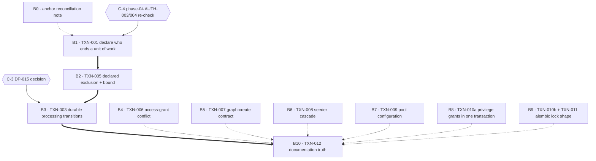

# Execution Plan — Phase 03: Database concurrency remediation

## Purpose

Turn the validated findings of audit phase 03 into a dependency-safe rollout sequence. Every block
names a semantic target, a risk assessment, the agents it needs, the implementation alternatives
where genuine technical uncertainty exists, its documentation impact, and its verification. The
plan fixes **order and risk containment**; it does not fix **implementation choices** where the
owner must choose.

## Anchor authority

> **The report's line numbers are not binding.** `VAL-03-001` and `VAL-03-002` (defects in the report
> itself) show that three cited ranges do not contain the symbols they name, and that every
> `db/starter.py` anchor plus one `config.py` anchor are stale. `8178610` and the phase-02
> configuration work moved both files again — `STALE_PROCESSING_TIMEOUT_MINUTES` drifted `387 → 574`,
> a `+187` shift the report does not know about.
>
> **Every anchor in this plan is a symbol, a module, a contract, a table or a config key.**
> Implementors must resolve targets by symbol at the moment of work, not by any number recorded here
> or in the report. If a symbol named below does not exist, that is a finding: stop and report it
> rather than substituting the nearest match.

**Concurrent work is live in this repository.** At plan time the working tree carried uncommitted
changes from phase-01 follow-up work: `src/mkobi/app.py`, `core/reconciler_lease.py`,
`core/task_queue.py`, `rq_worker_wrapper.py`, `docker/docker-compose*.yml`, `docs/SPEC.md` and
`tests/{test_app_lifespan,test_data_worker,test_rq_worker}.py`. None of them is a target of any
block below, and HEAD was still `c4c0b14` — but `tests/test_data_worker.py` is a file B3 edits, and
`docs/SPEC.md` is a file several blocks append version rows to. **B3's implementor must read that
test file before editing it**; the added material is reconciler-lease coverage and does not touch the
three `commit.assert_not_called()` assertions this plan relies on. Any block appending to
`docs/SPEC.md` must re-read it for concurrent version rows. Re-check `git status` at block start.

## Scope rulings (binding on every implementor)

**In scope — ten findings.**

| Finding | Severity | Short name |
| ------- | -------- | ---------- |
| TXN-001 | CRITICAL | Four endpoints return success for an uncommitted write |
| TXN-003 | CRITICAL | Stale-processing backstop can never fire |
| TXN-005 | MEDIUM | Rebuild serialises on a row lock with no bound |
| TXN-006 | MEDIUM | Duplicate access grant answered with 500 |
| TXN-007 | MEDIUM | One graph insert, three documented outcomes |
| TXN-008 | MEDIUM | Dev seeder deletes graphs; cascade takes datasets |
| TXN-009 | MEDIUM | No setting reaches a pool parameter |
| TXN-010 | LOW | Privilege DDL outside a transaction; f-string lock |
| TXN-011 | LOW (partial) | Alembic advisory lock: shape only |
| TXN-012 | LOW | Three documentation boundary claims are false |

**Out of scope — do not implement here.**

| Item | Home | Note for this phase |
| ---- | ---- | ------------------- |
| **TXN-002** (commit/move/enqueue handoff) | merged → **DP-001**, phase 05 | The report's `asyncio.Queue.put` analysis is **void**: `core/task_queue.py` is now RQ. The window is now a thread hop plus a Redis round trip, with the worker in a different container. Handed over as coordination item **C-1**. |
| **TXN-004** (empty overwrite wipes filter values) | merged → **DP-004**, phase 05 | Phase 05 owns the data half of that boundary. Handed over as **C-2**. |
| `mark_orphaned_uploaded_logs_failed`'s one-minute literal | **DP-015**, phase 05 | **Resolved by C-3 (option b, 2026-10-01).** Phase 03 is authorised to replace *that one literal* with the configured stale horizon inside B3; phase 05 must not apply it twice. |
| **VAL-03-001**, **VAL-03-002** | defects in the report | Not code work. Recorded by **B0**; implementors must not edit the audit corpus. |
| `tests/test_storage_manager.py` empty-list coverage gap | DP-004 seam | Not touched. |
| `tests/test_upload_api.py` order-sensitive assertions | DP-001 seam | Not touched. |

**Regression guard inherited from earlier phases.** `TOPO-001` fixed the worker's rolled-back-session
reporting bug (`0717b65`) and `TOPO-005` elected a single sweeper (`4a5db54`). B3 must not reintroduce
the first and must not assume the report's "four sweepers" hazard, which is retired.

## Block map



`solid` = hard dependency (a blocker). `double` = hard sequencing required by the report and by
this plan. `dotted` = recommended sequencing in the single-implementor queue, **not** a data
dependency — the project permits one implementor at a time, so these are ordered for review
coherence, not because B10 needs them finished.

### Coverage ledger

| Block | Findings | Root-cause group | Agents |
| ----- | -------- | ---------------- | ------ |
| B0 | VAL-03-001, VAL-03-002 | report integrity | — |
| B1 | TXN-001 | who ends a unit of work | Auditor, Planner, Validator |
| B2 | TXN-005 | exclusion mechanisms | Researcher, Planner, Validator |
| B3 | TXN-003 | constraint-enforced invariants | Planner, Validator |
| B4 | TXN-006 | constraint-enforced invariants | Planner (short) |
| B5 | TXN-007 | constraint-enforced invariants | Auditor, Planner, Validator |
| B6 | TXN-008 | schema / reference-data mutation | — |
| B7 | TXN-009 | how the store is reached | Researcher, Planner |
| B8 | TXN-010 (grants half) | how the store is reached | — |
| B9 | TXN-010 (lock half) + TXN-011 | exclusion mechanisms | Planner (short) |
| B10 | TXN-012 | documentation truth | — |

**Merges and splits, with reasons.** TXN-010 is split into B8 and B9 because its two halves touch
different files (`db/starter.py` versus `alembic/env.py`), different tiers (test-only versus every
migration) and different blast radii. TXN-011 is merged into B9 because its entire remaining scope is
the *same three statements* B9 already rewrites for the f-string rule — splitting would produce two
commits editing one code region and two reviews of the same lock. Nothing else is merged: TXN-006 and
TXN-007 share a zone but no file, no symbol and no test.

---

## B0 — Anchor reconciliation note

**Findings:** VAL-03-001, VAL-03-002 · **Severity:** report defects, not code · **Depends on:**
nothing · **Blocks:** nothing

**Scope.** A written note, carried by this plan, recording that the report's anchors must not be used
as coordinates. VAL-03-001 names three ranges that do not contain their symbols
(`user_repo.create` / `user_repo.update`, `AuthService.create_user`, and the
`dashboards_access` grant endpoint's handler chain). VAL-03-002 names every `db/starter.py` anchor
and one `config.py` anchor as stale; the phase-02 configuration work widened that drift further.
All twelve findings' *claims* survive; only their coordinates are wrong.

**What this block explicitly does not do.** It does not edit
`.ai/audit/99-validation/03-db-concurrency-validated-findings.md` or
`.ai/audit/03-db-concurrency/findings.md`. The audit corpus is not an implementation target. If the
owner wants the report repaired, that is a separate authoring task outside this plan.

**Anchor table shipped with this plan** (semantic, resolved at plan time):

| Finding | Primary symbol anchors |
| ------- | ---------------------- |
| TXN-001 | `api/deps.py::get_db_dependency` · `db/session.py::get_session` / `get_db` · `services/user_service.py::UserService.create_user` / `update_user_role` / `update_user_active_status` / `delete_user` · `api/routes/users.py::create_user_endpoint` / `update_user_endpoint` · `api/routes/admin.py::update_user_role_admin_endpoint` / `update_user_active_admin_endpoint` · `interfaces/service_interfaces.py::IUserService` · `db/repositories/user_repo.py::UserRepository.create` / `update` |
| TXN-003 | `workers/data_worker.py::_process_csv_file_async` / `_run_with_transaction` / `_update_processing_log_status` / `cleanup_stale_processing_logs` · `app.py::lifespan` |
| TXN-005 | `workers/data_worker.py::_process_csv_file_async` (the `session.begin()` boundary) · `db/session.py::get_async_engine` |
| TXN-006 | `db/repositories/access_repo.py::AccessRepository.grant_access` · `api/routes/dashboards_access.py::grant_dashboard_access_endpoint` · `db/models/access.py::DashboardAccess.__table_args__` · `interfaces/repository_interfaces.py::IAccessRepository.grant_access` |
| TXN-007 | `api/routes/graphs.py::create_graph_endpoint` · `api/routes/dashboards_graphs.py` (the handler that already maps the conflict) · `db/repositories/graph_repo.py::GraphRepository.create` · `db/models/graphs.py::Graph.__table_args__` |
| TXN-008 | `db/seeders/test_media_dash.py::ensure_test_media_dash` · `db/dev_seeders.py::run_dev_seeders` · `db/starter.py::DatabaseStarter.startup` · `db/models/aggregated_data.py::AggregatedData.graph_id` |
| TXN-009 | `db/session.py::get_async_engine` / `get_async_sessionlocal` · `db/starter.py::DatabaseStarter.startup` · `config.py::DatabaseSettings` · `alembic/env.py::run_async_migrations` |
| TXN-010 / TXN-011 | `db/starter.py::DatabaseStarter.recreate_test_database` · `alembic/env.py::run_async_migrations` / `MIGRATION_ADVISORY_LOCK_KEY` |
| TXN-012 | `docs/06-backend/architecture.md` (Step 4 and the stale-processing paragraph) |

**Agents required:** none. Delivered by this plan; it is a constraint on later blocks, not work.

**Risk:** none. **Documentation impact:** this plan only.

---

## B1 — Declare who ends a unit of work, then fix the four endpoints (TXN-001)

**Severity** CRITICAL · **Findings** TXN-001 · **Depends on** B0 (note), C-4 (phase-04 re-check)
· **Blocks** B2 (sequencing), and B10 by convention

**Problem.** `get_db_dependency` and `get_session` yield a session and close it; neither commits
nor rolls back. No middleware, no lifespan hook and no event handler ends the request's unit of
work — the report tested every place that could. `UserService.create_user`,
`update_user_role` and `update_user_active_status` contain no `commit()`; neither do their four
call sites in `api/routes/users.py` and `api/routes/admin.py`. The fourth write method,
`delete_user`, *does* commit, so the omission is three of four rather than a service-wide
convention. The security-relevant half is in `update_user_active_admin_endpoint`: it writes
`is_active` through the service and then revokes tokens in Redis — the non-transactional effect
persists while the transactional one is discarded.

**Alternative A — commit inside the three service methods (matches the established seam).**
Each of `create_user`, `update_user_role`, `update_user_active_status` ends its own transaction,
exactly as `delete_user` and `AuthService.approve_registration_request` already do (`2de4156` set
this precedent deliberately). `IUserService` gains a docstring contract saying the write is durable
on return — which is also the fix for the interface currently declaring no commit contract at all.
**Trade-off:** the seam is uniform and reviewable in one place, but a caller that needs two service
writes in one transaction cannot get it, and the four routes still hold no boundary of their own.
The security pairing in the admin deactivation endpoint still crosses a process boundary (Redis),
which no commit placement can fix — that half stays compensation-shaped and must be documented as
such.

**Alternative B — commit in `get_db_dependency` on clean exit, roll back otherwise.**
The dependency becomes the unit-of-work owner; no service changes at all.
**Trade-off:** one boundary for the whole request, which is the textbook shape and removes the
class of bug rather than three instances of it. Against it: every route that already commits in the
transport layer (14 sites across 7 route modules) would double-commit, and the four endpoints that
currently *succeed without persisting* would begin persisting — which is the intent, but it makes
the dependency's behaviour a global blast radius rather than a local one, and it interacts with the
`services` that commit mid-call (a mid-call commit would be followed by a dependency-level commit
of nothing, which is harmless, but the pattern becomes ambiguous to the next reader). Also,
`get_db_dependency` is overridden wholesale in `tests/conftest.py`, so this alternative changes what
the test suite exercises.

**Alternative C — commit at the four route call sites.**
**Trade-off:** smallest diff and the boundary sits where the request's intent is known, but it
repeats the transport-layer commit pattern the project is moving away from (see the D-3 deferral
recorded in `docs/SPEC.md` version row 3.13) and leaves the services looking non-committing, which
is what misled the audit in the first place.

**Decided.** D-1 (below) is ruled, and the Tech Lead has ruled the seam: **Alternative A** —
commit inside `create_user`, `update_user_role` and `update_user_active_status`, matching the
precedent of `delete_user` and `AuthService.approve_registration_request`. Alternatives B and C are
rejected on the record. The alternatives above stay as the reasoning of record and are not to be
re-litigated; the design that follows is settled, including the two questions the alternatives left
open (the deactivation/Redis ordering and the residual `IntegrityError`).

**Resolved by ruling — D-1.** Not R1's implementation, only its surface: after the first
create persists, the second create collides with the unique index and the existing
`ValueError` → `VALIDATION_ERROR` → **422** path fires. `ErrorCode.EMAIL_ALREADY_EXISTS` → **409**
exists in `models/enums.py` and is unused on this path; `ConflictException` already wraps it.
`tests/test_admin_user_management.py::test_create_user_duplicate_email` asserts 422 and
`docs/04-admin/admin-api.md` documents 422. See the decisions section.

**Verification.** New independent-session re-reads for the four endpoints — a second session from
the `async_session_maker` fixture, never the shared test session, which sees flushed and committed
data alike (the existing assertions at the role-update and active-status tests read only the response
body, which is serialised from the still-open session and therefore passes today). Those response
assertions are **kept and strengthened**, not replaced. `tests/test_token_revocation.py` must gain a
database-side assertion — it currently passes on the Redis half alone. The race path must be shown to
surface as **422, not 500**. The deprecated `PUT /users/{id}` surface needs its own test (AD-2: it
is live and has zero test callers today). Confirm the two methods that already commit did not gain a
second commit, and confirm `get_by_email`-based duplicate detection still runs before any insert.

**Risk assessment.**

| Kind | Assessment |
| ---- | ---------- |
| Implementation | Medium. The seam is small; the risk is choosing a placement that leaves the next service ambiguous. Mitigated by writing the contract into `IUserService` and `IAccessRepository`'s neighbours, not only into call sites. |
| Rollout | **High and irreversible in one direction.** Rows that begin persisting do not un-persist. Revert is one commit; the interim user rows need manual deletion. Any account an operator believes is a `viewer` may become `editor`/`admin`. |
| Regression | High against the current test shape — four response-only assertions plus the revocation test pass today and must be strengthened, not merely re-run. |
| Compatibility | Conditional on D-1: 422 → 409 is an observable API change for any client, and `docs/04-admin/admin-api.md` must move with it. |

**Agents required.**

- **Auditor** — deeper investigation: re-check phase-04's AUTH-003/AUTH-004 against the *pending*
  change rather than after it. Those findings assume specific role and session states; their
  assumptions must be read in `src/`/`tests/` before this block lands (coordination item **C-4**).
  This is the one place where another phase's premise, not this block's code, is the unknown.
- **Planner** — required pre-implementation design. Three commit seams, an error-contract decision,
  an interface contract to write, and a test suite that must be restructured rather than extended.
  The design question ("who ends a unit of work") is architectural, not mechanical.
- **Validator** — required. Highest-risk block in the phase: a security-relevant write path, an
  irreversible rollout consequence, and a contract change whose blast radius is invisible from any
  single file.
- **Researcher** — **not required.** The commit-ownership question is settled by this repository's
  own precedent (`delete_user`, `approve_registration_request`); no external best-practice lookup
  is needed to decide, and D-1 is an owner contract decision, not a research question.

**Documentation impact.** **No `docs/` file is edited by B1.** With D-1 ruled, no new code path
becomes reachable and no status code moves, so `docs/08-security/error-format.md` and
`docs/99-reference/error-handling-guide.md` need no edit either. `docs/04-admin/admin-api.md` keeps
its 422 row and is not touched. Two documentation defects are **deferred, not fixed here**:
`api/routes/users.py::create_user_endpoint`'s docstring claims `AppException 409` (D-1 names this a
documentation-phase defect) and `docs/06-backend/architecture.md`'s transaction-ownership statement,
which is B10's by rule. `docs/SPEC.md` gains one version row naming the plan path and the phase.

---

## B1 design ruling (Planner) — settled 2026-10-01

The two questions the alternatives left open, plus one harness fact that changes the test design.
This section is the Implementor's contract; the block above remains the reasoning of record.

### Anchor census — zero drift

All fourteen TXN-001 anchors resolve at `b646ef1` with no symbol drift. `get_db_dependency` and
`db/session.py::get_session` yield a session and close it; neither commits nor rolls back.
`UserService.create_user`, `update_user_role` and `update_user_active_status` contain no `commit()`;
`delete_user` does, which is the precedent. `UserRepository.create` and `update` do
`db.add` / `setattr` + `await db.flush()` + `await db.refresh()` and no commit. The call-site census
is exact: `create_user` has one caller (`api/routes/users.py::create_user_endpoint`),
`update_user_role` has two (`api/routes/users.py::update_user_endpoint`,
`api/routes/admin.py::update_user_role_admin_endpoint`), `update_user_active_status` has one
(`api/routes/admin.py::update_user_active_admin_endpoint`). There is no fifth caller and no
dev-seeder caller. `tests/` contains **no** `UserService` unit test, so no mock-based commit
assertion on these three methods can break.

### D-1's second bullet is real work: classify the residual `IntegrityError`

Duplicate detection happens in exactly one place — the `get_by_email` pre-check in
`UserService.create_user`, which raises `ValueError`; the route maps `ValueError` →
`VALIDATION_ERROR` → **422**. There is no unique-index detection on that path. The race's
`IntegrityError` is raised by `await db.flush()` inside `UserRepository.create`, re-raised unchanged
by the repository's `except SQLAlchemyError`, passes through `create_user` (which has no
try/except), misses the route's `except ValueError`, and lands in `except Exception` →
`INTERNAL_ERROR` → **500**. **There is no `IntegrityError` handler and no `SQLAlchemyError` handler
anywhere in `src/`.**

Commit placement does not move the error site — `flush` fires before any commit — so the classifier
must sit where the flush is visible. **Ruling: the service-level conversion, in
`UserService.create_user`, around the `user_repo.create` call.** It converts the driver's error into
the same `ValueError` the pre-check already raises, so the route's existing mapping yields 422 with
**zero route change** and the create endpoint's error contract is provably identical. A route-level
`except IntegrityError` would be the larger diff, would put a driver exception type into the HTTP
layer against the API → Service → Repository rule, and would duplicate a message the service already
owns. `EMAIL_ALREADY_EXISTS` stays unused.

**The classifier verifies before it classifies; it does not guess.** On `IntegrityError`:
roll back, re-read through `user_repo.get_by_email`; a row with that email present *is* the
duplicate-email race, so raise the existing `ValueError` (422); absent, `raise` unchanged (500). This
is sound because a PostgreSQL unique-index conflict is only raised once the conflicting transaction
has **committed** — otherwise the inserter blocks — so the winner's row is visible to the re-read.
It is driver-agnostic, duplicates no constraint-name string, and needs no new enum. The rollback is
mandatory, not optional: after a flush-time `IntegrityError` the transaction is aborted, so without
it the next statement on that session raises `PendingRollbackError` — and in tests the session is the
shared long-lived one, so the poisoning would leak into later tests.

### RISK-1 ruling — where the deactivation commit lands, and which failure B1 accepts

**The commit lands inside `UserService.update_user_active_status`, before the Redis revocation.**
That is the ruled seam (Alternative A) applied to the one write that is paired with a non-transactional
effect. No commit placement can make a Redis round trip transactional; the question is only which
partial state B1 accepts when the two halves disagree.

**B1 prefers the "durable deactivation, failed revocation" failure**, for three reasons, in order of
weight:

1. **It is fail-closed on the axis that matters.** `api/deps.py::get_current_user_dependency`
   re-reads the user row from the database on **every** authenticated request and rejects
   `is_active is False`. A committed deactivation therefore stops the user at every protected
   endpoint independently of Redis. The reverse placement fails open: an account believed
   deactivated stays fully usable and merely has its current tokens revoked.
2. **The reverse failure is silent; this one is reported.** With the commit after the revocation, a
   database fault leaves `is_active` unchanged, the user logs in again, and nothing in the response
   says the deactivation did not happen. With the commit first, a Redis fault is a 500 an operator
   sees and can retry — and the endpoint is idempotent, so the retry re-commits the same
   `is_active` and re-issues the marker.
3. **The residual exposure is bounded and enumerated.** The only paths that do not re-read
   `is_active` are `POST /auth/refresh` and the two login routes — `is_active` has **no comparison
   anywhere in `src/` outside `get_current_user_dependency`** (zero occurrences in
   `services/auth_service.py`). So a failed revocation leaves the deactivated user able to obtain
   fresh *signed* tokens, each of which is then rejected at the gate. That gap is a **new finding
   for phase 04's AUTH-004 zone**, not B1 work — see the coordination note below.

**What must therefore be true of the code, and is in B1's scope.** The route's
`except Exception → await db.rollback()` can no longer undo the write, so it must stop implying that
it can. The rollback **stays** — it is still correct for the pre-commit window, where a failure
inside `update_user_active_status` leaves the session needing one — with a comment stating what it
can and cannot undo. The revocation is additionally guarded on its own so a Redis fault is reported
as what it is (deactivation committed, revocation failed) instead of a generic 500 that reads as
"nothing happened". The status stays **500** on the existing `ErrorCode.INTERNAL_ERROR`; no new code
is introduced, so `admin_responses` keeps its declared 401/403/404/422/429/500 and gains no 409.

**What must be documented about the pairing either way.** `is_active` is the authority for protected
access; the Redis user-level marker is the authority for `POST /auth/refresh` and login. B1 makes
that split load-bearing for the first time — before it, the database half never persisted, so the
marker was the *only* thing holding. The `is_active`-authoritative check in
`get_current_user_dependency` is the mitigation that makes the preferred failure direction
acceptable; it is stated as such in the route's docstring so the next reader knows which half is
load-bearing and why the ordering is deliberate rather than accidental.

### Harness fact that changes the test design

`tests/conftest.py::async_client` replaces `get_db_dependency` wholesale, so the request's session
**is** the test's session. A re-read through that session sees uncommitted data exactly as well as
committed data and therefore **proves nothing** — every independent re-read must open a second
session from the `async_session_maker` fixture the conftest already exposes.

Second, and verified against the installed SQLAlchemy 2.0.50 rather than assumed: `Session.commit()`
calls `trans.commit(_to_root=True)` and its own docstring states that the outermost transaction "is
committed unconditionally, automatically releasing any SAVEPOINTs in effect". The fixture's
SAVEPOINT therefore does **not** isolate a production commit — `async_db_session`'s teardown rollback
cannot undo a row that a B1 commit made durable. **Every test that exercises the four endpoints must
delete the rows it commits.** Existing hard-coded emails in `tests/test_admin_user_management.py` are
mutually distinct, so no unique-index collision arises within one run, but the Implementor must not
add new hard-coded emails without a unique suffix or an explicit cleanup.

### Coordination note raised by this ruling

`POST /auth/refresh` (`api/routes/auth.py::refresh`) issues a new access token after loading the user
and checking only the two Redis revocation markers — it never tests `user.is_active`, and neither do
the two login routes. That is a **new finding in phase 04's AUTH-004 zone** ("what a revocation marker
must be able to express"), it is unchanged by B1, and B1 does not fix it. Recorded as coordination
item **C-7**.

---

## B2 — Give the aggregate rebuild a declared exclusion and a bound (TXN-005)

**Severity** MEDIUM · **Findings** TXN-005 · **Depends on** B1 (sequencing) · **Blocks** B3 (hard)

**Problem.** The worker's whole production transaction spans parse, transform, aggregate and the
aggregate writes, and the first write it takes on the shared derived-value table serialises two
concurrent rebuilds of one dashboard. No advisory lock, no `FOR UPDATE`, no `SETNX`, no
`lock_timeout` exists anywhere in `src/` or `alembic/` (the report re-derived that inventory; the only
advisory use is the Alembic lock). The deployed `lock_timeout`, `statement_timeout` and
`idle_in_transaction_session_timeout` are all `0`. A waiter holds a pooled connection for the entire
job and its status row reads `uploaded` for the whole wait, because its `processing` write is inside
the blocked transaction. That last part is TXN-003's fix and the reason B2 precedes it.

**Insertion point.** The first statement of the worker transaction — immediately after the
`session.begin()` in `_process_csv_file_async`'s production branch. That is the only place where a
transaction-scoped lock is both correct and released automatically on commit or rollback.

**Alternative A — `pg_advisory_xact_lock` with a derived key, transaction-scoped.**
One advisory lock per `dashboard_id`, taken as the transaction's first statement, released by the
transaction itself. Nothing in the system depends on the current undeclared serialisation, so the
change is additive; the wait becomes visible in `pg_locks`.
**Trade-off:** the key must be derived deterministically from the dashboard id, and the derivation
is the part with real choice (see D-2).

**Alternative B — `SELECT … FOR UPDATE` on the dashboard row.**
Reuses a row lock rather than inventing a key space; no key derivation to get wrong, and the lock
is visible in the same `pg_locks` view.
**Trade-off:** adds a row-level write intent on a hot parent row for every rebuild, and couples the
exclusion to the dashboard table's own locking behaviour (a concurrent dashboard update now waits
too). It also becomes a second, *different* serialisation alongside whatever the aggregate write
already takes — the exact ambiguity the finding is about.

**Alternative C — application-level exclusion via the existing Redis lease machinery.**
`core/reconciler_lease.py` already elects one holder among replicas for the reconciler; the same
primitive could elect one rebuilder per dashboard.
**Trade-off:** Redis is an optimisation and fails open by design in the reconciler — a lease that
fails open would give *two* concurrent rebuilders, which is a correctness hole, not a performance
one. Adopting it for exclusion would invert the primitive's stated contract. Recorded as considered
and not recommended, for that reason.

**Open decision required — D-2.** Two parts, both owner calls: the lock key shape (per `dashboard_id`
versus a single global rebuild key), and whether a session `lock_timeout` is added and how. See the
decisions section.

**Verification.** A two-session test that holds the first transaction open and proves the second
either waits (with a log line) or fails with a bound — the audit could not run this against a shared
stack, so the test is the deliverable. Confirm the lock is released on the failure path, that the
`lock_timeout` value does not leak into the pooled session's next use, and that the rollback
compensation path is untouched.

**Risk assessment.**

| Kind | Assessment |
| ---- | ---------- |
| Implementation | Medium. A wrong key derivation silently serialises everything (global) or nothing (mismatched per-dashboard keys). A wrong `lock_timeout` converts a benign wait into a failed upload the user sees. |
| Rollout | Medium. A new wait-then-error path appears in the upload flow; the failure must be reported through the existing compensation route, not swallowed. |
| Regression | Medium. Touches the transaction B3 restructures — the two blocks must not be implemented in parallel. |
| Compatibility | Low. No API or schema change. |

**Agents required.**

- **Researcher** — required. The lock-key derivation and the `lock_timeout` choice are genuinely
  multi-approach with real support and operational consequences: which PostgreSQL advisory-lock
  functions exist for a namespaced key, how a session-level timeout interacts with a
  transaction-scoped lock and with connection pooling, and what a bounded wait costs in terms of
  duplicate-job pressure. This is the one block where external knowledge changes the answer.
- **Planner** — required. Lock placement, interaction with B3's transaction boundary, the failure
  path, and the test design for a race the current suite cannot express.
- **Validator** — required. Concurrency semantics that the report could not execute against a live
  stack; an independent review of the ordering argument (A versus B) and of the timeout's failure
  behaviour is what keeps this from shipping a silent serialisation.
- **Auditor** — not required. The exclusion inventory is already re-derived and the current state is
  unambiguous.

**Documentation impact.** `docs/06-backend/architecture.md` (the processing section gains a sentence
naming the exclusion and its scope) · `docs/06-backend/configuration.md` **if** the timeout becomes
a setting — a new `STALE_*`-style key must appear in the environment-variable table · `docs/SPEC.md`
version row.

---

## B2 research (Researcher) — settled 2026-10-01

Verified against **PostgreSQL 18.6** (the `mkobi-test-test-db-1` container), **SQLAlchemy 2.0.50**,
**asyncpg 0.31.0**, **Python 3.14**. Every claim marked *verified* was executed, not inferred.
Sources: PG 18 docs ch. 9.28.10 (Table 9.109), ch. 13.3.5, ch. 19.11.1, the `SET` command page;
SQLAlchemy `dialects/postgresql/asyncpg.py` in `.venv`.

**The D-2 ruling stands.** Alternative A with a per-`dashboard_id` transaction-scoped lock plus a
bound is correct, and the two derivations the ruling forbids (`hash()`, UUID truncation) are
confirmed unsound below. Three points where the ruling's *phrasing* needs tightening are flagged in
§R2, §R7 and §Q2 — the substance is unchanged.

---

### Q1 — Advisory-lock API surface

Table 9.109 (PG 18) gives both forms; ch. 13.3.5 gives the semantics.

| Function | Scope | Waits? | Releases |
| --- | --- | --- | --- |
| `pg_advisory_lock(bigint)` · `(int4,int4)` | session | yes | explicit `pg_advisory_unlock` |
| `pg_advisory_xact_lock(bigint)` · `(int4,int4)` | **transaction** | yes | **end of transaction, automatically** |
| `pg_try_advisory_xact_lock(bigint)` · `(int4,int4)` | transaction | **no** | end of transaction |

**Key space.** Both forms address 2^64 identifiers, but the docs state they **do not overlap**
("these two key spaces do not overlap", PG 18 §9.28.10 intro). `pg_locks` distinguishes them by
`objsubid`: `1` for the 64-bit form, `2` for the two-32-bit form — *verified* (`objsubid=1` for
single-key, `objsubid=2` for `(7,9)`).

**Recommendation: the single-argument 64-bit `pg_advisory_xact_lock(bigint)`.** The two-argument
form would work, but it forces an arbitrary 32/32-bit split of a digest and buys a namespace the
single-argument form gets for free by prefixing the hashed string. Cross-type-cast traps, *verified*:

- **An unsigned Python `int` above 2^63-1 is a hard `DataError`, not a truncation.** asyncpg rejects
  it client-side: `asyncpg.exceptions.DataError: invalid input for query argument $1:
  17097208348976419244 (value out of int64 range)`. Nothing is silently wrapped, and the same value
  is *also* rejected by a server-side `CAST(:k AS bigint)`. **The derivation must emit a signed
  int64.**
- Passing the signed twin of the same 64-bit value selects **the same lock** — *verified* (the
  unsigned form errored, so the conflict test fell through to the rejection; the pg_locks rows for
  the two signed encodings of one key are byte-identical).
- `pg_locks` for the 64-bit form splits the key as `classid = key >> 32`, `objid = key & 0xFFFFFFFF`
  (both shown `::bigint`) — *verified* against `-5989693909681700314`. Operators diagnosing a stuck
  job need both halves.

Rejected: session-level `pg_advisory_lock` — **verified** it *survives a `ROLLBACK` of the
acquiring transaction*, and repeated requests stack (two acquires need two unlocks). Both make a
leaked lock outlive the work it guards, which is exactly the hazard B2 exists to remove.
Transaction-scoped is also what ch. 13.3.5 prescribes for "short-term usage".

---

### Q2 — Key derivation: do it in Python, with `blake2b`, **signed**

**Recommendation (binding on the Implementor — no further choice):**

```python
import hashlib

def dashboard_rebuild_lock_key(dashboard_id: UUID) -> int:
    """Return the signed int64 advisory-lock key for one dashboard rebuild."""
    payload = f"mkobi:aggregate-rebuild:{dashboard_id}".encode("utf-8")
    digest = hashlib.blake2b(payload, digest_size=8).digest()
    return int.from_bytes(digest, byteorder="big", signed=True)
```

`digest_size=8` gives exactly 64 bits; `signed=True` guarantees the result is inside int64 so
asyncpg can encode it. **Verified: 0 out-of-range results over 5 000 UUIDs**, and **0 collisions over
a 200 000-UUID scan** (birthday probability for a 64-bit space is ≈ 2.7 × 10⁻¹² at that scale).

**Why Python, not SQL.** `hashtextextended(text, bigint) → bigint` is the only server-side 64-bit
hash — *verified signature* `IMMUTABLE`, returns `bigint`, negative for ~half of inputs. It is
rejected for three reasons, each verified:

1. **It is not documented.** Neither ch. 9.27 nor ch. 9.28 lists `hashtextextended`, `hashtext` or
   `hashint8` anywhere — searched in full. Tom Lane, pgsql-hackers (2011-11-21): *"it's considered
   an internal function, and not one to rely on… the conclusion was that it's not documented
   because it's internal and you're not supposed to use/rely on it."* A hash whose values are not a
   stability guarantee cannot carry an exclusion.
2. **It is collation-sensitive.** Its C implementation takes `PG_GET_COLLATION()` and, for a
   non-deterministic collation, hashes `pg_strnxfrm()` output instead of the raw bytes — so the
   same UUID text hashes differently on two differently-configured databases. The test database
   is `C.UTF-8`; nothing in `docker/` pins production's `datlocale` to match.
3. **The two derivations would not agree anyway.** *Verified:* PG `hashtextextended('11111111-…',
   0)` = `-5989693909681700314`; Python `blake2b` of the same string = `3862016749269627295`. A
   mixed scheme means a test asserting one key and a worker taking another.

**Rejected derivations, with evidence:**

| Derivation | Verdict |
| --- | --- |
| Python `hash(str(uuid))` | **Forbidden by the ruling, and empirically fatal.** Two consecutive interpreter runs on the same string produced `-3773987498732540890` and `6614496956303608703`; with `PYTHONHASHSEED=1`/`2` the values changed again. `PYTHONHASHSEED` **must be set in the Dockerfile** and inherited through `rq_worker_wrapper`'s fork for this to be safe, which is a fragile invariant to add to a deployment where nothing currently sets it. |
| `uuid.int` truncated to 8 bytes | **Forbidden by the ruling, and lossy.** `UUID.int` is 128-bit; keeping the leading 8 bytes discards the low 64 and concentrates on the time_hi/time_mid bits, which are the least uniformly distributed part of a v4 UUID. |
| `int.from_bytes(uuid.bytes, "little")` | Wrong endianness. *Verified* on `01020304-…-0b0c0d0e0f10`: big-endian = `uuid.int` = `1339673755198158349044581307228491536`; little-endian = `21345817372864405881847059188222722561`. `UUID.bytes` is already network order, so `uuid.int` and `int.from_bytes(u.bytes, "big")` agree — but never "little". |
| `pg_advisory_xact_lock(int4, int4)` from a 32/32 split | Works; rejected only because it imposes an arbitrary split and a smaller effective space per namespace for no benefit. |

---

### Q3 — `lock_timeout`: **`SET LOCAL`, and it must be `set_config(…, true)`**

**Which is correct: transaction-scoped, not session-level.** *Verified on the live server:*

```
BEGIN; SET lock_timeout='250ms'; COMMIT;   SHOW lock_timeout;  ->  250ms   (LEAKS)
BEGIN; SET LOCAL lock_timeout='300ms'; COMMIT; SHOW lock_timeout; -> 0       (does not leak)
BEGIN; SET LOCAL lock_timeout='400ms'; ROLLBACK; SHOW lock_timeout; -> 0     (does not leak)
```

A session-level `SET` executed **inside** the worker's transaction would therefore leave the value
on the pooled connection after the job commits, and every later user of that connection would
inherit an unrelated timeout. That is precisely what D-2 forbids. The ruling's phrase "a session
`lock_timeout`" must be read as *the value is configured session-wide and applied per transaction*.

**`SET LOCAL` cannot take a bind parameter.** *Verified:* `SET LOCAL lock_timeout = :ms` →
`ProgrammingError: syntax error at or near "$1"`. The parameterised equivalent of `SET LOCAL` is
`set_config(name, value, is_local)` (PG 18 §9.28.1). Use:

```python
await session.execute(
    text("SELECT set_config('lock_timeout', :value, true)"),
    {"value": f"{timeout_ms}ms"},
)
```

*Verified equivalent to `SET LOCAL`*: inside the transaction `current_setting` = the value; after
commit or rollback it is back to `0`; and **0 on a fresh pooled connection after both the success
and the error path** — no leak in either direction.

**Scope: lock acquisition only.** PG 18 §19.11.1: *"this timeout can only occur while waiting for
locks"*. *Verified:* `SELECT pg_sleep(1.2)` under `lock_timeout = 300ms` ran to completion in
1206 ms. So a legitimate long aggregate write is **not** aborted — confirming why the plan rejects
`statement_timeout` as the bound.

**After the timeout the transaction is aborted and the caller must roll back.** *Verified:* the next
statement on the same session raises
`DBAPIError: <class 'asyncpg.exceptions.InFailedSQLTransactionError'>: current transaction is
aborted, commands ignored until end of transaction block`. In `_process_csv_file_async` the
`async with session.begin():` block rolls back on exit, so the shape is already correct — the lock
must be **inside** that block (see Q4).

**Ordering constraint the Implementor must respect.** SQLAlchemy 2.0 autobegins: a bare
`await session.execute(...)` before `async with session.begin():` makes the later `begin()` raise
`InvalidRequestError: A transaction is already begun on this Session`. *Verified.* Both the
`set_config` and the lock call must therefore be the **first two statements inside** the existing
`session.begin()` block.

---

### Q4 — Release semantics: automatic, and that is the whole point

Ch. 13.3.5: transaction-level advisory locks "are automatically released at the end of the
transaction, and there is no explicit unlock operation". *Verified on the live server:*

| Scenario | Result |
| --- | --- |
| Holder **commits** | waiter acquires immediately (*verified*) |
| Holder **rolls back** | waiter acquires in **6 ms** (*verified*) |
| Holder crashes / connection dies | server releases at session end (ch. 13.3.5; the lock is not tied to client memory) |
| Lock taken **before** a `SAVEPOINT`, then `ROLLBACK TO SAVEPOINT` | still held (*verified*) |
| Lock taken **inside** a `SAVEPOINT`, then `ROLLBACK TO SAVEPOINT` | released (*verified*) |
| **Session-level** lock, then `ROLLBACK` | **still held** (*verified*) |

The fourth and fifth rows matter for the test suite: `tests/conftest.py::async_db_session` is
built on `session.begin_nested()`, i.e. a SAVEPOINT. A lock taken inside that fixture is released
on its teardown rollback, which is exactly what the suite needs and is *verified* separately.

**Practical consequence for the worker's compensation path:** none, and that is the point.
`_process_csv_file_async`'s `except Exception:` handler runs **after** the `async with
session.begin():` block has exited and rolled back (the `0717b65` shape documented in the plan).
The lock is gone by then, so `_update_processing_log_status` opens its own fresh session and commits
the `FAILED` row on a connection that is not contending for anything. **B2 must not move the lock
outside the `session.begin()` block**, or the compensation write would inherit the very wait the
lock creates.

---

### Q5 — The failure path: what surfaces, and how to report it

**Exact exception, measured through SQLAlchemy 2.0.50 + asyncpg 0.31.0:**

| Layer | Value |
| --- | --- |
| asyncpg class | `asyncpg.exceptions.LockNotAvailableError` |
| `SQLSTATE` / `pgcode` | **`55P03`** (`lock_not_available`) |
| SQLAlchemy wrapper | **`sqlalchemy.exc.DBAPIError`** |
| `.orig` | `sqlalchemy.dialects.postgresql.asyncpg.AsyncAdapt_asyncpg_dbapi.Error` |
| message | `canceling statement due to lock timeout` |

`isinstance(exc, OperationalError)` is **`False`** (verified). SQLAlchemy's asyncpg dialect maps
only seven asyncpg classes (`_asyncpg_error_translate`, `asyncpg.py:1013-1021`);
`LockNotAvailableError` is not among them and falls through to the generic `PostgresError → Error`
entry. **Classifying by exception type will not work.** The only reliable discriminators are
`exc.orig.sqlstate == "55P03"` / `exc.orig.pgcode` — both verified present on the raised object —
and a substring check on the message, which is the weaker of the two.

`pg_try_advisory_xact_lock` **does not abort the transaction** — *verified*: it returned `False`
and the next statement on the same session executed normally. Useful if the Implementor prefers a
non-blocking variant, but note that the ruling chose the **waiting** form plus a bound, and a
`try`-lock would convert an ordinary queueing wait into a hard failure.

**Reporting.** The correct move is to let the existing compensation path do the work — the
exception propagates out of `session.begin()`, the `except Exception` handler in
`_process_csv_file_async` runs on its own session and writes `FAILED`. Two additions the ruling
implies and the Implementor should make:

1. **A specific log line before the lock call and one naming the wait on failure**, carrying
   `dashboard_id` and `task_id`. The current handler logs via `logger.exception(...)` with
   `error_code = _map_processing_error_to_code(e)`, and `_map_processing_error_to_code` maps an
   unrecognised message to `PROCESSING_FAILED` — which is semantically wrong for a contended
   rebuild. **`ErrorCode.PROCESSING_IN_PROGRESS` already exists** (`models/enums.py:268`, mapped to
   500, mirrored in the frontend's `errorMessages.ts` as "Data processing already in progress") and
   describes this failure precisely. It is currently **unused** in `src/mkobi/workers/`. Using it
   needs no enum change, no status-code change and no frontend change.
2. **`pg_locks` is the operator's window into the wait** — *verified*: while held,
   `pg_locks JOIN pg_stat_activity` shows the holder's `pid`, `state`, `wait_event_type`,
   `wait_event`, `granted`, and both halves of the key. A blocked waiter appears with
   `state='active'`, `wait_event_type='Lock'`, `wait_event='advisory'`, `granted=false`
   (*verified*). This is the diagnosability the finding asks for, and it needs no extra code.

---

### Q6 — Testing a race deterministically

**Do not race two coroutines.** The obvious approach — `asyncio.create_task` for the second job —
**hangs** with SQLAlchemy's greenlet bridge (*verified*: the waiter never completed and the probe
had to be killed at 180 s). Never race two coroutines on the engine.

**Deterministic pattern: hold the lock from the harness, then attempt it from a second session.**
Both sessions come from the `async_session_maker` fixture the conftest already exposes; the holder
is opened first and not closed, so the ordering is fixed by the test, not by the scheduler. Four
tests, all sub-second:

| # | Test | Construction | Assertion |
| --- | --- | --- | --- |
| 1 | **Second acquisition times out with the bound** | session A: `async with a.begin(): await acquire(A)`; session B: `async with b.begin(): await acquire(B)` with a **200–500 ms** `lock_timeout` | raises `DBAPIError`, `.orig.sqlstate == "55P03"`; A still holds |
| 2 | **Release on rollback** | A acquires inside `async with a.begin():` then **raises** (or `await a.rollback()`); B then acquires | B succeeds with no exception |
| 3 | **Release on commit** | A acquires and commits; B then acquires | B succeeds |
| 4 | **Different dashboards do not collide** | A holds key(K1); B acquires key(K2) for a different `dashboard_id` | B succeeds immediately — proves the exclusion is *per dashboard*, not global |

Test 4 is the one that catches the two silent-failure modes the plan warns about: a single global
key passes tests 1–3 and fails 4, and a mismatched per-dashboard key fails 1. **Both must exist.**

**Two more cheap tests, no concurrency at all:**

- **Derivation is stable and distinct:** assert `key(uuid_a) == key(uuid_a)` across two calls,
  `key(uuid_a) != key(uuid_b)`, and that every value satisfies `-(2**63) <= k < 2**63`. This is a
  pure function; it needs no database and it is the guard against the `hash()` mistake returning.
- **`lock_timeout` does not leak:** acquire with a 30 s `lock_timeout` inside a transaction, commit,
  then on a fresh session assert `current_setting('lock_timeout') == '0'`. This is the "must not
  leak into the pooled session's next use" assertion D-2 requires. Repeat on the **error** path.

**Note on the existing suite:** the three `mock_session.commit.assert_not_called()` assertions in
`tests/test_data_worker.py` use `AsyncMock`, so any new SQL statement in `_process_csv_file_async`
changes `mock_session.execute` call counts in the existing mock-based tests. Read that file before
editing (the plan already flags it as concurrently modified).

---

### Q7 — Operational caution

**Changing `lock_timeout` from `0` is safe, and only because it is transaction-scoped.** *Verified*:
`set_config(..., true)` leaves `current_setting('lock_timeout') = 0` on the connection after both
commit and rollback. A **session-level** `SET` would not be safe — it would persist on the pooled
connection and silently bound every unrelated lock wait in the process. This is the single strongest
argument for the `SET LOCAL` shape and should be stated in the code comment.

| Trap | Assessment |
| --- | --- |
| `pool_pre_ping=True` (set on the application engine) | **Safe.** Pre-ping runs on checkout, before the transaction begins; a connection holding a lock is not on the checkout path. *Verified* that a holder keeps its lock while another session attempts and fails to take it. |
| `pool_recycle` | **Safe, and note it is currently `absent` from `get_async_engine`.** Recycle closes a connection at checkout; a connection inside an open transaction is never being checked out. |
| Connection returned to the pool mid-transaction | **Cannot happen via the worker.** *Verified*: `session.close()` with an open transaction rolls back and releases the lock. `process_csv_background_sync` additionally calls `dispose_engine()` in a `finally` on the same loop, so the RQ work-horse cannot leave a lock-bearing connection behind. |
| `idle_in_transaction_session_timeout` | **Does not protect you, and does not endanger you.** *Verified*: a session blocked on `pg_advisory_xact_lock` reports `state='active'` with `wait_event='Lock'`, **not** `idle in transaction`. With that killer set to 700 ms and a 2 500 ms lock wait, the failure still came from `lock_timeout` at 2 507 ms. A job that *is* genuinely idle in transaction (e.g. a very long aggregate with no statement in flight) would still be killed by it — which is the right behaviour, and another reason not to enable it in this phase. |
| Advisory-lock memory | Ch. 13.3.5 warns the shared pool is bounded by `max_locks_per_transaction × max_connections`. One lock per concurrent rebuild is negligible against that. |
| Shared memory exhaustion | Not a concern at this scale; no note needed in code. |

**One live gap the Implementor should know about but not fix here:** `pg_try_advisory_xact_lock`
returning `False` does not abort the transaction, but the *timeout* path does. Any code path that
catches the timeout and continues issuing statements on the same session will hit
`InFailedSQLTransactionError` — so the compensation write **must** happen on a fresh session, which
is precisely what `0717b65` already established.

---

### R-flags — where the ruling's phrasing needs tightening

Three points where the wording is loose but the substance is right. None overturns D-2.

1. **"a session `lock_timeout`" → transaction-scoped application.** A literal session-level `SET`
   leaks onto the pooled connection after commit (*verified*). The ruling's own requirement that
   "`lock_timeout` must not leak into the pooled session's next use" is only satisfiable by
   `SET LOCAL` / `set_config(…, true)`. **The ruling is self-consistent under that reading**; the
   Implementor must not write a bare `SET lock_timeout`.
2. **"taken as the transaction's first statement" → first *two* statements.** `SET LOCAL` cannot be
   parameterised, so the bound is applied by `set_config(…, true)`, which must precede the lock call
   and follow it inside `session.begin()`.
3. **`hash()` is not merely "not ideal" — it is actively broken here, and the safest fix is the one
   recommended.** *Verified*: consecutive interpreter runs disagreed. Note the deployment does **not**
   set `PYTHONHASHSEED` anywhere (no `ENV` entry in `docker/docker-compose*.yml`, no `Dockerfile`
   `ENV`), so a `hash()`-derived key would produce a **different lock in every one of the four
   `--workers 4` replicas** and in the `rq-worker` container. The ruling's rejection is not
   theoretical.

**Recommended `DatabaseSettings` field.** `lock_timeout_ms: int = Field(default=180_000, ...)` on
`DatabaseSettings`, exposed as `DATABASE__LOCK_TIMEOUT_MS` — consistent with the `DATABASE__*`
prefix the nested settings model already uses. **180 000 ms (3 min)** is the recommendation: long
enough that a genuine 100 MB upload (`max_file_size_mb = 100`, `config.py:462`) plus aggregation
never trips it, short enough that a wedged holder is reported well inside the 30-minute
`stale_processing_timeout_minutes` backstop. The bound must sit **below** the stale horizon, or a
lock wait would outlive the mechanism meant to clean it up.

### B2 design ruling (Planner, 2026-10-01) — settled, not open

The research closes Q1–Q7. The four decisions below are now made; the Implementor should build, not
re-derive. The full task is `.ai/tasks/B2-txn-005-rebuild-exclusion.yaml`.

**Placement — `src/mkobi/db/advisory_lock.py`, a new small module in the persistence layer.** Not
`utils/`, which holds session-free helpers (`file_utils.py`, `validators.py`), and not `core/`,
whose `reconciler_lease.py` documents itself as "a load-and-observability optimisation, never a
correctness gate" — the opposite of this mechanism, which is a correctness gate and is bound to
`AsyncSession` and to PostgreSQL semantics. Five members: the namespace constant, the SQLSTATE
constant, the pure derivation, the async acquisition, and the failure predicate.

**The lock sequence**, inside `_process_csv_file_async`'s session-owning branch, between
`async with session.begin():` and the `_run_with_transaction` call:

```python
async with session.begin():
    await acquire_dashboard_rebuild_lock(session, dashboard_id, task_id=task_id)
    return await _run_with_transaction(session)
```

with, inside the helper, `set_config('lock_timeout', :value, true)` and then
`pg_advisory_xact_lock(:lock_key)`. Three constraints are load-bearing and belong in comments at
the call site: SQLAlchemy autobegins, so neither statement may move above `session.begin()`;
`set_config`'s third argument is the transaction scope, which is why it is used at all (`SET LOCAL`
cannot take a bind parameter, and a bare `SET` would survive `COMMIT` on the pooled connection);
and the block must not be widened or narrowed around the lock, because the compensation handler
runs after it has rolled back and depends on the lock being released by then.

**Reporting.** No new enum, no status-code change, no migration, no frontend change:
`ErrorCode.PROCESSING_IN_PROGRESS` exists and `ProcessingLog.error_code` is `String(50)`. The
classification is one new **first** branch in `data_worker.py::_map_processing_error_to_code`,
reached from both `except Exception` blocks of `_process_csv_file_async`, keying on
`DBAPIError.orig.sqlstate == "55P03"`. It must be first, so the answer never depends on driver
message text. Its stored value reaches the client through `DataService.get_processing_status` →
`ProcessingStatusResponse.error_code`, and the frontend already knows the code. The HTTP mapping is
irrelevant on this path — the code is stored, not raised — so this is **not** a 409.

**Two corrections to the research's Q6, from the test-harness census.** (1) The non-leak assertion
must be on the **same session** immediately after commit and after rollback:
`conftest.py::async_test_engine` is built on `NullPool`, so a fresh-session assertion reads `0`
whether or not the implementation leaks and proves nothing. (2) The three `commit.assert_not_called()`
assertions named as at risk are not reachable by this block — they live in `TestDataWorker`, which
drives `_update_processing_log_status` directly, a function B2 does not touch. What *does* reach the
new statements is `tests/test_file_cleanup.py::TestProcessingFailureReportedOnOwnSession`, the only
existing test that drives the production branch, via an `AsyncMock` session; it passes unchanged
**provided the helper never consumes an `execute` result**. Every other worker test in `tests/`
passes `db_session=async_db_session` and takes the caller's-session branch.

**Documentation.** One additive row in the `docs/06-backend/configuration.md` environment-variable
table, because this block creates the operator-facing `DATABASE__LOCK_TIMEOUT_MS`. No
`architecture.md` (that is B10's) and no `docs/SPEC.md` version row — B1 landed without one, and
the phase close records one row for the whole phase. The pre-existing absence of
`STALE_PROCESSING_TIMEOUT_MINUTES` and `STALE_PROCESSING_CLEANUP_INTERVAL_SECONDS` from that table is
recorded drift for the phase close, not this block's to fix.

---

## B3 — Make the processing-log transitions durable (TXN-003)

**Severity** CRITICAL · **Findings** TXN-003 · **Depends on** B2 (hard), C-3 (**resolved 2026-10-01** — option (b), authorised)
· **Blocks** B10 (hard)

**Problem.** `_run_with_transaction` writes `PROCESSING` and `started_at`, then the aggregates, then
`COMPLETED` — all inside one `session.begin()` block opened by `_process_csv_file_async`. From every
other connection the row is `uploaded` until it jumps to `completed`. The only code that commits a
`processing` row is `DataService.trigger_processing`, and it has no route caller. Consequently
`cleanup_stale_processing_logs` has no input: `timeout_minutes=0`, whose cutoff matches every
`processing` row regardless of age, marked zero rows. A worker killed mid-job leaves nothing for the
sweep to find, which is the residue `TOPO-001` also filed.

**What must move, and what must not.** The `PROCESSING` transition commits before the work begins;
the terminal transition commits after. Two things stay exactly where they are: the temp-file
deletion inside the transaction body (it is correct there — deleting after the commit would leak a
file when the commit fails), and the failure compensation that reports `FAILED` on its own session
after the rolled-back transaction exits (`0717b65`). B3 must not regress either.

**Preferred shape.** Keep `_update_processing_log_status` **non-committing** and move the boundary to
the caller. This preserves the three `mock_session.commit.assert_not_called()` assertions in
`tests/test_data_worker.py`, which are a contract worth keeping: the helper writes, the caller
decides. The alternative — making the helper commit — is faster to write and destroys that contract.

**Coordination blocker — RESOLVED.** With a committed `processing` state, `mark_orphaned_uploaded_logs_failed`
(one-minute literal, boot-time only) and `cleanup_stale_processing_logs` (periodic) declare two different
answers to one question ("is this job stale?"). The literal belongs to **DP-015**; **C-3 was ruled on
2026-10-01 as option (b)** — phase 03 is authorised to replace *that one literal*, inside B3, with the
configured stale-processing horizon the periodic sweep already uses, and nothing else of DP-015. See the
C-3 *(resolved)* row in the coordination ledger. (Precision: the two predicates are disjoint by status —
`UPLOADED` vs `PROCESSING` — so there is no write-write collision on one row; the defect is a divergence
of meaning, plus the concrete hazard that a queued-but-unstarted row is flipped to `FAILED` by any
worker restart and then flipped back to `completed` by the job that eventually runs.)

**Verification.** A test asserting that a row is observable as `processing` from an independent
connection while the job is in flight — the audit's own probe, turned into a test. A test that the
terminal transition commits after the aggregate write and that a mid-job failure still yields one
`FAILED` row written on a fresh session. Confirm the existing `commit.assert_not_called()` trio still
passes unmodified.

**Risk assessment.**

| Kind | Assessment |
| ---- | ---------- |
| Implementation | High. The transaction is shared with the aggregate write; a boundary placed one statement wrong either publishes a half-built state or loses the failure report. |
| Rollout | **High.** `cleanup_stale_processing_logs` becomes live for the first time — a genuinely stuck worker will start producing `failed` rows it has never produced. That is the intent and it will look like a regression the first time it fires. Also: the polling client starts rendering a `processing` state it has never been given, including `progress: 50` that no client has observed. |
| Regression | High against `TOPO-001` and `TOPO-005`. Preserve the own-session `FAILED` report; preserve the single elected sweeper (the report's four-sweeper hazard is retired). |
| Compatibility | Low on the wire; the status *values* observed by clients change. |

**Agents required.**

- **Planner** — required. Splitting one transaction into three ordered commits, keeping the file
  deletion inside the middle one, keeping the compensation on its own session, and restructuring
  three existing assertions is a design task with a narrow correctness window.
- **Validator** — required. CRITICAL, in the same code region two earlier phase-01 commits just
  repaired, with a rollback-compensation path that a plausible-looking edit silently breaks. An
  independent read that the failure path still reports on a session that has actually rolled back
  is the check that matters.
- **Auditor** — not required; the defect and its anchors are fully re-derived.
- **Researcher** — not required; the remedy is mechanical once the boundary is chosen.

**Documentation impact.** `docs/03-processing/processing-api.md` (the status pipeline now has a
committed `processing` stage; the pipeline diagram and the "Background Processing" section) ·
`docs/07-frontend/upload-ui.md` (the polling client renders a state it has never been given —
confirm the renderer's mapping covers `processing`) · `docs/00-overview/data-flow.md` (its status
tracking line lists `started → uploaded → processing → success/failed` and is currently describing
an intent, not a behaviour) · `docs/06-backend/architecture.md`'s stale-processing paragraph is
**B10's** — do not edit it here, or B10 will write it twice. · `docs/SPEC.md` version row.

**B3 design ruling (Planner) — settled 2026-10-01.** Task: `.ai/tasks/B3-txn-003-durable-processing-transitions.yaml`.

- **Two ordered commits, not three.** Commit 1 is a short own-session transaction containing exactly
  the `PROCESSING` + `started_at` UPDATE, obtained by calling `_update_processing_log_status` with
  **no session argument** so it reuses the helper's existing production branch — the same shape
  `0717b65` established for the `FAILED` compensation. `get_session()` closes the session at block
  exit, so that connection returns to the pool *before* the main transaction's session is opened: no
  dangling session, no extra simultaneous pool pressure. Commit 2 is the **unchanged main
  transaction**: B2's lock still first, then `_store_aggregates`, the success-path unlink, and
  `COMPLETED`. The `COMPLETED` write **stays inside the main transaction** next to the aggregate
  write — that is what preserves "never `completed` with aggregates that did not commit". No third
  commit is needed or wanted.
- **`_update_processing_log_status` stays non-committing**; the boundary moves to the caller, in both
  branches. The production branch passes no session; the test branch passes `session=db_session` and
  stays non-committing inside the fixture's SAVEPOINT. Test mode must **not** gain a durable commit:
  `Session.commit()` commits to the root and releases the SAVEPOINT, so `async_db_session`'s teardown
  rollback could not undo it. That asymmetry is deliberate — record it so a later block does not
  "fix" it.
- **Lock ordering: `PROCESSING` commits *before* the lock, and that is the only correct order.** The
  lock is transaction-scoped (released on commit *and* rollback), so a `PROCESSING` commit after the
  lock would release the lock at that very commit and destroy B2's exclusion; a `PROCESSING` write
  after the lock but inside the main transaction would not be durable at all. Consequences accepted:
  a waiter now reports `processing` (not `uploaded`) for its whole lock wait — the honest state and
  the fix for the complaint B2 recorded — and the 3-minute `DATABASE__LOCK_TIMEOUT_MS` bound must stay
  well below the 30-minute stale horizon, so a waiter cannot be swept while legitimately waiting.
- **C-3 resolved to one number.** `mark_orphaned_uploaded_logs_failed` gains keyword-only
  `timeout_minutes: int | None = None`; `None` resolves `get_config().stale_processing_timeout_minutes`,
  the exact setting `lifespan` already hands the periodic sweep. `DEFAULT_STALE_PROCESSING_TIMEOUT_MINUTES`
  must never become this function's answer, and no new key is added. `app.py` is **not edited** — its
  two lease-guarded boot call sites keep working with no arguments, which is what keeps
  `test_app_lifespan.py`'s five patch sites and the boot-only pin green.
  *Precision the Implementor must not get wrong:* the two predicates are **disjoint by status**
  (`UPLOADED` vs `PROCESSING`), so there is no write-write collision on one row. What C-3 removes is a
  divergence of meaning — two constants declaring one concept. The concrete new hazard B3 creates is
  that a row still reading `UPLOADED` now means only "not picked up yet": on any worker restart a
  one-minute cutoff flips queued-but-unstarted rows to `FAILED`, and the still-queued job then flips
  them back to `completed`. Do not describe the fix as two sweeps racing over one row.
- **Test strategy — no coroutine racing.** The audit's independent-connection probe becomes a test that
  reads the row from a second session **from inside the job's own flow**, at a patched seam, while the
  worker is a single awaited call. B2's research established that racing two coroutines through
  SQLAlchemy's greenlet bridge hangs; the assertion is sequenced into the flow instead of run
  concurrently with it. Every new test must be shown to **discriminate** — i.e. confirmed to fail
  against the pre-fix shape.
- **`docs/SPEC.md` gets no version row.** Neither B1 nor B2 added one; the phase close records a single
  row for the whole phase. This overrides the block section's earlier mention of a row.
- **Frontend renderer finding (verified, documentation only — no frontend change).**
  `UploadModal.tsx` stores the polled status into `FileUploadState.processingStatus`, but **no render
  branch reads that field**; the visible state comes from `FileUploadState.status`, whose
  `FileUploadStatus` enum has only `PENDING | UPLOADING | SUCCESS | ERROR`, and the mapping reacts to
  exactly two values (`failed` → `ERROR`, `completed` → toast). `statusData.progress` is **never read
  anywhere in the frontend**, so the new `progress: 50` is never displayed. `useProcessingStatus` keeps
  polling until `COMPLETED`/`FAILED`, so `processing` is a harmless non-terminal value: **nothing the
  user sees changes**. The gap is a documentation correction in `docs/07-frontend/upload-ui.md`, whose
  lifecycle table currently documents a `processing` state the modal does not render.
- **Do not regress `0717b65`.** `tests/test_file_cleanup.py::TestProcessingFailureReportedOnOwnSession`
  must pass **unmodified**, including
  `test_failure_before_transaction_begin_reports_failed_not_nameerror`. The new early `PROCESSING`
  call is captured by that class's own `_update_processing_log_status` mock and carries no `FAILED`
  status, so its "exactly one FAILED write" assertion remains true. If it needs editing, the design is
  wrong.
- **Out-of-scope, named so it is not re-litigated:** TXN-002 → DP-001 (the producer-side enqueue race,
  and the false "proper transaction atomicity" comment at `services/file_processing.py`) · TXN-004 →
  DP-004 · the rest of DP-015 · B1, B2 and B7 territory · `docs/06-backend/architecture.md`'s
  stale-processing paragraph (B10's) · `docs/00-overview/data-flow.md`'s **"Transaction safety" bullet**
  — it claims the file move happens *after* the commit and is false today, but it is DP-001's defect
  and B3 edits a neighbouring bullet in that file · no Alembic migration.

---

## B4 — Make a duplicate access grant the repository's own no-op (TXN-006)

**Severity** MEDIUM · **Findings** TXN-006 · **Depends on** nothing

**Problem.** `dashboard_access` has a composite primary key on `(user_id, dashboard_id)`.
`AccessRepository.grant_access` reaches it by read-then-insert and defines a no-op branch
("Access already exists") for the case it can see. Two simultaneous grants both observe `None`, both
insert, and the loser receives the driver's error, which `except SQLAlchemyError` re-raises and the
route's terminal handler maps to **500** — for an intent the repository treats as a no-op, with the
data correct afterwards. `DashboardService.grant_access` discards the returned object and cannot
report the difference.

**Implementation shape.** `pg_insert(…).on_conflict_do_nothing(...)` in the repository — the pattern
`docs/SPEC.md` already names as the project's own correct form, and one `data/storage/manager.py` and
the seeders already use. The route then maps a surviving `IntegrityError` to a conflict
(`ErrorCode.DUPLICATE_RESOURCE`, already mapped to 409) rather than letting it fall through to
`INTERNAL_ERROR`.

**The real design question (Planner's, not the report's).** With `on_conflict_do_nothing` there is
usually **no** `IntegrityError` left to map — the conflict is absorbed by the database. So the route
mapping and the repository change answer different halves of a race that can only lose in one place.
The Planner must decide and record: is a duplicate grant reported as **200 with the no-op body**
(idempotent, matching the repository's existing defined branch) or as **409** (surfacing the race)?
Both are defensible; the doc table in `docs/02-dashboards/dashboards-api.md` currently lists neither
for this endpoint, which is itself the gap.

**Verification.** A test that grants twice for the same `(user, dashboard)` and asserts the chosen
status and body; a two-session test that forces the race through the repository rather than hoping
to hit it over HTTP (the report's own note is that eight concurrent HTTP grants did not reproduce
it — the window is narrow and the test must not depend on winning it). Confirm `IAccessRepository`'s
declared return type still describes what the implementation returns.

**Risk assessment.**

| Kind | Assessment |
| ---- | ---------- |
| Implementation | Low. One repository method, one handler chain, no schema change. |
| Rollout | Low. Idempotent; nothing that works today stops working. |
| Regression | Low. Existing tests assert 200 on the success path; the duplicate path is currently untested, so there is little to break. |
| Compatibility | Medium if 409 is chosen — the documented outcome for a duplicate grant changes from undocumented to documented-as-409. Low if 200 is chosen. |

**Agents required.**

- **Planner** — required, short. Not for the SQL (it is one statement and the pattern is established
  in-repo) but for the idempotency contract: which of the two reportable outcomes the endpoint
  promises, and the matching doc and interface edits. Choosing wrong here bakes a contract into
  three places.
- **Auditor / Researcher / Validator** — not required. Single-handler, established idiom, no
  irreversible consequence, and the existing tests cover the path that matters.

**Documentation impact.** `docs/02-dashboards/dashboards-api.md` (§"Grant Dashboard Access" error
table gains the duplicate row that is currently missing) · `docs/SPEC.md` version row.

### B4 design ruling (Planner, 2026-10-01) — settled

Task: `.ai/tasks/B4-txn-006-access-grant-conflict.yaml`. The block's open design question is
closed; the two claims below are corrections to the block section.

**B4-IDEM — a duplicate grant is `200` with the same body, not `409`.** `DUPLICATE_RESOURCE` is
not used, the route's handler chain is **not** edited, and `DashboardService.grant_access`'s
`-> bool` is **not** changed. Four reasons, in order of weight. (1) The *non-racing* duplicate
already answers 200 today, so 409 would give **one conceptual condition two statuses**, decided
by whether you won a race — the shape Tech Lead ruling **D-1** rejected for B1 as the worst of
its three options. (2) `on_conflict_do_nothing` makes the racing and sequential duplicates the
**same statement converging on the same return**; a 409 could only be produced by re-introducing
the read that caused the defect, so choosing it adds back the very mechanism this finding is
about. (3) The desired end state is "a grant exists for this pair"; the report's own consequence
is that a client retrying on 5xx hammers a request whose precondition is already satisfied. (4)
The repository's defined no-op branch already ruled: it logs "Access already exists" and returns
the row.

**Compatibility consequence.** 500 → documented-200. No published status code is removed,
`responses=admin_responses` gains nothing, and the OpenAPI operation is byte-identical
(`tests/test_openapi.py::TestOpenAPIErrorSchemas` is the pin). The doc table gains **one** row.
The only frontend reference is `frontend/src/features/admin/api/adminApi.ts::grantDashboardAccess`
— exported but **uncalled**, typed `Promise<void>`, no conflict handling — so no shipped client
changes behaviour. `IAccessRepository.grant_access`'s signature is unchanged (phase 08's
`C08-11`), only its docstring gains the contract. The report's "the service discards the
returned object and cannot report the difference" **stops being a defect**: the contract no
longer asks it to.

**No classifier, and no `IntegrityError` clause anywhere — including the route.** B1 needed
verify-then-classify in the service because its conflict target was a unique index on a
caller-supplied column and telling "duplicate email" from every other `IntegrityError` needed a
re-read. Here the conflict target *is* the primary key that defines the row, so
`on_conflict_do_nothing(index_elements=["user_id", "dashboard_id"])` absorbs it with no residue
and there is nothing to verify. Adding a clause would be dead for this race, would put a driver
exception type in an HTTP handler (which B1's ruling forbids), and would silently reclassify
two other findings' behaviour — the `permission` native-enum rejection (phase 08's `VAL-08-008`)
and the `user_id`/`dashboard_id` foreign-key violation. Both keep today's 500 and stay theirs.

**Two corrections to the block section, recorded so they are not repeated.** (i) "`data/
storage/manager.py` and the dev seeders already use `on_conflict_do_nothing`" is **wrong** for
`manager.py`: `StorageManager.upsert_aggregate` and `._bulk_upsert` use `on_conflict_do_update`.
The only `on_conflict_do_nothing` in `src/` is `db/seeders/test_media_dash.py::ensure_test_media_dash`.
The idiom to match is therefore the **seeder's**, plus `manager.py` for statement shape — and
specifically **not** the seeder's *bare* `on_conflict_do_nothing()` (its filter-binding insert),
which would absorb a foreign-key or enum violation and report it as a successful no-op.
(ii) **No `docs/SPEC.md` version row**, overriding the block section: B2's and B3's rulings both
declined one and the phase close records a single row for the whole phase.

**Test strategy.** The race is forced through the repository, never over HTTP — the report's own
note is that eight concurrent HTTP grants did not reproduce it. Two sessions from the
session-scoped `async_session_maker`; the ordering is fixed by the test, not the scheduler; no
two racing coroutines through the greenlet bridge (B2's research had to kill that probe at 180 s).
The sharpest discriminator needs no concurrency at all: execute the production
`pg_insert(...).on_conflict_do_nothing(...)` against a **committed** conflicting row and assert
it raises nothing and returns no row — pre-fix that is `IntegrityError`/`23505`. Every new test
must be shown to discriminate, per B3's ruling.

**The one misreading to name in the commit body.** Phase 08's `QLT-001` says a re-grant is a
silent no-op that reports success while writing nothing, and its remedy is the *opposite*
direction — make the re-grant write `permission`, or answer 409. B4 deliberately **preserves**
the no-op (a re-grant still returns the existing row unchanged and the stored permission is still
the first request's value, asserted by test) because that is not TXN-006's defect. Phase 08 owns
it; if the two conflict, phase 08 wins and B4's docstring and test move with it.

---

## B5 — Settle the graph-create contract (TXN-007)

**Severity** MEDIUM · **Findings** TXN-007 · **Depends on** nothing

**Problem.** One unique index on `(dashboard_id, name)` is reached by two mounted routes with two
implementations and three published outcomes. The dashboard-scoped route maps `IntegrityError` to
`DUPLICATE_RESOURCE` (409) and documents 409. The global route declares `409` in its own OpenAPI
`responses` block, has no `IntegrityError` clause, falls into `except Exception`, and returns **500**
— while the API doc's error table for that same endpoint says **422**. `docs/SPEC.md` presents the
two as parallel surfaces. Separately, `GraphRepository.create` wraps every
`SQLAlchemyError` identically, so a constraint violation is indistinguishable from a connection
failure by the time it reaches either route.

**Open decision required — D-3.** Two viable shapes; the report presents this as a genuine choice,
not as vagueness.

**Alternative A — handle `IntegrityError` in the global route, matching the scoped route.**
Add the same `IntegrityError` clause, so both surfaces emit 409 and the OpenAPI declaration the
route already carries becomes true. The doc's 422 row moves to 409.
**Trade-off:** smallest change, restores a declared contract, keeps both endpoints. It also leaves
two code paths where one would do, and it leaves the repo's blanket `except SQLAlchemyError`
converting the conflict into something only the route can re-classify.

**Alternative B — delete the global route.**
One creation surface, one contract, one implementation; the OpenAPI stops advertising a route that
does not exist.
**Trade-off:** removes a public endpoint. The consumers must be identified first (**Auditor** — see
below). The scoped route's `409` doc becomes the only published contract. If any external consumer
exists, this is a breaking change and belongs in a deprecation cycle, not a remediation commit.

**Auditor task attached to this block.** Alternative B cannot be costed without an inventory of who
creates graphs through the global surface: `tests/test_graphs.py` calls it, `docs/11-guides/` may
show it, and the frontend's graph surface must be checked for the scoped path only. Establish that
inventory **before** the decision, so D-3 is decided on evidence rather than on the report's
assertion that the two are parallel.

**Independent of the choice.** `GraphRepository.create` should stop collapsing a constraint
violation into an indistinguishable error. That is a repository concern and holds under either
choice.

> **Superseded by the B5 design ruling below.** `GraphRepository.create`'s handler is a **bare
> `raise`**, so an `IntegrityError` already reaches either route **intact** (PEP 3134). There is no
> error collapse to undo, and the repository is **not** a correctness prerequisite for the fix. The
> same correction voids the sentence in this block's *Problem* paragraph that says a constraint
> violation is "indistinguishable from a connection failure by the time it reaches either route".

**Verification.** A test per surviving route for the duplicate-name case asserting the agreed
status, and a test that a name conflict does not surface as 500 on any route. If B is chosen, a
test that the route is absent and the OpenAPI no longer advertises it.

**Risk assessment.**

| Kind | Assessment |
| ---- | ---------- |
| Implementation | Low under A; Medium under B (a removed route must not leave a dangling declaration, doc section or test). |
| Rollout | Low under A; **High under B** — an endpoint removal is externally visible. |
| Regression | Low. The success paths are untouched; only the conflict classification changes. |
| Compatibility | **High under A** if the doc's 422 becomes 409 — a client keying on 422 must change. Under B, breaking by design. |

**Agents required.**

- **Auditor** — required. The delete option's cost is unknown until every consumer of the global
  route is enumerated across tests, docs and the frontend; that is exactly a deeper investigation,
  and getting it wrong destroys a working endpoint.
- **Planner** — required. Two shapes with different documentation, OpenAPI and test consequences;
  plus the repository's error-collapse change that belongs to whichever is chosen.
- **Validator** — required under either option, because the outcome is an externally visible API
  contract change and the doc must agree with it. Conditional strength: mandatory for B.
- **Researcher** — not required. REST duplicate-resource semantics are settled; the trade-off is
  entirely local.

**Documentation impact.** `docs/02-dashboards/dashboards-api.md` (§"Create Graph" error table and,
under B, its removal; §"Create Graph for Dashboard" stays as the single contract) ·
`docs/SPEC.md` (the line presenting the two surfaces as parallel) · `docs/11-guides/extend-graphs.md`
only if it shows the global route. Under B, every doc that presents the two as parallel must be
  found and corrected in the same pass.

---

## B5 design ruling (Planner) — settled 2026-10-02

D-3 stands and is now **stronger**. This section is the Implementor's contract; the block above and
the D-3 ruling remain the reasoning of record, with two sentences of them corrected below.

### Correction 1 — the repository does not collapse the exception (a route clause works today)

The block's claim that `GraphRepository.create` "wraps every `SQLAlchemyError` identically, so a
constraint violation is indistinguishable from a connection failure by the time it reaches either
route" is **false**. Its handler is a **bare `raise`**, so `IntegrityError` arrives at the route
**intact** — confirmed statically (PEP 3134), by an executed probe, and empirically by the shipped
user-write fix, whose classifier depends on exactly this property through a byte-identical handler in
the user repository and whose tests drive a real unique-index violation through it.

**Consequence: `api/routes/graphs.py::create_graph_endpoint` gains an `except IntegrityError` clause
mapping to `ErrorCode.DUPLICATE_RESOURCE` (409), with no repository change required.** The route
change is the whole fix. The repository's only real defect is that its `logger.error` omits
`exc_info=True`; that is a **one-line logging symmetry fix**, optional and explicitly **not** a
correctness prerequisite. Do not invent a re-raise wrapper the code does not need.

### Correction 2 — the 500 is the ordinary path, not a race

**There is no name pre-check anywhere on the graph-create path.** `GraphRepository.create` goes
straight to `Graph(**kwargs)` + `db.add` + `db.flush`; neither route calls
`get_by_name_and_dashboard`, which exists and has no caller in `src/`. A **sequential** duplicate
name therefore always reaches the unique index and always produces the **500** today. The
documentation's `422` row was never met by anything.

**Consequence: the test is trivially deterministic** — post the same `(dashboard_id, name)` twice
over HTTP and assert 409 on the second. No repository double, no defeated pre-check, no two-session
race and no timing. That is materially cheaper *and* stronger than what the block above assumed.

### Consumer inventory — the "delete the global route" option is closed

The global route has **one** HTTP consumer in the repository (a single admin-create test in
`tests/test_graphs.py::TestGraphsAPI`), **zero** frontend consumers (the frontend never creates,
updates or deletes graphs through either route — the dashboard API module and the admin API module
make no graph calls at all), **zero** in-process consumers, and **four** documentation statements.
Nothing anywhere relies on the current 500 or on the documented 422; the audit corpus's probes of
it are auditor-authored, not consumers.

Had the delete option been chosen it would have **silently removed graph creation for a non-admin
holding an `admin` dashboard grant**, which the dashboard-scoped route refuses (its
`require_admin_role` admits only global admins). **The scoped route is not a drop-in equivalent** —
not of the caller set, and not of the URL surface: the mounted paths are disjoint
(`POST /api/v1/graphs/` versus `POST /api/v1/dashboards/{dashboard_id}/graphs`), and the slash-less
form of the first is a phase-07 `X-07`/`EXT-006` finding. This closes Alternative B on evidence.

### The layering divergence from the user-write ruling, stated so it is not read as a contradiction

The user-write block rejected a route-level `except IntegrityError` because it "would put a driver
exception type into the HTTP layer against the API → Service → Repository rule". **This block does
exactly that, and the two rulings remain coherent:** the user premise does not hold here, because
**there is no service in the graph-create path at all** — both routes call `GraphRepository.create`
directly, and `GraphService.create` has **zero** route callers. The layer that would own the
classifier is unwired. State this in the commit body.

There is also a deliberate semantic divergence, and it is not an oversight: duplicate **email** is
settled at **422** (classified through a service, preserving an already-published contract that a
shipped test and a documentation table assert), while duplicate **graph name** is settled at **409**
(no such anchor exists, and the sibling route already publishes 409 with the same code). Both are
consistent with the rule *preserve an already-published contract; use 409 where none exists and a
sibling already establishes it*.

### Documentation decisions

- `docs/02-dashboards/dashboards-api.md` §13 "Create Graph" — the `422 | Duplicate name in
  dashboard` row becomes `409`, matching the scoped route's existing row **verbatim**. **Only that
  row.** The section's "Admin only" wording is a separate, pre-existing inaccuracy (the global route
  admits any authenticated user holding an `admin` dashboard grant) and widening this block's
  contract surface to fix it is out of scope.
- `docs/08-security/error-format.md` and `docs/99-reference/error-handling-guide.md` already map
  `DUPLICATE_RESOURCE → 409`. **No edit.**
- `docs/SPEC.md`'s "dashboard-specific graph endpoints" row presents the two surfaces as parallel.
  Under the ruled option **both routes exist**, so the sentence remains **true** and is not edited.
  No version row here either — B2's, B3's and B4's rulings all declined one and the phase close
  records a single row for the whole phase.
- `docs/11-guides/create-dashboard.md` carries unresolved merge-conflict regions and cannot be edited
  cleanly; it does **not** need editing (it already recommends the dashboard-scoped route). Recorded
  as coordination item **C-8** for the documentation phase.

### Other handler asymmetries recorded, none of them this block's

The two create handlers differ in more than the conflict clause: the permission gate (in-body
dashboard-grant check versus a `require_admin_role` decorator consulting no ACL), the `ValueError`
branch (the global route rolls back, the scoped route does not), the 403 payload (`PERMISSION_DENIED`
versus `INSUFFICIENT_PERMISSIONS`), the OpenAPI declarations (the global route declares 429, the
scoped route does not; both declare an unreachable 404; neither docstring lists its own 409), and the
missing `Raises:` rows. **Phases 08, 12 and 16 own those.** This block must not widen to fix them.

---

## B6 — Remove the seeder's cascading graph delete (TXN-008)

**Severity** MEDIUM · **Findings** TXN-008 · **Depends on** nothing

**Problem.** `ensure_test_media_dash` unconditionally deletes the seeded dashboard's graphs on every
development-tier process start, commented as "ensures clean state". `aggregated_data.graph_id`
carries `ondelete="CASCADE"`, so every uploaded dataset for that dashboard is destroyed with them —
while the predicate never named that table. The seeder's own docstring claims it "does not break
other dashboards", which the delete contradicts. The two graph inserts already carry
`ON CONFLICT DO NOTHING`, and the dashboard, filters and bindings already upsert, so the delete is
what makes idempotency false rather than what creates it.

**Fix.** Drop the delete statement; amend the module docstring in the same pass. Nothing else.

**Why MEDIUM and not HIGH, stated so it is not re-litigated.** The delete is not serialised by
anything; it is a mutation acting on rows its own selection predicate excluded. Scope is confined to
the development tier and one seeded dashboard.

**Verification.** `tests/test_dev_seeders.py::test_ensure_test_media_dash_is_idempotent` already
asserts two graphs after a second run — it is the test that proves the removal is safe, and it must
stay green. Add an assertion that pre-existing aggregate rows for a seeded graph survive a re-run,
since that is the consequence the cascade caused and nothing currently asserts its absence.

**Risk assessment.** Implementation Low (one statement). Rollout Low (development tier only).
Regression Low (the idempotency test already covers it). Compatibility None — no API or schema
change.

**Agents required:** none beyond Implementor. The remedy is named, minimal, and already proven safe
by an existing test. An Auditor would re-derive what the test file already establishes.

**Documentation impact.** `docs/SPEC.md` version row only; the seeder is not described in
`docs/06-backend/architecture.md` or elsewhere in `docs/`.

---

## B7 — Make the connection pool configurable (TXN-009)

**Severity** MEDIUM · **Findings** TXN-009 · **Depends on** nothing

**Problem.** `get_async_engine` hard-codes `pool_pre_ping`, `pool_size`, `max_overflow` and
`pool_timeout`; `DatabaseSettings` has no pool field; no setting and no environment variable reaches
any engine. Worse, the process builds **two** differently-sized engines: the application one, and a
second in `DatabaseStarter.startup` with `pool_pre_ping` and `pool_recycle` and SQLAlchemy's default
5/10/30, used by four start-up-only reads plus `cleanup_old_logs`. `alembic/env.py` adds a third
client with `NullPool`. With the production image running `--workers 4`, the application tier alone
can reach 4 × (10 + 20) = 120 connections, and nothing in the configuration surface reveals any of
it. The report is right that this finding is about *which parameters are literals in the
construction*; pool sizing as a measured cost and the tier's ceiling belong to phase 11.

**Alternative A — make the difference deliberate (keep two engines).**
Move the four parameters into `DatabaseSettings` with today's values as defaults, apply them to the
application engine, and either give the starter engine its own explicit settings or document why it
does not need them (its uses are start-up-only reads).
**Trade-off:** two pools means two budgets to reason about; a reader must know which engine a given
call borrows from.

**Alternative B — reuse the application engine in `DatabaseStarter` (cheapest).**
The starter already runs inside the application process and four of its five uses are start-up-only
reads that would share the same pool.
**Trade-off:** one pool, one budget, one configuration surface — but the starter's `_apply_migrations`
and `recreate_test_database` paths deliberately need their own AUTOCOMMIT connections, and start-up
reads would then compete with request traffic for the same pool during a cold start, which is the
worst time for a timeout. The report names B as cheapest; the cold-start contention is the cost.

**Open decision required — D-4.** A versus B, plus the default values chosen given 4 replicas × 30
connections. See the decisions section.

**Verification.** A settings test that a supplied pool value reaches `get_async_engine`'s
construction; a default test asserting the current values are preserved when nothing is supplied.
`tests/test_db_pool.py` builds its own engines and must stay unaffected — it is evidence about pool
behaviour, not about this configuration.

**Risk assessment.** Implementation Low-Medium (a config field and one construction site; possibly
two). Rollout Medium: changing a default pool value changes the connection footprint of every
process at once, including tests and the alembic run. Regression Low — the defaults are unchanged by
construction. Compatibility None on the API; Medium operationally.

**Agents required.**

- **Researcher** — required. Sizing a pool for a known replica count against a Postgres
  `max_connections` budget, understanding what `max_overflow` actually costs per process, and the
  operational difference between two engines and one shared engine under cold start, are external
  questions whose answer shapes the decision rather than the code.
- **Planner** — required. Where the settings live (`DatabaseSettings` versus a nested pool section),
  how they reach both construction sites, and the default set for D-4.
- **Auditor / Validator** — not required. No schema change, no irreversible effect, defaults
  unchanged.

**Documentation impact.** `docs/06-backend/configuration.md` (the environment-variable table gains
the new keys — this is the report's named documented home) · `docs/06-backend/architecture.md` (the
connection-lifecycle section states how many engines exist and why) · `docs/SPEC.md` version row.

---

## B7 research (Researcher) — settled 2026-10-02

Verified against **SQLAlchemy 2.0.50** (source read in `.venv` *and* a live probe that built every
engine shape and read its pool state without opening a connection), **pydantic-settings 2.14.1**,
**rq 2.9.1**, **PostgreSQL 18** docs, and the official SQLAlchemy 2.0 / PgBouncer / RDS
documentation. Every claim marked *verified* was executed or read at the cited source, not inferred.
Versions matter in exactly two places and both are stated below.

**D-4's substance is upheld.** Sharing the engines is rejected for the reason the Tech Lead gave, and
the four defaults stay put. **Three things change and none of them is the ruling:** the budget figure
is wrong (§Q1), `pool_recycle` is a fifth unreachable pool parameter the ruling's four-field set does
not cover (§Q2), and `application_name` is unset, which makes the budget unobservable (§Q7).

---

### Q1 — The engines, exactly

**Census: five engine instances from three construction sites.** Two sites are per-process, one is
per-call. Pool state below is *verified* by constructing each shape and reading `pool.size()`,
`pool.timeout()`, `pool._max_overflow`, `pool._recycle`, `pool._pre_ping`.

| # | Symbol | Where created | Pool class | Parameters (*verified*) | Lifetime | Per-… | Disposed by |
|---|--------|---------------|-----------|------------------------|----------|-------|-------------|
| 1 | application engine | `db/session.py::get_async_engine` (`_engine` module global, lazily built on first call) | `AsyncAdaptedQueuePool` | `pre_ping=True, size=10, max_overflow=20, timeout=30`, `_recycle=-1` | process | **process** | `db/session.py::dispose_engine` — from `app.py::lifespan` `finally`, and from `workers/data_worker.py::process_csv_background_sync`'s `finally` |
| 2 | starter (GRANT / non-autocommit) engine | `db/starter.py::DatabaseStarter.startup` → `self._main_engine` | `AsyncAdaptedQueuePool` | `pre_ping=True, recycle=300`, **defaults** `size=5, max_overflow=10, timeout=30` | **process** (created at `startup()`, disposed only at `shutdown()`) | **process** | `DatabaseStarter.shutdown` — from `app.py::lifespan` `finally` |
| 3 | starter AUTOCOMMIT admin engine | `db/starter.py::recreate_test_database` → `admin_engine` | `AsyncAdaptedQueuePool` | `isolation_level="AUTOCOMMIT"` only, `pre_ping=False`, `_recycle=-1`, defaults `5/10/30` | **one call** | call | `await admin_engine.dispose()` in both the `try` tail and the `except` |
| 4 | starter AUTOCOMMIT test-admin engine | `db/starter.py::recreate_test_database` → `test_admin_engine` | `AsyncAdaptedQueuePool` | same as #3 | **one call** | call | `finally: await test_admin_engine.dispose()` |
| 5 | migration engine | `alembic/env.py::run_async_migrations` | `NullPool` | `poolclass=NullPool` — verified: `NullPool` has **no** `size()`/`timeout()` and its docstring states "Reconnect-related functions such as `recycle` and connection invalidation are not supported by this Pool implementation" | one migration run, in a **thread** when called from `DatabaseStarter._apply_migrations` | call | `await connectable.dispose()` |

**Which multiply by the worker count, and which do not.** #1 and #2 are **per-process** and
therefore multiply: `docker/Dockerfile`'s `prod` stage runs
`uvicorn … --workers 4`, and each worker executes `lifespan` independently — so each builds its own
#1 *and* its own #2. (`docker/docker-compose.override.yml` replaces the command with `--reload`,
single-process, in development.) #3, #4 and #5 are **per-call** and do not multiply; the `rq-worker`
container runs `python -m mkobi.rq_worker_wrapper` → one `rq.Worker`, so #1 exists there too, but
*rq 2.9.1 forks one work horse per job* (`rq/worker/worker_classes.py:63`, `os.fork()` inside
`fork_work_horse`, and `execute_job` blocks in `monitor_work_horse` → `os.wait4`,
`worker_classes.py:148-157`) — **verified**: the worker is strictly serial, so at most one work horse
exists at a time, and the engine it builds is created *inside* the child (the parent's `_engine` is
still `None`, so no connection is inherited across the fork) and disposed in that same child's
`finally`.

**Disposal is complete.** #1 and #2 are both disposed in `app.py::lifespan`'s `finally`, each in its
own `try`/`except` so one failure cannot skip the other (`app.py:220-229`). #3/#4/#5 dispose
themselves. Nothing leaks on the shutdown path.

**The fact that makes the budget, and that nobody wrote down.** **`_main_engine` (#2) is created in
`startup()` and disposed only in `shutdown()`.** Its connection therefore lives for the **whole
process lifetime**, even though every one of its five call sites is start-up-only. It is never
released before the app begins serving traffic. A `QueuePool` grows only to its concurrent
high-water mark, so a *strictly sequential* set of call sites leaves it at **one** connection — but
that is a property of the call sites being sequential, not a structural bound, and the pool's own
ceiling (15) is still on the books. This is the single most important thing B7 must document.

**The connection arithmetic, stated explicitly.**

Per uvicorn worker (ceiling / reachable today):

```
application engine #1 : pool_size 10 + max_overflow 20            =  30   (reachable only at 30 concurrent in-flight requests; otherwise 1 + peak-1)
starter engine      #2 : pool_size  5 + max_overflow 10            =  15   (unreachable today: five sequential start-up calls ⇒ 1)
                                          per worker               =  30 / 1
```

Across the deployment, production values:

| Component | Count of processes | Reachable | Unconstrained |
|---|---|---|---|
| #1 application engine, 4 uvicorn workers | 4 | 4 × 30 = **120** | 120 |
| #2 starter engine, 4 uvicorn workers | 4 | 4 × 1 = **4** | 4 × 15 = **60** |
| #1 in the rq work horse (serial, 1 job) | 1 | **1** | 30 |
| #5 migration engine (`NullPool`) | 1 | 1 | 1 |
| **Total** | | **125** | **211** |

`migrate` runs as a one-shot container and `app` `depends_on: migrate: service_completed_successfully`,
so #5 does not overlap the app tier in the production definition — the 125 already excludes it, and
the 211 includes it conservatively. Against that, PostgreSQL's `max_connections`: the PG 18 docs say
"The default is typically 100 connections, but might be less if your kernel settings will not support
it (as determined during initdb)" — **so 100 is a typical default, not a guarantee; the authoritative
value is `SHOW max_connections`**. `superuser_reserved_connections` defaults to **3** and
`reserved_connections` to **0** (PG 18 §19.3.1) — those slots are *inside* `max_connections`, not
additional to it, and they are the reason a saturated server still lets a superuser in to fix it.

**So: 125 > 100.** That is the finding, and it is a *documentation* defect (the number was never
written down), not a tuning defect — D-4 correctly assigns the tuning to phase 11. The plan's draft
`120` is not wrong so much as **incomplete and mislabelled**: it omits #2 entirely, and it presents a
ceiling as if it were a demand.

---

### Q2 — Does the current configuration do what it claims?

**`pool_pre_ping=True` — real, and it is not free.**

It protects against exactly one thing: a pooled connection that died between checkouts, which then
hands the caller a socket that is closed or whose backend has gone away. Without it, that surfaces as
a `DBAPIError` on the caller's *first business statement*; with it, the pool detects the death at
checkout, reconnects, and invalidates every other connection older than that moment. The SQLAlchemy
docs: pre-ping "adds a small bit of overhead to the connection checkout process, however is otherwise
the most simple and reliable approach to completely eliminating database errors due to stale pooled
connections."

The cost is **not one round trip on this stack** — *verified* in
`.venv/…/sqlalchemy/dialects/postgresql/asyncpg.py:820-831`:

```python
async def _async_ping(self):
    if self._transaction is None and self.isolation_level != "autocommit":
        # create a transaction explicitly to support pgbouncer
        # transaction mode.   See #10226
        tr = self._connection.transaction()
        await tr.start()
        try:
            await self._connection.fetchrow(";")
        finally:
            await tr.rollback()
```

After a checkout the adapter is outside a transaction (reset-on-return has rolled back), so **the
asyncpg pre-ping is a `BEGIN` + `;` + `ROLLBACK` — three round trips per checkout, not one.** It is
also `fetchrow(";")`, an *extended-protocol* round trip, not a simple query. Keep it: the saving is
latency, the cost of losing it is a class of unexplained 500s. But B7 should say the cost out loud
rather than claim the flag is free. (Note the same source comment: this wrapper exists *precisely* to
make pre-ping work under **PgBouncer transaction mode** — see the transaction-mode section below.)

What `pool_pre_ping` explicitly does **not** cover, in this repo's words: "It is critical to note that
the pre-ping approach does not accommodate for connections dropped in the middle of transactions or
other SQL operations." B3 made the worker's transaction span parse → transform → aggregate → write and
now holds a pooled connection for all of it. **A mid-transaction connection loss there is not caught by
pre-ping and loses the whole job.** That is a cross-block observation for B3, not a B7 defect — but
B7 is the block that documents the pool, so the limitation belongs in the same paragraph as the flag.

**`pool_recycle` — absent where it matters, present where it does nothing.** *Verified*: the
application engine's `_recycle` is `-1`, so a pooled connection there can live **indefinitely** and be
killed at any moment by a server, proxy or firewall idle timeout — the connection is only ever
exercised at checkout, so the kill is invisible until the next request. The *starter* engine, whose
five call sites are all start-up and brief, is the only engine in the project that sets it
(`pool_recycle=300`). The one protection is applied to the pool that can least use it.

**Best practice, and the recommended number.** The rule is one sentence: *set `pool_recycle` below
the shortest idle-or-lifetime timeout anywhere in the path.* Concrete anchors, all cited:

| In the path | Timeout | Default | Source |
|---|---|---|---|
| PostgreSQL `idle_session_timeout` | server-side idle kill | **0 = disabled** | PG 18 §19.11; same as `idle_in_transaction_session_timeout` (the plan already records both deployed as `0`) |
| **PgBouncer `server_idle_timeout`** | idle proxy→server close | **600 s** | pgbouncer.org/config.html |
| PgBouncer `server_lifetime` | hard server-connection age | **3600 s** | pgbouncer.org/config.html |
| PgBouncer `client_idle_timeout` | idle client close | **0 = disabled** | pgbouncer.org/config.html |
| PgBouncer `query_wait_timeout` | client wait for a server conn | 120 s | pgbouncer.org/config.html |
| **RDS Proxy `IdleClientTimeout`** | idle client close | **1800 s (30 min)** | AWS, *RDS Proxy connection considerations* |
| **RDS Proxy client max life** | hard client-connection age | **24 h, not configurable** | AWS: "Configure your pool with a maximum connection life **less than 24 hours** to avoid unexpected client connection drops." |

**Recommendation: `pool_recycle = 300` seconds** — the same value the project already chose for the
starter engine, and safely below every binding anchor above (600 s PgBouncer / 1800 s RDS Proxy /
86 400 s RDS Proxy max life). 300 s is also the natural "this is a real staleness budget, not a
keepalive" number: it costs a reconnect at most once per five minutes *per pooled connection*, and
with `pool_pre_ping` already on, the reconnect is transparent.

**PgBouncer transaction mode changes the answer, and the direction is the opposite of intuition.**
In transaction mode PgBouncer hands out a server connection **per transaction** (pgbouncer.org/
features.html: "A server connection is assigned to a client only during a transaction"). The
SQLAlchemy client-side connection is then a connection to *PgBouncer*, and `server_idle_timeout` /
`server_lifetime` apply to proxy→server connections the client pool **cannot see or influence**.
Therefore:

- **Behind transaction-mode PgBouncer, `pool_recycle` is *not* required to survive server-side idle
  drops** — the server connection is already returned to PgBouncer's pool at every transaction
  boundary, so it is never idle across a client transaction.
- What `pool_recycle` is *still* good for there: bounding the **client** connection's age across a
  PgBouncer restart, a `RECONNECT`, or a NAT/firewall path change, and shedding a client socket that
  a middlebox will drop anyway (`client_idle_timeout` is 0 by default, so a middlebox *outside*
  PgBouncer is the only idle killer left).
- In **session mode** (PgBouncer's default) the answer reverts: the client holds a server connection
  for its whole life, so `server_idle_timeout=600 s` and `server_lifetime=3600 s` are live constraints
  and `pool_recycle` must sit below 600 s. **Statement mode** is stricter still.
- **Statement mode is a non-starter for this project** — "Multi-statement transactions are
  disallowed", and B2/B3's whole aggregate rebuild is one multi-statement transaction.

**Two consequences for this project, both stated in the plan's terms.** PgBouncer's feature table
marks, under transaction pooling, `SET`/`RESET` as **"Never"** and session-level advisory locks as
**"Never"**. B2 and B3 are **transaction-mode-safe** and this is now on the record: (a) B2 uses
`set_config('lock_timeout', …, true)`, a *function call inside* a transaction, not a `SET` command, so
it is a plain statement and rides the same server connection the transaction already holds; (b) B2
uses `pg_advisory_xact_lock`, transaction-scoped, which the table permits — had it used the
session-level `pg_advisory_lock`, transaction mode would have silently broken it. The asyncpg pre-ping
wrapper quoted above exists for the same reason. No code change; this belongs in the deployment note.

**Ruling implication — `pool_recycle` should be a fifth field, with a behaviour-neutral default.**
D-4 named *four* parameters. Leaving `pool_recycle` out of the settings surface would leave one of
the six pool parameters unreachable, which is the finding TXN-009 is named for, and it is the one
that the earlier Researcher verified **absent**. The compromise that adds no behaviour change:
**add `pool_recycle` with default `-1`** — SQLAlchemy's own "no recycling" sentinel, and *verified* to
be today's effective value — so the number becomes **reachable** (D-4's stated purpose) without
rollout changing (D-4's other stated purpose). The recommended production value (300) then goes in
`docs/06-backend/configuration.md` as a documented lever, and the default moves to `300` in **phase
11**, not here.

- **Rejected: default `pool_recycle` to 300 now.** It is a behaviour change D-4 did not authorise,
  and it is unmeasurable until someone deploys a proxy. Out of scope.
- **Rejected: leave `pool_recycle` out entirely.** Keeps the finding half-fixed.
- **Flagged for the Planner:** this is a deviation from D-4's *letter* (five fields, not four), not
  from its *substance*. The ruling's two stated purposes — reachable, behaviour-neutral — are both
  preserved. Planner confirms or overrules.

`pool_use_lifo` is the other absent `QueuePool` flag and is **deliberately not recommended**: it only
interacts with server-side idle timeouts to reduce the *idle* footprint, it is a second knob with no
independent failure mode, and under PgBouncer transaction mode it buys nothing. Recording the decision
is enough.

---

### Q3 — Config surface design

**Convention, followed exactly.** `DatabaseSettings` (`config.py`) is a `pydantic.BaseModel` nested on
`Settings.database`; `Settings.model_config` declares `env_prefix: ""`, `env_nested_delimiter: "__"`,
`case_sensitive: False`. So a field `f` on `DatabaseSettings` is `DATABASE__<F>`. *Verified in-repo*:
`tests/test_config.py::TestDatabaseSettings::test_lock_timeout_from_env` sets `DATABASE__LOCK_TIMEOUT_MS`
and asserts `settings.database.lock_timeout_ms == 4000`. B2's field is the precedent and B7 adds four
siblings beside it — **no conflict**, different names, same class, same resolution path.
`src/mkobi/settings/app.yaml` carries a `database:` block (host/port/dbname/user only); absent keys
fall through to the model default, so nothing needs adding there.

**The exact field set for the Implementor** (add to `DatabaseSettings`, after `lock_timeout_ms`):

| Field | Type | Default | Constraint | Env var | SQLAlchemy kwarg |
|---|---|---|---|---|---|
| `pool_size` | `int` | `10` | `@field_validator` rejecting `0` (see Q4) | `DATABASE__POOL_SIZE` | `pool_size` |
| `max_overflow` | `int` | `20` | `Field(ge=0, le=500)` | `DATABASE__MAX_OVERFLOW` | `max_overflow` |
| `pool_timeout` | `int` | `30` | `Field(ge=1, le=300)` | `DATABASE__POOL_TIMEOUT` | `pool_timeout` |
| `pool_recycle` | `int` | `-1` | `Field(ge=-1, le=86_400)` | `DATABASE__POOL_RECYCLE` | `pool_recycle` |

**Naming: the unprefixed SQLAlchemy keyword names, deliberately.** The mapping to
`create_async_engine` is then 1:1, greppable in both directions, and a reviewer can diff the config
block against the call site by eye. Every rejected alternative, with the reason:

| Alternative | Why rejected |
|---|---|
| Nested `PoolSettings` sub-model → `DATABASE__POOL__SIZE` | Gives B7's fields a **different env-var shape** from `DATABASE__LOCK_TIMEOUT_MS` in the same class, which the plan explicitly forbids ("follow that exactly"). Adds a nesting level for four scalars. |
| Prefixed names (`db_pool_size`) | Diverges from the SQLAlchemy keyword; the project has no precedent for prefixing inside a settings class. |
| A second top-level `Settings` field (`database_pool`) | Splits one concern across two classes; `Settings` has no precedent for two `database*` fields. |
| A `pool: dict[str, Any]` field | Forbidden by project rule 10 ("`Enum`/`StrEnum` instead of dicts and lists", "type safety everywhere"). Loses the `DatabaseSettings` type contract and the `Field(...)` bounds. |

**`pool_pre_ping` should NOT be a setting — it should be a named constant in `db/session.py`.**
The argument is decisive and short: its only safe value is `True`; `False` trades a class of
hard-to-diagnose 500s for a small checkout saving, and nothing in this project's failure modes makes
`False` correct. A setting whose only legitimate value is its default is a constant wearing a setting's
coat — it invites an operator to set it and the setting cannot then validate the value back. So:

```python
# Protects against a connection that died between checkouts (server restart,
# proxy or firewall idle drop) by reconnecting transparently at checkout.
# It does NOT cover a drop mid-transaction - the connection is only tested when
# it leaves the pool - so the worker's long-lived aggregate transaction (B3) is
# not protected by this. Paired with pool_recycle, which is a setting.
POOL_PRE_PING = True
```

- **Rejected: `pool_pre_ping: bool = True` as a field.** As argued — the only valid value is the
  default, so any validator that made it meaningful would have to *forbid* `False`, which means it is
  not configurable. A constant in the module is visible, greppable, testable, and impossible to set
  wrongly by an env var.
- **Rejected: a `StrEnum` for the ping strategy.** No second strategy exists to select; that is
  speculative generality.

**Not B7's business, recorded so it is not re-litigated:** `echo=False` in `get_async_engine` is an
engine flag, not a pool parameter, and `Settings.debug` already exists and is validated `False` in
production. `application_name` — see Q7; a real gap, not a B7 change.

---

### Q4 — Validation

The two dangerous values are **sentinels whose meaning inverts**, and both are *verified* against
`sqlalchemy/pool/impl.py:139` and the installed `QueuePool` docstring.

**`pool_size=0` is a genuine footgun and must be forbidden.** *Verified*, `impl.py:139`:

```python
self._max_overflow = -1 if pool_size == 0 else max_overflow
```

So `pool_size=0` means **"no size limit"** and, worse, it **silently discards the configured
`max_overflow`** — the docstring says "``pool_size`` can be set to 0 to indicate no size limit; to
disable pooling, use a `NullPool` instead." *Verified* on the async pool: `pool_size=0` yields
`_max_overflow == -1`, `size() == 0`, queue `maxsize == 0` (unbounded). An operator who writes
`DATABASE__POOL_SIZE=0` meaning "no pooling" gets the **opposite**: an unbounded pool, silently, with
the `20` they also configured thrown away. That is precisely the "scattered, unreachable, undocumented"
class of problem TXN-009 is about — and it would be *created* by B7 rather than inherited. Use a
`@field_validator` (not `ge=1`) so the message can say what `0` actually means:

```python
@field_validator("pool_size")
@classmethod
def validate_pool_size_is_bounded(cls, v: int) -> int:
    """Reject the SQLAlchemy sentinel that turns the pool unbounded."""
    if v < 1:
        raise ValueError(
            "DATABASE__POOL_SIZE must be at least 1. SQLAlchemy reads pool_size=0 "
            "as 'no size limit': it makes the pool unbounded and discards "
            "max_overflow. To disable pooling entirely, choose a NullPool engine, "
            "which is not a configurable pool size."
        )
    return v
```

The hand-written shape follows the file's own precedent (`Settings.validate_temp_password_ttl`,
`Settings.validate_cors_origins`). **Also** add `le=500` on the field for the ordinary range error —
an upper bound is a tripwire that turns a typo like `100000` into a startup error instead of a
silent connection-exhaustion event. State in the code comment that `le` is a tripwire, not a
recommendation; phase 11 owns the real number.

**`pool_timeout=0` is dangerous, and in the *opposite* direction — it fails fast, not slow.**
*Verified* through the async pool: `AsyncAdaptedQueuePool`'s queue `get()` is
`asyncio.wait_for(self._queue.get(), timeout)` (`sqlalchemy/util/queue.py:305-317`), and *verified
empirically* that `asyncio.wait_for(coro, 0)` on a not-yet-ready future raises `TimeoutError` in
~0.2 ms. So `pool_timeout=0` means **"never queue"**: every transient burst becomes an immediate
`sqlalchemy.exc.TimeoutError`, i.e. a 500. It is *not* "wait forever", which is the intuitive
misreading. And `-1` is not a valid "forever" for this pool either — a negative value is handed to
`asyncio.wait_for` and fails the same way. So `ge=1, le=300` is a double guard: it forbids the
fail-fast sentinel, forbids a negative, and caps a value that would otherwise convert a pool timeout
into a client-side timeout further out. The `le` is a tripwire for the same reason as above.

**`max_overflow`: `ge=0, le=500`.** `-1` is the *other* unbounded sentinel — same line, same
docstring: "``max_overflow`` can be set to -1 to indicate no overflow limit; no limit will be placed
on the total number of concurrent connections." It must be forbidden. **But `max_overflow=0` is
perfectly legitimate** (a strict cap of `pool_size`, no burst) — do not forbid it. This asymmetry
with `pool_size` is the reason the two fields get different validation shapes.

**`pool_recycle`: `ge=-1, le=86_400`.** `-1` must be **allowed** — it is SQLAlchemy's own
"no recycling" default and the behaviour-neutral value D-4 requires. The `le` is the one bound in this
block that is not invented: it comes from the RDS Proxy 24-hour non-configurable client-connection
maximum life, cited in Q2. A `pool_recycle` at or above 86 400 guarantees a surprise drop behind an
RDS Proxy.

**Summary of what the validators protect against, in one line each:**

| Field | Guard | Failure it prevents |
|---|---|---|
| `pool_size` | `@field_validator` (`< 1`) + `le=500` | `0` silently *unbounded* pool with `max_overflow` discarded; a huge value silently exhausting `max_connections` |
| `max_overflow` | `ge=0, le=500` | `-1` silently *unbounded* pool |
| `pool_timeout` | `ge=1, le=300` | `0` (or negative) turning every burst into an immediate 500; a value so long it outlasts the request path |
| `pool_recycle` | `ge=-1, le=86_400` | a value at/above the RDS Proxy 24 h hard cap |

---

### Q5 — The starter engine's divergence (the ruled decision)

**What must be documented, precisely — four claims, not one.**

1. **Which engine is which.** `DatabaseStarter` owns **three**: `_main_engine` (non-autocommit,
   `pre_ping=True`, `recycle=300`, `5/10/30`) used by five **start-up-only, strictly sequential**
   call sites — `_check_db_connection`, `_get_alembic_revision`, `_verify_role_privileges`,
   `cleanup_old_logs`; and `admin_engine` / `test_admin_engine` (AUTOCOMMIT, `5/10/30`, no pre-ping,
   no recycle) used **per call and disposed** for `DROP`/`CREATE DATABASE` and the five privilege
   GRANTs. None of them is the application engine.
2. **D-4's reason, verbatim:** the AUTOCOMMIT connections are *required* to be separate (`DROP
   DATABASE`/`CREATE DATABASE` cannot run inside a transaction), and the start-up reads must not
   compete with request traffic on the request pool during a cold start — the worst moment for a pool
   timeout. Not size.
3. **The consequence nobody wrote down (Q1):** `_main_engine` is disposed only in `shutdown()`, so
   its connection lives for the **whole process lifetime**. The starter engine contributes to the
   **steady-state** count, not just a start-up spike. This is what makes the budget 125 rather than
   120 and it belongs in `docs/06-backend/architecture.md`.
4. **The precondition, stated as a precondition.** The reason the starter pool's own ceiling (15) is
   unreachable is that its five call sites are **sequential**. That is a property of the call sites, not
   a structural bound. The documentation must say: *if a starter call site is ever made concurrent, the
   divergence stops being free and becomes a second, unconfigured budget.* Without that sentence, the
   next reader assumes the ceiling is enforced.

**Make it explicit in code: yes, with named constants — the file already has the idiom.** Project
rule 10 puts fixed values in named constants, and `db/starter.py` already carries a constants block
(`DB_CONNECT_TIMEOUT`, `DB_HEALTH_CHECK_TIMEOUT`). Pinning the three that currently ride on
SQLAlchemy's defaults is the point: it makes "deliberate" assertable in a test and makes a future
change to a documented default a visible diff instead of a silent drift.

```python
# The starter's pool is deliberately NOT DatabaseSettings.pool_*. Its five call
# sites are start-up-only and strictly sequential, so its ceiling is never
# approached, and a shared setting would be a second, independently drifting
# copy of the same numbers. Those three values are SQLAlchemy QueuePool's
# documented defaults, pinned here so a reader can see they are a decision and
# so a test can assert them. RECYCLE is load-bearing on this engine and absent
# from the application engine - see the pool's own note in db/session.py.
STARTER_POOL_PRE_PING = True
STARTER_POOL_RECYCLE_SECONDS = 300
STARTER_POOL_SIZE = 5               # SQLAlchemy QueuePool default, pinned
STARTER_POOL_MAX_OVERFLOW = 10      # SQLAlchemy QueuePool default, pinned
STARTER_POOL_TIMEOUT_SECONDS = 30   # SQLAlchemy QueuePool default, pinned
```

and the call site becomes `create_async_engine(main_url, pool_pre_ping=STARTER_POOL_PRE_PING,
pool_recycle=STARTER_POOL_RECYCLE_SECONDS, pool_size=STARTER_POOL_SIZE,
max_overflow=STARTER_POOL_MAX_OVERFLOW, pool_timeout=STARTER_POOL_TIMEOUT_SECONDS)`. Add one line
next to `isolation_level="AUTOCOMMIT"` on both admin engines naming the reason (`DROP`/`CREATE
DATABASE` cannot run inside a transaction).

- **Rejected: pass nothing and document "the SQLAlchemy defaults" in prose.** This is the "silently
  left" outcome D-4 forbids. A reader cannot distinguish a decision from an accident, and no test can
  assert it.
- **Rejected: give the starter its own settings block** (`DATABASE__STARTER_POOL_SIZE`, …). Five more
  settings, five more validators, five more doc rows, and a second pool a phase-11 sizing decision now
  has to make — for a pool whose ceiling cannot be reached by construction. That is the "two budgets to
  reason about" cost taken to the wrong end.

**Which starter engine is B7's and which is B8's.**

| Engine | Owner | Why |
|---|---|---|
| `_main_engine` (the non-autocommit / "GRANT-adjacent" one) | **B7** | It is the engine the plan's problem statement names; it is **per-process**; it is **never disposed before shutdown**; its parameters are the ones that are "SQLAlchemy defaults, deliberately". B7 pins them as named constants and documents the divergence. |
| `admin_engine` + `test_admin_engine` (AUTOCOMMIT) | **B8** | B8 owns `recreate_test_database` and rewrites the five GRANT statements into one explicit transaction. **B7 must not touch that function.** |

The seam is a single line: `test_admin_engine` is the engine the five GRANTs run on, so B8 rewrites
*what runs on it*, while B7 would have pinned *how it is pooled*. **They touch disjoint lines and
there is no data or file dependency — state that explicitly so the single-implementor queue does not
serialise B7 and B8 for a reason that does not exist.** B7's documentation obligation covers all three
engines (they are one story); B7's *code* obligation covers only `_main_engine`.

---

### Q6 — Testing

**The two traps, both verified, that would make a B7 test pass vacuously.**

1. `db/session.py::_engine` is a **module global** memoised on first call. A test that changes a
   setting and calls `get_async_engine()` without resetting it gets the **cached** engine and asserts
   nothing. Reset it (`monkeypatch.setattr(db.session, "_engine", None)` — and `_SessionLocal` too).
2. `mkobi.config` caches `Settings` in the module global `_settings` and memoises
   `_all_field_env_names` with `functools.cache` (config.py:1035-1060). A settings test must go
   through `clear_config_cache()` or `get_config(reload=True)`.

**Four tests, none of which opens a database connection.**

| # | Test | Construction | Asserts | Cost |
|---|---|---|---|---|
| 1 | **a changed setting produces a changed engine** (the wiring test, and the **re-hard-coding guard**) | `monkeypatch.setattr(db.session, "create_async_engine", recording_factory)`; set `DATABASE__POOL_SIZE=7` etc.; reset `_engine`; `await get_async_engine()` | the recorded kwargs equal the configured values | 0 connections, <1 ms |
| 2 | **the real engine carries the settings** (the kwarg-validity test) | build the real engine via `get_async_engine()`; `await engine.dispose()`; reset the global | `isinstance(pool, AsyncAdaptedQueuePool)`, `pool.size() == pool_size`, `pool.timeout() == pool_timeout` | **0 connections** |
| 3 | **the defaults are unchanged** (D-4's no-rollout guard) | no env var set | `settings.database` fields are `10 / 20 / 30 / -1`; the pool reports `size()==10`, `timeout()==30`, `_pre_ping is True`, `_recycle == -1` | 0 connections |
| 4 | **the sentinels are rejected** | `Settings` with `DATABASE__POOL_SIZE=0` / `MAX_OVERFLOW=-1` / `POOL_TIMEOUT=0` | each raises `ValidationError` | 0 connections |
| 5 | **the starter engine is deliberately different** (D-4's "made deliberate" guard) | extend `tests/test_starter.py`'s existing `_RecordingEngineFactory` (already `monkeypatch.setattr(starter_module, "create_async_engine", factory)`) | the starter call's kwargs are `pre_ping=True, recycle=300, size=5, max_overflow=10, timeout=30` — pinned, and **not** equal to the configured application values | 0 connections |

**Why both 1 and 2, and not just one.** They catch different failures, and the difference is easy to
get wrong. Test 1 replaces `create_async_engine` with a fake, so it proves *the value was passed* —
but **a misspelled kwarg would sail through it**, because a fake never validates anything. Test 2
builds the real engine, and *verified*: an unrecognised keyword raises
`TypeError: Invalid argument(s) 'pool_szie' sent to create_engine(), using configuration
PGDialect_asyncpg/AsyncAdaptedQueuePool/Engine.` — so only Test 2 catches a typo in the kwarg name,
a field renamed without its call site, or a value that cannot produce the intended pool at all.
Conversely only Test 1 proves the *setting* is the thing that drives the value. Keep both.

**Test 2 opens no connection — this is documented and verified.** "The `create_engine()` call itself
does **not** establish any actual DBAPI connections directly" (SQLAlchemy 2.0, *Engine Configuration*).
*Verified* by execution: a probe built all four engine shapes and read every pool statistic with no
database reachable. So Test 2 costs a pool object, not a connection — which is what makes the whole
strategy viable.

**What the public pool surface actually offers, and the one place it does not help.**
*Verified* public `QueuePool` methods: `size`, `checkedin`, `checkedout`, `overflow`, `timeout`,
`status`, `recreate`, `dispose`, `connect`. But `overflow()` returns the **live** overflow counter,
which starts at `-pool_size` — *verified*, `pool.overflow()` on a fresh `10/20/30` pool returns
**-10**, and `pool.status()` reads
`"Pool size: 10  Connections in pool: 0 Current Overflow: -10 Current Checked out connections: 0"`.
**The configured `max_overflow` is therefore observable only through the private
`pool._max_overflow`.** Do not reach for it in a test. Split the responsibility instead: **Test 1
asserts all four/five configured values as kwargs** (no private access anywhere), and **Test 2 asserts
only the public trio** — pool class, `size()`, `timeout()`. If the Implementor wants a `max_overflow`
assertion on the real engine, the honest form is `pool._max_overflow == configured` with a comment
naming it as private and noting the absence of a public accessor as the reason.

**`tests/test_db_pool.py` — B7 cannot break it. Stronger than "unaffected": *verified* inert.**
All four tests call `create_async_engine(...)` **directly** with their own literal parameters
(`2/0/5`, `2/0/5`, `2/3/5`, `1/0/1`), and read only `config.TEST_DATABASE_URL` for the URL. **None of
them calls `get_async_engine`, and none reads any of the new fields** — a grep of the file confirms
zero occurrences of the session module and zero of the new names. So B7's change is not merely
non-breaking; it is invisible to that file. The plan's statement is correct and can be strengthened to
"cannot break them". Recorded for completeness: those tests *do* open up to `pool_size + max_overflow`
real connections against the test database, which is pre-existing and unrelated — and B7's own five
tests add **zero** connection consumption, which is the property that makes them cheap enough to add
five of.

**`tests/conftest.py` never touches the application engine.** *Verified*: the suite's engine is
`create_async_engine(url, poolclass=NullPool)` (`conftest.py:449-453`) and `get_db_dependency` is
overridden wholesale, so the pool B7 changes is not exercised by the suite at all. That is why B7's
regression surface really is zero — and also why **B7's own tests are the only thing standing between
a future hard-coded literal and a silent re-regression**: test 1 is a pure unit test of the wiring,
which is the right shape for this.

**C-9 is binding (raised by the B5 Validator).** The `test-app` image on this host is stale and
`.\Makefile.ps1 test-select` proved nothing about B1. B7 must either rebuild the image or bind-mount
`src/`+`tests/`, and must **state in the report which route was used** and confirm the collected-item
count matches the working tree. A green run with a mismatched collection is not evidence.

---

### Q7 — Operational facts for the docs

**No new dependency: PostgreSQL's own catalog plus `pg_isready`/psql, which the deployment already
has.** Operator entry point is `.\Makefile.ps1 psql-c "<query>"` or the `db` container's `psql`.

**Current count, by state, for the application database:**

```sql
SELECT state, count(*) AS connections
FROM pg_stat_activity
WHERE datname = current_database()
GROUP BY state
ORDER BY connections DESC;
```

**The current maximum, and the number that actually predicts `FATAL: sorry, too many clients already`:**

```sql
SELECT
  current_setting('max_connections')::int                   AS max_connections,
  current_setting('superuser_reserved_connections')::int    AS superuser_reserved,
  current_setting('reserved_connections')::int              AS reserved,
  (SELECT count(*) FROM pg_stat_activity)                   AS total_now,
  (SELECT count(*) FROM pg_stat_activity
     WHERE backend_type = 'client backend')                  AS client_backends_now,
  (SELECT count(*) FROM pg_stat_activity
     WHERE state = 'idle in transaction')                    AS idle_in_transaction,
  (SELECT count(*) FROM pg_stat_activity
     WHERE wait_event_type = 'Lock')                         AS waiting_on_lock;
```

`SHOW max_connections;` is the one-liner. The two `idle_in_transaction` and `waiting_on_lock` counts
are included because they are the two B2/B3-shaped failure modes an operator will meet first, and
`idle_in_transaction` is the one that would strand B3's lock.

**Per-application breakdown — and the gap that makes it useless today:**

```sql
SELECT coalesce(application_name, '(blank)') AS application_name,
       usename, datname, state, count(*)
FROM pg_stat_activity
WHERE backend_type = 'client backend'
GROUP BY 1, 2, 3, 4
ORDER BY 5 DESC;
```

> **Finding raised by this research — `application_name` is not set anywhere in this project.**
> *Verified*: zero occurrences in `config.py`, `db/session.py`, `alembic/env.py`, or any
> `docker/docker-compose*.yml`; `DatabaseSettings` has no such field; asyncpg's default is empty. So
> the query above will collapse **every** connection the deployment makes — all four uvicorn workers,
> the starter engines, the rq work horse, alembic — into a single `(blank)` row, and the budget B7
> documents cannot be attributed to anything. A one-line
> `connect_args={"application_name": "mkobi-app"}` (or `?application_name=`) in `get_async_engine`
> fixes it and is a genuine *connection* parameter with no setting behind it — squarely the same class
> of gap as TXN-009. **Recommendation: do NOT smuggle it into B7** (it changes the connection string,
> which D-4's "regression surface is zero" does not contemplate). **Record it as a coordination item
> for the Planner / phase 11** with this evidence, and mention the gap in the B7 documentation so the
> query is not published as if it worked.

**The pool's own client-side view — the client-side numbers PostgreSQL cannot give you**, from
inside the running application, using only SQLAlchemy (no new dependency):

```python
from mkobi.db.session import get_async_engine
engine = await get_async_engine()
engine.pool.status()   # "Pool size: 10  Connections in pool: 3  Current Overflow: -7  Current Checked out connections: 7"
```

`size()`, `checkedin()`, `checkedout()`, `overflow()`, `timeout()` are all public (*verified*).
`pool.status()` is the single-line form and is the one to put in a runbook. Note it reports
`Current Overflow` as a counter relative to `-pool_size`, not the configured maximum — do not quote it
as one.

**Where each piece should live** (matching the plan's declared documentation impact):

| Content | Home | Why there |
|---|---|---|
| the four new `DATABASE__*` rows, with defaults and the `pool_recycle` recommendation | `docs/06-backend/configuration.md`, the existing environment-variable table (immediately after the `DATABASE__LOCK_TIMEOUT_MS` row at the same shape) | the plan names this file as the report's documented home for new keys |
| **the engine census, the 125/211 budget, the per-process/per-call distinction, the 125 > 100 statement, and the operator queries** | `docs/06-backend/architecture.md`, a new short subsection next to *Application Startup Lifecycle* / *Shutdown* | it is a statement about how many engines exist and what they cost — the plan names this file for exactly that, and the budget is a lifecycle fact, not a configuration fact |
| the D-4 rationale for the starter's separate engines, the "disposed only at shutdown" fact, and the *sequential-call-sites precondition* | same subsection, or the module docstring of `db/starter.py` (which already documents the module) | D-4's second bullet is a documentation obligation, and the precondition belongs where a future call-site change will encounter it |
| one version row | `docs/SPEC.md` | plan convention; re-read for concurrent rows (B3/B5 are appending too) |


---

## B8 — Put the test-database privilege grants in one transaction (TXN-010, grants half)

**Severity** LOW · **Findings** TXN-010 (first half) · **Depends on** nothing

**Problem.** `recreate_test_database` opens an AUTOCOMMIT connection and runs five privilege
statements on it outside any transaction — schema usage, table privileges, sequence usage and two
`ALTER DEFAULT PRIVILEGES`. A partial application surfaces later as a permission error whose only
trace is a log line. The path is gated on the test tier or an explicit recreate flag, so it never
runs on the development stack and the report could not execute it; the argument is from source.

**Fix.** One explicit non-autocommit transaction around the five grants. The connection itself may
remain AUTOCOMMIT — the `DROP DATABASE` / `CREATE DATABASE` that precede it cannot run inside a
transaction, which is exactly why a second engine exists. Transactionalise the grants, not the
drop/create. Add a module-docstring statement that the **main** database's privileges come from
`docker/init-scripts/`, which is where they are actually granted.

**Verification.** `tests/test_starter.py`'s recording engine factory tolerates any engine count and
asserts nothing about isolation levels or grant strings, so it will not catch a regression here.
Add an assertion that the grants are issued inside a transaction boundary; if the factory cannot
express that, extend it. Do not weaken the four existing guard tests.

**Risk assessment.** Implementation Low. Rollout Low (test tier only, gated). Regression Low — but
the *absence* of a test here is the real finding, and shipping without one repeats it.
Compatibility None.

**Agents required:** none beyond Implementor. The fix is named, single-file, gated, and reversible.
Phase 14 is named as the alternative home for this DDL; that is an ownership question for the
coordination ledger (**C-6**), not a reason to add agents.

**Documentation impact.** `docs/06-backend/configuration.md` (the least-privilege paragraph states
where each tier's privileges come from) · `docs/SPEC.md` version row.

---

## B9 — Fix the Alembic advisory lock's shape (TXN-010 lock half + TXN-011)

**Severity** LOW · **Findings** TXN-010 (lock half), TXN-011 · **Depends on** nothing

**Problem, and why it is one block.** Two findings, one code region. `run_async_migrations` builds
`pg_advisory_lock` and `pg_advisory_unlock` with `text(f"…{MIGRATION_ADVISORY_LOCK_KEY}")` — a
direct violation of the project's no-f-string-SQL rule that `ruff` cannot catch, in a file both
quality gates now cover. The same call uses the **blocking** form with no `lock_timeout`, so a
process that blocks waits as long as the holder's migration takes and nothing logs the wait. The
docstring claims the lock prevents concurrent migrations; it does not say what it does *not* cover
— and it does not cover anything `DatabaseStarter.startup` mutates after `alembic upgrade head`
returns (the admin user, the development seeders, log cleanup, test-database recreation).

**Scope, precisely.** TXN-011's election half is **already done** — `core/reconciler_lease.py` and
the guarded loop in `start_stale_processing_cleanup_task` shipped in `4a5db54`, and
`docs/06-backend/architecture.md` already documents the lease. **Do not rebuild it.** The remaining
scope is this file only: a bound parameter instead of the f-string; `pg_try_advisory_lock` with a
bounded retry and a warning when the lock is refused; and a docstring that states what the lock does
not cover.

**Open design point (Planner's).** What happens on refusal. Fail closed (refuse to migrate) or warn
and proceed (risk two concurrent migrations). The report asks for a warning on refusal; the
Planner should cost both against this deployment shape — one `migrate` service gated by
`service_completed_successfully` already serialises the shipped compose tiers, so the try-lock's
practical effect is limited to topologies the compose files do not cover.

**Verification.** Assert the migration path still runs under both gates (`.\Makefile.ps1 lint`,
`.\Makefile.ps1 typecheck` name `alembic/env.py` individually since `7e37aa2` — keep it that way).
A test that a refusal produces the warning and the agreed next action. The f-string removal is
checkable by inspection: no `text(f"…")` remains in the file.

**Risk assessment.** Implementation Low. Rollout Medium — this runs before the schema exists on a
fresh database; a mistake there blocks startup. Regression Low-Medium: the release-constraint note
in the phase-01 plan applies (gate changes to the migration path are the ones nobody can test
locally). Compatibility None on the API; **the lock now bounds where it previously waited forever**,
which is an observable behaviour change in a path with no logging today.

**Agents required.**

- **Planner** — required, short. The retry shape (attempt count, interval, backoff, refusal
  behaviour) is a design decision with no in-repo precedent, and the file is small enough that the
  decision is the work.
- **Auditor / Researcher / Validator** — not required. Single file, named remedy, no cross-phase
  premise at risk, and both gates cover the syntax rule the finding is really about.
  (`8178610` and `7e37aa2` are the reason this file is under gate at all — respect that, do not
  widen the gate.)

**Documentation impact.** `docs/06-backend/architecture.md` (the Alembic-migrations step states the
lock's actual scope, including what it does not cover) · `docs/10-deployment/deployment.md` (its
migration-lock bullet describes the blocking form and must follow the change) · `docs/SPEC.md`
version row.

---

## B9 design ruling (Planner) — settled 2026-10-02

The block's scope is right and its file list is right, with **one** addition (a helper module, ruled below). One
premise handed to this block is false and is corrected; the open design point is decided.

### Correction 1 — `alembic/env.py` does not manipulate `sys.path`, and it already imports the package

The hand-off premise that `env.py` "manipulates `sys.path` itself" is **false**. The file contains no `sys.path`
statement; `alembic.ini`'s `prepend_sys_path = .` is what puts the project on the path.

This matters for exactly one decision — whether importing a `src/mkobi/**` helper from `env.py` is safe — and the
answer is unaffected. `env.py` already performs `from mkobi.db.models import …` and `from mkobi.config import
get_config`, both of which pull in the `mkobi.db` package. A new `from mkobi.db.migration_lock import …` therefore
adds no import edge that does not already exist, and introduces no Alembic-specific import into a module that has
to stay runnable by Alembic alone. **The helper goes in the package; `env.py` keeps only SQL and control flow.**

### Ruling R-B9 — FAIL CLOSED on a refused lock

**Decision: refuse to migrate.** When every attempt at `pg_try_advisory_lock` is refused, `run_async_migrations`
raises `RuntimeError`; the process exits non-zero; `service_completed_successfully` therefore does not let `app`
or `test-app` start. Warn-and-proceed is **rejected**.

Costed against this deployment's actual shape:

| | Shipped topology | Topology the compose files do not cover |
| - | - | - |
| Contenders | **one** `migrate` service per stack; `app`, `rq-worker` and `test-app` gate on `service_completed_successfully` | N replicas (or N host processes) each running `alembic upgrade head` |
| Fail closed | **unreachable** — nothing else takes the key, so the first attempt succeeds and the cost is zero | the waiter queues, then fails the deployment instead of corrupting the schema |
| Warn and proceed | unreachable | two `upgrade head` runs interleave DDL on one schema and race the single-row `alembic_version` upsert — the corruption the lock exists to prevent |

Three things settle it:

1. **The lock's practical effect is confined to exactly the case where proceeding is most dangerous.** The shipped
   tiers already serialise migrations through Compose, so the try-lock earns nothing there. Its entire value is in
   the uncovered topology — and warn-and-proceed would leave the system with **zero** exclusion, since TXN-011's
   report established this is the only exclusion primitive in the tree.
2. **Fail closed is the only option whose failure mode is visible.** Non-zero exit → the deployment stops → an
   operator reads the log. Warn-and-proceed's failure mode is silent schema divergence found weeks later.
3. **The real cost of fail closed — a slow holder — is paid by the retry window, not by weakening the refusal.**
   The common race (holder finishes; schema already at `head`; the second `upgrade head` is then a no-op) resolves
   inside the window and becomes a clean sequential run. The residual case is a holder that outlives the window,
   which is a deployment that genuinely should stop and be looked at.

**Rejected — warn and proceed.** **Rejected — fail closed with no retry**: one slow migration would then fail every
replica that started alongside it.

### Ruling R-B9-shape — the retry shape (no further choice)

- **30 attempts**, **10.0 s** fixed interval, **no backoff** — `MIGRATION_LOCK_MAX_ATTEMPTS = 30`,
  `MIGRATION_LOCK_RETRY_INTERVAL_SECONDS = 10.0`. Total window `29 × 10 s = 290 s` (~4 m 50 s).
- **Why 30 × 10 s.** Long enough to queue behind a normal or slow migration with a data backfill, short enough that
  a genuinely stuck holder fails the deployment inside the time an operator waits before reading the logs.
  `DATABASE__LOCK_TIMEOUT_MS` (default 180 000) is **not** reused: that value bounds one rebuild transaction, and
  borrowing it for a schema migration would give one number two unrelated meanings.
- **Why no backoff.** One peer holds the lock and releases it when it finishes; there is no thundering herd and the
  contender count is single-digit. Exponential backoff would need a cap constant, a second constant and a wider
  window, to serve a case that does not exist here.
- **Log lines.** Exactly three kinds, and **no `info` inside the helper** — because `alembic.ini` sets the root
  logger to `WARNING`, an `info` from a `mkobi.*` logger would be **silently dropped** in a real migration run.
  Every helper line is therefore a `warning` and is always visible:
  1. **per refusal that will be retried** — key, `attempt N/max`, interval;
  2. **one final refusal after the last attempt** — key, attempts, total seconds waited, and the **operator's next
     action** in the message itself;
  3. (in `env.py`, on the `alembic.env` logger, which *is* at `INFO`) — one line on successful acquisition.
- **Nothing is logged between the operator's `migrate` service exiting and the refusal warning.** The first refusal
  is observed immediately, so the "nothing logs the wait" defect is closed by the first retry line, not by the last.

### Ruling R-B9-helper — extract the retry loop; it is the only way to test any of this

`tests/` never imports `alembic/env.py` (importing it would execute Alembic's module-level dispatch), and a test
that shells out to run a real migration cannot exercise a *refused* lock without a second process holding it. So
the retry loop is extracted into **`src/mkobi/db/migration_lock.py`** — the sibling of the shipped
`src/mkobi/db/advisory_lock.py`, whose module-docstring-plus-rejected-alternatives shape is the house style for
exactly this kind of decision — and the test drives it with a stub attempt callable, no database and no Alembic.

It stays at that size: **three constants and one `async def`.** No strategy object, no callback protocol, no
lock-class, no configuration plumbing into `config.py`, no `StrEnum` member. The retry policy numbers are module
constants beside `MIGRATION_ADVISORY_LOCK_KEY`, which itself moves from `env.py` into this module so the key and
the policy that guards it live together and `42` is defined once.

**Rejected — leave the loop inline in `env.py`.** Then this block's only testable assertion is the absence of a
string in a file, which proves the f-string is gone and nothing about the refusal behaviour, the attempt count or
the operator message. **Rejected — a test that shells out and runs a real migration.** It proves the success path
(the one that already worked), it is slow, and it cannot produce a refusal at all.

### Ruling R-B9-unlock — one unlock, in one `finally`, entered only after acquisition

The current code unlocks twice on the failure path (the inner `finally` already runs before the outer `except`).
The new shape has **one** unlock:

- the refusal `RuntimeError` is raised **before** the `try`/`finally`, so a refusal never issues an unlock for a
  lock this session never took;
- the `finally` wraps **only** `connection.run_sync(do_run_migrations)`, so the lock is released on success and on
  every migration failure, and those are the only two paths that reach it;
- the unlock's own `except Exception` **logs and swallows** instead of the current silent `pass`, because an
  exception raised in a `finally` replaces the migration's own exception — and here the swallow is provably safe:
  `pg_try_advisory_lock` is **session-scoped**, so the lock cannot outlive the `async with connectable.connect()`
  block that closes the connection immediately after.

**Recorded, not this block's:** `await connectable.dispose()` sits after the `async with`, so a failure skips it —
identical to HEAD's behaviour on every failure today, in a one-shot process that is about to exit. Not restructured
here.

---

## B10 — Correct the three false documentation claims (TXN-012)

**Severity** LOW · **Findings** TXN-012 (two of three sentences — see scope note) · **Depends on**
B3 (hard) · **Blocks** nothing · **Placed last, by rule**

**Problem.** Three documented boundary properties the code does not have.

1. `docs/06-backend/architecture.md`'s admin-user-creation step says creation uses "a SAVEPOINT
   (nested transaction) to handle race conditions cleanly". `ensure_admin_user` uses a top-level
   `async with db.begin():`, and the race is handled by an `ON CONFLICT (email) DO NOTHING` clause
   that `docs/SPEC.md` describes correctly.
2. The same file's stale-processing paragraph says the timeout is "default: 5 minutes". The
   signature default in `workers/data_worker.py` is 5, but `config.py` defaults the setting to 30
   and `app.py` passes the setting, so the running value is 30 — confirmed against `get_config()`.
   `docs/SPEC.md` and `docs/03-processing/file-cleanup.md` both say 30 and agree with the code. This
   is precisely the sentence a reader would use to conclude that B3's backstop fires within five
   minutes.
3. **Handed over, not done here.** `services/file_processing.py` asserts "proper transaction
   atomicity" for a handoff that has none. That is TXN-002's territory, merged into **DP-001**
   (phase 05), and this plan must not edit it. Raised as coordination item **C-1**.

**Why last, by rule.** Sentences 1 and 2 describe behaviour that B1 and B3 change, and sentence 2
in particular is the one a reader uses to reason about B3's backstop. Writing it before B3 lands
writes a sentence twice and risks describing the old behaviour. B3's block explicitly defers the
`architecture.md` paragraph to this block for the same reason.

**Verification.** Each corrected sentence is checked against the code it describes, not against the
report — `ensure_admin_user`'s transaction shape, and `get_config().stale_processing_timeout_minutes`
at runtime. Then confirm no other sentence in the same file repeats either claim.

**Risk assessment.** Implementation None. Rollout None. Regression Low: the risk is *missing* a
paragraph that B1, B2, B3, B7 or B9 changed while this block was waiting. Regression None on the API.
Compatibility None.

**Agents required:** none beyond Implementor. Documentation against final code, with the runtime
check above. This block must not pull a Planner: it is a mechanical comparison once the code has
stopped moving.

**Documentation impact.** This block *is* the documentation impact:
`docs/06-backend/architecture.md` (both sentences, plus — if B1, B2, B7 or B9 changed them —
the transaction-ownership statement and the connection-lifecycle section, which those blocks
deferred here) · `docs/SPEC.md` gains **one** version row per block above, not one per correction,
so the changelog stays readable.

---

## Tech Lead rulings (binding on execution)

Recorded by the Tech Lead on 2026-10-01. Each ruling picks the option with the smallest
behavioural surface and the best fit with project conventions; the alternatives stay in the
tables below as the reasoning of record.

### D-1 — RULING: keep **422** as the single documented outcome, and absorb the race

The commit-ownership fix must not smuggle in an error-contract change. `TXN-001` is a defect in
*who ends the transaction*, not in the error taxonomy. Ruling:

- The ordinary duplicate keeps `422` (`ErrorCode.VALIDATION_ERROR`), reached through the existing
  `get_by_email` pre-check, which stays.
- The residual `IntegrityError` from the `users.email` unique index — the actual race — is mapped
  to **the same** `422` path, not to `409`. One conceptual condition, one documented outcome.
- `ErrorCode.EMAIL_ALREADY_EXISTS` stays unused on this path. Introducing `409` here would change an
  observable API response for every client that keys on `422`, for a reason unrelated to the defect
  being fixed.
- Consequence: `tests/test_admin_user_management.py::test_create_user_duplicate_email` keeps
  asserting `422` and must keep passing. `api/routes/users.py::create_user_endpoint`'s docstring, which
  already claims `409`, is a **documentation** defect and is corrected in the documentation phase,
  not here.

### D-2 — RULING: **Alternative A** (transaction-scoped `pg_advisory_xact_lock`, per `dashboard_id`) **+ a session `lock_timeout`**

- **Key shape: per-`dashboard_id`.** A single global key would serialise unrelated dashboards against
  each other, which is a regression in a system whose uploads are independent. `SELECT … FOR UPDATE`
  on the dashboard row is rejected: it adds a write lock on a hot parent row and creates a *second*
  serialisation alongside the one being replaced — the exact ambiguity the finding exists to remove.
  Redis is rejected: `core/reconciler_lease.py` fails open by design, and an exclusion that fails open
  admits two concurrent rebuilders.
- **Bound: a session `lock_timeout`,** sourced from a new `DatabaseSettings` field with a default
  generous enough for a long aggregate job. A stuck holder must become a reported failure the
  compensation path can surface, not an indefinite silent wait holding a pooled connection.
- **Derivation constraint (binding).** The key must be derived by a **deterministic, cross-process
  stable** function of the dashboard id. Python's built-in `hash()` is forbidden — it is salted per
  process (`PYTHONHASHSEED`), so two replicas would take different locks and the exclusion would not
  exist at all. Truncating the UUID to its leading bytes is forbidden for the same reason: it invites
  collisions. A stable digest of the canonical UUID text is the expected shape.
- Lock must be released by the transaction itself (transaction-scoped), and the `lock_timeout` must
  not leak into the pooled session's next use — verify with an explicit assertion.

### D-3 — RULING: **Alternative A** — handle `IntegrityError` in the global graph route

Deleting a public endpoint is a breaking change that belongs in a deprecation cycle, not in a
remediation commit for a MEDIUM finding. `api/routes/graphs.py::create_graph_endpoint` already
declares `409` in its own OpenAPI `responses` block; handling `IntegrityError` there makes the
route's own declaration true and matches the dashboard-scoped route. The documentation moves from
`422` to `409` for that surface.

`GraphRepository.create` must additionally stop collapsing a constraint violation into an
indistinguishable `SQLAlchemyError`, so the conflict survives to the route's classifier. This holds
regardless and is in scope either way.

> **Corrected by the B5 design ruling below; the ruling above stands.** The repository does **not**
> collapse anything — its `except SQLAlchemyError` re-raises with a bare `raise`, so `IntegrityError`
> arrives at the route intact and a route-level `except IntegrityError` fires with **no** repository
> change. The repository's remaining defect is logging-only (`exc_info` is omitted where the
> sibling route passes it), and the test needs no repository double, no defeated pre-check and no
> timing: there is **no name pre-check anywhere on the graph-create path**, so a *sequential*
> duplicate name always reaches the unique index and always 500s today.

### D-4 — RULING: **Alternative A** — two engines, made deliberate; defaults unchanged

`DatabaseStarter` opens AUTOCOMMIT connections for `DROP`/`CREATE DATABASE` deliberately, and the
start-up reads share the request pool during cold start — the worst moment for a pool timeout.
Sharing is rejected on those grounds, not on size.

- The four parameters move into `DatabaseSettings` with **today's values as defaults**
  (`pool_size=10`, `max_overflow=20`, `pool_timeout=30`, `pool_pre_ping=True`), so rollout changes
  nothing and the regression surface is zero.
- The starter engine's divergence is made deliberate and documented, not silently left.
- Whether `4 × 30` is the right number for the deployment is **phase 11's** question and is not
  settled here. This ruling only makes the number reachable and states the budget.

> **Budget figure, corrected by B7 research (2026-10-02) — substance unchanged.** The ruling's own
> wording above says it "states the budget", and the plan's draft figure of `4 × 30 = 120` is
> **incomplete**: it counts only the application engine. The full census is in **B7 research §Q1**:
> the deployment's *reachable* ceiling is **125** (120 app + 4 starter + 1 rq work horse), the
> *unconstrained* ceiling is **211** (which also admits the starter pools' and the work-horse pool's
> own ceilings), and `max_connections` typically defaults to **100**. The `120` also mislabels a
> **ceiling** as though it were a demand — `QueuePool` grows only to the concurrent high-water mark,
> so a per-process `pool_size=10` is a cap, not a floor. **Nothing here changes D-4's substance** —
> defaults stay unchanged and sizing stays phase 11's. Only the documented number is corrected, and
> the correction is documentation work, which D-4 already assigned to B7.

### C-3 — RULING: option **(b)** — phase 03 is authorised to resolve the orphan-marker horizon, in B3

Waiting on phase 05 to land DP-015 would stall a CRITICAL fix on a schedule this phase does not
control, and option (c) would knowingly ship two mutually hostile sweeps. Ruling:

- In B3, the hard-coded `timedelta(minutes=1)` in
  `workers/data_worker.py::mark_orphaned_uploaded_logs_failed` is replaced by the **same configured
  stale-processing horizon** the periodic sweep uses. One horizon for "this job is stale" removes
  the class of problem instead of tuning a number against it.
- The overlap with **DP-015** is recorded in the coordination ledger so phase 05 does not apply it a
  second time. The change is scoped to B3's own precondition; nothing else of DP-015 is absorbed.
- `C-5` (phase 05's status-contract confirmation) is treated as a **notification, not a gate** — B3
  proceeds and the changed status values are recorded for phase 05.

### C-9 — TEST INFRASTRUCTURE HAZARD (raised by the B5 Validator, binding on every later block)

`docker/docker-compose.test.yml` bakes `src/` and `tests/` into the `test-app` image with **no bind
mount**, and `Invoke-TestSelect` runs `docker compose … run --rm --no-deps test-app pytest @Rest`. The
image on this machine is **stale**. `.\Makefile.ps1 test-select -k TestGraphsAPI -v` collected **1098
items and only the 11 pre-existing tests** — the new cases were silently absent, and the run was
**green**. Every `.\Makefile.ps1 test*` target therefore proves nothing about this phase's changes until
the image is rebuilt.

**Binding for B7, B8, B9 and B10:** either rebuild the test image first, or run the suites with `src/`
and `tests/` bind-mounted over `/app` (identical file set, same database, same image — the same code
path). State plainly in the report which route was used. A green result from a stale image is not
evidence.

Note the image rebuild has been heavily contended by another project on this host, so the bind-mount
route is the expected one; a run whose collected-item count does not match the working tree is
evidence of the stale-image problem, not of passing tests.

### D-4 AMENDMENTS (Tech Lead, 2026-10-02) — ruling on the B7 Researcher's three findings

The Researcher upheld D-4's substance and corrected three things. All three rulings below are binding on B7.

1. **`pool_recycle` is added as a fifth field, default `-1`.** D-4 named four parameters; `pool_recycle`
   is also unreachable, and it is the one **verifiably absent** from the application engine — a pooled
   connection there can live indefinitely and be killed invisibly by any server or proxy idle timeout.
   Leaving it out keeps the finding half-fixed. The default is SQLAlchemy's own sentinel and the value
   effective today, so the number becomes **reachable** while **rollout changes nothing** — both of D-4's
   stated purposes preserved. The recommended production value (300 s) goes in documentation only; the
   sizing decision stays phase 11's.

2. **The budget figures are corrected, and D-4's number was wrong.** D-4 "states the budget" as `120`,
   which counts only the application engine, omits the starter engines, and mislabels a **ceiling** as a
   demand — a `QueuePool` grows only to its concurrent high-water mark. The correct figures, verified by
   the Researcher against installed SQLAlchemy 2.0.50:

   ```
   per uvicorn worker:  application engine 10 + 20 = 30    starter GRANT engine 5 + 10 = 15
   deployment:          4 × 30 = 120  +  4 × 1 = 4  +  1 (rq work horse)      = 125 reachable
   unconstrained:       120  +  4 × 15 = 60  +  30 (work-horse pool)  +  1     = 211
   PostgreSQL 18:       max_connections "typically 100", superuser_reserved_connections 3 inside it
   ```

   **125 > 100 is the finding.** B3's contribution is exactly 1 connection: the worker's long-lived
   aggregate transaction holds a pooled connection for the whole parse→transform→aggregate→write window,
   and the ceiling is unreachable because the job is single-session and rq is strictly serial (verified:
   rq 2.9.1 forks one work horse per job and blocks in `monitor_work_horse`).
   The Researcher's further finding is recorded and must be documented: `DatabaseStarter._main_engine` is
   disposed only in `shutdown()`, so it counts toward the **steady-state** budget, not merely a start-up
   spike — and its ceiling is unreachable only because its five call sites are *sequential*. That
   precondition must be stated **as a precondition**, because making any of them concurrent turns the
   divergence into a second, unconfigured budget.

3. **`application_name` is in scope, despite changing the connection string.** D-4 requires B7 to make
   the budget *reachable* and to document it. `application_name` is unset project-wide today, so the
   standard per-application breakdown query collapses every connection in the deployment into a single
   `(blank)` row and the documented budget **cannot be attributed to anything**. A pure observability
   label cannot change application behaviour, and shipping a budget query that does not work would fail
   D-4's own deliverable. Add it as a `DatabaseSettings` field. The Researcher's objection — that it is
   outside "regression surface is zero" — is accepted as a fair characterisation and overruled on the
   grounds above.

**Also ruled, from the same research:** `pool_pre_ping` becomes a named constant in `db/session.py`, not
a setting — only `True` is correct, and a setting whose only valid value is its default is a constant in
a setting's coat. Both unbounded sentinels are forbidden: `pool_size=0` (unbounded **and** it silently
discards the configured `max_overflow`) via a `@field_validator` whose message can name the sentinel, and
`pool_timeout=0` — which is **not** "wait forever" but "fail immediately, never queue", because the async
pool's `get()` is `asyncio.wait_for(q.get(), timeout)` and `wait_for(coro, 0)` raises in ~0.2 ms.
`max_overflow=0` is legitimate and must not be forbidden; `pool_recycle=-1` must stay allowed.

**Scope split, ruling against serialisation:** B7's **code** scope is the application engine and
`DatabaseStarter._main_engine` only. B8 owns `recreate_test_database` and its two AUTOCOMMIT engines — B7
must not touch them. The symbols are disjoint with no data dependency, so **there is no ordering
constraint between B7 and B8.** B7's **docs** scope is all three engines.

### C-4 / C-6 — noted, not blocking

`C-4` is discharged by B1's Auditor re-checking AUTH-003/AUTH-004 against the pending change before
B1 lands. `C-6` (phase 14 as an alternative home for the privilege DDL) remains an ownership note;
B8 stays in phase 03.

---

## Open decisions — owner rulings required

Ruled above. Retained as the reasoning of record; the alternatives are not to be re-litigated.

### B4-IDEM — TXN-006: is a duplicate grant a 200 no-op or a 409?

| Option | Trade-off |
| ------ | --------- |
| **200 with the no-op body** (RULED, Planner 2026-10-01) | Matches the repository's existing defined branch and the sequential duplicate's behaviour today; one statement, one return, racing and sequential converge; no status code removed, no OpenAPI change, no client change. Cost: the endpoint is idempotent, so a caller cannot tell a first grant from a repeat. |
| **409 via `DUPLICATE_RESOURCE`** | Semantically defensible for a "create" verb, and it is phase 08's alternative remedy for `QLT-001`. Cost: the sequential duplicate already answers 200, so this gives one conceptual condition two statuses decided by whether a race was lost; it requires re-introducing a read to discover "did I lose?", which is the TOCTOU read the finding removes; and it adds a 409 to a published operation whose only frontend reference has no conflict handling. |

**Ruled:** 200. See the B4 design ruling in the B4 block for the four reasons and the
compatibility consequence.

### D-1 — TXN-001: duplicate email is a 422 or a 409?

Each is a genuine fork with no technically dominant answer. **This plan does not choose any of
them.** Each is blocking only its own block; the rest of the phase proceeds.

### D-1 — TXN-001: duplicate email is a 422 or a 409?

**Forced by:** the first create persisting means the second collides with the unique
`users.email` index. `services/user_service.py::create_user` raises `ValueError`, which
`api/routes/users.py::create_user_endpoint` maps to `VALIDATION_ERROR` → **422**.
`ErrorCode.EMAIL_ALREADY_EXISTS` → **409** exists in `models/enums.py`, is mapped in
`utils/exceptions.py`, is documented in `docs/08-security/error-format.md` — and is unused on this
path. `ConflictException` already wraps it. `tests/test_admin_user_management.py` asserts 422;
`docs/04-admin/admin-api.md` documents 422. The route's own docstring already claims `409`.

| Option | Trade-off |
| ------ | --------- |
| **Keep 422** | No client breaks, no test changes, no doc change. But a unique-index violation reported as a validation error is semantically wrong, and it leaves `EMAIL_ALREADY_EXISTS` dead on the one path it exists for. The route's own docstring stays a lie. |
| **Move to 409** | Correct semantics; makes the route's declared docstring true; uses the code that already exists for exactly this. Costs a test change, a doc change, and a breaking change for any client keying on 422. |
| **Keep the pre-check, map only the race** | `get_by_email` catches the ordinary duplicate (422 stays) and only the true race maps to 409. Most backward-compatible, most complex, and two different statuses for one conceptual condition. |

**Blocks:** B1. **Owner ruling required before B1 starts.**

### D-2 — TXN-005: what shape is the rebuild exclusion, and is there a bound?

| Question | Options | Trade-off |
| -------- | ------ | --------- |
| Key shape | **Per-`dashboard_id`** | Matches the finding's intent: two dashboards rebuild concurrently, one dashboard does not rebuild twice. Requires deterministic key derivation from a UUID — derivation is the failure mode. |
| | **One global key** | Simplest possible, no derivation to get wrong. Serialises every rebuild in the deployment, so an unrelated dashboard's slow job delays an unrelated upload. |
| | **`FOR UPDATE` on the dashboard row** | No key space at all. Adds a write lock on a hot parent row and creates a *second* serialisation alongside the one being replaced — the ambiguity the finding exists to remove. |
| Bound | **Session `lock_timeout`** | Converts an unbounded wait into a visible failure the compensation path can report. Costs: the waiter's upload fails, so the bound is a user-visible timeout that needs a sane default. |
| | **No timeout, log the wait** | No user-visible failure. A stuck holder still holds a pooled connection indefinitely, which is the resource cost the finding names. |
| | **`statement_timeout` instead** | Broader blast radius — it would also abort a legitimately long aggregate write, not only the lock wait. |

**Blocks:** B2.

### D-3 — TXN-007: handle the conflict, or delete the global route?

| Option | Trade-off |
| ------ | --------- |
| **Handle `IntegrityError` in the global route** | Both surfaces agree on 409; the route's existing OpenAPI declaration becomes true; the doc's 422 row becomes 409. Keeps two creation paths where one would do; the repository's blanket `except SQLAlchemyError` still hides the conflict from anything but the route. |
| **Delete the global route** | One surface, one contract, one implementation. Breaking for any external consumer; requires the consumer inventory (**B5** Auditor task) to be completed and a deprecation decision made. |

The doc contract follows whichever is chosen — `docs/02-dashboards/dashboards-api.md` currently says
422 for one surface and 409 for the other, and `docs/SPEC.md` presents them as parallel.

**Blocks:** B5.

### D-4 — TXN-009: one engine or two, and what defaults?

| Option | Trade-off |
| ------ | --------- |
| **Reuse the application engine in `DatabaseStarter`** | Cheapest; one pool, one budget, one configuration surface. Cold-start reads compete with request traffic on the same pool — the worst moment for a timeout — and the start-up paths that genuinely need their own AUTOCOMMIT connections still need a second engine anyway. |
| **Keep two engines and make the difference deliberate** | Start-up-only reads stay off the request pool. Two budgets to reason about, and a reader must know which engine a given call borrows from. |

Defaults are a second question inside D-4: the production image runs `--workers 4`, so the
application tier's ceiling is 4 × (`pool_size` + `max_overflow`) — 120 at today's values — plus the
`rq-worker`, the `migrate` job and Postgres's own connections. Phase 11 owns sizing-as-cost; D-4 only
needs a defensible default and a documented budget.

**Blocks:** B7.

---

## Cross-phase coordination items

None of these is a phase-03 deliverable. Each is a hand-off with a named owner.

| # | Item | Owner | Blocking |
| - | ---- | ----- | -------- |
| **C-1** | **TXN-002 → DP-001.** The commit/move/enqueue handoff. The report's `asyncio.Queue.put` analysis is void — `core/task_queue.py` is now RQ (`enqueue_job`), so the window is a thread hop plus a Redis round trip and the worker is in a different container. **Phase 05 owes the removal of the false "proper transaction atomicity" comment at `services/file_processing.py`; the report states DP-001 does not.** B10 deliberately leaves it alone. | phase 05 | B10 (sentence 3 only) |
| **C-2** | **TXN-004 → DP-004.** An overwrite that matches no graph dimension wipes the dashboard's filter values while leaving its rows. Phase 05 owns the data half of the boundary B3 changes. Phase 05 should confirm the status contract B3 alters before it lands. **Notification, not a gate** — the Tech Lead ruled C-5 is a notification and B3 proceeded without waiting. The confirmation is still outstanding and phase 05 should still make it. | phase 05 | ~~B3 (confirmation)~~ — not blocking |
| **C-3** | **DP-015 — the one-minute orphan-marker literal.** B3 makes a committed `processing` state exist for the first time; `mark_orphaned_uploaded_logs_failed`'s one-minute boot-time literal then races `cleanup_stale_processing_logs`. **Not absorbed into this plan.** Three ways forward: (a) phase 05 lands DP-015 first and B3 follows; (b) the owner explicitly authorises phase 03 to raise or drop the literal as part of B3, recording the authorisation; (c) the owner accepts the interval where both sweeps are live and schedules them deliberately. **B3 does not start until this is ruled.** | owner + phase 05 | **B3 (hard)** |
| **C-3** *(resolved)* | **Ruled: option (b) — authorised, 2026-10-01, scoped to B3 only.** B3 replaces the literal in `mark_orphaned_uploaded_logs_failed` with the **same configured stale-processing horizon the periodic sweep uses** (`Settings.stale_processing_timeout_minutes`, via keyword-only `timeout_minutes: int \| None = None` resolving `None` from config). Nothing else of DP-015 is absorbed: no new key, no `DEFAULT_STALE_PROCESSING_TIMEOUT_MINUTES` fallback, no periodicity change, no reconciliation table, no `app.py` call-site change. **⚠ PHASE 05 / PB-13: do not re-apply this change.** PB-13 owns placement and config key only — it must not touch the horizon literal (plan `05-data-pipeline-remediation-execution.md`, R-05-3). Recorded so it is applied once. | owner + phase 05 | **none — settled** |
| **C-4** | **Phase 04 AUTH-003 / AUTH-004.** These sit beside TXN-001 and assume specific role and session states. They must be re-checked **before** B1 lands, not after — B1 makes writes persist, so any account believed to be a `viewer` may become `editor`/`admin`. | phase 04 + B1's Auditor | B1 |
| **C-5** | **Phase 05 status-contract confirmation.** B3 changes what the upload-status and result endpoints return during a job. Phase 05 owns the pipeline and the data half of that boundary. **Notification, not a gate** — ruled 2026-10-01; B3 proceeded. | phase 05 | ~~B3 (confirmation)~~ — not blocking |
| **C-6** | **Phase 14 is the named alternative home** for the privilege DDL in B8. Ownership question, not a technical one. | phase 14 | — |
| **C-7** | **`POST /auth/refresh` never tests `is_active`.** Raised by B1's design ruling. `api/routes/auth.py::refresh` loads the user and then gates only on `is_refresh_token_revoked` and `is_user_tokens_revoked`, both purely Redis; neither do the two login routes (`is_active` has no comparison anywhere in `src/` outside `api/deps.py::get_current_user_dependency`). This is why B1 accepts the "committed deactivation, failed revocation" failure — `get_current_user_dependency` re-reads `is_active` per request, so a committed deactivation still stops the user at every protected endpoint. It is phase 04's AUTH-004 zone ("what a revocation marker must be able to express"), it is **not** changed by B1, and B1 does not fix it. | phase 04 | — |
| **C-8** | **B5 adds duplicate-name cases to `tests/test_graphs.py::TestGraphsAPI`.** That class is pinned by phases **07** (`EB-4`/`EB-5`), **08** (`CQLT-3`, `CQLT-4`, `CQLT-8`), **12** (`AZ-6`, `AZ-7`, `AZ-8`), **15** (`SECB-4`, `SECB-5`/`SECB-6`) and **16** (`CHTB-1`), each of which already records "read the file, phase 03's B5 may have added assertions to it". **Those plans must read the class, not assume its shape.** Two more items ride with it: (a) the same block changes one row of `docs/02-dashboards/dashboards-api.md` §13 from `422` to `409`, and that table is the shared contention point for phase 15's `C15-17` and phase 16's `C16-11` — write it **once, against final code**, and let those phases record their delta rather than editing the same table concurrently; (b) `docs/11-guides/create-dashboard.md` carries **unresolved merge-conflict regions** and could not be edited in this block — it does not need editing (it already recommends the dashboard-scoped route), and the conflict-marker cleanup is a **separate authoring task**, not a phase-03 deliverable. | phases 07/08/12/15/16 · documentation phase | — |

---

## Execution order

One implementor at a time (project rule). The order below is the queue; the dependency graph is the
subset that must hold.

| # | Block | Gate before it starts | Depends on |
| - | ----- | ---------------------- | ---------- |
| 1 | **B0** | none | — |
| 2 | **B1** | D-1 ruled · **C-4 re-check done** (B1's Auditor completed the phase-04 premise re-check) · commit seam ruled (Alternative A) | B0 |
| 3 | **B2** | D-2 ruled | B1 |
| 4 | **B3** | C-3 ruled · C-5 confirmed | B2 |
| 5 | **B4** | B4-IDEM ruled (Planner, 2026-10-01) | — |
| 6 | **B5** | consumer inventory (Auditor) done, then D-3 ruled | — |
| 7 | **B6** | — | — |
| 8 | **B7** | D-4 ruled | — |
| 9 | **B8** | — | — |
| 10 | **B9** | — | — |
| 11 | **B10** | B1, B2, B3, B7, B9 landed (their doc text deferred here) | **B3 (hard)** |

Blocks 5–10 may run in any order relative to each other and to B1–B3; they are numbered for review
coherence. B10 is last by rule, not by preference.

## Verification commands

Tests run in Docker only — there is no test database on `localhost`.

| Purpose | Command |
| ------- | ------- |
| Full suite | `.\Makefile.ps1 test` |
| Targeted | `.\Makefile.ps1 test-select -k <name> -v` |
| Lint (covers `alembic/env.py` since `7e37aa2`) | `.\Makefile.ps1 lint` |
| Typecheck (same coverage) | `.\Makefile.ps1 typecheck` |
| Everything | `.\Makefile.ps1 check` |

`ruff check --fix` handles import sorting (I001). `ruff format` does not. Every lint and typecheck
run must name `alembic/env.py` explicitly — the `alembic/` directory must not be widened, because
an applied migration has to stay byte-identical.

## Tests that will break, and how

| Test | What happens | Required response |
| ---- | ------------ | ----------------- |
| `tests/test_admin_user_management.py` — role-update and active-status cases | They assert the response body only, which is serialised from the still-open session. They pass today and must gain independent-session re-reads. | Strengthen. Do not delete the response assertions. |
| `tests/test_admin_user_management.py::test_create_user_duplicate_email` | Asserts 422. After B1 the first create persists. | Depends on **D-1** — this is the contract consequence, not a broken test. |
| `tests/test_token_revocation.py` | Passes today on the Redis half alone. | Add the database-side assertion B1's fix makes meaningful. Keep the existing `"revoked"` assertion — the Redis marker is still checked before the database read, so it stays true. |
| `tests/test_admin_user_management.py` — the three create tests | `POST /users/` starts committing, and a production commit is **durable** in this harness (see the B1 design ruling: `Session.commit()` commits to the root and releases the SAVEPOINT, so the fixture's teardown rollback cannot undo it). | Every test that exercises the four endpoints deletes the rows it commits. Do not add new hard-coded emails without a unique suffix or an explicit cleanup. |
| `tests/test_users_api.py::test_admin_cannot_delete_self` | Asserts exact committed user and admin counts. It deletes every user and commits first, so it is self-protecting. | Must stay green. If it fails, the cause is leaked rows from a B1 test, not the guard. |
| `tests/test_data_worker.py` — the three `commit.assert_not_called()` assertions | They encode a real contract. | Keep them passing. Prefer the fix shape that leaves `_update_processing_log_status` non-committing. |
| `tests/test_starter.py` | The recording engine factory tolerates any engine count and asserts nothing about isolation levels or grant strings. | Extend where B8 needs a transaction assertion; do not weaken the four guard tests. |
| `tests/test_dev_seeders.py::test_ensure_test_media_dash_is_idempotent` | Proves B6's removal is safe. | Must stay green. Add the surviving-aggregates assertion. |
| `tests/test_health.py`, `tests/test_app_lifespan.py`, `tests/test_rq_worker.py`, `tests/test_task_queue.py` | Newer than the report's baseline; they assert the existing lease behaviour. | Must stay green. If a lease rebuild appears in a diff, the block has gone wrong. |
| `tests/test_db_pool.py` | Builds its own engines. | Unaffected by B7's configuration change. |
| `tests/test_upload_api.py`, `tests/test_storage_manager.py` | Order-sensitive to DP-001 / DP-004. | **Do not touch.** |

## Residual risk after the whole plan

- **Pool budget is stated, not solved.** B7 makes the numbers configurable; whether 4 × 30 is the
  right default for the deployment is phase 11's question, and D-4 only picks a defensible number.
- **TXN-003 makes a dormant safety net live.** The first genuinely stuck worker will produce a
  `failed` row the system has never produced. That is correct behaviour arriving for the first time
  and will read as a regression.
- **B1's writes do not un-persist.** Reverting the commit is one commit; the interim rows and role
  changes are the operator's to clean up.
- **Report coordinates stay wrong.** B0 records that; it does not repair the audit corpus. Anyone
  reading the report as a checklist must re-derive locations by symbol.
- **Two host processes own the migration lock.** B9 bounds a wait that has never been bounded, in a
  path where a fresh database has no schema yet. It is the smallest diff in the plan and the one
  with the least local test coverage.
