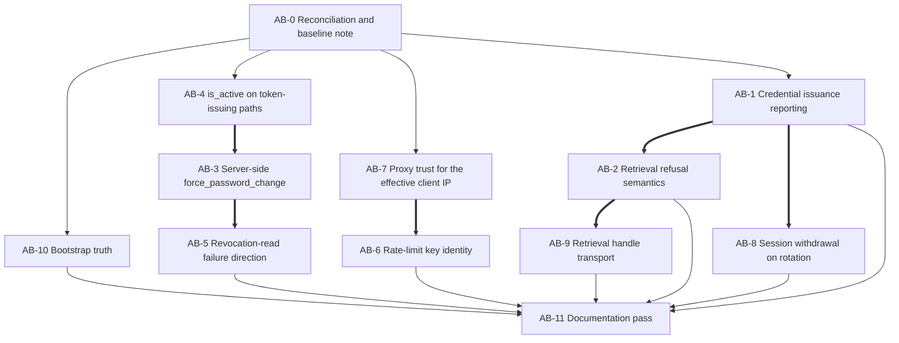

# Phase 04 — Authentication and token-lifecycle remediation plan

## Purpose

This plan decomposes the phase-04 authentication findings into dependency-safe execution blocks, each with a
semantic target, an ordered position, a risk view across implementation / rollout / regression / compatibility,
the agents it needs, the documentation it moves, its verification commands, and its definition of done.

**It chooses nothing where the code context records technical uncertainty.** Phase-04 code-context
DP-1 … DP-8 (not the identically-numbered records in phase 07) are carried verbatim as decision records
**D-04-A … D-04-H**, each with its alternatives, its chooser, and what stays blocked until
is ruled. Four further decisions (**D-04-I … D-04-L**) are raised here where the code context's list is silent on
a fork a fix genuinely turns on; each says so, and each is marked *raised by this Planner*.

Scope discipline inherited from the report: **stop after the fix sites of the eight findings**, because a role
re-tiering or a credential-flow rewrite would invalidate this plan's measurements.

## Source anchor authority

**`report`** = `.ai/audit/99-validation/04-authentication-validated-findings.md`
**`code_context`** = `.ai/plans/_code-context/04-authentication-code-context.md`
**`code_context_authority: Phase-1 Auditor (overrides every report anchor)`** — where the two disagree about
*where* something is or *what the code does*, the code context wins. Where they disagree about *identity*
(which finding is which), the **report's identifier set wins** and the code context's numbering is recorded as a
defect (see §6.2).

The report's anchors for **AUTH-002** (4 × `src/mkobi/api/routes/admin.py`, 1 × `services/user_service.py`) **do
not exist**: those bodies are in `services/auth_service.py`. The report's `src/mkobi/core/permissions.py:354`
`get_current_user` anchor **does not exist** either — the module is 139 lines long and has no such symbol; the
authentication resolution path is `api/deps.py::get_current_user_dependency`. **Every target in this plan is a
symbol, module, route, config key or table — never a line number.**

### Source tree state at plan time

`git status --porcelain` at planning time shows **no modified tracked source file**. Plan-03 `B1` landed as
`2174895` (*"fix(user): own the unit of work for user writes and classify the email race"*), a child of
`b646ef1`, which the code context was written against. Consequences recorded here and carried by AB-0, AB-1, AB-4
and AB-8:

- **`core/permissions.py` and `api/deps.py` are clean.** Phase-03 `B1`'s working-tree edits are committed, so the
  `core/permissions.py` "dead gate" may be edited without losing anyone's work — but `get_current_user_dependency`
  now carries **three docstring lines** from `B1` stating that its deactivation checks are a defence-in-depth copy
  of the admin endpoint's paired writes. **Any change to those checks must keep that statement true.**
- **`services/auth_service.py` was rewritten by `2de4156`** (block TSK_07 of phase 02). `docs/04-admin/admin-api.md`
  landed with it and **deliberately encodes** the fail-open store with commit-then-store.
- The untracked siblings `.ai/plans/01-…`, `.ai/plans/02-…`, `.ai/plans/03-…`, `.ai/plans/05-…` and
  `.ai/tasks/B1-txn-001-transaction-ownership.yaml` are this programme's, not this plan's.

**Follow-on commit `cea2d06` — checked once, no re-derivation.** *"test(users): clean up rows the durable user
writes now persist"* — a child of `2174895`. Despite the subject it touches **production** files
(`api/routes/admin.py`, `services/user_service.py`) and three test modules. **`git show cea2d06 -- tests` shows zero
test functions or classes added, removed or renamed**, so **no phase-04 test name moves** and no verification
command in this plan needs changing. Two consequences:

- `api/routes/admin.py::update_user_active_admin_endpoint`'s docstring — AB-4's documentation target — was
  **rewritten** by this commit and now states the gap accurately ("the login routes consult neither `is_active`
  nor the marker, so a deactivated user can still obtain freshly signed tokens at login, but each of those is then
  rejected at the gate"). AB-4 therefore **updates an accurate statement into a stale one**; it does not correct a
  wrong one. The substance (`refresh` still relies on the marker alone) is unchanged.
- `services/user_service.py::UserService.create_user` gained a comment recording that its internal
  `await db.rollback()` **discards any uncommitted work on the caller's session**, so a future multi-write caller
  must commit earlier writes first. `AuthService.approve_registration_request` calls `create_user` **first**, so it
  is unaffected today — but this is a real constraint on AB-1's and AB-2's edits to that method, and the order of
  writes must not be changed without re-reading it.

## Phase-1 load-bearing results (carried forward)

1. **AUTH-002's commit hoist has already landed** (`2de4156`). What remains is **reporting**, not ordering.
2. **`D-04-A` (the phase-04 code context's `DP-1`) is the hard decision of this phase.** The report's recommendation is **refuted by landed work**: four
   shipped tests in `tests/test_auth_service.py`, four landed docstring clauses in `auth_service.py`, and
   `docs/04-admin/admin-api.md` encode fail-open-store + commit-then-store as a *deliberate* decision. Plan-03
   block `B1` now owns the transaction boundary. Reversing any of that is a **decision**, not a fix.
3. **`AUTH-004` collides with in-flight plan-03 `B1`** and gains a substantiated sub-claim: `is_active` is compared
   nowhere in `AuthService.login_user` or `routes/auth.py::refresh`. `B1` has landed; the collision is now a
   **landed contract** to obey, not a worktree conflict.
4. **`AUTH-008` is API-wide.** A blanket fail-closed over `deps.py`'s `except Exception` turns a Redis degradation
   into **401 / 503 on every request**.
5. **`AUTH-005` (report ID) fix sites are deployment surface**: `docker/Dockerfile` `CMD` (two tiers),
   `docker/docker-compose.override.yml` `command:`. **No `--forwarded-allow-ips`, `proxy_headers`, `forwarded_allow_ips`,
   `trusted_hosts` or `always_trust` appears anywhere in `src/` or `docker/`.**
6. **Corpus-wide gates cannot see this phase.** `uv run mypy src/mkobi/` is clean across all nine defects; `ruff`
   sees none of them.

### Corpus verification baseline

`uv run mypy src/mkobi/` → clean; `uv run mypy src/mkobi/api/deps.py src/mkobi/core/permissions.py
src/mkobi/services/auth_service.py src/mkobi/api/routes/auth.py src/mkobi/api/routes/admin.py
src/mkobi/core/security.py src/mkobi/core/temp_password_store.py src/mkobi/db/starter.py` → **19 pre-existing
errors** (`AsyncClient.redis` has no attribute `pipeline`; union-attr on `Dict`/`cast`).

**A green `mypy` is not a verification statement for AB-1, AB-2, AB-3, AB-4, AB-5, AB-6, AB-9 or AB-10.**
`ruff`'s role in this phase is import ordering (`I001`) and syntax only.

## Scope-ruling tables

### ZONE — anchors at current HEAD

Every target named by the report or the code context, resolved against `2174895`.

| # | Reported / cited anchor | Resolves to | Ruling |
| - | ------------------------ | ----------- | ------ |
| Z-01 | `admin.py` 221–239 (`reset_password_admin` loop) | `services/auth_service.py::AuthService.reset_password_admin` | **Target realigned.** The report's `admin.py` anchors (4 × reset loop, 1 × `user_service.py`) **do not exist**. |
| Z-02 | `admin.py` 342–375 (`approve_registration_request`) | `services/auth_service.py::AuthService.approve_registration_request` | Same as Z-01. |
| Z-03 | `admin.py` 414–436 (`retrieve_temp_password`) | `api/routes/admin.py::retrieve_temp_password_admin_endpoint` | **Name corrected.** The code context's `reset_user_password_admin_retrieve_endpoint` does not exist; the module's symbols are `get_users_admin_endpoint`, `update_user_role_admin_endpoint`, `delete_user_admin_endpoint`, `update_user_active_admin_endpoint`, `reset_user_password_admin_endpoint`, `get_registration_requests_admin_endpoint`, `approve_registration_request_admin_endpoint`, `reject_registration_request_admin_endpoint`, `retrieve_temp_password_admin_endpoint`. |
| Z-04 | `admin.py:43` (`AdminUser` import) | `api/deps.py::AdminUser` | Target is a dependency alias, not an import site. |
| Z-05 | `auth.py` 138–179 (`reset_password`) | `services/auth_service.py::AuthService.reset_password_admin` | Realigned. |
| Z-06 | `auth.py` 198–225 (`approve_registration`) | `services/auth_service.py::AuthService.approve_registration_request` | Realigned. |
| Z-07 | `auth.py` 246–255 (`retrieve_temp_password`) | `api/routes/admin.py::retrieve_temp_password_admin_endpoint` | Realigned. |
| Z-08 | `auth.py` 269–275 (`confirm_registration`) | `api/routes/auth.py::confirm_registration_endpoint` | Live; **outside** AUTH-002/006's handle path. |
| Z-09 | `api/deps.py::get_current_user` | `api/deps.py::get_current_user_dependency` | Real. `Request` is **not** a parameter today. |
| Z-10 | `core/permissions.py::get_current_user` (report `:354`) | **does not exist** | Dead anchor. The related real symbol is `core/permissions.py::_get_current_user_with_session` (VAL-04-009's second identity path). |
| Z-11 | `tests/api/test_temp_password_retrieval.py::test_retrieve_temp_password_not_found` | `test_retrieve_temp_password_nonexistent_token` | **Name corrected**; the module's tests are `…_success`, `…_nonexistent_token`, `…_single_use`, `…_non_admin_forbidden`, `…_expired_token`. |
| Z-12 | `tests/conftest.py` "stubs `check_rate_limit`" | autouse `_mock_redis` patches **`AuthService.__init__`'s** `self._rate_limiter.check_rate_limit`; `strict_redis` does not patch | **Partly false, and it matters.** The three route sites build their **own** `AsyncRateLimiter(redis_client, fail_closed=…)` inline, so the autouse patch does not silence them; what silences them is `MockRedis` injected through `api/deps.py::get_redis_client_dependency`. The rate-limit path is therefore **live in the suite**, which is why `tests/test_rate_limiting.py::test_rate_limit_reset_allow_writes` hard-codes a key literal. |
| Z-13 | `routes/auth.py::register_request` reads `X-Forwarded-For` | **No `X-Forwarded-For` read exists anywhere in `src/`.** All three rate-limit sites use `request.client.host`; `register_request` falls back to the email address when there is no peer | The code context's re-derived mechanism for AUTH-001 is **stale at `2174895`**. This makes AUTH-001's cause purely the **uvicorn proxy-header trust** surface and *strengthens* the finding: there is no application-level forwarding logic to fix, only a deployment one. Recorded in AB-0. |
| Z-14 | `TempPasswordStore.retrieve` returns a 3-tuple `(None, "expired")` | `core/temp_password_store.py::TempPasswordStore.retrieve` returns **`str \| None`** | The "three distinct states collapsed to one" claim is **two** states at HEAD: absent-or-already-spent (`None`) and store-fault (also `None`). No expiry distinction exists in the store at all. **AB-2's diff is smaller than the report's and its semantics are clearer** — and the single-use guarantee is structural (GET+DELETE inside one `transaction=True` pipeline). |

### CONFLICT — between the two sources

| # | Subject | Report | Code context | Ruling |
| - | ------- | ------ | ------------- | ------ |
| X-01 | **AUTH-005 identity** | `AUTH-005` = *the retrieval handle is a URL path segment written verbatim into the access log* (MEDIUM) | `AUTH-005` = *client-IP rate limiting keys on an untrusted header* (HIGH) — i.e. the report's AUTH-001 mechanism | **Report identity wins.** AUTH-005 is the transport/logging finding (→ **AB-9**). The proxy-trust subject is **report AUTH-001's cause half** (→ **AB-7**), never a separate finding. The code context's re-pointing of the ID is recorded as a code-context defect (AB-0) and is **not** edited. |
| X-02 | **AUTH-004 identity** | `AUTH-004` = *password rotation withdraws no session and the refresh cookie is never rotated* (MEDIUM) | `AUTH-004` = *token revocation is unusable as a deactivation mechanism* (HIGH) | **Report identity wins, content union honoured.** The code context adds two substantiated sub-claims the report did not make: (i) `update_user_active_admin_endpoint` does not revoke inside the service — **but** `2174895` has since *deliberately* documented the commit-then-revoke split with a `rollback()` comment that is a false attribution at current HEAD (AB-0 records it; ownership of the correction goes to **phase 03** because that comment is `B1`'s — C04-6); (ii) `is_active` is untested on the token-issuing paths (**plan-03 `C-7`**, → **AB-4**). Split across **AB-4** and **AB-8**. |
| X-03 | AUTH-002 remedy | "make the store write part of the transaction, or at minimum surface the failure to the administrator" | Refuted by `2de4156` + four shipped tests + `docs/04-admin/admin-api.md` | **Neither is a fix to schedule.** Carried as **D-04-A**; the block is verification-and-reporting shaped, and the sub-claims it substantiates (`handle_return_ignores_failure`, `store.store` never awaited by tests) are **hard**, so the block is not optional. |
| X-04 | AUTH-001 remedy | dual-bound: 5 per IP **and** 5 per identifier, plus the app-level `Forwarded` helper | proxy trust first (VAL-04-001 rules out literal `*`), then an app-level derivation helper | **Union, ordered.** The report's dual bound is a *policy* ruling (D-04-D); the code context's proxy trust is a *prerequisite* for any IP component (D-04-E → AB-7). VAL-04-001 **drops** the literal `*`/`True` option. |
| X-05 | AUTH-005 remedy | move the handle into a request **body**, accept the old path for **one release** | (silent on the transport subject) | Report's two options carried verbatim into **D-04-K**; the nginx `log_format` half is **phase 12's file** (C04-5). |
| X-06 | AUTH-006 remedy | delete after retrieval; **fail closed on store fault**; add a `logger` | (silent; records the single-use unverified question) | Both carried: the refusal change is **AB-2**, and the single-use **verification** is D-04-C's deliverable (VAL-04-008). |
| X-07 | AUTH-008 remedy | redact the Redis path, wire the startup check, document fail-closed | "direction is fail-closed, but the blast radius is API-wide; a blanket fix over `deps.py` is dangerous" | Report wins as to **direction**; the code context's blast-radius warning is **binding on the shape** (AB-5's option table and its R4). |
| X-08 | AUTH-007 remedy | `SELECT role` then log `bootstrap_user_exists=true`, `is_admin_occupied_user={id}`; on rowcount 0 log `bootstrap_user_exists=false` | same remedy; `config.py`'s inline weak-username list is a separate hygiene finding | Report wins. The `config.py` duplicate is explicitly **not** AUTH-007's and goes to **phase 01** (out-of-scope table). |

### VERIFICATION FINDING — the report's `VAL-04-*` records

Each is recorded here with this plan's ruling. **No audit file is edited**; `VAL-04-001` alone is *applied*,
because it removes a whole remediation option.

| ID | Band | Subject | Ruling in this plan |
| -- | ---- | ------- | ------------------- |
| `VAL-04-001` | MEDIUM | App-level `--forwarded-allow-ips="*"` / `Forwarded=True` is **worse than the defect** (trusts a client-supplied header from any peer) | **Applied.** Option (b) of AUTH-001's remedy is **deleted**, not deferred. `docker/nginx/nginx.conf` (production tier) is out of AUTH-001's edit set (C04-5). AB-7's options are the code context's (a)/(b)/(c) only. |
| `VAL-04-002` | LOW | `test_rate_limit_reset_allow_writes` hard-codes `rate_limit_key = "login:127.0.0.1"`; any literal-helper option breaks it | **Confirmed, stronger than reported.** `StrictRedis` injects peer `testclient`, uvicorn rewrites it to `127.0.0.1`; the literal is the *whole* cross-section. D-04-D must state explicitly whether the test is updated **with** the key or the key is asserted through a shared helper. Lands in **AB-6**'s test table, not AB-0's. |
| `VAL-04-003` | LOW | Docker Desktop dev tier collapses **all** client IPs to one gateway bucket | **Confirmed; restated.** Dev-only, production-correct. Moves from AB-0 to **AB-7**'s rationale and rollout notes. |
| `VAL-04-004` | LOW | `AUTH-004`'s "only one caller of `revoke_all_user_tokens`" — count is **eight**, not one | **Confirmed, recorded as a miscount.** No change of target; the *severity* argument (an under-used revocation path) is unaffected. AB-8's Implementor must not read "one caller" as "one place to change". |
| `VAL-04-005` | LOW | AUTH-008 is **statically proven** to return 401, not "may degrade silently" | **Accepted as a grading correction, recorded.** AB-5's framing is "a Redis outage turns every authenticated request into 401 `TOKEN_REVOKED`", with the terminal `except Exception → AUTHENTICATION_FAILED` as the second instance of the same cause. |
| `VAL-04-006` | LOW | AUTH-008's "cannot determine" is a **Zone quote**, not code evidence | **Confirmed as report-text only.** No code target derives from it. Recorded so AB-5's Auditor does not go looking for a source file. |
| `VAL-04-007` | MEDIUM | AUTH-007's documentation defect is a **three-row severity mismatch**: `logging.md` / `architecture.md` all-pairs → MEDIUM; restart-safety → LOW | **Accepted and split.** AB-11 corrects the two files (except the sentence plan-03 `B10` already owns — C04-2); the restart-safety claim is dropped as **not this phase's** (out-of-scope). |
| `VAL-04-008` | MEDIUM | `retrieve`'s `GET`+`DELETE` "single-use guarantee" is **unverified** — no two-claimant test exists | **Applied.** D-04-C requires a **verification attempt first** (a two-claimant race test against `StrictRedis`); a store change is only authorised if the attempt fails. This is the phase's only *investigate-before-ruling* gate. |
| `VAL-04-009` | LOW | `core/permissions.py` has a **second** identity path (`_get_current_user_with_session`, `src`-level callers: **none**) with the identical `is_active` skip | **Confirmed, and promoted to a scoping fact.** The inventory row is **test-only**; no row-level permission exists. AB-3 must not re-implement the gate twice, and wiring the dead path is **out of scope** (out-of-scope table). |
| `VAL-04-010` | LOW | AUTH-001's doc list is incomplete: `docs/01-auth/auth-api.md` says rate limiting "fails **open** by default" while `Settings.rate_limiter_fail_closed` defaults **`True`** | **Confirmed and extended** — three additions: the `auth-api.md` claim, `docs/08-security/security-overview.md`'s *no statement at all* about revocation-read failure, and `docs/04-admin/admin-api.md`'s three-store-clauses the report missed. AB-11 owns the doc set; AB-1/AB-2/AB-8 own their own clauses. |

### DISCREPANCY — Phase-1 corrections this plan absorbs

| # | Finding | Correction |
| - | ------- | ---------- |
| Y-01 | The report's `AUTH-002` anchors | Four of five point at bodies that moved to `services/auth_service.py` in `2de4156`. See Z-01, Z-02. |
| Y-02 | `AUTH-004`'s untyped `await db.rollback()` (report) | `2174895` changed it to `await db.rollback()` **with a docstring clause that is factually wrong** ("can only undo work done before the service's commit" — the endpoint's own code comments two paragraphs earlier say the opposite). **Not phase 04's comment to fix**: it is plan-03 `B1`'s own text. C04-6 hands the correction to phase 03; AB-0 records it. |
| Y-03 | `AUTH-005`'s "X-Forwarded-For read" | No such read exists at `2174895`. See Z-13. |
| Y-04 | `AUTH-006`'s tri-state | Two states at `2174895`. See Z-14. |
| Y-05 | The retrieval-endpoint symbol name | `retrieve_temp_password_admin_endpoint`. See Z-03. |
| Y-06 | The "not found" test name | `test_retrieve_temp_password_nonexistent_token`. See Z-11. |
| Y-07 | `AuthService.login_user` | Verified to contain **no** `is_active` comparison and **no** revocation read; it returns the whole `UserRead`, so `force_password_change` reaches the client inside the login response. Both AUTH-003 and `C-7` land on this symbol. |
| Y-08 | `get_temp_password_store` | `api/deps.py::get_temp_password_store` builds the store with `ttl_seconds` from settings; `AuthService.__init__` accepts `temp_password_store: TempPasswordStore \| None`, and **both** `reset_password_admin` and `approve_registration_request` guard with `if self.temp_password_store is not None:` — so the "store absent" variant is a real, unreported branch. AB-1's option table prices it. |
| Y-09 | `AuthService.__init__` also owns a private `self._rate_limiter` | Built from `get_async_redis_client()` directly, **not** through the dependency. Its only purpose in the corpus is the conftest patch (Z-12). A second limiter instance is a real (unused) duplicate of the three route-owned ones — noted for AB-6, **not** a defect to fix speculatively. |

## Block map

`==>` = hard sequencing (one symbol, two intents, one implementor). `-->` = soft (ordering preference or shared
documentation set). Blocks with no inbound edge are executable the moment their decision is ruled.

---

## Execution blocks

### AB-0 — Reconciliation, anchor note and phase baseline

| Field | Value |
| ----- | ----- |
| **Semantic target** | **No code.** This plan's own §"Source anchor authority" + `.ai/tasks/`-style note and `docs/SPEC.md` **Version History** row. The per-block commit bodies carry the per-block half. |
| **Discharges** | `VAL-04-001` (applied), `VAL-04-002` (recorded → AB-6), `VAL-04-003` (recorded → AB-7), `VAL-04-004`, `VAL-04-005`, `VAL-04-006`, `VAL-04-009`, `VAL-04-010` (recorded → AB-11), discrepancies **Y-01 … Y-09**, conflicts **X-01, X-03** |
| **blocked_by** | — |
| **Execution order** | **1** |
| **Risk — implementation** | None. Nothing executes. |
| **Risk — rollout** | None. |
| **Risk — regression** | None. |
| **Risk — compatibility** | The one real hazard: **this note can be mistaken for authority to edit `.ai/audit/**`.** It is not. Phase 03 `B0`'s convention ("**no audit file is edited**") is inherited verbatim. |
| **Agents** | **Auditor** (confirm the §7 lead-loaded test list and the §5 documentation inventory are complete at `2174895`), **Planner** (owns the note). No Implementor. |
| **Documentation impact** | **One row** appended to `docs/SPEC.md` **Version History**, naming this plan — house convention (sibling plans `B0`…`B10` append one row each). **Nothing else.** |
| **Verification** | `git status --porcelain` clean of tracked source · `uv run ruff check .ai` is not applicable (markdown) · **no test run required** |
| **Definition of done** | The note exists and names: the four dead `admin.py` anchors; `core/permissions.py:354`'s non-existence; the AUTH-005 identity divergence (report wins); the code-context corrections Y-01…Y-09; that `2174895` is HEAD and `B1` is landed; that **no audit file is edited**; and that the four `VAL-04-004/005/006/009` miscounts are recorded without renumbering anything. |

**Named anchors at HEAD — the corpus this plan's baseline is taken against.**

| Corpus | Count | Meaning for this phase |
| ------ | ----- | ---------------------- |
| R1 defects | **9** | Six `AUTH-*` + one `VAL-04-*` band raise + the code context's `C-7` / `VAL-04-007` medians + the authentication half of `DP-006`'s validation split. `VAL-04-007`'s **restart-safety LOW** claim is **excluded** (out of scope). |
| R2 contradictions | **2** | `X-01` (AUTH-005 identity), `X-02` (AUTH-004 identity). Both **ruled**, not carried as uncertainty. |
| R3 shared targets | **2 symbols** | `services/auth_service.py::AuthService.reset_password_admin` — claimed by **AB-1 and AB-8**; `api/routes/admin.py::retrieve_temp_password_admin_endpoint` — claimed by **AB-2 and AB-9**. Both are hard-sequenced pairs. |
| R4 blast radius | `AUTH-008` → **entire authenticated API** | Binding on AB-5's shape, not on its direction. |
| R5 missing tests | **14 live, 3 not** | §7's table; the three not-yet cases are exactly AB-2's, AB-4's and AB-6's deliverables. |
| R6 dead code | 2 | `core/permissions.py::_get_current_user_with_session`'s src-level caller census (**none**); `AuthService._rate_limiter` (AB-6 note only). |
| R7 no regression anchor | **11 of 14 claims** | Each is a `VAL-04-*` correction to the *report's* framing; the strongest (`VAL-04-008`) becomes D-04-C. |
| R8 self-declared artifacts | **none** | The Phase-1 context does **not** claim to have produced an artifact; everything it states was re-derived at `2174895` and is reproducible by reading the named symbols. |
| R9 docs | **5 files** | `docs/01-auth/auth-api.md`, `docs/04-admin/admin-api.md`, `docs/08-security/security-overview.md`, `docs/06-backend/logging.md`, `docs/06-backend/architecture.md`. All exist. |

---

### AB-1 — Credential issuance reporting after a fail-open store

| Field | Value |
| ----- | ----- |
| **Semantic target** | `core/temp_password_store.py::TempPasswordStore.store` (its return type and failure contract) · `services/auth_service.py::AuthService.reset_password_admin` · `services/auth_service.py::AuthService.approve_registration_request` · the two admin routes that consume their `retrieval_token` (`api/routes/admin.py::reset_user_password_admin_endpoint`, `::approve_registration_request_admin_endpoint`) · `api/schemas/responses.py::admin_responses` (only if a 503 is added) · `docs/04-admin/admin-api.md` |
| **Discharges** | **AUTH-002** · `VAL-04-010` (this store's three doc clauses) · conflict **X-03** |
| **blocked_by** | **`D-04-A`** (hard — the whole block is the ruling's consequence). Soft: `AB-0`. |
| **Execution order** | **5** |
| **Risk — implementation** | **HIGH.** The block's implementation risk is inverted: the *simplest* change (raise on store failure) is the one the landed work explicitly refuses, and it is the only one that makes the endpoint's response truthful. Every other option is a reporting change in the same two symbols `2de4156` just rewrote. The `if self.temp_password_store is not None:` branches (Y-08) mean a third variant exists in which the credential is **never** stored and the response still carries a token. |
| **Risk — rollout** | **MEDIUM.** Under any surfacing option the admin-visible outcome changes from "200 + token" to an error for exactly the Redis-outage case — the case the landed ruling was written for. The pre-deploy state is a stored password hash with no retrievable credential, i.e. **an unrecoverable account**; surfacing it does not create that state, it reports it. |
| **Risk — regression** | **HIGH.** Four shipped tests in `tests/test_auth_service.py` encode the current behaviour by name: `test_approve_registration_request_commit_precedes_store`, `test_approve_registration_request_store_failure_after_commit_keeps_user`, `test_reset_password_admin_commit_precedes_store`, `test_store_failure_after_commit_returns_success`. A surfacing option **breaks them deliberately**. |
| **Risk — compatibility** | **MEDIUM.** A changed response body (an added `credential_stored` field, or a `503` instead of `200`) is a contract change on two admin routes; `frontend/src/features/admin/api/adminApi.ts` reads `retrieval_token`, and `UserManagement.tsx` / `RegistrationRequests.tsx` treat its absence as an error. The frontend half is **phase 16's** (C04-4). |
| **Agents** | **Auditor, Researcher, Planner, Validator — all four.** Auditor: reconstruct `2de4156`'s intent from its commit body, the four docstring clauses, the two tests' docstrings and `docs/04-admin/admin-api.md`, and inventory every consumer of `retrieval_token`. Researcher (narrow): whether a *confirmed* write is obtainable from redis-py in this codebase's usage — what `SET`/`SETEX` returns, whether the store's `set(..., ex=...)` call's result is already available, and what a post-write existence check costs versus the existing round trip. Planner: the option's contract, the response shape, the OpenAPI delta. Validator: whether the four shipped tests are correctly updated rather than weakened. |
| **Documentation impact** | **Required.** `docs/04-admin/admin-api.md`'s three store clauses (Phase-1 correction #10) must describe the landed behaviour, not the intent. If `D-04-A` chooses (b) or (c), the doc must say so in the same commit as the code. |
| **Verification** | `.\Makefile.ps1 test-select -k "reset_password_admin_commit_precedes_store" -v` · `.\Makefile.ps1 test-select -k "approve_registration_request_commit_precedes_store" -v` · `.\Makefile.ps1 test-select -k "approve_registration_request_store_failure_after_commit_keeps_user" -v` · `.\Makefile.ps1 test-select -k "store_failure_after_commit_returns_success" -v` · `.\Makefile.ps1 test-select -k "store_fail_open_on_error" -v` · `.\Makefile.ps1 test-select -k "store_failure_prevents_token_return" -v` (**the new case**) · `.\Makefile.ps1 test-select -k "TestTempPasswordRetrievalEndpoint" -v` · `.\Makefile.ps1 test-select -k "TestRegistrationEndpoints" -v` · `.\Makefile.ps1 test-select -k "TestPasswordResetEndpoints" -v` · `.\Makefile.ps1 test-select -k "test_openapi" -v` (if `admin_responses` changes) · `uv run ruff check src/mkobi/core/temp_password_store.py src/mkobi/services/auth_service.py src/mkobi/api/routes/admin.py` · `uv run mypy src/mkobi/core/temp_password_store.py src/mkobi/services/auth_service.py` (**delta against the 19-error baseline**) |
| **Definition of done** | `D-04-A` is recorded with its option in the commit body; both sub-claims (`handle_return_ignores_failure`, `store.store` never awaited by a test) are **substantiated with the test names that prove them**, in the commit body; the four shipped tests are updated **with** the code and their docstrings state the new contract; no test is weakened into `assert store.store.called`; the `temp_password_store is None` branch is either closed or documented as a separate defect; `docs/04-admin/admin-api.md` matches the code. |

**Options carried into `D-04-A`** (the block implements whichever is ruled; it does not choose):

| Option | Shape | Trade-off |
| ------ | ----- | --------- |
| (a) | **Reporting only** — the service records whether the credential was durably stored and the response says so | Keeps `2de4156` and its four tests intact. Changes a response body on two admin routes and the frontend's handling of it. The administrator learns the handle is not live, which is the report's stated intent — without ever making the failure loud. |
| (b) | **Surface the failure** — the store stops swallowing, or the endpoint returns `SERVICE_UNAVAILABLE` after the commit | The report's second option. Correct and loud; requires `ErrorCode.SERVICE_UNAVAILABLE` (already in `enums.py`, already mapped to **503** in `utils/exceptions.py`) to be declared in `admin_responses`; **overturns** `2de4156`, four tests and a shipped doc — the ruling the code context refuses to make for us. Residual unchanged: the account is already committed and still unrecoverable. |
| (c) | **Observability only** — structured `logger.error` + a metric, response unchanged | Smallest diff, no contract change, no test overturned. The administrator sees it only if they read logs — which is precisely what the landed design already relies on (`store` "is logged by the store only"), so this option's marginal value over HEAD is small and must be argued, not assumed. |
| (d) | **Confirm the write** — the store verifies delivery and returns a status the service propagates | The most truthful and the most work: adds a round trip or relies on the `set` return value, and `StrictRedis` must then model that return value (Z-12 — the fake's `set` is not the real `set`). |

---

### AB-2 — Retrieval refusal semantics and the single-use guarantee

| Field | Value |
| ----- | ----- |
| **Semantic target** | `core/temp_password_store.py::TempPasswordStore.retrieve` · `api/routes/admin.py::retrieve_temp_password_admin_endpoint` · `api/schemas/responses.py` (a `503` in `admin_responses`) · `tests/core/test_temp_password_store.py` · `tests/api/test_temp_password_retrieval.py` |
| **Discharges** | **AUTH-006** · **`VAL-04-008`** (the single-use verification) |
| **blocked_by** | **`D-04-C`** (hard). Hard-sequenced after **`AB-1`** (same module, same route family, one implementor). |
| **Execution order** | **6** |
| **Risk — implementation** | **MEDIUM.** At HEAD the store has **two** states, not three (Z-14): `None` for absent-or-spent **and** `None` for store-fault. Separating them means the fault must escape the store's blanket `except Exception`, which makes `retrieve` the only store method that can raise — a shape asymmetry inside a five-method class. |
| **Risk — rollout** | **LOW.** A 503 on the retrieval path is reported to an administrator who has just run a reset; it is the first honest outcome for that action. No client behaviour depends on a `404` here other than the UI's error branch. |
| **Risk — regression** | **MEDIUM.** `test_retrieve_temp_password_expired_token` asserts a `404` for an **expired** key — which today is indistinguishable from "never existed" because the store has no expiry concept of its own; separating states must **not** turn that case into a `503`. And the refused-to-refuse case has **no** test today (Phase-1 §5): a store fault on retrieve currently yields a clean `404`. |
| **Risk — compatibility** | **LOW.** `admin_responses` gains a documented `503`; OpenAPI-visible, so `tests/test_openapi.py` follows the route. |
| **Agents** | **Auditor** (the consumer inventory + the `403` non-admin case), **Planner**, **Validator**. **No Researcher** — the mechanism is fully local. |
| **Documentation impact** | **Conditional.** `docs/04-admin/admin-api.md` only if the refusal outcome is user-visible per `D-04-C`. |
| **Verification** | **D-04-C's verification attempt first, mandatory:** a **two-claimant** race test against `StrictRedis` (two concurrent `retrieve` calls on one token, asserting exactly one non-`None` result) · `.\Makefile.ps1 test-select -k "retrieve_temp_password_success" -v` · `.\Makefile.ps1 test-select -k "retrieve_temp_password_single_use" -v` · `.\Makefile.ps1 test-select -k "retrieve_temp_password_nonexistent_token" -v` (**name corrected** — Z-11) · `.\Makefile.ps1 test-select -k "retrieve_temp_password_expired_token" -v` · `.\Makefile.ps1 test-select -k "retrieve_temp_password_non_admin_forbidden" -v` · `.\Makefile.ps1 test-select -k "retrieve_fail_graceful_on_error" -v` (**the case that must change under the ruled option**) · `.\Makefile.ps1 test-select -k "test_openapi" -v` · `uv run ruff check src/mkobi/core/temp_password_store.py src/mkobi/api/routes/admin.py` · `uv run mypy src/mkobi/core/temp_password_store.py` |
| **Definition of done** | The two-claimant attempt is written and its result recorded in the commit body **either way**; the refusal states are separated per `D-04-C`; `test_retrieve_temp_password_expired_token` still asserts `404`; the refused-to-refuse case has a test; the store's `store`/`retrieve` asymmetry is either documented or made uniform. |

**Options carried into `D-04-C`:**

| Sub-question | Options | Trade-off |
| ------------ | ------- | --------- |
| **Is the single-use guarantee real?** | **(a)** the `GET`+`DELETE` inside one `transaction=True` pipeline is structurally exclusive — prove it with the two-claimant test and change nothing in the store | Cheapest, and the most likely outcome given the MULTI/EXEC wrapper. But "likely" is not evidence: `VAL-04-008` exists precisely because nobody ran it. |
| | **(b)** the guarantee is not exclusive under concurrent claimants; add explicit single-claim semantics | Only reachable if (a) fails. Requires `StrictRedis` to model the pipeline's transaction semantics, which is a **test-infrastructure** change in a fake every rate-limit and token test shares. |
| **What does a store fault report?** | **(a)** `503 SERVICE_UNAVAILABLE` — the report's fail-closed direction | Loud and honest; needs the `except Exception` in `retrieve` to stop swallowing, and makes one method of five raise. |
| | **(b)** `404`, logged | The oracle stays closed but the administrator is told "not found" when the store is down — the silent-failure class AUTH-008 is about, one layer over. |
| | **(c)** `500` | No new contract to document; the RFC-7807 body still says "Internal server error", so the administrator still cannot tell "expired" from "Redis is down". |

---

### AB-3 — Server-side enforcement of `force_password_change`

| Field | Value |
| ----- | ----- |
| **Semantic target** | `api/deps.py::get_current_user_dependency` (the only gate every protected route passes) · `core/permissions.py::_get_current_user_with_session` **only if** `D-04-B` rules the conditional uniform (VAL-04-009) · the allow-list decision for `routes/auth.py::refresh`, `::logout`, `::change_password` · `api/schemas/responses.py` (`auth_protected_responses`, `auth_public_responses`) · a new `ErrorCode` member **only if** `D-04-B` requires one |
| **Discharges** | **AUTH-003** · `VAL-04-009` (the second identity path's scoping) · `VAL-04-010` (`auth-api.md`'s completion-path contract) |
| **blocked_by** | **`D-04-B`** (hard). Hard-sequenced after **`AB-4`** (both edit `routes/auth.py::refresh`). |
| **Execution order** | **9** |
| **Risk — implementation** | **HIGH.** The gate has no `Request`, so any allow-list form requires **injecting `Request` into `get_current_user_dependency`** — a signature change every protected route inherits transitively. The flag is on the row the gate already loads (`UserRead` carries it), so no query is added; the work is the *policy*, the *path* and the *code*, not the plumbing. |
| **Risk — rollout** | **HIGH.** Until the frontend's redirect is the enforcement mechanism, a server-side gate logs **every** administrator into a loop: login returns the flag, the SPA navigates to `/profile/change-password?force=true`, and if that route is itself gated the user is stuck. The frontend already redirects in four places (`useAuth.ts` × 3, `LoginForm.tsx` × 1), so the ordering risk is real but bounded — **and it is the reason `D-04-B` cannot be a code-only decision**. |
| **Risk — regression** | **HIGH.** The gate is the whole authenticated API. Any test that authenticates a user whose row carries `force_password_change=True` changes behaviour; the flag is set by **two** admin flows (`reset_password_admin`, `approve_registration_request`) and cleared by `change_password`. |
| **Risk — compatibility** | **HIGH.** A new `ErrorCode` needs `models/enums.py` (L1) **and** `utils/exceptions.py` mapping (L2) **and** `frontend/src/shared/types/enums.ts` **and** an `errorMessages.ts` entry — the AGENTS.md error-layer chain, four files, one contract. Using an existing code avoids all of it, which is a genuine trade-off for `D-04-B`, not an implementation detail. |
| **Agents** | **Auditor, Researcher, Planner, Validator — all four.** Auditor: the full consumer census — every route that must remain reachable, `frontend/src/app/` route guards, the four frontend redirect sites, and `admin_responses`/`auth_protected_responses`. Researcher (narrow): which HTTP status a forced-redirect is conventionally expressed with, and whether this repo's existing codes can express it without a new member — that determines whether the change is four files or one. Planner: the allow-list, the gate's placement, the error contract. Validator: that the unenforced state is provably closed **and** that no legitimate path is trapped. |
| **Documentation impact** | **Required.** `docs/01-auth/auth-api.md` (the completion-path contract) and `docs/08-security/access-control.md` (the second identity path must be described honestly). |
| **Verification** | `.\Makefile.ps1 test-select -k "TestForcePasswordChange" -v` (**stays green**; it pins the API contract, not the bypass) · `.\Makefile.ps1 test-select -k "test_on_user_init_redirect" -v` · `.\Makefile.ps1 test-select -k "test_after_refresh_redirect" -v` · `.\Makefile.ps1 test-select -k "test_token_expired_clears_state" -v` · `.\Makefile.ps1 test-select -k "test_falls_back_to_login_on_profile_failure" -v` · **new:** a protected-route test proving a flagged user is refused · **new:** an allow-listed-route test proving `change_password`, `refresh` and `logout` stay reachable · `.\Makefile.ps1 test-select -k "test_error_response_format" -v` · `.\Makefile.ps1 test-select -k "test_enum_db_consistency" -v` (**must stay green; if it fires, a new code needs a DB tripwire**) · `.\Makefile.ps1 test-select -k "test_openapi" -v` · `uv run ruff check src/mkobi/api/deps.py src/mkobi/core/permissions.py` · `uv run mypy src/mkobi/api/deps.py` |
| **Definition of done** | `D-04-B` recorded; a flagged user cannot reach any non-allow-listed protected route; the allow-list is enumerated in the commit body with the reason for each member; the SPA's four redirect sites are recorded as sufficient for the gate not to trap anyone (or the frontend hand-over C04-4 is written); `VAL-04-009`'s dead second path is either given the same conditional or explicitly documented as dead **and not wired**. |

**Options carried into `D-04-B`** (the code context's DP-002):

| Option | Shape | Trade-off |
| ------ | ----- | --------- |
| (a) | **Middleware on the flag** | One interception point; no per-route changes. Middleware cannot easily reach the authenticated user without duplicating the decode work `get_current_user_dependency` already does, so it likely means **two** token decodes per request — and it sits outside the `ErrorCode`/`AppException` chain the project mandates. |
| (b) | **`get_current_user_dependency`** | Exactly one place, every route inherits it, no middleware. Requires `Request` for the path allow-list. **The report's recommendation.** |
| (c) | **Per-route dependency on `UserService`** | Explicit and greppable. Touches every protected route module; the highest-churn option for the same policy. |
| (d) | **Frontend-only route guard** | The smallest diff. **Rejected by the report** (`curl` bypasses it) — carried only so the record shows why. |
| **(e)** *(raised here)* | **Blend: (b) for the gate plus an explicit `is_password_change_completion_path` predicate in one place** | Not a fourth mechanism — it is (b) with the allow-list *named and tested* rather than inlined, which is what makes the trap risk in the rollout row verifiable instead of asserted. Cheap, and it does not add a `Request` parameter if the allow-list is keyed on the **dependency** rather than the path. Worth D-04-B's explicit rejection if the Coordinator prefers (b) bare. |

---

### AB-4 — `is_active` authoritative on the token-issuing paths

| Field | Value |
| ----- | ----- |
| **Semantic target** | `services/auth_service.py::AuthService.login_user` (adds the `is_active` comparison) · `api/routes/auth.py::refresh` (adds the row comparison alongside the existing marker check) · the docstring in `api/routes/admin.py::update_user_active_admin_endpoint` that states the current split of authority |
| **Discharges** | **plan-03 `C-7`** (the sub-claim, in full) · **`AUTH-004`'s code-context half** per conflict `X-02` |
| **blocked_by** | **`D-04-I`** (hard — where and with which code). **`D-04-G`** (hard — sequencing against plan-03 `B1`; now that `2174895` is HEAD, `D-04-G` reduces to "does `B1` need a follow-up commit for its docstring, or does AB-4 carry it?"). Soft: `AB-0`. |
| **Execution order** | **4** |
| **Risk — implementation** | **LOW.** `login_user` already loads the row with its hash and already returns `UserRead.model_validate(user_obj)`, so the flag and the comparison are both in hand. `refresh` must add a row read it currently does not perform — the only real work. |
| **Risk — rollout** | **MEDIUM.** This closes a gap for *token-issuing* paths. A user whose `is_active=False` but whose Redis marker is absent (marker expired, Redis flushed, or a deactivation that predates `2174895`) currently gets fresh signed tokens. After AB-4 they do not — which is correct, and it means **an already-deactivated account can suddenly stop working**. That is the intended outcome; it will be reported by someone as "users got logged out". |
| **Risk — regression** | **MEDIUM.** `tests/test_token_revocation.py::TestUserDeactivationRevocation` and `test_user_deactivation_revokes_all_tokens` currently prove the **marker** path. AB-4 must keep them green unmodified — they are the marker half of the contract — and add the `is_active` half as separate cases. |
| **Risk — compatibility** | **LOW**, provided `D-04-I` does not introduce a new code. A deactivated user logging in gets `401 AUTHENTICATION_FAILED` under one option and `403` under another; the frontend's login form renders whatever `errorMessages` maps, and `AUTHENTICATION_FAILED` already exists. |
| **Agents** | **Auditor, Planner, Validator, Researcher — all four.** Auditor: which of `login_user` / `refresh` / `logout` / `confirm_registration_endpoint` are token-issuing or session-extending, and the `2174895` docstring's claims. Researcher (narrow): what a JWT should carry — whether `is_active` belongs in the token payload (so `deps.py` needs no row read) or must be re-read per request, and which of the two the RFC/OWASP convention favours; this is the difference between a 5-line and a 20-line change. Planner: the placement and the error contract. Validator: that both paths are closed and the marker path is untouched. |
| **Documentation impact** | **Required.** `api/routes/admin.py::update_user_active_admin_endpoint`'s docstring states the *current* split ("The Redis user-level marker is the authority for `POST /auth/refresh` and login"). AB-4 makes that sentence false, and the docstring is `2174895`'s own text — so this is a **contract note that travels with the code change**, not a documentation task. |
| **Verification** | `.\Makefile.ps1 test-select -k "test_user_deactivation_revokes_all_tokens" -v` (**green unmodified** — the marker contract) · `.\Makefile.ps1 test-select -k "TestUserDeactivationRevocation" -v` · `.\Makefile.ps1 test-select -k "test_revoked_token_rejected" -v` · `.\Makefile.ps1 test-select -k "TestLoginEndpoint" -v` · `.\Makefile.ps1 test-select -k "test_inactive_user_login" -v` (**new**) · `.\Makefile.ps1 test-select -k "test_inactive_user_refresh_rejected" -v` (**new**) · `.\Makefile.ps1 test-select -k "test_auth_me_endpoint" -v` · `.\Makefile.ps1 test-select -k "test_refresh_token_flow" -v` · `uv run ruff check src/mkobi/services/auth_service.py src/mkobi/api/routes/auth.py` · `uv run mypy src/mkobi/services/auth_service.py` |
| **Definition of done** | `D-04-I` recorded; both paths compared; the marker path **unchanged**; the `update_user_active_admin_endpoint` docstring updated in the same commit; the commit body states that already-deactivated accounts may stop working. |

---

### AB-5 — Revocation-read failure direction and its documented contract

| Field | Value |
| ----- | ----- |
| **Semantic target** | `core/security.py::is_token_revoked` · `core/security.py::is_user_tokens_revoked` · `core/security.py::is_refresh_token_revoked` · the `except Exception` arm of `api/deps.py::get_current_user_dependency` · `api/routes/auth.py::refresh`'s marker branch · `core/permissions.py`'s equivalent arm · `frontend/src/features/auth/model/errorMessages.ts` **only if** a new code appears · `docs/08-security/security-overview.md` |
| **Discharges** | **AUTH-008** · `VAL-04-005` (static proof accepted) · `VAL-04-006` (report-text only, recorded in AB-0) |
| **blocked_by** | **RELEASED — `D-04-F` is RULED (register cluster 14, Product Owner, 2026-10-03) and this block is landed.** Hard-sequenced after **`AB-3`** — both added a conditional in `routes/auth.py::refresh`, and one implementor ran at a time. |
| **Execution order** | **11** |
| **Risk — implementation** | **HIGH, and R4-shaped.** The three readers have **no** `try/except`: a `redis_client.exists(...)` / `.get(...)` error propagates. The API-wide blast radius comes from **one** place — the terminal `except Exception` in `get_current_user_dependency`, which converts any exception raised *inside* the gate into `401 AUTHENTICATION_FAILED`. Correcting only that arm converts a Redis outage from "401 TOKEN_REVOKED" into "401 AUTHENTICATION_FAILED" — the same outage, the same status, a different code. **The fix has to distinguish "the store could not answer" from "the answer was no".** |
| **Risk — rollout** | **HIGH.** Any blanket fail-closed makes a Redis degradation a `401`/`503` on **every** authenticated request instead of only on revocation-gated ones. Redis is a declared dependency of the dev and prod stacks; a restart must not look like a mass logout. |
| **Risk — regression** | **MEDIUM.** `tests/test_token_revocation.py` must keep the *marker-says-revoked* cases green; what changes is only the *store-fault* case, which has **no** test today. `tests/test_error_response_format.py` and `tests/test_enum_db_consistency.py` are the tripwires if a new `ErrorCode` appears. |
| **Risk — compatibility** | **MEDIUM.** The frontend's `useAuth.ts` treats `RATE_LIMIT_EXCEEDED` on refresh specially (clears state, no toast). A **new** code on the refresh path needs an `errorMessages.ts` entry, otherwise the SPA shows a generic message — a **frontend** change that is phase 16's (C04-4). Using `SERVICE_UNAVAILABLE` (already in `enums.ts`, already mapped) avoids it. |
| **Agents** | **Auditor, Planner, Validator, Researcher — all four.** Auditor: the complete list of call sites of the three readers, and every caller that already treats a reader exception as meaningful. Researcher (narrow): what a dependency-outage signal conventionally looks like in an RFC-7807 problem body — whether a new code is warranted or `SERVICE_UNAVAILABLE` with a distinguishing `details` field suffices; this decides whether the frontend is in scope. Planner: the fail-closed boundary, per reader and per caller. Validator: that a Redis outage produces the **intended** status per path and not a mass 401. |
| **Documentation impact** | **Required.** `docs/08-security/security-overview.md` currently makes **no statement at all** about revocation-read failure (Phase-1 correction #11). This block's whole purpose includes writing that statement. |
| **Verification** | `.\Makefile.ps1 test-select -k "TestUserDeactivationRevocation" -v` (**green unmodified**) · `.\Makefile.ps1 test-select -k "test_revoked_token_rejected" -v` · `.\Makefile.ps1 test-select -k "TestTokenRevocation" -v` · `.\Makefile.ps1 test-select -k "test_refresh_token_revoked" -v` · **new:** a store-fault test per protected path asserting the **ruled** status (`test_protected_path_reports_dependency_outage`, `test_refresh_reports_dependency_outage`) · `.\Makefile.ps1 test-select -k "test_error_response_format" -v` · `.\Makefile.ps1 test-select -k "test_enum_db_consistency" -v` · `.\Makefile.ps1 test-select -k "test_openapi" -v` · `uv run ruff check src/mkobi/core/security.py src/mkobi/api/deps.py` · `uv run mypy src/mkobi/core/security.py` |
| **Definition of done** | `D-04-F` recorded; every reader fault reaches a **distinct, documented** outcome per path; **no** blanket `except Exception` in the gate can convert an infrastructure fault into a credential verdict; the commit body names the intended user-visible behaviour during a Redis outage; `security-overview.md` states it. **As executed: all five hold, and the block is landed (`5b6cceb`, plus `87dd36d` for the OpenAPI half).** |

**Options carried into `D-04-F`** (the code context's DP-006) — **RULED 2026-10-03, register cluster 14,
Product Owner: (a), which is what shipped.** Chooser was Tech Lead; the direction is now an owner ruling
because the availability/security trade is an owner's to make. **Nothing below is this plan's choice and
no option was ruled by default.**

| Option | Shape | Trade-off |
| ------ | ----- | --------- |
| (a) | **Fail closed on revocation reads** | The report's stated direction. Closes a real fail-open: a Redis outage silently re-admits a revoked session. Turns a degradation into a **mass 401** unless the status is made distinct — which is the real work. **RULED and LANDED.** The distinct status is the co-located `RevocationStoreUnavailableError` mapped to **503 `SERVICE_UNAVAILABLE`**, not a new `ErrorCode`. |
| (b) | **Fail closed only on the user-level marker**; keep token-blacklist reads open | Narrower blast radius: the marker is the authority `2174895` names for deactivation, so this closes exactly the path that matters and leaves a token blacklist that is unavailable during an outage. Asymmetric, and the asymmetry must be documented. **REJECTED — "unavailable" was the whole question.** Leaving one reader open is the fail-open this record exists to close, with a smaller blast radius; a smaller leak is still a leak, and the asymmetry would then have to be documented forever as a known hole. |
| (c) | **Document the current fail-open and defer** | No code change. The report explicitly calls this insufficient ("silently degrades to allow-all"), so it is carried only as the do-nothing option the record must show was considered. **REJECTED — and note the shape of this trap: cluster 2 chose essentially this option in all but name**, by ruling a fail-open *with* a log line. A documented fail-open is still a fail-open; the log line makes it honest without making it safe. |
| (d) | **Fail closed with a circuit breaker / degraded-mode flag** | The most correct and the largest change: a Redis outage degrades to a *stated* mode rather than a verdict. Introduces state and a new failure surface. Speculative relative to the finding; recorded, not recommended. **REJECTED, and the reason is a collision with `D-04-M` rather than a judgement about this option.** Any degraded-mode flag is a TTL on the revocation marker, and `D-04-M` (plan 17, raised by the Tech Lead during `AB-8` and landed `4600e5d`) exists **because** a bare existence marker cannot distinguish an already-issued credential from one minted afterwards. `D-04-M`'s fix *is* the timestamped marker this option would have to weaken. **The option was re-put to the owner as `Q-1`(c) in cluster 14 and rejected for this same reason** — which is worth recording, because it means the objection was structural rather than a preference against complexity. |

---

### AB-6 — Rate-limit key identity

| Field | Value |
| ----- | ----- |
| **Semantic target** | The three rate-limit key derivations in `api/routes/auth.py` — `_handle_login`'s `login:{client_ip}` · `refresh`'s `refresh:{client_ip}` · `register_request`'s `register-request:{client_ip}` / `register-request:{email}` fallback · a single shared key-derivation helper if `D-04-D` rules one · `tests/test_rate_limiting.py` |
| **Discharges** | **AUTH-001** (keying half) · **`VAL-04-002`** · `VAL-04-004`'s "one caller" miscount does **not** apply here (that record is AUTH-004's) |
| **blocked_by** | **`D-04-D`** (hard) and **`AB-7`** (hard — `==>` in the block map: any IP component of the key is the docker gateway until proxy trust lands). Soft: `AB-0`. |
| **Execution order** | **10** |
| **Risk — implementation** | **MEDIUM.** Three small derivations, plus the `register_request` fallback which currently keys on the **email** when there is no peer — an identifier bound that already exists, one scope over. `AuthService._rate_limiter` (Y-09) is a **fourth** limiter instance with no route caller; it must be inventoried but not touched speculatively. |
| **Risk — rollout** | **MEDIUM.** Adding an identifier component **splits** every currently-shared bucket: a shared NAT or a docker gateway bucket of 5 becomes per-identifier buckets of 5. A distributed attacker is unaffected; a legitimate user behind a shared egress IP stops being throttled by other users' failures. That is the intended outcome and it is a visible improvement, and it is also a rate-limit weakening for anyone using many accounts from one IP. |
| **Risk — regression** | **HIGH, and `VAL-04-002` is a hard blocker.** `tests/test_rate_limiting.py::test_rate_limit_reset_allow_writes` hard-codes `rate_limit_key = "login:127.0.0.1"` and resets it by popping that literal out of `strict_redis._data`. Any change to the key derivation **breaks the test**, and the failure mode is quiet: the test would still pass while resetting the wrong key *if* the exhaustion loop no longer hits the limit at all. The Implementor must verify **the six attempts still exhaust the limit** before trusting the assertion — Z-12 explains why the route limiter is live despite the conftest patch. |
| **Risk — compatibility** | **LOW.** No stored state migrates; rate-limit keys are Redis-ephemeral with a TTL. `tests/test_rate_limiting.py::test_different_ips_have_separate_limits` and the `X-Forwarded-For` spoofing test must be **re-read**: they encode the current single-IP-per-request assumption and are the natural place to assert the new derivation. |
| **Agents** | **Auditor** (the limiter census: three route-owned instances + `AuthService._rate_limiter`; the full `tests/test_rate_limiting.py` map), **Planner**, **Validator**. **No Researcher** — a key-derivation choice is a policy trade-off already enumerated by the code context, not an external unknown. |
| **Documentation impact** | **Required.** `docs/01-auth/auth-api.md`'s "Rate limiting fails **open** by default" sentence is false (`Settings.rate_limiter_fail_closed` defaults `True`) — Phase-1 correction #9. This block is the natural place for the key-shape statement. |
| **Verification** | `.\Makefile.ps1 test-select -k "test_rate_limit_reset_allow_writes" -v` (**the blocker — updated with the key, never around it**) · `.\Makefile.ps1 test-select -k "test_different_ips_have_separate_limits" -v` · `.\Makefile.ps1 test-select -k "test_x_forwarded_for_spoofing_ignored" -v` (**re-read first**: the spoofing test's premise changes once the peer IP is real**) · `.\Makefile.ps1 test-select -k "test_rate_limit_headers" -v` · `.\Makefile.ps1 test-select -k "TestLoginEndpoint" -v` · `.\Makefile.ps1 test-select -k "test_refresh_token_flow" -v` · `.\Makefile.ps1 test-select -k "TestRegistrationRequest" -v` · `.\Makefile.ps1 test-select -k "test_register_request_rate_limit" -v` · **new:** a test proving two identifiers behind one peer get separate buckets · `uv run ruff check src/mkobi/api/routes/auth.py tests/test_rate_limiting.py` · `uv run mypy src/mkobi/api/routes/auth.py` |
| **Definition of done** | `D-04-D` recorded; the key derivation exists in **one** place if the ruling says so; `test_rate_limit_reset_allow_writes` updated **with** the key and its exhaustion loop proven to still exhaust; the commit body states the effective bucket change for shared-IP users; `auth-api.md` no longer says fail-open. |

**Options carried into `D-04-D`** (the code context's DP-004, unioned with the report's dual bound per conflict `X-04`):

| Option | Shape | Trade-off |
| ------ | ----- | --------- |
| (a) | **Dual bound**: ≤5 per IP **and** ≤5 per identifier, both enforced | The report's recommendation. Preserves the IP abuse bound (a botnet cannot spread by rotating accounts) **and** removes the availability hazard (one user's failures cannot lock out a whole NAT). Two keys per site, two `check_rate_limit` calls, and the first client that trips the second limit learns which bound it hit. `VAL-04-002` applies in full: **two** literals to update, not one. |
| (b) | **Per-identifier only** | Maximally available, and it is what the report's *enumeration* argument points at. Abandons the IP bound entirely, so a distributed attacker with N accounts gets N×5 attempts. |
| (c) | **Per-IP only, on a corrected client IP** | The smallest change and the status quo's shape. Depends wholly on `AB-7` for the IP to mean anything, which is why the sequencing edge is hard. Leaves the NAT lock-out hazard **fully in place** — the availability half of AUTH-001 unfixed. |
| (d) | **Per-identifier, plus a much higher per-IP ceiling** | Splits the policy across two numbers and therefore two tunings; the cheapest form of (a) that preserves an IP bound. No new config key is required if both numbers are literals, which matters because `config.py` is phase-01's file. |

---

### AB-7 — Proxy trust for the effective client IP

| Field | Value |
| ----- | ----- |
| **Semantic target** | `docker/Dockerfile` — the **dev-tier** `CMD` and the **prod-tier** `CMD` (two `CMD` lines) · `docker/docker-compose.override.yml` — the dev `app` service's `command:` list · `docker/docker-compose.yml` (declares **no** `app` `command:`, so the image `CMD` is authoritative for base and prod) · `frontend/vite.config.ts`'s dev proxy only if the ruling requires a forwarded header there |
| **Discharges** | **AUTH-001** (cause half) · **`VAL-04-001`** (applied) · **`VAL-04-003`** |
| **blocked_by** | **`D-04-E`** (hard). Soft: `AB-0`. |
| **Execution order** | **3** |
| **Risk — implementation** | **LOW technically, HIGH in consequence.** The change is one or two argv entries per `CMD`/`command:`. The consequence is that `request.client.host` starts meaning the **real** peer, which changes what **every** rate-limit key, every audit log line and every future IP-based control sees. |
| **Risk — rollout** | **MEDIUM.** The trust boundary is the compose network in prod (`--forwarded-allow-ips` = the network CIDR) and the docker gateway in dev — the report's Rollout Safety settled that the host-published dev port arrives from the gateway, not from inside the network, so a dev-scoped value is safe. The running image is a **working-tree snapshot** (R8 of the sibling plans): any browser-side verification requires `.\Makefile.ps1 up` to rebuild first, or the change will appear not to work. |
| **Risk — regression** | **LOW for the suite, HIGH for the dev experience.** `tests/test_rate_limiting.py`'s `127.0.0.1` literals are the visible consequence and belong to **AB-6**. No application test can observe this block's effect, because `TestClient`'s peer is rewritten by the ASGI transport, not by uvicorn — so **this block has no pytest coverage by construction.** |
| **Risk — compatibility** | **LOW.** `VAL-04-001` has already removed the `*` / `True` / "trust every peer" option from the table: any value that trusts a **client-supplied** header from an arbitrary peer reintroduces the defect at greater scale. `docker/nginx/nginx.conf` — which already sets `X-Forwarded-For` — is **phase 12's file** (C04-5) and is not edited here. |
| **Agents** | **Researcher** (uvicorn's `--proxy-headers` / `--forwarded-allow-ips` interaction, CIDR vs literal, and what the compose network's actual subnet is — this is external knowledge this plan does not have), **Planner**, **Validator**. **No Auditor needed** — the deployment-surface census is complete (Z-13, and the three `CMD`/`command:` sites). |
| **Documentation impact** | **Required.** `docs/10-deployment/deployment.md` and `docs/11-guides/docker.md` state how the app is started; a new argv entry in three places is a documented operational fact. |
| **Verification** | `.\Makefile.ps1 up` then, from the host, `.\Makefile.ps1 logs app` and a login attempt from two **different** host clients to confirm the keys differ (the report's reproduction, inverted: the keys must now differ). `.\Makefile.ps1 test-select -k "test_different_ips_have_separate_limits" -v` (**stays green** — ASGI-level, unaffected). `uv run ruff check` is not applicable (no Python changed). |
| **Definition of done** | `D-04-E` recorded; **no** trust value wider than the compose network or the docker gateway appears in any file; the dev and prod `CMD`s and the dev `command:` agree; the commit body records the observed key difference from two clients; both documentation files name the new argv. |

**Options carried into `D-04-E`** (the code context's DP-005, with `VAL-04-001` already applied):

| Option | Shape | Trade-off |
| ------ | ----- | --------- |
| (a) | `--forwarded-allow-ips` = the compose network CIDR on the **prod** `CMD`; the docker gateway on the **dev** `CMD` and dev `command:` | The correct trust boundary. Requires knowing the network's subnet — hence the Researcher. Two values to keep in step with `docker-compose.yml`'s network definition, which is phase 12's file if the subnet ever changes. |
| (b) | `--forwarded-allow-ips` = the **nginx** service's address/name-resolved value | Narrower than (a) — trusts exactly the proxy. Couples the app's start-up argv to a service name, so a rename breaks auth silently. |
| (c) | **No trust; accept the peer IP** | Zero change. Leaves the defect: in prod every client is `172.x.x.x`, so `login:` is one bucket for the whole internet; in dev, one bucket for every host client (`VAL-04-003`). It is the honest baseline against which (a) must be justified. |
| — | ~~`--forwarded-allow-ips="*"` / `Forwarded=True`~~ | **Deleted by `VAL-04-001`.** Not deferred, not listed: it trusts a client-supplied header from any peer and is strictly worse than the defect it fixes. |

---

### AB-8 — Session withdrawal on credential rotation

| Field | Value |
| ----- | ----- |
| **Semantic target** | `services/auth_service.py::AuthService.change_password` (the only path that clears `force_password_change`) · `services/auth_service.py::AuthService.reset_password_admin` (**shared with AB-1** — hard-sequenced) · `api/routes/auth.py::refresh` (cookie rotation: the refresh cookie is written by `set_secure_cookie` in `_handle_login` only, and **never** replaced afterwards) · `core/security.py::revoke_all_user_tokens`'s call sites |
| **Discharges** | **AUTH-004** (the report's half, per conflict `X-02`) · `VAL-04-004` (the eight-caller miscount, recorded — see the risk row) |
| **blocked_by** | **`D-04-J`** (hard). Hard-sequenced after **`AB-1`** (`reset_password_admin`). Soft: `D-04-G`. |
| **Execution order** | **7** |
| **Risk — implementation** | **MEDIUM.** Three sub-changes with different shapes: revoking the target's tokens on self-service change (the `AuthService` would need the Redis dependency or the route would), revoking them on admin reset (the same), and rotating the refresh cookie in `refresh` (a `set_secure_cookie` call plus deciding whether the old `jti` is revoked). The cookie rotation is the only one that touches a **user-visible** security property, and it is the one with the least evidence behind it. |
| **Risk — rollout** | **MEDIUM.** Revoking on rotation is correct and it will terminate sessions that are currently expected to survive — including, for an admin reset, the administrator's own tooling if it shares the target's identity. Cookie rotation without reuse detection is a partial mitigation; with it, a stolen-and-replayed cookie is detectable, which is a new detection path nobody is watching. |
| **Risk — regression** | **MEDIUM.** `tests/test_change_password.py` and `tests/test_token_revocation.py` both touch these flows. `VAL-04-004` matters here concretely: the report counted **one** caller of `revoke_all_user_tokens`, the code context counts **eight** — so the Implementor must **not** read the finding as "one place to change". The revoking call sites are already used by deactivation, role change and delete flows; reusing the helper adds no new revocation mechanism. |
| **Risk — compatibility** | **LOW** for revocation (a session ends; the SPA refreshes and the user logs in again). **MEDIUM** for cookie rotation: `docs/90-adr/adr-004-cookie-refresh-tokens.md` is the decision record for the refresh cookie and **must be read before this block starts**; if the ADR ruled against rotation, this sub-change is an ADR amendment, not a code edit. |
| **Agents** | **Auditor** (ADR-004 read; the eight `revoke_all_user_tokens` call sites; the `change_password` flow's callers), **Planner**, **Validator**. **No Researcher** — the mechanisms are local and the ADR holds the design question. |
| **Documentation impact** | **Required.** `docs/01-auth/auth-api.md` (what a password change does to existing sessions) and, if rotation is ruled, **ADR-004** — an architecture decision record is not a routine doc edit and is the Coordinator's call (C04-7). |
| **Verification** | `.\Makefile.ps1 test-select -k "test_change_password" -v` · `.\Makefile.ps1 test-select -k "test_wrong_current_password" -v` · `.\Makefile.ps1 test-select -k "test_weak_password_rejected" -v` · `.\Makefile.ps1 test-select -k "test_same_password_rejected" -v` · `.\Makefile.ps1 test-select -k "test_refresh_token_flow" -v` · `.\Makefile.ps1 test-select -k "test_refresh_token_rotation" -v` (**new**, if rotation is ruled) · `.\Makefile.ps1 test-select -k "TestTokenRevocation" -v` · `.\Makefile.ps1 test-select -k "TestUserDeactivationRevocation" -v` · `.\Makefile.ps1 test-select -k "test_password_reset_admin" -v` · `uv run ruff check src/mkobi/services/auth_service.py src/mkobi/api/routes/auth.py` · `uv run mypy src/mkobi/services/auth_service.py` |
| **Definition of done** | `D-04-J` recorded **per sub-question** (revoke on self-change / revoke on admin reset / rotate the cookie — they are separable and should be ruled separately); every ruled sub-change has a test that fails without it; ADR-004 read and either upheld or explicitly amended; the commit body records which sessions end. |

**Options carried into `D-04-J`** (raised by this Planner — the code context is silent on the report's AUTH-004):

| Sub-question | Options | Trade-off |
| ------------ | ------- | --------- |
| **Self-service `change_password`** | **(a)** revoke the user's tokens (access + refresh markers) | The password that was just changed no longer protects anything until re-login. Correct; ends sessions on other devices. Uses the existing `revoke_all_user_tokens` helper, so no new mechanism. |
| | **(b)** leave sessions alive | Status quo. The old password is gone; the new one is not required anywhere else. Weakest security case, zero blast radius. |
| **Admin `reset_password_admin`** | **(a)** revoke the target's tokens | Symmetric with (a) above and with deactivation, which already revokes. Requires the same helper inside the `AuthService` method **AB-1 may already be editing**. |
| | **(b)** do not revoke | An administrator who resets a compromised account leaves the attacker's session live — the reset does not achieve its purpose. This is the strongest argument in the finding. |
| **Refresh cookie in `refresh`** | **(a)** rotate the cookie on every refresh | Standard hardening; the previous cookie stops being usable. Needs a decision on whether the old `jti` is revoked (reuse detection) or merely replaced. |
| | **(b)** leave it | Zero change. The cookie is a bearer credential with a fixed lifetime; rotation bounds nothing that its TTL does not already bound. |
| | **(c)** rotate **and** revoke the presented `jti` | Full reuse detection. Turns a stolen-cookie replay into a loud failure — and, if a legitimate client races two refreshes, into a false positive that logs the user out. Needs a client-side serialisation decision, which is the frontend's (C04-4). |

---

### AB-9 — Retrieval-handle transport

| Field | Value |
| ----- | ----- |
| **Semantic target** | `api/routes/admin.py::retrieve_temp_password_admin_endpoint` (method and path) · `frontend/src/features/admin/api/adminApi.ts::retrieveTempPassword` · the two callers `frontend/src/features/admin/ui/UserManagement.tsx` and `frontend/src/features/admin/ui/RegistrationRequests.tsx` · `docs/04-admin/admin-api.md`'s endpoint table · **not** `docker/nginx/nginx.conf` (C04-5) |
| **Discharges** | **AUTH-005** (report identity — the report wins per `X-01`) |
| **blocked_by** | **`D-04-K`** (hard). Hard-sequenced after **`AB-2`** (same route function, one implementor). |
| **Execution order** | **8** |
| **Risk — implementation** | **MEDIUM.** Adding a `POST` variant is small; the cost is the **deprecation window**, during which two routes must coexist and the frontend must move. The old `GET /admin/temp-passwords/{token}` route cannot be deleted in the same commit — a browser tab or a bookmark, and any external script, would break. |
| **Risk — rollout** | **MEDIUM.** The handle stops appearing in the **application's** request line (uvicorn's access log), which is where the report's evidence came from. It does **not** stop appearing in **nginx's** `access.log`, which uses the default `combined` format and logs the full request line; that half is `docker/nginx/nginx.conf`, phase 12's file, and `D-04-K` decides whether to hand it over or leave it. **Both admin routes also log the token's first eight characters** in `logger.info` — a prefix, not the handle, but it must be stated which is which. |
| **Risk — regression** | **LOW.** `tests/api/test_temp_password_retrieval.py` — all five cases route through the same path; they move with the route. **New:** a test that the legacy route still works during the window, and (if rotation of the *handle* is ruled) that the old handle stops working after one use. |
| **Risk — compatibility** | **MEDIUM.** The frontend change is **phase 16's** (C04-4) — but the report sequences this finding with AUTH-002/006, so the coordinate decision is whether the frontend moves inside this phase (three files, small) or is handed over with the backend landing first. That is `D-04-K`'s second sub-question. |
| **Agents** | **Auditor** (the complete `retrieveTempPassword` caller inventory — `adminApi.ts`, `UserManagement.tsx`, `RegistrationRequests.tsx`, and any test that calls the route), **Planner**, **Validator**. |
| **Documentation impact** | **Required.** `docs/04-admin/admin-api.md`'s endpoint table gains the new method and marks the legacy one deprecated with a removal release. |
| **Verification** | `.\Makefile.ps1 test-select -k "TestTempPasswordRetrievalEndpoint" -v` (**all five cases**, including `test_retrieve_temp_password_single_use` and `test_retrieve_temp_password_expired_token`) · `.\Makefile.ps1 test-select -k "test_retrieve_temp_password_non_admin_forbidden" -v` (the `403` must survive the transport change) · **new:** `test_retrieve_via_post_body` · **new:** `test_legacy_get_route_still_serves_during_window` · `.\Makefile.ps1 test-select -k "test_openapi" -v` (**two** documented operations on one path) · frontend, if it moves: `.\Makefile.ps1 fe-lint` · `.\Makefile.ps1 fe-test` · `uv run ruff check src/mkobi/api/routes/admin.py` · `uv run mypy src/mkobi/api/routes/admin.py` |
| **Definition of done** | `D-04-K` recorded per sub-question; the handle does not appear in the application request line; the legacy route is explicitly deprecated with a named removal release; the nginx half is either handed over in writing (C04-5) or explicitly accepted as unfixed; the commit body states which logs still contain a handle and which contain only a prefix. |

**Options carried into `D-04-K`** (raised by this Planner; the report's two shapes verbatim):

| Sub-question | Options | Trade-off |
| ------------ | ------- | --------- |
| **Transport** | **(a)** move the handle into a request **body** (`POST`), keep the path route for **one release** | The report's recommendation. The handle leaves the request line, so it leaves uvicorn's access log. Requires a new operation, a deprecation window, and the frontend to move. |
| | **(b)** keep the path, redact the URI in the logs | No client change. Requires `log_format` in `docker/nginx/nginx.conf` — **phase 12's file** — and does **not** touch uvicorn's access log unless the uvicorn `CMD` gains `--no-access-log`, which trades away all access logging for a security gain. |
| | **(c)** both | The only option under which neither log contains the handle. Two changes in two ownership domains, coordinated. |
| **Frontend in this phase?** | **(a)** move the three frontend files with the backend | One deployable unit, no window in which the backend and frontend disagree. Touches frontend files, which every sibling plan treats as another phase's (C04-4). |
| | **(b)** hand the frontend over; backend lands with the legacy route still serving | Respects phase ownership strictly. The finding stays half-fixed until the frontend moves, and the window is unbounded by a date. |

---

### AB-10 — Admin bootstrap truth

| Field | Value |
| ----- | ----- |
| **Semantic target** | `db/starter.py::DatabaseStarter.ensure_admin_user` — the `INSERT ... ON CONFLICT (email) DO NOTHING` block, whose `rowcount` is discarded · `tests/test_starter.py` |
| **Discharges** | **AUTH-007** · **`VAL-04-007`** (the two documentation rows — the restart-safety LOW claim is out of scope) |
| **blocked_by** | **`D-04-L`** (hard) — **RELEASED; the record is RULED (cluster 12, confirmed and extended by cluster 14) and this block is LANDED.** Soft: `AB-0`. **⚠ BUT THIS BLOCK IS NOT FINISHED: `AB-10` shipped `34c9459`, whose production branch raises `ValueError`, and cluster 14 REVERSES that branch to a warning. See the scheduled work below.** |
| **Execution order** | **2** |
| **Risk — implementation** | **LOW.** One branch on `result.rowcount`, one extra `SELECT role`, and one conditional — **now settled, because `D-04-L` has ruled: warn, never raise.** The code is small and the remedy is the report's own. |
| **Risk — rollout** | **LOW, and this risk row is now HISTORICAL rather than forward-looking — which is worth stating, because it is the clearest example in this phase of a plan row outliving its decision.** The row said a raise "would stop application startup for a deployment whose `ADMIN_USERNAME` matches an existing non-admin user — a configuration that is silently broken today". **That raise shipped as `34c9459` and cluster 14 has ordered it reversed.** The rollout risk is therefore no longer hypothetical: **it has shipped, and the correction is the outstanding work.** |
| **Risk — regression** | **LOW.** `tests/test_starter.py` covers `ensure_admin_user`; the new branch needs a case per `D-04-L` outcome (created / occupied-by-admin / occupied-by-non-admin). |
| **Risk — regression** | **LOW.** `tests/test_starter.py` covers `ensure_admin_user`; the new branch needs a case per `D-04-L` outcome (created / occupied-by-admin / occupied-by-non-admin). **The reversal adds one more: `test_ensure_admin_user_non_admin_occupant` must assert that startup CONTINUES in production mode, not merely that a log line appears — the production path is exactly what regressed, so an environment-independent assertion is the one that catches it next time.** |
| **Agents** | **Planner** (the block is short and the decision is small), **Validator** required for any raise path. **No Auditor, no Researcher** — the remedy is specified by the report and the code is 20 lines. |
| **Documentation impact** | **Partial, and split across two homes (C04-2).** `docs/06-backend/logging.md`'s sample record → **this phase**. `docs/06-backend/architecture.md`'s admin-user-creation step: the **SAVEPOINT sentence** is already **plan-03 `B10`'s item 1** and is **not** edited here; the **warning-scope sentence** is **not** in `B10`'s list and is **AB-11's**. |
| **Verification** | `.\Makefile.ps1 test-select -k "test_ensure_admin_user" -v` · **new:** `test_ensure_admin_user_logs_existing_admin` · **new:** `test_ensure_admin_user_non_admin_occupant` (assert the `D-04-L` outcome) · `.\Makefile.ps1 test-select -k "test_app_lifespan" -v` (**must stay green** — it drives the boot path) · `uv run ruff check src/mkobi/db/starter.py tests/test_starter.py` · `uv run mypy src/mkobi/db/starter.py` |
| **Definition of done** | `D-04-L` recorded; the "already existed" branch is distinguishable from the "created" branch in the log; a non-admin occupant produces the ruled outcome; `logging.md` shows the new record; the commit body names the role of the occupant without logging a credential. |

**Options carried into `D-04-L`** (raised by this Planner; the report specifies the remedy but not this branch) — **RULED 2026-10-03: register cluster 12 confirmed by cluster 14, Product Owner. (a) is chosen, in every environment, and a raise is rejected outright.**

| Sub-question | Options | Trade-off |
| ------------ | ------- | --------- |
| **A non-admin user occupies the admin address** | **(a) warn, naming the occupant's id and role** | The report's shape. No startup failure. The deployment stays silently misconfigured — which is the finding, **reported rather than stopped**. **RULED**, and **extended by cluster 14 to every environment including production.** |
| | **(b) raise `ValueError`, as the weak-password guard already does** | Stops startup on a configuration that is wrong today and wrong invisibly. Consistent with the existing guard in the same function. **This is a behaviour change on the boot path** and is the reason `D-04-L` is a real decision rather than a detail. **REJECTED — and it SHIPPED.** `34c9459` implemented exactly this in production while warning in development, and cluster 14 orders it reversed. **The rejection's reason is stated here rather than discovered later: a boot failure on a configuration that is wrong *today and wrong invisibly* converts a misconfiguration into an outage.** |
| | **(c)** warn and continue, but at `ERROR` | Middle ground: visible in default log levels, no startup failure. **REJECTED as an option and NOT SHIPPED, and the reason is worth one line because it is about levels rather than behaviour.** `P10` requires a warning **in the administration area, until it is resolved** — a level cannot do that, because an area's own rendering is what makes it persistent. `ERROR` would have been a louder log line and still left the user with no visible surface. |
| **Which password-hash truth?** | `SELECT role` only (the report's shape) vs `SELECT role, password_hash` and compare | Comparing the hash detects a **changed** admin password (env rotated, row stale) — strictly more information, and it prints nothing sensitive as long as the comparison is not logged. Costs one column. **UNCHANGED and undecided — cluster 14 rules a log line, not a query.** `SELECT role` and `id` only; **no `password_hash` is read or compared and no credential is logged.** |
| **⚠ SCHEDULED WORK — the reversal of (b)** | **Not an option. A ruling.** | **`34c9459`'s production branch in `db/starter.py::ensure_admin_user` must become a warning.** One conditional; **no stored row is touched and no query shape changes**, which is why it is cheap enough that it was never worth deferring. **Owner: this block (`AB-10`) — the block that shipped it.** **Not performed in this document pass, because `src/` is outside its scope.** **Why it is recorded rather than quietly forgotten:** the reversal is what unblocks plan 13's `P10`, and an administration area cannot show a warning in a deployment that will not boot. **The dependency is therefore load-bearing in both directions** — `AB-10`'s correction is a prerequisite for another phase's user-visible surface. |

---

### AB-11 — Documentation pass

| Field | Value |
| ----- | ----- |
| **Semantic target** | `docs/01-auth/auth-api.md` · `docs/04-admin/admin-api.md` · `docs/08-security/security-overview.md` · `docs/06-backend/logging.md` · `docs/06-backend/architecture.md` (the **warning-scope sentence only**) · **not** `docs/06-backend/architecture.md`'s SAVEPOINT sentence (plan-03 `B10`) · **not** `docs/09-database/**` (phase 14) · **not** `docs/06-backend/configuration.md` (phase 01, C04-3) |
| **Discharges** | **`VAL-04-010`** (the extended five-file inventory) · every documentation clause the other blocks deferred |
| **blocked_by** | Every block whose behaviour it describes: **AB-1, AB-2, AB-3, AB-4, AB-5, AB-6, AB-7, AB-8, AB-9, AB-10**. |
| **Execution order** | **12** |
| **Risk — implementation** | **LOW.** No code. The risk is *ordering*: a sentence written before the code stops moving is a sentence written twice. |
| **Risk — rollout** | **NONE.** |
| **Risk — regression** | **NONE** mechanically; **HIGH** in the sense that a stale document is the defect class this phase exists to remove. |
| **Risk — compatibility** | **LOW.** Files owned by other phases must not be edited; the exact boundary is C04-2 and C04-3. |
| **Agents** | **Implementor only.** **No Auditor, no Researcher, no Planner, no Validator** — the content is dictated by landed code, and each block's commit body already carries its own summary. **If a sentence cannot be written from landed behaviour, that is a block that did not land, not a sentence to hedge.** |
| **Documentation impact** | The whole block's purpose. |
| **Verification** | `.\Makefile.ps1 check` (nothing else is affected by prose) · a manual pass over the five-file inventory confirming each claim against the landed symbol · **no test run required beyond the full suite once** |
| **Definition of done** | All ten inventory rows either corrected or explicitly recorded as another phase's; each of the five files' sections rewritten **from the landed code**, not from this plan; no file outside R9's five is edited; `docs/SPEC.md`'s Version History carries this phase's row (appended in AB-0). |

**Documentation inventory (R9 + the three Phase-1 additions):**

| File | Claim to correct | Owner |
| ---- | ----------------- | ----- |
| `docs/01-auth/auth-api.md` | Rate limiting "fails **open** by default" — `Settings.rate_limiter_fail_closed` defaults **`True`** (VAL-04-010) | **AB-6** |
| `docs/01-auth/auth-api.md` | The `force_password_change` completion path is described as frontend-enforced (AUTH-003) | **AB-3** |
| `docs/01-auth/auth-api.md` | What a password change does to existing sessions (AUTH-004) | **AB-8** |
| `docs/04-admin/admin-api.md` | The three fail-open-store clauses Phase-1 correction #10 names; the deliberate commit-then-store note from `2de4156` | **AB-1** |
| `docs/04-admin/admin-api.md` | Retrieval endpoint method + deprecation (AUTH-005) | **AB-9** |
| `docs/08-security/security-overview.md` | **No statement at all** about revocation-read failure (Phase-1 correction #11) | **AB-5** |
| `docs/08-security/access-control.md` | The second identity path (`core/permissions.py::_get_current_user_with_session`) | **AB-3** |
| `docs/06-backend/logging.md` | The bootstrap sample record (AUTH-007) | **AB-10** |
| `docs/06-backend/architecture.md` | The admin-creation **warning-scope** sentence | **AB-11** |
| `docs/06-backend/architecture.md` | The admin-creation **SAVEPOINT** sentence | **plan-03 `B10`** — not edited here (C04-2) |
| `docs/10-deployment/deployment.md`, `docs/11-guides/docker.md` | The uvicorn start-up argv after AB-7 | **AB-7** |

---

## Open decisions — owner rulings required

**This plan chooses none of them.** `D-04-A` … `D-04-H` are the Phase-1 code context's own DP-1 … DP-8 (phase 04's records — not phase 07's, which share the bare numbering), carried
with its alternatives; `D-04-I` … `D-04-L` are raised by this Planner where that list is silent on a fork the
report's remedy genuinely turns on, and each says so. **A cross-phase citation must use the qualified
`D-04-*` form**; a bare `DP-1` … `DP-8` in this file always means phase 04's own list, per the
`id-namespace` key.

`D-04-A` and `D-04-C` are **priced inside their blocks** (AB-1's and AB-2's option tables) and are not repeated
here — this table is the index and the blocking statement.

| # | Subject | Owner | Chooser of the alternatives | Blocks (hard) | What stays blocked until ruled |
| - | ------- | ----- | ---------------------------- | ------------- | --------------------------- |
| **D-04-A** | **DP-1** — AUTH-002: the fail-open store and the landed commit-then-store ruling | **Tech Lead** (must see AB-1's `2de4156` archaeology first) | AB-1's option table: (a) reporting · (b) surface · (c) observability · (d) confirm the write | **AB-1**, and AB-8's admin-reset sub-change | The only decision in the phase that can overturn **shipped** work: four tests, four docstring clauses, one doc. Nothing else in AUTH-002 is a fix to schedule — the commit hoist already landed. |
| **D-04-B** | **DP-2** — AUTH-003: where `force_password_change` is enforced | **Tech Lead + Planner** | AB-3's table: (a) middleware · (b) the gate · (c) per-route · (d) frontend-only *(rejected by the report)* · (e) gate + named predicate | **AB-3** | The API-wide gate, the error contract, the allow-list, and whether the frontend is in scope. |
| **D-04-C** | **DP-3** — AUTH-006: is the single-use guarantee real, and what does a store fault report? | **Planner** for the verification · **Tech Lead** only if the store must change | AB-2's table: verify-then-decide, then 503 / 404 / 500 | **AB-2**, and AB-9 (same route) | The phase's **only investigate-first gate**: the two-claimant race attempt must run before any store change is authorised. |
| **D-04-D** | **DP-4** — AUTH-001: what identity is the abuse bound keyed on? | **Tech Lead** | AB-6's table: (a) dual · (b) per-identifier · (c) per-IP corrected · (d) per-identifier + high per-IP ceiling | **AB-6** | The three key derivations, `VAL-04-002`'s test update, and the enumeration-versus-availability trade-off. |
| **D-04-E** | **DP-5** — AUTH-001's cause: how proxy headers are trusted | **Planner** (technical) · **Tech Lead** if `nginx.conf` or `app.py` would be touched | AB-7's table: (a) network CIDR / gateway · (b) nginx address · (c) no trust. **`VAL-04-001` has deleted the `*` / `True` option.** | **AB-7**, and AB-6 transitively | The deployment surface. Note: `D-04-E` decides **whether the IP is real**; `D-04-D` decides **what the real IP is worth**. |
| **D-04-F** | **DP-6** - AUTH-008: which way a revocation-read failure goes | **Tech Lead; RULED by the Product Owner**, register cluster 2 then **RE-RULED by cluster 14 (2026-10-03), which STRICKS the cluster-2 entry in place** | AB-5's table: (a) fail closed **(RULED and LANDED)** · (b) marker only (rejected: "unavailable" was the whole question) · (c) document and defer (rejected - **cluster 2 chose essentially this in all but name**, by ruling a fail-open *with* a log line) · (d) circuit breaker / degraded-mode flag (rejected: **a TTL on the revocation marker is exactly the defect `D-04-M` exists to fix**) | `AB-5` - **gate released, block landed** (`5b6cceb` + `87dd36d`) | The API-wide failure direction. **Cluster 2 ruled fail-open; cluster 14 rules fail-closed with a dedicated 503 and confirms what shipped.** The reason is one sentence: **the session store is the session boundary, and a refusal is visible while a bypass is silent.** Cluster 2's own diagnosis - that failing closed produces a mass logout reading as a compromise - is correct about the symptom and silent about the alternative one. **Cluster 14 carries cluster 2's logging requirement forward unchanged: every revocation-read store fault must be logged at WARNING or above** |
| **D-04-G** | **DP-7** — sequencing against plan-03 `B1` | **Coordinator** | Serialise AB-4/AB-8 after `B1`, or interleave the independent blocks first | **AB-4**, **AB-8** (ordering) | Largely **moot**: `2174895` is HEAD. What remains is whether `B1`'s docstring correction rides with AB-4 or as a phase-03 follow-up (C04-6). |
| **D-04-H** | **DP-8** — must `B1`'s worktree edit be committed before phase 04 starts? | **Coordinator** | — | — | **ANSWERED BY THE TREE. No ruling needed.** `B1` landed as `2174895` (and a follow-on as `cea2d06`); the worktree is clean of tracked source. Recorded so it is not re-proposed. |
| **D-04-I** | *raised here* — AUTH-004 / plan-03 `C-7`: **where** does `is_active` become authoritative, and **with which code**? | **Tech Lead** (security boundary) | `login_user` only · `refresh` only · **both** (the code context's substantiated scope) — and `401 AUTHENTICATION_FAILED` vs `403` vs a new code | **AB-4** | The smallest block in the phase, and the one that closes a live authorization gap. It cannot start without this because the landed docstring currently names the marker as the authority for exactly these two paths. |
| **D-04-J** | *raised here* — AUTH-004: does a rotation withdraw sessions, and does `refresh` rotate the cookie? | **Tech Lead** | AB-8's table, **per sub-question** (self-change / admin reset / cookie rotation) | **AB-8** | Three separable changes with different blast radii. Ruling them as one is how a MEDIUM finding becomes an unreviewable diff. |
| **D-04-K** | *raised here* — AUTH-005: how the handle leaves the request line, and does the frontend move in this phase? | **Tech Lead + Coordinator** (the second sub-question) | body + one-release window · log redaction (phase 12's file) · both · frontend-in-phase vs hand-over | **AB-9** | The transport change **and** the deprecation window. The nginx `log_format` half is C04-5 and is not decided here. |
| **D-04-L** | *raised here* - AUTH-007: what happens when a **non-admin** user occupies the admin address? | **Tech Lead; RULED by the Product Owner** (register cluster 12, confirmed and extended by cluster 14, 2026-10-03) | **RULED: WARN NAMING THE ACCOUNT AND ITS ROLE, AND STARTUP CONTINUES - IN EVERY ENVIRONMENT, INCLUDING PRODUCTION. A raise is rejected outright.** AB-10's table options were: warn naming the role (**chosen**) · raise like the weak-password guard (**rejected, and it shipped as `34c9459`` - cluster 14 reverses it**) · `ERROR`-level warn (**rejected**: a level cannot deliver `P10``s persistent in-area warning). Whether to compare `password_hash` remains **unchanged and out of this ruling**: `SELECT role` and `id` only, no hash read, no credential logged | `AB-10` - **gate released and the block is landed, but `AB-10` CARRIES SCHEDULED WORK: the production branch of `34c9459` must become a warning.** | A behaviour change on the **boot path**, which is why `D-04-L` was a real decision. **The plan's caution was right and is now the ruling's reasoning:** inventing an answer would have put a startup failure into an authentication fix. Cluster 12 says so about warnings; cluster 14 adds that only then can plan 13's `P10` exist. |
| **D-04-M** | **NOT DECLARED IN THIS PLAN AND NOT ITS OWN - added 2026-10-03 because the tree contains it and this plan did not.** Raised by the **Tech Lead** during `AB-8`, because the first implementation of `D-04-J` could not express credential rotation. It is **the same record as plan 17's `D-04-M`**, which is where the full text lives; it is added here so the two plans do not disagree about how many records this phase owns | **Tech Lead** (raised mid-implementation) | Nothing to choose - the tree already answered it, and the answer is the ruling | `AB-8` - landed | **RULED and LANDED `4600e5d`.** `revoke_all_user_tokens` had written a bare existence marker whose reader tested only key presence, so it could not distinguish an already-issued credential from one minted afterwards - and after a password change every later login was refused for the marker's full 7-day TTL. The marker is now **timestamped to the epoch of the revocation**, and `is_user_tokens_revoked(redis_client, user_id, issued_at)` reports *revoked* only when the credential's `iat` is at or before that instant. **Milliseconds, not seconds:** at one-second granularity a same-second re-login shares the instant and the fail-closed `<=` comparison rejects it. Three fail-closed arms, all tested: a missing key is not revoked; **a value that is not a parseable integer - including the legacy `'revoked'` literal - IS revoked**, so a rolling deploy never re-admits withdrawn sessions; a credential with no `iat` is revoked. **Nothing renumbered** |

**Cheapest unblocking set.** A single Coordinator session ruling **`D-04-L`**, **`D-04-I`** and **`D-04-D`**
converts the first eleven entries of the execution queue from blocked to executable: `D-04-L` alone unblocks the
cheapest block in the phase, `D-04-I` unblocks the block that closes a live gap, and `D-04-D` unblocks the
rate-limit work that `AB-7` is waiting on anyway.

---

## Out of scope — every item this phase does not own, and its home

| Item | Home | Note for this phase |
| ---- | ---- | ------------------- |
| **`config.py`'s inline weak-username list** (a second, lowercased copy of `WEAK_USERNAMES` inside `ensure_admin_user`) | **phase 01** (config source scope) | The Phase-1 context records this as a *code-hygiene* finding distinct from AUTH-007's logging defect. AB-10 must **not** extract the constant — that would touch phase-01's file for a hygiene reason. |
| **`docker/nginx/nginx.conf`'s `log_format` / `access_log`** — the half of AUTH-005 that lives in nginx | **phase 12** (`C04-5`), phase 10 on deployed composition | AB-9's `D-04-K` option (b) requires it. Phase 04 may **request** it; it may not edit the file. `nginx.conf` already sets `X-Forwarded-For`, `X-Real-IP` and `X-Forwarded-Proto`, which is what makes AB-7's prod trust value correct. |
| **`docs/09-database/**`** (`schema-access.md`, `enums.md`, `indexes.md`) | **phase 14** | This phase changes **no** table, column, index or stored `ErrorCode`. Any `D-04-B` ruling that implies a migration becomes a hand-over, not a phase-04 change. |
| **`docs/06-backend/configuration.md`**'s environment table | **phase 01** (`C04-3`) | If `D-04-D` or `D-04-F` introduces a configuration key, it is **added into phase 01's current state**, serialised — never in parallel. Note `rate_limiter_fail_closed` already exists, so the likeliest outcome is **no new key at all**. |
| **`core/permissions.py::_get_current_user_with_session` — wiring it up** | **nobody in execution** | `VAL-04-009` records **zero** src-level callers. AB-3 may give it the same conditional as `get_current_user_dependency` **if** `D-04-B` rules uniformity; giving it a caller is a separate decision this phase does not take. |
| **`frontend/src/**`** — `errorMessages.ts` entries, the four redirect sites, `adminApi.ts::retrieveTempPassword`, `UserManagement.tsx`, `RegistrationRequests.tsx` | **phase 16** (`C04-4`) | Phase 04 makes **no** frontend edit by default. `D-04-K`'s second sub-question is the one place the frontend may be pulled in, and it is the Coordinator's ruling, not the Implementor's. Every backend option that *would* need a frontend entry says so in its block. |
| **ADR-004 (`docs/90-adr/adr-004-cookie-refresh-tokens.md`) amendment** | **Coordinator** (`C04-7`) | AB-8 must **read** it. If `D-04-J` rules cookie rotation and the ADR ruled against it, the change is an ADR amendment — a decision record, not a code edit. |
| **`docs/06-backend/architecture.md`'s admin-creation SAVEPOINT sentence** | **phase 03, `B10`** (`C04-2`) | Already enumerated as `B10`'s item 1. AB-11 must **not** edit it; the bootstrap row it belongs to is shared with the sentence `B10` owns. |
| **The factually-wrong `rollback()` docstring in `api/routes/admin.py::update_user_active_admin_endpoint`** | **phase 03** (`C04-6`) | It is `2174895`'s own text (`Y-02`) and it contradicts the endpoint's own comment two paragraphs above. Correcting another phase's freshly-landed rationale comment is how two phases end up arguing in a diff. Recorded here, corrected there. |
| **Plan-03 `B1`'s transaction boundary for the two admin flows** | **phase 03, `B1`** | **Landed** as `2174895`. AB-1 and AB-8 edit `reset_password_admin` *after* it and must read its commit, not the report's description of it. |
| **Plan-02 `B7` / `TSK_07`** (`2de4156`, the commit hoist) | **phase 02** | The source is already on disk. `D-04-A` must **confirm** whether that task is still queued before any implementor re-applies it — re-applying a landed change is the one mistake here that silently destroys work. |
| **The four stale `admin.py` anchors and `core/permissions.py:354`** | **nobody — report defects** | Recorded in `Z-01`, `Z-02`, `Z-10` and `Y-01`. **No audit file is edited**, exactly as phase 03's `B0` ruled. A ticket filed against `admin.py` for AUTH-002 lands on a file with no such code; the correction exists so that cannot happen. |
| **AUTH-005's identity divergence between report and code context** | **nobody — code-context defect** | `X-01`. The report wins. Recorded, **not renumbered**: this plan cites `AUTH-005` = the transport finding throughout, and never reuses an identifier. |
| **A new `ErrorCode` member** | **nobody by default** | `ErrorCode.SERVICE_UNAVAILABLE` **exists** and is already mapped to 503 in `utils/exceptions.py`. Phase 07's `VAL-07-003` records the same fact. AB-3 may propose one under `D-04-B`; AB-5 must **not**. |
| **An Alembic migration** | **phase 14** | This phase changes no schema. |
| **Password hashing cost, at-rest policy, credential rotation periods** | **phase 15** | AUTH-002/003/004 touch *when* a credential is issued, withdrawn and reported — never *how* it is stored or how long it must be strong. |
| **Orphan `temp_pwd:` keys and any durable `bidb` rows** | **nobody — Coordinator only** | Phase 07's `VAL-07-011` records five rows a report reproduction created. **A Planner must not create or delete database rows.** Two of them are live instances of the exact defect AB-1 addresses. |
| **Severity re-grading as an audit-corpus edit** | **nobody in execution** | `VAL-04-001` … `VAL-04-010` are **recorded** in AB-0. Editing `.ai/audit/**` is outside every plan in this programme. |
| **The admin role re-tiering** | **nobody — out of the phase** | The report's scope discipline: stop after the fix sites of the eight findings. A role re-tiering would invalidate every measurement in this plan. |

## Cross-phase seams and hand-over register

IDs are `C04-*` because `C-1` … `C-7` are taken by the phase-03 plan and `C05-*` by phase 05. **Phase 07 already
registered two hand-overs *into* this phase** (`HO-1`, `HO-2`); those are cross-referenced, not duplicated.

| # | Item | Seam / symbols | Owning phase | Raised by | What the receiving phase must do |
| - | ---- | -------------- | ------------- | --------- | ------------------------------- |
| **C04-1** | **Plan-02 `B7` / `TSK_07` state** — `2de4156` is on disk while the task still reads `status: ready` | `services/auth_service.py::{reset_password_admin, approve_registration_request}` | **phase 02** | AB-1 | Confirm the task is closed, or that its Implementor will read `2174895`'s tree first. **AB-1's Implementor must not re-apply it.** |
| **C04-2** | **`docs/06-backend/architecture.md`'s admin-creation SAVEPOINT sentence** | `db/starter.py::DatabaseStarter.ensure_admin_user` vs the doc's transaction claim | **phase 03 (`B10`)** — already its item 1 | AB-10 | Correct the sentence after AB-10 lands. **AB-11 must not edit it.** The bootstrap row is shared with the warning-scope sentence, which *is* AB-11's. |
| **C04-3** | **`docs/06-backend/configuration.md`'s environment table** | `Settings.rate_limiter_fail_closed`, any key `D-04-D`/`D-04-F` may add | **phase 01** | AB-6, AB-5 | If a key is added, phase 01 owns the row. **Serialised, never parallel** — `config.py` is phase-01's file under active work. |
| **C04-4** | **Frontend consequence of every backend option here** — `errorMessages.ts`, the four `force_password_change` redirect sites, `adminApi.ts::retrieveTempPassword`, `UserManagement.tsx`, `RegistrationRequests.tsx`, `useAuth.ts`'s `RATE_LIMIT_EXCEEDED` branch | `frontend/src/**` | **phase 16** | AB-1, AB-3, AB-5, AB-9 | Apply whatever the landed rulings require. Phase 04 delivers the **census**; phase 16 makes the change. |
| **C04-5** | **`docker/nginx/nginx.conf`** — AUTH-005's `log_format` half, and the production trust boundary AB-7 depends on | `nginx.conf`'s `access_log`, `location /api`, the forwarded headers | **phase 12** (phase 10 on deployed composition) | AB-7, AB-9 | Add URI redaction if `D-04-K` rules option (b); keep the forwarded-header set intact if `D-04-E` rules option (a). Phase 04 may not edit the file. |
| **C04-6** | **`2174895`'s `rollback()` docstring is factually wrong** — "can only undo work done before the service's commit" contradicts the endpoint's own comment | `api/routes/admin.py::update_user_active_admin_endpoint` | **phase 03** | AB-0, AB-4 | Correct the comment. Phase 04 records it (`Y-02`) and does not touch another phase's freshly-landed rationale. |
| **C04-7** | **ADR-004 amendment** if refresh-cookie rotation is ruled | `api/routes/auth.py::refresh`'s `set_secure_cookie` (present in `_handle_login` only) | **Coordinator** | AB-8 | Rule whether the ADR is amended or the option dropped. AB-8 reads the ADR and obeys it. |
| **C04-8** | **Phase 07's `HO-1` and `HO-2`, received** | `api/routes/auth.py`'s three limiters · `core/security.py::{is_token_revoked, is_user_tokens_revoked}` · `core/permissions.py::_get_current_user_with_session` · the store's two methods | **phase 04** (AB-5, AB-6, AB-7, AB-1, AB-2) | phase 07 | Phase 04 inherits three closed facts: **`VAL-07-002`** (no wildcard trust option may be named), **`VAL-07-003`** (`SERVICE_UNAVAILABLE` exists — no new enum member), **`VAL-07-004`** (**six** revocation-read sites, not the report's two). It also inherits `VAL-07-008`'s **four** test pins — the fourth being `tests/test_admin_user_management.py`'s admin-reset case, which AB-1's ruling must not break silently. |
| **C04-9** | **Two rate-limit keys this phase does *not* own** — `api/routes/client_errors.py`'s `client_ip` derivation and `client-errors:` key · `api/routes/upload.py`'s `upload:` key | named by phase 07's `HO-1` | **phase 07** (EB-3's consequence) | AB-6 | **Not in AB-6's edit set.** If `D-04-D` rules a single shared key-derivation helper, its scope statement must say explicitly whether these two join it or stay out — otherwise phase 07 will assume they did. |
| **C04-10** | **Phase 07's `VAL-07-005`** — the prescribed compensation for a committed-but-unstored credential, **refuted in effect** | `AuthService::{reset_password_admin, approve_registration_request}` | **nobody — recorded, not scheduled** | AB-1 | Recorded so no later reader schedules it. Adopting it literally reverses four shipped tests, two landed docstrings and `docs/04-admin/admin-api.md`. If `D-04-A` rules a surfacing option, it is a **new** decision, not this one. |
| **C04-11** | **Plan-03 `C-2` / `C-5`** (status-contract confirmation and the phase-05 receipt of `B3`'s changed values) | `processing_logs.status` — **no phase-04 symbol** | **phase 05** (`C05-2`, `C05-3`) | AB-0 | **No bearing on phase 04.** Recorded so the audit trail shows the item was checked and found orthogonal: authentication touches no `processing_logs` status and no worker transaction. |

**Seams where two phases both touch the same code, and the ruling for each.**

| Seam | Claimants | Ruling |
| ---- | --------- | ------ |
| `AuthService.reset_password_admin` | **AB-1** (reporting) · **AB-8** (session withdrawal) | **Hard-sequenced AB-1 → AB-8.** `2de4156` just rewrote this method; whichever lands second reads the first's commit. Never parallel. |
| `retrieve_temp_password_admin_endpoint` | **AB-2** (refusal semantics) · **AB-9** (transport) | **Hard-sequenced AB-2 → AB-9.** Same function, two intents. |
| `routes/auth.py::refresh` | **AB-4** (`is_active`) · **AB-3** (flag gate) · **AB-5** (reader direction) | **Hard-sequenced AB-4 → AB-3 → AB-5.** Three conditionals in one handler; one implementor at a time. |
| `core/permissions.py::_get_current_user_with_session` | **AB-3** (conditional, if ruled uniform) · **AB-5** (reader direction, if ruled) · **wiring it up** (nobody) | Ruled once in `D-04-B`, obeyed by AB-3; AB-5 reads AB-3's commit. **Wiring stays out of scope.** |
| `docker/Dockerfile` `CMD` · `docker/docker-compose.override.yml` `command:` | **AB-7** (auth) · **phase 07 `HO-1`** | **AB-7 owns them for auth.** Phase 07 must not edit either; it registered the hand-over instead. |
| `docs/04-admin/admin-api.md` | **AB-1**, **AB-9**, **AB-11** | Each block writes its own clause; AB-11 reconciles. One file, three commits, one owner. |
| `api/routes/admin.py` | **AB-1**, **AB-2**, **AB-9**, plus `2174895`'s landed changes | Read the current symbol immediately before editing (Phase-1 `VAL-07-009`'s method, without its stale numbers). |

## Findings-coverage ledger

| Identifier | Band | Block | Governing decision | How it is discharged |
| ---------- | ---- | ----- | ------------------ | --------------------- |
| **AUTH-001** | HIGH | **AB-6** (keying) · **AB-7** (proxy trust) | `D-04-D`, `D-04-E` | Key identity ruled and implemented at the three derivations; the cause is a deployment trust boundary with `VAL-04-001`'s wildcard option **deleted**; `VAL-04-002`'s hard-coded literal moved with the key. |
| **AUTH-002** | HIGH | **AB-1** | `D-04-A` | The commit hoist is **already landed** — the block is verification-and-reporting shaped. The report's recommendation is carried as one option among four and is **not** chosen; the two substantiated sub-claims are recorded with the test names that prove them. |
| **AUTH-003** | HIGH | **AB-3** | `D-04-B` | The flag becomes server-enforced at one gate with a named, tested allow-list; the frontend's four redirect sites are recorded as the anti-trap condition; `VAL-04-009`'s dead second path is scoped, not wired. |
| **AUTH-004** | MEDIUM | **AB-4** (`C-7`) · **AB-8** (rotation) | `D-04-I`, `D-04-J` | Split per `X-02`: the live authorization gap (`is_active` on the token-issuing paths) and the report's session-withdrawal question. Both halves land; neither is merged into the other. |
| **AUTH-005** | MEDIUM | **AB-9** | `D-04-K` | The handle leaves the request line, or the logs are redacted — **or both**; the legacy route is explicitly deprecated for one release; the nginx half is C04-5. |
| **AUTH-006** | MEDIUM | **AB-2** | `D-04-C` | `VAL-04-008`'s single-use verification is attempted **first**; the refusal states are then separated per the ruling; the expired case still answers `404`. |
| **AUTH-007** | MEDIUM | **AB-10** | `D-04-L` | The `rowcount` branch distinguishes created from already-exists, names the occupant's role, and handles the non-admin occupant per the ruling. `VAL-04-007`'s doc rows follow (C04-2 for the shared sentence). |
| **AUTH-008** | LOW | **AB-5** | `D-04-F` | Fail-closed direction with a **bounded** boundary: a store fault can no longer become a credential verdict, and the intended per-path outcome is documented and tested. `VAL-04-005`'s static proof is the framing. |
| **VAL-04-001** | MEDIUM | **AB-0** (applied) · **AB-7** | — | **Applied**: the wildcard-trust option is deleted from AB-7's table and inherited as closed by phase 07 (`VAL-07-002`). |
| **VAL-04-002** | LOW | **AB-0** (recorded) · **AB-6** | `D-04-D` | Confirmed and strengthened (Z-12): the conftest patch does **not** silence the route-owned limiters, so the key is live and the literal is a hard blocker the Implementor must clear **with** the change. |
| **VAL-04-003** | LOW | **AB-0** (recorded) · **AB-7** | `D-04-E` | Confirmed; dev-only and production-correct. It is the *reason* AB-7 exists. |
| **VAL-04-004** | LOW | **AB-0** (recorded) · **AB-8** | `D-04-J` | Recorded as a miscount (eight callers, not one). No target changes; AB-8's Implementor is told not to read it as "one place to change". |
| **VAL-04-005** | LOW | **AB-0** (recorded) · **AB-5** | `D-04-F` | Accepted as a grading correction: the framing is "an outage turns every authenticated request into 401", not "may degrade silently". |
| **VAL-04-006** | LOW | **AB-0** | — | Confirmed as **report-text only** (a Zone quote). No code target derives from it; recorded so AB-5's Auditor does not search for a source file. |
| **VAL-04-007** | MEDIUM | **AB-0** (recorded) · **AB-10** · **AB-11** | `D-04-L` | The three-row severity mismatch is split: two documentation rows are corrected (one in phase 03's file, C04-2), the restart-safety LOW claim is **out of scope**. |
| **VAL-04-008** | MEDIUM | **AB-2** | `D-04-C` | **Applied** as an investigate-first gate: the two-claimant race attempt runs before any store change is authorised, and its result is recorded either way. |
| **VAL-04-009** | LOW | **AB-0** (recorded) · **AB-3** | `D-04-B` | Confirmed and promoted to a scoping fact: the inventory row is **test-only**, no row-level permission exists, and the dead path is neither wired nor duplicated. |
| **VAL-04-010** | LOW | **AB-0** (recorded) · **AB-11** · **AB-1** · **AB-2** · **AB-8** | — | Confirmed and **extended** with three findings of its own (the `auth-api.md` fail-open claim, `security-overview.md`'s silence, and `admin-api.md`'s three store clauses). |
| **plan-03 `C-7`** | MEDIUM | **AB-4** | `D-04-I` | The sub-claim is **discharged in full**: `is_active` is compared on both token-issuing paths, with the marker path left intact. |
| **plan-03 `C-4`** | — | **AB-0** | — | The re-check AUTH-003/AUTH-004 needed against `B1`'s change was performed by this phase's code context; `B1` has since landed, so the condition is discharged. |
| **plan-03 `C-1`, `C-3`, `C-6`, `C-7`** | — | — | — | `C-1`/`C-3`/`C-6` are phase 03's own. **`C-7` is the exception** — assigned to phase 04 and carried by AB-4. |

**Tally.** 8 `AUTH-*` findings → **12 blocks**, none unplanned, **none dropped, none renumbered, no identifier
reused**. 10 `VAL-04-*` records → **2 applied** (`VAL-04-001`, `VAL-04-008`), **8 recorded and discharged** by
  AB-0 plus the block that inherits each consequence. **13 decision records, not the 12 this plan declared until 2026-10-03**: 8 carried verbatim from the code context
(`D-04-A` … `D-04-H`), 4 raised by this Planner (`D-04-I` … `D-04-L`). One decision (`D-04-H`) is **answered by the
tree** and needs no ruling.

## Execution order

One implementor at a time. This is the queue; the dependency graph in the block map is the subset that must hold.

| # | Block | Gate before it starts | Depends on |
| - | ----- | ---------------------- | ---------- |
| 1 | **AB-0** | none | — |
| 2 | **AB-10** | **`D-04-L`** ruled | AB-0 |
| 3 | **AB-4** | **`D-04-I`** and **`D-04-G`** recorded | AB-0 |
| 4 | **AB-7** | **`D-04-E`** ruled | AB-0 |
| 5 | **AB-1** | **`D-04-A`** ruled **with** its `2de4156` archaeology · **`C04-1`** confirmed | AB-0 |
| 6 | **AB-2** | **`D-04-C`**'s two-claimant attempt **written and run** | AB-1 |
| 7 | **AB-8** | **`D-04-J`** ruled **per sub-question** · ADR-004 read | AB-1 |
| 8 | **AB-9** | **`D-04-K`** ruled per sub-question | AB-2 |
| 9 | **AB-3** | **`D-04-B`** ruled · the route census exists | AB-4 |
| 10 | **AB-6** | **`D-04-D`** ruled | AB-7 |
| 11 | **AB-5** | **`D-04-F`** ruled · phase 07's `HO-2` facts inherited | AB-3 |
| 12 | **AB-11** | every block above has landed | all |

**Executable today without a ruling: AB-0 only.** Every other block waits on an owner decision — which is the
correct shape for this phase, whose substance is **decisions**, not patches. `D-04-L` is the cheapest
(one question, one boot path) and unblocks AB-10; `D-04-I` unblocks the block that closes a live authorization
gap; `D-04-D` unblocks AB-6 and completes the rate-limit pair with `D-04-E`.

**What may run in parallel if the Coordinator relaxes one-implementor-at-a-time:** AB-10, AB-4, AB-7 and AB-1
touch disjoint symbols. Everything else shares at least one.

## Verification entry point

Tests run in **Docker only** — there is no test database on `localhost` (`.kilo/rules/commands.md`).

| Purpose | Command |
| ------- | ------- |
| **Phase baseline (once, AB-0)** | `.\Makefile.ps1 test` and `.\Makefile.ps1 check` — counts recorded in AB-0's commit body |
| **Per-block gate** | `.\Makefile.ps1 test-select -k <name> -v` (forwards every argument to `pytest` verbatim) |
| **Per-block lint** | `uv run ruff check <paths>` · auto-fix `uv run ruff check --fix <paths>` (handles import sorting and `I001`; `ruff format` does **not** sort imports) |
| **Per-block typecheck** | `uv run mypy <paths>` — **against the 19-error baseline** |
| **Full suite before a high-risk block** | `.\Makefile.ps1 test` — mandatory before **AB-1**, **AB-3**, **AB-5** |
| **Everything** | `.\Makefile.ps1 check` |
| **Frontend** | `.\Makefile.ps1 fe-lint` / `.\Makefile.ps1 fe-test` — **not** this phase's gates (C04-4); only if `D-04-K` pulls the frontend in |
| **Manual, deployment surface** | `.\Makefile.ps1 up` (rebuild — the image is a working-tree snapshot) then `.\Makefile.ps1 logs app` — **AB-7 only**, which has no pytest coverage by construction |

**Test services, once per session:** `.\Makefile.ps1 test-up`. **Stop:** `.\Makefile.ps1 test-down`.
**Fresh schema** is not needed by this phase — no block authors a migration.

**The rule is *do not regress*, not *make it green*.** The phase-01 programme left the suite red at its own
baseline and this phase inherits that tree. AB-0 records the counts; every block compares against them.

**Three gates that cannot be used as evidence in this phase**, stated so no block claims them:

- **`uv run mypy src/mkobi/` is clean today and stays clean through all nine defects.** Type erasure, `Any`-typed
  dependencies and the absence of type contracts cannot see a rate-limit key, a missing `is_active` comparison, a
  swallowed Redis exception or a handle in a URL. **A green `mypy` is not a verification statement for any block
  in this phase.**
- **`ruff` sees none of them either.** Its only role here is import ordering and syntax.
- **`tests/conftest.py`'s autouse patch does not silence the rate limiter.** It patches `AuthService.__init__`'s
  `self._rate_limiter.check_rate_limit`; the three route sites build their **own** limiter instances (Z-12). A
  block that assumes rate limiting is stubbed in the suite will ship an untested change.

## Tests that will break, and how

| Test | What happens | Required response |
| ---- | ------------ | ----------------- |
| `tests/test_auth_service.py::test_store_failure_after_commit_returns_success` | Pins the landed `2de4156` decision that a fail-open store must **not** become a 500 | **AB-1.** Green unmodified under `D-04-A`(a)/(c)/(d); **deliberately broken** under (b). Never weakened into `assert store.store.called`. |
| `tests/test_auth_service.py::test_approve_registration_request_store_failure_after_commit_keeps_user` | Same decision, approval side | **AB-1.** Same rule. |
| `tests/test_auth_service.py::{test_approve_registration_request_commit_precedes_store, test_reset_password_admin_commit_precedes_store}` | Pin the commit-hoist ordering — the thing that **already landed** | **AB-1, AB-8.** Must stay green under **every** option. If either breaks, a block has reverted `2de4156` — stop. |
| `tests/core/test_temp_password_store.py::test_retrieve_fail_graceful_on_error` | Asserts `retrieve` returns `None` on fault | **AB-2.** Changes **with** the ruling; under 503 it is the case that defines the new contract. |
| `tests/core/test_temp_password_store.py::test_store_fail_open_on_error` | Asserts `store` swallows the fault | **AB-1.** Same shape as the first row. |
| `tests/api/test_temp_password_retrieval.py::test_retrieve_temp_password_expired_token` | Asserts `404` for an expired key | **AB-2.** Must still assert `404` — separating the states must not turn "expired" into "Redis is down". |
| `tests/api/test_temp_password_retrieval.py::test_retrieve_temp_password_nonexistent_token` | The report's misnamed anchor | **AB-2, AB-9.** Correct name (Z-11) in every command. |
| `tests/api/test_temp_password_retrieval.py` (all five) | Move with the route under `D-04-K` | **AB-9.** Update with the transport; keep the `403` non-admin case. |
| `tests/test_admin_user_management.py` (admin-reset case) | Phase 07's `VAL-07-008` names this as the **fourth** pin the phase-04 reports missed | **AB-1.** Read before editing; a ruling that changes the reset response must move it with the code. |
| `tests/test_rate_limiting.py::test_rate_limit_reset_allow_writes` | Hard-codes `login:127.0.0.1` | **AB-6.** The hard blocker (`VAL-04-002`). Update **with** the key and **prove the six attempts still exhaust the limit** — otherwise the test passes while testing nothing. |
| `tests/test_rate_limiting.py::test_x_forwarded_for_spoofing_ignored` | Its premise is "the app ignores forwarded headers" — which AB-7 changes at the deployment layer, not the app layer | **AB-6, AB-7.** Re-read first. The app still reads no header (Z-13); the change is that the peer is now real. Phase 09 owns the test's quality. |
| `tests/test_rate_limiting.py::test_different_ips_have_separate_limits` | The name promises per-IP separation it never exercises | **AB-6.** The natural place to assert the new derivation. Phase 09 owns its quality. |
| `tests/test_token_revocation.py::TestUserDeactivationRevocation` · `test_user_deactivation_revokes_all_tokens` | Pins the **marker** half of the deactivation contract | **AB-4, AB-5.** Green **unmodified** — they are exactly the contract AB-4 must leave alone. |
| `tests/test_auth_me.py::TestAuthMeEndpoint` | Exercises the gate AB-3 changes | **AB-3.** Update with the flag contract. |
| `tests/test_auth_me.py::{test_token_expired_clears_state, test_falls_back_to_login_on_profile_failure}` | The SPA's refresh path | **AB-3, AB-5.** Green; if a new code appears they need an entry. |
| `tests/api/test_refresh_token_flow.py` | Exercises `refresh` three times over (AB-4, AB-5, AB-8 all edit it) | **AB-4 → AB-8 → AB-5**, in that order, each reading the previous commit. |
| `tests/test_change_password.py` | Exercises the rotation path | **AB-8.** Update with each ruled sub-change. |
| `tests/api/test_force_password_change.py::TestForcePasswordChange` | Pins the API contract (200 + flag), **not** the bypass | **AB-3.** Green unmodified — it is the contract, not the defect. |
| `tests/test_starter.py::test_ensure_admin_user` | Covers the bootstrap | **AB-10.** Green; new cases per `D-04-L` outcome. |
| `tests/test_app_lifespan.py` | Drives the boot path AB-10 changes | **AB-10.** Must stay green. |
| `tests/test_openapi.py` | A new operation or a new declared status is OpenAPI-visible | **AB-2, AB-3, AB-9.** Update **with** the route. |
| `tests/test_error_response_format.py` · `tests/test_enum_db_consistency.py` | The tripwires for the error contract | **AB-1, AB-3, AB-5.** Green. A firing `test_enum_db_consistency` means a new code needs a DB tripwire — which is **phase 14's**, so the option must change. |
| `tests/test_config.py` | Phase 01's file, under active work | **AB-6, AB-5** only if a key is added; re-read before editing (C04-3). |
| `tests/test_token_revocation.py` · `tests/test_users_api.py` · `tests/test_user_service.py` | Touched by `cea2d06` (row cleanup) | **None.** No phase-04 test name moved — see the anchor section. |

## Rollout safety

**AB-0 changes nothing that runs.** Every rollout decision below inherits from it.

**What must ship together.**

- **AB-1 and AB-2 are one story.** Both concern the same store and the same administrator. Shipping AB-1's
  reporting without AB-2's refusal change leaves a credential whose absence is reported at creation and
  indistinguishable at retrieval. Shipping AB-2 without AB-1 leaves retrieval honest about faults and creation
  silent about them. They are two commits, one release.
- **AB-4 must precede AB-3.** Closing the `is_active` gap first means the flag gate lands on a path that is
  already authoritative on `is_active`; the reverse order leaves a window in which both are unenforced.
- **AB-7 before AB-6** (`==>` in the map). A key derived from an IP that is the docker gateway produces a
  confident, wrong answer.
- **AB-11 last, by rule** — and a sentence written before the code stops moving is a sentence written twice.

**What may ship independently.** AB-10 and AB-4 are the two safest changes in the phase: one adds a log branch, the
other closes an authorization gap with a small diff. AB-7 is deployment-only and touches no Python.

**What will be visible, and how it will be described.**

- **AB-4** makes already-deactivated accounts stop working. This is the intended outcome and it will be reported as
  "users got logged out". The commit body must say so in those terms.
- **AB-6** under `D-04-D`(a)/(d) **splits every shared bucket**: a NAT or a gateway bucket of five becomes
  per-identifier buckets of five. Distributed abuse is unaffected; shared-IP availability improves. It is a
  deliberate rate-limit weakening for anyone operating many accounts from one address.
- **AB-5** changes what a Redis outage looks like to every authenticated user. That is the point — and it is why
  `D-04-F` decides the **boundary** and not merely the direction. The pre-deploy behaviour is a mass
  `401 TOKEN_REVOKED` (`VAL-04-005`).
- **AB-3** can trap a user in a redirect loop if the frontend's four redirect sites are not sufficient. That is the
  single highest-consequence outcome in the phase and the reason the frontend census is a gate, not a note.
- **AB-8** ends sessions that currently survive. Under `D-04-J`(c) a legitimate client that races two refreshes is
  logged out by reuse detection — a **new** detection path nobody is watching, and a frontend decision (C04-4).
- **AB-9**'s deprecation window means two routes serve the same resource. The legacy one must be marked deprecated
  **in the same commit** that adds the new one, and its removal release must be named.

**The four-test and ADR constraints that gate a release.**

`D-04-A` may not land until all **four** shipped tests named in the table above have been read and consciously
accepted or updated — three of them pin the decision under review and one of them (`test_store_failure_after_commit_returns_success`)
exists precisely to make the reversal loud. **ADR-004 must be read before AB-8 starts** and amended by the
Coordinator if rotation is ruled. No `D-04-*` ruling may be taken in a commit that also changes a test whose
docstring encodes the *previous* ruling.

**Commit-message and version-history convention.** Every block appends **one** row to `docs/SPEC.md`
**Version History** (phase 03's `B0`…`B10` convention; AB-0 appends this phase's single row). Every commit body
carries: the ruling and its option in the option's own terms, the residual failure the option leaves open, the
`C04-*` hand-overs it raises, and the phase-03 / phase-07 commits it read. **An Implementor records a blocked
block as blocked; it does not pick the option to make progress.**

## Residual risk after the whole plan

- **Twelve decisions are open and eight of them block every code block in the phase.** This plan delivers
  sequencing, blast-radius analysis and verification design — not choices. `D-04-H` is closed by the tree; the
  other eleven need an owner.
- **`D-04-A` can still end with the defect unfixed.** Every option except (b) leaves an administrator holding a
  retrieval token for a credential that was never stored. That is `2de4156`'s deliberate trade and this plan does
  not pretend otherwise.
- **AB-7 has no test coverage by construction.** `TestClient`'s peer is set by the ASGI transport, not by uvicorn,
  so the trust change is only observable by running the stack. It is the one block whose definition of done
  includes a manual observation.
- **Neither quality gate can see this phase.** `mypy` is clean across all nine defects and `ruff` sees none of
  them. Every block rests on a test it must write — and a test that passes against the unfixed code is worse than
  no test, which is `VAL-04-008`'s lesson and this phase's most repeated risk.
- **The documentation will still be wrong in files this phase may not edit** — `docs/06-backend/architecture.md`'s
  SAVEPOINT sentence (phase 03), `docker/nginx/nginx.conf` (phase 12), `docs/09-database/**` (phase 14),
  `docs/06-backend/configuration.md` (phase 01), `frontend/src/**` (phase 16), ADR-004 (Coordinator). Each is
  registered in `C04-*` with a named receiving phase; none is a reason to stop.
- **The AUTH-005 identity divergence is a live hazard for anyone filing tickets from the code context.** It is
  recorded in `X-01` and in `Y-01` … `Y-09`, and the code-context file is **not** edited. If the code context is
  ever corrected, the correction must renumber its own section **and** leave every `AUTH-*` reference intact.
- **`force_password_change` enforcement has never been observed in production**, so AB-3's allow-list is a
  prediction about a code path with no failure history. AB-3's Auditor must enumerate the routes rather than
  infer them, and AB-3's commit body must list the allow-list with a reason per entry.

---

*Phase-04 execution plan. `blocks: 12` · `decisions: 12` · 8 `AUTH-*` findings and 10 `VAL-04-*` records
accounted for, none dropped, none renumbered. Authority for every anchor: the Phase-1 code context, re-derived
at `2174895` + `cea2d06`. No production code, no audit file, and no sibling plan was modified in producing it.*

<!-- PLAN-COMPLETE -->
