# Execution Plan — Phase 05: Data pipeline remediation

## Purpose

Turn the validated findings of audit phase **05-data-pipeline** into a dependency-safe rollout
sequence. Every block names a semantic target, the `DP-*` and `VAL-05-*` identifiers it discharges,
its `blocked_by` set, risk across implementation / rollout / regression / compatibility, the agents it
needs, its documentation impact, its verification and its definition of done.

The plan fixes **order, isolation and risk containment**. It does **not** fix **implementation
choices** where genuine technical uncertainty exists. Sixteen decision records (**D-05-A** …
**D-05-P**) are carried open, each with alternatives, an owner and the blocks it blocks. Thirteen are
the Phase-1 code context's own; three (**D-05-N**, **D-05-O**, **D-05-P**) are raised by this Planner
where that list is silent and are marked as such.

**Report Step 0 (reconcile the report) is delivered as PB-0, not as an edit.** The audit corpus is
never an implementation target; `VAL-05-003`'s correction of two miscounts is recorded in PB-0 so no
Implementor opens the report as a checklist.

## Anchor authority

> **The report's line numbers are not binding, and neither are this plan's.** Every anchor is a symbol,
> module, contract, table, index or config key. The report's own line anchors are stale at its
> baseline (`c3c0a61`); the current `HEAD` is `b646ef1`, and the code context records that **no
> pipeline file is dirty**, so every verdict below holds identically at `HEAD` and in the tree.
>
> **The precedence rule, in words.** Where the report and the code context disagree about **where**
> something is or **what the code does**, the code context wins and this plan follows it. Where they
> disagree about **identity** — which findings exist and what they are called — the report's identifier
> set wins, and the code context's numbering is recorded as a defect rather than adopted. **No `DP-*`
> or `VAL-05-*` identifier is renumbered by this plan.**
>
> **The code context overrides the report on six points.** An Implementor who reads the report instead
> of this plan does the wrong work:
>
> | # | The report says | The code context establishes |
> | - | -------------- | ----------------------------- |
> | 1 | DP-001's window is an `asyncio.Queue.put` no database failure can retract | `core/task_queue.py::enqueue_job` is RQ (`asyncio.to_thread` + a Redis round trip, consumer in a **different container**). The *conclusion* survives; the mechanism is void. |
> | 2 | `tests/test_file_processing.py` asserts enqueue-before-commit | **That file does not exist.** `tests/test_upload_api.py` pins the *path* handed to the enqueue, not the commit order. |
> | 3 | DP-007's `pl.all().first()` is reached from `aggregate_data` too | It is the **only** occurrence in the repository. |
> | 4 | DP-014's `extra="forbid"` makes unknown settings keys a **422** at the API | `ProcessingSettingsDict` is a **`TypedDict`**; `extra="forbid"` is unavailable on it, and the existing `**` unpacking already turns a misspelled key into a worker-side `ValueError` → `PROCESSING_FAILED`. |
> | 5 | DP-005 needs a `str()` at one call site | Landed in `8953bf7` (2026-09-30 21:20), **after** the validation baseline, as a mypy `arg-type` repair. |
> | 6 | DP-015's boot call is the sole call site | There are **two**, both inside `lifespan`, both lease-guarded, with six test patch sites pinning boot-only invocation. |
>
> **If a symbol named below does not exist, that is a finding:** stop and report it rather than
> substituting the nearest match. **Re-check `git status` at block start** — `api/deps.py`,
> `db/session.py` and `interfaces/service_interfaces.py` carry uncommitted phase-03 B1 work and none is
> a phase-05 edit target. `src/mkobi/config.py` is under active phase-01 work.

## Anchor table (semantic; resolved at plan time)

| Finding | Primary symbol anchors |
| ------- | ---------------------- |
| DP-001 | `services/file_processing.py::process_upload_with_session` · `::enqueue_processing_job` · `core/task_queue.py::enqueue_job` / `::get_rq_queue` / `DEFAULT_QUEUE_NAME` · `workers/data_worker.py::_update_processing_log_status` · `::process_csv_background_sync` · `docs/00-overview/data-flow.md` "Transaction safety" |
| DP-002 · DP-018 | `workers/data_worker.py::_run_with_transaction` (the one correct `settings` fallback) · `::_store_aggregates` (both `metric_agg` reads) · `services/aggregation_service.py::AggregationService.aggregate_for_dashboard` (`_agg_fn_map`, the `f"{m}_{metric_agg}"` alias) · `models/enums.py::AggregationFunctionEnum` · `data/processing/aggregate_transforms.py::AGG_FUNC_MAP` · `services/data_service.py::DataService._execute_upload` |
| DP-003 | `db/models/aggregated_data.py::AggregatedData.__table_args__` (index `uq_aggregated_data_dashboard_graph_dims`) · `data/storage/manager.py::StorageManager._bulk_upsert` / `::upsert_aggregate` (`text("((dims)::text)")`) · `::_normalize_json_keys` · `services/aggregation_service.py::_coerce_dim_value` |
| DP-004 | `data/storage/manager.py::StorageManager.save_aggregates` (the `if not aggregates` early return, before `::delete_by_dashboard`) · `workers/data_worker.py::_store_aggregates` (`::clear_dashboard_values` + the empty-`fvalues` loop) · `::_update_processing_log_status` (the `COMPLETED` message) |
| DP-005 | `workers/data_worker.py::_store_aggregates` (`str_values` at both `save_filter_values` sites) · `db/repositories/dashboard_filter_values_repo.py::DashboardFilterValuesRepository.save_filter_values(values: list[str])` · `models/data.py::FilterValuesResponse` |
| DP-006 | `services/aggregation_service.py::AggregationService.aggregate_for_dashboard` (`groupby_cols`) |
| DP-007 | `data/processing/transformations.py::apply_transformations` (the base-grouping step, `pl.all().first()`) |
| DP-008 | `data/processing/transformations.py::apply_transformations` (step order filters → groupby → sort → limit → computed fields → rename → dtype) · `workers/data_worker.py::_run_with_transaction` (`limit=config.limit`) · `models/data.py::ProcessingConfig.limit` / `.sort_by` / `.descending` · `models/types.py::ProcessingSettingsDict` · `workers/data_worker.py::_validate_processing_config` |
| DP-009 | `models/data.py::ProcessingConfig.yoy_config` / `.share_config` / `.custom_metrics` · `data/processing/aggregate_transforms.py::calculate_aggregations` / `::_calculate_yoy` / `::_calculate_share` · `data/processing/filter_transforms.py::_add_computed_fields` |
| DP-010 | `workers/data_worker.py::_map_processing_error_to_code` · `api/routes/upload.py::_handle_value_error` · `data/loaders/loader.py::CSVLoader.load_csv` (the blanket `ValueError` wrapper) · `workers/data_worker.py::_validate_processing_config` |
| DP-011 · DP-012 | `data/loaders/loader.py::CSVLoader._read_csv_lazy` / `::_get_file_size_mb` / `::_read_csv` / `::_validate_file_size` / `::__init__` · `workers/data_worker.py::_run_with_transaction` (`CSVLoader()` with no argument) · `models/data.py::LoaderConfig.max_file_size` / `.required_columns` / `.column_types` / `.strict_schema` · `config.py::UploadSettings.max_file_size_mb` / `.lazy_threshold_mb` · `config.py::Settings.max_file_size` |
| DP-013 | `data/loaders/validator.py::DataValidator.validate` / `::_validate_column_types` / `::_validate_data_quality` / `::_validate_duplicates` · `models/data.py::ValidationResult.warnings` / `::ProcessingStatusResponse.message` · `workers/data_worker.py::_run_with_transaction` (reads `is_valid` and `errors` only) |
| DP-014 | `workers/data_worker.py::_run_with_transaction` (validate → decimal separator → cast → rename → computed fields → transform → aggregate) · `services/processing_config_service.py::ProcessingConfigService._validate_settings` · `models/types.py::ProcessingSettingsDict` / `::ProcessingSettingsModel` · `models/processing_configs.py::ProcessingConfigUpdate` |
| DP-015 | `workers/data_worker.py::mark_orphaned_uploaded_logs_failed` (the `timedelta(minutes=1)` literal) / `::start_stale_processing_cleanup_task` / `::_sleep_with_lease_renewal` · `app.py::lifespan` (both lease-guarded call sites) · `core/reconciler_lease.py::ReconcilerLease` |
| DP-016 | `workers/data_worker.py::_run_with_transaction` (the success-path unlink, **inside** the transaction body) · `::_process_csv_file_async` (both `except Exception` handlers; the `session.begin()` exit is the commit) · `services/file_cleanup.py::cleanup_stale_temp_files` |
| DP-017 | `services/aggregation_service.py::AggregationService._apply_chart_sorting` · `db/models/aggregated_data.py::AggregatedData` (autoincrement `id`, no ordinal) · `db/repositories/aggregated_data_repo.py::AggregatedDataRepository.get_by_graph_id` / `::get_by_dashboard_id` / `::get_dims_values` |
| DP-019 | `services/file_cleanup.py::cleanup_task_files` / `::cleanup_stale_temp_files` / `::cleanup_old_processing_logs` · `db/starter.py::DatabaseStarter.startup` / `::cleanup_old_logs` · `tests/conftest.py` (a second, session-scoped caller of `cleanup_stale_temp_files`) |

## Scope rulings (binding on every implementor)

**In scope — nineteen findings, five validation-level records.**

| Finding | Severity as ruled | Short name |
| ------- | ----------------- | ---------- |
| DP-001 | CRITICAL | Failed commit leaves a queued job with no status row (absorbs **TXN-002**) |
| DP-002 | MEDIUM (re-graded, `VAL-05-001`) | `metric_agg` read under a shape no producer creates |
| DP-003 | CRITICAL | dtype-sensitive row identity splits one category into two rows |
| DP-004 | HIGH | Empty overwrite reports `completed`, keeps stale rows, wipes filter values (absorbs **TXN-004**) |
| DP-005 | MEDIUM (re-graded, `VAL-05-002`) | Numeric/bool filter column made every upload fail — **already fixed** |
| DP-006 | HIGH | Filter named like a graph dimension aborts aggregation |
| DP-007 | HIGH | `groupby` without `aggregations` stores an arbitrary row |
| DP-008 | HIGH | `limit` applied before aggregation |
| DP-009 | HIGH | `yoy_config` / `share_config` / `custom_metrics` cannot be stored and used |
| DP-010 | HIGH | Classification by substring; `AppException.code` discarded |
| DP-011 | MEDIUM | Byte ceiling on the compressed form; the "lazy" branch collects |
| DP-012 | MEDIUM | Worker consults a hard-coded 100 MiB ceiling |
| DP-013 | MEDIUM | Validation warnings computed then discarded |
| DP-014 | MEDIUM | Validation runs before renames and casts |
| DP-015 | MEDIUM | Orphan sweep's bound is a one-minute literal, boot-only — **horizon ruled by phase 03** |
| DP-016 | MEDIUM | Worker-side unlink uncompensated on cancellation (second half re-typed, `VAL-05-004`) |
| DP-017 | MEDIUM | Stored row order never pinned |
| DP-018 | LOW (raised, `VAL-05-001`) | Unrecognised `metric_agg` stored under its own name holding a sum |
| DP-019 | LOW | Two of three reclamation helpers have no production caller |

`VAL-05-001` and `VAL-05-002` are **applied** by this table (they change what a block must contain,
not what runs). `VAL-05-003`, `VAL-05-004` and `VAL-05-005` are **recorded and discharged** by PB-0
and by the rulings below; none is code work, and none authorises an edit to `.ai/audit/`.

**Rulings this plan makes.**

| # | Ruling |
| - | ------ |
| **R-05-1** | **Report Step 0 is PB-0 and edits no audit file.** The miscounts `VAL-05-003` names are corrected in PB-0's note; the re-grades are applied above. The corpus is an input, never a target. |
| **R-05-2** | **`DP-005` gets a verification block, not a fix block.** `8953bf7` landed `str_values` at both `save_filter_values` call sites. PB-3's deliverable is the dtype-matrix regression test the commit did **not** include, plus a written record of the residual annotation gap. PB-3 is expected to conclude "no production change required". |
| **R-05-3** | **`DP-015`'s horizon is not re-litigated.** Phase-03 **C-3** ruled option (b): the `timedelta(minutes=1)` literal in `mark_orphaned_uploaded_logs_failed` is **phase 03 B3's** to replace with the configured stale-processing horizon. That is authorised and not implemented. **PB-13 must not touch the literal and must not re-apply the change.** PB-13 owns placement and config key only. |
| **R-05-4** | **`DP-016` and phase-03 B3 cannot land independently.** Both restructure the same `session.begin()` in `_process_csv_file_async`. **PB-14 is hard-blocked on B3** and must preserve both the success-path unlink and the own-session `FAILED` compensation landed in `0717b65`. |
| **R-05-5** | **`DP-016`'s second half is re-typed, not dropped** (`VAL-05-004`). The process-kill residue is a unit-of-atomicity defect; it is **in scope for PB-14** and cross-referenced to PB-1 as the same defect class on the same table. |
| **R-05-6** | **Phase-03 `C-2` and `C-5` have no owner anywhere; this plan assigns one.** Both are written in the phase-03 plan and recorded in **no** phase-05 artefact. They are assigned as **C05-2** (Coordinator + PB-1 + PB-3; **blocks both**) and **C05-3** (PB-16; a notification per C-3's own ruling). |
| **R-05-7** | **The report's Step 2 splits into three blocks.** DP-005 is already fixed (R-05-2), DP-006 is a one-expression change with no decision, and DP-004 changes a run's *outcome*. Three commits, three rollback decisions. |
| **R-05-8** | **Report Step 3 precedes report Step 4, as the report itself says.** PB-8 and PB-9 move casts before validation; PB-5, PB-6, PB-7 and PB-15 write tests asserting stored values. A **sequencing** rule, not a hard data dependency — PB-5's fixture may avoid `column_types` entirely. |
| **R-05-9** | **Documentation is edited in exactly two blocks.** PB-16 owns the corrections; a block may additionally edit comments/docstrings **inside a file it already edits**. No other block opens a `docs/**/*.md` file. PB-16 is last by rule. |
| **R-05-10** | **The dead `_store_aggregates` branch is decided once, by D-05-H, and obeyed by whichever block lands second.** B3 does not touch that function; the risk is a branch fixed in PB-2 and then deleted by another phase. |
| **R-05-11** | **One implementor at a time** (`.kilo/rules/commands.md`). Dotted edges are review order, not parallelism. |
| **R-05-12** | **No new runtime dependency, no Alembic migration authored here, no frontend change (except a consumer inventory under D-05-F(a) / D-05-N(a)), no `print()`, English only, `StrEnum` for any new constant.** `aggregated_data.ordinal` DDL is **phase 14's**. |

## Block map

```mermaid
flowchart TD
    PB0["PB-0 · reconciliation note · anchor table · baseline"]
    PB1["PB-1 · producer ordering + rowcount · DP-001"]
    PB2["PB-2 · metric_agg shape + full agg map · DP-002+018"]
    PB3["PB-3 · DP-005 verification · dtype matrix"]
    PB4["PB-4 · group key de-duplication · DP-006"]
    PB5["PB-5 · dims identity canonicalisation · DP-003"]
    PB6["PB-6 · groupby without aggregations · DP-007"]
    PB7["PB-7 · limit before aggregation · DP-008"]
    PB8["PB-8 · mutation order + settings boundary · DP-014"]
    PB9["PB-9 · validation warnings land · DP-013"]
    PB10["PB-10 · yoy/share/custom reach · DP-009"]
    PB11["PB-11 · error classification · DP-010"]
    PB12["PB-12 · admission ceilings · DP-011+012"]
    PB13["PB-13 · orphan sweep placement · DP-015"]
    PB14["PB-14 · unlink compensation + helpers · DP-016+019"]
    PB15["PB-15 · stored row order · DP-017"]
    PB16["PB-16 · documentation truth"]

    PB0 -.-> PB1
    PB0 -.-> PB3
    PB0 -.-> PB4
    PB0 -.-> PB11
    PB2 --> PB4
    PB8 ==> PB5
    PB9 ==> PB5
    PB8 ==> PB6
    PB8 ==> PB7
    PB8 ==> PB15
    PB1 ==> PB14
    PB14 ==> PB13
    PB1 --> PB16
    PB2 --> PB16
    PB3 --> PB16
    PB5 --> PB16
    PB8 --> PB16
    PB9 --> PB16
    PB12 --> PB16
    PB13 --> PB16
    PB14 --> PB16
    PB15 --> PB16

    DA{{"D-05-A producer order"}} --> PB1
    P3B3{{"phase-03 B3"}} --> PB1
    DH{{"D-05-H dead branch"}} --> PB2
    DG{{"D-05-G settings boundary"}} --> PB8
    DF{{"D-05-F warnings"}} --> PB9
    DE{{"D-05-E dims rule"}} --> PB5
    P3B2{{"phase-03 B2"}} --> PB5
    DC{{"D-05-C groupby-alone"}} --> PB6
    DD{{"D-05-D limit pairing"}} --> PB7
    DP{{"D-05-P group-less yoy"}} --> PB10
    DO{{"D-05-O one ceiling"}} --> PB12
    DI{{"D-05-I sweep placement"}} --> PB13
    DB{{"D-05-B unlink placement"}} --> PB14
    DJ{{"D-05-J uncalled helpers"}} --> PB14
    P3B3 --> PB14
    DK{{"D-05-K ordinal"}} --> PB15
    DL{{"D-05-L success-doc owner"}} --> PB16
    DN{{"D-05-N empty selection"}} --> PB3
```

`solid` = hard dependency. `double` = sequencing required by the report and this plan. `dotted` =
review order in a single-implementor queue. Hexagons are decision records: they are not blocks and
produce no commit.

### Coverage ledger

| Block | Findings | VAL | Agents |
| ----- | -------- | --- | ------ |
| PB-0 | none | VAL-05-001 … 005 | — |
| PB-1 | DP-001 (+TXN-002) | — | **Auditor, Researcher, Planner, Validator** |
| PB-2 | DP-002, DP-018 | VAL-05-001 applied | Researcher (narrow), Planner, Validator |
| PB-3 | DP-005 (+DP-004's status outcome) | VAL-05-002 applied | — |
| PB-4 | DP-006 | — | — |
| PB-5 | DP-003 | — | **Auditor, Researcher, Planner, Validator** |
| PB-6 | DP-007 | VAL-05-005 applied | Planner, Validator |
| PB-7 | DP-008 | — | Planner, Validator |
| PB-8 | DP-014 | — | Researcher, Planner, Validator |
| PB-9 | DP-013 | — | Auditor (narrow), Planner, Validator |
| PB-10 | DP-009 | — | Planner, Validator |
| PB-11 | DP-010 | — | Planner, Validator |
| PB-12 | DP-011, DP-012 | — | Researcher, Planner, Validator |
| PB-13 | DP-015 remainder | — | Planner, Validator |
| PB-14 | DP-016, DP-019 | VAL-05-004 applied | Auditor, Planner, Validator |
| PB-15 | DP-017 | — | Auditor, Planner, Validator |
| PB-16 | none (documents the above) | — | Coordinator (D-05-L routing) |

**Merges and splits.** The report's six roadmap steps become seventeen blocks. Three groupings break:
**Step 2 → PB-2/PB-3/PB-4** (R-05-7); **Step 3 → PB-8/PB-9** (different decisions, different owners);
**Step 4 → PB-5/PB-6/PB-7/PB-15** (`D-05-E`, `-C`, `-D`, `-K` are four unrelated rulings). Two
groupings hold: **DP-002 + DP-018** (`VAL-05-001`: one finding's two halves, one commit — splitting
them would put the newly-reachable mislabelled path live without its label fix) and **DP-011 + DP-012**
(the report's Appendix D: they must land together "to avoid two ceilings"). **DP-016 + DP-019** merge
into PB-14 because the code context names `cleanup_task_files` as the plausible home for DP-016's
deletion, so the investigation decides whether they are one change. Nothing else is merged or split.

---

## PB-0 — Reconciliation note, anchor authority, baseline

**Findings** none · **VAL** VAL-05-001 … VAL-05-005 · **Blocked by** nothing · **Blocks** every block
(as a constraint, not as data) · **Execution order** 1 of 17 in the PB-* queue

Five deliverables, no code: (1) **apply the two re-grades** — done in the scope table, repeated so no
Implementor reads severity from the report; (2) **record `VAL-05-003`** — the Cross-Finding Analysis
claims "four causes account for fifteen of the nineteen findings" and closes with "the remaining
four are independent", then enumerates six; the four causes name ten findings and the closing list
covers sixteen. **DP-009, DP-011 and DP-012 are named in no cause at all.** The correction belongs in
the report's prose, which this plan may not edit; it is recorded here, and the substantive point of the
finding is carried by this plan's grouping (PB-10, PB-12, PB-8) — the admission surface shares no cause
with anything, and DP-009 is a configuration-*reach* defect, not a configuration-*shape* one;
(3) **record `VAL-05-004`** (R-05-5) and **`VAL-05-005`** — the DP-007 test **must** be written against
identical values in two orders (the `{N:1, N:7, S:2, S:9}` frame), not the report's transcript, which
shows two different datasets; (4) **ship the anchor table** and the six correction rows above;
(5) **capture a baseline** — record `.\Makefile.ps1 test` counts and `.\Makefile.ps1 check` output, since
the phase-01 programme left the suite red at its own baseline. The rule for every later block is **do
not regress**, not *make it green*.

**Does not:** edit `.ai/audit/**` or any sibling plan; choose any implementation approach. Produces one
note file and no code.

**Verification.** (a) every symbol in the anchor table resolves at `HEAD` by grep or symbol read — a
symbol that does not resolve is a finding to report, not to work around; (b) `git status --porcelain`
recorded, confirming no pipeline file is dirty; (c) baseline counts recorded. **Commands:**
`.\Makefile.ps1 test`, `.\Makefile.ps1 check`.

**Risk.** None for the repository (implementation / rollout / regression / compatibility all None). The
only risk is **omission**: a block that starts without reading it.

**Agents required:** none beyond Implementor. Must not pull a Planner — it is a comparison of two
documents against the working tree.

**Documentation impact:** the note file, plus **one** `docs/SPEC.md` version row naming the plan path
and the phase (the project convention: one row per programme, not per block).

**Definition of done.** The note exists; the anchor table resolves; baseline counts recorded; the
`SPEC.md` row exists; no audit file, sibling plan or production file modified.

---

## PB-1 — Reorder the accepting path and check the status update (DP-001, absorbs TXN-002)

**CRITICAL** · **DP-001** (+TXN-002; discharges phase-03 **C-1**) · **Blocked by** **D-05-A** and
D-05-A.2 (hard), **C05-2** (hard), phase-03 **B3** (hard — same symbol) · **Blocks** PB-14, PB-16 ·
**Execution order** 14 of 17 in the PB-* queue — last of the heavy blocks, per the queue's own note
that it reorders the accepting path every other block's tests exercise

**Problem.** `process_upload_with_session` runs: `STARTED` row → `UPLOADED` update →
`file_path.replace(final)` → `enqueue_processing_job` → **`commit()` last**. It is the only commit in
the accepting path (`get_db_dependency` never commits — phase-03 B1's, not this block's). If it fails,
the file is at its final path, the job is in RQ, and the status row is rolled back with it. The
consumer runs, its `_update_processing_log_status` issues `update(ProcessingLog).where(id == task_id)`,
**discards `rowcount`**, logs "Processing log updated" unconditionally, replaces the dashboard's
aggregates and reports `completed` — with no status row attributing the run. Two comments assert the
opposite (`# Enqueue job BEFORE commit for proper transaction atomicity` and its rollback companion);
phase-03's **C-1** records that **phase 05 owes their removal** and the report states DP-001 does not.
That obligation is discharged here.

**Open decision — D-05-A** (order) with sub-question **D-05-A.2** (what a zero-row status `UPDATE`
means). Three orderings, all with a distinct residual failure; `D-05-A.2`'s three sub-options are
"raise", "warn and continue" (the defect survives), and "warn and abort before the aggregate write"
(requires the check in `_run_with_transaction`, which interacts with B3's boundary). The `rowcount`
check itself is DP-001's deliverable under every option; only its consequence is open. **Not chosen
here** — see the decisions section.

**Scope.** The order under D-05-A; the `rowcount` policy under D-05-A.2; both false comments; keep
`enqueue_processing_job`'s kwarg names compatible with
`tests/test_rq_worker.py::TestRegisteredJobCallable`, which asserts that function's **source text**.
**Does not:** touch `_process_csv_file_async`'s transaction scope, the `session.begin()` boundary
(phase-03 B3/B2), the worker's unlink (PB-14), the rate limit, the size check, the chunked stream, or
`upload_file_endpoint`'s `finally` unlink.

**Verification.**
- The audit's probe, turned into a test: force `db.commit()` to raise inside
  `process_upload_with_session` and assert the post-conditions of the chosen order. Observability must
  come from an **independent session** (`tests/conftest.py::async_session_maker`) — the shared test
  session sees uncommitted data and proves nothing.
- `test_upload_api.py::test_upload_submits_job_with_correlated_task_id` must stay green **unmodified**
  under D-05-A(a) (it pins the enqueued path as the renamed one) and change **with** the code under (b).
- `test_upload_api.py::test_upload_submission_failure_is_rfc7807` must stay green (500 +
  `FILE_PROCESSING_ERROR`).
- A new `rowcount` test: a task id with no row must not log "Processing log updated".
- `tests/test_data_service.py`'s **six** enqueue patch sites and the two `TestRegisteredJobCallable`
  tests stay green.

**Commands.** `.\Makefile.ps1 test-select -k test_upload_api -v` ·
`.\Makefile.ps1 test-select -k test_rq_worker -v` · `.\Makefile.ps1 test-select -k test_data_service -v` ·
`.\Makefile.ps1 test` (full suite, mandatory before this block) · `uv run ruff check src/mkobi/services/file_processing.py` ·
`uv run mypy src/mkobi/services/file_processing.py src/mkobi/workers/data_worker.py`

**Risk.**

| Kind | Assessment |
| ---- | ---------- |
| Implementation | **High.** Four statements across two modules and a network hop. Under D-05-A(a) a failure *between* the commit and the move strands a committed `uploaded` row with no file and no job, reclaimed only by the orphan sweep — boot-only and one-minute-bound until PB-13 and B3 land. That interaction goes in the commit body. |
| Rollout | **High, improving on the axis that matters.** Dashboards whose uploads raced a commit failure stop being rewritten unattributably. The first genuinely stuck consumer becomes *visible* instead of silent — correct, and it will read as a regression. |
| Regression | **High against the current test shape.** The report's named blocker does not exist; the real tripwires are the path-pinning tests in `test_upload_api.py` and a source-text assertion in `test_rq_worker.py`. |
| Compatibility | Low on the wire; the observable **status vocabulary** changes if D-05-A.2 introduces an outcome — which is why C05-2 gates the block. |

**Agents required — all four.**
- **Auditor** — two premises are not this block's to assume: the C05-2 status contract B3 will publish,
  read against `ProcessingStatus`'s five members and `ProcessingStatusResponse`; and whether
  `enqueue_job` has a consumer besides `enqueue_processing_job` — `DataService::trigger_processing`
  has **no route caller** today, and a second producer is a seam the report never modelled.
- **Researcher** — narrow, and the one place external knowledge changes the answer: what durability
  does RQ actually offer, and what is the correct compensation for a submit that succeeds and a job
  that is never dequeued? `3848e7a` made submission cross a network boundary; no in-repo artefact
  documents the resulting failure modes.
- **Planner** — ordering across a database, a filesystem and a broker, plus a `rowcount` policy and a
  test that must observe through a second session. The design question: **what is the unit of
  atomicity across three resources, and which one is allowed to win.**
- **Validator** — an irreversible data effect, a cross-container seam, a comment that has misled three
  audits, and a test suite whose real tripwires the report misidentified. The check that matters: the
  `rowcount` check and the ordering together must not create a path where **neither** side leaves a
  status row.

**Documentation impact.** PB-16 owns every `docs/` edit (R-05-9). The two comments are inside a file
PB-1 edits, so their removal is in scope here. PB-16's queue: `data-flow.md`'s "Transaction safety"
paragraph, which currently promises the opposite design, and its "queued (**TaskQueue**)" line.

**Definition of done.** D-05-A and D-05-A.2 ruled; the chosen order and the `rowcount` policy
implemented; both false comments gone; the commit-failure test green; `test_upload_api`,
`test_rq_worker`, `test_data_service` green; the commit body states the residual ordering failure in
the option's own terms.

---

## PB-2 — Read `metric_agg` from the shape the producer writes, and map all ten functions (DP-002, DP-018)

**MEDIUM** (DP-002, re-graded) + LOW-raised (DP-018) · **Blocked by** **D-05-H** (hard) · **Blocks**
PB-16 · **Execution order** 5 of 17 in the PB-* queue

**Problem.** `DataService::_execute_upload` builds `processing_config = dict(config_response.settings)`
— settings at **top level**. The worker reads it correctly once (the `settings` fallback in
`_run_with_transaction`, which then drives `separator`, `encoding`, `column_types`,
`required_columns`, `decimal_separator`, `date_format`, `renames`, `computed_fields`) and wrongly
twice: `metric_agg = (processing_config_dict or {}).get("settings", {}).get("metric_agg", "sum")` in
**both branches of `_store_aggregates`**. `_agg_fn_map` therefore always receives `"sum"`.

`VAL-05-001` is applied: MEDIUM, not CRITICAL, because the stored metric is **self-describing** — a
dashboard configured for `mean` stores a sum in `revenue_sum` — so the number is re-derivable from the
dashboard's own configuration. The report's `pg_dump`-gated emergency re-baseline is **not** part of
this block; a pre-deploy dump is still taken, because the phase-03 retention sweep is the only code
that removes those rows.

DP-018 is the other half and **ships in the same commit**: `aggregate_for_dashboard` looks up a
**five**-entry `_agg_fn_map` while `AggregationFunctionEnum` declares **ten**, and aliases the column
from the **requested** name — so `median`, and any unrecognised string, stores a **sum** under
`revenue_median`. `AGG_FUNC_MAP` already implements all ten. DP-018 is unreachable today and becomes
reachable the moment this block lands.

**Open decision — D-05-H.** The second read sits in the `db_session is None` branch, which production
never reaches (`_run_with_transaction` always passes `db_session=session`); the two branches are
near-duplicate copies. "Fix both reads" is one live fix plus one dead mirror, and the mirror is a
**dead-code policy** question (the project's rule: investigate purpose before removing), not a bug fix.
**Not chosen here.**

**Scope.** The live read; `metric_agg` as an `AggregationFunctionEnum` member rather than a bare `str`;
`_agg_fn_map`'s coverage of all ten or an explicit, *loud* rejection of an unknown name; the mirror
branch per D-05-H. **Does not:** touch `AGG_FUNC_MAP` except to consume it — and under D-05-H(b) the
`db_session is None` callers must be proved absent first (`DataService::trigger_processing` is a
candidate and must be checked). Does not change stored column names beyond the newly-reachable ones.

**Verification.**
- A worker test storing `metric_agg: "mean"` asserting **both** the key (`revenue_mean`) and the value
  — the report's Step 1 test, unchanged.
- A test per newly-reachable member (`median`, `std`, `var`, `first`, `last`) asserting the value is
  the named function's, not a sum. This half fails today and is DP-018's whole content.
- A test for an unrecognised name under the ruled policy (rejected loudly, or canonicalised first).
- `tests/test_aggregation_service.py`, `tests/test_filter_values_consistency.py` and
  `tests/test_filter_persistence.py` stay green; the latter two read stored aggregates and are the
  tripwire for a wrong value landing.

**Commands.** `.\Makefile.ps1 test-select -k test_aggregation_service -v` ·
`.\Makefile.ps1 test-select -k test_filter_values_consistency -v` ·
`uv run ruff check src/mkobi/services/aggregation_service.py src/mkobi/workers/data_worker.py` ·
`uv run mypy src/mkobi/services/aggregation_service.py src/mkobi/workers/data_worker.py`

**Risk.**

| Kind | Assessment |
| ---- | ---------- |
| Implementation | Medium. Small diff; the risks are sourcing from the *right* dictionary and keeping two branches consistent under D-05-H(a). **`mypy` is clean on `data_worker.py` before and after — the `asyncio.to_thread` boundary erases the argument types, so no gate can see a regression here.** |
| Rollout | **High, one-directional.** Every stored metric on every non-sum dashboard changes value; the rows are rewritten only by the next upload, and nothing re-derives them. |
| Regression | Medium. Existing tests read `revenue_sum`; a default change is invisible because `AggregationFunctionEnum` is a `StrEnum` and compares equal to its value. Assert the enum reaches `_agg_fn_map` as **both** enum and string. |
| Compatibility | Medium. The value under an existing `<metric>_mean` key changes; the newly-reachable keys are a fix, not a break. |

**Agents required.**
- **Researcher** (narrow) — one external question changes the shape: take the ten functions from
  `AGG_FUNC_MAP` (already implemented, enum-keyed) or reimplement them? Reusing it couples the chart
  path to the transformation module; not reusing it leaves two implementations of ten functions.
- **Planner** — the dict-shape versus enum-shape decision, the unknown-name policy, and D-05-H's
  consequence for the call graph.
- **Validator** — a change that rewrites every stored metric and is invisible to both gates. The
  independent check is that the new test **fails against the old code**; a test that passes both ways
  proves nothing, which is `VAL-05-005`'s lesson.
- **Auditor** — not required; both anchors are re-derived and unambiguous.

**Documentation impact.** PB-16 only, and only if the chosen shape changes a documented contract. The
supported-function vocabulary belongs in `docs/09-database/schema-core.md` — **phase 14's** file
(C05-13).

**Definition of done.** D-05-H ruled; live read corrected; all ten functions reachable with their own
values; unknown-name policy implemented and tested; dead branch repaired, deleted or left **as ruled,
in writing**; the mean test asserts key **and** value; `test_filter_values_consistency` green;
`ruff`/`mypy` clean.

---

## PB-3 — Verify DP-005 is fixed, close the gap the landed commit left, and carry DP-004's status outcome (DP-005, DP-004)

**MEDIUM** (re-graded) + HIGH (DP-004's status half) · **Blocked by** **D-05-N** (hard for DP-004's
half) and **C05-2** (hard, the status contract) · **Blocks** PB-16 · **Execution order** 3 of 17 in the
PB-* queue — a pre-phase-03 interleave block under D-05-M(b), with PB-4 and PB-11

**Why this block is two findings.** R-05-7 splits the report's Step 2, and DP-004's *status* decision
cannot be settled in a block that also has to say "the rows are cleared correctly", because the agreed
`failed` text is what the frontend renders. The guard itself is a three-line placement rule; the
outcome is **D-05-N**. DP-005 arrives here for the opposite reason: it is already fixed and needs no
guard at all.

**DP-005 — already fixed.** `8953bf7` ("fix(gates): restore green ruff and mypy baselines",
2026-09-30 21:20) landed `str_values = [str(value) for value in fvalues]` at **both**
`save_filter_values` call sites in `_store_aggregates` — *after* the validation baseline `c3c0a61`. It
was a mypy `arg-type` repair, not a phase-05 remediation, and nothing records the intent. What remains
open: (1) **no dtype-matrix test exists**, and `asyncpg` refuses a Python `int`/`float`/`bool` at
parameter binding, *before* SQLAlchemy or PostgreSQL coercion, so a dashboard filtering on a year,
amount or flag column cannot ingest — the widest reach in the phase, unguarded; (2)
`DashboardFilterValuesRepository.save_filter_values(values: list[str])` coerces nothing itself, and
`mypy` is blind across the worker's thread hop, so the guard is the signature alone; (3) the
validation's claim that "the current suite only exercises text" is **unverified** — establishing it is
PB-3's first deliverable.

**DP-004 — the silent no-op.** `StorageManager.save_aggregates` returns `0` at its `if not aggregates:`
branch **before** its own `if clear_old: delete_by_dashboard`, so an overwrite matching no graph
dimension keeps the stale rows; independently, `_store_aggregates` calls `clear_dashboard_values`
unconditionally and rebuilds from the empty record list; the worker then writes `COMPLETED` with
"Processing completed successfully: N rows processed". `data-flow.md` twice promises "Full
recalculation (all aggregates rebuilt)". **No test covers `save_aggregates` at all** —
`tests/test_storage_manager.py` exercises only `clear_graph_data` / `clear_dashboard_data`.

**Open decision — D-05-N** (raised by this Planner; the code context's list is silent, and the
report's Rollout Safety explicitly requires the status text and the frontend's `failed` rendering to be
agreed before merge). Three outcomes — fail the run naming the skipped graphs, complete with an
explicit "no graph matched" text and no deletion, or clear and complete naming what was cleared (the
only option under which `data-flow.md` becomes literally true, and the most destructive in the phase).
**Not chosen here.**

**Scope.** Under D-05-N: move the guard **before** both clears — `save_aggregates`' own
`delete_by_dashboard` *and* `_store_aggregates`' `clear_dashboard_values` — because the filter-value
list is wiped independently of the aggregate rows. Plus PB-3's DP-005 deliverables: the dtype matrix,
and a written record of the residual annotation gap. **Does not:** re-add a coercion that is already
there; change `dashboard_filter_values`' column type (the report is explicit that it stays
`String(1024)` and the reader is unchanged); or touch `FilterValuesResponse`. **This block may
conclude that no production change is required for DP-005**, and if it does the commit body must say
so in those words — that is a legitimate result of a verification block.

**Verification.**
- Dtype matrix (text, integer, float, boolean, null-coerced-to-empty) asserted to (i) not raise at the
  repository boundary and (ii) still match through `get_by_graph_id`'s `dims[key].astext == str(value)`
  comparison — the read path applies the *same* `str()`, which is why the fix is one boundary and not
  two. **Confirm the new test fails when the `str()` is removed** (temporarily, locally, not
  committed) — a regression test that passes against the unfixed code is the `VAL-05-005` failure mode.
- An empty-selection test: overwrite mode, a frame matching no graph dimension, asserting the ruled
  status, the ruled message, and that the dashboard's **previous** rows and filter values are either
  preserved (D-05-N b) or cleared (a/c) — never silently mixed.
- A `save_aggregates` unit test on its own, which does not exist today: the empty list under
  `clear_old=True` must not return before the clear.
- `test_filter_values_consistency.py` and `test_filter_persistence.py` green **unmodified**;
  `test_enum_db_consistency.py` green and **not** edited to accommodate anything here.

**Commands.** `.\Makefile.ps1 test-select -k filter_values -v` ·
`.\Makefile.ps1 test-select -k test_storage_manager -v` · `.\Makefile.ps1 test-select -k test_filter_persistence -v` ·
`uv run ruff check tests/` · `uv run mypy src/mkobi/db/repositories/dashboard_filter_values_repo.py`

**Risk.**

| Kind | Assessment |
| ---- | ---------- |
| Implementation | **None** for DP-005 if the ruling is test-only; Low-Medium for DP-004, where the placement must precede two independent clears. |
| Rollout | DP-005: none (test-only). If a repository coercion is added, dashboards whose numeric filters were failing begin succeeding and start writing filter-value rows they have never written. DP-004 under (a)/(b): a silently-successful upload becomes a **visible failed run** for dashboards whose upload does not match their chart dimensions — correct, and a new failure class the frontend must already render. Under (c): data destroyed on a mis-typed upload. |
| Regression | Low. The real risk is **not shipping** the dtype matrix and leaving DP-005's reach unguarded a second time, and shipping DP-004's guard after `clear_dashboard_values` instead of before it. |
| Compatibility | DP-005: none under either outcome. DP-004: **conditional on D-05-N** and gated on C05-11 (the frontend's `failed` renderer) — the status text must be agreed before merge. |

**Agents required.**
- **Auditor** — narrow: the `failed`-rendering and status-keyed-branch inventory in the frontend, plus
  whether `processing_status` is a native PostgreSQL enum (which would make a new value a migration,
  and therefore phase 14's). Required before D-05-N is ruled, not before the code is written.
- **Planner** — the guard's placement against two independent clears, and the interaction between
  DP-004's failed text and phase-03 B3's status contract.
- **Validator** — required for DP-004: it changes a run's outcome and depends on a ruling about a
  message a client renders. **Not required for DP-005**, which has no design in it.
- **Researcher** — not required.

**Documentation impact.** PB-16: one sentence in `data-flow.md` that the filter-value column is
string-backed and the write path coerces at the boundary (the next reader who touches
`_coerce_dim_value` will otherwise propose removing the `str()` as redundant), plus the recalculation
claim, which becomes true *because of* this block.

**Definition of done.** D-05-N ruled and C05-2 recorded; the guard precedes both clears; the status
outcome and message are the ruled ones; the dtype matrix exists and is proven to fail without the
`str()`; the residual annotation gap is recorded with a yes/no on a repository-side coercion; the
commit body states whether production code changed for DP-005; `test_filter_values_consistency`,
`test_filter_persistence` and `test_enum_db_consistency` green unmodified.

---

## PB-4 — De-duplicate the group key (DP-006)

**HIGH** · **Blocked by** nothing · **Blocks** PB-16 (by convention) · **Execution order** 2 of 17 in
the PB-* queue — a pre-phase-03 interleave block under D-05-M(b), with PB-3 and PB-11

**Problem.** `AggregationService.aggregate_for_dashboard` builds
`groupby_cols = [d for d in (graph.dimensions + dashboard_filter_dim_names) if d in df.columns]` with
no de-duplication, then `df.group_by(groupby_cols).agg(agg_exprs)`. A graph dimension `region` **and** a
filter named `region` produce `groupby_cols == ["region", "region"]` and Polars raises
`DuplicateError`. The report drove it through the production function with a real `GraphRead` and
`FilterRead` — not a reconstruction. `dict.fromkeys` appears nowhere in the method.

**No decision.** The remedy is named, it is one expression, `dict.fromkeys` preserves the first-seen
order (graph dimensions before filter-only names, which is the order the reader expects), and the
report's Appendix D records "breaks / disturbs: none; additive". It is the only HIGH-band finding with
no technical uncertainty, which is why it is sequenced second and carries no agents.

**Scope.** De-duplicate `groupby_cols`. **Do not** change the skip branch
(`if not groupby_cols or not metric_cols`) — "skip graph, no valid columns" is correct for genuinely
absent columns and the report does not contest it. **Do not** change `_apply_chart_sorting`, which must
keep working once a name appears in the list once.

**Verification.** (a) a test with a `GraphRead(dimensions=["region"])` and a `FilterRead(name="region")`
asserting the aggregation **completes** and returns one row per distinct `region` — the report's
reproduction, failing today with `DuplicateError`; (b) a test asserting the de-duplicated list's
**order**, so a later reader does not "simplify" it into a `set()` and lose the ordering PB-15's insert
path depends on; (c) confirm `dims` keys are unchanged in count and identity versus a dashboard with no
overlapping filter, i.e. a no-op for the common case.

**Commands.** `.\Makefile.ps1 test-select -k test_aggregation_service -v` ·
`.\Makefile.ps1 test-select -k test_e2e_upload -v` · `uv run ruff check src/mkobi/services/aggregation_service.py` ·
`uv run mypy src/mkobi/services/aggregation_service.py`

**Risk.** Implementation Low — the only real risk is an order-losing construct. Rollout Low and
**positive in the loud direction**: dashboards currently failing every upload with `DuplicateError`
start succeeding, which will read to a log-watcher as "the error disappeared". Regression Low —
`groupby_cols` is consumed by exactly three things in the method, all of which want the de-duplicated
list. Compatibility None.

**Agents required:** **none beyond Implementor.** The safety argument is "the expression it replaces
produced a duplicate"; an Auditor would re-derive what an executed probe already proved.

**Documentation impact.** None. No `docs/` file claims a graph dimension and a filter may share a name.
PB-16 adds a clause to `docs/11-guides/extend-graphs-filters.md` **only if** that guide implies the
names must be disjoint; if it does not, PB-16 adds nothing.

**Definition of done.** `groupby_cols` de-duplicated with order preserved; the `DuplicateError` test
exists and is green; the no-overlap case is asserted unchanged; `test_aggregation_service` and
`test_e2e_upload` green; `ruff`/`mypy` clean.

---

## PB-5 — Canonicalise `dims` identity so one category is one row (DP-003)

**CRITICAL** · **Blocked by** **D-05-E** (hard), phase-03 **B2** (hard), PB-8/PB-9 (sequencing,
R-05-8) · **Blocks** PB-16 · **Execution order** 8 of 17 in the PB-* queue

**Problem.** Row identity is the unique index `uq_aggregated_data_dashboard_graph_dims` on
`(dashboard_id, graph_id, text("dims::text"))`, and both `StorageManager._bulk_upsert` and
`::upsert_aggregate` use the conflict target `text("((dims)::text)")`. `_normalize_json_keys` sorts
**keys** and nothing else; `AggregationService._coerce_dim_value` deliberately **preserves** `int`,
`float` and `bool` and collapses `None → ""`. The same five values produce `{"region": "1"}` when the
column infers `Utf8` and `{"region": 1}` when it infers `Int64`; those serialise differently, the
conflict target does not match, and the upsert **inserts a second row for one category**. Two appends
of identical values leave two rows; every chart total doubles; no status row, no log line, no reader can
detect it. **No canonicalisation rule exists anywhere in the repository.** The read path
(`dims[key].astext == str(value)`) is already dtype-insensitive, which is why the split is invisible
from the query side and the uploader's dtype inference is the only thing standing between one category
and two rows.

**Open decision — D-05-E.** Three rules with different blast radii: `str()` every scalar dim (matches
the read path exactly, but reverses `_coerce_dim_value`'s deliberate "preserve native types for correct
sorting" decision, and needs a rule for `True` vs `"True"` vs `1`); preserve native values in `metrics`
and canonicalise only the key (narrower, but leaves two representations of one value and a read-side
question); or a cast at parse time (canonicalises before aggregation, but couples identity to the
**optional** `column_types`, so an unconfigured dashboard gets none). **Not chosen here.**

**Scope.** State the rule as a named, documented invariant; implement it at the single ruled point;
add the first-change-scope test. **Does not:** change the `dims` column type, change the index, or
author a migration — **phase 14 owns the DDL** (C05-5). Does not attempt to **merge** rows the
pre-change pipeline already split: this block prevents future splits, existing duplicates are corrected
by the next overwrite-mode upload for that dashboard, and the commit body must say so rather than
implying a repair.

**The first-change-scope run is the deliverable, not an optional extra.** Grouping by
`(dashboard_id, graph_id, dims::text)` cannot find the splits, because the split rows differ by
construction. The measurable question — how many dashboards are affected — is obtainable only by
comparing each dashboard's distinct dimension values against their stored `dims` representations.
**PB-5 must record that figure in the commit body**; "rows added or removed with no record of which
pairs were split" is the report's own rollout statement, and an unmeasured deploy is how that becomes
an incident.

**Verification.** (a) append the same five values twice — once `Utf8`, once `Int64` — and assert
**one** row (the report's reproduction, failing today with two); (b) the canonicalisation is applied to
**both** the `INSERT` and the `ON CONFLICT DO UPDATE` path — a fix applied to one is not a fix;
(c) the read path is unaffected: a filter value arriving as `int` still matches a string-backed `dims`
row through `get_by_graph_id`; (d) a `bool` dimension and a `0`/`1` dimension do **not** collide if
D-05-E rules them distinct — the case a naive `str()` gets wrong.

**Commands.** `.\Makefile.ps1 test-select -k test_storage_manager -v` ·
`.\Makefile.ps1 test-select -k test_repositories -v` · `.\Makefile.ps1 test-select -k test_data_endpoint -v` ·
`.\Makefile.ps1 test` (full suite, mandatory before this block) ·
`uv run ruff check src/mkobi/services/aggregation_service.py src/mkobi/data/storage/manager.py` ·
`uv run mypy src/mkobi/services/aggregation_service.py src/mkobi/data/storage/manager.py`

**Risk.**

| Kind | Assessment |
| ---- | ---------- |
| Implementation | **High.** Three write surfaces plus a JSONB text identity no type checker can model. The dangerous mistake is canonicalising in the *reader* instead of the *writer*, which removes the symptom for the current query and leaves every stored row wrong. |
| Rollout | **High, one-directional, data-visible.** Stored row counts change for affected dashboards; charts that double their totals start showing correct ones — a visible improvement reported as "the numbers changed" by someone who does not know why. The rows removed are removed by no other code path, so the pre-deploy dump is the only rollback. |
| Regression | **High against phase-03 B2's absence.** Two rebuilds interleave; B2's exclusion is the lock that makes the changed collision surface safe. Landing PB-5 first puts a write-path change on top of a serialisation that does not exist yet — hence a hard blocker, not an ordering preference. |
| Compatibility | Medium. Filters already compare with `str()` on the read side, so most clients are unaffected; a client reading `dims` directly and expecting a **numeric** value would receive a string under D-05-E(a) — that cost belongs to the owner. |

**Agents required — all four.**
- **Auditor** — the consumer inventory the report did not do: who reads `dims` **without** going through
  `astext == str(value)`. That set determines whether D-05-E(a) is a compatibility change or a no-op,
  and it spans the repository, `GraphDataResponse` / `AggregatedDataResponse` and the frontend's Plotly
  path. Phase-03 B2 must be **confirmed landed**, not assumed.
- **Researcher** — how PostgreSQL `jsonb::text` renders scalars, what is stable across versions, and
  whether a `jsonb_path_query` or generated-column identity would be more stable than `dims::text` for
  the index. That answer bears on the phase-14 hand-over and no in-repo artefact settles it.
- **Planner** — choosing the canonicalisation *point* (construction, normalisation, or the conflict
  expression), proving which of the three write surfaces is authoritative, and designing a tripwire
  rather than a description.
- **Validator** — CRITICAL band, irreversible data effect, correctness judged by a JSONB rendering no
  local gate can verify. The check that matters: the two conflict targets and the normalisation cannot
  drift apart.

**Documentation impact.** PB-16 owns the `docs/` edits. The canonicalisation **rule statement** is the
report's named home in `docs/09-database/schema-core.md` — **phase 14's** file (C05-5); PB-16 writes
only the pipeline-facing statement in `data-flow.md`. If D-05-E implies an index change, that is an
explicit hand-over, recorded as part of C05-5.

**Definition of done.** D-05-E ruled; the rule implemented at the ruled point; both conflict targets
consistent; the one-row-per-category test green and proven to fail before the change; the read-path
compatibility test green; the first-change-scope figure in the commit body; phase-03 B2 confirmed
landed; `test_storage_manager`, `test_repositories`, `test_data_endpoint` green; `ruff`/`mypy` clean.

---

## PB-6 — Give `groupby` without `aggregations` a defined meaning (DP-007)

**HIGH** · **VAL-05-005** applied · **Blocked by** **D-05-C** (hard) · **Blocks** PB-16 ·
**Execution order** 9 of 17 in the PB-* queue

**Problem.** `apply_transformations` step 2 is `result.group_by(groupby).agg(pl.all().first())` — the
**only** occurrence of that expression in the repository. It picks whichever row Polars' internal group
ordering presents first, and Polars does not define that ordering: a sixty-row frame shuffled six ways
produces six distinct stored outcomes. The report's recommendation "the same expression is reached by
`aggregate_data`, so fix it in one place" is **refuted** — `aggregate_data` calls
`calculate_aggregations`, which contains no `pl.all().first()`. **One site, not two.**

**`VAL-05-005` changes the test, not the fix.** The report's evidence block shows two *different*
datasets presented as one dataset in two orders; the finding survives, the transcript does not. **The
test must use identical four rows `{N: 1, N: 7, S: 2, S: 9}` in forward and reversed input order**,
asserting *different* stored metrics. An Implementor who copies the report's transcript writes a test
that passes against the unfixed code and concludes the finding is wrong.

**Open decision — D-05-C.** What `groupby` without `aggregations` **means**: deterministic
de-duplication with a named rule, rejection at `_validate_processing_config`, or deletion of the branch
(which is a pipeline-order change, not a dead-code removal, because the worker passes
`groupby=config.groupby if not config.aggregations else None`). **Not chosen here.**

**Scope.** Whatever D-05-C rules, applied to the one site. Under (b) the rejection is an `AppException`
with `VALIDATION_ERROR` that `_map_processing_error_to_code` then **overwrites** with a substring
result — so (b) depends on PB-11 for the error to be reported as what it is. **That is a compatibility
dependency, not a blocker**: if PB-11 has not landed, PB-6's commit body must state which error code a
rejected config actually surfaces.

**Verification.** (a) the forward/reversed identical-value pair, asserting the *chosen* semantics
(deterministic means the same result; rejection means both raise the agreed error; deletion means both
reach the aggregation stage unchanged); (b) a frame with `groupby` **and** `aggregations` is
unaffected — the guard that D-05-C(c) does not break the common path; (c)
`tests/test_data_transformations.py`'s existing `groupby` cases updated to the ruling, **not deleted**.

**Commands.** `.\Makefile.ps1 test-select -k test_data_transformations -v` ·
`.\Makefile.ps1 test-select -k test_aggregation_service -v` ·
`uv run ruff check src/mkobi/data/processing/transformations.py` ·
`uv run mypy src/mkobi/data/processing/transformations.py`

**Risk.** Implementation Medium — one site, but the rule must be precise enough that a later reader
can tell deliberate de-duplication from a new arbitrary pick; replacing `pl.all().first()` with
something that also has no ordering contract repeats the defect. Rollout **High for the affected
dashboards**: an arbitrary stored value becomes either a deterministic one (an improvement, visible) or
a failure (correct, and a new failure class). Regression Medium — the shared transform entry point, and
existing tests encoding the current arbitrary behaviour. Compatibility conditional on D-05-C(b) and
PB-11's state.

**Agents required.** **Planner** — the rule statement, its expression in Polars, and the error path
under (b). **Validator** — this is the block where a test written against the wrong evidence is most
likely, and `VAL-05-005` records exactly that failure in this very finding; the independent check is
that the new test **fails against the unfixed code**. **Auditor**: not required (the site census is
complete). **Researcher**: not required (the deterministic total reduction is answerable from
`AGG_FUNC_MAP` and the existing `groupby` tests).

**Documentation impact.** PB-16: one sentence in `docs/03-processing/processing-api.md` stating what a
`groupby` without `aggregations` does. Under D-05-C(b) that sentence is a contract, not a note.

**Definition of done.** D-05-C ruled; the one site implements the ruling; the forward/reversed
identical-value test exists and is a proven tripwire; the `groupby`+`aggregations` path asserted
unaffected; `test_data_transformations` green under the ruled semantics; the commit body states the
error code a rejected config surfaces given PB-11's state; `ruff`/`mypy` clean.

---

## PB-7 — Stop applying `limit` before aggregation (DP-008)

**HIGH** · **Blocked by** **D-05-D** (hard) · **Blocks** PB-16 · **Execution order** 10 of 17 in the
PB-* queue

**Problem.** `apply_transformations` orders filters → groupby → sort → **limit** → computed fields →
rename → dtype, and the worker calls `calculate_aggregations` **afterwards**. A dashboard with
`limit: 3` truncates the raw frame and then aggregates the truncation — the report re-derived `head(3)`
→ `N: 6` forward and `S: 120` reversed over identical ten rows. Two compounding gaps make it silent:
`ProcessingSettingsDict` (`models/types.py`, a `TypedDict(total=False)`) does **not** list `limit`,
`sort_by`, `descending`, `required_columns` or `metrics` — those are settable only via
`ProcessingConfig(**dict)`, which the worker does *after* the frame is built; and
`_validate_processing_config` never pairs `limit` with `sort_by`, so a bare `limit` is DP-007's defect
arriving through a different key.

**Open decision — D-05-D.** Move the limit after aggregation, reject the pair at validation, or require
`sort_by`. **Not chosen here.**

**Scope.** The step order or the validation rule, per D-05-D. **Does not:** change
`ProcessingConfig`'s field set, and does not resolve the `ProcessingSettingsDict` gap — that is PB-8's
`D-05-G`, and touching it here would land a second boundary in the same dictionary. Under D-05-D(a)
`apply_transformations` must still return a frame whose column set `calculate_aggregations` expects,
and the commit body states where the limit now applies.

**Verification.** (a) a frame whose raw row order differs from the aggregate ranking, asserting the
**stored** value under the chosen semantics (the report's `head(3)` pair is the fixture); (b) a `limit`
**with** a complete `sort_by`, asserting deterministic truncation that matches the ruled semantic — the
case that must not regress under any option; (c) existing `limit` cases in
`test_data_transformations.py` updated to the ruling, not deleted.

**Commands.** `.\Makefile.ps1 test-select -k test_data_transformations -v` ·
`.\Makefile.ps1 test-select -k test_e2e_upload -v` ·
`uv run ruff check src/mkobi/data/processing/transformations.py src/mkobi/workers/data_worker.py` ·
`uv run mypy src/mkobi/data/processing/transformations.py`

**Risk.** Implementation Medium — under (a) the step order is shared with PB-6's ruling landing in the
same function; under (b)/(c) the risk is rejecting configurations that work today for an unrelated
reason. Rollout **High and potentially row-reducing**: under (a) a dashboard that stored a truncated
aggregate stores the aggregate of the whole frame, a different number, not merely a different count;
under (b)/(c) previously-succeeding uploads start failing. Regression Medium — same function as PB-6,
so the second commit's diff contains the first's context; one implementor at a time (R-05-11) makes
that a review concern, not a conflict. Compatibility Medium under (b)/(c), Low under (a).

**Agents required.** **Planner** — the step-order change interacts with PB-6's ruling and with the
aggregate stage's contract. **Validator** — the stored-value assertion is the only detector, and
`mypy` cannot see this either. **Auditor**: not required. **Researcher**: not required (the ordering
semantics are in-repo).

**Documentation impact.** PB-16: `docs/03-processing/processing-api.md`'s pipeline-order description
states where `limit` applies after this block, if it moves.

**Definition of done.** D-05-D ruled; the order or the validation rule implements it; the
stored-value fixture test exists; the `limit`-with-`sort_by` case asserted unchanged;
`test_data_transformations` and `test_e2e_upload` green; `ruff`/`mypy` clean.

---

## PB-8 — Make the frame's mutation order explicit, and decide where settings are validated (DP-014)

**MEDIUM** · **Blocked by** **D-05-G** (hard) · **Blocks** PB-5, PB-6, PB-7, PB-15 (R-05-8), PB-16 ·
**Execution order** 6 of 17 in the PB-* queue

**Problem — three consequences of one order.** Inside `_run_with_transaction`: **validate → decimal
separator → cast → rename → computed fields → transform → aggregate.** (1) The `DataValidator` sees the
**pre-rename, pre-cast** frame, so a configured rename means validation inspects names that will not
exist by the time the frame is used, and a configured cast means it inspects `Utf8` columns that will
be `Int64` by aggregation time. (2) The cast guard is
`if col_name in df.columns and col_type != "float":` with **no `else`** — a `column_types` key naming an
absent column is dropped without a log line, and the `!= "float"` term means a declared
`{"revenue": "float"}` is **never** cast, so DP-013's `column_types` check warns on every run and can
never become true. (3) `renames`, `computed_fields` and `decimal_separator` misses are silent, and
`ProcessingConfigService._validate_settings` type-checks **four** of the nineteen keys the worker reads.

**The constraint the code context adds is load-bearing.** `ProcessingSettingsDict` is a **`TypedDict`**,
so `extra="forbid"` is not available on it as written; the precedent exists at
`models/transformation_configs.py::TransformationConfig` (`model_config = ConfigDict(extra="forbid")`).
And the report's outcome — "unknown settings keys change from silently ignored to 422" — **does not
follow**: the existing `**` on `TransformationConfig(**config)` already turns a misspelled key into a
worker-side `ValueError` → `PROCESSING_FAILED`. A 422 requires the settings model to become a Pydantic
model at the **storage** boundary.

**A fact neither report nor code context records, found by this Planner and carried into D-05-G.**
`models/types.py::ProcessingSettingsModel` **already exists** — a `BaseModel` with six fields
(`loader`, `date_column`, `timezone`, `encoding`, `separator`, `metric_agg`),
`model_config = {"extra": "allow"}` — and it has **zero references outside its own definition**. It is
neither used by the service, nor by the routes, nor by the worker. It is a half-built artifact of
exactly the boundary this finding needs, which makes D-05-G(a) cheaper than the report implies — and it
covers six of nineteen keys and is configured to **allow** extras, so adopting it as-is would make the
finding worse. The ruling must state whether it is completed, replaced, or deleted.

**Open decision — D-05-G.** Where the settings boundary lives: a Pydantic model with
`extra="forbid"` (the real 422, at the cost of six interface references and every existing stored
payload becoming subject to the model), the `TypedDict` plus worker-side validation (smallest, but the
unknown-key failure stays a worker-side `PROCESSING_FAILED`, which is the finding unfixed), or typing
`ProcessingConfig` only (narrows the ruling to the pipeline's own model and leaves the **stored**
payload, where the unknown keys actually enter, unvalidated). The `PUT /processing-configs/{dashboard_id}`
caller and frontend-form inventory must exist **before** the ruling, or it is decided on the report's
assertion rather than on evidence. **Not chosen here.**

**Scope.** Move or re-scope validation relative to renames and casts; give the cast guard an `else` that
logs; implement the settings boundary per D-05-G. **Does not:** change the `column_types` cast semantics
for `float` (that is DP-013's never-true check, and PB-9 must not double-fix it), touch the frontend,
or add an extras-forbidding model to a different typed dict. If D-05-G rules (c), this block
degenerates to the order plus the missing `else` — an acceptable, smaller outcome.

**Verification.** (a) a configured `renames` mapping asserting that validation sees the **post-rename**
names (or, under the ruled alternative, that the run fails loudly on the mismatch) — the ordered pair
must have one asserted outcome, not two; (b) a `column_types` key naming an **absent** column,
asserting the run **fails loudly** rather than succeeding silently as it does today; (c) an unknown
settings key asserting the ruled outcome (422 under (a), worker-side `ValueError` under (b)) — the test
follows the ruling and **must not** accept both; (d) proof that the validator's `column_types` check is
no longer permanently false, **or** an explicit record that PB-9 owns it, so the two blocks do not both
"fix" it; (e) `test_openapi.py` is the tripwire under D-05-G(a): a new 422 on a documented route is
OpenAPI-visible.

**Commands.** `.\Makefile.ps1 test-select -k test_data_validator -v` ·
`.\Makefile.ps1 test-select -k test_pydantic_models -v` · `.\Makefile.ps1 test-select -k processing_config -v` ·
`.\Makefile.ps1 test-select -k test_openapi -v` ·
`uv run ruff check src/mkobi/workers/data_worker.py src/mkobi/services/processing_config_service.py src/mkobi/models/types.py` ·
`uv run mypy src/mkobi/workers/data_worker.py src/mkobi/services/processing_config_service.py src/mkobi/models/types.py`

**Risk.**

| Kind | Assessment |
| ---- | ---------- |
| Implementation | **High.** Seven steps in one function with a nested import and a thread hop; moving validation across the cast changes which failures are loud and which are silent. Under (a) it additionally changes a stored JSONB's validated surface. |
| Rollout | **High under (a)**: any dashboard whose stored settings carry an undeclared key starts failing with a 422, and no operator can know which until one uploads. Medium under (b) — the failure moves from the API to the worker, still loud. Low under (c). |
| Regression | Medium-High. `ProcessingSettingsDict` has six references across `processing_config_service.py`, `models/processing_configs.py` and `interfaces/service_interfaces.py` — and the last is **dirty in the working tree** with phase-03 B1's changes, which PB-8 must not lose. |
| Compatibility | **Conditional on D-05-G and the highest of any non-CRITICAL block.** Under (a) the settings API gains a documented 422 and every existing stored payload becomes subject to it — which is why the caller inventory is part of the decision, not an afterthought. |

**Agents required.**
- **Researcher** — the shape of a validated-JSONB boundary in Pydantic v2: how `extra="forbid"`
  interacts with a `TypedDict`-typed field, whether the existing `ProcessingSettingsModel` can be
  completed rather than replaced, and what a forward-compatible migration looks like for a column
  already holding nineteen keys across every dashboard. The answer changes (a)'s cost by an order of
  magnitude.
- **Planner** — two coupled designs (order and boundary), the cast guard's `else`, and the fate of the
  orphaned `ProcessingSettingsModel`.
- **Validator** — a stored-data contract change plus a live interface file carrying another phase's
  uncommitted work.
- **Auditor** — not as a separate agent; the caller inventory is a **Researcher** deliverable under the
  ruling and must exist **before** D-05-G is decided.

**Documentation impact.** PB-16: `docs/03-processing/processing-api.md` states the declared key set and
the validation order. Under D-05-G(a) the API doc for `PUT /processing-configs/{dashboard_id}` gains
its 422 row — PB-16 must find the file that **owns** that route rather than creating a second. No
`docs/06-backend/configuration.md` edit: the boundary is a model, not a setting.

**Definition of done.** `D-05-G` ruled **with** its caller inventory; the mutation order asserted by
tests, not by a comment; the cast guard has an `else`; the settings boundary implements the ruling;
`ProcessingSettingsModel`'s fate recorded explicitly; `test_data_validator`, `test_pydantic_models`,
`test_validators`, `test_openapi` green; the uncommitted `interfaces/service_interfaces.py` changes
preserved; `ruff`/`mypy` clean.

---

## PB-9 — Make the validation result's second half reach somebody (DP-013)

**MEDIUM** · **Blocked by** **D-05-F** (hard) · **Blocks** PB-16 · **Execution order** 7 of 17 in the
PB-* queue

**Problem.** `DataValidator._validate_column_types` returns `(errors, warnings)` and only ever
`warnings.append(...)`; `_validate_data_quality` and `_validate_duplicates` are warning-only by design.
`ValidationResult.warnings` has **no consumer anywhere in `src/`** — the worker's only reads of a
validation result are `is_valid` and `errors`, and it then writes the completion sentence to
`processing_logs.message`. Two facts compound it: `required_columns` is **absent from
`ProcessingSettingsDict`**, so an unconfigured dashboard runs **no schema check at all**
(`LoaderConfig(required_columns=[])` in the worker); and the cast loop skips `float` and casts `date`
only when `date_format` is present, so a declared `{"revenue": "float"}` produces a type warning on
**every** run and can never become true. A warning that is always the same warning is noise.

**Open decision — D-05-F.** Where warnings land: a new status value (a client has never been given this
status, every status-keyed branch is in scope, and possibly a `processing_status` migration, which
would make it phase 14's); a summary into `processing_logs.message` with a cap (no enum, no migration,
but a warning set can displace the completion sentence a client renders); or drop the never-true
`column_types` check (the most honest remedy *for that check*, and a partial remedy for a finding that
names the whole `warnings` list). **Not chosen here.**

**Scope.** One warning consumer under the ruled landing; and, per D-05-F, either fix the `float` cast
so the `column_types` check can become true or remove the check. **Does not:** introduce a
`ProcessingStatus` member without the frontend consequence being agreed (C05-11); widen
`ProcessingStatusResponse` beyond what the ruling requires; or change `required_columns`' absence from
`ProcessingSettingsDict` — that is PB-8's `D-05-G`.

**Interaction with PB-8, stated so neither block double-fixes it.** PB-8 owns the *order* and the cast
guard's `else`; PB-9 owns the *never-true `column_types` check*. If `D-05-G` moves validation after
casts, the `float` gap may close as a side effect, making D-05-F(c) moot — **PB-9's Implementor must
read PB-8's commit and record which it chose.**

**Verification.** (a) a data-quality warning (duplicates, or a declared-but-unreachable `column_types`
entry) asserting the ruled destination, and under (b) **the `String(1000)` cap** — an overflowing
warning set must truncate in a defined way, which is a test, not a comment; (b) a negative test that
truncation does not corrupt the completion sentence the existing client renders
(`tests/test_processing_logs.py` asserts on message content); (c) under (c), the removed check is gone
and no other caller depended on it; (d) `test_data_validator.py` and `test_validators.py` green — they
are the existing coverage of the check under decision.

**Commands.** `.\Makefile.ps1 test-select -k test_data_validator -v` ·
`.\Makefile.ps1 test-select -k test_processing_logs -v` · `.\Makefile.ps1 test-select -k test_validators -v` ·
`uv run ruff check src/mkobi/data/loaders/validator.py src/mkobi/workers/data_worker.py` ·
`uv run mypy src/mkobi/data/loaders/validator.py`

**Risk.** Implementation Low-Medium — a summary with a cap is a small function; a new status value is
a model change plus a renderer. Rollout **Medium, and under (a) client-visible**: the same class of
surprise phase-03 B3 already records for `processing`. Regression Medium under (a):
`test_enum_db_consistency.py` and any status-enumeration test must be updated **with** the enum, and if
`processing_status` is a native enum type a migration is required — which is phase 14's, and a reason
to prefer (b) that the **owner**, not the Implementor, must weigh. Compatibility conditional on
D-05-F and potentially schema-visible under (a).

**Agents required.** **Auditor** (narrow) — the consumer inventory for a new status value: every
renderer and status-keyed branch in the frontend, plus whether `processing_status` is a native
PostgreSQL enum; the code context does not establish the latter and it changes the answer.
**Planner** — the summary's cap and truncation rule under (b); the enum and migration question under
(a). **Validator** — a client-visible status change, plus the interaction with PB-8 that can silently
make one of the two blocks' fixes redundant. **Researcher**: not required (`processing_logs.message`'s
type and length are already declared).

**Documentation impact.** PB-16: `docs/03-processing/processing-api.md` states what a warning does after
this block; under (a) the status table changes and `docs/09-database/enums.md` is **phase 14's**
(C05-6).

**Definition of done.** `D-05-F` ruled; warnings reach the ruled destination with a tested cap; the
never-true `column_types` check fixed or removed **and the choice recorded against PB-8's state**;
`test_data_validator`, `test_validators`, `test_processing_logs` green; `ruff`/`mypy` clean.

---

## PB-10 — Make `yoy_config`, `share_config` and `custom_metrics` usable (DP-009)

**HIGH** · **Blocked by** **D-05-P** (hard) · **Blocks** PB-16 · **Execution order** 11 of 17 in the
PB-* queue

**Problem.** `ProcessingConfig` declares `yoy_config: YoyConfig | None`, `share_config: ShareConfig |
None` and `custom_metrics: list[CustomMetricConfig] | None`. The worker forwards the **models** into
`calculate_aggregations`, which does `_calculate_yoy(result, **yoy_config)`,
`_calculate_share(result, **share_config)` and `_add_computed_fields(result, custom_metrics)`. The
first two raise `TypeError: argument after ** must be a mapping, not YoyConfig`; the third reads
`field.get("name")` and raises `AttributeError: 'CustomMetricConfig' object has no attribute 'get'`.
The dict shape succeeds. All three fields are **structurally unusable**: no dashboard can store and use
them.

**The load-bearing fact is a verification instruction, not background.** `uv run mypy
src/mkobi/workers/data_worker.py` is **clean** — the `asyncio.to_thread` boundary erases the argument
types, so neither `ruff` nor `mypy` can see this. **`mypy` is not a detector for this finding and not
a detector for a regression in it.** The only detector is a test.

**The second, order-dependent defect, in `_calculate_yoy`.** With no `group_cols` it sorts by
`[year_column]` and applies an **ungrouped** `shift(1)`, so year-over-year is computed against the
globally preceding row rather than the same entity's preceding row — DP-007's defect class in a second
function, reachable the moment `yoy_config` works.

**Open decision — D-05-P** (raised by this Planner; the code context's list is silent). Fix the
group-less `yoy` case in this block, or file it as a new finding. Fixing it closes both defects and
nothing newly-reachable ships broken, at the cost of a larger block in a function with no production
history. Filing it keeps the diff to three call sites **and ships a known order-dependent defect onto a
newly-reachable path** — the same defect class PB-6 and PB-7 are about. **Not chosen here.**

**Scope.** Convert the three models to the shape `calculate_aggregations` expects (`model_dump` at the
call boundary is the report's named remedy; the shape of the dump is the Implementor's call under the
ruling). **Does not:** change `_calculate_yoy`'s arithmetic unless D-05-P rules it in scope; change
`TransformationConfig`'s `extra="forbid"` behaviour; add a configuration key.

**Verification.** (a) a test storing each of the three fields and asserting the run **completes** and
the expected derived column exists — all three fail today; (b) a test asserting the dump does not leak
`None` values into a function that treats them as configuration, i.e. the chosen `exclude_none`
behaviour is asserted, not assumed; (c) under D-05-P(a), a grouped `yoy` case with two entities
interleaved by year, asserting each entity's YoY is computed against **its own** previous year;
(d) `calculate_aggregations` is still callable with the **dict** shape, so `aggregate_data` (which
calls it positionally) is unaffected.

**Commands.** `.\Makefile.ps1 test-select -k test_data_transformations -v` ·
`.\Makefile.ps1 test-select -k test_pydantic_models -v` · `.\Makefile.ps1 test-select -k test_e2e_upload -v` ·
`uv run ruff check src/mkobi/data/processing/aggregate_transforms.py src/mkobi/workers/data_worker.py` ·
`uv run mypy src/mkobi/workers/data_worker.py` **(run for the record; explicitly noted in the commit
body as a non-detector for this finding)**

**Risk.** Implementation Medium — three call sites, one dump shape, and a nested-model dump whose
`exclude_none` behaviour is easy to get subtly wrong. Rollout **Medium, and a newly-reachable path
rather than a changed one**: nothing breaks, but what lands is behaviour the system has never executed,
which is a *bigger* risk than a change to a live path because there is no production evidence for any
of it. Regression **Low, and the gates cannot help** — `mypy` is clean before and after by
construction, so the risk lives entirely in the tests, which are therefore the block's real deliverable.
Compatibility Low — no dashboard that does not configure these fields changes.

**Agents required.** **Planner** — the dump shape and D-05-P's consequence. **Validator** — a
newly-reachable path with no static detection and no production history; the check is that each of the
three tests **fails against the unfixed code**. **Auditor**: not required. **Researcher**: not required
(Pydantic v2 `model_dump` semantics, and the in-repo precedent is `TransformationConfig`).

**Documentation impact.** PB-16: `docs/03-processing/processing-api.md` gains these three fields as
**supported** — and all three together, or the doc is wrong in a new way.

**Definition of done.** `D-05-P` ruled; all three fields store and run; three tripwire tests proven to
fail before the change; the `group_cols` case fixed or filed per the ruling;
`test_data_transformations` and `test_e2e_upload` green; the commit body records that `mypy` is not a
detector here; `ruff`/`mypy` clean.

---

## PB-11 — Classify failures by their code, not by their message (DP-010)

**HIGH** · **Blocked by** nothing · **Blocks** PB-6 (compatibility note), PB-16 · **Execution order**
4 of 17 in the PB-* queue — a pre-phase-03 interleave block under D-05-M(b), with PB-4 and PB-3

**Problem.** Two classifiers, neither reading an error's own code.
`workers/data_worker.py::_map_processing_error_to_code` — `isinstance(FileNotFoundError)` → `"encoding"`
→ `"csv" and ("read"|"parse")` → `"missing required columns"` → `"validation failed"` →
`"too large"|"size"` → default `PROCESSING_FAILED`. The report reproduced five of six texts classifying
as `PROCESSING_FAILED` and showed the `encoding` branch does not match Polars' actual message. It never
reads `error.code`, so the `AppException(VALIDATION_ERROR)` from `_validate_processing_config` is
**overwritten** with a substring result on every config defect.
`api/routes/upload.py::_handle_value_error` — `"mime"` → `"format"|"extension"` → `"size"|"exceeds"|
"max"` → `"limit"|"rate limit"` → else `VALIDATION_ERROR`; also never reads a code. And the type that
would carry one is destroyed upstream: `CSVLoader.load_csv` wraps **every** failure as
`ValueError(f"Failed to load file {file_path}: {e}")`, so `FileNotFoundError`, Polars' parse errors and
the loader's own `ValueError("File too large: …")` all arrive as the same Python type with a prefixed
message.

**Scope.** Make the code the primary signal at both classifiers, with the substring table demoted to a
**documented fallback** for exceptions that genuinely carry no code (a driver's `SQLAlchemyError`, a
Polars exception). **Does not:** redesign the error taxonomy, add an `ErrorCode` member, or change
`utils/exceptions.py`'s status mapping — the report's Appendix D records that error codes **do** change
for existing failure classes, but the set of codes is the project's. It does **not** change
`CSVLoader.load_csv`'s wrapping: that wrapper is the loader's public contract (`ValueError` for a bad
file) and its callers and tests rely on it, so the classifier must be robust to it either way.

**Verification.** (a) a table-driven `(exception, expected code)` test for
`_map_processing_error_to_code` covering at minimum: an `AppException` carrying `VALIDATION_ERROR` →
`VALIDATION_ERROR` (**not** `PROCESSING_FAILED` — this row is the finding and fails today); a
`FileNotFoundError` → its own code; a `ValueError` whose text contains "too large" → `FILE_TOO_LARGE`;
an `AppException` carrying `FILE_TOO_LARGE` → `FILE_TOO_LARGE`; an unclassifiable exception →
`PROCESSING_FAILED`. (b) the equivalent for `_handle_value_error`, including an `AppException` carrying
a code the substring table would mislabel. (c) a test that every code the classifier can emit is a
mapped `ErrorCode` member, so classifier and enum cannot drift.

**Commands.** `.\Makefile.ps1 test-select -k map_processing_error -v` ·
`.\Makefile.ps1 test-select -k test_error_response_format -v` ·
`.\Makefile.ps1 test-select -k test_mime_validation -v` ·
`.\Makefile.ps1 test-select -k test_streaming_size_limit -v` ·
`uv run ruff check src/mkobi/workers/data_worker.py src/mkobi/api/routes/upload.py` ·
`uv run mypy src/mkobi/workers/data_worker.py src/mkobi/api/routes/upload.py`

**Risk.** Implementation Medium — the risk is over-correcting: code-only loses the fallback for driver
exceptions, substring-only is the defect. Rollout **Medium, and it changes what clients are told**:
existing failure classes acquire more accurate codes, and a client keying on the old, wrong code changes
behaviour. Regression Medium — `test_mime_validation.py` and `test_streaming_size_limit.py` assert on
classification outcomes and must be updated **with** the code, not around it. Compatibility **Medium**:
error codes are a published contract (`docs/08-security/error-format.md`,
`docs/99-reference/error-handling-guide.md`) and the frontend's `errorHandler.ts` extracts them through
a five-step chain whose first two branches are format-shape checks.

**Agents required.** **Planner** — the primary/fallback rule and which exception types carry a usable
code. **Validator** — a published error contract changing, against a five-step client extraction chain
that must be re-read rather than assumed. **Auditor**: not required. **Researcher**: not required (the
taxonomy is the project's and `ErrorCode` already carries the mapping).

**Documentation impact.** PB-16: `docs/08-security/error-format.md` and
`docs/99-reference/error-handling-guide.md` if any mapping changed, plus
`docs/03-processing/processing-api.md`'s error table. **Record the outcome either way** — an unchanged
taxonomy is itself a documented decision (the phase-03 plan set that precedent).

**Definition of done.** The `(exception, code)` table test exists and includes the `AppException` row;
the substring table is a documented fallback; every emitted code is a mapped `ErrorCode` member;
`test_error_response_format`, `test_mime_validation`, `test_streaming_size_limit` green under the new
classification; `ruff`/`mypy` clean.

---

## PB-12 — One byte ceiling, and a "lazy" branch honest about itself (DP-011, DP-012)

**MEDIUM** (both) · **Blocked by** **D-05-O** (hard) · **Blocks** PB-16 · **Execution order** 12 of 17
in the PB-* queue

**Problem — two ceilings and a mislabelled branch.** `CSVLoader._read_csv_lazy` ends
`pl.scan_csv(...).collect()`: it returns a materialised `pl.DataFrame`, not a `LazyFrame`, so the
branch selected by `lazy_threshold_mb` (default `10.0`) changes only how the frame is built, not
whether it is materialised. `_get_file_size_mb` measures `st_size`, so for a `.csv.gz` the ceiling
applies to the **compressed** bytes, while `_read_csv` opens `gzip.open(file_path, "rb")` for the
decompressed path — a 50 KiB gzip of a multi-gigabyte CSV passes the check and is then fully expanded.
And `data_worker.py` constructs `CSVLoader()` with **no argument**; `LoaderConfig.max_file_size`
defaults to `100 * 1024 * 1024` — a hard-coded literal the environment cannot move, even though
`config.py::Settings.max_file_size` already derives the same number from
`UploadSettings.max_file_size_mb` (default `100`). The same is true of `LoaderConfig.required_columns`,
`.column_types` and `.strict_schema`: the loader's checks are gated on `self.config.*` and **never
run** in the worker, because the worker builds a *separate* `LoaderConfig` for the `DataValidator` and
does the casting itself. No `MAX_FILE_SIZE_MB` reference exists anywhere under `data/loaders/`.

**Open decision — D-05-O** (raised by this Planner; the code context's list is silent on the ceiling's
ownership). Three coupled sub-questions: which key owns the ceiling (reuse `max_file_size_mb`, or a new
worker key — the report's Appendix D requires "one owner per ceiling"); one `LoaderConfig` or two (one
finally runs the loader's three checks, but then the worker's casting loop double-casts; two keeps both
defects as they are); and the branch's fate (delete it, keep it and make the threshold meaningful, or
rename it). **Not chosen here.**

**Scope.** Under the ruling: make the ceiling reachable from configuration; make the branch's name and
behaviour agree. **Does not:** measure the memory cost, size the pool, or decide the replica count —
**phase 11's** (C05-8). Does not change `max_file_size_mb`'s default, so the admission surface is
unchanged at rollout unless the ruling says otherwise. Does not remove the worker's casting loop; under
the one-`LoaderConfig` option the loop and `_apply_type_transformations` must not both cast.

**Concurrency note.** `src/mkobi/config.py` is under active phase-01 work. If D-05-O introduces a key,
**re-read `config.py` and `app.yaml` immediately before editing**, and add the key to the
environment-variable table in `docs/06-backend/configuration.md` — which **phase 01 also edits**, so
the two edits are serialised, never parallel.

**Verification.** (a) a supplied ceiling reaching `CSVLoader`'s construction from configuration, **and**
a default-value test asserting the default is unchanged (the report's own method); (b) a file above the
supplied ceiling raising and classifying `FILE_TOO_LARGE` through the **real worker path** — the
assertion that proves the ceiling is no longer a literal; (c) the `.csv.gz` case under the ruling:
either the ceiling applies to the decompressed form (a small gzip of a large CSV is rejected) or the
documentation says it applies to the compressed form — **one or the other**; (d) the loader's
`required_columns` / `column_types` / `strict_schema` checks under the one-or-two ruling, asserting the
ruled source of truth for a column that is both declared and cast.

**Commands.** `.\Makefile.ps1 test-select -k test_data_csv_loader -v` ·
`.\Makefile.ps1 test-select -k test_streaming_size_limit -v` · `.\Makefile.ps1 test-select -k test_config -v` ·
`uv run ruff check src/mkobi/data/loaders/loader.py src/mkobi/workers/data_worker.py src/mkobi/config.py` ·
`uv run mypy src/mkobi/data/loaders/loader.py src/mkobi/workers/data_worker.py`

**Risk.** Implementation **Medium-High** — the config is threaded through a thread hop, the worker
builds a second `LoaderConfig`, and the decompressed-size check is a genuine measurement problem, not a
lookup. Rollout **Medium, asymmetric by direction**: raising the ceiling admits files the system has not
admitted; lowering it rejects files that work today. The default stays `100 MB` under the ruling unless
the owner says otherwise, which keeps rollout neutral; changing the *interpretation* for `.csv.gz` is a
rejection of files that work today. Regression Medium — `test_data_csv_loader.py` needs updating under
two of the three sub-rulings, and `test_streaming_size_limit.py` covers the **HTTP** admission path,
which this block does **not** change; that separation must be preserved. Compatibility Low-Medium — a
new environment key is a new configuration surface that phase 01 also edits.

**Agents required.** **Researcher** — two external questions that change the ruling: a defensible
admission ceiling for a **decompressed** CSV in a fixed-memory container, and the right mechanism to
bound it (a streaming row-count or byte guard in Polars, a compressed-ratio check, or both).
**Planner** — the `LoaderConfig` threading, the one-vs-two question, the branch's fate.
**Validator** — an admission ceiling is a rejection path: a wrong default or a wrong unit rejects real
uploads, and a `.csv.gz` check wrong in the permissive direction is a memory incident in a worker
container. **Auditor**: not required (both anchors are exact; the inventory of the loader's three
gated checks is complete).

**Documentation impact.** PB-16: `docs/03-processing/file-cleanup.md`, and
`docs/06-backend/configuration.md`'s environment-variable table under the new-key sub-ruling —
**serialise with phase 01, do not parallelise**. The `docs/10-deployment/` alert side is **phase 10's**
(C05-7).

**Definition of done.** `D-05-O` ruled; the ceiling reachable from configuration with an unchanged
default; the `.csv.gz` interpretation ruled and tested; the branch's name matches its behaviour;
`test_data_csv_loader` and `test_streaming_size_limit` green; `config.py`'s concurrent phase-01 state
preserved; `ruff`/`mypy` clean.

---

## PB-13 — Move the orphan sweep onto the periodic loop (DP-015, remainder)

**MEDIUM** · **Blocked by** **D-05-I** (hard); **C05-4** is a **constraint**, not a gate · **Blocks**
PB-16 · **Execution order** 16 of 17 in the PB-* queue — after PB-14, the other `data_worker.py`
block in the sweep's decision space

**Problem, and the split the code context forces.** `mark_orphaned_uploaded_logs_failed` computes
`cutoff = datetime.now(UTC) - timedelta(minutes=1)` with no config read in the module. It is called
from **two** places, both inside `app.py::lifespan` — the `ACQUIRED` branch and the `UNREACHABLE`
(fail-open) branch — so it runs **once per lease holder, or on every replica when Redis is
unreachable**. `start_stale_processing_cleanup_task` calls `cleanup_stale_processing_logs` and nothing
else. `tests/test_app_lifespan.py` patches the function at **six** sites and pins boot-only invocation.

**The horizon is not this block's.** Phase-03 **C-3** ruled option (b): the literal is replaced, in
**phase 03 B3**, by the configured stale-processing horizon. Authorised, not implemented. **R-05-3 is
binding: PB-13 must not touch the literal, must not re-apply the change, and must not assume a value
for it.** PB-13's entire scope is placement and key.

**Open decision — D-05-I.** Placement: into the lease-guarded periodic loop (one task, one cancellation
path, but it **changes the fail-open behaviour** — today every replica sweeps when Redis is unreachable,
under a lease one does), or a separate periodic task (preserves fail-open exactly, at the cost of a
second task, a second tick and a second place where the two sweeps can race — which is the condition
C-3 existed to prevent). And the key: a new `STALE_UPLOADED_TIMEOUT_MINUTES`, or reuse of
`Settings.stale_processing_timeout_minutes` (which collapses the two horizons to one value and therefore
couples PB-13 to phase-03 B3's value — **B3 must land first for the reused key to have a defined
value**). **Not chosen here.**

**Scope.** Move the invocation onto the periodic path; introduce or reuse the key; reconcile the
**six** `test_app_lifespan.py` patch sites and the "exactly once per process lifetime" claim.
**Does not:** change the horizon (R-05-3); change `cleanup_stale_processing_logs`' own interval or
timeout, already threaded from `Settings.stale_processing_cleanup_interval_seconds` and
`Settings.stale_processing_timeout_minutes`; or change the lease's fail-open semantics, which the code
context records as **by design** and which phase 01/02 landed.

**The inherited guard is a property of the ruling, and must be stated either way.** Any move into the
periodic loop **inherits** `ReconcilerLease`'s guard and its skip case. Today the orphan sweep runs on
every replica when Redis is unreachable; under option (a) it would stop doing so. **That is a
behaviour change in the failure mode, and the commit body must say which direction it moves.**

**Verification.** (a) a test asserting the sweep runs on the periodic tick, not only at boot —
replacing the boot-only pin; **all six patch sites must be re-read**, because updating one and leaving
five is how a regression ships; (b) a test asserting the horizon argument comes from configuration
under the new-key option, and under option (a) that the lease's skip case is honoured (no sweep on a
non-holder); (c) a test asserting the horizon **literal is unchanged by this block**, or that whatever
phase-03 B3 landed is what is exercised — read B3's commit first; if B3 has not landed, assert the
*configuration read* and record that the value's owner is B3.

**Commands.** `.\Makefile.ps1 test-select -k test_app_lifespan -v` ·
`.\Makefile.ps1 test-select -k test_data_worker -v` · `.\Makefile.ps1 test-select -k test_health -v` ·
`uv run ruff check src/mkobi/workers/data_worker.py src/mkobi/app.py` ·
`uv run mypy src/mkobi/workers/data_worker.py src/mkobi/app.py`

**Risk.** Implementation Medium — the loop is lease-guarded with renewal during sleep, and a sweep
running *inside* the sleep is different from one running *around* it. Rollout **Medium, and it changes
the fail-open behaviour of a recovery path**: orphaned-`uploaded` rows are reclaimed on a tick rather
than at boot (the intent — a process that dies an hour after boot currently leaves its row until the
next restart), and a genuinely-stuck consumer's row is now marked `failed` on a clock, which the system
has never done for this class. Regression **High against `tests/test_app_lifespan.py`**: six patch
sites pin exactly what this block changes, and they must be updated one at a time with the count
verified to be six before and after. Compatibility Low on the wire, Medium on operations — the sweep
becomes periodic, so `/health/detailed`'s reconciler reporting now covers a second concern, and phase
01/02 own that surface.

**Agents required.** **Planner** — placement inside a lease-guarded loop with renewal, and the
fail-open consequence. **Validator** — a recovery path whose behaviour changes in its failure mode,
guarded by lease machinery landed by three other phases. **Auditor**: not required. **Researcher**: not
required (the lease primitive is in-repo and its contract is written down).

**Documentation impact.** PB-16: `docs/03-processing/file-cleanup.md` (what reclaims an abandoned
accepted input, on which clock) and the lease/sweep statement. `docs/06-backend/architecture.md` is
**phase-03 B10's** — raise as C05-12; PB-16 writes only the pipeline-facing statement.

**Definition of done.** `D-05-I` ruled; the sweep runs on the periodic path; the horizon **literal is
untouched by this block**; all six `test_app_lifespan.py` patch sites re-read and updated deliberately;
the lease skip case asserted under option (a); the fail-open direction stated in the commit body;
`test_data_worker` and `test_health` green; `ruff`/`mypy` clean.

---

## PB-14 — Compensate the file unlink, and settle the two uncalled helpers (DP-016, DP-019)

**MEDIUM** (both; DP-016's second half re-typed by `VAL-05-004`) · **Blocked by** **D-05-B** (hard),
**D-05-J** (hard), phase-03 **B3** (hard, R-05-4) · **Blocks** PB-13, PB-16 · **Execution order**
15 of 17 in the PB-* queue — after PB-1, which reorders the same transaction's producer side

**DP-016 — two halves.** The success path unlinks the file **inside** `_run_with_transaction`, before
the `COMPLETED` update and before the commit, which in the production branch is the `session.begin()`
exit in `_process_csv_file_async`. The two failure handlers that also unlink are `except Exception`, and
`asyncio.CancelledError` inherits `BaseException`, so a cancelled run keeps its file. The second half,
re-typed by `VAL-05-004`: a process killed between the unlink and the commit leaves the file gone, the
transaction uncommitted, and the row stranded at `processing` naming a file that no longer exists.
`cleanup_stale_temp_files` selects on `upload_temp_dir.glob("*.csv*")` plus `st_mtime` and never
consults `processing_logs`; its bound is age only, with no byte or count ceiling.

**Why this block cannot land before phase-03 B3 (R-05-4).** B3 restructures the *same*
`session.begin()`: it moves the `PROCESSING` transition to commit before the work and the terminal
transition to commit after, and it explicitly preserves the unlink and the own-session `FAILED`
compensation (`0717b65`). DP-016 moves the unlink relative to that same commit. **Two edits to one
transaction boundary, from two phases, with opposite intents.** PB-14 re-reads B3's commit before
editing.

**DP-019 — why it is in the same block.** `cleanup_task_files` has **no production caller** (tests
only). `cleanup_stale_temp_files` has one (`DatabaseStarter.startup`) **plus a new session-scoped
caller in `tests/conftest.py`** with `max_age_hours=0`. `cleanup_old_processing_logs` has **no
production caller** and is duplicated by `DatabaseStarter.cleanup_old_logs`, which **is** called from
`startup`. The code context's instruction is binding: **investigate purpose before proposing removal** —
and it names the reason this is one block: `cleanup_task_files` is the plausible home for DP-016's
deletion. If the investigation confirms that, the two findings are one change; if not, this block splits
there and the split is recorded.

**Open decisions — D-05-B** (unlink placement: a `finally` catching `BaseException` after the commit,
which **leaks a file on every commit failure unless the existing failure-path unlink is retained**; or
unlink after the commit on success with the failure-path unlink left where it is, the smallest change
that closes the cancellation half; or both halves in one change, the validator's own claim) and
**D-05-J** (wire `cleanup_task_files` into the consumer, delete both, or correct the documentation).
**Neither is chosen here.**

**Scope.** Under `D-05-B`, both halves move together — delete after the commit, catch `BaseException`
for cleanup only, re-raise — which is `VAL-05-004`'s reason the re-typing costs nothing at rollout.
**Does not:** touch `_update_processing_log_status`'s commit boundary (PB-1 / B3), the advisory-lock
placement (B2), or the queue submission (PB-1). It does not add a byte or count ceiling to
`cleanup_stale_temp_files` — that is **phase 06's / phase 10's** operational side (C05-7), and the
sweep's *selection* is not this block's. Under `D-05-J`, each helper's fate follows the ruling and
`tests/test_file_cleanup.py` follows it; it is updated, not deleted.

**Verification.** (a) the file is removed on **cancellation** — `VAL-05-004`'s first half, failing today
because `except Exception` cannot reach `CancelledError`; driving a real `CancelledError` into the
worker's failure path, with a mocked one acceptable if the test asserts the handler's behaviour rather
than asyncio's. (b) when the commit **fails**, the file is still removed — otherwise the move to
"unlink after commit" leaks a file on every commit failure, and the failure path *does* unlink today.
(c) the `0717b65` compensation still reports on a session that has actually rolled back — the
regression guard phase-03 B3 also relies on; do not weaken it. (d) the process-kill residue is
**reachable by a lever**: either the residue is impossible (the unlink cannot precede the commit) or a
named mechanism reclaims the row; if the ruling leaves it reachable and uncompensated, the commit body
must say so and a new finding is recorded, because the report's point is that the residue has **no
reclamation lever at all**. (e) `test_data_worker.py` — including the three
`commit.assert_not_called()` assertions, which B3's chosen shape preserves and which PB-14 must not
break — and `test_e2e_upload.py` stay green.

**Commands.** `.\Makefile.ps1 test-select -k test_file_cleanup -v` ·
`.\Makefile.ps1 test-select -k test_data_worker -v` · `.\Makefile.ps1 test-select -k test_e2e_upload -v` ·
`.\Makefile.ps1 test-select -k test_data_service -v` ·
`uv run ruff check src/mkobi/workers/data_worker.py src/mkobi/services/file_cleanup.py` ·
`uv run mypy src/mkobi/workers/data_worker.py src/mkobi/services/file_cleanup.py`

**Risk.**

| Kind | Assessment |
| ---- | ---------- |
| Implementation | **High.** Two `except` clauses, a `finally` that must catch `BaseException` **for cleanup only** and re-raise, and an ordering relative to a commit another phase is restructuring. A `finally` that swallows the cancellation is worse than the defect: the job would report success on a cancelled task. |
| Rollout | **Medium, and the direction is safe.** Files stop surviving cancellation and stop leaking on commit failure — both improvements. `cleanup_stale_temp_files`' behaviour changes only under `D-05-J`, and deleting an uncalled helper changes nothing at runtime. |
| Regression | **High against phase-03 B3 and `0717b65`.** The own-session `FAILED` compensation is the only thing between a failed run and a row stranded at `processing` forever, and it survives only if the handler chain is preserved exactly. |
| Compatibility | None on the wire. Under `D-05-J` the observable effect of deleting a helper is on the documentation that claims it runs. |

**Agents required — the Auditor's task decides this block's shape.**
- **Auditor** — required, and **first**: investigate the purpose of `cleanup_task_files` and
  `cleanup_old_processing_logs` before any removal is proposed (the project's dead-code rule). That
  means git history for both, the callers that existed when they were written, and whether
  `DatabaseStarter.cleanup_old_logs` replaced one or merely duplicates it. The investigation is the
  input to `D-05-J` and decides whether this block splits.
- **Planner** — cleanup-versus-cancellation ordering, the `finally` shape, and the interaction with B3's
  boundary. The narrow correctness window — a cleanup after the commit, and a commit that can fail — is
  the whole design.
- **Validator** — a compensation path a plausible-looking edit silently breaks, in a transaction another
  phase is editing, with a regression guard (`0717b65`) whose only coverage is what this block must keep
  green.
- **Researcher** — not required. `VAL-05-004` already records the executed MRO evidence and
  `BaseException`-catching-for-cleanup is a settled idiom; nothing external changes the answer.

**Documentation impact.** PB-16: `docs/03-processing/file-cleanup.md` is this block's primary doc — it
describes exactly what reclaims an abandoned accepted input, on which clock, and what it cannot reach,
and both halves change that description. The byte/count ceiling is **phase 10's** (C05-7).

**Definition of done.** Phase-03 B3 landed and read; `D-05-B` and `D-05-J` ruled; the unlink's placement
implements the ruling; a cancellation test and a commit-failure test exist and are green; the
`0717b65` compensation is asserted unchanged; the process-kill residue is closed or explicitly recorded
as a new finding; each helper's fate recorded and `test_file_cleanup` updated with it;
`test_data_worker` and `test_e2e_upload` green; `ruff`/`mypy` clean.

---

## PB-15 — Pin the stored row order, and hand the DDL to phase 14 (DP-017)

**MEDIUM** · **Blocked by** **D-05-K** (hard) · **Blocks** PB-16 · **Execution order** 13 of 17 in the
PB-* queue

**Problem.** `AggregationService._apply_chart_sorting` is the **only** ordering decision in the
pipeline, and its docstring states the rationale honestly (Plotly stacked-bar trace order determines
stacking; sort by colour total descending, then x ascending). It sorts the aggregated frame and
`_store_aggregates` inserts in that order. `AggregatedData` has an autoincrement `BigInteger` `id` and
**no `ordinal` column**. `get_by_graph_id`, `get_by_dashboard_id` and `get_dims_values` have **no
`order_by`**. So the ordering is real at write time, destroyed at read time, and survives only because
Postgres returns rows in insertion order for a simple scan — an implementation detail, not a contract.

**Open decision — D-05-K.** An `ordinal` column with a backfill from the current `id` order is the only
mechanism that pins order across the **append** case, where new rows are upserted among existing ones —
and it is a migration, which is **phase 14's**. The interim is `ORDER BY id` with a documented
limitation: correct for overwrite (rows are deleted and re-inserted, so `id` order regenerates) and
**wrong for append**, which is exactly the divergence the column exists to solve. **Not chosen here.**

**Scope.** Under the ruling: the three read methods gain a deterministic `order_by` (interim), or the
rule statement is written and the DDL is handed to phase 14, or both. **Does not:** author a migration
(phase 14 owns the DDL — the report's Appendix C records this as a declared adjacency) or change
`_apply_chart_sorting`'s rule, which is the *reason* the order matters and is correct as documented.

**Verification.** (a) the **read order** of all three methods under the ruling — under interim
`ORDER BY id`, insertion order; under the migration, the ordinal. **Today there is no assertion at
all**, which is why nothing caught this. (b) the order survives a **re-upload** in overwrite mode (rows
deleted and re-inserted, so the order regenerates) **and** in append mode (new rows upserted among
existing ones, where a monotonic `id` and an `ordinal` diverge — the case the DDL exists for). (c) any
test that currently passes *because* of incidental insertion order is re-checked under the ruled
ordering and its change is stated in the commit body rather than absorbed by loosening the assertion.

**Commands.** `.\Makefile.ps1 test-select -k test_data_endpoint -v` ·
`.\Makefile.ps1 test-select -k test_repositories -v` ·
`.\Makefile.ps1 test-select -k test_aggregation_service -v` ·
`uv run ruff check src/mkobi/db/repositories/aggregated_data_repo.py` ·
`uv run mypy src/mkobi/db/repositories/aggregated_data_repo.py`

**Risk.** Implementation Low-Medium — three `order_by` clauses or a documented limitation, and the risk
is an ordering that is *deterministic but different* from today's incidental one, which changes what
every chart renders. Rollout **Low**, and the visible effect is a chart re-ordering for any dashboard
whose current order was incidental; no stored data changes. Regression Low-Medium — a test asserting an
*unordered* result set's order is a latent flake, and finding those is part of this block's job; fix
them deliberately. Compatibility Low — ordering is a presentation property, and phase 16 owns chart
presentation.

**Agents required.** **Auditor** — the reader inventory the report did not do: every consumer of the
three repository methods across routes, services and the `/data/aggregated` response assembly, plus any
frontend code that sorts client-side and would now disagree with the server. **Planner** — the
interim-versus-migration shape and the append-mode divergence. **Validator** — an ordering rule no test
currently asserts, so the change is verified only by tests this block writes. **Researcher**: not
required (the choice is a scope and sequencing call).

**Documentation impact.** PB-16: the **rule statement** in `data-flow.md`. If `D-05-K` routes the DDL
to phase 14, the schema statement belongs to `docs/09-database/schema-core.md` — **phase 14's** file
(C05-5).

**Definition of done.** `D-05-K` ruled; the three read methods assert a deterministic order under the
ruling; the overwrite and append cases both tested; any test relying on incidental order identified and
fixed deliberately; the phase-14 hand-over recorded; `ruff`/`mypy` clean.

---

## PB-16 — Make the documentation tell the truth

**Documentation** · **Findings** none of its own; discharges the documentation debt of every block above
· **Blocked by** **D-05-L** (routing only) and by the blocks whose behaviour it describes (PB-1, PB-2,
PB-3, PB-5, PB-8, PB-9, PB-12, PB-13, PB-14, PB-15) · **Placed last, by rule** · **Execution order**
17 of 17 in the PB-* queue — documentation last by rule, not by preference

**Problem — three unowned documentation defects plus two contradicted claims.**

| File | Claim | Reality | Assigned to |
| ---- | ----- | ------- | ----------- |
| `docs/00-overview/data-flow.md` | "Processing task queued (**TaskQueue**)"; "in-memory `TaskQueue` for MVP; Redis + RQ for production" | RQ only since `3848e7a`; `TaskQueue` / `default_queue` / `get_task_queue` / `process_next` are gone and `tests/test_task_queue.py::TestRetiredSymbolsRemoved` actively asserts their absence | **PB-16** |
| `docs/03-processing/task-queue.md` | documents `TaskQueue`, `default_queue`, `enqueue_job` as a wrapper, `get_task_queue`, `process_next`, `ProcessingStatus.SUCCESS` | none exist; the file is a migration plan for work already done | **PB-16** |
| `docs/09-database/enums.md`, `docs/09-database/schema-processing.md` | `success` is a `ProcessingStatus` member | five members; `4479eb53fd4e` already dropped the DB value | **C05-6 → phase 14** |
| `docs/04-admin/admin-api.md` | `status_filter` accepts `success` | same | **PB-16** |
| `docs/03-processing/processing-api.md` | "started → uploaded → processing → success/failed"; `ProcessingStatus.SUCCESS` | same, **and phase-03 B3 also edits this file** | **C05-3 → PB-16, after B3** |
| `docs/00-overview/data-flow.md` | "**Transaction safety**: File move to final path occurs **after** DB commit … On commit failure, the file remains at the temp path" | the opposite; the code is the worse of the two — DP-001's contradicted artefact | **PB-16** |
| `docs/00-overview/data-flow.md` | "**Full recalculation (all aggregates rebuilt)**" (twice) | not true for an empty selection until PB-3's ruling lands; the statement becomes true *because of* the block that follows | **PB-16** |
| `docs/11-guides/task-queue-migration.md` | a migration guide for the retired in-process queue | phase-02 B2 recorded that its substantive content is **phase 10's** to correct | **C05-9 → phase 10**; PB-16 **cross-references only** |

**Open decision — D-05-L** (coordinator): one owner for the `success` documentation across all files,
or split by file. **The plan's default assignment is the split**, because the code context's own seam
table already draws it — **phase 14 owns `docs/09-database/`** (it owns the migration that removed the
value), **phase 05 owns the pipeline narrative** (`docs/00-overview/`, `docs/03-processing/`,
`docs/04-admin/`). `D-05-L` is open only to confirm or consolidate that routing; **no decision about
content is pending**, because every correction is settled by the code.

**What this block explicitly does not do.** It does not edit `.ai/audit/**` (an input), any sibling
plan, `docs/06-backend/architecture.md` (**phase-03 B10's**, C05-12), `docs/09-database/**` (**phase
14's**, C05-6), or `docs/11-guides/task-queue-migration.md` (**phase 10's**, C05-9). It does not
document a behaviour that has not landed: every sentence is checked against the code **after** the block
that changed it.

**Verification.** Each corrected sentence is checked against the code it describes, not against the
report or this plan: `ProcessingStatus`'s members from `models/enums.py`; the enqueue path from
`core/task_queue.py` and `enqueue_processing_job`; the commit/move order from
`process_upload_with_session`; the recalculation claim from `StorageManager.save_aggregates`. Then a
repository-wide grep asserts no remaining occurrence of `TaskQueue`, `default_queue`, `get_task_queue`,
`process_next` or `ProcessingStatus.SUCCESS` in `docs/` — **except** the two files that exist to
describe the migration as history. Finally, confirm no sentence written here contradicts one a deferred
phase owns. **Commands:** `.\Makefile.ps1 test-select -k test_enum_db_consistency -v` (the enum-vs-doc
tripwire). `ruff` and `mypy` are **not applicable** — and that is the verification: `git diff --stat`
must show only `docs/**/*.md` and `docs/SPEC.md`.

**Risk.** Implementation None · Rollout None · Regression **Medium** — the risk is *missing* a
paragraph that PB-1, PB-2, PB-5, PB-8, PB-9, PB-13, PB-14 or PB-15 changed while this block waited, and
writing a sentence a deferred phase will contradict. Compatibility None.

**Agents required:** **none beyond Implementor**, plus the **Coordinator** for `D-05-L`'s routing
confirmation. Must not pull a Planner (mechanical comparison once the code has stopped moving) or a
Validator (the check is the grep and the code read).

**Documentation impact:** this block **is** the documentation impact, plus one `docs/SPEC.md` version row
for the phase — one row, not one per block.

**Definition of done.** Every row above is corrected here or handed over with the hand-over ID recorded;
the repository-wide grep returns only the two historical files; the contradicted `data-flow.md`
sentences describe the landed code; `D-05-L` confirmed; `git diff` shows no code file; one
`docs/SPEC.md` version row.

---

## Open decisions — owner rulings required

**This plan chooses none of them.** `D-05-A` … `D-05-M` are the Phase-1 code context's own, reproduced
with its alternatives; `D-05-N` … `D-05-P` are raised by this Planner where that list is silent on a fork
the report's remedy genuinely turns on, and each says so.

### D-05-A — DP-001: what order do the commit, the file move and the enqueue happen in?

**Owner:** Tech Lead. **Blocks:** PB-1 (hard). The code context records that **phase-03 B3's transaction
boundary is a precondition** and that PB-1 and B3 touch the same `_update_processing_log_status` symbol.

Current order: `STARTED` row → `UPLOADED` update → `file_path.replace(final)` → `enqueue_processing_job`
→ **`commit()` last**. The window is a thread hop plus a Redis round trip; the consumer is in another
container.

| Option | Shape | Trade-off |
| ------ | ----- | --------- |
| **(a)** | `commit` → move → enqueue | Matches `data-flow.md`'s stated design, so the contradicted document becomes true. Preserves `test_upload_api.py::test_upload_submits_job_with_correlated_task_id` **unmodified** — the enqueued path is still the renamed one. **Residual failure:** a failure *between* the commit and the move leaves a committed `uploaded` row with no file and no job, reclaimed only by the orphan sweep — boot-only and one-minute-bound until PB-13 and B3 land. Widens what the sweep must cover. |
| **(b)** | `commit` → enqueue → move | The job cannot run before the file exists, so a failed move is a **loud** failure: the consumer hits `FileNotFoundError`, which `_map_processing_error_to_code` currently maps to `"encoding"` — a mislabel PB-11 fixes. **Breaks** the path-pinning test, which must change **with** the code. |
| **(c)** | keep the order, add a compensating `failed` write when the commit fails after a successful enqueue | Smallest diff and no change to the enqueue arguments. But the compensation is in the **producer**, which cannot see the consumer's outcome and cannot retract the job; the dashboard is still rewritten unattributably unless the consumer's `rowcount` check stops it. It treats the symptom at the weakest end of a cross-container seam and leaves a distributed transaction in place. |

**D-05-A.2 — ruled with A: what does a zero-row status `UPDATE` mean?** **Raise** (a phantom run becomes
a loud failure the compensation path reports); **warn and continue** (the aggregates still replace,
unattributably — the defect survives); **warn and abort before the aggregate write** (the strongest
form, and it requires the check to sit in `_run_with_transaction` rather than the helper, which
interacts with B3's boundary). The check itself is DP-001's deliverable under every option.

**Also gates C05-2's timing:** a ruling that introduces a new observable outcome is a status-contract
change the Coordinator must confirm before B3 lands.

### D-05-B — DP-016: where does the file unlink go?

**Owner:** Tech Lead (constrained by phase-03 B3, R-05-4). **Blocks:** PB-14 (hard).

Success path today: unlink **inside** `_run_with_transaction`, before the `COMPLETED` update and before
the `session.begin()` exit. Failure paths: two `except Exception` handlers that also unlink and cannot
reach `asyncio.CancelledError`.

| Option | Trade-off |
| ------ | --------- |
| **(a)** a `finally` catching `BaseException`, after the commit | Closes the cancellation half. **Leaks a file on every commit failure** unless the existing failure-path unlink is retained — the code context records it does unlink today, so this option is only correct *with* that retention, and the commit body must say so. |
| **(b)** unlink after the commit on success; leave the failure-path unlink where it is | The smallest change that closes the cancellation half; the `0717b65` compensation is untouched. Leaves two unlinks in two places, which is the ambiguity the finding is about. |
| **(c)** both halves in one change (the validator's own claim) | One unlink, one place, one rule, and the re-typed process-kill residue closes at the same time — which is `VAL-05-004`'s reason the split is free at rollout. The largest diff in the block, in a function B3 is also editing. |

Whichever is chosen, **B3 lands first** and PB-14's Implementor must read its commit.

### D-05-C — DP-007: what does `groupby` without `aggregations` *mean*?

**Owner:** domain owner (it decides which dashboards keep working). **Blocks:** PB-6 (hard).

| Option | Trade-off |
| ------ | --------- |
| **(a)** deterministic de-duplication with a named rule | Previously-succeeding runs keep succeeding and become reproducible. Requires a rule stated precisely enough that a later reader can distinguish it from a new arbitrary pick — which is the defect. |
| **(b)** reject at `_validate_processing_config` | Correct and loud. Turns a run that stored an arbitrary number into a run that fails. **Depends on PB-11** to be reported as the configuration error it is; today the code is overwritten by substring classification. |
| **(c)** delete the branch | Smallest code, but the branch exists *because* the worker passes `groupby=config.groupby if not config.aggregations else None`, so deleting it changes which frames reach `calculate_aggregations` — a pipeline-order change, not a dead-code removal, and the caller census must come first. |

### D-05-D — DP-008: `limit` without a fully-determining `sort_by`

**Owner:** domain owner. **Blocks:** PB-7 (hard).

| Option | Trade-off |
| ------ | --------- |
| **(a)** move the limit after aggregation | Every configured dashboard gets the aggregate of the whole frame — the semantically obvious meaning of "top N by this metric". Changes stored **values**, not just row counts, and interacts with PB-6's ruling landing in the same function. |
| **(b)** reject the pair at validation | Loud and cheap. A **new failure class** for configurations that work today, and `ProcessingSettingsDict` does not even declare `limit` (that gap is PB-8's), so the rejection is on a key the settings type does not describe. |
| **(c)** require `sort_by` whenever `limit` is set | The strongest determinism guarantee; the most configurations become invalid, and the message must name the missing key. |

### D-05-E — DP-003: what is the canonicalisation rule for `dims` identity?

**Owner:** domain owner **+ phase 14** (the index's DDL implication). **Blocks:** PB-5 (hard).

| Option | Trade-off |
| ------ | --------- |
| **(a)** `str()` every scalar dim | Matches the read path's existing `dims[key].astext == str(value)` comparison exactly, so write and read agree by construction. Costs the **native type** in stored `dims`, which `_coerce_dim_value` deliberately preserves "for correct sorting in the frontend" — so this reverses a deliberate design decision, and the frontend sort path is the consumer inventory PB-5's Auditor must produce. Also needs a stated rule for `True` vs `"True"` vs `1`. |
| **(b)** preserve native values in `metrics`, canonicalise only the key | Keeps the existing coercion semantics and changes identity only. Two representations of one value then exist, which is a **read-side** question: a filter value arriving as `int` must still match. Narrower; the compatibility cost is confined to `dims` consumers. |
| **(c)** a cast at parse time (in the worker's cast loop) | Canonicalises before aggregation, so `_coerce_dim_value` becomes a pass-through. Couples identity to the **optional** `column_types`: an unconfigured dashboard gets no canonicalisation and the defect returns. |

Any option implying an index change is an explicit hand-over to phase 14 (C05-5); PB-5 must not author a
migration.

### D-05-F — DP-013: where do validation warnings land?

**Owner:** domain owner + frontend consumer. **Blocks:** PB-9 (hard).

| Option | Trade-off |
| ------ | --------- |
| **(a)** a new status value | Most honest and most visible. A **client has never been given this status**; the frontend's status renderer, every status-keyed branch, and possibly a native `processing_status` enum migration (therefore phase 14's) are all in scope. The largest blast radius in the phase for a MEDIUM finding. |
| **(b)** summarise into `processing_logs.message` (`String(1000)`, needs a cap) | No enum, no migration, no frontend change; the messages already exist and the worker already writes the field. Needs a truncation rule, and a warning set can displace the completion sentence a client renders. |
| **(c)** drop the never-true `column_types` check instead of surfacing it | The smallest and most honest remedy **for that check** — a warning that is always the same warning is noise. Does nothing for `_validate_data_quality` and `_validate_duplicates`, whose warnings are also discarded, so it is a partial remedy under a finding that names the whole `warnings` list. |

Under (a) the frontend consumer inventory is **C05-11**.

### D-05-G — DP-014: where does the settings boundary live?

**Owner:** domain owner; needs the `PUT /processing-configs/{dashboard_id}` caller and frontend-form
inventory. **Blocks:** PB-8 (hard).

The report's premise, corrected: `extra="forbid"` is **not available on `ProcessingSettingsDict`** as
written, and the "422 at the API" outcome does **not** follow from the current call chain — the existing
`**` already turns a misspelled key into a worker-side `ValueError` → `PROCESSING_FAILED`.

| Option | Trade-off |
| ------ | --------- |
| **(a)** a Pydantic model with `extra="forbid"` | Makes the 422 real, at the storage boundary, as intended. Highest cost: six references across `processing_config_service.py`, `models/processing_configs.py` and `interfaces/service_interfaces.py` — the last **dirty in the working tree** with phase-03 B1's changes. Every existing stored settings payload becomes subject to the model, across every dashboard. **An artifact already exists:** `models/types.py::ProcessingSettingsModel` — six fields, `extra="allow"`, **zero references**. Adopting it as-is makes the finding *worse*; **completing** it is a third shape the decision must weigh. |
| **(b)** keep the `TypedDict`, validate in the worker | Smallest diff; no interface ripple; no storage-contract change. The unknown-key failure stays a worker-side `PROCESSING_FAILED` rather than a 422, so the operator sees it after the upload, not at configuration time — which is the finding's substance, unfixed. |
| **(c)** type `ProcessingConfig` only | The `ProcessingConfig(**processing_config_dict)` construction the worker already performs is the natural validation point. Narrows the ruling to the pipeline's own model and leaves the **stored** payload unvalidated, which is where the unknown keys actually enter. |

**Prerequisite, not a blocker:** the caller inventory must exist **before** the ruling.

### D-05-H — DP-002 / DP-005: what happens to the dead `_store_aggregates` branch?

**Owner:** domain owner. **Blocks:** PB-2 (hard). **Affects** PB-3 (softly). R-05-10: ruled once, obeyed by
whichever block lands second.

The second `metric_agg` read sits in the `db_session is None` branch, which production never reaches;
the two branches are near-duplicate copies. This is a **dead-code policy** question, not a bug fix.

| Option | Trade-off |
| ------ | --------- |
| **(a)** fix both copies | Cheapest and lowest-risk. Leaves a ~40-line near-duplicate that must be kept in sync forever, and the next reader cannot tell which branch runs. |
| **(b)** delete the unreachable branch | Removes the duplication and the sync obligation. **Requires proving the branch has no caller first** — `DataService::trigger_processing` is a candidate and has no route caller today, but that is a fact about routes, not about the function's contract, and the `db_session is None` default is part of `_store_aggregates`' signature. |
| **(c)** leave it | The literal reading of "no speculative work". Leaves a wrong read in the tree a future caller of the `None` branch would activate, and leaves PB-3's dtype matrix covering a site that never runs. |

### D-05-I — DP-015 remainder: does the orphan sweep join the periodic loop, and under which key?

**Owner:** domain owner. **Blocks:** PB-13 (hard). **The horizon is not part of this question** —
phase-03 **C-3** ruled the literal B3's to replace, and PB-13 must not re-apply it (R-05-3).

| Option | Trade-off |
| ------ | --------- |
| **(a)** into `start_stale_processing_cleanup_task` (inherits the lease guard) | One loop, one cancellation path, one thing to reason about at shutdown. **Changes the fail-open behaviour:** today every replica sweeps when Redis is unreachable; under a lease one does. A behaviour change in the failure mode of a recovery path. |
| **(b)** a separate periodic task | Preserves today's fail-open behaviour exactly. Costs a second task, a second cancellation path, a second tick, and a second place where the two sweeps can race — the condition C-3 existed to prevent. |
| **(c) the key:** a new `STALE_UPLOADED_TIMEOUT_MINUTES` vs reuse of `Settings.stale_processing_timeout_minutes` | A separate question from placement. A new key keeps the horizons independently tunable and keeps C-3's single-horizon intent intact; reuse collapses them to one value and couples PB-13 to B3's value, so **B3 must land first for the reused key to have a defined value**. |

### D-05-J — DP-019: what happens to `cleanup_task_files` and `cleanup_old_processing_logs`?

**Owner:** domain owner. **Blocks:** PB-14 (hard). **Prerequisite: investigate first** (PB-14's Auditor
task).

| Option | Trade-off |
| ------ | --------- |
| **wire `cleanup_task_files` into the consumer** | Makes the helper live and gives DP-016's deletion a named home. The code context names this as the plausible home, which is exactly why the investigation must run first. |
| **delete both** | Removes two uncalled functions and one duplication of a live sweep. `cleanup_old_processing_logs` is duplicated by `DatabaseStarter.cleanup_old_logs`, which **is** called — but "duplicated" is an inference from the call graph, and git history may show a reason. `tests/test_file_cleanup.py` covers all three helpers and follows. |
| **correct the documentation** | Cheapest, and it records that the code has no caller. Leaves two functions that exist to be documented as unused, which the project's dead-code rule does not favour. |

### D-05-K — DP-017: ship the Alembic migration, or an interim ordering?

**Owner:** domain owner + phase 14 sequencing. **Blocks:** PB-15 (hard). Either option produces a
phase-14 hand-over (C05-5).

| Option | Trade-off |
| ------ | --------- |
| **(a)** full migration (phase 14) | `aggregated_data.ordinal` with a backfill from the current `id` order is the only mechanism that pins order across the **append** case. Not this phase's to author; the report's Appendix C records phase 14 as the DDL owner and its Rollout Safety calls this the roadmap's only schema change. Until it lands the defect is documented, not fixed. |
| **(b)** interim `ORDER BY id` plus a documented limitation | Fixes the read path today with a three-clause change and no migration. Correct for overwrite, **wrong for append** — the divergence the column exists to solve. The limitation must be documented, not discovered. |

### D-05-L — who owns the `success` documentation?

**Owner:** Coordinator. **Blocks:** PB-16's **routing only** — no correction's content is pending.

| Option | Trade-off |
| ------ | --------- |
| **(a)** one owner for all five files | One place to change when the vocabulary moves again; no risk of two files disagreeing. It also means a **schema** file and a **narrative** file change in one commit across a phase boundary, and the schema file's owner (phase 14) is not the pipeline's. |
| **(b) split by file — *the plan's default assignment*** | The code context's own seam table already draws this line: **phase 14 owns `docs/09-database/`** (it owns `4479eb53fd4e`, the migration that removed the DB value), **phase 05 owns the pipeline narrative** (`docs/00-overview/`, `docs/03-processing/`, `docs/04-admin/`). Matches the phase-ownership model the sibling plans use. The cost is two edits in two phases for one fact. |

**Default recorded:** (b), assigned as C05-6. Open to confirm or consolidate the routing; **not a gate**
on writing the corrections.

### D-05-M — sequencing against phase 03: 05 after B2/B3, or interleave?

**Owner:** Coordinator. **Blocks:** the execution order in this plan, not one block.

| Option | Trade-off |
| ------ | --------- |
| **(a)** phase 05 lands entirely after phase-03 B2 and B3 | **Safe.** B3's transaction boundary is a precondition for PB-1 and PB-14; B2's exclusion is a precondition for PB-5's changed collision surface. The cost is that PB-4, PB-3 and PB-11 — which need none of it — wait, and phase 03 may stall. |
| **(b)** interleave: run the unblocked phase-05 blocks (PB-4, PB-3, PB-11) first, then 05 after B2/B3 | **The plan's default**, encoded in the block map: those three touch no transaction boundary, no `session.begin()` and no sweep. The cost is coordination discipline — they must not touch `services/file_processing.py`, `_process_csv_file_async` or the cleanup task, and PB-3's fixture should wait for C05-2. |
| **(c)** phase 05 first | Rejected by C-3's own ruling: it would stall a CRITICAL fix on a schedule this phase does not control. Recorded so it is not re-proposed. |

### D-05-N — DP-004: what does an empty selection report? *(raised by this Planner; not in the code context's list)*

**Owner:** domain owner + the frontend's `failed` renderer. **Blocks:** PB-3 (hard).

`save_aggregates` returns `0` before its own clear, so an overwrite matching no graph dimension keeps the
stale rows, clears the filter values, and the run reports `COMPLETED`. The report's Rollout Safety is
explicit: **DP-004's fix deliberately turns a silent no-op into a failed run, so the status text and the
frontend's `failed` rendering must be agreed before merge.** No decision record covers that agreement.

| Option | Trade-off |
| ------ | --------- |
| **(a)** fail the run, naming the graphs that were skipped | Correct, loud, and the report's own recommendation. Requires the message agreed with the frontend's `failed` rendering, and a run that used to "succeed" now fails visibly — for exactly those dashboards whose upload does not match their chart dimensions. |
| **(b)** complete with an explicit "no graph matched" status text and **no** deletion | Preserves the old rows and filter values, so revert-safe and non-breaking. The dashboard is left in a state nobody asked for, and the message is the only signal — the class of defect this finding is about. |
| **(c)** delete the stale rows and complete, naming what was cleared | Semantically defensible (an overwrite that matches nothing *means* an empty dashboard) and the only option under which `data-flow.md` becomes literally true. It destroys data on a mis-typed upload — the most destructive outcome in the phase. |

Under (a) and (b) the guard must sit **before** `clear_dashboard_values` in `_store_aggregates` as well
as before `save_aggregates`' own clear, because the filter-value list is wiped independently of the
aggregate rows.

### D-05-O — DP-011 / DP-012: who owns the byte ceiling, and does the "lazy" branch survive? *(raised by this Planner; not in the code context's list)*

**Owner:** domain owner + phase 11 for the cost side. **Blocks:** PB-12 (hard).

| Sub-question | Options | Trade-off |
| ------------ | ------- | --------- |
| **Which key owns the ceiling** | reuse `UploadSettings.max_file_size_mb` via `Settings.max_file_size` (already derived, already `100`) | One ceiling for the HTTP route and the worker, which is the report's Appendix D requirement ("the two fixes must land together to avoid two ceilings"). Costs nothing, changes no default. |
| | a new worker-specific key | Independent tuning of expansion tolerance — and a second ceiling, the hazard the report names. |
| **One `LoaderConfig` or two** | one, passed to both the loader and the `DataValidator` | The loader's `required_columns` / `column_types` / `strict_schema` checks finally run — and the worker's casting loop would then double-cast. |
| | two, as today | No double-cast; the loader's three checks remain permanently dead in the worker, which is half of DP-012. |
| **The "lazy" branch** | delete it | Honest: `scan_csv(...).collect()` is not lazy. Removes a branch and a threshold. |
| | keep it and make the threshold meaningful | The threshold is the natural place to bound *expansion* for `.csv.gz`, which the compressed-size check cannot do. |
| | keep it and rename it | The smallest honest change. The name stops lying; the memory behaviour does not improve, and phase 11 owns the cost measurement. |

The memory cost, the `.csv.gz` expansion ratio and the worker replica count are **phase 11's** (C05-8);
the sweep's byte ceiling is **phase 06's / phase 10's** (C05-7).

### D-05-P — DP-009: is the group-less `yoy` case fixed here, or filed? *(raised by this Planner; not in the code context's list)*

**Owner:** domain owner. **Blocks:** PB-10 (hard).

`_calculate_yoy` with no `group_cols` sorts by `[year_column]` and applies an **ungrouped** `shift(1)`,
so year-over-year is computed against the globally preceding row. It is unreachable today because
`yoy_config` cannot be unpacked at all; PB-10 makes it reachable.

| Option | Trade-off |
| ------ | --------- |
| **(a)** fix it in PB-10 | One block closes both defects and nothing newly-reachable ships broken. Larger block, in a function PB-10 is already editing, with no production history for any of it. |
| **(b)** file it as a new finding and leave it | Keeps PB-10's diff to the three call sites and its risk to "a path that has never run". **Ships a known order-dependent defect onto a newly-reachable path** — the same defect class PB-6 and PB-7 are about, and the same grading mistake `VAL-05-001` criticises in the report. |

Under (b) the new finding is recorded with an ID this phase mints; **no existing `DP-*` or `VAL-05-*`
identifier is reused or renumbered.**

---

## Cross-phase seams and hand-overs

None of these is a phase-05 deliverable unless the table says so. IDs are `C05-*` because `C-1` … `C-7`
are taken by the phase-03 plan.

| # | Item | Owner | Blocking |
| - | ---- | ----- | -------- |
| **C05-1** | **Phase-03 `C-1` — the false atomicity comment.** Phase 03 records that **phase 05 owes the removal** of the two comments in `process_upload_with_session`; the report's DP-001 does not. **This is work, not a notification: PB-1 discharges it.** | **phase 05 (PB-1)** | discharged by PB-1 |
| **C05-2** | **Phase-03 `C-2` — the status-contract confirmation, previously unowned.** Assigned here (R-05-6). The Coordinator must record phase-03 B3's final status vocabulary and its interaction with D-05-N and D-05-A.2 before B3 lands. | **Coordinator + PB-1 + PB-3** | **PB-1 and PB-3 (hard)** |
| **C05-3** | **Phase-03 `C-5` — the phase-05-side receipt of B3's changed status values.** C-3 ruled this a **notification, not a gate**. **Assigned to PB-16**, which must describe the landed pipeline, not the intended one. | **phase 05 (PB-16)** | PB-16 (after B3) |
| **C05-4** | **Phase-03 `C-3` — the one-minute orphan horizon.** Authorised for phase-03 B3, not implemented. PB-13 must not re-apply it (R-05-3) and must not assume a value for it. | phase 03 | constraint on PB-13 |
| **C05-5** | **`aggregated_data.ordinal` DDL and the `dims` canonicalisation rule statement.** Phase 05 owns the defect (PB-5, PB-15) and the rule statement; **phase 14 owns the DDL** and `docs/09-database/schema-core.md`. | **phase 14** | — |
| **C05-6** | **The retired `ProcessingStatus.SUCCESS` in `docs/09-database/enums.md` and `docs/09-database/schema-processing.md`.** The DB value was removed by `4479eb53fd4e`; the docs were not. **Assigned to phase 14** as the D-05-L default routing. | **phase 14** | — |
| **C05-7** | **The upload temp dir as a shared volume across `app` and `rq-worker`, and a byte/count ceiling on `cleanup_stale_temp_files`.** Phase 05 owns the file's *lifetime* (PB-14); the compose volume is **phase 06's** and the alert side is **phase 10's**. | **phase 06 + phase 10** | — |
| **C05-8** | **The loader memory ceiling, the `.csv.gz` expansion ratio, the worker replica count.** PB-12 makes the ceiling *reachable*; **phase 11** owns the cost measurement and the residency budget. | **phase 11** | — |
| **C05-9** | **`docs/11-guides/task-queue-migration.md`.** Phase-02 B2 recorded that its substantive content is **phase 10's**. PB-16 **cross-references** it and does not rewrite it. | **phase 10** | — |
| **C05-10** | **The session-lifecycle contract (`api/deps.py::get_db_dependency`, `db/session.py`).** Appendix C rules TXN-001 an **adjacency, not a merge**: DP-001's subject is one function's internal effect ordering, TXN-001's is the request's unit of work. Both files are **dirty in the working tree** with phase-03 B1's work and are **not** phase-05 edit targets. PB-1 reads them; it does not change them. | **phase 03 (B1)** | — |
| **C05-11** | **The frontend's status renderer and every status-keyed branch**, required only if D-05-F(a) or D-05-N(a) is ruled. PB-9's Auditor (and PB-3's) produce the inventory; the change itself is the frontend's, and phase 05 must not make it (R-05-12). | **frontend owner / phase 16** | D-05-F(a), D-05-N(a) |
| **C05-12** | **`docs/06-backend/architecture.md`'s stale-processing and transaction-ownership paragraphs.** **Phase-03 B10's** file. PB-13 and PB-16 must not edit it; they raise the required change here. | **phase 03 (B10)** | — |
| **C05-13** | **The end-to-end supported aggregation-function set.** If D-05-E or PB-2 changes which functions are supported, the schema reference gains a statement; `docs/09-database/` is **phase 14's**. | **phase 14** | — |

**Seams where two phases both touch the same code, and the ruling for each.**

| Seam | Claimants | Ruling |
| ---- | --------- | ------ |
| The one-minute orphan horizon | 03 B3 (C-3, ruled) vs 05 PB-13 | **Ruled in 03.** PB-13 owns placement and key only. |
| The worker transaction boundary | 03 B2/B3 vs 05 PB-14 | **PB-14 is hard-blocked on B3** (R-05-4); PB-14 must read B3's commit. |
| `_update_processing_log_status` | 03 B3 (commit boundary) vs 05 PB-1 (`rowcount`) | **PB-1 is hard-blocked on B3** — one symbol, two intents. |
| `_store_aggregates`' duplicate branch | 05 PB-2 (fix) vs 05 PB-3 (test) | Decided once by **D-05-H**, obeyed by whichever lands second (R-05-10). B3 does not touch this function. |
| The `processing_logs` status vocabulary in docs | 03 B3 / B10 vs 05 PB-16 vs 14 (C05-6) | `data-flow.md`'s status line and `processing-api.md` are **PB-16's after B3**; `docs/09-database/` is **phase 14's** (D-05-L default). |
| `docs/06-backend/configuration.md`'s environment table | 01 B3/B4/B5 vs 05 PB-12 | **Serialised, never parallel.** Phase 01 owns the table; PB-12 adds its key into phase 01's current state. |

## Out of scope — every item this phase does not own, and its home

| Item | Home | Note for this phase |
| ---- | ---- | ------------------- |
| **TXN-001** (sessions yield without commit/rollback) | **phase 03, B1** | Appendix C rules this an adjacency, not a merge. `api/deps.py` and `db/session.py` are **dirty**; PB-1 reads them and does not change them (C05-10). |
| **TXN-003** (the run is one transaction, so `processing` never commits) | **phase 03, B3** | B3 moves the boundaries; PB-14 moves the unlink relative to the same commit and is hard-blocked on B3 (R-05-4). |
| **TXN-005** (rebuild serialises on a row lock with no bound) | **phase 03, B2** | PB-5 is hard-blocked on B2: canonicalisation changes *which* rows collide. |
| **`mark_orphaned_uploaded_logs_failed`'s one-minute literal** | **phase 03, B3** (C-3) | R-05-3. PB-13 owns placement and key only. |
| **`aggregated_data.ordinal` DDL; the schema reference for it** | **phase 14** (C05-5) | PB-15 owns the defect and the rule statement. |
| **`docs/09-database/enums.md`, `schema-processing.md` — the retired `success` rows** | **phase 14** (C05-6) | Assigned by the **D-05-L** default. |
| **`docs/11-guides/task-queue-migration.md`** | **phase 10** (C05-9) | Phase-02 B2 recorded this; PB-16 cross-references only. |
| **`docs/06-backend/architecture.md`** | **phase 03, B10** (C05-12) | PB-13 and PB-16 raise required changes through the item; neither edits the file. |
| **Upload temp dir as a shared compose volume; the sweep's byte/count ceiling** | **phase 06** / **phase 10** (C05-7) | PB-14 owns the file's *lifetime*, not the deployment that mounts it. |
| **Loader memory ceiling; `.csv.gz` expansion cost; worker replica count** | **phase 11** (C05-8) | PB-12 makes the ceiling reachable; the cost measurement is phase 11's. |
| **The frontend status renderer and status-keyed branches** | **frontend owner / phase 16** (C05-11) | Only under D-05-F(a) or D-05-N(a); PB-9's Auditor produces the inventory, phase 05 makes no frontend change (R-05-12). |
| **Chart presentation of a row order** | **phase 16** | PB-15 changes the *order* of rows, not their content. |
| **`tests/test_upload_api.py` and `tests/test_storage_manager.py` before this phase's blocks** | **phase 03's rule — do not touch** | Phase 03's "Tests that will break" table lists both as untouched-until-phase-05. PB-1 updates `test_upload_api.py` **with** the code; PB-3 adds the first `save_aggregates` coverage. |
| **`tests/test_task_queue.py::TestRetiredSymbolsRemoved`** | none — **a guard** | Asserts the retired in-process queue stays gone. A tripwire that must stay green through every block. |
| **`processing_logs` retention sweeps (`DatabaseStarter.cleanup_old_logs`)** | **phase 03, B10** (documentation) / phase 05 PB-14 (the duplicate helper) | The live sweep is not this phase's; only the **duplicate** `cleanup_old_processing_logs` is DP-019's, under D-05-J. |
| **Severity re-grading as an audit-corpus edit** | **nobody in execution** | `VAL-05-001` … `VAL-05-005` are **recorded** in PB-0. Editing `.ai/audit/**` is outside every plan in this programme. |
| **A new `ProcessingStatus` member, a new `ErrorCode` member, a new runtime dependency, an Alembic migration, a frontend change** | **nobody in this phase** (R-05-12) | If D-05-F(a), D-05-A.2 or D-05-N(a) requires one, it becomes a hand-over, not a phase-05 change. |

## Findings-coverage ledger

| Identifier | Band | Block | How it is discharged |
| ---------- | ---- | ----- | --------------------- |
| **DP-001** (+TXN-002) | CRITICAL | **PB-1** | Order ruled (D-05-A), `rowcount` policy (D-05-A.2), false comments removed (C05-1). |
| **DP-002** | MEDIUM | **PB-2** | Live `metric_agg` read corrected to the producer's shape; the dead mirror handled per D-05-H. |
| **DP-003** | CRITICAL | **PB-5** | Canonicalisation rule ruled (D-05-E) and implemented at the ruled point; both conflict targets consistent. |
| **DP-004** (+TXN-004) | HIGH | **PB-3** | The empty-selection guard precedes both clears and its status outcome is **D-05-N**; PB-3 carries the finding because the fix is a decision, not a placement. |
| **DP-005** | MEDIUM | **PB-3** | **Already fixed** (`8953bf7`): dtype-matrix regression test, proven to fail without the `str()`; residual annotation gap recorded. |
| **DP-006** | HIGH | **PB-4** | `groupby_cols` de-duplicated with order preserved; `DuplicateError` test added. |
| **DP-007** | HIGH | **PB-6** | Meaning ruled (D-05-C) and implemented at the single real site. |
| **DP-008** | HIGH | **PB-7** | Order or validation ruled (D-05-D); stored-value fixture added. |
| **DP-009** | HIGH | **PB-10** | Three fields made usable at the call boundary; group-less `yoy` per D-05-P. |
| **DP-010** | HIGH | **PB-11** | Code-first classification at both sites; the substring table is a documented fallback. |
| **DP-011** | MEDIUM | **PB-12** | The branch's name and behaviour reconciled (D-05-O); the `.csv.gz` interpretation ruled and tested. |
| **DP-012** | MEDIUM | **PB-12** | The ceiling is reachable from configuration with an unchanged default; the loader's three dead checks get a source of truth. |
| **DP-013** | MEDIUM | **PB-9** | Warnings reach a ruled destination (D-05-F) with a tested cap; the never-true `column_types` check fixed or removed. |
| **DP-014** | MEDIUM | **PB-8** | Mutation order asserted by test; the settings boundary ruled (D-05-G) with its caller inventory. |
| **DP-015** (remainder) | MEDIUM | **PB-13** | Placement and key ruled (D-05-I). **The horizon is phase 03's** (C05-4, R-05-3). |
| **DP-016** (both halves) | MEDIUM | **PB-14** | Unlink placement ruled (D-05-B); the process-kill residue closed or explicitly filed. |
| **DP-017** | MEDIUM | **PB-15** | Order pinned (D-05-K); the DDL handed to phase 14 (C05-5). |
| **DP-018** | LOW (raised) | **PB-2** | All ten `AggregationFunctionEnum` members reachable with their own values; unknown names handled explicitly. Ships with DP-002 per `VAL-05-001`. |
| **DP-019** | LOW | **PB-14** | Helper purposes investigated first, then ruled (D-05-J); `test_file_cleanup.py` follows. |
| **VAL-05-001** | MEDIUM | **PB-0** (applied) · **PB-2** | DP-002 → MEDIUM and DP-018 → raised, **recorded as a re-grade**; the two ship as one commit. |
| **VAL-05-002** | MEDIUM | **PB-0** (applied) · **PB-3** | DP-005 → MEDIUM; its premise is superseded by `8953bf7`, and the recommendation's second half (the dtype matrix) is PB-3's deliverable. |
| **VAL-05-003** | MEDIUM | **PB-0** | The two miscounts and the three unattributed findings corrected in PB-0's note; **no audit file is edited**. |
| **VAL-05-004** | LOW | **PB-0** (recorded) · **PB-14** | DP-016's second half re-typed to unit-of-atomicity and kept **in** PB-14, cross-referenced to PB-1 (R-05-5). |
| **VAL-05-005** | LOW | **PB-0** (recorded) · **PB-6** | The transcript is replaced by the identical-value forward/reversed pair; the test is written against that. |

**Tally.** 19 `DP-*` findings → 15 blocks, none unplanned. 5 `VAL-05-*` records → 2 applied as
re-grades, 3 recorded and discharged by PB-0 and the block that inherits the consequence. Zero findings
dropped, zero renumbered, zero identifiers reused.

## Execution order

One implementor at a time (R-05-11). This is the queue; the dependency graph is the subset that must
hold. **D-05-M governs the queue's shape** — its option (b) (interleave the three unblocked blocks, then
land the rest after phase-03 B2/B3) is what this order encodes, and its option (a) (phase 05 entirely
after B2/B3) is strictly safer at the cost of idling PB-4, PB-3 and PB-11. Option (c) is rejected on
C-3's record.

| # | Block | Gate before it starts | Depends on |
| - | ----- | ---------------------- | ---------- |
| 1 | **PB-0** | none | — |
| 2 | **PB-4** | none | — |
| 3 | **PB-3** | **D-05-N** ruled · **C05-2** recorded | PB-0 |
| 4 | **PB-11** | none | PB-0 |
| 5 | **PB-2** | **D-05-H** ruled | PB-0 |
| 6 | **PB-8** | **D-05-G** ruled **with** its caller inventory | PB-0 |
| 7 | **PB-9** | **D-05-F** ruled · PB-8's commit read | PB-8 |
| 8 | **PB-5** | **D-05-E** ruled · **phase-03 B2 landed** · the first-change-scope plan exists | PB-8, PB-9 |
| 9 | **PB-6** | **D-05-C** ruled · PB-8 landed (same function) | PB-8 |
| 10 | **PB-7** | **D-05-D** ruled · PB-6 landed (same function) | PB-8, PB-6 |
| 11 | **PB-10** | **D-05-P** ruled | PB-0 |
| 12 | **PB-12** | **D-05-O** ruled · `config.py` re-read for phase-01's concurrent state | PB-0 |
| 13 | **PB-15** | **D-05-K** ruled · the phase-14 hand-over written | PB-8 |
| 14 | **PB-1** | **D-05-A** and **D-05-A.2** ruled · **C05-2 recorded** · **phase-03 B3 landed and read** | PB-0 |
| 15 | **PB-14** | **D-05-B** and **D-05-J** ruled · the Auditor's helper investigation complete · **phase-03 B3 landed and read** | PB-1 |
| 16 | **PB-13** | **D-05-I** ruled · phase-03 B3's horizon value read (or its absence recorded) | PB-14 |
| 17 | **PB-16** | **D-05-L** confirmed · every block whose behaviour it describes has landed | PB-1, PB-2, PB-3, PB-5, PB-8, PB-9, PB-12, PB-13, PB-14, PB-15 |

**Executable today without a ruling: PB-0, PB-4, PB-11** — and PB-3 once **D-05-N** and **C05-2** are
recorded, which is the cheapest decision in the phase and unblocks the block that carries DP-005's
verification and DP-004's status outcome. Everything else needs an owner ruling, and four blocks also
need a phase-03 block to have landed.

**What unblocks the most.** `D-05-H` (one sentence, unblocks PB-2), `D-05-F` and `D-05-G` (unblock PB-9
and PB-8, which in turn unblock the whole Step-4 group), and `D-05-A` (unblocks the single highest-risk
block). **D-05-N** unblocks PB-3. A single Coordinator ruling session answering **D-05-H, D-05-N,
D-05-F, D-05-G, D-05-P** converts the first thirteen entries of the queue from blocked to executable.

## Verification entry point

Tests run in **Docker only** — there is no test database on `localhost` (`.kilo/rules/commands.md`).

| Purpose | Command |
| ------- | ------- |
| **Phase baseline (once, in PB-0)** | `.\Makefile.ps1 test` and `.\Makefile.ps1 check` — counts recorded in PB-0's commit body |
| **Per-block gate** | `.\Makefile.ps1 test-select -k <name> -v` (forwards every argument to `pytest` verbatim) |
| **Per-block lint** | `uv run ruff check <paths>` · auto-fix `uv run ruff check --fix <paths>` (handles import sorting, `I001`; `ruff format` does **not** sort imports) |
| **Per-block typecheck** | `uv run mypy <paths>` |
| **Full suite before a high-risk block** | `.\Makefile.ps1 test` — mandatory before PB-1, PB-5, PB-14 |
| **Everything** | `.\Makefile.ps1 check` |
| **Frontend** | not in scope (R-05-12); `.\Makefile.ps1 fe-lint` / `fe-test` are not this plan's gates |

**Test services, once per session:** `.\Makefile.ps1 test-up`. **Stop:** `.\Makefile.ps1 test-down`.
**Fresh schema** after a migration: `.\Makefile.ps1 test-fresh` — not needed by this phase (R-05-12
forbids authoring a migration), but needed if C05-5's phase-14 work lands mid-phase.

**The rule is *do not regress*, not *make it green*.** The phase-01 programme left the suite red at its
own baseline and this phase inherits that tree. PB-0 records the counts; every block compares against
them and states any delta in its commit body.

**Two gates that cannot be used as evidence in this phase**, stated so no block claims them:

- **`uv run mypy src/mkobi/workers/data_worker.py` is clean today and stays clean through DP-009.** The
  `asyncio.to_thread` boundary erases the argument types, so `mypy` cannot see DP-009 and cannot see a
  regression in it. The code context records this as its load-bearing execution result. **A green
  `mypy` is not a verification statement for PB-2, PB-6, PB-7, PB-9, PB-10 or PB-14.**
- **`ruff` sees none of this phase's defects.** They are type, ordering and data-contract defects. Lint's
  role here is only import ordering and syntax.

## Tests that will break, and how

| Test | What happens | Required response |
| ---- | ------------ | ----------------- |
| `test_upload_api.py::test_upload_submits_job_with_correlated_task_id` | Pins `file_path_str.endswith(f"{task_id}.csv")` — the enqueued path is the renamed one. | **PB-1.** Green unmodified under D-05-A(a); changes **with** the code under (b). Never around it. |
| `test_upload_api.py::test_upload_submission_failure_is_rfc7807` | Pins the enqueue-failure compensation shape. | **PB-1.** Green; if D-05-A changes the failure path, update it with the code. |
| `test_rq_worker.py::TestRegisteredJobCallable` (2 tests) | Asserts the **source text** of `enqueue_processing_job` contains `process_csv_background_sync` and each kwarg name. A rename satisfies the code and breaks this until runtime. | **PB-1.** Read before editing. Do **not** weaken it into a behavioural assertion as a drive-by — that is a separate change with its own justification. |
| `test_data_service.py` (6 enqueue patch sites) | Cross the seam DP-001 reorders. | **PB-1.** Green; update only what the order genuinely changes. |
| `test_data_worker.py` — 3 × `commit.assert_not_called()` | A real contract on `_update_processing_log_status`. | **PB-1, PB-14.** Must stay green; prefer the shape that leaves the helper non-committing. |
| `test_app_lifespan.py` — 6 × `mark_orphaned_uploaded_logs_failed` patch | Pins **boot-only** invocation; PB-13 makes it periodic. | **PB-13.** Re-read all six; verify the count is six before and after. |
| `test_health.py` | Asserts `/health/detailed` key **membership**, never an exact key set. | Green. If a reconciler rebuild appears in PB-13's diff, the block has gone wrong. |
| `test_file_cleanup.py` | Covers **all three** helpers. | **PB-14.** Follows D-05-J; update with the ruling, do not delete. |
| `test_storage_manager.py` | Has **no** `save_aggregates` coverage. | **PB-3, PB-5.** DP-004 has no test to break and none to lean on; this block must create the first. |
| `test_data_transformations.py` | Existing `groupby` and `limit` cases encode the current arbitrary / premature-truncation behaviour. | **PB-6, PB-7.** Update to the ruled semantics, never delete. |
| `test_enum_db_consistency.py` | The tripwire for the `ProcessingStatus` vocabulary and the `processing_status` column. | Green, and **not** edited to accommodate a new status value — that is a migration, therefore phase 14's (C05-6). |
| `test_mime_validation.py`, `test_streaming_size_limit.py` | Assert on classification and admission outcomes. | **PB-11, PB-12.** Update with the code. `test_streaming_size_limit` covers the **HTTP** admission path, which PB-12 does **not** change — keep that separation. |
| `test_task_queue.py::TestRetiredSymbolsRemoved` | Asserts the retired in-process queue stays gone. | Green through every block; a firing is a correct tripwire. |
| `test_error_response_format.py` | The RFC-7807 contract PB-11's output feeds. | Green; the `(exception, code)` table is PB-11's own addition. |
| `test_openapi.py` | A new 422 on a documented route is OpenAPI-visible. | **PB-8** under D-05-G(a). Update the declared responses with the route, not after. |
| `test_e2e_upload.py` | Drives the whole path. | Green through PB-4, PB-7, PB-10, PB-14. A failure here is the phase's best single signal. |
| `test_pydantic_models.py` | Covers the model layer D-05-G changes. | **PB-8.** Update with the boundary. |
| `test_filter_values_consistency.py`, `test_filter_persistence.py` | Read stored aggregates and filter values. | **PB-2, PB-3.** Green **unmodified** — the independent confirmation that neither block broke the read path. |
| `test_data_csv_loader.py` | The loader's existing coverage and PB-12's main regression surface. | **PB-12.** Update with the ruling. |
| `test_data_validator.py`, `test_validators.py` | Cover the validator whose half-result PB-9 changes. | **PB-9.** Update with the ruling. |
| `test_processing_logs.py` | Asserts on `processing_logs.message` content. | **PB-9.** Under D-05-F(b) the truncation rule must not corrupt the completion sentence. |
| `test_data_endpoint.py`, `test_repositories.py` | Read aggregates in whatever order the query returns. | **PB-15.** A test relying on incidental insertion order is a latent flake; find and fix it deliberately. |
| `test_aggregation_service.py` | Covers `_agg_fn_map`, `groupby_cols`, `_apply_chart_sorting`, `_coerce_dim_value`. | **PB-2, PB-4, PB-5, PB-15.** Update with each ruling. |
| `test_config.py` | Phase 01's file, under active work. | **PB-12** only if D-05-O introduces a key; re-read before editing. |

## Rollout safety

**PB-0** changes nothing that runs; every rollout decision below inherits from it.

**Nothing in this phase may ship in the same release as phase-03 B3.** B3 restructures the worker
transaction that PB-1 and PB-14 both edit, and it makes a committed `processing` state exist for the
first time — which changes the status vocabulary PB-3's fixture and PB-16's prose both depend on.

**PB-4** (DP-006) is the safest change in the phase and the only one whose visible effect is "an error
disappeared": dashboards with a filter named like a graph dimension will start ingesting.

**PB-3** (DP-005 + DP-004's status) is test-only for DP-005, and its code fix shipped in `8953bf7` as a
gate repair — nothing to roll back. If a repository-side coercion is added, dashboards whose numeric
filters were failing **begin succeeding and start writing filter-value rows they have never written** —
a new data surface on a `String(1024)` column whose reader is unchanged; no `aggregated_data` dump is
involved. For DP-004, under D-05-N(a)/(b) a silently-successful upload becomes a **failed** run for
dashboards whose upload does not match their chart dimensions: correct, visible, and requiring that the
frontend's `failed` rendering already exist (C05-11). Under (c) it destroys data on a mis-typed upload
— the most destructive outcome in the phase, and it must be a deliberate ruling.

**PB-2** (DP-002 + DP-018) **changes every stored metric on every dashboard configured for a non-sum
function.** The pre-deploy dump of `aggregated_data` remains the only rollback, because the phase-03
retention sweep is the only code that removes those rows. `DP-018`'s half must ship in the same commit
or the newly-reachable path stores mislabelled aggregates under the requested name.

**PB-8** (DP-014) has the widest **conditional** blast radius. Under D-05-G(a) every stored settings
payload across every dashboard becomes subject to a new model and no operator can learn which are
affected until one fails. **Sequence it alone; take a dump of `processing_configs` as well as
`aggregated_data`; read the caller inventory before the ruling** — the difference between (a) and (b) is
an order of magnitude, and the report's "422 at the API" outcome exists only under (a).

**PB-5** (DP-003) adds and removes stored rows **with no record of which pairs were split** — the
report's own words, and the only rollback is a pre-deploy `aggregated_data` dump. The
first-change-scope figure in the commit body is not optional: it is the difference between "a known
number of dashboards changed" and "someone opened a dashboard and the numbers were wrong". **PB-5 must
not land before phase-03 B2** — the canonicalisation changes which rows collide and must not do so on a
table with no exclusion.

**PB-6** and **PB-7** (DP-007, DP-008) both replace an arbitrary stored value with a defined one. Both
are visible in charts immediately, both are correct, and both will be reported as "the numbers changed"
by someone who does not know why. They touch the same function; land them one at a time (R-05-11) so
each reverts alone.

**PB-9** (DP-013) under D-05-F(a) gives a client a status value it has never been given, and possibly
requires a `processing_status` migration — phase 14's, which makes the block schedule-dependent. Under
(b) the change is a log message with a cap that must not displace the completion sentence.

**PB-10** (DP-009) lands a **newly-reachable path** with no production history and no static detector.
Nothing breaks; what ships is behaviour the system has never executed, and the three storage tests are
the only evidence that will ever exist for it — which is why they must be proven tripwires.

**PB-12** (DP-011, DP-012) keeps the default ceiling at `100 MB` under the ruling, so the admission
surface is unchanged — unless the ruling changes the *interpretation* for `.csv.gz`, which rejects files
that work today. A new environment key is a configuration surface **phase 01 also edits**; serialise.

**PB-15** (DP-017) changes no stored data. Its visible effect is a chart re-ordering for any dashboard
whose order was incidental, and its correct interim form is **wrong for append mode** — the documented
limitation must ship with it, not be discovered.

**PB-14** (DP-016, DP-019) moves the file unlink across a commit that **can fail**. Both halves move
together (`VAL-05-004`): the failure path must keep unlinking or every commit failure leaks a file. The
`0717b65` own-session `FAILED` compensation is the regression guard for the phase's whole reclamation
story and must not be touched. `cleanup_stale_temp_files`' behaviour changes only if D-05-J deletes or
rewires a helper, and deleting an uncalled function changes nothing at runtime.

**PB-1** (DP-001) is **last among the heavy blocks** because it reorders the accepting path every other
block's tests exercise. Its residual failure is the one D-05-A leaves open and must be in the commit
body in the option's own terms. Under D-05-A.2's "raise" policy, a phantom run becomes a loud failure —
correct, and the first time this system will report one.

**PB-16** is last by rule. A sentence written before the code stops moving is a sentence written twice,
and `docs/06-backend/architecture.md` (phase-03 B10) and `docs/09-database/` (phase 14) must not be
edited here at all.

## Residual risk after the whole plan

- **Sixteen rulings are open, and five of them unblock a quarter of the phase.** This plan fixes order
  and isolation, not choices. `D-05-A` … `D-05-P` are the phase's real content, and PB-1, PB-3, PB-5,
  PB-8, PB-12, PB-13, PB-14 and PB-15 cannot start without them.
- **The phase is not independent of phase 03.** Four blocks are hard-blocked on phase-03 B2/B3 or on a
  C05 item those blocks produce. If phase 03 stalls, this phase's highest-risk work stalls with it —
  which is the correct dependency, not an accident.
- **`DP-003` cannot un-split rows that are already split.** PB-5 prevents future splits; existing
  duplicates are corrected by the next overwrite-mode upload per dashboard, and the commit body must say
  so rather than implying a repair. A one-off remediation query is **not** in this plan's scope.
- **`DP-005`'s residual guard is a `list[str]` annotation and a green gate that cannot see across a
  thread hop.** PB-3 records the gap; closing it inside the repository would create a second owner for
  the same contract. A future caller of `save_filter_values` that bypasses `_store_aggregates` would lose
  the coercion with nothing to detect it.
- **Neither quality gate can see most of this phase.** `mypy` is clean across the defect that makes three
  configuration fields unusable, and `ruff` sees none of them. Every block rests on a test it must
  write, and a test that passes against the unfixed code is worse than no test — which is `VAL-05-005`'s
  lesson, recorded against the finding this phase fixes first.
- **Documentation stays wrong in the files this phase may not edit.** `docs/09-database/` (phase 14),
  `docs/06-backend/architecture.md` (phase-03 B10) and `docs/11-guides/task-queue-migration.md`
  (phase 10) still describe retired symbols after this phase lands. The hand-overs are recorded
  (C05-5, C05-6, C05-9, C05-12); the debt is not this phase's.
- **Report coordinates stay wrong.** PB-0 records that and does not repair the corpus. Anyone reading the
  report as a checklist must re-derive locations by symbol — and must read the six corrections under
  *Anchor authority* before doing anything at all.

