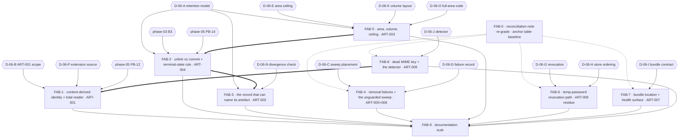

# Execution Plan — Phase 06: File artifacts remediation

## Purpose

Turn the validated findings of audit phase **06-file-artifacts** into a dependency-safe rollout
sequence. Every block names a semantic target, the `ART-*` and `VAL-06-*` identifiers it discharges,
its `blocked_by` set, its execution order, risk across implementation / rollout / regression /
compatibility, the agents it needs, its documentation impact, its verification and its definition of
done.

The plan fixes **order, isolation and risk containment**. It does **not** fix **implementation
choices** where genuine technical uncertainty exists. Sixteen decision records (**D-06-A** …
**D-06-P**) are carried open, each with its alternatives, its chooser and what it blocks; thirteen
are the Phase-1 code context's own and three (**D-06-N**, **D-06-O**, **D-06-P**) are raised by
this Planner where that list is silent on a fork the findings' remedies genuinely turn on.

**Report Roadmap Steps 0–4 are delivered as FAB-0, not as edits.** The audit corpus is an input, never
an implementation target: `VAL-06-001`'s re-grade is *applied* in this plan's scope table and
*recorded* in FAB-0, and `VAL-06-003`, `VAL-06-006`, `VAL-06-007`, `VAL-06-009` and `VAL-06-010` are
recorded there as corrections no Implementor may read the report without. No file under `.ai/audit/`
is edited by any block.

**The phase's top item is data loss, not availability.** `VAL-06-001`'s re-grade is applied without
reservation: **ART-004 is CRITICAL**, it is the phase's first code block after the ruling that unlocks
it, and it is the only block in this plan whose subject is *destroying the only copy of ingested
input data with no detector and no reversal*.

## Coordinator rulings of 2026-10-03 — BINDING ON EVERY BLOCK

**Every decision below is ruled. No block starts without one; none is open.** These rulings were
made after a Phase-1 re-audit of `HEAD` `85912d6`, because **nine of the sixteen records were
pre-empted by commits that landed after this plan was written at `2174895`.** Where a landed
commit already took one of a record's options, the record is marked **PRE-EMPTED** and the block's
scope shrinks to what genuinely remains.

| # | Ruling | Basis — what actually landed |
| - | ------ | ------------------------------- |
| **D-06-A** | **(b)** — the artefact is **scratch space, deleted on every terminal state**, and this is a *designed* property that must be written down. The unreachable `find_task_file` / `trigger_processing` pair is removed as the false claim it is. | `5e73e37` made all three deletion paths unconditional (success-after-commit, failure, enqueue-failure). Option (a) would need an unbounded area **and** a re-run path with no owner and no authorization decision; `trigger_processing` still has **no route caller**. |
| **D-06-B** | **(b) PRE-EMPTED.** Remaining scope is the **naming rule** and the **reader boundary** only. | `5e73e37` widened the worker's handler to `except BaseException`. |
| **D-06-C** | **(a)** — move `cleanup_stale_temp_files` into the **existing** lease-guarded `start_stale_processing_cleanup_task`. **One** loop, not two. | D-05-I already chose the lease-guarded periodic loop in `ee0f0f5`, and moved the orphan sweep into it. Option (b) would create the second lease loop C06-1 warns about. |
| **D-06-D** | **(c)** — retry-only, no record. `cleanup_stale_temp_files` returns `deleted` / `failed` / `already_gone` so the count is a contract the periodic task's status consumes. **The commit body must state plainly that ART-005's recording half is NOT closed.** | Phase 14 owns all DDL (C06-3) and the frontend consumes `ProcessingStatusResponse`; a column cannot ship in this phase. |
| **D-06-F** | **PRE-EMPTED — no phase-06 block.** | `6a2c04a` deleted `cleanup_task_files` and `cleanup_old_processing_logs`. `utils/file_utils.py`'s `platformdirs` pair stays with phase 02/08 (C06-12). |
| **D-06-G** | **(c)** — accept the TTL and document the window as a **written risk acceptance**. | The token is minted (`uuid4`) **after** the commit and `RegistrationRequest` persists **no** token, so option (a) needs a second transaction or a pre-commit mint — the "strictly worse state" FAB-6's own risk table names. |
| **D-06-H** | **PRE-EMPTED — (c).** `store` returns `bool`, commit-then-store. | `2de4156` + `7cf0623` + `478015b`. |
| **D-06-I** | **(a)** — one configured, **resolved** bundle path consumed by both the mount and the health component, through **one shared predicate**. **`HEALTHCHECK` is NOT touched.** | Two disagreeing predicates exist today: health uses `os.path.isdir`, the mount uses `exists() and index.exists()`. Not touching `HEALTHCHECK` removes the "passing container turns unhealthy" rollout hazard outright. |
| **D-06-J** | **(a)** — libmagic is a hard startup dependency; the `except ImportError` fallback is deleted. | Every shipped image already carries `libmagic1`, and the test image inherits it (`FROM base AS test`). `main.py::check_dependencies` is the project's own precedent. |
| **D-06-K** | **(a)** — `app_data` stays read-write on `app` and `rq-worker`. | Smallest; no deploy-time named-volume migration and no rollback story to invent. D-06-E's log half stays open under C06-04. |
| **D-06-L** | **MOOT — resolved by fact.** Option (b)'s shape is now the only one available; there is no concurrent editor left. | `907e052` (B3), `5e73e37` (PB-14), `916a021` (PB-12) all landed. |
| **D-06-N** | **MOOT.** No `artifact_filename` column exists under D-06-A(b), so there is no divergence check to place; and option (b) already collapsed into (a) when `ee0f0f5` moved the orphan sweep into the periodic task. | |
| **D-06-O** | **(c) is refuted; (b) is deferred with FAB-5.** No `ErrorCode` member covers storage, disk or quota — `models/enums.py` has 30 members and zero matches. The cheapest honest code if FAB-5 ever lands is `SERVICE_UNAVAILABLE`; a new member is authorised only by an explicit ruling, which this phase does not make. | |
| **D-06-P** | **(a)** — the stored extension is derived from the **detector's verdict at admission**. `services.file_processing.validate_mime_type` returns the detected type and raises `AppException(ErrorCode.INVALID_FILE_TYPE)` instead of a bare `ValueError`. | One rule; the stored name can never disagree with the bytes. The `ValueError` is also a live deviation from AGENTS.md's error layer. |

**FAB-5 is DEFERRED, not dropped — and its stated blocker has since been released.**
`9568c98` adjudicated the Product Owner decision register and, under `DP-10-7` / `DP-11-H`, stated
**"Unblocks phase 06 `FAB-5` / `C06-4`"** with a **50 GB** budget. So the disk budget that was the
hard input to D-06-E **now exists**.

FAB-5 is therefore no longer *blocked* — it is **outstanding**, and it is the phase's one
un-discharged finding (ART-003). What it still needs is a ruling nobody has made: **the ceiling's
number**. D-06-K is settled as (a) (no compose change) and D-06-O's option (c) is refuted — no
`ErrorCode` member covers storage, so the honest cheap code is `SERVICE_UNAVAILABLE`. What remains
is deciding what fraction of the 50 GB volume the artefact area may occupy, and expressing it
against the **resolved** directory. **A fraction is an operations decision, not a deriveable
constant**, and inventing one would be the guess this plan refused to ship. Under D-06-A = (b) the
area does not grow from retention — every terminal path deletes — so the pressure on the number
comes from in-flight uploads and the 24-hour age sweep, not from retained artefacts.

## Execution order as ruled (supersedes the table further down)

| # | Block | Gate — all now satisfied |
| - | ----- | ------------------------- |
| 1 | **FAB-0** | none |
| 2 | **FAB-8** | D-06-J = (a) |
| 3 | **FAB-7** | D-06-I = (a) |
| 4 | **FAB-4** | D-06-C = (a), D-06-D = (c) |
| 5 | **FAB-2** | D-06-A = (b) — no longer blocked on FAB-5 |
| 6 | **FAB-3** | D-06-A = (b), D-06-N moot — **no column, no migration** |
| 7 | **FAB-1** | D-06-P = (a), D-06-B remainder, PB-12 landed (`916a021`) |
| 8 | **FAB-6** | D-06-G = (c), D-06-H pre-empted |
| 9 | **FAB-9** | documentation, last by rule (R-06-6) |

---

## Anchor authority

> **The report's line numbers are not binding, and neither are this plan's.** Every anchor below is a
> symbol, a module, a contract, a table, a column or a config key. The report's own anchors resolve
> against a tree four commits deep: it was audited at `c3c0a61` plus a dirty tree, the validation read
> `c3c0a61` and `5a2cfb6`, and the code context read `2174895`. `VAL-06-009` is this defect, and it is
> now four trees rather than three.
>
> **The precedence rule, in words.** Where the report and the code context disagree about **where**
> something is or **what the code does**, the code context wins and this plan follows it. Where they
> disagree about **identity** — which findings exist and what they are called — the report's identifier
> set wins, and the code context's numbering is recorded as a defect rather than adopted. **No `ART-*`
> or `VAL-06-*` identifier is renumbered by this plan.**
>
> **If a symbol named below does not exist, that is a finding:** stop and report it rather than
> substituting the nearest match. **Re-check `git status` at block start** — `api/deps.py`,
> `db/session.py` and `interfaces/service_interfaces.py` carry phase-03 B1's work, and
> `src/mkobi/config.py` and `docs/06-backend/configuration.md` are under phase-01/02 work. None of
> those is a phase-06 edit target; a block that needs to *read* one of them must do so immediately
> before its own edit.

**The code context overrides the report on eleven points.** An Implementor who reads the report
instead of this plan does the wrong work, or works on a target that no longer exists:

| # | The report says | The code context establishes |
| - | -------------- | ----------------------------- |
| 1 | ART-001's remedy includes an `app.py` `BaseException` guard around an in-process consumer loop | **The loop is gone.** `3848e7a` replaced it with RQ; `app.py::lifespan` starts only `start_stale_processing_cleanup_task`, and `core/task_queue.py` is a 79-line RQ seam with no `TaskQueue`, no `process_next`, no `default_queue`. `tests/test_task_queue.py::TestRetiredSymbolsRemoved` actively asserts their absence. **The guard has no target** (R-06-3). |
| 2 | "a quarter of uploads stop working" — the consumer process dies | **Refuted.** rq 2.9.1's `worker/base.py::perform_job` wraps job execution in a bare `except:` that catches `BaseException`, marks the job `FAILED` and calls `handle_exception`. The blast radius is now one job, one retained artefact and one `processing_logs` row rolled back to `uploaded`. |
| 3 | ART-001's trigger is "a renamed `*.csv.gz`" | **Bounded, and reproduced today.** `CSVLoader._read_csv_lazy` does not select gzip — it hands the *path* to `pl.scan_csv`, so Polars sniffs the bytes. A **15.26 MB** mislabelled file loads (`LOADED (4000000, 1)`); a **6.10 MB** one raises `pyo3_runtime.PanicException` with `isinstance(e, Exception) == False`. The trigger is files **at or below `lazy_threshold_mb` (10.0 MB)**. |
| 4 | ART-006's remedy: store the credential **before** the status update, committing only after it succeeds | **Inverted by `2de4156`.** `services/auth_service.py::approve_registration_request` commits and *then* calls `temp_password_store.store`, and its docstring argues the choice in the open. The report's ordering is the one the code deliberately replaced (**D-06-H**). |
| 5 | ART-006 is one finding in `admin.py` | **Split and drifted.** The two `store` call sites now live in `auth_service.py` (approval **and** the admin password-reset path); `admin.py::approve_registration_request_admin_endpoint` delegates; `admin.py:321` / `:330` no longer name those statements, so phase 04's merge ruling is stale and **the coordination target is `auth_service.py`**. |
| 6 | "one container writes both the artefact area and the log file" | **Two containers do.** `app_data:/app/data` is mounted read-write on `app` **and** `rq-worker`, and both set `UPLOAD__TEMP_DIR=/app/data/tmp_uploads` and `LOGGING__LOG_FILE=/app/data/logs/app.log` (`migrate` sets the former). Two writers, two removers, one volume. |
| 7 | the artefact area is `/app/data/tmp_uploads` | **A compose-tier fact, not a property of the code.** `eeb9a5e` deleted `upload.temp_dir` from `settings/app.yaml`, so a host-run process resolves `UploadSettings.__init__`'s absolute `platformdirs` default — verified `C:\Users\Om\AppData\Local\ZOO\mkobi\tmp_uploads`. Any ceiling must be expressed against the **resolved** dir, never a literal. |
| 8 | ART-008's multiplicity is "four sweepers in one container" | **Wrong process set.** It is four API workers *and* a separate `rq-worker` that forks a work horse per job and unlinks artefacts while holding a job. The report's own advice — "make the sweep tolerant before wiring RQ rather than after" — has been overtaken: RQ is wired. |
| 9 | ART-008's "the two guards are inconsistent" is new | **Half old.** `mark_orphaned_uploaded_logs_failed` and the periodic reconciler were made lease-guarded (`4a5db54`, `a92b546`, `3856f27`, `9a77625`, `b646ef1`); `cleanup_stale_temp_files` was not, and is the only unguarded sweep of the three. |
| 10 | ART-009: "the declared allowed-MIME set is not the one enforced" | **Refuted by execution.** `get_config().allowed_mime_types` is byte-identical to `MimeTypeEnum.allowed_values()` — three members — and the shipped `settings/app.yaml` supplies all three. What survives is a doubly-dead property and a platform-dependent detector. The documentation consequence is **unsupported**: `docs/06-backend/configuration.md`'s row enumerates no values. |
| 11 | ART-005: "there is no other `unlink`/`rmtree` in `src/`" | **False — nine sites** (`VAL-06-007` re-verified): the worker's three, `file_cleanup.py`'s two, `file_processing.py`'s enqueue-failure compensation, `upload.py`'s two, and `shutil.rmtree` in `utils/file_utils.py::cleanup_temp_dir`, which the report's own Appendix E excludes. A **tenth** caller the report does not have: `tests/conftest.py` calls `cleanup_stale_temp_files(max_age_hours=0)`. |

**One anchor in this repository is ambiguous, and every block that names it must qualify it.**
`validate_mime_type` resolves to **three** definitions: `services/file_processing.py::validate_mime_type(file_path: Path) -> None`
(the admission site, which this phase targets), `utils/file_utils.py::validate_mime_type(mime_type: str) -> bool`
and `data/loaders/validator.py::validate_mime_type(mime_type: str) -> bool` (neither is a phase-06
target; both are separate symbols with their own owners). Write `services.file_processing.validate_mime_type`
in every commit body, issue and test name. `detect_file_type` is unambiguous by contrast — it exists
once, in `data/loaders/loader.py`, and has exactly one production caller
(`services/file_processing.py::process_upload_with_session`).

**Symbols the report names that do not exist today**, so no block may target them:
`app.py::queue_worker`, `asyncio.create_task(queue_worker())`; `TaskQueue`, `process_next`,
`default_queue`, `get_task_queue`; `admin.py:321` (store) and `:330` (commit); `app.py:328` (the
`FileResponse` site — it now lives inside the nested `SPAStaticFiles` class); the `config.py:174`-era
anchors; `docker/Dockerfile:179`; `compose.yml:113-247`.

## Anchor table (semantic; resolved at plan time, re-resolve at block start)

| Finding | Primary symbol anchors |
| ------- | ---------------------- |
| **ART-001** | `services/file_processing.py::detect_mime_type_from_content` (two module-scope definitions under `try: import magic` / `except ImportError`) · `::validate_mime_type` (reads `MimeTypeEnum.allowed_values()`) · `::validate_file` · `::process_upload_with_session` (`file_ext` from `detect_file_type(filename)`; `final_file_path = upload_dir / f"{log.id}{file_ext}"`) · `data/loaders/loader.py::detect_file_type` · `::CSVLoader.load_csv` (`except Exception` → `ValueError`) · `::CSVLoader._read_csv` (the real `gzip.open` branch) · `::CSVLoader._read_csv_lazy` (a debug log, then `pl.scan_csv(file_path, …).collect()`) · `::CSVLoader.__init__` / `LoaderConfig` · `models/enums.py::FileExtensionEnum` / `::MimeTypeEnum` · `workers/data_worker.py::_process_csv_file_async` (the nested `_run_with_transaction`, its `except Exception` chain) · vendored `rq/worker/base.py::perform_job` |
| **ART-002** | `db/models/processing_logs.py::ProcessingLog` (seven columns; **no name or path column**) · `services/file_processing.py::process_upload_with_session` (the producer's naming rule) · `::find_task_file` (`f"{task_id}.csv*"` glob, raises on 0 or >1) · `services/file_cleanup.py::cleanup_task_files` (`f"*{task_id}*.csv*"` glob) · `services/data_service.py::trigger_processing` (the only `find_task_file` caller; **no route caller**) · `::get_processing_status` / `::get_processing_result` (both fill `ProcessingStatusResponse.filename` from `log.message`) · `models/`'s `ProcessingStatusResponse` · `db/starter.py::DatabaseStarter.startup` (the only production sweep call) |
| **ART-003** | `api/routes/upload.py::upload_file_endpoint` (declared-`Content-Length` check, cumulative streamed-byte check, the `finally` unlink, the `upload_{uuid4}_{basename}` in-flight name) · the rate limiter's `max_attempts=100` / `ttl=3600` keyed `upload:{current_user.id}` · `config.py::UploadSettings.temp_dir` / `::Settings.upload_temp_dir` / `::_ensure_upload_dir` / `::UploadSettings.__init__` (the `platformdirs` default) · `::stale_file_threshold_hours` · `core/logging_config.py`'s `RotatingFileHandler` (10 MB × 5) · `docker/docker-compose.yml` (`app_data:/app/data` on `app` **and** `rq-worker`, `read_only: true` on `app`, `UPLOAD__TEMP_DIR`, `LOGGING__LOG_FILE` on both) · `docker/Dockerfile`'s three `mkdir -p … /app/data/uploads` stages (no code writes it) |
| **ART-004** | `workers/data_worker.py::_process_csv_file_async` (the nested `_run_with_transaction`: `_store_aggregates` → the success unlink → `_update_processing_log_status(COMPLETED)`, all inside the `async with session.begin():` of the production branch) · both `except Exception as e:` handlers and their unlinks · the own-session `FAILED` compensation (`0717b65`) · `services/file_processing.py::find_task_file` (the unreachable reversal) · `db/models/processing_logs.py::ProcessingLog` |
| **ART-005** | `services/file_cleanup.py::cleanup_task_files` (`except Exception` → `logger.error`) · `::cleanup_stale_temp_files` (glob `*.csv*`, `stat()`, `unlink()`, `except Exception` → `logger.error`, `deleted_count` counts only the files this process won) · `::cleanup_old_processing_logs` (zero production callers) · `workers/data_worker.py`'s two error-path unlinks (`logger.warning(..., exc_info=True)`) · `db/starter.py::DatabaseStarter.startup` · `tests/conftest.py` (the second sweep caller) |
| **ART-006** | `services/auth_service.py::approve_registration_request` (commit **then** `store`) · `::reset_password_admin` (the second `store` site) · `core/temp_password_store.py::TempPasswordStore.store` (fail-open) / `::retrieve` (catch-all `None`) / `_KEY_PREFIX` (the only `temp_pwd` occurrence in `src/` — no delete, revoke or invalidate anywhere) · `api/routes/admin.py::approve_registration_request_admin_endpoint` (delegates) · `::retrieve_temp_password_admin_endpoint` (`None` → `ErrorCode.NOT_FOUND`) · `api/deps.py::get_temp_password_store` · `config.py`'s `temp_password_ttl_seconds` (86400) · the registration-request model |
| **ART-007** | `app.py::_setup_static_files` (`Path("frontend/dist")` **relative to the process CWD**; the two-part `static_dir.exists() and index_path.exists()` condition; the catch-all mount at `/`; the single `else` warning branch) · `app.py::SPAStaticFiles.get_response` (the `FileResponse(index_path)` fallback, the `API_PREFIXES` guard) · `app.py`'s `/health/detailed` `static_files` component (`os.path.isdir("frontend/dist")` **alone**) · `docker/Dockerfile`'s `HEALTHCHECK` (gates on `/health`, which never mentions the bundle) · `docker/docker-compose.yml`'s nginx bind `../frontend/dist:/usr/share/nginx/html:ro` |
| **ART-008** | `services/file_cleanup.py::cleanup_stale_temp_files` (`except Exception` at the `stat`/`unlink`) · `db/starter.py::DatabaseStarter.startup` (the unguarded call beside two lease-guarded ones) · `app.py::lifespan` · `core/reconciler_lease.py::ReconcilerLease` · `docker/docker-compose.yml`'s `rq-worker` (`app_data` read-write) |
| **ART-009** | `config.py::UploadSettings.allowed_mime_types` (a **class default** of two members) · `::Settings.allowed_mime_types` (an unread **property**) · `settings/app.yaml`'s `upload.allowed_mime_types` (the site that actually decides the value) · `services/file_processing.py::detect_mime_type_from_content` (both branches) · `models/enums.py::MimeTypeEnum` · `utils/file_utils.py::validate_mime_type` (a third, unrelated symbol) · `docker/Dockerfile`'s two `libmagic1` installs · `main.py::check_dependencies` (the hard-dependency precedent) · `docs/06-backend/configuration.md`'s `allowed_mime_types` table row |

## Scope rulings (binding on every implementor)

**In scope — nine findings, ten validation records, with the bands the validation ruled.**

| Finding | Severity | Short name | Block |
| ------- | -------- | ---------- | ----- |
| **ART-004** | **CRITICAL** (re-graded by `VAL-06-001`) | The accepted artefact is destroyed on every terminal path, before the derived work commits | **FAB-2** |
| **ART-001** | HIGH (trigger narrowed by `VAL-06-004`) | The stored name claims a compression the bytes do not have; a small mislabelled file escapes every handler | **FAB-1** |
| **ART-002** | HIGH | Neither direction of store-versus-record divergence is detectable | **FAB-3** |
| **ART-003** | MEDIUM (tier-conditional) | The in-flight area is bounded by age only, and shares its volume with the log | **FAB-5** |
| **ART-005** | MEDIUM (one evidence sentence narrowed by `VAL-06-007`) | A failed removal is a log line and nothing else | **FAB-4** |
| **ART-006** | MEDIUM (residue only, per `VAL-06-002`) | Nothing removes the one-time secret except collection and the TTL | **FAB-6** |
| **ART-007** | MEDIUM | The bundle's presence changes the route table; health calls an unservable bundle "available" | **FAB-7** |
| **ART-008** | LOW | Concurrent reclaimers log the loser's collision as ERROR | **FAB-4** |
| **ART-009** | LOW (re-typed by `VAL-06-005`) | A configuration key with no reader, and a detector whose verdict depends on the image | **FAB-8** |

| VAL record | Status in this plan | Discharged by |
| ----------- | ------------------ | ------------ |
| **VAL-06-001** | **Applied** — ART-004 is CRITICAL in the table above, recorded as a re-grade rather than applied silently | **FAB-0** (the band, the ordering, the Summary correction), **FAB-2** (the ordering itself), **FAB-3** (the detector and the reversal the clause also names) |
| **VAL-06-002** | **Recorded** in FAB-0; the merge ruling is **stale** and the coordinate moves to `auth_service.py` | **FAB-6** (the residue, plus the two tests the report omitted) |
| **VAL-06-003** | Recorded in FAB-0: the Summary overstates runtime reach for blocks 2, 5 and 8 | **FAB-0** |
| **VAL-06-004** | **Applied as a triage bound**: the trigger is files at or below `lazy_threshold_mb` | **FAB-0** (the bound), **FAB-1** (the fix is branch-independent anyway) |
| **VAL-06-005** | **Applied**: ART-009 is re-typed; the divergence claim and its documentation consequence are **dropped** | **FAB-0**, **FAB-8** |
| **VAL-06-006** | Recorded in FAB-0: ART-002 is **contingent** on ART-004's decision, not separable | **FAB-3** (`blocked_by` D-06-A and FAB-2) |
| **VAL-06-007** | Recorded in FAB-0: nine removal sites, and the two off-by-one citations | **FAB-4** (the re-grep is FAB-4's Auditor task) |
| **VAL-06-008** | **Applied structurally**: five recommendations offered a choice where one is required. Every fork is now a numbered decision record with a chooser and a blocked block | **FAB-0**, the decisions section |
| **VAL-06-009** | Recorded in FAB-0: the `baseline:` field names a tree the anchors were not read from; four trees are now in play | **FAB-0** |
| **VAL-06-010** | Recorded in FAB-0; **out of scope for remediation** (the `VAL-001` collision is a property of the directory) | **FAB-0** (recording only) |

**Rulings this plan makes.**

| # | Ruling |
| - | ------ |
| **R-06-1** | **The audit corpus is an input, never a target.** Report Roadmap Steps 0–4 are FAB-0: the re-grade is applied in the table above, the five evidence defects and the internal contradiction are corrected in FAB-0's note, and **no file under `.ai/audit/` is edited by any block**. |
| **R-06-2** | **ART-006 is split as `VAL-06-002` rules.** The creation half is phase 04's AUTH-002 and the retrieval half is AUTH-006; **phase 06 keeps only the residue** — no revocation path other than collection and the TTL. FAB-6 names the two tests the report omitted (`test_retrieve_fail_graceful_on_error`, `test_retrieve_temp_password_single_use`) as **phase 04's blockers**, not its own. |
| **R-06-3** | **ART-001's `app.py` `BaseException` guard is deleted from scope and recorded as targetless.** rq 2.9.1 already reaps `BaseException` per job. What remains is the naming rule and the reader boundary, and — separately — the worker's own `except Exception` chain, which cannot reach `asyncio.CancelledError` and is a **defect in its own right** and phase 05's DP-016 (see the seam table). **No block may reintroduce a `TaskQueue`, an in-process queue, or a consumer loop**; `tests/test_task_queue.py::TestRetiredSymbolsRemoved` is a guard, not a coverage gap. |
| **R-06-4** | **D-06-F is narrowed to nothing this phase implements.** `cleanup_task_files` is **phase 05's** under D-05-J, and the `platformdirs` pair (`utils/file_utils.py::get_user_temp_dir` / `::cleanup_temp_dir`, re-exported from `mkobi.utils`) is **phase 02's configuration surface and phase 08's documentation surface**. There is **no phase-06 block**; the hand-overs are C06-6 and C06-12. FAB-3's cleanup path must nevertheless be written to survive *either* D-05-J ruling. |
| **R-06-5** | **ART-005 and ART-008 merge into FAB-4.** Same function (`cleanup_stale_temp_files`), same `try` block, same `logger.error`, one decision (D-06-C) governing both, one test file. Splitting them would produce two commits editing one exception handler and two reviews of one race. |
| **R-06-6** | **Documentation is edited in exactly one block** (FAB-9), plus comments and docstrings **inside a file a block already edits** (R-05-9's precedent, honoured). `docs/06-backend/architecture.md` is **phase-03 B10's** (C06-5); `docs/03-processing/**` is **phase-05 PB-16's** (C06-10); `docs/06-backend/configuration.md`'s environment table is **serialised with phase 01/02, never parallel** (C06-9); `AGENTS.md` is a rules file, not a `docs/` file (C06-15). |
| **R-06-7** | **No Alembic migration is authored here.** Both candidate columns (`ProcessingLog.artifact_filename`, `ProcessingLog.cleanup_error`) are **phase 14's DDL**; FAB-3 and FAB-4 own the requirement and the rule statement (C06-3). Also out of this phase: a frontend change, a new runtime dependency, an `ErrorCode` member (unless **D-06-O** rules one in), a new `ProcessingStatus` member, and any `docker/` edit except inside FAB-5. English only, no `print()`, `StrEnum` for any new constant. |
| **R-06-8** | **One implementor at a time** (`.kilo/rules/commands.md`: max two parallel subagents, one implementor). Dotted edges are review order, not parallelism. |
| **R-06-9** | **The "nine removal sites" count is a floor, not a ceiling.** FAB-4's Auditor re-greps at block start; a tenth site is a finding to report, not a number to reconcile. |
| **R-06-10** | **The `.csv.gz` exposure bound is a triage input, not a fix scope.** `VAL-06-004`'s 10.0 MB bound narrows *who is affected*; it does not narrow what FAB-1 fixes, because the defect is the **naming** — the stored extension asserts a compression the bytes do not have — and the reader must be total regardless of which branch reads it. |
| **R-06-11** | **No block in this phase may be implemented in parallel with phase-03 B3, phase-03 B2 or phase-05 PB-14 on the worker transaction.** FAB-2 is the phase's only block inside that region, and it is hard-blocked on all three predecessors. |

## Block map

`solid` = hard dependency (a blocker). `double` = hard sequencing, either because the report's own
gate demands it or because a wrong order silently breaks the other block. `dotted` = recommended
sequencing in the single-implementor queue, **not** a data dependency. Hexagons are decision records:
they are not blocks and produce no commit.

### Coverage ledger

| Block | Findings | VAL records | Agents |
| ----- | -------- | ----------- | ------ |
| FAB-0 | none of its own | VAL-06-001, 002, 003, 004, 005, 006, 007, 008, 009, 010 | — |
| FAB-1 | ART-001 | VAL-06-004 applied, VAL-06-008 resolved | Auditor, Planner, Validator |
| FAB-2 | ART-004 | VAL-06-001 applied | **Auditor, Researcher, Planner, Validator** |
| FAB-3 | ART-002 | VAL-06-006, VAL-06-008 resolved | Auditor, Planner, Validator |
| FAB-4 | ART-005, ART-008 | VAL-06-007 recorded | Auditor, Planner, Validator |
| FAB-5 | ART-003 | VAL-06-008 resolved | **Auditor, Researcher, Planner, Validator** |
| FAB-6 | ART-006 (residue) | VAL-06-002 recorded | Auditor, Planner, Validator |
| FAB-7 | ART-007 | VAL-06-008 resolved | Auditor, Planner, Validator |
| FAB-8 | ART-009 | VAL-06-005 applied | Auditor (narrow), Planner, Validator |
| FAB-9 | none of its own | all prose records reflected in the docs | Coordinator (D-06-M routing only) |

**Merges and splits, with reasons.** **ART-005 + ART-008 → FAB-4** (R-06-5: one function, one
exception handler, one decision). **ART-006 → FAB-6 is a reduction, not a split**: the two merged
halves go to phase 04 and only the residue stays, so one block carries what is left. Nothing else is
merged or split. **The report's own six roadmap steps become ten blocks** because its step 2 (ART-004)
is one decision with two shapes that cannot be split, its step 3 (ART-002 + ART-005's recording half)
is one schema conversation that phase 14 owns, and its step 5 (ART-003) mixes a code ceiling, a
compose volume and a logging decision that belong to three different owners.

---

## FAB-0 — Reconciliation note, the re-grade, the anchor table, the baseline

**Findings** none of its own · **VAL** all ten records · **Blocked by** nothing · **Blocks** every block
(as a constraint, not as data) · **Execution order** 1 of 10 in the FAB-* chain

Five deliverables, no production code:

1. **Apply `VAL-06-001`.** ART-004 is **CRITICAL** (recorded as a re-grade, not applied silently), and
   the report Summary's stated reason for the empty CRITICAL band — *"nothing here … destroys content
   that a durable record names"* — is contradicted by ART-004's own Consequence. The ordering follows:
   **ART-004 is this phase's first code block**, ART-001 second.
2. **Record the five evidence defects** so no Implementor sizes a job from the report's prose:
   - `VAL-06-003` — the Summary claims all eight blocks were reached at runtime; blocks 2, 5 and 8 were
     discharged by reading and grep. The three that were not are exactly where the drift is densest.
   - `VAL-06-004` — `CSVLoader._read_csv_lazy` **does not select gzip**; it logs and hands the path to
     `pl.scan_csv`. **Re-verified by execution today**: 15.26 MB mislabelled → `LOADED (4000000, 1)`;
     6.10 MB → `PanicException`, `isinstance(e, Exception) == False`. The bound is
     `lazy_threshold_mb` = 10.0 MB, **read from configuration, not hard-coded in any reasoning here**.
   - `VAL-06-005` — `get_config().allowed_mime_types` == `MimeTypeEnum.allowed_values()` (three
     members) == the shipped `settings/app.yaml` (three). The "declared set differs" claim and its
     documentation consequence are **dropped**; the dead property and the platform-dependent detector
     survive, and `settings/app.yaml` is the third declaration site the report never mentions.
   - `VAL-06-007` — **nine** removal sites, not "the four handlers and nothing else"; the ninth is
     `utils/file_utils.py::cleanup_temp_dir` (which the report's own Appendix E excludes) and the
     report's `Dockerfile:81` is `:80` and its `main.py:10-25` is `main.py::check_dependencies`. Plus
     the tenth caller the report does not have: `tests/conftest.py`.
   - `VAL-06-009` — anchors resolve against four different trees; the current one is `2174895`.
3. **Record the internal contradiction** (`VAL-06-006`): the report's Cross-Finding Analysis calls
   ART-002 separable while four roadmap steps gate on ART-004. **The correct statement is that ART-002
   is contingent on ART-004's retention decision** — which is what this plan encodes, and the stakes
   are higher than the report knew, because phase-03 B3 restructures the same `session.begin()` and
   phase-03 B2 adds a lock inside the same transaction.
4. **Record `VAL-06-008`'s disposition**: five recommendations offered a choice where one is required.
   Every such fork is now a numbered decision record with a chooser and a blocked block. **No block
   starts without its ruling.** Record `VAL-06-010` (the `VAL-001` collision) and hand it to whoever
   consolidates `.ai/audit/99-validation/` — it is a directory property, not a system defect.
5. **Ship the anchor table** (above) and **capture a baseline**: `.\Makefile.ps1 test` counts and
   `.\Makefile.ps1 check` output, plus `git status --porcelain`, recorded in the block's commit body.
   The rule for every later block is **do not regress**, not *make it green* — the phase-01 programme
   left the suite red at its own baseline and this phase inherits that tree.

**What this block explicitly does not do.** It does not edit
`.ai/audit/99-validation/06-file-artifacts-validated-findings.md` or
`.ai/audit/06-file-artifacts/findings.md`, and it does not choose an approach for any finding.

**Verification.** (a) every symbol in the anchor table resolves at the current `HEAD` by symbol read;
a symbol that does not resolve is a finding to report, not to work around — and the three
`validate_mime_type` definitions are confirmed distinct, per the ambiguity note above; (b) the
`artifacts` claim of the baseline — "no artifact-subsystem file is dirty" — re-checked with
`git status --porcelain -- src/ tests/ docker/ docs/ alembic/`; (c) baseline counts recorded.
**Commands:** `.\Makefile.ps1 test` · `.\Makefile.ps1 check`.

**Risk.** Implementation None · Rollout None · Regression None on the API · Compatibility None. The
only risk is **omission**: a block that starts without reading this note. One residual risk that is
*real*: a code block that changes only files the baseline did not measure will report a misleading
delta, so the baseline must include the **full** suite counts, not a sample.

**Agents required:** none beyond Implementor. It must not pull a Planner — it is a comparison of three
documents against the working tree, and a design role would only re-decide what the decisions section
already holds open.

**Documentation impact:** this plan, plus **one** `docs/SPEC.md` version row naming the plan path and
the phase (project convention: one row per programme, not per block). No other `docs/` file.

**Definition of done.** The re-grade is applied in this plan's scope table; all ten `VAL-06-*` records
are recorded or applied with no file edited under `.ai/audit/`; the anchor table resolves; the baseline
counts and `git status` are in the commit body; the `SPEC.md` row exists.

---

## FAB-1 — Name the artefact after its bytes, and make the reader boundary total (ART-001)

**Severity** HIGH · **Findings** ART-001 (`VAL-06-004`'s bound applied) · **Blocked by** **D-06-B**,
**D-06-P**, **D-06-J** (hard), **phase-05 PB-12** (hard — same two reader methods) · **Review-sequenced
after** FAB-8 (double edge) · **Blocks** FAB-9 · **Execution order** 9 of 10 in the FAB-* chain — the
last code block, and the one D-06-L(b) defers because it edits the two loader reader methods phase-05
PB-12 rewrites

**Problem.** The stored name chooses the reader, and the stored name is derived from **the caller's
filename**: `process_upload_with_session` computes `file_ext` from `detect_file_type(filename)` and
writes `upload_dir / f"{log.id}{file_ext}"`. Admission is decided **from bytes only**:
`services.file_processing.validate_mime_type` calls `detect_mime_type_from_content` and compares the
verdict against `MimeTypeEnum.allowed_values()` — which contains **both** `text/csv` and
`application/gzip` — and **nothing ever compares that verdict to `file_ext`**. So a plain CSV named
`*.csv.gz` is admitted (its bytes are `text/csv`, which is allowed) and stored under a false gzip
claim. Then `CSVLoader.load_csv` branches on size: at or below `lazy_threshold_mb` (10.0 MB) it calls
`_read_csv`, the one site that genuinely selects gzip, and `gzip.open` on non-gzip bytes raises
`pyo3_runtime.PanicException` — whose MRO is `PanicException → BaseException → object`, so
`isinstance(e, Exception)` is `False` and `load_csv`'s `except Exception` does not catch it. **Above
the threshold it loads correctly**, because `_read_csv_lazy` only *logs* the `.gz` name and hands
`pl.scan_csv` a path, which resolves the compression from the bytes.

**The report's consumer-death chain is void, and so is its remedy's second half (R-06-3).** The
in-process queue and its `except Exception` loop are gone; rq reaps `BaseException` per job. What
remains is a **per-job** failure: the job lands in the RQ `FailedJobRegistry`, the artefact is
**retained** (the worker's unlink never runs — that is FAB-2's and FAB-4's subject), and the
`processing_logs` row is rolled back to `uploaded`, repaired only at the next process boot by
`mark_orphaned_uploaded_logs_failed`. That residue is phase 01's TOPO-001 and is already filed.

**Open decision — D-06-B (the code context's): what remains of the remedy.** (a) content-derived
extension **plus** a total reader boundary; (b) additionally widen the worker's own `except Exception`
chain to `BaseException`; (c) both. **(b) is not this phase's to take as stated** — widening the
worker's handlers is phase 05's DP-016 (`PB-14`, `D-05-B`), and this block must not re-decide it
(C06-1). If **D-06-B(b)** is ruled, it is a *co-ordination* ruling, executed in PB-14 and recorded
here, not an instruction to edit the worker in FAB-1.

**Open decision — D-06-P (raised by this Planner; the code context's list is silent on the naming
mechanism).** The remedy's two halves have a genuine fork at the **admission boundary**, and the
report's wording does not settle it.

| Option | Trade-off |
| ------ | --------- |
| **(a) name from the detector's verdict** — `services.file_processing.validate_mime_type` returns the detected type instead of `None`; `process_upload_with_session` maps it to the extension | One rule, and the stored name can never disagree with the bytes. Costs a **return-type change on a public function** (its one production caller is `validate_file`, and `tests/test_mime_validation.py` calls it), and it makes the *name* depend on a detector whose verdict is itself undecided (**D-06-J**) — so the two blocks become one transaction of judgement. |
| **(b) keep the name, sniff at read time** — the reader chooses its decompressor from the magic bytes rather than from the name | Nothing about the stored name changes, so nothing else in the system that reads a `.csv.gz` name changes. But the name remains a **false claim** in the directory, in `find_task_file`'s glob and in any log line, and it leaves the record/artefact story (ART-002) describing a file whose name is a lie. |
| **(c) both** | The name is truthful *and* the reader is total. The largest diff, and the one that leaves nothing to re-decide later. |

**Not chosen here.** D-06-P and D-06-B must both be ruled before this block starts.

**Scope.** Under the rulings: the detector verdict reaches the stored-name rule; the reader boundary at
`CSVLoader._read_csv` / `_read_csv_lazy` / `load_csv` becomes total for the mislabelled case, with the
escaping exception converted into the loader's own declared error type rather than left to escape;
`file_ext`'s derivation is stated as an invariant in the code that owns it. **Does not:** reintroduce
any in-process queue or consumer loop (R-06-3); touch the worker's transaction, its unlink or its
handlers (FAB-2, PB-14); change `lazy_threshold_mb`, `max_file_size_mb` or the loader's byte ceiling
(**phase 05's PB-12 / D-05-O**); or size memory, the `.csv.gz` expansion ratio or the worker replica
count (**phase 11's**, C06-7). **Does not** re-open the detector question (FAB-8 / D-06-J).

**Verification.**
- **The report's own probe, turned into a test, at both branches.** Plain-CSV bytes stored under a
  `.csv.gz` name, at **0.000 MB and 6.10 MB** (eager branch) and at **15.26 MB** (lazy branch) —
  asserting the ruled outcome. The 15.26 MB case is the one that must stay green: it is the
  regression guard proving FAB-1 did not "fix" the branch that was never broken.
- A test asserting the *stored name* matches the bytes under the ruling: a real gzip stored with a
  `.csv` name, and a plain CSV stored with a `.csv.gz` name.
- `tests/test_data_service.py::test_validate_file_spoofed_gzip_rejected` **must be re-pointed, not
  deleted**, and this block must first establish *why* it passes today: the code context records that
  it passes only because its sample body detects as `text/plain` — which is the **libmagic** verdict.
  On a host without libmagic the fallback heuristic may classify the same bytes `text/csv` and admit
  them, so **this test is platform-dependent and its premise must be stated in the test** (or the
  fixture pinned to a libmagic-available tier). Its two siblings in the same file are affected
  identically.
- `tests/test_data_csv_loader.py` (which imports `detect_file_type` and asserts `.csv.gz`, `.csv`,
  `.CSV`, `.CSV.gz` and two rejections) — green; it is the tripwire for the naming rule's *filename*
  half, which FAB-1 does not change.
- `tests/test_mime_validation.py` (three classes) — updated **with** the detector and naming changes,
  never around them.
- `tests/test_task_queue.py::TestRetiredSymbolsRemoved` — **must stay green.** A failure here means a
  block reintroduced the retired mechanism.
- `tests/test_rq_worker.py::TestRegisteredJobCallable` asserts the **source text** of
  `enqueue_processing_job`. FAB-1 edits `process_upload_with_session`, not the enqueue signature; read
  the test before editing either function, and if a kwarg must change, the test changes **with** it in
  the same commit.
- `tests/test_e2e_upload.py` drives the whole path and is the phase's best single signal.

**Commands.** `.\Makefile.ps1 test-select -k test_data_service -v` ·
`.\Makefile.ps1 test-select -k test_data_csv_loader -v` ·
`.\Makefile.ps1 test-select -k test_mime_validation -v` ·
`.\Makefile.ps1 test-select -k test_rq_worker -v` · `.\Makefile.ps1 test-select -k test_task_queue -v` ·
`.\Makefile.ps1 test` (full suite, mandatory — HIGH band) ·
`uv run ruff check src/mkobi/services/file_processing.py src/mkobi/data/loaders/loader.py` ·
`uv run mypy src/mkobi/services/file_processing.py src/mkobi/data/loaders/loader.py`

**Risk.**

| Kind | Assessment |
| ---- | ---------- |
| Implementation | **Medium-High.** A return-type change on a public function, an invariant stated where the name is derived, and a reader boundary that must be total for an exception that is *not* an `Exception`. The failure mode is a boundary that catches too much and converts a genuine I/O fault into a "bad file". |
| Rollout | **Low on data, medium on admission.** Existing consistent uploads behave byte-identically under (a) and (c). Under (a), a file whose bytes and name disagree is now **named by its bytes** — its stored name changes, which is observable to `find_task_file`'s glob, to any log line and to a human looking in the directory. Under **D-06-J(a)**, a semicolon-delimited CSV's verdict also changes, and that is FAB-8's rollout, not this block's. |
| Regression | **High against the test shape.** `test_validate_file_spoofed_gzip_rejected` encodes the *intent* the finding changes and passes for an unrelated reason; `test_mime_validation.py`'s three classes are platform-dependent; `test_rq_worker.py` asserts source text. |
| Compatibility | **Low.** No API, schema or status change. The enqueued job's `file_path` argument changes value under (a)/(c) — a path, not a contract, but `test_upload_api.py`'s path-pinning assertion is phase 05's (`PB-1`) and must be checked, not edited here. |

**Agents required.**

- **Auditor** — required, and it is a **cross-phase premise re-check**, the same shape as phase-03's
  C-4: read **phase-05 `PB-12`'s landed state** in `CSVLoader._read_csv` / `_read_csv_lazy` /
  `::__init__` before editing, because `D-05-O` decides the lazy branch's *entire future* and this
  block edits the two methods PB-12 rewrites. Also establish the caller census of
  `services.file_processing.validate_mime_type` (production and tests) so the return-type change is
  complete, and re-check `git status` for `config.py` / `app.yaml` under phase-01 work.
- **Researcher** — **not required.** The external question — "what does it mean for a boundary to be
  total when the escaping class is a Rust extension type deriving from `BaseException`" — is already
  answered twice in this repository: the code context executed the MRO evidence, and phase 05's
  `VAL-05-004` recorded it as the reason DP-016's re-typing costs nothing at rollout. Re-running it
  would duplicate a ruling, not inform one. (The block *may* consult the polars/pyo3 issue tracker if
  the ruling is "raise a typed error instead of escaping" and the supported conversion is unclear.)
- **Planner** — required. The naming invariant, the admission-boundary change, the error conversion
  and the two-branch test matrix are a design, not a patch.
- **Validator** — required. A HIGH finding whose tripwire tests are platform-dependent and whose
  target file is being edited by another phase. The check that matters: **the new test must fail
  against the unfixed code** — a regression test that passes both ways proves nothing, which is
  `VAL-05-005`'s lesson as applied to this phase.

**Documentation impact.** FAB-9 owns every `docs/` edit (R-06-6). Its queue for this block:
`docs/03-processing/processing-api.md` (what a stored artefact is called and how it is read),
`docs/03-processing/file-cleanup.md` (the sweep's `*.csv*` glob still applies; the name is no longer
derived from the caller's filename), and — **if D-06-P(a)/(c) lands** — a statement that the name is
content-derived, which is a real contract for an operator reading the directory.

**Definition of done.** D-06-B and D-06-P ruled; phase-05 PB-12's commit read and its outcome recorded
in the commit body; the stored name matches the bytes under the ruling (or the reader is total and the
false claim is documented as such); both branches tested at 0.000 / 6.10 / 15.26 MB; the three
naming/consistency cases tested; `test_validate_file_spoofed_gzip_rejected` re-pointed with its premise
stated; `test_mime_validation`, `test_data_csv_loader`, `test_rq_worker`, `test_task_queue` and
`test_e2e_upload` green; `ruff`/`mypy` clean; the commit body names the residual: a mislabelled upload
above `lazy_threshold_mb` loads correctly **because Polars sniffs the bytes**, and that is not a
guarantee this block may rely on.

---

## FAB-2 — Order the unlink against the commit, and decide the artefact's terminal state (ART-004)

**Severity** **CRITICAL** (`VAL-06-001`) · **Findings** ART-004 · **Blocked by** **D-06-A** (hard),
**phase-03 B3** (hard — same `session.begin()`), **phase-05 PB-14** (hard — same unlink, `D-05-B`),
**FAB-5** (hard **only** under D-06-A(a); see below) · **Blocks** FAB-3 (double), FAB-9 ·
**Execution order** 7 of 10 in the FAB-* chain — after phase-03 B3 and phase-05 PB-14 land, per
D-06-L(b)'s "then the worker-transaction and loader blocks"

**This is the phase's first code block. `VAL-06-001`'s re-grade exists for it.**

**Problem.** On the success path, the nested `_run_with_transaction` inside
`workers/data_worker.py::_process_csv_file_async` does, in this order: `_store_aggregates` → the
success unlink (`if file_path.exists(): await asyncio.to_thread(file_path.unlink)`) →
`_update_processing_log_status(COMPLETED)` — **all three inside the `async with session.begin():`**
opened by the production branch. `Transaction.__aexit__` is what commits. So the artefact is
**destroyed before the commit of the aggregates derived from it**. On the failure path, an
`except Exception` handler *outside* the session block unlinks again, reports `FAILED` on a fresh
session (`0717b65`'s compensation — an improvement the report predates, and a regression guard) and
re-raises; the rollback edge destroys the source too. Both `except Exception` handlers are unreachable
for `asyncio.CancelledError` and for `PanicException`.

**The other half of `VAL-06-001`'s clause, and where it lives.** *Detection*: nothing in `src/`
compares the store against the records in that direction — `ProcessingLog` has no name column, and
`find_task_file`, the only code that would notice a record naming an absent artefact, is reachable
only from `DataService.trigger_processing`, which has **no route caller**. *Reversal*: the two unlinks
make the artefact's presence impossible for any task that has reached a terminal state, while
`trigger_processing` depends on the artefact surviving one. **The ordering is FAB-2's; the detector
and the reversal are FAB-3's.** Splitting them is what `VAL-06-006`'s correction demands and what this
plan encodes.

**Open decision — D-06-A (the precondition, and the report's own Step 1).** Is an accepted artefact
re-runnable after a terminal state?

| Option | Shape | Trade-off |
| ------ | ----- | --------- |
| **(a) retain past terminal state + explicit retention + user-initiated removal** | The worker unlinks only after the aggregates commit, and a named retention window plus an explicit removal path own the file's later life | Fixes the loss *and* makes `trigger_processing` meaningful again. Costs: the in-flight area **grows** (the code context's own risk line), so the bound in **D-06-E/FAB-5** becomes a precondition rather than a nicety; the re-run path needs an owner, an authz decision and a status contract nobody has written; and the reversal needs FAB-3's column. |
| **(b) delete on every terminal path; remove `trigger_processing` and `find_task_file`** | The artefact is scratch space, explicitly | Smallest and most honest for what the code does today, and it retires two dead functions. Costs: the report's Consequence — "the operator's only recourse is to ask the uploader for the file again" — becomes a **designed** property, which must be documented as one; the re-run capability the API shape implies disappears; and `D-06-A(b)` is a functional change (a capability is removed) inside a defect fix. |

**Not chosen here.** D-06-A is the phase's keystone: it gates FAB-2, FAB-3 and FAB-5 and it is the
code context's recorded **precondition for phase-03 B3's sequencing**.

**What this block must not decide.** The unlink's *placement* relative to the commit is **phase-05
`D-05-B`'s** and is already implemented-or-ruled in `PB-14`. FAB-2 lands **after** PB-14, reads its
commit, and adds only the retention semantics and the failure-path consequences that D-06-A implies.
**Re-deciding `D-05-B` in this block is a scope violation** (R-06-3, C06-1). The same applies to
phase-03 B3's boundary and B2's advisory lock: both are predecessors, not this block's work.

**FAB-5 as a conditional predecessor.** Under **D-06-A(a)** the area grows by every retained
artefact, bounded only by the 24-hour age sweep, and the ceiling that would bound it is unbuilt. FAB-2
is therefore hard-blocked on FAB-5 under (a). Under **(b)** the area does not grow and the block
proceeds without it. If **D-06-A(a)** itself names a retention window short enough to bound the area
on its own, the **Coordinator may waive this gate in writing**, and the waiver is recorded in FAB-2's
commit body with the window's number in it. **No Implementor may waive it unilaterally.**

**Scope.** Under the rulings and on top of both predecessors' landed shape: the unlink's position
relative to the commit **as D-06-A requires it**; the failure path's consequences (what survives a
rollback, what survives a cancellation, what survives a commit failure — all three must be stated, not
assumed); the two `except Exception` handlers' reachability for the base-class escapes that remain
*this block's* concern; the `tests/test_data_worker.py` contract. **Does not:** author the reversal
(FAB-3); add a byte or count ceiling to the sweep (**phase 05's / phase 10's**, C06-7); touch
`_update_processing_log_status`'s commit boundary (B3 / PB-1); touch the advisory-lock placement (B2);
or re-decide `D-05-B`.

**Verification.**
- **The report's probe, turned into a test**: after a successful run, assert the artefact's existence
  against the ruled model — **present and removable** under (a), **absent** under (b) — and assert it
  is never the case that "the aggregates committed and the file is gone" (under (a)) or "the
  transaction rolled back and the file is gone" (under (b), which is the point of (b): the file is
  deliberately disposable, but a *detected* loss is still needed, and FAB-3 supplies the detection
  only under (a) — **so under (b) the commit body must state plainly that the loss is designed and
  undetectable**, which is the honest form of `VAL-06-001`'s clause).
- A test that a **commit failure** leaves the ruled state. This is phase 05's `PB-14` deliverable
  (`(b)` of `D-05-B` records that "unlink after commit" leaks a file on every commit failure unless
  the failure-path unlink is retained). FAB-2 asserts it, and must not duplicate the implementation.
- A test that a **cancellation** leaves the ruled state. Also PB-14's, under the same ruling.
- `tests/test_data_worker.py` — including its **three `commit.assert_not_called()` assertions**, which
  encode that `_update_processing_log_status` writes and its caller decides. Any move of the unlink
  across the commit boundary crosses them; keep them green, and prefer the shape that leaves the
  helper non-committing.
- The `0717b65` own-session `FAILED` compensation must be asserted **unchanged** — it is the only
  thing between a failed run and a row stranded at `processing` forever.
- `tests/test_file_cleanup.py` and `tests/test_e2e_upload.py` stay green.

**Commands.** `.\Makefile.ps1 test-select -k test_data_worker -v` ·
`.\Makefile.ps1 test-select -k test_file_cleanup -v` ·
`.\Makefile.ps1 test-select -k test_e2e_upload -v` ·
`.\Makefile.ps1 test-select -k test_data_service -v` · `.\Makefile.ps1 test` (full suite, **mandatory** —
CRITICAL) · `uv run ruff check src/mkobi/workers/data_worker.py` ·
`uv run mypy src/mkobi/workers/data_worker.py` **(run for the record; it cannot see this defect — the
`asyncio.to_thread` boundary erases the argument types and it is clean before and after)**

**Risk.**

| Kind | Assessment |
| ---- | ---------- |
| Implementation | **High.** Two `except` clauses, a `finally` that must catch a base class **for cleanup only** and re-raise, and an ordering relative to a commit that two other phases are restructuring. A `finally` that swallows a cancellation is worse than the defect: the job would report success on a cancelled task. |
| Rollout | **High and asymmetric.** Under D-06-A(a) the area grows and a job that used to leave nothing behind now leaves a file — an intentional change with a capacity consequence. Under (b) a capability is removed. Either way, the **first** genuinely rolled-back run after this lands behaves differently from every one before it, and it will be read as a regression until the commit body says otherwise. |
| Regression | **High against phase-03 B3, phase-05 PB-14 and `0717b65`.** Three guards, one function. A diff that touches any of them without reading the predecessor's commit has gone wrong. |
| Compatibility | **Low on the wire.** No status value, API shape or schema change. Under D-06-A(a) a re-run capability may become reachable for the first time — **and `trigger_processing` has no route caller**, so "reachable" means the service method, not an endpoint, unless a route is added, which no block here authorises. |

**Agents required — all four.**

- **Auditor** — required, and its tasks are the ones that decide the block's real content:
  (1) the residual-failure inventory for D-06-A(a) — who may trigger a re-run, through what surface,
  with what authorization, and what the caller sees today for a terminal state (this spans routes,
  services, `ProcessingStatusResponse` and the frontend's polling renderer);
  (2) a read of **phase-03 B3's and phase-05 PB-14's commits** to establish the landed transaction
  shape this block must build on;
  (3) the current reachability census of `find_task_file` and `trigger_processing`, re-confirmed at
  block start because ART-002's shape depends on it and a route could have been added since.
- **Researcher** — required, narrow, and it is the one place external knowledge changes the shape:
  **how a filesystem side effect is made recoverable relative to a database commit** in a system with
  no distributed transaction. Specifically the option space between (i) delete-after-commit on
  success plus delete-on-failure (what `D-05-B` already enumerates) and (ii) an **intent record
  written inside the transaction and honoured by a reconciler** — which is `D-06-N`'s subject and
  needs to know what the standard patterns are, what they cost, and whether a sweeper that honours an
  intent column is materially better than a delete in a `finally`.
- **Planner** — required. Ordering across a filesystem and a commit, three failure edges, and a
  transaction another two phases own. The design question: **which resource is allowed to win, and
  what the system reports when they disagree.**
- **Validator** — required. CRITICAL, irreversible in the "retained artefact" direction, with three
  predecessor guards whose only coverage is what this block must keep green. The independent read
  that matters: *the failure path still reports `FAILED` on a session that has actually rolled back.*

**Documentation impact.** FAB-9 owns every `docs/` edit (R-06-6). Its queue for this block:
`docs/03-processing/file-cleanup.md` (what removes an accepted input, and when), `docs/00-overview/data-flow.md`'s
artefact lifecycle line, and — **under D-06-A(b) only** — an explicit statement that a terminal task's
input is not retained and cannot be reprocessed. `docs/06-backend/architecture.md`'s processing
section is **phase-03 B10's** (C06-5): FAB-2 raises the requirement through the hand-over and does not
edit the file.

**Definition of done.** D-06-A ruled; phase-03 B3 **and** phase-05 PB-14 landed and their commits read
and cited; FAB-5 landed (or a written Coordinator waiver naming a retention window); the unlink's
position implements the ruled model; the three failure edges (rollback, cancellation, commit failure)
each have a test asserting the ruled state; `test_data_worker`'s three `commit.assert_not_called()`
assertions green; the `0717b65` compensation asserted unchanged; the residual failure stated in the
commit body in the option's own terms; `test_file_cleanup` and `test_e2e_upload` green; `ruff` clean;
`mypy` run for the record and its inability to see this defect noted in the same body.

---

## FAB-3 — Give the record the ability to name its artefact (ART-002)

**Severity** HIGH · **Findings** ART-002 · **VAL** VAL-06-006, VAL-06-008 · **Blocked by**
**D-06-A** (hard), **FAB-2** (hard — the retention decision is the column or the deletion),
**D-06-N** (hard), phase-14 DDL via **C06-3** (the requirement is this block's; the migration is not) ·
**Blocks** FAB-9 · **Softly sequenced** after FAB-4's column ruling (one migration beats two) ·
**Execution order** 8 of 10 in the FAB-* chain — after FAB-2, whose retention ruling decides whether
the column exists at all

**Problem, in the code's own words.** `ProcessingLog` declares exactly `id`, `dashboard_id`, `status`,
`message`, `started_at`, `finished_at`, `error_code` and three indexes. **No name or path column.**
Three selectors then apply three different rules to the same file: the producer writes
`upload_dir / f"{log.id}{file_ext}"`; `find_task_file` globs `f"{task_id}.csv*"` and raises on **0 or
more than one** match; `cleanup_task_files` globs `f"*{task_id}*.csv*"`. Reachability is asymmetric and
that asymmetry is the finding: `find_task_file` has one caller (`DataService.trigger_processing`),
`trigger_processing` has **no route caller**, and `cleanup_task_files` has **zero callers in `src/`**.
Meanwhile `ProcessingStatusResponse.filename` is filled from `log.message` at two sites in
`data_service.py` — the field the client displays as the file's name is, in effect, whatever prose
happened to be in the message column.

**The identity convention now crosses a container boundary.** The producer names the artefact in the
`app` process; the remover is a work horse forked by the `rq-worker` process reading the same volume.
A convention that was already implicit between three functions in one module is now a convention
between two processes over a shared filesystem.

**Scope.** Under the rulings: the column and its write site; the two selectors' exact-name lookup
replacing their globs (and therefore `find_task_file`'s zero/multi-match raise, which exists only
because the name was not known); the removal path under D-06-A(a) — **which must be written to
survive either ruling of phase-05's `D-05-J`** (if `cleanup_task_files` is deleted, this block's
cleanup needs a different named owner, and the choice is recorded in the commit body); the
`ProcessingStatusResponse.filename` source; and the detector/reversal `VAL-06-001` names.
**Does not:** author the Alembic revision (**phase 14's**, R-06-7, C06-3); change the column type of
anything else; make `trigger_processing` reachable by **adding a route** (no block here authorises a
new endpoint — if D-06-A(a) wants a user-initiated removal surface, that surface's design is a hand-over,
recorded as C06-16); or re-decide `D-05-J`.

**Open decision — D-06-N (raised by this Planner; the code context's list is silent on where the
divergence check lives).** Under D-06-A(a) the column creates the possibility of a check the system
does not perform: *a record in a non-terminal state, older than the stale horizon, whose artefact is
absent*. Three homes, three different failure behaviours.

| Option | Trade-off |
| ------ | --------- |
| **(a) inside the existing lease-guarded periodic task** (`start_stale_processing_cleanup_task`) | One lease, one tick, one place to reason about; it already owns the stale horizon. Costs: a second concern inside a loop phase 01/02/03 all touched, and it **shares the tick with `cleanup_stale_processing_logs`** — the file check would run for every stale log, which is a stat per row. |
| **(b) inside `mark_orphaned_uploaded_logs_failed`** | Reuses a boot pass that already answers "which rows claim an artefact that may not be there". **Collides with phase-03 B3's `C-3` authorisation** (that function's horizon is B3's to set), so this option is only available with the Tech Lead's explicit extension of C-3. And it is boot-only — which is the class of defect the whole finding is about. |
| **(c) a separate reconciler** | Its own tick, its own interval key, its own failure isolation. The most code, and a third periodic concern in a process that already has two. |

**Not chosen here.**

**Verification.**
- A test that writes a row with the column set and the artefact absent, and asserts the ruled
  outcome (detected, or not — under D-06-A(b) the column does not exist and this test is replaced by
  an assertion that **no** divergence check is claimed).
- A test that a re-run under D-06-A(a) finds the artefact by **name** and that the same name removes
  it — the round trip that closes `VAL-06-001`'s reversal clause. It must go through the real
  container-shared path convention (`{log.id}{ext}`), not a fixture-only name.
- A test that `find_task_file` **no longer raises on multiple matches** because the name makes the
  case impossible — asserting the raise is gone is the test; a lingering multi-match raise is a bug
  under (a) and a bug under (b) too (a glob is a guess either way).
- A test that `ProcessingStatusResponse.filename` is sourced from the column and is `None`-safe for
  every pre-existing row (a nullable column is empty for the whole history; a client that received
  `"unknown"` before must not receive `None` now).
- `tests/test_processing_logs.py` (the tripwire for `message` content and the model's shape),
  `tests/test_data_service.py` (the `ProcessingStatusResponse` construction sites),
  `tests/test_openapi.py` (**only if** the response model's published shape changes — the field name
  does not, so a nullable value is wire-compatible; assert that, do not assume it), and
  `tests/test_e2e_upload.py`.

**Commands.** `.\Makefile.ps1 test-select -k test_processing_logs -v` ·
`.\Makefile.ps1 test-select -k test_data_service -v` ·
`.\Makefile.ps1 test-select -k test_file_cleanup -v` · `.\Makefile.ps1 test-select -k test_e2e_upload -v` ·
`.\Makefile.ps1 test` (full suite, **mandatory** — HIGH band and a model change) ·
`uv run ruff check src/mkobi/db/models/processing_logs.py src/mkobi/services/file_processing.py src/mkobi/services/data_service.py` ·
`uv run mypy src/mkobi/services/file_processing.py src/mkobi/services/data_service.py`

**Risk.**

| Kind | Assessment |
| ---- | ---------- |
| Implementation | **High.** A model change, three call sites whose rules change shape, a glob replaced by a lookup, and a response field whose source moves. The dangerous mistake is a **partially** applied identity: writing the column but leaving one glob, which produces a system that *looks* like it can find its files and still guesses. |
| Rollout | **Medium and mostly additive** — a nullable column changes no existing row. But under D-06-A(a) the divergence check, once it exists, will **fire for the first time** on rows stranded by the pre-fix ordering (ART-004's history): stranded `uploaded`/`processing` rows whose files were destroyed before this plan landed. The check's first run therefore has a backlog, and the commit body must say whether the first run is expected to be noisy. |
| Regression | **Medium-High.** `test_file_cleanup.py` follows the selector change; `test_data_service.py`'s two `filename` construction sites change source; and the phase-14 migration is not in this block, so the code cannot be deployed ahead of the column — the sequencing is a hard external dependency, not a preference. |
| Compatibility | **Medium.** `ProcessingStatusResponse` is a shared Pydantic model the frontend consumes. Keeping the field name and making the value nullable-or-`"unknown"` is wire-compatible; **changing the field name, its type, or emitting `null` where a client received a string is not** and needs C06-16's frontend inventory first. |

**Agents required.**

- **Auditor** — required: (1) the **frontend consumer inventory for `ProcessingStatusResponse.filename`**
  across `frontend/src/shared/types` and every renderer that displays it, so "nullable vs `"unknown"`"
  is decided on evidence (this is the phase's only wire-visible surface); (2) confirmation that
  `trigger_processing` still has no route caller at block start; (3) a read of phase-14's current
  Alembic head and revision-naming convention, since this block hands it a requirement.
- **Researcher** — not required. The column, the lookup and the check are in-repo shapes; the one
  external question (option (b) of D-06-N, whether the orphan pass is the right home) is a project
  decision, not a knowledge question, and its answer is constrained by `C-3` anyway.
- **Planner** — required. The record shape, the three selectors' new rules, the reversal's shape, the
  detector's placement (D-06-N), and the interaction with a phase-14 migration the block does not own.
- **Validator** — required. A model change consumed by a client, a rollout whose first run has a
  backlog, and a migration dependency the block cannot satisfy on its own. The check that matters:
  *no selector anywhere still globs.* A repository-wide grep for the two glob patterns is this
  block's acceptance test, not a reviewer's memory.

**Documentation impact.** FAB-9 owns every `docs/` edit. Its queue: `docs/09-database/schema-processing.md`'s
`processing_logs` column list is **phase 14's** (the migration is its DDL, so the doc moves with the
migration, not with this block) — FAB-9 **cross-references only**; `docs/03-processing/processing-api.md`
is **phase-05 PB-16's** file (C06-10), so FAB-9 raises the `filename`-source change there; and
`docs/03-processing/file-cleanup.md` gains a line saying a removal can now name its target, which
changes what that document currently promises.

**Definition of done.** D-06-A and D-06-N ruled; FAB-2 landed; the column's requirement and its
rule statement handed to phase 14 in writing (C06-3) and the hand-over recorded; all three selectors
address by name with no glob remaining (grep-proven); `ProcessingStatusResponse.filename` sourced from
the column and `None`-safe for pre-existing rows; the divergence check implemented per D-06-N or its
absence stated explicitly under D-06-A(b); the D-05-J-independent removal path recorded; the first-run
backlog question answered in the commit body; `test_processing_logs`, `test_data_service`,
`test_file_cleanup`, `test_e2e_upload` green; `ruff`/`mypy` clean.

---

## FAB-4 — Make the sweep tolerant, guarded and observable (ART-005 + ART-008)

**Severity** MEDIUM + LOW · **Findings** ART-005, ART-008 · **VAL** VAL-06-007 recorded · **Blocked by**
**D-06-C** (hard), **D-06-D** (hard) · **Softly sequenced** after FAB-3 if D-06-D(a) is ruled (one
migration, not two) · **Blocks** FAB-9 · **Execution order** 5 of 10 in the FAB-* chain — one of
D-06-L(b)'s four pre-phase-03/05 interleave blocks, with FAB-8, FAB-7 and FAB-6

**Why two findings in one block (R-06-5).** `cleanup_stale_temp_files` lists
`upload_dir.glob("*.csv*")`, `stat()`s and `unlink()`s each file inside one `try` whose
`except Exception` logs at ERROR. `FileNotFoundError` — the ordinary outcome of two reclaimers racing —
is therefore **indistinguishable in shape from a genuine `EACCES`**, and `deleted_count` counts only
the files *this* process won. That is ART-008's whole mechanism and ART-005's first half, in the same
six lines. Splitting them would produce two commits editing one exception handler and two reviews of
one race. The second half of ART-005 — that a failed removal is a **log line and nothing else**, with
no column, counter or metric anywhere in `src/`, and no retry because the reclaimer runs once per
process start — is what makes the block a decision rather than a patch.

**The drift the code context records, and what it means for this block.** The report's "four sweepers
in one container" is the wrong process set: it is four API workers **and** a separate `rq-worker` that
forks a work horse per job and unlinks artefacts while holding a job. The report's own advice — *"make
the sweep tolerant before wiring RQ rather than after"* — has been overtaken; RQ is wired. And the
inconsistency is now half-legacy: `mark_orphaned_uploaded_logs_failed` and the periodic reconciler were
made lease-guarded across five commits, and `cleanup_stale_temp_files` is **the only unguarded sweep of
the three**. The validator's re-runs (7, 7 and 8 spurious ERROR lines) are consistent with the
mechanism and inconsistent with the report's single figure of 5, which was one interleaving.

**Open decision — D-06-C (the code context's): which task, and does it inherit the lease?**

| Option | Trade-off |
| ------ | --------- |
| **(a) inside the lease-guarded `start_stale_processing_cleanup_task`** | One task, one cancellation path, one thing to reason about at shutdown, and the guard becomes uniform. **It changes a failure mode**: today every replica sweeps when Redis is unreachable; under a lease exactly one does. That is a behaviour change in a recovery path and the commit body must say which direction it moves. |
| **(b) a separate periodic task** | Preserves today's fail-open behaviour exactly. Costs a second task, a second tick, a second cancellation path, and a second place where two sweeps can race — the condition the lease was introduced to prevent. It is also **phase-05 PB-13's** decision space for the orphan sweep (D-05-I), so choosing (b) creates two periodic sweepers in one process where phase 05 is about to add one. |
| **(c) make the boot-only sweep lease-guarded, like the orphan repair** | Smallest diff, no new task, no new tick, and the guard becomes uniform where it matters. Leaves a **once-per-process-start** reclaimer: a failed removal is still not retried until a human restarts a process, which is ART-005's substantive half and is only addressed by (a) or (b). |

**Not chosen here.** Note that (a) and PB-13's option (a) must be decided **together** or the process
ends up with two lease loops (C06-1).

**Open decision — D-06-D (the code context's): where does a removal failure live?**

| Option | Trade-off |
| ------ | --------- |
| **(a) a nullable `cleanup_error` on `ProcessingLog`** | The only option that makes a removal failure a **fact** with a reader, and the only one an operator can see without log access. Costs a **migration** (phase 14's, C06-3), a second candidate column alongside FAB-3's, and it changes a **shared status payload's shape** — the frontend consumes `ProcessingStatusResponse`, and the code context lists this explicitly as a compatibility risk. |
| **(b) metric / log-only, with the failure counted and returned** | No migration, no payload change, no client work. The count is real (`cleanup_stale_temp_files` already returns `deleted_count`; a `failed_count` beside it is symmetric) and it is honest — but nothing reads it, which is the whole of ART-005's complaint. Cheapest, and it does not close the finding. |
| **(c) retry-only, no record** | The sweep is made periodic (D-06-C a/b) and a failed removal is retried next tick. Costs nothing, no migration, and it addresses "a failed removal is never retried" — the actual Consequence sentence — without a record. It does not address "a failed removal is a log line and nothing else". |

**Not chosen here.** If D-06-C is (c) and D-06-D is (c), this block becomes the `except`
classification alone and **must say so in its commit body** rather than implying it closed ART-005.

**Scope.** Under the rulings: `FileNotFoundError` separated from a genuine failure (with the ruling's
severity, log level and counting rule for each); the `deleted_count` contract stated; the sweep's
placement and guard per D-06-C; the failure record per D-06-D; and the `except Exception` in
`cleanup_task_files` and the worker's two error-path unlinks brought to the same distinction, so the
phase has **one** rule for "the file was already gone" rather than four.
**Does not:** author a migration (R-06-7, C06-3); decide the sweep's **selection** (which files are
eligible) — phase 05's PB-14 owns the file's *lifetime* and this block owns the sweep's *correctness*;
add a byte or count ceiling (**phase 10's / FAB-5's**, C06-4, C06-7); touch
`mark_orphaned_uploaded_logs_failed`'s horizon (**phase-03 B3's**, `C-3`); re-decide `D-05-J`
(phase 05's, R-06-4); or touch the 24-hour retention value itself.

**Auditor task attached, and it is a gate.** Re-grep the removal sites at block start and record the
count: `data_worker.py` (three), `file_cleanup.py` (two), `file_processing.py`'s enqueue-failure
compensation (one), `upload.py`'s `finally` and its own path (two), `utils/file_utils.py::cleanup_temp_dir`
(one — a tree no production path creates, and the report's Appendix E already excludes it). **Nine is a
floor (R-06-9).** Then establish the **caller census** for the sweep: `db/starter.py::DatabaseStarter.startup`
is the only production caller, and `tests/conftest.py` is a second one at `max_age_hours=0`. That second
caller is why a ceiling enforced *inside* the sweep would be inherited by the test fixture — the
ceiling belongs in the upload path (FAB-5), not here.

**Verification.**
- A concurrent-sweep test, in the report's own shape: N sweepers over M old files, asserting
  (i) every file is deleted exactly once, (ii) **no ERROR line is produced for a file another process
  won**, and (iii) the losing sweepers' return values sum with the winner's to M. Assertion (iii) is
  the one that makes `deleted_count` a contract rather than a log line, and it is the test the report
  did not have.
- A `PermissionError` (or an equivalent unwritable-file case) test asserting the **ruled** severity and
  that a record or a count exists per D-06-D. If D-06-D(a), a test asserting the `cleanup_error` value
  on the row and its visibility through the status response.
- Under D-06-C(a): a test that a **non-holder** does not sweep, and that the fail-open direction is the
  committed one — the same assertion shape phase 05's PB-13 requires, so the two do not contradict.
- `tests/test_file_cleanup.py` (four classes, including `TestProcessingFailureReportedOnOwnSession`)
  — updated **with** the ruling, never deleted. `tests/conftest.py`'s session cleanup must stay green
  and must not acquire a new inherited ceiling.
- `tests/test_data_worker.py` (the worker's two error unlinks) and `tests/test_app_lifespan.py` (six
  orphan-sweep patch sites — **phase 05 PB-13's**; if FAB-4 adds a second periodic task, those six are
  the tripwire that will fire) stay green.

**Commands.** `.\Makefile.ps1 test-select -k test_file_cleanup -v` ·
`.\Makefile.ps1 test-select -k test_data_worker -v` ·
`.\Makefile.ps1 test-select -k test_app_lifespan -v` ·
`.\Makefile.ps1 test-select -k test_starter -v` · `.\Makefile.ps1 test` (full suite, mandatory) ·
`uv run ruff check src/mkobi/services/file_cleanup.py src/mkobi/workers/data_worker.py src/mkobi/db/starter.py` ·
`uv run mypy src/mkobi/services/file_cleanup.py src/mkobi/workers/data_worker.py`

**Risk.**

| Kind | Assessment |
| ---- | ---------- |
| Implementation | **Medium.** One exception handler, one return contract, one placement. The real risk is **over-splitting the handler**: a broad `except` that swallows a real `EACCES` as "someone else got it" would convert a visible failure into silence, which is the opposite of the finding. |
| Rollout | **Medium, positive in the loud direction, and conditional.** Under D-06-C(a) the sweep stops running on every replica when Redis is unreachable — correct, and a behaviour change in a recovery path. Under D-06-D(a) operators see a value they have never seen. Under (b)/(c) the log gets **quieter** at ERROR level, which will be read as "the errors stopped" rather than as "they were never errors". |
| Regression | **Medium-High against phase 05 PB-13** — two periodic sweepers in one process, and six patch sites in `test_app_lifespan.py` that pin the *other* sweep's placement. `tests/test_file_cleanup.py` covers all three helpers and follows whatever D-05-J does. |
| Compatibility | **Low** unless D-06-D(a): then `ProcessingStatusResponse`'s shape changes and the frontend must be inventoried first (C06-16). Phase-10's alerting side is **phase 10's** (C06-4). |

**Agents required.**

- **Auditor** — required, and first: the removal-site re-grep (R-06-9) and the caller census, plus
  **git history for `cleanup_task_files` and `cleanup_old_processing_logs`** — phase 05's PB-14
  Auditor is running the same investigation under D-05-J, and this block must not duplicate or
  contradict it (C06-6). Also: does any environment, doc or test assume the sweep is boot-only?
- **Researcher** — not required. Exception classification, a lease primitive already in the repository
  with a written contract, and a return-value contract are all settled shapes; the concurrency
  mechanism is `ReconcilerLease`, which phase 01/02/03 already shipped and documented.
- **Planner** — required. The placement decision's consequence for a fail-open recovery path, the
  `deleted_count` contract, and the one-rule-for-four-sites consolidation.
- **Validator** — required. Two reclaimers racing is exactly the condition the current suite cannot
  express, and the fix's *whole point* is that ERROR lines stop appearing — which a careless test can
  achieve by swallowing exceptions. The independent read: *a real failure is still reported at the
  ruled severity.*

**Documentation impact.** FAB-9 only. Queue: `docs/03-processing/file-cleanup.md` (which is **phase-05
PB-16's** file, C06-10 — cross-reference and raise, do not edit), `docs/06-backend/architecture.md`'s
sweep paragraph (**phase-03 B10's**, C06-5), and the `cleanup_error` column's schema line if D-06-D(a)
(**phase 14's**, C06-3).

**Definition of done.** D-06-C and D-06-D ruled; the removal-site count re-verified and recorded; the
caller census recorded; `FileNotFoundError` distinguished from a real failure at all four
`except`-terminated sites; the `deleted_count` contract asserted; placement and guard as ruled with
the fail-open direction stated in the commit body; the record or count per D-06-D, **or an explicit
statement that ART-005's recording half is not closed**; `test_file_cleanup`, `test_data_worker`,
`test_app_lifespan` and `test_starter` green; `ruff`/`mypy` clean.

---

## FAB-5 — Bound the in-flight area, and settle the volume it shares (ART-003)

**Severity** MEDIUM (tier-conditional) · **Findings** ART-003 · **Blocked by** **D-06-E** (hard),
**D-06-K** (hard), **D-06-A** (hard — the ceiling's number depends on the retention model's growth),
**D-06-O** (hard), **phase-10's disk budget** via **C06-4** (hard — a ceiling without a budget is a
guess) · **Blocks** FAB-2 (conditionally, hard under D-06-A(a)), FAB-9 · **Execution order** 6 of 10 in
the FAB-* chain — after the D-06-L(b) interleave group, and a conditional predecessor of FAB-2 under
D-06-A(a)

**Problem.** Four controls bound an upload, and **none of them bounds the area**. `upload_file_endpoint`
checks a declared `Content-Length` and a cumulative streamed-byte count per request; the rate limiter
allows `max_attempts=100` per hour per `upload:{current_user.id}`; and `stale_file_threshold_hours`
(24) bounds age. There is **no count bound and no byte bound** on the in-flight area, and the periodic
task sweeps `processing_logs`, not the directory. Meanwhile the area is a *volume*, not a path: compose
sets `UPLOAD__TEMP_DIR=/app/data/tmp_uploads` and `LOGGING__LOG_FILE=/app/data/logs/app.log`, and
**`app_data:/app/data` is mounted read-write on `app` *and* `rq-worker`** — so the artefact area and a
10 MB × 5 rotating log file have **two writers and two removers**. `app` is `read_only: true` with no
tmpfs, so `app_data` is the only writable space, and there is no `user:` directive, so the files are
root-owned.

**The premise the report could not know.** `/app/data/tmp_uploads` is a **compose-tier fact**.
`eeb9a5e` deleted `upload.temp_dir` from `settings/app.yaml`, so a host-run process resolves
`UploadSettings.__init__`'s absolute `platformdirs` default — verified
`C:\Users\Om\AppData\Local\ZOO\mkobi\tmp_uploads`. **Any ceiling must be expressed against the
*resolved* directory** (`Settings.upload_temp_dir`), never against a literal, and it must behave
identically in both tiers. A third inert artefact: `docker/Dockerfile` still creates
`/app/data/uploads` in three stages and **no code writes it**.

**Open decision — D-06-E (the code context's): what bounds the area, and what happens to the log
sharing the volume?** (a) a per-directory size check before accept, rejecting the upload;
(b) a dedicated log volume (phase 10's compose edit); (c) stdout-only logging;
(d) all three. **The ceiling's number is not a free choice** — it needs a disk budget, which is phase
10's, and D-06-A's retention model, which is this phase's.

**A failure mode nobody has filed, recorded here so it is not discovered in production.** Rejecting an
upload because the **log** filled the volume is a new outcome: the user did nothing wrong, the disk
did, and the error would be indistinguishable from "your file is too large" if the code reuses
`FILE_TOO_LARGE`. That is exactly what **D-06-O** exists to settle. The reverse failure is equally
unnamed: the log handler's own failure behaviour when the volume is full, which is `logging_config`'s
and not this block's unless D-06-E(c) is ruled.

**Open decision — D-06-O (raised by this Planner; the code context's list treats the code as given).**
Which code a full artefact area reports.

| Option | Trade-off |
| ------ | --------- |
| **(a) reuse `ErrorCode.FILE_TOO_LARGE`** | No enum change, no client change, no doc change, and the HTTP mapping already exists. **It is also a lie**: the user's file is not too large, the disk is full. Every future reader of a 413 in the logs will draw the wrong conclusion, which is the class of defect `VAL-06-009` is about. |
| **(b) add `ErrorCode.UPLOAD_AREA_FULL`** (or the project's own naming) | Truthful and specific. Costs a new `ErrorCode` member — a **published contract** (`docs/08-security/error-format.md`, `docs/99-reference/error-handling-guide.md`) and a status mapping in `utils/exceptions.py`, plus a frontend path through the five-step chain in `errorHandler.ts`. R-06-7 forbids this phase from adding an `ErrorCode` member **unless this decision rules it in**; ruling (b) is therefore an explicit authorisation, and it makes the block's compatibility cost a designed one. |
| **(c) reuse an existing storage/disk code if one exists** | Cheapest if one exists. **Verify before proposing** — `models/enums.py` is shared and no phase-06 block may assume an unlisted member. If none exists, this option collapses into (a) or (b). |

**Open decision — D-06-K (the code context's; the **Coordinator** chooses, not the Tech Lead, because
it is a topology and operations question).** Does `rq-worker` keep a read-write mount of the artefact
area, given it is the component that unlinks? (a) keep `app_data` read-write; (b) split the artefact
area onto its own volume shared only by `app` and `rq-worker`; (c) move the removal into the API
process.

| Option | Trade-off |
| ------ | --------- |
| **(a) keep `app_data` read-write** | No compose change; the log keeps sharing the volume, so D-06-E's log half stays open and the "reject because the log filled the disk" failure mode remains reachable. Smallest diff and no operational change. |
| **(b) split the artefact area onto its own volume** | Decouples the two concerns, gives the area its own budget and its own backup story, and is the only option under which a byte ceiling has a stable denominator. Costs a compose edit in **both** compose files, a migration of existing artefacts at deploy time (files on the old volume), and phase 10's backup/disk work — it is **the** change that makes the backup implication, which the code context records as filed by nobody, somebody's job. |
| **(c) move the removal into the API process** | The `rq-worker` loses its new write privilege, which the code context lists as a **new privilege in a container that previously only ran the `rqworker` CLI** — a genuine security improvement. Costs: the consumer would have to call back into the API to remove its own input, adding a network hop to the worker and an authenticated internal endpoint, or a second queue job whose own failure is unobserved. **The largest design in the phase and the one with the least in-repo precedent.** |

**Not chosen here.** D-06-E, D-06-K and D-06-O are all open, and all three need a number that comes
from phase 10.

**Scope.** Under the rulings: a pre-accept bound in `upload_file_endpoint` against the **resolved**
`Settings.upload_temp_dir`, with the ruled error code; the compose change(s) D-06-K rules, in **both**
`docker-compose.yml` and `docker-compose.test.yml`, including the `migrate` service's
`UPLOAD__TEMP_DIR`; the log's fate per D-06-E(b)/(c); the three inert `mkdir -p /app/data/uploads`
stages. **Does not:** enforce the ceiling **inside** `cleanup_stale_temp_files` (it would be inherited
by `tests/conftest.py`'s `max_age_hours=0` call — the Auditor task in FAB-4 says so, and it is
binding); touch the 24-hour retention value (FAB-4's rule, phase 10's number); alter the admission
**size** ceiling (`max_file_size_mb`, phase 05's PB-12 / `D-05-O`) or the rate limiter; make a
frontend change (C06-16 under D-06-O(b)); or decide the disk budget, the backup story or the alerting
(**phase 10's**, C06-4).

**Verification.**
- A test that the area's byte total is bounded: fill a resolved temp dir past the ruled threshold and
  assert the ruled outcome, **through the HTTP route**, since the bound is an admission control and the
  report's own rule is that a size check tested only at the helper proves the helper exists.
- A test that the bound is expressed against the **resolved** directory — i.e. it works with
  `UPLOAD__TEMP_DIR` set (container tier) and unset (host tier) with no code change, and the test
  states which tier it is asserting.
- A default-value test asserting the ceiling's shipped default is unchanged by the block unless
  D-06-E rules otherwise.
- Under D-06-O(b): a test asserting the new code maps to the ruled HTTP status through
  `utils/exceptions.py`, plus the frontend's `errorHandler.ts` chain reached — the latter is
  **phase 16's / the frontend owner's** (C06-16); this block produces the inventory.
- Under D-06-K(b): a test-free change, verified by `.\Makefile.ps1 config` / `config-test` resolving
  the same environment and by a documented list of what moves on the volume at deploy time.
- `tests/test_streaming_size_limit.py` covers the **HTTP size** path this block does **not** change —
  keep that separation; `tests/test_upload_api.py` and `tests/test_mime_validation.py` stay green.

**Commands.** `.\Makefile.ps1 test-select -k test_streaming_size_limit -v` ·
`.\Makefile.ps1 test-select -k test_upload_api -v` · `.\Makefile.ps1 test-select -k test_config -v` ·
`.\Makefile.ps1 test` (full suite, **mandatory** — the block adds a rejection path) ·
`uv run ruff check src/mkobi/api/routes/upload.py src/mkobi/config.py` ·
`uv run mypy src/mkobi/api/routes/upload.py src/mkobi/config.py` ·
`docker compose -p mkobi config` and `-p mkobi-test -f docker/docker-compose.test.yml config` to prove
both compose files still resolve (never paste their output — they print secrets).

**Risk.**

| Kind | Assessment |
| ---- | ---------- |
| Implementation | **High.** A new rejection path, a configuration key in a file under active phase-01/02 work, and a compose topology edit in two files with a third service (`migrate`) that must not be forgotten. The failure mode is a bound that counts the *wrong* thing — for example a check that reads the directory on every request and becomes a latency or a `stat` storm under the rate limiter's 100/hour/user. |
| Rollout | **High and asymmetric.** A ceiling that is too low rejects uploads that work today; too high leaves the defect. Under D-06-K(b) **existing artefacts on the old volume stop being found by a process looking at the new one** — a deploy-time migration with a rollback story nobody has written. Under D-06-E(c) every container's logging destination changes, which is an operational surface the phase cannot see. |
| Regression | **Medium-High.** The `app` service is `read_only: true` and the bound writes nothing, but a compose edit that misses a service produces a container that cannot create its own temp dir at settings construction — and `Settings._ensure_upload_dir` does exactly that, so the failure is a **startup** failure, not a request failure. |
| Compatibility | **Medium**, and conditional on D-06-O: under (a) no wire change and a wrong message; under (b) a new published error code and a frontend path. Under D-06-K(c) a new internal surface between two containers. |

**Agents required — all four.**

- **Auditor** — required: (1) the **frontend and client inventory for a new upload rejection** — what
  the UI shows for `FILE_TOO_LARGE` today, and what a new code would need (C06-16); (2) whether any
  environment, `Makefile.ps1` target, `docs/10-deployment/deployment.md` or backup script names
  `/app/data/uploads` or assumes one volume; (3) a re-read of `src/mkobi/config.py` and
  `settings/app.yaml` **immediately before** editing, because phase-01 work is live in both.
- **Researcher** — required, and this is the block where external knowledge genuinely decides the
  answer: **how to bound a directory's total size cheaply and correctly** in a container where the
  bound is checked per request — a per-file accounting maintained by the writer, a periodic
  `os.scandir` sum, a filesystem quota, or a Prometheus-style gauge consulted at admission — and what
  each costs in latency, in `stat` count, and in the number of failure modes added to the admission
  path. Second question, only under D-06-K(b): **what is the correct way to move a Docker named
  volume's contents at deploy time without a window in which the two containers disagree**, and what
  the rollback is.
- **Planner** — required. Where the bound lives, what it counts, the error contract (D-06-O), the
  compose topology (D-06-K), and the interaction with a retention model that is still open (D-06-A).
- **Validator** — required. **A new rejection path is the block's whole content**: a wrong default, a
  wrong unit or a wrong denominator rejects real uploads or, worse, never fires. Plus a compose edit
  whose failure mode is a container that will not start.

**Documentation impact.** FAB-9 only. Queue: `docs/06-backend/configuration.md`'s environment-variable
table **serialised with phase 01/02** (C06-9 — the table is phase 01's and two phases must not edit it
at once); `docs/10-deployment/deployment.md`'s volume and disk-budget section is **phase 10's**
(C06-4); `docs/03-processing/file-cleanup.md`'s "bounded by age only" sentence becomes false and is
**phase-05 PB-16's** file (C06-10) — FAB-9 raises it there rather than editing it.

**Definition of done.** D-06-A, D-06-E, D-06-K and D-06-O ruled; **phase 10's disk budget recorded in
the commit body with the number it produced**; the bound expressed against the resolved directory and
tested in both tiers; the ruled error code mapped and, under D-06-O(b), the client inventory recorded
for C06-16; both compose files resolve and every service that needs the artefact area still has it
(including `migrate`); the log's fate as ruled; the three inert `mkdir` stages resolved one way or the
other **in writing**; the ceiling explicitly **not** enforced inside the sweep; `test_streaming_size_limit`,
`test_upload_api` and `test_config` green; `ruff`/`mypy` clean.

---

## FAB-6 — End the one-time secret somewhere other than the TTL (ART-006, residue only)

**Severity** MEDIUM (residue) · **Findings** ART-006 (residue) · **VAL** VAL-06-002 recorded ·
**Blocked by** **D-06-G** (hard), **D-06-H** (hard), phase-04 coordination via **C06-2** ·
**Blocks** FAB-9 · **Execution order** 4 of 10 in the FAB-* chain — one of D-06-L(b)'s four
pre-phase-03/05 interleave blocks, with FAB-8, FAB-7 and FAB-4

**What this block is, and what it is not (R-06-2).** `VAL-06-002` splits ART-006 and the split is
correct. The **creation half** (a `store` that fails open) is phase 04's AUTH-002; the **retrieval
half** (every `None` collapsing to `NOT_FOUND`) is AUTH-006. **Neither is phase 06's, and the
coordination target has moved**: the code now performs `store` in
`services/auth_service.py::approve_registration_request` (after the commit, by `2de4156`'s explicit
design) and in the admin password-reset path — **two service sites, not one route site plus one
service site** — so phase 04's anchors (`admin.py:321` store, `:330` commit) no longer describe those
statements and the merge ruling is stale. **What remains, and is confirmed by a repository-wide grep
for `temp_pwd`: there is no delete, revoke or invalidate anywhere in `src/`.** Nothing removes the
secret on user deletion, request rejection, or password change. `TEMP_PASSWORD_TTL_SECONDS` (86400) is
the **sole** expiry, and `deps.py::get_temp_password_store` is the only construction path.

**Why the finding is MEDIUM and not CRITICAL, restated so it is not re-opened:** the rubric's
CRITICAL clause requires a secret recoverable *after the window in which it may be collected*. The TTL
bounds that window and Redis evicts inside it. What the rubric's MEDIUM clause names — *"a secret the
caller is told exists and that no failure path ever reports as absent"* — is what survives.

**Open decision — D-06-G (the code context's): build a revocation path, or accept the TTL?**

| Option | Trade-off |
| ------ | --------- |
| **(a) persist `retrieval_token` on the registration request and add `revoke`** | The only option that makes the secret's life **addressable**, so user deletion, request rejection and a password change can end it. Costs: a **schema change** (phase 14's, C06-3), a new method on `TempPasswordStore`, the call sites that must invoke it (at least three, none of which exists today), and a **fact-shaped question the current design deliberately avoids**: the service currently mints the token *after* the commit, so a row written in the same transaction would not have it. |
| **(b) shorten the TTL** | One configuration value. Cuts the exposure window without a schema change, a new method or a call site. It also **shortens the operator's window** to hand the credential over, and it is a number chosen without a threat model — which is a policy change dressed as a fix. |
| **(c) accept the TTL and document the window** | Cheapest, and honest about what the system is. Leaves the finding substantively open: the caller is still told a credential exists and nothing reports it absent until the TTL expires. It is defensible **only** if the window is small and the decision is written down as a risk acceptance. |

**Not chosen here.**

**Open decision — D-06-H (the code context's): the creation half's ordering.** The report's
recommendation — *store before the status update, committing only after it succeeds* — is the ordering
`2de4156` **deliberately replaced**, and the docstring in `approve_registration_request` argues for the
shipped order in the open, including naming the residue: *"The store fails open by design, so a
non-raising call is not proof that the credential is retrievable."* Options: (a) keep it, change
nothing; (b) make `store` raise and re-order back; (c) make `store` return a bool checked after the
commit.

**This block is blocked on D-06-H, and that dependency is real, not ceremonial.** Under (a) and (c)
the token is minted after the commit, so **D-06-G(a) cannot persist it in the same transaction** — a
store failure leaves a persisted request with no token, and the operator has nothing to revoke or
re-issue against. Under (b) the token exists before the commit, and persisting it is free. The
ordering decision therefore *is* the revocation decision's precondition, which is why FAB-6 must not
start before it.

**Scope.** Under the rulings: the revocation path (D-06-G) at its ruled granularity — a new
`TempPasswordStore` method plus the call sites the ruling names, and the model change handed to
phase 14 (C06-3) — and, under D-06-H(c), the bool the service checks. **Does not:** edit
`api/routes/admin.py::retrieve_temp_password_admin_endpoint` (that mapping is **phase 04's AUTH-006**,
and its correction is `test_retrieve_temp_password_single_use`'s business); change `retrieve`'s
catch-all `None`; re-order the approval transaction if D-06-H rules (a) or (c); change the TTL default
without the ruling; or touch `force_password_change`'s consumer (**phase 04's / phase 15's**).

**Verification.**
- A test that a revoked token is **not** retrievable — and, under D-06-G(a), that the revocation is
  reachable from the three events the residue names (user deletion, request rejection, password
  change), each asserted separately so a missing call site is visible.
- Under D-06-G(a): a test that a persisted `retrieval_token` survives a store failure, so the operator
  can re-issue — **this is the case that makes D-06-H consequential**, and it is the test that
  distinguishes option (b) from (a)/(c).
- Under D-06-G(c): a test asserting the **documented** window and no new behaviour, plus the risk
  acceptance recorded.
- `tests/core/test_temp_password_store.py::test_store_fail_open_on_error` and
  `::test_retrieve_fail_graceful_on_error` — **phase 04's blockers**, named here because the report
  omitted the second (VAL-06-002). FAB-6 **must not break them**; if D-06-H(b) is ruled, both break by
  design and that is phase 04's commit to make.
- `tests/api/test_temp_password_retrieval.py::test_retrieve_temp_password_single_use` — green; the
  single-use property is FAB-6's regression guard and must not weaken.
- `tests/test_health.py` if the store's construction or health reporting changes.

**Commands.** `.\Makefile.ps1 test-select -k test_temp_password -v` ·
`.\Makefile.ps1 test-select -k test_admin_registration -v` ·
`.\Makefile.ps1 test-select -k test_health -v` · `.\Makefile.ps1 test` (full suite, mandatory) ·
`uv run ruff check src/mkobi/core/temp_password_store.py src/mkobi/services/auth_service.py` ·
`uv run mypy src/mkobi/core/temp_password_store.py src/mkobi/services/auth_service.py`

**Risk.**

| Kind | Assessment |
| ---- | ---------- |
| Implementation | **Medium.** A new method, three call sites that do not exist, and a schema change this block does not own. The dangerous mistake is implementing (a) while the ordering is (a)-shaped, which produces a persisted request with no token and no way to find the secret again — **a strictly worse state than today's**, which at least leaves a retrievable credential. |
| Rollout | **Medium and security-positive.** Under D-06-G(a) a new column holds a **secret-adjacent token** and therefore becomes a backup target and a retention subject nobody has filed; the volume/backup seam is C06-11 and phase 10's. Under (c) nothing changes and the risk is accepted in writing. |
| Regression | **Medium against phase 04.** Two other owners are editing the same two functions with the same two test modules. The three named tests are the tripwires, and **two of them are not this phase's to fix**. |
| Compatibility | **Low-Medium.** Under D-06-G(a) the registration-request record gains a field; if any response echoes the request, the OpenAPI shape changes and `tests/test_openapi.py` is the tripwire. Under D-06-H(b) the approval endpoint's failure behaviour changes — an admin-visible outcome. |

**Agents required.**

- **Auditor** — required, and the cross-phase premise is the work: (1) **re-read phase 04's AUTH-002
  and AUTH-006 as they exist now** (their anchors are stale — C06-2) and record what phase 04 has
  already ruled or implemented, so FAB-6 does not re-open it; (2) the caller census for
  `TempPasswordStore.store` / `.retrieve` and for `get_temp_password_store`, to confirm the code
  context's two-`store`-sites claim at block start; (3) whether any response model, OpenAPI document
  or test echoes the registration request, which decides the compatibility cost.
- **Researcher** — not required. The one-time-secret pattern, `GETDEL`-style atomic retrieve and a
  TTL are all in-repo or in the store's own docstring; the question is a policy question, not a
  knowledge question.
- **Planner** — required. Where the token's home is, what "revocation" means for a secret already
  collected (nothing — and that must be stated), and the three call sites' ordering relative to their
  own transactions.
- **Validator** — required. A credential's lifecycle, a schema change owned by another phase, and two
  sibling owners on the same functions. The check that matters: **a store failure under D-06-G(a)
  leaves a recoverable, re-issuable state rather than an orphan.**

**Documentation impact.** FAB-9 only. Queue: `docs/04-admin/admin-api.md`'s approval and retrieval
sections — **phase 05 PB-16 already edits that file** (it owns the retired `success` status row), so
FAB-9 serialises with it; and the registration-request model line is **phase 14's** (C06-3). Under
D-06-G(c), the accepted window is a risk statement, and the correct home for a risk statement is
FAB-9's own commit body plus a doc line — **not** a comment in the code.

**Definition of done.** D-06-G and D-06-H ruled; phase 04's current state read and recorded; the
revocation path implemented at the ruled granularity **or** the TTL accepted in writing with the window
stated; the model requirement handed to phase 14 (C06-3); the store-failure case asserted recoverable or
explicitly excluded by the ruling; `test_store_fail_open_on_error`, `test_retrieve_fail_graceful_on_error`
and `test_retrieve_temp_password_single_use` green; `test_openapi` green if the request shape changed;
`ruff`/`mypy` clean.

---

## FAB-7 — Make the bundle's location a contract, and the health surface tell the truth (ART-007)

**Severity** MEDIUM · **Findings** ART-007 · **Blocked by** **D-06-I** (hard) · **Blocks** FAB-9 ·
**Execution order** 3 of 10 in the FAB-* chain — one of D-06-L(b)'s four pre-phase-03/05 interleave
blocks, with FAB-8, FAB-6 and FAB-4

**Problem.** `app.py::_setup_static_files` resolves `Path("frontend/dist")` **relative to the process
CWD** and registers the catch-all mount at `/` only when `static_dir.exists() and index_path.exists()`;
otherwise it logs one warning and registers nothing. `/health/detailed` reports `static_files` from
`os.path.isdir("frontend/dist")` **alone** — it never checks `index.html`, which is the condition the
mount requires. `/health`, which the Dockerfile's `HEALTHCHECK` and nginx gate on, never mentions the
bundle at all. And the bundle reaches **two consumers by two routes**: the image-baked copy the `app`
container serves, and the host bind `../frontend/dist:/usr/share/nginx/html:ro` on the
production-profile `nginx` service. One health surface, two copies, and a CWD-dependent resolution that
makes the whole thing depend on how the process was started.

**The report's three presence states reproduce identically today**, and the divergence is the finding:
*absent* → no mount, `static_files: unavailable`, API-only routes; *present but wrong* (a `dist`
without `index.html`) → **no mount, byte-identical route table, and `static_files: available`**;
*correct* → `/` and deep links serve `index.html`. The host-platform artefact the validation recorded
(`API_PREFIXES = {"api/"}` never matching on Windows because Starlette builds the path with
`os.path.join`) is a methodology limit, **not** a finding, and is recorded here so no Implementor
"fixes" it on the wrong platform.

**Open decision — D-06-I (the code context's): is the bundle's location configurable, or is the CWD
contract accepted?**

| Option | Trade-off |
| ------ | --------- |
| **(a) a new `FRONTEND__DIST_DIR` with an absolute default** | Removes the CWD dependency entirely, which is the root of the finding, and makes the health check and the mount provably read the same place. Costs a configuration key in `config.py` (under phase-01/02 work), an entry in the environment table (C06-9), and — the real cost — **a stricter `HEALTHCHECK` can turn a passing container unhealthy**, which turns a cosmetic report into an orchestration-visible failure. |
| **(b) keep CWD-relative; fix the health check only** | The smallest change that removes the actual false report: `/health/detailed` checks `index.html` too, so its `static_files` verdict matches the mount condition exactly. Leaves the CWD contract, which is the mechanism that made the two disagree in the first place, and leaves the two-bundle duplication with one health surface. |
| **(c) refuse to start when the bundle is absent in a production tier** | The strongest statement of the contract: a production container without a bundle is misconfigured and should not serve. Costs a startup failure mode, a tier flag the settings do not have, and a **host-run developer's ability to run without a frontend build** — which is a real workflow, not a hypothetical. |

**Not chosen here.** Note the asymmetry that makes this decision non-trivial: (b) fixes the *report*
and not the *mechanism*; (a) fixes the mechanism and may make the container unhealthy; (c) fixes
everything and removes a workflow.

**Scope.** Under the ruling: the bundle path's source (configured or CWD-relative), the mount
condition, `/health/detailed`'s `static_files` component, and — if the ruling touches it — the
`HEALTHCHECK`'s target. **Does not:** change `SPAStaticFiles.get_response`'s fallback semantics (the
`FileResponse(index_path)` for non-`api/` 404s and the bare 404 for `api/` — the only `FileResponse`
in `src/`, and correct); change the nginx service or its bind (phase 10's compose, C06-4); or delete a
`dist` directory to make a test pass.

**Verification.** The report's own three presence states, driven through `create_app()` +
`TestClient`, asserting the **route table** and not just the status: *absent* → no catch-all mount and
`static_files: unavailable`; *present-but-wrong* → **the same verdict as absent** (this is the
assertion that fails today and is the whole finding); *correct* → `/` and a deep link both 200
`text/html`. Plus: the health component's `path` field reports the **resolved** path, so a reader can
tell which directory was checked; and, under D-06-I(c), a test asserting the startup failure in the
production tier **and** that the developer's tier still starts.

`tests/test_health.py` asserts key **membership**, never an exact key set — that is what makes this
block's change safe, and it must stay true. `tests/test_openapi.py` is unaffected (no route is added
or removed under any option; the catch-all mount is not in the OpenAPI schema). The frontend's dev
workflow (`npm run dev` on a separate port) is the standing risk under (c) and the test that names it.

**Commands.** `.\Makefile.ps1 test-select -k test_health -v` ·
`.\Makefile.ps1 test-select -k test_app_lifespan -v` ·
`.\Makefile.ps1 test-select -k test_static -v` *(if such a module exists; otherwise the health tests
carry the assertions)* · `.\Makefile.ps1 test` (full suite, mandatory) ·
`uv run ruff check src/mkobi/app.py` · `uv run mypy src/mkobi/app.py`

**Risk.**

| Kind | Assessment |
| ---- | ---------- |
| Implementation | **Low-Medium.** One path source, one condition, one health component — but the health component is read by humans and by anything polling `/health/detailed`, and a stricter verdict is a **behaviour** change in an observability surface. |
| Rollout | **Medium and the only real risk: a stricter `HEALTHCHECK` can turn a passing container unhealthy.** Compose will then restart a container that was serving fine, and if the bundle legitimately lives only in nginx, the `app` container can never be healthy under a naive ruling. That is why D-06-I is an owner decision and not an implementer's. |
| Regression | **Low.** Three presence states are cheap to test and the health tests assert membership. The real tripwire is a developer's or a test's CWD: a test that creates `frontend/dist` in a temporary CWD will change this block's verdicts, and every test asserting bundle behaviour must pin its CWD explicitly. |
| Compatibility | **Low.** No API, schema or status-value change. Under D-06-I(a) a new environment key is a new configuration surface that phase 01/02 also edit (C06-9). |

**Agents required.**

- **Auditor** — required, and the specific question is a census, not a re-derivation: **what starts the
  `app` process, from which directory, in each tier** (compose `working_dir`, the Dockerfile's
  `WORKDIR`, the `Makefile.ps1` targets, the test harness, a developer's shell). It determines whether
  D-06-I(a) is a key or a formality, and it is the evidence the decision needs. Plus: which consumers
  read `/health/detailed`'s `static_files` (dashboards, `Makefile.ps1 doctor`, monitoring), because
  changing its verdict is a change to their behaviour.
- **Researcher** — not required. The CWD-relative-path failure and its two fixes are settled shapes;
  the only external consideration is a container healthcheck's restart semantics, which is
  configuration, not research.
- **Planner** — required. One source of truth for the path, so the mount condition and the health
  component provably agree — that is the design, and the temptation to have two independent checks is
  what produced the finding.
- **Validator** — required. A change to an observability surface whose worst outcome is a container
  that restarts itself while serving correctly. The check that matters: *the health verdict and the
  mount condition are the same predicate, asserted in one test.*

**Documentation impact.** FAB-9 only. Queue: `docs/10-deployment/deployment.md`'s frontend-build
prerequisite and its two bundle copies is **phase 10's** (C06-4); `docs/06-backend/configuration.md`
gains the key under D-06-I(a) and is **serialised with phase 01/02** (C06-9); `docs/06-backend/architecture.md`'s
static-serving paragraph is **phase-03 B10's** (C06-5).

**Definition of done.** D-06-I ruled; the process-CWD census recorded; the mount condition and the
health component are **one predicate** and one test asserts it across all three presence states; the
health component reports the resolved path; the `HEALTHCHECK` and nginx surfaces re-checked against
the ruling with the restart consequence stated in the commit body; `test_health` and
`test_app_lifespan` green; `ruff`/`mypy` clean.

---

## FAB-8 — Retire the dead MIME key and settle the detector (ART-009, re-typed)

**Severity** LOW · **Findings** ART-009 · **VAL** VAL-06-005 applied · **Blocked by** **D-06-J** (hard) ·
**Review-sequenced first** among the code blocks (double edge into FAB-1) · **Blocks** FAB-9 ·
**Execution order** 2 of 10 in the FAB-* chain — one of D-06-L(b)'s four pre-phase-03/05 interleave
blocks, with FAB-7, FAB-6 and FAB-4

**Problem, with the refutation first.** The finding's title — *"the declared allowed-MIME set is not
the one enforced"* — is **refuted as shipped**, and this block must not re-assert it:
`get_config().allowed_mime_types` is byte-identical to `MimeTypeEnum.allowed_values()` (three members:
`text/csv`, `application/gzip`, `application/x-gzip`), and the shipped `settings/app.yaml` supplies
all three. The report's documentation consequence is also unsupported: `docs/06-backend/configuration.md`'s
row is a table row that **enumerates no values**, so no reader can be misled about `application/x-gzip`.
Three declaration sites exist and the report names two; **`app.yaml` is the one that decides the
value**. Two defects survive:

1. **A configuration key with no reader, and it is doubly dead.** `config.py::UploadSettings.allowed_mime_types`
   is a **class default** of two members that the shipped YAML overrides with three, and
   `config.py::Settings.allowed_mime_types` — the property everything would read — is read by
   **nothing**: `services.file_processing.validate_mime_type` reads `MimeTypeEnum.allowed_values()`
   directly. `UPLOAD__ALLOWED_MIME_TYPES` therefore has no effect on admission. (Note that
   `utils/file_utils.py::validate_mime_type` and `data/loaders/validator.py::validate_mime_type` are
   *different symbols* with the same name and neither is this key's reader — see the ambiguity note
   under *Anchor authority*.)
2. **A detector whose verdict depends on the image.** The module-scope `try: import magic` /
   `except ImportError` pair in `services/file_processing.py` defines `detect_mime_type_from_content`
   **twice**, and the two definitions return different verdicts for the same bytes: the fallback's
   `b"\n" in buffer and (b"," in buffer or b";" in buffer)` heuristic accepts a semicolon-delimited
   file as `text/csv`, where a libmagic build returns `text/plain` and the upload is **rejected**.
   Both `docker/Dockerfile` stages install `libmagic1`, so the deployed container and a host run
   disagree — and the test suite's verdicts disagree with it.

**Open decision — D-06-J (the code context's): libmagic required, or the heuristic kept?**

| Option | Trade-off |
| ------ | --------- |
| **(a) make libmagic a hard startup dependency and delete the fallback** | One verdict everywhere, the deployed behaviour and the host behaviour become the same, and the semicolon-CSV question has one answer. The project's own precedent exists: `main.py::check_dependencies`. Costs: a **host without libmagic can no longer run the backend at all** — a real friction for a Windows development flow, and the reason the fallback was written. Also changes the admission verdict for semicolon CSVs on hosts that today admit them. |
| **(b) keep the fallback and test both branches** | No host friction, and the platform dependence becomes a *documented and tested* fact instead of a surprise. Costs: **two verdicts for the same bytes remain reachable**, which is the finding; the tests must run both branches explicitly, and a host that has one or the other only ever exercises half the contract. |
| **(c) invert the validator to read `config.allowed_mime_types`** — making the dead key live | The smallest change to the key half, and it would incidentally resolve phase 02's CFG-006 (a documented production control no deployment supplies) because the key would finally reach admission. **But** the shipped sets are currently identical, so this makes a live knob out of a value that has no production variance — the *configuration surface* grows while the *enforced set* does not. It also pulls `settings/app.yaml`'s three entries into the enforcement path for the first time, and a future edit to that file becomes a production change. |

**Not chosen here.** And the ruling is **recorded for phase 15** (C06-8), whose security-baseline
scope owns "MIME admission / libmagic as a hard dependency".

**Scope.** Under the ruling: the dead property and/or class default removed, deleted, or made live; the
detector's two definitions resolved into one rule per D-06-J; the startup check added if (a). **Does
not:** change `MimeTypeEnum`'s members (that is an admission-policy change, not this finding); change
`settings/app.yaml`'s three entries without saying so in the commit body and notifying phase 02
(C06-14); re-derive the extension rule (FAB-1 / D-06-P); or touch the admission **size** and rate
controls.

**Verification.**
- A test asserting the **effective** admitted set equals the enforced set, read from `get_config()` and
  from `MimeTypeEnum.allowed_values()` — this test **passes today** and is the tripwire that keeps
  `VAL-06-005`'s refutation true if anyone later changes `app.yaml`. It is the phase's only
  "assert the refutation" test and it is worth having precisely because the report was wrong here.
- A test asserting `UPLOAD__ALLOWED_MIME_TYPES` (or its absence) reaches admission under the ruling —
  and under D-06-J(b) or (a), a test that runs **both** detector branches explicitly, so the
  semicolon case's verdict is asserted per branch rather than inherited from the host.
- A test that the two branches, if both survive, **cannot disagree silently** — under D-06-J(b) that
  is a stated, logged divergence or an accepted limitation; the test names which.
- `tests/test_mime_validation.py` (three classes) and `tests/test_data_validator.py` (which imports a
  *different* `validate_mime_type` — verify the import before editing) — updated **with** the ruling.
  `tests/test_config.py` if the key is removed (phase 01's file; re-read it immediately before
  editing).

**Commands.** `.\Makefile.ps1 test-select -k test_mime_validation -v` ·
`.\Makefile.ps1 test-select -k test_config -v` · `.\Makefile.ps1 test-select -k test_data_validator -v` ·
`.\Makefile.ps1 test` (full suite, mandatory) ·
`uv run ruff check src/mkobi/config.py src/mkobi/services/file_processing.py` ·
`uv run mypy src/mkobi/config.py src/mkobi/services/file_processing.py`

**Risk.**

| Kind | Assessment |
| ---- | ---------- |
| Implementation | **Low-Medium.** A dead property, a doubly-dead class default, and one module-scope branch pair. The real risk is **removing the fallback and breaking every host without libmagic** — including, potentially, the test container if its image differs from the one assumed. |
| Rollout | **Low-Medium, and asymmetric by direction.** Under D-06-J(a)/(c), semicolon-delimited CSVs on libmagic-bearing hosts begin to be **rejected** where they were accepted — a new failure for a file shape the project may have real users of. Nothing that works today stops working on a libmagic host under (b). |
| Regression | **Medium.** `test_mime_validation.py`'s verdicts are host-dependent today; fixing the code without fixing the tests leaves tests that pass for the wrong reason, and a CI run on a different host will disagree. The three `validate_mime_type` definitions mean an edit can land in the wrong one. |
| Compatibility | **Low**, with one published-surface exception: a removed environment key must leave `docs/06-backend/configuration.md` and `.env.example` consistent, and the table is **phase 01's** (C06-9). |

**Agents required.**

- **Auditor** — narrow, and it is a census: the complete list of readers of `allowed_mime_types` and of
  `UPLOAD__ALLOWED_MIME_TYPES` across `src/`, `tests/`, `docs/`, `.env.example` and the compose files,
  so the key's removal is complete and phase 02's CFG-006 is informed; **plus verification that
  `libmagic` is present in every image the project builds and in the test image**, since option (a)
  makes it a hard dependency.
- **Researcher** — not required. libmagic's CSV verdicts are a property of the library, and the
  question is which policy the project wants, not what the library does.
- **Planner** — required, short. One rule per environment, stated once, with the class default, the
  property, the YAML entry and the two function definitions all reconciled into a single statement of
  what admission is.
- **Validator** — required. A change to **admission** — the one place in the system where a user's file
  is refused — whose test verdicts currently depend on the host. The check that matters: *the admitted
  set and the enforced set are asserted equal by a test that would fail if `app.yaml` drifts.*

**Documentation impact.** FAB-9 only. Queue: `docs/06-backend/configuration.md`'s
`allowed_mime_types` row and the environment-variable table (**serialised with phase 01/02**, C06-9) —
and note that under `VAL-06-005` the row needs **no values enumerated**, so the minimum change is
removing or keeping the row consistent with the ruling, not documenting `application/x-gzip`.
`AGENTS.md` claims about MIME handling are **phase 08's** (C06-15).

**Definition of done.** D-06-J ruled and recorded for phase 15; the reader census of the key recorded;
the dead property and class default removed, deleted or made live per the ruling; one detector rule
per environment, with both branches tested if both survive; the "admitted set == enforced set" test
green; `test_mime_validation`, `test_config` and `test_data_validator` green; the host-dependent
premise of any remaining test stated in the test; `ruff`/`mypy` clean.

---

## FAB-9 — Make the documentation tell the truth

**Documentation** · **Findings** none of its own; discharges the documentation debt of every block
above · **Blocked by** FAB-1, FAB-2, FAB-3, FAB-4, FAB-5, FAB-6, FAB-7, FAB-8 · **Placed last, by
rule** · **Ruling** R-06-6 · **Execution order** 10 of 10 in the FAB-* chain — documentation last by
rule, not by preference, and serialised with phase-05 PB-16 and phase 01/02's configuration table

**Problem — the corrections this phase owns, and the ones it does not.**

| File | Claim to correct | Reality | Assigned to |
| ---- | ---------------- | ------- | ----------- |
| `docs/03-processing/file-cleanup.md` | what reclaims an accepted input, on which clock, and what it cannot reach | changed by FAB-2, FAB-3, FAB-4, FAB-5 | **FAB-9**, **after serialising with phase-05 PB-16** (C06-10) |
| `docs/06-backend/configuration.md` | the environment-variable table gains the new keys, or loses a dead one | FAB-5, FAB-8 | **phase 01/02 own the table; serialised, never parallel** (C06-9) |
| `docs/03-processing/processing-api.md` | `ProcessingStatusResponse.filename`'s source; a new divergence check | FAB-3 | **phase-05 PB-16's** file — cross-reference and raise (C06-10) |
| `docs/09-database/schema-processing.md` | the `processing_logs` column list gains `artifact_filename` (and maybe `cleanup_error`) | FAB-3, FAB-4 | **phase 14's** — the doc moves with the migration, not with the requirement (C06-3) |
| `docs/10-deployment/deployment.md` | the artefact volume, its budget, its backup, its two containers; the `HEALTHCHECK` | FAB-5, FAB-7 | **phase 10's** (C06-4) |
| `docs/06-backend/architecture.md` | the artefact's lifecycle, the sweep, the static-serving paragraph | FAB-2, FAB-4, FAB-7 | **phase-03 B10's** (C06-5) — FAB-9 raises requirements, does not edit |
| `AGENTS.md` §5 step 2 | the data flow's `platformdirs` step, which the code contradicts | FAB-5 | **phase 08's** — a rules file, not a `docs/` file (C06-15) |

**What this block explicitly does not do.** It does not edit `.ai/audit/**` (an input), any sibling
plan, `docs/06-backend/architecture.md`, `docs/09-database/**`, `docs/03-processing/**` while phase 05
holds them, or `docs/10-deployment/**`. It does not document a behaviour that has not landed: every
sentence is checked against the code **after** the block that changed it.

**Open decision — D-06-M (the code context's; the **Coordinator** chooses, and it is prose).** The
`VAL-001` namespace collision and the report-prose corrections (`VAL-06-003`, 006, 007, 008, 009):
fix them in place, or run one consolidation pass over `.ai/audit/99-validation/`. Either way **no
Implementor in this phase edits the report** (R-06-1); FAB-0 has recorded the corrections and
D-06-M only decides who repairs the corpus, later.

**Verification.** Each corrected sentence is checked against the code it describes, not against the
report or this plan: the artefact's terminal-state rule from `workers/data_worker.py`; the sweep's
placement and guard from `services/file_cleanup.py` and `db/starter.py`; the bundle's path from
`app.py::_setup_static_files`; the admitted MIME set from `get_config()` **at runtime**. Then a
repository-wide grep asserts that no document still describes the artefact area as bounded by age only,
or the bundle as unconditional. `ruff` and `mypy` are **not applicable** — and that is the
verification: `git diff --stat` must show only `docs/**/*.md` and `docs/SPEC.md`.

**Risk.** Implementation None · Rollout None · Regression **Medium** — the risk is *missing* a
paragraph that FAB-1…FAB-8 changed while this block waited, and writing a sentence a deferred phase
will contradict · Compatibility None.

**Agents required:** **none beyond Implementor**, plus the **Coordinator** for D-06-M's routing. It
must not pull a Planner (mechanical comparison once the code has stopped moving) or a Validator (the
check is the grep and the code read).

**Documentation impact:** this block **is** the documentation impact, plus **one** `docs/SPEC.md` version
row for the phase — one row, not one per block.

**Definition of done.** Every row above is corrected here or handed over with the hand-over ID recorded;
the greps return only the historical files that exist to describe a change as history; every corrected
sentence is checked against landed code; D-06-M confirmed; `git diff` shows no code file; one
`docs/SPEC.md` version row.

## Open decisions — owner rulings required

**This plan chooses none of them.** `D-06-A` … `D-06-M` are the Phase-1 code context's own,
reproduced with its alternatives; `D-06-N`, `D-06-O` and `D-06-P` are raised by this Planner where
that list is silent on a fork the findings' remedies genuinely turn on, and each says so. Where a
decision's full option table already appears in its block, the block is the reasoning of record and
the entry here is the index.

### D-06-A — Is an accepted artefact re-runnable after a terminal state?

**Owner:** **Tech Lead** (the code context records this as the precondition for phase-03 B3's
sequencing) · **Blocks:** FAB-2 (hard), FAB-3 (hard), FAB-5 (hard)

The keystone of the phase. It closes `VAL-06-008` for both ART-002 and ART-004, converts two
mutually exclusive recommendations into one executable action each, and it is the report's own Roadmap
Step 1. **(a) retain past terminal state + explicit retention + user-initiated removal** — fixes the
loss and makes `trigger_processing` meaningful again, and costs an area that grows, a re-run path
needing an owner and an authz decision nobody has written, and FAB-3's column as the reversal.
**(b) delete on every terminal path and remove `trigger_processing` and `find_task_file`** — smallest
and most honest for what the code does, and it makes the report's Consequence a **designed** property
that must be documented as one. Full trade-offs in FAB-2. Read with the code context's warning: under
(a) the area grows and **FAB-5 becomes a hard predecessor**.

### D-06-B — Given rq reaps `BaseException`, what remains of ART-001's remedy?

**Owner:** owner, constrained by phase-05 `D-05-B` (C06-1) · **Blocks:** FAB-1 (hard)

(a) content-derived extension + total reader boundary; (b) additionally widen the worker's handlers to
`BaseException`; (c) both. The report's `app.py` guard is **dead** — the loop it wrapped is gone — and
(b)'s worker half is **phase 05's** under `D-05-B`. What is unambiguously FAB-1's is the naming rule
and the reader boundary; whether (b) is co-ordinated into PB-14 is the ruling's content.

### D-06-C — Where does `cleanup_stale_temp_files` run, and does it inherit the lease?

**Owner:** owner, **jointly with phase 05's `D-05-I`** (choosing (a) here and (a) there creates two
lease loops) · **Blocks:** FAB-4 (hard)

Index of **FAB-4's** options table, with the decisive trade-off each: (a) *inside the lease-guarded
`start_stale_processing_cleanup_task`* — one loop, one cancellation path, **but it changes a fail-open
recovery path** (today every replica sweeps when Redis is unreachable); (b) *a separate periodic task* —
preserves the fail-open behaviour exactly, at the cost of a second tick and a second place where two
sweeps can race, and it collides with phase 05's `D-05-I`; (c) *make the boot-only sweep lease-guarded
like the orphan repair* — smallest diff and the guard becomes uniform, **but a failed removal is still
never retried until a process restarts**, which is ART-005's substantive half.

### D-06-D — Where does a removal failure live?

**Owner:** owner + **phase 14** for the DDL (C06-3) · **Blocks:** FAB-4 (hard)

Index of **FAB-4's** options table: (a) *a nullable `cleanup_error` on `ProcessingLog`* — the only option
that makes a removal failure a **fact with a reader**, at the cost of a phase-14 migration, a second
candidate column, and a change to a **shared status payload's shape**; (b) *metric / log-only with a
real count* — no migration, no client work, and the finding stays open because nothing reads it;
(c) *retry-only, no record* — addresses "never retried" and nothing else, so a block that lands (c)
**must say in its commit body that ART-005's recording half is not closed**.

### D-06-E — What bounds the in-flight area, and what happens to the log sharing the volume?

**Owner:** owner + **phase 10** (the disk budget) · **Blocks:** FAB-5 (hard)

(a) a per-directory size check before accept, rejecting the upload; (b) a dedicated log volume
(phase 10's compose edit); (c) stdout-only logging; (d) all three. The **number** is not free: it needs
D-06-A's growth factor and phase 10's budget, and it must be expressed against the **resolved**
directory, not `/app/data/tmp_uploads`.

### D-06-F — `cleanup_task_files` and the `platformdirs` helpers: wire, delete, or document?

**Owner:** **narrowed by R-06-4 — phase 05 and phase 02/08, not this phase** · **Blocks:**
**nothing in this plan** (hand-overs C06-6, C06-12)

`cleanup_task_files` is **phase 05's** under `D-05-J` (PB-14), and `utils/file_utils.py::get_user_temp_dir`
/ `::cleanup_temp_dir` — re-exported from `mkobi.utils`' public surface — are **phase 02's**
configuration surface and **phase 08's** documentation surface, exactly as the report's own Appendix E
excluded. **There is no phase-06 block for this decision.** FAB-3's removal path must nevertheless be
written to survive either D-05-J ruling, and `tests/test_upload_api.py::test_cleanup_task_files_called_during_processing`
— which drives `process_csv_background` and asserts on the directory for a function no production
process calls — follows phase 05's ruling, not this phase's.

### D-06-G — ART-006's residue: build a revocation path, or accept the TTL?

**Owner:** owner, with **phase 04** owning the two merged halves (C06-2) · **Blocks:** FAB-6 (hard)

Index of **FAB-6's** options table: (a) *persist `retrieval_token` on the registration request and add
`revoke`* — the only option that makes the secret's life **addressable**, and the only one that
converts "no revocation path other than collection and the TTL" into a fact the code can state; it
costs a phase-14 schema change, a new store method, and three call sites that do not exist today;
(b) *shorten the TTL* — one value, no schema change, and it also shortens the operator's window, which
is a policy change dressed as a fix; (c) *accept the TTL and document the window* — honest, cheap, and
defensible only as a **written** risk acceptance, because the caller is still told a credential exists
and nothing reports it absent.

### D-06-H — ART-006's creation half: the report's "store before commit" is refuted. Is the shipped
after-commit order accepted, or is the report wrong?

**Owner:** owner, **with phase 04** (its merge ruling's anchors are stale) · **Blocks:** FAB-6 (hard)

(a) keep it, change nothing — the residue is then the only live defect; (b) make `store` raise and
re-order back; (c) make `store` return a bool checked after the commit. The docstring in
`approve_registration_request` already argues for (a) **and names the residue**. This decision is
FAB-6's hard gate because under (a) and (c) the token is minted *after* the commit, which makes
D-06-G(a)'s "persist the token in the same transaction" impossible without a second failure path to
design.

### D-06-I — ART-007: is the bundle's location configurable, or is the CWD contract accepted?

**Owner:** owner · **Blocks:** FAB-7 (hard)

Index of **FAB-7's** options table: (a) *a new `FRONTEND__DIST_DIR` with an absolute default* — removes
the CWD dependency that produced the finding, and makes the health check and the mount provably read
the same place, at the cost of a key and of **a stricter `HEALTHCHECK` that can turn a passing
container unhealthy**; (b) *keep CWD-relative, fix the health check only* — fixes the false report,
leaves the mechanism that made the two disagree; (c) *refuse to start when the bundle is absent in a
production tier* — strongest, and it removes the developer's ability to run without a frontend build.
Under the production profile the bundle is served by **nginx**, not by `app`, which (c) must reckon
with.

### D-06-J — ART-009's detector: libmagic required, or the heuristic kept?

**Owner:** owner, recorded for **phase 15** (C06-8) · **Blocks:** FAB-8 (hard) **and FAB-1 (hard, via
D-06-P)**

Index of **FAB-8's** options table: (a) *libmagic as a hard startup dependency, fallback deleted* —
one verdict everywhere, at the cost of a host without libmagic being unable to run the backend at all;
(b) *keep the fallback, test both branches* — no host friction, and **two verdicts for the same bytes
remain reachable**, which is the finding; (c) *invert the validator to read
`config.allowed_mime_types`* — the smallest fix to the key half and it would incidentally resolve
phase 02's CFG-006, but the shipped sets are currently identical, so it turns a value with no
production variance into a live knob.

### D-06-K — Does `rq-worker` keep a read-write mount of the artefact area, given it is the component
that unlinks?

**Owner:** **Coordinator** (topology and operations, interacts with D-06-E and phase 10) ·
**Blocks:** FAB-5 (hard)

Index of **FAB-5's** options table: (a) *keep `app_data` read-write* — no compose change, the log keeps
sharing the volume, and D-06-E's log half and the "reject because the log filled the disk" mode stay
reachable; (b) *split the artefact area onto its own volume shared only by `app` and `rq-worker`* —
the only option under which a byte ceiling has a stable denominator, at the cost of a compose edit in
both files and a **deploy-time migration of existing artefacts**; (c) *move the removal into the API
process* — removes the `rq-worker`'s new write privilege, at the cost of a network hop from the worker
to the API and an internal endpoint whose own failure is unobserved. **No option is free and (c) is the
largest design in the phase.**

### D-06-L — Sequencing against phase 03 (B2/B3), phase 05 (PB-12/PB-14) and phase 14 (migrations)

**Owner:** **Coordinator** · **Blocks:** the execution order in this plan, not one block

| Option | Trade-off |
| ------ | --------- |
| **(a) phase 06 lands entirely after phase-03 B2/B3 and phase-05 PB-12/PB-14** | Safe. Nothing in this phase edits the worker transaction or the loader while another phase is editing it. The cost is that FAB-4, FAB-6, FAB-7 and FAB-8 — which need none of it — wait, and two other phases may stall. |
| **(b) interleave: run FAB-7, FAB-8, FAB-4, FAB-6 first, then the worker-transaction and loader blocks** | **This plan's default**, encoded in the block map. The cost is coordination discipline: those four must not touch `_process_csv_file_async`, `_run_with_transaction`, `CSVLoader`, `cleanup_stale_temp_files`'s *selection* or the orphan sweep's horizon. |
| **(c) phase 06 first** | Rejected: FAB-2 is the CRITICAL item and it cannot be implemented before B3 and PB-14, so going first would mean either stalling or editing the same block twice. Recorded so it is not re-proposed. |

### D-06-M — The `VAL-001` namespace collision and the report-prose corrections

**Owner:** **Coordinator** · **Blocks:** nothing (prose only)

(a) fix the affected reports in place; (b) one consolidation pass over `.ai/audit/99-validation/`.
**No code impact either way, and no block in this phase edits the audit corpus** (R-06-1). FAB-0 records
all ten records; D-06-M decides who repairs the directory, later.

### D-06-N — Under D-06-A(a), where does the record/artefact divergence check live? *(raised by this Planner; not in the code context's list)*

**Owner:** domain owner, with **phase 03** for option (b) · **Blocks:** FAB-3 (hard)

Index of **FAB-3's** options table: (a) *inside the lease-guarded periodic task* — one lease, one tick,
and it already owns the stale horizon, at the cost of a stat per stale log inside a loop three phases
have touched; (b) *inside `mark_orphaned_uploaded_logs_failed`* — reuses a boot pass that asks almost
this question, but it **collides with phase-03 B3's `C-3` authorisation** (so it needs the Tech Lead's
explicit extension) and it stays boot-only, which is the class of defect the whole finding is about;
(c) *a separate reconciler* — its own tick, its own key, its own failure isolation, and a third periodic
concern in a process that already has two.

### D-06-O — Which error code does a full artefact area report? *(raised by this Planner; the code
context treats the code as given)*

**Owner:** owner + **phase 15/16** for the published contract · **Blocks:** FAB-5 (hard)

Index of **FAB-5's** options table: (a) *reuse `ErrorCode.FILE_TOO_LARGE`* — no enum, client or doc
change, and a **lie**, because the user's file is not too large, the disk is full; (b) *add a new
`ErrorCode` member* — truthful, and R-06-7 authorises it **only through this decision**, with a
published-contract cost in `docs/08-security/error-format.md`,
`docs/99-reference/error-handling-guide.md` and the frontend's `errorHandler.ts` chain; (c) *reuse an
existing storage code if one exists* — **verify `models/enums.py` before proposing**; if none exists
this collapses into (a) or (b).

### D-06-P — Where does the stored extension come from? *(raised by this Planner; the code context
names the remedy, not the mechanism)*

**Owner:** domain owner · **Blocks:** FAB-1 (hard), and it is **coupled to D-06-J**

Index of **FAB-1's** options table: (a) *name from the detector's verdict at admission* — one rule and
a name that can never disagree with the bytes, at the cost of a **return-type change on a public
function** and a dependence on a detector **D-06-J** has not settled, which is why FAB-8 lands first;
(b) *keep the name, sniff at read time* — nothing else that reads a `.csv.gz` name changes, and the
name stays a false claim in the directory, in `find_task_file`'s glob and in every log line; (c) *both*
— the largest diff, and nothing left to re-decide later.

---

## Cross-phase seams and hand-overs

None of these is a phase-06 deliverable unless the table says so. IDs are `C06-*` because `C-1` …
`C-7` (phase 03) and `C05-1` … `C05-13` (phase 05) are taken.

| # | Item | Owner | Blocking |
| - | ---- | ----- | -------- |
| **C06-1** | **The worker transaction boundary and the file unlink.** `workers/data_worker.py::_process_csv_file_async`'s `async with session.begin():` is targeted by **phase-03 B3** (durable processing transitions, `C-3`-ruled) and **phase-05 PB-14** (`D-05-B`, the unlink's placement, itself hard-blocked on B3). **FAB-2 is hard-blocked on both, must read both commits, and must not re-decide `D-05-B`.** The report's advice that DP-001 and ART-004 be "the same commit" is **wrong**: DP-001 edits `file_processing.py` in the API process, ART-004 edits `data_worker.py` in the consumer. Coordinate; do not merge. | phase 03 (B3) · phase 05 (PB-14) | **FAB-2 (hard)** |
| **C06-2** | **ART-006's merge ruling is stale.** Phase 04's AUTH-002 names `admin.py:321` (store) and `:330` (commit); the code now performs both `store` calls in `services/auth_service.py` (`approve_registration_request` and the reset path), with the commit **before** the store. **The coordination target is `auth_service.py`.** Phase 04 owns AUTH-002 and AUTH-006; FAB-6 owns only the residue. | phase 04 | **FAB-6 (coordination)** |
| **C06-3** | **`ProcessingLog` new columns** — `artifact_filename` (FAB-3) and `cleanup_error` (FAB-4, only under D-06-D(a)). Phase 06 owns the requirement and the rule statement; **phase 14 owns the migration and `docs/09-database/schema-processing.md`**. One migration is preferred over two; if both land, the phase-14 hand-over says so. | phase 14 | **FAB-3, FAB-4** |
| **C06-4** | **The artefact volume's layout, disk budget, backup and alerting.** Phase 06 owns the defect and the ceiling (FAB-5); **phase 10 owns the compose layout, the disk budget, the backup story and the alerts.** The budget is a **hard input** to D-06-E, and the **backup implication of a new token column (FAB-6) and of a split volume (D-06-K(b)) has been filed by nobody** — this row is that filing. | phase 10 | **FAB-5 (hard, the budget)** · FAB-6 (the column) |
| **C06-5** | **`docs/06-backend/architecture.md`** — the artefact lifecycle, the sweep and the static-serving paragraphs. **Phase-03 B10's** file. FAB-2, FAB-4 and FAB-7 raise their required changes here; none of them edits it. | phase 03 (B10) | — |
| **C06-6** | **`cleanup_task_files` and `cleanup_old_processing_logs`** — zero production callers, and the code context names `cleanup_task_files` as the plausible home for the worker's deletion. **Phase-05 PB-14 under `D-05-J` owns the investigation and the ruling.** FAB-3's removal path must be written to survive either outcome, and `tests/test_upload_api.py::test_cleanup_task_files_called_during_processing` follows phase 05. | phase 05 (PB-14) | notification + a design constraint on FAB-3 |
| **C06-7** | **Loader memory ceiling, `.csv.gz` expansion ratio, worker replica count, and the sweep's byte/count ceiling.** Phase 05's PB-12 makes the loader's ceiling reachable; **phase 11** owns the cost measurement and the residency budget; the *area* ceiling is FAB-5's; the *alert* side is phase 10's. | phase 11 · phase 10 | — |
| **C06-8** | **MIME admission / libmagic as a hard dependency.** D-06-J is phase 06's half; the ruling must be **recorded for phase 15** (security baseline) whether or not phase 15 files it. | phase 15 | — |
| **C06-9** | **`docs/06-backend/configuration.md`'s environment-variable table.** **Serialised with phase 01/02, never parallel** — two phases adding rows to one table concurrently is how a key goes missing. Applies to FAB-5's ceiling and FAB-8's key, and to FAB-7's `FRONTEND__DIST_DIR`. | phase 01 / 02 | FAB-5, FAB-7, FAB-8, FAB-9 |
| **C06-10** | **`docs/03-processing/file-cleanup.md` and `processing-api.md`.** **Phase-05 PB-16's** files (it owns the retired-`TaskQueue` prose and the `success` status row). FAB-4, FAB-3 and FAB-5 change what those documents claim; FAB-9 **raises the required changes and serialises with PB-16** rather than editing concurrently. | phase 05 (PB-16) | FAB-9 (serialisation) |
| **C06-11** | **RQ durability.** The queue is the only record of accepted work: losing the Redis volume loses queued jobs whose artefacts the 24-hour sweep then reclaims, leaving `uploaded` rows with no file. Acknowledged in `3848e7a` as an OPS edge; **phase 10's** (with the volume's backup story). | phase 10 | — |
| **C06-12** | **`utils/file_utils.py::get_user_temp_dir` / `::cleanup_temp_dir`** — a second, differently-rooted temp tree, re-exported from `mkobi.utils`' public surface, with no caller in `src/`. **Phase 02 (CFG) and phase 08 (docs)**, per the code context's seam table; the report's Appendix E exclusion is correct. D-06-F is narrowed here (R-06-4). | phase 02 · phase 08 | — |
| **C06-13** | **`TOPO-001` and `TOPO-005` (phase 01).** Adjacent, already filed, correctly cross-referenced: TOPO-001 owns the failed-job/stranded-row residue, TOPO-005 owns the multiplicity. **FAB-4 must not re-file either**, and the lease guard it adds to the file sweep is the same primitive TOPO-005 landed — it must not regress the single elected sweeper. | phase 01 | notification |
| **C06-14** | **`CFG-006` (phase 02)** — `UPLOAD__ALLOWED_MIME_TYPES` as a documented production control no deployment supplies. **Adjacency, not merge** (`VAL-06-005`): phase 02's subject is the deployment's environment, FAB-8's is a property in the settings graph with no reader. Same dead key, two surfaces. Under D-06-J(c) the two meet and the hand-over becomes a merge candidate — **recorded, not decided.** | phase 02 | notification |
| **C06-15** | **`AGENTS.md` §5 step 2's `platformdirs` claim** is contradicted by the code (`UploadSettings.__init__`'s absolute default is what actually runs). A rules file, not a `docs/` file — **phase 08's**. The report excluded it correctly. | phase 08 | — |
| **C06-16** | **Client surfaces this phase may change and must not change itself.** `ProcessingStatusResponse.filename` (FAB-3), a new upload rejection code (FAB-5 under D-06-O(b)), the status renderers. The inventories are **produced here**; the frontend change is **phase 16's / the frontend owner's**. No phase-06 block edits `frontend/src` (R-06-7). | frontend owner / phase 16 | FAB-3, FAB-5 (conditional) |

**Seams where two phases both touch the same code, and the ruling for each.**

| Seam | Claimants | Ruling |
| ---- | --------- | ------ |
| The worker `session.begin()` and the file unlink | 03 B2/B3 vs 05 PB-14 vs 06 FAB-2 | **06 is last and consumes both** (C06-1). FAB-2 adds retention semantics; it does not re-place the unlink and does not touch B2's lock. |
| The loader's two reader methods | 05 PB-12 (`D-05-O`) vs 06 FAB-1 | **PB-12 lands first** (`D-06-L(b)`); FAB-1 reads its commit and is hard-blocked on it. |
| `cleanup_stale_temp_files` | 05 PB-14 (the file's lifetime) vs 06 FAB-4 (the sweep's correctness) | **No overlap in the code, one overlap in the decision**: D-06-C here, `D-05-I` there. Choosing (a) in both must produce **one** periodic loop, not two. |
| `ProcessingLog` new columns | 06 FAB-3/FAB-4 (requirement) vs 14 (DDL) | Uncontested: **phase 06 owns the requirement and the rule statement; phase 14 owns the revision** (C06-3). One migration preferred. |
| The temp-password fail-open and the `None` collapse | 04 AUTH-002/AUTH-006 vs 06's residue | **Ruled adjacency for the merged halves**; the residue is uncontested and phase 06's (C06-2). The ruling's *anchors* are stale. |
| The artefact volume's layout and the shared log volume | 06 FAB-5 (defect) vs 10 (ops/backup) vs 11 (capacity) | **06 owns the defect and the ceiling; 10 owns the layout, the budget, the backup and the alerts; 11 owns capacity** (C06-4, C06-7). The three-way seam is real and previously had no owner for the backup half. |
| The accepted-MIME set | 06 FAB-8 (settings graph) vs 02 CFG-006 (environment) vs 15 (security baseline) | Adjacency with cross-references (C06-8, C06-14). No identifier is renumbered and no merge is made. |
| `docs/06-backend/configuration.md` | 01/02 (the table) vs 05 PB-12 vs 06 FAB-5/FAB-7/FAB-8 | **Serialised, never parallel** (C06-9). |
| `docs/06-backend/architecture.md` | 03 B10 vs every phase in this programme | **B10's file** (C06-5). Every phase raises; only B10 writes. |

---

## Out of scope — every item this phase does not own, and its home

| Item | Home | Note for this phase |
| ---- | ---- | ------------------- |
| **ART-006's creation half** (the `store` that fails open on the approval path) | **phase 04, AUTH-002** | `VAL-06-002`'s merge, honoured. The code moved to `auth_service.py` and the ordering is now the reverse of the report's remedy (**D-06-H**); FAB-6 must not re-decide it. |
| **ART-006's retrieval half** (`retrieve`'s catch-all `None` → `NOT_FOUND`) | **phase 04, AUTH-006** | Verbatim overlap. `tests/core/test_temp_password_store.py::test_retrieve_fail_graceful_on_error` and `tests/api/test_temp_password_retrieval.py::test_retrieve_temp_password_single_use` are **phase 04's** blockers; FAB-6 names them so nobody trips, and does not fix them. |
| **DP-001** (the `rename`/`enqueue`/`commit` ordering in `file_processing.py`) | **phase 05, PB-1** | Adjacency, not merge: different resource, different transaction, different process, different failure edge. The report's "same commit to the worker's ordering" advice is wrong and this plan does not repeat it. |
| **DP-016** (the unlink under cancellation; the process-kill residue) | **phase 05, PB-14**, `D-05-B` | **FAB-2 does not re-place the unlink** (C06-1). `asyncio.CancelledError` reaching only `except Exception` is real and is **not** this phase's to fix. |
| **DP-019** (`cleanup_task_files`, `cleanup_old_processing_logs`) | **phase 05, PB-14**, `D-05-J` | R-06-4. No phase-06 block (C06-6). |
| **DP-015 / the orphan-marker horizon** | **phase 03, B3** (`C-3` ruled) and **phase 05, PB-13** (placement) | FAB-4's sweep and PB-13's orphan sweep must be decided together (D-06-C) or the process grows two lease loops. |
| **DP-011 / DP-012** (the loader's byte ceiling, the "lazy" branch's honesty, `LoaderConfig`) | **phase 05, PB-12**, `D-05-O` | FAB-1 edits the same two reader methods and is hard-blocked on PB-12 (C06-1). |
| **`get_user_temp_dir` / `cleanup_temp_dir`** and the `platformdirs` documentation | **phase 02 / phase 08** | R-06-4, C06-12. `D-06-F` is narrowed to nothing this phase implements. |
| **`UPLOAD__ALLOWED_MIME_TYPES` as a deployment control** | **phase 02, CFG-006** | Adjacency (C06-14). |
| **MIME admission as a security-baseline question** | **phase 15** | D-06-J is recorded for it (C06-8). |
| **The artefact volume's layout, budget, backup and alerts** | **phase 10** | C06-4, C06-11. FAB-5 owns the ceiling, not the deployment. |
| **The loader's memory ceiling, `.csv.gz` expansion cost, worker replica count** | **phase 11** | C06-7. |
| **The `VAL-001` namespace collision across `.ai/audit/99-validation/`** | **whoever consolidates the directory** | D-06-M, recorded in FAB-0. Prose only; no code impact. |
| **Editing `.ai/audit/**` or any sibling plan** | **nobody in execution** | R-06-1. The corpus is an input. |
| **`ProcessingLog` DDL, `aggregated_data.ordinal` DDL** | **phase 14** | R-06-7, C06-3. |
| **A new `ProcessingStatus` member, a frontend change, a new runtime dependency, an Alembic migration** | **nobody in this phase**, unless a ruling authorises it | R-06-7. A new `ErrorCode` member is authorised only by **D-06-O(b)**, explicitly. |
| **`GET /upload/status/{task_id}`'s response shape** | shared with phase 05's status work | FAB-3 may change a field's **source**, not its name or type, without C06-16's inventory. |
| **A new re-run / removal endpoint** | **nobody in this phase** | D-06-A(a) implies a user-initiated removal surface; its design is C06-16 / a follow-up plan. `trigger_processing` has no route caller and this plan does not add one. |
| **`docker/Dockerfile`'s inert `/app/data/uploads` `mkdir` stages** | FAB-5 (one of the block's small deliverables) | Noted here only because it is trivially mistaken for a live path. |

## Findings-coverage ledger

| Identifier | Band | Block | How it is discharged |
| ---------- | ---- | ----- | --------------------- |
| **ART-001** | HIGH | **FAB-1** | Stored name derived from content under the ruled source (**D-06-P**) and a total reader boundary; the `app.py` guard recorded as targetless (**R-06-3**); the 10.0 MB trigger bound stated as triage input, not as fix scope (**R-06-10**); the worker's `except Exception` chain left to phase 05 (**C06-1**). |
| **ART-002** | HIGH | **FAB-3** | A nullable artefact-name column (requirement → phase 14, C06-3); the two globs replaced by an exact-name lookup; the `ProcessingStatusResponse.filename` source moved off `log.message`; the detector/reversal `VAL-06-001` names, with its home ruled (**D-06-N**); built to survive either **D-05-J** outcome (C06-6). |
| **ART-003** | MEDIUM | **FAB-5** | A pre-accept bound against the **resolved** directory, with the ruled error code (**D-06-O**), the volume topology settled (**D-06-K**), the log's fate settled (**D-06-E**), and the three inert `mkdir` stages resolved; the number requires phase 10's budget (C06-4). |
| **ART-004** | **CRITICAL** | **FAB-2** (ordering) + **FAB-3** (detection/reversal) | Unlink ordered against the commit per the retention ruling (**D-06-A**), on top of phase-03 B3's and phase-05 PB-14's landed shape; the three failure edges each tested; the `0717b65` compensation preserved; the residual stated in the option's own terms. |
| **ART-005** | MEDIUM | **FAB-4** | The `FileNotFoundError`/real-failure distinction at all four `except`-terminated sites; a record or a count per **D-06-D**; a placement that can retry per **D-06-C**; the nine-site enumeration re-greped (VAL-06-007, R-06-9). If D-06-D(c) is ruled, the commit body states that the recording half is **not** closed. |
| **ART-006** | MEDIUM (residue) | **FAB-6** | A revocation path (**D-06-G**) built on the ruled ordering (**D-06-H**), with the two tests the report omitted named as phase 04's; the creation and retrieval halves explicitly **not** implemented here (R-06-2, C06-2). |
| **ART-007** | MEDIUM | **FAB-7** | The bundle path's source ruled (**D-06-I**), the mount condition and the health component made **one predicate**, three presence states asserted against the route table, the resolved path reported. |
| **ART-008** | LOW | **FAB-4** | The loser's collision no longer logged as ERROR, the placement/guard settled (**D-06-C**), the `deleted_count` contract asserted by a concurrent test, and the process set corrected to "four API workers **and** a work horse in `rq-worker`". |
| **ART-009** | LOW | **FAB-8** | The dead property and the doubly-dead class default removed, deleted or made live; the two detector definitions resolved into one rule per environment (**D-06-J**); the refutation preserved by an "admitted set == enforced set" test. |
| **VAL-06-001** | MEDIUM | **FAB-0** (applied) · **FAB-2** · **FAB-3** | The re-grade applied and recorded; the ordering discharged in FAB-2; the detection and reversal clauses discharged in FAB-3; the Summary's stated reason for the empty CRITICAL band recorded as contradicted. |
| **VAL-06-002** | MEDIUM | **FAB-0** (recorded) · **FAB-6** | The split honoured (creation → AUTH-002, retrieval → AUTH-006, residue → phase 06); the ownership ruling recorded as **stale** with the coordinate moved to `auth_service.py`; the two omitted test blockers named. |
| **VAL-06-003** | LOW | **FAB-0** | Recorded: the Summary overstates runtime reach for blocks 2, 5 and 8, which is where the drift is densest. No code. |
| **VAL-06-004** | LOW | **FAB-0** (applied) · **FAB-1** | The `:211-215` citation dropped and the trigger bound stated (files at or below `lazy_threshold_mb`, 10.0 MB, read from configuration); the 15.26 MB / 6.10 MB pair reproduced by the block's own tests. |
| **VAL-06-005** | LOW | **FAB-0** (applied) · **FAB-8** | The divergence claim and its unsupported documentation consequence **dropped**; `settings/app.yaml` recorded as the third declaration site; the re-typed finding implemented. |
| **VAL-06-006** | LOW | **FAB-0** (recorded) · **FAB-3** | The separability claim corrected to **contingency**: ART-002 is `blocked_by` D-06-A and FAB-2, and the physical overlap with phase-03 B2/B3 is stated. |
| **VAL-06-007** | LOW | **FAB-0** (recorded) · **FAB-4** | Nine removal sites re-greped and made a floor (R-06-9); the `Dockerfile:81 → :80` and `main.py:10-25 → check_dependencies` corrections recorded; the evidence sentence scoped to the accepted-artefact area. |
| **VAL-06-008** | LOW | **FAB-0** · every decision record | **Applied structurally**: five recommendations that offered a choice are now five decisions with a chooser and a blocked block, plus three raised where the mechanism was unaddressed. No block starts without its ruling. |
| **VAL-06-009** | LOW | **FAB-0** | Recorded: the `baseline:` field names a tree the anchors were not read from; four trees are now in play and the current one is `2174895`. No audit file is edited. |
| **VAL-06-010** | LOW | **FAB-0** (recorded) · **D-06-M** | The `VAL-001` collision recorded and handed to the directory's consolidator. **Out of scope for remediation**; no code impact. |

**Tally.** 9 `ART-*` findings → 9 blocks (one shared, ART-005 + ART-008 in FAB-4), none unplanned, none
dropped. 10 `VAL-06-*` records → 4 applied (001, 004, 005, 008), 5 recorded and discharged by FAB-0
and the block that inherits the consequence (002, 003, 006, 007, 009), 1 recorded and handed on with
no code impact (010). Zero findings renumbered, zero identifiers reused, zero audit files edited.

## Execution order

One implementor at a time (R-06-8). The order below is the queue; the dependency graph is the subset
that must hold. **D-06-L's option (b)** governs the queue's shape.

| # | Block | Gate before it starts | Depends on |
| - | ----- | ---------------------- | ---------- |
| 1 | **FAB-0** | none | — |
| 2 | **FAB-8** | D-06-J ruled · the key's reader census recorded | FAB-0 |
| 3 | **FAB-7** | D-06-I ruled · the process-CWD census recorded | FAB-0 |
| 4 | **FAB-6** | D-06-G and D-06-H ruled · **phase 04's current state read** (C06-2) | FAB-0 |
| 5 | **FAB-4** | D-06-C and D-06-D ruled · phase 05's `D-05-I` decided **jointly** with D-06-C · the removal-site re-grep and the caller census done | FAB-0 |
| 6 | **FAB-5** | D-06-A, D-06-E, D-06-K and D-06-O ruled · **phase 10's disk budget recorded** (C06-4) · `config.py`/`app.yaml` re-read for phase-01 work | FAB-0 |
| 7 | **FAB-2** | D-06-A ruled · **phase-03 B3 and phase-05 PB-14 both landed and read** (C06-1) · FAB-5 landed, or a written Coordinator waiver naming a retention window | FAB-0 |
| 8 | **FAB-3** | D-06-A and D-06-N ruled · FAB-2 landed · the phase-14 hand-over written (C06-3) · the frontend inventory for `filename` recorded | FAB-2 |
| 9 | **FAB-1** | D-06-B, D-06-J and D-06-P ruled · **phase-05 PB-12 landed and read** (C06-1) · FAB-8's detector outcome read | FAB-8 |
| 10 | **FAB-9** | D-06-M confirmed · every block whose behaviour it describes has landed · **serialised with phase-05 PB-16 and phase 01/02's configuration table** (C06-9, C06-10) | FAB-1 … FAB-8 |

**Executable today without a ruling: FAB-0.** Everything else needs at least one ruling; four blocks
also need another phase to have landed. Blocks 2–6 are mutually independent and touch disjoint files —
they are the phase's parallelism budget if the owner relaxes the one-implementor rule, and they are
listed in ascending cost.

**What unblocks the most.** A single Coordinator/Tech-Lead ruling session answering **D-06-A,
D-06-C, D-06-D, D-06-E, D-06-K, D-06-O** converts entries 5, 6 and 7 from blocked to executable — and
D-06-A alone is the keystone that unblocks three of the phase's blocks. **D-06-J** unblocks the two
blocks on the admission path, **D-06-I** the cheapest code block in the phase, and **D-06-G + D-06-H**
the security half. **D-06-L** is a Coordinator's routing call that costs one sentence and removes the
sequencing ambiguity for the whole phase.

**The two gates that are not this phase's to open.** FAB-2 cannot start until **phase-03 B3 and
phase-05 PB-14** have both landed; FAB-1 cannot start until **phase-05 PB-12** has landed. If those
phases stall, this phase's two highest-band blocks stall with them — which is the correct dependency,
not an accident.

## Verification entry point

Tests run in **Docker only** — there is no test database on `localhost` (`.kilo/rules/commands.md`).

| Purpose | Command |
| ------- | ------- |
| **Phase baseline (once, in FAB-0)** | `.\Makefile.ps1 test` and `.\Makefile.ps1 check` — counts recorded in FAB-0's commit body |
| **Per-block gate** | `.\Makefile.ps1 test-select -k <name> -v` (forwards every argument to `pytest` verbatim) |
| **Per-block lint** | `uv run ruff check <paths>` · auto-fix `uv run ruff check --fix <paths>` (handles import sorting, `I001`; `ruff format` does **not** sort imports) |
| **Per-block typecheck** | `uv run mypy <paths>` |
| **Full suite before a high-risk block** | `.\Makefile.ps1 test` — mandatory before **FAB-1, FAB-2, FAB-3, FAB-5** |
| **Compose resolution** (FAB-5) | `docker compose -p mkobi config` and `docker compose -p mkobi-test -f docker/docker-compose.test.yml config` — **never paste their output; they print secrets** |
| **Everything** | `.\Makefile.ps1 check` |
| **Frontend** | not in scope (R-06-7); `.\Makefile.ps1 fe-lint` / `fe-test` are not this plan's gates |

**Test services, once per session:** `.\Makefile.ps1 test-up`. **Stop:** `.\Makefile.ps1 test-down`.
**Fresh schema** after a migration: `.\Makefile.ps1 test-fresh` — **needed only if phase 14's
migration lands mid-phase** (C06-3), because FAB-3 and possibly FAB-4's code depend on a column that
does not exist in the test schema until it does.

**The rule is *do not regress*, not *make it green*.** FAB-0 records the counts; every block compares
against them and states any delta in its commit body.

**Three things that cannot serve as evidence in this phase**, stated so no block claims them:

- **`uv run mypy src/mkobi/workers/data_worker.py` is clean before and after FAB-2.** The
  `asyncio.to_thread` boundary erases the argument types, so `mypy` cannot see the unlink's ordering
  and cannot see a regression in it. A green `mypy` is **not** a verification statement for FAB-1,
  FAB-2, FAB-3 or FAB-4.
- **`ruff` sees none of this phase's defects.** They are type, ordering, identity, capacity and
  contract defects. Lint's role here is import ordering and syntax only.
- **`/health/detailed` is not an assertion surface for FAB-4.** A FAB-4 change that adds a periodic
  sweep may make `tests/test_health.py` report a second reconciler; that is a **notification** to
  phase 01/02, not a failure, and the test asserts key *membership* precisely so it keeps passing.

## Tests that will break, and how

| Test | What happens | Required response |
| ---- | ------------ | ----------------- |
| `tests/test_data_service.py::test_validate_file_spoofed_gzip_rejected` (+ two siblings) | Encodes the intent FAB-1 changes, and passes only because its sample body detects as `text/plain` — the **libmagic** verdict. On a host without libmagic the fallback heuristic may admit the same bytes. **The test's premise is platform-dependent.** | **FAB-1.** Re-point it and **state the premise in the test** (or pin the tier). Re-point, never delete. |
| `tests/test_mime_validation.py` (three classes) | FAB-1's naming change and FAB-8's detector change both move its verdicts, and the two host branches disagree. | **FAB-1, FAB-8.** Update **with** the ruling. Also confirm which of the three `validate_mime_type` definitions each test imports before editing. |
| `tests/test_data_validator.py` | Imports a **different** `validate_mime_type` (`data/loaders/validator.py`'s). | **FAB-8.** Verify the import; must stay green — a change to the wrong symbol is a false green. |
| `tests/test_data_worker.py` — 3 × `commit.assert_not_called()` | A real contract: `_update_processing_log_status` writes, its caller decides. Any move of the unlink across the commit boundary crosses them. | **FAB-2.** Green. Prefer the shape that leaves the helper non-committing. |
| `tests/test_data_worker.py` — the `0717b65` compensation | The only thing between a failed run and a row stranded at `processing` forever. | **FAB-2.** Asserted **unchanged**. Do not weaken. |
| `tests/test_file_cleanup.py` (four classes, incl. `TestProcessingFailureReportedOnOwnSession`) | Covers all three cleanup helpers; follows FAB-4's ruling and FAB-3's selector change. | **FAB-4, FAB-3.** Update with the ruling. `TestProcessingFailureReportedOnOwnSession` is a regression guard for phase 05's work — keep it. |
| `tests/test_upload_api.py::test_cleanup_task_files_called_during_processing` | Names a function with **no production caller**; it drives `process_csv_background` and asserts on the directory. | **Phase 05's** under `D-05-J` (C06-6). FAB-3's cleanup path must survive either ruling; this phase does not fix the test. |
| `tests/conftest.py`'s session cleanup | A second caller of `cleanup_stale_temp_files(max_age_hours=0)`. A ceiling enforced **inside** the sweep would be inherited by this fixture. | **FAB-4, FAB-5.** The ceiling belongs in the upload path. Binding constraint, not advice. |
| `tests/test_app_lifespan.py` — six orphan-sweep patch sites | Pin the **other** sweep's boot-only placement. If FAB-4 adds a second periodic task, these are the tripwire. | **FAB-4** (and **phase 05 PB-13**'s). Re-read all six; verify the count before and after. |
| `tests/test_rq_worker.py::TestRegisteredJobCallable` | Asserts the **source text** of `enqueue_processing_job`. A signature or kwarg change breaks it silently. | **FAB-1** reads it before editing `process_upload_with_session`; if a kwarg changes, the test changes **with** it, in the same commit. Do not weaken it into a behavioural assertion as a drive-by. |
| `tests/test_task_queue.py::TestRetiredSymbolsRemoved` | Asserts the retired in-process queue stays gone. | **Green through every block.** A firing means a block reintroduced the mechanism (R-06-3). |
| `tests/test_health.py` | Asserts key **membership**, never an exact key set. | **FAB-4, FAB-7.** Green. If a reconciler or a new component appears in a diff, it is a notification to phase 01/02, not a failure. |
| `tests/test_e2e_upload.py` | Drives the whole path. | Green through FAB-1…FAB-5. **A failure here is the phase's best single signal.** |
| `tests/test_data_csv_loader.py` | Covers `detect_file_type` (the **filename** half FAB-1 does not change) and the loader's reads. | **FAB-1.** Green — the tripwire proving the naming rule's filename semantics survived. |
| `tests/core/test_temp_password_store.py::test_store_fail_open_on_error`, `::test_retrieve_fail_graceful_on_error` | **Phase 04's** blockers; the second is one the report omitted (`VAL-06-002`). D-06-H(b) would break both by design. | **FAB-6 must not break them.** If D-06-H(b) is ruled, breaking them is **phase 04's** commit, not this block's. |
| `tests/api/test_temp_password_retrieval.py::test_retrieve_temp_password_single_use` | Breaks if a Redis error stops mapping to `NOT_FOUND` — a **phase 04** change. | **FAB-6.** Green. The single-use property is FAB-6's regression guard and must not weaken. |
| `tests/test_processing_logs.py`, `tests/test_openapi.py` | The model's shape and the published schema. | **FAB-3, FAB-6.** A new column that is *not* on the wire is a no-op; assert that rather than assume it. |
| `tests/test_streaming_size_limit.py` | Covers the **HTTP size** path FAB-5 does **not** change. | **FAB-5.** Keep that separation explicit. |
| `tests/test_config.py` | Phase 01's file, under active work. | **FAB-5, FAB-7, FAB-8** only if a key is added or removed. Re-read immediately before editing. |

## Rollout safety

**Nothing in this phase may ship in the same release as phase-03 B3, phase-03 B2 or phase-05 PB-14.**
Those three restructure the worker transaction, the advisory-lock placement and the unlink's position
that FAB-2 builds on. FAB-0 changes nothing that runs; every rollout decision below inherits from it.

**FAB-8** (the dead key and the detector) is the cheapest block and the only one whose visible effect
is "a file that used to be admitted is now refused" — semicolon-delimited CSVs on libmagic-bearing
hosts, under D-06-J(a)/(c). Nobody has filed that as a support case; the commit body must name it.

**FAB-7** is the block with the nastiest rollout edge in the phase: **a stricter `HEALTHCHECK` can turn
a passing container unhealthy**, and compose will then restart a container that was serving correctly.
Under the production profile the bundle is served by **nginx**, not by `app`, so a ruling of (c) applied
without the profile in mind makes the `app` container permanently unhealthy. State the direction in the
commit body, and test the developer's tier too.

**FAB-6** adds a **secret-adjacent token** to a database row under D-06-G(a), which makes that column a
backup target and a retention subject — neither filed until now (C06-4, C06-11). Under D-06-G(c)
nothing changes and the accepted window must be written down as a risk, not left in a comment.

**FAB-4** makes the reclamation log **quieter at ERROR level** on the common path, which will be read
as "the errors stopped" rather than "they were never errors". Under D-06-C(a) it also stops sweeping on
every replica when Redis is unreachable — a behaviour change in a recovery path. Under D-06-D(a) a new
value appears in a payload clients consume. If D-06-D(c) is ruled, the commit body must say that
ART-005's recording half is **not** closed.

**FAB-5** is the only block that adds a **rejection path** and a **compose topology change**. Its
asymmetry: a ceiling that is too low refuses uploads that work today; too high leaves the defect. Under
D-06-K(b) — the split volume — **existing artefacts on the old volume stop being found by a process
reading the new one**, which is a deploy-time migration with a rollback story nobody has written, and
the one thing in this phase that needs a maintenance window. Under D-06-O(b) a new published error code
reaches the frontend's five-step extraction chain, and C06-16's inventory must exist **before** merge.
Its failure mode when wrong is a container that will not start, because `Settings._ensure_upload_dir`
runs at settings construction and `app` is `read_only: true`.

**FAB-2** is the CRITICAL item and the only irreversible one. Under D-06-A(a) the area grows by every
retained artefact and a committed `processing` row with a surviving file is a state the system has never
had; the divergence check (D-06-N) will then **fire for the first time on rows stranded by the pre-fix
ordering** — a backlog, not a false positive, and the commit body must say so. Under D-06-A(b) a
capability is removed, and the honest form of `VAL-06-001`'s clause becomes "the loss is **designed**
and undetectable" — which must be written down, because the finding's whole complaint was that it was
neither designed nor detected. The `0717b65` compensation and phase-05's own-session `FAILED` report are
the regression guards; a diff that touches either without reading PB-14's commit has gone wrong.

**FAB-3** is mostly additive (a nullable column changes no existing row) but its **divergence check has a
backlog on first run**, and its **migration is not this block's** — the code cannot be deployed ahead of
the column, which makes phase 14 a schedule dependency rather than a preference.

**FAB-1** changes an admission verdict's *name* under D-06-P(a)/(c) and changes nothing about consistent
uploads. Its risk is in the tests, not the code: the tripwire that covers this finding today passes for
a reason unrelated to the finding, on a host-dependent branch.

**FAB-9** is last by rule. A sentence written before the code stops moving is a sentence written twice,
and four of the files it must describe belong to other phases (C06-3, C06-5, C06-10, phase 10).

## Residual risk after the whole plan

- **Sixteen rulings are open, and six of them unblock three quarters of the phase.** This plan fixes
  order and isolation, not choices. `D-06-A` alone is the keystone: it gates FAB-2, FAB-3 and FAB-5,
  and it is the code context's recorded precondition for phase-03 B3's sequencing.
- **The phase's highest-band work is not this phase's to start.** FAB-2 needs phase-03 B3 **and**
  phase-05 PB-14; FAB-1 needs phase-05 PB-12. If those phases stall, ART-004 — the CRITICAL item —
  stalls with them.
- **Under D-06-A(b) the finding is designed, not fixed.** Deleting on every terminal path is coherent
  and honest, and it leaves the operator with no recourse beyond asking for the file again. The
  difference from today is that it will be **written down**; it is not the difference between
  undetectable data loss and an accepted product decision unless someone writes it down.
- **Neither quality gate can see this phase.** `mypy` is clean across the defect that destroys the input,
  and `ruff` sees none of the nine findings. Every block rests on a test it must write, and a test that
  passes against the unfixed code is worse than no test — `VAL-05-005`'s lesson, restated here because
  ART-001's own tripwire is an example of it.
- **The report's coordinates stay wrong, and its prose stays uncorrected.** FAB-0 records eleven
  corrections and ten validation records; it does not repair the corpus. Anyone reading the report as a
  checklist must re-derive every location by symbol, and must read *Anchor authority* first.
- **The backup story for the artefact area has no owner.** A new token column (FAB-6) and a split
  volume (D-06-K(b)) both create backup subjects. C06-4 files it for phase 10; until phase 10 accepts
  it, it is unowned.
- **The tests this finding rests on are platform-dependent.** The semicolon-CSV verdict, the spoofed-gzip
  test and the libmagic branch all disagree between a Windows host and the container. A CI run on a
  different host from a developer's can therefore pass or fail for reasons no code change explains —
  which FAB-1 and FAB-8 must state in the tests themselves rather than leave to chance.
- **The `rq-worker` privilege is a decision, not an oversight.** It mounts the artefact area read-write
  because it is the component that unlinks. D-06-K's option (c) removes the privilege and adds a
  network hop between the worker and the API; its cost is real and its precedent is not in this
  repository.

