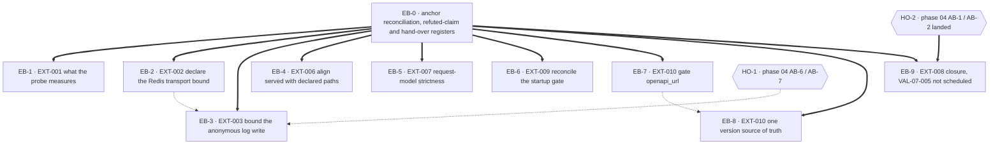

# Phase 07 — External boundary remediation plan

## Purpose

This plan decomposes the phase-07 external-boundary findings into dependency-safe execution blocks.
It is deliberately **small**: the code context re-derived this phase at `cea2d06` and found that five
of the ten findings are already owned by executed or in-flight sibling plans, one is already fixed,
and the genuinely unowned residue is six findings and two halves.

Every block names a **semantic** target (symbol · module · route · config key · environment variable),
the `EXT-*` and `VAL-07-*` identifiers it discharges, its `blocked_by`, its position in the
single-implementor queue, a risk view across implementation / rollout / regression / compatibility,
the agents it needs, its documentation impact, named verification, and its definition of done.

**Its decisions are closed.** `DP-1` … `DP-10` were carried verbatim from the code context, each with
its alternatives, its chooser and what it gated; `DP-11` and `DP-12` were raised here because a fix
genuinely turns on a fork the code context's list is silent about, each marked *raised by this
Planner* following phase 04's `D-04-I` … `D-04-L` precedent. **Four are now closed by the Product
Owner** (`.ai/decisions/ADJUDICATED-2026-10-03-product-owner-rulings.md`, `2026-10-03`: `DP-1` and the
`DP-2` closure it causes in Cluster 3; `DP-6`, `DP-11` and `DP-12` in Cluster 9) and **seven are closed
by this Planner** (`DP-3`, `DP-4`, `DP-7`, `DP-8`, `DP-9`, `DP-10`), each on the plan's own stated risk
analysis. `DP-5` alone remains open and belongs to the **Coordinator**. Every closed option stays
visible in its decision record, marked closed and named; nothing is deleted. See **Ruling register —
2026-10-03**.

Scope discipline: **the audit corpus is not an implementation target.** No block edits
`.ai/audit/**`, `.ai/plans/_code-context/**`, or any sibling plan. If the owner wants the report
repaired, that is a separate authorised authoring task.

---

## Ruling register — 2026-10-03

The Product Owner's register at `.ai/decisions/ADJUDICATED-2026-10-03-product-owner-rulings.md` is the
authority for every Product Owner decision recorded here. **This plan consumes register clusters 3
(Health, diagnostics and rate limiting — `DP-1` and, in the same cluster, the closure of `DP-2`) and 9
(External boundaries — `DP-6`, `DP-11`, `DP-12`).** The register is the **single authority**: it merges
the two input registers of 2026-10-03 and adjudicates every disagreement, and **option letters in it are
not this file's option letters** — the chosen behaviour below is stated **by description**, and the
`Q*` tags are this plan's inherited labels for the same rulings. Nothing below re-opens, re-derives or
substitutes one of its options. Each Planner closure is one sentence against this plan's own risk
analysis.

### Product Owner rulings applied

| Ruling | Register | Closed as | Blocks unblocked | Constraint carried into the block |
| ------ | -------- | --------- | ----------------- | ----------------------------------- |
| **`DP-1`** | **Q1** — cluster 3 | **by description: `/health` stays **database-only** and keeps its exact two-key shape; Redis is stored as a **detailed** component that never moves the liveness status**; `/health/detailed` keeps its components but **requires an administrator**; the reconciler counters (`lease_state`, `unprotected_ticks`) are removed from the anonymous body and shown only to an authenticated administrator | **`EB-1`** | `/health` keeps its **exact two-key shape**; the Redis component is a **detailed** component that never moves the liveness status; `docs/05-health/health-api.md` gains the admin-gating sentence **and** its self-contradiction about the overall status is resolved in the same commit |
| **`DP-6`** | **Q15** — cluster 9 | **by description: strict on **write** bodies, permissive on **read** bodies** | the strict-base sub-item of **`EB-5`** | the **frontend field census remains a hard input**: the policy must not be applied before the census is complete; strict-on-all-bodies is **closed** |
| **`DP-11`** | **Q16** — cluster 9 | **by description: reject on the declared content length, truncate on the parsed field values** — both halves implemented, both proven by a test | **`EB-3`** | **both halves are implemented**; the header-only option is **closed**, because `tests/test_streaming_size_limit.py::TestStreamingSizeLimit` already proves a header check does not bind a body |
| **`DP-12`** | cluster 9 | **by description: an application-level gate on the schema surface, with `nginx` recorded as the real production control and the gap handed over as a named seam** | **`EB-7`** | the fact that the change **has no shipped effect in the production topology** must be stated so no reader over-reads it; the nginx gap stays the **named** hand-over **`HO-4`** with an owner |

**Release-note consequences that are part of the ruling, not of the block's discretion.**

- **`Q1` → `EB-1`.** An unauthenticated external monitor can no longer use `/health/detailed`; it must
  poll `/health` or authenticate. Stated in `EB-1`'s definition of done.
- **`Q15` → `EB-5`.** Phase 16 is informed of the write-only strictness policy before it lands.
- **Cluster 9 `DP-12` → `EB-7`.** The change has **no shipped effect in the production topology**, and
  that must be stated in `EB-7`'s definition of done and its commit body, so no reader over-reads it.

### Technical forks — one closed by consequence, six closed by this Planner

Each names what it unblocks. `DP-2` is **constrained by `Q1`** and is recorded as a link, not as a free
choice — **and the adjudicated register records it as closed by consequence of `DP-1`'s ruling, not by
a Planner's preference**, with relaxing it to key-subset membership **closed by name**.

| Fork | Ruled | Rationale, in one sentence | Unblocks |
| ---- | ----- | --------------------------- | -------- |
| **`DP-2`** *(closed by consequence of `Q1`)* | The **exact-dict assertion stands unmodified** — `{"status": "healthy", "database": "connected"}` stays the whole contract of `test_health_still_healthy_when_redis_down` | `Q1`'s ruling keeps `/health` database-only, so there is nothing for the assertion to be updated about; relaxing it to key-subset membership (**option b**) would permanently remove the exact check that catches this class of change, and **option (c)**'s two contradictory tests would assert two shapes of one endpoint | **`EB-1`**'s definition of done, which was the only thing gating it |
| **`DP-3`** | **(b)** — new `RedisSettings` fields with environment aliases | the bound governs **53 authenticated operations across two entrypoints** and the plan's own rollout risk is choosing it too aggressive for a given deployment, so it belongs under the project's settings discipline rather than in a code literal; `config.py` is re-read immediately before editing because phase 01/02 own it | **`EB-2`** |
| **`DP-4`** | **(a)** — pin `Retry(NoBackoff(), 0)` | every Redis failure direction in this repository is already **declared** (rate limiter fail-closed, temp-password store fail-open, reconciler lease fail-open), and a retry is the one mechanism that turns a bounded failure back into the ~59-second hang the finding exists to remove; **option (b)** buys transient recovery at a multiplied worst case and **option (c)** leaves the retry count an undeclared dependency on a version the lockfile pins today | **`EB-2`**'s bound shape |
| **`DP-7`** | **(a)** — register the four collection paths on their slash form | **option (b)** leaves the existence oracle, which is the finding's **primary** effect and so does not discharge `EXT-006`; **option (c)** buys two mechanisms for one four-path problem; the four live test classes already request the slash form, which is the form option (a) keeps | **`EB-4`** |
| **`DP-8`** | **(a)** — split into app-required and worker-required sets | the plan's own re-derivation proves the four names are **not homogeneous** — `rq` is a worker contract, `httpx` a test-tier contract, `plotly` and `tenacity` certified absences — and a single list cannot encode that, which is what makes "trim the list" the wrong instruction (**option b**); **option (c)** leaves `EXT-009` open, which is the correct outcome only while the question is *"is this dependency wanted?"* and not here | **`EB-6`** |
| **`DP-9`** | **(b)** — an env-overridable `config.app.version` defaulting to the distribution version | the environment override **already exists** and `TestCreateAppMetadata` proves it must keep winning, so **option (a)** — removing it — is a contract change this finding does not ask for, and changing only the **default** gives one source with the settings layer's override on top; **option (c)** "closes nothing" and leaves the document stale by design | **`EB-8`** |
| **`DP-10`** | **(a)** — hand-overs only | five of ten findings are owned by executed or in-flight sibling plans and one is already fixed, so re-filing them would give two teams one symbol for one reason; **option (b)** re-files the `rq-worker` row the report itself declined, and **option (c)** re-opens `VAL-07-002`'s prohibition, which is a closed decision under phase 04's applied `VAL-04-001` | nothing was gated — it closes the scope question, so the OUT table is final as written and only a Coordinator ruling could put a sibling-owned finding back in scope |

**`DP-5` is not closed by this plan and is not closed by the register.** The Product Owner's register
lists it under *Recorded, not scheduled — Coordinator and deployment items*, with the chooser named as
**Coordinator**, on the grounds that data-row hygiene is not a Planner's authority. It is carried in the
out-of-scope table below with that chooser, and no block may perform it.

### Anchor state at `b009eb9`

`git rev-parse --short HEAD` → `b009eb9`. `git status --porcelain` before this edit showed **no
modification to any file under `src/`, `tests/`, `frontend/`, `alembic/`, `docker/`, `docs/`,
`pyproject.toml` or `Makefile.ps1`** — the tree carried only work under `.ai/` (plans, decisions,
tasks) and a set of pre-existing uncommitted changes in `src/mkobi/db/starter.py`,
`src/mkobi/services/file_cleanup.py`, `src/mkobi/workers/data_worker.py` and three test modules, which
this plan does not name as a target.

**Every semantic target in this plan re-resolved by symbol at `b009eb9`. Result: no drift.**

| Symbol | Resolves at `b009eb9` | Drift |
| ------ | ---------------------- | ----- |
| `app.py::create_app`'s `health_check` and `detailed_health_check` | both present in `src/mkobi/app.py` | none |
| `core/redis_client.py::get_async_redis_client`, `::get_redis_client` | both present | none |
| `api/routes/client_errors.py::report_client_error`, `models/data.py::ClientErrorPayload` | both present | none |
| `api/deps.py::get_redis_client_dependency`, `::require_dashboard_admin_access` | both present | none |
| `main.py::REQUIRED_MODULES`, `::check_dependencies` | both present | none |
| `config.py::RedisSettings`, `::AppSettings` | both present | none |
| `models/transformation_configs.py::TransformationConfig`, `models/types.py::GraphConfigDict` | both present | none |
| `services/auth_service.py::AuthService.approve_registration_request`, `::reset_password_admin` | both present | none |
| `core/security.py::is_token_revoked`, `::is_user_tokens_revoked`; `core/temp_password_store.py::TempPasswordStore` | all present | none |
| the **twelve** `redirect_slashes=False` routers | twelve `APIRouter(...)` declarations, unchanged | none |

**Nothing under `.ai/audit/**`, nothing under `.ai/plans/_code-context/**` and no sibling
`.ai/plans/0[0-6]-*.md` was edited to make this register.** The Product Owner's register is applied
**inside** this plan, following phase 04's `VAL-04-001` precedent — an audit or decision record is
*applied as a ruling*, never edited.

## Anchor authority

> **The report's line numbers are not binding, and neither are the code context's.**
> `VAL-07-009` records nine anchors that moved under the validation itself; the code context §1.1
> records nine more commits landing after the report's `c3c0a61`, of which `2de4156`, `9c49c20` and
> `4a5db54` move or refute `EXT-*` targets outright. The code context resolves against `2174895`;
> `HEAD` was `cea2d06` when this plan was written and is now `b009eb9`, at which **every target
> re-resolved by symbol with no drift** — see **Ruling register — 2026-10-03**.
>
> **Every anchor in this plan is a symbol, a module, a contract, a route, a config key or an
> environment variable.** Implementors resolve targets by symbol at the moment of work. If a symbol
> named below does not exist, that is a finding: stop and report it rather than substituting the
> nearest match.

### Anchor-authority precedence

**`report`** = `.ai/audit/99-validation/07-external-boundary-validated-findings.md`
**`code_context`** = `.ai/plans/_code-context/07-external-boundary-code-context.md`
**`code_context_authority: Phase-1 Auditor (overrides every report anchor)`** — where the two disagree
about *where* something is or *what the code does*, the **code context wins**: the report's coordinate
becomes a **drift-list entry, not a remediation target**. Where they disagree about *identity* (which
finding is which), the **report's identifier set wins** and the code context's numbering is recorded as
a **defect** — no `EXT-*` or `VAL-07-*` identifier is renumbered, re-typed or re-scoped by this plan.

**A runtime or tree observation is current-state evidence, not a third authority.** This plan measured
`/health` and read the container posture **read-only**, and a later implementor who finds the tree has
moved must **re-read the named symbol and record the drift** — never silently re-rule a `DP-1 … DP-12`
record. Precedence is therefore: **code context for fact, report for identity, and a later tree for
neither.**

**Anchors that are dead and must not be spent.** Every `admin.py` approval anchor the report cites
(`admin.py` approval-body lines for `create_user`, `force_password_change`, `uuid4`, `store`,
`update_status(APPROVED)`, `db.commit()` and the rollback arm) **names nothing** — those bodies are
`services/auth_service.py::AuthService.approve_registration_request`. The literal `version="1.0.0"`
is **not** in `app.py`; `app.py::create_app` reads `config.app.version` and the literal lives in
`config.py::AppSettings.version`. A Redis `PING` component **exists on neither** health endpoint
today. Phase 04's `AB-0` (finding `Y-01`) independently reached the same conclusion about the
`admin.py` anchors; two planners, one result.

### Refuted claims this plan does not carry

Each was verified against `cea2d06` while writing this plan. A block that acted on any of them would
be acting on a claim the code context already refuted. **Every row below was re-resolved by symbol at
`b009eb9` and none has changed** — see the anchor table in **Ruling register — 2026-10-03**.

| Refuted claim | Reality at `cea2d06` | Recorded by |
| ------------- | ------------------- | ----------- |
| EXT-001: "`Select-String redis` over `app.py` returns zero matches" | **5 matches** — `app.py` imports `get_async_redis_client`, uses it for the reconciler lease, and names it in three comments | EB-0, EB-1 |
| EXT-001: "the dev override disables the container healthcheck" | **Refuted** — `docker/docker-compose.override.yml` inherits the base healthcheck, with an explicit comment saying so; re-enabled by `9c49c20` | EB-0, EB-1 |
| EXT-001: "no shipped test blocks a Redis component" | **Refuted** — `tests/test_health.py::TestHealthWithRedisDown::test_health_still_healthy_when_redis_down` asserts `response.json() == {"status": "healthy", "database": "connected"}`, an **exact-dict equality** | EB-1, `DP-2` |
| EXT-003: "the one shipped caller is `ErrorBoundary.tsx:40`" | **Refuted** — that file is 47 lines and makes no such call; there is **no** `client-errors` reference anywhere in `frontend/src/` | EB-0, EB-3 |
| EXT-004: "the email branch is unreachable" | **Refuted for `register-request`** — `api/routes/auth.py` declares `client_ip: str \| None = None` and assigns it only under `if request.client:`, so the email branch is reachable exactly when the peer is absent | EB-0 (hand-over note only) |
| EXT-007: "a malformed `filters` yields an empty result set or a later error rather than a 422" | **Refuted for malformed JSON** — `api/routes/data.py` maps `json.JSONDecodeError` to a 422-class `AppException`. What is unvalidated is the **document shape** of a well-formed object | EB-0, EB-5 |
| EXT-009: "`rq` is never imported" | **Refuted** — imported by exactly **two** `src/` modules (`src/mkobi/rq_worker_wrapper.py`, `src/mkobi/core/task_queue.py`), four import statements in all | EB-0, EB-6 |
| EXT-009: "reduce `REQUIRED_MODULES` to the twelve the application imports" | **Refuted** — `REQUIRED_MODULES` is **thirteen** names, and the count of gate-only names is **three**, not four | EB-0, EB-6 |
| EXT-010: "`app.py` passes the literal `version=\"1.0.0\"`" | **Refuted as written** — `app.py::create_app` reads `config.app.version`; the literal is in `config.py::AppSettings.version` | EB-0, EB-8 |
| VAL-07-005: "on a publish failure compensate the committed record (mark the request failed and remove the account)" | **Refuted in effect** — contradicted by a shipped test, two landed docstrings and a shipped doc. **Not scheduled anywhere in this plan** | EB-0, EB-9 |

### Planner-required re-derivations

The code context §6 states, for `EXT-007`: *"The Planner must re-derive the exact set by symbol, not
by count."* The same discipline applies to `EXT-009`, and both were re-derived here. **Two
corrections to the code context follow, and both change what the implementor should do.**

| Subject | Code context's figure | Re-derived at `cea2d06` | Consequence |
| ------- | ---------------------- | ------------------------ | ----------- |
| `EXT-007` — request-body models | 20 regex candidates, "0 of 21" load-bearing | **Unchanged in substance.** Seven `extra` policies exist: one `extra="forbid"` (`models/transformation_configs.py::TransformationConfig`) and six `{"extra": "allow"}` (`models/types.py`'s internal runtime-validation models). Every route-shaped body model resolves with `extra` unset, i.e. Pydantic v2's `extra="ignore"` | The **exact set** is EB-5's Auditor deliverable, enumerated by symbol in the commit body — not by count |
| `EXT-009` — `rq` import sites | "**39 matches**" (a text census) | **4 import statements across 2 `src/` modules**: `import rq`, `from rq.defaults import …`, `from rq.worker_registration import …` in `src/mkobi/rq_worker_wrapper.py`; `import rq` in `src/mkobi/core/task_queue.py` | `rq` is genuinely imported and stays. The "39" was a text count, the same class of error the report made with its own `BaseModel` count |
| `EXT-009` — `httpx` status | "0 `src/` import sites → still gate-only" | **Misfiled tier.** `httpx` has **zero** `src/` import sites but is imported by `tests/conftest.py` (`import httpx`, `from httpx import ASGITransport`) and by **~20** test modules as `AsyncClient`. It is a genuine **test-tier** contract declared in `pyproject.toml` `[project].dependencies` and gated at **application startup** | `httpx` is **not** a certified absence. It is a tier mismatch. This is the sharpest thing in this block and it changes the remedy from "drop the name" to "the name is real but belongs to a different gate" |
| `EXT-009` — `plotly` / `tenacity` status | "still gate-only" | **Genuinely certified absences.** Zero references in `src/`, `tests/`, `docker/` and `alembic/`. `plotly`'s only `src/` mentions are two docstrings; the project's charting is Plotly.js in `frontend/`, an npm dependency, not this wheel. Both are declared **runtime** deps in `pyproject.toml` | Two dead runtime dependencies. Dropping them from `REQUIRED_MODULES` while leaving them declared in `pyproject.toml` is incoherent — see **HO-1** |

`tests/test_task_queue.py::TestServicesDoNotImportRq::test_no_service_module_imports_rq` asserts, by
AST walk, that **no module under `src/mkobi/services/` imports `rq`**. Neither of the two real import
sites is a service module, so that shipped layering rule is satisfied today and **must stay satisfied**
— it is the reason `rq`'s presence in `main.py::REQUIRED_MODULES` is defensible as the *worker*
entrypoint's contract.

### Source tree state at plan time

`git log --oneline -3` → `cea2d06`, `2174895`, `b646ef1`. The tracked working tree carried no
modifications when this plan was written. `2174895` and `cea2d06` are outside every `EXT-*` target.
Commits that **do** intersect this phase's targets, all already landed: `2de4156` (EXT-008 fixed;
EXT-005 anchors dead; VAL-07-005's outcome contradicted), `9c49c20` (dev healthcheck re-enabled;
`health-api.md`'s probe decision added), `4a5db54` (third `/health/detailed` component plus the
blocking shipped test), `3848e7a` (RQ made real), `d008f55` (`app.py` CORS guard moved).

**At `b009eb9`** the tree carries **no modification to any `src/`, `tests/`, `frontend/`, `alembic/`,
`docker/`, `docs/`, `pyproject.toml` or `Makefile.ps1` path this plan names as a target**; the
uncommitted set is `.ai/`-scoped plus `src/mkobi/db/starter.py`, `src/mkobi/services/file_cleanup.py`,
`src/mkobi/workers/data_worker.py` and three test modules, none of which this plan edits. Every
symbol this plan names re-resolves — the full table is in **Ruling register — 2026-10-03**. **No
block begins without re-resolving by symbol again**, because the two churn fronts below are named
for exactly that reason.

**Two files are the repo's highest-churn and are targets here.** `config.py` is under concurrent
phase-01/02 work and is touched by EB-2 (`DP-3` option b) and EB-8. `app.py` is touched by EB-1 and
EB-7. Any implementor must re-resolve both by symbol immediately before editing, and re-check
`git status`.

## Scope-ruling tables

### IN — owned by this plan

| Finding | Severity | Short name | Block |
| ------- | -------- | ---------- | ----- |
| **EXT-001** (probe-measurement half) | HIGH | The probe reports `healthy` while every authenticated request fails | **EB-1** |
| **EXT-002** (residue only) | HIGH | The Redis transport bound is a library default nobody pinned | **EB-2** |
| **EXT-003** | HIGH | An anonymous 5 MB body is written verbatim into one ERROR record | **EB-3** |
| **EXT-006** | MEDIUM | The credential check runs after the router's slash redirect | **EB-4** |
| **EXT-007** | MEDIUM | No request-body model declares a strictness policy | **EB-5** |
| **EXT-008** | MEDIUM | *(already fixed)* — verification scope and non-scheduling only | **EB-9** |
| **EXT-009** | LOW | The startup self-check certifies libraries the app never imports | **EB-6** |
| **EXT-010** | LOW | The schema document advertises a stale version; half the gate is missing | **EB-7** (tier half), **EB-8** (version half) |

### OUT — not owned here, with the named home

| Item | Home | Note for this phase |
| ---- | ---- | ------------------- |
| **EXT-004** — the whole inbound budget collapses onto the proxy's address | merged → phase 04 **AB-6** (rate-limit key identity) + **AB-7** (proxy trust) | Plan 04 is at `source_head: 2174895` and **has already applied** `VAL-04-001`: option (b)'s `forwarded-allow-ips="*"` is **deleted, not deferred**. `VAL-07-002`'s wildcard prohibition is therefore a **closed decision** and this plan inherits it without re-opening it. See **HO-1**. |
| **EXT-005** — approval returns 200 and a handle for a credential never stored (write side) | merged → phase 04 **AB-1** | The defect survives with a deliberate shape; `VAL-07-005`'s prescribed compensation is refuted in effect. Carried, not re-planned. |
| **EXT-005** (read side) — one 404 for two states | merged → phase 04 **AB-2** | Plan 04 records the same two-state finding (`Z-14`). |
| **EXT-002** (refusal class) — a Redis error on the revocation read becomes `401 AUTHENTICATION_FAILED` | merged → phase 04 **AB-5** | `ErrorCode.SERVICE_UNAVAILABLE` **exists** and is already mapped to 503 (`VAL-07-003` applied). **No new enum member.** See **HO-2**. |
| **EXT-001** (deployment half) — the Docker healthcheck, `start_period`, the worker-count interaction | phase 02 **B3 / TOPO-008** — **landed** as `9c49c20` | Do not re-litigate the dev-vs-prod healthcheck. |
| **EXT-001** (deployed composition: nginx, load balancers, Kubernetes probes) | phase 10, as **co-owner** of the probe contract | Appendix F's ruling stands: co-owned, **not merged**. 07 owns what the probe *measures*; 10 owns the *deployed composition*. |
| **EXT-003** — what credential material reaches any other sink | phase 15 | Appendix F: cross-reference, not merged. The **volume** half is EB-3's; the **sink** question is phase 15's. |
| **EXT-003** — "the volume bound is a shared pool" | phase 04 **AB-6** | This is a *reasoning* dependency, not an edit dependency: EB-3 can ship without it, but the shared-pool half of the consequence cannot be reasoned about until it lands. Recorded as a dotted edge in the block map. |
| **EXT-007** — the frontend's consequence (`422` on a write route) | phase 16, as **co-owner** | Phase 07 owns the model policy; phase 16 owns whether the SPA over-sends. EB-5's Auditor deliverable is the census that makes the co-ownership decidable. |
| **EXT-009** — the `rq-worker` topology row | phase 01 **TOPO-001** | The report itself declines to re-file it. This plan declines it too. |
| **EXT-009** — the `pyproject.toml` dependency residue (`plotly`, `tenacity`, `requests`, `pyjwt` alongside `python-jose`, `asgiref` in a non-Django stack) | phase 01 (dependency surface) | Recorded, not absorbed: EB-6 makes the *gate* coherent, not the manifest. See **HO-1**. |
| **EXT-002** — 4 workers × ~59 s saturation as a measured cost | phase 11 | The report hands the projection to 11 explicitly. |
| **EXT-007** — the repository predicate `AggregatedData.dims[key].astext == str(value)` | phase 03 / phase 05 | `SELECT`-safety is re-confirmed: the predicate is built as a SQLAlchemy expression, with no string interpolation. **No change is proposed and none is needed.** |
| **docker/nginx/nginx.conf` | phase 12 (per plan 04's `C04-5`) / phase 10 | EB-7's production-tier gap lives behind nginx's `location` blocks; the file is not this phase's. |
| `tests/test_rate_limiting.py::TestRateLimitingIntegration::test_different_ips_have_separate_limits` | phase 09 | The test's **name** promises per-IP separation it never exercises. EB-3 touches the same key identity by consequence; it does not fix the test. |
| `tests/test_health.py`'s test **quality** | phase 09, via `DP-2` | EB-1 owns the production change; the assertion's shape is phase 09's ruling. |
| Orphan `temp_pwd:` keys and the five `bidb` rows `VAL-07-011` names | **nobody** — `DP-5`, **Coordinator only** | A Planner must not create or delete database rows. The Product Owner register of `2026-10-03` places `DP-5` under *Recorded, not scheduled — Coordinator and deployment items*, chooser **Coordinator**, and this plan inherits that position without re-opening it. Recorded, not scheduled. |
| **VAL-07-011** itself | not actionable for this role | It is a claim about the report's own prose. |

### CONFLICT — between report, code context and landed work

| # | Subject | Report | Code context | Ruling |
| - | ------- | ------ | ------------- | ------ |
| **X-01** | EXT-001's remedy feasibility | "Executable as written, and verified to have no shipped test blocker" | `tests/test_health.py` asserts `/health` by **exact dict equality**, and `docs/05-health/health-api.md` argues the probe must stay DB-only | **Code context wins.** The remedy is not executable as written, **and the Product Owner's ruling of 2026-10-03 landed on the code context's side**: `DP-1` option (a) and `DP-2`'s closure preserve both artefacts. The documented decision stands as recorded, and `EB-1`'s constraints are now satisfied by the ruling rather than argued by the implementor. |
| **X-02** | EXT-005's merge ruling | Filed with **no** merge or adjacency ruling at all | Merged into phase 04 **AB-1**/**AB-2**, escalated | **Both agree.** `VAL-07-001` is discharged by the hand-over register. |
| **X-03** | EXT-008's remedy | "Move the store after `db.commit()`" — and, via `VAL-07-005`, compensate the committed record | The ordering half is **already fixed** and pinned by three shipped tests; the compensation half is **contradicted** | **Code context wins.** EB-9 is verification-shaped. `VAL-07-005` is recorded and **not scheduled**. |
| **X-04** | EXT-009's count | "reduce `REQUIRED_MODULES` to the twelve the application imports" | "13 (14 minus `rq`)" | **Planner re-derivation wins.** `REQUIRED_MODULES` has **13** names; **3** certify an absence (`plotly`, `tenacity`, and — per this plan's re-derivation — the report's framing of `httpx` is a tier mismatch, not an absence); `rq` is real. EB-6 prices the four names individually. |
| **X-05** | EXT-010's evidence | "`app.py` passes the literal `version=\"1.0.0\"`" | The literal moved to `config.py`; the drift is unchanged | **Both refuted as written.** The finding's *consequence* (a document seven patch releases behind, no version to detect a contract change) stands, which is why EB-8 exists. |
| **X-06** | EXT-002's retry arithmetic | "three retries of a 5 s timeout" | Measured `retries=10`, `ExponentialWithJitterBackoff(cap=1, base=0.01)`, `socket_timeout=5` | **Code context wins** (`VAL-07-006`). EB-2's bound must be designed against eleven 5-second attempts, not three. |
| **X-07** | EXT-006's surface | "every declared path", "all 43 declared paths" | Four paths | **Code context wins** (`VAL-07-007`). EB-4 is scoped to `/api/v1/users/`, `/api/v1/dashboards/`, `/api/v1/graphs/`, `/api/v1/admin/logs/`. |
| **X-08** | EXT-003's compatibility caveat | "check the one shipped caller, `ErrorBoundary.tsx:40`" | Zero `client-errors` references in `frontend/src/` | **Code context wins, and it is stronger:** `docs/08-security/client-error-reporting.md` documents `error` as *"an object with `message` and `name` fields"* and its "Frontend Integration" section as **aspirational** ("*The React SPA **should** call this endpoint from…*"). There is no first-party caller and the documented contract already names two fields. |

### VERIFICATION FINDING — the report's `VAL-07-*` records

Each is a defect **in the report**, not in the code. **No audit file is edited.** `VAL-07-002` and
`VAL-07-005` alone change what may be scheduled, and `VAL-07-005` changes it by *deleting* an option.

| ID | Band | Subject | Ruling in this plan |
| -- | ---- | ------- | ------------------- |
| **VAL-07-001** | MEDIUM | EXT-005 duplicates AUTH-002 + AUTH-006, filed with no merge ruling | **Substantiated and escalated.** Discharged by the hand-over register (**HO-2**): EXT-005 is registered as merged into phase 04 **AB-1** (write) and **AB-2** (read), naming the owning phase. The report's `admin.py` anchors name nothing; the register records the bodies' real location so a ticket cannot land on a delegation. |
| **VAL-07-002** | MEDIUM | EXT-004's `forwarded-allow-ips="*"` is a caller-chosen bucket | **Substantiated; ALREADY RULED — not re-opened.** Plan 04 records `VAL-04-001` as **applied**: option (b) is deleted. This plan inherits the ruling. **No block in this plan may name `"*"` as an option.** |
| **VAL-07-003** | MEDIUM | EXT-002 claims `SERVICE_UNAVAILABLE` does not exist | **Substantiated. Applied.** `models/enums.py::ErrorCode.SERVICE_UNAVAILABLE` exists and is already mapped to 503 in `utils/exceptions.py`. **No new enum member is created anywhere in this plan.** Phase 04's `AB-5` consumes the existing code. |
| **VAL-07-004** | MEDIUM | EXT-002's refusal class duplicates AUTH-008 at the same sites | **Substantiated, and the site list is larger: six, not two.** The four live sites are `api/deps.py::get_current_user_dependency`'s two revocation reads and `core/permissions.py::_get_current_user_with_session`'s two. Handed to phase 04 **AB-5**. Phase 07 keeps only the blast radius and the undeclared bound (EB-2). |
| **VAL-07-005** | MEDIUM | EXT-005/EXT-008/AUTH-002 prescribe three orderings; the report picks a fourth | **Refuted in its prescribed outcome. Recorded, NOT scheduled.** Adopting it literally reverses a shipped test, two landed docstrings and `docs/04-admin/admin-api.md`. **EB-9 exists to keep this from being scheduled by a later reader.** |
| **VAL-07-006** | MEDIUM | "three retries of a 5 s timeout" is wrong; the library retries ten | **Substantiated, runtime-confirmed. Applied as a wording correction.** EB-2's bound is designed against the measured configuration. |
| **VAL-07-007** | MEDIUM | EXT-006 overstates the enumeration surface ~10× | **Substantiated. Applied.** Four paths; EB-4 is scoped to exactly those four and to no more. |
| **VAL-07-008** | MEDIUM | EXT-005/EXT-008 blocked by two shipped tests both reports deny | **Substantiated verbatim, plus a fourth pin the report missed** (`tests/test_admin_user_management.py`'s admin-reset case). Recorded in **HO-2** so phase 04 inherits the full list. |
| **VAL-07-009** | LOW | Nine anchors moved and are now committed | **Substantiated and superseded.** Its correction table targets an older revision than `HEAD`. **Keep the method (resolve by symbol, re-resolve immediately before editing); discard the numbers.** |
| **VAL-07-010** | LOW | Four evidence anchors and one search characterisation are wrong | **Substantiated for (a)–(c)** (`pyproject.toml`'s version is at line 7; twelve routers carry `redirect_slashes=False`, all verified; twelve names in `REQUIRED_MODULES` was the report's figure and is **13**); **(d) is superseded** by `VAL-07-001`. **A fifth error exists that `VAL-07-010` does not name** — EXT-004's "email branch is unreachable" (see the refuted-claims table). |
| **VAL-07-011** | LOW | The report's restoration claim omits five durable rows it created | **Not actionable for this role.** No block may create or delete database rows. Carried as **DP-5** for the Coordinator and named in the out-of-scope table. |

## Block map

**The decision nodes have left the graph.** All eleven gated decisions — `DP-1`, `DP-2`, `DP-3`,
`DP-4`, `DP-6`, `DP-7`, `DP-8`, `DP-9`, `DP-11`, `DP-12` (ruled) and `DP-10` (never gated) — are
closed records as of 2026-10-03 and appear in the decision section below, not as live gates; only
`DP-5` survives, and it gates nothing by design. **No `==>` edge remains from a decision node into a
block**, because no block is gated by a decision any longer. What remains is `EB-0`'s register-first
edge into every block, `HO-2` into `EB-9`, and three dotted review-coherence edges.

`==>` = hard dependency. `-.->` = recommended sequencing in the single-implementor queue, **not** a
data dependency — the project permits one implementor at a time, so these are ordered for review
coherence. `HO-*` diamonds are hand-over gates owned by another phase, not by this one.

### Coverage ledger

| Block | Findings discharged | Decisions gating it | Agents |
| ----- | -------------------- | -------------------- | ------ |
| **EB-0** | all eleven `VAL-07-*` as rulings; every dead anchor; every refuted claim; the hand-over register | — | Planner (owns the note); Auditor confirms the registers are complete at `b009eb9` |
| **EB-1** | **EXT-001** (probe-measurement half) | **none** — `DP-1` ruled (Q1) and `DP-2` closed (Planner) | **Auditor, Researcher, Planner, Validator — all four** |
| **EB-2** | **EXT-002** (residue) · `VAL-07-006` · `VAL-07-003` (recorded) · `VAL-07-004` (recorded) | **none** — `DP-3` and `DP-4` closed (Planner) | **Auditor, Researcher, Planner, Validator — all four** |
| **EB-3** | **EXT-003** | **none** — `DP-11` ruled (Q16) | **Auditor, Researcher, Planner, Validator — all four** |
| **EB-4** | **EXT-006** · `VAL-07-007` | **none** — `DP-7` closed (Planner) | Planner, Validator |
| **EB-5** | **EXT-007** | **none** — `DP-6` ruled (Q15); the **frontend field census** is still a hard input, and it is a deliverable, not a decision | **Auditor, Researcher, Planner, Validator — all four** |
| **EB-6** | **EXT-009` | **none** — `DP-8` closed (Planner) | Planner, Validator |
| **EB-7** | **EXT-010** (tier half) | **none** — `DP-12` ruled (Product Owner, cluster 9, 2026-10-03) | Planner (short), Validator |
| **EB-8** | **EXT-010** (version half) | **none** — `DP-9` closed (Planner) | Planner, Validator |
| **EB-9** | **EXT-008** (verification) · **`VAL-07-005`** (recorded, not scheduled) | — | none beyond Implementor; Validator if the ordering has drifted |

**Every block is now unblocked by a decision.** The only gates left in the plan are `EB-0` (the
register-first soft edge) and three cross-phase seams that belong to other phases: **HO-1** (phase 04
`AB-6`/`AB-7`, a reasoning-only dependency of `EB-3`), **HO-2** (phase 04 `AB-1`/`AB-2`, a soft edge
into `EB-9`) and **HO-4** (phase 12 / phase 10 own `nginx.conf`, and cluster 9's `DP-12` records the
gap as a **named seam** rather than closing it).

**Splits and merges, with reasons.** `EXT-010` is **split** into EB-7 (tier half) and EB-8 (version
half) because the two halves touch different files (`app.py` versus `config.py`), carry different
blockers (none versus a phase-01 hand-over to the repo's highest-churn file), and have different risk
profiles — and because merging them would leave one half stuck behind a cross-phase hand-over it does
not depend on. Nothing else is split: `EXT-007`'s three sub-items (`filters` modelling,
`GraphBase.config` modelling, the strict base) share one file family, one review and one regression
surface, and the two strict-base sub-items cannot ship apart from the census that governs them under
`DP-6`'s **ruled** option B. `EXT-002` is **not** merged into phase 04's `AB-5` because the two halves
have different files, different risk and different verifiers even though they share one dependency —
see **HO-2**.

---

## Execution blocks

### EB-0 — Anchor reconciliation, refuted-claim register and hand-over register

| Field | Value |
| ----- | ----- |
| **Semantic target** | **No production code.** This plan's own "Anchor authority", "Refuted claims", "Planner-required re-derivations" and "Scope-ruling tables" sections are the deliverable, carried forward into each block's `Definition of done`. |
| **Discharges** | `VAL-07-001` (registered as merged → **HO-2**) · `VAL-07-002` (**closed** by phase 04's applied `VAL-04-001`; inherited, not re-opened) · `VAL-07-003` (**applied** — no new `ErrorCode` member anywhere in this plan) · `VAL-07-004` (**applied** — six sites, four live; refusal class handed to **HO-2**) · `VAL-07-005` (**recorded, not scheduled** — see EB-9) · `VAL-07-006` (applied — wording) · `VAL-07-007` (applied — four paths) · `VAL-07-008` (recorded → **HO-2**, with the fourth pin) · `VAL-07-009` (superseded — method kept, numbers discarded) · `VAL-07-010` (applied for (a)–(c); (d) superseded by `VAL-07-001`; the unnamed fifth error recorded) · `VAL-07-011` (**not actionable** — `DP-5`, out-of-scope table) · every dead anchor · every refuted claim · conflicts **X-01 … X-08** |
| **blocked_by** | — |
| **Execution order** | **1.** Nothing else starts without it. |
| **Risk — implementation** | **None.** Nothing executes. |
| **Risk — rollout** | **None.** |
| **Risk — regression** | **None.** |
| **Risk — compatibility** | One real hazard: **this note can be mistaken for authority to edit `.ai/audit/**`.** It is not. Phase 03's `B0` convention — *no audit file is edited* — is inherited verbatim, and phase 04's `VAL-04-001` precedent (an audit record *applied* as a ruling inside a plan, never as an edit to the report) is inherited with it. |
| **Agents** | **Planner** — owns the note. **Auditor** — confirms at `b009eb9` that the refuted-claim table and the hand-over register name every anchor the code context lists as dead or refuted, and that no *new* dead anchor appeared while the register was being written. No Implementor, no Researcher, no Validator: nothing here is a code claim that a green gate could check. |
| **Documentation impact** | **One row** appended to `docs/SPEC.md` **Version History**, naming this plan — house convention, matching sibling plans. **Nothing else.** |
| **Verification** | `git status --porcelain` clean of tracked source at block start · `git rev-parse HEAD` recorded in the commit body · confirm no file under `.ai/audit/`, `.ai/plans/_code-context/` or any sibling `.ai/plans/0[1-6]-*.md` appears in `git status` as modified · re-resolve every symbol in the **Ruling register — 2026-10-03** anchor table by symbol and record any movement · **no test run required** |
| **Definition of done** | The note exists and names: the seven dead `admin.py` approval anchors; the dead `version="1.0.0"` anchor in `app.py`; the absent Redis `PING` on both health endpoints; all ten refuted claims with their reality; **the two Planner re-derivations** (four `rq` import statements across two modules; `httpx` as a tier mismatch rather than a certified absence) and their consequences for EB-6; all eleven `VAL-07-*` rulings with `VAL-07-002` marked closed and `VAL-07-005` marked not-scheduled; the two hand-overs (**HO-1**, **HO-2**) with named owner blocks; **the Product Owner register's three rulings (`DP-1`, `DP-6`, `DP-11`) applied with their rejected options marked closed and named**; **the eight Planner closures recorded with a one-sentence rationale and what each unblocks**; **`DP-5` recorded with the Coordinator named as chooser**; that **`b009eb9` is HEAD** and that every semantic target re-resolved by symbol with **no drift**; that **no audit file, no code-context file, no sibling plan and no product, test, config or documentation file is edited**; and that `VAL-07-011` is stated, not dropped. |

---

### EB-1 — Make the health probe measure and report what the ruled contract says (EXT-001, probe-measurement half)

| Field | Value |
| ----- | ----- |
| **Semantic target** | `app.py::create_app`'s `health_check` and `detailed_health_check` handlers · `core/redis_client.py::get_async_redis_client` (a ping helper, if the ruling needs one) · `app.py`'s reconciler component block inside `detailed_health_check` · `docs/05-health/health-api.md` (the probe-contract section, the component table and the consumer guidance) · `docker/Dockerfile`'s `HEALTHCHECK` and `docker/docker-compose.yml`'s `app` healthcheck **as read-only context — this block does not edit them** |
| **Discharges** | **EXT-001** (probe-measurement half). The deployment half is already landed under phase 02 `B3` / `TOPO-008` and is **not** re-planned. Conflict **X-01**. |
| **blocked_by** | **Nothing hard.** `DP-1` is **ruled** — option A, Product Owner, `2026-10-03` — and `DP-2` is **closed** by this Planner on the same date, so this block's two decision gates are gone. Soft: EB-0. Cross-phase: **HO-3** (phase 10's co-signature is recorded by `DP-10-2`, ruled option A in the same register) and **phase 15**, whose `D-15-G` / `SECB-4` implements the **admin gate** on `/health/detailed` and whose `D-15-H` removes the reconciler counters from the anonymous body — **this block documents the gate, it does not build it**. |
| **Execution order** | **2** |
| **Risk — implementation** | **HIGH, and inverted.** The naive remedy — add a Redis `PING` to `/health`, return 503 on failure — is *blocked by two independent artefacts*, and one of them argues the opposite outcome on purpose. An implementor who has not read both will ship it, because it compiles, passes the detailed-endpoint assertions, and matches the report's recommendation verbatim. |
| **Risk — rollout** | **HIGHEST in the plan.** `docker/nginx/nginx.conf` exposes exactly the two health paths, and at least **three** services in the shipped compose declare `depends_on: … condition: service_healthy` against the app. Under `--workers 4`, a Redis blip makes three of four workers report unhealthy, and the documented consequence is that **the reverse proxy and every dependent service refuse to start**. That converts a degraded background sweep into a total API outage — precisely the inversion `docs/05-health/health-api.md` warns against in prose. This is not a theoretical risk; it is the stated reason the current design exists. |
| **Risk — regression** | **HIGH against a shipped test.** `tests/test_health.py::TestHealthWithRedisDown::test_health_still_healthy_when_redis_down` asserts `response.json() == {"status": "healthy", "database": "connected"}` — an **exact-dict equality** — and its class docstring states the intent being defended ("*A Redis outage must not drag down /health or the overall detailed status*"). Any remedy that adds a key or a non-200 to `/health` breaks it. The `/health/detailed` assertions are membership-only and survive an added component. |
| **Risk — compatibility** | **HIGH, and tier-dependent.** `/health` is a documented load-balancer, uptime-monitor and Kubernetes probe target. Widening it changes what every one of those consumers is told, and `docs/05-health/health-api.md` currently instructs operators to *"alert on non-200 responses"*. A split into a new readiness path is additive to consumers that were not migrated and inert for those that were — the safest shape is also the one that leaves the original defect in place for anyone still polling `/health`, which is why it is a decision and not a fix. |
| **Agents** | **Auditor, Researcher, Planner, Validator — all four.** **Auditor:** the complete census of `/health` consumers — the Docker `HEALTHCHECK`, every `condition: service_healthy` dependent in the base and override compose files, nginx's `location` block, and every operator-facing promise in `docs/05-health/health-api.md` and `docs/10-deployment/deployment.md`; plus whether any shipped test outside `tests/test_health.py` asserts either handler's shape. **Researcher** (narrow, and it is the research that decides this): the liveness-versus-readiness distinction as compose and orchestrators actually implement it — what `service_healthy` and `start_period` do when a dependency the application can degrade without is included in the readiness answer, and why a probe that covers a degradable dependency is a different object from one that does not. **Planner:** the contract shape under `DP-1`'s **ruled option A**, which is now fixed — `/health` stays database-only, `/health/detailed` keeps its components, Redis is a **detailed** component that never moves the liveness status, and the reconciler counters leave the anonymous body. **Validator:** that the naive remedy did not ship, that both blocking artefacts are honoured rather than worked around, that `test_health_still_healthy_when_redis_down` is green **unmodified**, and that the documentation states the *same* thing the code does. |
| **Documentation impact** | **Required and inseparable from the code.** `docs/05-health/health-api.md` already carries the decision (its "`/health` Is Deliberately Unchanged" section) and its **self-contradiction** — the component-status prose says the overall `status` reflects the worst component, while the same file and `app.py`'s own comment say the reconciler component never changes it. **That contradiction is resolved in the same commit as the code**, because a reader following the prose today would conclude the endpoint already does what `EXT-001` asks for. `Q1` adds one further sentence that is **part of the ruling and not of this block's discretion**: the document states that `/health/detailed` **requires an administrator** and names **phase 15's `D-15-G` / `SECB-4`** as the block that implements the gate and **`D-15-H`** as the block that moves the reconciler counters off the anonymous body. `docs/10-deployment/deployment.md` follows only if the consumer guidance changes. `docs/SPEC.md` gains a version row. |
| **Release note** | **Required by `Q1`, verbatim:** an unauthenticated external monitor can no longer use `/health/detailed`; it must poll `/health` or authenticate. `EB-1` states this line. |
| **Verification** | `.\Makefile.ps1 test-select -k "TestHealthEndpoint" -v` · `.\Makefile.ps1 test-select -k "TestHealthDetailedEndpoint" -v` · `.\Makefile.ps1 test-select -k "TestDetailedHealthReconcilerComponent" -v` · `.\Makefile.ps1 test-select -k "TestHealthWithRedisDown" -v` · `.\Makefile.ps1 test-select -k "test_health_still_healthy_when_redis_down" -v` (**the blocker; must be green and must not have been weakened — under `DP-1`'s ruled option A and `DP-2`'s closure it is green *unmodified*, and relaxing it to key-subset membership is not an available response**) · **new**, per the ruling: a test that a degraded Redis dependency is **reported** by `/health/detailed` and that **`/health` still answers its exact two-key shape with the overall `status` unaffected** — i.e. that the component is present and the liveness status does not move · **new**, per the ruling: a test that the anonymous `/health/detailed` body **no longer carries** `lease_state` or `unprotected_ticks`, and that the authenticated administrator's does — asserted against phase 15's `SECB-4` if it has landed, and **recorded as a pending cross-phase assertion** if it has not · `.\Makefile.ps1 test-select -k "test_app_metadata_comes_from_settings" -v` (same file, unrelated assertion, cheap guard against an `app.py` constructor slip) · `uv run ruff check src/mkobi/app.py src/mkobi/core/redis_client.py` · `uv run mypy src/mkobi/app.py src/mkobi/core/redis_client.py` · **a live read of both endpoints** after the change: `GET /health` and `GET /health/detailed` on the dev stack (the second **with** an administrator token, since the ruling gates it), and the same two reads with `mkobi-redis-1` paused, restoring the container in the same command block |
| **Definition of done** | `DP-1` recorded as **ruled option A by the Product Owner on 2026-10-03** with its phase-10 co-signature (`DP-10-2`, same register) in the commit body · `DP-2` recorded as **closed by this Planner on 2026-10-03** with the exact-dict assertion standing **unmodified** and option (b) named as closed · the block's **two blocking constraints are both satisfied in the code and both cited in the commit body** — the shipped test's assertion and the documented probe decision · the `docs/05-health/health-api.md` self-contradiction is resolved in the same commit **and** the admin-gating sentence `Q1` requires is present, naming phase 15's `D-15-G` / `SECB-4` and `D-15-H` · **this block does not build the admin gate** — that is phase 15's, and the commit body says so · no file under `docker/` is edited by this block · a Redis outage's user-visible outcome on each endpoint is stated in the commit body, **and the release note carries `Q1`'s line: an unauthenticated external monitor must poll `/health` or authenticate.** |

**The two constraints this block must not lose.** They are the whole reason this finding was a
decision rather than a patch, and an implementor who reads only the report will not know either of
them exists. **As of 2026-10-03 the decision is made and both constraints are satisfied by the ruling,
not by the implementor's judgement.**

1. **A shipped test blocks the naive remedy, and it now stands.** `tests/test_health.py::TestHealthWithRedisDown::test_health_still_healthy_when_redis_down` asserts `/health`'s response by **exact dict equality**. The report's recommendation states it is *"verified to have no shipped test blocker"* — it checked the `/health/detailed` assertions (membership-only, which survive) and not this one. Adding a `redis` key to `/health` breaks it. **Ruled:** `DP-1` option A keeps `/health` **database-only**, and `DP-2` is closed on the constraint that the assertion is **neither updated nor relaxed** — relaxing it to key-subset membership would permanently remove the exact check that catches this class of change, which is what option (b) proposed and what is now closed. **The test is green because `/health` did not change, which is the point.**
2. **A documented decision argues the opposite, and it now prevails.** `docs/05-health/health-api.md` states that `/health` *"is what the container healthcheck curls and what `nginx` gates on via `depends_on: app: condition: service_healthy`"*, that under `--workers 4` *"during any Redis blip three of the four workers would report unhealthy and the reverse proxy would refuse to start — turning a degraded background sweep into a total outage of the API"*, and that `/health` *"therefore keeps meaning one thing only: the database is reachable."* `app.py`'s own comment inside the reconciler component says the same. **`Q1`'s verbatim intent is the same sentence:** *a Redis blip must never be able to stop the reverse proxy or dependent services from starting.* The ruling therefore **preserves** this decision rather than overriding it, and the block records that the ruled option is the one this document already argues for — not merely that a new dependency exists.

---

### EB-2 — Declare the Redis transport bound (EXT-002, residue)

| Field | Value |
| ----- | ----- |
| **Semantic target** | `core/redis_client.py::get_async_redis_client` (and `::get_redis_client`, which shares the construction) · `config.py::RedisSettings` **and** the `Settings.redis` binding — **required, because `DP-3` ruled option (b) on 2026-10-03** · `api/deps.py::get_redis_client_dependency` **only if the bound must be injected rather than constructed** · `docs/06-backend/configuration.md`'s environment-variable table — **required, because a new `REDIS__*` key appears** |
| **Discharges** | **EXT-002** (residue: the undeclared bound and the blast radius). `VAL-07-006` (the retry arithmetic, as a design input). `VAL-07-003` and `VAL-07-004` are **recorded**, not discharged here: the former deletes a phantom blocker, the latter is phase 04's `AB-5`. |
| **blocked_by** | **Nothing hard.** `DP-3` and `DP-4` are **closed by this Planner on 2026-10-03** — `DP-3` as option **(b)** (new `RedisSettings` fields with environment aliases) and `DP-4` as option **(a)** (`Retry(NoBackoff(), 0)` pinned). Soft: EB-0. |
| **Execution order** | **3** |
| **Risk — implementation** | **MEDIUM-HIGH, and low in line count.** The edit is a handful of keyword arguments in one constructor. The risk is that there is **no single seam**: `get_async_redis_client` is the single construction function, but five route sites call it **inline** rather than through `api/deps.py::get_redis_client_dependency`, and `AuthService` builds a private limiter from it as well. A bound placed at the construction function reaches all of them — which is correct — and it also means **any change to the construction reaches every Redis operation in the process at once**, including the rate limiter whose failure direction is a declared fail-closed default. |
| **Risk — rollout** | **HIGH in one direction, LOW in the other.** The per-request cost of a Redis outage is inherited from a library default no code in this project sets: measured `socket_timeout=5`, `retry=Retry(ExponentialWithJitterBackoff(cap=1, base=0.01), retries=10)`, i.e. **eleven 5-second attempts** per request — the report's "three retries" is refuted by `VAL-07-006`. Declaring a bound **shortens** that, which is the intent, and shortening it converts a ~59 s hang into a prompt failure that `AB-5`'s direction will report honestly. There is no path by which declaring a bound makes an outage worse; the risk is choosing a bound so aggressive that ordinary latency under load is reported as an outage. |
| **Risk — regression** | **MEDIUM.** Five surfaces depend on Redis behaviour under failure and none of them is currently exercised for it: the rate limiter (fail-closed default `True`, compose-pinned), the two revocation reads, the temp-password store (fail open), the reconciler lease (fail open by design), and the RQ worker's own connection check — **the only declared retry in `src/`**. A shorter timeout changes what "slow" means for all five. The RQ worker's broker path is the one with its own retry/backoff and must not be silently governed by a client default that was never chosen. |
| **Risk — compatibility** | **LOW for this block; HIGH for the block it hands to.** Declaring a bound changes no status code. But `EXT-002`'s user-visible outcome — a Redis outage surfacing as `401 AUTHENTICATION_FAILED`, which the SPA's interceptor answers with a silent refresh that needs the same Redis — is phase 04's `AB-5` and belongs in **its** release note, not this block's. This block must not touch a refusal class. |
| **Agents** | **Auditor, Researcher, Planner, Validator — all four.** **Auditor:** the complete call-site census of `get_async_redis_client` and `get_redis_client` across `src/`, separating the API process from the RQ worker process, and identifying every Redis operation whose failure semantics are *already declared* somewhere (the rate limiter's `fail_closed`, the store's fail-open, the lease's fail-open, the worker's retry) so the new bound does not contradict a declared contract. **Researcher** (this is the block where external knowledge decides the answer): redis-py 8.0 transport semantics — how `socket_timeout` and `socket_connect_timeout` differ in what they bound, what a `Retry` object's `retries` counts, what `ExponentialWithJitterBackoff`'s `cap` and `base` do to worst-case latency, and whether `Retry(NoBackoff(), 0)` is genuinely equivalent to "no retry" for a blocking client. **Planner:** the two answers are **no longer open** — `DP-3` is closed on option (b) and `DP-4` on option (a), both 2026-10-03 — so this row is the interaction between the two **ruled** answers and `RedisSettings`' existing `SECRET_FIELD_REGISTRY` entry. **Validator:** that the measured ~59 s becomes a declared, documented number; that the six revocation-read sites phase 04 must edit are enumerated for **HO-2** rather than edited here; and that no failure direction changed without its owner agreeing. |
| **Documentation impact** | **Required, and the conditional has resolved.** `DP-3` ruled option (b), so **`docs/06-backend/configuration.md`'s environment-variable table gains the new `REDIS__*` keys** — a new key must appear there, per the project's settings discipline, and the timeout fields are **not** secret-bearing, so `SECRET_FIELD_REGISTRY` is not the mechanism. `DP-4` ruled option (a), so the retry policy is a **code invariant**, not a setting, and the commit body states it as one. Either way the blast radius and the cost figure belong in the commit body and in the release note that phase 04's `AB-5` writes. `docs/SPEC.md` gains a version row. |
| **Verification** | `.\Makefile.ps1 test-select -k "TestAsyncRateLimiterUnit" -v` · `.\Makefile.ps1 test-select -k "TestRateLimitingIntegration" -v` · `.\Makefile.ps1 test-select -k "TestTokenRevocation" -v` · `.\Makefile.ps1 test-select -k "TestUserDeactivationRevocation" -v` · `.\Makefile.ps1 test-select -k "TestTempPasswordStore" -v` · `.\Makefile.ps1 test-select -k "test_store_fail_open_on_error" -v` (**must stay green — the store's fail-open contract is phase 04's, not this block's**) · `.\Makefile.ps1 test-select -k "TestStartRQWorker" -v` and `.\Makefile.ps1 test-select -k "TestCheckWorkerRegistered" -v` (**the worker entrypoint must be unaffected**) · `.\Makefile.ps1 test-select -k "TestLifespanLeaseGuard" -v` (**the reconciler lease must be unaffected**) · **new:** a test that a constructed client carries the ruled bound, reading the client's own connection kwargs rather than mocking the constructor · **new:** a test that a Redis timeout surfaces as a bounded failure rather than a hang · `uv run ruff check src/mkobi/core/redis_client.py src/mkobi/config.py` · `uv run mypy src/mkobi/core/redis_client.py` · `docker exec mkobi-app-1 python -c "…"` reading `connection_pool.connection_kwargs` before and after, to confirm the declared bound is the **effective** one and not merely the passed one |
| **Definition of done** | `DP-3` recorded as **closed by this Planner on 2026-10-03, option (b)** and `DP-4` as **closed, option (a)** (`Retry(NoBackoff(), 0)`), both in the commit body · the declared bound is observable on a constructed client and the observation is quoted in the commit body · **`docs/06-backend/configuration.md` carries the new `REDIS__*` keys, and none of them is added to `SECRET_FIELD_REGISTRY` handling — a timeout is not secret-bearing, and adding it would be a mistake worth naming** · the five declared Redis failure directions are enumerated, each with its owner, and **none was changed** · the six revocation-read sites are listed for **HO-2** and none is edited · `ErrorCode` and `utils/exceptions.py` are **untouched** (`VAL-07-003` applied) · the worker entrypoint and the reconciler lease are demonstrably unaffected · **`config.py` was re-read for concurrent modification immediately before editing**, because it is the repo's highest-churn file and phase 01/02 own it. |

---

### EB-3 — Bound what an anonymous caller can write to the log (EXT-003)

| Field | Value |
| ----- | ----- |
| **Semantic target** | `api/routes/client_errors.py::report_client_error` (the rate-limit construction, the `client_ip` derivation and the `logger.error` call) · `models/data.py::ClientErrorPayload` (the field bounds and, whether `DP-11`'s ruled option (c) requires it, a strict inner model for `error`) · `docs/08-security/client-error-reporting.md` (the request-field table, the side-effects list and the **false rate-limit row**) |
| **Discharges** | **EXT-003**. Conflict **X-08** (the compatibility caveat is stronger than filed). |
| **blocked_by** | **Nothing hard.** `DP-11` is **ruled — option C, Product Owner, `2026-10-03`**. Soft: EB-0. Dotted (reasoning only): phase 04's `AB-6`, per the block map. |
| **Execution order** | **4** |
| **Risk — implementation** **LOW-MEDIUM** | One route, one model, one log call. The real implementation risk is **choosing the wrong bound location**: a `Content-Length` pre-check on the route reads like the fix and is insufficient, because a chunked request carries no `Content-Length` and the project's own upload path already established the correct pattern — `tests/test_streaming_size_limit.py::TestStreamingSizeLimit` exists precisely because `file.size` can be `None`, and it proves the project knows a header-only check does not bind a body. The bound that actually holds is on the **parsed field values**, which is also what the report recommends in the same paragraph. |
| **Risk — rollout** | **MEDIUM.** The ceiling is `docker/nginx/nginx.conf`'s `client_max_body_size 100m`, un-overridden by `location /api`, so a single anonymous request can write a ~100 MB log record today, and the rate-limit budget behind it (100/hour) is a **shared** pool keyed on the proxy's address. Capping the record converts an unbounded write into a bounded one; an external caller that has been posting large bodies starts receiving a rejection or a truncated record. |
| **Risk — regression** | **LOW.** No shipped test asserts the current verbatim behaviour, and **no test exercises this endpoint at all** — `POST /api/v1/client-errors` has zero test callers. There is also **no first-party caller**: `frontend/src/` contains no reference to the endpoint, and `docs/08-security/client-error-reporting.md` describes the frontend integration in the subjunctive ("*The React SPA **should** call this endpoint from…*"). So the regression surface is an external browser and nothing else — which is a *risk*, not a safety: there is no in-repo client to run the change against, so the block's tests are its only evidence. |
| **Risk — compatibility** | **HIGH, and irreducible.** This is a public, unauthenticated endpoint whose response is `204` on every accepted body. Any narrowing of `ClientErrorPayload` turns a silently-accepted body into a `422`; any size bound turns an accepted body into a rejection. The documented contract already names `error` as *"an object with `message` and `name` fields"*, so narrowing it to that is defensible against the documentation — but the documentation describes a client that does not exist, so the only evidence for what real callers send is the report's own observation that `ErrorBoundary.tsx` was never wired. **The block must state this explicitly rather than discover it at rollout.** |
| **Agents** | **Auditor, Researcher, Planner, Validator — all four.** **Auditor:** the external-caller question — is `POST /api/v1/client-errors` called by anything outside this repository (a pinned or cached SPA build, a monitoring script, a bookmark), and what is the smallest reversible bound that does **not** require answering that question first. This is scoped deliberately narrowly: the in-repo census is already closed at zero and re-deriving it would be waste. **Researcher** (narrow): how a request-body size bound is expressed when the transport may not declare a length — `Content-Length` presence, chunked transfer encoding, and whether a reverse proxy's own `client_max_body_size` can be relied on as the application-level bound; plus the Pydantic v2 mechanics of `max_length` on a `str` field versus bounding a `dict[str, Any]`. **Planner:** where each bound sits, and the interaction with `DP-11`'s **ruled** answer — reject on the declared length, truncate on the parsed values — in particular that the log record must carry the **untruncated length beside the capped value**, which is the only way an investigator can tell a truncation from a short error. **Validator:** that no accepted body can still produce an unbounded record, and that the log-injection negative result the report established still holds (the JSON formatter escapes newlines, so no caller can forge a record boundary — a bound must not change that property). |
| **Documentation impact** | **Required.** `docs/08-security/client-error-reporting.md` carries three statements this block makes false or newly true: its **"Rate limit: None (errors are expected to be rare)"** row is **factually wrong today** and must state the real bound and its key; the **request-field table** must carry the new field bounds; and the **side-effects** bullet naming the log format must carry the capping behaviour. The "Frontend Integration" section must say plainly that no first-party caller exists, because a future implementor reading it will otherwise believe one does. `docs/SPEC.md` gains a version row. |
| **Verification** | **new** `tests/test_client_errors.py` — this endpoint has **no** test module today, so the block creates one · **under the ruled option C, both halves are asserted separately**: a request that **declares** an oversized `Content-Length` is **rejected** with the project's existing oversized-body status, and a request with **no declared length** (chunked) whose **parsed** field values exceed the cap is **accepted with the values truncated** — the two are separate cases because a header-only implementation passes the first and fails the second, and `tests/test_streaming_size_limit.py::TestStreamingSizeLimit` exists precisely to prove that · a case asserting an oversized `message`/`url`/`userAgent`/`componentStack` is bounded on the **parsed value** even when no length was declared · a case asserting the emitted log record's length is within the cap **and** that the untruncated length is logged beside it · a case asserting a body of ordinary size still returns `204` · a case asserting the rate limit still rejects with `RATE_LIMIT_EXCEEDED` (the endpoint's own contract, unchanged) · a case asserting the record is one physical line for a body containing `\n` (the log-injection property) · `.\Makefile.ps1 test-select -k "TestStreamingSizeLimit" -v` (**the project's own evidence that a header check does not bind a body — must stay green**) · `.\Makefile.ps1 test-select -k "TestRateLimitingIntegration" -v` (unchanged) · `uv run ruff check src/mkobi/api/routes/client_errors.py src/mkobi/models/data.py` · `uv run mypy src/mkobi/api/routes/client_errors.py src/mkobi/models/data.py` · `.\Makefile.ps1 test-select -k "test_openapi" -v` (the payload's schema is published) |
| **Definition of done** | `DP-11` recorded as **ruled option C by the Product Owner on 2026-10-03** · **both halves are implemented and both are proven by a test rather than by inspection** — declared-length rejection *and* parsed-value truncation — and the commit body names the header-only option as **closed**, with `tests/test_streaming_size_limit.py::TestStreamingSizeLimit` as the reason · no accepted body can produce a record beyond the cap · the untruncated length is logged beside every capped value · the endpoint's rate limit is unchanged and still tested · `docs/08-security/client-error-reporting.md`'s false rate-limit row is corrected in the same commit as the code · that document states there is no first-party caller · the log-injection property is re-proven by a test, not assumed · the external-caller question is answered in the commit body, or explicitly recorded as unanswered **with the bound chosen so that being wrong is survivable**. |

---

### EB-4 — Align served paths with declared paths on the four collection routes (EXT-006)

| Field | Value |
| ----- | ----- |
| **Semantic target** | The four trailing-slash collection declarations and their handlers: `api/routes/users.py` (`GET "/"`, `POST "/"`), `api/routes/dashboards_crud.py` (`GET "/"`, `POST "/"`, mounted into `api/routes/dashboards.py`'s router), `api/routes/graphs.py` (`GET "/"`, `POST "/"`), `api/routes/processing_logs.py` (`GET "/"` under its `/admin/logs` prefix) · the `redirect_slashes=False` flag on the **twelve** routers that carry it · `docs/99-reference/swagger.md`'s documented paths, where they name any of the four |
| **Discharges** | **EXT-006**. `VAL-07-007` (**applied** — four paths, not 43). Conflict **X-07**. |
| **blocked_by** | **Nothing hard.** `DP-7` is **closed by this Planner on 2026-10-03 — option (a)**, register the four collection paths on their slash form. Soft: EB-0. Cross-phase: **`C08-7`** in phase 08 — that record is now aligned, because this ruling and phase 08's `D-08-7` point in the **same** direction (the no-slash variant is not served), so the two phases cannot set the redirect behaviour from opposite directions. |
| **Execution order** | **5** |
| **Risk — implementation** | **LOW.** Starlette's slash handling runs ahead of route resolution and therefore ahead of every `Depends`, so a declared trailing-slash path requested without its slash answers `307` before any credential is examined. `redirect_slashes=False` suppresses only the opposite direction, which is why the flag's presence on twelve routers does not prevent this. The mechanism is understood and the fix is either a registration change or a response-shape change. |
| **Risk — rollout** | **MEDIUM and asymmetric by option.** Under `DP-7`'s registration option, four declared paths change shape and any client that does not follow redirects on a `307` stops working. Under the path-relative option, nothing observable changes except the `Location` header's host, and the existence oracle **remains** — the finding's measured effect is a bounded disclosure gap plus a caller-echoed `Location`, and the second half is the cheaper one to fix. |
| **Risk — regression** | **LOW-MEDIUM.** No shipped test asserts a `307` anywhere on these paths, so nothing pins the current behaviour — which is a finding in its own right and the reason the block must add a test either way. The four paths each have live test classes (`TestListUsers`, `TestGetDashboardsAdmin`, `TestGraphsAPI`, `TestProcessingLogFilter`) that request the **slash** form today; under the registration option those classes must keep passing **unmodified**, because the slash form is what is being kept. |
| **Risk — compatibility** | **MEDIUM, wire-visible on four declared paths.** The declared shape in the published document is the observable contract. Changing it changes what a generated client and any non-redirect-following caller see. This is a genuine fork with no technically dominant answer, which is why it is `DP-7` and not a choice. |
| **Agents** | **Planner** — required: `DP-7`'s options have different wire footprints, different test shapes and different documentation consequences, and the choice bakes a contract into the published document. **Validator** — required: that the declared shape and the served shape agree afterwards, asserted against the **live** document rather than against the route table. **Auditor / Researcher — not required.** The four-path scope is settled by runtime enumeration, the mechanism is a documented framework behaviour, and the file set is four route modules with no cross-phase premise at risk. |
| **Documentation impact** | **Conditional, and the condition has resolved.** `DP-7` ruled option (a), so `docs/99-reference/swagger.md` — and any `docs/` file that shows one of the four collection paths — must be aligned with the **slash** shape, which is the shape being kept. No other `docs/` file is touched: no endpoint's semantics change, only which path is the declared one. `docs/SPEC.md` gains a version row. |
| **Verification** | `.\Makefile.ps1 test-select -k "TestListUsers" -v` · `.\Makefile.ps1 test-select -k "TestGetDashboardsAdmin" -v` · `.\Makefile.ps1 test-select -k "TestGraphsAPI" -v` · `.\Makefile.ps1 test-select -k "TestProcessingLogFilter" -v` (**all four must stay green**) · **new:** a case per collection path asserting the no-slash request's outcome matches `DP-7`'s option · **new:** a case asserting the served path set and the published `paths` set agree for these four · `.\Makefile.ps1 test-select -k "test_openapi" -v` · a live `GET /openapi.json` confirming the declared paths · `uv run ruff check src/mkobi/api/routes/users.py src/mkobi/api/routes/dashboards_crud.py src/mkobi/api/routes/graphs.py src/mkobi/api/routes/processing_logs.py` · `uv run mypy src/mkobi/api/routes/users.py src/mkobi/api/routes/dashboards_crud.py src/mkobi/api/routes/graphs.py src/mkobi/api/routes/processing_logs.py` |
| **Definition of done** | `DP-7` recorded as **closed by this Planner on 2026-10-03, option (a)**, with options (b) and (c) named as closed and the reason — (b) leaves the existence oracle, which is the finding's primary effect · the served shape and the declared shape agree for **exactly** the four named collection paths and for no other path · the twelve `redirect_slashes=False` routers are left as they are, and the reason is stated — the flag is inert at `APIRouter` level and phase 08's `D-08-7` owns the twelve declarations · a test pins the new outcome so the `307` cannot silently return · the published document is consistent with the served routes · the block's scope statement names four paths, and a diff touching a fifth path is out of contract · **`C08-7` is named in the commit body, recording that this ruling and phase 08's `D-08-7` closure point in the same direction.** |

---

### EB-5 — Make the inbound validation policy executable (EXT-007)

| Field | Value |
| ----- | ----- |
| **Semantic target** | A strict base for request-body models — **shape undecided**, either a shared base class in `src/mkobi/models/` or per-model `model_config` · the two deferred boundaries: `api/routes/data.py`'s `filters` parameter and its `json.loads` site, and `models/types.py::GraphConfigDict` as typed into `models/graph.py`'s graph config fields · `docs/06-backend/architecture.md` **only if** the project adopts a written inbound-validation convention |
| **Discharges** | **EXT-007**, including all three of its sub-items. Conflict **X-04**'s census re-derivation. |
| **blocked_by** | **Nothing hard.** `DP-6` is **ruled — option B, Product Owner, `2026-10-03`**: strict on **write** bodies, permissive on **read** bodies. Soft: EB-0. **Still gated, and this is not a decision gate:** the **frontend field census** (this block's Auditor deliverable) must be **complete in the commit body before the policy lands** — the ruling keeps it a hard input, and a plan that read `DP-6`'s closure as permission to apply `forbid` first would invert the ruling. |
| **Execution order** | **6** |
| **Risk — implementation** | **MEDIUM, and the revert cost is the real number.** The project's only `extra="forbid"` is one model; six internal runtime-validation models declare `{"extra": "allow"}`. Turning `extra="ignore"` into `extra="forbid"` on the route-shaped bodies is a **base-class revert** in every case, which is a low-diff change with a high tail. The two deferred boundaries are genuine work of a different kind: modelling `filters` as a document rather than a string, and replacing a `TypedDict` with a real model — the second touches a field that is **also a response shape**, so its blast radius is wider than a request-body change. |
| **Risk — rollout** | **HIGH, and this is the one everyone under-rates.** Silent field drops become `422`s on **every write surface**. That is correct and it will be reported as a regression. The block must be sequenced with the frontend owner (phase 16) and its rollout note must say what a `422` on a write route now means. Nothing stored changes in any sub-item — the risk is entirely in what callers observe. |
| **Risk — regression** | **HIGH and broad.** Every write-route test class in the suite is a candidate to break, because a suite that sent a field the model ignores today will start getting a `422`. That is not a flaky-test problem; it is the intended behaviour arriving, and the required response is to **find the over-sending caller and fix it**, not to relax the policy. The suite's own test modules build payloads by hand, so a hand-built payload that over-sends is itself the evidence the census needs. |
| **Risk — compatibility** | **HIGH.** A `422` where a `200` was returned is an observable API change for every client. The published schema gains `additionalProperties: false` semantics, which a generated client may surface as a compile-time or runtime difference. The six `{"extra": "allow"}` internal types must **not** be carried along on an inference about their intent — establishing whether each is genuinely open is the same discipline the report applies to the libraries in `EXT-009`, and it is explicitly out of this block. |
| **Agents** | **Auditor, Researcher, Planner, Validator — all four.** **Auditor:** the frontend field census, by symbol — every request body the SPA actually constructs, field by field, so `DP-6`'s scope question is decided on evidence rather than on the report's "0 of 21". Also the exact set of route-shaped body models, **enumerated by symbol in the commit body, not by count**, and the per-field census of the two deferred boundaries. **Researcher** (narrow): Pydantic v2 `extra` semantics under inheritance — whether a shared base's `extra="forbid"` is inherited cleanly by subclasses that declare their own `model_config`, what that does to the existing `json_schema_extra` blocks, and whether bounding a `TypedDict`-typed field means modelling the nested document or constraining it. **Planner:** the base-class-versus-per-model shape, the ordering of the three sub-items so that the census precedes the policy, and the convention statement if one is adopted. **Validator:** that the census was **completed before** `forbid` landed — this is the single sequencing assertion that matters — and that no `{"extra": "allow"}` internal type was changed on an inference. |
| **Documentation impact** | **Conditional and worth writing.** No `docs/` file states a model-strictness convention today — the report's search over the corpus found none — so if the project adopts one, `docs/06-backend/architecture.md` is its home. If it does not, the policy lives in the base class's docstring and `docs/` is untouched. Either way, any doc that shows an example request body must show one that the policy accepts. `docs/SPEC.md` gains a version row. |
| **Verification** | `.\Makefile.ps1 test-select -k "TestUserModels" -v` · `.\Makefile.ps1 test-select -k "TestDashboardModels" -v` · `.\Makefile.ps1 test-select -k "TestAuthModels" -v` · `.\Makefile.ps1 test-select -k "TestDataModels" -v` (**the model layer's own suite**) · `.\Makefile.ps1 test-select -k "TestCreateUser" -v` · `.\Makefile.ps1 test-select -k "TestRegistrationFlow" -v` · `.\Makefile.ps1 test-select -k "TestGraphsAPI" -v` · `.\Makefile.ps1 test-select -k "TestLayoutService" -v` · `.\Makefile.ps1 test-select -k "TestAggregatedDataEndpointContract" -v` (the `filters` sub-item) · `.\Makefile.ps1 test-select -k "TestProcessingConfigUpdate" -v` **if that class exists at execution time** — the implementor resolves the write-route classes by symbol and runs every one whose body model changed · **new:** a case per changed model proving an unrecognised field is rejected · `.\Makefile.ps1 test-select -k "test_openapi" -v` · `uv run ruff check src/mkobi/models src/mkobi/api/routes/data.py` · `uv run mypy src/mkobi/models` |
| **Definition of done** | `DP-6` recorded as **ruled option B by the Product Owner on 2026-10-03**, with option (a) — strict on all bodies — named as **closed** · **the frontend field census is in the commit body before the policy lands** — not after, and not summarised — and the policy is scoped to **write** bodies with read bodies left permissive, per the ruling · **phase 16 is informed of the write-only policy before it lands**, which is a commitment the ruling attaches to this block · the exact set of route-shaped body models is enumerated by symbol, and the six `{"extra": "allow"}` internal types are **unchanged** with the reason stated · the `filters` document is modelled, and malformed JSON still yields the existing 422-class error rather than a new one · `GraphBase.config`'s nested document is modelled and its **response** shape is accounted for, not only its request shape · every write-route test that broke was fixed at the **caller**, and the set of fixed callers is named · `ErrorCode` is untouched: no new validation code is introduced (`VAL-07-003` applied here too). |

---

### EB-6 — Reconcile the startup dependency gate (EXT-009)

| Field | Value |
| ----- | ----- |
| **Semantic target** | `src/mkobi/main.py::REQUIRED_MODULES` and `::check_dependencies` · the two real `rq` import sites (`src/mkobi/rq_worker_wrapper.py`, `src/mkobi/core/task_queue.py`) as the reason `rq` stays · `pyproject.toml`'s `[project].dependencies` **as read-only context — this block does not edit it** (see **HO-1**) |
| **Discharges** | **EXT-009**. Conflict **X-04** and the two Planner re-derivations. |
| **blocked_by** | **Nothing hard.** `DP-8` is **closed by this Planner on 2026-10-03 — option (a)**, split into app-required and worker-required sets. Soft: EB-0. |
| **Execution order** | **7** |
| **Risk — implementation** | **LOW in the edit, MEDIUM in the meaning.** `REQUIRED_MODULES` has **thirteen** names and `check_dependencies` is a loop of `__import__` calls ending in `SystemExit(1)`. Changing the list is trivial. What is not trivial is that the gate is the **only** thing that ever loads the libraries it certifies, so a name removed from it stops being installed-checked at startup and nothing else notices — the failure moves from boot to first use, which for a rarely-used library is a long time. |
| **Risk — rollout** | **LOW-MEDIUM, and asymmetric per name.** `httpx` is genuinely required — by `tests/conftest.py` and ~20 test modules — so removing it from a gate the **test tier** depends on would break the suite if that gate serves the test entrypoint. `plotly` and `tenacity` have **zero** references in `src/`, `tests/`, `docker/` and `alembic/`, so removing them from the gate is safe at the gate and leaves their `pyproject.toml` declarations as the incoherence **HO-1** names. `rq` must stay: it is a real contract for the **worker** entrypoint, imported by exactly two modules across four import statements. |
| **Risk — regression** | **LOW, with one hard constraint.** `tests/test_task_queue.py::TestServicesDoNotImportRq::test_no_service_module_imports_rq` is an AST-walk assertion that **no module under `src/mkobi/services/` imports `rq`**. Neither real import site is a service module, so it passes today and must stay passing — that rule is *why* `rq`'s presence in the gate is defensible. `tests/test_rq_worker.py` (`TestStartRQWorker`, `TestCheckWorkerRegistered`) and `tests/test_config.py::TestRqWorkerComposeWiring` must stay green unmodified: they are the evidence that `rq` is a real contract. |
| **Risk — compatibility** | **None on the wire.** No API, schema or response changes. The only compatibility surface is the **startup**: a module removed from the gate is no longer guaranteed present at boot, which is a deployment-surface statement, not a contract. |
| **Agents** | **Planner** — required: the gate's shape is the whole decision (`DP-8`), and the four names are not homogeneous, so a single "trim the list" instruction would be wrong. **Validator** — required: that both entrypoints still start, and that the shipped layering rule is provably intact. **Auditor / Researcher — not required.** The census is closed (§2 of this plan, verified by symbol) and the intent question is an owner decision, not an external-knowledge question. **This block must not pull a Researcher**: the report's own instruction is to *establish intent before touching a library*, and no research substitutes for that. |
| **Documentation impact** | **Conditional and minimal.** `docs/06-backend/architecture.md` (the startup-gate section, if one describes what the gate certifies) · `docs/10-deployment/deployment.md` (only if the deployment doc claims the image's dependencies are all verified at boot) · `docs/SPEC.md` gains a version row. **No** `docs/` file needs a dependency list rewritten — that is `pyproject.toml`'s content and the project's own dependency surface, which is **HO-1**'s. |
| **Verification** | `.\Makefile.ps1 test-select -k "TestServicesDoNotImportRq" -v` (**must stay green unmodified** — the layering rule) · `.\Makefile.ps1 test-select -k "TestStartRQWorker" -v` · `.\Makefile.ps1 test-select -k "TestCheckWorkerRegistered" -v` · `.\Makefile.ps1 test-select -k "TestRqWorkerComposeWiring" -v` · `.\Makefile.ps1 test-select -k "TestQueueReceivesJob" -v` · `.\Makefile.ps1 test-select -k "TestRetiredSymbolsRemoved" -v` · **new:** a test asserting the gate's list matches the ruled shape — that `rq` is present and that each removed name is absent, so the decision is pinned rather than asserted in prose · **new:** an entrypoint test that `import mkobi.main` succeeds with the ruled list · `uv run ruff check src/mkobi/main.py` · `uv run mypy src/mkobi/main.py` · a container start of the `app` service and of the `rq-worker` service, both reaching a healthy/running state |
| **Definition of done** | `DP-8` recorded as **closed by this Planner on 2026-10-03, option (a)** — two sets, app-required and worker-required — with options (b) and (c) named as closed · **each of the four named libraries has its own recorded disposition** — kept in the worker set because a real contract exists (`rq`), moved to a different gate (`httpx`, a **test**-tier contract that is therefore recorded and not gated at either entrypoint), or removed with intent established (`plotly`, `tenacity`, certified absences) — and no name is disposed of by inference · `rq` remains, with the two-module import census in the commit body · `httpx`'s disposition names the **tier mismatch** explicitly, not merely "unused" · the gate's list matches the ruled shape, asserted by test · `TestServicesDoNotImportRq` is green unmodified · both entrypoints start · `pyproject.toml` is **not** edited by this block and **HO-1** records the manifest incoherence it leaves behind. |

---

### EB-7 — Gate `openapi_url` with the two human-facing URLs (EXT-010, tier half)

| Field | Value |
| ----- | ----- |
| **Semantic target** | `app.py::create_app`'s `FastAPI(...)` constructor — the `docs_url`, `redoc_url` and `openapi_url` arguments · `docs/99-reference/swagger.md` and `docs/10-deployment/deployment.md` **only as they describe the tier's exposure** |
| **Discharges** | **EXT-010** (tier half). Conflict **X-05** is recorded in EB-0 and applies to the *version* half. |
| **blocked_by** | **Nothing hard.** `DP-12` is **ruled by the Product Owner on 2026-10-03 (cluster 9)** — an application-level gate on the schema surface, with `nginx` recorded as the real production control and the gap handed over as a **named** seam. Soft: EB-0. Cross-phase: **HO-4** (phase 12 owns `nginx.conf` per plan 04's `C04-5`; phase 10 owns the deployed composition). |
| **Execution order** | **8** |
| **Risk — implementation** | **LOW.** One constructor argument, matching a pattern already in the same call. |
| **Risk — rollout** | **LOW for the application; the real effect is nil in the shipped production topology, and the ruling requires that to be said — it is the point of `DP-12`.** `docker/nginx/nginx.conf` forwards only `location /api` and the two health paths; `/openapi.json`, `/docs` and `/redoc` fall through to `location /`, which serves the React bundle. In production today those paths return the **SPA**, not the schema document. Setting `openapi_url=None` makes the application 404 — which nginx never asks it for. The production protection is **topology**, not code, and this block's value is defence in depth plus an honest record. Saying otherwise would overstate the change. |
| **Risk — regression** | **LOW.** `tests/test_openapi.py::TestOpenAPIErrorSchemas` asserts the **error schema's** presence in the document, which a production-tier gate does not affect; the gate is environment-conditional and the test tier is not production. `tests/test_cors.py::TestCreateAppMetadata` constructs the app in a test environment and would see `openapi_url` at its default — no change. |
| **Risk — compatibility** | **LOW-MEDIUM and tier-scoped.** In the development tier nothing changes. In the production tier the machine-readable document disappears from the application surface — which is the intent and which the topology already delivered by accident. Anything that fetches `/openapi.json` for tooling in production stops working, deliberately. |
| **Agents** | **Planner** (short) — the change is one argument; the work is the `DP-12` framing and the documentation accuracy. **Validator** — required because the block's claim is about what a tier exposes, and that claim must be checked against the shipped compose and nginx configuration rather than against the application. **Auditor / Researcher — not required.** No cross-phase premise is at risk and no external knowledge decides anything. |
| **Documentation impact** | **Required, and it is mostly about accuracy.** `docs/99-reference/swagger.md` documents `/docs` as a development-tier workflow, which remains true. `docs/10-deployment/deployment.md` should state where the production protection actually sits — the nginx `location` set — so a reader does not conclude the application is the control. `docs/SPEC.md` gains a version row. |
| **Verification** | `.\Makefile.ps1 test-select -k "TestOpenAPIErrorSchemas" -v` · `.\Makefile.ps1 test-select -k "test_app_metadata_comes_from_settings" -v` · `.\Makefile.ps1 test-select -k "TestCORSPreflight" -v` · **new:** a test asserting that in the production tier the constructor sets all three of `docs_url`, `redoc_url` and `openapi_url` to `None` — the current code sets **two of three**, and a test that asserts only two would let the third regress silently · `.\Makefile.ps1 test-select -k "test_openapi" -v` · `uv run ruff check src/mkobi/app.py` · `uv run mypy src/mkobi/app.py` · a live `GET /openapi.json` and `GET /docs` on the dev stack confirming they still serve (development tier must be unaffected) |
| **Definition of done** | `DP-12` recorded as **ruled by the Product Owner on 2026-10-03 (register cluster 9)**, chosen **by description** — an application-level gate on the schema surface, `nginx` recorded as the real production control, the gap handed over as a **named** seam — with options (b) and (c) kept visible and named · all three document URLs are gated on the same condition in the constructor, asserted by a test that covers **all three** · the commit body states plainly that **the change has no shipped effect in the production topology** and that the production protection there is nginx's, not the application's, so no reader over-reads the change · `docker/nginx/nginx.conf` is **not** edited by this block, and the gap it leaves is written as the **named `HO-4` hand-over with an owner**, not as an untracked observation — the ruling makes that hand-over the block's obligation rather than a contingency · the development tier's `/docs` and `/openapi.json` are demonstrably unaffected. |

---

### EB-8 — One source of truth for the advertised version (EXT-010, version half)

| Field | Value |
| ----- | ----- |
| **Semantic target** | `config.py::AppSettings.version` — its declaration and its default · the environment alias that reaches it · `app.py::create_app`'s `version=` argument (**read-only**: it already reads `config.app.version` and must keep doing so) |
| **Discharges** | **EXT-010** (version half). Conflict **X-05**. |
| **blocked_by** | **Nothing hard.** `DP-9` is **closed by this Planner on 2026-10-03 — option (b)**, an env-overridable `config.app.version` defaulting to the distribution version. Soft: EB-0. Cross-phase: **HO-1**, because `config.py` is the repo's highest-churn file and is under phase-01/02 work. |
| **Execution order** | **9** |
| **Risk — implementation** | **LOW-MEDIUM.** The wiring is **already half-done and correct**: `app.py::create_app` reads `config.app.version`, and `tests/test_cors.py::TestCreateAppMetadata::test_app_metadata_comes_from_settings` pins that transfer with an environment override, precisely because the default and the old literal happened to be equal. What remains is that the value itself is hand-written. The work is one declaration plus, under option (a), an import. |
| **Risk — rollout** | **LOW.** Under the ruled option the advertised version begins tracking the installed distribution's version, which means a development install and a container build advertise different values where they used to agree. That is the **intent** — a consumer gains a version with which to detect a contract change — and it is also the reason `tests/test_config.py`'s `app.version` assertion is a live hazard rather than trivia. |
| **Risk — regression** | **MEDIUM, and there is a shipped test in the way.** `tests/test_config.py::TestAppSettings` asserts `settings.app.version == "1.0.0"` — the **default literal**. Any option that derives the default from distribution metadata changes that default and breaks that assertion. The block must update the test **with** the code and state whether the default is now "whatever the installed distribution says" or still a literal with an override path. A second live test — `tests/test_cors.py::TestCreateAppMetadata` — asserts the **override** path and must stay green unmodified: an environment override must still win under every option. |
| **Risk — compatibility** | **LOW on the API; MEDIUM on the document.** The published schema's `info.version` changes value. `pyproject.toml` is at `1.0.8` and the document advertises `1.0.0`, so the change is the fix. Anything that pinned the old string — a pinned generated client, a diff of the document — sees a different value, which is the whole point. `1.0.8` appears nowhere in `docs/` or `frontend/src/` outside a build artefact, so the documentation surface is small. |
| **Agents** | **Planner** — required: `DP-9`'s three options have different failure modes (a distribution that is not installed at runtime, a settings layer that reads its own version from itself, a literal that simply stays), and the choice determines whether the version is derivable in every context the app runs in. **Validator** — required: that the override path still wins, that the default is what the ruling says it is, and that the published document and the manifest now agree. **Auditor / Researcher — not required.** The two competing values are known and the mechanics are local. |
| **Documentation impact** | **Conditional, and the condition has resolved.** `DP-9` ruled option (b), so the project already reads `APP__VERSION` through the settings layer — **the table row in `docs/06-backend/configuration.md` may already exist and must be checked rather than added blindly**, and it must state that the default is the installed distribution's version. Any `docs/` file that shows the schema document's version, or that instructs a consumer to detect a contract change from it, gains a corrected statement. `docs/SPEC.md` gains a version row. |
| **Verification** | `.\Makefile.ps1 test-select -k "TestAppSettings" -v` (**the assertion that must be updated with the code, not deleted**) · `.\Makefile.ps1 test-select -k "test_app_metadata_comes_from_settings" -v` (**must stay green unmodified** — the override path) · `.\Makefile.ps1 test-select -k "TestSettingsFromEnv" -v` and `.\Makefile.ps1 test-select -k "TestSettingsPriority" -v` (**the settings layer must still resolve the value by priority**) · `.\Makefile.ps1 test-select -k "TestOpenAPIErrorSchemas" -v` · `uv run ruff check src/mkobi/config.py` · `uv run mypy src/mkobi/config.py` · a live `GET /openapi.json` on the dev stack, with the returned `info.version` compared against `pyproject.toml`'s declared version **and quoted in the commit body** |
| **Definition of done** | `DP-9` recorded as **closed by this Planner on 2026-10-03, option (b)**, with option (a) named as closed — it would remove the environment override that `TestCreateAppMetadata` proves must keep winning — and option (c) named as closed because it closes nothing · the advertised version has exactly one source (the installed distribution) and that source is named in the commit body · the environment override still wins, proven by `TestCreateAppMetadata` staying green unmodified · `tests/test_config.py`'s default assertion is updated **with** the code and states the new default's meaning · the live document's version and `pyproject.toml`'s declared version are compared and quoted, and the comparison is the block's acceptance criterion · `config.py` was re-read for concurrent modification immediately before editing. |

---

### EB-9 — Close EXT-008: verify the landed ordering and keep `VAL-07-005` unscheduled

| Field | Value |
| ----- | ----- |
| **Semantic target** | **No production code.** `services/auth_service.py::AuthService.approve_registration_request` and `::reset_password_admin` (**read-only**: their ordering is verified, not changed) · the three shipped tests in `tests/test_auth_service.py` that pin it (**read-only**) · `docs/04-admin/admin-api.md` (**read-only**: it encodes the decision and must keep matching) |
| **Discharges** | **EXT-008** (verification-only; the finding is already fixed) · **`VAL-07-005`** — recorded as refuted in effect and **deliberately not scheduled**. Conflict **X-03**. |
| **blocked_by** | **Nothing.** Soft only: phase 04's **HO-2** (`AB-1` / `AB-2`) should have landed, because both change the store contract and either could move the ordering. The block runs correctly before that too — it would then record a **drift** rather than a confirmation, which is itself the useful output. |
| **Execution order** | **10**, and **last by design**: it verifies that nothing has moved a decision the landed work already made. |
| **Risk — implementation** | **None.** Nothing is implemented. |
| **Risk — rollout** | **None.** |
| **Risk — regression** | **None in code.** The block's real risk is **bookkeeping**: a later reader finding `VAL-07-005`'s prescription in the report, not knowing it was refuted in effect, and implementing a compensation that reverses a shipped test, two landed docstrings and a shipped document. This block is the answer to that risk. |
| **Risk — compatibility** | **None.** |
| **Agents** | **None beyond Implementor**, with one conditional: **Validator** if the ordering has drifted from the landed state, because then the drift is a finding for phase 04 (whose `AB-1` owns the store contract) and not for this block. **Auditor / Researcher — not required and explicitly not wanted:** an Auditor here would re-derive what the shipped tests and docstrings already state in full, and a Researcher would be inventing external best-practice arguments against a decision this repository made on purpose. |
| **Documentation impact** | **None.** The rule the report wanted written is already written twice — in `approve_registration_request`'s and `reset_password_admin`'s docstrings, which argue the ordering **on purpose**, and in `docs/04-admin/admin-api.md`. Writing it a third time would be documentation noise. The only record this block adds is a `docs/SPEC.md` **version row** naming the plan, per house convention. |
| **Verification** | `.\Makefile.ps1 test-select -k "test_approve_registration_request_commit_precedes_store" -v` (**green — it is the pin**) · `.\Makefile.ps1 test-select -k "test_approve_registration_request_failed_commit_leaves_no_credential" -v` · `.\Makefile.ps1 test-select -k "test_approve_registration_request_store_failure_after_commit_keeps_user" -v` (**green — this is the test that refutes `VAL-07-005`'s prescribed outcome, and it is the reason the compensation must not be scheduled**) · `.\Makefile.ps1 test-select -k "test_store_fail_open_on_error" -v` · `.\Makefile.ps1 test-select -k "test_store_failure_after_commit_returns_success" -v` · `.\Makefile.ps1 test-select -k "test_reset_user_password_admin" -v` (**the fourth pin the report missed**) · `uv run ruff check src/mkobi/services/auth_service.py` · `uv run mypy src/mkobi/services/auth_service.py` — both as a **drift check**, since this block edits nothing |
| **Definition of done** | The six named tests are green and the commit body states the verification's outcome as either *confirmation* (the ordering holds as landed) or *drift* (it does not, and the drift is attributed to a named block) · **`VAL-07-005`'s prescribed compensation is explicitly recorded as not scheduled, with the three artefacts that contradict it named** — the shipped test, the landed docstrings and `docs/04-admin/admin-api.md` · no production file is edited by this block · `EXT-008` is marked **already-fixed, verification-only** in the coverage ledger with the landed commit recorded · the report's dead `admin.py` anchors are re-listed so no implementor spends an anchor budget on them. |

---

## Decision records — all closed except `DP-5`

**As of 2026-10-03 this plan carries no open decision of its own.** `DP-1` … `DP-10` were carried
verbatim from the code context §6, including its own instruction "I pick none"; `DP-11` and `DP-12`
were **raised by this Planner**, each marked as such, following phase 04's `D-04-I` … `D-04-L`
precedent. **Four are now ruled by the Product Owner** —
`.ai/decisions/ADJUDICATED-2026-10-03-product-owner-rulings.md` is the authority, and its option letters
are **not** this file's option letters, so every ruled row below names the chosen behaviour **by
description** — and **six are closed by this Planner**, with `DP-2` closed **by consequence of `DP-1`'s
ruling**. Every rejected option stays visible below, marked **closed** and named, so a later reader can
see what was available and what was refused.

| Record | Chooser of record | Closed | Blocks it unblocked |
| ------ | ----------------- | ------ | --------------------- |
| **`DP-1`** | **Product Owner**, `2026-10-03` (cluster 3) | **by description** — database-only liveness, exact two-key shape; Redis a detailed component | **`EB-1`** |
| **`DP-2`** | closed **by consequence of `DP-1`** — not a free Planner choice | exact-dict assertion **stands unmodified** | **`EB-1`** |
| **`DP-3`** | **this Planner**, `2026-10-03` | **option (b)** | **`EB-2`** |
| **`DP-4`** | **this Planner**, `2026-10-03` | **option (a)** | **`EB-2`** |
| **`DP-5`** | **Coordinator** — *recorded, not ruled* | **none** | nothing, by design |
| **`DP-6`** | **Product Owner**, `2026-10-03` (cluster 9) | **by description** — strict on write bodies, permissive on read bodies | the strict-base sub-item of **`EB-5`** |
| **`DP-7`** | **this Planner**, `2026-10-03` | **option (a)** | **`EB-4`** |
| **`DP-8`** | **this Planner**, `2026-10-03` | **option (a)** | **`EB-6`** |
| **`DP-9`** | **this Planner**, `2026-10-03` | **option (b)** | **`EB-8`** |
| **`DP-10`** | **this Planner**, `2026-10-03` | **option (a)** | nothing was gated; the OUT table is final |
| **`DP-11`** | **Product Owner**, `2026-10-03` (cluster 9) | **by description** — reject on the declared content length, truncate on the parsed field values | **`EB-3`** |
| **`DP-12`** | **Product Owner**, `2026-10-03` (cluster 9) | **by description** — application-level gate; `nginx` recorded as the real production control; the gap handed over as a named seam | **`EB-7`** |

### DP-1 — What does the health probe measure? — **RULED, option (a)**

**Ruled by the Product Owner on 2026-10-03** (register question **Q1**), **chooser of record: Product
Owner**. **Verbatim product intent:** *a Redis blip must never be able to stop the reverse proxy or
dependent services from starting. Anonymous callers must not learn which replica holds the cleanup
lease.*

**Ruled option (a), in the register's own terms:** `/health` stays **database-only**; `/health/detailed`
keeps all its components but **requires an administrator**; the reconciler lease counters
(`lease_state`, `unprotected_ticks`) are **removed from the anonymous body** and shown only to an
authenticated administrator. **Blocks unblocked: `EB-1`.** Phase 10's co-signature is `DP-10-2`, ruled
option A in the same register. `Q1`'s release-note consequence — an unauthenticated external monitor can
no longer use `/health/detailed` and must poll `/health` or authenticate — is a commitment of `EB-1`,
not of this record.

The report's answer — add a Redis `PING` to `/health`, return 503 on failure — remains **not executable
as written**: a shipped test asserts `/health`'s body by exact dict equality, and a shipped document
argues the current design on purpose. Both are load-bearing and both are recorded in EB-1's
constraints. The ruling is the option that agrees with both.

| Option | Shape | Trade-off | Status |
| ------ | ----- | --------- | ------ |
| **(a)** | **Drop the `/health` half; extend `/health/detailed` only** | Keeps the documented decision intact and needs no change to any `service_healthy` consumer. A Redis `PING` becomes a detailed component that never moves the overall status — the shape the reconciler component already uses. Leaves `EXT-001`'s core complaint unanswered for anyone polling only `/health`, which `health-api.md` explicitly tells operators to do. | **RULED — 2026-10-03** |
| **(b)** | **Add Redis to `/health`, 503 on failure** | Closes the finding for every existing consumer. Under `--workers 4` a Redis blip makes three of four workers unhealthy, and at least three services in the shipped compose gate on `condition: service_healthy` — so the reverse proxy and its dependents refuse to start. Converts a degraded background sweep into a total API outage. Requires `DP-2` to change the shipped test. | **closed** — refused |
| **(c)** | **Split the endpoints** (a new readiness path) | Additive: existing consumers keep their current contract, and a consumer that migrates gets the wider answer. A third path is a new public surface with its own documentation, its own probe configuration and its own `depends_on` wiring, and anything not migrated keeps the old blind spot. | **closed** — refused |
| **(d)** | **Leave `/health` DB-only and change the documented consumer contract** | Smallest code change. Requires rewriting the operator guidance that tells load balancers and uptime monitors to use `/health` for instance availability — a documentation change that makes the documentation *less* accurate about what the endpoint can tell you. | **closed** — refused |

### DP-2 — What happens to `test_health.py`'s exact-dict assertion? — **CLOSED by this Planner, constrained by `Q1`**

**Closed by this Planner on 2026-10-03**, **chooser of record: this Planner**, on a fork the Product
Owner's register did **not** rule and therefore constrained rather than decided: **`DP-1`'s option (a)
keeps `/health` database-only, so there is nothing for this assertion to be updated about.** The
register states it directly — *`DP-2` is consequently answered as **option (a)-adjacent: the test needs
no weakening and must not be relaxed to key-subset membership***. **Blocks unblocked: `EB-1`'s
definition of done, which was the only thing gating it.**

The exact-dict assertion therefore **stands unmodified**. This is a recorded link to `Q1`, not a free
choice, and the commit body must say so.

| Option | Trade-off | Status |
| ------ | --------- | ------ |
| **(a)** Update the test with the code and rewrite its class docstring (which states the opposite intent) | Honest if the intent genuinely changed. The assertion is an *exact* equality, so it is a strong contract, not an incidental one — rewriting it is a decision about the endpoint, not about the test. | **not needed** — `DP-1` option (a) leaves `/health` unchanged, so there is no intent to rewrite |
| **(b)** Relax to key-subset membership, matching `/health/detailed` | Makes the two handlers' tests consistent. **Weaker**: the exact-dict assertion is exactly what would have caught this class of change, and relaxing it permanently removes that. | **closed** — refused, and named by `Q1` as the relaxation that must not happen |
| **(c)** Add a second test pinning the new intent alongside the existing one | Keeps both contracts visible. Two tests asserting different shapes of the same endpoint is a contradiction, unless the endpoint genuinely has two forms. | **closed** — refused |

### DP-3 — Where do the Redis transport bounds live? — **CLOSED by this Planner, option (b)**

**Closed by this Planner on 2026-10-03**, **chooser of record: this Planner**, on the code context's
own record that this seam *straddles phases 01 and 07 with no ruling anywhere*. **Blocks unblocked:
`EB-2`.**

**Ruled option (b) — new `RedisSettings` fields with environment aliases.** The bound governs **53
authenticated operations across two entrypoints** and this plan's own stated rollout risk is *choosing
a bound so aggressive that ordinary latency under load is reported as an outage*; operator-tunability is
the direct mitigation, and the project's settings discipline is where a tunable bound belongs. The cost
the record names — `config.py` is the repo's highest-churn file and is under concurrent phase-01/02 work
— is managed by the re-read rule already in `EB-2`'s definition of done, not avoided.

| Option | Trade-off | Status |
| ------ | --------- | ------ |
| **(a)** Inline literals in `core/redis_client.py` | Smallest diff and no settings-surface change, so no coordination with phase 01. Not operator-tunable: a deployment that needs a different timeout edits code. The value is still discoverable at one site. | **closed** — refused: not operator-tunable, against the rollout risk named above |
| **(b)** New `RedisSettings` fields with environment aliases | Matches the project's settings discipline; the bound becomes operator-tunable and documented in `docs/06-backend/configuration.md`. Touches `config.py`, the repo's highest-churn file, which is under concurrent phase-01/02 work — a real collision cost. | **RULED — 2026-10-03** |
| **(c)** Both | Every bound configurable, with an inline floor that a setting cannot go below. Two places to read for one number, which is the ambiguity this plan generally tries to remove. | **closed** — refused |

### DP-4 — Is retry policy a config value or a code invariant? — **CLOSED by this Planner, option (a)**

**Closed by this Planner on 2026-10-03**, **chooser of record: this Planner**, on the reliability-
versus-latency call across **53 authenticated operations** that all share one client. **Blocks
unblocked: `EB-2`'s bound shape.**

**Ruled option (a) — pin `Retry(NoBackoff(), 0)`.** Every Redis failure direction in this repository is
already **declared** — the rate limiter fails closed, the temp-password store fails open, the reconciler
lease fails open by design — and a retry is the one mechanism that turns a bounded failure back into
the ~59-second hang this finding exists to remove. Option (c) is refused because it leaves the retry
count an undeclared dependency on a library version the lockfile pins today and may bump tomorrow, which
is the defect itself.

| Option | Trade-off | Status |
| ------ | --------- | ------ |
| **(a)** Pin `Retry(NoBackoff(), 0)` — the report's step | Matches the declaration being made explicit: this project does not retry. Collapses the measured ~59 s to one 5-second attempt. A single dropped packet becomes a user-visible failure on the authentication path. | **RULED — 2026-10-03** |
| **(b)** A small bounded retry to survive one packet loss | Recovers the transient case, at a multiplied worst-case latency. The current default's *eleven* attempts are clearly not intended, but "not eleven" does not imply "zero". | **closed** — refused |
| **(c)** Timeouts only, leave retry at the library default | Smallest change and it does fix the number that matters most. Leaves the retry count as an undeclared dependency on a version the lockfile pins today and may bump tomorrow — the defect the finding is about, partially. | **closed** — refused: it leaves the defect half-open |

### DP-5 — The five `bidb` rows `VAL-07-011` names — **NOT RULED — Coordinator, recorded**

**Gating:** nothing. **Chooser of record: the Coordinator, not the Planner and not the Product Owner.**
The Product Owner's register of `2026-10-03` places this item under *Recorded, not scheduled —
Coordinator and deployment items*, with the reason stated verbatim: *data-row hygiene — "a Planner must
not create or delete database rows."* **It is the only decision in this plan that neither this Planner
nor the Product Owner may close, and it is therefore carried in the out-of-scope table with its chooser
named.**

Two of them are a live instance of the very defect `EXT-005` describes: an account that exists, is
active, is flagged `force_password_change`, whose password is held by nobody, with its registration
request already `approved` and therefore not re-approvable. The other three are pending requests from
the report's own reproductions. **A Planner must not create or delete database rows.** Options —
delete, record as knowingly retained, or leave — are stated in the code context; none is executed
here, and none may be executed silently by any block in this plan.

### DP-6 — Is the strict base applied to all request bodies or only the write bodies? — **RULED, option (b)**

**Ruled by the Product Owner on 2026-10-03** (register question **Q15**), **chooser of record: Product
Owner**. **Verbatim product intent:** *catch a typo before it becomes silent data loss, without breaking
documented read shapes.* **Blocks unblocked: the strict-base sub-item of `EB-5`.**

**Ruled option (b) — writes only, reads left permissive.** Two obligations travel with the ruling and
are binding text in `EB-5`'s definition of done: the **frontend field census remains a hard input** and
the policy **must not be applied before it is complete**; and **phase 16 is informed** of the write-only
policy before it lands.

| Option | Trade-off | Status |
| ------ | --------- | ------ |
| **(a)** All request bodies (the report's scope) | Uniform and complete: no boundary is left permissive by accident. Largest `422` surface, and every read-shaped body is affected too, which buys less than the write shapes do. | **closed** — refused |
| **(b)** Writes only, reads left permissive | Smallest blast radius and the highest value per unit of regression risk, since silent drops on a write are what corrupt state. Leaves an inconsistency a future reader has to reason about, and a read model is still a documented contract. | **RULED — 2026-10-03** |
| **(c)** All, with a per-model opt-out for fields the frontend demonstrably over-sends | Most honest about reality, and it builds the opt-out mechanism **before** it is needed. Two mechanisms to keep in step, and the census must be re-run whenever a payload changes. | **closed** — refused |

### DP-7 — Register the route, or emit a path-relative `Location`? — **CLOSED by this Planner, option (a)**

**Closed by this Planner on 2026-10-03**, **chooser of record: this Planner**, on a fork with no
technically dominant answer and a wire-visible footprint on four declared paths. **Blocks unblocked:
`EB-4`.**

**Ruled option (a) — route registration on the four collection paths, on the slash form.** Option (b) is
refused because the existence oracle **remains**, and the existence oracle is the finding's *primary*
effect, so option (b) does not discharge `EXT-006`; option (c) buys two mechanisms for one four-path
problem. The four live test classes (`TestListUsers`, `TestGetDashboardsAdmin`, `TestGraphsAPI`,
`TestProcessingLogFilter`) already request the **slash** form, which is the form option (a) keeps, so
they stay green **unmodified**.

**Cross-phase alignment.** Phase 08's `C08-7` records that the application-level redirect decision has
one site and that two phases must not set the same flag from opposite directions. Phase 08's `D-08-7`
is **closed on 2026-10-03 as option (b)** — the twelve inert `APIRouter` declarations are deleted and
`app.py::create_app`'s constructor is left alone — which is consistent with this ruling: both point the
same way, and neither touches the global flag.

| Option | Trade-off | Status |
| ------ | --------- | ------ |
| **(a)** Route registration on the four collection paths | Closes both halves of the finding: the declared shape becomes the matched shape, and the anonymous `307` disappears. Changes the published document's four paths and breaks any client that does not follow a redirect. | **RULED — 2026-10-03** |
| **(b)** Path-relative `Location` | No contract change and the caller-echoed `Host` is gone. The existence oracle **remains** — which is the finding's primary effect, not a secondary one. | **closed** — refused: does not discharge `EXT-006` |
| **(c)** Both | The strongest outcome and the larger change: a new declared shape plus the header fix. Two mechanisms for one four-path problem. | **closed** — refused |

### DP-8 — What shape should the startup gate have? — **CLOSED by this Planner, option (a)**

**Closed by this Planner on 2026-10-03**, **chooser of record: this Planner**, with phase 01 (`TOPO-001`
owns the residue) informed. **Blocks unblocked: `EB-6`.**

**Ruled option (a) — split into app-required and worker-required sets.** This plan's own re-derivation
proves the four names are **not homogeneous** — `rq` is a *worker* contract, `httpx` a *test*-tier
contract, `plotly` and `tenacity` certified absences — and a single list cannot encode that, which is
precisely why "trim the list" would be the wrong instruction. Option (c) is refused because the question
has been answered by evidence rather than left open: it is *not* "is this dependency wanted?", so no
external research substitutes for the answer and deferral would leave `EXT-009` open for no reason.

| Option | Trade-off | Status |
| ------ | --------- | ------ |
| **(a)** Split into app-required and worker-required sets | Most accurate: `rq` is a **worker** contract and `httpx` is a **test** contract, and the API app needs neither. Two lists, two entrypoints to keep in step, and the report's instruction to *establish intent* is deferred rather than satisfied. | **RULED — 2026-10-03** |
| **(b)** Drop the three gate-only names, keep `rq` | Smallest change and the direction the report names. But this plan's re-derivation says the three are **not homogeneous**: `plotly` and `tenacity` are genuine absences, while `httpx` is a real dependency at the wrong tier. Dropping all three alike discards that distinction. | **closed** — refused: discards the plan's own re-derivation |
| **(c)** Establish intent for `httpx` / `plotly` / `tenacity` first, then defer | The report's own instruction, and the intellectually honest order. Leaves `EXT-009` open, which is the correct outcome when the question is *"is this dependency wanted?"* rather than *"is this code correct?"* — and no external research substitutes for that answer. | **closed** — refused: the question is answerable from the tree, and deferral leaves `EXT-009` open |

### DP-9 — What is the single source of truth for the advertised version? — **CLOSED by this Planner, option (b)**

**Closed by this Planner on 2026-10-03**, **chooser of record: this Planner**; phase 01 owns the settings
surface and `config.py` is the repo's highest-churn file. **Blocks unblocked: `EB-8`.**

**Ruled option (b) — an env-overridable `config.app.version` defaulting to the distribution version.** The
environment override **already exists** and `tests/test_cors.py::TestCreateAppMetadata::test_app_metadata_comes_from_settings`
proves it must keep winning, so option (a) — removing it — is a contract change this finding does not
ask for; changing only the **default** gives one source with the settings layer's override on top.
Option (c) is refused because it "closes nothing" and leaves the document stale by design.

| Option | Trade-off | Status |
| ------ | --------- | ------ |
| **(a)** `importlib.metadata.version` | One source, and it is the manifest — which is where a release process already bumps it. Requires the distribution to be *installed* in every context the app runs in; a source checkout run without an install has no metadata, which is a real deployment shape to check. Breaks `tests/test_config.py`'s default assertion. | **closed** — refused: removes the environment override `TestCreateAppMetadata` proves must win |
| **(b)** A new env-overridable `config.app.version` defaulting to the distribution version | Both a default and an override, matching the settings layer's discipline. Two things can express the value again, which is the ambiguity option (a) avoids — but the override path is what `TestCreateAppMetadata` already proves. | **RULED — 2026-10-03** |
| **(c)** Leave the literal, fix the documentation | Zero risk and closes nothing. The document would then be *correct about being stale*, which is a documentation outcome, not the finding. | **closed** — refused |

### DP-10 — Does phase 07 re-file what the sibling plans own? — **CLOSED by this Planner, option (a)**

**Closed by this Planner on 2026-10-03**, **chooser of record: this Planner** — the register does not
rule it and a recommendation-grade question about scope is a Planner's own. **It gated nothing; closing
it makes the OUT table final as written, and only a Coordinator ruling could put a sibling-owned finding
back in scope.**

**(a) Hand-overs only — RULED.** Five of ten findings are owned by executed or in-flight sibling plans
and one is already fixed, so re-filing them would produce two teams editing one symbol for one reason.
**(b) Re-file the `rq-worker` row despite `EXT-009` declining it — closed**, refused; the report's own
reasoning is correct and re-filing would be a worse duplicate than the hand-over it replaces. **(c)
Re-open the `--forwarded-allow-ips` wildcard to re-confirm it — closed**, refused; `VAL-07-002`'s
prohibition is a closed decision under phase 04's applied `VAL-04-001`, and reopening a settled decision
is worse than inheriting it silently. If the Coordinator rules otherwise, this plan's scope tables and
block map are the artefacts to amend.

### DP-11 — Reject an oversized anonymous report, or truncate it? — **RULED, option (c)** *(raised by this Planner)*

**Ruled by the Product Owner on 2026-10-03** (register question **Q16**), **chooser of record: Product
Owner**, with phase 16 informed as the eventual caller. **Verbatim product intent:** *handle both the
header-present and chunked cases correctly — a header-only check is known to be insufficient in this
codebase.* **Blocks unblocked: `EB-3`.**

**Ruled option (c) — reject on a declared header, truncate on the parsed field values.** **Both halves
must be implemented**, and the header-only option is **closed**: `tests/test_streaming_size_limit.py::TestStreamingSizeLimit`
already proves a header check does not bind a body.

The code context's `DP-1` … `DP-10` do not cover this fork, and the report recommends both halves at
once — cap the fields **and** add a `Content-Length` pre-check — without saying what a caller receives.

| Option | Trade-off | Status |
| ------ | --------- | ------ |
| **(a)** **Reject** an oversized body with a status the project already uses | Loud and honest; the project has the precedent — `tests/test_streaming_size_limit.py::TestStreamingSizeLimit` pins **413** for an oversized inbound body, including the case where no `Content-Length` is present. A caller whose browser produced a 5 MB component stack learns so immediately. Changes an endpoint whose every accepted answer today is `204`. | **closed** — refused *alone*: it does not bind the chunked case |
| **(b)** **Truncate** to a cap and log the untruncated length beside the capped value | The endpoint keeps answering `204` for everything, which is the least disruptive possible change and preserves the reporting workflow's tolerance for large payloads. A silently-degraded record is exactly the class of defect `EXT-003` is filed about — traded from the log volume to the log content. | **closed** — refused *alone*: it lets an unbounded declared length reach the parser |
| **(c)** Reject on a declared header, truncate on the value | Belt and braces: the cheap check refuses the obvious case and the value bound catches the chunked case. Two rules to reason about, and it is the shape the project's own upload path already proves is necessary — a header check alone does not bind a body. | **RULED — 2026-10-03** |

**Independently of the ruling:** the bound belongs on the **parsed field values**, not on
`Content-Length`. `tests/test_streaming_size_limit.py` exists because `file.size` can be `None`; a
header-only check does not bind a chunked body, and treating it as the fix would repeat the defect one
layer up.

### DP-12 — Whose control actually closes the production schema surface? — **RULED by the Product Owner (register cluster 9), 2026-10-03** *(raised by this Planner)*

**Ruled by the Product Owner on 2026-10-03**, **chooser of record: Product Owner**, with phase 10 (or
phase 12, who owns `nginx.conf`) informed. **Blocks unblocked: `EB-7`; the nginx gap stays a named
hand-over under `HO-4`.**

**Chosen by description, because the register's option letters are not this record's letters.** The
ruling is an **application-level gate on the schema surface**, with **`nginx` recorded as the real
production control** and the gap handed over as a **named seam**. **The fact that the change has no
shipped effect in the production topology must be stated**, so no reader over-reads it. In this record's
own option table that is **row (a)**, and it is therefore marked chosen; rows (b) and (c) stay visible
with their trade-offs.

`docker/nginx/nginx.conf` is **not this phase's file** (phase 12 per plan 04's `C04-5`, phase 10 on
deployed composition), so option (b) converts a one-line change into a cross-phase edit; option (c)
leaves the application's `/openapi.json` ungated while the documentation claims the tier gates it —
which is the documentation defect `EXT-010` is, in part.

`EXT-010` recommends setting `openapi_url=None` "alongside the other two URLs". In the shipped
production topology the application is **not** what closes that surface: `nginx.conf` forwards only
`location /api` and the two health paths, so `/openapi.json`, `/docs` and `/redoc` fall through to
`location /` and receive the React bundle today. The one-line change is correct and has no shipped
effect — which the ruling requires be decided explicitly rather than discovered later.

| Option | Trade-off | Status |
| ------ | --------- | ------ |
| **(a)** App-only gate; record nginx as the real control and hand the gap over | Cheapest, correct as defence in depth, and honest about the topology. The application-level gap is closed but the production behaviour is unchanged, so a reader must be told why the change exists. | **RULED BY DESCRIPTION — Product Owner, 2026-10-03, cluster 9** |
| **(b)** App gate **and** an nginx `location` that refuses the three paths | Closes the surface where it is actually open. `docker/nginx/nginx.conf` is **not** this phase's file (phase 12 per plan 04's `C04-5`, phase 10 on deployed composition), so this option converts a one-line change into a cross-phase edit. | **closed** — refused: `nginx.conf` is not this phase's file |
| **(c)** Neither; record only | Zero code. Leaves the application's `/openapi.json` ungated while the documentation claims the tier gates it — which is the documentation defect `EXT-010` is, in part. | **closed** — refused: leaves the documentation defect standing |

---

## Cross-phase seam and hand-over register

Every item is a hand-off with a **named owner**. None is a phase-07 deliverable.

| # | Seam | Symbols | Phase 07's half | Owner | What phase 07 owes | What phase 07 must not do |
| - | ---- | ------- | --------------- | ----- | -------------------- | -------------------------- |
| **HO-1** | **Rate-limit key identity and proxy trust** (`EXT-004`, whole) | `api/routes/auth.py`'s login / refresh / register-request limiters · `api/routes/client_errors.py`'s `client_ip` derivation and `client-errors:` key · `api/routes/upload.py`'s `upload:` key (correctly principal-keyed, unaffected) · `docker/Dockerfile`'s production `CMD` · `docker/docker-compose.override.yml`'s dev `command:` | **None.** The collapse is mechanism-confirmed; the remediation is phase 04's. EB-3's *shared-pool* consequence cannot be reasoned about until this lands, which is the block map's dotted edge. | phase 04 — **AB-6** (key identity), **AB-7** (proxy trust) | Inherit `VAL-07-002`'s prohibition as **closed**: no block in this plan may name `--forwarded-allow-ips="*"` as an option. Record that EXT-004's "email branch is unreachable" sub-claim is **refuted for `register-request`** — that route declares `client_ip: str \| None = None` and assigns it only under `if request.client:`, so the email branch is reachable exactly when the peer is absent. | Do not edit `Dockerfile`, the override's `command:`, or any rate-limit key. Do not re-open the wildcard. |
| **HO-2** | **Revocation-read failure direction and the credential-store contract** (`EXT-002`'s refusal class, `EXT-005` both halves) | `api/deps.py::get_current_user_dependency`'s two revocation reads · `core/permissions.py::_get_current_user_with_session`'s two reads (no src-level caller, but a **silent** fifth and sixth edit site for any guard) · `core/security.py::is_token_revoked` / `::is_user_tokens_revoked` · `core/temp_password_store.py::TempPasswordStore.store` / `.retrieve` · `services/auth_service.py::AuthService.approve_registration_request` / `::reset_password_admin` · `api/routes/admin.py::retrieve_temp_password_admin_endpoint` | **Blast radius and cost only.** EB-2 declares the transport bound and enumerates the six sites; it changes no refusal class and no store contract. | phase 04 — **AB-5** (revocation-read direction), **AB-1** (credential issuance reporting), **AB-2** (retrieval refusal semantics) | Enumerate **six** revocation-read sites, not the report's two (`VAL-07-004` applied, and larger than reported). State that `ErrorCode.SERVICE_UNAVAILABLE` **exists** and is already mapped to 503 — **no new enum member** (`VAL-07-003` applied). Carry `VAL-07-008`'s **four** test pins, including the one the report missed. Carry `VAL-07-001`'s escalation and the dead-anchor correction. | Do not edit `deps.py`'s catch-all, `permissions.py`, the store's contract, or the two service methods. Do not add an `ErrorCode` member. Do not implement `VAL-07-005`'s compensation — see EB-9. |
| **HO-3** | **Health probe contract** (`EXT-001`, deployed-composition half) | `docker/Dockerfile`'s `HEALTHCHECK` · `docker/docker-compose.yml`'s `app` healthcheck and its `condition: service_healthy` dependents · `docker/nginx/nginx.conf`'s `location ~ ^/health(/detailed)?$` · `docs/10-deployment/deployment.md`'s probe guidance | **What the probe measures** (EB-1), and the **admin-gating sentence** `Q1` requires in `docs/05-health/health-api.md` | phase 10, as **co-owner** — co-owned, **not merged** — **and phase 15**, which *implements* the gate | Phase 10's co-signature of `DP-1` is **recorded**: `DP-10-2` ruled option A in the same register, confirming liveness DB-only and Redis as a detailed component that never moves the liveness status. State that at least three compose services gate on `condition: service_healthy` against the app, and that the dev-tier healthcheck is **re-enabled** (`9c49c20`) — the report's "disabled in dev" refinement is refuted and must not be repeated. **`Q1`'s release-note line is stated here as well as in `EB-1`: an unauthenticated external monitor must poll `/health` or authenticate.** | Do not edit any `docker/` file. Do not restate the dev-healthcheck claim. **Do not build the admin gate** — that is phase 15's `D-15-G` / `SECB-4`, with `D-15-H` removing the reconciler counters from the anonymous body; plan 12's `DP-12-G` is **withdrawn** as a decision surface and this is the canonical record. |
| **HO-4** | **Schema surface in production** (`EXT-010`, tier half) | `docker/nginx/nginx.conf`'s `location /api` / health `location` / `location /` | **The application's constructor argument** (EB-7), plus the fact that the production control is nginx's. | phase 12 (`nginx.conf`) / phase 10 | Write the topological fact into the commit body so no reader over-reads the application-level change. **`DP-12` was ruled by the Product Owner on 2026-10-03 (register cluster 9) — application-level gate, `nginx` recorded as the real production control, the gap handed over as a named seam** — which leaves option (b), the nginx edit, **closed**, and makes this hand-over the block's standing obligation rather than a contingency. It is recorded as a **named** hand-over with an owner, never as an untracked observation. | Do not edit `nginx.conf`. Do not describe the application as the production control. |
| **HO-5** | **Frontend consequence of strict request bodies** (`EXT-007`) | `frontend/src/**` request construction · the SPA's error interceptor, which also treats a `401` as "refresh the token" | **The model policy and the census that makes it decidable** (EB-5). | phase 16, as **co-owner** | Deliver the frontend field census **by symbol** in EB-5's commit body, before any `forbid` lands, and name every caller that had to be fixed. **`Q15` ruled option B — strict on write bodies, permissive on read bodies — so phase 16 is informed of a *write-only* policy, and the census is a hard input the ruling does not waive.** | Do not edit `frontend/src/`. Do not land a strictness policy without the census. |
| **HO-6** | **Credential material reaching a sink** (`EXT-003`, sink half) | The log sink itself | **The volume bound** (EB-3). | phase 15 | Split the finding explicitly: the unbounded-volume half is EB-3's; the sink question is phase 15's, with a different mechanism and a different owner conversation. | Do not open the sink question. Do not treat the volume cap as a sink fix. |
| **HO-7** | **Manifest dependency residue** (`EXT-009`) | `pyproject.toml`'s `[project].dependencies` | **The gate's coherence** (EB-6). | phase 01 | Record the incoherence EB-6 leaves: `plotly` and `tenacity` are declared runtime dependencies with **zero** references anywhere in `src/`, `tests/`, `docker/` or `alembic/`, and `httpx` is a test-tier contract declared as a runtime dependency. Also recorded and **not** absorbed: `requests`, `pyjwt` alongside `python-jose`, and `asgiref` in a stack that contains no Django. | Do not edit `pyproject.toml`. Do not treat a trimmed gate as a trimmed manifest. |
| **HO-8** | **Test-quality rulings** | `tests/test_health.py`'s exact-dict assertion · `tests/test_rate_limiting.py`'s vacuous per-IP test | **The production changes** (EB-1, and EB-3 by consequence). | phase 09 | **Settled for the health assertion: `Q1`'s option A keeps `/health` database-only and `DP-2` is closed on the exact-dict assertion standing `unmodified`, so there is no test-quality question left for phase 09 to rule on that endpoint** — relaxing it to key-subset membership is closed by name. The rate-limit test's vacuous per-IP case remains phase 09's. | Do not relax an assertion to make a change land. Do not fix the rate-limit test — it belongs to the phase that owns test quality. |

## Findings-coverage ledger

Every `EXT-*` and `VAL-07-*` identifier in the report, and where this plan accounts for it.

| ID | Disposition in this plan | Block / home |
| -- | ------------------------ | ------------- |
| **EXT-001** | **Owned in part.** The probe-measurement half is a decision, not a patch, and carries two blocking artefacts. The deployment half is **already landed** under phase 02 `B3` / `TOPO-008`. Co-owned with phase 10. | **EB-1** · **HO-3** |
| **EXT-002** | **Owned in part.** The undeclared transport bound and the 53-operation blast radius are phase 07's. The refusal class is phase 04's — and `ErrorCode.SERVICE_UNAVAILABLE` already exists. | **EB-2** · **HO-2** |
| **EXT-003** | **Owned whole.** Highest-band unowned finding. No first-party caller exists; the documented contract already names two `error` fields. | **EB-3** · **HO-6** |
| **EXT-004** | **Handed over whole.** Merged into phase 04 `AUTH-001`; owned by `AB-6` and `AB-7`. The wildcard prohibition is **closed**. | **HO-1** |
| **EXT-005** | **Handed over whole.** Merged into phase 04 `AUTH-002` (write) and `AUTH-006` (read); owned by `AB-1` and `AB-2`. Every `admin.py` anchor the report cites is dead. | **HO-2** |
| **EXT-006** | **Owned whole**, scoped to the **four** trailing-slash collection paths. `VAL-07-007` applied. | **EB-4** |
| **EXT-007** | **Owned whole**, in three sub-items of which only the strict base is gated by `DP-6`. The six `{"extra": "allow"}` internal types are explicitly **not** carried on an inference. | **EB-5** · **HO-5** |
| **EXT-008** | **Verification-only.** Already fixed (`2de4156`, phase-02 block `B7` / `TOPO-006`) and pinned by three shipped tests. `VAL-07-005`'s prescribed compensation is **refuted in effect and not scheduled**. | **EB-9** |
| **EXT-009** | **Owned whole.** Re-derived: `REQUIRED_MODULES` is **thirteen** names; `rq` is genuinely imported by **two** modules across **four** import statements and stays; `plotly` and `tenacity` are genuine absences; `httpx` is a **tier mismatch**, not an absence. | **EB-6** · **HO-7** |
| **EXT-010** | **Owned whole, split into two blocks.** The tier half is unblocked; the version half waits on `DP-9` and a `config.py` hand-over. | **EB-7** · **EB-8** · **HO-4** |
| **VAL-07-001** | **Applied and escalated** — EXT-005 registered as merged with a named owner per half. | EB-0 · **HO-2** |
| **VAL-07-002** | **Applied and closed** — phase 04's `VAL-04-001` already deleted the option. Inherited, not re-opened. | EB-0 |
| **VAL-07-003** | **Applied** — no new `ErrorCode` member anywhere in this plan. | EB-0 · EB-2 |
| **VAL-07-004** | **Applied** — six sites, not two; the refusal class handed over. | EB-0 · **HO-2** |
| **VAL-07-005** | **Refuted in effect. Recorded and deliberately NOT scheduled.** | EB-0 · EB-9 |
| **VAL-07-006** | **Applied** — the bound is designed against eleven 5-second attempts, not three. | EB-0 · EB-2 |
| **VAL-07-007** | **Applied** — four paths, not 43. | EB-0 · EB-4 |
| **VAL-07-008** | **Applied** — both store tests plus the fourth pin, carried to phase 04. | EB-0 · **HO-2** |
| **VAL-07-009** | **Superseded** — the method is kept, the numbers discarded. | EB-0 |
| **VAL-07-010** | **Applied** for (a)–(c); (d) superseded by `VAL-07-001`. The unnamed **fifth** error is recorded. | EB-0 |
| **VAL-07-011** | **Not actionable for this role** — carried as `DP-5` and named in the out-of-scope table. Not dropped. | `DP-5` |

**Tally.** Ten audited findings: **6 owned whole** (`EXT-003`, `EXT-006`, `EXT-007`, `EXT-008`
verification-only, `EXT-009`, `EXT-010`), **2 owned in part** (`EXT-001`, `EXT-002`), **2 handed over
whole** (`EXT-004`, `EXT-005`). Eleven report-level defects: **9 applied**, **1 closed and inherited**
(`VAL-07-002`), **1 recorded as refuted in effect and not scheduled** (`VAL-07-005`), **1 not
actionable** (`VAL-07-011`), **1 superseded** (`VAL-07-009`, counted inside the applied nine). Twelve
decision records: ten carried verbatim, two raised by this Planner — **three closed by the Product
Owner on 2026-10-03** (`DP-1`/`Q1`, `DP-6`/`Q15`, `DP-11`/`Q16`), **eight closed by this Planner** on the
same date, **one recorded and unowned** (`DP-5`, Coordinator).

## Execution order

One implementor at a time (project rule). The order below is the queue; the block map is the subset
that must hold.

| # | Block | Gate before it starts | Depends on |
| - | ----- | ---------------------- | ---------- |
| 1 | **EB-0** | none | — |
| 2 | **EB-1** | **none — unblocked by everything.** `DP-1` ruled (Q1), `DP-2` closed; the phase-10 co-signature is recorded and the phase-15 gate is a separate block's work | EB-0 |
| 3 | **EB-2** | **none — unblocked by everything.** `DP-3` and `DP-4` closed | EB-0 |
| 4 | **EB-3** | **none — unblocked by everything.** `DP-11` ruled (Q16) | EB-0 (dotted: EB-2) |
| 5 | **EB-4** | **none — unblocked by everything.** `DP-7` closed | EB-0 |
| 6 | **EB-5** | the frontend field census complete (Auditor) — **a deliverable, not a decision**, and `Q15` keeps it a hard input | EB-0 |
| 7 | **EB-6** | **none — unblocked by everything.** `DP-8` closed | EB-0 |
| 8 | **EB-7** | **none — unblocked by everything.** `DP-12` closed | EB-0 |
| 9 | **EB-8** | **none — unblocked by everything.** `DP-9` closed · `config.py` re-read for concurrent modification | EB-0 (dotted: EB-7) |
| 10 | **EB-9** | — | EB-0 (soft: **HO-2**) |

**After the 2026-10-03 rulings the queue is governed entirely by `EB-0` and by the project rule that
there is one implementor at a time.** Nine of the ten blocks now start with no decision gate at all; the
tenth, `EB-5`, is gated by its own census deliverable rather than by an owner ruling. **No block's order
in the table below is load-bearing on a decision any more** — only the soft edges are, and those are
review coherence.

**EB-7 is first among the executable blocks by a practical measure**: it is the only block with a
one-argument change, no cross-phase edit and a test that does not already exist, so it is the cheapest
evidence that the plan's queue is workable — and `DP-12`'s ruling, an application-level gate with the
production control recorded as nginx's, confirms it touches
nothing outside `app.py`. **EB-9 is last by design** — it verifies that nothing moved a decision the
landed work already made, which is only meaningful after the other blocks have run.

**Two blocks now carry a cross-phase dependency the queue does not order.** `EB-1` documents the admin
gate that phase 15's `SECB-4` implements under `D-15-G`, and `EB-4`'s registration change is
cross-referenced by phase 08's `C08-7`. Neither is a decision gate; both are named hand-over notes, and
a block that needs the other side to land first names the gap in its commit body and proceeds — the
register's standing rule for recorded-not-scheduled items.

## Verification commands

Tests run in Docker only — there is no test database on `localhost`.

| Purpose | Command |
| ------- | ------- |
| Full suite | `.\Makefile.ps1 test` |
| Targeted | `.\Makefile.ps1 test-select -k <name> -v` |
| Lint | `uv run ruff check <path>` |
| Typecheck | `uv run mypy <path>` |
| Auto-fix (incl. import sorting, `I001`) | `uv run ruff check --fix <path>` |
| Everything | `.\Makefile.ps1 check` |

`ruff check --fix` handles import sorting (`I001`); `ruff format` does not. **A green gate is not a
verification statement for EB-1, EB-2, EB-3 or EB-5** — none of these four defects is visible to `ruff`
or `mypy`. Each block's verification row names the **tests** that carry the evidence, not the gates.

## Tests that will break, and how

| Test | What happens | Required response |
| ---- | ------------ | ----------------- |
| `tests/test_health.py::TestHealthWithRedisDown::test_health_still_healthy_when_redis_down` | Asserts `/health`'s body by **exact dict equality** and its class docstring states the intent being defended. Any remedy adding a key or a non-200 to `/health` breaks it. | **Settled 2026-10-03: it is not broken.** `DP-1` ruled option A keeps `/health` database-only and `DP-2` is closed on the assertion standing **unmodified** — relaxing it to key-subset membership is the closed option. The detailed-endpoint assertions are membership-only and survive. |
| `tests/test_config.py::TestAppSettings` | Asserts `settings.app.version == "1.0.0"` — the **default literal**. `DP-9` ruled option (b), which derives the default from distribution metadata and therefore changes it. | Update **with** the code, stating the new default's meaning. Not deleted. |
| `tests/test_cors.py::TestCreateAppMetadata::test_app_metadata_comes_from_settings` | Asserts the **override** path (`APP__VERSION=9.9.9`) reaches the application. | **Must stay green unmodified** — and this is why `DP-9` was ruled (b) rather than (a): the override must survive. |
| `tests/core/test_temp_password_store.py::TestTempPasswordStore::test_store_fail_open_on_error` | Encodes fail-open on the credential write **by name**. | **Phase 04's `AB-1`, not this phase's.** EB-2 must not break it; the store's contract is not EB-2's to change. |
| `tests/core/test_temp_password_store.py::TestTempPasswordStore::test_retrieve_fail_graceful_on_error` | Encodes the graceful-refusal contract on the read side. | **Phase 04's `AB-2`.** Recorded for `HO-2`; not touched here. |
| `tests/test_auth_service.py::test_approve_registration_request_commit_precedes_store` | Pins the ordering `2de4156` landed. | Must stay green. Any reordering back to store-before-commit is a regression, not a fix. |
| `tests/test_auth_service.py::test_approve_registration_request_store_failure_after_commit_keeps_user` | Pins "a store failure **keeps** the user and still returns the token". | **This is the test that refutes `VAL-07-005`'s prescribed compensation.** It must stay green, and EB-9 exists to keep it green. |
| `tests/test_admin_user_management.py` — the admin-reset case | Asserts `200` plus a present `retrieval_token`. The **fourth** pin `VAL-07-008` did not name. | Phase 04's `AB-1`. Recorded for `HO-2`. |
| `tests/test_task_queue.py::TestServicesDoNotImportRq::test_no_service_module_imports_rq` | AST-walks `src/mkobi/services/` and asserts no module imports `rq`. Satisfied today and it is **why** `rq` stays in the gate. | **Must stay green unmodified under EB-6.** If an `rq` import appears under `services/`, the block has gone wrong. |
| `tests/test_rq_worker.py`, `tests/test_config.py::TestRqWorkerComposeWiring` | Prove `rq` is a real contract for the worker entrypoint. | Must stay green unmodified. They are EB-6's evidence for keeping `rq`. |
| **Every write-route test** | `extra="forbid"` on the request bodies turns a silently-dropped field into a `422`. | **Fix the caller, not the policy.** Hand-built payloads in the suite that over-send are themselves the census evidence EB-5 needs. |
| `tests/test_rate_limiting.py::TestRateLimitingIntegration::test_rate_limit_reset_allow_writes` | Hard-codes the `login:` key's peer literal. | **Phase 04's `AB-6`**, not this phase's. EB-3 does not change any rate-limit key. |
| `tests/test_rate_limiting.py::TestRateLimitingIntegration::test_different_ips_have_separate_limits` | Its **name** promises per-IP separation it never exercises. | **Phase 09's** test-quality item. Recorded in the out-of-scope table; not fixed here. |

## Rollout safety

**The narrow change that is not narrow.** `EXT-001` is the one place in this plan where a
straightforward-looking remedy inverts the failure mode it targets. `docs/05-health/health-api.md`
already argues this, `app.py`'s own comment already argues it, and at least three services in the
shipped compose gate on `condition: service_healthy` against the app. **A Redis blip that stops making
`/health` return 200 stops the reverse proxy and its dependents from starting** — turning a degraded
background sweep into a total API outage. That is why `DP-1` was a decision with a named co-signer and
not a line in a task list, why EB-1's definition of done requires both blocking artefacts to be cited
rather than worked around, and why `Q1`'s **verbatim intent** — *a Redis blip must never be able to stop
the reverse proxy or dependent services from starting* — reads as the same sentence the document already
argues. **The ruling landed on the side of the shipped artefacts, and the plan records that as the
outcome rather than as a victory.**

**The release note is a deliverable of EB-2, written by phase 04.** During a Redis outage the
user-visible outcome changes from a `401` that the SPA answers with a silent refresh — which needs the
same Redis, so the user sees a sign-out loop — to a `503` that stops the refresh attempt. That is
correct, it is **phase 04's `AB-5`**, and it belongs in `AB-5`'s release note. EB-2 contributes the
input: the per-request cost drops from an undeclared ~59 s to a declared bound, which is the condition
under which `AB-5`'s 503 becomes reachable in a useful timeframe.

**Nothing in this plan changes stored data.** EB-3 bounds what is logged; EB-4 changes four declared
paths; EB-5 changes which bodies are accepted; EB-6 trims a gate; EB-7 and EB-8 change a document
advertisement; EB-2 declares a transport bound. No block writes, deletes or migrates a row, and
`VAL-07-011` and `DP-5` name database hygiene as belonging to nobody in this phase.

**Sequencing with the frontend owner is EB-5's sharpest edge.** Converting `extra="ignore"` to
`extra="forbid"` on the **write** bodies turns silent field drops into `422`s on every write surface.
That is correct and it will be reported as a regression. The mitigation is not a caveat in a release
note — it is the field census landing **before** the policy, which `Q15` re-affirms as a hard input and
which `EB-5`'s `blocked_by` still carries even though `DP-6` no longer gates the block.

**`tests/test_health.py` is a shipped test and a documented decision in the same repository, and they
disagree with the report.** Neither is edited by this plan, and as of `2026-10-03` neither has to be:
`Q1` ruled the option that leaves `/health` alone, so the test-quality question `DP-2` was raised to
answer has been answered upstream — **the assertion stays exactly as shipped, and the answer is that
nothing needed changing.**

## Residual risk after the whole plan

- **The probe still cannot tell an operator that Redis is down.** `DP-1` **keeps `/health`
  database-only — ruled by the Product Owner on 2026-10-03** — so the defect survives for anyone polling
  `/health` alone, which is what the documentation tells operators to do. The plan makes the trade
  explicit and recorded; it does not make it disappear.
  The compensating half of the ruling is that `/health/detailed` is now the place Redis is reported, so
  the answer exists for anyone willing to authenticate.
- **`httpx`, `plotly` and `tenacity` remain declared runtime dependencies.** EB-6 makes the *gate*
  coherent — under `DP-8`'s ruled option (a) `httpx` is recorded as a **test-tier** contract rather than
  gated at either entrypoint — but the *manifest* is phase 01's (`HO-7`). A deployment can still install
  two libraries no code path reaches.
- **`CONFIG` and `APP` are two live churn fronts.** `config.py` (EB-2, where `DP-3`'s ruled option (b)
  puts a `RedisSettings` change, and EB-8) and `app.py` (EB-1, EB-7) are the repo's highest-churn files and
  are under concurrent phase-01/02 work. Every implementor re-resolves by symbol immediately before
  editing and re-checks `git status`.
- **The `filters` document and `GraphConfigDict` remain unvalidated at the boundary** unless EB-5's
  non-gated sub-items ship. They are independent of `DP-6` and may land first or may not land at all —
  the plan does not pretend a gated block governs them.
- **The RQ worker's broker path is the only Redis path with a declared retry, and EB-2's bound may
  govern it by accident** if the bound lands at the shared construction function. The block's
  verification explicitly names the worker tests for that reason; it is a residual the implementor
  must confirm rather than assume.
- **Five `bidb` rows and a set of orphan `temp_pwd:` keys remain**, one of which is a live
  unrecoverable account. `VAL-07-011` and `DP-5` state this and schedule nothing: no phase in this set
  owns database row hygiene, and a Planner may not perform it. **The Product Owner's register of
  `2026-10-03` places `DP-5` with the Coordinator** and this plan inherits that position.
- **`/health/detailed` is documented as administrator-gated one release before the gate may exist.**
  `Q1` requires `EB-1` to write the admin-gating sentence into `docs/05-health/health-api.md` in the same
  commit as the probe change, while phase 15's `SECB-4` (`D-15-G`) implements the gate and `D-15-H`
  removes the reconciler counters from the anonymous body. If `EB-1` and `SECB-4` do not ship in the
  same release, the document describes a gate the deployment does not yet have. **`EB-1`'s commit body
  must name the release coupling**, and `HO-3` carries it. This is the plan's one documentation-ahead-of-
  code hazard and it is deliberate: the sentence is part of the ruling.
- **Report coordinates stay wrong.** EB-0 records that and does not repair the audit corpus. Anyone
  reading the report as a checklist must re-derive locations by symbol — and, per §2 of this plan,
  must re-derive the two figures this Planner found to be counts rather than sites.

