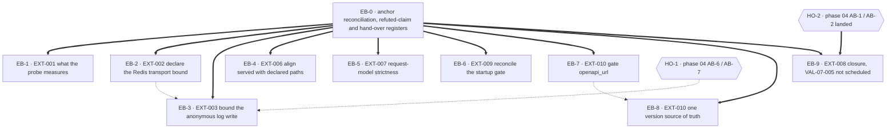

# Phase 07 — External boundary remediation plan

## Purpose

This plan decomposes the phase-07 external-boundary findings into dependency-safe execution blocks.
It is deliberately **small**: the code context re-derived this phase at `cea2d06` and found that five
of the ten findings are already owned by executed or in-flight sibling plans, one is already fixed,
and the genuinely unowned residue is six findings and two halves.

Every block names a **semantic** target (symbol · module · route · config key · environment variable),
the `EXT-*` and `VAL-07-*` identifiers it discharges, its `blocked_by`, its position in the
single-implementor queue, a risk view across implementation / rollout / regression / compatibility,
the agents it needs, its documentation impact, named verification, and its definition of done.

**Its decisions are closed.** `DP-1` … `DP-10` were carried verbatim from the code context, each with
its alternatives, its chooser and what it gated; `DP-11` and `DP-12` were raised here because a fix
genuinely turns on a fork the code context's list is silent about, each marked *raised by this
Planner* following phase 04's `D-04-I` … `D-04-L` precedent. **Four are now closed by the Product
Owner** (`.ai/decisions/ADJUDICATED-2026-10-03-product-owner-rulings.md`, `2026-10-03`: `DP-1` and the
`DP-2` closure it causes in Cluster 3; `DP-6`, `DP-11` and `DP-12` in Cluster 9) and **seven are closed
by this Planner** (`DP-3`, `DP-4`, `DP-7`, `DP-8`, `DP-9`, `DP-10`), each on the plan's own stated risk
analysis. `DP-5` alone remains open and belongs to the **Coordinator**. Every closed option stays
visible in its decision record, marked closed and named; nothing is deleted. See **Ruling register —
2026-10-03**.

Scope discipline: **the audit corpus is not an implementation target.** No block edits
`.ai/audit/**`, `.ai/plans/_code-context/**`, or any sibling plan. If the owner wants the report
repaired, that is a separate authorised authoring task.

---

## Ruling register — 2026-10-03

The Product Owner's register at `.ai/decisions/ADJUDICATED-2026-10-03-product-owner-rulings.md` is the
authority for every Product Owner decision recorded here. **This plan consumes register clusters 3
(Health, diagnostics and rate limiting — `DP-1` and, in the same cluster, the closure of `DP-2`) and 9
(External boundaries — `DP-6`, `DP-11`, `DP-12`).** The register is the **single authority**: it merges
the two input registers of 2026-10-03 and adjudicates every disagreement, and **option letters in it are
not this file's option letters** — the chosen behaviour below is stated **by description**, and the
`Q*` tags are this plan's inherited labels for the same rulings. Nothing below re-opens, re-derives or
substitutes one of its options. Each Planner closure is one sentence against this plan's own risk
analysis.

### Product Owner rulings applied

| Ruling | Register | Closed as | Blocks unblocked | Constraint carried into the block |
| ------ | -------- | --------- | ----------------- | ----------------------------------- |
| **`DP-1`** | **Q1** — cluster 3 | **by description: `/health` stays **database-only** and keeps its exact two-key shape; Redis is stored as a **detailed** component that never moves the liveness status**; `/health/detailed` keeps its components but **requires an administrator**; the reconciler counters (`lease_state`, `unprotected_ticks`) are removed from the anonymous body and shown only to an authenticated administrator | **`EB-1`** | `/health` keeps its **exact two-key shape**; the Redis component is a **detailed** component that never moves the liveness status; `docs/05-health/health-api.md` gains the admin-gating sentence **and** its self-contradiction about the overall status is resolved in the same commit |
| **`DP-6`** | **Q15** — cluster 9 | **by description: strict on **write** bodies, permissive on **read** bodies** | the strict-base sub-item of **`EB-5`** | the **frontend field census remains a hard input**: the policy must not be applied before the census is complete; strict-on-all-bodies is **closed** |
| **`DP-11`** | **Q16** — cluster 9 | **by description: reject on the declared content length, truncate on the parsed field values** — both halves implemented, both proven by a test | **`EB-3`** | **both halves are implemented**; the header-only option is **closed**, because `tests/test_streaming_size_limit.py::TestStreamingSizeLimit` already proves a header check does not bind a body |
| **`DP-12`** | cluster 9 | **by description: an application-level gate on the schema surface, with `nginx` recorded as the real production control and the gap handed over as a named seam** | **`EB-7`** | the fact that the change **has no shipped effect in the production topology** must be stated so no reader over-reads it; the nginx gap stays the **named** hand-over **`HO-4`** with an owner |

**Release-note consequences that are part of the ruling, not of the block's discretion.**

- **`Q1` → `EB-1`.** An unauthenticated external monitor can no longer use `/health/detailed`; it must
  poll `/health` or authenticate. Stated in `EB-1`'s definition of done.
- **`Q15` → `EB-5`.** Phase 16 is informed of the write-only strictness policy before it lands.
- **Cluster 9 `DP-12` → `EB-7`.** The change has **no shipped effect in the production topology**, and
  that must be stated in `EB-7`'s definition of done and its commit body, so no reader over-reads it.

### Technical forks — one closed by consequence, six closed by this Planner

Each names what it unblocks. `DP-2` is **constrained by `Q1`** and is recorded as a link, not as a free
choice — **and the adjudicated register records it as closed by consequence of `DP-1`'s ruling, not by
a Planner's preference**, with relaxing it to key-subset membership **closed by name**.

| Fork | Ruled | Rationale, in one sentence | Unblocks |
| ---- | ----- | --------------------------- | -------- |
| **`DP-2`** *(closed by consequence of `Q1`)* | The **exact-dict assertion stands unmodified** — `{"status": "healthy", "database": "connected"}` stays the whole contract of `test_health_still_healthy_when_redis_down` | `Q1`'s ruling keeps `/health` database-only, so there is nothing for the assertion to be updated about; relaxing it to key-subset membership (**option b**) would permanently remove the exact check that catches this class of change, and **option (c)**'s two contradictory tests would assert two shapes of one endpoint | **`EB-1`**'s definition of done, which was the only thing gating it |
| **`DP-3`** | **(b)** — new `RedisSettings` fields with environment aliases | the bound governs **53 authenticated operations across two entrypoints** and the plan's own rollout risk is choosing it too aggressive for a given deployment, so it belongs under the project's settings discipline rather than in a code literal; `config.py` is re-read immediately before editing because phase 01/02 own it | **`EB-2`** |
| **`DP-4`** | **(a)** — pin `Retry(NoBackoff(), 0)` | every Redis failure direction in this repository is already **declared** (rate limiter fail-closed, temp-password store fail-open, reconciler lease fail-open), and a retry is the one mechanism that turns a bounded failure back into the ~59-second hang the finding exists to remove; **option (b)** buys transient recovery at a multiplied worst case and **option (c)** leaves the retry count an undeclared dependency on a version the lockfile pins today | **`EB-2`**'s bound shape |
| **`DP-7`** | **(a)** — register the four collection paths on their slash form | **option (b)** leaves the existence oracle, which is the finding's **primary** effect and so does not discharge `EXT-006`; **option (c)** buys two mechanisms for one four-path problem; the four live test classes already request the slash form, which is the form option (a) keeps | **`EB-4`** |
| **`DP-8`** | **(a)** — split into app-required and worker-required sets | the plan's own re-derivation proves the four names are **not homogeneous** — `rq` is a worker contract, `httpx` a test-tier contract, `plotly` and `tenacity` certified absences — and a single list cannot encode that, which is what makes "trim the list" the wrong instruction (**option b**); **option (c)** leaves `EXT-009` open, which is the correct outcome only while the question is *"is this dependency wanted?"* and not here | **`EB-6`** |
| **`DP-9`** | **(b)** — an env-overridable `config.app.version` defaulting to the distribution version | the environment override **already exists** and `TestCreateAppMetadata` proves it must keep winning, so **option (a)** — removing it — is a contract change this finding does not ask for, and changing only the **default** gives one source with the settings layer's override on top; **option (c)** "closes nothing" and leaves the document stale by design | **`EB-8`** |
| **`DP-10`** | **(a)** — hand-overs only | five of ten findings are owned by executed or in-flight sibling plans and one is already fixed, so re-filing them would give two teams one symbol for one reason; **option (b)** re-files the `rq-worker` row the report itself declined, and **option (c)** re-opens `VAL-07-002`'s prohibition, which is a closed decision under phase 04's applied `VAL-04-001` | nothing was gated — it closes the scope question, so the OUT table is final as written and only a Coordinator ruling could put a sibling-owned finding back in scope |

**`DP-5` is not closed by this plan and is not closed by the register.** The Product Owner's register
lists it under *Recorded, not scheduled — Coordinator and deployment items*, with the chooser named as
**Coordinator**, on the grounds that data-row hygiene is not a Planner's authority. It is carried in the
out-of-scope table below with that chooser, and no block may perform it.

### Anchor state — snapshot, corrected 2026-10-03

⚠ **This section is a dated snapshot, not a live claim.** It originally read *"Anchor state at
`b009eb9`"* and asserted a re-run that was never performed. Both halves are corrected here.

**At the original anchor `b009eb9`** the tree carried **no modification to any `src/`, `tests/`,
`frontend/`, `alembic/`, `docker/`, `docs/`, `pyproject.toml` or `Makefile.ps1` path this plan names
as a target**; the uncommitted set was `.ai/`-scoped plus `src/mkobi/db/starter.py`,
`src/mkobi/services/file_cleanup.py`, `src/mkobi/workers/data_worker.py` and three test modules, none
of which this plan edits. **`F13`: that uncommitted set is now committed** (`26863b4`, `0dd600d`,
`badf9ea`), and the working tree's current deletions are `.ai/builders`, `.ai/models`,
`.ai/structure`, `.ai/templates` and `frontend/coverage/**` — all pre-existing, all outside this
plan's target set.

**At `1a57bf3`** — 11 commits, 49 files, `app.py` and `config.py` **unmoved since `b009eb9`** —
`git log b009eb9..HEAD` returns **empty** for all nine primary targets, and the untracked set is
`.ai/plans/17-authentication-implementation-execution.md` plus six `.ai/tasks/B*.yaml` (see `F5`).

**Every semantic target in this plan re-resolves by symbol at `1a57bf3`. What did not survive is the
plan's description of them.** The table below records the re-resolution; the corrections table above
records what the descriptions got wrong.

| Symbol | Resolves at `b009eb9` / `1a57bf3` | Symbol drift | **Description drift** |
| ------ | ---------------------- | ----- | ------------------ |
| `app.py::create_app`'s `health_check` and `detailed_health_check` | both present in `src/mkobi/app.py` | none | none |
| `core/redis_client.py::get_async_redis_client`, `::get_redis_client` | both present | none | **`get_redis_client` has zero `src/` callers — `F11`** |
| `api/routes/client_errors.py::report_client_error`, `models/data.py::ClientErrorPayload` | both present | none | none |
| `api/deps.py::get_redis_client_dependency`, `::require_dashboard_admin_access` | both present | none | none |
| `main.py::REQUIRED_MODULES`, `::check_dependencies` | both present | none | **`15` names, not 13 — `F2`** |
| `config.py::RedisSettings`, `::AppSettings` | both present | none | none |
| `models/transformation_configs.py::TransformationConfig`, `models/types.py::GraphConfigDict` | both present | none | **`TransformationConfig` is no longer the sole `forbid` — `F6`** |
| `services/auth_service.py::AuthService.approve_registration_request`, `::reset_password_admin` | both present | none | **both now return `credential_stored` — `F3`** |
| `core/security.py::is_token_revoked`, `::is_user_tokens_revoked`; `core/temp_password_store.py::TempPasswordStore` | all present | none | **the store's two contracts are inverted — `F3`** |
| the **twelve** `redirect_slashes=False` routers | twelve `APIRouter(...)` declarations, unchanged | none | none |
| **nothing outside this plan** | — | — | **`frontend/src/shared/components/ErrorBoundary.tsx` is a live caller of this plan's EB-3 target — `F1`** |

**Nothing under `.ai/audit/**`, nothing under `.ai/plans/_code-context/**` and no sibling
`.ai/plans/0[0-6]-*.md` was edited to make this register.** The Product Owner's register is applied
**inside** this plan, following phase 04's `VAL-04-001` precedent — an audit or decision record is
*applied as a ruling*, never edited.

---

## Drift correction — 2026-10-03, audit at `1a57bf3`

**Added by a plan-vs-tree audit executed against `HEAD = 1a57bf3`.** This section is additive; no
closed `DP-*` record and no rejected option was deleted, and **no `DP-*` was re-ruled**. Where a
correction changes what a block's *instructions* say, the block section itself carries an inline
`⚠ CORRECTED` marker so a reader who jumps straight to the block still sees the change.

### The headline, stated plainly

**No primary production target drifted.** `git log b009eb9..HEAD` is **empty** for all nine of this
plan's primary targets — `src/mkobi/app.py`, `src/mkobi/config.py`, `src/mkobi/main.py`,
`src/mkobi/core/redis_client.py`, `src/mkobi/api/routes/client_errors.py`, `src/mkobi/api/deps.py`,
`src/mkobi/core/security.py`, `src/mkobi/services/auth_service.py` and `tests/test_health.py`
(11 commits, 49 files). `app.py` and `config.py` — the plan's two named churn fronts — have **not
moved since the plan's own anchor**.

**The drift is entirely in the plan's factual claims about the code, and most of them were already
wrong at `b009eb9`.** The plan's sentence *"Every semantic target in this plan re-resolved by symbol
at `b009eb9`. Result: no drift."* was **never re-run** after the Product Owner rulings landed in
`9568c98`, three commits before HEAD — so it asserts an anchor check for a revision the plan had
already passed. **The symbols resolve; the numbers, memberships and censuses attributed to them do
not.** Thirteen such claims are corrected below.

> **Correction of the brief's premise, recorded so it is not repeated.** Commit `badf9ea`
> *"fix(health): state what `last_swept_count` reports"* **did not touch `tests/test_health.py`.** Its
> test files are `tests/test_file_cleanup.py` and `tests/test_static_bundle.py`; its code file is
> `src/mkobi/core/reconciler_lease.py`; its doc is `docs/05-health/health-api.md`. EB-1's blocking
> assertion is untouched. This matters for `F12`: `health-api.md` **did** move, two commits ago, and
> `graphs.py`-adjacent churn is absent from `tests/test_health.py`.

### F1 … F13

| # | What this plan claims | What the tree says (verified by symbol) | Which block's instructions change |
| - | ---------------------- | ----------------------------------------- | --------------------------------- |
| **F1** `[CRITICAL]` | **`X-08`, the refuted-claims table, EB-3's risk rows and its DoD all assert "no first-party caller exists"** | **False.** `frontend/src/shared/components/ErrorBoundary.tsx` exists (54 lines, not the code context's 47) and calls `fetch('/api/v1/client-errors', {method:'POST', …})` at `:40` — **exactly the line the report cited**. `git grep -rn "client-errors" -- frontend/src/` returns one hit. The payload's `error` object carries **three** fields (`name`, `message`, **`stack`**), not the two the docs list; `componentDidCatch` gates the call on `import.meta.env.DEV`; and the call ends in **`.catch(() => {})`** | **`EB-3`** — wholly. Plus the global `X-08` row, the refuted-claims row, EB-3's risk/agent/doc/verification/DoD rows. `X-08` is **re-opened in favour of the report** |
| **F2** `[HIGH]` | `REQUIRED_MODULES` is **13** names (`X-04`, re-derivations, refuted-claims table, coverage ledger, `EXT-009` ledger row, EB-6's risk row, `DP-8`'s text) | **15.** `main.py::REQUIRED_MODULES` lists 15 at HEAD **and** at `b009eb9`. `magic` was added by `ddb7a98`, the immediate parent of the plan's anchor, and four `docs/` files cite it as *"enforced by `main.check_dependencies`"* | **`EB-6`** — four gate-relevant names become **five**; the "3 certify an absence" arithmetic must account for `magic` |
| **F3** `[HIGH]` | `TempPasswordStore.store` is `-> None`; `retrieve` fails graceful → `None` → `404`; two collapsed states; `EXT-005`'s write side is **in flight** (`AB-1`) | **Both contracts are inverted.** `store` is `async def … -> bool`; `retrieve` **raises `TempPasswordStoreUnavailableError`**; three collapsed states. Landed in `478015b`, confirmed an **ancestor of `b009eb9`**. `AuthService.approve_registration_request` / `::reset_password_admin` return `credential_stored`; `docs/SPEC.md` Version History row **3.20** records it as phase-04 **`AB-1`** — **landed** | **`EB-9`** — dead selector, premise inverted, expected outcome now **drift**. **`HO-2`** — its "do not edit the store's contract" guard protects an already-changed contract. OUT table row for `EXT-005` is **stale**. `VAL-07-008`'s four-pin enumeration is **incomplete** (nine `credential_stored` assertions now exist) |
| **F4** `[HIGH]` | `DP-1`'s ruling breaks only `TestHealthWithRedisDown`; that class appears in EB-1's **Verification** row | `tests/test_health.py::TestDetailedHealthReconcilerComponent` calls `/health/detailed` with **no auth token** and asserts `component["lease_state"] == "unknown"` / `== "unprotected"`. Under `DP-1` both become `KeyError`. `unprotected_ticks` has **no** test pinning it | **`EB-1`** — break table gains the class; `lease_state`'s fate under `DP-1` stated against phase 15's `D-15-H`; the Verification-row/break-table contradiction reconciled |
| **F5** `[HIGH]` | The hand-overs describe phase 04's state | `.ai/plans/17-authentication-implementation-execution.md` is **untracked**, `source_head: 29683df` (**53 commits back**), repeats the identical stale store description and lists `AB-1` as un-executed — it **will re-implement landed work**. Its file census excludes `config.py`, `redis_client.py`, `main.py`, `app.py`, so there is **no shared file** with EB-1…EB-8; the collision is **semantic**, in `HO-1`/`HO-2`/`EB-9`. Six untracked `.ai/tasks/B*.yaml` belong to phase 03; `B5` names both graph-create routes, so `graphs.py` (an EB-4 target) can shift | **`HO-1`**, **`HO-2`** — recorded as point-in-time snapshots, not phase 04's current state. **`EB-4`** — re-resolve `graphs.py`. **`EB-9`** — re-read before it runs |
| **F6** `[MEDIUM]` | **Seven** `extra` policies: one `forbid` (`transformation_configs.py::TransformationConfig`) and **six** `{"extra": "allow"}` | **The model layer carries `extra` policies in `types.py` and `transformation_configs.py` only.** Enumerated by symbol: **two** `forbid` — `models/transformation_configs.py::TransformationConfig` and **`models/types.py::ProcessingSettingsModel`** (`ConfigDict(extra="forbid")`) — and **five** `{"extra": "allow"}` (`types.py`'s `AggregatedRecordModel`, `DimensionModel`, `MetricModel`, `GraphConfigModel`, `FilterConfigModel`). The second `forbid` was already present at `b009eb9`. **The audit's headline "8" is an arithmetic slip on its own breakdown (2 + 5 = 7); 7 is what the tree carries**, and the eighth policy it appears to have counted is `config.py`'s `{"extra": "ignore"}` settings model, which is a settings object and not a request-body policy. **`ProcessingSettingsModel` is new to this plan** | **`EB-5`** — the "six allow-types unchanged" DoD becomes five; the out-of-scope warning must be re-derived; `ProcessingSettingsModel` joins the by-symbol enumeration deliverable |
| **F7** `[MEDIUM]` | `plotly` and `tenacity` are *"genuinely certified absences … zero references in `src/`, `tests/`, `docker/`, `alembic/`; `plotly`'s only `src/` mentions are two docstrings"* | **The conclusion survives; the method does not.** `plotly` has **three** `src/` hits and **none is a docstring**: `config.py`'s `template: str = "plotly_white"`, `settings/app.yaml`'s `template: "plotly_white"` — both the **Plotly.js** layout template, not the wheel — and `main.py`'s gate literal. The Python package is genuinely never imported. `tenacity` is a **true** zero-match (the gate literal only). `httpx` tier mismatch **confirmed** | **`EB-6`** — the verification method changes: an implementor running the plan's own grep gets three hits and must reason past each |
| **F8** `[MEDIUM]` | `HO-2` enumerates **six** revocation-read sites, naming `deps.py` ×2 and `permissions.py` ×2 and reaching "six" by counting `auth.py` ×2 without listing them | Count **right**, membership **wrong**. The six are `api/deps.py::get_current_user_dependency`'s two, **`api/routes/auth.py::is_refresh_token_revoked` and its `is_user_tokens_revoked`** (the SPA's refresh path — omitted entirely), and `core/permissions.py::_get_current_user_with_session`'s two | **`HO-2`** — membership enumerated by symbol. `VAL-07-004`'s "six sites, not two" stands |
| **F9** `[MEDIUM]` | `get_async_redis_client` has *"five route sites calling it inline … and `AuthService` builds a private limiter from it as well"* | **Seven** construction sites, and one is not a route: `api/deps.py`'s DI seam, `api/deps.py`'s temp-password-store helper, `api/routes/auth.py`, `api/routes/client_errors.py`, `api/routes/upload.py`, **`app.py`'s reconciler-lease client**, `services/auth_service.py`'s private limiter. `app.py`'s is **exactly what EB-2's own residual-risk bullet names** ("the bound may govern it by accident"). The code context's "three inline sites in `auth.py`" is also stale — phase 04's landed `D5` consolidated them behind `_enforce_dual_rate_limit`; one remains | **`EB-2`** — the census becomes seven, the seam reasoning is stated correctly, and `app.py` is named |
| **F10** `[MEDIUM]` | `pathCount` is **43** (report and code context both); `HO-1`'s rate-limit table records single bounds | **44** at runtime. **The four trailing-slash paths are unchanged, so EB-4's four-path scope is confirmed exactly** — this is bookkeeping, not a scope change. Separately `HO-1`'s table is **pre-`D5`**: `login` and `refresh` and `register-request` are now **dual**-bounded (per-identifier + per-peer) after phase 04's landed `D5`; `client-errors` and `upload` are unchanged | **`EB-4`** — scope unchanged, but the figure is corrected so a diff that adds no path is not chased. **`HO-1`** — the bound table becomes post-`D5`, because `HO-1` is phase 04's and would otherwise mislead its receiver |
| **F11** `[LOW]` | EB-2's target includes `core/redis_client.py::get_redis_client` *"(which shares the construction)"* | **Zero `src/` callers** — only its own `def` matches. It is a **separate sync factory** and does not share the async constructor's construction. "(which shares the construction)" is a **premise to verify, not a fact**: bounding the async constructor leaves the sync one unbounded; bounding both edits a function nothing calls | **`EB-2`** — becomes a **named open question to investigate**, not a premise. Disposition belongs to the owning phase under `DP-10`'s hand-over discipline; this block must not assume either way |
| **F12** `[LOW]` | Four documentation conditionals are left open ("may already exist and must be checked rather than added blindly"; "must be aligned"; etc.) | **All four resolve.** EB-8: the `APP__VERSION` / `APP__NAME` table row **does not exist anywhere** — 0 hits in `docs/`, `.env.example` and `docker/` — so it must be **added**. EB-2: `configuration.md`'s table **exists** and carries a **mixed convention** (nested `REDIS__HOST` / `REDIS__PORT` beside flat `RATE_LIMITER_FAIL_CLOSED` / `TEMP_PASSWORD_TTL_SECONDS`), and `REDIS__DB` is in `.env.example` but absent from the table. EB-4: `swagger.md` documents `POST /api/v1/dashboards` **without** the trailing slash while the served shape has it; the other three of the four paths are **not documented there at all**. EB-3: the `| **Rate limit** | None (errors are expected to be rare) |` row is confirmed **false**. EB-1: the `health-api.md` self-contradiction is **still present**, and `alert on non-200 responses` survives | **`EB-2`**, **`EB-3`**, **`EB-4`**, **`EB-8`** — each conditional becomes a definite instruction. Plus the **`health-api.md` churn hazard**, carried on EB-1 |
| **F13** `[LOW]` | `source_head: b009eb9`; the anchor assertion was re-run; the *Anchor state* section's uncommitted set is live | The plan file was last modified in **`9568c98`**, three commits before HEAD, to apply the rulings — so the anchor assertion was **recorded for a revision the plan had already passed and never re-run**. The uncommitted set the section describes (`db/starter.py`, `services/file_cleanup.py`, `workers/data_worker.py`, three test modules) is **now committed** (`26863b4`, `0dd600d`, `badf9ea`) | Frontmatter `source_head` → `1a57bf3`; the *Anchor state* section is rewritten as a dated snapshot, not a live claim |

### One correction to the audit's own arithmetic, resolved by direct enumeration

The audit is right about the **direction** of `F6` and wrong about the total. It is recorded here
because this plan must not import a number it cannot reproduce.

| Subject | Audit's figure | Re-enumerated at `1a57bf3` | Why it matters |
| ------- | --------------- | ---------------------------- | -------------- |
| `extra` policies in `src/mkobi/models/` (`F6`) | "8 — 2 forbid, 5 allow" | **7 — 2 forbid, 5 allow.** The audit's own breakdown sums to seven; the eighth it counted is `config.py`'s `{"extra": "ignore"}` **settings** model, which is not a request-body policy (and `"ignore"` is Pydantic's default) | EB-5's DoD must say **five** `allow` types and **two** `forbid` types, not six and one. `ProcessingSettingsModel` — the second `forbid` — is the material change either way |
| Dead `-k` selectors (`F3`, and this plan's own execution-order hedge) | "2 of 46" | **Confirmed — 2**, and both are identifiable by name: `test_retrieve_fail_graceful_on_error` (renamed by `F3`) and `TestProcessingConfigUpdate`, which this plan **already hedges** with *"if that class exists at execution time"* | The standing selector-hygiene rule below is written on the verified figure. *(This row is **confirmed**, not corrected — it is here so the record shows which of the two figures was checked and which was re-derived.)* |

### Standing rule — selector hygiene (applies to every block, now)

> **Canonical text, with the per-block instruction: `## Verification commands` → *Standing rule — a
> green exit code is not a verification*.** Summarised here because `F3` found a dead selector inside
> this plan's own verification rows.

> **A `-k` selector that matches nothing exits `5`** (`NO_TESTS_COLLECTED`), which `Makefile.ps1`
> propagates verbatim — so it is **loudly red, not silently green** (measured 2026-10-03; an earlier
> revision of this rule claimed a green exit, which was wrong). **The exit code is therefore not the
> thing to read: a selector can be *nearly* dead — matching a differently-named class, or collecting
> fewer tests than intended — and still exit `0`.** **Every implementor must read the collection count
> in the output header**, confirm it is the number the block's verification row claims, and record it
> in the commit body for every named selector.
>
> Two of this plan's **46** named `-k` selectors are dead at `1a57bf3`:
> `test_retrieve_fail_graceful_on_error` (renamed by `F3` — this plan's EB-9 verification row named
> it, so EB-9 would have **appeared to succeed while verifying nothing**) and `TestProcessingConfigUpdate`
> (already self-guarded by this plan's own *"if that class exists"* hedge, which stays).

### The readiness consequence

See **Execution order — corrected against `1a57bf3`** at the end of this file. In summary: **no block
is blocked.** EB-0's registers were the deliverable and are corrected here; eight blocks are clear to
execute; two need their own Auditor deliverable first (`EB-3`'s caller/model re-derivation, and
`EB-5`'s already-declared frontend field census). `EB-7` remains the cheapest first executable block
— unchanged.

## Anchor authority

> **The report's line numbers are not binding, and neither are the code context's.**
> `VAL-07-009` records nine anchors that moved under the validation itself; the code context §1.1
> records nine more commits landing after the report's `c3c0a61`, of which `2de4156`, `9c49c20` and
> `4a5db54` move or refute `EXT-*` targets outright. The code context resolves against `2174895`;
> `HEAD` was `cea2d06` when this plan was written and is now `b009eb9`, at which **every target
> re-resolved by symbol with no drift** — see **Ruling register — 2026-10-03**.
>
> **Every anchor in this plan is a symbol, a module, a contract, a route, a config key or an
> environment variable.** Implementors resolve targets by symbol at the moment of work. If a symbol
> named below does not exist, that is a finding: stop and report it rather than substituting the
> nearest match.
>
> ⚠ **CORRECTED 2026-10-03 (`F13`).** The paragraph above originally concluded that `HEAD`, "now
> `b009eb9`", had every target re-resolved by symbol **with no drift**. That re-run **never happened**
> — the sentence was written in the same edit (`9568c98`) that applied the Product Owner rulings, three
> commits before HEAD. **The symbols did re-resolve and they resolve today; what did not survive was
> the plan's *characterisation* of them** — the counts, memberships and censuses attributed to those
> symbols. Thirteen such claims are corrected in **Drift correction — 2026-10-03, audit at `1a57bf3`**
> above, each with an inline `⚠ CORRECTED` marker in the block it affects. **`source_head` is now
> `1a57bf3`**; `b009eb9` is retained in `source_head_history` because the thirteen claims were mostly
> already false **at** `b009eb9`, and that is the finding.

### Anchor-authority precedence

**`report`** = `.ai/audit/99-validation/07-external-boundary-validated-findings.md`
**`code_context`** = `.ai/plans/_code-context/07-external-boundary-code-context.md`
**`code_context_authority: Phase-1 Auditor (overrides every report anchor)`** — where the two disagree
about *where* something is or *what the code does*, the **code context wins**: the report's coordinate
becomes a **drift-list entry, not a remediation target**. Where they disagree about *identity* (which
finding is which), the **report's identifier set wins** and the code context's numbering is recorded as
a **defect** — no `EXT-*` or `VAL-07-*` identifier is renumbered, re-typed or re-scoped by this plan.

**A runtime or tree observation is current-state evidence, not a third authority.** This plan measured
`/health` and read the container posture **read-only**, and a later implementor who finds the tree has
moved must **re-read the named symbol and record the drift** — never silently re-rule a `DP-1 … DP-12`
record. Precedence is therefore: **code context for fact, report for identity, and a later tree for
neither.**

**Anchors that are dead and must not be spent.** Every `admin.py` approval anchor the report cites
(`admin.py` approval-body lines for `create_user`, `force_password_change`, `uuid4`, `store`,
`update_status(APPROVED)`, `db.commit()` and the rollback arm) **names nothing** — those bodies are
`services/auth_service.py::AuthService.approve_registration_request`. The literal `version="1.0.0"`
is **not** in `app.py`; `app.py::create_app` reads `config.app.version` and the literal lives in
`config.py::AppSettings.version`. A Redis `PING` component **exists on neither** health endpoint
today. Phase 04's `AB-0` (finding `Y-01`) independently reached the same conclusion about the
`admin.py` anchors; two planners, one result.

### Refuted claims this plan does not carry

Each was verified against `cea2d06` while writing this plan. A block that acted on any of them would
be acting on a claim the code context already refuted. **Every row below was re-resolved by symbol at
`b009eb9` and again at `1a57bf3`.**

⚠ **CORRECTED 2026-10-03.** The table's preamble used to assert that **none** of these rows had
changed. **One had, and it was wrong in the first place:** the `EXT-003` row below was inherited from
the code context's own refutation, and the code context was wrong (`F1`). That row is now **struck and
replaced**; the rejected option is kept visible. The `EXT-009` `REQUIRED_MODULES` row was likewise
inherited and is corrected to the tree's figure (`F2`).

| Refuted claim | Reality at `cea2d06` | Recorded by |
| ------------- | ------------------- | ----------- |
| EXT-001: "`Select-String redis` over `app.py` returns zero matches" | **5 matches** — `app.py` imports `get_async_redis_client`, uses it for the reconciler lease, and names it in three comments | EB-0, EB-1 |
| EXT-001: "the dev override disables the container healthcheck" | **Refuted** — `docker/docker-compose.override.yml` inherits the base healthcheck, with an explicit comment saying so; re-enabled by `9c49c20` | EB-0, EB-1 |
| EXT-001: "no shipped test blocks a Redis component" | **Refuted** — `tests/test_health.py::TestHealthWithRedisDown::test_health_still_healthy_when_redis_down` asserts `response.json() == {"status": "healthy", "database": "connected"}`, an **exact-dict equality** | EB-1, `DP-2` |
| ~~EXT-003: "the one shipped caller is `ErrorBoundary.tsx:40`"~~ — **the code context's refutation of it was FALSE and is REVERSED here** | ⚠ **`F1`: the code context's refutation was wrong at `cea2d06`, wrong at `b009eb9`, and wrong now.** The file is **54 lines**, not 47, and `frontend/src/shared/components/ErrorBoundary.tsx` **does** call `fetch('/api/v1/client-errors', …)` — at `:40`, the line the report cited. `git grep -rn "client-errors" -- frontend/src/` returns exactly one hit. **The report was right; this row is the rejection that is kept visible but no longer acted on.** See `X-08` | ~~EB-0, EB-3~~ → **EB-0, EB-3 — re-opened in favour of the report** |
| EXT-004: "the email branch is unreachable" | **Refuted for `register-request`** — `api/routes/auth.py` declares `client_ip: str \| None = None` and assigns it only under `if request.client:`, so the email branch is reachable exactly when the peer is absent | EB-0 (hand-over note only) |
| EXT-007: "a malformed `filters` yields an empty result set or a later error rather than a 422" | **Refuted for malformed JSON** — `api/routes/data.py` maps `json.JSONDecodeError` to a 422-class `AppException`. What is unvalidated is the **document shape** of a well-formed object | EB-0, EB-5 |
| EXT-009: "`rq` is never imported" | **Refuted** — imported by exactly **two** `src/` modules (`src/mkobi/rq_worker_wrapper.py`, `src/mkobi/core/task_queue.py`), four import statements in all | EB-0, EB-6 |
| ⚠ **EXT-009: "reduce `REQUIRED_MODULES` to the twelve the application imports"** | **Refuted, and the count corrected.** ⚠ `F2`: `REQUIRED_MODULES` is **fifteen** names at `b009eb9` **and** at `1a57bf3`, not thirteen. The report said 12, the code context said 14, this plan said 13, **the tree says 15** — `magic` is the name all three missed, added by `ddb7a98` and cited by four `docs/` files as *"enforced by `main.check_dependencies`"*. The report's *direction* is still right; its figure is not | EB-0, EB-6 |
| EXT-010: "`app.py` passes the literal `version=\"1.0.0\"`" | **Refuted as written** — `app.py::create_app` reads `config.app.version`; the literal is in `config.py::AppSettings.version` | EB-0, EB-8 |
| VAL-07-005: "on a publish failure compensate the committed record (mark the request failed and remove the account)" | **Refuted in effect** — contradicted by a shipped test, two landed docstrings and a shipped doc. ⚠ `F3` adds a **fourth** contradicting artefact: the landed `credential_stored` return value. **Not scheduled anywhere in this plan** | EB-0, EB-9 |

### Planner-required re-derivations

The code context §6 states, for `EXT-007`: *"The Planner must re-derive the exact set by symbol, not
by count."* The same discipline applies to `EXT-009`, and both were re-derived here. **Four
corrections to the code context follow, and all four change what the implementor should do.** (Two
were added by the 2026-10-03 audit at `1a57bf3` and are marked ⚠.)

| Subject | Code context's figure | Re-derived, and **re-derived again at `1a57bf3`** | Consequence |
| ------- | ---------------------- | ------------------------ | ----------- |
| `EXT-007` — request-body models | 20 regex candidates, "0 of 21" load-bearing | ⚠ **CORRECTED (`F6`).** "Unchanged in substance" no longer holds: the model layer carries **seven** `extra` policies, not seven-of-the-composition-the-report-described. **Two `forbid`** — `models/transformation_configs.py::TransformationConfig` and **`models/types.py::ProcessingSettingsModel`** (`ConfigDict(extra="forbid")`, new to this plan) — and **five** `{"extra": "allow"}` in `types.py` (`AggregatedRecordModel`, `DimensionModel`, `MetricModel`, `GraphConfigModel`, `FilterConfigModel`), not six. Every route-shaped body model still resolves with `extra` unset, i.e. Pydantic v2's `extra="ignore"` — **that part is unchanged** | The **exact set** is EB-5's Auditor deliverable, enumerated **by symbol** in the commit body — not by count. **Whether `ProcessingSettingsModel` is route-shaped is inside that deliverable**, not outside it |
| `EXT-009` — `rq` import sites | "**39 matches**" (a text census) | **4 import statements across 2 `src/` modules**, confirmed exact at `1a57bf3`: `import rq`, `from rq.defaults import …`, `from rq.worker_registration import …` in `src/mkobi/rq_worker_wrapper.py`; `import rq` in `src/mkobi/core/task_queue.py` | `rq` is genuinely imported and stays. The "39" was a text count, the same class of error the report made with its own `BaseModel` count |
| `EXT-009` — `httpx` status | "0 `src/` import sites → still gate-only" | **Misfiled tier** — confirmed again at `1a57bf3`. `httpx` has **zero** `src/` import sites but is imported by `tests/conftest.py` and by **~20** test modules as `AsyncClient`. It is a genuine **test-tier** contract declared in `pyproject.toml` `[project].dependencies` and gated at **application startup** | `httpx` is **not** a certified absence. It is a tier mismatch. This is the sharpest thing in this block and it changes the remedy from "drop the name" to "the name is real but belongs to a different gate" |
| `EXT-009` — `plotly` / `tenacity` status | "still gate-only" | ⚠ **CORRECTED (`F7`) — the conclusion survives, the method does not.** Both are absent as **Python packages**. But `plotly` is **not** a zero-match: it has **three** `src/` hits and **none is a docstring** — `config.py`'s and `settings/app.yaml`'s `plotly_white`, which is the **Plotly.js** layout-template name, plus `main.py`'s gate literal. `tenacity` **is** a true zero-match (the gate literal only). Both are declared **runtime** deps in `pyproject.toml` | Two dead runtime dependencies. **EB-6's verification must therefore grep by symbol** (`import plotly` / a resolved import), not by string, or it inherits the false positive. Dropping them from `REQUIRED_MODULES` while leaving them declared in `pyproject.toml` is incoherent — see **HO-1** |

`tests/test_task_queue.py::TestServicesDoNotImportRq::test_no_service_module_imports_rq` asserts, by
AST walk, that **no module under `src/mkobi/services/` imports `rq`**. Neither of the two real import
sites is a service module, so that shipped layering rule is satisfied today and **must stay satisfied**
— it is the reason `rq`'s presence in `main.py::REQUIRED_MODULES` is defensible as the *worker*
entrypoint's contract.

### Source tree state at plan time

`git log --oneline -3` → `cea2d06`, `2174895`, `b646ef1`. The tracked working tree carried no
modifications when this plan was written. `2174895` and `cea2d06` are outside every `EXT-*` target.
Commits that **do** intersect this phase's targets, all already landed: `2de4156` (EXT-008 fixed;
EXT-005 anchors dead; VAL-07-005's outcome contradicted), `9c49c20` (dev healthcheck re-enabled;
`health-api.md`'s probe decision added), `4a5db54` (third `/health/detailed` component plus the
blocking shipped test), `3848e7a` (RQ made real), `d008f55` (`app.py` CORS guard moved).

**At `b009eb9`** the tree carried **no modification to any `src/`, `tests/`, `frontend/`, `alembic/`,
`docker/`, `docs/`, `pyproject.toml` or `Makefile.ps1` path this plan names as a target**; the
uncommitted set was `.ai/`-scoped plus `src/mkobi/db/starter.py`, `src/mkobi/services/file_cleanup.py`,
`src/mkobi/workers/data_worker.py` and three test modules, none of which this plan edits. **Every
symbol this plan names re-resolves.** **No block begins without re-resolving by symbol again**,
because the two churn fronts below are named for exactly that reason.

⚠ **CORRECTED 2026-10-03 (`F10`, `F13`).** Two figures in this section were wrong:

- **`pathCount` is 44, not 43.** The four trailing-slash paths are unchanged, so **EB-4's four-path
  scope is confirmed exactly** — this is bookkeeping, not a scope change.
- **The uncommitted set above is now committed** (`26863b4`, `0dd600d`, `badf9ea`). The working tree's
  current deletions are `.ai/builders`, `.ai/models`, `.ai/structure`, `.ai/templates` and
  `frontend/coverage/**`, all pre-existing and all outside this plan's target set. **This section is a
  dated snapshot.** The live re-resolution statement is the table in **Anchor state — snapshot,
  corrected 2026-10-03** and the corrections table above.

**Two files are the repo's highest-churn and are targets here.** `config.py` is under concurrent
phase-01/02 work and is touched by EB-2 (`DP-3` option b) and EB-8. `app.py` is touched by EB-1 and
EB-7. Any implementor must re-resolve both by symbol immediately before editing, and re-check
`git status`.

## Scope-ruling tables

### IN — owned by this plan

| Finding | Severity | Short name | Block |
| ------- | -------- | ---------- | ----- |
| **EXT-001** (probe-measurement half) | HIGH | The probe reports `healthy` while every authenticated request fails | **EB-1** |
| **EXT-002** (residue only) | HIGH | The Redis transport bound is a library default nobody pinned | **EB-2** |
| **EXT-003** | HIGH | An anonymous 5 MB body is written verbatim into one ERROR record | **EB-3** |
| **EXT-006** | MEDIUM | The credential check runs after the router's slash redirect | **EB-4** |
| **EXT-007** | MEDIUM | No request-body model declares a strictness policy | **EB-5** |
| **EXT-008** | MEDIUM | *(already fixed)* — verification scope and non-scheduling only | **EB-9** |
| **EXT-009** | LOW | The startup self-check certifies libraries the app never imports | **EB-6** |
| **EXT-010** | LOW | The schema document advertises a stale version; half the gate is missing | **EB-7** (tier half), **EB-8** (version half) |

### OUT — not owned here, with the named home

| Item | Home | Note for this phase |
| ---- | ---- | ------------------- |
| **EXT-004** — the whole inbound budget collapses onto the proxy's address | merged → phase 04 **AB-6** (rate-limit key identity) + **AB-7** (proxy trust) | Plan 04 is at `source_head: 2174895` and **has already applied** `VAL-04-001`: option (b)'s `forwarded-allow-ips="*"` is **deleted, not deferred**. `VAL-07-002`'s wildcard prohibition is therefore a **closed decision** and this plan inherits it without re-opening it. See **HO-1**. |
| **EXT-005** — approval returns 200 and a handle for a credential never stored (write side) | merged → phase 04 **AB-1** — ⚠ **`F3`: LANDED, not in flight.** Commit `478015b` ("separate an unreachable credential store from a spent handle"), confirmed an ancestor of `b009eb9`; recorded in `docs/SPEC.md` Version History row **3.20** as *"Authentication remediation, block `AB-1`"*. Both service methods now return **`credential_stored`**. The defect was remediated with a deliberate shape that **still contradicts `VAL-07-005`'s prescribed compensation** — by a fourth artefact. Carried as `HO-2`, not re-planned. |
| **EXT-005** (read side) — one 404 for two states | merged → phase 04 **AB-2** | Plan 04 records the same two-state finding (`Z-14`). |
| **EXT-002** (refusal class) — a Redis error on the revocation read becomes `401 AUTHENTICATION_FAILED` | merged → phase 04 **AB-5** | `ErrorCode.SERVICE_UNAVAILABLE` **exists** and is already mapped to 503 (`VAL-07-003` applied). **No new enum member.** See **HO-2**. |
| **EXT-001** (deployment half) — the Docker healthcheck, `start_period`, the worker-count interaction | phase 02 **B3 / TOPO-008** — **landed** as `9c49c20` | Do not re-litigate the dev-vs-prod healthcheck. |
| **EXT-001** (deployed composition: nginx, load balancers, Kubernetes probes) | phase 10, as **co-owner** of the probe contract | Appendix F's ruling stands: co-owned, **not merged**. 07 owns what the probe *measures*; 10 owns the *deployed composition*. |
| **EXT-003** — what credential material reaches any other sink | phase 15 | Appendix F: cross-reference, not merged. The **volume** half is EB-3's; the **sink** question is phase 15's. |
| **EXT-003** — "the volume bound is a shared pool" | phase 04 **AB-6** | This is a *reasoning* dependency, not an edit dependency: EB-3 can ship without it, but the shared-pool half of the consequence cannot be reasoned about until it lands. Recorded as a dotted edge in the block map. |
| **EXT-007** — the frontend's consequence (`422` on a write route) | phase 16, as **co-owner** | Phase 07 owns the model policy; phase 16 owns whether the SPA over-sends. EB-5's Auditor deliverable is the census that makes the co-ownership decidable. |
| **EXT-009** — the `rq-worker` topology row | phase 01 **TOPO-001** | The report itself declines to re-file it. This plan declines it too. |
| **EXT-009** — the `pyproject.toml` dependency residue (`plotly`, `tenacity`, `requests`, `pyjwt` alongside `python-jose`, `asgiref` in a non-Django stack) | phase 01 (dependency surface) | Recorded, not absorbed: EB-6 makes the *gate* coherent, not the manifest. See **HO-1**. |
| **EXT-002** — 4 workers × ~59 s saturation as a measured cost | phase 11 | The report hands the projection to 11 explicitly. |
| **EXT-007** — the repository predicate `AggregatedData.dims[key].astext == str(value)` | phase 03 / phase 05 | `SELECT`-safety is re-confirmed: the predicate is built as a SQLAlchemy expression, with no string interpolation. **No change is proposed and none is needed.** |
| **docker/nginx/nginx.conf` | phase 12 (per plan 04's `C04-5`) / phase 10 | EB-7's production-tier gap lives behind nginx's `location` blocks; the file is not this phase's. |
| `tests/test_rate_limiting.py::TestRateLimitingIntegration::test_different_ips_have_separate_limits` | phase 09 | The test's **name** promises per-IP separation it never exercises. EB-3 touches the same key identity by consequence; it does not fix the test. |
| `tests/test_health.py`'s test **quality** | phase 09, via `DP-2` | EB-1 owns the production change; the assertion's shape is phase 09's ruling. |
| Orphan `temp_pwd:` keys and the five `bidb` rows `VAL-07-011` names | **nobody** — `DP-5`, **Coordinator only** | A Planner must not create or delete database rows. The Product Owner register of `2026-10-03` places `DP-5` under *Recorded, not scheduled — Coordinator and deployment items*, chooser **Coordinator**, and this plan inherits that position without re-opening it. Recorded, not scheduled. |
| **VAL-07-011** itself | not actionable for this role | It is a claim about the report's own prose. |

### CONFLICT — between report, code context and landed work

| # | Subject | Report | Code context | Ruling |
| - | ------- | ------ | ------------- | ------ |
| **X-01** | EXT-001's remedy feasibility | "Executable as written, and verified to have no shipped test blocker" | `tests/test_health.py` asserts `/health` by **exact dict equality**, and `docs/05-health/health-api.md` argues the probe must stay DB-only | **Code context wins.** The remedy is not executable as written, **and the Product Owner's ruling of 2026-10-03 landed on the code context's side**: `DP-1` option (a) and `DP-2`'s closure preserve both artefacts. The documented decision stands as recorded, and `EB-1`'s constraints are now satisfied by the ruling rather than argued by the implementor. |
| **X-02** | EXT-005's merge ruling | Filed with **no** merge or adjacency ruling at all | Merged into phase 04 **AB-1**/**AB-2**, escalated | **Both agree.** `VAL-07-001` is discharged by the hand-over register. |
| **X-03** | EXT-008's remedy | "Move the store after `db.commit()`" — and, via `VAL-07-005`, compensate the committed record | The ordering half is **already fixed** and pinned by three shipped tests; the compensation half is **contradicted** | **Code context wins.** EB-9 is verification-shaped. `VAL-07-005` is recorded and **not scheduled**. |
| **X-04** | EXT-009's count | "reduce `REQUIRED_MODULES` to the twelve the application imports" | "13 (14 minus `rq`)" | ⚠ **CORRECTED 2026-10-03 (`F2`) — Planner re-derivation wins, and its own figure was also wrong.** `REQUIRED_MODULES` has **15** names at `b009eb9` **and** at `1a57bf3`; report 12, code context 14, this plan 13, **tree 15**. The name all four missed is **`magic`**, added by `ddb7a98` and cited by four `docs/` files as *"enforced by `main.check_dependencies`*". Of the **five** gate-relevant names, **three certify an absence or a tier mismatch** (`plotly`, `tenacity`, and `httpx` — the last a **tier** mismatch, not an absence), **`rq` is real** and stays, and **`magic` is a real app-level hard dependency** and stays. EB-6 prices all five individually |
| **X-05** | EXT-010's evidence | "`app.py` passes the literal `version=\"1.0.0\"`" | The literal moved to `config.py`; the drift is unchanged | **Both refuted as written.** The finding's *consequence* (a document seven patch releases behind, no version to detect a contract change) stands, which is why EB-8 exists. |
| **X-06** | EXT-002's retry arithmetic | "three retries of a 5 s timeout" | Measured `retries=10`, `ExponentialWithJitterBackoff(cap=1, base=0.01)`, `socket_timeout=5` | **Code context wins** (`VAL-07-006`). EB-2's bound must be designed against eleven 5-second attempts, not three. |
| **X-07** | EXT-006's surface | "every declared path", "all 43 declared paths" | Four paths | **Code context wins** (`VAL-07-007`). EB-4 is scoped to `/api/v1/users/`, `/api/v1/dashboards/`, `/api/v1/graphs/`, `/api/v1/admin/logs/`. ⚠ **CORRECTED (`F10`): the four paths are confirmed exactly, but `pathCount` is 44, not 43.** The count is bookkeeping; **EB-4's scope does not change** |
| ⚠ **X-08** — **RE-OPENED 2026-10-03, IN FAVOUR OF THE REPORT** | EXT-003's compatibility caveat | "check the one shipped caller, `ErrorBoundary.tsx:40`" | Zero `client-errors` references in `frontend/src/`; "there is no first-party caller and the documented contract already names two fields" | **THE REPORT WINS — this row reverses the code-context-wins precedence for this subject only.** ⚠ `F1`: the code context's refutation was **false at `cea2d06`, false at `b009eb9`, and false at `1a57bf3`**. `frontend/src/shared/components/ErrorBoundary.tsx` is 54 lines and calls `fetch('/api/v1/client-errors', …)` **at `:40`** — the line the report cited; `git grep -rn "client-errors" -- frontend/src/` returns exactly one hit. **The code context is wrong, the report is right, and the rejection is kept visible above rather than deleted.** Four consequences: (a) the caller sends **three** `error` fields including **`stack`**, so a strict inner model built from the documented two would reject the only caller that exists; (b) the call ends in **`.catch(() => {})`**, so a `422` would be **silently swallowed** and **no test in this repository would fail** — this is a *detection gap*, not a risk; (c) the reporter is **DEV-gated** on `import.meta.env.DEV`; (d) `client-error-reporting.md`'s "Frontend Integration" section is **incomplete, not aspirational** — it names three integrations and **one of the three is wired**. **`DP-11` is UNAFFECTED** — its ruling (reject on declared length, truncate on parsed values) is neither re-opened nor re-derived here; this row corrects the *basis the block reasons from*, which makes the ruling **more** load-bearing, not less |

### VERIFICATION FINDING — the report's `VAL-07-*` records

Each is a defect **in the report**, not in the code. **No audit file is edited.** `VAL-07-002` and
`VAL-07-005` alone change what may be scheduled, and `VAL-07-005` changes it by *deleting* an option.

| ID | Band | Subject | Ruling in this plan |
| -- | ---- | ------- | ------------------- |
| **VAL-07-001** | MEDIUM | EXT-005 duplicates AUTH-002 + AUTH-006, filed with no merge ruling | **Substantiated and escalated.** Discharged by the hand-over register (**HO-2**): EXT-005 is registered as merged into phase 04 **AB-1** (write) and **AB-2** (read), naming the owning phase. The report's `admin.py` anchors name nothing; the register records the bodies' real location so a ticket cannot land on a delegation. |
| **VAL-07-002** | MEDIUM | EXT-004's `forwarded-allow-ips="*"` is a caller-chosen bucket | **Substantiated; ALREADY RULED — not re-opened.** Plan 04 records `VAL-04-001` as **applied**: option (b) is deleted. This plan inherits the ruling. **No block in this plan may name `"*"` as an option.** |
| **VAL-07-003** | MEDIUM | EXT-002 claims `SERVICE_UNAVAILABLE` does not exist | **Substantiated. Applied.** `models/enums.py::ErrorCode.SERVICE_UNAVAILABLE` exists and is already mapped to 503 in `utils/exceptions.py`. **No new enum member is created anywhere in this plan.** Phase 04's `AB-5` consumes the existing code. |
| **VAL-07-004** | MEDIUM | EXT-002's refusal class duplicates AUTH-008 at the same sites | **Substantiated, and the site list is larger: six, not two.** ⚠ **CORRECTED (`F8`) — the count was right and the membership was wrong.** The six sites are `api/deps.py::get_current_user_dependency`'s two revocation reads, **`api/routes/auth.py`'s two (`is_refresh_token_revoked` and `is_user_tokens_revoked` — the SPA's refresh path)**, and `core/permissions.py::_get_current_user_with_session`'s two. **The plan previously reached "six" by counting `auth.py`'s two without listing them**, so a phase-04 guard written from it would miss both. Handed to phase 04 **AB-5**. Phase 07 keeps only the blast radius and the undeclared bound (EB-2). |
| **VAL-07-005** | MEDIUM | EXT-005/EXT-008/AUTH-002 prescribe three orderings; the report picks a fourth | **Refuted in its prescribed outcome. Recorded, NOT scheduled.** Adopting it literally reverses a shipped test, two landed docstrings and `docs/04-admin/admin-api.md`. **EB-9 exists to keep this from being scheduled by a later reader.** |
| **VAL-07-006** | MEDIUM | "three retries of a 5 s timeout" is wrong; the library retries ten | **Substantiated, runtime-confirmed. Applied as a wording correction.** EB-2's bound is designed against the measured configuration. |
| **VAL-07-007** | MEDIUM | EXT-006 overstates the enumeration surface ~10× | **Substantiated. Applied.** Four paths; EB-4 is scoped to exactly those four and to no more. |
| **VAL-07-008** | MEDIUM | EXT-005/EXT-008 blocked by two shipped tests both reports deny | **Substantiated verbatim, plus a fourth pin the report missed** (`tests/test_admin_user_management.py`'s admin-reset case). ⚠ **CORRECTED (`F3`) — that four-pin enumeration is now incomplete.** Phase 04's `AB-1` **landed** (`478015b`, an ancestor of `b009eb9`), so the pins have multiplied: `tests/test_auth_service.py` now carries **nine** `credential_stored` assertions plus `tests/core/test_temp_password_store.py`'s success-path pin, and `test_retrieve_fail_graceful_on_error` **no longer exists**. Recorded in **HO-2** so phase 04 inherits the current list; see EB-9 for the corrected selector. |
| **VAL-07-009** | LOW | Nine anchors moved and are now committed | **Substantiated and superseded.** Its correction table targets an older revision than `HEAD`. **Keep the method (resolve by symbol, re-resolve immediately before editing); discard the numbers.** |
| **VAL-07-010** | LOW | Four evidence anchors and one search characterisation are wrong | **Substantiated for (a)–(c)** (`pyproject.toml`'s version is at line 7; twelve routers carry `redirect_slashes=False`, all verified; twelve names in `REQUIRED_MODULES` was the report's figure and is **15**); **(d) is superseded** by `VAL-07-001`. **A fifth error exists that `VAL-07-010` does not name** — EXT-004's "email branch is unreachable" (see the refuted-claims table). ⚠ **CORRECTED (`F2`, `F10`): `pathCount` is 44, not 43, so the report's "43 declared paths" figure is wrong too.** |
| **VAL-07-011** | LOW | The report's restoration claim omits five durable rows it created | **Not actionable for this role.** No block may create or delete database rows. Carried as **DP-5** for the Coordinator and named in the out-of-scope table. |

## Block map



**The decision nodes have left the graph.** All eleven gated decisions — `DP-1`, `DP-2`, `DP-3`,
`DP-4`, `DP-6`, `DP-7`, `DP-8`, `DP-9`, `DP-11`, `DP-12` (ruled) and `DP-10` (never gated) — are
closed records as of 2026-10-03 and appear in the decision section below, not as live gates; only
`DP-5` survives, and it gates nothing by design. **No `==>` edge remains from a decision node into a
block**, because no block is gated by a decision any longer. What remains is `EB-0`'s register-first
edge into every block, `HO-2` into `EB-9`, and three dotted review-coherence edges.

`==>` = hard dependency. `-.->` = recommended sequencing in the single-implementor queue, **not** a
data dependency — the project permits one implementor at a time, so these are ordered for review
coherence. `HO-*` diamonds are hand-over gates owned by another phase, not by this one.

### Coverage ledger

| Block | Findings discharged | Decisions gating it | Agents |
| ----- | -------------------- | -------------------- | ------ |
| **EB-0** | all eleven `VAL-07-*` as rulings; every dead anchor; every refuted claim; the hand-over register | — | Planner (owns the note); Auditor confirms the registers are complete at `1a57bf3` (**`F13`**: `b009eb9` is stale) |
| **EB-1** | **EXT-001** (probe-measurement half) | **none** — `DP-1` ruled (Q1) and `DP-2` closed (Planner) | **Auditor, Researcher, Planner, Validator — all four** |
| **EB-2** | **EXT-002** (residue) · `VAL-07-006` · `VAL-07-003` (recorded) · `VAL-07-004` (recorded) | **none** — `DP-3` and `DP-4` closed (Planner) | **Auditor, Researcher, Planner, Validator — all four** |
| **EB-3** | **EXT-003** | **none** — `DP-11` ruled (Q16). ⚠ `F1` re-opens `X-08` **against** the plan; the ruling itself stands | **Auditor, Researcher, Planner, Validator — all four** |
| **EB-4** | **EXT-006** · `VAL-07-007` | **none** — `DP-7` closed (Planner) | Planner, Validator |
| **EB-5** | **EXT-007** | **none** — `DP-6` ruled (Q15); the **frontend field census** is still a hard input, and it is a deliverable, not a decision | **Auditor, Researcher, Planner, Validator — all four** |
| **EB-6** | **EXT-009` | **none** — `DP-8` closed (Planner) | Planner, Validator |
| **EB-7** | **EXT-010** (tier half) | **none** — `DP-12` ruled (Product Owner, cluster 9, 2026-10-03) | Planner (short), Validator |
| **EB-8** | **EXT-010** (version half) | **none** — `DP-9` closed (Planner) | Planner, Validator |
| **EB-9** | **EXT-008** (verification) · **`VAL-07-005`** (recorded, not scheduled) | — | none beyond Implementor; Validator if the ordering has drifted |

**Every block is now unblocked by a decision.** The only gates left in the plan are `EB-0` (the
register-first soft edge) and three cross-phase seams that belong to other phases: **HO-1** (phase 04
`AB-6`/`AB-7`, a reasoning-only dependency of `EB-3`), **HO-2** (phase 04 `AB-1`/`AB-2`, a soft edge
into `EB-9`) and **HO-4** (phase 12 / phase 10 own `nginx.conf`, and cluster 9's `DP-12` records the
gap as a **named seam** rather than closing it).

**Splits and merges, with reasons.** `EXT-010` is **split** into EB-7 (tier half) and EB-8 (version
half) because the two halves touch different files (`app.py` versus `config.py`), carry different
blockers (none versus a phase-01 hand-over to the repo's highest-churn file), and have different risk
profiles — and because merging them would leave one half stuck behind a cross-phase hand-over it does
not depend on. Nothing else is split: `EXT-007`'s three sub-items (`filters` modelling,
`GraphBase.config` modelling, the strict base) share one file family, one review and one regression
surface, and the two strict-base sub-items cannot ship apart from the census that governs them under
`DP-6`'s **ruled** option B. `EXT-002` is **not** merged into phase 04's `AB-5` because the two halves
have different files, different risk and different verifiers even though they share one dependency —
see **HO-2**.

---

## Execution blocks

### EB-0 — Anchor reconciliation, refuted-claim register and hand-over register

| Field | Value |
| ----- | ----- |
| **Semantic target** | **No production code.** This plan's own "Anchor authority", "Refuted claims", "Planner-required re-derivations" and "Scope-ruling tables" sections are the deliverable, carried forward into each block's `Definition of done`. |
| **Discharges** | `VAL-07-001` (registered as merged → **HO-2**) · `VAL-07-002` (**closed** by phase 04's applied `VAL-04-001`; inherited, not re-opened) · `VAL-07-003` (**applied** — no new `ErrorCode` member anywhere in this plan) · `VAL-07-004` (**applied** — six sites, **all six enumerated by symbol** after `F8`; refusal class handed to **HO-2**) · `VAL-07-005` (**recorded, not scheduled** — see EB-9) · `VAL-07-006` (applied — wording) · `VAL-07-007` (applied — four paths; `F10` corrects the `pathCount` figure without changing scope) · `VAL-07-008` (recorded → **HO-2**; ⚠ `F3` makes its four-pin enumeration **historical** — the current pins are enumerated in **HO-2**) · `VAL-07-009` (superseded — method kept, numbers discarded) · `VAL-07-010` (applied for (a)–(c), with `F2` correcting the `REQUIRED_MODULES` figure and `F10` the `pathCount`; (d) superseded by `VAL-07-001`; the unnamed fifth error recorded) · `VAL-07-011` (**not actionable** — `DP-5`, out-of-scope table) · every dead anchor · every refuted claim · conflicts **X-01 … X-08**, of which **`X-08` is re-opened in favour of the report** (`F1`) |
| **blocked_by** | — |
| **Execution order** | **1.** Nothing else starts without it. |
| **Risk — implementation** | **None.** Nothing executes. |
| **Risk — rollout** | **None.** |
| **Risk — regression** | **None.** |
| **Risk — compatibility** | One real hazard: **this note can be mistaken for authority to edit `.ai/audit/**`.** It is not. Phase 03's `B0` convention — *no audit file is edited* — is inherited verbatim, and phase 04's `VAL-04-001` precedent (an audit record *applied* as a ruling inside a plan, never as an edit to the report) is inherited with it. |
| **Agents** | **Planner** — owns the note. **Auditor** — confirms at `1a57bf3` (`F13`: not `b009eb9`) that the refuted-claim table and the hand-over register name every anchor the code context lists as dead or refuted, **that the `EXT-003` row is marked reversed and not silently deleted**, and that no *new* dead anchor appeared while the registers were being corrected. No Implementor, no Researcher, no Validator: nothing here is a code claim that a green gate could check. |
| **Documentation impact** | **One row** appended to `docs/SPEC.md` **Version History**, naming this plan — house convention, matching sibling plans. **Nothing else.** |
| **Verification** | `git status --porcelain` clean of tracked source at block start · `git rev-parse HEAD` recorded in the commit body · confirm no file under `.ai/audit/`, `.ai/plans/_code-context/` or any sibling `.ai/plans/0[1-6]-*.md` appears in `git status` as modified · re-resolve every symbol in the **Anchor state — snapshot, corrected 2026-10-03** table by symbol and record any movement · **re-verify the thirteen corrected claims by symbol rather than trusting this section** · **no test run required** |
| **Definition of done** | The note exists and names: the seven dead `admin.py` approval anchors; the dead `version="1.0.0"` anchor in `app.py`; the absent Redis `PING` on both health endpoints; all ten refuted claims with their reality, **with the `EXT-003` row marked reversed rather than deleted** (`F1`); the **four Planner re-derivations** (four `rq` import statements across two modules; `httpx` as a tier mismatch rather than a certified absence; the `extra`-policy census at two `forbid` + five `allow`; `plotly`'s three non-docstring hits) and their consequences for EB-5 and EB-6; all eleven `VAL-07-*` rulings with `VAL-07-002` marked closed and `VAL-07-005` marked not-scheduled; the two hand-overs (**HO-1**, **HO-2**) with named owner blocks; **the Product Owner register's three rulings (`DP-1`, `DP-6`, `DP-11`) applied with their rejected options marked closed and named**; **the eight Planner closures recorded with a one-sentence rationale and what each unblocks**; **`DP-5` recorded with the Coordinator named as chooser**; that **`1a57bf3` is HEAD** (`F13`) and that every semantic target re-resolves by symbol while **the plan's own figures and memberships are the corrected ones in Drift correction — 2026-10-03**; that **no audit file, no code-context file, no sibling plan and no product, test, config or documentation file is edited**; and that `VAL-07-011` is stated, not dropped. ⚠ **CORRECTED 2026-10-03: this DoD is no longer satisfiable as it was written** — its "*`b009eb9` is HEAD … with no drift*" clause is replaced, because the re-run it asserted never happened and four of its figures were wrong when asserted |

---

### EB-1 — Make the health probe measure and report what the ruled contract says (EXT-001, probe-measurement half)

⚠ **CORRECTED 2026-10-03 (`F4`, `F12`).** This block's *break* obligations were incomplete: the
plan named `TestHealthWithRedisDown` in its break table while naming `TestDetailedHealthReconcilerComponent`
in its **verification** row. **Two shipped tests pin `lease_state` in the anonymous body, and
`DP-1`'s ruling removes it** — phase 15's `D-15-H` implements that removal, so these two tests are
`DP-1`-owned breakage that lands with phase 15, not with this block. `unprotected_ticks` is also
named by the ruling and also emitted anonymously, but **no test pins it**, so it can be removed with
no test edit at all. Separately, **`docs/05-health/health-api.md` moved two commits ago** (`badf9ea`,
`1b40cdd`) and this block's documentation obligation sits directly on the table those commits
rewrote — see the churn hazard below.

| Field | Value |
| ----- | ----- |
| **Semantic target** | `app.py::create_app`'s `health_check` and `detailed_health_check` handlers · `core/redis_client.py::get_async_redis_client` (a ping helper, if the ruling needs one) · `app.py`'s reconciler component block inside `detailed_health_check` · `docs/05-health/health-api.md` (the probe-contract section, the component table and the consumer guidance) · `docker/Dockerfile`'s `HEALTHCHECK` and `docker/docker-compose.yml`'s `app` healthcheck **as read-only context — this block does not edit them** |
| **Discharges** | **EXT-001** (probe-measurement half). The deployment half is already landed under phase 02 `B3` / `TOPO-008` and is **not** re-planned. Conflict **X-01**. |
| **blocked_by** | **Nothing hard.** `DP-1` is **ruled** — option A, Product Owner, `2026-10-03` — and `DP-2` is **closed** by this Planner on the same date, so this block's two decision gates are gone. Soft: EB-0. Cross-phase: **HO-3** (phase 10's co-signature is recorded by `DP-10-2`, ruled option A in the same register) and **phase 15**, whose `D-15-G` / `SECB-4` implements the **admin gate** on `/health/detailed` and whose `D-15-H` removes the reconciler counters from the anonymous body — **this block documents the gate, it does not build it**. |
| **Execution order** | **2** |
| **Risk — implementation** | **HIGH, and inverted.** The naive remedy — add a Redis `PING` to `/health`, return 503 on failure — is *blocked by two independent artefacts*, and one of them argues the opposite outcome on purpose. An implementor who has not read both will ship it, because it compiles, passes the detailed-endpoint assertions, and matches the report's recommendation verbatim. |
| **Risk — rollout** | **HIGHEST in the plan.** `docker/nginx/nginx.conf` exposes exactly the two health paths, and at least **three** services in the shipped compose declare `depends_on: … condition: service_healthy` against the app. Under `--workers 4`, a Redis blip makes three of four workers report unhealthy, and the documented consequence is that **the reverse proxy and every dependent service refuse to start**. That converts a degraded background sweep into a total API outage — precisely the inversion `docs/05-health/health-api.md` warns against in prose. This is not a theoretical risk; it is the stated reason the current design exists. |
| **Risk — regression** | **HIGH against two shipped tests, in two different directions.** (a) `tests/test_health.py::TestHealthWithRedisDown::test_health_still_healthy_when_redis_down` asserts `/health`'s response by **exact-dict equality** and its class docstring states the intent being defended ("*A Redis outage must not drag down /health or the overall detailed status*"). Any remedy that adds a key or a non-200 to `/health` breaks it. The `/health/detailed` assertions are membership-only and survive an added component. (b) ⚠ **`F4`: `tests/test_health.py::TestDetailedHealthReconcilerComponent` calls `/health/detailed` with no auth token and asserts `component["lease_state"] == "unknown"` and `== "unprotected"` — both become `KeyError` the moment `lease_state` leaves the anonymous body, which is exactly what `DP-1` requires and what phase 15's `D-15-H` implements.** `unprotected_ticks` has **no** test pinning it, so `DP-1`'s removal of it is silent. **Neither of these is caused by this block's own change**, and neither may be "fixed" by relaxing an assertion: both belong to `D-15-H`. |
| **Risk — compatibility** | **HIGH, and tier-dependent.** `/health` is a documented load-balancer, uptime-monitor and Kubernetes probe target. Widening it changes what every one of those consumers is told, and `docs/05-health/health-api.md` currently instructs operators to *"alert on non-200 responses"*. A split into a new readiness path is additive to consumers that were not migrated and inert for those that were — the safest shape is also the one that leaves the original defect in place for anyone still polling `/health`, which is why it is a decision and not a fix. |
| **Agents** | **Auditor, Researcher, Planner, Validator — all four.** **Auditor:** the complete census of `/health` consumers — the Docker `HEALTHCHECK`, every `condition: service_healthy` dependent in the base and override compose files, nginx's `location` block, and every operator-facing promise in `docs/05-health/health-api.md` and `docs/10-deployment/deployment.md`; plus whether any shipped test outside `tests/test_health.py` asserts either handler's shape. **Researcher** (narrow, and it is the research that decides this): the liveness-versus-readiness distinction as compose and orchestrators actually implement it — what `service_healthy` and `start_period` do when a dependency the application can degrade without is included in the readiness answer, and why a probe that covers a degradable dependency is a different object from one that does not. **Planner:** the contract shape under `DP-1`'s **ruled option A**, which is now fixed — `/health` stays database-only, `/health/detailed` keeps its components, Redis is a **detailed** component that never moves the liveness status, and the reconciler counters leave the anonymous body. **Validator:** that the naive remedy did not ship, that both blocking artefacts are honoured rather than worked around, that `test_health_still_healthy_when_redis_down` is green **unmodified**, and that the documentation states the *same* thing the code does. |
| **Documentation impact** | **Required and inseparable from the code.** `docs/05-health/health-api.md` already carries the decision (its "`/health` Is Deliberately Unchanged" section) and its **self-contradiction** — the component-status prose says the overall `status` reflects the worst component, while the same file and `app.py`'s own comment say the reconciler component never changes it. **That contradiction is still present (`F12`): the prose sits directly above the sentence that contradicts it, so a reader following the prose today concludes the endpoint already does what `EXT-001` asks for.** It is resolved in the same commit as the code. `Q1` adds one further sentence that is **part of the ruling and not of this block's discretion**: the document states that `/health/detailed` **requires an administrator** and names **phase 15's `D-15-G` / `SECB-4`** as the block that implements the gate and **`D-15-H`** as the block that moves the reconciler counters off the anonymous body. `docs/10-deployment/deployment.md` follows only if the consumer guidance changes — note that `alert on non-200 responses` **survives** there (`F12`) and is unaffected by this ruling, because the ruling changes who may call `/health/detailed`, not what a non-200 from `/health` means. `docs/SPEC.md` gains a version row. |

> #### ⚠ Documentation churn hazard — `docs/05-health/health-api.md` (`F12`)
>
> **This file was edited by `badf9ea` and `1b40cdd`, one and two commits ago.** In particular the
> `stale_processing_reconciler` component's field table was **just rewritten** to match new
> `core/reconciler_lease.py` semantics — the `last_swept_count` row now reads *"Work items … **plus**
> stale temp files removed on the same tick … a value of `137` may mean 0 rows and 137 files"*, which
> matches `record_success(swept_count)` rather than `record_success(marked_count)`.
>
> **An implementor who rewrites that component table from this plan's text will revert a landed fix.**
> This plan carries no copy of the table's contents precisely so it cannot be used as a source. The
> obligation is **narrow and additive**: resolve the self-contradiction above, and add `Q1`'s
> admin-gating sentence. **Re-read the whole section immediately before editing**, and if the
> component table is touched at all, the diff must show the `last_swept_count` row unchanged.
| **Release note** | **Required by `Q1`, verbatim:** an unauthenticated external monitor can no longer use `/health/detailed`; it must poll `/health` or authenticate. `EB-1` states this line. |
| **Verification** | `.\Makefile.ps1 test-select -k "TestHealthEndpoint" -v` · `.\Makefile.ps1 test-select -k "TestHealthDetailedEndpoint" -v` · `.\Makefile.ps1 test-select -k "TestHealthWithRedisDown" -v` · `.\Makefile.ps1 test-select -k "test_health_still_healthy_when_redis_down" -v` (**the blocker; must be green and must not have been weakened — under `DP-1`'s ruled option A and `DP-2`'s closure it is green *unmodified*, and relaxing it to key-subset membership is not an available response**) · **⚠ `F4` reconciliation — this row deliberately does NOT list `TestDetailedHealthReconcilerComponent` as a gate for this block.** That class is listed because its two tests **pin the anonymous body's `lease_state`** and therefore break under `DP-1`'s `D-15-H`; it is run to **record the state**, and if it is green today that is the *expected* result because `D-15-H` has not landed. The two live assertions to be aware of are `component["lease_state"] == "unknown"` and `== "unprotected"`; **`unprotected_ticks` has no test at all**, so its removal is silent and the new test below is the only thing that would notice · **new**, per the ruling: a test that a degraded Redis dependency is **reported** by `/health/detailed` and that **`/health` still answers its exact two-key shape with the overall `status` unaffected** — i.e. that the component is present and the liveness status does not move · **new**, per the ruling: a test that the anonymous `/health/detailed` body **no longer carries** `lease_state` or `unprotected_ticks`, and that the authenticated administrator's does — asserted against phase 15's `SECB-4` if it has landed, and **recorded as a pending cross-phase assertion** if it has not · `.\Makefile.ps1 test-select -k "test_app_metadata_comes_from_settings" -v` (same file, unrelated assertion, cheap guard against an `app.py` constructor slip) · `uv run ruff check src/mkobi/app.py src/mkobi/core/redis_client.py` · `uv run mypy src/mkobi/app.py src/mkobi/core/redis_client.py` · **a live read of both endpoints** after the change: `GET /health` and `GET /health/detailed` on the dev stack (the second **with** an administrator token, since the ruling gates it), and the same two reads with `mkobi-redis-1` paused, restoring the container in the same command block · **every `-k` selector's collection count is read and recorded** (see the standing selector-hygiene rule) |
| **Definition of done** | `DP-1` recorded as **ruled option A by the Product Owner on 2026-10-03** with its phase-10 co-signature (`DP-10-2`, same register) in the commit body · `DP-2` recorded as **closed by this Planner on 2026-10-03** with the exact-dict assertion standing **unmodified** and option (b) named as closed · the block's **two blocking constraints are both satisfied in the code and both cited in the commit body** — the shipped test's assertion and the documented probe decision · the `docs/05-health/health-api.md` self-contradiction is resolved in the same commit **and** the admin-gating sentence `Q1` requires is present, naming phase 15's `D-15-G` / `SECB-4` and `D-15-H` · **⚠ `F4`: the commit body names the two anonymous-`lease_state` assertions in `tests/test_health.py::TestDetailedHealthReconcilerComponent` as `DP-1`-owned breakage owned by phase 15's `D-15-H`, states that neither assertion may be relaxed here, and records that `unprotected_ticks` has no pinning test** · **⚠ `F12`: the `docs/05-health/health-api.md` diff does not revert the `last_swept_count` row that `badf9ea` rewrote, and the commit body says the section was re-read immediately before editing** · **this block does not build the admin gate** — that is phase 15's, and the commit body says so · no file under `docker/` is edited by this block · a Redis outage's user-visible outcome on each endpoint is stated in the commit body, **and the release note carries `Q1`'s line: an unauthenticated external monitor must poll `/health` or authenticate.** |

**The constraints this block must not lose.** They are the whole reason this finding was a
decision rather than a patch, and an implementor who reads only the report will not know any of
them exists. **As of 2026-10-03 the decision is made and both ruling-side constraints are satisfied by
the ruling, not by the implementor's judgement.**

1. **A shipped test blocks the naive remedy, and it now stands.** `tests/test_health.py::TestHealthWithRedisDown::test_health_still_healthy_when_redis_down` asserts `/health`'s response by **exact dict equality**. The report's recommendation states it is *"verified to have no shipped test blocker"* — it checked the `/health/detailed` assertions (membership-only, which survive) and not this one. Adding a `redis` key to `/health` breaks it. **Ruled:** `DP-1` option A keeps `/health` **database-only**, and `DP-2` is closed on the constraint that the assertion is **neither updated nor relaxed** — relaxing it to key-subset membership would permanently remove the exact check that catches this class of change, which is what option (b) proposed and what is now closed. **The test is green because `/health` did not change, which is the point.**
2. **A documented decision argues the opposite, and it now prevails.** `docs/05-health/health-api.md` states that `/health` *"is what the container healthcheck curls and what `nginx` gates on via `depends_on: app: condition: service_healthy`"*, that under `--workers 4` *"during any Redis blip three of the four workers would report unhealthy and the reverse proxy would refuse to start — turning a degraded background sweep into a total outage of the API"*, and that `/health` *"therefore keeps meaning one thing only: the database is reachable."* `app.py`'s own comment inside the reconciler component says the same. **`Q1`'s verbatim intent is the same sentence:** *a Redis blip must never be able to stop the reverse proxy or dependent services from starting.* The ruling therefore **preserves** this decision rather than overriding it, and the block records that the ruled option is the one this document already argues for — not merely that a new dependency exists.
3. **⚠ A third shipped test breaks on the *other* side of the ruling (`F4`).**
   `tests/test_health.py::TestDetailedHealthReconcilerComponent` requests `/health/detailed` **without
   an auth token** and asserts `component["lease_state"]` twice — `"unknown"` and `"unprotected"`.
   `DP-1` requires the reconciler counters to leave the anonymous body, so **both assertions become
   `KeyError`** when phase 15's `D-15-H` lands. This is the mirror of constraint 1: there, a test
   forbids the change; here, a test is **owed** a break by the ruling. **Neither assertion may be
   relaxed in this block**, and `unprotected_ticks` — also named by the ruling, also emitted
   anonymously — has **no** test at all, so its removal is silent. The two tests belong to `D-15-H`'s
   release, not to `EB-1`'s.

#### `{task_description}` — EB-1's implementation task

> **Placed by a Planner pass on 2026-10-03, after the EB-1 census and the coordinator's phase-15 note.**
> This subsection is **additive**. No `DP-*` record was re-ruled, no block boundary moved, and no
> rollout-risk figure in the block body above was edited — the corrections live **here**, where the
> implementor reads them, and are repeated as commit-body obligations. `HO-3` and the standing
> selector-hygiene rule are **recorded, not rewritten** (see `files:` entries with `change: none`).

```yaml
id: task_07_eb1_health_redis_component

title: >
  EB-1 — the detailed health endpoint reports Redis, the liveness probe does not move,
  and the health document stops contradicting the code (EXT-001, probe-measurement half)

status: pending

priority: high

depends_on: []

source_reference: C:\py_dev\mkobi\.ai\plans\07-external-boundary-remediation-execution.md
source_section: EB-1 — Make the health probe measure and report what the ruled contract says (EXT-001, probe-measurement half)
source_blocks:
  - "EB-1 — Make the health probe measure and report what the ruled contract says (EXT-001, probe-measurement half)"
  - "DP-1 — What does the health probe measure? — RULED, option (a)"
  - "DP-2 — What happens to `test_health.py`'s exact-dict assertion? — CLOSED by this Planner, constrained by `Q1`"
  - "HO-3 — Health probe contract"
  - "Drift correction — 2026-10-03, audit at `1a57bf3` (F4, F12)"

description: >
  One new component on one endpoint, and one document that currently misdescribes that endpoint.

  `GET /health` stays **exactly** as it is: `{"status": "healthy", "database": "connected"}` on success,
  a `503` `{"status": "unhealthy", "database": "disconnected"}` on failure, returned as a `JSONResponse`
  directly, never raising. `GET /health/detailed` gains a **`redis`** component built by pinging Redis
  through the existing factory `core/redis_client.py::get_async_redis_client`. The component is
  **observability only**: it is always present, it reports its own state, and **neither the status code
  nor the overall `status` moves** when Redis is down. The handler keeps returning a plain `dict` and
  keeps answering `200` unconditionally.

  That is `DP-1`'s ruled option (a) — **not to be re-opened, not to be re-derived, and not to be
  improved on.** `/health` remains database-only; `/health/detailed` keeps its components and will
  eventually require an administrator; the reconciler counters leave the anonymous body in phase 15.
  `DP-2` is **closed**: `tests/test_health.py::TestHealthWithRedisDown::test_health_still_healthy_when_redis_down`
  asserts `/health` by **exact dict equality** and **stands unmodified**. Relaxing it to key-subset
  membership is a closed option and is not an available response to anything you hit here.

  **The production change is four arms of work: the component, the tests that prove it, the
  documentation that currently lies about it, and the `docs/SPEC.md` row.** Nothing else moves.


goals:
  - >-
    Add a `redis` component to `/health/detailed`, in the shape the existing components use, built by
    `PING`ing through `core/redis_client.py::get_async_redis_client` — and **close the client it opens**,
    because that factory builds a fresh connection pool per call and nothing else would.
  - >-
    Guarantee, by construction and then by test, that the new component can **never** move the overall
    `status` or the status code. The arm sets no status; it swallows its own exception like every
    sibling arm; the handler's return type and `200` are unchanged.
  - >-
    Leave `health_check` byte-identical. `/health` gains no key, no import, and no Redis reference, and
    the exact-dict test stays green **unmodified**. This is the block's shipped proof of `DP-2`.
  - >-
    Prove the composition, not the trivia: a healthy Redis reports healthy (so the degraded test cannot
    pass by accident), a degraded Redis reports degraded while liveness holds, `/health`'s two-key shape
    holds while Redis is unreachable, the three existing components survive alongside the new one, and
    the per-request client is closed.
  - >-
    Resolve `docs/05-health/health-api.md`'s self-contradiction at **all three** sites, add the Redis
    component to the component and field tables in the shape the code actually emits, state the
    administrator requirement and name the phase-15 blocks that implement it, state the release coupling
    `Q1` requires, and leave `badf9ea`'s `last_swept_count` row alone.
  - >-
    Record four things in the commit body that belong to other blocks and must not be lost: the
    `require_admin_role` Redis-dependency fork for phase 15, the corrected `service_healthy` figure, the
    corrected selector-hygiene mechanism, and the fact that `TestDetailedHealthReconcilerComponent` does
    **not** break in this block.


extra_context: |
  ## 1. The ruling, and the two things that are closed

  **`DP-1` — RULED by the Product Owner on 2026-10-03, option (a).** `/health` stays database-only with
  its exact two-key shape. `/health/detailed` keeps its components but **requires an administrator**.
  Redis becomes a **detailed** component that **never moves the liveness status**. The reconciler
  counters `lease_state` and `unprotected_ticks` leave the anonymous body. Phase 10's co-signature is
  `DP-10-2`, ruled option A in the same register.

  **`DP-2` — CLOSED by the Product Owner's register as a consequence of `DP-1`.** The exact-dict
  assertion **stands unmodified**. Option (b), relaxing it to key-subset membership, is **closed by
  name**. Do not "improve" the test; it is the artefact that catches this entire class of change.

  ## 2. Scope discipline — what this block does NOT do

  This is the most important paragraph in this file. Two of `DP-1`'s three clauses are **other blocks'**
  work, and an implementor who implements them here has produced a wrong release, not a thorough one.

  | `DP-1` clause | Owner | This block |
  | ------------- | ----- | ---------- |
  | Redis is a **detailed** component that never moves liveness | **`EB-1` — here** | **implement it** |
  | `/health/detailed` **requires an administrator** | **phase 15's `SECB-4` / `D-15-G`** | **document it; do not build it** |
  | `lease_state` / `unprotected_ticks` leave the anonymous body | **phase 15's `D-15-H`** | **do not remove them** |

  **Consequence you must state out loud, because it is counter-intuitive:
  `tests/test_health.py::TestDetailedHealthReconcilerComponent` does NOT break in this block.** The plan's
  break table lists it because `DP-1` eventually requires `lease_state` to leave the anonymous body — but
  `D-15-H` has not landed, `lease_state` is still emitted, and the two assertions
  (`component["lease_state"] == "unknown"` and `== "unprotected"`) are green **now** and must be green
  after your change. The `KeyError` belongs to phase 15.

  So: **do not remove `lease_state` or `unprotected_ticks`. Do not relax either assertion. Do not build the
  admin gate, and do not add a `Depends(...)` to the detailed handler.** If you find yourself "finishing"
  `DP-1` inside this block, you have gone somewhere else.

  ## 3. `HO-3` — record the fork, do not decide it

  A gate built on `require_admin_role` is **Redis-dependent**, by this chain, all verified by symbol:

      api/deps.py::require_admin_role
        -> api/deps.py::get_current_user_dependency
          -> api/deps.py::get_redis_client_dependency   (returns get_async_redis_client())
            -> core/security.py::is_token_revoked / is_user_tokens_revoked
              -> Redis fault: RevocationStoreUnavailableError
                -> api/deps.py maps it to AppException(ErrorCode.SERVICE_UNAVAILABLE)
                  -> 503

  So an admin-gated `/health/detailed` returns **503 during the very Redis outage it exists to report** —
  `/health` says `healthy`, the detailed endpoint says `503`. That is the same inversion class `EXT-001`
  is filed about, re-entering through the ruling's own gate.

  **This block records it in `HO-3` and does not decide it.** The fork belongs to phase 15: (a)
  `require_admin_role` as-is, accepting the `503` during a Redis outage; or (b) authenticate without a
  Redis revocation read, which is a deliberate weakening. Both are phase 15's. Put the chain, the `503`
  and the two options in the commit body, and leave `HO-3`'s decision open.

  **Correct the plan's symbol while you are there.** The plan names `require_dashboard_admin_access` as the
  gate. **It is unusable**: `api/deps.py::require_dashboard_admin_access` takes a `dashboard_id: UUID`
  path parameter and calls `check_dashboard_access`; `/health/detailed` has no dashboard. The usable
  global gate is **`api/deps.py::require_admin_role`** (exported, aliased as `AdminUser`). Importing it
  from `app.py` is safe if phase 15 wants it: `git grep "mkobi.app" -- src/` returns exactly one real
  module import (`main.py`'s `from mkobi.app import create_app`), and `app.py` already imports
  `mkobi.api.routes`, which imports `deps`. **Do not add that import in this block** — phase 15 owns it.

  ## 4. ⚠ Corrected figure — `service_healthy` against the app is **one**, not three

  The block body above says *"at least three services in the shipped compose declare
  `depends_on: … condition: service_healthy` against the app."* **That is wrong.** Measured by file at
  `1a57bf3`:

  | File | `service_healthy` edges | Pointed at the **app**? |
  | ---- | ------------------------ | ----------------------- |
  | `docker/docker-compose.yml` | 5 — `migrate`→db, `app`→db, `app`→redis, `rq-worker`→redis, **`nginx`→app** | **exactly one**, and `nginx` is `profiles: [production]` |
  | `docker/docker-compose.override.yml` | 3 — `app`→db, `app`→redis, `rq-worker`→redis | **none** |
  | `docker/docker-compose.test.yml` | 2 — both to `test-db`; `test-app`'s healthcheck is `disable: true` | **none** |

  **State the corrected figure in the commit body.** Both consequences are real and they are different
  in kind:

  1. **Production:** a Redis-driven non-200 on `/health` would stop exactly one thing starting — `nginx`
     — in the production profile only. That is still the inversion the ruling exists to prevent, and
     `docs/05-health/health-api.md`'s "§2.2 `/health` Is Deliberately Unchanged" is preserved by the
     ruling rather than contradicted by it. Cite it.
  2. **Development — the consequence that actually bites:** `Makefile.ps1`'s `up` target runs
     `docker compose … up -d --wait --wait-timeout $UpTimeout`, which waits on the **app container's own
     healthcheck directly**, with no `service_healthy` dependent involved. A Redis-driven `503` therefore
     fails `.\Makefile.ps1 up` **loudly**, and `docs/11-guides/docker.md`'s "the development tier has a
     readiness signal" paragraph already tells an operator that `up` "fails loudly on a half-started
     stack". This is the more likely thing to be observed, and the plan's version of the risk does not
     mention it.

  **`DP-1` itself is unaffected.** Only the stated blast radius was wrong. Say so.

  ## 5. ⚠ Corrected standing rule — a dead selector is **loudly red**, not silently green

  The plan's selector-hygiene rule says a `-k` selector matching nothing "exits `0` with `0 collected` …
  indistinguishable from a pass." **That is wrong.** Measured: `pytest` exits **`5`**
  (`NO_TESTS_COLLECTED`) and `Makefile.ps1` propagates it verbatim — so
  `.\Makefile.ps1 test-select -k "TestThisSelectorDoesNotExist"` reports all tests deselected and the
  wrapper ends with exit code **5**.

  **The discipline stays; the rationale does not.** Reading the **collection count** for every selector
  remains good practice and you must do it — a live selector can also collect a *subset* of what you
  expected, which is the failure the count actually catches. But do not repeat the "green and verifies
  nothing" claim in the commit body or in any document. The count of dead selectors this plan names (2 of
  46) is confirmed and unaffected.

  ## 6. Layering — state the precedent honestly, do not invent a layer

  `AGENTS.md` mandates **API → Service → Repository**. The two health handlers **already violate it**:
  they call `db/session.py::get_session` and `db.execute(text("SELECT 1"))` inline, with no service. There
  is **no `src/mkobi/services/health_service.py`**, and adding one is out of scope.

  So the Redis ping is built **in the handler, exactly where the database check is** — it follows the
  existing precedent rather than inventing a layer. **Put this in the commit body** so the reviewer is
  not surprised, and **do not** use it as a licence to extract a health service. That extraction, if it
  ever happens, is its own block with its own regression surface.

  **On `StrEnum` (project rule 10):** no health-status enum exists in `src/mkobi/models/enums.py`, and
  the sibling `database` component emits the string literals `"connected"` / `"disconnected"`. These are
  **response payload values, not internal policy constants**, and a two-member `StrEnum` used in one file
  is exactly the over-engineering the project rules forbid. Emit literals, mirror `database`, and do not
  add an enum member.

  ## 7. The Redis client's lifecycle — the one thing that is easy to get quietly wrong

  `core/redis_client.py::get_async_redis_client()` takes **no arguments**, is **not cached**, and builds a
  **new `ConnectionPool` on every call**. Nothing closes the clients it returns.

  - The `lifespan` client is function-local and closed in the lifespan's `finally` (via
    `ReconcilerLease::aclose`, which closes the client it was given).
  - `ReconcilerLease` keeps its client **private**, has **no accessor**, and is **not** on `app.state`
    (only `app.state.reconciler_status` is).

  So **`detailed_health_check` cannot reuse the lifespan's client** and must build its own. That is
  correct and intended. **Do not change `lifespan`, do not publish the lease client on `app.state`, and do
  not touch `core/reconciler_lease.py`** — its ownership comment explains why the client is private, and
  editing it would reopen the reconciler's design.

  **Consequence: your component must close the client it opens**, in a `finally`, with
  `await client.aclose()`. Without it, every `/health/detailed` request — polled every 10–30 s per worker
  under `--workers 4`, for the process lifetime — leaks a connection pool. `aclose()` is the house-correct
  close for this factory's product: `app.py`'s `lifespan` already calls it on the same thing
  (`await lease_client.aclose()`), and the pinned `redis>=7.4.0` provides it. A close that fails must be
  logged and swallowed — it must not replace the response or skip the remaining component arms.

  ## 8. ⚠ The declared transport bound is **EB-2's**, and this block ships before it

  Measured at `1a57bf3` and recorded in EB-2: the constructed client carries redis-py's defaults —
  `socket_timeout=5` and `retry=Retry(ExponentialWithJitterBackoff(cap=1, base=0.01), retries=10)`, i.e.
  **eleven 5-second attempts ≈ 59 s worst case per operation.** Your ping is one such operation.

  **Do not add a timeout, and do not wrap the ping in `asyncio.wait_for`.** `DP-3` ruled option (b) — the
  bound is a new `RedisSettings` field with an environment alias, placed on the construction function —
  and it closed option (c) explicitly as *"Two places to read for one number, which is the ambiguity this
  plan generally tries to remove."* A second bound inside the health component would be precisely that.

  **What you must do instead:** state the exposure in the commit body, quantitatively. *Until EB-2 lands,
  `/health/detailed` carries a ping governed by an undeclared library default, and a blackholed (not
  refused) Redis address can hold a request for roughly a minute.* Note that a **refused** connection —
  which is what the test stack and a stopped `redis` container produce — fails immediately, so the common
  case is cheap. **Flag the ordering question for the Coordinator**: EB-1 is execution order 2 and EB-2 is
  order 3, so the undeclared window exists in exactly one release. Do not reorder anything yourself.

  ## 9. What the test harness will actually do to your arm — read this before writing the tests

  `tests/conftest.py::_auto_mock_redis` is `@pytest.fixture(autouse=True)` and patches
  `mkobi.core.redis_client.get_async_redis_client` to return a `MockRedis`. **It does not reach your
  code**, and this is not a bug you should work around:

  - `app.py` binds the name at module scope (`from mkobi.core.redis_client import get_async_redis_client`),
    so rebinding the attribute on the `redis_client` module object does **not** change `mkobi.app`'s
    binding. `conftest.py` never patches `mkobi.app`.
  - Therefore, in every existing test, your arm calls the **real** factory. In the Docker test stack
    `test-redis` is reachable (`REDIS__HOST: test-redis`), so `redis` will report healthy; if it is not
    reachable the arm fails fast and degrades. **Either outcome must leave `TestHealthDetailedEndpoint`'s
    `data["status"] == "healthy"` assertion passing** — that assertion must not become a function of
    Redis reachability. This is a real constraint on the design, not a formality.
  - `MockRedis` has **no `ping` and no `aclose`** — only `close()`. So do not build your doubles on it.
  - `tests/test_health.py::_UnreachableRedis` (used by `TestHealthWithRedisDown`) has `set`, `eval` and
    `aclose` but **no `ping`**. That is why `TestHealthWithRedisDown` still passes after your change:
    `await client.ping()` raises `AttributeError`, your arm's `except Exception` catches it, the component
    reports degraded, and the assertions at that test's detailed-endpoint arm (`200`, overall `status ==
    "healthy"`, `components.database.status == "connected"`) all still hold. **That is an acceptable fit,
    but it is an accident, not a test.** Your new degraded-path test must use a double with an explicit
    `ping` that raises `OSError`, so it proves the intended failure mode rather than an attribute miss.
  - **Patch both attributes**, exactly as `TestHealthWithRedisDown` does — `mkobi.app.get_async_redis_client`
    (the one that matters for `app.py`) and `mkobi.core.redis_client.get_async_redis_client` (belt and
    braces, and it keeps the test honest if the import style ever changes).

  ## 10. The documentation churn guard (`badf9ea`)

  `docs/05-health/health-api.md` was edited one commit ago by `badf9ea`, and the reconciler's field table
  is exactly what that commit rewrote. Re-read the whole section immediately before editing.

  **Do not touch, byte for byte:**
  - the `last_swept_count` row in §2.1's field table (*"… plus stale temp files removed on the same tick.
    It is not a count of failed rows alone -- a value of `137` may mean 0 rows and 137 files"*), and the
    rest of that field table;
  - the worked example at §2.1's end;
  - §2.1's `lease_state` value table and the "reading this in a multi-worker deployment" paragraph.

  ⚠ **Its `--` is a plain double hyphen, not an em dash.** A typography "cleanup" turns it into a spurious
  diff against a landed fix. If the diff shows that row changed at all, you have reverted `badf9ea`.

  `core/reconciler_lease.py::ReconcilerStatus.record_success(self, swept_count: int)` (renamed from
  `marked_count` by `badf9ea`, positional caller) is what that row describes. If they disagree, `app.py`'s
  component is right and the doc is wrong — but **that is not this block's fix**; record it and leave the row.

  ## 11. `docs/11-guides/docker.md` — decision: **no edit**

  It is the largest `/health` consumer document in the repository (readiness and start-order prose, the
  per-service healthcheck table, the `up --wait` paragraph), and it is **not** in EB-1's named doc scope.
  I checked it and **it needs no change**:

  - it documents **`/health`** and the **`app` container healthcheck** — both unchanged by `DP-1`;
  - it names **`/health/detailed` zero times** and states no auth level for any path;
  - its healthcheck table has no `/health/detailed` row, and `curl -f http://localhost:8000/health` stays
    unauthenticated, so nothing there becomes false.

  **Do not edit it.** `docs/05-health/health-api.md` is the single source of truth for the endpoint
  contract, and `doc-maintenance-rules.md` forbids duplicating a fact across documents. Record in the
  commit body that you read it and left it, and why — "no edit needed, because it describes `/health`"
  is a decision, and an unrecorded no-op looks like an omission.

  ## 12. `docs/10-deployment/deployment.md` — decision: **no edit**, with one fact worth stating

  It contains **no probe configuration at all** — only compose healthcheck and start-order tables, and its
  "Health Checks" section already defers: *"The detailed component breakdown … is in Health API."* There is
  **no Kubernetes manifest anywhere in the repository**; `livenessProbe` / `readinessProbe` are **prose
  only**, in `health-api.md`'s Monitoring Integration list. Do not go looking for a manifest to edit, and
  do not create one.

  Its statements stay true (`app`: HTTP GET `/health` — verifies the application responds). **Do not edit
  it.** If your change to `health-api.md` makes a sentence in it false, that is a signal you mis-scoped the
  documentation — stop and report rather than widening the diff.

  ## 13. ⚠ What "the production control is nginx, not the application" means here — say it precisely

  `docker/nginx/nginx.conf` exposes both health paths through one block, whose own comment reads
  **"Health check endpoints (no auth required) - matches /health and /health/detailed"**. That block
  overrides only `Host`, so client headers — including `Authorization` — are forwarded to the application.

  State this accurately, because the loose version is wrong in a way that matters:

  - The **application-level** gate phase 15 adds **is** effective through nginx, because nginx forwards
    the caller's `Authorization` header rather than injecting or stripping one.
  - What this block and phase 15 do **not** change is **nginx's own unconditional exposure of
    `/health/detailed` and its now-false "no auth required" comment.** That file belongs to **phase 12**
    (the `nginx.conf` owner the plan's `HO-4` names) and is **not** this block's. Record it as a named
    hand-over in the commit body; **do not edit `docker/nginx/nginx.conf` and do not edit any `docker/`
    file.**
  - And the hazard the ruling accepts, which the document must state plainly: **between this block and
    phase 15's `SECB-4`, `health-api.md` describes an administrator requirement the deployment does not
    yet enforce.** That is documentation ahead of code, it is deliberate, and an operator reading the
    document during that window must be told which they are looking at.


files:
  - path: src/mkobi/app.py
    change: modify
    targets:
      - type: function
        name: create_app
      - type: function
        name: detailed_health_check
    semantic_anchors:
      - "create_app — the inner `detailed_health_check` handler registered by `@application.get(\"/health/detailed\", tags=[\"health\"])`"
      - "detailed_health_check — the `static_files` component block, beginning at the comment `# Check if static files are mounted.`"
      - "detailed_health_check — the `health_status[\"components\"] = components` / `return health_status` tail"
      - "detailed_health_check — the reconciler component block, which carries the comment that this component never changes the overall status"
      - "module imports — `from mkobi.core.redis_client import get_async_redis_client`"
    instructions: |
      **One new component arm. Nothing else in this file changes.**

      1. **Insert the `redis` arm immediately after the `database` arm and before the `static_files`
         block**, so the two connectivity components are adjacent and the diff is one contiguous
         insertion. Its shape is in `changes:` below. Two properties are the design:

         - **The arm never assigns `health_status["status"]`.** That line exists in the `database` arm and
           must not be copied. This is the whole of `DP-1`'s "never moves the liveness status".
         - **The arm swallows its own exception**, exactly like `database` and `static_files` do, so a
           Redis fault cannot become a `500` out of a handler that has no error path.

      2. **Close the client you open**, in a `finally`, with `await redis_client.aclose()`, guarded by its
         own `try/except Exception` that logs and continues. Initialise `redis_client` to `None` **before**
         the `try`, and have the `finally` skip when it is `None` — a factory that raises must not produce
         an `UnboundLocalError` in the `finally`. Rationale in §7 above: the factory builds a pool per
         call and nothing else closes it.

      3. **Log the failure at `warning`, not `error`.** This is a deliberate, stated asymmetry with the
         `database` arm: the database is the critical dependency the whole liveness contract rests on, and
         Redis is the degradable one `DP-1` classifies as observability-only. An `ERROR` line every 10–30 s
         per worker, for an outage the system is designed to ride out, misreports a tolerated degradation
         as a fault. Put the reason in the comment.

      4. **Emit `"type": "redis"` on the healthy arm and `"error": str(e)` on the degraded arm**, mirroring
         `database`'s shape. Do **not** add a latency field, a timestamp, a pool gauge or a version — the
         component answers one question: can this process reach Redis.

      5. **The comment above the arm must say**, in prose, that the component is observability only and
         never moves the overall `status` or the status code, and that `/health` — not this endpoint — is
         what the container healthcheck and `nginx` gate on. This is the same comment the reconciler arm
         already carries; a reader who finds only one of the two arms explained will assume the other one
         is load-bearing.

      **Byte-identical, and checked with `git diff`:**
      - `health_check` in full — signature, docstring, both `JSONResponse` bodies, both `logger.error`
        lines. `/health` gains **no key** and **no Redis reference**.
      - `health_check`'s signature: `async def health_check() -> Response` with **no arguments**. Do not add
        a `Request` or a `Depends(...)` to it, for any reason, ever.
      - `detailed_health_check`'s signature `async def detailed_health_check(request: Request) -> dict[str, Any]`
        and its `health_status` initialisation. No `Response` return, no `status_code`, no new parameter.
      - The reconciler component block, including its `lease_state`, `last_swept_count`, `sweep_count` and
        `unprotected_ticks` keys and its comment.
      - The `FastAPI(...)` constructor — **do not add `openapi_url`** (that is EB-7's target) and **do not
        change `version=config.app.version`** (EB-8's target).
      - `lifespan` in full, the lease construction, the teardown chain, `add_exception_handlers`, and
        `_setup_static_files`.

      **No new import is needed.** `get_async_redis_client` is already imported at module scope. Adding a
      second import of the same name is a `ruff` `F811`.

  - path: tests/test_health.py
    change: modify
    targets:
      - type: module
        name: test_health
      - type: class
        name: TestDetailedHealthRedisComponent
    instructions: |
      **Add one class; modify nothing that exists.** The existing `TestHealthEndpoint`,
      `TestHealthDetailedEndpoint`, `TestDetailedHealthReconcilerComponent` and `TestHealthWithRedisDown`
      classes, the `_UnreachableRedis` double and the module docstring all stay exactly as they are —
      `DP-2`'s exact-dict assertion is **not** yours to touch.

      **Add `class TestDetailedHealthRedisComponent` after `TestDetailedHealthReconcilerComponent` and
      before `TestHealthWithRedisDown`**, so the file's component order matches the response's component
      order.

      - Reuse the file's existing fixture shape verbatim — the `import os` + `os.environ.setdefault(...)`
        block for `ENV`, `JWT__SECRET_KEY` and the six `DATABASE__*` keys, then
        `from mkobi.config import clear_config_cache; clear_config_cache()`, then `create_app()` and an
        `AsyncClient(transport=ASGITransport(app=app), base_url="http://testserver")`. That repetition is
        this file's established convention; do not factor it out in this block.
      - `pyproject.toml` sets `asyncio_mode = "auto"`, so plain `async def test_… -> None` needs no marker.
      - **Define a new double** in this class (or at module scope beside `_UnreachableRedis`) that has an
        explicit **`async def ping(self)`** and an **`async def aclose(self)`** that records that it was
        called. **Do not reuse `_UnreachableRedis`** — it has no `ping`, so it would prove an
        `AttributeError` path rather than an outage (§9).
      - A **healthy** double whose `ping` returns `True`, and a **degraded** double whose `ping` raises
        `OSError("redis unavailable")`. Two attributes on one class (`reachable: bool`) is fine; two
        small classes is fine. What is **not** fine is a double whose `ping` is missing.
      - **Patch both** `mkobi.app.get_async_redis_client` and `mkobi.core.redis_client.get_async_redis_client`
        with `monkeypatch.setattr`, in the same shape `TestHealthWithRedisDown` uses.

      The five cases are specified in `acceptance_criteria:` and in `changes:`. Two of them need a stated
      rationale so you do not "simplify" them away:

      - **`test_health_shape_is_unchanged_while_redis_is_unreachable`** deliberately re-asserts the same
        exact-dict contract as `TestHealthWithRedisDown::test_health_still_healthy_when_redis_down`. **That
        duplication is the point**: two independent anchors for `DP-1`'s ruled contract, one of them in
        the class this block adds, so a future implementor who adds a key to `/health` hits a test in the
        same neighbourhood as the Redis component. It is a **new** assertion; the existing one is not
        modified.
      - **`test_redis_client_is_closed_after_the_health_check`** exists because the missing `finally` is the
        one defect in this change that **no functional assertion catches** — the endpoint would answer
        `200` with a correct body while leaking a pool per request, forever.

  - path: docs/05-health/health-api.md
    change: modify
    targets:
      - "§ \"Overview\" — the page-level `**Auth level:** Public (no authentication required)` line"
      - "§ \"2. Detailed Health Check\" — the endpoint attribute table's `| **Auth level** | Public |` row"
      - "§ \"2. Detailed Health Check\" — the `200 OK` response example"
      - "§ \"2. Detailed Health Check\" — the preamble of the `200 OK with unhealthy status` example"
      - "§ \"2. Detailed Health Check\" — the \"**Components checked:**\" table"
      - "§ \"2. Detailed Health Check\" — the \"**Behavior:**\" bullet list"
      - "§ \"2.1 The `stale_processing_reconciler` Component\" — do not touch"
      - "§ \"2.2 `/health` Is Deliberately Unchanged\" — cite, do not rewrite"
      - "§ \"Monitoring Integration\" — the bullets list"
    instructions: |
      **Required, inseparable from the code, and in the same commit.** `docs/00-overview/doc-maintenance-rules.md`
      applies: frontmatter is contract (this file's `id`, `domain`, `tags` and `related` are **unchanged** — no
      document is added or removed), English only, single source of truth, relative cross-links verified, and
      unclear content goes to `docs/.tmp/` rather than being silently dropped. The file is 263 lines, far below the
      800-line soft split threshold. **No new file** — this is an edit, not a split.

      **1. Resolve the self-contradiction at ALL THREE sites.** This is the obligation `F12` recorded and the
      reason the block exists. The document currently says the overall `status` reflects the worst component
      (twice, in two places) and, one line below the second, that one component never changes it. **`app.py`
      contradicts the first two**: the overall `status` is computed from the **database arm only**.

      - **Site 1 — the preamble of the `200 OK with unhealthy status` example** ("The overall `status` field
        reflects the worst component state."). Replace with the rule the code implements: the overall `status`
        is `"unhealthy"` **only** when the `database` component is `disconnected`; `static_files`,
        `stale_processing_reconciler` and `redis` are observability-only and never move it. **This is the
        sentence an operator reads first, and leaving it is the worst of the three.**
      - **Site 2 — the `**Behavior:**` bullet** ("The overall `status` is `unhealthy` if any component
        reports a failure"). Same correction, same rule. It must not contradict site 1.
      - **Site 3 — the `**Behavior:**` bullet** ("The reconciler component never changes the overall
        `status`"). **Do not delete it — generalise it** to name `redis` as well, so the document has one
        statement of the rule instead of two overlapping ones. It already carries a cross-link to §2.2;
        keep the link.

      All three must read as one rule, stated once and referenced, not three loosely-related sentences.
      Sanity-check the whole document afterwards by searching it for "worst component" and for "any
      component" — **zero** hits in the status rule's sense after your edit.

      **2. Change `| **Auth level** | Public |` in §2's attribute table.** It becomes a statement that
      **`/health/detailed` requires an administrator**, and it **names the owning blocks**:

      - phase 15's **`SECB-4` / `D-15-G`** is the block that **implements** the gate;
      - phase 15's **`D-15-H`** is the block that moves `lease_state` and `unprotected_ticks` off the
        anonymous body;
      - and the release coupling is stated plainly: **an unauthenticated external monitor can no longer
        use `/health/detailed` and must poll `/health` or authenticate.** This sentence is **part of the
        `Q1` ruling, not your discretion** — do not soften it, and do not omit it because the gate has not
        shipped.
      - Also state the documented-ahead-of-code hazard: **the administrator requirement may not be enforced
        for one release**, and a reader of the document during that window must be able to tell which they
        are looking at.

      **3. Change the page-level `**Auth level:** Public (no authentication required)` in §"Overview".**
      It is a fourth statement of the same claim, at page scope, and it becomes false. Qualify it to be
      per-endpoint (`/health` public; `/health/detailed` administrator, per below). This site is **not** in
      the plan's named list — it was found by reading the file rather than by following the plan, and fixing
      only §2's table would leave the document contradicting itself one screen up.

      **4. Add the Redis component, in the shape the code actually emits — not in a shape you prefer.**
      Read your own diff and copy it:

      - a `redis` row in the **"Components checked"** table: Check = issues a `PING` through
        `core/redis_client.py::get_async_redis_client`; Type = **Observability only** (the same Type the
        reconciler row carries — the table has no "Critical" value that fits);
      - a **field table** for it, in the style of §2.1's: `status` (`connected` / `disconnected`),
        `type` (`redis`), and `error` present **only** on the degraded arm;
      - the `redis` block added to the §2 **`200 OK` example**, so the example matches a real response
        body key-for-key.

      **5. Update the "Monitoring Integration" bullets list.** The **admin-dashboards** bullet is what
      `Q1` changes: it must say a caller **authenticates as an administrator**, not that the endpoint is a
      free component overview. The **uptime-monitors** bullet (*"Poll `/health` at regular intervals; alert
      on non-200 responses"*) is **unchanged and correct** — `DP-1` changes who may call `/health/detailed`,
      not what a non-200 from `/health` means. The Kubernetes and load-balancer bullets are unchanged.
      Do not add a probe manifest, a `livenessProbe` / `readinessProbe` block, or any orchestrator
      configuration: **there is no Kubernetes manifest in this repository** and probe wiring is prose here.

      **6. Cite §2.2 and state the nginx fact precisely** (see `extra_context` §13): `/health` is what the
      container healthcheck curls and what `nginx` gates on, which is why the ruling preserves it; what
      production serves at `/health/detailed` is decided by `docker/nginx/nginx.conf`'s
      `location ~ ^/health(/detailed)?$` block, whose own comment still says "no auth required" and becomes
      false when phase 15 lands — **a phase-12 hand-over, not this block's edit.**

      **LEAVE ALONE — byte for byte (§10):** §2.1's reconciler **field table** including the
      `last_swept_count` row and its plain `--`; §2.1's worked **example**; §2.1's `lease_state` value
      table; §2.1's "reading this in a multi-worker deployment" paragraph; §2.1's "before the lifespan
      runs" paragraph; §2.1's opening "It is **observability only**" sentence; §2.2's body text; §2's
      `503`-example-adjacent `200 OK` unhealthy JSON body; the "Database Connectivity Check" section; the
      **frontmatter**; the **Cross-References** list.

      `git diff` on this file must show **no** change inside §2.1's field table or example.

  - path: docs/SPEC.md
    change: modify
    targets:
      - "§ \"Version History\" — the row after `| 3.32 | …`"
    instructions: |
      **Exactly one new row: `3.33`**, immediately after `3.32`, in the established shape
      `| 3.33 | 2026-10-03 | <description> |`.

      Content, in the house style of bolded lead-ins, naming the plan the way rows `3.13`–`3.20` name
      theirs — `(plan: \`.ai/plans/07-external-boundary-remediation-execution.md\`, phase
      \`07-external-boundary-remediation\`; discharges \`EXT-001\`, probe-measurement half)`:

      - **the detailed endpoint reports Redis, liveness does not move** — `/health/detailed` gains a `redis`
        component that pings through `core/redis_client.py::get_async_redis_client` and closes the client it
        opens; it is observability only, it never moves the overall `status` or the status code, and
        `/health` is unchanged in both its success and `503` bodies;
      - **the document stopped contradicting the code** — the overall `status` is the database arm's alone,
        the administrator requirement is stated with the phase-15 block that implements it, and the anonymous
        monitor consequence is recorded;
      - **what was deliberately not done** — no administrator gate (phase 15's `SECB-4` / `D-15-G`), no
        removal of `lease_state` / `unprotected_ticks` (phase 15's `D-15-H`), no transport bound (EB-2), and
        the exact-dict assertion in `tests/test_health.py` standing **unmodified**.

      Rows `3.31` and `3.32` stay byte-identical. **One row for the whole block, not one per file.**
      No block IDs, finding IDs or ruling IDs in the row's prose beyond the plan/finding names the house
      rows already carry.

  - path: src/mkobi/core/redis_client.py
    change: none
    targets:
      - type: function
        name: get_async_redis_client
      - type: function
        name: get_redis_client
    instructions: |
      **Read-only.** You call `get_async_redis_client`; you do not change it.

      Read it for three reasons: it takes **no arguments** and passes **no timeout** (so there is nothing
      to pass and §8's exposure is inherited, not introduced); it is **not cached** and builds a **new
      pool per call** (so your `finally` is mandatory); and `get_redis_client` is the **separate sync
      factory with zero `src/` callers**, which does **not** share this construction — so there is no
      reason to touch it and no reason to "unify" them.

      **EB-2 owns both factories.** Do not add `socket_timeout`, `socket_connect_timeout`, a `Retry`, or
      any `RedisSettings` field — `DP-3` ruled option (b) and option (c) (two places to read one number) is
      **closed**. Do not cache the client. Do not add an accessor.

  - path: src/mkobi/core/reconciler_lease.py
    change: none
    targets:
      - type: class
        name: ReconcilerLease
      - type: class
        name: ReconcilerStatus
      - type: method
        name: ReconcilerStatus.record_success
    instructions: |
      **Read-only, and read for a reason.** `ReconcilerLease` keeps its client **private with no
      accessor**, and its docstring states why `lifespan` closes the client rather than the lease. That
      comment is the reason your component builds its own client instead of borrowing one — **cite it in
      your own comment**, do not edit it.

      `ReconcilerStatus::record_success(self, swept_count: int)` (renamed from `marked_count` by
      `badf9ea`) is what `health-api.md`'s `last_swept_count` row describes. Read it to confirm the row is
      correct — and if it is not, **record the discrepancy and leave both the row and the method alone.**

  - path: tests/conftest.py
    change: none
    targets:
      - type: function
        name: _auto_mock_redis
      - type: class
        name: MockRedis
    instructions: |
      **Read-only.** Read `_auto_mock_redis` (autouse) and `MockRedis` before writing your doubles — §9 is
      the whole reason. The fixture patches `mkobi.core.redis_client.get_async_redis_client`, which does
      **not** reach `app.py`'s module-scope binding, so your arm exercises the **real** factory in the
      Docker test stack against the reachable `test-redis`. `MockRedis` has no `ping` and no `aclose`, so
      building a double on it would prove an `AttributeError` path.

      **Do not** add a patch of `mkobi.app`, do not make the fixture autouse-touching `app.py`, and do not
      extend `MockRedis`. If the fixture's blind spot ever needs closing, that is its own change with its
      own blast radius (it currently protects the rate limiter and the revocation reads).

  - path: tests/test_static_bundle.py
    change: none
    targets:
      - type: class
        name: TestStaticFilesHealthComponent
    instructions: |
      **Read-only, and deliberately outside the plan's break table and verification row.** It contains
      **five** tests that call `/health/detailed` **anonymously** and assert on `components.static_files`.
      `badf9ea` edited this exact file one commit ago.

      Under phase 15's `D-15-G` all five break — that is phase 15's, and it is why the file is read here.
      In **this** block they must stay green: they are the regression guard for the `static_files` arm
      while you insert a new arm next to it. **Run them. Do not edit them.** If one fails, your insertion
      displaced something.

  - path: tests/test_cors.py
    change: none
    targets:
      - type: class
        name: TestCORSPreflight
      - type: class
        name: TestCreateAppMetadata
    instructions: |
      **Read-only.** `TestCORSPreflight` (5 tests) issues `OPTIONS /health` and asserts CORS headers and
      status without reading the body, so it survives any `/health` body change — that is the point of
      running it. `TestCreateAppMetadata::test_app_metadata_comes_from_settings` is a cheap guard against an
      `app.py` **constructor** slip; it asserts the `APP__VERSION` override wins and must stay green
      **unmodified**.

      ⚠ **The plan's verification row places this test in the wrong file.** It lives in
      **`tests/test_cors.py`**, not `tests/test_health.py`. The **selector** is what matters and it is
      correct; the file attribution in the plan body is not. Do not go looking for it in `test_health.py`,
      and do not move it.

  - path: docs/11-guides/docker.md
    change: none
    instructions: |
      **Read-only. Decision recorded: no edit is required** (§11). It is the largest `/health` consumer
      document in the repository and it is **not** in this block's named doc scope, so the decision was made
      explicitly rather than by omission.

      It documents `/health` and the `app` container healthcheck — both unchanged by `DP-1`; it names
      `/health/detailed` **zero** times and states no auth level; and `curl -f http://localhost:8000/health`
      stays unauthenticated. Read §"Readiness and Start Order" and the "Health Checks" table to confirm,
      then **leave every byte alone**. Record in the commit body that you read it and why it needed no
      change.

  - path: docs/10-deployment/deployment.md
    change: none
    instructions: |
      **Read-only. Decision recorded: no edit is required** (§12). It contains **no probe configuration** —
      only compose healthcheck and start-order tables — and its "Health Checks" section already defers the
      component breakdown to `health-api.md`. Its `app: HTTP GET /health` statement stays true.

      **There is no Kubernetes manifest in this repository**, so `livenessProbe` / `readinessProbe` exist
      only as prose in `health-api.md`. Do not add one, and do not treat the absence as a gap to close here.

      If your `health-api.md` edit falsifies a sentence here, **stop and report** — that is a sign the
      documentation was scoped wrong, not a licence to widen the diff.

  - path: docker/nginx/nginx.conf
    change: none
    targets:
      - "the `location ~ ^/health(/detailed)?$` block and its `Health check endpoints (no auth required)` comment"
    instructions: |
      **Read-only, and no file under `docker/` is edited by this block.** Read the health `location` block so
      §13 of `extra_context` is accurate rather than assumed, and so you can state in the commit body that its
      "no auth required" comment becomes false when phase 15's gate lands.

      That is a **phase-12 hand-over** (`HO-4`'s `nginx.conf` owner). Record it; do not fix it. The block
      overrides only `Host`, so a caller's `Authorization` header does reach the application — which is why
      the phrase "the production control is nginx, not the application" must be stated precisely in §13
      rather than loosely.

  - path: src/mkobi/api/deps.py
    change: none
    targets:
      - type: function
        name: require_admin_role
      - type: function
        name: require_dashboard_admin_access
      - type: function
        name: get_redis_client_dependency
    instructions: |
      **Read-only, and read for §3.** Confirm three things by symbol so the commit body is evidence rather
      than assertion: `require_dashboard_admin_access` is **unusable** for this endpoint (it takes a
      `dashboard_id: UUID` path parameter and calls `check_dashboard_access`); `require_admin_role` is the
      usable global gate; and `get_redis_client_dependency` returns `get_async_redis_client()`, which is what
      makes a gate built on it **Redis-dependent** and therefore `503` during the outage the endpoint exists
      to report.

      **Do not import any of them into `app.py`.** The gate is phase 15's. Do not add an `ErrorCode` member
      and do not touch `src/mkobi/utils/exceptions.py` (`VAL-07-003`).


changes:

  - action: add_code
    path: src/mkobi/app.py
    target: detailed_health_check
    description: >
      Insert the Redis component arm between the `database` arm and the `static_files` block. The shape is
      fixed by `DP-1`: the component is always present, it swallows its own exception, and it never assigns
      `health_status["status"]`.
    code_hint: |
          # Report Redis reachability. This component is observability only, exactly
          # like the reconciler component below: a Redis outage must never move the
          # overall status or the status code, because /health - not this endpoint -
          # is what the container healthcheck and nginx gate on. A warning, not an
          # error, because the outage is one this system is designed to ride out.
          redis_client: Any = None
          try:
              redis_client = get_async_redis_client()
              await redis_client.ping()
              components["redis"] = {
                  "status": "connected",
                  "type": "redis",
              }
          except Exception as e:
              logger.warning("Redis health check failed: %s", e)
              components["redis"] = {
                  "status": "disconnected",
                  "error": str(e),
              }
          finally:
              # get_async_redis_client() builds a fresh pool per call and caches
              # nothing, so this component owns the close. Skipped when the factory
              # itself raised, hence the None initialisation above.
              if redis_client is not None:
                  try:
                      await redis_client.aclose()
                  except Exception as e:
                      logger.warning(
                          "Failed to close Redis health check client: %s", e
                      )

  - action: add_tests
    path: tests/test_health.py
    description: >
      Add `class TestDetailedHealthRedisComponent` with **five** cases and its own doubles. Modify nothing
      that exists — `DP-2`'s exact-dict assertion in `TestHealthWithRedisDown` stands unmodified.
    code_hint: |
      class _RedisProbe:
          """Async Redis double whose ping outcome is chosen by the test."""

          def __init__(self, *, reachable: bool) -> None:
              self._reachable = reachable
              self.closed = 0

          async def ping(self):
              if not self._reachable:
                  raise OSError("redis unavailable")
              return True

          async def aclose(self) -> None:
              self.closed += 1


      class TestDetailedHealthRedisComponent:
          """A Redis outage is reported by /health/detailed and moves nothing."""

          # fixture: the file's established shape (os.environ.setdefault block,
          # clear_config_cache(), create_app(), AsyncClient + ASGITransport)

          async def test_redis_component_reports_degraded_and_liveness_does_not_move(self, ...):
              """The component is present, degraded, and the overall status stays healthy."""
              # patch both get_async_redis_client attributes -> _RedisProbe(reachable=False)
              # assert 200
              # assert "redis" in data["components"]
              # assert data["components"]["redis"]["status"] == "disconnected"
              # assert data["components"]["redis"]["type"] == "redis"       # degraded arm shape
              # assert "error" in data["components"]["redis"]
              # assert data["status"] == "healthy"          <- DP-1's core claim
              # assert data["components"]["database"]["status"] == "connected"

          async def test_redis_component_reports_healthy_when_redis_reachable(self, ...):
              """The healthy arm is proven, so the degraded test cannot pass by accident."""
              # patch -> _RedisProbe(reachable=True)
              # assert 200
              # assert data["components"]["redis"] == {"status": "connected", "type": "redis"}
              # assert data["status"] == "healthy"

          async def test_health_shape_is_unchanged_while_redis_is_unreachable(self, ...):
              """/health keeps its exact two keys while Redis is down (DP-2, second anchor)."""
              # patch -> _RedisProbe(reachable=False)
              # assert response.status_code == 200
              # assert response.json() == {"status": "healthy", "database": "connected"}

          async def test_existing_components_survive_alongside_redis(self, ...):
              """The new arm is composed, not substituted."""
              # patch -> _RedisProbe(reachable=True)
              # assert set(("database", "static_files", "stale_processing_reconciler", "redis")) \
              #        <= set(data["components"])
              # assert data["components"]["database"]["type"] == "postgresql"
              # assert "last_swept_count" in data["components"]["stale_processing_reconciler"]

          async def test_redis_client_is_closed_after_the_health_check(self, ...):
              """The per-request client is closed, or every poll leaks a connection pool."""
              # patch -> probe = _RedisProbe(reachable=True)
              # GET /health/detailed
              # assert probe.closed == 1


out_of_scope: |
  Everything below is another block's, another phase's, or a pre-existing observation. Do not touch it, and
  do not "improve" it while passing through. Widening this block to fix any of these is a scope failure, not
  diligence.

  - **The administrator gate on `/health/detailed`.** Phase 15's `SECB-4` / `D-15-G`. **Document** the
    requirement and name the owning block; **do not build it**, do not add a `Depends(...)` to the handler,
    do not import `require_admin_role` into `app.py`. The Redis-dependency fork (`503` during a Redis outage)
    is **recorded in `HO-3`**, not decided here.
  - **Removing `lease_state` / `unprotected_ticks` from the anonymous body.** Phase 15's `D-15-H`. **Do not
    remove them**, and do not relax the two assertions in `TestDetailedHealthReconcilerComponent` that pin
    `lease_state`. That class **does not break in this block** — the `KeyError` arrives with `D-15-H`.
  - **`health_check` in its entirety.** No key added, no Redis reference, no argument added, no
    `AppException`, no RFC 7807 conversion. `DP-2`'s exact-dict assertion stands.
  - **`/health` gaining a `redis` key.** Refused by `DP-1` option (b) and closed by `DP-2` option (b).
  - **The Redis transport bound.** EB-2's. No `socket_timeout`, no `socket_connect_timeout`, no `Retry`, no
    `RedisSettings` field, and **no `asyncio.wait_for` around the ping** — `DP-3` ruled option (b) and closed
    option (c) as "two places to read one number". Record the ~59 s exposure; do not fix it.
  - **`openapi_url`.** EB-7's target. The `FastAPI(...)` constructor is not touched.
  - **`version=config.app.version`.** EB-8's target (`DP-9`). The constructor is not touched.
  - **`lifespan`, the reconciler lease, `app.state.reconciler_status`, the teardown chain.**
    `core/reconciler_lease.py` is **read-only**. Do not publish the lease client on `app.state` and do not add
    an accessor to it — its private-client comment is the design.
  - **Extracting a health service.** There is no `services/health_service.py` and adding one is this block's
    temptation, not its work. The handlers already call `get_session()` and `db.execute(text("SELECT 1"))`
    inline; the ping follows that precedent. **State the precedent in the commit body**; do not act on it.
  - **A health-status `StrEnum`.** No enum exists for this, `database` uses literals, and these are response
    payload strings rather than policy constants. Project rule 10 does not reach them, and a two-member enum
    used in one file is the over-engineering the same rules forbid.
  - **`ErrorCode`, `src/mkobi/utils/exceptions.py`, `src/mkobi/main.py`, `src/mkobi/config.py`,
    `src/mkobi/models/**`.** Untouched. `VAL-07-003` applied. `main.py` is the repo's startup gate.
  - **Every file under `docker/`.** Including `docker/nginx/nginx.conf`'s now-stale "no auth required"
    comment — a **phase-12** hand-over, recorded in the commit body.
  - **`docs/11-guides/docker.md` and `docs/10-deployment/deployment.md`.** Read; no edit (§11, §12). If
    `health-api.md`'s edit falsifies one of their sentences, that is a signal you mis-scoped the
    documentation — stop and report, do not widen the diff.
  - **A Kubernetes manifest or any probe configuration.** None exists in this repository; probes are prose.
  - **`badf9ea`'s landed documentation.** §2.1's field table (including the `last_swept_count` row and its
    plain `--`), its worked example, its `lease_state` value table, and the "reading this in a multi-worker
    deployment" paragraph.
  - **`TestStaticFilesHealthComponent`'s five anonymous `/health/detailed` tests.** Not in the plan's break
    table, not in this block's verification row, and phase 15's to break. Run them; edit nothing.
  - **Any `DP-*` record, the audit files, the code-context files, sibling plans, and every other plan.**
    Never edited, per the anchor-authority rule.


sequence:
  - step: 1
    action: >-
      Read this task in full, then `docs/00-overview/doc-maintenance-rules.md` and `AGENTS.md`. Then read the
      EB-1 block, `DP-1`, `DP-2` and the `HO-3` row of
      `.ai/plans/07-external-boundary-remediation-execution.md`, and the "Drift correction" section — in
      particular `F4` and `F12`. Read `DP-3` as well: it is why §8 forbids a second bound.
    verify: >-
      You can state, without re-reading: which two of `DP-1`'s three clauses belong to phase 15, and why
      `TestDetailedHealthReconcilerComponent` therefore stays green here.
  - step: 2
    action: >-
      Read, **by symbol**, at `1a57bf3` or later: `app.py::create_app`'s `health_check` and
      `detailed_health_check` in full; `app.py::lifespan`; `core/redis_client.py` in full;
      `core/reconciler_lease.py::ReconcilerLease` (its private-client docstring) and
      `::ReconcilerStatus::record_success`; `api/deps.py::require_admin_role`,
      `::require_dashboard_admin_access`, `::get_redis_client_dependency` and the
      `RevocationStoreUnavailableError` arm of `::get_current_user_dependency`; `tests/conftest.py`'s
      `_auto_mock_redis` and `MockRedis`; and `tests/test_health.py` in full. Confirm
      `get_async_redis_client` is already imported in `app.py` — you add no import.
    verify: >-
      You can name the four places the exact-dict assertion lives in `tests/test_health.py` and state that
      `MockRedis` has no `ping`.
  - step: 3
    action: >-
      Read `docs/05-health/health-api.md` **in full** — not a grep. Locate the three status sites (the
      unhealthy-example preamble, the `**Behavior:**` "any component" bullet, the `**Behavior:**` reconciler
      bullet), §2's `| **Auth level** | Public |` row, the page-level `**Auth level:**` line in
      §"Overview", the "Components checked" table, the `200 OK` example, the Monitoring Integration bullets,
      and §2.2. Mark §2.1's field table and worked example as **do not touch**. Then read
      `docs/11-guides/docker.md`'s "Readiness and Start Order" and "Health Checks", and
      `docs/10-deployment/deployment.md`'s "Health Checks" — confirm §11 and §12 hold.
    verify: >-
      You have the three status sites' exact current wording, you know §2.1's `last_swept_count` row by heart
      including its plain `--`, and you have independently confirmed that `docker.md` needs no edit.
  - step: 4
    action: >-
      **Baseline before any edit.** `git status --porcelain` and `git log --oneline -3`. Then record
      baselines for every selector in `verification_steps:` — write down the **collected count** and the
      pass/fail result for each. Expect `TestDetailedHealthRedisComponent` to collect **0** (it does not
      exist yet) and every other selector to be green.
    verify: >-
      You have a table of counts and results. **Any selector already red at baseline is a pre-existing
      failure, not yours** — record it and do not try to fix it in this block.
  - step: 5
    action: >-
      Insert the `redis` arm into `detailed_health_check`, between the `database` arm and the
      `static_files` block, exactly as shaped in `changes:`. Then run `.\Makefile.ps1 format` (which is
      `ruff check --fix src/ tests/` and is what sorts imports) — no new import is expected.
    verify: >-
      `git diff src/mkobi/app.py` shows **one contiguous insertion** and nothing else. Specifically:
      `health_check` does not appear in the diff; `detailed_health_check`'s signature and its
      `health_status` initialisation do not appear; the reconciler block does not appear; the `FastAPI(...)`
      constructor does not appear; `lifespan` does not appear; and the arm contains **no** assignment to
      `health_status["status"]`.
  - step: 6
    action: >-
      Add `class TestDetailedHealthRedisComponent` with its double and **five** cases to
      `tests/test_health.py`, placed between `TestDetailedHealthReconcilerComponent` and
      `TestHealthWithRedisDown`. Run `.\Makefile.ps1 test-select -k "TestDetailedHealthRedisComponent" -v`.
    verify: >-
      **Exactly 5 collected, 5 passed**, and the header's count is **5** — not 4, not 6. `git diff` on
      `tests/test_health.py` shows only additions: `TestHealthEndpoint`,
      `TestHealthDetailedEndpoint`, `TestDetailedHealthReconcilerComponent`, `TestHealthWithRedisDown` and
      `_UnreachableRedis` are byte-identical.
  - step: 7
    action: >-
      **Prove the new tests discriminate** — five separate temporary reversions, each re-running only
      `TestDetailedHealthRedisComponent`:
      (a) delete the `finally` / `aclose()` — expect `test_redis_client_is_closed_after_the_health_check`
      to fail;
      (b) add `health_status["status"] = "unhealthy"` to the redis arm's `except` — expect
      `test_redis_component_reports_degraded_and_liveness_does_not_move` to fail **and**
      `TestHealthWithRedisDown` to fail;
      (c) invert the degraded/healthy status strings — expect both status assertions to fail;
      (b′) remove the `redis` arm entirely — expect
      `test_existing_components_survive_alongside_redis` and
      `test_health_component_reports_healthy…` to fail on a missing key;
      (d) add a `"redis"` key to `health_check`'s success body — expect
      `test_health_shape_is_unchanged_while_redis_is_unreachable` **and**
      `test_health_still_healthy_when_redis_down` to fail. **That last one is `DP-2`'s assertion failing,
      and it is the demonstration the whole ruling rests on.** Restore each and re-run to green.
    verify: >-
      You watched each test fail against the exact defect it exists to catch. A test that passes either way
      is worse than no test. **Record all five observed pre-fix outcomes in the commit body.**
  - step: 8
    action: >-
      Re-run every pre-existing selector from step 4 and compare against the baseline you recorded. Then
      `.\Makefile.ps1 test` for the full suite.
    verify: >-
      Every pre-existing selector is green with the **same collected count** as the baseline;
      `TestDetailedHealthReconcilerComponent` is green at **2** (it does **not** break here); the full
      suite's total is the baseline **plus 5** and nothing else.
  - step: 9
    action: >-
      **The documentation, in the same commit as the code.** Edit `docs/05-health/health-api.md` per the
      `files:` entry: the three status sites, the two auth-level statements, the Redis component's table
      row and field table, the `200 OK` example, the Monitoring Integration admin-dashboard bullet, the §2.2
      citation and the nginx statement. Re-read §2.1 immediately before editing. Then add **one** row
      `3.33` to `docs/SPEC.md`'s Version History.
    verify: >-
      `git diff docs/05-health/health-api.md` shows **no** change inside §2.1's field table or worked
      example — especially not the `last_swept_count` row or its `--`. Searching the file for "worst
      component" and for "if any component reports a failure" returns **zero** hits. The `redis` field table
      matches your own code diff key-for-key. `git diff docs/SPEC.md` shows **exactly one added line** and
      rows `3.31`/`3.32` are byte-identical.
  - step: 10
    action: >-
      **Live reads on the dev stack**, because no test observes the real client's latency or the real
      unreachable path. `.\Makefile.ps1 up`, then read `GET /health` and `GET /health/detailed` and record
      both bodies and the `redis` component's status. Then `docker compose -p mkobi pause redis` (or stop
      it), read both endpoints **again**, and restore the container in the same command block. Observe and
      record the wall time of the degraded `/health/detailed` read — it is the measurement behind §8.
    verify: >-
      With Redis paused: `/health` is still `200` with the exact two keys; `/health/detailed` is still
      `200`, its `redis` component reports disconnected, and its overall `status` is still `healthy`. The
      container is restored — `.\Makefile.ps1 ps` shows it up before you finish. **If the degraded read
      takes ~a minute rather than failing fast, that is the undeclared library default from §8, not a bug
      you introduced** — record the number and attribute it to EB-2.
  - step: 11
    action: >-
      Run the whole `verification_steps:` list and confirm `git diff --stat` names only the intended files.
      Then write the commit body: `DP-1` ruled and `DP-2` closed with the exact-dict assertion standing
      unmodified; the `require_admin_role` Redis-dependency chain and the two options, as an **open**
      `HO-3` record for phase 15; the corrected `service_healthy` figure (**one** edge, `nginx`→`app`,
      production profile only) **and** the `up --wait` development consequence; the corrected
      selector-hygiene mechanism (**exit 5, not silent green**); that
      `TestDetailedHealthReconcilerComponent` does **not** break here and `D-15-H` owns it; that this block
      builds **no** gate; the `~59 s` bound exposure and its owner; that the handlers' inline
      `get_session()`/`SELECT 1` is the precedent the ping follows and no service layer was introduced; that
      `docs/11-guides/docker.md` and `docs/10-deployment/deployment.md` were read and needed no change, and
      why; the nginx hand-over; the five discrimination outcomes; and `Q1`'s verbatim release note — **an
      unauthenticated external monitor can no longer use `/health/detailed`; it must poll `/health` or
      authenticate.**
    verify: >-
      Every command in `verification_steps:` is green or has a recorded baseline explanation; `git diff
      --stat` names **five** files (`src/mkobi/app.py`, `tests/test_health.py`,
      `docs/05-health/health-api.md`, `docs/SPEC.md`, and this plan file) and nothing under `docker/`,
      `src/mkobi/api/`, `src/mkobi/config.py`, `src/mkobi/models/`, `.ai/audit/` or any sibling plan.


constraints:
  architecture:
    - >-
      **The component is observability only.** It is always present, it reports its own state, and it
      never assigns `health_status["status"]` and never changes the status code. This is `DP-1` option (a)
      verbatim, and it is the property the whole block exists to establish.
    - >-
      **`/health` does not change.** Same two keys, same `200` and `503` bodies, same direct
      `JSONResponse` return, still never raising and still bypassing `AppException` / RFC 7807. It gains no
      Redis reference of any kind, and its signature gains no argument.
    - >-
      **`detailed_health_check` stays a plain-dict, hard-`200` handler.** No `Response`, no `status_code`,
      no new parameter, no dependency. Every component builder swallows its own exception and none of them
      can produce a non-200.
    - >-
      **API → Service → Repository is violated by the existing handlers, and this block follows the
      precedent rather than fixing it.** They call `get_session()` and `db.execute(text("SELECT 1"))`
      inline; there is no `services/health_service.py`. Say so in the commit body; do not extract one.
    - >-
      **One Redis construction path.** Call `core/redis_client.py::get_async_redis_client`; do not build a
      client inline, do not add a factory, a cached accessor, a module-level client or a second close path.
      Do not reuse the `lifespan` client — it is function-local, closed in the lifespan's `finally`, and
      private to `ReconcilerLease` by design.
    - >-
      **Do not change `lifespan`, `core/reconciler_lease.py`, `app.state`, the `FastAPI(...)` constructor,
      `api/deps.py`, `config.py`, `models/**`, `utils/exceptions.py` or `main.py`.** The constructor
      belongs to EB-7 and EB-8; the lease and its client belong to the reconciler.
    - >-
      **No `docker/` file.** Not the healthcheck, not the compose files, not `nginx.conf`. The
      now-incorrect "no auth required" comment there is a **phase-12** hand-over, recorded not fixed.
    - >-
      **Response values are literals, mirroring `database`.** `"connected"` / `"disconnected"` plus
      `"type": "redis"` and, on failure only, `"error"`. No new `StrEnum`, no enum member in
      `models/enums.py`, no latency or timestamp field.
  correctness:
    - >-
      **The client is closed in a `finally`, always.** `redis_client` is initialised to `None` **before**
      the `try`, so a factory that raises cannot produce an `UnboundLocalError` in the `finally`. A failing
      `aclose()` is logged and swallowed — it must not skip the remaining component arms or replace the
      response.
    - >-
      **The `except` is broad and the `finally` is separate.** `except Exception` around construction and
      `ping` (Redis faults, DNS failures, `AttributeError`, a double without `ping`); a nested
      `try/except Exception` around the close. Never a bare `except: pass`.
    - >-
      **`logger.warning`, not `logger.error`, for the Redis arm** — stated asymmetry, reasoned in the
      comment. `logger.error` stays where it is: on `health_check`'s failure and on the `database` arm.
    - >-
      **The arm is inserted between `database` and `static_files`.** Order is cosmetic in JSON, but a
      contiguous insertion is what makes the diff reviewable and keeps the `static_files` guard tests
      readable.
    - >-
      **A Redis fault is not an application error.** It must never surface as a `500`, and it must never
      remove the `redis` key: the component is **reported as degraded**, not omitted. Omitting it would
      recreate `EXT-001` in a new shape — an operator could not tell "Redis was not checked" from "Redis
      is fine".
    - >-
      **No second transport bound.** No `asyncio.wait_for`, no `socket_timeout`, no `Retry`. `DP-3` ruled
      option (b) and closed option (c). The ~59 s worst case is EB-2's exposure; record it, do not fix it.
  process:
    - "English only — docstrings, comments, log messages, documentation."
    - "No `print()`; `logger = logging.getLogger(__name__)` (already present in `app.py`)."
    - "Type hints everywhere, including `-> None` on every new test."
    - "No pandas. This block touches no data processing."
    - >-
      **No block IDs, finding IDs, ruling IDs or phase references in committed code, tests, comments,
      docstrings, log messages or the `docs/SPEC.md` row.** "Redis reachability is reported so an operator
      can see a degraded dependency" reads correctly on its own; `D-15-H` does not. The plan and finding
      **names** are fine in the commit body and in the version row, as the house rows already carry them.
    - >-
      **Comments only where non-obvious**: why the component never moves the status, why the client must be
      closed here, why the initialisation is `None`, and why the log level is `warning`. No narration of the
      next line.
    - "Run `.\\Makefile.ps1 format` before committing — it runs `ruff check --fix`, which sorts imports."
    - >-
      **One commit for the whole block** (production + tests + both documentation edits), so the behaviour
      change and its evidence land together.
    - >-
      **Never `git reset`, `git checkout`, or amend.** If step 7's reversions leave the tree wrong, restore
      by editing forward and re-run. Pre-existing uncommitted drift under `.ai/` and `frontend/coverage/`
      is baseline, not yours.
  testing:
    - >-
      **Verify logic and component interaction, not trivia.** Assert the component's presence, its status,
      its shape, the overall `status`, the status code, which other components are present, and that the
      client was closed. Do **not** assert the literal `"disconnected"` in a way that cannot fail, and do not
      assert on log text, on `logger` call counts, or on the order of the components dict.
    - >-
      **The healthy case is mandatory.** A suite containing only the degraded case passes even if the
      healthy arm returns the degraded value forever. Two independent doubles, one `ping` that returns and
      one that raises.
    - >-
      **Prove discrimination** (step 7). Every new test must be observed failing against the defect it
      covers. Record the outcomes.
    - >-
      **Docker only.** `.\Makefile.ps1 test-select …`. Never local `uv run pytest` — there is no test
      database on `localhost`.
    - >-
      **Read the collected count for every selector, every time** — and know that a dead selector is
      **loudly red** (pytest exits `5`, propagated by `Makefile.ps1`), not silently green. The count still
      matters: a live selector can collect a subset of what you expected, which is the failure it catches.
    - >-
      **New tests build their own doubles** with an explicit `ping` and `aclose`. Do not reuse
      `_UnreachableRedis` (no `ping`) and do not build on `conftest.MockRedis` (no `ping`, no `aclose`).
    - >-
      **Patch both `mkobi.app.get_async_redis_client` and
      `mkobi.core.redis_client.get_async_redis_client`**, matching `TestHealthWithRedisDown`.


verification_steps:
  - command: ".\\Makefile.ps1 test-select -k \"TestDetailedHealthRedisComponent\" -v"
    expect: >-
      **Exactly 5 collected, 5 passed.** This is the block's primary gate. Any other count means a case is
      missing, duplicated or misnamed.
  - command: ".\\Makefile.ps1 test-select -k \"test_health_still_healthy_when_redis_down\" -v"
    expect: >-
      **Exactly 1 collected, 1 passed**, and `git diff tests/test_health.py` shows that assertion
      **unmodified**. This is `DP-2`'s blocker and the shipped proof of the ruled contract. It must not
      have been weakened, rewritten or relaxed — and its detailed-endpoint arm (`200`, overall
      `status == "healthy"`, `components.database.status == "connected"`) is the same proof for
      `/health/detailed`.
  - command: ".\\Makefile.ps1 test-select -k \"TestHealthWithRedisDown\" -v"
    expect: "Exactly 1 collected, 1 passed. Same test as above, reached by its class."
  - command: ".\\Makefile.ps1 test-select -k \"TestHealthEndpoint\" -v"
    expect: >-
      **Exactly 3 collected, 3 passed** — unchanged from the baseline. These are key-membership assertions
      on `/health`; they must not have needed editing.
  - command: ".\\Makefile.ps1 test-select -k \"TestHealthDetailedEndpoint\" -v"
    expect: >-
      **Exactly 3 collected, 3 passed.** Note the constraint: `test_health_detailed_endpoint_returns_healthy_status`
      asserts `data["status"] == "healthy"` with **no** Redis mock. Your arm must leave that true
      regardless of whether Redis is reachable — that is a design constraint, not luck.
  - command: ".\\Makefile.ps1 test-select -k \"TestDetailedHealthReconcilerComponent\" -v"
    expect: >-
      **Exactly 2 collected, 2 passed.** **Green is the expected result.** This class does **not** break in
      this block; `lease_state` is still emitted and `D-15-H` has not landed. Its two assertions
      (`lease_state == "unknown"` and `== "unprotected"`) plus `last_swept_count`, `sweep_count`,
      `status` and `last_success_at` must be **byte-identical** in `git diff`. A failure here means you
      touched the reconciler component — stop.
  - command: ".\\Makefile.ps1 test-select -k \"TestStaticFilesHealthComponent\" -v"
    expect: >-
      **Exactly 5 collected, 5 passed**, in **`tests/test_static_bundle.py`**. Not in the plan's break table
      and not in its verification row — and it is the file `badf9ea` edited. These five call
      `/health/detailed` **anonymously** and assert on `components.static_files`; they break under phase
      15's `D-15-G`, not here. They are this block's guard against displacing the `static_files` arm.
  - command: ".\\Makefile.ps1 test-select -k \"TestCORSPreflight\" -v"
    expect: >-
      **Exactly 5 collected, 5 passed**, in `tests/test_cors.py`. `OPTIONS /health` only; asserts CORS
      headers and status and never reads the body, so it survives any body change. That it is unaffected is
      the point.
  - command: ".\\Makefile.ps1 test-select -k \"test_app_metadata_comes_from_settings\" -v"
    expect: >-
      **Exactly 1 collected, 1 passed.** Lives in **`tests/test_cors.py`**, not `tests/test_health.py` —
      the plan's verification row misattributes the file; the selector is correct. A cheap guard against an
      `app.py` **constructor** slip. `DP-9` exists so this override must survive.
  - command: ".\\Makefile.ps1 test-select -k \"test_health or test_cors or test_static_bundle\" -v"
    expect: >-
      Green, with the collected count equal to the baseline **plus 5**. This is the union of every file your
      change can reach.
  - command: "git diff src/mkobi/app.py"
    expect: >-
      **One contiguous insertion** in `detailed_health_check`. `health_check` does not appear. The
      `FastAPI(...)` constructor, `lifespan`, the reconciler component block, the `health_status`
      initialisation and the `return health_status` tail do not appear. No import line is added. The inserted
      arm contains **no** assignment to `health_status["status"]` and **does** contain a `finally` with
      `aclose()`.
  - command: "Select-String -Path src\\mkobi\\app.py -Pattern 'health_status\\[\"status\"\\] = '"
    expect: >-
      **Exactly one match**, inside the `database` arm. Two means the redis arm copied the line and has
      broken `DP-1`.
  - command: "Select-String -Path src\\mkobi\\app.py -Pattern 'await redis_client.aclose\\(\\)'"
    expect: "Exactly one match, inside the `finally`. Zero means the pool leaks on every request."
  - command: "git diff tests/test_health.py"
    expect: >-
      **Additions only.** `TestHealthEndpoint`, `TestHealthDetailedEndpoint`,
      `TestDetailedHealthReconcilerComponent`, `TestHealthWithRedisDown` and `_UnreachableRedis` are
      byte-identical — in particular `assert response.json() == {\"status\": \"healthy\", \"database\": \"connected\"}`
      is untouched. One new class, one new double, five new tests.
  - command: "git diff docs/05-health/health-api.md"
    expect: >-
      No change inside §2.1's field table or its worked example. **Specifically no change to the
      `last_swept_count` row, and no change to its plain `--`.** `§2.2`'s body text, the frontmatter and the
      Cross-References list are unchanged.
  - command: "Select-String -Path docs\\05-health\\health-api.md -Pattern 'worst component|if any component reports a failure'"
    expect: >-
      **Zero matches.** Both are the contradicted claims. Their presence means the document still tells an
      operator the opposite of what the code does.
  - command: "git diff docs/SPEC.md"
    expect: >-
      **Exactly one added line** (row `3.33`) and nothing else. Rows `3.31` and `3.32` are byte-identical to
      HEAD.
  - command: "uv run ruff check src/mkobi/app.py tests/test_health.py"
    expect: >-
      Clean, including import ordering. No `F811` — which is what a duplicated
      `get_async_redis_client` import would produce.
  - command: "uv run mypy src/mkobi/app.py"
    expect: >-
      No errors. **mypy passing is a precondition, not the evidence.** None of this block's defect —
      a component that moves the status, a missing close, a widened `/health` — is visible to `mypy` or to
      `ruff`. The evidence is the five tests and the step-7 discrimination outcomes.
  - command: ".\\Makefile.ps1 test"
    expect: >-
      Full suite green apart from any failure recorded at baseline in step 4. The total is the baseline
      **plus 5** and nothing else.
  - command: "git diff --stat"
    expect: >-
      **Five** files: `src/mkobi/app.py`, `tests/test_health.py`, `docs/05-health/health-api.md`,
      `docs/SPEC.md`, and this plan file. **Nothing** under `docker/`, `src/mkobi/api/`,
      `src/mkobi/config.py`, `src/mkobi/models/`, `src/mkobi/utils/`, `src/mkobi/main.py`,
      `src/mkobi/core/reconciler_lease.py`, `src/mkobi/core/redis_client.py`, `tests/conftest.py`,
      `tests/test_static_bundle.py`, `tests/test_cors.py`, `docs/11-guides/docker.md`,
      `docs/10-deployment/deployment.md`, `.ai/audit/**` or any sibling plan.


acceptance_criteria:
  - >-
    `/health` is byte-identical: same signature `async def health_check() -> Response`, same direct
    `JSONResponse` return, same `{"status": "healthy", "database": "connected"}` and
    `{"status": "unhealthy", "database": "disconnected"}` bodies, still never raising, **no Redis
    reference of any kind**, and no added argument or dependency.
  - >-
    `/health/detailed` returns a plain `dict` and a hard `200`, and its new `redis` component reports
    `{"status": "connected", "type": "redis"}` when Redis answers `PING` and
    `{"status": "disconnected", "error": …}` when it does not — in the shape the code actually emits, with
    `error` present **only** on the degraded arm.
  - >-
    **With Redis unreachable, `/health/detailed` answers `200`, its `redis` component is present and
    degraded, and the overall `status` is still `"healthy"`.** This is `DP-1`'s core claim, proven by a
    test rather than by inspection, with a double whose `ping` raises `OSError` — not one whose `ping` is
    missing.
  - >-
    **With Redis reachable, the `redis` component reports healthy**, so the degraded test cannot pass by
    accident.
  - >-
    **`/health` still answers its exact two-key shape while Redis is unreachable** — a new exact-dict
    assertion, in addition to (never in place of) `TestHealthWithRedisDown`'s. Both stay unmodified.
  - >-
    **The detailed endpoint's three existing components — `database`, `static_files` and
    `stale_processing_reconciler` — are still present alongside `redis`**, with `database.type ==
    "postgresql"` and `last_swept_count` still on the reconciler component. Composition, not replacement.
  - >-
    **The client the component opens is closed**, exactly once per request, in a `finally`, guarded so a
    failing close neither raises nor skips the remaining arms — and initialised to `None` before the `try`
    so a raising factory cannot produce an `UnboundLocalError`.
  - >-
    **Exactly one** assignment to `health_status["status"]` exists in `detailed_health_check`, and it is
    in the `database` arm.
  - >-
    **All five new tests were observed failing** against the defect each exists to catch: the missing
    close, the status assignment in the redis arm, the inverted status values, the removed arm, and a
    `"redis"` key added to `/health` (which fails both exact-dict assertions). The five outcomes are
    recorded in the commit body.
  - >-
    **`TestDetailedHealthRedisComponent` collects 5.** Every other selector's collected count equals its
    step-4 baseline. `TestHealthEndpoint` 3 · `TestHealthDetailedEndpoint` 3 ·
    `TestDetailedHealthReconcilerComponent` 2 (**green, unchanged**) · `TestHealthWithRedisDown` 1 ·
    `test_health_still_healthy_when_redis_down` 1 · `TestStaticFilesHealthComponent` 5 ·
    `TestCORSPreflight` 5 · `test_app_metadata_comes_from_settings` 1.
  - >-
    **`TestHealthWithRedisDown::test_health_still_healthy_when_redis_down` is green and its file is
    unmodified.** It was **not** relaxed to key-subset membership, **not** rewritten, and its class
    docstring was **not** edited. `DP-2` stands as the register closed it.
  - >-
    `src/mkobi/core/redis_client.py`, `src/mkobi/core/reconciler_lease.py`, `src/mkobi/api/deps.py`,
    `src/mkobi/main.py`, `src/mkobi/config.py`, `src/mkobi/models/**`, `src/mkobi/utils/exceptions.py`,
    `tests/conftest.py`, `tests/test_static_bundle.py` and `tests/test_cors.py` are byte-identical to HEAD.
    No file under `docker/` is touched.
  - >-
    `uv run ruff check` and `uv run mypy` are clean on `src/mkobi/app.py`, and **the commit body says
    plainly that neither gate can see this defect** — the evidence is the tests.
  - >-
    `docs/05-health/health-api.md` states **one** rule for the overall `status` — the `database` arm alone
    — with the contradicted claims ("worst component", "if any component reports a failure") **gone**, and
    the reconciler bullet generalised to cover `redis`. Searching the file for either phrase returns zero
    hits.
  - >-
    `docs/05-health/health-api.md` states that `/health/detailed` **requires an administrator**, at **both**
    scopes (the §2 attribute table and the page-level §"Overview" line), names **phase 15's `SECB-4` /
    `D-15-G`** as the block that implements the gate and **`D-15-H`** as the block that moves `lease_state`
    and `unprotected_ticks`, states that **an unauthenticated external monitor can no longer use
    `/health/detailed` and must poll `/health` or authenticate**, and states the documented-ahead-of-code
    hazard plainly: the gate **may not be enforced for one release**.
  - >-
    `docs/05-health/health-api.md` adds `redis` to the "Components checked" table (Type: **Observability
    only**), to a field table in the shape the code emits, and to the `200 OK` example; and the
    admin-dashboard bullet in "Monitoring Integration" now requires authentication while the
    uptime-monitor bullet is **unchanged**.
  - >-
    `docs/05-health/health-api.md` cites §2.2 ("`/health` Is Deliberately Unchanged") as the reason the
    ruling preserves `/health`, and states the nginx fact precisely: production's exposure of
    `/health/detailed` is `docker/nginx/nginx.conf`'s `location ~ ^/health(/detailed)?$` block, whose own
    "no auth required" comment becomes false when phase 15 lands — recorded as a **phase-12** hand-over,
    not fixed here.
  - >-
    `docs/05-health/health-api.md`'s §2.1 reconciler field table and worked example are byte-identical to
    HEAD, including the `last_swept_count` row and its plain `--`. The frontmatter is unchanged and the
    file remains far below the 800-line split threshold. Every cross-link still resolves.
  - >-
    `docs/SPEC.md` gains **exactly one** row, `3.33`, naming this plan, and rows `3.31`/`3.32` are
    byte-identical.
  - >-
    The commit body records all seven of: the `require_admin_role` Redis-dependency chain and its two
    options as an **open `HO-3` record for phase 15**; the corrected `service_healthy` figure (**one**
    app-side edge, `nginx`→`app`, production profile) **and** the `.\Makefile.ps1 up` / `up --wait`
    development consequence; the corrected selector-hygiene mechanism (**pytest exits `5`**, propagated by
    `Makefile.ps1` — loudly red, not silently green); that `TestDetailedHealthReconcilerComponent` does
    **not** break here and `D-15-H` owns it; that this block builds **no** administrator gate; the ~59 s
    undeclared transport-bound exposure and EB-2's ownership of it; and that the handlers' inline
    `get_session()` / `SELECT 1` is the precedent the Redis ping follows, with **no** service layer
    introduced.
  - >-
    The commit body records that `docs/11-guides/docker.md` and `docs/10-deployment/deployment.md` were read
    and **needed no change**, with the reason for each (they document `/health` and the `app` healthcheck;
    they name `/health/detailed` zero times; there is no probe configuration in the repository).
  - >-
    English only in docstrings, comments, log messages and documentation; no `print()`; no block, finding
    or ruling IDs in committed code, tests, comments, log messages or the version row.
```

---

### EB-2 — Declare the Redis transport bound (EXT-002, residue)

⚠ **CORRECTED 2026-10-03 (`F9`, `F11`, `F12`, `F8`).** Three of this block's premises were wrong:

1. **`get_async_redis_client` has seven construction sites, not five-plus-`AuthService`, and one of
   them is not a route at all** — `app.py`'s reconciler-lease client, which is precisely what this
   block's own residual-risk bullet names. A route-shaped census drops it.
2. **`get_redis_client` (the sync factory) has zero `src/` callers** and does **not** share the
   async constructor. The plan named it as a target *"(which shares the construction)"* — a premise
   to verify, not a fact. It is now a **named open question to investigate**, not a target.
3. **The documentation table's naming convention must be chosen, and the choice is determined**:
   `REDIS__*`, because `RedisSettings` is a nested settings section and the table already uses that
   form for `REDIS__HOST` / `REDIS__PORT`.

| Field | Value |
| ----- | ----- |
| **Semantic target** | `core/redis_client.py::get_async_redis_client` — the sole construction function for the async client · `config.py::RedisSettings` **and** the `Settings.redis` binding — **required, because `DP-3` ruled option (b) on 2026-10-03** · `api/deps.py::get_redis_client_dependency` **only if the bound must be injected rather than constructed** · `docs/06-backend/configuration.md`'s environment-variable table — **required, because new `REDIS__*` keys appear** · ⚠ **`core/redis_client.py::get_redis_client` (the sync factory) is a NAMED OPEN QUESTION, not a target — `F11`. Investigate; do not assume.** |
| **Discharges** | **EXT-002** (residue: the undeclared bound and the blast radius). `VAL-07-006` (the retry arithmetic, as a design input). `VAL-07-003` and `VAL-07-004` are **recorded**, not discharged here: the former deletes a phantom blocker, the latter is phase 04's `AB-5`. |
| **blocked_by** | **Nothing hard.** `DP-3` and `DP-4` are **closed by this Planner on 2026-10-03** — `DP-3` as option **(b)** (new `RedisSettings` fields with environment aliases) and `DP-4` as option **(a)** (`Retry(NoBackoff(), 0)` pinned). Soft: EB-0. |
| **Execution order** | **3** |
| **Risk — implementation** | **MEDIUM-HIGH, and low in line count.** The edit is a handful of keyword arguments in one constructor. The risk is that there is **no single seam for the non-route callers**: `get_async_redis_client` is the single *construction* function, and **seven** call sites construct through it — `api/deps.py`'s DI seam (`get_redis_client_dependency`), `api/deps.py`'s temp-password-store helper, `api/routes/auth.py`'s `register-request` limiter, `api/routes/client_errors.py`, `api/routes/upload.py`, **`app.py`'s reconciler-lease client**, and `services/auth_service.py`'s private limiter. ⚠ **`F9`: `app.py` is neither a route nor `AuthService`, so the plan's previous "five route sites + `AuthService`" census silently excluded it — and it is exactly the site the residual-risk bullet below warns about.** A bound placed at the construction function reaches all seven, which is correct, and it also means **any change to the construction reaches every Redis operation in the process at once**, including the rate limiter whose failure direction is a declared fail-closed default. |
| **Risk — rollout** | **HIGH in one direction, LOW in the other.** The per-request cost of a Redis outage is inherited from a library default no code in this project sets: measured `socket_timeout=5`, `retry=Retry(ExponentialWithJitterBackoff(cap=1, base=0.01), retries=10)`, i.e. **eleven 5-second attempts** per request — the report's "three retries" is refuted by `VAL-07-006`. Declaring a bound **shortens** that, which is the intent, and shortening it converts a ~59 s hang into a prompt failure that `AB-5`'s direction will report honestly. There is no path by which declaring a bound makes an outage worse; the risk is choosing a bound so aggressive that ordinary latency under load is reported as an outage. |
| **Risk — regression** | **MEDIUM.** ⚰ **CORRECTED (`F8`, `F9`).** **Five** failure-semantics surfaces depend on Redis behaviour under failure and none of them is currently exercised for it: the rate limiter (fail-closed default `True`, compose-pinned), the **six** revocation reads (this plan previously said "the two revocation reads" — `F8` enumerates six sites, two of them on the refresh path), the temp-password store (fail open), the reconciler lease (fail open by design — **and its client is `app.py`'s, one of the seven construction sites, not a route**), and the RQ worker's own connection check — **the only declared retry in `src/`**. A shorter timeout changes what "slow" means for all five. The RQ worker's broker path is the one with its own retry/backoff and must not be silently governed by a client default that was never chosen. |
| **Risk — compatibility** | **LOW for this block; HIGH for the block it hands to.** Declaring a bound changes no status code. But `EXT-002`'s user-visible outcome — a Redis outage surfacing as `401 AUTHENTICATION_FAILED`, which the SPA's interceptor answers with a silent refresh that needs the same Redis — is phase 04's `AB-5` and belongs in **its** release note, not this block's. This block must not touch a refusal class. |
| **Agents** | **Auditor, Researcher, Planner, Validator — all four.** ⚠ **CORRECTED (`F9`, `F11`) — the census this row delegates is no longer the one the plan describes.** **Auditor:** the call-site census of `get_async_redis_client` across `src/`, **by symbol, covering all seven sites including `app.py`'s reconciler-lease client** — not a route-shaped subset — separating the API process from the RQ worker process, and identifying every Redis operation whose failure semantics are *already declared* somewhere (the rate limiter's `fail_closed`, the store's fail-open, the lease's fail-open, the worker's retry) so the new bound does not contradict a declared contract. **Also: state what `core/redis_client.py::get_redis_client` is for.** It has zero `src/` callers and does **not** share the async construction, so this is an investigation, not a census entry. **Researcher** (this is the block where external knowledge decides the answer): redis-py 8.0 transport semantics — how `socket_timeout` and `socket_connect_timeout` differ in what they bound, what a `Retry` object's `retries` counts, what `ExponentialWithJitterBackoff`'s `cap` and `base` do to worst-case latency, and whether `Retry(NoBackoff(), 0)` is genuinely equivalent to "no retry" for a blocking client. **Planner:** the two answers are **no longer open** — `DP-3` is closed on option (b) and `DP-4` on option (a), both 2026-10-03 — so this row is the interaction between the two **ruled** answers and `RedisSettings`' existing `SECRET_FIELD_REGISTRY` entry. **Validator:** that the measured ~59 s becomes a declared, documented number; that the six revocation-read sites phase 04 must edit are enumerated for **HO-2** by symbol, including `api/routes/auth.py`'s two, rather than edited here; and that no failure direction changed without its owner agreeing. |
| **Documentation impact** | **Required, and the convention is now determined (`F12`).** `DP-3` ruled option (b), so **`docs/06-backend/configuration.md`'s environment-variable table gains the new `REDIS__*` keys**. The table **exists** and currently carries a **mixed convention** — nested `REDIS__HOST` / `REDIS__PORT` beside flat `RATE_LIMITER_FAIL_CLOSED` / `TEMP_PASSWORD_TTL_SECONDS` / `ADMIN_USERNAME`. **The new keys use the nested `REDIS__*` form**, because `RedisSettings` is a nested section of the settings model and its existing keys already take that form in this very table; a flat key would not reach the field. ⚠ **Noted, not required:** `REDIS__DB` is present in `.env.example` and **absent from this table** — a pre-existing gap. The implementor may close it in the same table edit; **it is not part of this block's definition of done.** The timeout fields are **not** secret-bearing, so `SECRET_FIELD_REGISTRY` is not the mechanism and adding them to it would be a mistake worth naming. `DP-4` ruled option (a), so the retry policy is a **code invariant**, not a setting, and the commit body states it as one. Either way the blast radius and the cost figure belong in the commit body and in the release note that phase 04's `AB-5` writes. `docs/SPEC.md` gains a version row. |
| **Verification** | `.\Makefile.ps1 test-select -k "TestAsyncRateLimiterUnit" -v` · `.\Makefile.ps1 test-select -k "TestRateLimitingIntegration" -v` · `.\Makefile.ps1 test-select -k "TestTokenRevocation" -v` · `.\Makefile.ps1 test-select -k "TestUserDeactivationRevocation" -v` · `.\Makefile.ps1 test-select -k "TestTempPasswordStore" -v` · `.\Makefile.ps1 test-select -k "test_store_fail_open_on_error" -v` (**must stay green — the store's fail-open contract is phase 04's, not this block's**) · `.\Makefile.ps1 test-select -k "TestStartRQWorker" -v` and `.\Makefile.ps1 test-select -k "TestCheckWorkerRegistered" -v` (**the worker entrypoint must be unaffected**) · `.\Makefile.ps1 test-select -k "TestLifespanLeaseGuard" -v` (**the reconciler lease must be unaffected**) · **new:** a test that a constructed client carries the ruled bound, reading the client's own connection kwargs rather than mocking the constructor · **new:** a test that a Redis timeout surfaces as a bounded failure rather than a hang · `uv run ruff check src/mkobi/core/redis_client.py src/mkobi/config.py` · `uv run mypy src/mkobi/core/redis_client.py` · `docker exec mkobi-app-1 python -c "…"` reading `connection_pool.connection_kwargs` before and after, to confirm the declared bound is the **effective** one and not merely the passed one |
| **Definition of done** | `DP-3` recorded as **closed by this Planner on 2026-10-03, option (b)** and `DP-4` as **closed, option (a)** (`Retry(NoBackoff(), 0)`), both in the commit body · the declared bound is observable on a constructed client and the observation is quoted in the commit body · **`docs/06-backend/configuration.md` carries the new `REDIS__*` keys under the nested convention, and none of them is added to `SECRET_FIELD_REGISTRY` handling — a timeout is not secret-bearing, and adding it would be a mistake worth naming** · the five declared Redis failure directions are enumerated, each with its owner, and **none was changed** · ⚠ **`F8`: the six revocation-read sites are enumerated for `HO-2` by symbol and include `api/routes/auth.py`'s two (`is_refresh_token_revoked` and `is_user_tokens_revoked`) — the plan previously counted `auth.py`'s pair without listing them, and a phase-04 guard written from that would miss the SPA's refresh path. None is edited** · ⚠ **`F11`: the commit body states what was found about `core/redis_client.py::get_redis_client` — it has zero `src/` callers and does not share the async construction — and either bounds it identically or records it as a named open question with an owning phase. This block does not delete it and does not assume its purpose** · `ErrorCode` and `utils/exceptions.py` are **untouched** (`VAL-07-003` applied) · the worker entrypoint and the reconciler lease are demonstrably unaffected, with `app.py`'s lease client named as one of the seven covered sites · **`config.py` was re-read for concurrent modification immediately before editing**, because it is the repo's highest-churn file and phase 01/02 own it. |

---

### EB-3 — Bound what an anonymous caller can write to the log (EXT-003)

> #### ⚠ CORRECTED 2026-10-03 (`F1`) — **the first-party caller exists. This block's basis is re-opened.**
>
> This block was written on the code context's refutation that **no first-party caller exists**. **That
> refutation is false**, and it was false when the code context wrote it, when this plan was written,
> and now. `frontend/src/shared/components/ErrorBoundary.tsx` calls
> `fetch('/api/v1/client-errors', {method:'POST', …})` — **at `:40`, the exact line the report cited.**
>
> **Four facts change what this block does, and none of them is a decision:**
>
> 1. **The caller sends three `error` fields, not two.** `error: {name, message, stack}` —
>    `docs/08-security/client-error-reporting.md` documents two. **`stack` is the largest
>    stack-shaped string in a React error report**, and `DP-11`'s Product Owner rationale already
>    establishes that stack-shaped content (*"a browser component stack is legitimately megabytes"*)
>    must be **truncated, not rejected**.
> 2. **A `422` would be silently swallowed.** The call ends in **`.catch(() => {})`** — there is no
>    status handling. So a rejected body means *the SPA stops reporting client errors, with no signal
>    anywhere in this repository*: **no test here would fail.** This is a **detection gap**, not a
>    risk, and it is why this block needs a positive test rather than a green gate.
> 3. **The reporter is DEV-gated.** `componentDidCatch` calls `reportError` only when
>    `import.meta.env.DEV` is false — so production builds do report, and development builds do not.
> 4. **The document is incomplete, not aspirational.** Its "Frontend Integration" section names three
>    integrations; **one of the three is wired** and two are not. Its `| **Rate limit** | None
>    (errors are expected to be rare) |` row is **false today** — a real 100-per-3600-second limiter
>    keyed on the proxy's address is in force.
>
> **The ruling is untouched.** `DP-11` — reject on the declared content length, truncate on the parsed
> field values — stands exactly as the Product Owner gave it. `F1` makes it **more** load-bearing,
> not less, because `stack` is the field most likely to exceed a cap. **This is a correction of the
> block's inputs and instructions, not a re-ruling of `DP-11`.**
>
> **The field-bound set: the three fields actually sent, not the documented two.** Decided here, with
> the rationale, so no implementor has to choose:
>
> - A strict inner model derived from the documented two fields would make `stack` a **rejection** for
>   the only caller that exists — and, per the swallowing `.catch`, the SPA would stop reporting
>   errors invisibly. That is a worse outcome than the finding this block exists to fix.
> - `DP-11`'s own rationale routes stack-shaped content to **truncation on the parsed value**, not
>   rejection. Deriving the bound set from the documentation would route `stack` down a rejection
>   path the ruling already closed for the analogous case.
> - **The documented two-field description is itself the defect**, and correcting it is already in this
>   block's definition of done. The documentation is not the authority for the bound; the caller is.
>
> ⚠ **One consequence for the log record itself:** the route logs `error.message`, `url` and
> `componentStack` — **it never reads `stack`, `name`, `userAgent` or `timestamp`.** So `stack` is
> currently **received and discarded**, and bounding it does not reduce today's record. It must still
> be in the bounded set: an unbounded `stack` inside a body that passed validation is one line away
> from re-opening this finding, and whether it should also be **logged** is raised as a
> **non-blocking** question in **Open question for the Product Owner — non-blocking** at the end of
> this file.

| Field | Value |
| ----- | ----- |
| **Semantic target** | `api/routes/client_errors.py::report_client_error` (the rate-limit construction, the `client_ip` derivation and the `logger.error` call) · `models/data.py::ClientErrorPayload` (the field bounds and, whether `DP-11`'s ruled option (c) requires it, a strict inner model for `error`) · `docs/08-security/client-error-reporting.md` (the request-field table, the side-effects list and the **false rate-limit row**) |
| **Discharges** | **EXT-003**. Conflict **X-08** — ⚠ **`F1`: re-opened in favour of the report; the code context's "no first-party caller" refutation is rejected, and the rejection stays visible rather than deleted.** |
| **blocked_by** | **Nothing hard.** `DP-11` is **ruled — option C, Product Owner, `2026-10-03`** — and is **unaffected** by `F1`. Soft: EB-0. **Needs its Auditor deliverable first** (`F1`): the caller re-derivation and the three-field pricing below are pre-implementation work, not implementation work. Dotted (reasoning only): phase 04's `AB-6`, per the block map. |
| **Execution order** | **4** |
| **Risk — implementation** **LOW-MEDIUM** | One route, one model, one log call. The real implementation risk is **choosing the wrong bound location**: a `Content-Length` pre-check on the route reads like the fix and is insufficient, because a chunked request carries no `Content-Length` and the project's own upload path already established the correct pattern — `tests/test_streaming_size_limit.py::TestStreamingSizeLimit` exists precisely because `file.size` can be `None`, and it proves the project knows a header-only check does not bind a body. The bound that actually holds is on the **parsed field values**, which is also what the report recommends in the same paragraph. |
| **Risk — rollout** | **MEDIUM.** The ceiling is `docker/nginx/nginx.conf`'s `client_max_body_size 100m`, un-overridden by `location /api`, so a single anonymous request can write a ~100 MB log record today, and the rate-limit budget behind it (100/hour) is a **shared** pool keyed on the proxy's address. Capping the record converts an unbounded write into a bounded one; an external caller that has been posting large bodies starts receiving a rejection or a truncated record. |
| **Risk — regression** | ⚠ **CORRECTED (`F1`) — not LOW. It is MEDIUM, and the dominant risk is invisible.** No shipped test asserts the current verbatim behaviour and **no test exercises this endpoint at all** (`tests/test_client_errors.py` does not exist — the block creates it). But **there is an in-repo production caller**, `frontend/src/shared/components/ErrorBoundary.tsx::reportError`, and it is **not** the "external browser and nothing else" this block previously recorded. Because its call ends in **`.catch(() => {})`**, a `422` produced by this block's narrowing would make the SPA **silently stop reporting client errors and no test in this repository would fail.** The block must therefore prove the caller's accepted shape with a **positive test that posts `ErrorBoundary.tsx`'s exact payload** and asserts `204` — not merely assert that oversized input is rejected. |
| **Risk — compatibility** | **HIGH, and irreducible.** This is a public, unauthenticated endpoint whose response is `204` on every accepted body. Any narrowing of `ClientErrorPayload` turns a silently-accepted body into a `422`; any size bound turns an accepted body into a rejection. ⚠ **CORRECTED (`F1`) — the previous text reasoned from "the documentation describes a client that does not exist", which is false.** There is a real client, it sends `error.stack`, and it cannot observe a failure. **The field-bound set is therefore the three fields actually sent** (`name`, `message`, `stack`), with `stack` **truncated on the parsed value** rather than rejected — the reasoning is at the head of this block and follows `DP-11`'s own rationale, which this block does not re-open. Narrowing to the documented two fields would reject the only caller that exists. **The block must state the silent-swallow property in its commit body**, because it is the reason a positive caller-shaped test is required. |
| **Agents** | **Auditor, Researcher, Planner, Validator — all four.** ⚠ **`F1` re-scopes the Auditor's deliverable, which was previously recorded as "already closed at zero".** **Auditor:** (a) **re-derive the caller census by reading `frontend/src/shared/components/ErrorBoundary.tsx`**, not by grepping for a string and not by trusting this plan's earlier claim — and record whether any second caller exists outside this repository (a pinned or cached SPA build, a monitoring script, a bookmark), because the out-of-repo half of that question is still genuinely open; (b) **price the `error` model against the three fields actually sent**, including `stack`; (c) name the smallest reversible bound that does not require answering (a)'s out-of-repo half first. **Researcher** (narrow): how a request-body size bound is expressed when the transport may not declare a length — `Content-Length` presence, chunked transfer encoding, and whether a reverse proxy's own `client_max_body_size` can be relied on as the application-level bound; plus the Pydantic v2 mechanics of `max_length` on a `str` field versus bounding a `dict[str, Any]`, and of a strict inner model with an optional third field. **Planner:** where each bound sits, and the interaction with `DP-11`'s **ruled** answer — reject on the declared length, truncate on the parsed values — in particular that the log record must carry the **untruncated length beside the capped value**, which is the only way an investigator can tell a truncation from a short error. **Validator:** that no accepted body can still produce an unbounded record, that `ErrorBoundary.tsx`'s exact payload still yields `204`, that the log-injection negative result the report established still holds (the JSON formatter escapes newlines, so no caller can forge a record boundary — a bound must not change that property), and that the collection count of every named `-k` selector was read. |
| **Documentation impact** | **Required, and `F1` changes what "accurate" means here.** `docs/08-security/client-error-reporting.md` carries four statements this block makes false or newly true, and **one statement this block previously intended to make false that is instead already partly true**: (i) its **`| **Rate limit** | None (errors are expected to be rare) |` row is factually wrong today** (`F12` confirms) and must state the real bound and its key; (ii) the **request-field table** must carry the new field bounds **and must be corrected to describe three `error` fields including `stack`**, not two; (iii) the **side-effects** bullet naming the log format must carry the capping behaviour; (iv) ⚠ **the "Frontend Integration" section is incomplete, not aspirational** — it names three integrations of which **one (React Error Boundary `componentDidCatch`) is wired** and two (`window.onerror`, `window.onunhandledrejection`) are not. **This block does not write "there is no first-party caller"; executing that instruction would make the document wrong in the opposite direction, which is exactly what `F1` corrects.** The corrected statement is *"one of the three named integrations is wired (`ErrorBoundary.tsx`), in non-DEV builds; the other two are not"*. `docs/SPEC.md` gains a version row. |
| **Verification** | **new** `tests/test_client_errors.py` — this endpoint has **no** test module today, so the block creates one · **under the ruled option C, both halves are asserted separately**: a request that **declares** an oversized `Content-Length` is **rejected** with the project's existing oversized-body status, and a request with **no declared length** (chunked) whose **parsed** field values exceed the cap is **accepted with the values truncated** — the two are separate cases because a header-only implementation passes the first and fails the second, and `tests/test_streaming_size_limit.py::TestStreamingSizeLimit` exists precisely to prove that · a case asserting an oversized `message`/`url`/`userAgent`/`componentStack` is bounded on the **parsed value** even when no length was declared · a case asserting the emitted log record's length is within the cap **and** that the untruncated length is logged beside it · a case asserting a body of ordinary size still returns `204` · a case asserting the rate limit still rejects with `RATE_LIMIT_EXCEEDED` (the endpoint's own contract, unchanged) · a case asserting the record is one physical line for a body containing `\n` (the log-injection property) · `.\Makefile.ps1 test-select -k "TestStreamingSizeLimit" -v` (**the project's own evidence that a header check does not bind a body — must stay green**) · `.\Makefile.ps1 test-select -k "TestRateLimitingIntegration" -v` (unchanged) · `uv run ruff check src/mkobi/api/routes/client_errors.py src/mkobi/models/data.py` · `uv run mypy src/mkobi/api/routes/client_errors.py src/mkobi/models/data.py` · `.\Makefile.ps1 test-select -k "test_openapi" -v` (the payload's schema is published) |
| **Definition of done** | `DP-11` recorded as **ruled option C by the Product Owner on 2026-10-03** — **unchanged by `F1`** · **both halves are implemented and both are proven by a test rather than by inspection** — declared-length rejection *and* parsed-value truncation — and the commit body names the header-only option as **closed**, with `tests/test_streaming_size_limit.py::TestStreamingSizeLimit` as the reason · no accepted body can produce a record beyond the cap · the untruncated length is logged beside every capped value · **⚠ `F1` (a): the caller census was re-derived by reading `frontend/src/shared/components/ErrorBoundary.tsx`, and the commit body states that a first-party caller exists, names it, and states that its `.catch(() => {})` makes a `422` silently invisible** · **⚠ `F1` (b): the field-bound set is the three fields actually sent — `name`, `message`, `stack` — and the commit body states why the documented two were not used. `stack` is truncated on the parsed value, never rejected** · **⚠ `F1` (c): a positive test posts `ErrorBoundary.tsx`'s exact payload and asserts `204`, because no green gate can detect the silent-swallow failure mode** · the endpoint's rate limit is unchanged and still tested · **`docs/08-security/client-error-reporting.md`'s false rate-limit row is corrected in the same commit as the code, its request-field table describes three `error` fields, and its "Frontend Integration" section states that one of the three named integrations is wired — it does not state that none is** · the log-injection property is re-proven by a test, not assumed · the out-of-repo caller question is answered in the commit body, or explicitly recorded as unanswered **with the bound chosen so that being wrong is survivable**. |

---

### EB-4 — Align served paths with declared paths on the four collection routes (EXT-006)

| Field | Value |
| ----- | ----- |
| **Semantic target** | The four trailing-slash collection declarations and their handlers: `api/routes/users.py` (`GET "/"`, `POST "/"`), `api/routes/dashboards_crud.py` (`GET "/"`, `POST "/"`, mounted into `api/routes/dashboards.py`'s router), `api/routes/graphs.py` (`GET "/"`, `POST "/"`), `api/routes/processing_logs.py` (`GET "/"` under its `/admin/logs` prefix) · the `redirect_slashes=False` flag on the **twelve** routers that carry it · `docs/99-reference/swagger.md`'s documented paths, where they name any of the four · ⚠ **`api/routes/graphs.py` carries an external churn front — `F5`.** Untracked `.ai/tasks/B5-txn-007-graph-name-conflict.yaml` names **both** graph-create routes, so if `B5` lands first `graphs.py`'s declarations shift and this block's diff must re-resolve |
| **Discharges** | **EXT-006**. `VAL-07-007` (**applied** — four paths; ⚠ `F10` corrects the surrounding `pathCount` figure from 43 to **44** without changing the four-path scope, which is confirmed exactly by both static enumeration and the live document). Conflict **X-07**. |
| **blocked_by** | **Nothing hard.** `DP-7` is **closed by this Planner on 2026-10-03 — option (a)**, register the four collection paths on their slash form. Soft: EB-0. Cross-phase: **`C08-7`** in phase 08 — that record is now aligned, because this ruling and phase 08's `D-08-7` point in the **same** direction (the no-slash variant is not served), so the two phases cannot set the redirect behaviour from opposite directions. |
| **Execution order** | **5** |
| **Risk — implementation** | **LOW.** Starlette's slash handling runs ahead of route resolution and therefore ahead of every `Depends`, so a declared trailing-slash path requested without its slash answers `307` before any credential is examined. `redirect_slashes=False` suppresses only the opposite direction, which is why the flag's presence on twelve routers does not prevent this. The mechanism is understood and the fix is either a registration change or a response-shape change. |
| **Risk — rollout** | **MEDIUM and asymmetric by option.** Under `DP-7`'s registration option, four declared paths change shape and any client that does not follow redirects on a `307` stops working. Under the path-relative option, nothing observable changes except the `Location` header's host, and the existence oracle **remains** — the finding's measured effect is a bounded disclosure gap plus a caller-echoed `Location`, and the second half is the cheaper one to fix. |
| **Risk — regression** | **LOW-MEDIUM.** No shipped test asserts a `307` anywhere on these paths, so nothing pins the current behaviour — which is a finding in its own right and the reason the block must add a test either way. The four paths each have live test classes (`TestListUsers`, `TestGetDashboardsAdmin`, `TestGraphsAPI`, `TestProcessingLogFilter`) that request the **slash** form today; under the registration option those classes must keep passing **unmodified**, because the slash form is what is being kept. |
| **Risk — compatibility** | **MEDIUM, wire-visible on four declared paths.** The declared shape in the published document is the observable contract. Changing it changes what a generated client and any non-redirect-following caller see. This is a genuine fork with no technically dominant answer, which is why it is `DP-7` and not a choice. |
| **Agents** | **Planner** — required: `DP-7`'s options have different wire footprints, different test shapes and different documentation consequences, and the choice bakes a contract into the published document. **Validator** — required: that the declared shape and the served shape agree afterwards, asserted against the **live** document rather than against the route table. **Auditor / Researcher — not required.** The four-path scope is settled by runtime enumeration, the mechanism is a documented framework behaviour, and the file set is four route modules with no cross-phase premise at risk. |
| **Documentation impact** | **Conditional, and the condition has resolved to a definite instruction (`F12`).** `DP-7` ruled option (a), so `docs/99-reference/swagger.md` — and any `docs/` file that shows one of the four collection paths — must be aligned with the **slash** shape, which is the shape being kept. ⚠ **`swagger.md` is wrong today, and specifically about one of these four:** it documents **`POST /api/v1/dashboards` without the trailing slash** while the served and declared shape is `/api/v1/dashboards/`. The other **three** of the four — `GET /api/v1/users`, `GET /api/v1/graphs`, `GET /api/v1/admin/logs` — are **not documented there at all**. So this is one correction and three additions, not four corrections. No other `docs/` file is touched: no endpoint's semantics change, only which path is the declared one. `docs/SPEC.md` gains a version row. |
| **Verification** | `.\Makefile.ps1 test-select -k "TestListUsers" -v` · `.\Makefile.ps1 test-select -k "TestGetDashboardsAdmin" -v` · `.\Makefile.ps1 test-select -k "TestGraphsAPI" -v` · `.\Makefile.ps1 test-select -k "TestProcessingLogFilter" -v` (**all four must stay green**) · **new:** a case per collection path asserting the no-slash request's outcome matches `DP-7`'s option · **new:** a case asserting the served path set and the published `paths` set agree for these four · `.\Makefile.ps1 test-select -k "test_openapi" -v` · a live `GET /openapi.json` confirming the declared paths · `uv run ruff check src/mkobi/api/routes/users.py src/mkobi/api/routes/dashboards_crud.py src/mkobi/api/routes/graphs.py src/mkobi/api/routes/processing_logs.py` · `uv run mypy src/mkobi/api/routes/users.py src/mkobi/api/routes/dashboards_crud.py src/mkobi/api/routes/graphs.py src/mkobi/api/routes/processing_logs.py` |
| **Definition of done** | `DP-7` recorded as **closed by this Planner on 2026-10-03, option (a)**, with options (b) and (c) named as closed and the reason — (b) leaves the existence oracle, which is the finding's primary effect · the served shape and the declared shape agree for **exactly** the four named collection paths and for no other path · **⚠ `F12`: `docs/99-reference/swagger.md` is corrected for `POST /api/v1/dashboards` (slash form) and gains entries for `GET /api/v1/users`, `GET /api/v1/graphs` and `GET /api/v1/admin/logs`, which are absent today** · the twelve `redirect_slashes=False` routers are left as they are, and the reason is stated — the flag is inert at `APIRouter` level and phase 08's `D-08-7` owns the twelve declarations · a test pins the new outcome so the `307` cannot silently return · the published document is consistent with the served routes · the block's scope statement names four paths, and a diff touching a fifth path is out of contract · ⚠ **`F5`: `api/routes/graphs.py` was re-read immediately before editing, and if the untracked `B5` graph-name-conflict task landed first this block's `graphs.py` diff was re-derived from the current declarations rather than from this plan's text** · **`C08-7` is named in the commit body, recording that this ruling and phase 08's `D-08-7` closure point in the same direction.** |

---

### EB-5 — Make the inbound validation policy executable (EXT-007)

⚠ **CORRECTED 2026-10-03 (`F6`).** This block's `extra`-policy census was wrong in **membership**.
The model layer carries **seven** policies — **two** `forbid` and **five** `allow` — not one `forbid`
and six `allow`. The second `forbid` is **`models/types.py::ProcessingSettingsModel`**, which this
plan did not know about and which is already present at `b009eb9`. It sets a **precedent for the very
policy `DP-6` rules on**, so its disposition is **inside** this block's by-symbol enumeration
deliverable, not outside it.

| Field | Value |
| ----- | ----- |
| **Semantic target** | A strict base for request-body models — **shape undecided**, either a shared base class in `src/mkobi/models/` or per-model `model_config` · the two deferred boundaries: `api/routes/data.py`'s `filters` parameter and its `json.loads` site, and `models/types.py::GraphConfigDict` as typed into `models/graph.py`'s graph config fields · ⚠ **`models/types.py::ProcessingSettingsModel` — the second `extra="forbid"` model, which must be classified by the block's by-symbol enumeration and not assumed either way (`F6`)** · `docs/06-backend/architecture.md` **only if** the project adopts a written inbound-validation convention |
| **Discharges** | **EXT-007**, including all three of its sub-items. Conflict **X-04**'s census re-derivation. |
| **blocked_by** | **Nothing hard.** `DP-6` is **ruled — option B, Product Owner, `2026-10-03`**: strict on **write** bodies, permissive on **read** bodies. Soft: EB-0. **Still gated, and this is not a decision gate:** the **frontend field census** (this block's Auditor deliverable) must be **complete in the commit body before the policy lands** — the ruling keeps it a hard input, and a plan that read `DP-6`'s closure as permission to apply `forbid` first would invert the ruling. |
| **Execution order** | **6** |
| **Risk — implementation** | **MEDIUM, and the revert cost is the real number.** ⚠ **CORRECTED (`F6`).** The model layer carries **two** `forbid` models — `models/transformation_configs.py::TransformationConfig` and **`models/types.py::ProcessingSettingsModel`** — and **five** `{"extra": "allow"}` internal runtime-validation models (`AggregatedRecordModel`, `DimensionModel`, `MetricModel`, `GraphConfigModel`, `FilterConfigModel`), **not one and six**. The second `forbid` matters beyond the count: `ProcessingSettingsModel` is a **settings boundary** that *declares every key the worker reads so an unknown key is rejected at the request boundary* — that is the project having already adopted the policy `DP-6` rules on, in the same family. Turning `extra="ignore"` into `extra="forbid"` on the route-shaped bodies is a **base-class revert** in every case, which is a low-diff change with a high tail. The two deferred boundaries are genuine work of a different kind: modelling `filters` as a document rather than a string, and replacing a `TypedDict` with a real model — the second touches a field that is **also a response shape**, so its blast radius is wider than a request-body change. |
| **Risk — rollout** | **HIGH, and this is the one everyone under-rates.** Silent field drops become `422`s on **every write surface**. That is correct and it will be reported as a regression. The block must be sequenced with the frontend owner (phase 16) and its rollout note must say what a `422` on a write route now means. Nothing stored changes in any sub-item — the risk is entirely in what callers observe. |
| **Risk — regression** | **HIGH and broad.** Every write-route test class in the suite is a candidate to break, because a suite that sent a field the model ignores today will start getting a `422`. That is not a flaky-test problem; it is the intended behaviour arriving, and the required response is to **find the over-sending caller and fix it**, not to relax the policy. The suite's own test modules build payloads by hand, so a hand-built payload that over-sends is itself the evidence the census needs. |
| **Risk — compatibility** | **HIGH.** A `422` where a `200` was returned is an observable API change for every client. The published schema gains `additionalProperties: false` semantics, which a generated client may surface as a compile-time or runtime difference. ⚠ **CORRECTED (`F6`): the five `{"extra": "allow"}` internal types must not be carried along on an inference about their intent** — establishing whether each is genuinely open is the same discipline the report applies to the libraries in `EXT-009`, and it is explicitly out of this block. **The count in that warning was six; it is five.** ⚠ **And the out-of-scope list must be re-derived, not inherited:** the previously-cited "one `forbid` model" does not exist as a singleton. `ProcessingSettingsModel` is a **second `forbid`**, it is the closest existing precedent for what `DP-6` rules on, and **whether it is route-shaped belongs to this block's by-symbol enumeration** — the block does not get to assume it is out of scope. |
| **Agents** | **Auditor, Researcher, Planner, Validator — all four.** **Auditor:** the frontend field census, by symbol — every request body the SPA actually constructs, field by field, so `DP-6`'s scope question is decided on evidence rather than on the report's "0 of 21". Also the exact set of route-shaped body models, **enumerated by symbol in the commit body, not by count** — ⚠ **and that enumeration must include `models/types.py::ProcessingSettingsModel`, the second `extra="forbid"` model, with its route-shaped-or-not status stated (`F6`) rather than assumed either way** — plus the per-field census of the two deferred boundaries. **Researcher** (narrow): Pydantic v2 `extra` semantics under inheritance — whether a shared base's `extra="forbid"` is inherited cleanly by subclasses that declare their own `model_config`, what that does to the existing `json_schema_extra` blocks, whether a shared base composes better than it inherits (`.kilo/rules/project.md` §6), and whether bounding a `TypedDict`-typed field means modelling the nested document or constraining it. **Planner:** the base-class-versus-per-model shape, the ordering of the three sub-items so that the census precedes the policy, and the convention statement if one is adopted. **Validator:** that the census was **completed before** `forbid` landed — this is the single sequencing assertion that matters — that no `{"extra": "allow"}` internal type was changed on an inference, **and that the five-and-two census is what the code carries**. |
| **Documentation impact** | **Conditional and worth writing.** No `docs/` file states a model-strictness convention today — the report's search over the corpus found none — so if the project adopts one, `docs/06-backend/architecture.md` is its home. If it does not, the policy lives in the base class's docstring and `docs/` is untouched. Either way, any doc that shows an example request body must show one that the policy accepts. `docs/SPEC.md` gains a version row. |
| **Verification** | `.\Makefile.ps1 test-select -k "TestUserModels" -v` · `.\Makefile.ps1 test-select -k "TestDashboardModels" -v` · `.\Makefile.ps1 test-select -k "TestAuthModels" -v` · `.\Makefile.ps1 test-select -k "TestDataModels" -v` (**the model layer's own suite**) · `.\Makefile.ps1 test-select -k "TestCreateUser" -v` · `.\Makefile.ps1 test-select -k "TestRegistrationFlow" -v` · `.\Makefile.ps1 test-select -k "TestGraphsAPI" -v` · `.\Makefile.ps1 test-select -k "TestLayoutService" -v` · `.\Makefile.ps1 test-select -k "TestAggregatedDataEndpointContract" -v` (the `filters` sub-item) · `.\Makefile.ps1 test-select -k "TestProcessingConfigUpdate" -v` **if that class exists at execution time** — the implementor resolves the write-route classes by symbol and runs every one whose body model changed · **new:** a case per changed model proving an unrecognised field is rejected · `.\Makefile.ps1 test-select -k "test_openapi" -v` · `uv run ruff check src/mkobi/models src/mkobi/api/routes/data.py` · `uv run mypy src/mkobi/models` |
| **Definition of done** | `DP-6` recorded as **ruled option B by the Product Owner on 2026-10-03**, with option (a) — strict on all bodies — named as **closed** · **the frontend field census is in the commit body before the policy lands** — not after, and not summarised — and the policy is scoped to **write** bodies with read bodies left permissive, per the ruling · **phase 16 is informed of the write-only policy before it lands**, which is a commitment the ruling attaches to this block · **the exact set of route-shaped body models is enumerated by symbol** — ⚠ **including `models/types.py::ProcessingSettingsModel`, whose route-shaped status is stated and not assumed (`F6`)** — **and the five `{"extra": "allow"}` internal types are unchanged with the reason stated** (the count is **five**, not six) · the `filters` document is modelled, and malformed JSON still yields the existing 422-class error rather than a new one · `GraphBase.config`'s nested document is modelled and its **response** shape is accounted for, not only its request shape · every write-route test that broke was fixed at the **caller**, and the set of fixed callers is named · `ErrorCode` is untouched: no new validation code is introduced (`VAL-07-003` applied here too). |

---

### EB-6 — Reconcile the startup dependency gate (EXT-009)

⚠ **CORRECTED 2026-10-03 (`F2`, `F7`).** This block's census figure was wrong at both ends and its
absence-evidence method was wrong in the middle:

- **`REQUIRED_MODULES` has 15 names, not 13**, at `b009eb9` **and** at `1a57bf3`. Report 12, code
  context 14, this plan 13, **tree 15**. The missed name is **`magic`** — added by `ddb7a98` and cited
  by four `docs/` files as *"enforced by `main.check_dependencies`"*, i.e. **deliberately** a hard
  app-level dependency. **EB-6 therefore disposes of five gate-relevant names, not four.**
- **`plotly` is not a zero-match.** The plan's method ("zero references in `src/`, `tests/`, `docker/`,
  `alembic/`") returns **three** `src/` hits and **none is a docstring** — two are the Plotly.js
  layout-template name `plotly_white`. The *conclusion* (the Python package is never imported) survives;
  **the method does not**, and an implementor following it must reason past all three.

| Field | Value |
| ----- | ----- |
| **Semantic target** | `src/mkobi/main.py::REQUIRED_MODULES` and `::check_dependencies` · the two real `rq` import sites (`src/mkobi/rq_worker_wrapper.py`, `src/mkobi/core/task_queue.py`) as the reason `rq` stays · the four `docs/` citations that `libmagic` / `magic` is a **hard** startup dependency enforced by `check_dependencies`, as the reason `magic` stays · `pyproject.toml`'s `[project].dependencies` **as read-only context — this block does not edit it** (see **HO-1**) |
| **Discharges** | **EXT-009**. Conflict **X-04** and the two Planner re-derivations. |
| **blocked_by** | **Nothing hard.** `DP-8` is **closed by this Planner on 2026-10-03 — option (a)**, split into app-required and worker-required sets. Soft: EB-0. |
| **Execution order** | **7** |
| **Risk — implementation** | **LOW in the edit, MEDIUM in the meaning.** ⚠ **`REQUIRED_MODULES` has fifteen** names (this plan previously said thirteen) and `check_dependencies` is a loop of `__import__` calls ending in `SystemExit(1)`. Changing the list is trivial. What is not trivial is that the gate is the **only** thing that ever loads the libraries it certifies, so a name removed from it stops being installed-checked at startup and nothing else notices — the failure moves from boot to first use, which for a rarely-used library is a long time. |
| **Risk — rollout** | **LOW-MEDIUM, and asymmetric per name.** ⚠ **Five names to dispose of, not four (`F2`).** `httpx` is genuinely required — by `tests/conftest.py` and ~20 test modules — so removing it from a gate the **test tier** depends on would break the suite if that gate serves the test entrypoint. `plotly` and `tenacity` have **no Python import anywhere**, so removing them from the gate is safe at the gate and leaves their `pyproject.toml` declarations as the incoherence **HO-1** names. `rq` must stay: it is a real contract for the **worker** entrypoint, imported by exactly two modules across four import statements. **`magic` must stay**, and the reason is stronger than "`rq`'s": four `docs/` files state in prose that libmagic is a **hard startup dependency enforced by `main.check_dependencies`, with no heuristic fallback**, and `ddb7a98`'s commit subject is *"make libmagic a hard dependency"*. **Removing it from the gate would make that documentation false.** ⚠ **`F7` — the evidence for `plotly` must be gathered by symbol, not by string:** `git grep plotly -- src/` returns three hits (`config.py`'s and `settings/app.yaml`'s `plotly_white` template name, and the gate literal) and **none is the wheel**. `tenacity` **is** a true zero-match. |
| **Risk — regression** | **LOW, with one hard constraint.** `tests/test_task_queue.py::TestServicesDoNotImportRq::test_no_service_module_imports_rq` is an AST-walk assertion that **no module under `src/mkobi/services/` imports `rq`**. Neither real import site is a service module, so it passes today and must stay passing — that rule is *why* `rq`'s presence in the gate is defensible. `tests/test_rq_worker.py` (`TestStartRQWorker`, `TestCheckWorkerRegistered`) and `tests/test_config.py::TestRqWorkerComposeWiring` must stay green unmodified: they are the evidence that `rq` is a real contract. |
| **Risk — compatibility** | **None on the wire.** No API, schema or response changes. The only compatibility surface is the **startup**: a module removed from the gate is no longer guaranteed present at boot, which is a deployment-surface statement, not a contract. |
| **Agents** | **Planner** — required: the gate's shape is the whole decision (`DP-8`), and ⚠ **the five names are not homogeneous** (`F2`), so a single "trim the list" instruction would be wrong. **Validator** — required: that both entrypoints still start, and that the shipped layering rule is provably intact. **Auditor / Researcher — not required.** The census is closed (the **Anchor state** table and the re-derivations above, verified by symbol at `1a57bf3`) and the intent question is an owner decision, not an external-knowledge question. **This block must not pull a Researcher**: the report's own instruction is to *establish intent before touching a library*, and no research substitutes for that. |
| **Documentation impact** | **Conditional and minimal.** `docs/06-backend/architecture.md` (the startup-gate section, if one describes what the gate certifies) · `docs/10-deployment/deployment.md` (only if the deployment doc claims the image's dependencies are all verified at boot) · `docs/SPEC.md` gains a version row. **⚠ `F2` — and note what does NOT need editing:** the four `docs/` files that state `libmagic` is a hard startup dependency enforced by `check_dependencies` are **already correct** and become **more** correct if `magic` stays in the app-required set. **No `docs/` file needs a dependency list rewritten** — that is `pyproject.toml`'s content and the project's own dependency surface, which is **HO-1**'s. |
| **Verification** | `.\Makefile.ps1 test-select -k "TestServicesDoNotImportRq" -v` (**must stay green unmodified** — the layering rule) · `.\Makefile.ps1 test-select -k "TestStartRQWorker" -v` · `.\Makefile.ps1 test-select -k "TestCheckWorkerRegistered" -v` · `.\Makefile.ps1 test-select -k "TestRqWorkerComposeWiring" -v` · `.\Makefile.ps1 test-select -k "TestQueueReceivesJob" -v` · `.\Makefile.ps1 test-select -k "TestRetiredSymbolsRemoved" -v` · **new:** a test asserting the gate's list matches the ruled shape — that `rq` is present and that each removed name is absent, so the decision is pinned rather than asserted in prose · **new:** an entrypoint test that `import mkobi.main` succeeds with the ruled list · `uv run ruff check src/mkobi/main.py` · `uv run mypy src/mkobi/main.py` · a container start of the `app` service and of the `rq-worker` service, both reaching a healthy/running state |
| **Definition of done** | `DP-8` recorded as **closed by this Planner on 2026-10-03, option (a)** — two sets, app-required and worker-required — with options (b) and (c) named as closed · ⚠ **`F2` — each of the FIVE named libraries has its own recorded disposition, and the count reconciles: `REQUIRED_MODULES` is 15 names; `rq` stays (worker set, a real contract — two modules, four import statements); `magic` stays (app set, a documented **hard** startup dependency enforced by this very gate); `httpx` moves to a different gate (a **test-tier** contract, recorded and not gated at either entrypoint); `plotly` and `tenacity` are removed with intent established (certified absences — and `F7` records that `plotly`'s absence was proved **by symbol**, not by a string grep that returns three false positives). No name is disposed of by inference** · the commit body quotes the live list length (15) before and after, so the arithmetic is auditable · `httpx`'s disposition names the **tier mismatch** explicitly, not merely "unused" · `plotly`'s and `tenacity`'s disposition cites the **symbol-level** absence evidence, not the plan's superseded grep method · the gate's list matches the ruled shape, asserted by test · `TestServicesDoNotImportRq` is green unmodified · both entrypoints start · `pyproject.toml` is **not** edited by this block and **HO-1** records the manifest incoherence it leaves behind. |

---

### EB-7 — Gate `openapi_url` with the two human-facing URLs (EXT-010, tier half)

| Field | Value |
| ----- | ----- |
| **Semantic target** | `app.py::create_app`'s `FastAPI(...)` constructor — the `docs_url`, `redoc_url` and `openapi_url` arguments · `docs/99-reference/swagger.md` and `docs/10-deployment/deployment.md` **only as they describe the tier's exposure** |
| **Discharges** | **EXT-010** (tier half). Conflict **X-05** is recorded in EB-0 and applies to the *version* half. |
| **blocked_by** | **Nothing hard.** `DP-12` is **ruled by the Product Owner on 2026-10-03 (cluster 9)** — an application-level gate on the schema surface, with `nginx` recorded as the real production control and the gap handed over as a **named** seam. Soft: EB-0. Cross-phase: **HO-4** (phase 12 owns `nginx.conf` per plan 04's `C04-5`; phase 10 owns the deployed composition). |
| **Execution order** | **8** |
| **Risk — implementation** | **LOW.** One constructor argument, matching a pattern already in the same call. |
| **Risk — rollout** | **LOW for the application; the real effect is nil in the shipped production topology, and the ruling requires that to be said — it is the point of `DP-12`.** `docker/nginx/nginx.conf` forwards only `location /api` and the two health paths; `/openapi.json`, `/docs` and `/redoc` fall through to `location /`, which serves the React bundle. In production today those paths return the **SPA**, not the schema document. Setting `openapi_url=None` makes the application 404 — which nginx never asks it for. The production protection is **topology**, not code, and this block's value is defence in depth plus an honest record. Saying otherwise would overstate the change. |
| **Risk — regression** | **LOW.** `tests/test_openapi.py::TestOpenAPIErrorSchemas` asserts the **error schema's** presence in the document, which a production-tier gate does not affect; the gate is environment-conditional and the test tier is not production. `tests/test_cors.py::TestCreateAppMetadata` constructs the app in a test environment and would see `openapi_url` at its default — no change. |
| **Risk — compatibility** | **LOW-MEDIUM and tier-scoped.** In the development tier nothing changes. In the production tier the machine-readable document disappears from the application surface — which is the intent and which the topology already delivered by accident. Anything that fetches `/openapi.json` for tooling in production stops working, deliberately. |
| **Agents** | **Planner** (short) — the change is one argument; the work is the `DP-12` framing and the documentation accuracy. **Validator** — required because the block's claim is about what a tier exposes, and that claim must be checked against the shipped compose and nginx configuration rather than against the application. **Auditor / Researcher — not required.** No cross-phase premise is at risk and no external knowledge decides anything. |
| **Documentation impact** | **Required, and it is mostly about accuracy.** `docs/99-reference/swagger.md` documents `/docs` as a development-tier workflow, which remains true. `docs/10-deployment/deployment.md` should state where the production protection actually sits — the nginx `location` set — so a reader does not conclude the application is the control. `docs/SPEC.md` gains a version row. |
| **Verification** | `.\Makefile.ps1 test-select -k "TestOpenAPIErrorSchemas" -v` · `.\Makefile.ps1 test-select -k "test_app_metadata_comes_from_settings" -v` · `.\Makefile.ps1 test-select -k "TestCORSPreflight" -v` · **new:** a test asserting that in the production tier the constructor sets all three of `docs_url`, `redoc_url` and `openapi_url` to `None` — the current code sets **two of three**, and a test that asserts only two would let the third regress silently · `.\Makefile.ps1 test-select -k "test_openapi" -v` · `uv run ruff check src/mkobi/app.py` · `uv run mypy src/mkobi/app.py` · a live `GET /openapi.json` and `GET /docs` on the dev stack confirming they still serve (development tier must be unaffected) |
| **Definition of done** | `DP-12` recorded as **ruled by the Product Owner on 2026-10-03 (register cluster 9)**, chosen **by description** — an application-level gate on the schema surface, `nginx` recorded as the real production control, the gap handed over as a **named** seam — with options (b) and (c) kept visible and named · all three document URLs are gated on the same condition in the constructor, asserted by a test that covers **all three** · the commit body states plainly that **the change has no shipped effect in the production topology** and that the production protection there is nginx's, not the application's, so no reader over-reads the change · `docker/nginx/nginx.conf` is **not** edited by this block, and the gap it leaves is written as the **named `HO-4` hand-over with an owner**, not as an untracked observation — the ruling makes that hand-over the block's obligation rather than a contingency · the development tier's `/docs` and `/openapi.json` are demonstrably unaffected. |

---

### EB-8 — One source of truth for the advertised version (EXT-010, version half)

| Field | Value |
| ----- | ----- |
| **Semantic target** | `config.py::AppSettings.version` — its declaration and its default · the environment alias that reaches it · `app.py::create_app`'s `version=` argument (**read-only**: it already reads `config.app.version` and must keep doing so) |
| **Discharges** | **EXT-010** (version half). Conflict **X-05**. |
| **blocked_by** | **Nothing hard.** `DP-9` is **closed by this Planner on 2026-10-03 — option (b)**, an env-overridable `config.app.version` defaulting to the distribution version. Soft: EB-0. Cross-phase: **HO-1**, because `config.py` is the repo's highest-churn file and is under phase-01/02 work. |
| **Execution order** | **9** |
| **Risk — implementation** | **LOW-MEDIUM.** The wiring is **already half-done and correct**: `app.py::create_app` reads `config.app.version`, and `tests/test_cors.py::TestCreateAppMetadata::test_app_metadata_comes_from_settings` pins that transfer with an environment override, precisely because the default and the old literal happened to be equal. What remains is that the value itself is hand-written. The work is one declaration plus, under option (a), an import. |
| **Risk — rollout** | **LOW.** Under the ruled option the advertised version begins tracking the installed distribution's version, which means a development install and a container build advertise different values where they used to agree. That is the **intent** — a consumer gains a version with which to detect a contract change — and it is also the reason `tests/test_config.py`'s `app.version` assertion is a live hazard rather than trivia. |
| **Risk — regression** | **MEDIUM, and there is a shipped test in the way.** `tests/test_config.py::TestAppSettings` asserts `settings.app.version == "1.0.0"` — the **default literal**. Any option that derives the default from distribution metadata changes that default and breaks that assertion. The block must update the test **with** the code and state whether the default is now "whatever the installed distribution says" or still a literal with an override path. A second live test — `tests/test_cors.py::TestCreateAppMetadata` — asserts the **override** path and must stay green unmodified: an environment override must still win under every option. |
| **Risk — compatibility** | **LOW on the API; MEDIUM on the document.** The published schema's `info.version` changes value. `pyproject.toml` is at `1.0.8` and the document advertises `1.0.0`, so the change is the fix. Anything that pinned the old string — a pinned generated client, a diff of the document — sees a different value, which is the whole point. `1.0.8` appears nowhere in `docs/` or `frontend/src/` outside a build artefact, so the documentation surface is small. |
| **Agents** | **Planner** — required: `DP-9`'s three options have different failure modes (a distribution that is not installed at runtime, a settings layer that reads its own version from itself, a literal that simply stays), and the choice determines whether the version is derivable in every context the app runs in. **Validator** — required: that the override path still wins, that the default is what the ruling says it is, and that the published document and the manifest now agree. **Auditor / Researcher — not required.** The two competing values are known and the mechanics are local. |
| **Documentation impact** | **Conditional, and the condition has resolved to a definite instruction (`F12`).** `DP-9` ruled option (b), so the project already reads `APP__VERSION` through the settings layer. ⚠ **The row does not exist.** `git grep "APP__VERSION\|APP__NAME" -- docs/ .env.example docker/` returns **zero hits**, so this plan's earlier "may already exist and must be checked rather than added blindly" is resolved: **`docs/06-backend/configuration.md` must gain the `APP__VERSION` row**, and it must state that the default is the installed distribution's version. Any `docs/` file that shows the schema document's version, or that instructs a consumer to detect a contract change from it, gains a corrected statement. `docs/SPEC.md` gains a version row. |
| **Verification** | `.\Makefile.ps1 test-select -k "TestAppSettings" -v` (**the assertion that must be updated with the code, not deleted**) · `.\Makefile.ps1 test-select -k "test_app_metadata_comes_from_settings" -v` (**must stay green unmodified** — the override path) · `.\Makefile.ps1 test-select -k "TestSettingsFromEnv" -v` and `.\Makefile.ps1 test-select -k "TestSettingsPriority" -v` (**the settings layer must still resolve the value by priority**) · `.\Makefile.ps1 test-select -k "TestOpenAPIErrorSchemas" -v` · `uv run ruff check src/mkobi/config.py` · `uv run mypy src/mkobi/config.py` · a live `GET /openapi.json` on the dev stack, with the returned `info.version` compared against `pyproject.toml`'s declared version **and quoted in the commit body** |
| **Definition of done** | `DP-9` recorded as **closed by this Planner on 2026-10-03, option (b)**, with option (a) named as closed — it would remove the environment override that `TestCreateAppMetadata` proves must keep winning — and option (c) named as closed because it closes nothing · the advertised version has exactly one source (the installed distribution) and that source is named in the commit body · ⚠ **`F12`: `docs/06-backend/configuration.md` GAINS the `APP__VERSION` row — it is added, not checked-for, because it does not exist anywhere today — and states that the default is the installed distribution's version** · the environment override still wins, proven by `TestCreateAppMetadata` staying green unmodified · `tests/test_config.py`'s default assertion is updated **with** the code and states the new default's meaning · the live document's version and `pyproject.toml`'s declared version are compared and quoted, and the comparison is the block's acceptance criterion · `config.py` was re-read for concurrent modification immediately before editing. |

---

### EB-9 — Close EXT-008: verify the landed ordering and keep `VAL-07-005` unscheduled

⚠ **CORRECTED 2026-10-03 (`F3`, `F5`).** **One of this block's six selectors is dead**, and it is
dead in the most dangerous way available: it would have exited green with `0 collected` and this
block would have reported success while verifying nothing.

| Fact | Consequence |
| ---- | ----------- |
| `test_retrieve_fail_graceful_on_error` **no longer exists**. Phase 04's `AB-1` **landed** (`478015b`, an ancestor of `b009eb9`) and renamed it `test_retrieve_raises_on_store_fault` — which pins the **opposite** contract: `retrieve` now **fails loud** by raising `TempPasswordStoreUnavailableError` | ⚠ **The dead selector is replaced with the live one**, and the live one's opposite contract is stated so an implementor does not "fix" the raise back to a `None` |
| `TempPasswordStore.store` is now `-> bool`; `retrieve` **raises**; there are **three** collapsed states, not two. The class docstring argues the inversion on purpose | **The block's premise was stale before it was written.** Its read-side check now verifies a *different* contract than the plan describes |
| `AuthService.approve_registration_request` and `::reset_password_admin` now **return `credential_stored`**; `docs/SPEC.md` Version History row **3.20** records the work as phase-04 **`AB-1`** | ⚠ **The OUT table's "`EXT-005` write side → phase 04 `AB-1` (in flight)" is stale: it has landed.** And **`credential_stored` is a SECOND artefact contradicting `VAL-07-005`'s prescribed compensation**, alongside the three the plan already names — the plan's "three artefacts" becomes four |
| The store's test pins have multiplied: nine `credential_stored` assertions in `tests/test_auth_service.py` plus a success-path pin in `tests/core/test_temp_password_store.py` | **`VAL-07-008`'s four-pin enumeration is historical**, not current. Recorded in **HO-2** |
| `.ai/plans/17-authentication-implementation-execution.md` is untracked, anchored 53 commits back, lists `AB-1` as un-executed and repeats the identical stale store description | **It will re-implement landed work.** Not this block's to fix, but **EB-9 must re-read the two service methods immediately before running** and report what it finds |

> **The block's likely outcome is DRIFT, not confirmation** — and that is the correct result, not a
> failure. Drift here means *phase 04's `AB-1` moved a contract this plan described as unchanged*, and
> **`AB-1` owns that**, not this block. EB-9 records the drift; it does not fix it.

| Field | Value |
| ----- | ----- |
| **Semantic target** | **No production code.** `services/auth_service.py::AuthService.approve_registration_request` and `::reset_password_admin` (**read-only**: their ordering is verified, not changed) · the three shipped tests in `tests/test_auth_service.py` that pin it (**read-only**) · `docs/04-admin/admin-api.md` (**read-only**: it encodes the decision and must keep matching) |
| **Discharges** | **EXT-008** (verification-only; the finding is already fixed) · **`VAL-07-005`** — recorded as refuted in effect and **deliberately not scheduled**. Conflict **X-03**. |
| **blocked_by** | **Nothing.** Soft only: phase 04's **HO-2** (`AB-1` / `AB-2`) should have landed, because both change the store contract and either could move the ordering. The block runs correctly before that too — it would then record a **drift** rather than a confirmation, which is itself the useful output. |
| **Execution order** | **10**, and **last by design**: it verifies that nothing has moved a decision the landed work already made. |
| **Risk — implementation** | **None.** Nothing is implemented. |
| **Risk — rollout** | **None.** |
| **Risk — regression** | **None in code.** The block's real risk is **bookkeeping**: a later reader finding `VAL-07-005`'s prescription in the report, not knowing it was refuted in effect, and implementing a compensation that reverses a shipped test, two landed docstrings and a shipped document. This block is the answer to that risk. |
| **Risk — compatibility** | **None.** |
| **Agents** | **None beyond Implementor**, with one conditional: **Validator** if the ordering has drifted from the landed state, because then the drift is a finding for phase 04 (whose `AB-1` owns the store contract) and not for this block. ⚠ **`F3` — that condition is already met**, so a Validator is expected here rather than conditional. **Auditor / Researcher — not required and explicitly not wanted:** an Auditor here would re-derive what the shipped tests and docstrings already state in full, and a Researcher would be inventing external best-practice arguments against a decision this repository made on purpose. |
| **Documentation impact** | **None.** The rule the report wanted written is already written twice — in `approve_registration_request`'s and `reset_password_admin`'s docstrings, which argue the ordering **on purpose**, and in `docs/04-admin/admin-api.md`. ⚠ `F3` adds a **third** place it is written: the landed `credential_stored` return value and `TempPasswordStore`'s class docstring, which argues the fail-open/fail-loud split on purpose. Writing it a fourth time would be documentation noise. The only record this block adds is a `docs/SPEC.md` **version row** naming the plan, per house convention. |
| **Verification** | ⚠ **Every selector below is read for its COLLECTION COUNT, not its exit code.** `.\Makefile.ps1 test-select -k "test_approve_registration_request_commit_precedes_store" -v` (**green — it is the pin**, and it must collect 1) · `.\Makefile.ps1 test-select -k "test_approve_registration_request_failed_commit_leaves_no_credential" -v` · `.\Makefile.ps1 test-select -k "test_approve_registration_request_store_failure_after_commit_keeps_user" -v` (**green — this is the test that refutes `VAL-07-005`'s prescribed outcome, and it is the reason the compensation must not be scheduled**) · `.\Makefile.ps1 test-select -k "test_store_fail_open_on_error" -v` · `.\Makefile.ps1 test-select -k "test_store_failure_after_commit_returns_success" -v` · `.\Makefile.ps1 test-select -k "test_reset_user_password_admin" -v` (**the fourth pin the report missed**) · ⚠ **CORRECTED (`F3`): `.\Makefile.ps1 test-select -k "test_retrieve_raises_on_store_fault" -v` REPLACES the dead `test_retrieve_fail_graceful_on_error`. The old name collected 0 tests and would have exited green. The replacement pins the *opposite* of what this plan described — `retrieve` raises rather than returning `None` — so its green state is evidence of `AB-1`, not of the plan's stale premise** · ⚠ **`F3`: `.\Makefile.ps1 test-select -k "test_store_returns_true_on_success" -v` (the `-> bool` success pin, one of the `credential_stored` artefacts)** · `uv run ruff check src/mkobi/services/auth_service.py` · `uv run mypy src/mkobi/services/auth_service.py` — both as a **drift check**, since this block edits nothing |
| **Definition of done** | ⚠ **CORRECTED (`F3`).** The named tests are green **and their collection counts are non-zero and recorded** — the old read-side selector is replaced by `test_retrieve_raises_on_store_fault` — and the commit body states the verification's outcome as either *confirmation* (the ordering holds as landed) or *drift* (**the expected outcome**, because phase 04's `AB-1` landed as `478015b` and inverted the store's two contracts before this plan was written); drift is **attributed to `AB-1`, which owns it, not to this block** · **`VAL-07-005`'s prescribed compensation is explicitly recorded as not scheduled, with the FOUR artefacts that contradict it named** — the shipped test, the two landed docstrings, `docs/04-admin/admin-api.md`, **and the landed `credential_stored` return value on both service methods (new in `F3`)** · ⚠ **the commit body records that `TempPasswordStore.store` returns `bool` and `retrieve` raises `TempPasswordStoreUnavailableError`, i.e. that this plan's description of the read-side contract was inverted before it was written** · no production file is edited by this block · `EXT-008` is marked **already-fixed, verification-only** in the coverage ledger with the landed commit recorded, and the OUT table's `EXT-005` write-side row is **corrected from "in flight" to "landed (`478015b`, `AB-1`, `docs/SPEC.md` row 3.20)"** · the report's dead `admin.py` anchors are re-listed so no implementor spends an anchor budget on them. |

---

## Decision records — all closed except `DP-5`

**As of 2026-10-03 this plan carries no open decision of its own.** `DP-1` … `DP-10` were carried
verbatim from the code context §6, including its own instruction "I pick none"; `DP-11` and `DP-12`
were **raised by this Planner**, each marked as such, following phase 04's `D-04-I` … `D-04-L`
precedent. **Four are now ruled by the Product Owner** —
`.ai/decisions/ADJUDICATED-2026-10-03-product-owner-rulings.md` is the authority, and its option letters
are **not** this file's option letters, so every ruled row below names the chosen behaviour **by
description** — and **six are closed by this Planner**, with `DP-2` closed **by consequence of `DP-1`'s
ruling**. Every rejected option stays visible below, marked **closed** and named, so a later reader can
see what was available and what was refused.

| Record | Chooser of record | Closed | Blocks it unblocked |
| ------ | ----------------- | ------ | --------------------- |
| **`DP-1`** | **Product Owner**, `2026-10-03` (cluster 3) | **by description** — database-only liveness, exact two-key shape; Redis a detailed component | **`EB-1`** |
| **`DP-2`** | closed **by consequence of `DP-1`** — not a free Planner choice | exact-dict assertion **stands unmodified** | **`EB-1`** |
| **`DP-3`** | **this Planner**, `2026-10-03` | **option (b)** | **`EB-2`** |
| **`DP-4`** | **this Planner**, `2026-10-03` | **option (a)** | **`EB-2`** |
| **`DP-5`** | **Coordinator** — *recorded, not ruled* | **none** | nothing, by design |
| **`DP-6`** | **Product Owner**, `2026-10-03` (cluster 9) | **by description** — strict on write bodies, permissive on read bodies | the strict-base sub-item of **`EB-5`** |
| **`DP-7`** | **this Planner**, `2026-10-03` | **option (a)** | **`EB-4`** |
| **`DP-8`** | **this Planner**, `2026-10-03` | **option (a)** | **`EB-6`** |
| **`DP-9`** | **this Planner**, `2026-10-03` | **option (b)** | **`EB-8`** |
| **`DP-10`** | **this Planner**, `2026-10-03` | **option (a)** | nothing was gated; the OUT table is final |
| **`DP-11`** | **Product Owner**, `2026-10-03` (cluster 9) | **by description** — reject on the declared content length, truncate on the parsed field values | **`EB-3`** |
| **`DP-12`** | **Product Owner**, `2026-10-03` (cluster 9) | **by description** — application-level gate; `nginx` recorded as the real production control; the gap handed over as a named seam | **`EB-7`** |

### DP-1 — What does the health probe measure? — **RULED, option (a)**

**Ruled by the Product Owner on 2026-10-03** (register question **Q1**), **chooser of record: Product
Owner**. **Verbatim product intent:** *a Redis blip must never be able to stop the reverse proxy or
dependent services from starting. Anonymous callers must not learn which replica holds the cleanup
lease.*

**Ruled option (a), in the register's own terms:** `/health` stays **database-only**; `/health/detailed`
keeps all its components but **requires an administrator**; the reconciler lease counters
(`lease_state`, `unprotected_ticks`) are **removed from the anonymous body** and shown only to an
authenticated administrator. **Blocks unblocked: `EB-1`.** Phase 10's co-signature is `DP-10-2`, ruled
option A in the same register. `Q1`'s release-note consequence — an unauthenticated external monitor can
no longer use `/health/detailed` and must poll `/health` or authenticate — is a commitment of `EB-1`,
not of this record.

The report's answer — add a Redis `PING` to `/health`, return 503 on failure — remains **not executable
as written**: a shipped test asserts `/health`'s body by exact dict equality, and a shipped document
argues the current design on purpose. Both are load-bearing and both are recorded in EB-1's
constraints. The ruling is the option that agrees with both.

| Option | Shape | Trade-off | Status |
| ------ | ----- | --------- | ------ |
| **(a)** | **Drop the `/health` half; extend `/health/detailed` only** | Keeps the documented decision intact and needs no change to any `service_healthy` consumer. A Redis `PING` becomes a detailed component that never moves the overall status — the shape the reconciler component already uses. Leaves `EXT-001`'s core complaint unanswered for anyone polling only `/health`, which `health-api.md` explicitly tells operators to do. | **RULED — 2026-10-03** |
| **(b)** | **Add Redis to `/health`, 503 on failure** | Closes the finding for every existing consumer. Under `--workers 4` a Redis blip makes three of four workers unhealthy, and at least three services in the shipped compose gate on `condition: service_healthy` — so the reverse proxy and its dependents refuse to start. Converts a degraded background sweep into a total API outage. Requires `DP-2` to change the shipped test. | **closed** — refused |
| **(c)** | **Split the endpoints** (a new readiness path) | Additive: existing consumers keep their current contract, and a consumer that migrates gets the wider answer. A third path is a new public surface with its own documentation, its own probe configuration and its own `depends_on` wiring, and anything not migrated keeps the old blind spot. | **closed** — refused |
| **(d)** | **Leave `/health` DB-only and change the documented consumer contract** | Smallest code change. Requires rewriting the operator guidance that tells load balancers and uptime monitors to use `/health` for instance availability — a documentation change that makes the documentation *less* accurate about what the endpoint can tell you. | **closed** — refused |

### DP-2 — What happens to `test_health.py`'s exact-dict assertion? — **CLOSED by this Planner, constrained by `Q1`**

**Closed by this Planner on 2026-10-03**, **chooser of record: this Planner**, on a fork the Product
Owner's register did **not** rule and therefore constrained rather than decided: **`DP-1`'s option (a)
keeps `/health` database-only, so there is nothing for this assertion to be updated about.** The
register states it directly — *`DP-2` is consequently answered as **option (a)-adjacent: the test needs
no weakening and must not be relaxed to key-subset membership***. **Blocks unblocked: `EB-1`'s
definition of done, which was the only thing gating it.**

The exact-dict assertion therefore **stands unmodified**. This is a recorded link to `Q1`, not a free
choice, and the commit body must say so.

| Option | Trade-off | Status |
| ------ | --------- | ------ |
| **(a)** Update the test with the code and rewrite its class docstring (which states the opposite intent) | Honest if the intent genuinely changed. The assertion is an *exact* equality, so it is a strong contract, not an incidental one — rewriting it is a decision about the endpoint, not about the test. | **not needed** — `DP-1` option (a) leaves `/health` unchanged, so there is no intent to rewrite |
| **(b)** Relax to key-subset membership, matching `/health/detailed` | Makes the two handlers' tests consistent. **Weaker**: the exact-dict assertion is exactly what would have caught this class of change, and relaxing it permanently removes that. | **closed** — refused, and named by `Q1` as the relaxation that must not happen |
| **(c)** Add a second test pinning the new intent alongside the existing one | Keeps both contracts visible. Two tests asserting different shapes of the same endpoint is a contradiction, unless the endpoint genuinely has two forms. | **closed** — refused |

### DP-3 — Where do the Redis transport bounds live? — **CLOSED by this Planner, option (b)**

**Closed by this Planner on 2026-10-03**, **chooser of record: this Planner**, on the code context's
own record that this seam *straddles phases 01 and 07 with no ruling anywhere*. **Blocks unblocked:
`EB-2`.**

**Ruled option (b) — new `RedisSettings` fields with environment aliases.** The bound governs **53
authenticated operations across two entrypoints** and this plan's own stated rollout risk is *choosing
a bound so aggressive that ordinary latency under load is reported as an outage*; operator-tunability is
the direct mitigation, and the project's settings discipline is where a tunable bound belongs. The cost
the record names — `config.py` is the repo's highest-churn file and is under concurrent phase-01/02 work
— is managed by the re-read rule already in `EB-2`'s definition of done, not avoided.

| Option | Trade-off | Status |
| ------ | --------- | ------ |
| **(a)** Inline literals in `core/redis_client.py` | Smallest diff and no settings-surface change, so no coordination with phase 01. Not operator-tunable: a deployment that needs a different timeout edits code. The value is still discoverable at one site. | **closed** — refused: not operator-tunable, against the rollout risk named above |
| **(b)** New `RedisSettings` fields with environment aliases | Matches the project's settings discipline; the bound becomes operator-tunable and documented in `docs/06-backend/configuration.md`. Touches `config.py`, the repo's highest-churn file, which is under concurrent phase-01/02 work — a real collision cost. | **RULED — 2026-10-03** |
| **(c)** Both | Every bound configurable, with an inline floor that a setting cannot go below. Two places to read for one number, which is the ambiguity this plan generally tries to remove. | **closed** — refused |

### DP-4 — Is retry policy a config value or a code invariant? — **CLOSED by this Planner, option (a)**

**Closed by this Planner on 2026-10-03**, **chooser of record: this Planner**, on the reliability-
versus-latency call across **53 authenticated operations** that all share one client. **Blocks
unblocked: `EB-2`'s bound shape.**

**Ruled option (a) — pin `Retry(NoBackoff(), 0)`.** Every Redis failure direction in this repository is
already **declared** — the rate limiter fails closed, the temp-password store fails open, the reconciler
lease fails open by design — and a retry is the one mechanism that turns a bounded failure back into
the ~59-second hang this finding exists to remove. Option (c) is refused because it leaves the retry
count an undeclared dependency on a library version the lockfile pins today and may bump tomorrow, which
is the defect itself.

| Option | Trade-off | Status |
| ------ | --------- | ------ |
| **(a)** Pin `Retry(NoBackoff(), 0)` — the report's step | Matches the declaration being made explicit: this project does not retry. Collapses the measured ~59 s to one 5-second attempt. A single dropped packet becomes a user-visible failure on the authentication path. | **RULED — 2026-10-03** |
| **(b)** A small bounded retry to survive one packet loss | Recovers the transient case, at a multiplied worst-case latency. The current default's *eleven* attempts are clearly not intended, but "not eleven" does not imply "zero". | **closed** — refused |
| **(c)** Timeouts only, leave retry at the library default | Smallest change and it does fix the number that matters most. Leaves the retry count as an undeclared dependency on a version the lockfile pins today and may bump tomorrow — the defect the finding is about, partially. | **closed** — refused: it leaves the defect half-open |

### DP-5 — The five `bidb` rows `VAL-07-011` names — **NOT RULED — Coordinator, recorded**

**Gating:** nothing. **Chooser of record: the Coordinator, not the Planner and not the Product Owner.**
The Product Owner's register of `2026-10-03` places this item under *Recorded, not scheduled —
Coordinator and deployment items*, with the reason stated verbatim: *data-row hygiene — "a Planner must
not create or delete database rows."* **It is the only decision in this plan that neither this Planner
nor the Product Owner may close, and it is therefore carried in the out-of-scope table with its chooser
named.**

Two of them are a live instance of the very defect `EXT-005` describes: an account that exists, is
active, is flagged `force_password_change`, whose password is held by nobody, with its registration
request already `approved` and therefore not re-approvable. The other three are pending requests from
the report's own reproductions. **A Planner must not create or delete database rows.** Options —
delete, record as knowingly retained, or leave — are stated in the code context; none is executed
here, and none may be executed silently by any block in this plan.

### DP-6 — Is the strict base applied to all request bodies or only the write bodies? — **RULED, option (b)**

**Ruled by the Product Owner on 2026-10-03** (register question **Q15**), **chooser of record: Product
Owner**. **Verbatim product intent:** *catch a typo before it becomes silent data loss, without breaking
documented read shapes.* **Blocks unblocked: the strict-base sub-item of `EB-5`.**

**Ruled option (b) — writes only, reads left permissive.** Two obligations travel with the ruling and
are binding text in `EB-5`'s definition of done: the **frontend field census remains a hard input** and
the policy **must not be applied before it is complete**; and **phase 16 is informed** of the write-only
policy before it lands.

| Option | Trade-off | Status |
| ------ | --------- | ------ |
| **(a)** All request bodies (the report's scope) | Uniform and complete: no boundary is left permissive by accident. Largest `422` surface, and every read-shaped body is affected too, which buys less than the write shapes do. | **closed** — refused |
| **(b)** Writes only, reads left permissive | Smallest blast radius and the highest value per unit of regression risk, since silent drops on a write are what corrupt state. Leaves an inconsistency a future reader has to reason about, and a read model is still a documented contract. | **RULED — 2026-10-03** |
| **(c)** All, with a per-model opt-out for fields the frontend demonstrably over-sends | Most honest about reality, and it builds the opt-out mechanism **before** it is needed. Two mechanisms to keep in step, and the census must be re-run whenever a payload changes. | **closed** — refused |

### DP-7 — Register the route, or emit a path-relative `Location`? — **CLOSED by this Planner, option (a)**

**Closed by this Planner on 2026-10-03**, **chooser of record: this Planner**, on a fork with no
technically dominant answer and a wire-visible footprint on four declared paths. **Blocks unblocked:
`EB-4`.**

**Ruled option (a) — route registration on the four collection paths, on the slash form.** Option (b) is
refused because the existence oracle **remains**, and the existence oracle is the finding's *primary*
effect, so option (b) does not discharge `EXT-006`; option (c) buys two mechanisms for one four-path
problem. The four live test classes (`TestListUsers`, `TestGetDashboardsAdmin`, `TestGraphsAPI`,
`TestProcessingLogFilter`) already request the **slash** form, which is the form option (a) keeps, so
they stay green **unmodified**.

**Cross-phase alignment.** Phase 08's `C08-7` records that the application-level redirect decision has
one site and that two phases must not set the same flag from opposite directions. Phase 08's `D-08-7`
is **closed on 2026-10-03 as option (b)** — the twelve inert `APIRouter` declarations are deleted and
`app.py::create_app`'s constructor is left alone — which is consistent with this ruling: both point the
same way, and neither touches the global flag.

| Option | Trade-off | Status |
| ------ | --------- | ------ |
| **(a)** Route registration on the four collection paths | Closes both halves of the finding: the declared shape becomes the matched shape, and the anonymous `307` disappears. Changes the published document's four paths and breaks any client that does not follow a redirect. | **RULED — 2026-10-03** |
| **(b)** Path-relative `Location` | No contract change and the caller-echoed `Host` is gone. The existence oracle **remains** — which is the finding's primary effect, not a secondary one. | **closed** — refused: does not discharge `EXT-006` |
| **(c)** Both | The strongest outcome and the larger change: a new declared shape plus the header fix. Two mechanisms for one four-path problem. | **closed** — refused |

### DP-8 — What shape should the startup gate have? — **CLOSED by this Planner, option (a)**

**Closed by this Planner on 2026-10-03**, **chooser of record: this Planner**, with phase 01 (`TOPO-001`
owns the residue) informed. **Blocks unblocked: `EB-6`.**

**Ruled option (a) — split into app-required and worker-required sets.** This plan's own re-derivation
proves the names are **not homogeneous** — `rq` is a *worker* contract, `httpx` a *test*-tier
contract, `plotly` and `tenacity` certified absences — and a single list cannot encode that, which is
precisely why "trim the list" would be the wrong instruction. Option (c) is refused because the question
has been answered by evidence rather than left open: it is *not* "is this dependency wanted?", so no
external research substitutes for the answer and deferral would leave `EXT-009` open for no reason.

⚠ **CORRECTED 2026-10-03 (`F2`) — the input to this record changed; the option does not.** The
non-homogeneity argument was made over **four** names and now covers **five**: `magic` was missing
from every figure in this record and is a **documented hard app-level startup dependency** enforced by
`check_dependencies` itself. Its disposition is therefore the **opposite** of the absences' — it goes
in the **app-required** set. **Option (a)'s shape is unchanged and is not re-opened**: splitting into
app-required and worker-required sets remains correct, and now has one more member in the app set.
`EB-6` prices all five individually.

| Option | Trade-off | Status |
| ------ | --------- | ------ |
| **(a)** Split into app-required and worker-required sets | Most accurate: `rq` is a **worker** contract and `httpx` is a **test** contract, and the API app needs neither. ⚠ **`magic` is a fourth app-level necessity the original argument did not name** — which strengthens this option rather than complicating it. Two lists, two entrypoints to keep in step, and the report's instruction to *establish intent* is deferred rather than satisfied. | **RULED — 2026-10-03** |
| **(b)** Drop the three gate-only names, keep `rq` | Smallest change and the direction the report names. But this plan's re-derivation says the three are **not homogeneous**: `plotly` and `tenacity` are genuine absences, while `httpx` is a real dependency at the wrong tier. Dropping all three alike discards that distinction — **and it would also have dropped `magic`, which would have made four `docs/` files false.** | **closed** — refused: discards the plan's own re-derivation |
| **(c)** Establish intent for `httpx` / `plotly` / `tenacity` first, then defer | The report's own instruction, and the intellectually honest order. Leaves `EXT-009` open, which is the correct outcome when the question is *"is this dependency wanted?"* rather than *"is this code correct?"* — and no external research substitutes for that answer. | **closed** — refused: the question is answerable from the tree, and deferral leaves `EXT-009` open |

### DP-9 — What is the single source of truth for the advertised version? — **CLOSED by this Planner, option (b)**

**Closed by this Planner on 2026-10-03**, **chooser of record: this Planner**; phase 01 owns the settings
surface and `config.py` is the repo's highest-churn file. **Blocks unblocked: `EB-8`.**

**Ruled option (b) — an env-overridable `config.app.version` defaulting to the distribution version.** The
environment override **already exists** and `tests/test_cors.py::TestCreateAppMetadata::test_app_metadata_comes_from_settings`
proves it must keep winning, so option (a) — removing it — is a contract change this finding does not
ask for; changing only the **default** gives one source with the settings layer's override on top.
Option (c) is refused because it "closes nothing" and leaves the document stale by design.

| Option | Trade-off | Status |
| ------ | --------- | ------ |
| **(a)** `importlib.metadata.version` | One source, and it is the manifest — which is where a release process already bumps it. Requires the distribution to be *installed* in every context the app runs in; a source checkout run without an install has no metadata, which is a real deployment shape to check. Breaks `tests/test_config.py`'s default assertion. | **closed** — refused: removes the environment override `TestCreateAppMetadata` proves must win |
| **(b)** A new env-overridable `config.app.version` defaulting to the distribution version | Both a default and an override, matching the settings layer's discipline. Two things can express the value again, which is the ambiguity option (a) avoids — but the override path is what `TestCreateAppMetadata` already proves. | **RULED — 2026-10-03** |
| **(c)** Leave the literal, fix the documentation | Zero risk and closes nothing. The document would then be *correct about being stale*, which is a documentation outcome, not the finding. | **closed** — refused |

### DP-10 — Does phase 07 re-file what the sibling plans own? — **CLOSED by this Planner, option (a)**

**Closed by this Planner on 2026-10-03**, **chooser of record: this Planner** — the register does not
rule it and a recommendation-grade question about scope is a Planner's own. **It gated nothing; closing
it makes the OUT table final as written, and only a Coordinator ruling could put a sibling-owned finding
back in scope.**

**(a) Hand-overs only — RULED.** Five of ten findings are owned by executed or in-flight sibling plans
and one is already fixed, so re-filing them would produce two teams editing one symbol for one reason.
**(b) Re-file the `rq-worker` row despite `EXT-009` declining it — closed**, refused; the report's own
reasoning is correct and re-filing would be a worse duplicate than the hand-over it replaces. **(c)
Re-open the `--forwarded-allow-ips` wildcard to re-confirm it — closed**, refused; `VAL-07-002`'s
prohibition is a closed decision under phase 04's applied `VAL-04-001`, and reopening a settled decision
is worse than inheriting it silently. If the Coordinator rules otherwise, this plan's scope tables and
block map are the artefacts to amend.

### DP-11 — Reject an oversized anonymous report, or truncate it? — **RULED, option (c)** *(raised by this Planner)*

**Ruled by the Product Owner on 2026-10-03** (register question **Q16**), **chooser of record: Product
Owner**, with phase 16 informed as the eventual caller. **Verbatim product intent:** *handle both the
header-present and chunked cases correctly — a header-only check is known to be insufficient in this
codebase.* **Blocks unblocked: `EB-3`.**

**Ruled option (c) — reject on a declared header, truncate on the parsed field values.** **Both halves
must be implemented**, and the header-only option is **closed**: `tests/test_streaming_size_limit.py::TestStreamingSizeLimit`
already proves a header check does not bind a body.

The code context's `DP-1` … `DP-10` do not cover this fork, and the report recommends both halves at
once — cap the fields **and** add a `Content-Length` pre-check — without saying what a caller receives.

| Option | Trade-off | Status |
| ------ | --------- | ------ |
| **(a)** **Reject** an oversized body with a status the project already uses | Loud and honest; the project has the precedent — `tests/test_streaming_size_limit.py::TestStreamingSizeLimit` pins **413** for an oversized inbound body, including the case where no `Content-Length` is present. A caller whose browser produced a 5 MB component stack learns so immediately. Changes an endpoint whose every accepted answer today is `204`. | **closed** — refused *alone*: it does not bind the chunked case |
| **(b)** **Truncate** to a cap and log the untruncated length beside the capped value | The endpoint keeps answering `204` for everything, which is the least disruptive possible change and preserves the reporting workflow's tolerance for large payloads. A silently-degraded record is exactly the class of defect `EXT-003` is filed about — traded from the log volume to the log content. | **closed** — refused *alone*: it lets an unbounded declared length reach the parser |
| **(c)** Reject on a declared header, truncate on the value | Belt and braces: the cheap check refuses the obvious case and the value bound catches the chunked case. Two rules to reason about, and it is the shape the project's own upload path already proves is necessary — a header check alone does not bind a body. | **RULED — 2026-10-03** |

**Independently of the ruling:** the bound belongs on the **parsed field values**, not on
`Content-Length`. `tests/test_streaming_size_limit.py` exists because `file.size` can be `None`; a
header-only check does not bind a chunked body, and treating it as the fix would repeat the defect one
layer up.

### DP-12 — Whose control actually closes the production schema surface? — **RULED by the Product Owner (register cluster 9), 2026-10-03** *(raised by this Planner)*

**Ruled by the Product Owner on 2026-10-03**, **chooser of record: Product Owner**, with phase 10 (or
phase 12, who owns `nginx.conf`) informed. **Blocks unblocked: `EB-7`; the nginx gap stays a named
hand-over under `HO-4`.**

**Chosen by description, because the register's option letters are not this record's letters.** The
ruling is an **application-level gate on the schema surface**, with **`nginx` recorded as the real
production control** and the gap handed over as a **named seam**. **The fact that the change has no
shipped effect in the production topology must be stated**, so no reader over-reads it. In this record's
own option table that is **row (a)**, and it is therefore marked chosen; rows (b) and (c) stay visible
with their trade-offs.

`docker/nginx/nginx.conf` is **not this phase's file** (phase 12 per plan 04's `C04-5`, phase 10 on
deployed composition), so option (b) converts a one-line change into a cross-phase edit; option (c)
leaves the application's `/openapi.json` ungated while the documentation claims the tier gates it —
which is the documentation defect `EXT-010` is, in part.

`EXT-010` recommends setting `openapi_url=None` "alongside the other two URLs". In the shipped
production topology the application is **not** what closes that surface: `nginx.conf` forwards only
`location /api` and the two health paths, so `/openapi.json`, `/docs` and `/redoc` fall through to
`location /` and receive the React bundle today. The one-line change is correct and has no shipped
effect — which the ruling requires be decided explicitly rather than discovered later.

| Option | Trade-off | Status |
| ------ | --------- | ------ |
| **(a)** App-only gate; record nginx as the real control and hand the gap over | Cheapest, correct as defence in depth, and honest about the topology. The application-level gap is closed but the production behaviour is unchanged, so a reader must be told why the change exists. | **RULED BY DESCRIPTION — Product Owner, 2026-10-03, cluster 9** |
| **(b)** App gate **and** an nginx `location` that refuses the three paths | Closes the surface where it is actually open. `docker/nginx/nginx.conf` is **not** this phase's file (phase 12 per plan 04's `C04-5`, phase 10 on deployed composition), so this option converts a one-line change into a cross-phase edit. | **closed** — refused: `nginx.conf` is not this phase's file |
| **(c)** Neither; record only | Zero code. Leaves the application's `/openapi.json` ungated while the documentation claims the tier gates it — which is the documentation defect `EXT-010` is, in part. | **closed** — refused: leaves the documentation defect standing |

---

## Cross-phase seam and hand-over register

Every item is a hand-off with a **named owner**. None is a phase-07 deliverable.

| # | Seam | Symbols | Phase 07's half | Owner | What phase 07 owes | What phase 07 must not do |
| - | ---- | ------- | --------------- | ----- | -------------------- | -------------------------- |
| **HO-1** | **Rate-limit key identity and proxy trust** (`EXT-004`, whole) | `api/routes/auth.py`'s login / refresh / register-request limiters · `api/routes/client_errors.py`'s `client_ip` derivation and `client-errors:` key · `api/routes/upload.py`'s `upload:` key (correctly principal-keyed, unaffected) · `docker/Dockerfile`'s production `CMD` · `docker/docker-compose.override.yml`'s dev `command:` | **None.** The collapse is mechanism-confirmed; the remediation is phase 04's. EB-3's *shared-pool* consequence cannot be reasoned about until this lands, which is the block map's dotted edge. | phase 04 — **AB-6** (key identity), **AB-7** (proxy trust) | Inherit `VAL-07-002`'s prohibition as **closed**: no block in this plan may name `--forwarded-allow-ips="*"` as an option. Record that EXT-004's "email branch is unreachable" sub-claim is **refuted for `register-request`** — that route declares `client_ip: str \| None = None` and assigns it only under `if request.client:`, so the email branch is reachable exactly when the peer is absent. ⚠ **`F10` — the per-key bounds are now DUAL after phase 04's landed `D5`; see the corrected bound table immediately below this register** | Do not edit `Dockerfile`, the override's `command:`, or any rate-limit key. Do not re-open the wildcard. ⚠ **`F5` — this row is a point-in-time description of phase 04, not phase 04's current state:** `.ai/plans/17-authentication-implementation-execution.md` is untracked and anchored 53 commits back, so **nothing in `HO-1` may be treated as authoritative about what phase 04 has done** |
| **HO-2** | **Revocation-read failure direction and the credential-store contract** (`EXT-002`'s refusal class, `EXT-005` both halves) | ⚠ **`F8` — six sites, enumerated by symbol, not four.** `api/deps.py::get_current_user_dependency`'s two (`is_token_revoked`, `is_user_tokens_revoked`); **`api/routes/auth.py`'s two (`is_refresh_token_revoked`, `is_user_tokens_revoked`) — on the SPA's refresh path, and omitted from this register entirely**; `core/permissions.py::_get_current_user_with_session`'s two (no `src`-level caller, but a **silent** fifth and sixth edit site for any guard) · `core/security.py::is_token_revoked` / `::is_user_tokens_revoked` · `core/temp_password_store.py::TempPasswordStore.store` / `.retrieve` · `services/auth_service.py::AuthService.approve_registration_request` / `::reset_password_admin` · `api/routes/admin.py::retrieve_temp_password_admin_endpoint` | **Blast radius and cost only.** EB-2 declares the transport bound and enumerates the six sites; it changes no refusal class and no store contract. | phase 04 — **AB-5** (revocation-read direction), **AB-1** (credential issuance reporting — **landed**, `478015b`), **AB-2** (retrieval refusal semantics) | Enumerate **six** revocation-read sites by symbol, **including `api/routes/auth.py`'s two** — the count was right and the membership was wrong (`F8`), and a guard written from the old enumeration misses the refresh path. State that `ErrorCode.SERVICE_UNAVAILABLE` **exists** and is already mapped to 503 — **no new enum member** (`VAL-07-003` applied). ⚠ **`F3` — `VAL-07-008`'s four-pin enumeration is HISTORICAL.** Carry the current set instead: `test_approve_registration_request_commit_precedes_store`, `test_approve_registration_request_failed_commit_leaves_no_credential`, `test_approve_registration_request_store_failure_after_commit_keeps_user`, `test_store_failure_after_commit_returns_success`, `test_reset_user_password_admin`, `test_store_fail_open_on_error`, `test_store_returns_true_on_success`, **`test_retrieve_raises_on_store_fault`** (which **replaced** `test_retrieve_fail_graceful_on_error` and pins the **opposite** contract), and the **nine** `credential_stored` assertions in `tests/test_auth_service.py`. Carry `VAL-07-001`'s escalation and the dead-anchor correction. ⚠ **`F5` — none of this is authoritative about phase 04's *current* state**: its implementation plan is untracked and anchored 53 commits back and will re-implement `AB-1` | Do not edit `deps.py`'s catch-all, `permissions.py`, the store's contract, or the two service methods — ⚠ **and note that the store's contract is no longer what it was: `store` returns `bool` and `retrieve` **raises**, so "do not edit the contract" is guarding a contract phase 04 already changed (`F3`)**. Do not add an `ErrorCode` member. Do not implement `VAL-07-005`'s compensation — see EB-9, where it is a **second** contradicting artefact. |
| **HO-3** | **Health probe contract** (`EXT-001`, deployed-composition half) | `docker/Dockerfile`'s `HEALTHCHECK` · `docker/docker-compose.yml`'s `app` healthcheck and its `condition: service_healthy` dependents · `docker/nginx/nginx.conf`'s `location ~ ^/health(/detailed)?$` · `docs/10-deployment/deployment.md`'s probe guidance | **What the probe measures** (EB-1), and the **admin-gating sentence** `Q1` requires in `docs/05-health/health-api.md` | phase 10, as **co-owner** — co-owned, **not merged** — **and phase 15**, which *implements* the gate | Phase 10's co-signature of `DP-1` is **recorded**: `DP-10-2` ruled option A in the same register, confirming liveness DB-only and Redis as a detailed component that never moves the liveness status. State that at least three compose services gate on `condition: service_healthy` against the app, and that the dev-tier healthcheck is **re-enabled** (`9c49c20`) — the report's "disabled in dev" refinement is refuted and must not be repeated. **`Q1`'s release-note line is stated here as well as in `EB-1`: an unauthenticated external monitor must poll `/health` or authenticate.** | Do not edit any `docker/` file. Do not restate the dev-healthcheck claim. **Do not build the admin gate** — that is phase 15's `D-15-G` / `SECB-4`, with `D-15-H` removing the reconciler counters from the anonymous body; plan 12's `DP-12-G` is **withdrawn** as a decision surface and this is the canonical record. |
| **HO-4** | **Schema surface in production** (`EXT-010`, tier half) | `docker/nginx/nginx.conf`'s `location /api` / health `location` / `location /` | **The application's constructor argument** (EB-7), plus the fact that the production control is nginx's. | phase 12 (`nginx.conf`) / phase 10 | Write the topological fact into the commit body so no reader over-reads the application-level change. **`DP-12` was ruled by the Product Owner on 2026-10-03 (register cluster 9) — application-level gate, `nginx` recorded as the real production control, the gap handed over as a named seam** — which leaves option (b), the nginx edit, **closed**, and makes this hand-over the block's standing obligation rather than a contingency. It is recorded as a **named** hand-over with an owner, never as an untracked observation. | Do not edit `nginx.conf`. Do not describe the application as the production control. |
| **HO-5** | **Frontend consequence of strict request bodies** (`EXT-007`) | `frontend/src/**` request construction · the SPA's error interceptor, which also treats a `401` as "refresh the token" | **The model policy and the census that makes it decidable** (EB-5). | phase 16, as **co-owner** | Deliver the frontend field census **by symbol** in EB-5's commit body, before any `forbid` lands, and name every caller that had to be fixed. **`Q15` ruled option B — strict on write bodies, permissive on read bodies — so phase 16 is informed of a *write-only* policy, and the census is a hard input the ruling does not waive.** | Do not edit `frontend/src/`. Do not land a strictness policy without the census. |
| **HO-6** | **Credential material reaching a sink** (`EXT-003`, sink half) | The log sink itself | **The volume bound** (EB-3). | phase 15 | Split the finding explicitly: the unbounded-volume half is EB-3's; the sink question is phase 15's, with a different mechanism and a different owner conversation. | Do not open the sink question. Do not treat the volume cap as a sink fix. |
| **HO-7** | **Manifest dependency residue** (`EXT-009`) | `pyproject.toml`'s `[project].dependencies` | **The gate's coherence** (EB-6). | phase 01 | Record the incoherence EB-6 leaves: `plotly` and `tenacity` are declared runtime dependencies with **no Python import anywhere in the repository**, and `httpx` is a test-tier contract declared as a runtime dependency. ⚠ **`F7` — the *evidence* for `plotly` is corrected here too:** `git grep plotly -- src/` is **not** a zero-match — it returns **three** hits and **none is a docstring** (`config.py`'s and `settings/app.yaml`'s `plotly_white`, which is the **Plotly.js** layout-template name, plus `main.py`'s gate literal). `tenacity` **is** a true zero-match. So the *conclusion* transfers to phase 01 intact and the *method* does not: phase 01 must confirm by symbol (`import plotly` / a resolved import), not by string. Also recorded and **not** absorbed: `requests`, `pyjwt` alongside `python-jose`, and `asgiref` in a stack that contains no Django. | Do not edit `pyproject.toml`. Do not treat a trimmed gate as a trimmed manifest. Do not certify `plotly`'s absence by string grep. |
| **HO-8** | **Test-quality rulings** | `tests/test_health.py`'s exact-dict assertion · `tests/test_rate_limiting.py`'s vacuous per-IP test | **The production changes** (EB-1, and EB-3 by consequence). | phase 09 | **Settled for the health assertion: `Q1`'s option A keeps `/health` database-only and `DP-2` is closed on the exact-dict assertion standing `unmodified`, so there is no test-quality question left for phase 09 to rule on that endpoint** — relaxing it to key-subset membership is closed by name. The rate-limit test's vacuous per-IP case remains phase 09's. | Do not relax an assertion to make a change land. Do not fix the rate-limit test — it belongs to the phase that owns test quality. |

### ⚠ `HO-1`'s rate-limit bound table — CORRECTED 2026-10-03 (`F10`), post-`D5`

**This table replaces the single-bound snapshot `HO-1` used to carry.** The three `auth.py` keys are
now **dual**-bounded — per-identifier **and** per-peer — after phase 04's landed `D5`; the two non-auth
keys are unchanged. **`HO-1` is phase 04's own register**, so a receiver reading the old single bounds
would size a limit wrong, and phase 04 is the phase that owns it.

| Key | This plan previously recorded | Actual at `1a57bf3` | Changed by `D5`? |
| --- | -------------------------- | -------------------- | --------------- |
| `login:{…}` | 5 / 300 s | **`max_attempts=5`, `peer_max_attempts=50`, `ttl=300`** | **yes — now dual** |
| `refresh:{…}` | 10 / 300 s | **`max_attempts=10`, `peer_max_attempts=100`, `ttl=300`** | **yes — now dual** |
| `register-request:{…}` | 3 / 3600 s | **`max_attempts=3`, `peer_max_attempts=30`, `ttl=3600`** | **yes — now dual** |
| `client-errors:{ip}` | 100 / 3600 s | 100 / 3600 s | no |
| `upload:{user_id}` | 100 / 3600 s | 100 / 3600 s — principal-keyed | no |

The **mechanism** `HO-1` describes — five distinct callers charged one key because the proxy's address
is the only peer the app sees — is **unaffected** by `D5`. What changed is the shape of each site's
budget, not the collapse `HO-1` is about. **`D5` also consolidated `auth.py`'s three inline client
construction sites behind `_enforce_dual_rate_limit` (`F9`): one inline site remains, which is why
EB-2's census counts `auth.py` once and not three times.**

## Findings-coverage ledger

Every `EXT-*` and `VAL-07-*` identifier in the report, and where this plan accounts for it.

| ID | Disposition in this plan | Block / home |
| -- | ------------------------ | ------------- |
| **EXT-001** | **Owned in part.** The probe-measurement half is a decision, not a patch, and carries two blocking artefacts. The deployment half is **already landed** under phase 02 `B3` / `TOPO-008`. Co-owned with phase 10. | **EB-1** · **HO-3** |
| **EXT-002** | **Owned in part.** The undeclared transport bound and the 53-operation blast radius are phase 07's. The refusal class is phase 04's — and `ErrorCode.SERVICE_UNAVAILABLE` already exists. | **EB-2** · **HO-2** |
| **EXT-003** | **Owned whole.** Highest-band unowned finding. ⚠ **CORRECTED (`F1`)**: a **first-party caller exists** — `frontend/src/shared/components/ErrorBoundary.tsx` — and it sends **three** `error` fields including `stack`. The prior ledger entry ("No first-party caller exists; the documented contract already names two `error` fields") was **false in both clauses**. | **EB-3** · **HO-6** |
| **EXT-004** | **Handed over whole.** Merged into phase 04 `AUTH-001`; owned by `AB-6` and `AB-7`. The wildcard prohibition is **closed**. | **HO-1** |
| **EXT-005** | **Handed over whole.** Merged into phase 04 `AUTH-002` (write) and `AUTH-006` (read); owned by `AB-1` and `AB-2`. Every `admin.py` anchor the report cites is dead. | **HO-2** |
| **EXT-006** | **Owned whole**, scoped to the **four** trailing-slash collection paths. `VAL-07-007` applied. | **EB-4** |
| **EXT-007** | **Owned whole**, in three sub-items of which only the strict base is gated by `DP-6`. ⚠ **CORRECTED (`F6`)**: the `extra`-policy census is **two `forbid`** (`transformation_configs.py::TransformationConfig` and **`types.py::ProcessingSettingsModel`**) and **five** `{"extra": "allow"}`. The five `allow` types are explicitly **not** carried on an inference; whether `ProcessingSettingsModel` is route-shaped is **inside** EB-5's by-symbol enumeration. | **EB-5** · **HO-5** |
| **EXT-008** | **Verification-only.** Already fixed (`2de4156`, phase-02 block `B7` / `TOPO-006`) and pinned by three shipped tests. `VAL-07-005`'s prescribed compensation is **refuted in effect and not scheduled** — now by **four** artefacts, the fourth being the landed `credential_stored` return value (`F3`). | **EB-9** |
| **EXT-009** | **Owned whole.** Re-derived at `1a57bf3`: ⚠ **`F2` — `REQUIRED_MODULES` is FIFTEEN names, not thirteen** (`magic` was missing from every prior figure); `rq` is genuinely imported by **two** modules across **four** import statements and stays; `magic` is a documented hard app-level dependency enforced by the same gate and stays; `plotly` and `tenacity` are genuine absences (**`F7`**: `plotly`'s absence proved **by symbol** — the three string hits are the Plotly.js `plotly_white` template and the gate literal); `httpx` is a **tier mismatch**, not an absence. | **EB-6** · **HO-7** |
| **EXT-010** | **Owned whole, split into two blocks.** The tier half is unblocked; the version half waits on `DP-9` and a `config.py` hand-over. | **EB-7** · **EB-8** · **HO-4** |
| **VAL-07-001** | **Applied and escalated** — EXT-005 registered as merged with a named owner per half. | EB-0 · **HO-2** |
| **VAL-07-002** | **Applied and closed** — phase 04's `VAL-04-001` already deleted the option. Inherited, not re-opened. | EB-0 |
| **VAL-07-003** | **Applied** — no new `ErrorCode` member anywhere in this plan. | EB-0 · EB-2 |
| **VAL-07-004** | **Applied** — six sites, not two, **all six enumerated by symbol** after `F8`; the refusal class handed over. | EB-0 · **HO-2** |
| **VAL-07-005** | **Refuted in effect. Recorded and deliberately NOT scheduled.** Now contradicted by **four** artefacts (`F3`). | EB-0 · EB-9 |
| **VAL-07-006** | **Applied** — the bound is designed against eleven 5-second attempts, not three. | EB-0 · EB-2 |
| **VAL-07-007** | **Applied** — four paths. ⚠ `F10` corrects the surrounding `pathCount` figure (44, not 43) **without changing the four-path scope**. | EB-0 · EB-4 |
| **VAL-07-008** | **Applied**, and its **four-pin enumeration is historical** — `AB-1` landed and the pins multiplied to nine `credential_stored` assertions plus a `-> bool` success pin, with `test_retrieve_fail_graceful_on_error` **replaced** by `test_retrieve_raises_on_store_fault`. The current set is carried to phase 04 in **HO-2**. | EB-0 · **HO-2** |
| **VAL-07-009** | **Superseded** — the method is kept, the numbers discarded. | EB-0 |
| **VAL-07-010** | **Applied** for (a)–(c); (d) superseded by `VAL-07-001`. The unnamed **fifth** error is recorded. | EB-0 |
| **VAL-07-011** | **Not actionable for this role** — carried as `DP-5` and named in the out-of-scope table. Not dropped. | `DP-5` |

**Tally.** Ten audited findings: **6 owned whole** (`EXT-003`, `EXT-006`, `EXT-007`, `EXT-008`
verification-only, `EXT-009`, `EXT-010`), **2 owned in part** (`EXT-001`, `EXT-002`), **2 handed over
whole** (`EXT-004`, `EXT-005`). Eleven report-level defects: **9 applied**, **1 closed and inherited**
(`VAL-07-002`), **1 recorded as refuted in effect and not scheduled** (`VAL-07-005`), **1 not
actionable** (`VAL-07-011`), **1 superseded** (`VAL-07-009`, counted inside the applied nine). Twelve
decision records: ten carried verbatim, two raised by this Planner — **three closed by the Product
Owner on 2026-10-03** (`DP-1`/`Q1`, `DP-6`/`Q15`, `DP-11`/`Q16`), **eight closed by this Planner** on the
same date, **one recorded and unowned** (`DP-5`, Coordinator).

## Execution order — corrected against `1a57bf3`

One implementor at a time (project rule). The order below is the queue; the block map is the subset
that must hold.

⚠ **RE-ASSESSED 2026-10-03.** The queue below was written before the plan-vs-tree audit. The
corrections did **not** move any block's position in the queue, because the corrections were to
**descriptions and premises, not to dependencies** — but they did change what two blocks are *ready
for*, and they add one pre-implementation deliverable that did not previously exist. **The
classification column is new and is the operative statement.**

| # | Block | Gate before it starts | Depends on | **Readiness at `1a57bf3`** |
| - | ----- | ---------------------- | ---------- | ------------------------------ |
| 1 | **EB-0** | none | — | ✅ **clear to execute** — and substantially **executed by this correction pass**: the refuted-claims table, the re-derivations table, the conflict register, the hand-over register and the anchor snapshot are all corrected inline. What remains is EB-0's standing **verification**: an Auditor confirms at `1a57bf3` that the corrected registers are complete and that no *new* dead anchor appeared |
| 2 | **EB-1** | **none — unblocked by everything.** `DP-1` ruled (Q1), `DP-2` closed; the phase-10 co-signature is recorded and the phase-15 gate is a separate block's work | EB-0 | ✅ **clear to execute** — ⚠ `F4` adds a *recorded*, phase-15-owned test break to its break table and `F12` adds the `health-api.md` churn guard. Neither is a gate; both are recorded obligations. **Its production change does not move `lease_state`** — that is `D-15-H`'s |
| 3 | **EB-2** | **none — unblocked by everything.** `DP-3` and `DP-4` closed | EB-0 | ✅ **clear to execute** — ⚠ `F9` corrects the census to seven sites (incl. `app.py`), `F11` turns `get_redis_client` into a **named open question to investigate** rather than a premise, `F12` fixes the doc convention to nested `REDIS__*`, `F8` completes the `HO-2` enumeration |
| 4 | **EB-3** | **none — unblocked by every decision.** `DP-11` ruled (Q16) and **unaffected** | EB-0 (dotted: EB-2) | 🔶 **needs its Auditor deliverable first** — ⚠ `F1` re-opens the block's basis. **New, non-optional pre-work:** re-derive the caller by **reading** `frontend/src/shared/components/ErrorBoundary.tsx`; price the `error` model against the **three** fields actually sent including `stack`; record that a `422` is **silently swallowed** by `.catch(() => {})`. These are pre-implementation, and **executing the block on its pre-`F1` text would have been the plan's one genuinely harmful outcome** |
| 5 | **EB-4** | **none — unblocked by everything.** `DP-7` closed | EB-0 | ✅ **clear to execute** — ⚠ `F10` corrects `pathCount` to 44 **without changing the four-path scope**, which is confirmed exactly; `F12` turns the doc obligation into one correction and three additions; `F5` adds a re-resolve guard on `api/routes/graphs.py` (untracked task `B5`) |
| 6 | **EB-5** | the frontend field census complete (Auditor) — **a deliverable, not a decision**, and `Q15` keeps it a hard input | EB-0 | 🔶 **needs its Auditor deliverable first** — unchanged in kind by the audit, and now **wider in scope**: the by-symbol enumeration must also classify `models/types.py::ProcessingSettingsModel`, the second `forbid` (`F6`) |
| 7 | **EB-6** | **none — unblocked by everything.** `DP-8` closed | EB-0 | ✅ **clear to execute** — ⚠ `F2` widens it from four dispositions to **five** (`magic` is new and stays), and `F7` replaces the string-grep absence evidence with **symbol-level** evidence |
| 8 | **EB-7** | **none — unblocked by everything.** `DP-12` closed | EB-0 | ✅ **clear to execute** — **untouched by every correction.** Premise re-confirmed exactly at `1a57bf3`: two of three URLs gated, `openapi_url` absent. **Still the cheapest first executable block** |
| 9 | **EB-8** | **none — unblocked by everything.** `DP-9` closed · `config.py` re-read for concurrent modification | EB-0 (dotted: EB-7) | ✅ **clear to execute** — ⚠ `F12` resolves the open conditional: the `APP__VERSION` row **does not exist** and must be **added**. The obligation is now definite instead of conditional |
| 10 | **EB-9** | — | EB-0 (soft: **HO-2**) | ✅ **clear to execute** — ⚠ `F3` replaces the dead selector with the live one and records that the expected outcome is **drift**, not confirmation. **Drift is phase 04's `AB-1` finding, not this block's.** A **Validator** is now expected rather than conditional |

**Nothing is blocked.** No block waits on a decision, and no correction introduced a new hard gate. The
corrections moved **descriptions**, not **dependencies** — which is itself the finding of this pass:
the plan's structure was sound and its **prose about the code** was not.

**Two blocks are not ready to start today**, and for different reasons: `EB-3` because its basis was
re-opened and needs a re-derivation before anything is implemented, and `EB-5` because `Q15` makes its
census a hard input that was always a deliverable rather than a decision. **Eight are clear to
execute**, `EB-7` first among them.

**The practical queue is unchanged and remains one implementor at a time.** `EB-7` is first by cost
(one constructor argument, no cross-phase edit, no existing test) and because it is the only block
**completely untouched by this correction pass** — which makes it the cheapest evidence that the plan
is workable. `EB-9` is last by design.

**The two blocks that changed character** are `EB-3` (was the cheapest regression-risk block in the
plan; is now the one with an in-repo caller and an invisible failure mode) and `EB-6` (was four
dispositions; is five, with a documented hard dependency that must not be dropped). Neither moved
position; both moved cost.

**Cross-phase caution after `F5`.** The concurrent authentication plan
(`.ai/plans/17-authentication-implementation-execution.md`) is **untracked** and anchored **53 commits
back**. It shares **no file** with EB-1…EB-8, so there is no merge-conflict exposure on this plan's
executable blocks — but it **will re-implement `AB-1`, which has landed**, and `HO-1` / `HO-2` must be
read as *point-in-time descriptions of phase 04*, never as phase 04's current state.

**After the 2026-10-03 correction pass the queue is governed by `EB-0`, by the two blocks' own
deliverables, and by the project rule that there is one implementor at a time.** Nine of the ten blocks
start with no decision gate at all; the two that need pre-work (`EB-3`, `EB-5`) need it from their own
Auditor deliverables, not from an owner ruling. **No block's order in the table is load-bearing on a
decision any more** — only the soft edges are, and those are review coherence. See
**Execution order — corrected against `1a57bf3`** above for the operative readiness classification.

**EB-7 is first among the executable blocks by a practical measure**: it is the only block with a
one-argument change, no cross-phase edit and a test that does not already exist, so it is the cheapest
evidence that the plan's queue is workable — and `DP-12`'s ruling, an application-level gate with the
production control recorded as nginx's, confirms it touches
nothing outside `app.py`. **EB-9 is last by design** — it verifies that nothing moved a decision the
landed work already made, which is only meaningful after the other blocks have run.

**After the 2026-10-03 correction pass the queue is governed by `EB-0`, by the two blocks' own
deliverables, and by the project rule that there is one implementor at a time.** Nine of the ten blocks
start with no decision gate at all; the two that need pre-work (`EB-3`, `EB-5`) need it from their own
Auditor deliverables, not from an owner ruling. **No block's order in the table is load-bearing on a
decision any more** — only the soft edges are, and those are review coherence. See
**Execution order — corrected against `1a57bf3`** above for the operative readiness classification.

**Two blocks now carry a cross-phase dependency the queue does not order.** `EB-1` documents the admin
gate that phase 15's `SECB-4` implements under `D-15-G`, and `EB-4`'s registration change is
cross-referenced by phase 08's `C08-7`. Neither is a decision gate; both are named hand-over notes, and
a block that needs the other side to land first names the gap in its commit body and proceeds — the
register's standing rule for recorded-not-scheduled items.

## Verification commands

Tests run in Docker only — there is no test database on `localhost`.

| Purpose | Command |
| ------- | ------- |
| Full suite | `.\Makefile.ps1 test` |
| Targeted | `.\Makefile.ps1 test-select -k <name> -v` |
| Lint | `uv run ruff check <path>` |
| Typecheck | `uv run mypy <path>` |
| Auto-fix (incl. import sorting, `I001`) | `uv run ruff check --fix <path>` |
| Everything | `.\Makefile.ps1 check` |

### ⚠ Standing rule — a green exit code is not a verification (added 2026-10-03)

> **`.\Makefile.ps1 test-select -k <name>` against a selector that matches nothing exits `5`**
> (`NO_TESTS_COLLECTED`) and the wrapper propagates it — **loudly red, not silently green** (measured
> 2026-10-03). An earlier revision claimed a green exit; that was wrong.
>
> **Every implementor must read the collection count in the output header — not the exit code — for
> every named selector, and record it in the commit body.** The exit code cannot distinguish a *nearly*
> dead selector (one that matches a differently-named class, or collects fewer tests than intended)
> from a correct one. A block's verification row listing a `-k` name is a claim that a test exists;
> this rule is what makes it checkable.
>
> **Two of this plan's 46 named selectors are dead at `1a57bf3`:**
>
> | Dead selector | Consequence | Replacement |
> | ------------- | ----------- | ----------- |
> | `test_retrieve_fail_graceful_on_error` | **EB-9 would have appeared to succeed while verifying nothing.** Renamed by phase 04's landed `AB-1` (`F3`) | `test_retrieve_raises_on_store_fault` — which pins the **opposite** contract, so read its docstring before treating green as confirmation |
> | `TestProcessingConfigUpdate` | Already self-guarded by this plan's own *"if that class exists at execution time"* hedge, **which stays.** The resolve-by-symbol instruction holds | — |
>
> This is the same class of error as the counts corrected in **Drift correction — 2026-10-03** (a
> number that looks like evidence and is not), and it is why `EB-0`'s standing instruction is
> *"resolve by symbol, never by count"* applied to **selector names** as well as to modules.

`ruff check --fix` handles import sorting (`I001`); `ruff format` does not. **A green gate is not a
verification statement for EB-1, EB-2, EB-3 or EB-5** — none of these four defects is visible to `ruff`
or `mypy`. Each block's verification row names the **tests** that carry the evidence, not the gates.

## Tests that will break, and how

⚠ **CORRECTED 2026-10-03 (`F3`, `F4`).** Two rows were wrong. One row was **missing** — the second
`DP-1`-owned break — and one row named a **selector that no longer exists**.

| Test | What happens | Required response |
| ---- | ------------ | ----------------- |
| `tests/test_health.py::TestHealthWithRedisDown::test_health_still_healthy_when_redis_down` | Asserts `/health`'s body by **exact dict equality** and its class docstring states the intent being defended. Any remedy adding a key or a non-200 to `/health` breaks it. | **Settled 2026-10-03: it is not broken.** `DP-1` ruled option A keeps `/health` database-only and `DP-2` is closed on the assertion standing **unmodified** — relaxing it to key-subset membership is the closed option. The detailed-endpoint assertions are membership-only and survive. |
| ⚰ **`F4` — ADDED: `tests/test_health.py::TestDetailedHealthReconcilerComponent`** (two tests) | Requests `/health/detailed` with **no auth token** and asserts `component["lease_state"] == "unknown"` and `== "unprotected"`. `DP-1` requires the reconciler counters to leave the anonymous body, so **both become `KeyError`.** `unprotected_ticks` is also named by the ruling and also emitted anonymously but has **no** test, so its removal is silent. | **Phase 15's `D-15-H`, not this phase's.** `EB-1` must not relax either assertion and must not implement the removal — it **records** the breakage and names `D-15-H` as the owner in its commit body. Note the asymmetry with the row above: there a test **forbids** the change; here a test is **owed** a break by the ruling. |
| `tests/test_config.py::TestAppSettings` | Asserts `settings.app.version == "1.0.0"` — the **default literal**. `DP-9` ruled option (b), which derives the default from distribution metadata and therefore changes it. | Update **with** the code, stating the new default's meaning. Not deleted. |
| `tests/test_cors.py::TestCreateAppMetadata::test_app_metadata_comes_from_settings` | Asserts the **override** path (`APP__VERSION=9.9.9`) reaches the application. | **Must stay green unmodified** — and this is why `DP-9` was ruled (b) rather than (a): the override must survive. |
| `tests/core/test_temp_password_store.py::TestTempPasswordStore::test_store_fail_open_on_error` | Encodes fail-open on the credential write **by name**. | **Phase 04's `AB-1`, not this phase's** — and `AB-1` **has landed** (`F3`), so this is a *landed* contract now. EB-2 must not break it; the store's contract is not EB-2's to change. |
| ⚰ **`F3` — CORRECTED: `…::test_retrieve_fail_graceful_on_error` NO LONGER EXISTS** | The plan named this as the read-side graceful-refusal pin. Phase 04's `AB-1` **renamed it** to `test_retrieve_raises_on_store_fault`, which pins the **opposite** contract — `retrieve` now raises `TempPasswordStoreUnavailableError` instead of returning `None`. **`-k` against the old name collects 0 tests and exits green.** | **Replaced** by `test_retrieve_raises_on_store_fault` in EB-9's verification, with the opposite contract stated. **Phase 04's `AB-2`** territory; recorded for `HO-2`, not touched here. **A green run of the old selector proves nothing.** |
| `tests/test_auth_service.py::test_approve_registration_request_commit_precedes_store` | Pins the ordering `2de4156` landed. | Must stay green. Any reordering back to store-before-commit is a regression, not a fix. |
| `tests/test_auth_service.py::test_approve_registration_request_store_failure_after_commit_keeps_user` | Pins "a store failure **keeps** the user and still returns the token". | **This is the test that refutes `VAL-07-005`'s prescribed compensation.** It must stay green, and EB-9 exists to keep it green. |
| `tests/test_admin_user_management.py` — the admin-reset case | Asserts `200` plus a present `retrieval_token`. The **fourth** pin `VAL-07-008` did not name. | Phase 04's `AB-1`. Recorded for `HO-2`. |
| `tests/test_task_queue.py::TestServicesDoNotImportRq::test_no_service_module_imports_rq` | AST-walks `src/mkobi/services/` and asserts no module imports `rq`. Satisfied today and it is **why** `rq` stays in the gate. | **Must stay green unmodified under EB-6.** If an `rq` import appears under `services/`, the block has gone wrong. |
| `tests/test_rq_worker.py`, `tests/test_config.py::TestRqWorkerComposeWiring` | Prove `rq` is a real contract for the worker entrypoint. | Must stay green unmodified. They are EB-6's evidence for keeping `rq`. |
| **Every write-route test** | `extra="forbid"` on the request bodies turns a silently-dropped field into a `422`. | **Fix the caller, not the policy.** Hand-built payloads in the suite that over-send are themselves the census evidence EB-5 needs. |
| `tests/test_rate_limiting.py::TestRateLimitingIntegration::test_rate_limit_reset_allow_writes` | Hard-codes the `login:` key's peer literal. | **Phase 04's `AB-6`**, not this phase's. EB-3 does not change any rate-limit key. |
| `tests/test_rate_limiting.py::TestRateLimitingIntegration::test_different_ips_have_separate_limits` | Its **name** promises per-IP separation it never exercises. | **Phase 09's** test-quality item. Recorded in the out-of-scope table; not fixed here. |

## Rollout safety

**The narrow change that is not narrow.** `EXT-001` is the one place in this plan where a
straightforward-looking remedy inverts the failure mode it targets. `docs/05-health/health-api.md`
already argues this, `app.py`'s own comment already argues it, and at least three services in the
shipped compose gate on `condition: service_healthy` against the app. **A Redis blip that stops making
`/health` return 200 stops the reverse proxy and its dependents from starting** — turning a degraded
background sweep into a total API outage. That is why `DP-1` was a decision with a named co-signer and
not a line in a task list, why EB-1's definition of done requires both blocking artefacts to be cited
rather than worked around, and why `Q1`'s **verbatim intent** — *a Redis blip must never be able to stop
the reverse proxy or dependent services from starting* — reads as the same sentence the document already
argues. **The ruling landed on the side of the shipped artefacts, and the plan records that as the
outcome rather than as a victory.**

**The release note is a deliverable of EB-2, written by phase 04.** During a Redis outage the
user-visible outcome changes from a `401` that the SPA answers with a silent refresh — which needs the
same Redis, so the user sees a sign-out loop — to a `503` that stops the refresh attempt. That is
correct, it is **phase 04's `AB-5`**, and it belongs in `AB-5`'s release note. EB-2 contributes the
input: the per-request cost drops from an undeclared ~59 s to a declared bound, which is the condition
under which `AB-5`'s 503 becomes reachable in a useful timeframe.

**Nothing in this plan changes stored data.** EB-3 bounds what is logged; EB-4 changes four declared
paths; EB-5 changes which bodies are accepted; EB-6 trims a gate; EB-7 and EB-8 change a document
advertisement; EB-2 declares a transport bound. No block writes, deletes or migrates a row, and
`VAL-07-011` and `DP-5` name database hygiene as belonging to nobody in this phase.

**Sequencing with the frontend owner is EB-5's sharpest edge.** Converting `extra="ignore"` to
`extra="forbid"` on the **write** bodies turns silent field drops into `422`s on every write surface.
That is correct and it will be reported as a regression. The mitigation is not a caveat in a release
note — it is the field census landing **before** the policy, which `Q15` re-affirms as a hard input and
which `EB-5`'s `blocked_by` still carries even though `DP-6` no longer gates the block.

**`tests/test_health.py` is a shipped test and a documented decision in the same repository, and they
disagree with the report.** Neither is edited by this plan, and as of `2026-10-03` neither has to be:
`Q1` ruled the option that leaves `/health` alone, so the test-quality question `DP-2` was raised to
answer has been answered upstream — **the assertion stays exactly as shipped, and the answer is that
nothing needed changing.**

## Residual risk after the whole plan

- **The probe still cannot tell an operator that Redis is down.** `DP-1` **keeps `/health`
  database-only — ruled by the Product Owner on 2026-10-03** — so the defect survives for anyone polling
  `/health` alone, which is what the documentation tells operators to do. The plan makes the trade
  explicit and recorded; it does not make it disappear.
  The compensating half of the ruling is that `/health/detailed` is now the place Redis is reported, so
  the answer exists for anyone willing to authenticate.
- **`httpx`, `plotly` and `tenacity` remain declared runtime dependencies.** EB-6 makes the *gate*
  coherent — under `DP-8`'s ruled option (a) `httpx` is recorded as a **test-tier** contract rather than
  gated at either entrypoint — but the *manifest* is phase 01's (`HO-7`). A deployment can still install
  two libraries no code path reaches.
- **`CONFIG` and `APP` are two live churn fronts.** `config.py` (EB-2, where `DP-3`'s ruled option (b)
  puts a `RedisSettings` change, and EB-8) and `app.py` (EB-1, EB-7) are the repo's highest-churn files and
  are under concurrent phase-01/02 work. Every implementor re-resolves by symbol immediately before
  editing and re-checks `git status`.
- **The `filters` document and `GraphConfigDict` remain unvalidated at the boundary** unless EB-5's
  non-gated sub-items ship. They are independent of `DP-6` and may land first or may not land at all —
  the plan does not pretend a gated block governs them.
- **The RQ worker's broker path is the only Redis path with a declared retry, and EB-2's bound may
  govern it by accident** if the bound lands at the shared construction function. ⚠ **`F9` extends
  this: `app.py`'s reconciler-lease client is a construction site too, and it is neither a route nor
  `AuthService`** — the two kinds a route-shaped census catches. The block's verification explicitly
  names the worker tests and the lease tests for that reason; it is a residual the implementor must
  confirm rather than assume.
- **Five `bidb` rows and a set of orphan `temp_pwd:` keys remain**, one of which is a live
  unrecoverable account. `VAL-07-011` and `DP-5` state this and schedule nothing: no phase in this set
  owns database row hygiene, and a Planner may not perform it. **The Product Owner's register of
  `2026-10-03` places `DP-5` with the Coordinator** and this plan inherits that position.
- **`/health/detailed` is documented as administrator-gated one release before the gate may exist.**
  `Q1` requires `EB-1` to write the admin-gating sentence into `docs/05-health/health-api.md` in the same
  commit as the probe change, while phase 15's `SECB-4` (`D-15-G`) implements the gate and `D-15-H`
  removes the reconciler counters from the anonymous body. If `EB-1` and `SECB-4` do not ship in the
  same release, the document describes a gate the deployment does not yet have. **`EB-1`'s commit body
  must name the release coupling**, and `HO-3` carries it. This is the plan's one documentation-ahead-of-
  code hazard and it is deliberate: the sentence is part of the ruling.
- **Report coordinates stay wrong.** EB-0 records that and does not repair the audit corpus. Anyone
  reading the report as a checklist must re-derive locations by symbol — and, per the re-derivations
  table above, must re-derive the figures this Planner found to be counts rather than sites. **⚠ And
  per `F1`, `F2`, `F6`, `F7` and `F10`: this plan's own figures were subject to the same failure, which
  is why the 2026-10-03 correction pass re-enumerates them by symbol rather than by count.**
- ⚰ **NEW (`F4`) — `DP-1`'s ruling breaks two shipped tests that this plan did not list, and they
  break when phase 15's `D-15-H` lands, not when `EB-1` does.**
  `tests/test_health.py::TestDetailedHealthReconcilerComponent` asserts `lease_state` twice against the
  **anonymous** body; `DP-1` requires that key to leave it. **Phase 15 owns the break.** The residual
  is that a phase-15 implementor could "fix" it by relaxing an assertion rather than by completing the
  ruling, and `HO-3` is where that instruction must reach them. `unprotected_ticks` is named by the
  same ruling, is emitted anonymously today, and has **no** test — so **its** removal leaves no trace
  in the suite at all.
- ⚰ **NEW (`F1`) — EB-3's failure mode is invisible by construction.**
  The one first-party caller ends its `fetch` in `.catch(() => {})`. **Any** status this endpoint
  returns — `204`, `413`, `422` — is discarded, so a bound that breaks the caller cannot be detected
  by this repository. The plan's answer is a positive test posting `ErrorBoundary.tsx`'s exact payload
  and asserting `204`; the residual is that **a change to the caller's payload shape in a future
  frontend commit is still invisible here**, and only a contract test in `frontend/` would catch it.
  That test is phase 16's file, not this phase's.
- ⚰ **NEW (`F1`) — `error.stack` is accepted, discarded, and unbounded.**
  The route logs `error.message`, `url` and `componentStack`; it never reads `stack`, `name`,
  `userAgent` or `timestamp`. So the largest string the caller sends is **received and thrown away**,
  and bounding it does not reduce today's record. EB-3 bounds it anyway — an unbounded value inside a
  validated body is one log line away from re-opening `EXT-003` — but **whether `stack` should be
  logged is a genuine open question**, raised non-blocking at the end of this file.
- ⚰ **NEW (`F6`) — a second strict model already exists in the same family.**
  `models/types.py::ProcessingSettingsModel` is `extra="forbid"` today and its docstring says it exists
  *precisely* so an unknown key is rejected at the request boundary. That is `DP-6`'s policy, already
  adopted in one place. The residual is inconsistency, not defect: after `EB-5` lands, whether it is
  route-shaped must be **stated**, because "one strict model" is no longer a true description of this
  codebase and a later reader will rely on that description.
- ⚰ **NEW (`F11`) — the sync Redis factory is dead code this plan does not dispose of.**
  `core/redis_client.py::get_redis_client` has **zero** `src/` callers. EB-2's bound, placed at the
  async constructor, **leaves it unbounded**; placed in both, it edits a function nothing calls. The
  plan investigates and records rather than assuming (`DP-8`'s "establish intent before touching a
  library" is the same discipline), and **deletion is not this block's to propose** — it is a
  hand-over, on the same footing as `HO-1`.
- ⚰ **NEW (`F5`) — the concurrent authentication plan will re-implement landed work.**
  `.ai/plans/17-authentication-implementation-execution.md` is untracked, anchored 53 commits back,
  and lists `AB-1` as un-executed. **No file-level conflict exists** with EB-1…EB-8, but the
  semantic collision is real and it is in **phase 04's** lane, not this phase's. The residual this
  plan owns is narrow and stated: **`HO-1` and `HO-2` must not be read as descriptions of phase 04's
  current state.**

---

## Open question for the Product Owner — non-blocking

**One question survived the correction pass, and it does not gate anything.** Every other ambiguity in
this plan resolved technically against the tree.

### `Q17` — should `error.stack` be **logged**, or stay accepted-and-discarded?

**Status: open, non-blocking. EB-3 must not wait for it.**

| | |
| --- | --- |
| **The fact** | `POST /api/v1/client-errors` logs exactly three things — `payload.error["message"]`, `payload.url`, `payload.componentStack`. It **never reads** `error.stack`, `error.name`, `userAgent` or `timestamp`, all of which `ErrorBoundary.tsx` sends. So the caller's most diagnostic field is received and thrown away (`F1`). |
| **Why it is a product question** | The answer changes **what the endpoint is for**. Today it is a three-field log line; a `stack` in the record makes it the artefact an operator actually wants, at the cost of a larger record — the very trade `EXT-003` exists to bound. That is a value judgement about diagnostic usefulness, not a technical fact. |
| **Why EB-3 does not wait** | The **bound** is required either way: an unbounded `stack` inside a body that passed validation is one log line away from re-opening `EXT-003`. So the field must be in the bounded set, truncated on the parsed value per `DP-11`, regardless of the answer. **The two decisions are separable, and only the second one needs the Product Owner.** |
| **If unanswered** | Default to the status quo's shape: bound `stack`, **do not** start logging it, and record the choice in EB-3's commit body as *deferred, not decided*. Adding it to the log line is a separate change with its own bound and its own evidence. |
| **What would settle it** | Whether an operator today investigates a client error from `message` + `componentStack` alone often enough to want `stack` — which is a question about how the logs are read, not about what the code does. |

**Recorded by the Planner on 2026-10-03, raised by `F1`. No other `DP-*` is affected, and no Product
Owner ruling of 2026-10-03 is disturbed by this question.**


