# Phase 08 — Code quality remediation execution plan

## Owner rulings applied — 2026-10-03

One decision record in this file is now **answered**. The authoritative source is
**`.ai/decisions/ADJUDICATED-2026-10-03-product-owner-rulings.md`** — the single authority, which merges
the two input registers of 2026-10-03 and adjudicates every disagreement; **its option letters are not
this file's option letters**, so the ruling below is recorded **by description**. This table is a pointer
to it, not a substitute for it. **This plan consumes register cluster 1 (Authorization)** — the section
`C12-2` / `D-08-4`.

| ID | Answered by | Chooser | Blocks released |
| -- | ----------- | ------- | --------------- |
| **`D-08-4`** | **`DP-12-A`, ruled (a), and the `C12-2` collision resolution, in register cluster 1** — owner **or** administrator on all four write surfaces, **plus an explicit rule that an administrator who is neither owner nor grantee may still manage access**; `AZ-3` **must** correct — or explicitly account for — `require_dashboard_admin_access`'s asymmetry, which currently 403s such an administrator where `check_dashboard_access` grants access; and the **enforcement point is the shared dependency `api/deps.py::require_dashboard_admin_access`**, with the **create path in scope** | **Product Owner (2026-10-03)** | **`CQLT-2` entirely** — both halves, audience and enforcement point |

**The two-owner collision is resolved in favour of plan 12.** Plan 12 **installs** (`AZ-3`); plan 08's
`CQLT-2` is the **co-signature, not a second install**. The register settles this in favour of the
shared dependency for three stated reasons: it names one enforcement point, it settles the two-owner
collision, and **a shared dependency is the only option a new call site cannot bypass**.

**Release note, and it is part of the ruling.** **200 → 403 on three documented endpoints.**
Wrongly-created `dashboard_access` rows **and filter bindings persist and require operator
reconciliation** — the fix rewrites no stored row.

**`D-08-1`, `D-08-2`, `D-08-5`, `D-08-6`, `D-08-7`, `D-08-8`, `D-08-9`, `D-08-10` and `D-08-11` are
**untouched**, with their named choosers unchanged** — cluster 10 of the adjudicated register lists them
as Planner or Coordinator technical authority and explicitly not owner business decisions.

**`D-08-3` is no longer in that list: it is RULED (cluster 12, Tech Lead) — option (b), amend both
documents — and `CQLT-9` is released.** It is the one record in this plan that cluster 10's blanket did
not survive, and the register's cluster-10 preamble now says so in terms: **a plan must not read that
cluster as declining to rule a record a later cluster ruled.** The record's substance, its rejected
options and its residual — the *integration* half of `QLT-009` stays open — are in `CQLT-9` and in §7.

## Purpose

This plan decomposes the phase-08 code-quality findings into dependency-safe execution blocks. It fixes
**order, risk containment and proof obligations**. It does **not** fix implementation choices where
technical uncertainty exists: `D-08-1` … `D-08-9` are carried verbatim from the code context's §6 — which
states "leave open — I pick none" — and `D-08-10`, `D-08-11` are raised here because two forks appear where
the code context's list is silent.

**One of them is answered, and not by this plan.** `D-08-4` is **answered by the adjudicated Product
Owner register's cluster 1** — `DP-12-A` for the audience, and the `C12-2` resolution for the
**enforcement point**, which is the shared dependency `api/deps.py::require_dashboard_admin_access`
with the create path in scope; see **Owner rulings applied** above and
`.ai/decisions/ADJUDICATED-2026-10-03-product-owner-rulings.md`, the single authority. It is recorded
here as answered-by, **not re-ruled**, and the collision it settles resolves in favour of plan 12:
**plan 12 installs (`AZ-3`), `CQLT-2` co-signs.** The other ten records are unchanged.

Every block names a **semantic** target (symbol · module · function · class · config key · file), the
`QLT-*` and `VAL-08-*` identifiers it discharges, its `blocked_by`, its place in the single-implementor
queue, a risk view across implementation / rollout / regression / compatibility, the agents it needs,
its documentation impact, named verification, and its definition of done.

Scope discipline, inherited from phases 03 and 07: **the audit corpus is not an implementation
target.** No block edits `.ai/audit/**`, `.ai/plans/_code-context/**`, or any sibling plan. If the
owner wants a report repaired, that is a separate authorised authoring task. This plan's only writable
artefact is itself.

### The baseline every block inherits — and what it does not mean

**`ruff` and `mypy` are both green at `cea2d06`.** `8953bf7` ("fix(gates): restore green ruff and
mypy baselines") removed the `F401` at `services/processing_log_service.py` and re-typed the two
`arg-type` sites in `workers/data_worker.py`; it is an ancestor of HEAD. The code context re-ran all
four gate spellings and recorded `All checks passed!` / `Success: no issues found in 116 source files`.

**Consequences, binding on every implementor:**

- **A green gate is a precondition of every block, never its evidence.** None of the ten `QLT-*`
  defects is visible to `ruff` or `mypy`: a false-success write, a missing authorization check, an
  inline duplicate, a widened annotation, a duplicated OpenAPI tag, an inert config key and an absent
  drift check are all invisible to a linter and to a type checker. **Every block's verification row
  names tests, not gates.**
- **No block may be premised on the gates being red.** `QLT-003`'s gate-redness half and the ordering
  constraint `VAL-08-007` attaches to it are **already discharged by history** — see the anchor
  section.
- **Do not widen the gates to make a defect visible.** Turning a gate red to prove a defect exists is
  the wrong proof; the gate would be introduced failing and would get disabled, which is the failure
  mode both phase 08 and phase 09 name independently.

### Source tree state at plan time

`git rev-parse --short HEAD` → `cea2d06`. Untracked: the sibling plans, `.ai/plans/_code-context/`,
`.ai/tasks/B1-txn-001-transaction-ownership.yaml`. **Deleted but uncommitted as tracked trees:**
`.ai/builders/**`, `.ai/structure/**`, `.ai/models/**`, `.ai/templates/**`,
`.ai/plans/audit-fix-plan.md`, `.ai/audit/templates/audit-final-report.md`, `frontend/coverage/**`.
These are **worktree state, not commits** — a `git checkout` restores them. This is load-bearing for
**CQLT-7** (QLT-005) and is stated in that block as a hard sequencing constraint.

**Files other phases own that this plan's blocks touch or read:** `src/mkobi/api/deps.py` (phase 04
`AB-5`/`AB-6`/`AB-7` touch `get_current_user_dependency`; phase 07 `EB-3`/`EB-6` are separate modules
but phase 01 owns the settings surface) · `src/mkobi/app.py` (phase 07 `EB-1`, `EB-7`) ·
`src/mkobi/config.py` (phase 01/02, the repo's highest-churn file — **read-only** for every block
here) · `Makefile.ps1` (phase 09 `TST-002`) · `src/mkobi/db/starter.py` (phase 03/04 remediation
series) · `frontend/src/**` (phase 16). Each is named in the block that reads or edits it.

**Concurrent work observed in the worktree at plan time — recorded, not acted on.** While this plan
was being written, an uncommitted change set appeared against `src/mkobi/config.py` (a new
`DatabaseSettings.lock_timeout_ms` with a `DATABASE__LOCK_TIMEOUT_MS` environment alias),
`docs/06-backend/configuration.md` (its environment-variable table row), `src/mkobi/workers/data_worker.py`
and `tests/test_data_worker.py`. **None of it is phase-08 work and none was made by this Planner.**
`git rev-parse --short HEAD` is still `cea2d06`, so the baseline this plan was written against is
intact. The observation matters for two reasons: it is **live confirmation** that `config.py` and
`data_worker.py` are churn fronts — which this plan already declares them to be, and which is why
`CQLT-6`, `CQLT-7` and `CQLT-10` treat `config.py` as **read-only** — and it confirms that
`workers/data_worker.py` is an active phase-03/05 workstream, so `O-07`'s deferral to phase 05
`DP-014` is correct rather than merely cautious. **No block in this plan edits any of those four
files.**

## Anchor authority

### Anchor-authority precedence

**`report`** = `.ai/audit/99-validation/08-code-quality-validated-findings.md`
**`code_context`** = `.ai/plans/_code-context/08-code-quality-code-context.md`
**`code_context_authority: Phase-1 Auditor (overrides every report anchor)`** — where the two disagree
about *where* something is or *what the code does*, the **code context wins**: the report's coordinate
becomes a **drift-list entry, not a remediation target**. Where they disagree about *identity* (which
finding is which), the **report's identifier set wins** and the code context's numbering is recorded as
a **defect** — no `QLT-*` or `VAL-08-*` identifier is renumbered, re-typed or re-scoped by this plan.

**A runtime or tree observation is current-state evidence, not a third authority.** This plan captured
the `ruff`/`mypy` baseline **at `cea2d06`**, and a later implementor who finds the tree has moved must
**re-read the named symbol and record the drift** — never silently re-rule a `D-08-1 … D-08-11` record.
Precedence is therefore: **code context for fact, report for identity, and a later tree for neither.**

> **The report's line numbers are not binding, and neither are the code context's.**
> The code context §1.1 records ~90 cited line anchors: **~55 resolve exactly, ~30 resolve to the same
> symbol at a shifted line, 0 name a symbol that no longer exists**. `R8` records the systematic shape:
> `deps.py`'s anchors are uniformly **3 lines low**; `workers/data_worker.py`'s former mypy sites are
> **high**. The report's own baseline (`b23a9cb`) is five commits behind HEAD, and one of those commits
> discharges part of the phase's highest-band finding.
>
> **Every anchor in this plan is a symbol, a module, a function, a class, a config key, a route or a
> file.** Implementors resolve targets by symbol at the moment of work. **If a symbol named below does
> not exist, that is a finding: stop and report it rather than substituting the nearest match.**

**Paths the report names that do not exist, and the corrected ones.** Two are recorded in the code
context and repeated here because an implementor who trusts the report will spend an anchor budget
chasing them:

| Report names | Reality | Recorded by |
| ------------ | ------- | ----------- |
| `backend/src/mkobi/models/enums.py` (QLT-007's cross-tier test path) | There is **no `backend/` directory.** The real path is `src/mkobi/models/enums.py` | CQLT-0, CQLT-5 |
| `src/mkobi/interfaces_old/` (QLT-005's dead ruff per-file ignore) | `Test-Path` → `False`. The directory does not exist and never will without a new decision | CQLT-0, CQLT-7 |

**Anchor drift is a planning input, not a defect.** Where this plan names a symbol and a line, the
line is drift evidence only. The anchor table below is the semantic contract.

### Semantic anchor table (shipped with this plan)

| Finding | Primary symbol anchors |
| ------- | ---------------------- |
| `QLT-001` | `db/repositories/access_repo.py::AccessRepository.grant_access` (the `existing is not None` no-op branch) · `services/dashboard_service.py::DashboardService.grant_access` · `::DashboardService._validate_permission` (assigns `normalized`, returns `None`) · `::DashboardService.create_dashboard` (the owner-grant call site) · `models/access.py::AccessGrant.permission` and `::AccessCheck.required_permission` · `core/permissions.py::check_dashboard_access`'s `required_permission` parameter · `interfaces/repository_interfaces.py::IAccessRepository` · `utils/exceptions.py`'s status mapping for `VALIDATION_ERROR` |
| `QLT-002` | `api/routes/dashboards_access.py` — the module docstring, all three handlers (`grant_dashboard_access_endpoint`, `get_dashboard_access_endpoint`, `revoke_dashboard_access_endpoint`), the `current_user` parameter on each, and the three OpenAPI `description` strings · `api/deps.py::require_dashboard_admin_access` (the candidate shared dependency) · `services/dashboard_service.py::DashboardService.grant_access` (the alternative enforcement site) |
| `QLT-003` | `Makefile.ps1::Invoke-Check` (four sequential `return`-on-failure guards, no `Invoke-Test`) · `::Invoke-Test` · `::Invoke-TestAll` (the only place `--cov` appears) · `::Invoke-Lint` and `::Invoke-Typecheck` (both naming `alembic/env.py` since `7e37aa2`) · `pyproject.toml`'s `[tool.pytest.ini_options] addopts` and `[[tool.mypy.overrides]] module = ["tests.*"]` |
| `QLT-004` | `Makefile.ps1` (no `alembic check` / `command.check` target exists) · `db/starter.py::DatabaseStarter.startup` and `::DatabaseStarter._apply_migrations` (the placement option that touches a file under active remediation) · `alembic/env.py`'s `compare_type=True` (autogenerate-only) · the three compose files' one-shot `migrate` service (the place `alembic check` must **not** go) |
| `QLT-005` | `pyproject.toml`'s `[tool.black]`, `[tool.isort]`, `[tool.ruff.lint.per-file-ignores]`'s `interfaces_old` entry, and the `pandas-stubs` entry in `[dependency-groups] dev` · the root `package.json` (no `scripts` key) and `package-lock.json` |
| `QLT-006` | `api/deps.py::get_dashboard_repository`, `::get_access_repository`, `::get_aggregated_data_repository`, `::get_layout_repository`, `::get_filter_repository`, `::get_dashboard_filter_repository`, `::get_processing_config_repository`, `::get_processing_log_repository`, `::get_registration_request_repository`, `::get_graph_repository` — the ten `-> Any` providers; `::get_user_repository` and `::get_dashboard_filter_values_repository` are the two already typed · `pyproject.toml`'s `follow_imports = "skip"` and `[[tool.mypy.overrides]] module = ["mkobi.interfaces.*"] ignore_errors = true` · `interfaces/repository_interfaces.py`'s `I*Repository` ABCs |
| `QLT-007` | `src/mkobi/models/enums.py::BarmodeEnum` (two members) · `frontend/src/features/dashboards/ui/charts/ChartRenderer.tsx`'s `barmode` layout field (a four-value cast) · `frontend/src/shared/types/enums.ts` (nine mirrored families) · `frontend/src/shared/types/__tests__/enums.test.ts` (compares literals against the same file) · `tests/test_enum_db_consistency.py::TestAllMappedEnumsConsistency.ENUM_MAPPINGS` (three pairs, server side only) · `models/data.py`'s `barmode` field |
| `QLT-008` | `api/routes/graphs.py`'s list endpoint — the comment naming `check_dashboard_access` and the three lines beneath it that never call it · `api/routes/layouts.py`'s list endpoint — the inline `UserRole.ADMIN` branch and its `AccessRepository()` import · `api/deps.py::require_dashboard_read_access` (the shared home that already exists) · `core/permissions.py::check_dashboard_access` (where the admin bypass actually lives) |
| `QLT-009` | `models/enums.py::ButtonVariant` and `::ComponentSize` · `models/__init__.py`'s two imports and two `__all__` entries · `db/models/layout.py`'s `definition` column · `services/layout_service.py::LayoutService.create_layout` · `docs/SPEC.md`'s "Frontend enum presence" decision row · `docs/09-database/enums.md`'s two rows |
| `QLT-010` | `api/routes/dashboards.py`'s `APIRouter(prefix="/dashboards", tags=["dashboards"], redirect_slashes=False)` and its five `include_router` calls · the five children re-declaring `tags=["dashboards"]`: `dashboards_crud.py`, `dashboards_access.py`, `dashboards_filters.py`, `dashboards_graphs.py`, `filter_values.py` · the twelve routers declaring `redirect_slashes=False` · `app.py::create_app`'s `FastAPI(...)` constructor — **the only site that decides the value** |
| `VAL-08-001` | `pyproject.toml`'s `addopts` (has `--cov-fail-under=65`, no `--cov`) · `[tool.coverage.run] source` and `[tool.coverage.report] fail_under` · `Makefile.ps1::Invoke-TestAll` (the only place that passes `--cov`) · `Makefile.ps1::Invoke-Test` (bare `pytest`) |
| `VAL-08-007` | `Makefile.ps1::Invoke-Check` · phase 09's `TST-002` |
| `C06-15` | `AGENTS.md`'s data-flow step 2 (the `platformdirs` claim) · `config.py::UploadSettings`'s own default (what actually runs) · `utils/file_utils.py::get_user_temp_dir` / `::cleanup_temp_dir` (the pair phase 06 flagged, phase 02 owns the configuration surface) |

## Scope-ruling tables

### IN — owned by this plan

| Finding | Severity (post re-grade) | Short name | Block |
| ------- | ------------------------ | ---------- | ----- |
| **QLT-001** | HIGH | The grant endpoint reports a change it does not make | **CQLT-1** |
| **QLT-002** | HIGH | The grant endpoints declare an audience nothing enforces | **CQLT-2** |
| **QLT-003** | HIGH | Declared gates red (**already fixed**) · aggregate shape (**phase 09's**) · no automated path (**phase 09's**) | **CQLT-10** (register + configuration residue only) |
| **QLT-004** | HIGH | No schema-drift check exists | **CQLT-6** |
| **QLT-005** | MEDIUM | The declared toolchain carries artefacts for tools nothing invokes | **CQLT-7** |
| **QLT-006** | MEDIUM | Ten of twelve repository providers annotated `-> Any` | **CQLT-4** |
| **QLT-007** | MEDIUM | The client mirrors server fixed values; one value diverged | **CQLT-5** |
| **QLT-008** | MEDIUM | The accessible-dashboard rule has two inline implementations | **CQLT-3** |
| **QLT-009** | LOW | Two exported StrEnum families referenced by nothing (**re-typed: missing integration**) | **CQLT-9** |
| **QLT-010** | LOW | The `dashboards` tag on parent and every child; twelve inert `redirect_slashes` declarations | **CQLT-8** |
| **`VAL-08-001`** | CRITICAL (report defect) | The coverage floor is **inert on `test`, live on `test-all`** | **CQLT-10** |
| **`C06-15`** | — | `AGENTS.md`'s `platformdirs` data-flow claim contradicts the code | **CQLT-11** |

### OUT — not owned here, with the named home

Every item this phase does not own is named here. An item absent from this table **and** from the
`C08-*` register below is a gap in the plan, not a silent omission.

| Item | Home | Note for this phase |
| ---- | ---- | ------------------- |
| **`QLT-003`'s gate-wiring half** — `Makefile.ps1::Invoke-Check`'s first-failure-wins aggregation and the missing `Invoke-Test` invocation | **phase 09 `TST-002`**, per `VAL-08-007` | The report's *own* merge ruling says phase 09 owns the remediation of the entry-point half. Phase 08 records it, does not schedule it. **The ordering constraint `VAL-08-007` adds — "clear the diagnostics before rewiring, or the gate is introduced red" — is already satisfied by history** (`8953bf7`), so it is a *note* to phase 09, not a phase-08 blocker. See `D-08-1`. |
| **`QLT-003`'s "no automated path" half** — the absence of `.github`, `.pre-commit-config.yaml`, `.gitlab-ci.yml`, `azure-pipelines.yml`, `.circleci` | **phase 09** (`TST-002`) | Phase 08 records the `Test-Path` inventory and does not create a CI file. Creating automation is a deployment-topology decision with named owners this phase does not have. |
| **`QLT-002`'s rule decision** — whether owner-or-admin is the *correct* audience, and what a refusal discloses | **phase 12** | Phase 08 owns the declaration-versus-enforcement contradiction and **co-signs** the *enforcement point*, now ruled as the shared dependency `api/deps.py::require_dashboard_admin_access`; phase 12 **owns the rule and installs `AZ-3`**. The report's ownership ruling is upheld verbatim, and the 2026-10-03 ruling resolved the two-prospective-owner collision in favour of plan 12. No block in this plan may restate what the correct audience is. |
| **The `httpx` tier mismatch** | **phase 07 `EB-6`** (gate) → **phase 01** (manifest, `HO-7`) | Confirmed in the code today: `httpx` has **0** imports in `src/` and is imported by `tests/conftest.py` (as `ASGITransport`) and `tests/test_temp_password_retrieval.py`. Phase 07 declined the manifest residue. **No block in this plan edits `pyproject.toml`'s `[project].dependencies`.** |
| **The `pyproject.toml` dependency residue** — `requests`, `pyjwt` alongside `python-jose`, `asgiref` in a Django-free stack | **phase 01** via phase 07's **`HO-7`** | Confirmed as manifest residue with zero `src/` imports. Whether phase 08's toolchain block widens to cover it is **`D-08-6`** — and widening collides with phase 07's hand-over. |
| **`models/types.py::ProcessingSettingsModel`** | **phase 05 `DP-014`** | Confirmed: exactly **1** occurrence repo-wide, its own declaration. Phase 05 names it as an artefact for its own ruling. **Phase 08 has no target.** Under the dead-code policy the recommendation there is to establish intent, not delete. |
| **`workers/data_worker.py::_run_with_transaction`** and the worker transaction shape | **phase 05** (`DP-014`), coordinated with phase 03 `B3` | QLT-003's two former `arg-type` sites live in this file; they are fixed (`8953bf7`). No phase-08 block edits it. |
| **`barmode`'s presentation contract** — what a chart may render | **phase 16** (`docs/16-chart-presentation-contract/`) | `CQLT-5` narrows a **client type literal** to what the server can produce. It does **not** decide which barmodes a chart should support — that is phase 16's contract. |
| **The Alembic model-versus-chain drift question itself** | **phase 14** (schema-migrations) | `CQLT-6` adds a **gate** for the question. Phase 14 owns the answer. The two must not diverge (`R-13`); `C08-4` records it. |
| **`db/starter.py`'s start-up sequence** | **phase 03 `B10`** and the phase 03/04 remediation series | `CQLT-6`'s placement option (c) touches it. That option is gated and, if ruled, sequenced after that series lands. |
| **`tests/test_resource_access_control.py`** — dashboard **CRUD** access control | **nobody — recorded** | It covers dashboard update/delete/list, **not** the access-management surface. It is the closest existing evidence and it must keep passing unmodified when `CQLT-2` lands, because it is the only shipped proof that the admin bypass still works. |
| **`tests/test_rate_limiting.py::test_different_ips_have_separate_limits`** and `tests/test_health.py`'s exact-dict assertion | **phase 09** | Recorded per phase 07's `HO-8` so phase 09 does not re-discover them. **No phase-08 block touches either.** |
| **The four `bidb` rows and orphan `temp_pwd:` keys phase 07 recorded** | **Coordinator only** | A Planner must not create or delete database rows. Inherited verbatim from phase 07's `DP-5`; nothing here touches the shared dev database. |
| **`VAL-08-001`'s remedy in the report** — deleting the Appendix B row 9 claim | **an authorised authoring task, not this plan** | Phase 08 **records** the refutation with its mechanism and **applies** it as a ruling. It does not edit the audit corpus. |
| **`.ai/structure/map.md` and the `AGENTS.md` link to it** | **recorded, not scheduled** | The tracked tree is deleted in the worktree, so `AGENTS.md`'s link to it is currently broken. That is **worktree state, not a contract defect**, and it resolves the moment the deletion is committed or reverted. `C08-9` records it; `CQLT-11` deliberately does **not** fix it. |
| **The `dashboards_access.py` router's missing `response_model`** | **recorded, not scheduled** | The code context §3.3 notes this is one of the few routers returning bare `dict[str, Any]`. It is adjacent to `QLT-001`/`QLT-002` but **no finding files it**, and adding a `response_model` would change the published schema. Out of scope by the minimal-scope rule. |

### CONFLICT — between report, code context and landed work

| # | Subject | Report | Code context | Ruling |
| - | ------- | ------ | ------------ | ------ |
| **X-08-01** | `QLT-003`'s band and premise | HIGH: "both declared backend gates are red at HEAD" | **Two-thirds discharged by history.** `8953bf7` cleared both; all four gate spellings are green at `cea2d06` | **Code context wins.** A block premised on red gates is unfounded. `QLT-003` becomes register-and-residue. See `D-08-1`. |
| **X-08-02** | `VAL-08-007`'s ordering constraint | "The rewiring must not land before the three diagnostics are cleared, or the new gate is red on introduction" | The constraint is **already satisfied** — lint is green, so `Invoke-Check` now reaches `typecheck`, `fe-lint` and `fe-test` and is a real evidence source again | **Both agree, and the consequence is weaker than filed.** The report's strongest present-tense consequence ("a contributor running the documented aggregate learns nothing") is **retired**; what remains is first-failure-wins plus no pytest, both structural. |
| **X-08-03** | `VAL-08-004` — `redirect_slashes` count | "two routers declare `redirect_slashes=False`" | **Twelve**, all inert, decided once by `app.py`'s `FastAPI(...)` constructor | **Code context wins, and the finding is bigger and cheaper.** The honest finding is twelve decorative declarations and one decision site. `D-08-7`. |
| **X-08-04** | `VAL-08-009` — two census counts | 16 `required_permission` sites; 6 `devDependencies` | **21** and **seven** — both confirmed by direct search at `cea2d06` | **Code context wins.** Scope numbers only; no target changes. Applied in `CQLT-0`. |
| **X-08-05** | `VAL-08-008` — the 200/500 divergence | Recorded as an unfiled consequence; the report's evidence calls `read` "accepted by this endpoint" | **Still live in code.** No-op branch → 200 echoing the request body; new-row branch → `DashboardAccess(permission="read")` → PostgreSQL enum rejection → `SQLAlchemyError` re-raise → handler's `except Exception` → `INTERNAL_ERROR` → 500 | **Both agree, and it is in scope.** Added as a third element of `CQLT-1`'s target. The 200 is the **no-op**, not acceptance — that correction is binding on the implementor. |
| **X-08-06** | `QLT-006`'s obvious remedy | "annotate with the `I*Repository` protocol that already exists" | `interfaces/repository_interfaces.py` is under `[[tool.mypy.overrides]] module = ["mkobi.interfaces.*"] ignore_errors = true` — the checker does not verify those protocols | **Code context wins, and it changes the remedy.** A protocol annotation the checker skips is a **documentation improvement, not a checked one**. `CQLT-4` must state what evidence substitutes for the checker. See `D-08-2`. |
| **X-08-07** | `QLT-009`'s label | LOW: "two exported StrEnum families referenced by nothing" — the rubric clause is "an unreferenced definition **nobody has explained**" | `docs/SPEC.md`'s decision row and `docs/09-database/enums.md`'s two rows **both** state the intended use | **Code context wins, and the label changes.** Documented intent with no implementation is **future-proofing / a missing integration**, not dead code. `VAL-08-006`'s collapse holds: implement the declared validation, or amend two documents. **Deletion is off the table.** See `D-08-3`. |
| **X-08-08** | `VAL-08-001` — the coverage floor | The input discharged it as *live*; the validation rated the discharge CRITICAL wrong | Substantiated **with a nuance the report does not have**: the floor is **live on `test-all`** and **inert on `test`** — `Makefile.ps1::Invoke-TestAll` passes `--cov=src/mkobi`, `addopts` does not | **Both agree the discharge is refuted; the defect is per-entry-point, not universal.** Any block claiming "the coverage floor is dead" is half-wrong. `CQLT-10` records the nuance and hands the remedy to phase 09 (`TST-003`). |
| **X-08-09** | `VAL-08-002` / `VAL-08-003` — two re-grades | `QLT-004` MEDIUM, `QLT-001` CRITICAL | `QLT-004` **HIGH** (the rubric assigns "schema drift no gate would notice" verbatim); `QLT-001` **HIGH** (the native PostgreSQL enum refutes the storage anchor) | **Code context wins; the report already applied both re-grades.** This plan schedules on the post-re-grade bands: **HIGH 4 · MEDIUM 4 · LOW 2, CRITICAL 0.** |
| **X-08-10** | `VAL-08-005` — the "only caller" premise | "It is the only caller of `AccessRepository.grant_access`" | **Two** production callers: `DashboardService.grant_access` and `DashboardService.create_dashboard`'s owner-grant | **Report's premise is refuted; the conclusion survives.** The 2026-10-03 ruling puts the **create path in scope** for the check, as a co-signature and not a deliberate exemption. `D-08-4`. |

### VERIFICATION FINDING — the report's `VAL-08-*` records

Each is a defect **in the report**, not in the code. **No audit file is edited.** They are applied as
rulings inside this plan, following phase 04's `VAL-04-001` precedent (an audit record *applied*, never
*edited*).

| ID | Band | Subject | Ruling in this plan |
| -- | ---- | ------- | ------------------- |
| **`VAL-08-001`** | CRITICAL | The input discharges its coverage-floor candidate on a plugin that is never constructed, and contradicts phase 09's `TST-003` | **Substantiated, with a nuance.** `pytest-cov` registers `CovPlugin` only `if early_config.known_args_namespace.cov_source`, and `cov_source` comes from `--cov` — which `addopts` does not pass. **Applied with the `test-all` correction: the floor is live there.** Recorded in `CQLT-0`, config residue in `CQLT-10`, remedy is **phase 09's `TST-003`**. |
| **`VAL-08-002`** | HIGH | `QLT-004` banded MEDIUM where the rubric assigns HIGH verbatim | **Substantiated; documentation-only.** The report already re-graded. `CQLT-6` is scheduled as a HIGH-band block and is **not** sequenced behind `CQLT-7`'s deletions. |
| **`VAL-08-003`** | MEDIUM | `QLT-001`'s CRITICAL band rests on a storage claim the schema refutes | **Substantiated; documentation-only, and already applied.** The native enum column is why `CQLT-1` is a **typing and write-path** change rather than a data-integrity repair — no stored row is rewritten and no migration is involved. |
| **`VAL-08-004`** | MEDIUM | `QLT-010`'s second claim is refuted by the framework, and its recommendation's second half would change nothing | **Substantiated and understated: twelve declarations, not two.** `CQLT-8` records that `APIRouter`-level `redirect_slashes` cannot reach the behaviour and that `app.py::create_app`'s `FastAPI(...)` constructor is the only decision site. `D-08-7` decides whether this plan touches the twelve at all. |
| **`VAL-08-005`** | MEDIUM | `QLT-002`'s recommendation selects its enforcement site on a false premise | **Substantiated; premise refuted, conclusion intact.** Two production callers exist. `CQLT-2` covers the create path — as the ruling requires, in scope and not exempt. `D-08-4`. |
| **`VAL-08-006`** | MEDIUM | `QLT-009` asserts two families nobody has explained; the specification explains both | **Substantiated; the fork is now ruled to its second option (cluster 12).** `CQLT-9` amends both documents rather than implementing the declared validation. **"Delete the enums" remains not an option** — they are documented as intended, which makes them future-proofing under the project's dead-code policy. `D-08-3` — **ruled (b); the integration half stays open.** |
| **`VAL-08-007`** | MEDIUM | `QLT-003` and `TST-002` claim one concern with no merge ruling on either side | **Substantiated; the ordering constraint it adds is already satisfied.** `VAL-08-007`'s merge ruling is **upheld**: phase 09 owns the entry-point remediation, phase 08 records. `CQLT-10` carries the residue. `D-08-1`. |
| **`VAL-08-008`** | MEDIUM | `QLT-001`'s evidence records a storage-rejected value as "accepted", and the 200/500 divergence reaches no finding | **Substantiated; both paths still live in code.** Folded into `CQLT-1` as a third element — same boundary, same root cause, no new identifier. The binding correction: **the 200 is the no-op branch, not acceptance.** |
| **`VAL-08-009`** | LOW | Two census counts wrong, both understating | **Substantiated.** **21** `required_permission=` sites and **seven** `devDependencies`, both confirmed by direct search while writing this plan. Scope numbers only. Applied in `CQLT-0`. |

### Dead-code policy — applied, not paraphrased

The project's policy is that **a component documentation says should exist is future-proofing, not
dead code; recommend investigating purpose, not deletion.** Two candidates in this phase are affected
and both are handled by that rule rather than by a judgement call:

| Candidate | Documented as intended? | Verdict |
| --------- | ---------------------- | ------- |
| `models/enums.py::ButtonVariant`, `::ComponentSize` | **Yes** — `docs/SPEC.md`'s "Frontend enum presence" decision row **and** `docs/09-database/enums.md`'s two rows both name the intended use | **Future-proofing / missing integration.** `CQLT-9` investigates purpose and then either implements the declared validation or amends the two documents. **Deletion is not on the table without a new argument.** |
| `core/permissions.py::PERMISSION_LEVELS` | **No** — the comment above it says "use DashboardPermission", i.e. it is superseded on purpose | Stale constant, **not** documented intent. The lowest-risk removal in the phase, and still a *constant-surface* removal rather than a documented-intent one. It is folded into `CQLT-1`'s typing half because it is the third of three copies of one ladder. |

## Block map

```mermaid
flowchart TD
    CQLT0["CQLT-0 · registers, baseline and dead-anchor note"]

    D08_1{{"D-08-1 · QLT-003 target"}}
    D08_2{{"D-08-2 · deps.py annotation form"}}
    D08_3{{"D-08-3 · layout validation or amend docs"}}
    D08_4["D-08-4 · grant enforcement point — RULED, Product Owner 2026-10-03 (cluster 1)"]
    D08_5{{"D-08-5 · write path then typing, or together"}}
    D08_6{{"D-08-6 · widen QLT-005 to the manifest residue"}}
    D08_7{{"D-08-7 · tags only, or the twelve flags too"}}
    D08_8{{"D-08-8 · is the inert mypy tests.* block in scope"}}
    D08_9{{"D-08-9 · QLT-001 / QLT-002 ordering"}}
    D08_10{{"D-08-10 · where the drift check lives"}}
    D08_11{{"D-08-11 · cross-tier test or codegen"}}

    CQLT1["CQLT-1 · QLT-001 the grant write path becomes real"]
    CQLT2["CQLT-2 · QLT-002 the declared audience becomes executable"]
    CQLT3["CQLT-3 · QLT-008 one implementation of the accessible rule"]
    CQLT4["CQLT-4 · QLT-006 ten providers stop saying Any"]
    CQLT5["CQLT-5 · QLT-007 the barmode cast and the enum equality check"]
    CQLT6["CQLT-6 · QLT-004 a schema-drift check that exists"]
    CQLT7["CQLT-7 · QLT-005 the toolchain stops declaring what nothing invokes"]
    CQLT8["CQLT-8 · QLT-010 one tag home; twelve decorative flags"]
    CQLT9["CQLT-9 · QLT-009 the two documented, unimplemented enums"]
    CQLT10["CQLT-10 · QLT-003 residue and declared-config truth"]
    CQLT11["CQLT-11 · documentation truth for the rules file and the run guide"]

    D08_9 ==> CQLT1
    D08_9 ==> CQLT2
    D08_5 ==> CQLT1
    D08_4 ==> CQLT2
    D08_2 ==> CQLT4
    D08_3 ==> CQLT9
    D08_6 ==> CQLT7
    D08_7 ==> CQLT8
    D08_11 ==> CQLT5
    D08_10 ==> CQLT6
    D08_1 ==> CQLT10
    D08_8 ==> CQLT10

    CQLT0 ==> CQLT1
    CQLT0 ==> CQLT2
    CQLT0 ==> CQLT3
    CQLT0 ==> CQLT4
    CQLT0 ==> CQLT5
    CQLT0 ==> CQLT6
    CQLT0 ==> CQLT7
    CQLT0 ==> CQLT8
    CQLT0 ==> CQLT9
    CQLT0 ==> CQLT10
    CQLT0 ==> CQLT11

    CQLT1 -.-> CQLT2
    CQLT2 -.-> CQLT11
    CQLT6 -.-> CQLT11
    CQLT7 -.-> CQLT8
    CQLT9 -.-> CQLT11
    CQLT3 -.-> CQLT4
```

`==>` = hard dependency (a decision record or a register that must exist first). `-.->` = recommended
sequencing in the single-implementor queue, **not** a data dependency — the project permits one
implementor at a time, so these are ordered for review coherence, and a diff touching one file is
ordered against the other block that touches the same file. `D-*` diamonds are owner rulings, not
phase-08 work. **`D-08-4` is drawn as a rectangle because it is decided** — both halves answered by the
Product Owner on 2026-10-03 (register cluster 1) — while every undecided record keeps its diamond.

### Coverage ledger

| Block | Findings discharged | Decisions gating it | Agents |
| ----- | -------------------- | -------------------- | ------ |
| **CQLT-0** | every `VAL-08-*` as a ruling · both dead paths · both corrected censuses · `VAL-08-001`'s nuance | — | **Planner** (owns the note) · **Auditor** (confirms the registers at `cea2d06`) |
| **CQLT-1** | **QLT-001** · `VAL-08-008` (folded) · `VAL-08-003` (applied) | `D-08-5`, `D-08-9` | **Auditor, Researcher, Planner, Validator — all four** |
| **CQLT-2** | **QLT-002** · `VAL-08-005` (applied) | `D-08-4` (**both halves ruled** by the Product Owner on 2026-10-03, register cluster 1 — audience via `DP-12-A`, enforcement point via the `C12-2` resolution; `CQLT-2` is the **co-signature** of plan 12's `AZ-3` install, not a second install), `D-08-9` | **Auditor, Researcher, Planner, Validator — all four** |
| **CQLT-3** | **QLT-008** | — | **Auditor, Researcher, Planner, Validator — all four** |
| **CQLT-4** | **QLT-006** | `D-08-2` | **Auditor, Planner, Validator** |
| **CQLT-5** | **QLT-007** | `D-08-11` | **Auditor, Planner, Validator** |
| **CQLT-6** | **QLT-004** · `VAL-08-002` (applied) | `D-08-10` | **Auditor, Researcher, Planner, Validator — all four** |
| **CQLT-7** | **QLT-005** · `VAL-08-009`'s `devDependencies` count | `D-08-6` | **Auditor, Planner** |
| **CQLT-8** | **QLT-010** · `VAL-08-004` (applied, twelve not two) | `D-08-7` | **Planner**, **Validator** |
| **CQLT-9** | **QLT-009** · `VAL-08-006` (applied) | **released — `D-08-3` RULED (cluster 12)** | **Auditor, Planner — narrowed from four; the Researcher and Validator rows applied only to the rejected implement branch** |
| **CQLT-10** | **QLT-003** (register + residue) · `VAL-08-001` (recorded with nuance) · `VAL-08-007` (merge ruling applied) | `D-08-1`, `D-08-8` | **Planner**, **Auditor** |
| **CQLT-11** | **`C06-15`** (accepted) · the `run-guide.md` gate-spelling drift | — | **Validator** only · **no Planner**, by rule |

**Splits and merges, with reasons.** `QLT-010` is **split** into two halves — the tag duplication (the
report's executable half) and the twelve inert `redirect_slashes` declarations (`VAL-08-004`'s larger
finding) — because they touch different files, carry different reversibility, and only the second one
would be a behaviour change on a flag the framework ignores. `D-08-7` may rule that the second half is
recorded only, in which case `CQLT-8` collapses to its tag work. `QLT-003` is **merged into
`CQLT-10`** with `CQLT-11`: both are documentation-against-code, both touch no product surface, and
separating them would produce two commits editing the same gate-documentation surface. Nothing else is
split or merged: `QLT-001` and `QLT-002` share a file but **not** a decision — merging them would fuse
two behavioural changes with different risk profiles and different release notes into one commit,
which is exactly what `R-11` warns against.

---

## Execution blocks

### CQLT-0 — Registers, baseline and dead-anchor note

| Field | Value |
| ----- | ----- |
| **Semantic target** | **No production code.** This plan's "Anchor authority", the semantic anchor table, the refuted/corrected-facts register below, and the `C08-*` seam register are the deliverable, carried into every block's `Definition of done`. |
| **Discharges** | Every `VAL-08-*` as a **ruling** (none is edited in the report) · both dead paths · both corrected censuses (`VAL-08-009`) · `VAL-08-001`'s refutation **with** the `test-all` nuance · the R1–R13 risks the code context established. |
| **blocked_by** | — |
| **Execution order** | **1.** Nothing else starts without it. |
| **Risk — implementation** | **None.** Nothing executes. |
| **Risk — rollout** | **None.** |
| **Risk — regression** | **None in code.** The real risk is **bookkeeping**: a later reader picking the report up as a checklist and re-deriving `backend/src/mkobi/models/enums.py`, or assuming the gates are red, or treating the coverage floor as uniformly dead. |
| **Risk — compatibility** | One real hazard: **this note can be mistaken for authority to edit `.ai/audit/**`.** It is not. Phase 03's `B0` convention — *no audit file is edited* — and phase 04's `VAL-04-001` precedent (an audit record **applied** as a ruling, never edited) are both inherited verbatim. |
| **Agents** | **Planner** — owns the note. **Auditor** — confirms at `cea2d06` that the corrected-facts register names every fact the code context refutes or corrects, and that no *new* dead anchor appeared while the register was being written. **No Implementor, no Researcher, no Validator**: nothing here is a code claim a gate could check. |
| **Documentation impact** | **One** `docs/SPEC.md` version row naming this plan — house convention, matching sibling plans. **Nothing else.** The doc work that *changes* a contract belongs to `CQLT-11` and to each block's own row. |
| **Verification** | `git rev-parse --short HEAD` recorded (expect `cea2d06`) · `git status --porcelain` shows **no** modification under `src/`, `tests/`, `frontend/`, `pyproject.toml`, `Makefile.ps1`, `alembic/`, `docker/` at block start · `Test-Path src/mkobi/interfaces_old` → `False` · `Test-Path backend` → `False` · confirm no file under `.ai/audit/`, `.ai/plans/_code-context/` or any sibling `.ai/plans/0[1-7]-*.md` appears modified · **no test run required** |
| **Definition of done** | The note exists and names: the green gate baseline at `cea2d06` and the commit that produced it (`8953bf7`), with the statement that **a green gate is a precondition and never evidence**; both dead paths with their corrected forms; **21** `required_permission=` sites and **seven** `devDependencies`; `VAL-08-001`'s mechanism **and** its `test-all` nuance; the twelve (not two) `redirect_slashes` declarations; the two production callers of `AccessRepository.grant_access`; that **no audit file, no code-context file and no sibling plan is edited**; and that `VAL-08-001`'s prescribed report edit is **recorded as an authoring task, not performed**. |

**Corrected-facts register this note carries into every block.** Each was verified by direct search at
`cea2d06` while writing this plan, not only by the code context:

| Fact the report states | Reality | Blocks that must not repeat the report |
| ----- | ------------------- | ---------------------------------------- |
| The gates are red at HEAD | **Green.** `8953bf7` cleared both and is an ancestor | any |
| `backend/src/mkobi/models/enums.py` exists | **No `backend/` directory.** Use `src/mkobi/models/enums.py` | CQLT-5 |
| `src/mkobi/interfaces_old/` exists | **`Test-Path` → `False`** | CQLT-7 |
| Two routers declare `redirect_slashes=False` | **Twelve** | CQLT-8 |
| 16 `required_permission` call sites | **21** (`api/deps.py` ×6, `api/routes/dashboards_crud.py` ×2, `api/routes/data.py` ×1, `api/routes/graphs.py` ×4, `api/routes/layouts.py` ×1, `api/routes/processing_configs.py` ×3, `services/data_service.py` ×4) | CQLT-1 |
| 6 root `devDependencies` | **seven** (`@types/js-yaml`, `@types/node`, `js-yaml`, `ts-morph`, `ts-node`, `tsx`, `typescript`) | CQLT-7 |
| The 65 % coverage floor is inert | **Inert on `test`, LIVE on `test-all`** — `Makefile.ps1::Invoke-TestAll` passes `--cov=src/mkobi` | CQLT-10 |
| `AccessRepository.grant_access` has one caller | **Two** — `DashboardService.grant_access` and `DashboardService.create_dashboard`'s owner-grant | CQLT-2 |
| `current_user` is used as a log field in the grant handler | It is **referenced nowhere** in any of the three handler bodies; the log interpolates `access_grant.user_id` | CQLT-2 |
| `~12` test call sites pass `definition=` in `tests/test_layouts*.py` | **20** across four files: `test_layouts.py` (11), `test_layout_service.py` (4), `test_repositories.py` (5), `test_services_integration.py` (5, with `{"test": …}` / `{"grid": [[1,2],[3,4]]}` payloads). **The code context's own figure understates it** | CQLT-9 |

---

### CQLT-1 — Make the grant write path real, and give the value one typed home (QLT-001)

| Field | Value |
| ----- | ----- |
| **Semantic target** | `db/repositories/access_repo.py::AccessRepository.grant_access` — the `existing is not None` branch that logs "Access already exists" and returns the row unchanged · `services/dashboard_service.py::DashboardService.grant_access` (the call site that passes the un-normalised original) · `::DashboardService._validate_permission` (assigns `normalized` and returns `None`) · `::DashboardService.create_dashboard`'s owner-grant call site · `models/access.py::AccessGrant.permission` and `::AccessCheck.required_permission` (bare `str = "view"`) · `core/permissions.py::check_dashboard_access`'s `required_permission` parameter (bare `str = "view"`) · `core/permissions.py::PERMISSION_LEVELS` (1 hit repo-wide: its own declaration) and the two ladder literals inside `_check_access_with_session` · `api/deps.py` and `services/data_service.py`'s bare `required_permission="view"/"edit"/"admin"` sites · `interfaces/repository_interfaces.py::IAccessRepository` (a signature that must keep describing what the implementation returns) |
| **Discharges** | **`QLT-001`** · **`VAL-08-008`** folded in as a third element of the same boundary (the 200/500 divergence needs no new identifier) · `VAL-08-003` applied (the native enum column is why this is a typing change, not a data-integrity repair) · `VAL-08-009`'s corrected count applied (21 sites, not 16). |
| **blocked_by** | **`D-08-5`** (hard — commit shape) and **`D-08-9`** (hard — ordering against `CQLT-2`, which shares the file). Soft: `CQLT-0`. |
| **Execution order** | **2.** |
| **Risk — implementation** | **HIGH, and the diff is small.** Three sub-parts that must be understood as one defect: (a) the repository's no-op branch is a **silent no-op that answers success** — the fix is an actual upsert, and `VAL-08-008`'s 200/500 divergence lives in the very branch being replaced; (b) `_validate_permission` computes `normalized` and throws it away, so `read`/`write` reach the repository as aliases and the new-row path constructs `DashboardAccess(permission="read")`, which the **native PostgreSQL enum** rejects; (c) the `str` typing is four separate homes plus 21 bare-literal call sites. **The trap:** an implementor who fixes only (a) replaces a false 200 with a **500** for every `read`/`write` caller instead of a 422. The 422 narrowing is the change most worth announcing and it requires (c) to have landed. |
| **Risk — rollout** | **HIGH, asymmetric, and irreversible in one direction.** A deployment that depended on the no-op begins **applying downgrades it previously ignored**. Before merging: grep `dashboard_access` for grants that must stay elevated. The typing narrowing turns `read`/`write` from **200-or-500 into 422**, decided by prior state today — that is the observable change and it belongs in the release note. **No stored row is rewritten by the fix and no data migration is involved**: the column is a native enum holding `view,edit,admin`, so nothing outside the vocabulary was ever stored. Revert is one commit; the downgrades that did land do **not** un-apply themselves and are the operator's to reconcile. |
| **Risk — regression** | **LOW-MEDIUM, and better than the report feared.** `tests/` contains **no** route-level test for `POST /dashboards/{id}/access` and **no** assertion on the "already exists" branch, so nothing pins the current no-op. The two repository callers in tests — `tests/test_repositories.py::TestAccessRepository::test_grant_access` and `tests/test_dashboard_access.py`'s cascade case — both use fresh rows and both pass `DashboardPermission.*` values, so they do not touch the branch. **They must stay green unmodified.** `tests/test_dashboards_api.py`'s grant-adjacent cases and `tests/test_deps.py`'s `TestDashboardAccessDependencies` pin `check_dashboard_access`, not the grant path — they must survive the ladder-literal consolidation. |
| **Risk — compatibility** | **HIGH on two axes.** (i) `read`/`write` go from 200-or-500 to **422** (`VALIDATION_ERROR`) on both paths — one legal-looking input, two status codes decided by prior state today, one correct status afterwards. (ii) **The published schema changes:** `AccessGrant.permission` is published today as `{"type":"string","default":"view"}` with **no `enum`**. Typing it as `DashboardPermission` adds the enum to the OpenAPI document, which is a contract change for every generated client. The report's own headline is imprecise in the endpoint's favour: **no** endpoint can change an existing grant today; DELETE-then-POST is the only sequence that produces a different stored value. |
| **Agents** | **Auditor, Researcher, Planner, Validator — all four.** **Auditor:** the complete call-site census of `AccessRepository.grant_access` and of `DashboardService._validate_permission` across `src/`, `tests/`, `alembic/` and `frontend/`, **by symbol** — plus the real-world question of whether any deployment has a client sending `read`/`write` (the frontend mirror is `DashboardPermission` with three values, which is evidence, not proof). **Researcher** (narrow, and it decides the shape rather than the code): PostgreSQL `INSERT … ON CONFLICT DO UPDATE` against a **composite primary key on an enum column**, as driven by asyncpg through SQLAlchemy 2.0 — specifically whether `excluded.<enum column>` reassigns the value in the enum's own type, whether an already-transaction-aborted session must be rolled back before the retry, and what the project's existing `on_conflict_do_nothing` usages do and do not establish (`data/storage/manager.py` and the seeders are the precedents). **Planner:** the shape of the three sub-parts, the ordering `D-08-5` asks for, the interface-contract edit to `IAccessRepository`, and whether the ladder consolidation belongs here or with phase 12's authz-decision work. **Validator:** that a re-grant now **writes**, that `read`/`write` are refused with 422 on **both** the existing-row and the new-row path (this is the test that proves `VAL-08-008` is closed and is the block's core deliverable), that the published schema carries the enum, and that the 21 call sites compile with the narrowed type. |
| **Documentation impact** | **Required, and it is the report that is wrong.** `docs/02-dashboards/dashboards-api.md` §"Grant Dashboard Access" carries no error row for an out-of-vocabulary permission and its response example does not show the enum — it must gain the 422 row and the corrected request example. `docs/09-database/enums.md`'s `DashboardPermission` section must record that the aliases `read`/`write` are **rejected at the boundary**, not normalised (that is the substance of the fix). **The `core/permissions.py` comment asserting backward-compatibility with `read`/`write` must be corrected or deleted in the same commit** — it currently describes a behaviour that is unreachable for a stronger reason than the report gives, and leaving it is a documented lie about a code path this block changes. **No** `docs/` file states that a grant can be downgraded, so none needs that correction. `docs/SPEC.md` gains a version row. |
| **Verification** | **New**, and the block's core deliverable — this endpoint has **zero** route-level tests today: a re-grant on an existing row **writes** the new permission and the response reports the stored value; the same request with `permission="read"` is **422** on an **existing** row; the same request with `permission="read"` is **422** on a **new** row (**this is `VAL-08-008`, and both halves must be asserted — a test that only covers the new-row path does not close it**); a grant of `view`/`edit`/`admin` on a fresh pair persists and re-reads from an **independent session** (`tests/conftest.py::async_client` replaces `get_db_dependency` wholesale, so a re-read through the request's session proves nothing); the owner-grant inside `DashboardService.create_dashboard` still writes and is unaffected · `.\Makefile.ps1 test-select -k "TestAccessRepository" -v` (**must stay green unmodified**) · `.\Makefile.ps1 test-select -k "TestDashboardAccessCascadeDelete" -v` (**must stay green**) · `.\Makefile.ps1 test-select -k "TestDashboardAccessDependencies" -v` · `.\Makefile.ps1 test-select -k "TestCheckDashboardAccess" -v` (**the ladder literals are consolidated in this block — this is the class that catches a bad consolidation**) · `.\Makefile.ps1 test-select -k "test_invalid_permission_raises" -v` · `.\Makefile.ps1 test-select -k "test_openapi" -v` (the published `AccessGrant` schema now carries an `enum` — assert it) · `uv run ruff check src/mkobi/db/repositories/access_repo.py src/mkobi/services/dashboard_service.py src/mkobi/models/access.py src/mkobi/core/permissions.py` · `uv run mypy src/` — **a green result here is a precondition, not the evidence; the evidence is the two 422 tests and the re-grant write assertion.** |
| **Definition of done** | `D-08-5` and `D-08-9` recorded with their options in the commit body · a re-grant **writes**, proven by an independent-session re-read and not by the response body · **`read` and `write` are refused with 422 on both the existing-row and the new-row path** — `VAL-08-008` closed by test, not by argument · the response reports the **stored** permission, not the requested one · the four bare-`str` homes are typed as `DashboardPermission` and the 21 bare-literal call sites compile · `PERMISSION_LEVELS` has a recorded disposition and the two ladder literals inside `_check_access_with_session` are either consolidated with it or explicitly left to phase 12 with the reason stated · `IAccessRepository.grant_access`'s declared signature still describes what the implementation returns · `docs/02-dashboards/dashboards-api.md` gains the 422 row and the corrected example **in the same commit** · the `core/permissions.py` backward-compatibility comment is corrected or deleted **in the same commit** · no stored row is rewritten by the fix and the commit body says so explicitly · the release note states the 422 change **and** that downgrades do not un-apply on revert. |

**Three constraints this block must not lose.**

1. **The 200 is the no-op branch, not acceptance.** `VAL-08-008` refutes the report's evidence
   sentence. `DashboardService._validate_permission` *does* accept the alias — it normalises and
   validates — so the request passes the boundary; the 200 comes from the repository returning the
   **existing** row before any write, and the handler echoing `access_grant.permission`. The alias is
   accepted, never applied, and **could not** be applied.
2. **The `read`/`write` refusal must be a 422 from the boundary, not a 500 from the database.** If the
   fix lands the write path without the typing, the new-row path produces
   `DashboardAccess(permission="read")`, PostgreSQL rejects it, `except SQLAlchemyError` re-raises, and
   the handler's catch-all converts it to `INTERNAL_ERROR`. **One legal-looking input, one correct
   outcome** is the acceptance criterion.
3. **The block's blast radius is 21 sites, not 16** (`VAL-08-009`). Every one must compile under the
   narrowed type, and the count must be re-derived **by symbol** at implementation time.

---

### CQLT-2 — Make the declared audience executable (QLT-002)

| Field | Value |
| ----- | ----- |
| **Semantic target** | `api/routes/dashboards_access.py` — the module docstring ("All operations require admin role."), all three handlers (`grant_dashboard_access_endpoint`, `get_dashboard_access_endpoint`, `revoke_dashboard_access_endpoint`), the `current_user` parameter on each, and the three OpenAPI `description` strings · `api/deps.py::require_dashboard_admin_access` (the shared dependency that already exists) · `services/dashboard_service.py::DashboardService.grant_access` and `::DashboardService.create_dashboard` (the alternative enforcement site and the second caller the report says does not exist) · `core/permissions.py::check_dashboard_access` (read-only: phase 12's decision surface) |
| **Discharges** | **`QLT-002`** · `VAL-08-005` applied (two callers, not one) · the report's Block-6 ownership ruling upheld verbatim: **phase 08 owns the declaration-versus-enforcement contradiction; phase 12 owns the rule and the refusal shape.** |
| **blocked_by** | **`D-08-4`** (**released** — both halves ruled by the Product Owner on 2026-10-03, register cluster 1: the audience via `DP-12-A`, and the **enforcement point** as the shared dependency `api/deps.py::require_dashboard_admin_access` with the **create path in scope**; `CQLT-2` is the **co-signature** of plan 12's `AZ-3` install, not a second install) and **`D-08-9`** (hard — ordering against `CQLT-1`). Soft: `CQLT-0`. Cross-phase: **`C08-2`** (plan 12 installs `AZ-3`; this block co-signs and must not fork the rule). |
| **Execution order** | **3**, immediately after `CQLT-1` — `R11` makes these two blocks a **merge point** in one file, and `D-08-9` decides which lands first. |
| **Risk — implementation** | **HIGH, and inverted: the correct fix looks like a scope expansion.** The three declarations say *admin role* (module docstring, GET and DELETE descriptions) and *dashboard owner* (the grant description and its docstring). **Those are two different rules and the repository documents both.** `docs/SPEC.md` states the **admin bypass for dashboards** as a design decision, and `docs/08-security/access-control.md` is the named enforcement model. An implementor who reads only the route will encode the wrong rule; one who reads the spec and concludes "admins only" will contradict the grant description. **Phase 08 co-signs the enforcement point; it does not own choosing the audience** — that is phase 12's, and the commit body must name what the code now enforces and which document states it. **The enforcement point is now fixed**: `api/deps.py::require_dashboard_admin_access`, the shared dependency — chosen by the ruling because it names one point, settles the two-owner collision, and is the only option a new call site cannot bypass. |
| **Risk — rollout** | **HIGH and the only genuinely user-visible change in the plan.** Any authenticated account of any role currently can insert an `admin` grant for itself on any dashboard, and it is immediately effective on every read path that consults `check_dashboard_access`. The fix turns **200 into 403** for every caller that is neither owner nor administrator — and the create path is **in scope for the check**, because `DashboardService.create_dashboard` also calls `grant_access`. **Treat any such caller as a defect to fix, not a client to accommodate.** **The fix rewrites no stored row: wrongly-created `dashboard_access` rows and filter bindings persist and require operator reconciliation.** |
| **Risk — regression** | **MEDIUM, and the asymmetry is the point.** **Zero route-level tests exist for any of the three endpoints** — nothing pins current behaviour, and nothing currently enforces the declared rule either. `tests/test_resource_access_control.py` covers dashboard **CRUD** access (update, delete, owner, list) and **must stay green unmodified**: it is the only shipped proof that the admin bypass still works after this change. A new route-level test module for the three endpoints is the block's deliverable, and its most important case is the negative one: **a `viewer` token's grant must return 403 and `dashboard_access` must gain no row.** |
| **Risk — compatibility** | **HIGH.** 200 → 403 is a wire-visible change on **three documented endpoints**, in both directions of the published contract (the `description` strings are part of the OpenAPI document and are currently narrower than the audience the path admits — which is the finding). The report's own conclusion: **any working client flow relying on the unenforced rule is a defect, not a client to accommodate.** |
| **Agents** | **Auditor, Researcher, Planner, Validator — all four.** **Auditor:** the complete inventory of callers and consumers of the three endpoints — `frontend/src/**` (which access-management surfaces exist and which roles the SPA can present), `tests/`, `docs/`, and the `docs/SPEC.md` admin-bypass row — plus a re-read of the three handler bodies to confirm `current_user` is referenced in **none** of them. **Researcher** (narrow): FastAPI `Depends` ordering against path/body parameters and a body-model validator, when the dependency must see a value the body also carries — i.e. whether an access dependency can be attached to `grant_dashboard_access_endpoint` without the body being parsed first, and what a `Security`-scoped dependency does differently. **Planner:** the enforcement point — **now fixed by the ruling at `api/deps.py::require_dashboard_admin_access`** — the create-path handling (**in scope for the check**, a co-signature of `DashboardService.create_dashboard`'s owner-grant, not an exemption), the exact reconciliation of the **three declarations** (two say admin, one says owner) against the ruled rule, and the `current_user` removal-or-use decision for all three handlers. **Validator:** that the enforced rule matches the documentation **in the same commit**, that a non-owner/non-admin caller gets 403 with **no** row written, that an administrator still succeeds, that the owner still succeeds, and that `TestResourceAccessControl*` stayed green unmodified. |
| **Documentation impact** | **Required and inseparable from the code.** `api/routes/dashboards_access.py`'s module docstring and all three `description` strings must be reconciled with what the code enforces — a route whose prose and behaviour disagree is the defect, so a fix that changes behaviour without changing prose has only half-closed it. `docs/02-dashboards/dashboards-api.md` §"Dashboard Access Management" (grant/list/revoke) gains the **403** row and the corrected auth level. `docs/08-security/access-control.md` states the enforcement model and must agree. `docs/SPEC.md`'s **admin-bypass** decision row is read-only for this block — **the rule is phase 12's**; if the ruling contradicts it, that is `C08-2`, not an edit made here. `docs/SPEC.md` gains a version row. |
| **Verification** | **New** `tests/test_dashboards_access_api.py` — these three endpoints have **no** test module: grant as **owner** → success; grant as **administrator** → success; grant as a non-owner non-admin → **403** and **`dashboard_access` gains no row** (**the acceptance criterion**); grant as a `viewer` on a dashboard they cannot see → **403**, not 404 (**`docs/SPEC.md`'s 403/404 dual-signal rule must survive this block**); list and revoke under the same three roles; the path/body `dashboard_id` mismatch case still returns **422**; an out-of-vocabulary `permission` still returns **422** (`CQLT-1`'s behaviour must not regress here) · `.\Makefile.ps1 test-select -k "TestResourceAccessControlUpdate" -v` · `.\Makefile.ps1 test-select -k "TestResourceAccessControlDelete" -v` · `.\Makefile.ps1 test-select -k "TestDashboardOwnerAccess" -v` · `.\Makefile.ps1 test-select -k "TestAccessControlListChecked" -v` — **all four must stay green unmodified; they are the only shipped proof the admin bypass survives** · `.\Makefile.ps1 test-select -k "TestDashboardServiceIntegration" -v` (**the create path** — `DashboardService.create_dashboard`'s owner-grant must still write) · `.\Makefile.ps1 test-select -k "TestAccessRepository" -v` · `.\Makefile.ps1 test-select -k "test_openapi" -v` · `uv run ruff check src/mkobi/api/routes/dashboards_access.py src/mkobi/api/deps.py` · `uv run mypy src/` — **precondition, not evidence.** |
| **Definition of done** | `D-08-4` and `D-08-9` recorded with their options, and the commit body names **plan 12** as the **installer** of `AZ-3` and this block as the **co-signature** · the enforcement point is the **shared dependency `api/deps.py::require_dashboard_admin_access`**, not a per-route or per-service check, and the commit body says so · the enforced rule is stated in the commit body in one sentence, and **the same sentence appears in the module docstring, in the three `description` strings, and in `docs/02-dashboards/dashboards-api.md`** — one rule, one home, three surfaces reconciled in the same commit · a non-owner/non-admin caller receives **403** and `dashboard_access` gains **no** row, asserted by test · the **administrator who is neither owner nor grantee** is covered by an **explicit rule**, and the `require_dashboard_admin_access` / `check_dashboard_access` asymmetry is corrected or explicitly accounted for — implementing the audience while leaving the asymmetry in place is option (c) wearing this option's name · the `dashboard_id`-mismatch `422` and the out-of-vocabulary-permission `422` both survive · the **403/404 dual-signal** documented in `docs/SPEC.md` is unchanged and tested · **`DashboardService.create_dashboard`'s owner-grant is covered by the same rule** — the create path is in scope for the check, per `VAL-08-005`'s correction and the ruling; it is **not** named an exemption · all four `TestResourceAccessControl*` classes stayed green **unmodified** · the release note states the **200 → 403 change on three documented endpoints**, and that **wrongly-created `dashboard_access` rows and filter bindings persist and require operator reconciliation because the fix rewrites no stored row**. |

**What this block must not do.** It must not restate what the correct audience *is*. The report's Block-6
ruling is explicit and this plan inherits it: **phase 12 owns whether owner-or-admin is correct and what
a refusal discloses**, and on 2026-10-03 the Product Owner ruled it — **plan 12 installs `AZ-3`, and
this block co-signs rather than installing a second copy.** Phase 08 owns that a declared audience
nothing enforces is a defect, and fixes it by making **the ruled** audience executable at **the ruled**
enforcement point. What this block must equally not do is fork the rule: a second enforcement site is
the two-owner collision the ruling settled, and `D-08-4` no longer waits on anything, so there is no
question left here to answer before the block stops.

---

### CQLT-3 — One implementation of the accessible-dashboard rule (QLT-008)

| Field | Value |
| ----- | ----- |
| **Semantic target** | `api/routes/graphs.py`'s list endpoint — the comment "Admin bypass is handled inside check_dashboard_access" and the three lines beneath it that never call it, together with their in-body `AccessRepository()` import · `api/routes/layouts.py`'s list endpoint — the inline `UserRole.ADMIN` branch and its `AccessRepository()` import · `api/deps.py::require_dashboard_read_access` (the shared home that already exists) · `core/permissions.py::check_dashboard_access` (read-only: where the admin bypass actually lives) |
| **Discharges** | **`QLT-008`** — all four anchors, including the misleading comment. |
| **blocked_by** | Nothing hard. Soft: `CQLT-0`. **Not** gated by `D-08-4`; this block does not touch the access-management surface. |
| **Execution order** | **4.** |
| **Risk — implementation** | **MEDIUM, and the failure mode is a security regression with a green suite.** The obvious change — replace the two inline blocks with the shared dependency — **silently drops the admin bypass** on `graphs` and `layouts` list endpoints, because the inline blocks are the **only** admin check those two endpoints have. `check_dashboard_access` does contain an admin bypass, so a replacement built on it *does* behave correctly for single-dashboard decisions — but it answers a **per-dashboard** question, and these two endpoints need an **accessible-dashboard-set** computation. There is no shared helper for the second question; `require_dashboard_read_access` takes a `dashboard_id` path parameter and cannot serve a collection route. **The block therefore cannot be a straight substitution.** It must either add a shared *set*-shaped dependency to `api/deps.py` or name a different single home — and the choice must be made **before** the inline blocks are deleted, which is the ordering note the report omitted. |
| **Risk — rollout** | **MEDIUM, one-directional.** An admin who loses visibility on `GET /graphs` and `GET /layouts` sees an empty collection and no error. Nothing logs it, nothing alerts on it, and **no shipped test names either endpoint**, so the regression is invisible to CI. Any automated dashboard the admin drives silently stops rendering. That is the highest-consequence no-test surface in this plan. |
| **Risk — regression** | **LOW-MEDIUM.** No test names `get_user_dashboards`, the graphs list endpoint or the layouts list endpoint. `tests/test_dashboards_api.py` has admin-sees-everything cases for the **dashboard** list endpoint only — the correct pattern, in the wrong place, and therefore no evidence for these two. **The block must add both halves**: an admin sees every graph and every layout, and a non-admin sees only the ones on dashboards they can access. Without the first, `R5` fires; without the second, the block has removed a rule without replacing it. |
| **Risk — compatibility** | **LOW on the wire, HIGH in effect.** Response shape and status codes are unchanged; the *content* two list endpoints return changes for admins and for users whose accessible set differs from the inline computation. `GET /layouts` has one shipped pin — `tests/test_layouts.py::TestLayoutsAPI::test_get_layouts_list` — which must stay green **unmodified**, because the admin path is what it exercises. |
| **Agents** | **Auditor, Researcher, Planner, Validator — all four** — a MEDIUM-band block with an all-four requirement, because `R5` is the plan's sharpest silent-regression risk. **Auditor:** the two endpoints' full current behaviour, read line by line, including which repository each calls and whether the two are *identical* or merely similar (the report calls them a "near-copy"; the two access-set shapes differ — one takes `get_by_dashboard_ids`, the other `get_layouts_by_dashboard_ids` — and an implementor must know whether the duplication is the access logic or the query shape); plus the complete census of `check_dashboard_access`'s existing call sites, so the refactor's blast radius is known. **Researcher** (narrow): FastAPI/Starlette `Depends` composition for a **collection** route with no `dashboard_id` in the path — whether a dependency can yield a set/list of permitted ids without a path parameter, how it interacts with `Security` scopes, and the ordering against a body model. **Planner:** the shared home's shape — a set-shaped dependency in `api/deps.py` versus a service method versus a small helper both routes call — and the **replacement-before-deletion ordering** this block must state in its own commit body. **Validator:** that the admin bypass is present in the replacement **and proven by a test before the inline code is gone**, and that both list endpoints' new tests exist and fail if the bypass is removed. |
| **Documentation impact** | **None required.** No `docs/` file describes this rule's implementation site; the rule itself lives in `core/permissions.py::check_dashboard_access` and is documented in `docs/08-security/access-control.md`, whose *statement* is unchanged — only the number of implementations drops from three to one. `docs/SPEC.md` gains a version row. If the block's chosen shared home creates a convention worth recording, `docs/06-backend/architecture.md` gains one sentence; **it must not gain a paragraph**. |
| **Verification** | **New, and both halves are mandatory**: an **admin** sees every graph and every layout through the two list endpoints (**this is the test that makes `R5` visible — if the replacement drops the bypass, this fails**) · a **non-admin** sees only the graphs and layouts on dashboards `AccessRepository.get_user_dashboards` returns · a user with **no** grants gets an empty collection, not an error · `.\Makefile.ps1 test-select -k "test_get_layouts_list" -v` (**must stay green unmodified** — it is the shipped pin on the layouts admin path) · `.\Makefile.ps1 test-select -k "TestGraphsAPI" -v` · `.\Makefile.ps1 test-select -k "TestLayoutService" -v` · `.\Makefile.ps1 test-select -k "TestDashboardRepository" -v` · `.\Makefile.ps1 test-select -k "test_get_user_dashboards" -v` (the repository method both inline blocks call — its contract must survive the refactor) · `.\Makefile.ps1 test-select -k "TestDashboardAccessDependencies" -v` (the shared dependency family the replacement may extend) · `uv run ruff check src/mkobi/api/routes/graphs.py src/mkobi/api/routes/layouts.py src/mkobi/api/deps.py` · `uv run mypy src/` — **precondition, not evidence.** |
| **Definition of done** | the replacement is specified **with the admin bypass included** in the same commit that deletes the inline code — stated in the commit body, in that order · the misleading comment in `api/routes/graphs.py` is deleted **with** the block it misnames, never separately · `AccessRepository()` is no longer constructed **inside** a route handler body on these two paths (the in-body import goes too) · exactly **one** implementation of the accessible-dashboard rule remains for these two endpoints, named in the commit body · the new admin-visibility test exists **and fails if the bypass is removed** — proven by temporarily removing it, not asserted in prose · `test_get_layouts_list` stayed green **unmodified** · the non-admin and no-grant cases are tested, so the rule was replaced rather than merely deleted · no `docs/` file grew a paragraph about this. |

---

### CQLT-4 — Ten repository providers stop saying `Any` (QLT-006)

| Field | Value |
| ----- | ----- |
| **Semantic target** | `api/deps.py`'s ten `-> Any` repository factories: `::get_dashboard_repository`, `::get_access_repository`, `::get_aggregated_data_repository`, `::get_layout_repository`, `::get_filter_repository`, `::get_dashboard_filter_repository`, `::get_processing_config_repository`, `::get_processing_log_repository`, `::get_registration_request_repository`, `::get_graph_repository` · the two already-typed siblings `::get_user_repository` and `::get_dashboard_filter_values_repository` as the in-repo style reference · `pyproject.toml`'s `follow_imports = "skip"` and `[[tool.mypy.overrides]] module = ["mkobi.interfaces.*"] ignore_errors = true` (**read-only context — this block does not edit `pyproject.toml`**) · `interfaces/repository_interfaces.py`'s `I*Repository` ABCs · the same module's two out-of-finding `-> Any` sites, `::get_redis_client_dependency` and the `-> Any` on `get_dashboard_permissions`'s `access_repo` parameter — **read-only, recorded, not in scope** |
| **Discharges** | **`QLT-006`**. |
| **blocked_by** | **`D-08-2`** (hard — the annotation form). Soft: `CQLT-0`. Cross-phase: **`C08-1`** (`api/deps.py` is shared with phase 04's `AB-5`/`AB-6`/`AB-7` and phase 07's Redis work). |
| **Execution order** | **5.** |
| **Risk — implementation** | **MEDIUM, and `R7` is the reason it is not LOW.** The obvious remedy — annotate with the `I*Repository` protocol, which the report correctly notes already exists — is **undermined by the checker's own configuration**: `interfaces/repository_interfaces.py` is under `[[tool.mypy.overrides]] module = ["mkobi.interfaces.*"] ignore_errors = true`, so the checker does **not** verify those protocols. Annotating with them gives the reader a type the checker does not check. That is a **documentation improvement, not a checked one**, and the block's whole value depends on which alternative `D-08-2` rules. A second, smaller risk: `follow_imports = "skip"` means a concrete class import in `deps.py` changes what the checker can see in the **routes** that consume the dependency, so the "obvious" option (a) is not only a cycle question but a checker-visibility question. |
| **Risk — rollout** | **None.** Annotations are erased at runtime; `TYPE_CHECKING`-guarded imports are not imported at all. No behaviour, no status code, no wire change. |
| **Risk — regression** | **LOW, and the shipped tests are the constraint.** `tests/test_deps.py::TestRepositoryFactories` pins the **runtime identity** of the providers with `isinstance`-style assertions — narrowing an annotation changes no runtime behaviour and breaks no assertion, and that is the point: **this block's tests cannot fail**, which is also why they cannot prove the block worked. The real risk is **regression-shaped in the other direction**: an implementor who "verifies" the change by watching the suite stay green has verified nothing, and the code context records `mypy src/` returning **0 errors in `deps.py`** — i.e. the current `Any` annotations *satisfy* the checker rather than being forced on it, and a green gate today is a green gate after. **`R7` therefore demands that this block name what evidence substitutes for the checker.** |
| **Risk — compatibility** | **None observable.** No API, schema or response change. The only compatibility surface is internal: route modules that currently receive an untyped value begin receiving a typed one, which can surface *new* mypy diagnostics in files this block did not edit. That is the intent (the finding names precisely the calls the checker cannot see), and it must be reported, not suppressed. |
| **Agents** | **Auditor, Planner, Validator** — three, deliberately. **Researcher is not required and should not be added:** the alternatives are a placement/annotation-form question about **this** repository's own conventions, and external type-system guidance would not decide it. **Auditor:** the exact import-cycle question the report calls "unverified at runtime" — whether importing each concrete repository class at `deps.py` module level creates a cycle — established by **execution** (import the module, read the error) rather than by inspection; plus the census of what `mypy src/` currently reports in `deps.py` and in every route that consumes a `Depends`-provided repository, before and after. **Planner:** the annotation form and the placement under `D-08-2`, and — the part that matters most — **what evidence substitutes for the checker**, which must be written into the block's definition of done rather than left implicit. **Validator:** that the annotation actually narrows (assert by a deliberate misuse the checker *does* catch, and one the `ignore_errors` suppression makes it *not* catch — the second is the proof that `R7` is real and that the chosen option does not depend on the suppressed module). |
| **Documentation impact** | **None.** This is an internal annotation change with no contract, status code, configuration key or user-visible behaviour. `docs/SPEC.md` gains a version row and nothing else. **Do not** write a style guide for dependency factories; the two already-typed siblings are the convention and they are self-documenting. |
| **Verification** | **The gate delta is the only mechanical check available, and it must be read the right way round:** `uv run mypy src/` before and after — the acceptance criterion is **no new diagnostic anywhere**, and **the count in `deps.py` staying at zero is not evidence that the annotation narrowed** (it is zero today, with `Any`). · **New, and this is what actually substitutes for the checker:** a **deliberate-misuse probe** — one call site typed wrongly under each annotation form, confirming the checker rejects it — plus a second probe on a member of the `I*Repository` protocol that is **deliberately wrong in the repository implementation**, confirming the checker does **not** catch it (this is the `R7` proof, and it is what makes the block's value legible rather than asserted) · `.\Makefile.ps1 test-select -k "TestRepositoryFactories" -v` (**must stay green unmodified** — it pins runtime identity) · `.\Makefile.ps1 test-select -k "TestDIFactories" -v` · `.\Makefile.ps1 test-select -k "TestDashboardAccessDependencies" -v` (a `Depends`-consuming dependency class) · `.\Makefile.ps1 test-select -k "TestGraphsAPI" -v` · `.\Makefile.ps1 test-select -k "TestGraphService" -v` · `uv run ruff check src/mkobi/api/deps.py` · a module-level import smoke check: `uv run python -c "import mkobi.api.deps"` — this is the mechanical cycle test, and it is the cheapest possible evidence against `D-08-2`'s option (a) failing at import time. |
| **Definition of done** | `D-08-2` recorded with its option and the cycle result **measured, not assumed** · all **ten** providers carry a non-`Any` annotation and the **two** out-of-finding `-> Any` sites are either fixed or recorded with the reason they are out of scope · the deliberate-misuse probe is in the repository (or its output is quoted in the commit body) **for each** annotation form in play · **the `R7` probe result is stated explicitly**: which wrong member the checker catches and which it does not, so a reader knows exactly what the annotation buys and what it does not · `uv run mypy src/` shows **no new diagnostic** in `deps.py`, in any route module, or anywhere else · `tests/test_deps.py::TestRepositoryFactories` stayed green **unmodified** · `uv run python -c "import mkobi.api.deps"` succeeds · **`pyproject.toml` was not edited by this block** and `mkobi.interfaces.*`'s `ignore_errors` suppression is untouched, with the commit body naming it as the reason the block's value is documentation-grade rather than checked · no new `docs/` file and no style guide. |

**What substitutes for the checker, stated once and binding on the implementor.** The finding's own
claim is that a route calling a renamed method, a changed argument order or a wrong keyword on a
repository is invisible to `mypy`. Under `D-08-2`'s protocol option, **the protocol's own members are
still unchecked** because the module is suppressed — so the block buys the *return type at the
boundary* and loses the *member checking*. Under the concrete-class or `TYPE_CHECKING` options the
member checking is only as good as the class's own module, which is **not** suppressed. **The commit
body must state which of the two the chosen option buys.** An implementor who annotates and reports
"mypy is green" has demonstrated that `Any` and a good annotation are equally green, which is the
finding's point.

---

### CQLT-5 — Close the barmode divergence and make the client mirror checkable (QLT-007)

| Field | Value |
| ----- | ----- |
| **Semantic target** | `frontend/src/features/dashboards/ui/charts/ChartRenderer.tsx`'s bar-chart layout object — the `barmode` field's four-value cast against the server's two-value enum · `frontend/src/shared/types/enums.ts` (nine mirrored families: `UserRole`, `DashboardPermission`, `GraphType`, `FilterType`, `RegistrationStatus`, `UploadMode`, `ProcessingStatus`, `FileUploadStatus`, `ErrorCode`) · `frontend/src/shared/types/__tests__/enums.test.ts` (compares literals against the same file it imports them from) · `src/mkobi/models/enums.py::BarmodeEnum` (two members) · `models/data.py`'s `barmode` field (typed from the enum, so `overlay` is rejected at the request boundary) · `tests/test_enum_db_consistency.py::TestAllMappedEnumsConsistency.ENUM_MAPPINGS` (three pairs, server side only — the existing home for a cross-tier check) · `docs/09-database/enums.md` (**read-only**: the authoritative enum table, which does not mention a client mirror) |
| **Discharges** | **`QLT-007`** — both halves, plus the report's path correction (`backend/src/mkobi/models/enums.py` → `src/mkobi/models/enums.py`). |
| **blocked_by** | **`D-08-11`** (hard — codegen versus one cross-tier test). Soft: `CQLT-0`. Cross-phase: **`C08-3`** (phase 16 owns the barmode presentation contract). |
| **Execution order** | **6.** |
| **Risk — implementation** | **LOW-MEDIUM, and the two halves have opposite costs.** The cast narrowing is a **one-line change with no build risk**: the server can only ever produce `group` or `stack`, so narrowing the client literal to those two is safe for every value the server can send. The equality check is the half with real design content, and the report's own alternative names a path that **does not exist** — an implementor who follows it writes a test that cannot run. **Do not widen this block into a codegen project.** Six further server families (`BarmodeEnum`, `OrientationEnum`, `YoyModeEnum`, `EnvironmentEnum`, `MimeTypeEnum`, `FileExtensionEnum`, `FilterOperatorEnum`, `ButtonVariant`, `ComponentSize`) have no client counterpart and **nothing states that their absence is deliberate** — that question is part of `D-08-11`'s scope, not a mandate to mirror all of them. |
| **Risk — rollout** | **LOW, with one caveat that is not this block's.** Narrowing the client type does not change any rendered output for server-produced data — the two extra values (`overlay`, `relative`) are unreachable from the server. It **would** change output if any caller hard-coded `barmode: 'overlay'` today; the census must establish that none does, because a client that did would have been receiving a 422 and displaying an error, so in practice this is a no-op on any working screen. The `ButtonVariant`/`ComponentSize` families are deliberately **not** mirrored here — that is `CQLT-9`'s subject and mirroring them client-side would contradict `docs/SPEC.md`'s stated architectural trade-off. |
| **Risk — regression** | **LOW.** Nothing asserts the cast's wider union: `frontend/src/shared/types/__tests__/enums.test.ts` contains **zero** references to `Barmode`, to `src/mkobi` or to "backend", and the search for `barmode` across `frontend/src` returns exactly two hits — both in `ChartRenderer.tsx`. `tests/test_enum_db_consistency.py` is a **server-side** test and never opens a client file. The regression surface is the **frontend build**, not a test. |
| **Risk — compatibility** | **LOW on the wire.** The client literal union narrows by two values. TypeScript's structural typing means any code passing `'overlay'` stops compiling — which is the intended outcome and should be treated as a **caller defect**, not a policy to work around. `docs/09-database/enums.md` does not document a client mirror, so the published documentation is currently silent on the thing this block creates; if `D-08-11` rules for a mirror, that document (or a dedicated frontend types document) gains a section. |
| **Agents** | **Auditor, Planner, Validator** — three. **Researcher is not required:** the question is whether *this* repository wants codegen or one test, which is an owner convention decision, and the mechanics of both are local. **Auditor:** the complete `barmode` census in `frontend/src` (by symbol, and it is **two** hits — the implementor must confirm neither passes a hard-coded non-server value) · the nine-vs-eighteen family census, re-derived **by symbol** because the code context records the census figures as the report's own method and flags them as not re-run · and the question of whether any *documentation* claims the client mirror is intentional. **Planner:** the check's shape under `D-08-11` — where the client file is read from, how the two spellings of each family are kept in step, and what the failure message says when they diverge — plus the explicit statement of which families are deliberately **not** mirrored and why. **Validator:** that the narrowed union is exactly the server's two values (assert against `BarmodeEnum`'s own members, not against a hand-copied list) and that the check actually fails when a value diverges — proven by introducing a deliberate divergence and observing the failure, not by asserting the test exists. |
| **Documentation impact** | **Conditional and narrow.** `docs/09-database/enums.md` is the authoritative table and today does not mention a client mirror; if `D-08-11` rules for a maintained mirror, that document gains a short section stating which families are mirrored and which deliberately are not. `docs/16-chart-presentation-contract/` governs what a chart may render and is **phase 16's** — this block records the type narrowing in the commit body and does not edit it (`C08-3`). `docs/SPEC.md` gains a version row. |
| **Verification** | **Frontend, host-native:** `.\Makefile.ps1 fe-lint` · `.\Makefile.ps1 fe-test` · the frontend type build (`npm --prefix frontend run build`, or whichever script the manifest declares — the implementor resolves it by symbol rather than assuming) — **this is the only verification that proves the cast narrowing**, because a widened union and a narrowed one both type-check under every existing test · **new**, in `frontend/src/shared/types/__tests__/enums.test.ts` or its successor: a case asserting the client's `DashboardPermission` and the cross-tier families' values against the server source, using the **corrected path** `src/mkobi/models/enums.py`, and a case asserting the client is **not** a tautology (i.e. it reads an external file — a test that imports only from `../enums` cannot fail and must not be presented as one) · **new**, in `tests/test_enum_db_consistency.py`: a case proving the cross-tier check's **failure** path — a deliberately diverged value is detected — so the check is proven to check · `uv run ruff check tests/test_enum_db_consistency.py` · `uv run mypy src/` — precondition only · `.\Makefile.ps1 test-select -k "TestAllMappedEnumsConsistency" -v` (**must stay green unmodified** — the server-side check is unchanged) |
| **Definition of done** | `D-08-11` recorded with its option · the client's `barmode` literal union is **exactly** `BarmodeEnum`'s two members, asserted **against the enum**, not against a hand-copied list · the cross-tier test reads an **external** file — a test that imports only from its own module is not counted and is replaced · the test's path is `src/mkobi/models/enums.py`; **no `backend/` path appears anywhere in the diff** · the check's failure path is demonstrated by a deliberate divergence · the nine-vs-sixteen family question has a **recorded answer**, including which families are deliberately not mirrored and why · `TestAllMappedEnumsConsistency` stayed green **unmodified** · `docs/16-chart-presentation-contract/` is **not** edited by this block and `C08-3` records the hand-off · the frontend type build is green, and the commit body states that this — not `fe-test` — is what proves the narrowing. |

---

### CQLT-6 — Give schema drift something that would notice it (QLT-004)

| Field | Value |
| ----- | ----- |
| **Semantic target** | `Makefile.ps1` — a new drift-check target (none exists: zero occurrences of `alembic check` or `command.check` in the script, in `docker/Dockerfile`, or in any of the three compose files) · `db/starter.py::DatabaseStarter.startup` and `::DatabaseStarter._apply_migrations` (**the placement option that touches a file under active phase-03/04 remediation** — read-only unless `D-08-10` rules for it) · `alembic/env.py`'s `compare_type=True` (**read-only**: it shapes `--autogenerate` diffing, not any check) · the three compose files' one-shot `migrate` service (**the place `alembic check` must not go**) · `AGENTS.md` rule 13 (the rule whose absence leaves the gap) · `docs/14-schema-migrations/*` (the manual workflow the new target documents) |
| **Discharges** | **`QLT-004`** · `VAL-08-002` applied (scheduled as a HIGH-band block, **not** sequenced behind `CQLT-7`'s deletions). |
| **blocked_by** | **`D-08-10`** (hard — where the check lives). Soft: `CQLT-0`. Cross-phase: **`C08-4`** (phase 14 owns the drift question) and **`C08-5`** (`db/starter.py` is phase 03 `B10`'s and the phase 03/04 remediation series'). |
| **Execution order** | **7.** Scheduled early relative to its file size because `VAL-08-002` raised its band and because the gate it adds is inert until someone runs it. |
| **Risk — implementation** | **MEDIUM, and it is a design question rather than a code question.** Three placements exist and they are not equivalent: a **script target** the contributor runs on demand; an inclusion in an existing aggregate (`Invoke-Check`) — which would make the gate **red on any branch where models and chain already disagree**, and `Invoke-Check` itself is phase 09's to rewire (`VAL-08-007`); and a **start-up assertion** in `db/starter.py` — the strongest option, because drift then fails the process that would otherwise fail per-column at runtime, and the **weakest** operationally, because it converts a slow query failure into a refusal to start on every replica. The third option touches a file under active remediation and must be sequenced after that programme lands. The code context records the **positive half as unverified** — `alembic check` was not run against a database, so the plan cannot state that the check is currently clean, and the first execution is itself a finding. |
| **Risk — rollout** | **MEDIUM, and asymmetric by option.** A target nobody runs is documentation. An aggregate membership makes the gate red on a drifting branch — which is the intent, and which will look like the change broke the build the first time it fires. A start-up assertion refuses to start, on **every replica**, including the ones `docker-compose.yml`'s `migrate` service gates — so **the exclusion is mandatory**: `alembic check` must **not** be added to the `migrate` service, which has to be able to run **against** a drifted database in order to repair it. That exclusion is load-bearing and belongs in the block's definition of done, not only in its risk row. |
| **Risk — regression** | **LOW for the target option, HIGH for the aggregate and start-up options.** `tests/test_starter.py`'s recording engine factory tolerates any engine count and asserts nothing about isolation levels or grant strings, so it will not catch a bad change inside `db/starter.py`. `7e37aa2` already put `alembic/env.py` under both gates — **keep it that way and do not widen the `alembic/` directory**, because an applied migration has to stay byte-identical. No test pins the absence of a drift check, so nothing breaks either way; the block's own verification is the **first real execution** of `alembic check`, and its outcome — clean or drifting — must be recorded in the commit body either way. |
| **Risk — compatibility** | **None on the API.** No request, response or status code changes. The compatibility surface is operational: an aggregate membership or a start-up assertion changes **when a deployment discovers drift**, from a per-column runtime failure to a build or boot failure. That is the finding's whole point, and it is the sentence the release note and the run guide must both carry. |
| **Agents** | **Auditor, Researcher, Planner, Validator — all four.** **Auditor:** the complete inventory of every Alembic invocation in the repository — the three compose files' one-shot `migrate` services, `docker/Dockerfile`, `Makefile.ps1`'s `Invoke-MigrationNew` and `::Invoke-MigrationStatus`, `db/starter.py`'s `_apply_migrations` — plus the live `alembic check` result against the dev and test databases, which **nobody has executed**; and the `db/starter.py` remediation status, so the sequencing constraint is checked rather than assumed. **Researcher** (this is the block where external knowledge decides the answer): Alembic 1.18's `command.check` semantics under the project's **async** `env.py` — whether it works through `run_async_migrations` at all, what it compares (`autogenerate`'s diff, including the effect of `compare_type=True`), what it reports when the database is behind the chain, and its exit-code contract when invoked from a non-interactive shell. **Planner:** the placement under `D-08-10`, the aggregation shape if the aggregate is ruled, the `migrate`-service exclusion, and the documentation surface (`AGENTS.md` rule 13's operational half and `docs/14-schema-migrations/*`). **Validator:** that the check **runs** and its result is recorded; that it is absent from the `migrate` service; that `alembic/env.py` remains under both gates and the `alembic/` directory is not widened; and that `tests/test_starter.py` is untouched. |
| **Documentation impact** | **Required, because a gate nothing knows about does not exist.** `docs/14-schema-migrations/*` gains the new target and states what it checks and what its failure means — the report names this as the documented manual workflow, so it is the SSOT for it. `AGENTS.md` rule 13 states migrations are mandatory; if the check becomes part of a routine, the rules file's "always check" instruction gains one line naming the target. `.\Makefile.ps1`'s own target list is self-documenting and needs no separate file. `docs/SPEC.md` gains a version row. |
| **Verification** | **The first execution is the deliverable:** `alembic check` against the dev database **and** the test database, with the output quoted in the commit body — clean or drifting, either way recorded, because the code context records the positive half as unverified · **new:** a check that the `migrate` compose service **does not** invoke the drift check (a grep assertion is sufficient, and it is the one exclusion that must never regress) · **new, only if `D-08-10` rules for the start-up option:** a test that a deliberately drifted database is **refused** rather than started against — and this test must use a scratch database, never the shared `bidb` · `.\Makefile.ps1 migration-status` (the script's own Alembic entry point must still work) · `.\Makefile.ps1 test-select -k "TestStarter" -v` (**must stay green unmodified**) · `.\Makefile.ps1 lint` and `.\Makefile.ps1 typecheck` (**both name `alembic/env.py` since `7e37aa2` — keep it that way**) · `.\Makefile.ps1 test-select -k "TestMigration" -v` **if such a class exists at execution time** — the implementor resolves migration tests by symbol · `uv run ruff check src/mkobi/db/starter.py` **only if that file is edited** · `uv run mypy src/` — precondition only |
| **Definition of done** | `D-08-10` recorded with its option · `alembic check` has been **executed at least once** against a real database and the result is quoted in the commit body · the drift check is **absent from the `migrate` service**, asserted rather than asserted-in-prose · if `D-08-10` ruled for the aggregate option, the membership is added **without** rewiring `Invoke-Check` itself (phase 09 owns that, `VAL-08-007`) · if `D-08-10` ruled for the start-up option, `db/starter.py` was re-read for concurrent modification immediately before editing and the phase-03/04 remediation series has landed · `alembic/env.py` remains under `ruff` and `mypy`, and the `alembic/` directory was **not** widened · `tests/test_starter.py` is green **unmodified** · `docs/14-schema-migrations/*` states what the target checks and what its failure means · the commit body says plainly that **the drift question itself is phase 14's** and that this block only gives it something that would notice (`C08-4`). |

---

### CQLT-7 — Stop declaring tools nothing invokes (QLT-005)

| Field | Value |
| ----- | ----- |
| **Semantic target** | `pyproject.toml`'s `[tool.black]` (whole section) · `[tool.isort]` (whole section) · `[tool.ruff.lint.per-file-ignores]`'s `"src/mkobi/interfaces_old/*.py" = ["UP046"]` entry · `[dependency-groups] dev`'s `black`, `isort`, `flake8`, `autopep8` and `pandas-stubs` entries · the root `package.json` (11 lines, `devDependencies` only, **no `scripts` key**) and `package-lock.json` · `[tool.ruff.lint] ignore`'s `E501` entry and its "because Black enforces it" comment (**a coupled edit — see the constraint below**) · `.ai/builders/**` (**tracked deletion in the worktree, not a commit** — the sequencing constraint) |
| **Discharges** | **`QLT-005`** · `VAL-08-009`'s corrected `devDependencies` count (**seven**, not six) applied. |
| **blocked_by** | **`D-08-6`** (hard — whether this block widens to the manifest residue). Soft: `CQLT-0`. Cross-phase: **`C08-6`** (phase 07's `HO-7` → phase 01 owns `[project].dependencies`). |
| **Execution order** | **8.** **Must not start** until the `.ai/builders/` deletion is committed as removed — or the deletion of the root manifest must land in the same commit. |
| **Risk — implementation** | **LOW in the edits, MEDIUM in the coupling.** The individual deletions are trivial. Three couplings are not: (i) `[tool.ruff.lint] ignore = ["E501"]` exists **because Black enforces the line length**, and its comment says so — deleting `[tool.black]` without deciding `E501` leaves a rule whose justification names a tool the project no longer runs; (ii) `[tool.isort] profile = "black"` names Black as its profile; (iii) `I001` is **in the `ignore` list**, so imports are currently unsorted-by-policy and ruff's own sorter is not the authority — deleting isort does not switch authority to ruff, it removes a competing claim. **Which formatter is authoritative is a project decision, and it is the actual content of this block** — not the deletions. |
| **Risk — rollout** | **LOW, and it becomes MEDIUM the moment someone adds a gate.** No gate invokes black, isort, flake8 or autopep8, so no gate result changes today — the report's statement that this is "pure deletion with no gate result changing" is correct **and fragile**: the instant a pre-commit hook or a CI step adds one of these tools, the ambiguity becomes a divergence between two formatters. A contributor running `black` locally today gets a different answer from `ruff check --fix`, and nothing records which one wins. `pandas-stubs` is the sharpest item: it puts a **forbidden library's** type surface into the resolution path of a project with **zero** `\bpandas\b` matches in `src/mkobi`, contradicting the `AGENTS.md` §3 rule it lives beside. |
| **Risk — regression** | **LOW, with one hard constraint.** No test reads the manifest, so nothing breaks. **The constraint is ordering, not tests:** `.ai/builders/` is deleted in the **working tree** but is a **tracked** deletion, not a commit. `git checkout` restores both the manifest and the tooling that needs it — `.ai/builders/front/package.json` and `.ai/builders/back/run.md` are exactly the consumers of the root `package.json` (`ts-morph`, `tsx`, `ts-node`, `js-yaml`, `typescript`). Deleting the root manifest before that deletion is committed produces a tree in which a restored `.ai/builders/` has no manifest. **Sequence the deletion after that tree is committed as removed, or delete both in the same commit.** |
| **Risk — compatibility** | **None on the product.** No API, schema, dependency-at-runtime or wire change: none of the five dev dependencies is imported by `src/`, and the root `package.json` is not part of any build. The only compatibility surface is **developer tooling**: `uv.lock`/`pyproject.toml` change, and a contributor who runs `black` locally must be told what to run instead. That sentence belongs in `docs/99-reference/run-guide.md`, which currently publishes `uv run mypy src/mkobi/` and `uv run ruff check .` — **two spellings that match neither `Makefile.ps1` nor each other** (`CQLT-11`). |
| **Agents** | **Auditor, Planner** — two. **No Researcher and no Validator, and the reason matters.** There is no external-knowledge question: the alternatives are "which formatter is authoritative" and "does anything need these dev dependencies", both of which are answered by this repository's own configuration and by `D-08-6`. A Researcher would be inventing external style arguments against a decision this project makes on purpose. A Validator would be re-reading a `pyproject.toml` diff that ruff and mypy already cover — **and neither gate can tell whether the deletion was correct**, only whether it broke something. **Auditor:** the census that makes the block safe — every consumer of the root `package.json` and of `package-lock.json` (including `.ai/builders/**`, `docs/**/*.md`, and any `tsconfig.json` at the repository root), whether any hook or script invokes black/isort/flake8/autopep8 today, and the `git` state of `.ai/builders/**` — recorded **by symbol**, not by count. **Planner:** which formatter becomes authoritative, what happens to `E501` and to the `I001` entry, and the exact commit boundary that satisfies the sequencing constraint. |
| **Documentation impact** | **Required, and it is where the *answer* lives.** `docs/99-reference/run-guide.md`'s lint section publishes two command spellings that match neither the script nor each other — **this block is the natural place to make them match `Makefile.ps1`**, and `CQLT-11` holds the same file's residual claim for the removed tools. `.ai/context/commands.md` publishes the `check` target and must not gain a formatter the project does not run. **No `docs/` file names black, isort, flake8 or autopep8**, so no other document needs correcting. `docs/SPEC.md` gains a version row. **If `D-08-6` rules (b) and the manifest residue joins, `docs/06-backend/configuration.md`'s dependency narrative must follow — that is the collision with `C08-6` and the reason `D-08-6` is a decision rather than a default.** |
| **Verification** | `uv run ruff check src/ tests/ alembic/env.py` (**green before and after** — the deletions touch configuration the gate reads, so a config typo would surface here) · `uv run mypy src/ alembic/env.py` (**green before and after** — `pyproject.toml`'s `[[tool.mypy.overrides]]` section is read by this gate, so removing a section is observable here) · `.\Makefile.ps1 lint` and `.\Makefile.ps1 typecheck` (the script's own two paths, which must still resolve) · **new, and the only checks that carry evidence:** an assertion that no remaining `[tool.*]` section names a tool the project does not run, and an assertion that no `[dependency-groups] dev` entry is unimportable-or-unused **within this block's own scope** (the manifest residue is `D-08-6`'s and `C08-6`'s) · `.\Makefile.ps1 fe-lint` and `.\Makefile.ps1 fe-test` (**must stay green** — the root manifest is not the frontend manifest, and this proves it) · `Test-Path src/mkobi/interfaces_old` → `False` recorded again after the per-file ignore is removed (proving the removal targeted a dead path rather than a live one) · `git status --porcelain -- .ai/builders package.json package-lock.json` recorded **in the commit body** as the ordering evidence |
| **Definition of done** | `D-08-6` recorded with its option · the formatting-authority answer is stated in the commit body in one sentence, and the `E501` / `I001` entries are reconciled **with** the section deletions — no rule is left justified by a tool the project no longer runs · `.ai/builders/**`'s deletion is **committed as removed** before, or in the same commit as, the root-manifest deletion, and the `git status` evidence is quoted · the root `package.json` and `package-lock.json` are deleted **only** under that ordering, and the commit body names the `.ai/builders/**` consumer they served · `pandas-stubs`, `black`, `isort`, `flake8` and `autopep8` are each removed with the reason stated; `flake8` and `autopep8` are named as **superseded by ruff** rather than as unused · `[tool.ruff.lint.per-file-ignores]`'s `interfaces_old` entry is removed and `Test-Path` is quoted as `False` · `uv.lock` is updated by `uv remove` / `uv sync`, never by hand, and both gates stay green · `.\Makefile.ps1 fe-lint` and `fe-test` stay green · **`[project].dependencies` is not edited unless `D-08-6` ruled (b)**, and if it was, `C08-6` is discharged to phase 01 in the commit body. |

---

### CQLT-8 — One tag home, and twelve flags that decide nothing (QLT-010)

| Field | Value |
| ----- | ----- |
| **Semantic target** | `api/routes/dashboards.py`'s `APIRouter(prefix="/dashboards", tags=["dashboards"], redirect_slashes=False)` and its five `include_router` calls · the five children re-declaring `tags=["dashboards"]`: `api/routes/dashboards_crud.py`, `api/routes/dashboards_access.py`, `api/routes/dashboards_filters.py`, `api/routes/dashboards_graphs.py`, `api/routes/filter_values.py` · the **twelve** routers declaring `redirect_slashes=False`: `dashboards`, `dashboards_crud`, `auth`, `users`, `upload`, `data`, `layouts`, `graphs`, `processing_configs`, `processing_logs`, `admin`, `client_errors` · `app.py::create_app`'s `FastAPI(...)` constructor — **the only site that decides the value**, and it passes no `redirect_slashes` argument · `tests/test_openapi.py` (asserts the RFC 7807 `ErrorResponse` model shape only; **never reads tags**) |
| **Discharges** | **`QLT-010`** (tags) · `VAL-08-004` applied — **twelve** declarations, not two, and all inert. |
| **blocked_by** | **`D-08-7`** (hard — whether the twelve flags are touched at all). Soft: `CQLT-0`. Cross-phase: **`C08-7`** (phase 07 `EB-4`'s `DP-7` owns the four trailing-slash collection paths; phase 12 / phase 10 own the nginx surface per phase 04's `C04-5`). |
| **Execution order** | **9.** |
| **Risk — implementation** | **LOW for the tags, and the mechanism is settled.** `APIRouter.include_router` re-registers each child route with `tags=current_tags` — the parent's tags concatenated with the child's — so `POST /api/v1/dashboards/{dashboard_id}/access` publishes `"tags": ["dashboards", "dashboards"]`. Deleting the tag from the five children removes the duplication with **no** behavioural change. The `redirect_slashes` half is different in kind: `APIRouter`-level declarations are **discarded** at `include_router` (no argument is passed), `APIRoute` carries **no** per-route `redirect_slashes` attribute in this FastAPI version, and the decision is made **once** by the application's router from its own attribute — which `create_app` leaves unset, so Starlette's default `True` governs the whole application. **All twelve declarations are decorative.** Deleting them is inert; **setting** the value on any of them changes nothing, and only `app.py`'s constructor can change the behaviour — which is a **behaviour change** and therefore a separate decision from the tag fix. |
| **Risk — rollout** | **LOW for the tags** (generated clients group dashboard operations once instead of twice; no path, no status code, no response changes) · **MEDIUM for option (c)** — setting `redirect_slashes=False` on `FastAPI(...)` means a trailing-slash variant of any path answers `404` instead of `307`, application-wide. That is a wire-visible change on **every** route, not only the dashboard subtree, and it is **adjacent to phase 07's `EB-4`/`DP-7`** (four collection paths and their `Location` header). If `D-08-7` rules for (c), `C08-7` must be settled first, because two phases must not set the same global flag from opposite directions. |
| **Risk — regression** | **LOW, and unusually so.** `tests/test_openapi.py` exists and asserts only the error-response model shape — it never reads tags, so nothing pins the duplication either way. Nothing else reads tags. For option (c), the regression surface is broader: any test or client relying on a `307` for a trailing-slash variant, and phase 07 `EB-4`'s four collection paths if they have landed. |
| **Risk — compatibility** | **LOW for the tags** (a generated client's group list shortens; no operation disappears) · **HIGH for option (c)** (application-wide `307` → `404` on trailing-slash variants, across every route). The report's conclusion for (c) is already explicit and this plan inherits it: **the subtree was uniform already, by redirect** — so (c) does not make the subtree uniform, it makes it not redirect. |
| **Agents** | **Planner, Validator.** **Auditor and Researcher are not required and should not be added.** The mechanism is a documented framework behaviour the report proved by construction and an `AttributeError`; the count is a grep; and the file set is six route modules plus one constructor. **Planner:** the `D-08-7` framing — tags only, tags plus deletion of the twelve, or tags plus an application-level decision — and the explicit statement that (b) and (c) are different in kind (inert deletion versus behaviour change). **Validator:** that the published document now carries the tag **once**, read from the **live** `GET /openapi.json` rather than from the route table; that `app.py`'s constructor is confirmed to carry no `redirect_slashes` argument afterwards if (b) or (c) was ruled; and that no route path changed under any option. |
| **Documentation impact** | **None required.** No `docs/` file documents the tag layout or the slash behaviour. If `D-08-7` rules for (c), `docs/99-reference/run-guide.md`'s API section and `docs/08-security/*` — anything describing the 403/404 path resolution — must state the application-level redirect decision, because phase 07's `EB-4` already reasons about `307` behaviour at four paths. `docs/SPEC.md` gains a version row. |
| **Verification** | **New, and it is the only evidence:** a test asserting that every dashboard operation's `tags` list contains `"dashboards"` **exactly once** — this is the test the report's own recommendation asks for and does not supply · a live `GET /openapi.json` with the tags list quoted in the commit body · **new** under option (b): a test asserting `app.py::create_app`'s `FastAPI(...)` carries **no** `redirect_slashes` argument, so the twelve deletions and the application default are provably the same statement · **new** under option (c): a test asserting the ruled slash behaviour on one dashboard path **and** one non-dashboard path, because (c) is application-wide · `.\Makefile.ps1 test-select -k "test_openapi" -v` (**must stay green unmodified** — it asserts the error schema, which this block does not touch) · `.\Makefile.ps1 test-select -k "TestGraphsAPI" -v` · `.\Makefile.ps1 test-select -k "TestLayoutsAPI" -v` · `.\Makefile.ps1 test-select -k "TestDashboardsApi" -v` — the six route modules' own suites must stay green unmodified · `uv run ruff check src/mkobi/api/routes src/mkobi/app.py` · `uv run mypy src/` — precondition only · if `D-08-7` ruled for (c), `.\Makefile.ps1 test-select -k "TestListUsers" -v` and `test_select -k "TestGetDashboardsAdmin" -v` **and** phase 07 `EB-4`'s four collection-path classes, because (c) reaches them. |
| **Definition of done** | `D-08-7` recorded with its option · `tags=["dashboards"]` is declared on the **parent only** and on **none** of the five children, and the published document carries it **once** — verified against the **live** document, not the route table · if (b) was ruled, all **twelve** decorative declarations are gone and `app.py`'s constructor is confirmed to carry no `redirect_slashes` argument · if (c) was ruled, `C08-7` is settled with phase 07 **before** the constructor changes, the application-wide nature of the change is stated in the commit body, and the four collection-path suites were re-run · if only (a) was ruled, the commit body records that the twelve declarations are **inert by framework design** and names `app.py` as the only decision site — **so the finding is answered rather than deleted** · `tests/test_openapi.py` stayed green **unmodified** · the six route modules' own suites stayed green unmodified · no route path changed under option (a) or (b). |

**What "the twelve flags are inert" means, stated so it is not re-litigated.** Three independent
facts, each verified: `APIRouter.include_router` calls `add_api_route` **without** a
`redirect_slashes` argument, so a child's declaration cannot reach the re-registered route;
`APIRoute` in this FastAPI version has **no** `redirect_slashes` attribute at all (obtainable as an
`AttributeError` by constructing the application in-process, read-only); and the value is read **once**
from the application's router, whose default is `True` and which `create_app` does not override.
**Setting `redirect_slashes=False` on any `APIRouter` in this repository changes nothing.** The report's
original claim — that the subtree answers the two spellings of a trailing-slash URL differently
depending on which module owns the route — is **refuted**, and `VAL-08-004`'s refutation stands.

---

### CQLT-9 — The two documented, unimplemented enums (QLT-009)

| Field | Value |
| ----- | ----- |
| **Semantic target** | `src/mkobi/models/enums.py::ButtonVariant` (eight members: `primary`, `secondary`, `success`, `danger`, `warning`, `info`, `light`, `dark`) and `::ComponentSize` (three: `sm`, `md`, `lg`) · `src/mkobi/models/__init__.py`'s two imports of those names and the two matching `__all__` entries · `src/mkobi/db/models/layout.py`'s `definition` column (JSONB — the storage the two documents name) · `src/mkobi/services/layout_service.py::LayoutService.create_layout` (the single validation site: `get_by_name` → `create` → `commit`, and the only place a definition can be rejected) · `docs/SPEC.md`'s **"Frontend enum presence (ButtonVariant, ComponentSize)"** design-decision row · `docs/09-database/enums.md`'s table rows 16 and 17 ("Layout config validation (JSONB)") |
| **Discharges** | **`QLT-009`** · **`VAL-08-006`** applied — the specification explains both families, so the finding's "unreferenced and unexplained" label is refuted and the label becomes *missing integration*. **Deletion is not an option** under the project's dead-code policy. |
| **blocked_by** | **`D-08-3` is RULED (cluster 12) — this gate is RELEASED, and the ruling chose the amend branch, so `CQLT-9` is runnable today.** Soft: `CQLT-0`. Cross-phase: **`C08-8`** (phase 05's `D-05-*` residue is a *different* symbol and must not be folded in). |
| **Execution order** | **10.** |
| **Risk — implementation** | **MEDIUM on the implement branch, LOW on the amend branch — and the fork is wider than the finding states.** The declared validation has no agreed shape: the documents say the enums exist "to support server-side validation of dashboard layout configurations", and they do **not** say what a valid configuration *is*. There is no schema for `layouts.definition`, no validator anywhere in `src/mkobi/`, and the documents do not name the JSONB path the validator would walk. So the implement branch begins with a design question the finding never asks. **A validator that rejects today's payloads is a behaviour change on a write path**, and the blast radius is measurable: **twenty** `definition=` call sites across **four** test modules — `tests/test_layouts.py` (eleven, all `{"grid": []}`), `tests/test_layout_service.py` (four), `tests/test_repositories.py` (five), `tests/test_services_integration.py` (five, carrying `{"test": "definition"}` and `{"grid": [[1, 2], [3, 4]]}` payloads). **The code context records this as "~12 call sites in `tests/test_layouts*.py`"; the real figure is twenty across four files, and that Planner re-derivation supersedes it.** Every one of those payloads is an *input* to a create path — so a validator that only accepts `{"grid": [...]}` of the documented shape breaks the repository and service-integration suites, not just the API one. |
| **Risk — rollout** | **MEDIUM on the implement branch, and asymmetric with the report's framing.** Adding validation turns previously-stored bad data into newly-rejected **writes**; existing rows are untouched unless the block adds a read-path validator, which nothing asks for and which is therefore **out of scope**. An **amend-the-docs** outcome is behaviourally inert: it changes two documents and no request — which is exactly why it can be ruled *and* scheduled immediately, and why a ruling that picks it must say so plainly rather than presenting doc alignment as remediation. Either way the observable direction is **more inputs rejected**, never fewer. |
| **Risk — regression** | **MEDIUM on the implement branch — twenty sites across four modules, not twelve across two.** `tests/test_layouts.py::TestLayoutsAPI` contains both `test_create_layout_missing_definition_returns_422` and `test_create_layout_missing_name_returns_422`, which pin the **absence** behaviour and are the shape a new validator must not disturb; `test_create_layout_duplicate_name_returns_400` pins the `ValueError` → `400` path through `create_layout`, which is where a validator's own rejection would surface. `tests/test_layout_service.py`'s `TestLayoutService::test_create_layout_success` asserts `mock_repo.create` is **called**, which any pre-`create` validator that rejects `{"grid": []}` would break. The amend branch breaks nothing, by construction. |
| **Risk — compatibility** | **MEDIUM on the implement branch.** `POST /layouts` and `PUT /layouts/{id}` gain a `422` for a definition that satisfies neither document's intent. **The published `LayoutCreate.definition` schema does not change** — `definition: dict[str, Any]` stays a free-form object in OpenAPI — so the written contract and the enforced one diverge, which is a **new** instance of the class `QLT-002` files. That trade must be named in the ruling, not discovered afterwards; the alternative is a narrowed field type, which is a **schema change** and a larger commitment than this finding supports. |
| **Agents** | **Auditor, Planner — two, and the reduction is the ruling's consequence.** **Auditor:** the complete census of `definition=` **inputs** across `src/`, `tests/` and `alembic/` **by symbol** (twenty in tests across four modules, plus any seeder or fixture), **read to support the documentation correction rather than to size a validator** — the census is what lets the commit body say *which* payloads the two documents were describing all along, and it is the evidence for the rejection of (a) rather than a step toward it. **Planner:** what the two documents must now say — the amend branch's shape, and the statement of the intent that is deliberately preserved rather than deleted, because the ruling removed the *claim of enforcement* and not the *purpose*. **Researcher and Validator are not required, and their removal is a consequence, not a saving.** The Researcher row existed to answer "how should a recursive self-describing JSONB document be validated" — a question that **only exists on the implement branch**, which the ruling rejected. The Validator row existed to check that a new validator's twenty call sites were re-evaluated and that the two absence tests stayed green unmodified — assertions about **code that will not be written**. **Keeping them would put two agents on a documentation commit and imply to a reader that enforcement is still coming.** If a future ruling reinstates (a), both rows return with their original wording, which is preserved here for that purpose. |
| **Documentation impact** | **The amend branch only — this is the block's whole deliverable.** `docs/SPEC.md`'s **"Frontend enum presence (ButtonVariant, ComponentSize)"** design-decision row and `docs/09-database/enums.md`'s table rows 16–17 ("Layout config validation (JSONB)") are **both rewritten** to describe what the enums are *for* today: the **vocabulary is presentation-side and the server does not enforce it**, and the intent to validate layout configurations server-side is **stated as an intent rather than as a capability**. **In neither branch may only one document change** — two documents currently state the same intent, and correcting one leaves the finding standing in the other; that is why this row is the block's centre of gravity even though no code changes. `docs/SPEC.md` gains a version row. **The risk rows above are retained in their implement-branch wording on purpose:** they record what was declined and at what cost, and a reader deciding whether to revisit `D-08-3` needs them. **The implement branch's extra obligation — a pointer to where the validation now lives — does not apply, because no validation was built.** |
| **Verification** | **Implement branch:** new tests asserting a **valid** documented definition is accepted, an out-of-vocabulary `ButtonVariant` value is rejected with **422**, an out-of-vocabulary `ComponentSize` value is rejected with **422**, and an **undocumented** definition shape is either accepted or rejected **as ruled** (this last case is the one that exposes whether a shape was ever decided). · `.\Makefile.ps1 test-select -k "TestLayoutsAPI" -v` (**the two absence tests must stay green unmodified**) · `.\Makefile.ps1 test-select -k "TestLayoutService" -v` (**`test_create_layout_success` asserts `mock_repo.create` was called — it is the suite that breaks first**) · `.\Makefile.ps1 test-select -k "TestLayoutRepository" -v` · `.\Makefile.ps1 test-select -k "TestDashboardServiceIntegration" -v` (**`test_services_integration.py`'s five payloads**) · `.\Makefile.ps1 test-select -k "test_create_layout_duplicate_name_returns_400" -v` (**the `ValueError` → `400` path a validator's rejection must reuse, not duplicate**) · `.\Makefile.ps1 test-select -k "test_create_layout_missing_definition_returns_422" -v` · `.\Makefile.ps1 test-select -k "test_create_layout_missing_name_returns_422" -v` · **Amend branch:** a grep assertion that **no** remaining document claims server-side validation of layout definitions that does not exist — the assertion is the deliverable, and it is what stops this branch from being documentation noise · `uv run ruff check src/mkobi/services/layout_service.py src/mkobi/models/enums.py` · `uv run mypy src/` — **precondition only; a green gate is not evidence here, and on the amend branch no gate runs at all because no code changes.** |
| **Definition of done** | **`D-08-3` is recorded as RULED at option (b) — the amend branch — and the ruling is quoted in the commit body, together with the rejected (a) and the twenty-call-site evidence that rejected it** · **"delete the enums" is recorded as unavailable**, with the reason: `docs/SPEC.md` and `docs/09-database/enums.md` both document them as intended, which under the project's dead-code policy makes them future-proofing and not dead code · **both documents rewritten**, to state that the vocabulary is presentation-side and **not server-enforced**, and to state the validation intent as an intent · **a grep assertion proving no surviving document still claims server-side validation of layout definitions** — the assertion is the deliverable, and it is what stops this branch from being documentation noise · the commit body states plainly that **the integration half of `QLT-009` remains open** and that `D-08-3` would have to be re-opened with an owner-supplied shape before any validation is written · **the twenty `definition=` call sites are named in the commit body** as the payloads the documents were describing, not as sites to fix · **the implement-branch obligations are BRANCH-INAPPLICABLE and are listed as such rather than deleted**: a valid shape named by the owner, the twenty sites each re-evaluated, the two absence tests green unmodified, the `ValueError` → `400` path reused rather than duplicated, and the decision on whether the published `LayoutCreate.definition` schema narrows — **none of these applies, and none is removed, because a later reader revisiting `D-08-3` needs the full obligation list** · **Neither branch edits** `models/types.py::ProcessingSettingsModel` — that symbol is phase 05's, not this block's. |
| **Options (for `D-08-3`, RULED 2026-10-03 — cluster 12, Tech Lead)** | **CHOSEN: (b) AMEND BOTH DOCUMENTS.** The `ButtonVariant` / `ComponentSize` vocabulary is **presentation-side only and is not server-enforced**, and **no stored layout can be rejected**. **(a) "Implement the declared validation" is REJECTED** on two grounds that were read out of the repository rather than assumed: **the accepted shape is not derivable from this repository** — no schema for `layouts.definition`, no validator in `src/mkobi/`, and neither document says what a valid configuration *is* — and **enforcement would reject existing stored layouts**, of which this plan already measured **twenty `definition=` call sites across four modules**. An implementor who guesses produces a validator that rejects the product's own layouts, against twenty live call sites. **(c) "Both" is REJECTED**, and the reason is the same fact seen from the other side: it schedules the validation as a separate block, and **"once a shape is agreed" has no owner and no forcing event** — which is how the finding reached `D-08-3` in the first place. **(b)'s honest scope is stated by the ruling and by this block: it closes the *documentation* half of `QLT-009` and leaves the *integration* half open.** Nothing was deleted, and no existing option row was removed from this table. |
| **What this block must not do** | It must not reach for `models/types.py::ProcessingSettingsModel`. Phase 05 named that symbol; it is a **different** class in a **different** module with a **different** disposition, and folding it in here would give two phases one symbol for one reason (`C08-8`). It must not delete anything. **It must not implement the declared validation** — `D-08-3` rejected that option on 2026-10-03, and an implementor who reaches for it is reopening a ruling rather than making a judgement. **And it must not let "the documents now agree" close the finding:** the *integration* half stays open, and the commit body says so. |

---

### CQLT-10 — The `QLT-003` residue, and what the declared gates actually decide (VAL-08-001, VAL-08-007)

| Field | Value |
| ----- | ----- |
| **Semantic target** | **No product code.** `docs/99-reference/run-guide.md`'s **Health Checks / Type checking / Code style check** section — it publishes `uv run mypy src/mkobi/` and `uv run ruff check .`, and **neither matches `Makefile.ps1` nor each other** · `pyproject.toml`'s `[[tool.mypy.overrides]] module = ["tests.*"]` entry (three settings, **`never reachable** because the function-scoped `[[tool.mypy.overrides]] module = ["mkobi.*"] ignore_missing_imports = false` above it is the more specific match for `tests.*`) · `pyproject.toml`'s `[tool.pytest.ini_options] addopts` (`--cov-fail-under=65` with **no** `--cov`) against `[tool.coverage.report] fail_under` and `[tool.coverage.run] source` · `Makefile.ps1::Invoke-Test` (bare `pytest`) and `::Invoke-TestAll` (the **only** invocation that passes `--cov=src/mkobi`) · `Makefile.ps1::Invoke-Lint` and `::Invoke-Typecheck` (both naming `alembic/env.py` since `7e37aa2`) — **read-only: phase 09 `TST-002` owns this function** |
| **Discharges** | **`QLT-003`** as a **register-and-residue** item — the band-redness half is **already fixed** (`8953bf7`), the aggregate-shape half and the automation half are **phase 09's** · **`VAL-08-007`**'s merge ruling **applied** (phase 09 owns the entry-point remediation; its ordering constraint is already satisfied and is recorded, not enforced here) · **`VAL-08-001`** recorded **with its nuance**: the coverage floor is **inert on `test`** and **LIVE on `test-all`** |
| **blocked_by** | **`D-08-1`** (hard — whether this phase proposes any remedy at all) and **`D-08-8`** (hard — whether the inert `tests.*` override is in phase 08's scope). Soft: `CQLT-0`. |
| **Execution order** | **11.** |
| **Risk — implementation** | **LOW, and the block's real subject is not code.** The finding's own step was to insert a hard gate at the top of `Invoke-Check` — and that step is **already undone**: `8953bf7` cleared all three diagnostics, so lint is green, `Invoke-Check` now reaches `typecheck`, `fe-lint` and `fe-test`, and the aggregate is a **live evidence source again**. **A block premised on red gates is unfounded and must not be built.** What is actually left is three small things: a documentation surface that publishes two mutually inconsistent command spellings; a configuration block that is silently dead; and a coverage floor whose behaviour **differs between the project's two test entry points**. The `D-08-8` question is whether touching `tests.*` is phase 08's business at all — **it is not obviously so**, and the report does not raise it, which is why it is a decision rather than a task. |
| **Risk — rollout** | **NONE for the documentation half.** For the `D-08-8` half: modifying `[[tool.mypy.overrides]] module = ["tests.*"]` alters what `mypy src/` reports about the **test** suite — and `Makefile.ps1::Invoke-Typecheck` runs `mypy src/ alembic/env.py`, which **excludes `tests/`**, so in practice the block is currently unreachable from **both** the script and `uv run mypy src/`. Editing it therefore has **no** effect on any gate anyone runs, and its only possible effect is on a future invocation that targets `tests/`. **That is the definition of a low-value, low-risk edit, and it is also the definition of an edit that should wait for the phase that owns test typing.** Removing an override is the mirror-image risk: the settings were presumably added to silence something, and the reason is not recorded anywhere. |
| **Risk — regression** | **NONE measurable, and the `VAL-08-001` nuance is why.** The refutation of the coverage-floor discharge rests on `pytest-cov`'s own plugin source: it registers `CovPlugin` only `if early_config.known_args_namespace.cov_source`, and `cov_source` comes from `--cov`. `addopts` supplies `--cov-fail-under=65` but **no** `--cov`, so `cov_source` is unset and the plugin never constructs on `Invoke-Test`. On `Invoke-TestAll`, the command line **does** pass `--cov=src/mkobi`, the plugin constructs, and the floor is **enforced**. No test asserts coverage behaviour, so nothing breaks under any option. **What a naive implementor would break:** "fixing" the floor by deleting `--cov-fail-under` from `addopts` would leave `test-all`'s explicit `--cov` path untouched and **silently change nothing on `test` while quietly altering `test-all`** — the one place the floor was ever real. |
| **Risk — compatibility** | **NONE on the product.** No route, status code, schema or configuration key consumed by a deployment changes. The compatibility surface is **human**: two wrong command spellings in the run guide are exactly what an implementor with a stale mental model will run instead of `.\Makefile.ps1 check`, and this plan has twice found that the published gates and the executed gates disagree. `VAL-08-001`'s prescribed outcome — deleting the report's own Appendix B row 9 — is **an authoring task and is not performed**: phase 08 **records** the refutation and **applies** it as a ruling, following phase 04's `VAL-04-001` precedent that an audit record is *applied*, never *edited*. |
| **Agents** | **Planner, Auditor.** **No Implementor, no Researcher, no Validator, and the reason is the block's nature:** there is no code to change, no external knowledge to seek, and the "verification" is a grep. **Planner:** owns the `D-08-1` framing — explicitly *verification/register scope or hand-over*, not a remediation block — and the `D-08-8` proposal. **Auditor:** confirms at `cea2d06` that `run-guide.md`'s two spellings still match neither the script nor each other, that `Invoke-Test` and `Invoke-TestAll` still differ exactly as recorded, and that `addopts` still omits `--cov`. **This block is the plan's cheapest executable unit after `CQLT-0`, and it is scheduled as documentation-tracked (last by rule for the rules file, see `CQLT-11`) so that it does not delay the behavioural work.** |
| **Documentation impact** | **This block *is* documentation impact.** `docs/99-reference/run-guide.md`'s Health Checks / Type checking / Code style check section is corrected to `.\Makefile.ps1 typecheck` / `.\Makefile.ps1 lint`, or to the raw commands `Makefile.ps1` actually executes, **chosen under `D-08-1` and stated in the commit body**. It must also gain the sentence that makes `VAL-08-001` legible to a reader: **the coverage floor is enforced by `test-all` and inert on `test`**. `docs/SPEC.md` gains a version row. **No `docs/` file is edited beyond this**, and `Makefile.ps1` is **not** edited by this block — `Invoke-Check` is phase 09's under the `VAL-08-007` merge ruling. |
| **Verification** | No product change, so **no `pytest` run is required** — and saying otherwise would imply this block proves something by executing a suite. What is required: the corrected commands are **executed once**, as written in the document, and their output pasted into the commit body (this is the whole point of the block: the document must survive being followed literally) · a grep assertion that **no** remaining document publishes a gate command that `Makefile.ps1` does not implement · a grep assertion that `pyproject.toml`'s `addopts` still omits `--cov`, recorded as the `VAL-08-001` basis · `.\Makefile.ps1 test-select -k "test_config" -v` **only if** `D-08-8` rules for the `tests.*` edit, since that suite is the one a mypy-override change could plausibly surface · `uv run ruff check src/ tests/` and `uv run mypy src/` **as a drift check** — this block edits no Python, so a green result proves only that nothing else moved; **it is a precondition, never evidence, and `QLT-003` is the finding that proves the point** |
| **Definition of done** | `D-08-1` and `D-08-8` recorded with their options · the standing baseline is stated in the commit body: **`ruff` and `mypy` are green at `cea2d06` because `8953bf7` restored them, and a green gate is a precondition of every block in this phase, never its evidence** · `docs/99-reference/run-guide.md` publishes commands that **match `Makefile.ps1`**, verified by running the documented text literally · the coverage-floor sentence is present and states the **`test` / `test-all` asymmetry**, including *why* (`addopts` supplies the threshold without `--cov`, so `pytest-cov`'s plugin never constructs) · `VAL-08-001` is **recorded with its nuance and not edited in the report**; its prescribed Appendix B deletion is named as an authorised authoring task that this plan does not perform · `VAL-08-007`'s merge ruling is recorded with phase 09's `TST-002` as the owner of `Invoke-Check` and of the automation gap, and its ordering constraint is recorded as **already satisfied** · if `D-08-8` ruled for the edit, the reason the `tests.*` settings were added is **established before** they are changed or removed, and the removal is not performed on a guess; if it ruled against, that is recorded as the answer · `Makefile.ps1` is **not** edited by this block · `QLT-003` is marked **already-fixed, verification-only** in the coverage ledger with `8953bf7` recorded |
| **Options (for `D-08-1` and `D-08-8`, not chosen here)** | **`D-08-1`** — (a) the smallest correct move: correct the run guide and record the residue, changing no gate; (b) hand the whole of `QLT-003` to phase 09 and keep only the register; (c) split — `D-08-1` decides (a) versus (b), and (c) is the shape this plan recommends **structurally** by splitting the register from the residue without choosing between them. **`D-08-8`** — (a) leave the inert `[[tool.mypy.overrides]] module = ["tests.*"]` block alone and record it, since nothing runs it; (b) delete it as dead configuration; (c) edit it to the settings it appears intended to express. **The code context's recommendation is (a)** — on the grounds that the override is *unreachable* rather than *wrong*, and removing configuration nobody reads is not remediation. |

---

### CQLT-11 — Documentation truth for the rules file and the published gates

| Field | Value |
| ----- | ----- |
| **Semantic target** | `AGENTS.md` §5 **"Основной Data Flow"**, step 2 — "Сохранение во временную папку (`platformdirs`)" — the claim accepted from phase 06 as **`C06-15`** · **read-only contrast:** `src/mkobi/config.py::UploadSettings.temp_dir` (whose default is `platformdirs.user_data_dir("mkobi", "ZOO") / "tmp_uploads"` — **user data**, not temp) and `src/mkobi/utils/file_utils.py::get_user_temp_dir` / `::cleanup_temp_dir` (the **cache**-based pair that `utils/__init__.py` re-exports and that `C06-15` names) · `AGENTS.md` §3's forbidden-libraries list (the paragraph that puts a Python-only English rules file into a repository with a Russian-language mandated file) |
| **Discharges** | **`C06-15`** (accepted from phase 06, whose plan records it as *confirmed unaddressed*) · the `run-guide.md` gate-spelling drift is **`CQLT-10`'s** half; this block holds the **rules-file** half only |
| **blocked_by** | Nothing hard. Soft: `CQLT-0`, `CQLT-2` (a documentation change must follow the behaviour it documents), `CQLT-6` (the same rule file receives the drift-check line). |
| **Execution order** | **12 — last, by rule.** Documentation-tracked blocks go after the code they describe, so that the document is written once against a settled implementation. |
| **Risk — implementation** | **LOW.** Two paragraphs of prose. The only judgement is the one `C06-15` already made: **two** distinct `platformdirs` paths exist (`user_data_dir` for uploads, `user_cache_dir` for per-user scratch), and the rules file describes a single one and calls it temporary. The correction must not "simplify" the two into one, nor assert the upload path is temporary because `AGENTS.md` §4 requires temp files to be cleaned up. **Whether the two paths should be one path is phase 02's `C06-6`/`C06-12` residue, not this block's** — this block states what the code does. |
| **Risk — rollout** | **NONE.** No code, no test, no runtime. The risk is **procedural**: a rules file is the highest-authority document in this repository, and an edit to it by an unlabelled implementor is indistinguishable from an architecture decision. Hence the `C08-9` requirement that phase 06's and phase 02's hand-overs are named **in the commit body**. |
| **Risk — regression** | **NONE in code, and one in coverage.** The rules file is not executed, so no test can catch an overreach. The overreach to avoid is **widening**: `AGENTS.md` §5 step 2 is one sentence of a five-step data-flow list. Correcting the path claim does not authorise editing the other four steps, rewriting the file, normalising its language, or moving its content — **that last one is phase 12's live question, and touching it here would collide with phase 06 `C06-13` / phase 04's `C04-11`.** |
| **Risk — compatibility** | **NONE on the product.** The compatibility surface is **instructional** and it is not trivial: every agent and contributor in this repository reads `AGENTS.md` as its authority. A rules file that names a path the code does not take will produce agents that look for the wrong thing — which is precisely how this phase's findings' anchor drift became a programme-wide problem. |
| **Agents** | **Validator** only · **no Planner, by rule.** Documentation-tracked at the end of a plan, this block writes down what already landed; a Planner authoring it would reopen decisions the preceding blocks already settled. **Validator's** job is narrower than usual and must be stated as such: confirm that every sentence added to `AGENTS.md` is **true against the code at `cea2d06`**, and that nothing was added beyond the accepted hand-over. |
| **Documentation impact** | **This block is documentation.** `AGENTS.md` §5 step 2 is corrected to describe the two `platformdirs` paths the code actually uses, naming `UploadSettings.temp_dir` and the `utils/file_utils.py` pair, and stating that they are distinct and that the upload path is **user data**, not a temporary directory. **§4's cleanup requirement is not weakened** — it stands, and the correction is compatible with it. The commit body records: `C06-15` accepted from **phase 06**, the configuration surface handed to **phase 02** (`C06-6`/`C06-12`), and the residual named as **phase 12's** (phase 06 `C06-13`, phase 04 `C04-11`). **§3's language note is recorded, not acted on.** `docs/SPEC.md` gains a version row. |
| **Verification** | **Documentation only — no product test applies, and this block must not claim one does.** What is required: every sentence added to `AGENTS.md` is checked against `src/mkobi/config.py::UploadSettings` and `src/mkobi/utils/file_utils.py` **by symbol**; `AGENTS.md` is confirmed to contain **no** claim about a temp path that `config.py` does not implement; the §4 cleanup requirement is confirmed **still present**; and the commit body names phase 06, phase 02 and phase 12 as the register's neighbours · `git diff --stat` shows `AGENTS.md` and `docs/SPEC.md` **only** — no `src/`, no `tests/`, no `frontend/` · `uv run ruff check src/ tests/` and `uv run mypy src/` **as a drift check only**, and **their green result is explicitly not evidence for this block** |
| **Definition of done** | `AGENTS.md` §5 step 2 names **both** `platformdirs` paths as the code implements them, distinguishes `user_data_dir` from `user_cache_dir`, and does **not** call the upload path temporary · §4's cleanup requirement is **still present and unchanged** · the commit body names **phase 06** (`C06-15`, accepted here), **phase 02** (the configuration surface, `C06-6`/`C06-12`) and **phase 12** (the live rules-file question, phase 06 `C06-13` / phase 04 `C04-11`) · **§3's language observation is recorded and not acted on** — this block does not edit a Russian paragraph of a rules file · the diff touches `AGENTS.md` and `docs/SPEC.md` **only** · **the diff contains no statement that this phase owns the `platformdirs` pair's configuration**, which phase 02's residue owns |

---

## Open decisions — owner rulings required

**This plan chooses none of the ones still open, and has answered exactly one.** `D-08-1` … `D-08-9` are
carried verbatim from the code context §6, including its own instruction "leave open — I pick none"; each
record below states **only** its options, its chooser, and what it gates. Options already priced inside a
block are **not repeated** — they are pointed at. `D-08-10` and `D-08-11` are **raised by this Planner**,
marked as such, following phase 04's `D-04-I` … `D-04-L` and phase 07's `DP-11`/`DP-12` precedent.

**`D-08-4` is RULED by the Product Owner (2026-10-03, adjudicated register cluster 1)** and is marked
**ruled / answered-by**, not re-ruled — see its record below and **Owner rulings applied** above.

**Decision numbering note.** The code context numbers these `D1` … `D9`; this plan writes them
`D-08-1` … `D-08-9` — the **phase-qualified** form, because bare `D-1` … `D-7` are already taken by
plans 02 and 03 (see the `id-namespace` key in the frontmatter). **They are the same nine records**;
the prefix stops a later author from reusing the bare token against a different plan.

| # | Question | Chooser | Gates |
| - | -------- | ------- | ----- |
| **`D-08-1`** | `QLT-003`'s target: verification/register scope here, or whole hand-over to phase 09? | **Coordinator**, with **phase 09** as the owner of the merge | `CQLT-10` |
| **`D-08-2`** | `QLT-006`: what does a `deps.py` repository factory get annotated with, and **what evidence substitutes for the checker**? | **Tech Lead** | `CQLT-4` |
| **`D-08-3`** | `QLT-009`: implement the declared layout validation, or amend the two documents? | **RULED by the Tech Lead, 2026-10-03** (adjudicated register cluster 12): **amend both documents.** The `ButtonVariant` / `ComponentSize` vocabulary is **presentation-side only and is not server-enforced**, and **no stored layout can be rejected.** "Implement the declared validation" is **rejected** — the accepted shape is **not derivable from this repository**, and enforcement would reject the twenty live `definition=` call sites this plan already measured | `CQLT-9` — **ruled; the gate is released.** The **integration half of `QLT-009` remains open** and needs a new owner-supplied shape before any validation is written |
| **`D-08-4`** | `QLT-002`: which layer enforces the declared audience, and how is the create path handled? | **RULED by the Product Owner, 2026-10-03** (adjudicated register cluster 1): audience via `DP-12-A`; **enforcement point** via the `C12-2` resolution — the shared dependency `api/deps.py::require_dashboard_admin_access`, **create path in scope**. **Phase 12 installs `AZ-3`; `CQLT-2` is the co-signature** | `CQLT-2` — **both halves ruled; the gate is released** |
| **`D-08-5`** | `QLT-001`: do the write path and the typing land as two commits or one? | **Tech Lead** | `CQLT-1` |
| **`D-08-6`** | `QLT-005`: widen to the manifest residue, or stay inside the declared toolchain? | **Tech Lead**, with **phase 01** informed | `CQLT-7` |
| **`D-08-7`** | `QLT-010`: tags only, or also the twelve inert `redirect_slashes` declarations? | **Tech Lead**, with **phase 07** (`EB-4`/`DP-7`) informed | `CQLT-8` |
| **`D-08-8`** | The inert `[[tool.mypy.overrides]] module = ["tests.*"]` entry: is it in phase 08's scope? | **Coordinator**, with **phase 09** | `CQLT-10` |
| **`D-08-9`** | `QLT-001` / `QLT-002` ordering and commit boundary — one commit on `dashboards_access.py`, or two ordered ones? | **Tech Lead** | `CQLT-1`, `CQLT-2` |
| **`D-08-10`** | `QLT-004`: where does the schema-drift check live — a script target, an aggregate membership, or a start-up assertion? *(raised by this Planner)* | **Tech Lead**, with **phase 14** (the question) and **phase 03/04** (the starter file) | `CQLT-6` |
| **`D-08-11`** | `QLT-007`: one cross-tier check or a codegen pipeline, and which families are deliberately **not** mirrored? *(raised by this Planner)* | **Tech Lead**, with **phase 16** informed | `CQLT-5` |

### D-08-1 — `QLT-003`: what, if anything, does phase 08 do about the declared gates?

**Gating:** `CQLT-10`. **Chooser:** Coordinator, with phase 09 as the merge owner.

The finding's own step — insert a hard gate at the top of `Invoke-Check` — is **already undone**.
`8953bf7` restored all three baselines, lint is green, and the aggregate reaches all four stages
again. **The report's premise no longer holds**, and `VAL-08-007`'s ordering constraint ("do not land
the rewiring while diagnostics are red") is therefore **already satisfied**. What remains is
structural: first-failure-wins aggregation, no pytest invocation, and no automation file anywhere in
the repository.

| Option | Shape | Trade-off |
| ------ | ----- | --------- |
| **(a)** | **Correct the published gate commands; record the residue** | The run guide stops publishing two spellings that match neither the script nor each other, and the coverage-floor asymmetry becomes legible. Zero risk. Closes the **documentation** half of the finding and leaves the aggregate shape exactly as phase 09 found it. |
| **(b)** | **Hand the whole of `QLT-003` to phase 09; keep only the register** | Honours `VAL-08-007`'s merge ruling completely. Leaves the run guide publishing wrong commands until phase 09 runs, which may be after other phases have read them. |
| **(c)** | **Split: register here, residue to phase 09** | What this plan is *structured* to allow — `CQLT-10` carries the register and the configuration residue while `Invoke-Check` stays untouched. Splits one finding across two owners, which is why the commit body must name phase 09 as co-owner. |

### D-08-2 — `QLT-006`: what evidence substitutes for the checker?

**Gating:** `CQLT-4`. **Chooser:** Tech Lead. **This is the plan's most consequential technical
uncertainty**, because the finding's obvious remedy is undermined by the project's own mypy
configuration: `interfaces/repository_interfaces.py` sits under
`[[tool.mypy.overrides]] module = ["mkobi.interfaces.*"] ignore_errors = true`, so **the checker does
not verify those protocols**. Annotating with them produces documentation, not a checked contract.

| Option | Shape | Trade-off |
| ------ | ----- | --------- |
| **(a)** | **Annotate with the `I*Repository` protocols** | No import cycle — which is the report's unverified concern, and why the Auditor deliverable is a live import smoke test rather than an inspection. But the protocols are **suppressed**, so the block buys a boundary return type and loses member checking. Must be recorded as documentation-grade. |
| **(b)** | **Annotate with the concrete repository classes, imports under `TYPE_CHECKING`** | Member checking survives, because the concrete classes' own modules are not suppressed — this is the only option where a renamed method or a changed argument order is caught. Requires the cycle question answered by execution, and interacts with `follow_imports = "skip"`, which changes what the checker sees in consuming route modules. |
| **(c)** | **Both: concrete classes at the provider, protocols at the consumer** | Strongest typing, and two annotations to keep in step. The most surface for a change with no runtime effect. |

**Whichever option is ruled, the commit body must state which of the two — boundary type or member
checking — the chosen annotation actually buys.** An implementor who annotates and reports "mypy is
green" has demonstrated that `Any` and a good annotation are equally green, which is the finding.

### D-08-3 — `QLT-009`: implement the declared validation, or amend the documents? · **RULED (cluster 12, Tech Lead) — amend both documents**

**Gating:** `CQLT-9` — **released**; the ruling chose the amend branch, so the block is runnable today.
**Chooser:** Tech Lead. Options are priced in `CQLT-9`'s own options row, where the chosen option and
the two rejected ones are marked with their reasons.

**"Delete the enums" is unavailable and must not be offered.** `docs/SPEC.md`'s decision row **and**
`docs/09-database/enums.md`'s two rows both document the families as intended, which under the
project's dead-code policy makes them **future-proofing, not dead code**. `VAL-08-006` collapses the
finding onto this fork, and the code context records "I pick none — this is an owner decision".

**Independently of the ruling:** whichever branch is chosen, **both** documents move together. Twodocuments state the same intent; correcting one leaves the finding standing in the other.

### D-08-4 — `QLT-002`: which layer enforces the declared audience?

**Status: RULED — Product Owner, 2026-10-03 (adjudicated register cluster 1). Not re-ruled here.**
**Gating:** `CQLT-2` — **released**. **Chooser:** **Product Owner**. The audience is answered by
`DP-12-A`; the enforcement point and the ownership of the install are answered by the register's
`C12-2` section. **Plan 12 installs `AZ-3`; phase 08's `CQLT-2` co-signs it and does not install a
second copy.**

Three declarations disagree with each other — the module docstring says *admin role*, the GET and
DELETE descriptions say *admin*, the grant description and its docstring say *dashboard owner* — and
**two** documents state the same intent: `docs/SPEC.md`'s admin-bypass decision row and
`docs/08-security/access-control.md`. The report's Block-6 ruling is upheld: phase 12 owns whether
owner-or-admin is correct and what a refusal discloses; phase 08 owns that a declared audience
nothing enforces is a defect. `VAL-08-005` applies — the repository has **two** production callers
(`DashboardService.grant_access` and `::create_dashboard`'s owner-grant), not one.

**The ruling, in words, because the register's letters are not this record's letters.**

1. **The audience** (`DP-12-A`): owner **or** administrator on all four write surfaces, **plus an
   explicit rule that an administrator who is neither owner nor grantee may still manage access.**
   `AZ-3` **must correct — or explicitly account for — `require_dashboard_admin_access`'s asymmetry**,
   which currently 403s such an administrator where `check_dashboard_access` grants access.
   **Not negotiable:** implementing the audience while leaving the asymmetry in place is option (c)
   wearing this option's name.
2. **The enforcement point** (`C12-2`): **the shared dependency `api/deps.py::require_dashboard_admin_access`.**
   The register names three reasons: it names **one** point; it settles the two-prospective-owner
   collision; and **a shared dependency is the only option a new call site cannot bypass.**
3. **The create path is in scope** for the check. `DashboardService.create_dashboard`'s owner-grant is
   **covered — a co-signature, not an exemption.**
4. **Ownership**: the collision resolves **in favour of plan 12** — plan 12 installs `AZ-3`, plan 08
   **co-signs**.

**Release note, and it is part of the ruling, not of the block's discretion.** **200 → 403 on three
documented endpoints. Wrongly-created `dashboard_access` rows and filter bindings persist and require
operator reconciliation — the fix rewrites no stored row.**

**What `D-08-4` no longer waits on.** Nothing. Both halves are answered, so `CQLT-2`'s decision gate is
**released**; only `D-08-9`'s ordering against `CQLT-1` remains a gate, and that is a commit-shape
question about one file, not this record. **A plan may not re-open this record.**

### D-08-5 — `QLT-001`: two commits, or one?

**Gating:** `CQLT-1`. **Chooser:** Tech Lead.

- **(a) Write path and typing in one commit.** Coherent: the defect has one root cause and the
  observable outcome is one change. Larger review surface, and the `422` narrowing and the re-grant
  semantics arrive together.
- **(b) Write path first, typing second.** The re-grant write lands without the typing — which means
  a `read`/`write` caller who previously hit the no-op's 200 now receives a **500**, because
  PostgreSQL rejects the un-normalised value. An intermediate state that is worse than either end.
  Requires a release note saying so.

### D-08-6 — `QLT-005`: does this block widen to the manifest residue?

**Gating:** `CQLT-7`. **Chooser:** Tech Lead, with phase 01 informed.

The declared-toolchain scope (black, isort, flake8, autopep8, `pandas-stubs`, the root manifest, the
dead per-file ignore) is settled and small. The **manifest residue** is not: `requests`, `pyjwt`
alongside `python-jose`, `asgiref` in a Django-free stack, `plotly`, `tenacity`, and `httpx` as a
test-tier contract — all with **zero** imports in `src/mkobi/`. Widening pulls in
`[project].dependencies`, which **phase 07's `HO-7` already handed to phase 01**, and produces two
phases editing one manifest section for one reason.

### D-08-7 — `QLT-010`: tags only, or also the twelve flags?

**Gating:** `CQLT-8`. **Chooser:** Tech Lead, with phase 07's `EB-4`/`DP-7` informed.

The tag duplication is settled, safe and mechanical. The twelve `redirect_slashes=False`
declarations are **inert by framework design** — recorded as such in `CQLT-8`'s closing note — which
makes deletion trivially safe and behaviour change impossible at that layer. The only option that
changes behaviour is an application-level decision in `app.py::create_app`'s `FastAPI(...)`
constructor, which is **application-wide** and adjacent to phase 07's four trailing-slash collection
paths. **If that option is on the table, `C08-7` must be settled first**: two phases must not set the
same global flag from opposite directions.

### D-08-8 — Is the inert `[[tool.mypy.overrides]] module = ["tests.*"]` entry in phase 08's scope?

**Gating:** `CQLT-10`. **Chooser:** Coordinator, with phase 09.

Three settings — `disallow_any_generics = false`, `warn_return_any = false` — shadowed by the
function-scoped `[[tool.mypy.overrides]] module = ["mkobi.*"] ignore_missing_imports = false` above
them. **Nobody in this phase raises it**; the Planner did. It is a one-line-ish configuration change
with **no** effect on any gate the project runs (`Makefile.ps1::Invoke-Typecheck` excludes `tests/`,
and `uv run mypy src/` does too), and **the reason the settings were added is recorded nowhere**, so
removing them would be removing configuration on a guess. The code context's recommendation is (a):
**leave and record**. Options are priced in `CQLT-10`.

### D-08-9 — `QLT-001` / `QLT-002`: ordering and commit boundary.

**Gating:** `CQLT-1`, `CQLT-2`. **Chooser:** Tech Lead. **This is the plan's merge point** (`R-11`):
both findings live in `api/routes/dashboards_access.py`, and `CQLT-1`'s typing of
`DashboardPermission` is what gives `CQLT-2`'s refusal path a typed value to report — the report's
own constraint, "must be true before step 2".

- **(a) One commit** — both files, one review, one release note. Highest-value cohesion, because the
  two changes are one coherent correction: *the grant endpoints declare an audience they do not
  enforce, and grant a permission value they do not apply.* The two release notes are one release note.
- **(b) Two ordered commits** — `CQLT-1` then `CQLT-2`, giving a typable value before the refusal path
  reports it. Two reviews in the same file, and the second reads against a diff the first just made —
  which is exactly the churn the project rule against overlapping work is meant to avoid.
- **(c)** `CQLT-1` fully, `CQLT-2` later** — maximally separable review, at the cost of leaving a
  half-fixed file for an unbounded interval. Acceptable only if the two are genuinely independent
  workstreams, which this plan's evidence says they are not.

### D-08-10 — `QLT-004`: where does the schema-drift check live? *(raised by this Planner)*

**Gating:** `CQLT-6`. **Chooser:** Tech Lead, with **phase 14** (which owns the drift question itself)
and **phase 03/04** (which own `db/starter.py`) informed. The code context's `D1` … `D9` do not cover
this fork, and the code context records the **positive half as unverified** — `alembic check` has
never been executed against a database in this programme.

| Option | Shape | Trade-off |
| ------ | ----- | --------- |
| **(a)** | **A `Makefile.ps1` target, run on demand** | Zero blast radius; nothing that already runs changes behaviour. A gate nobody runs is documentation — which is close to what the finding complains about, but it is the option that cannot surprise anyone. |
| **(b)** | **Membership in `Invoke-Check`** | The check actually runs. Makes the gate **red on any branch where models and chain already disagree** — and `Invoke-Check` is **phase 09's** to rewire under `VAL-08-007`, so this edits a function another phase owns. Also couples to `C08-5`. |
| **(c)** | **A start-up assertion in `db/starter.py`** | Strongest: drift then fails the process that would otherwise fail per-column at runtime, on every replica. Operationally the sharpest — a refusal to start blocks all replicas simultaneously — and it edits a file under **active** phase-03/04 remediation, so it must be sequenced after that programme lands. `tests/test_starter.py` will not catch a bad change: its recording engine factory tolerates any engine count and asserts nothing about isolation levels. |

**Independently of the ruling:** the drift check must **not** be added to the one-shot `migrate`
service in any compose file. That service has to be able to run *against* a drifted database in order
to repair it; a check placed there would refuse to run the migration that fixes the drift.

### D-08-11 — `QLT-007`: one cross-tier check, or codegen? *(raised by this Planner)*

**Gating:** `CQLT-5`. **Chooser:** Tech Lead, with **phase 16** informed (it owns the barmode
presentation contract). The report's Appendix E proposes both halves at once — a codegen pipeline
*and* a cross-tier equality test — without choosing.

| Option | Shape | Trade-off |
| ------ | ----- | --------- |
| **(a)** | **One cross-tier check** (the report's test half) | Cheapest, and it is the half that **actually detects** the divergence the finding describes. Requires the check to read an **external** file — a test importing only from `../enums` cannot fail and proves nothing. Needs a decision on **which** families and a stated answer for the nine server-only families. |
| **(b)** | **A codegen pipeline** emitting the client from the server | Cannot drift. A disproportionate build change for nine constant families in a frontend that already has a passing test suite, and it answers a question the repository has never asked: whether the client is a projection of the server or an independent view. |
| **(c)** | **Both** | A generated file plus a check against it — which is what makes the check meaningful. Two mechanisms for one divergence, and the most surface to maintain. |

**Independently of the ruling:** the *narrowing* half of the finding — `ChartRenderer.tsx`'s four-value
cast against the server's two-value `BarmodeEnum` — is **not gated by this decision**. It is safe under
every option, because the server cannot produce `overlay` or `relative`, and any client that hard-coded
one is already receiving a `422` from the request boundary (`models/data.py` types `barmode` from the
enum). **Do not let a codegen debate delay the one-line correctness fix.**

---

## Out of scope for phase 08 — the home for everything this phase does not own

An item absent from this table **and** from the `C08-*` register below would be a gap in the plan, not
a silent omission. **This table is phase 08's home for every non-deliverable**, including items the
report raised and items other phases already own.

| # | Item | Why not phase 08 | Home | What phase 08 owes instead |
| - | ---- | ---------------- | ---- | --------------------------- |
| **O-01** | **`QLT-003`'s gate-wiring half** — `Makefile.ps1::Invoke-Check`'s first-failure-wins aggregation, the missing `Invoke-Test` invocation, the "runs everything" wording | `VAL-08-007`'s merge ruling says the remediation is phase 09's; the report's own Baseline-Dependencies lists `TST-002` as the merge | **phase 09 `TST-002`** | Record the merge ruling; record that `VAL-08-007`'s ordering constraint is **already satisfied** by `8953bf7` |
| **O-02** | **`QLT-003`'s automation half** — the absence of `.github`, `.pre-commit-config.yaml`, `.gitlab-ci.yml`, `azure-pipelines.yml`, `.circleci` | Creating automation is a deployment-topology decision with owners this phase does not have | **phase 09 `TST-002`** | Record the `Test-Path` inventory in `CQLT-0` |
| **O-03** | **`QLT-002`'s rule decision** — whether owner-or-admin is correct; what a refusal discloses | The report's Block-6 ruling assigns the rule to phase 12 verbatim | **phase 12** (`C08-2`) | Own the declaration-versus-enforcement contradiction; co-sign the ruled enforcement point; refuse to restate what the correct audience is |
| **O-04** | **The `httpx` tier mismatch** — a test-tier contract declared as a runtime dependency, with **0** imports in `src/` | Phase 07 named it and declined the manifest residue; `pyproject.toml`'s `[project].dependencies` is not this phase's file | **phase 07 `EB-6`** (gate) → **phase 01** (`HO-7`, manifest) | Confirm the classification in `CQLT-0`; edit `[project].dependencies` **only** under `D-08-6`(b) |
| **O-05** | **The manifest residue** — `requests`, `pyjwt` alongside `python-jose`, `asgiref` in a Django-free stack, `plotly`, `tenacity`, all with zero `src/` imports | Phase 07's `HO-7` already handed the manifest to phase 01 | **phase 01** | Widen `CQLT-7` **only** under `D-08-6`, and discharge `C08-6` in that commit |
| **O-06** | **`models/types.py::ProcessingSettingsModel`** — a TypedDict referenced once, by its own declaration | Phase 05 named it as an artefact for its own ruling; a different class in a different module with a different disposition | **phase 05 `DP-014`** | State in `CQLT-9`'s definition of done that this block does **not** edit it (`C08-8`) |
| **O-07** | **`workers/data_worker.py::_run_with_transaction`** and the worker transaction shape | Phase 05 `DP-014`, coordinated with phase 03 `B3`; the two former mypy sites are fixed (`8953bf7`) | **phase 05** / **phase 03** | Read-only; name it in `CQLT-0` so no implementor chases it |
| **O-08** | **The `barmode` presentation contract** — what a chart may render | A presentation decision, not a typing defect | **phase 16** (`docs/16-chart-presentation-contract/`) (`C08-3`) | Narrow the client literal union; do **not** edit that document |
| **O-09** | **The Alembic model-versus-chain drift question itself** | A schema question for a schema phase | **phase 14** (`C08-4`) | Add the gate; hand the question over; state the hand-over in the commit body |
| **O-10** | **`db/starter.py`'s start-up sequence** | Under active phase-03/04 remediation | **phase 03 `B10`**, phase 03/04 series (`C08-5`) | Touch it **only** under `D-08-10`(c), after that series lands |
| **O-11** | **`pyproject.toml`'s `[[tool.mypy.overrides]] module = ["mkobi.*"]` shadowing of the `tests.*` block** | Nobody in this phase raises it; removing it would be removing configuration whose purpose is recorded nowhere | **phase 09** | Raise as **`D-08-8`**, recommend leave-and-record (`C08-1`) |
| **O-12** | **`api/deps.py::get_redis_client_dependency` and the `-> Any` on `get_dashboard_permissions`'s `access_repo` parameter** | Outside `QLT-006`'s scope: the finding names the ten **repository** providers | **nobody — recorded** | `CQLT-4` may fix or record them, and must record which |
| **O-13** | **`dashboards_access.py`'s missing `response_model`** (one of the few routers returning bare `dict[str, Any]`) | No finding files it; adding one changes the published schema | **nobody — recorded** | Out of scope by the minimal-scope rule; recorded so it is not silently absorbed into `CQLT-1`/`CQLT-2` |
| **O-14** | **`api/deps.py`'s in-body `AccessRepository()` constructions in `graphs.py`/`layouts.py`** beyond the two named by `QLT-008` | Only two exist; both are `QLT-008`'s anchors | **CQLT-3** | — |
| **O-15** | **`tests/test_resource_access_control.py`** — dashboard **CRUD** access control | It is not broken; it is the only shipped proof the admin bypass survives | **nobody — recorded** | Must stay green **unmodified** through `CQLT-2` |
| **O-16** | **`tests/test_rate_limiting.py::test_different_ips_have_separate_limits`** and **`tests/test_health.py`'s exact-dict assertion** | Test-quality rulings | **phase 09** (phase 07's `HO-8`) | Record so phase 09 does not re-discover them; **no phase-08 block touches either** |
| **O-17** | **The four `bidb` rows and orphan `temp_pwd:` keys** phase 07 recorded, one a live unrecoverable account | A Planner must not create or delete database rows | **Coordinator only** (phase 07 `DP-5`) | Nothing touches the shared dev database |
| **O-18** | **`VAL-08-001`'s prescribed report edit** — deleting the report's own Appendix B row 9 claim | The audit corpus is not an implementation target; phase 04's `VAL-04-001` precedent *applies* an audit record, never edits it | **an authorised authoring task, not this phase** | **Record** the refutation with its mechanism and **apply** it as a ruling |
| **O-19** | **The report's dead anchors and drifted coordinates** — `backend/src/mkobi/models/enums.py`, `src/mkobi/interfaces_old/`, `deps.py`'s uniform −3 offset, ~30 shifted anchors, five-commit-stale baseline | Same as `O-18` | **an authorised authoring task, not this phase** | Record in `CQLT-0`; re-derive by symbol |
| **O-20** | **`.ai/structure/map.md` and the `AGENTS.md` link to it** | Worktree state, not a contract defect — the tree is deleted but uncommitted, so the link resolves the moment the deletion is committed or reverted | **nobody — recorded** (`C08-9`) | `CQLT-11` deliberately does **not** fix it |
| **O-21** | **`AGENTS.md` §3's Russian paragraph** in a repository whose rules mandate English | Changing the mandated language file is a governance decision with owners this phase does not have; touching it would collide with phase 06 `C06-13` / phase 04 `C04-11` | **phase 12** (recorded, `C08-9`) | Record the observation; act on nothing |
| **O-22** | **`AGENTS.md` §4's temp-cleanup requirement and the `platformdirs` pair's *configuration* surface** | Phase 06 handed the configuration surface to phase 02 | **phase 02** (`C06-6`/`C06-12`) | `CQLT-11` states what the code does and changes no requirement |
| **O-23** | **Altering `Makefile.ps1::Invoke-Check`'s aggregation** | Phase 09's `TST-002` under `VAL-08-007` | **phase 09** (`C08-10`) | `CQLT-6` may add **membership** without rewiring; `CQLT-10` edits no script |
| **O-24** | **`[tool.ruff.lint] ignore`'s `E501` and `I001` entries as a formatting-authority question** | Deletion is `CQLT-7`'s; **deciding which formatter is authoritative** is a project-wide convention question | **Tech Lead, inside `CQLT-7`'s planner deliverable** | The commit body states the answer in one sentence; no gate is widened to enforce it |

---

## Cross-phase seam and hand-over register — `C08-*`

Every item is a seam with a **named owner**. **None is a phase-08 deliverable** unless stated. This
register **accepts** phase 06's `C06-15`, **inherits** phase 07's `HO-*` positions where they bear on
phase 08's files, and **defers** to phase 05's `D-05-*` residue where phase 08's findings brush it.

| # | Seam | Symbols | Phase 08's half | Owner | What phase 08 owes | What phase 08 must not do |
| - | ---- | ------- | --------------- | ----- | -------------------- | -------------------------- |
| **C08-1** | **`api/deps.py` is a shared file** (`QLT-006`, and `QLT-002`'s candidate shared dependency) | `api/deps.py`'s ten `-> Any` repository factories · `::require_dashboard_admin_access` · `::get_current_user_dependency` · the `-> Any` on `get_dashboard_permissions`'s `access_repo` | **The ten factories' annotations** (`CQLT-4`); **nothing** in the dependency chain | **phase 04** — `AB-5`, `AB-6`, `AB-7` touch `get_current_user_dependency` · **phase 07** `EB-3`/`EB-6` read the same module | Name phase 04 as a co-owner in `CQLT-4`'s commit body; state that `require_dashboard_admin_access` is the **ruled** enforcement site `D-08-4` names, not a candidate; record the two out-of-finding `-> Any` sites as `O-12` | Do **not** edit `get_current_user_dependency`, the revocation reads, or the Redis dependency. Do **not** edit `pyproject.toml`'s `[[tool.mypy.overrides]]` — phase 09 owns the shadowed `tests.*` block (`O-11`, `D-08-8`) |
| **C08-2** | **The grant audience is a rule, not an implementation detail** (`QLT-002`) | `api/routes/dashboards_access.py`'s three handlers · `core/permissions.py::check_dashboard_access` (read-only) · `docs/SPEC.md`'s admin-bypass row · `docs/08-security/access-control.md` | **The co-signature of the enforcement point** (`CQLT-2`) | **phase 12 installs `AZ-3`; phase 08 co-signs** — the collision resolves in favour of plan 12 | Inherit the report's Block-6 ruling verbatim; make **phase 12 the installer** of the enforcement change; state that this plan **does not** restate what the correct audience is; record `VAL-08-005`'s correction (two production callers, not one, and the create path is in scope) | Do **not** decide the audience. Do **not** edit the admin-bypass decision row. Do **not** treat `check_dashboard_access` as phase 08's file. Do **not** install a second enforcement point — `api/deps.py::require_dashboard_admin_access` is the ruled single site |
| **C08-3** | **`barmode` has two owners** (`QLT-007`) | `frontend/src/features/dashboards/ui/charts/ChartRenderer.tsx` · `src/mkobi/models/enums.py::BarmodeEnum` · `models/data.py`'s `barmode` | **The client literal union** (`CQLT-5`) | **phase 16** — the presentation contract | State in `CQLT-5`'s commit body that narrowing a type is not a presentation ruling; list which families are deliberately not mirrored | Do **not** edit `docs/16-chart-presentation-contract/` |
| **C08-4** | **Schema drift has a question and now a gate** (`QLT-004`) | `Makefile.ps1` (new target) · `alembic/env.py` (read-only) · `db/starter.py` (option (c) only) · `docs/14-schema-migrations/*` | **The gate** (`CQLT-6`) | **phase 14** — the drift question | State in `CQLT-6`'s commit body that the block gives the question something that would notice it and does not answer it | Do **not** widen the `alembic/` directory; do **not** answer the drift question |
| **C08-5** | **`db/starter.py` is under active remediation** (`QLT-004` option (c)) | `db/starter.py::DatabaseStarter.startup` and `::DatabaseStarter._apply_migrations` | **Nothing, unless `D-08-10`(c) is ruled** (`CQLT-6`) | **phase 03 `B10`** and the phase 03/04 remediation series | Make the sequencing constraint explicit in `CQLT-6`'s `blocked_by`; require a re-read for concurrent modification immediately before any edit | Do **not** edit `db/starter.py` while that series is in flight; do **not** edit `tests/test_starter.py` |
| **C08-6** | **The manifest is phase 01's** (`QLT-005`, `QLT-007`) | `pyproject.toml`'s `[project].dependencies` · `[dependency-groups] dev` | **`[dependency-groups] dev` only**, and only the five named entries (`CQLT-7`) | **phase 01** — via phase 07's `HO-7` | Inherit phase 07's declined-manifest-residue position; name phase 01 as co-owner; state `httpx`'s tier classification as a fact, not a proposal | Do **not** edit `[project].dependencies` unless `D-08-6` ruled (b), and then only with `C08-6` discharged in the commit body |
| **C08-7** | **The redirect decision has one site** (`QLT-010`) | `app.py::create_app`'s `FastAPI(...)` constructor · the twelve `APIRouter(redirect_slashes=False)` declarations · `api/routes/dashboards.py`'s parent router | **The tag duplication**, and the twelve declarations only under `D-08-7`(`b`) (`CQLT-8`) | **phase 07** — `EB-4`/`DP-7` own the four trailing-slash collection paths; **phase 12**/`10` own `nginx.conf` per phase 04's `C04-5` | Record the framework mechanism once (three facts, in `CQLT-8`'s closing note) so no implementor re-derives it; make `D-08-7` a **co-decision** with `EB-4` | Do **not** change the application-level redirect behaviour without `C08-7` settled first; do **not** edit `nginx.conf` |
| **C08-8** | **Two "unused constant" findings, two phases, two symbols** (`QLT-009`) | `models/enums.py::ButtonVariant` / `::ComponentSize` (**phase 08**) · `models/types.py::ProcessingSettingsModel` (**phase 05**) | **The two documented enums only** (`CQLT-9`) | **phase 05** — `DP-014` owns `ProcessingSettingsModel` | State in `CQLT-9`'s definition of done that this block does **not** edit `models/types.py`; apply the dead-code policy to **both** symbols the same way — documented intent means *investigate purpose*, never delete | Do **not** edit `models/types.py`. Do **not** offer deletion for either symbol |
| **C08-9** | **The rules file is shared infrastructure** (`C06-15`) | `AGENTS.md` §5 step 2 (**phase 08**) · `AGENTS.md` §3's language paragraph (**recorded, not acted on**) · the broken `.ai/structure/map.md` link (**worktree state**) | **§5 step 2 only** (`CQLT-11`) | **phase 12** — the rules-file question; **phase 06** `C06-13` and **phase 04** `C04-11` | Record the §3 language observation and act on nothing; record that the `map.md` link is worktree state, not a contract defect | Do **not** normalise `AGENTS.md`'s language. Do **not** touch the `map.md` link |
| **C08-10** | **The aggregate gate is phase 09's** (`QLT-003`, and `D-08-10` option (b)) | `Makefile.ps1::Invoke-Check` · `::Invoke-Lint` · `::Invoke-Typecheck` | **Nothing in the script**; `CQLT-6` may add **membership** only (`CQLT-10` edits no script) | **phase 09 `TST-002`** | Carry `VAL-08-007`'s merge ruling forward and its **already-satisfied** ordering constraint | Do **not** rewire `Invoke-Check`. Do **not** widen `ruff`/`mypy`'s paths — `alembic/env.py` stays in both, and `alembic/` stays unwidened |
| **C08-11** | **`AccessRepository.grant_access` has two callers** (`QLT-001`, `QLT-002`) | `services/dashboard_service.py::DashboardService.grant_access` · `::DashboardService.create_dashboard`'s owner-grant · `interfaces/repository_interfaces.py::IAccessRepository` | **Both call sites** (`CQLT-1`); the create path's enforcement under `D-08-4` (`CQLT-2`) | **phase 08**, co-owned between `CQLT-1` and `CQLT-2` | Record `VAL-08-005`'s correction in both commit bodies; state that `D-08-4`'s ruling puts the **create path in scope** as a co-signature, not an exemption | Do **not** assume one caller. Do **not** change `IAccessRepository`'s contract so that it stops describing what the implementation returns |

**Reconciliation with phase 07's `HO-*` register — what phase 08 inherits and does not reopen.**

| Phase 07 item | Bearing on phase 08 | Phase 08's position |
| -------------- | -------------------- | --------------------- |
| **`HO-1`** rate-limit key identity and proxy trust | `api/routes/auth.py`, `client_errors.py`, `upload.py` — **no** phase-08 block touches any of them | Inherited as **closed**. Not reopened |
| **`HO-2`** revocation-read direction and the credential-store contract | `api/deps.py` and `core/permissions.py` are both phase-08 files (`CQLT-4`, and `CQLT-3`'s read-only reference) | Inherited as **phase 04's** `AB-5`/`AB-1`/`AB-2`. Phase 08's blocks touch **neither** the revocation reads nor the store (`C08-1`) |
| **`HO-3`** health probe contract | No phase-08 block touches `docker/` or any health endpoint | Not reopened |
| **`HO-4`** schema surface in production | `app.py::create_app` is touched by `CQLT-8` — but the **URL**, not the router's slash flag | Phase 08 does not touch `nginx.conf` (`C08-7`) |
| **`HO-5`** frontend consequence of strict request bodies | `CQLT-5` touches one frontend file; **no** phase-08 block changes a request body's strictness | Not reopened. Phase 16's census is unaffected by this plan |
| **`HO-6`** credential material reaching a sink | Nothing in scope | Not reopened |
| **`HO-7`** manifest dependency residue | `CQLT-7` edits `pyproject.toml` — **but `[dependency-groups] dev` only**, and the `[project].dependencies` residue stays phase 01's (`C08-6`) | **Inherited and respected.** Phase 07 declined the manifest residue; phase 08 does not re-file it. `D-08-6` is the only path that could widen `CQLT-7`, and it collides with `HO-7` — which is why it is a decision |
| **`HO-8`** test-quality rulings | `CQLT-2`, `CQLT-3` and `CQLT-8` depend on shipped tests staying green unmodified | Inherited. `O-16` records both items so phase 09 does not re-discover them, and **no phase-08 block relaxes an assertion** |
| **Phase 07's `DP-5`** database hygiene | Nothing in phase 08 touches the shared dev database | Inherited verbatim (`O-17`) |

**Acceptance of phase 06's `C06-15`.** Phase 06's plan records it as *confirmed unaddressed* and hands
it over. Phase 08 **accepts** it and owns **one half** of it: `CQLT-11` corrects `AGENTS.md` §5 step 2
to describe the two `platformdirs` paths the code actually uses — `config.py::UploadSettings.temp_dir`
(user **data**, via `user_data_dir`) and the `utils/file_utils.py::get_user_temp_dir` /
`::cleanup_temp_dir` pair (user **cache**, via `user_cache_dir`) — and states that they are distinct.
Phase 08 does **not** own the pair's configuration surface (phase 02's `C06-6`/`C06-12`), the
clean-up **mechanism** (phase 05's `D-05-J` / phase 06's `D-06-F`, already collapsed), the
`AGENTS.md` §3 language paragraph (`C08-9`), or the rules-file question itself (phase 12).

## Findings-coverage ledger

Every `QLT-*` and `VAL-08-*` identifier in the report, and where this plan accounts for it.

### `QLT-*` findings

| ID | Disposition in this plan | Block / home |
| -- | ------------------------ | ------------- |
| **`QLT-001`** | **Owned whole.** Re-derived at `cea2d06`: the no-op branch, the discarded normalisation, the native-enum rejection and the four bare-`str` homes are one defect at one boundary. `VAL-08-008`'s 200/500 divergence is folded in as a third element — the 200 is the **no-op**, not acceptance. **HIGH** band, all four agents. | **CQLT-1** |
| **`QLT-002`** | **Owned whole.** Declaration-versus-enforcement; the **enforcement point** is phase 08's — **now ruled as the shared dependency `api/deps.py::require_dashboard_admin_access`, with the create path in scope** — and the **rule** is phase 12's, which **installs** `AZ-3` while phase 08 **co-signs** (`C08-2`). `VAL-08-005` applied: **two** production callers, not one. **HIGH** band, all four agents. | **CQLT-2** · **C08-2** |
| **`QLT-003`** | **Two-thirds discharged by history; register + configuration residue only.** `8953bf7` restored both baselines and is an ancestor of HEAD; all four gate spellings are green at `cea2d06`. **A block premised on red gates is unfounded** and `VAL-08-007`'s ordering constraint is **already satisfied**. The aggregate shape and the automation gap are **phase 09's** under `VAL-08-007`'s merge ruling. | **CQLT-10** · **CQLT-0** · `O-01`, `O-02`, `O-23` · `C08-10` |
| **`QLT-004`** | **Owned whole, as a HIGH-band block** (`VAL-08-002` applied). The drift **question** is phase 14's; this plan gives it a gate. The positive half is **unverified** — `alembic check` has never been run — so the block's first execution is itself a deliverable. | **CQLT-6** · `D-08-10` · `C08-4` |
| **`QLT-005`** | **Owned whole, bounded to the declared toolchain.** `.ai/builders/**`'s tracked-but-uncommitted deletion is a hard sequencing constraint. The manifest residue stays phase 01's (`C08-6`); widening is `D-08-6`. | **CQLT-7** · `D-08-6` · `O-04`, `O-05` |
| **`QLT-006`** | **Owned whole, and the obvious remedy is re-derived.** `[[tool.mypy.overrides]] mkobi.interfaces.* ignore_errors = true` means a protocol annotation is **documentation-grade, not checked** — so the block must state what evidence substitutes for the checker. `R7` is the block's defining constraint. | **CQLT-4** · `D-08-2` · `C08-1` |
| **`QLT-007`** | **Owned whole, both halves.** The cast narrowing is safe under every option and **not** gated by `D-08-11`; the equality check is. The report's `backend/src/…` path does not exist. Phase 16 owns the presentation contract (`C08-3`). | **CQLT-5** · `D-08-11` · `C08-3` |
| **`QLT-008`** | **Owned whole, all four anchors including the misleading comment.** `R5` is the plan's sharpest silent-regression risk: the obvious change drops the admin bypass on two list endpoints with a green suite and no test naming either. **MEDIUM** band, all four agents. | **CQLT-3** |
| **`QLT-009`** | **Owned as a fork, and the label is re-graded. The fork is now RESOLVED to its second option.** `VAL-08-006` applied: both documents state the intent, so under the dead-code policy this is **future-proofing / a missing integration**, not dead code — **deletion is not an option**. **`D-08-3` RULED 2026-10-03 (cluster 12): amend both documents.** The blast radius of the rejected implement branch was **twenty** call sites across **four** modules (the code context's "~12 in `tests/test_layouts*.py`" is superseded), and that measurement is **why** it was rejected. **Residual: the *integration* half stays open** — the accepted shape of a valid layout configuration is still unwritten, and any future enforcement attempt must begin with the owner. | **CQLT-9** · `D-08-3` (**ruled**) · `C08-8` |
| **`QLT-010`** | **Owned whole, split by kind.** The tag duplication is settled and mechanical; the `redirect_slashes` half is **twelve** declarations (`VAL-08-004`), all inert by framework design, with `app.py::create_app`'s `FastAPI(...)` constructor as the only decision site. `D-08-7` may rule the second half record-only. | **CQLT-8** · `D-08-7` · `C08-7` |

### `VAL-08-*` report-level defects

**All nine are applied as rulings. None is edited in the report** — following phase 04's `VAL-04-001`
precedent and the "audit corpus is not an implementation target" convention.

| ID | Band | Disposition | Block / home |
| -- | ---- | ----------- | ------------- |
| **`VAL-08-001`** | CRITICAL | **Substantiated, with the nuance the report lacks.** The floor is **inert on `test`** (`addopts` supplies `--cov-fail-under` without `--cov`, so `pytest-cov`'s plugin never constructs) and **LIVE on `test-all`** (`Makefile.ps1::Invoke-TestAll` passes `--cov=src/mkobi`). Any block claiming it is uniformly dead is half-wrong. The remedy is **phase 09 `TST-003`**'s; the prescribed report edit is **not performed**. | **CQLT-10** · **CQLT-0** · `O-18` |
| **`VAL-08-002`** | HIGH | **Substantiated; documentation-only.** `QLT-004` is scheduled as a HIGH-band block and is **not** sequenced behind `CQLT-7`'s deletions. | **CQLT-6** |
| **`VAL-08-003`** | MEDIUM | **Substantiated; already applied by the report.** The native PostgreSQL enum refutes the storage anchor, which is why `QLT-001` is a **typing and write-path** change — **no stored row is rewritten and no migration is involved**. | **CQLT-1** |
| **`VAL-08-004`** | MEDIUM | **Substantiated and understated: twelve declarations, not two.** The finding is *bigger and cheaper* than filed; the honest statement is twelve decorative declarations and one decision site. | **CQLT-8** · `D-08-7` |
| **`VAL-08-005`** | MEDIUM | **Substantiated; premise refuted, conclusion intact.** `AccessRepository.grant_access` has **two** production callers — `DashboardService.grant_access` and `::create_dashboard`'s owner-grant — so `QLT-002`'s check **must cover the create path**, which the 2026-10-03 ruling does: it is **in scope**, a co-signature rather than a deliberate exemption. | **CQLT-2** · `C08-11` |
| **`VAL-08-006`** | MEDIUM | **Substantiated.** `QLT-009` collapses to *implement the declared validation* or *amend two documents*. **"Delete the enums" is off the table** — they are documented as intended. | **CQLT-9** · `D-08-3` |
| **`VAL-08-007`** | MEDIUM | **Substantiated; the merge ruling is upheld and the ordering constraint is already satisfied.** Phase 09's `TST-002` owns the entry-point remediation; the constraint ("do not land the rewiring while diagnostics are red") is **met by `8953bf7`**, so it is a note to phase 09, not a phase-08 blocker. The report's strongest present-tense consequence is **retired**. | **CQLT-10** · `O-01` · `C08-10` |
| **`VAL-08-008`** | MEDIUM | **Substantiated; both paths still live in code.** Folded into `CQLT-1` as a third element — same boundary, same root cause, no new identifier. **The binding correction: the 200 is the no-op branch, not acceptance.** | **CQLT-1** |
| **`VAL-08-009`** | LOW | **Substantiated.** **21** `required_permission=` sites (not 16) and **seven** root `devDependencies` (not 6) — both confirmed by direct search while writing this plan. Scope numbers only. | **CQLT-0** · **CQLT-1** · **CQLT-7** |

**Tally.** Ten `QLT-*` findings: **9 owned whole** (`QLT-001`, `QLT-002`, `QLT-004`, `QLT-005`,
`QLT-006`, `QLT-007`, `QLT-008`, `QLT-010`, and `QLT-009` as a fork) and **1 register/residue-only**
(`QLT-003`, two-thirds already fixed). Nine `VAL-08-*` defects: **all nine applied**, none edited, with
`VAL-08-001` refined by its `test-all` nuance. Blocks: **twelve** (`CQLT-0` … `CQLT-11`), of which
**three are documentation- or register-tracked** and **two require no product code at all**
(`CQLT-0`, `CQLT-10`). Decision records: **eleven** — nine carried verbatim from the code context, two
raised by this Planner. Cross-phase seams: **eleven** (`C08-1` … `C08-11`), of which one accepts
phase 06's `C06-15` and nine reconcile against phase 07's `HO-*` register.

---

## Verification commands — the entry point

Tests run in **Docker only**; there is no test database on `localhost`. `.\Makefile.ps1` is the
canonical entry point and always runs `docker compose` against an explicit project name.

| Purpose | Command |
| ------- | ------- |
| **Full backend suite** | `.\Makefile.ps1 test` |
| **Targeted (the workhorse)** | `.\Makefile.ps1 test-select -k <name> -v` |
| **Full suite + live coverage gate** | `.\Makefile.ps1 test-all` — the **only** invocation that enforces the 65 % floor |
| Fresh test schema (after migration changes) | `.\Makefile.ps1 test-fresh` |
| **Frontend lint** | `.\Makefile.ps1 fe-lint` |
| **Frontend tests** | `.\Makefile.ps1 fe-test` |
| Backend lint (script spelling) | `.\Makefile.ps1 lint` |
| Backend typecheck (script spelling) | `.\Makefile.ps1 typecheck` |
| Lint (direct) | `uv run ruff check <path>` |
| Typecheck (direct) | `uv run mypy <path>` |
| Auto-fix (incl. import sorting `I001`) | `uv run ruff check --fix <path>` |
| Everything the script aggregates | `.\Makefile.ps1 check` |

### The standing statement, binding on every block

**`ruff` and `mypy` are both green at `cea2d06`** — `8953bf7` restored the baselines and is an
ancestor of HEAD, and the code context re-ran all four gate spellings to confirm it.

**A green gate is a precondition of every block in this phase and is never its evidence.** None of the
ten `QLT-*` defects is visible to `ruff` or to `mypy`: a false-success write, a missing authorization
check, an inline duplicate, a widened annotation, a duplicated OpenAPI tag, an inert config key and an
absent drift check are all invisible to a linter and a type checker. `CQLT-4` makes the point
mechanically — `mypy` reports **zero** errors in `api/deps.py` today **with** the ten `-> Any`
annotations, and would report zero after a *correct* narrowing. **Each block's verification row names
the tests that carry the evidence.** Two further corollaries, both binding:

- **Do not widen a gate to make a defect visible.** A gate introduced failing gets disabled; that is
  the failure mode `QLT-003` and phase 09 both name independently.
- **Do not narrow a gate to keep a change quiet.** `alembic/env.py` stays under both `ruff` and `mypy`,
  and the `alembic/` directory is not widened.

`uv run ruff check --fix` handles import sorting (`I001`); `ruff format` does not, and
`.\Makefile.ps1 format` runs `ruff check --fix`, not `ruff format`.

### Named suites that must stay green **unmodified**

These pin behaviour the blocks touch. None may be weakened, skipped, or relaxed to let a change land;
`./test-layouts.py`'s two absence tests are the shape a new validator must not disturb.

| Suite | Pins | Block that must not touch it |
| ----- | ---- | ---------------------------- |
| `tests/test_openapi.py` | The RFC 7807 `ErrorResponse` model shape | `CQLT-8` (tags), `CQLT-1` (the published `AccessGrant` enum) |
| `tests/test_resource_access_control.py::TestResourceAccessControlUpdate` / `::…Delete` / `::TestDashboardOwnerAccess` / `::TestAccessControlListChecked` | The **admin bypass** over dashboard CRUD — the only shipped proof it survives | **`CQLT-2`** — this is its critical pin |
| `tests/test_layouts.py::TestLayoutsAPI::test_get_layouts_list` | The layouts list endpoint's admin path | `CQLT-3` |
| `tests/test_layouts.py::TestLayoutsAPI::test_create_layout_missing_definition_returns_422` and `::…missing_name_returns_422` | The **absence** behaviour of the create path | `CQLT-9` (implement branch) |
| `tests/test_layouts.py::TestLayoutsAPI::test_create_layout_duplicate_name_returns_400` | The `ValueError` → `400` path a validator's rejection must reuse | `CQLT-9` |
| `tests/test_repositories.py::TestAccessRepository` · `tests/test_dashboard_access.py::TestDashboardAccessCascadeDelete` | `grant_access`'s fresh-row path; the cascade | **`CQLT-1`** |
| `tests/test_permissions.py::TestCheckDashboardAccess` · `tests/test_deps.py::TestDashboardAccessDependencies` | The permission ladder `CQLT-1` consolidates | **`CQLT-1`** |
| `tests/test_enum_db_consistency.py::TestAllMappedEnumsConsistency` | The **server-side** enum/DB check | `CQLT-5` |
| `tests/test_deps.py::TestRepositoryFactories` | The **runtime identity** of the ten providers | **`CQLT-4`** |
| `tests/test_starter.py` | The recording engine factory (tolerates any engine count) | `CQLT-6` |
| `frontend/src/shared/types/__tests__/enums.test.ts` | Nine literal families, all compared against the **same file they import** — zero backend references | `CQLT-5` (the check must read an external file or it cannot fail) |

---

## Rollout safety

**Three of the twelve blocks change behaviour a client can observe. They are `CQLT-1`, `CQLT-2` and
`CQLT-3` — and the first two share a file, which makes them the plan's single merge point.**

**The narrow change that is not narrow: `CQLT-1`'s permission typing.** The report's own headline —
"`read`/`write` become 422" — is imprecise in the endpoint's favour: **no endpoint can change an
existing grant today.** The no-op returns the existing row before any write, so an existing row's
permission **cannot** be modified by this endpoint at all; DELETE-then-POST is the only sequence that
produces a different stored value. What changes is the *reported* outcome: today a re-grant of `view`
over `edit` returns **200** with the **requested** value while the **stored** value stays `edit`; after
the fix the write lands and the response reports the stored one. **Do not let a release note describe
this as "rejections"** — the user-visible truth is that a previously-silent no-op becomes a real write,
and a value that was being ignored is now applied.

**The asymmetric risk in `CQLT-1` is the downgrade.** A deployment that depended on the no-op begins
**applying downgrades it previously ignored**, from the moment the fix lands. Before merging, grep
`dashboard_access` for grants that must stay elevated — a Planner cannot do this; it needs the operator.
And **revert is one commit, but the downgrades that already landed do not un-apply themselves.** That
sentence belongs in the release note and in `CQLT-1`'s definition of done.

**`CQLT-2` is the only user-visible authorization change in the plan**, and it is the one most likely to
be reported as a regression. Any authenticated account of any role can currently insert an `admin`
grant for itself on any dashboard, and it is effective immediately on every read path that consults
`check_dashboard_access`; the fix turns **200 into 403** on **three documented endpoints**, and it also
covers **one call site more than the report assumed** — `DashboardService.create_dashboard`'s owner-grant,
which the ruling puts **in scope** as a co-signature. **Treat any caller that breaks as
a defect to fix, not a client to accommodate.** **Wrongly-created `dashboard_access` rows and filter
bindings persist and require operator reconciliation; the fix rewrites no stored row.** The enforcement
point is the **shared dependency** `api/deps.py::require_dashboard_admin_access`, which is the only
shape a new call site cannot bypass — and **plan 12 installs `AZ-3` while this block co-signs it.**

**`CQLT-3` is the failure mode this plan is most careful about, because nothing will catch it.** The
obvious change — replace the two inline access-set computations with the shared dependency — **silently
drops the admin bypass** on `GET /graphs` and `GET /layouts`. There is **no shipped test naming either
endpoint**, so the regression is invisible to CI; an admin sees an empty collection and no error, and
every automated dashboard they drive silently stops rendering. The mitigation is not a caveat: it is
**the replacement being specified with the bypass included in the same commit that deletes the inline
code**, and an admin-visibility test that **fails if the bypass is removed** — proven by removing it
once and observing the failure.

**Sequencing is the main safety mechanism in this plan, and it has one implementor.** The project
permits one implementor at a time, so the block map's dotted edges are review-coherence edges: `CQLT-1`
before `CQLT-2` (same file, `D-08-9`), `CQLT-2` before `CQLT-11` (a document must follow the behaviour it
describes), `CQLT-7` before `CQLT-8` (`pyproject.toml` then `app.py`, so a config change is not
mistaken for a gate change), `CQLT-3` before `CQLT-4` (both touch `api/deps.py`). **`CQLT-7` has a hard
non-negotiable ordering constraint:** `.ai/builders/**` is deleted in the **working tree** but is a
**tracked** deletion, not a commit, and it is the consumer of the root `package.json`. Deleting the
root manifest before that deletion is committed produces a tree in which a restored `.ai/builders/` has
no manifest.

**Nothing in this plan writes, migrates or deletes a stored row, and nothing touches the shared `bidb`
database.** `CQLT-1` changes what is *written* (and therefore what a revert does not undo);
`CQLT-2` changes who may write; `CQLT-3` changes what a list returns; `CQLT-6` adds a gate;
`CQLT-7` and `CQLT-10` change configuration and documents; `CQLT-8` changes a tag. Phase 07's `DP-5`
database hygiene is inherited verbatim and **nothing in this plan performs it**.

**Documentation is last on purpose.** `CQLT-10` and `CQLT-11` are documentation-tracked and sit at the
end of the queue, so a document is written once against a settled implementation rather than twice
against a moving one — phase 03's `B10` and phase 07's `EB-9` set the precedent. **`CQLT-11` has no
Planner by rule**: it writes down what already landed, and the `Validator`'s job is only to confirm every
added sentence is true against the code at `cea2d06`.

**The plan's hardest boundary is its own.** A **Planner** may plan and may not execute; no block in
this plan edits production code, an audit file, or a sibling plan. Where the report's own instruction
was to delete or repair an audit artefact — `VAL-08-001`'s Appendix B row — this plan **records** the
refutation and **applies** it as a ruling, and names the correction as an authorised authoring task it
does not perform. The same rule is why `models/types.py::ProcessingSettingsModel` is untouched here
despite being an unused symbol in the same phase's subject area: **phase 05 owns it**, and one symbol
does not get two owners.

---

## Residual risk after the whole plan

- **`QLT-001`'s downgrades persist after a revert.** The fix makes previously-ignored grants real. If
  the operator's data has drifted to rely on that, a revert does **not** restore the prior permissions.
  The reconciliation is manual and is named in the release note, not performed here.
- **`CQLT-6`'s gate may fire immediately and for the first time.** `alembic check` has never been run
  in this programme; the block's first execution may report drift, which is a **finding** and a reason
  to hand to phase 14, not a reason to widen the check's scope or to sequence the block later.
- **`CQLT-9`'s residual is an open integration half, not a pending decision.** `D-08-3` ruled the
  **amend** branch (cluster 12), so the block runs and the stall this line used to describe **did not
  happen**. What survives is the finding's *integration* half: **the accepted shape of a valid layout
  configuration is still not written down anywhere**, so any future enforcement attempt must begin with
  the owner, not with an implementor. **That is the shape of the original risk, unchanged — it simply
  moved from "this block will stall" to "any later attempt to close the other half must stall first."**
  The routing is also now settled: `models/types.py::ProcessingSettingsModel` is phase 05's (`C08-8`),
  so no one may reach for it as a substitute layout schema.
- **`CQLT-4`'s value is documentation-grade under `D-08-2`(a).** `mkobi.interfaces.*` is suppressed, so a
  protocol annotation is a stated contract the checker does not enforce. If `D-08-2` rules (a) and the
  project later relies on that annotation as a check, the reliance is unfounded — which is why the
  block's definition of done requires the probe results to be stated either way.
- **The remaining `Any` surface stays.** Ten repository providers were widened; `get_redis_client_dependency`
  and `get_dashboard_permissions`'s parameter remain `Any` (`O-12`), and services receive `Any` through
  their own providers. The finding is closed for the ten named factories, not for the module.
- **`httpx`, `plotly`, `tenacity`, `requests`, `pyjwt` and `asgiref` remain declared runtime
  dependencies** unless `D-08-6` ruled (b). `CQLT-7` makes the *declared toolchain* honest; the *manifest*
  is phase 01's (`C08-6`). A deployment can still install six libraries no code path reaches.
- **The 65 % coverage floor is still asymmetric.** `CQLT-10` makes it legible; it does not fix it. A
  contributor running `.\Makefile.ps1 test` still gets no coverage enforcement, and only
  `.\Makefile.ps1 test-all` does. The remedy is phase 09 `TST-003`'s, and **that record is back open**
  — the ruling that made the floor live on the main entry point was withdrawn, so the floor's *reach*
  is once again phase 09's open question with its original chooser, **Planner**.
- **Report coordinates stay wrong.** `CQLT-0` records that and does not repair the audit corpus.
  Anyone reading the report as a checklist must re-derive by symbol — and must re-derive the figures
  this Planner corrected upward: **21** `required_permission=` sites, **seven** root `devDependencies`,
  **twelve** `redirect_slashes` declarations, and **twenty** layout-`definition` call sites across
  **four** modules (the code context's own "~12" understates it).
- **The `platformdirs` split is documented, not resolved.** `CQLT-11` states that two paths exist and
  that the upload path is user data rather than a temporary directory. Whether they should be one path
  is phase 02's residue, and `AGENTS.md` §4's cleanup requirement is unchanged.

---

## Plan closure

**Nothing below this line is a deliverable of any block.**

- **Twelve blocks**, `CQLT-0` … `CQLT-11`, in the single-implementor order `CQLT-0` → `CQLT-1` →
  `CQLT-2` → `CQLT-3` → `CQLT-4` → `CQLT-5` → `CQLT-6` → `CQLT-7` → `CQLT-8` → `CQLT-9` →
  `CQLT-10` → `CQLT-11`, with the block map's dependency edges as the subset that must hold.
- **Eleven decision records**, `D-08-1` … `D-08-11` — nine carried verbatim from the code context §6
  (`D1` … `D9`, its own instruction "leave open — I pick none" inherited), two raised by this Planner
  (`D-08-10`, `D-08-11`). **This plan chooses none of the ten still open.** `D-08-4` is **RULED by the
  Product Owner on 2026-10-03** (adjudicated register cluster 1 — `DP-12-A` for the audience, `C12-2`
  for the enforcement point and the install ownership) and is recorded here as ruled / answered-by, not
  re-ruled.
- **Eleven cross-phase seams**, `C08-1` … `C08-11`, of which one accepts phase 06's `C06-15` and nine
  reconcile against phase 07's `HO-*` register; phase 05's `ProcessingSettingsModel` residue is
  deferred to `C08-8`.
- **Twenty-four out-of-scope items**, `O-01` … `O-24`, each with a named home. An item absent from both
  this table and the `C08-*` register would be a gap in the plan.
- **Nine `VAL-08-*` defects applied, none edited.** The audit corpus is not an implementation target.
- **`ruff` and `mypy` are green at `cea2d06` and that is not evidence for any block in this phase.**

---

## Phase-0 drift re-scope — audit at `f1606f0`

> **Added by the Tech Lead on Phase-0 audit, before any block executed.** The plan above was written
> against `source_head: cea2d06`. HEAD is now **`f1606f0`** — **81 commits ahead** — and a Phase-0
> audit found material drift. This section is the **authoritative execution ledger**; where it
> contradicts anything above, **it wins**. Everything above it is preserved verbatim as the plan of
> record, because the drift is evidence about the tree, not authority to re-rule a decision record.
>
> **The plan's own drift rule is applied, not reinterpreted:** *"a later implementor who finds the
> tree has moved must re-read the named symbol and record the drift — never silently re-rule a
> `D-08-1 … D-08-11` record."* Two auditors read the backend anchors and the config/documentation
> anchors; a Planner re-scoped against both. **No audit file, no sibling plan, and no code was
> changed to produce this section.**

### Baseline at `f1606f0`

`8953bf7` is **still an ancestor**, so the standing baseline holds: `uv run ruff check src/ tests/` →
`All checks passed!`; `uv run mypy src/` → `Success: no issues found in 119 source files`, plus the
live `pyproject.toml: note: unused section(s): module = ['tests.*']`. `Makefile.ps1` still names
`alembic/env.py` in both `Invoke-Lint` and `Invoke-Typecheck`. **A green gate is still a
precondition of every block and never its evidence.**

`git status --porcelain`: **41 entries, every one ` D` (tracked-but-uncommitted deletion) or `??`
(untracked `.ai/tasks/*.yaml`) — zero `M`.** The four files this plan recorded as "concurrent
uncommitted work" (`src/mkobi/config.py`, `docs/06-backend/configuration.md`,
`src/mkobi/workers/data_worker.py`, `tests/test_data_worker.py`) are **clean**. The plan's
"concurrent work observed in the worktree" note is **historical, not live**.

### `DRIFT_REGISTER` — `DR-08-01` … `DR-08-12`

| ID | Drift | Block(s) | Plan clause now false or unsatisfiable | Corrected fact at `f1606f0` | Verdict |
| -- | ----- | -------- | --------------------------------------- | ---------------------------- | ------- |
| **`DR-08-01`** | `grant_access`'s insert path was hardened by phase-01 `B4` | `CQLT-1` | *"the fix is an actual upsert"* — the no-op branch itself is **still live**, but the precedent that exists is `on_conflict_do_nothing`, **not** `do_update` | `AccessRepository.grant_access`'s `if existing:` early return survives; `_conflict_tolerant_access_insert` (`on_conflict_do_nothing(index_elements=["user_id","dashboard_id"])`) now exists and both insert branches converge on a re-read. The `VAL-08-008` 200/500 divergence **survives**, and the Researcher's enum-column question is now **sharper** because an in-repo precedent must be priced against | `RE_SCOPE` |
| **`DR-08-02`** | The owner ruling's `AZ-3` premise is **refuted** | `CQLT-2` | *"the `require_dashboard_admin_access` / `check_dashboard_access` asymmetry is corrected or explicitly accounted for — implementing the audience while leaving the asymmetry in place is option (c) wearing this option's name"* | `require_dashboard_admin_access` is a **pure passthrough** to `check_dashboard_access(..., required_permission="admin")`, and `_check_access_with_session` carries the **admin bypass before the grant read** — so an administrator who is neither owner nor grantee **is** granted. **The named asymmetry does not exist, and the clause is unsatisfiable as written.** The real divergence is the **absence of an existence probe**, against `docs/SPEC.md`'s 403/404 dual-signal row | **`BLOCKS_EXECUTION`** |
| **`DR-08-03`** | `D-08-7` option (c) **already landed** | `CQLT-8` | *"`app.py::create_app`'s `FastAPI(...)` constructor — **the only site that decides the value**, and it passes no `redirect_slashes` argument"* | `create_app` **now passes `redirect_slashes=False`** (phase-07 `EB-4`). The twelve router declarations now **agree** with the application decision. `docs/SPEC.md` row **3.39** already publishes that they are doubly inert and assigns their deletion to **phase 08's `D-08-7` / `C08-7`** — an obligation created outside this plan | **`BLOCKS_EXECUTION`** |
| **`DR-08-04`** | `docs/14-schema-migrations/` never existed; `alembic/env.py` materially changed | `CQLT-6` | *"`docs/14-schema-migrations/*` … so it is the SSOT for it"* · *"the first execution is itself a finding"* | The directory **does not exist** (`docs/` has `00`–`11`, `90`, `99`). The migration workflow lives in `docs/10-deployment/deployment.md`, `docs/99-reference/run-guide.md`, `docs/11-guides/docker.md`, `docs/06-backend/architecture.md`. `alembic/env.py` now takes a **bounded `pg_try_advisory_lock`** (30 × 10.0 s, refusal raises `RuntimeError`) with a `finally` unlock, via `mkobi.db.migration_lock`. `tests/test_starter.py::TestStarter` **does not exist**, and **there is no schema-drift test in the suite** | `RE_SCOPE` |
| **`DR-08-05`** | `CQLT-7`'s consumer enumeration is wrong on both named files | `CQLT-7` | *"`git checkout` restores both the manifest and the tooling that needs it — `.ai/builders/front/package.json` and `.ai/builders/back/run.md` are exactly the consumers"* | The real consumers are **`.ai/builders/build.bat`** and **`.ai/builders/front/run.md`**, both `npx ts-node`. `front/package.json` names no dependency; `back/run.md` is Python. `build.bat` also **writes `.ai\structure\map.md`** — the file `AGENTS.md` links to. `.ai/context/commands.md` still publishes *"ALWAYS run `…\.ai\builders\build.bat`"* — a live instruction naming a deleted file and the **only** surviving published reference to `.ai/builders/` | `RE_SCOPE` |
| **`DR-08-06`** | `barmode`'s census origin was missed | `CQLT-5` | *"the search for `barmode` across `frontend/src` returns exactly two hits"* | **Three.** `frontend/src/shared/types/api.types.ts` declares `barmode?: string` — the unconstrained server-facing type and the **actual origin** of the widening. **Narrowing `ChartRenderer.tsx`'s cast alone is cosmetic.** The plan also says "six further server families" and then lists **nine** | `RE_SCOPE` |
| **`DR-08-07`** | `D-08-8`'s stated mechanism is wrong | `CQLT-10` | *"three settings shadowed by the function-scoped `[[tool.mypy.overrides]] module = ["mkobi.*"]` … the more specific match for `tests.*`"* | **`mkobi.*` cannot match a `tests.*` module.** The block is unused because **every invocation is scoped to `src/`** (plus `alembic/env.py`) — the mypy `unused section(s)` note is a **scope** signal, not shadowing. The **conclusion** (leave-and-record) is unchanged; the **recorded reason** changes | `RE_SCOPE` |
| **`DR-08-08`** | `D-08-2`'s option set needs re-pricing, and the auditors' own correction is wrong | `CQLT-4` | *"under the concrete-class or `TYPE_CHECKING` options the member checking is only as good as the class's own module, which is **not** suppressed"* | `pyproject.toml` has **four** overrides, including `module = ["mkobi.db.models.*"] ignore_errors = true`. **A Phase-0 auditor asserted this suppresses option (b) as well; the Planner refuted that** — the repository classes live in `mkobi.db.repositories.*`, which is **not** suppressed, and `ignore_errors` suppresses diagnostics *inside* a module rather than degrading its exported types. **The Planner's correction is the one recorded, and the block's Auditor settles it by execution, not by argument.** New gap: `get_registration_request_repository` is **absent from `deps.__all__`** | `RE_SCOPE` |
| **`DR-08-09`** | "the in-body import goes too" is half wrong | `CQLT-3` | *"`AccessRepository()` is no longer constructed inside a route handler body on these two paths (the in-body import goes too)"* | Only `graphs.py` imports `AccessRepository` **in-body**. `layouts.py` imports it at **module level**, so its clause becomes "the module-level import becomes unused". `require_dashboard_read_access` is still path-parameter-shaped and unusable for a collection route | `RECORD_ONLY` |
| **`DR-08-10`** | `CQLT-10`'s anchors and its documentation census | `CQLT-10` | *"four sequential `return`-on-failure guards"* · *"§Grant Dashboard Access … carries no error row"* | `Invoke-Check` has **three** guards, then an unguarded `Invoke-FeTest`. `docs/02-dashboards/dashboards-api.md` **already** carries a `403 Caller is not admin` row; what is genuinely missing is the **out-of-vocabulary-permission `422`** and the **list/revoke `403`** rows | `RECORD_ONLY` |
| **`DR-08-11`** | `CQLT-2`'s documentation surface is partly better than filed | `CQLT-2` | *"§Grant Dashboard Access … **no error row** for an out-of-vocabulary permission"* (the 403 half is refuted) | Grant carries 403/404/422; revoke carries only 404; list carries **no error table at all**. Bonus defect: revoke's `200 OK` example is a **layout** body, copy-pasted. `docs/08-security/access-control.md`'s endpoint tables have **no row for the access-management endpoints or their enforcement point** — which is `QLT-002` restated in the documentation | `RE_SCOPE` |
| **`DR-08-12`** | `C06-15`'s anchors confirmed; the rule citation is wrong | `CQLT-11` | *"`AGENTS.md` rule 13 (the rule whose absence leaves the gap)"* | **`AGENTS.md` has no numbered rules.** Rule 13 lives at **`.kilo/rules/project.md`**. `config.py::UploadSettings.temp_dir` defaults to `user_data_dir("mkobi", "ZOO") / "tmp_uploads"` — user **data**, while the field alias, the docstring and `AGENTS.md` all call it temp — and `file_utils.py::get_user_temp_dir` uses `user_cache_dir`. Both `AGENTS.md` structure links are **broken absolute Windows paths** to a tracked-uncommitted `map.md`, and `build.bat` is what regenerates it — so the dead builder and the broken link are **one fact** (`DR-08-05`) | `RE_SCOPE` |

### `CORRECTED_FACTS` — the register `CQLT-0` now carries

**Superseding rows of the `CQLT-0` corrected-facts register:**

| Fact | Value at `cea2d06` (plan) | **Value at `f1606f0`** |
| ---- | ------------------------- | ---------------------- |
| `required_permission=` bare-literal call sites in `src/mkobi` | 21 | **20** — `deps.py` 6, `graphs.py` 4, `processing_configs.py` 3, `dashboards_crud.py` 2, `layouts.py` 1, `data.py` 1, `data_service.py` **3** |
| Layout `definition=` call sites in tests | 20 across four files (11/4/5/5) | **29–30 across four files (11/8–9/5/5)** — the two auditors disagree by one; **re-derive by symbol at implementation time** |
| `barmode` occurrences in `frontend/src` | 2, both in `ChartRenderer.tsx` | **3** — `api.types.ts` (`barmode?: string`), plus two in `ChartRenderer.tsx` |
| Server enum families with no client counterpart | "six" (then nine listed) | **nine** — `BarmodeEnum`, `OrientationEnum`, `YoyModeEnum`, `EnvironmentEnum`, `MimeTypeEnum`, `FileExtensionEnum`, `FilterOperatorEnum`, `ButtonVariant`, `ComponentSize` |
| `mypy` file count | 116 | **119** |
| `.ai/builders/**` root-manifest consumers | `front/package.json`, `back/run.md` | **`build.bat`, `front/run.md`** — the two the plan named are not consumers |
| `httpx` in tests | "2 files" | **33 import statements across 32 test modules** — a 2-file list was read as a count |

**Unchanged and re-confirmed:** twelve `redirect_slashes` router declarations · seven root
`devDependencies` · `backend` and `src/mkobi/interfaces_old` both absent · the coverage floor
**inert on `test`, live on `test-all`** · **two** production callers of `grant_access` ·
`Backend/src` never existed.

**New rows this register gains:**

- `docs/14-schema-migrations/` **does not exist** — phase 14's documentation home is uncreated.
- `tests/test_starter.py::TestStarter` **does not exist**; `-k "TestStarter"` silently matches one class.
- **No schema-drift test exists in the suite.** `alembic check`, `command.check` and
  `compare_metadata` have **zero occurrences repo-wide**. `docker/Dockerfile` invokes alembic **zero**
  times (three stages only `COPY` it).
- `get_registration_request_repository` is **not exported** in `deps.__all__` — an export-surface gap
  no finding names.
- `check_dashboard_access` has **no existence probe** — the documented 404 comes from route/service
  existence checks, not from the permission helper.
- **`require_dashboard_admin_access` has zero production references**, yet
  `data/logs/app.json.log.1` holds ~20 of its denial entries under message text the current body
  does not emit: it **executed in a prior implementation**. "Never executed" is **refuted**;
  "never referenced by live code" **stands**.
- `AGENTS.md` carries **no numbered rules**; rule 13 is `.kilo/rules/project.md`.
- Both `AGENTS.md` structure links are **broken absolute Windows paths**.
- `.ai/context/commands.md` publishes **~14 command spellings** that are not `Makefile.ps1` target
  spellings, and **35 `Makefile.ps1` targets** are published nowhere in `docs/**` or `.ai/context/**`.
- `docs/SPEC.md`'s version table is **append-only**, last row **3.41** — **phase 08 appends `3.42`**.

### `DECISION_RECORDS` — status at `f1606f0`

| ID | Status | Still decidable? | Effect of the drift | Chooser must act |
| -- | ------ | ---------------- | ------------------- | ---------------- |
| `D-08-1` | Open | **YES** | None; the baseline holds | **Coordinator** |
| `D-08-2` | Open | **YES** | (a) protocols suppressed **stands**; (b) is **not** shown suppressed — the named module is wrong (`DR-08-08`). The "what evidence substitutes for the checker" clause must be **re-specified**, and now also covers the `deps.__all__` gap | **Tech Lead** |
| `D-08-3` | **RULED** (cluster 12) | **Survives intact** | The drift **confirms** the amend branch's premise: both documents still *assert* server-side validation, and the target state exists in neither | already acted |
| `D-08-4` | **RULED** (cluster 1) | **NO — PREMISE REFUTED** | The **audience** half stands and is unaffected. The `AZ-3` **asymmetry clause** rests on an asymmetry that does not exist. **Not re-ruled.** The real divergence to resolve is the missing existence probe against the 403/404 dual-signal | **Product Owner** (escalation) |
| `D-08-5` | Open | **YES** | `B4` supplies a `do_nothing` precedent; option (b)'s "intermediate 500" is now scoped to the existing-row branch only | **Tech Lead** |
| `D-08-6` | Open | **YES** | Manifest residue re-derived; options unchanged | **Tech Lead** |
| `D-08-7` | Open | **Partly — (c) is CLOSED** | The application-level decision has shipped. (a) tags-only and (b) tags + delete the twelve remain. **Record-only is no longer free**: `SPEC.md` 3.39 already publishes `D-08-7` as the owner of those deletions, so declining contradicts a released row | **Tech Lead** (phase 07 informed) |
| `D-08-8` | Open | **YES** | Mechanism wrong (`DR-08-07`); conclusion intact; the recorded **reason** changes | **Coordinator** (phase 09) |
| `D-08-9` | Open | **YES** | Unchanged merge point | **Tech Lead** |
| `D-08-10` | Open | **YES** | **New coupling**: `env.py`'s advisory lock. Option (c) would run the check **through the same lock** in `starter.py`'s own path — a blocking interaction the plan does not contain | **Tech Lead** (phase 14, phase 03/04 informed) |
| `D-08-11` | Open | **YES** | Options unchanged. `api.types.ts` must be **in scope** or the narrowing is cosmetic — an added target, not a new option | **Tech Lead** (phase 16 informed) |

### `RE_SCOPED_BLOCKS`

| Block | Verdict | Changed semantic targets (by symbol) | DoD: survives / void / added |
| ----- | ------- | ----------------------------------- | ---------------------------- |
| `CQLT-0` | `RE_SCOPE` | none — registers only | Survives. **Added:** the `f1606f0` supersession, the ten new absence facts, and the `D-08-4` escalation note |
| `CQLT-1` | `RE_SCOPE`, **runs** | `AccessRepository.grant_access`'s `if existing:` early return; **`_conflict_tolerant_access_insert`** is now the upsert seam; `DashboardService._validate_permission`; `models/access.py::AccessGrant.permission` / `::AccessCheck.required_permission`; `core/permissions.py::PERMISSION_LEVELS` + the inline ladder in `_check_access_with_session`; `IAccessRepository` | Survives: **the 422-on-both-paths proof**, the independent-session re-read, the corrected `permissions.py` comment, the "no stored row rewritten" note. **Added:** re-base the Researcher question onto `ON CONFLICT DO UPDATE` versus the shipped `do_nothing`, and record that `_validate_permission` is the **second** un-normalised site |
| `CQLT-2` | **`SUSPEND`** on escalation | unchanged — the three declarations, the `current_user` fact and the create-path scope are all confirmed | **Void:** the asymmetry-correction clause. **Added:** the missing existence probe against the 403/404 dual-signal, as a named choice for the Product Owner |
| `CQLT-3` | `EXECUTE_AS_PLANNED` + one correction | none added | **Corrected:** "the in-body import goes too" applies to `graphs.py` only; for `layouts.py` it is the module-level import that becomes unused. Admin-sees-all **and** non-admin-sees-only tests both required, unchanged |
| `CQLT-4` | `RE_SCOPE` | the ten factories, plus `get_registration_request_repository`'s **missing `__all__` export** | **Re-specify** the evidence clause: (a) protocol members unchecked; (b) concrete members **expected** checked — **confirmed by probe, not by argument**. Both probes stay mandatory |
| `CQLT-5` | `RE_SCOPE` | **add `frontend/src/shared/types/api.types.ts`'s `barmode?: string` as a first-class target**; correct the family list to **nine** | Assert against `BarmodeEnum`'s members; the cross-tier test must read `src/mkobi/models/enums.py` and must read an **external** file |
| `CQLT-6` | `RE_SCOPE` | `docs/14-schema-migrations/*` is **void** — the surfaces are `docs/10-deployment/deployment.md` and `docs/99-reference/run-guide.md`; the rule is `.kilo/rules/project.md` | **Pin by real class name**, not `TestStarter`. **Unchanged and load-bearing:** `alembic check` **must not** enter the one-shot `migrate` service. **Added:** the advisory-lock interaction as the Researcher's question |
| `CQLT-7` | `RE_SCOPE` | corrected consumer list — **`build.bat`, `front/run.md`** | **Sequencing constraint unchanged** (8 tracked-uncommitted deletions). The `I001` conflict is unchanged: `Makefile.ps1`'s `format` runs `ruff check --fix` and `.kilo/rules/commands.md` names ruff as the `I001` owner, so deleting `[tool.isort]` **flips a documented convention** — the `E501`/`I001` disposition is part of the block's answer, not a free edit |
| `CQLT-8` | `RE_SCOPE` | **what is left:** the five children's tags; the twelve declarations under `D-08-7`(b) | **Void:** option (c) and every risk row describing `create_app` as passing no argument. **Added:** the twelve now **agree** with the application decision, and `SPEC.md` 3.39 assigns their deletion here |
| `CQLT-9` | `EXECUTE_AS_PLANNED` | none | Ruling survives. Census corrected to **29–30**. Both documents in **one** commit; the grep assertion is the deliverable |
| `CQLT-10` | `RE_SCOPE` | `Invoke-Check` has **three** guards | `run-guide.md` correction **plus** the corrected `tests.*` reason (**scope, not shadowing**). Coverage-floor sentence unchanged |
| `CQLT-11` | `RE_SCOPE` | cite **`.kilo/rules/project.md`**, not "`AGENTS.md` rule 13" | **Record** the two broken structure links as one fact with `build.bat`; **do not fix them.** §5 step 2 correction and §4 preservation unchanged |

### `EXECUTION_ORDER` — the revised single-implementor queue

| # | Block | Why it sits here |
| - | ----- | ----------------- |
| 1 | **`CQLT-0`** | Nothing starts without it; it now carries the `f1606f0` supersession and the escalation note |
| 2 | **`CQLT-2` escalation** | A **decision, not execution** — raised before any code, because `D-08-4`'s DoD is unsatisfiable as written |
| 3 | **`CQLT-9`** | **Moved up from 10.** The only released-gate block, touches no shared file, and would otherwise waste implementor time sitting eleventh |
| 4 | **`CQLT-2`** (on escalation) → 5. **`CQLT-1`** | Order depends on `D-08-9`; `CQLT-1` must precede `CQLT-2` under option (b), since the refusal path needs the typed value |
| 6 | **`CQLT-3`** | Independent of the above; `graphs.py` / `layouts.py` only |
| 7 | **`CQLT-8`** | **Moved ahead of `CQLT-7`.** Now the smallest mechanical tag edit, and its twelve deletions are a **published obligation**. It no longer needs `pyproject.toml` settled, because option (c) is closed |
| 8 | **`CQLT-4`** | After `CQLT-3` — both touch `api/deps.py` |
| 9 | **`CQLT-5`** | Independent; frontend |
| 10 | **`CQLT-6`** | After `D-08-10` |
| 11–12 | **`CQLT-10`**, **`CQLT-7`** | `CQLT-7` is **suspended on a commit**: it runs only once `.ai/builders/**`'s tracked deletion is committed as removed, or the manifest deletion lands in the same commit |
| 13 | **`CQLT-11`** | Last, by rule — documentation follows the code it describes |

**Descoped or suspended:** `CQLT-2`'s code work — suspended on escalation · `CQLT-7` — suspended on a
commit · `CQLT-8` option (c) — **descoped, landed** · `CQLT-6` option (c) — suspended on `D-08-10`
plus the new advisory-lock coupling. **Moves relative to the plan:** `CQLT-9` 10→3, `CQLT-8` 9→7,
`CQLT-7` 8→12 (suspended), `CQLT-2` 3→4.

### `AGENT_REQUIREMENTS` — changes only

`CQLT-1` and `CQLT-6` **retain** their Researcher; `CQLT-1`'s question is unchanged and sharpened by
the `do_nothing` precedent, and `CQLT-6`'s **scope changed** from `command.check` semantics to the
**advisory-lock interaction** under `env.py`'s new guarded run. Every other block's agent set is
**unchanged** — `CQLT-4`, `CQLT-5`, `CQLT-7` and `CQLT-8` still do **not** get a Researcher, because the
drift did not turn a local convention question into an external-knowledge one. `CQLT-8`'s option (c)
disappearing **removes work, not agents**.

### Owner rulings recorded at Phase 0 — all four questions answered 2026-10-04

Every option below is the **recommended** option; the Product Owner answered *"all recommended - a"*
and confirmed both Coordinator-chosen records. **These are decisions, recorded once, not re-opened
here.**

| ID | Question | **RULED** | Consequence for the queue |
| -- | -------- | --------- | ------------------------- |
| **`DR-08-02` / `D-08-4`** | The `AZ-3` asymmetry clause rests on an asymmetry that **does not exist** | **(a) — the clause is satisfied vacuously.** The audience half of the ruling stands untouched; no code change depends on the dead clause. `AZ-3` proceeds, and `CQLT-2`'s real work is **wiring `require_dashboard_admin_access` into the three handlers** — the finding that replaced the refuted one, and a stronger one: the dependency has **zero production references**. `CQLT-2` is **RELEASED** | **`CQLT-2` unblocked.** The missing existence probe against the 403/404 dual-signal is recorded as a live divergence for `CQLT-2` to state, **not** a clause to invent |
| **`DR-08-05`** | `.ai/context/commands.md` publishes *"ALWAYS run `…\.ai\builders\build.bat`"* — a deleted file | **(a) — phase 08 records it and hands it to the `.ai/` owner.** No code change, and **no** edit to that line: the `.ai/builders` deletion commit is not phase 08's to make, and coupling to it would import the very sequencing constraint `CQLT-7` is suspended on | New **record-only** row owed by `CQLT-7`'s commit body |
| **`DR-08-04`** | `CQLT-6` needs a documentation home; `docs/14-schema-migrations/` never existed | **(a)** — document the drift-check target in **`docs/10-deployment/deployment.md`** and **`docs/99-reference/run-guide.md`** | Option (b) rejected: creating the directory would pre-empt **phase 14's** ownership. **`CQLT-6` unblocked** once `D-08-10` is ruled |
| **`QLT-009`** | The integration half — *the accepted shape of a valid layout configuration* — has no owner | **(a)** — keep it **explicitly open** in `QLT-009`'s ledger, owner named as **Product Owner**, requiring a supplied valid-layout shape before any enforcement | `CQLT-9` **unblocked**; its residual is named in the commit body, not closed |
| **`D-08-1`** | `QLT-003` — register here, residue to phase 09 | **confirmed — phase 08 corrects the published gate commands and records the residue; `Invoke-Check` stays phase 09's** (`O-01`, `O-23`, `C08-10`). `VAL-08-007`'s ordering constraint remains **already satisfied** by `8953bf7` | `CQLT-10` runs as planned |
| **`D-08-8`** | The inert `tests.*` mypy override | **confirmed — leave and record.** The **recorded reason changes** from *"shadowed by `mkobi.*`"* to **"out of scope for every invocation the project runs"** (`Makefile.ps1` scopes both gates to `src/`; `uv run mypy src/` likewise). Conclusion unchanged; the mypy `unused section(s)` note is a **scope** signal | `CQLT-10` records the corrected reason |

**Still open, and still this role's to rule at the block:** `D-08-2`, `D-08-5`, `D-08-6`, `D-08-7`,
`D-08-9`, `D-08-10`, `D-08-11` — each is ruled from its block's `Researcher` / `Planner` evidence, and
each ruling is written into that block's commit body in the words the plan already requires.

### `DR-08-13` — the **test suite is red at HEAD**, and the plan never claimed otherwise

Measured on the full suite immediately after `CQLT-9` landed (`CQLT-9` was documentation-only and
cannot have caused any of these): **`9 failed, 1401 passed, 33 warnings in 356.40s`.**

**The plan's standing baseline statement covers `ruff` and `mypy` only** — *"green gates"* names
those two tools, and the plan was never silent about the limits of that claim. But its "Named suites
that must stay green unmodified" table assumes a **green suite** as the thing a block is measured
against, and that assumption is false. **Recorded as a finding, not repaired** — no `QLT-*` finding
covers any of it, and none of the nine sits in a phase-08 block's named pin.

| Group | Tests | Mechanism | Named home |
| ----- | ----- | --------- | ---------- |
| **1** | `tests/test_auth.py::TestRateLimiting` — `test_rate_limiter_allows_under_limit`, `::test_rate_limiter_blocks_over_limit`, `::test_rate_limiter_fail_open_on_redis_error`, `::test_rate_limiter_fail_closed_on_redis_error`, `::test_rate_limiter_different_ips_independent` (5) | Rate-limiter state does not reset between tests — `IP1 attempt 1 should be allowed` fails on the **first** attempt, and the fail-closed case does not block. Phase 07's `HO-1` already ruled rate-limit key identity and proxy trust | **phase 07 `HO-1`** → **phase 09** (`O-16` already routes rate-limit test quality) |
| **2** | `tests/test_layouts.py::TestLayoutsAPI` — `test_create_layout_missing_name_returns_422`, `test_create_layout_missing_definition_returns_422`, `test_create_layout_duplicate_name_returns_400` (3) | **Stale pre-RFC-7807 assertions.** Two assert `isinstance(response.json()["detail"], list)` — the legacy FastAPI shape — while the project now returns `detail` as a **string**. The third expects **400** from `ValueError` and now receives **422** | **phase 09** — the RFC 7807 migration's test fallout, against the contract in `docs/08-security/error-format.md` |
| **3** | `tests/test_pydantic_models.py::TestUserModels::test_user_db_valid` (1) | `UserDB` gained a required field the test payload omits: `updated_at Field required` | **phase 09** (model/test drift, `models/user.py::UserDB`) |

**Consequences, binding on every remaining block.**

1. **"All gates green" is unachievable in this phase** and must never be claimed. The
   definition-of-done row *"all gates green"* means **`ruff` and `mypy` green**, plus **every named
   pin passing** — not a green suite.
2. **Every block reports a delta, never an absolute.** The baseline to compare against is
   **`9 failed / 1401 passed`**. A block that finishes at `9 failed / 1401 passed` has introduced
   nothing; a block that finishes at `8 failed` has *fixed* something and must say so; a block that
   finishes at `10 failed` has broken something and is not done.
3. **Verified against this baseline:** none of the nine sits in a phase-08 block's pin.
   `CQLT-3`'s pin `test_get_layouts_list` **passes**; `CQLT-2`'s critical pin
   `test_resource_access_control.py` **passes** (8); `CQLT-6`'s `test_starter.py` **passes** (31);
   `CQLT-1`'s `test_repositories.py` (36) and `test_dashboard_access.py` pass. **No block is blocked.**
4. **`CQLT-9`'s three named layout tests were already failing when it ran.** That block chose the
   documentation branch, so the tests are its *branch-inapplicable* obligations rather than its
   proof — the Implementor correctly left them unmodified and recorded the drift instead of
   "fixing" them. **That was the right call and the commit stands.**
5. **Do not repair them here.** Three unrelated areas, one of them phase 07's rate limiting and two
   of them RFC 7807 fallout, is a separate programme. Repairing them inside phase 08 would violate
   minimal scope and would touch `tests/test_layouts.py` — a **named pin** — while other phases are
   live. Routed as **`O-25`**.

### `D-08-9` RULED — **two ordered commits, `CQLT-1` then `CQLT-2`** (Tech Lead, 2026-10-04)

The plan's merge point, and the plan left it open. **Option (b) is ruled**, on a ground the plan's
three options did not weigh: **revert granularity.**

`CQLT-1` and `CQLT-2` are not one correction. `CQLT-1` is a **silent-correctness** fix — a re-grant
returns **200** while the stored permission is never written. `CQLT-2` is the phase's **only
user-visible authorization change** — **200 → 403 on three documented endpoints**, with
`dashboard_access` rows requiring operator reconciliation. **Bundled into one commit, reverting the
disruptive half also reverts the correctness half and re-installs the 200-no-op** — the operator
cannot back out the 403 without also re-opening the data-integrity defect, and cannot back out the
data-integrity defect without losing the 403. Different blast radii, different decisions.

The plan's objection to (b) — *"the second reads against a diff the first just made, which is exactly
the churn the project rule against overlapping work is meant to avoid"* — is answered by
**sequencing**, not by merging: one implementor, `CQLT-1` fully landed and committed before `CQLT-2`
opens, so the second review reads a settled file rather than an overlapping one.

`CQLT-1` first, for the plan's own stated reason: its `DashboardPermission` typing is what gives
`CQLT-2`'s refusal path a typed value to report. **This corrects the Phase-0 `EXECUTION_ORDER`, which
had `CQLT-2` at position 4 and `CQLT-1` at 5; the ruling makes it `CQLT-1` → `CQLT-2`.** The two
release notes stay **separate**, and `CQLT-2`'s is the one carrying the operator reconciliation.

### `D-08-9` **CORRECTED** — the order is **`CQLT-2` → `CQLT-1`**, not the reverse (Tech Lead, 2026-10-04)

The ruling above put `CQLT-1` first for the plan's stated reason. **Both Researchers refuted that
reason**, and the correction is not cosmetic — it closes a security window the fix would otherwise
open.

**The plan's reason is gone.** *"CQLT-1`'s typing of `DashboardPermission` is what gives `CQLT-2`'s
refusal path a typed value to report."* `CQLT-2`'s Researcher established the handler **bodies are
unchanged** — the gate makes the whole owner-or-administrator decision, the refusal path reports no
permission value, and the refusal code path already ships (`ErrorCode.PERMISSION_DENIED → 403`).
**The dependency the plan relied on does not exist.**

**The correction.** `CQLT-1` converts a **silent no-op into a real setter**. `CQLT-2`'s Researcher
named the consequence as *"the highest-severity risk and it is invisible to every pin"*: today the
write never lands, so the absence of authorization is **inert**. `CQLT-1` alone makes it **live** —
any authenticated user of any role can then raise any grant to `admin`, because
`dashboards_access.py` resolves `current_user` and uses it only for logging. **`CQLT-1` before
`CQLT-2` ships a privilege-escalation vulnerability created by the fix itself.** The gate must land
first, so that when the setter goes live it is already fenced.

**Both commits stand; only the order reverses.** Revert granularity — the reasoning above — is
unaffected: the disruptive 403 change and the silent-correctness change remain separately
revertible. **`CQLT-2` is now first in the queue.**

### Block rulings from the Researcher evidence

| Record | **RULED** | Evidence it rests on |
| ------ | --------- | --------------------- |
| **`CQLT-2` enforcement shape** | **Option A** — in all three handlers, **replace** `current_user: CurrentUser` with `current_user: UserRead = Depends(require_dashboard_admin_access)`; body untouched; **no `deps.py` edit**, no new symbol, no second enforcement point | The ruled single site (`C08-2`); the live in-repo precedent is **`dashboards_filters.py::get_dashboard_filters_endpoint`**, which *replaces* rather than combines. **The precedent the plan cited — `graphs.py` — does not exist**: `graphs.py` has zero `require_dashboard_*` references, and `grep require_dashboard_ src/` returns six hits, all inside `deps.py` |
| **`CQLT-2` the 404 branch** | **No 404 branch. Adding one would be wrong.** The 403/404 dual-signal **does not exist on these three routes** to be preserved: grant's `DASHBOARD_NOT_FOUND` branch is **unreachable** (`DashboardService.grant_access` raises `ValueError`, never returns `False`, so absent dashboards render **422**); list has no error table and returns `200 []`; revoke's only 404 is a missing *access record*. It is implemented on `GET /dashboards/{id}` alone. A probe would break `test_unknown_dashboard_still_returns_422` and pre-empt `AZ-5` | By symbol, plus `docs/08-security/access-control.md` scoping the dual-signal to `GET /api/v1/dashboards/:id`. **Net effect: the gate *closes* two live existence oracles rather than opening one.** The 403-on-absent divergence is a live item owned by `AZ-5` — exactly what `DR-08-02` concluded |
| **`CQLT-2` create path** | **Zero code. A co-signature recorded in the commit body, not an exemption.** `DashboardService.create_dashboard` already writes an `ADMIN`-level grant to `owner_id`, which is always an `AdminUser` — so the ruled rule holds over it **by construction**. Adding a check would be a **second enforcement point**, forbidden by `C08-2` | `VAL-08-005` confirmed by symbol: `grant_access` has exactly **two** production callers — `create_dashboard`'s owner-grant and `DashboardService.grant_access` |
| **`CQLT-2` list audience** | **Admin gate**, per `D-08-4`'s audience — **with the tension recorded, not resolved.** `DP-12-A` counts four *write* surfaces; `GET …/access` is a **read**. `require_dashboard_read_access` is **not** an improvement: it admits any `view` grantee, and the ACL list *is* the membership map. Two of three documents say admin; none says viewer. **Open notice to `DP-12-B`/`AZ-5`** | Do **not** open a new read-shaped dependency — `C08-2` forbids a second enforcement point |
| **`CQLT-1` write path** | **Option (i)** — extend `_conflict_tolerant_access_insert` to `on_conflict_do_update(index_elements=["user_id","dashboard_id"], set_={"permission": permission})` and **delete the `if existing:` early return**. **Keep the leading `SELECT`** | `index_elements` infers the real `dashboard_access_pkey`; PostgreSQL guarantees an atomic INSERT-or-UPDATE, which wins the TOCTOU window `B4` was written to close. **(ii) is racy** — two racers can both take the insert branch. **(iii) is strictly worse** — two statements, row churn, duplicates `revoke_access`. **The leading `SELECT` must stay:** `test_access_grant_conflict.py` counts `execute` calls and commits its competitor after the *first* one — removing it inverts lock ordering and deadlocks |
| **`CQLT-1` the enum crux** | **Resolved, no trap.** `values_callable` builds `_valid_lookup` so **`.value` is bound, never `.name`**, and the PostgreSQL compiler re-wraps a literal `set_` value in `BindParameter(type_=c.type)` — so the conflict path **does** get the bind processor. Compiled against the real model, the SET bind renders `$4::dashboard_permission_level` | The only wrong spelling is `.ADMIN.name`, which passes SQLAlchemy silently and surfaces as a **500** from PostgreSQL, not a 422. The new test must assert the **stored label** by raw `SELECT`, not merely that the ORM object round-trips |
| **`CQLT-1` normalisation** | **Option (a)** — `_validate_permission` → **`_resolve_permission`**, returning a `DashboardPermission` member, following the existing idiom | The idiom is **`aggregation_service.py::_resolve_metric_agg`**: accept member-or-str, `strip().lower()`, return the **member**, raise `AppException(VALIDATION_ERROR)` on failure. **`normalise_agg` does not exist.** Option (b) — delete the dead computation and trust the boundary — leaves the service and repository callable with any string, which is the gap `QLT-001` exists to close |
| **`CQLT-1` the 422 layer — plan refuted** | **The endpoint returns 422 either way; the plan misattributes the layer.** **Today** the rejecting layer is the **service** (`DashboardPermission(normalized)` → `ValueError` → caught → `VALIDATION_ERROR` → 422). **After narrowing**, Pydantic rejects → `RequestValidationError` → 422. **PostgreSQL never rejects in either state** — `validate_strings=False` lets an unknown string pass through SQLAlchemy untouched; the database's `22P02` is unreachable from the API | `VAL-08-008`'s 200/500 divergence **survives** and is unaffected: the 200 is the no-op branch, not acceptance |
| **`CQLT-1` a missing pin** | **`tests/test_access_grant_conflict.py` is scheduled.** It is **not** in the plan's pin list and **will go red**: four assertions encode the defect as the contract, one comment reading literally *"On CONFLICT DO UPDATE would flip this to ADMIN"*. `TestAccessRepository` has **no** re-grant test at all, so the named pins are safe and the damage is entirely in this unlisted file | Phase-01 `B4` wrote those assertions deliberately. They are the **defect's** contract, not the product's — updating them is part of the fix, and their docstrings must be rewritten with them |

**Two notices carried forward to plan 12, unresolved here and not resolved here by design:**
`DP-12-B`/`AZ-5`'s `200 []` ruling was decided on the premise that the gate is **not yet installed** —
once installed, an unauthorised caller gets `403` on the absent-dashboard list, and that ruling's own
reasoning inverts. And `AZ-5` is load-bearing: the 403-on-absent divergence ships indefinitely if it
slips, because no test fails.

### `DR-08-14` — the test database is **single-tenant**. Only one suite may run at a time.

**Binding on every block from here.** `tests/conftest.py::setup_test_database` has **every** session
call `DatabaseStarter.recreate_test_database()` — a **`DROP DATABASE` / `CREATE DATABASE`**. Two
concurrent suites therefore destroy each other's state mid-run.

**How it was found, because the symptom is deceptive.** `CQLT-2`'s Implementor reported a full suite of
`2 failed / 1416 passed` with **rotating** failures — run 1 failed
`test_users_api.py::TestDeleteAccount::test_admin_cannot_delete_self`, run 2 failed
**`test_deps.py::TestDashboardAccessDependencies::test_read_access_without_permission`**, both passing
in isolation. `TestDashboardAccessDependencies` is a **named pin**, and it concerns dashboard access —
the exact area `CQLT-2` changed. The Validator reproduced it *deliberately* by launching two suites at
once: `51 failed` and `59 failed`, with **both** rotating tests in the lists. Two **uncontended** runs
at HEAD are identical at **`1 failed / 1417 passed`** — the single failure being the pre-existing
`test_layouts.py::TestLayoutsAPI::test_create_layout_duplicate_name_returns_400`.

**Rules, from here on:**
1. **One suite at a time on `mkobi-test`.** If another agent is running a suite, wait — do not start one.
2. **A rotating failure is not a delta.** Re-run with no other suite active before recording anything.
   A failure that moves between runs is contamination, not a regression.
3. **Structural non-involvement is the strongest evidence.** `git grep '/access' -- tests/` matches
   **`tests/test_dashboards_access_api.py` only**, so no other module can be moved by a change to those
   three routes. Prefer that argument over re-running.
4. **The measured baseline is now `1 failed / 1417 passed`.** Three commits from other agents
   (`558b195 test(enums)`, `3585ea1 test(seeders)`, `e4bd273 build(frontend)`) landed after
   `b95ba52` and **fixed 8 of the original 9** failures. The remaining one is
   `test_layouts.py::TestLayoutsAPI::test_create_layout_duplicate_name_returns_400` — stale
   pre-RFC-7807, `O-25` group 2. `DR-08-13` stands as the record of what the 9 were.

### `CQLT-2` — validated: **ACCEPT WITH FINDINGS** (Validator, `9218fe9`)

No BLOCKER, no MAJOR, four MINOR — **all four the same species: prose asserting what the code does not
do**, which is precisely the defect `QLT-002` exists to remove. Leaving them would mean the block
fixed the finding while adding new instances of it, so all four go to one Implementor.

Independently reproduced by the Validator: with the `core/permissions.py::_check_access_with_session`
admin short-circuit deleted, `test_administrator_who_is_neither_owner_nor_grantee_is_admitted` fails
`assert 403 == 200`; restored, **12 passed**. Gate reachability was proven **differentially** rather
than inferred — the same route returns **403** for a `view` grantee and **200** for an `admin` grantee,
which is only possible if `dashboard_id` binds from the path; an unbound parameter would have produced
a **422**.

| # | Finding | Correction |
| - | ------- | ---------- |
| **1** | The `403` **Condition** cells in all three sections read `Caller is neither the owner nor an administrator`, but the block's **own test** admits a `role=EDITOR` caller who is not the owner and holds only an `admin` **grant**. The cell is *sufficient*, not *necessary* — so not strictly false, but in a block whose purpose is prose/enforcement agreement it reads as excluding a case the suite certifies | `Caller holds neither an `admin` grant on this dashboard nor the `admin` role` |
| **2** | The RULE sentence's appositive *"held by the dashboard's owner"* reads as **exclusive** and is not — `grant_access` lets **any** user hold an `admin` grant. True for service-created dashboards, false as a general statement, and replicated in **all six** locations | Drop the appositive, or make it non-exclusive |
| **3** | Two documents **outside** the writable set still assert the old rule — `docs/SPEC.md`'s dashboard-access-management row and `docs/11-guides/create-dashboard.md`'s Grant/List/Revoke **Auth level** cells. The hand-off named only the SPEC **version row**, so as committed the drift is **unowned** | Name both in the hand-over |
| **4** | The grant handler's `Raises:` docstring still declares `AppException 404: If dashboard not found.` while the branch is unreachable, and this block **deleted the corresponding `404` row** from `dashboards-api.md` §24 — sharpening the contradiction inside the one production file it owned | State the 422, or drop the line |

**On the Implementor's one declared deviation — upheld, no finding.** It used `commit()` rather than
`flush()` after inserting the pre-existing target grant in the two revoke tests, because
`async_db_session` is built with `expire_on_commit=False` and a flushed-only row lives inside the
fixture's `SAVEPOINT` inside an uncommitted root transaction, which an independent session cannot see
under READ COMMITTED. **Without the commit the survival assertions could not mean anything.** No
leakage: both `finally` blocks call `_cleanup` for the dashboard, its `dashboard_access` rows and all
three users, each ending in `commit()`, and the tests do not request `test_user`.

**Remaining risk the Validator named, recorded not closed:** the `commit()` deviation is correct for
the **current** shared-session fixture and would break if `get_db_dependency` were ever overridden with
a *separate* session — the dependency on that override is documented only as an inline comment. · A
role-admin revoking on a dashboard with **no** pre-existing grant row (`404`) is documented but
untested. · The owner path is proven only **through the admin-grant path**, not through ownership per
se; no test creates a dashboard through the service and then access-manages it through the route. ·
`_dashboard_access_row_exists` returns `bool`, not the row, so no test pins that a re-grant does not
silently overwrite a higher permission — **`CQLT-1`'s job.** · Nothing pins the `403` body beyond
`code == "PERMISSION_DENIED"`.

### `CQLT-2` closed — `9218fe9` + `add1e8ca`

`add1e8ca` `docs(api): align the access audience prose with what the gate admits` corrects all four
MINOR findings: the `403` Condition cells in §24/§25/§26 now read **`Caller holds neither an `admin`
grant on this dashboard nor the `admin` role`** (edited in place, not duplicated — naming both
admitted classes, since an `admin` **grant** holder need not be the owner); the RULE's **non-exclusive
appositive** was dropped from **all six** occurrences, verified byte-identical by exact-string match
(6 before → 6 after); `docs/11-guides/create-dashboard.md`'s Grant/List/Revoke **Auth level** cells and
`docs/SPEC.md`'s dashboard-access-management row were corrected and **handed over by name**; and the
grant handler's unreachable `Raises: 404` line was dropped. **Test delta 0** — `1 failed / 1417
passed`, the single failure the pre-existing baseline. `tests/test_dashboards_access_api.py` appears
nowhere in the diff. `ruff` and `mypy` green, no gate widened.

**`CQLT-2` discharges `QLT-002` and `VAL-08-005`.** `QLT-001` may now proceed: the gate is in place, so
the escalation window `D-08-9`'s correction was written to close is closed.

### `O-26` — `docs/11-guides/create-dashboard.md` is committed with **unresolved merge-conflict markers**

**Found incidentally** by `CQLT-2`'s follow-up fix, which had to edit that file. **Not phase-08's to
resolve** — the repair requires deciding which of two parties' content was intended in twenty places,
which is editorial judgment this phase has no standing to make.

| Fact | Value |
| ---- | ----- |
| File | `docs/11-guides/create-dashboard.md` — **718 lines** |
| Damage | **40 marker lines = 20 conflict blocks**, i.e. ~28 % of the file |
| Labels | `<<<<<<< HEAD` / `>>>>>>> abe868d (doc dash)` |
| Introduced by | `79c7b6c "doc dash"` — **pre-existing**, long before phase 08 |
| Scope | **Exactly one file.** `git grep -E '^(<<<<<<< \|=======$\|>>>>>>> )'` over all tracked files returns this path and nothing else |
| Handling | The `HEAD` side of each block is coherent, which is why `add1e8ca`'s Auth-level edit applied cleanly. **The structural corruption was left untouched and is unowned** |

**Named home: the `docs/11-guides/` owner** — the same owner `C08-9` names for the rules-file question.
Recorded here so it is not silently absorbed, and so the Phase-4 documentation pass sees it. **No
phase-08 block edits it beyond the one Auth-level cell `add1e8ca` already corrected.**

### `CQLT-1` closed — `7fb4d05` + `0370c61`. **A Tech Lead ruling was refuted by evidence.**

`7fb4d05` `fix(access): apply the granted permission instead of discarding it` — 19 files, +625/−179,
**delta +10 passing / 0 new failing**. The Validator accepted the defect as genuinely fixed and found
no hole in it, having **measured** two things rather than inferring them: that `index_elements` resolves
to `dashboard_access_pkey` alone (a foreign-key violation still raises `23503`), and that
**`populate_existing=True` is load-bearing, not cosmetic** — after the Core upsert a plain re-read
returned `view` from the identity map while the database held `admin`.

**`D-08-5` is RULED: one commit, typing and write path together.** And **ruling 10 was wrong.**
The ruling asserted that narrowing an implementation's parameter type *"widens the accepted set
(contravariant)"*. **Parameter types are contravariant, so narrowing an override's parameter
*restricts* what the implementation accepts and is a genuine Liskov violation** — mypy's `[override]`
diagnostic was correct. Because the ruling put `interfaces/service_interfaces.py` on the forbidden
list on that false premise, the Implementor was forced into a `# type: ignore[override]`, which is a
defect under `.kilo/rules/project.md` 9 and under `AGENTS.md`'s "mypy should pass without errors" —
and under `warn_unused_ignores = true` a suppression is a live claim that the interface is wrong when
the interface is merely out of date. `0370c61` retypes `IDashboardService.grant_access` to
`DashboardPermission`, deletes the suppression (**`type: ignore` count in that file: 1 → 0**), and
drops the false premise from the prose. The sibling `IAccessRepository` had already been retyped in
`7fb4d05`, so the two interface modules are consistent again. **No drift is being recorded — there
is none.**

**Recorded for future blocks: this ruling failed because a contravariance claim was accepted without
being checked.** Where a ruling asserts a type-theoretic property, the Implementor must verify it
against the checker's actual diagnostic rather than inherit it.

**Seven further findings fixed in `0370c61` — every one a false claim in prose, none a code defect:**
a `"no-op"` comment the previous body claimed was rewritten · a docstring claiming an exactly-one-row
assertion that did not exist (**a real pre-cleanup assert was added**) · a comment overstating what
its assertion pair proves (both reads share the session identity map) · **an inaccurate justification
for the raw-`SELECT` test, in a docstring and in the body** — the claim that "the ORM round-trip would
pass even if the upsert bound `.name`" is false for a **native** enum, where a `.name` spelling is
**rejected by PostgreSQL** rather than silently normalised; the accurate reason is that the test pins
the **stored label**, which a typed ORM read normalises away · `docs/09-database/enums.md` now records
that **`read`/`write` are rejected at the boundary, not normalised** · §24 now records that
requested-equals-stored is a **boundary guarantee, not a structural one** · and the false `C08-11`
citation, which names `repository_interfaces.py` and points the other way, is dropped.

**Two items recorded, deliberately not fixed.** `dashboards_access.py`'s `except ValueError` is now
**unreachable** for a permission failure — `_resolve_permission` raises `AppException`, re-raised by
the later `except AppException: raise`, so the 422 still results and **nothing is broken**; the file
is `CQLT-2`'s and the branch is `AZ-5`'s. And the **`docs/SPEC.md` version row is deferred to the
phase documentation pass**: the table is append-only and **other phases are appending to it
concurrently** (`3.42` was `CQLT-9`'s and three commits have landed since), so **one phase-level row
for phase 08** is cleaner than one per block. `CQLT-2` shares that gap.

### `CQLT-3` closed — `ef7650d`. **A plan premise was refuted, and a mutation test is undiscriminable by design.**

`refactor(access): route both collection lists through the shared dashboard filter` — four files,
**delta +8 passing / 0 new failing** (`1 failed / 1427 passed` → `1 failed / 1435 passed`).

**The plan claimed there was no shared helper for the collection-shaped question.** There is:
`DashboardService.get_user_dashboards(user_id, db, user_role)` already carries the admin bypass and
already has a production caller at `GET /dashboards/my`, and its non-admin branch is the *same query*
as `AccessRepository.get_user_dashboards`. So **no repository or service edit was required** — the
block only *calls* it, wrapped in `deps.py::get_accessible_dashboard_ids` with a **`None` sentinel** so
the role test exists **once** instead of twice. Raw option (b) would have left the role test in both
route bodies, because a flat list cannot distinguish "all dashboards" from "the ones I was granted" —
which is precisely why the wrapper is a dependency and not a route helper.

**The bypass does not survive for free and was added deliberately**, in exactly one place: a
collection route never reaches `check_dashboard_access`, so `_check_access_with_session`'s bypass is
irrelevant here. Per endpoint, `accessible_dashboards is None` ⇒ `graph_repo.get_all` and
`layout_service.get_all_layouts`. Neither route body contains a role comparison any more.

**The layouts admin branch had to stay `get_all_layouts`, and that was load-bearing rather than
cosmetic:** `get_layouts_by_dashboard_ids` joins `Dashboard`, while `Dashboard.layout_id` is a
**nullable** FK with `ondelete="SET NULL"` — so **unbound** layouts exist, are visible to an admin and
to nobody else, and `tests/test_layouts.py::TestLayoutsAPI::test_get_layouts_list` creates one and
asserts `len(data) >= 1`. Routing the admin branch through the filtered call breaks a named pin.

**Mutation proof — two of three tests failed, and the third provably cannot.** The short-circuit in
`deps.py` was deleted; `test_admin_role_caller_yields_no_dashboard_filter` failed with *"admin bypass
must not query the dashboard service"*, and `test_admin_role_caller_sees_every_layout_including_unbound`
failed with the unbound layout missing from the result set. Restored byte-for-byte — SHA-256 identical
before and after — and `core/permissions.py` was **never edited**.

**`test_admin_role_caller_sees_every_graph` did not fail, and that is a property of the code, not a
weak test.** `DashboardService.get_user_dashboards` **independently re-applies** the admin bypass, and
`Graph.dashboard_id` is `NOT NULL`, so `None` and "every dashboard id" are **observationally
identical** for graphs. **The graphs endpoint has defence in depth: the bypass is applied twice**, and
no behavioural test can discriminate between the two applications. **Recorded rather than
manufactured** — no test was distorted and no production code was bent to force a third failure. The
layouts endpoint is the discriminating one, and it proved the point.

### The remaining blocks, closed — `CQLT-4`, `CQLT-5`, `CQLT-6`, `CQLT-8`, `CQLT-9`, `CQLT-10`, `CQLT-11`

> **Added after Phase 5.** The queue section this replaces said six of these were "Remaining, in
> order" and that Phases 4 and 5 "still to run". All had landed. A ledger that tells a reader to
> re-execute finished work is the *"vanished without a ruling"* failure mode, inverted — so the
> closures are recorded here.

| Block | Commits | Ruling applied | Measured delta |
| ----- | ------- | -------------- | -------------- |
| **`CQLT-8`** | `45e3569`, `2c79422` | **`D-08-7`(b).** A Researcher established by experiment, against **fastapi 0.136.3 / starlette 1.3.1**, that `include_router` has **no** `redirect_slashes` parameter and `starlette.routing.Router.app` reads the **dispatching router's** attribute at request time — routes carry none (0/66). The twelve declarations were therefore **redundant**, and deleting them a provable no-op. The tag half was real: **15 operations** carried `tags: ["dashboards","dashboards"]`; fixed by **one** line on the parent | +3 tests; **0 new failing** |
| **`CQLT-4`** | `fa6d823` | **`D-08-2` = option (b), the concrete classes**, settled **by probe**. Both prior audit positions were unevidenced; the concrete option fires `[attr-defined]` on a bogus member *and* gives real return precision, while the protocol option **cannot type `get_dashboard_filter_repository` at all** (no interface exists). The plan's "what evidence substitutes for the checker" clause is **void** — the checker was retained and strengthened | +1 test; **0 new failing** |
| **`CQLT-5`** | `ea1061a` | **`D-08-11` — mirror one family, record the rest.** `api.types.ts` was in scope because it is the **origin** of the widening; narrowing the renderer's cast alone would have been cosmetic. **Asymmetry is two-directional** — `SERVER_ONLY_FAMILIES` (11) and `CLIENT_ONLY_FAMILIES` (1) were created by this block; there was no asymmetry record before | frontend-only; `fe-test` 175/1 pre-existing |
| **`CQLT-6`** | `043ab69` | **`D-08-10` = option (a).** Options (b) and (c) were ruled out **on evidence**: no `.github`/`.gitlab-ci.yml`/`azure-pipelines.yml`/`.circleci`/`.pre-commit-config.yaml` exists, so there is no CI to extend; and (c) would put a drift failure **inside the one-shot `migrate` service while it holds the advisory lock**, making a rollback depend on a diagnostic. **First-ever `alembic check` in this repository — passes with no drift.** Wrote **four** documents, not the two ruled | backend untouched; **0 new failing** |
| **`CQLT-9`** | `b95ba52` | **`D-08-3`** — amend both documents. The finding named **three** claim sites; there were **five** — both `## Detailed Definitions` prose sections asserted enforcement just as plainly, and their *"Used in frontend"* clauses were **false** (zero `frontend/src` references). Integration half left **open**, owner **Product Owner** | docs-only |
| **`CQLT-10`** | `b26b6cf` | **`D-08-1` + `D-08-8`.** Only `run-guide.md` was actually wrong; `docker.md` and `06-backend/testing.md` were checked and left alone. The coverage floor's real nuance: `--cov-fail-under=65` sits in `addopts` with **no `--cov`**, so it is **inert on `test` and live on `test-all`**. The `tests.*` override is inert because every invocation is scoped to `src/` — **not** "shadowed", which is impossible | docs-only |
| **`CQLT-11`** | `e60f8a4` | `AGENTS.md` §5 step 2 named `platformdirs` (right) and a temp folder (**wrong**): the code uses `user_data_dir` for `UploadSettings.temp_dir` and `user_cache_dir` for the per-user tree, and **neither is `tempfile.gettempdir()`**. **§4's cleanup requirement preserved verbatim.** Rule provenance corrected to **`.kilo/rules/project.md` rule 13** — `AGENTS.md` has no numbered rules. The two broken `.ai/structure/` links **recorded as one fact with `build.bat`** and **not fixed** | one line |

**Phase 4 — `9f4bc17` + `ea4fdf0`.** The single owed **`docs/SPEC.md` version row `3.43`** (derived
from the table's actual last row, `3.42`), covering all ten findings plus `CQLT-7`'s suspension. Three
recorded documentation gaps fixed: `fsd-structure.md`'s **false blanket-mirroring claim** (the path is
`docs/07-frontend/`, not `docs/11-guides/frontend/`; and the mirrored count is **8 → 9**, not 9 → 10) ·
the **missing `GET /layouts` row** in `access-control.md` · the **`dashboard_id` query parameter** that
`GET /graphs/` does not accept. `.ai/context/commands.md` **recorded, not edited** — it is the `.ai/`
owner's. `dashboards-api.md` confirmed at **1016 lines**, over the 1000-line hard threshold —
**recorded, not split**, out of scope. `docs/11-guides/create-dashboard.md` **left untouched**
(`O-26`).

**Phase 5 — final validation: ACCEPT WITH FINDINGS.** Every finding disposition verified **by symbol
in the tree, not by commit body**. `ruff` `All checks passed!`; `mypy src/` **119 files**,
`mypy src/ alembic/env.py` **120 files**; backend suite **`1 failed / 1441 passed`** — exactly the
recorded baseline, delta **0**; `fe-lint` **9** (baseline 9), `fe-test` **1 failed / 175 passed**. The
single backend failure is the recorded `O-25` stale pre-RFC-7807 assertion; the `fe-test` failure is a
pre-existing `formSchemas.test.ts` case in a file this phase never touched. **No gate widened**, the
four `[[tool.mypy.overrides]]` blocks byte-unchanged, and **no phase commit touched `.ai/**` or
`.ai/audit/**`**. The commit ordering held: `CQLT-2` (`9218fe9`) landed before `CQLT-1` (`7fb4d05`), so
**the escalation window was never open**. `require_dashboard_admin_access` has exactly **three**
production references — **one enforcement point**.

### Open after Phase 5 — one block, and what the final pass routed

**`CQLT-7` (`QLT-005`) is the only unfinished block**, **suspended by ruling**: it may run only once
the `.ai/builders/**` tracked deletion is committed as removed, or the manifest deletion lands in the
same commit. Verified still true — 8 paths still ` D` — and `pyproject.toml`'s `[tool.black]`,
`[tool.isort]`, the `interfaces_old` per-file-ignore and `pandas-stubs` all remain. **A recursive grep
of `docs/**` and `AGENTS.md` for `QLT-005`/`CQLT-7` returns exactly one hit: the `3.43` row saying it
is suspended.** Nothing claims discharge.

**Routed elsewhere, deliberately:** the pre-existing **red suite** (`O-25`: phase 07's rate limiter,
the RFC 7807 fallout, one model/test drift) → phase 09 · the **20 merge-conflict blocks** in
`create-dashboard.md` (`O-26`) → the `docs/11-guides/` owner · `.ai/context/commands.md`'s ~14
non-`Makefile.ps1` spellings and 35 unpublished targets → the `.ai/` owner · **`deps.__all__`**
(still not complete, still one duplicate) · `OrientationEnum`'s identical widening → phase 16 ·
`sqlalchemy.ext.mypy.plugin` absent → phase 09 · `Invoke-Check` not invoking `Invoke-Test` and not
invoking `migration-check` → phase 09 · `QLT-009`'s integration half → **Product Owner** ·
`403`/`404` dual-signal on the access routes → `AZ-5`, plan 12 · `AZ-3` installation → plan 12.

<!-- PLAN-COMPLETE -->