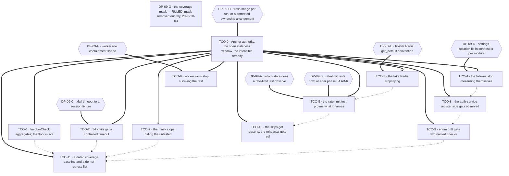

# Phase 09 — Test coverage remediation execution plan

## Owner rulings applied — 2026-10-03

The authoritative source is **`.ai/decisions/ADJUDICATED-2026-10-03-product-owner-rulings.md`** — the
single authority, which merges the two input registers of 2026-10-03 and adjudicates every disagreement.
**Its option letters are not this file's option letters**, so every ruled row below is recorded **by
description**. This table is a pointer to it, not a substitute for it. **This plan consumes register
cluster 7 (Priorities, coverage and scope)** — the `DP-09-G`, `TST-013` / `TCO-10` and `TST-003` entries
— and the **rate-limiter posture** paragraph of cluster 3, which concerns `VAL-09-004` / `C09-3`.

| ID | Ruling | Chooser | Effect |
| -- | ------ | ------- | ------ |
| **`DP-09-G`** | **Remove the coverage mask entirely and publish the real number, accepting a visible drop.** The uncovered-locator measurement is **a precondition of the release note stating the drop as a number — not a precondition of the ruling**, and every newly visible line becomes an obligation | **Product Owner (2026-10-03)** | **`TCO-7` unblocked.** The mask's disposition is decided; only the measurement remains, and it now gates the release note |
| **`TST-013`** / **`TCO-10`** | **Convert every skip to a named marker, then schedule removal with a named owner and a date.** Option (c), add the missing coverage now, is **closed as unbounded**; **deleting assertions is not a disposition**. The coordinator-level disposition lists **25 skips → 25 owners/dates**, and a group with **no natural owner is recorded `unowned`** rather than assigned to a phase that does not own it | **Product Owner (2026-10-03)** | `TCO-10`'s disposition is decided; the census, the markers and the owner/date register are its deliverables |
| **`VAL-09-004`** / **`C09-3`** — **WITHDRAWN** | The earlier ruling — *fail closed everywhere, the shipped `fail_closed=True` default is an intentional documented posture* — is **withdrawn from this plan and returned to open** | **Planner** — its **original** chooser, per the code context's `DP-4` (*"who owns the rate limiter's fail-open default?"*) | **All downstream effects undone**: the record is open, the documentation correction is **not** assigned to phase 04's `AB-6` by this ruling, and `C09-3` records that **nobody owns it today** |
| **`TST-003`** — **WITHDRAWN** | The earlier ruling — *the 65 % floor is made live on the main test entry point and the aggregate check, value unchanged* — is **withdrawn from this plan and returned to open** | **Planner** — its **original** chooser, per the code context's `DP-7` (*"does `test-all`'s coverage gate land with or after `test`?"*) | **`TCO-1`'s floor wiring is no longer decided.** The block keeps the aggregate half, which is `TST-002`'s, and leaves the floor's *reach* as the open question it was. **`fail_under` is not touched either way** |

**Everything else in this plan is untouched, with its chooser unchanged.** `DP-09-A` … `DP-09-F` and
`DP-09-H` are **not** named as decided by cluster 10 of the adjudicated register, which lists them
explicitly as Planner technical authority, and they remain exactly as open as they were.

## Purpose

This plan decomposes the phase-09 test-coverage findings into dependency-safe execution blocks. It fixes
**order, ownership, risk containment and proof obligations**. It does **not** choose between competing
remedies where technical uncertainty exists: `DP-09-A … DP-09-H` are carried verbatim from the code context's §6,
whose own verdict on each is *"leave open — I pick none"*, and this Planner picks none either.

**Two items are no longer open**, decided by the **Product Owner** on **2026-10-03**: `DP-09-G`'s
coverage mask (removed entirely, real number published, visible drop accepted) and `TST-013`'s skip
disposition (named marker, then removal scheduled with a named owner and a date). See **Owner rulings
applied** above and `.ai/decisions/ADJUDICATED-2026-10-03-product-owner-rulings.md`, the single
authority. **Two earlier rulings on this plan's findings were withdrawn and are back open with their
original chooser** — `VAL-09-004` / `C09-3` (the rate limiter's fail-closed posture) and `TST-003` (the
65 % floor's reach) — and every downstream effect of both has been undone in this file. **The other six
decision records are untouched.**

Every block names a **semantic** target (test symbol · production symbol under test · fixture · module ·
script function), the `TST-*` and `VAL-09-*` identifiers it discharges, its `blocked_by`, its place in the
single-implementor queue, a risk view across implementation / rollout / regression / compatibility, the
agents it needs, its documentation impact, named verification, and its definition of done.

Scope discipline, inherited from phases 03, 07 and 08: **the audit corpus is not an implementation
target.** No block edits `.ai/audit/**`, `.ai/plans/_code-context/**`, or any sibling plan. This plan's
only writable artefact is itself.

### The shape of this phase, stated before the blocks

Phase 09 is the first phase in the programme whose subject is **the test corpus itself**. Three
consequences are binding on every block and are not restated in each one:

1. **The corpus is also the instrument.** Every verification row in this plan is a `pytest` invocation.
   A block that edits the corpus weakens the instrument it is about to be measured with, so **no block
   may relax an assertion, a skip, or a marker in order to make a change land.** Where a test must change,
   it changes **with** the behaviour it pins, or it is recorded as blocked.
2. **The suite is red at baseline.** Phase 01 recorded **23 failed / 963 passed**, of which **12** are
   pre-existing and out of scope (the rate-limiting API-shape drift, `tests/test_layouts.py`,
   `tests/test_pydantic_models.py::test_user_db_valid`, `tests/test_users_api.py`). **The rule is *do not
   regress*, and the final validation must list the 12 by name** so a reader can tell a pre-existing
   failure from a new one. A block that reports "the suite is red" without that separation has produced
   no evidence.
3. **Green gates prove nothing here.** `ruff` and `mypy` are green at `cea2d06`. Neither can see a
   cache-clearing gap, a skipped test, a session commit, or a hostile-store replica. **Every block's
   evidence is a test run, and a passing gate is never quoted as the block's result.**

### The stale-image window — open again, and it gates everything

The last thing this programme measured about the execution environment:

| Fact | Measurement | Consequence |
| ---- | ----------- | ----------- |
| `test-app` resolves with **no `volumes` key** | `docker compose -p mkobi-test -f docker/docker-compose.test.yml config` | The test container runs a **baked image snapshot**, not the working tree. A test edit on the host is **invisible** to `test-select` until the image is rebuilt. |
| Image `5b1d9b41d128` is **older than HEAD `cea2d06`** | `docker images` vs `git rev-parse --short HEAD` | `TST-001`'s staleness window — "measure coverage before claiming it" — is **open again**. Any coverage figure, any "the suite is green" claim, and any `TST-009` mask result taken now describes `5b1d9b41d128`, not the tree. |
| **`USER app` cannot write `/app`** | `Errno 13` observed on a write attempt inside the container | **The bind-mount remedy `VAL-09-003` proposes is not available as written.** Adding `volumes: - ./src:/app/src` does not grant write access to the non-root `app` user; it needs an ownership fix on the host or a root user in the container. **`VAL-09-003` therefore leaves this phase — see the OUT table.** |
| The rate-limit failure is **real and reproduces** | 7 collected in `tests/test_rate_limiting.py`, **1 failed / 6 passed**, the failure text **byte-identical** to the report's quote | `TST-005` is not hypothetical. It is a live red test whose diagnostic names two stores — and the code context's runtime log line proves which one the route limiter actually reaches. |

**Every block below therefore states how it gets a fresh image, or carries an explicit "do not trust the
container" caveat.** The canonical remedy when one is needed is a rebuild of the `test-app` image from the
current tree before the run, plus the quoting of the image id in the commit body. **This plan does not
choose between the rebuild and a corrected ownership arrangement — that is `DP-09-H`.**

### Source tree state at plan time

`git rev-parse --short HEAD` → `cea2d06`. Untracked: the sibling plans, `.ai/plans/_code-context/`,
`.ai/tasks/*`. **Deleted but uncommitted as tracked trees:** `.ai/builders/**`, `.ai/structure/**`,
`.ai/models/**`, `.ai/templates/**`, `.ai/plans/audit-fix-plan.md`, `.ai/audit/templates/**`,
`frontend/coverage/**`. These are **worktree state, not commits**.

**Files other phases own that this plan's blocks touch or read:** `tests/test_rate_limiting.py` (phase 04
`AB-6` — `VAL-04-002`, and phase 07 by name via `HO-8`) · `tests/test_layouts.py` and the other three
`definition=` files (phase 08 `CQLT-9`; phase 07 `VAL-07-001` owns `test_pydantic_models.py`) ·
`tests/test_health.py` (phase 07 `HO-8`, delivered as its `EB-1` dependency change) ·
`tests/test_config.py` (phase 01, under active work) · `workers/data_worker.py` (phase 05's worker
programme) · `tests/test_rq_worker.py` (phase 05's worker ownership) · `Makefile.ps1` (shared with phase
08 `CQLT-10`) · `pyproject.toml` (phase 01 / phase 08 `CQLT-7`).

## Anchor authority

**Two sources, one precedence rule — stated explicitly, because the two are not interchangeable.**

| Question | Wins | Why |
| -------- | ---- | --- |
| **Where** is a symbol, and **what does the code do**? | **the code context**, over every report anchor | It was re-derived against the tree at `cea2d06`; the report's line anchors and its counts were not. This is the frontmatter's `code_context_authority`. |
| **What is the finding's identity** — its identifier, its band, its scope boundary? | **the report's identifier set** | `TST-001` … `TST-018` and `VAL-09-001` … `VAL-09-012` are this phase's vocabulary. **This plan renumbers, re-types and re-scopes none of them.** A `VAL-09-*` record is a defect *in the report* and is **applied** as a ruling, never edited, and never merged into another identifier. |
| A count or census the two state differently | **the code context** | Every disagreement in this phase was a count, and the code context was right each time. The corrected-census table below is the evidence. |

**A tree re-check is an operational instruction, not a third authority.** Re-resolving a target **by
symbol** at the moment of work is required, because figures in this corpus demonstrably move. But a
re-check **may not overturn a ruling**: if a symbol has moved, resolve it by symbol and record the move; if
the code now does what the code context said it did not, that is a **finding against the code context** and
is reported — it does not silently re-scope a block, re-band a `TST-*` or re-open a closed decision.
**Precedence is therefore: code context for fact, report for identity, and a later tree for neither.**

> **The report's line numbers are not binding, and neither are the code context's.**
> The report's baseline (`cea2d06`) is the current HEAD, so **no report anchor has drifted away from
> existence** — but **every count the report states has drifted in value**, and **three live symbols exist
> that the report never names at all.**
>
> **Every anchor in this plan is a symbol, a module, a fixture, a class, a script function, a config key
> or a file.** Implementors resolve targets by symbol at the moment of work. **If a symbol named below does
> not exist, that is a finding: stop and report it rather than substituting the nearest match.**

### All 30 identifiers resolve — and where each one actually lives

| Family | Count | Status |
| ------ | ----- | ------ |
| `TST-001` … `TST-018` | 18 | **All resolve.** Every named test symbol exists at `cea2d06`; none is a dead anchor. |
| `VAL-09-001` … `VAL-09-012` | 12 | **All resolve.** Each is a defect in the report, applied here as a ruling. `VAL-09-009` is **refuted-back** (§"VERIFICATION FINDING"). |

There are **no dead report anchors in this phase** — unusual, and it means the report's *symbols* can be
trusted even where its *figures* cannot. That distinction is the reason the corrected-census table below
matters: an implementor who reuses a report number gets a wrong scope estimate, and an implementor who
reuses a report *anchor* lands on the right symbol.

### The report's figures are stale — three corrections that change scope

| The report states | Reality at `cea2d06` | Why it matters |
| ----------------- | --------------------- | -------------- |
| `tests/test_config.py` has **67** `clear_config_cache()` calls | **77** | The report's own remedy is *one helper replacing every call*. The diff is **ten calls larger** than the report implies, and a mechanical sweep based on the report's number would leave ten sites unconverted. **Re-derive by symbol at implementation time** — and expect it to move again before the block lands. |
| `tests/test_auth_service.py` has **42** tests | **50** | The masking surface for `TST-010` is **eight tests larger**. Any statement of the form "N of them pass" is wrong if taken from the report. The four tests that pin the `2de4156` ordering are still the ones phase 04 `AB-1` and phase 07 `EB-9` name — that claim is unaffected, because it is about four specific symbols. |
| `tests/test_rq_worker.py:148` patches **11** environment variables | **3** | This is the difference between a risky hostile-environment rehearsal and a cheap one. `TST-018` is far **easier** to land than the report implies, which makes it more likely to be landed carelessly — see `TST-018`'s risk row. |

### Three live symbols the report never names

Each is a **gap in the report's own evidence**, not a new defect. Each changes what a correct
implementation must touch.

| Symbol | What it is | Why the report's silence is load-bearing |
| ------ | ---------- | ---------------------------------------- |
| `api/routes/auth.py` — the limiter inside the **`refresh:`** path | A **third route-owned rate limiter** on the auth module, alongside `_handle_login` and `register_request` | The report's TST-005 narrative and phase 04's `Z-12` both describe **three** route sites; a careless reader counts the three *key prefixes* (`login:`, `register-request:`, and the email fallback) and concludes the `refresh:` limiter is one of them. It is not. Any per-IP limiter census for `TST-005` **must** include it, or the fix leaves a limiter unobserved. |
| **A third limiter path**, outside `auth.py` | `api/routes/client_errors.py`'s `client_ip` derivation and `client-errors:` key — named by phase 07's `HO-1`, **not** by this report | The report scopes rate limiting to authentication. It is not. A `tests/test_rate_limiting.py` rewrite that asserts "the suite's rate-limit surface" without naming this path overstates what it covers. Phase 07 owns the production behaviour (`EB-3`'s consequence); **phase 09 owns only the observation of it**, and only under `DP-09-B`. |
| `workers/data_worker.py`'s **background sync entry point** | The RQ job body behind the "sync"/reindex path | `TST-009`'s evidence — the untested mask — is a claim about *coverage of `data_worker.py`*. The entry point that would carry the sync work is the thing a coverage measurement must actually reach, and the report never names it. **`TST-009` therefore has no target symbol without this one**, which is why its block carries a discovery obligation rather than a fixed list. |

### Anchor drift: what is a live anchor but not a *correct* one

| Symbol | The report treats it as | What it is | Owner |
| ------ | ---------------------- | ---------- | ----- |
| `tests/test_rate_limiting.py::test_x_forwarded_for_spoofing_ignored` | A live assertion that the app ignores `X-Forwarded-For` | Its **premise moves** under phase 04's `AB-7` (proxy trust). The application still reads no header — there is no `X-Forwarded-For` read anywhere in `src/` — but the peer address becomes real. The test's *name and docstring* will be right and its *scenario* wrong after `AB-7` lands. | **Phase 04 `AB-6`/`AB-7`.** Phase 09 must not rewrite it before they land (`DP-09-B`). |
| `tests/test_rate_limiting.py::test_different_ips_have_separate_limits` | A test of per-IP separation | Its **name promises an assertion the body never makes.** Phase 07 handed it over by name (`HO-8`); phase 04 names it as the natural place to assert the new key derivation. | **Phase 09 owns the quality; phase 04 owns the premise.** `DP-09-B` decides the order. |
| `tests/test_rate_limit_reset_allow_writes` | Phase 04's `VAL-04-002` hard blocker | **Claimed as a hard blocker by phase 04 (`AB-6`) and by phase 07 (`HO-8`).** One owner is assigned in this plan — see the CONFLICT table, `X-09-01`. | **Phase 04 `AB-6`** — the key derivation it must move with is phase 04's. |
| `tests/test_enum_db_consistency.py` | A tripwire | **A tripwire that is deliberately silent about deprecation.** A `str`-typed `status` column reaching PostgreSQL's enum raises, while an already-`String` column with the same label stores fine and never warns. This is the mechanism behind `TST-011`'s "masked by deprecation" observation, and it is why the third layout test must not be rewritten. | **Phase 14** owns the check's policy; `TST-011` owns only the two named stores. |
| `tests/conftest.py`'s session fixtures | A neutral harness | **They commit.** `baseline_data` and `test_user` insert rows and **never roll back**, and the function-scoped `async_db_session` is handed out with `expire_on_commit=False` but no teardown that undoes anything. | **`TCO-6`.** This is the substrate `TST-012` runs on. |

### Execution authority — the suite is Docker-only

| Fact | Consequence for every block |
| ---- | ---------------------------- |
| `.\Makefile.ps1 test` → `Invoke-Test` → `docker compose -p mkobi-test -f docker/docker-compose.test.yml up -d --wait test-db test-redis` then `run --rm --no-deps test-app pytest` | **The canonical entry point.** Test PostgreSQL is on host port **5434**; test Redis on **6381**. |
| **`uv run pytest` fails locally** — there is no test database on `localhost` | **Never quoted as evidence.** A block whose verification row says `uv run pytest` is wrong. Local `uv` is for **lint and typecheck only**: `uv run ruff check <path>` and `uv run mypy <path>` run host-native and are the only host-native Python gates. |
| `tests/conftest.py::setup_test_database` (session scope) recreates and migrates the schema itself; `.\Makefile.ps1 test-fresh` forces a fresh volume | **No separate migrate step exists on the test path.** A block that adds a migration must run `test-fresh`, not `test`, to see it applied. |
| `role "mkobi_app" must pre-exist`; created on first `test-db` volume initialisation | If pytest reports `role "mkobi_app" does not exist`, the remedy is `.\Makefile.ps1 test-reset`, **once per volume**, and it is an environment fact, not a test failure. |

### The `TST-005` / `Z-12` disagreement — what is settled and what is not

The report's `TST-005` says the login path reaches **none** of the three stores and that the six passing
tests prove the limiter is not running. Phase 04's `Z-12` says the route-owned limiters are **live** in
the suite because `conftest.py`'s autouse patch targets `AuthService.__init__`'s private limiter and the
route sites build their own instances. The code context observed the runtime directly: a log line in
`routes/auth.py` inside `_handle_login`'s limiter path fires during the run.

**Ruling: the code context and phase 04 win the premise — the route limiter is live.** What is *not*
settled is which store a corrected test must observe, and that is exactly `DP-09-A`, which stays open. One
probe resolves it, and the probe is written in `TCO-5`'s verification row rather than guessed here.

## Scope-ruling tables

### IN — owned by this plan

| Finding | Severity | Short name | Block |
| ------- | -------- | ---------- | ----- |
| **`TST-001`** | CRITICAL | **Every result depends on a container older than HEAD** | **`TCO-0`** (open the window) + **`TCO-11`** (close it with a dated baseline) |
| **`TST-002`** | HIGH | `Invoke-Check` stops at the first failure and never runs pytest | **`TCO-1`** (received from phase-08 `CQLT-10`) |
| **`TST-003`** | HIGH | The 65 % coverage floor never runs on `test` | **`TCO-1`** — the aggregate half is decided; **the floor's reach is OPEN again** (2026-10-03 ruling withdrawn; chooser **Planner**) |
| **`TST-004`** | HIGH | 34 tests `xfail` on a timeout they do not control | **`TCO-2`** |
| **`TST-005`** | HIGH | The rate-limit test proves less than its name claims | **`TCO-5`** |
| **`TST-006`** | MEDIUM | `mock_redis` admits writes and answers reads as `None` | **`TCO-3`** |
| **`TST-007`** | MEDIUM | The fixture suite measures itself | **`TCO-4`** |
| **`TST-008`** | MEDIUM | `test_moderate_data` imports the settings module it should be overriding | **`TCO-4`** |
| **`TST-009`** | MEDIUM | The coverage mask hides exactly what is untested | **`TCO-7`** |
| **`TST-010`** | MEDIUM | `AuthService.login_user` is only half-covered — the register side is untested | **`TCO-8`** |
| **`TST-011`** | MEDIUM | Enum-column deprecation masks schema drift | **`TCO-9`** |
| **`TST-012`** | MEDIUM | Worker tests with `session=None` commit real rows | **`TCO-6`** |
| **`TST-013`** | LOW | 25 skipped tests with no reason and no marker | **`TCO-10`** — disposition **RULED** 2026-10-03: named marker, then removal scheduled with a named owner and a date |
| **`TST-014`** | LOW | `test_register` asserts against its own input | **`TCO-8`** |
| **`TST-015`** | LOW | `StrictRedis.get` ignores the `DEFAULT` it declares | **`TCO-3`** |
| **`TST-016`** | LOW | No suite-level orchestrator for the transaction suite | **`TCO-6`** — gates **`TXN-008`** only |
| **`TST-017`** | LOW | Missing integration boundaries | **`TCO-4`** |
| **`TST-018`** | LOW | The hostile-environment rehearsal patches three variables | **`TCO-10`** |
| **`VAL-09-001`** | — (report defect) | Two cases added to Step 0 as **red** | **`TCO-0`** · **`TCO-2`** |
| **`VAL-09-002`** | — (report defect) | `TST-016` gates **`TXN-008`**, not `TXN-003` | applied in **`TCO-6`** |
| **`VAL-09-003`** | — (report defect) | The bind-mount remedy is **infeasible** (`Errno 13`) | applied in **`TCO-0`**; remedy leaves the phase |
| **`VAL-09-004`** | — (report defect) | The fail-open default **has no owner** | **OPEN** — the 2026-10-03 ruling was **withdrawn**; back to its original chooser (**Planner**, code-context `DP-4`). Recorded in `C09-3`, no setting changed either way |
| **`VAL-09-005`** | — (report defect) | Three stale counts | applied in the anchor section |
| **`VAL-09-006`** | — (report defect) | The Redis port count | applied in the anchor section |
| **`VAL-09-007`** | — (report defect) | The `session_factory` call census | applied in **`TCO-6`** |
| **`VAL-09-008`** | — (report defect) | The 12-failure figure and its three named files | applied in the baseline and in **`TCO-11`** |
| **`VAL-09-009`** | — (report defect) | `TST-012` was treated as settled; it is **live** | **refuted-back** — `TCO-6` |
| **`VAL-09-010`** | — (report defect) | The uncovered-locator measurement | applied in **`TCO-7`** — as a **precondition of the release note stating the drop as a number**, not as a precondition of the ruling |
| **`VAL-09-011`** | — (report defect) | `TST-011`'s rewrite does **not** apply to the third layout test | applied in **`TCO-9`** |
| **`VAL-09-012`** | — (report defect) | The rejected-options row understates `TST-013`'s alternatives | applied in **`TCO-10`** — the full set is carried and the disposition is ruled |

### OUT — not owned here, with the named home

An item absent from this table **and** from the `C09-*` register is a gap in the plan, not a silent
omission.

| Item | Home | Note for this phase |
| ---- | ---- | ------------------- |
| **The bind-mount remedy** — make the test tree live by mounting the working tree into `/app` | **nobody — recorded, and infeasible as written** | `VAL-09-003` proposes it; **`USER app` cannot write `/app`** (`Errno 13`), so the mount alone changes nothing and the fix needs a host-side ownership change or a root test user. That is a deployment-topology decision with owners this phase does not have. **`TCO-0` records the infeasibility; the remedy leaves phase 09.** |
| **The `fail_closed=True` default** — `Settings.rate_limiter_fail_closed` ships fail-closed, so the doc's "fails open" claim is wrong the other way | **nobody — recorded, and unowned** | `VAL-09-004` established that **no phase owns the default**. The 2026-10-03 ruling that settled it was **withdrawn**, so the record is **open with its original chooser, Planner** (the code context's `DP-4`: *"who owns the rate limiter's fail-open default? Unpack-the-tuple work will make `test_auth.py:332` and `:369` green and thereby ratify fail-open"*). **A Planner still may not change a security default**, and no block in this phase does — that holds whether the record is ruled or not. Phase 09 owns only the *test* that would notice a flip. `docs/01-auth/auth-api.md`'s "fails open by default" claim is a **documentation defect this phase records and does not correct**; see the OUT table and `C09-3`. |
| **`TST-016`'s `TXN-003` half** — orchestrating the transaction suite against plan-03's *hot spots* | **plan-03 `B1`** (`TXN-003`) | `VAL-09-002` is explicit: `TST-016` gates **`TXN-008`** and **not** `TXN-003`. `TCO-6` sequences against `TXN-008` only and records the `TXN-003` half as plan-03's. |
| **The worker transaction shape** — `workers/data_worker.py::_run_with_transaction` | **phase 05** | `TST-012` and `TST-009` both read this file. **Neither block edits it.** A session-passing fix to the test harness is phase 09's; changing the worker's transaction discipline is phase 05's. |
| **`tests/test_health.py`'s exact-dict assertion** | **phase 07**, delivered as its `EB-1` dependency change | Handed over by `HO-8`. Phase 09 records the seal shape as a template (`TCO-4`) and **does not touch the file**. |
| **`tests/test_pydantic_models.py::test_user_db_valid`** | **phase 07** (`VAL-07-001`) | One of the three named pre-existing failures. Listed by name in `TCO-11`'s do-not-regress list; **never edited here**. |
| **`tests/test_config.py`** | **phase 01**, under active work | `TCO-4`'s settings-isolation work reads this file's patterns. **Phase 09 edits no test inside it** — the `clear_config_cache` sweep named by `VAL-09-005` is 77 calls inside that same file, and the ownership collision is recorded in `C09-6`. |
| **Layout and dashboard-access test additions** | **phase 08 `CQLT-9` and `CQLT-3`** | Phase 08's `CQLT-9` adds validation coverage for `ButtonVariant`/`ComponentSize` across the four `definition=` files; `CQLT-3` adds route-level tests for the access-management endpoints. **Phase 09 adds none of its own there**, and `TCO-9` must read both before touching `test_layouts.py`. |
| **`tests/test_enum_db_consistency.py`'s policy** — whether a deprecation warning should fail the build | **phase 14** | `TCO-9` adds two named store checks. It does **not** change the check's policy, and `VAL-09-011` forbids widening it here. |
| **Frontend test coverage** | **phase 16** | An **unnumbered** hand-over, not a numbered finding of this phase: the backend suite's missing boundary seams are this phase's subject, and the frontend's own coverage is phase 16's. It is not scheduled here. (`TST-017` itself is the `pyproject.toml` marker registration — `slow`/`fast` registered, used by zero tests — and stays in `TCO-4`.) |
| **`TST-016`'s suite-level orchestrator** — whether the transaction suite gets an orchestrator at all, and if so as a script target or a CI job | **Coordinator**, via `C09-8` | A **topology decision**, not a test change. `TCO-6` delivers the row containment that makes an orchestrator meaningful and **does not design one**; no CI file is created. Phase 08's `CQLT-10` already recorded the automation half for the Coordinator — this row does not duplicate the request. |
| **The 12 pre-existing failures** | **nobody — recorded, out of scope by rule** | Listed by name in `TCO-11`. Phase 09's rule is *do not regress*. Fixing them is a separate authorised task. |
| **Creating CI automation** — `.github`, `.pre-commit-config.yaml`, `.gitlab-ci.yml`, `azure-pipelines.yml`, `.circleci` | **Coordinator** | `TST-002`'s "no automated path" half is received from phase-08 `CQLT-10` and **recorded by `TCO-1`, not created**. Which automation topology the project adopts is a deployment decision. |

### CONFLICT — between report, code context and sibling plans

| # | Subject | Report | Code context / sibling | Ruling |
| - | ------- | ------ | ---------------------- | ------ |
| **X-09-01** | **Who owns `test_rate_limit_reset_allow_writes`** | Names it under `VAL-09-002` as a thing phase 09 must handle | **Phase 04 claims it as its `VAL-04-002` hard blocker** (`04-…:380`, `:739`: *"update **with** the key"*) **and phase 07's `HO-8` names the file** | **One owner: phase 04 `AB-6`.** The reason is structural, not diplomatic: the test hard-codes `login:127.0.0.1` because the key derivation **is** `login:{client_ip}`, and the derivation changes only when phase 04's `D-04-D` is ruled and landed. A phase-09 rewrite would have to guess the new derivation. **`TCO-5` records it, does not rewrite it, and re-reads it after `AB-6` lands.** |
| **X-09-02** | **Is the route rate limiter live in the suite** | `TST-005`: the login path reaches **none** of the three stores; the six passes prove the limiter is not running | Phase 04's `Z-12` and the code context §3.1: the route sites build their **own** `AsyncRateLimiter`; `conftest.py`'s autouse patch targets `AuthService.__init__`'s private limiter only; a runtime log line **inside `_handle_login`'s limiter path fires** | **The premise is refuted.** The route limiter is live; what silences it is `MockRedis` injected through `api/deps.py::get_redis_client_dependency`. **What store a corrected test must observe stays open — `DP-09-A`, resolved by one probe.** |
| **X-09-03** | **`TST-012`'s status** | Presented as a live MEDIUM defect | `VAL-09-009` had recorded it as **settled**, with the test suite's idempotency as the reason | **Refuted back — live, not settled.** The idempotency argument does not reach it: those tests create **new dashboards** and **new users** on every run, the rows persist in the test database, and `session=None` means the test's own session never learns about the commit. **This ruling is what keeps `TCO-6` in scope.** |
| **X-09-04** | **`TST-001`'s disposition** | HIGH, with a remedy | The window was closed at `cea2d06` by a rebuild; **the same session then found `5b1d9b41d128` older than `cea2d06` again** | **Reopened, and the image is the proof rather than a precondition.** `TCO-0` opens the window explicitly and `TCO-11` closes it with a dated measurement. `TCO-9`'s mask question is `blocked_by` `TCO-11` for exactly this reason. |
| **X-09-05** | **`TST-016`'s target** | `TXN-003` and `TXN-008` both named | `VAL-09-002`: plan-03's `B1` treats `TXN-003` as **already landed** | **Ruling applied: `TCO-6` sequences against `TXN-008` only.** `TXN-003` is not a gate and phase 09 does not touch it. |
| **X-09-06** | **`TST-011`'s remedy breadth** | Rewrite the enum assertions generally | `VAL-09-011`: the third layout test must **not** receive the rewrite | **Ruling applied in `TCO-9`:** two named stores only. Widening it is not in scope and would collide with phase 08 `CQLT-9`. |
| **X-09-07** | **`QLT-003`'s two halves** | — | Phase 08's `D1` records that the **gate-redness half is already fixed** (`8953bf7`) and hands the **gate-wiring** and **automation** halves to phase 09 as `TST-002` | **Referenced, not re-decided.** `TCO-1` takes the wiring; `8953bf7` means the block is **not** premised on red gates and the `VAL-08-007` ordering constraint is already satisfied. |
| **X-09-08** | **The 12-versus-23 failure baseline** | 12 failures, three files named | Phase 01 measured **23 failed / 963 passed** with **12** pre-existing and out of scope | **Both are consistent, at different scopes.** `TCO-11` quotes the full-run figure and lists the 12 by name; neither number is quoted without its scope. |

### VERIFICATION FINDING — the report's `VAL-09-*` records

Each is a defect **in the report**, not in the code. **No audit file is edited.** They are applied as
rulings inside this plan, following phase 04's `VAL-04-001` precedent and phase 08's `VAL-08-*` table
precedent.

| ID | Subject | Ruling in this plan |
| -- | ------- | ------------------- |
| **`VAL-09-001`** | The Step-0 remediation sequence does not put two of the cases in a failing state first | **Applied.** `TCO-0` and `TCO-2` both add their two cases **as red** and record the observed failure before the fix. A gate introduced green proves nothing, which is the failure mode phase 08 names independently. |
| **`VAL-09-002`** | `TST-016` is claimed to gate `TXN-003`, which is already landed | **Applied.** `TCO-6` gates on **`TXN-008`**. See `X-09-05`. |
| **`VAL-09-003`** | The remedy is a bind-mount of the working tree into the test container | **Substantiated as a defect in the remedy and the remedy leaves the phase.** `USER app` cannot write `/app` (`Errno 13`), so the mount does not by itself make the tree live. `TCO-0` records it; the remedy is an OUT item with no owner. |
| **`VAL-09-004`** | The report's Step 2 proposes changing a security default, and no phase owns it | **Substantiated — and it is OPEN.** The 2026-10-03 ruling that resolved it (fail closed everywhere, documented as an intentional posture, documentation correction owned by phase 04 `AB-6`) was **withdrawn**, and this record returns to its original chooser, **Planner**. **No block changes the setting either way**, and this plan does **not** assign the documentation correction to phase 04: `docs/01-auth/auth-api.md`'s "fails open by default" claim is recorded as a defect with **no owner**, which is the honest state. See the OUT table and `C09-3`. |
| **`VAL-09-005`** | Three counts are stale: 67 `clear_config_cache` calls, 42 auth-service tests, 11 env vars | **Substantiated and worse:** **77**, **50**, **3**. Applied in the anchor section, and **binding on every block that reuses a report figure.** |
| **`VAL-09-006`** | The Redis port figure | **Substantiated.** The test Redis is on host port **6381**; the figure is environment fact, applied in the execution-authority table. |
| **`VAL-09-007`** | The `session_factory` call census | **Substantiated.** Applied in `TCO-6`: the census must be **re-derived by symbol** across `tests/` and `workers/`, because the count is the block's own evidence. |
| **`VAL-09-008`** | The 12-failure figure and its three named files | **Substantiated with scope.** 12 pre-existing out of a 23-failure baseline. Applied in the baseline section and in `TCO-11`'s list. |
| **`VAL-09-009`** | `TST-012` was recorded as settled by the test suite's idempotency | **Refuted back — stale, not settled.** The tests create new rows every run. See `X-09-03` and `TCO-6`. |
| **`VAL-09-010`** | The uncovered-locator measurement | **Substantiated.** Applied in `TCO-7`: the mask is now **removed entirely**, so the measurement's job changed. It is **a precondition of the release note that states the drop as a number**, taken on a **dated fresh image** — it is no longer a precondition of the ruling, because the ruling has landed. |
| **`VAL-09-011`** | `TST-011`'s rewrite does not apply to the third layout test | **Applied.** `TCO-9` names two stores and forbids widening. See `X-09-06`. |
| **`VAL-09-012`** | The rejected-options row understates `TST-013`'s alternatives | **Substantiated.** `TCO-10` carries the full set as an options table — document the reason, convert to a marker, add the missing coverage, or schedule a removal — and the disposition is **now ruled**: named marker, then removal scheduled with a named owner and a date; the missing-coverage option is **closed as unbounded**. |

## Block map



`==>` = hard dependency (a decision record or a register that must exist first). `-.->` = recommended
sequencing in the single-implementor queue, **not** a data dependency — the project permits one implementor
at a time, so these are ordered for review coherence and so that two blocks touching one file are never
interleaved. `DP-*` diamonds are owner rulings, not phase-09 work. **`DP-09-G` is drawn as a rectangle
because it is ruled** (2026-10-03 — the mask is removed entirely), so its `==>` edge into `TCO-7` is
gone; **`TCO-10`'s disposition is also ruled**, which is why it never carried a diamond.

### Coverage ledger

| Block | Findings discharged | Decisions gating it | Agents |
| ----- | -------------------- | -------------------- | ------ |
| **`TCO-0`** | every `VAL-09-*` as a ruling · the three corrected censuses · the three unnamed symbols · `VAL-09-003`'s infeasibility | `DP-09-H` (the window) | **Planner** (owns the note) · **Auditor** (confirms the registers at `cea2d06`) |
| **`TCO-1`** | **`TST-002`** · **`TST-003`** (the floor's reach is **OPEN** — the 2026-10-03 ruling was withdrawn) · `VAL-08-001`'s nuance applied · phase-08 `CQLT-10`'s hand-over received | — | **Auditor, Planner, Validator** |
| **`TCO-2`** | **`TST-004`** · `VAL-09-001` (two cases red first) | `DP-09-C` | **Auditor, Researcher, Planner, Validator — all four** |
| **`TCO-3`** | **`TST-006`** · **`TST-015`** | `DP-09-E` | **Auditor, Planner, Validator** |
| **`TCO-4`** | **`TST-007`** · **`TST-008`** · **`TST-017`** (the backend boundary half) | `DP-09-D` | **Auditor, Researcher, Planner, Validator — all four** |
| **`TCO-5`** | **`TST-005`** (the premise refuted; the observation pending `DP-09-A`) | `DP-09-A`, `DP-09-B` | **Auditor, Researcher, Planner, Validator — all four** |
| **`TCO-6`** | **`TST-012`** (refuted back to live) · **`TST-016`** (`TXN-008` gate only) · `VAL-09-002`, `VAL-09-007`, `VAL-09-009` applied | `DP-09-F` | **Auditor, Planner, Validator** |
| **`TCO-7`** | **`TST-009`** · `VAL-09-010` applied | **none** — `DP-09-G` ruled (mask removed entirely), 2026-10-03 | **Auditor, Planner, Validator** |
| **`TCO-8`** | **`TST-010`** · **`TST-014`** | — | **Auditor, Planner, Validator** |
| **`TCO-9`** | **`TST-011`** · `VAL-09-011` applied | — | **Auditor, Planner, Validator** |
| **`TCO-10`** | **`TST-013`** (disposition **ruled** 2026-10-03) · **`TST-018`** · `VAL-09-012` applied | **none** — the disposition is ruled; the census, the markers and the owner/date register are the deliverables | **Auditor, Planner, Validator** |
| **`TCO-11`** | **`TST-001`**'s close-out · `VAL-09-008` applied | — | **Auditor, Validator** |

**Splits and merges, with reasons.** `TST-001` is **split** into two blocks — `TCO-0` opens the staleness
window and records the infeasible remedy, `TCO-11` closes it with a dated measurement — because the two
halves have different evidence, different owners and different failure modes, and because the close-out is
meaningless until every other block has changed the numbers. `TST-005`'s premise correction and its
observation are **merged into `TCO-5`** because the premise (`X-09-02`) is what makes the observation
meaningful; separating them would produce two commits arguing about one test. `TST-006` and `TST-015` are
**merged into `TCO-3`** because both are the same file's fake store lying in the same direction — one fix to
`StrictRedis`'s write and read semantics closes both, and two separate commits would leave the fake in a
half-honest state. `TST-007`, `TST-008` and `TST-017`'s backend half are **merged into `TCO-4`** because
all three are the fixture layer measuring or failing to isolate. `TST-010` and `TST-014` are **merged into
`TCO-8`** because both are `test_auth_service.py` observing the wrong thing. Nothing else is split or
merged.

---

## Execution blocks

### TCO-0 — Anchor authority, the open staleness window, and the infeasible remedy

| Field | Value |
| ----- | ----- |
| **Semantic target** | **No production code and no test code.** This plan's "Anchor authority" section, the corrected-census table, the three-unnamed-symbols table, the CONFLICT table and the `C09-*` register are the deliverable, and they are carried into every block's *Definition of done*. Environment facts to re-derive here, by symbol and by config key: the `test-app` service's resolved `volumes` key in `docker/docker-compose.test.yml` (none today) · the `test-app` image id and its `Created` field against `git rev-parse --short HEAD` · `Makefile.ps1::Invoke-Test`, `::Invoke-TestAll`, `::Invoke-TestSelect`, `::Invoke-Check`, `::Invoke-Lint`, `::Invoke-Typecheck`, `::Invoke-FeTest` (the eight functions any block's verification row names) · `pyproject.toml`'s `[tool.pytest.ini_options] addopts`, `[tool.coverage.run] source`, `[tool.coverage.run] omit`, `[tool.coverage.report] fail_under`, `[tool.coverage.report] exclude_lines` · `tests/conftest.py::setup_test_database`, `::async_test_engine`, `::async_session_maker`, `::async_db_session`, `::baseline_data`, `::test_user`, `::async_client`, `::auth_headers`, `::_auto_mock_redis`, `::mock_redis`, `::strict_redis`, `::MockRedis`, `::StrictRedis`, `::_build_worker_isolated_test_db_url` |
| **Discharges** | Every `VAL-09-*` as a **ruling** · the three corrected censuses (`VAL-09-005`) · the Redis port fact (`VAL-09-006`) · `VAL-09-003`'s **infeasibility** · `VAL-09-004`'s **open status** (the 2026-10-03 ruling on it was **withdrawn**; the record carries its original chooser, **Planner**, and **no setting is changed either way**) · `VAL-09-001`'s red-first requirement · `TST-001`'s **open** half · the R1–R12 risks the code context established |
| **blocked_by** | `DP-09-H` (hard — how a run gets a fresh tree is the block's subject). Nothing else. |
| **Execution order** | **1.** Nothing else starts without it. |
| **Risk — implementation** | **None.** Nothing executes; the block is a note. |
| **Risk — rollout** | **None.** |
| **Risk — regression** | **None in code.** The real risk is **bookkeeping, and it is high**: a later reader picking the report up as a checklist re-derives `67`, `42` and `11`; assumes the container is current because the compose file has no `volumes`; concludes from `TST-005` that the limiter is inert; reads `VAL-09-009` and believes `TST-012` is closed; or treats `VAL-09-003`'s bind mount as available. |
| **Risk — compatibility** | One real hazard: **this note can be mistaken for authority to edit `.ai/audit/**` or a sibling plan.** It is not. Phase 03's `B0` convention (*no audit file is edited*) and phase 04's `VAL-04-001` precedent (an audit record **applied** as a ruling, never edited) are inherited verbatim. |
| **Agents** | **Planner** — owns the note. **Auditor** — confirms at `cea2d06` that the corrected-census table names every figure the report gets wrong, that the three unnamed symbols are the **only** such gaps, and that no dead anchor appeared while the register was being written. **No Implementor, no Researcher, no Validator**: nothing here is a code claim a gate could check. |
| **Documentation impact** | **One** `docs/SPEC.md` version row naming this plan — house convention, matching phases 03, 04, 07 and 08. **Nothing else.** The `VAL-09-004` documentation defect (`docs/01-auth/auth-api.md` claims rate limiting "fails open" while the setting defaults fail-**closed**) is **not written here**: the record is **open with its original chooser, Planner**, so no phase owns the correction and phase 09 records it rather than performing it. Phase 09 owns only the *test* that would notice a flip. See the OUT table and `C09-3`. |
| **Verification** | `git rev-parse --short HEAD` recorded (expect `cea2d06`) · `docker compose -p mkobi-test -f docker/docker-compose.test.yml config` and the `test-app` service's resolved shape quoted — the absence of a `volumes` key **is** the evidence · `docker images mkobi-test` (or the equivalent) quoting the image id and `Created`, compared against HEAD in the commit body · `git status --porcelain` shows **no** modification under `src/`, `tests/`, `frontend/`, `pyproject.toml`, `Makefile.ps1`, `alembic/`, `docker/` at block start · confirm **no** file under `.ai/audit/`, `.ai/plans/_code-context/` or any sibling `.ai/plans/0[1-8]-*.md` appears modified · **no test run required** |
| **Definition of done** | The note exists and names: that **all 30 identifiers resolve** and that this phase has **no dead report anchor**, while **every figure the report states has drifted**; the three corrections (**77** `clear_config_cache` calls, **50** `test_auth_service.py` tests, **3** patched env vars) with the instruction to re-derive by symbol; the three unnamed live symbols (`refresh:`'s limiter, the third limiter path outside `auth.py`, `data_worker.py`'s background sync entry point); that **the suite is Docker-only** and `uv run pytest` is never evidence; that the test image `5b1d9b41d128` is older than HEAD `cea2d06`, so **`TST-001`'s window is open**; that **`USER app` cannot write `/app`** (`Errno 13`) and `VAL-09-003`'s remedy therefore leaves the phase; that the route rate limiter is **live** and `TST-005`'s premise is refuted, with `DP-09-A` still open; the **23 failed / 963 passed** baseline with **12** pre-existing failures named by file; that **`session=None` worker tests commit real rows**; that `test_rate_limit_reset_allow_writes` has **one** owner — phase 04 `AB-6`; that `QLT-003`'s gate-redness half is **already fixed** (`8953bf7`) per phase 08's `D1` and is **not** re-decided here; and that **no audit file, no code-context file and no sibling plan is edited**. |

**Corrected-facts register this note carries into every block.** Each was re-derived at `cea2d06`, and
each was verified by direct search while writing this plan, not only from the code context:

| Fact the report states | Reality | Blocks that must not repeat the report |
| ----- | ------------------- | ---------------------------------------- |
| `test_config.py` has 67 `clear_config_cache()` calls | **77** | `TCO-4` |
| `test_auth_service.py` has 42 tests | **50** | `TCO-8` |
| `test_rq_worker.py` patches 11 env vars | **3** | `TCO-10` |
| The suite has 12 failures | **23 failed / 963 passed**, of which **12** are pre-existing and out of scope | any |
| Test Redis is on the default port | Host port **6381**; test PostgreSQL on **5434** | any |
| `TST-005`: the login path reaches none of the rate-limit stores | The route limiter is **live**; a runtime log line inside `_handle_login`'s limiter path fires. `conftest.py`'s autouse patch targets `AuthService.__init__`'s private limiter only | `TCO-5` |
| `TST-012` is settled | **Live.** New rows per run, persisted, invisible to the test's own session | `TCO-6` |
| `TST-016` gates `TXN-003` | It gates **`TXN-008`**; `TXN-003` is plan-03's and already landed | `TCO-6` |
| A bind-mount makes the test tree live | **`USER app` cannot write `/app`** — `Errno 13`. Infeasible as written | `TCO-0`, `TCO-11` |
| `TST-011`'s rewrite applies to the layout tests generally | It does **not** apply to the third layout test | `TCO-9` |
| The gates are red, so the wiring is blocked | **Green** since `8953bf7`; `VAL-08-007`'s ordering constraint is already satisfied | `TCO-1` |

**How each block gets a fresh image — the rule `TCO-0` sets.** Two admissible routes, and the choice
between them is `DP-09-H`, which this plan does not make. **Whichever is chosen, every block states which it
used, in its own verification row, and quotes the image id it ran against.**

- **(A) Rebuild before the run.** The test image is rebuilt from the current tree, the run happens, and the
  image id is quoted. Costs a build per run; makes the working tree the subject of every measurement.
- **(B) A corrected ownership arrangement.** `/app` becomes writable by the container's user — a host-side
  ownership fix or a root test user — after which a bind mount is possible. Costs a one-time environment
  change; **but it is exactly what `Errno 13` blocks today**, so it cannot be assumed.

**The caveat every block inherits if neither is in place:** *results obtained against image
`5b1d9b41d128` describe that image, not the tree at `cea2d06`. They may be quoted as a **baseline**, never
as evidence that a change landed.* `TCO-11` exists precisely to produce the first run that is not under
this caveat.

---

### TCO-1 — Make `Invoke-Check` an aggregate, and record the coverage floor's reach as open (TST-002, TST-003)

| Field | Value |
| ----- | ----- |
| **Semantic target** | `Makefile.ps1::Invoke-Check` — four sequential `return`-on-failure guards and **no** pytest invocation · `Makefile.ps1::Invoke-Test` (bare `pytest`) · `Makefile.ps1::Invoke-TestAll` (the **only** function that passes `--cov`) · `Makefile.ps1::Invoke-TestSelect`, `::Invoke-TestFresh`, `::Invoke-TestUp` (the functions a new aggregate must not duplicate) · `pyproject.toml`'s `[tool.pytest.ini_options] addopts` (no `--cov`) and `[tool.coverage.report] fail_under` (**65**) · `Makefile.ps1`'s target switch (`'check'`, `'test'`, `'test-all'`) · **`read-only for reference:** phase 08's `CQLT-6`, which adds an `alembic check` target to this same script |
| **Discharges** | **`TST-002`** · **`TST-003`** · phase-08 `CQLT-10`'s hand-over of `QLT-003`'s gate-wiring and automation halves, **received and confirmed** · `VAL-08-001`'s nuance applied (`VAL-08-001` is phase 08's identifier, carried here because its remedy is this block) |
| **blocked_by** | Soft: `TCO-0`. **Not** gated by any `DP-*`: the aggregate's shape is enumerated in the report and has an obvious minimal form. **The coverage-floor half carries no ruling** — `TST-003`'s reach is **open again**, chooser **Planner**, since the 2026-10-03 ruling on it was withdrawn. |
| **Execution order** | **2.** |
| **Risk — implementation** | **LOW-MEDIUM, and the trap is the order of the two halves.** The coverage floor is **live on `test-all`** and **inert on `test`** — `pytest-cov` registers `CovPlugin` only when `cov_source` is present, and `cov_source` comes from `--cov`, which `addopts` does not pass. An implementor who fixes the aggregate first and the floor second will see `Invoke-Check` go red on the first branch where coverage is under 65 %, and will be tempted to relax the number. **`TST-003`'s remedy is therefore a decision about *which entry point* carries it, not a constant — and that decision is OPEN again.** The code context's `DP-7` names the three shapes: enable on `addopts` (which affects `test` too), enable on `test-all` only, or enable, read the number, then decide. **Whichever is ruled, the number must not be relaxed**: a floor moved to make a branch pass is the defect, not the fix. The second trap: `Invoke-Check` currently stops at the first failure, so "the aggregate passes" today means *"lint passed and nothing else was looked at"*. Turning it into a real aggregate makes **every** stage's verdict visible at once, including the 12 pre-existing failures — **so this block makes a dormant red visible, and that is the intent.** |
| **Risk — rollout** | **MEDIUM, and entirely operational.** No application behaviour, route, status code or schema changes. The observable change is that a contributor running the documented aggregate now learns about **all** gate verdicts in one invocation instead of the first. **The suite's own state becomes part of the aggregate**, so `Invoke-Check` will report failure on a tree where the suite is red for pre-existing reasons. That must be stated in the commit body and in the run guide, or the first contributor to run it will read a red aggregate as breakage introduced by this change. |
| **Risk — regression** | **LOW for the corpus, HIGH for the reading of results.** Nothing in `tests/` observes `Makefile.ps1`, so no test can break. The regression surface is the reverse: **once pytest is inside the aggregate, a contributor's single failing test is indistinguishable from a 12-failure baseline** unless `TCO-11`'s list exists. That is why `TCO-11` is sequenced with this block even though it does not depend on it. And the stale-image caveat applies with full force — **a pytest stage inside a stale-image aggregate is a red or green answer about `5b1d9b41d128`, not about the tree.** |
| **Risk — compatibility** | **LOW on the wire; MEDIUM on developer contracts.** No published contract changes. The compatibility surface is the **documented command surface**: `.ai/context/commands.md` publishes `check`, `test` and `test-all`, and `docs/99-reference/run-guide.md` publishes the gate section. Both must state what the aggregate now runs and what a red result means, or the aggregate's new behaviour is undiscoverable. `.kilo/rules/commands.md` is **not** edited by this block — it is the agent rules file, and phase 08 `CQLT-11` holds the run-guide surface. |
| **Agents** | **Auditor, Planner, Validator** — three. **Researcher is not required and must not be added:** there is no external unknown here. The questions are *which functions exist*, *what `pytest-cov` needs* and *which entry point should carry `--cov`* — the first and third are local facts, the second is already established by phase 08's `VAL-08-001` analysis and does not need re-deriving. **Auditor:** the complete census of `Makefile.ps1`'s function names and the target switch, read from the script, so the aggregate does not duplicate a target or reorder one another depends on; plus the resolved shape of `addopts` and `[tool.coverage.report]` from `pyproject.toml`. **Planner:** the aggregate's member list and its ordering, and the placement of `--cov`. **Validator:** that the aggregate runs every stage and reports each verdict; that the floor's reach matches **`TST-003`'s open question** once it is ruled — the block must neither pick an entry point itself nor silently leave the asymmetry in place; and that the whole set runs against a **dated, current image**. |
| **Documentation impact** | **Required, because the aggregate's behaviour changes and two files publish it.** `.ai/context/commands.md`'s quality-gates table states `check` as "all of the above" — it becomes true rather than aspirational, and the table gains a line saying what a red aggregate means. `docs/99-reference/run-guide.md`'s gate section gains the same sentence. **Neither file may claim a pytest stage `Invoke-Check` does not have** — if `DP` options narrow the aggregate, the docs follow the ruling, not the other way round. `docs/SPEC.md` gains a version row. **The `--cov` placement question does not change any published document**, because the floor is an internal gate, not an API contract. |
| **Verification** | `.\Makefile.ps1 test-select -k "test_openapi" -v` (**must stay green unmodified** — nothing in this block touches the corpus) · the aggregate itself, run end to end, with **each stage's exit code quoted separately** in the commit body — a run that reports only the aggregate's own verdict is not evidence · a demonstration that the floor's reach matches whatever **`TST-003`'s ruling** settles — the same suite run with and without `--cov`, quoting both verdicts · `uv run ruff check src/ tests/ alembic/env.py` · `uv run mypy src/ alembic/env.py` — the script's own two spellings, which must still resolve after the edit · `.\Makefile.ps1 lint` and `.\Makefile.ps1 typecheck` — the script targets, confirming the aggregate's members exist under those names · **the image id the aggregate ran against is quoted**, or the result is recorded as baseline-only under `TCO-0`'s caveat |
| **Definition of done** | the aggregate invokes **every** named stage and **reports each verdict**, with no first-failure `return` hiding a later stage · `Invoke-Check`'s membership includes pytest, per the hand-over received from phase-08 `CQLT-10` · the coverage floor's reach is **`TST-003`'s open question** — the 2026-10-03 ruling that made it live on the main entry point was **withdrawn**, so this block records the asymmetry it finds and names the chooser (**Planner**) rather than deciding it, and the commit body states which entry point carries `--cov` today and which does not · **no `fail_under` value is relaxed, lowered or made advisory** to make a branch pass — if a branch is under 65 %, that is the finding and it is stated in the commit body, not edited away · the ordering half of `VAL-08-007` is **recorded as already satisfied** by `8953bf7`, and the commit body does not claim to have cleared a diagnostic · **no CI file is created** — the automation half is recorded for the Coordinator, not built · `.ai/context/commands.md` and `docs/99-reference/run-guide.md` both state what the aggregate runs and what a red result means · `.kilo/rules/commands.md` is **not** edited · the run's image id is quoted, or the result is labelled baseline-only |

**What this block must not do.** It must not restate phase 08's `D1`. That decision already holds the
gate-redness half **closed by history** (`8953bf7`), and this plan **references** it rather than
re-deciding it. What is left here is the wiring and the floor — the two halves phase 08's `CQLT-10`
explicitly handed over. Nor must this block invent an automation topology: **"there is no automated path"
is recorded, not repaired**, because which CI the project adopts is a Coordinator decision with no owner
inside this phase.

---

### TCO-2 — Give the 34 `xfail` tests a timeout they control (TST-004)

| Field | Value |
| ----- | ----- |
| **Semantic target** | The `pytest.mark.timeout(...)` markers on the 34 integration tests that carry them — a census **by symbol**, not by count · the shared `timeout` marker registration and any `timeout` setting in `pyproject.toml`'s `[tool.pytest.ini_options]` · `pytest-timeout`'s active method (`signal` on POSIX, `thread` otherwise) and the `timeout_method` fixture if one exists · `tests/conftest.py::setup_test_database` (the session-scoped database every one of those tests waits on) · the tests' own fixtures for HTTP client, worker and Redis |
| **Discharges** | **`TST-004`** · `VAL-09-001`'s **red-first** requirement (two cases introduced failing before the fix) · `VAL-09-008`'s scope correction applied to the baseline this block measures against |
| **blocked_by** | **`DP-09-C`** (hard — where the timeout comes from). Soft: `TCO-0`. |
| **Execution order** | **3.** |
| **Risk — implementation** | **MEDIUM, and the obvious fix is the wrong one.** 34 tests declare a per-test timeout they do not control: `pytest-timeout` counts wall time including the suite's shared, session-scoped fixture setup and the per-worker database provisioning. When the machine is loaded — or the image is stale and something has to be rebuilt — the clock starts before the work does, and a **correct** test `xfail`s. The naive remedy, raising the number, is the failure mode this whole phase exists to prevent: it converts a real signal into a slower signal. **The three honest shapes are a controlled session-scoped budget, a marker whose value is derived rather than hand-written, or accepting the noise and documenting it** — and `DP-09-C` does not choose. A second risk is quieter: an implementor who "fixes" this by removing markers makes 34 tests slower without a ceiling and removes the only timeout signal any of them had. |
| **Risk — rollout** | **None to the application.** No production code, no route, no status code. The observable change is **in the test report**: a differently-shaped `xfailed` population. A contributor reading a run will see different test names in the expected-failure list, and someone with a dashboard of flaky-test counts will see a discontinuity. **The commit body must carry that**, because an unexplained change to the xfail roster reads as "34 tests stopped being checked". |
| **Risk — regression** | **MEDIUM, and asymmetric.** The risk of the fix is **losing a real timeout** — the tests that genuinely hang would then hang to the global pytest timeout instead of their own. The risk of *not* fixing it is a **green run that proves nothing** for those 34 tests. The regression check is therefore not "the suite stayed green" but **"the timeout still fires"**: a deliberate hang, observed to be cut at the controlled budget. That is `VAL-09-001`'s red-first requirement made concrete. |
| **Risk — compatibility** | **LOW.** Internal test infrastructure; no published contract. The one compatibility surface is the marker set itself: **any tool that counts `xfail` markers** — CI dashboards, `pytest --runxfail`, coverage tooling — sees a different roster. Nothing in this repository does, and the commit body records that it was checked. |
| **Agents** | **Auditor, Researcher, Planner, Validator — all four.** **Auditor:** the exact 34-test census **by symbol**, each test's declared budget, and what each test actually waits on — the HTTP client, the worker poll interval, or the shared database fixture. **This census is the block's evidence and the report's count is not sufficient.** **Researcher** (narrow, and it decides the shape rather than the code): how `pytest-timeout` measures under each `timeout_method` — specifically whether the signal-based method can interrupt a test blocked on a socket or an `await` on an async session, and what a session-scoped fixture's wall time does to a per-test budget when the budget starts before the fixture. That is external behaviour this repository does not encode, and it is what separates option (a) from option (b). **Planner:** the marker's shape under `DP-09-C`, and the ordering of the two red-first cases. **Validator:** that a deliberate hang is cut at the controlled budget **and** that the timeout signal still exists, plus that the 34 tests' outcomes are unchanged on an unloaded machine. |
| **Documentation impact** | **Required and narrow**, because a marker value is a published convention once more than one module carries it. `docs/99-reference/run-guide.md`'s testing section states the timeout convention and where the budget comes from — **one sentence**, not a policy document. `.ai/context/commands.md` needs **no** change: the command surface is unchanged. `docs/SPEC.md` gains a version row. If `DP-09-C` rules for a documented per-class budget, the run guide's testing section is the place; if it rules for documentation-only, this paragraph is the whole doc impact and nothing more. |
| **Verification** | the **34-test census by symbol**, quoted in the commit body, with each test's declared budget and what it waits on · **the red-first pair, introduced as failing and observed failing** before the fix (`VAL-09-001`), each demonstrating a timeout firing on a controlled budget · **new**: a test proving the timeout still cuts a deliberate hang, so the fix cannot have been "raise the number" · `.\Makefile.ps1 test-select -k "TestAPIIntegration" -v` — the class carrying most of the 34 · the classes the census names, run individually with `-v` so each timeout verdict is visible · `.\Makefile.ps1 test-select -k "test_dashboard_idempotent" -v` (**must stay green unmodified** — it is `TCO-6`'s subject and a marker change must not mask it) · `uv run ruff check tests/` · `uv run mypy tests/` only if the block adds an annotated fixture; **otherwise `mypy` is a precondition, not evidence** |
| **Definition of done** | the census exists **by symbol**, and the report's count of 34 is either confirmed or corrected in the commit body · **two cases were added as red and observed red before the fix**, and that observation is quoted · a deliberate hang is cut at the controlled budget — the timeout signal demonstrably still exists · **no timeout value was raised to silence a flake**, and if a branch still exceeds its budget under `DP-09-C`'s ruled shape, that is stated as a finding rather than absorbed · each of the 34 tests' outcomes is unchanged on an unloaded run, and any that changed are named individually · `TestAPIIntegration` and `test_dashboard_idempotent` stayed green unmodified · `uv run ruff check tests/` green · the run guide's testing section carries the convention in **one sentence**, or `DP-09-C`'s documentation-only ruling is recorded and nothing is written · the run's image id is quoted, or the result is labelled baseline-only |

**Options carried into `DP-09-C`.** Not chosen by this plan.

| Option | Shape | Trade-off |
| ------ | ----- | --------- |
| (a) | **A controlled session-scoped budget** — a session fixture that provisions the shared resources once and the marker referencing it, so the per-test clock covers the test's own work | Removes the fixture-provisioning time from every budget, which is the report's actual complaint. **Costs** a new session fixture, and a session fixture that hangs hangs the whole session rather than one test. |
| (b) | **A marker whose value is derived** — one marker name, budget computed from the declared per-class wait the test actually performs | Keeps per-test isolation. **Costs** indirection: a reader of a single test can no longer read its budget, which is a real cost against the "readable through six months" house rule. |
| (c) | **Accept and document** — leave the markers, record the noise, and state which of the 34 are known-flaky-under-load | **Cheapest, and honest.** **Costs** the green run for those 34 tests continues to prove less than it appears to, and `TST-001`'s purpose — not claiming what has not been measured — is only partly served. |

---

### TCO-3 — Make the fake Redis stop lying (TST-006, TST-015)

| Field | Value |
| ----- | ----- |
| **Semantic target** | `tests/conftest.py::MockRedis` — the class that **admits writes and answers reads as `None`**: `::set`, `::setex`, `::incr`, `::exists`, `::get`, `::pipeline`, `::execute`, `::clear`, `::expire`, `::ttl`, `::close` · `tests/conftest.py::StrictRedis` and `::StrictPipeline` — the store that **does** assert, including `::StrictRedis.get`'s **ignored `DEFAULT` parameter** · `tests/conftest.py::_auto_mock_redis` (the autouse fixture that installs `MockRedis` through `api/deps.py::get_redis_client_dependency`) · `tests/conftest.py::mock_redis` and `::strict_redis` (the two opt-in fixtures) · `tests/test_rate_limiting.py` (**read-only consumer**) · **`AuthService.__init__`'s private limiter and the three route-owned limiters** (the production objects whose absence/presence this fake decides) |
| **Discharges** | **`TST-006`** · **`TST-015`** |
| **blocked_by** | **`DP-09-E`** (hard — the `DEFAULT` convention). Soft: `TCO-0`. |
| **Execution order** | **4.** |
| **Risk — implementation** | **MEDIUM, and the two halves have opposite difficulty.** `TST-015` is mechanical: `StrictRedis.get` declares a `DEFAULT` it never uses, so a caller relying on the fallback gets `None` instead. `TST-006` is a **design** question with a wider blast radius: `MockRedis` is the autouse fixture, so **every test in the suite** sees a store that accepts writes and loses them. Making it honest will surface **real** assumptions across the corpus — code paths that work today only because a write is silently dropped. That is the point of the finding and also the reason the diff will be larger than the two methods the report names. **The trap:** "honest" is ambiguous. A `MockRedis` that faithfully models absence will fail tests whose *production* code has the same blind spot; an implementor who then relaxes those tests has closed `TST-006` by deleting its evidence, which is forbidden. |
| **Risk — rollout** | **None to the application.** Test-only, no production code, no route, no status code. The one non-obvious surface is that `MockRedis` is what makes the rate-limit path **live** in the suite at all — so changing its semantics changes what `TCO-5`'s block observes. That coupling is why `TCO-5` is sequenced **after** this block and not before. |
| **Risk — regression** | **HIGH, by design, and the correct reading is the deliverable.** If this block succeeds, some tests will start failing, because a store that admits writes and answers reads as `None` is currently hiding defects. **The rule is: a newly failing test is a finding, not an obstacle.** Each failure must be classified as (i) a production blind spot the fake was masking — recorded and handed to its owner, not fixed here; or (ii) a test that asserted the fake's own behaviour — fixed by rewriting the assertion, never by restoring the lie. **No test may be changed to make a fake-friendly expectation pass again**, and the count of each class must be in the commit body. |
| **Risk — compatibility** | **LOW on the wire, MEDIUM on the corpus's internal contract.** No published contract changes. The compatibility surface is every test that relies on the fake's leniency — which is precisely the regression row above, and it is why this block requires classification evidence rather than a green run. Phase 04's `Z-12` and `VAL-04-002` are directly affected: if the fake becomes honest, `test_rate_limit_reset_allow_writes`'s hard-coded literal and its exhaustion loop must be **re-proven**, and that test is **phase 04's** (`X-09-01`). |
| **Agents** | **Auditor, Planner, Validator** — three. **Researcher is not required:** redis-py's read/write contract for the specific commands the fake implements is mechanical, and `DP-09-E`'s alternatives are conventions this repository owns. **Auditor:** the complete `MockRedis` / `StrictRedis` / `StrictPipeline` surface by symbol, and **the census of every test that asserts on redis state** — which is the evidence that the fix is contained and that the newly failing set is classified rather than discovered. Plus, for `TST-015`, the census of `StrictRedis.get` callers that pass a `DEFAULT`, so the convention's adoption surface is known. **Planner:** the honesty boundary — which commands `MockRedis` must model faithfully and which may stay stubs — under `DP-09-E`, and the classification protocol for newly failing tests. **Validator:** that the fake's read path returns what a real store would for absent keys, that a write-then-read round trip succeeds, and that the classification counts are as stated. |
| **Documentation impact** | **Required and short**, because a shared fake is a convention other people extend. `docs/99-reference/run-guide.md`'s testing section gains the sentence describing which fake applies where — `MockRedis` for leniency, `StrictRedis` for assertion — and **what honesty means for a fake under this block**. `docs/06-backend/architecture.md` is **not** edited: this is a test-harness convention, not an architectural one. `docs/SPEC.md` gains a version row. **No** document may describe the fake's previous behaviour as intended. |
| **Verification** | **new**, and these are the block's evidence: a write-then-read round trip through `MockRedis` returns the written value · an absent key returns the store's real default, **not** `None`, under `DP-09-E`'s ruling · `StrictRedis.get(key, default)` returns `default` for an absent key — **`TST-015` closed by test** · the assertion path (`StrictRedis` / `StrictPipeline`) still raises on the operations it is meant to catch · **the classification table**: every newly failing test, its name, and its class (masked production blind spot vs test asserting the fake), in the commit body · `.\Makefile.ps1 test-select -k "test_rate_limit" -v` — **the store's behaviour is what makes these tests mean anything**, so this set must be read before and after and the difference explained · `.\Makefile.ps1 test-select -k "test_health" -v` (**must stay green unmodified** — it is phase 07's, delivered through `EB-1`) · `.\Makefile.ps1 test-select -k "TestTokenRevocation" -v` — the shipped pins on the revocation-marker contract, which a stricter fake could disturb · `.\Makefile.ps1 test-select -k "test_refresh_token_flow" -v` · `uv run ruff check tests/conftest.py` · `uv run mypy src/` — precondition only |
| **Definition of done** | the fake's read path answers an absent key the way a real store does, under `DP-09-E`'s ruled convention · `StrictRedis.get` **uses** the `DEFAULT` it declares, proven by a test that passes one · the write path no longer accepts-and-drops in the way `TST-006` names, and **the assertion path is unchanged** · **every newly failing test is classified by name**, and the two classes are counted separately in the commit body · **no test was relaxed to accommodate the fake**, and no `skip`, `xfail` or weakened assertion was added anywhere in this block · `test_health.py` and the token-revocation classes stayed green unmodified · the run guide's testing section states which fake applies where and what honesty means · phase 04's `VAL-04-002` literal is **re-proven**, not edited, and the result is stated for `AB-6`'s implementor · the run's image id is quoted, or the result is labelled baseline-only |

**Options carried into `DP-09-E`.** Not chosen by this plan.

| Option | Shape | Trade-off |
| ------ | ----- | --------- |
| (a) | **`get` honours the declared `DEFAULT`, and `MockRedis` returns that default for an absent key** | Matches redis-py's actual contract, so the fake stops contradicting the library it stands in for. **Costs** the two fakes stop being interchangeable — code reading `DEFAULT` behaves differently under each, which must be documented. |
| (b) | **`get` returns `None` always and the `DEFAULT` parameter is deleted from both fakes** | No divergence between the fakes; the signature stops promising something it never did. **Costs** it diverges from redis-py, so a fake-shaped test no longer mirrors a real call; and deleting a parameter from a shared fixture touches every caller that passes it. |
| (c) | **`MockRedis` stays lenient and only `StrictRedis` gains the `DEFAULT` behaviour** | Smallest blast radius; `TST-006` is then only half-closed, because the autouse fake still lies. **Honest about what it buys** — it is the option that leaves the finding partly open, and `TCO-5` cannot rely on the autouse fake afterwards. |

---

### TCO-4 — Stop the fixtures measuring themselves (TST-007, TST-008, TST-017)

| Field | Value |
| ----- | ----- |
| **Semantic target** | `tests/conftest.py::baseline_data` (the **session-scoped** fixture every baseline-delta test asserts against) · `::async_session_maker` · `::test_user` · `::async_db_session` (the function-scoped session, with `expire_on_commit=False` and **no rollback teardown**) · `::async_client` (the client that overrides `api/deps.py::get_db_dependency` and `::get_redis_client_dependency` wholesale) · `tests/test_moderate_data.py::TestModerateData::test_moderate_data` (the test that imports the settings module it is supposed to be overriding) · `tests/test_end_to_end.py::TestEndToEndWorkflow` (**read-only: its `assert len(...) == 1` is the `TST-012` evidence `TCO-6` consumes**) · the four `definition=` test files, **read-only** — `tests/test_layouts.py`, `tests/test_layout_service.py`, `tests/test_repositories.py`, `tests/test_services_integration.py` (phase 08 `CQLT-9`'s) · **not** `tests/test_config.py` (phase 01's, `C09-6`) |
| **Discharges** | **`TST-007`** · **`TST-008`** · **`TST-017`** — the **backend** half only: `tests/test_api.py` (which is really an **integration** test) and the three seams between router, service and repository layers that have no coverage · `VAL-09-005`'s corrected `clear_config_cache` count is **recorded**, not swept (phase 01 owns that file) |
| **blocked_by** | **`DP-09-D`** (hard — where settings isolation lives). Soft: `TCO-0`. |
| **Execution order** | **5.** |
| **Risk — implementation** | **HIGH, and the three findings fail in different directions.** (a) `TST-007`: session-scoped baseline data means a test asserting "the delta is one row" is asserting against data it did not create, and the session's transaction state is shared with every other test in the process — **the fixture is the measurement**. (b) `TST-008`: `test_moderate_data` imports the settings module *inside the test body*, so the module is already bound before the override applies, and the override is decoration. (c) `TST-017`: three router/service/repository seams plus a misfiled integration test. **The trap:** an implementor who makes the fixtures isolated and then "fixes" the resulting failures by changing assertions will have converted a measurement defect into a silent one. Every newly failing test here must be classified exactly as `TCO-3` classifies its set. **The second trap:** `test_end_to_end.py` is the live evidence for `TST-012` — **this block must not weaken it**, or `TCO-6` loses its detector. |
| **Risk — rollout** | **LOW.** Test-only. No production code, no route, no status code, no schema. The observable change is suite runtime and the shape of the xfail/skip roster. |
| **Risk — regression** | **HIGH, and this is the block that most changes what the suite can prove.** Isolating `baseline_data` will change the outcome of tests across at least four modules; the count is the deliverable. Two named constraints: **`test_end_to_end.py::TestEndToEndWorkflow`'s `assert len(...) == 1` must stay exactly as it is** — it is the only detector `TCO-6` has — and the four `definition=` files must not be edited, because phase 08 `CQLT-9` is adding tests to them. If `DP-09-D` rules for a conftest-level solution, the migration of those four files is **phase 08's**, recorded in `C09-2`, not this block's. |
| **Risk — compatibility** | **LOW on the wire.** No published contract. The internal compatibility surface is **any other phase's test that depends on a shared session baseline** — phase 07's `EB-1`-delivered `test_health.py`, phase 04's auth tests, phase 05's worker tests all read `baseline_data` or `async_db_session`. **Isolating them is a cross-phase change in effect**, which is why `C09-5` records it and every block's classification table must name any affected phase's test. |
| **Agents** | **Auditor, Researcher, Planner, Validator — all four.** **Auditor:** the census of every test consuming `baseline_data`, `async_db_session`, `async_client` and `test_user`, **by symbol** — this census is what makes the blast radius knowable before the change, and it is the block's first deliverable · the exact import site in `test_moderate_data.py` and whether the override can ever apply · the three uncovered seams in `TST-017` named as symbols, plus `tests/test_api.py`'s classification as router or integration. **Researcher** (narrow): how `app.dependency_overrides` interacts with a module-level import in a test body versus a fixture-scoped override — specifically whether an override registered after the module is bound can take effect, and what the supported isolation shape is for settings in this layout. That determines whether `DP-09-D`'s option (a) is even available. **Planner:** the isolation shape under `DP-09-D`, the order in which the three findings are addressed (`TST-008` first, because it is smallest and its answer constrains the others), and the classification protocol. **Validator:** that the settings override genuinely takes effect (assert the value the override supplied, not the module's), that baseline isolation holds, that `test_end_to_end.py` stayed green **unmodified**, and that the newly failing set is classified. |
| **Documentation impact** | **Required and narrow.** `docs/99-reference/run-guide.md`'s testing section gains one sentence on the fixture isolation convention and one on where settings isolation lives — **the second is `DP-09-D`'s, so the sentence follows the ruling**. `.ai/context/commands.md` needs **no** change. `docs/SPEC.md` gains a version row. **No** documentation may describe the shared-session baseline as intended behaviour; it is the defect. |
| **Verification** | **new**, and these are the evidence: a test asserting the settings override is actually in effect — **assert the overridden value**, not that the override dict is non-empty, which is the mistake `test_moderate_data` makes · a test proving `baseline_data` is isolated from a prior test's writes · **the classification table**: every newly failing test, its name, and its class (masked production blind spot vs test asserting the fixture), in the commit body · `.\Makefile.ps1 test-select -k "TestEndToEndWorkflow" -v` (**must stay green and unmodified** — it is `TCO-6`'s detector) · `.\Makefile.ps1 test-select -k "test_moderate_data" -v` (the block's own subject, now meaningful) · `.\Makefile.ps1 test-select -k "test_health" -v` (**must stay green unmodified** — phase 07's) · `.\Makefile.ps1 test-select -k "test_register" -v` — `TST-014`'s test, `TCO-8`'s subject · the three `TST-017` seams, each named in a `test-select -k` invocation · `uv run ruff check tests/` · `uv run mypy src/` — precondition only |
| **Definition of done** | the settings override is **proven effective** by asserting the overridden value, and `test_moderate_data` no longer imports the module it is overriding · baseline data is isolated from other tests' writes, proven by a test that writes and reads back across two test functions · `test_end_to_end.py::TestEndToEndWorkflow` stayed green **and unmodified** — stated explicitly in the commit body as a hard constraint · the four `definition=` files were **not** edited; if `DP-09-D` ruled for a conftest-level change requiring their migration, that migration is recorded as phase 08's in `C09-2` · **`tests/test_config.py` was not edited** · every newly failing test is classified by name and the two classes are counted separately · no test was relaxed to accommodate a fixture change · the three `TST-017` seams have a named test each, or a recorded reason one does not · the run guide's testing section carries both sentences · the run's image id is quoted, or the result is labelled baseline-only |

**Options carried into `DP-09-D`.** Not chosen by this plan.

| Option | Shape | Trade-off |
| ------ | ----- | --------- |
| (a) | **Settings isolation in `tests/conftest.py`** — an autouse fixture that sets the environment before any settings module is imported | Fixes every module at once, including any that will be added later. **Costs** it is process-global, so a test needing the *real* settings has no escape hatch, and the four `definition=` files must be migrated — which is phase 08's collision (`C09-2`). |
| (b) | **Per-module isolation** — each test module that needs a non-default setting imports through a fixture rather than the module | No process-global state; a test may choose its own settings. **Costs** the defect recurs in the next module written, and it is a convention nothing enforces. |
| (c) | **One shared settings-isolation helper imported explicitly** — the middle path between (a) and (b) | Explicit, discoverable, no global state. **Costs** it is opt-in, so the same recurrence as (b), unless something asserts its use. |

---

### TCO-5 — Make the rate-limit test prove what its name claims (TST-005)

| Field | Value |
| ----- | ----- |
| **Semantic target** | `tests/test_rate_limiting.py::test_rate_limit_reset_allow_writes` (**phase 04's `AB-6` owns it** — `X-09-01`; this block records and re-proves it, does **not** rewrite it) · `tests/test_rate_limiting.py::test_different_ips_have_separate_limits` (the vacuous one — **phase 07 handed it over by name**, `HO-8`) · `tests/test_rate_limiting.py::test_x_forwarded_for_spoofing_ignored` (**re-read only** — phase 04's `AB-7` moves its premise) · `tests/test_rate_limiting.py::test_rate_limit_headers` · the `X-RateLimit-*` headers `api/routes/auth.py` sets · the `client_ip` derivation in `api/routes/auth.py`'s **three** route-owned limiters — `_handle_login` (`login:`), `refresh` (`refresh:` — **the limiter the report never names**), `register_request` (`register-request:`, with the email fallback) · **`api/routes/client_errors.py`'s third limiter path** (`client-errors:`, **also unnamed by the report**) · `api/deps.py::get_redis_client_dependency` (where `MockRedis` enters) · `AuthService.__init__`'s private limiter (a **fourth** instance with no route caller) |
| **Discharges** | **`TST-005`** — its **premise** (`X-09-02`: the route limiter is live, not inert) and, subject to `DP-09-A` and `DP-09-B`, its **observation**. |
| **blocked_by** | **`DP-09-A`** (hard — which store the test observes) and **`DP-09-B`** (hard — now, or after phase 04's `AB-6`). Soft: `TCO-0`; and **hard-ordered after `TCO-3`**, because `TCO-3` changes what the fake store means |
| **Execution order** | **6**, and only after `DP-09-B` is ruled. |
| **Risk — implementation** | **HIGH, and the report's own framing is wrong in a way that misleads the implementor.** The report says the login path reaches none of the three stores. **It reaches one, and it is live** — `conftest.py`'s autouse patch silences `AuthService.__init__`'s private limiter, and the route sites build their own `AsyncRateLimiter`, which receives `MockRedis` through `api/deps.py::get_redis_client_dependency`. A runtime log line inside `_handle_login`'s limiter path fires. So the six passing tests are not passing because the limiter is absent; **they are passing while writing into a fake that keeps no history** — which is precisely why they prove less than their names. The fix surface is therefore **which store the test must observe**, not whether the limiter runs: a real store, an asserting fake, or the limiter object itself. **Three sub-traps:** (i) the census must include the `refresh:` limiter and the `client_errors.py` path, or the test asserts a subset and claims the surface; (ii) `AuthService.__init__`'s fourth instance must be **inventoried and left alone** — it has no route caller, and phase 04's `Y-09` already declined to treat it as a defect; (iii) the hard-coded `login:127.0.0.1` literal is **phase 04's blocker**, so a phase-09 rewrite would guess a derivation that does not exist yet. |
| **Risk — rollout** | **None to the application.** Test-only. The one indirect effect: this block changes **what the suite can detect** about the rate limiter, so any future change to the key derivation gains a real detector where it previously had none. That is the intended outcome and it is why `DP-09-B`'s ordering matters — a detector written before the key changes may assert the wrong shape. |
| **Risk — regression** | **MEDIUM, concentrated on one file.** Two shipped tests assert current behaviour and will change meaning: `test_different_ips_have_separate_limits` (its name promises per-IP separation its body never exercises) and `test_rate_limit_reset_allow_writes` (phase 04's). A third, `test_x_forwarded_for_spoofing_ignored`, must **stay green unmodified** until `AB-7` lands — its premise is correct today (the app reads no forwarded header anywhere in `src/`), and rewriting it now would assert a phase-04 future. **The failure mode to avoid:** making `test_different_ips_have_separate_limits` pass by widening the fake so per-IP separation "appears" — that inverts the finding. The IP dimension cannot be exercised at ASGI level at all (phase 04's `AB-7` says so: the peer is rewritten by the transport), so the honest shape is a test that names the limitation explicitly. |
| **Risk — compatibility** | **LOW.** No published contract changes. The compatibility surface is cross-phase and narrow: this block's assertions must **agree with phase 04's `D-04-D` ruling** whenever that ruling lands first, and `HO-8` requires phase 07's `EB-1` commit body to state that the assertion was not weakened — this block must not make that statement false. `tests/test_health.py` and `tests/test_pydantic_models.py` are **phase 07's surfaces** and are named as must-stay-green here as elsewhere (`C09-10`). |
| **Agents** | **Auditor, Researcher, Planner, Validator — all four.** **Auditor:** the limiter census **by symbol** — four instances (three route-owned plus `AuthService._rate_limiter`) and two rate-limit key namespaces (`auth.py`'s three prefixes and `client_errors.py`'s fourth path) — plus the seven-test map of the module read at the moment of work, since the census is 7 collected / 1 failed / 6 passed **and that will move**. **Researcher** (narrow): the minimal seam that lets a test observe a limiter's decision without changing production code — specifically whether the limiter object is reachable from the request path's dependency graph in this FastAPI version, and what a store-level observation requires of `AsyncRateLimiter`'s actual key/TTL logic. This determines whether `DP-09-A`'s options are all reachable. **Planner:** the observation strategy under `DP-09-A` and the ordering under `DP-09-B`, plus the explicit statement that the IP dimension is unexercisable at ASGI level. **Validator:** that the exhaustion loop **still exhausts** — the assertion `TCO-3` and phase 04 both demand — and that the corrected test fails when the limiter is removed, proven by removing it, not by assertion in prose. |
| **Documentation impact** | **Required, one sentence, and it is not the fail-open claim.** The run guide's testing section gains a sentence recording that the suite **does** exercise the route-owned limiter and through which seam — because the report's premise, which a future reader may meet, says the opposite. **The `VAL-09-004` documentation defect is recorded here and not written here** — that record is **open,
chooser Planner**, after its 2026-10-03 ruling was withdrawn; see the OUT table and `C09-3`. `.ai/context/commands.md` needs no change. `docs/SPEC.md` gains a version row. |
| **Verification** | **the probe that resolves `DP-09-A`**, run and its output quoted: which store the login limiter writes to, and whether the limiter's exhaustion decision is observable at all under the current fake · `.\Makefile.ps1 test-select -k "test_rate_limit_reset_allow_writes" -v` — **currently red, 1 failed / 6 passed in this module**; this block must not make it green by weakening it, and after `TCO-3` its diagnostic is expected to **change**, which is reported · `.\Makefile.ps1 test-select -k "test_different_ips_have_separate_limits" -v` (**the block's deliverable**) · `.\Makefile.ps1 test-select -k "test_x_forwarded_for_spoofing_ignored" -v` (**must stay green unmodified** until phase 04's `AB-7`) · `.\Makefile.ps1 test-select -k "test_rate_limit_headers" -v` · `.\Makefile.ps1 test-select -k "TestLoginEndpoint" -v` · `.\Makefile.ps1 test-select -k "test_refresh_token_flow" -v` (**the `refresh:` limiter, which the report never names**) · `.\Makefile.ps1 test-select -k "TestRegistrationRequest" -v` and `-k "test_register_request_rate_limit" -v` (`register_request`) · `uv run ruff check tests/test_rate_limiting.py` · `uv run mypy src/mkobi/api/routes/auth.py` — precondition only · **`uv run pytest` is never quoted as evidence for anything in this block** |
| **Definition of done** | `DP-09-A` and `DP-09-B` recorded with their options · the module's census covers **four** limiter instances and **both** key namespaces, and the `refresh:` limiter and the `client_errors.py` path are named explicitly — a rename that silently drops one is a failure of this block · **the corrected test fails when the limiter is removed**, demonstrated by removing it and observing the failure · the exhaustion loop **still exhausts**; if it does not, that is reported, not repaired · `test_x_forwarded_for_spoofing_ignored` stayed green **unmodified** · `test_rate_limit_reset_allow_writes` was **not rewritten** — it is phase 04's (`X-09-01`), and the block records what phase 04 must re-prove when `AB-6` lands · `test_different_ips_have_separate_limits` either genuinely exercises per-IP separation or **names its limitation in the test itself**; widening the fake to make it appear is forbidden · `AuthService._rate_limiter` is inventoried and untouched, with phase 04's `Y-09` referenced · **no production code was edited** · the run guide's testing section carries the one-sentence correction · the run's image id is quoted, or the result is labelled baseline-only |

**Options carried into `DP-09-A`.** Not chosen by this plan. **This is the block's keystone: the
report's premise is refuted (`X-09-02`), and what remains is exactly this question.**

| Option | Shape | Trade-off |
| ------ | ----- | --------- |
| (a) | **Observe a real store** — the test builds the limiter against a store that keeps history, so exhaustion and reset are observable as state | The strongest evidence, and the one that survives a key-derivation change. **Costs** it duplicates the limiter's construction in the test, so the test and the route can drift; and it is the shape most likely to encode the *current* key shape. |
| (b) | **Assert on the limiter object** — reach the limiter instance through the request path's dependency graph and assert its return value | No store, no drift in construction, and it tests the decision rather than the bookkeeping. **Costs** it is the most implementation-coupled of the three, and it may not be reachable at all — the Researcher's question decides that. |
| (c) | **Assert through the response** — exhaust the limit through the endpoint and observe the headers and status | Closest to what a user sees, and the least coupled to internals. **Costs** it is already what the six tests do, and it is the option that produced `TST-005`: with a fake that keeps no history, the exhaustion never becomes visible. **Honest about what it buys** — this option only closes the finding in combination with `TCO-3`. |

**Options carried into `DP-09-B`.** Not chosen by this plan.

| Option | Shape | Trade-off |
| ------ | ----- | --------- |
| (a) | **Phase 09 rewrites both tests now; phase 04 adjusts** | Phase 09 is not blocked, and the vacuous test is fixed at the earliest moment. **Costs** it guesses a key derivation that phase 04's `D-04-D` has not ruled, so phase 04 does rework immediately — and phase 04 states the test must move **with** the key. |
| (b) | **Phase 09 marks them blocked pending `AB-6`** | No rework, and the ordering constraint both sibling plans state is respected. **Costs** the vacuous test stays vacuous for the duration of two live plans, and the module keeps one failing test that is not the one being fixed. |
| (c) | **Phase 09 rewrites only the assertions that do not depend on the key derivation** | Partial progress now, no rework later. **Costs** the split may not exist — if every assertion in the module embeds the key shape, option (c) collapses into (b), and the Planner must record which it turned out to be. |

---

### TCO-6 — Stop worker rows surviving the test (TST-012, TST-016)

| Field | Value |
| ----- | ----- |
| **Semantic target** | `tests/conftest.py::test_user` (**creates a user and never rolls back**) · `::baseline_data` (**same**) · `::async_session_maker` · `::async_db_session` · `_get_worker_db_suffix` and `_build_worker_isolated_test_db_url` (**the existing per-worker isolation mechanism**, whose answer this block must reuse rather than invent) · `tests/test_end_to_end.py::TestEndToEndWorkflow` — the `assert len(...) == 1` that is the finding's **detector** (**read-only; must not be weakened**) · `tests/test_rq_worker.py`'s session-passing tests · `tests/test_workers.py` (the other worker file the finding names) · **`workers/data_worker.py` — read-only: this block does not edit it.** Its `_run_with_transaction` and its background sync entry point are **phase 05's**, and the entry point is one of the three symbols the report never names |
| **Discharges** | **`TST-012`** — **refuted back to live** (`X-09-03`) · **`TST-016`** — the **`TXN-008` gate only**, per `VAL-09-002` (`X-09-05`) · `VAL-09-007`'s census requirement · `VAL-09-009`'s refutation applied |
| **blocked_by** | **`DP-09-F`** (hard — containment shape). Soft: `TCO-0`; and **hard-ordered after `TCO-4`**, because `TCO-4` changes the session fixtures this block depends on. Cross-phase: `TXN-008` in plan-03, `C09-1`. |
| **Execution order** | **7.** |
| **Risk — implementation** | **HIGH, for a reason that is easy to miss: the idempotency argument.** `VAL-09-009` recorded `TST-012` as settled because the suite is idempotent. **It is not, for these tests.** They create **new dashboards and new users** on every run; the rows persist in the test database; and because the session is `None`, the test's own session **never learns about the commit** — so the second run behaves differently from the first, and the difference is invisible to the test that caused it. The fix surface is *where the containment lives*: a real per-test database, a transaction the fixture rolls back, or the existing per-worker database isolation with an explicit reset. `DP-09-F` does not choose. **The trap:** an implementor who notices that `tests/conftest.py::_build_worker_isolated_test_db_url` already exists will be tempted to route every test through it. That is a suite-wide architectural change disguised as a fixture fix, and it is **not** this block's. |
| **Risk — rollout** | **MEDIUM, and it touches the shared dev/test data path.** Row containment changes what the test database accumulates. If the remedy is a per-test rollback, tests that rely on a row surviving across functions will break — that is the cross-phase surface. If the remedy is a per-worker database, the `role "mkobi_app" must pre-exist` constraint applies and `.\Makefile.ps1 test-reset` may be needed once per volume. **No production code changes**, so no deployed behaviour moves; the observable change is suite runtime and the shape of the test database. |
| **Risk — regression** | **HIGH, and the honest reading of a green run here is suspect.** This is the block that most changes what the suite proves: tests that accidentally depended on a leaked row will start failing, and a test that depended on `len(...) == 1` on a *clean* database may now pass for a different reason than before. `TestEndToEndWorkflow` must be **re-read after the change and its reasoning re-stated**, not merely observed green. **Two named must-nots:** the detector assertion is not weakened, and no worker test is deleted or skipped because it "depended on the leak". |
| **Risk — compatibility** | **MEDIUM on the corpus, LOW on the wire.** No published contract changes. The compatibility surface is every other phase's test that reads `test_user` or `baseline_data` and expects a committed row — phase 04's auth tests, phase 07's `EB-1`-delivered health test (`C09-10`), phase 05's worker tests. **Any such test that newly fails is a classified finding, and the classification names the phase whose test it is** (`C09-5`). `workers/data_worker.py` itself is **phase 05's file and is not edited here** (`C09-9`) — its background sync entry point is one of the three symbols the report never names, and naming it is as far as this block goes. |
| **Agents** | **Auditor, Planner, Validator** — three. **Researcher is not required:** the alternatives are transaction-containment conventions this repository already demonstrates elsewhere, and the existing per-worker isolation helper is the local precedent. **Auditor:** the `session_factory` / session-passing **census re-derived by symbol** across `tests/` and `workers/` — `VAL-09-007` makes this the block's own evidence, and the report's figure is not sufficient · which of the leaking tests actually pass `None` versus which pass a session that is never rolled back · **which tests depend on a row surviving**, by symbol, because that set is the regression surface · whether `tests/test_end_to_end.py`'s idempotency assertion is still meaningful after containment. **Planner:** the containment shape under `DP-09-F`, the ordering against `TCO-4`, and the explicit statement that `workers/data_worker.py` is phase 05's. **Validator:** that rows do not survive, proven by a test that creates a row in one test function and asserts its absence in the next · that `TestEndToEndWorkflow` stayed green with **its reasoning re-stated** · that `TXN-008`'s transaction suite is unaffected. |
| **Documentation impact** | **Required, because the containment decision is a convention every future test inherits.** `docs/99-reference/run-guide.md`'s testing section gains one sentence naming where containment lives and how a test that needs durable state declares it — **the sentence follows `DP-09-F`'s ruling**. `.ai/context/commands.md` needs **no** command change, though if `DP-09-F` rules for per-worker databases it gains a **prerequisite line** (`test-up` / `test-reset`), which is a commands-file change and must say so. `docs/SPEC.md` gains a version row. **The `TST-016` orchestration decision is not documented here** — see below. |
| **Verification** | **new**, and the block's core evidence: a test that creates a row in one function and asserts its **absence** in the next — the only proof that containment works · **the census by symbol**, quoted in the commit body: every leaking call site, by test symbol, with the report's figure corrected if it differs (`VAL-09-007`) · **every newly failing test classified by name**, each noted as phase-owned where applicable · `.\Makefile.ps1 test-select -k "TestEndToEndWorkflow" -v` (**must stay green; its `assert len(...) == 1` must not be weakened, and its reasoning must be re-stated after the change**) · `.\Makefile.ps1 test-select -k "TestRQWorker" -v` · `.\Makefile.ps1 test-select -k "test_rq_worker" -v` · `.\Makefile.ps1 test-select -k "TestWorkers" -v` — the worker suites whose transactions must be unaffected · `.\Makefile.ps1 test-select -k "test_dashboard_idempotent" -v` (**must stay green unmodified**) · `.\Makefile.ps1 test-select -k "TestTransaction" -v` — plan-03's `TXN-008` suite, which must be unaffected · `uv run ruff check tests/` · `uv run mypy src/` — precondition only |
| **Definition of done** | `DP-09-F` recorded with its option · a row created in one test function is **absent** in the next, proven by test · the census exists **by symbol** with the report's figure corrected (`VAL-09-007`) · **`TestEndToEndWorkflow` stayed green, its `assert len(...) == 1` was not weakened, and its reasoning is re-stated in the commit body** · **no worker test was deleted, skipped or weakened because it depended on a leak** · every newly failing test is classified by name and phase · **`workers/data_worker.py` was not edited** — phase 05's file, and the background sync entry point among the report's unnamed symbols · the block's gate is **`TXN-008` only**; the `TXN-003` half is recorded as plan-03 `B1`'s and is **not** sequenced against (`VAL-09-002`, `X-09-05`) · `TST-016`'s **orchestrator design is not decided here** — it is recorded as an open question for the Coordinator, because whether a suite-level orchestrator is a script target or a CI job is a topology decision this phase does not own · the run guide's testing section carries the containment sentence, and the commands file gains a prerequisite line **only if** `DP-09-F` ruled for per-worker databases · the run's image id is quoted, or the result is labelled baseline-only |

**Options carried into `DP-09-F`.** Not chosen by this plan.

| Option | Shape | Trade-off |
| ------ | ----- | --------- |
| (a) | **Rollback per test** — every fixture session wraps its work in a transaction the fixture rolls back | The standard shape, cheapest to reason about, and it makes a leaked row impossible by construction. **Costs** it does not hold for code that commits its own session — which is precisely the `session=None` case — so the block's core tests may still need more; and it interacts with `TCO-4`'s isolation work in a way only one of them can own. |
| (b) | **A real per-test database** — each test gets its own schema or database and is dropped after | Holds regardless of what the test commits, which is the only thing that fixes the `session=None` case honestly. **Costs** it is slow, and it changes the suite's runtime profile for every test rather than for the leaking ones. |
| (c) | **Reuse the existing per-worker isolation, with an explicit reset between runs** | Builds on `_build_worker_isolated_test_db_url`, which already exists, and bounds the cost. **Costs** it isolates by **worker**, not by **test**, so within-worker leakage survives; and it is the option closest to the suite-wide architectural change this block must not smuggle in. |

---

### TCO-7 — Stop the mask hiding the untested (TST-009)

| Field | Value |
| ----- | ----- |
| **Semantic target** | `pyproject.toml`'s `[tool.coverage.run] omit` (the list the report says hides the untested) and `[tool.coverage.run] source` · `[tool.coverage.report] exclude_lines` and `fail_under` (**65**) · `workers/data_worker.py` — **read-only**: its `_run_with_transaction` and its **background sync entry point** (one of the three symbols the report never names) · `data/` and `data_worker.py`'s own coverage shape · `Makefile.ps1::Invoke-TestAll` (**the only function that passes `--cov`**, and therefore the only one that produces an uncovered-locator list) · `[tool.pytest.ini_options] addopts` |
| **Discharges** | **`TST-009`** · `VAL-09-010` (the uncovered-locator measurement is now a **precondition of the release note stating the drop as a number**, not a precondition of the ruling) |
| **blocked_by** | **Nothing hard.** `DP-09-G` is **ruled — the mask is removed entirely and the real number is published, accepting a visible drop** (Product Owner, 2026-10-03) — so the disposition is settled and this block executes. Soft: `TCO-0`. **Hard-ordered after `TCO-11`** in the recommended queue, because the measurement the release note needs must be a **dated** one, and `TCO-11` is what produces it. |
| **Execution order** | **8**, and the recommendation is that it runs **after** `TCO-11` even though it is numbered earlier; the numbering is by severity, the queue is by dependency. |
| **Risk — implementation** | **MEDIUM, and the shape has flipped from measurement-first to measurement-as-evidence.** `DP-09-G` is ruled: **remove the mask entirely and publish the real number**, accepting a **visible drop**. The mask is what hides the untested, which *is* the defect, so leaving it in place defers the fix — and every newly visible line becomes an **obligation**, not a discovery. The uncovered-locator measurement is still required and is now the thing that makes the release note honest: it is what turns "coverage fell" into "coverage fell **by this much**, and these are the lines". The trap: an implementor who removes the omit entries and watches coverage rise will have proved that the mask existed, not what it hid — so the release note must state the **new** number and the **drop**, not the rise. The second trap: the report names no symbol for the background sync entry point, so the discovery obligation is part of the block rather than an anchor an implementor can look up. |
| **Risk — rollout** | **None to the application.** Configuration and documentation only. The non-trivial effect is on **future contributors**: with the mask gone the coverage floor starts failing on branches that were previously invisible, and the first such failure will look like a regression introduced by whoever last touched the worker. That discontinuity belongs in the commit body **and in the release note, as the drop stated as a number.** |
| **Risk — regression** | **LOW for the corpus, MEDIUM for the gate's meaning.** No test breaks. The regression surface is the **interpretation** of the coverage number: a number that rises when a mask is removed is not an improvement in coverage, and any reader of the report must be told so. **The acceptance criterion is therefore not "coverage went up"** — it is the **published real number**, the **drop stated as a number in the release note**, and "the newly visible lines are named, and each is either covered or scheduled". `workers/data_worker.py` is read and **never edited** (`C09-9`), so a mask change cannot have altered the worker's behaviour. |
| **Risk — compatibility** | **LOW.** No published contract; no wire change. One internal surface: `pyproject.toml` is **phase 01's and phase 08 `CQLT-7`'s file** under active work, so this block's edit is small, precise, and must be re-read immediately before editing (`C09-6`). |
| **Agents** | **Auditor, Planner, Validator** — three. **Researcher is not required:** the mask's fate is now ruled and the measurement itself is `coverage.py` output. **Auditor:** the uncovered-locator measurement **on a dated image**, with the omit list's effect isolated — the same run with and without the omit entries, so the difference is attributable · the census of omitted files by symbol, and which of them have **no** tests naming them at all · the **discovery of the background sync entry point** in `workers/data_worker.py`, which the report never names and the code context names only as a coverage matter. **Planner:** the release-note line that states the drop as a number, and the per-line obligation list for everything the mask newly exposed. **Validator:** that the measurement is dated and taken on a fresh image, that the **published number is the real one**, that the **drop is stated as a number** in the release note, that each newly visible line is classified, and that `Invoke-TestAll` — the only `--cov` entry point — is the one that produced it. |
| **Documentation impact** | **Required, because "coverage" is a word two documents use and the mask made it mean two things.** `docs/99-reference/run-guide.md`'s testing section states where the coverage number comes from, **that `test-all` is the entry point that produces it and `test` is not**, and **what the number now includes** — the mask entries are gone, so this is no longer conditional. The **real number and the drop are published**, not a rounded summary. `.ai/context/commands.md`'s quality-gates table already distinguishes `test` from `test-all`; it gains no new row. `docs/SPEC.md` gains a version row. |
| **Verification** | `.\Makefile.ps1 test-all` — **the only invocation that produces an uncovered-locator list**, run on a **dated, current image**, with the image id quoted · the same run **with the omit entries removed**, so the difference is attributable and every newly visible line is named in the commit body · **the real number and the drop, both as numbers, quoted in the commit body and in the release note** · `.\Makefile.ps1 test-select -k "test_rq_worker" -v` (**must stay green unmodified** — the worker suite, which is what the mask was about) · `.\Makefile.ps1 test-select -k "TestWorkers" -v` · `.\Makefile.ps1 test-select -k "test_moderate_data" -v` (**must stay green unmodified** — `TCO-4`'s subject; a mask change must not disturb it) · `uv run ruff check tests/` · `uv run mypy src/` — precondition only · **if `TCO-11` has not yet run, this block's measurement is not admissible evidence** and must be labelled baseline-only |
| **Definition of done** | the **mask is removed entirely** and the **real number is published**, with the **drop stated as a number in the release note** — this is the ruling, and the release note's number is a **precondition of it**, not of the disposition · the uncovered-locator measurement exists, is **dated**, and was taken on a **fresh image** whose id is quoted · each line that becomes visible when the omit entries are removed is **named**, and each is classified as covered / scheduled / retained-with-a-stated-reason · **no omit entry was retained to improve a number**, and the commit body states plainly that a rising coverage figure after a mask removal is not improved coverage · the background sync entry point is **named** and its coverage stated · the report of coverage states that `test-all` is the entry point and `test` is not, and `TCO-1`'s open `TST-003` question is referenced if it moved `--cov` · `pyproject.toml`'s edit is minimal and re-read immediately before making it (`C09-6`) · the worker suites stayed green unmodified · the run guide's testing section carries the coverage paragraph with the real number · the run's image id is quoted, or the result is labelled baseline-only |

**Options carried into `DP-09-G`.** **The disposition is ruled**: **remove the mask entirely and publish the
real number**, accepting a visible drop. The **uncovered-locator measurement remains a precondition of
the release note**, because stating the drop as a number requires it — it is **not** a precondition of the
ruling, which has landed. The rows below are kept so a reader can see what was available and what was
refused; (a) is the chosen shape, named **by description**.

| Option | Shape | Trade-off |
| ------ | ----- | --------- |
| (a) | **Remove the mask entirely** | The coverage number finally means what it says, which is `TST-001`'s stated purpose. **Costs** the number will drop, the 65 % floor may fail, and every newly visible line becomes an obligation rather than a discovery — the block must be sized for that, not for the edit. | **RULED BY DESCRIPTION — Product Owner, 2026-10-03** |
| (b) | **Keep the mask, publish the hidden lines** | The number stays stable and the mask stops hiding anything, because it is stated. **Costs** two numbers now exist, and a reader who reads only the summary still gets the masked one. | **not chosen** — two numbers is the state the ruling exists to end |
| (c) | **Narrow the mask to exclusions with a stated reason** | Each remaining exclusion is justified individually, which is the smallest change that answers the finding. **Costs** it is judgement per entry, so it is the most work and the least mechanical. | **not chosen** — narrowing keeps the mask, and the mask is the defect |

---

### TCO-8 — Observe the auth service's register side, and stop a test asserting its own input (TST-010, TST-014)

| Field | Value |
| ----- | ----- |
| **Semantic target** | `services/auth_service.py::AuthService.register_user` (the uncovered side) · `::AuthService.__init__`'s constructor signature and every collaborator it takes, since a new test must construct it · `::AuthService.login_user` (the covered side, as the in-repo style reference) · `tests/test_auth_service.py` as a module — **fifty** tests, not the report's forty-two (`VAL-09-005`) · `tests/test_auth_service.py`'s four tests that pin the `2de4156` ordering (`::reset_password_admin`, `::approve_registration_request`) — **must stay green unmodified**; phase 04's `AB-1` and phase 07's `EB-9` own them · `tests/test_auth_service.py`'s `test_register` (`TST-014`) · `models/user.py`'s persistence shape and the `db/repositories/user_repo.py` contract the register path uses |
| **Discharges** | **`TST-010`** · **`TST-014`** · `VAL-09-005`'s corrected test count applied |
| **blocked_by** | Soft: `TCO-0`. **Hard-ordered after `TCO-3`** (the fake-store change affects the service's collaborators) and **after `TCO-4`** (the session fixtures the tests use). No `DP-*` gate. |
| **Execution order** | **9.** |
| **Risk — implementation** | **MEDIUM, and the shape is the opposite of most coverage findings: this is additive, not corrective.** There is no wrong test to fix and no production defect to find — the work is writing a first test for `register_user`, matching the module's existing conventions. **The trap is over-reach:** a coverage gap on an untested method invites broad assertions about registration behaviour, and anything asserted here becomes a **contract** the next implementor must honour. `TST-014` sharpens the risk: the existing `test_register` asserts against **its own input**, which means the module already contains a test that demonstrates nothing — so the new tests must be written knowing that the local style includes tautological assertions. **The second trap:** the module is fifty tests long and four of them pin an ordering that phase 04 and phase 07 both own. Any edit near them risks a rewrite that is not this block's business. |
| **Risk — rollout** | **None to the application.** Test-only; no production code is touched. The one real effect is that `register_user` gains its first behavioural specification, which means a **future change to it that breaks an unwritten assumption becomes a failing test**. That is the point, and it is worth stating in the commit body because it changes what "no tests" meant yesterday. |
| **Risk — regression** | **LOW.** New tests cannot break existing ones, and the four ordering-pinning tests are untouched. The one risk is a **name collision** introducing an ambiguous `-k` selection, which is why the verification row names the new tests explicitly. A subtler risk: a new test that constructs `AuthService` differently from the existing fifty may depend on the fake Redis being lenient — which `TCO-3` has just changed. That is why the ordering is hard, not soft. |
| **Risk — compatibility** | **LOW.** No published contract changes. The compatibility surface is **the assertions themselves**: `tests/test_auth_service.py` is one of the four `VAL-07-008` pins phase 04 names, and a registration contract asserted here can collide with a phase-04 ruling about credential issuance. **If `AB-1`'s ruling changes what registration does, this block's new tests must move with it** — recorded in `C09-4`. |
| **Agents** | **Auditor, Planner, Validator** — three. **Researcher is not required:** the method's behaviour is read from the code, not from external documentation. **Auditor:** `register_user`'s full signature, its collaborators, its failure modes and its persistence effects — read by symbol · the module's fifty tests and the conventions they follow, so the new tests match rather than introduce a second style · which of the four `2de4156`-pinning tests sit near the insertion point · `TST-014`'s exact defect: which assertion in `test_register` restates its own input, and what it was presumably meant to assert. **Planner:** the smallest set of new tests that makes the register path observable — **the minimum, not a suite** — and the rewrite of `test_register` into an assertion with an independent source of truth. **Validator:** that `register_user`'s success path and each of its failure modes are exercised, that the persistence effect is verified through an **independent read** rather than through the service's own return value, and that the four ordering-pinning tests stayed green **unmodified**. |
| **Documentation impact** | **None required by the finding**, and deliberately so: this block adds tests for existing behaviour and changes **no** contract, status code or configuration key. Writing a document about what a test now covers would be documentation noise about a test. `docs/SPEC.md` gains a version row and nothing else. **Exception, conditional:** if the new tests surface a genuine ambiguity in what `register_user` should do — a case where the code's behaviour is defensible two ways — that ambiguity is **recorded as an open question for the owning phase**, not resolved here and not documented. |
| **Verification** | **new**, and these are the block's evidence: `register_user`'s success path, asserted against an **independent read** of the persisted row — not against the returned value · each failure mode the method has, by symbol, each asserted · **a rewritten `test_register`** whose assertion has a source of truth other than the test's own input (`TST-014`), and which **fails if the input is mutated** · `.\Makefile.ps1 test-select -k "test_register" -v` (the rewritten one) · `.\Makefile.ps1 test-select -k "test_login_user" -v` (**must stay green unmodified** — the covered sibling, as the style reference) · `.\Makefile.ps1 test-select -k "test_reset_password_admin" -v` and `-k "test_approve_registration_request" -v` (**must stay green unmodified** — the four `2de4156` pins, phase 04 `AB-1` and phase 07 `EB-9`) · `.\Makefile.ps1 test-select -k "TestUserService" -v` and `-k "test_users_api" -v` — the adjacent surfaces, which must be undisturbed · `uv run ruff check tests/test_auth_service.py` · `uv run mypy src/mkobi/services/auth_service.py` — precondition only |
| **Definition of done** | `register_user`'s success path is covered and its persistence effect verified through an **independent read**, not the returned value · every failure mode the method has is exercised by name · `test_register` asserts against something **other than its own input**, and the rewrite demonstrates its value by a deliberate input mutation that makes it fail · **the module's count is recorded as fifty**, with the report's forty-two corrected in the commit body (`VAL-09-005`) · **the four `2de4156`-pinning tests stayed green and unmodified** — stated explicitly, because they are phase 04's and phase 07's · **no production code was edited**, and no contract, status code or configuration key changed · `TestUserService` and `test_users_api` stayed green · **no new document** was written about test coverage · any ambiguity `register_user`'s behaviour exposes is **recorded as an open question for its owning phase**, not resolved here · the run's image id is quoted, or the result is labelled baseline-only |

---

### TCO-9 — Give enum-column drift two named checks (TST-011)

| Field | Value |
| ----- | ----- |
| **Semantic target** | `tests/test_enum_db_consistency.py` — its `TestAllMappedEnumsConsistency` class and its `ENUM_MAPPINGS` · the two **named stores** the finding is about, as database columns: the `processing_logs.status` column and the `user.status` column (the two `str`-typed columns carrying a value from an enum family) · `db/models/log.py` and `db/models/user.py` — the column declarations themselves · `alembic/versions/*` — the migrations that created each column **as `String`**, which is why the deprecation is silent (`read-only`) · **the third layout test, explicitly out of scope** (`VAL-09-011`, `X-09-06`) · `docs/09-database/enums.md` (read-only: the authoritative enum table) · **phase 14's** policy on whether a deprecation warning should fail the build |
| **Discharges** | **`TST-011`** · `VAL-09-011` applied (the rewrite does **not** widen to the third layout test) |
| **blocked_by** | Soft: `TCO-0`. **Hard-ordered after `TCO-8`** (same module neighbourhood, and a tighter queue). **No `DP-*` gate** — the two stores are named, and `VAL-09-011` forbids widening. |
| **Execution order** | **10.** |
| **Risk — implementation** | **MEDIUM-LOW, and the mechanism is the whole content of the finding.** A `str`-typed column annotated with an enum family reaches PostgreSQL as a `String`, and the **existing** `TestAllMappedEnumsConsistency` is **deliberately silent about it**: a `String` column with a matching label stores successfully and never warns, so a deprecation-based detector has nothing to fire on. The fix is a **named, type-specific check** for the two columns. **The trap, and it is the reason `VAL-09-011` exists:** an implementor who generalises the check to "all enum-annotated columns" will land it on the third layout test, where the value is **not** stored in a column at all — the assertion there is about a `definition` payload, and the generalized check would be meaningless there. **The second trap:** touching `tests/test_enum_db_consistency.py` means touching the file phase 14 will own for policy, so the edit must be additive and narrow. |
| **Risk — rollout** | **None to the application.** Test-only; no migration, no schema change, no production code. **This is the only block in the phase that must explicitly say it introduces no migration** — and it matters, because the natural-looking remedy to "the column is the wrong type" is a migration, which is **phase 14's** and out of scope here. The finding is that the test does not catch it, not that the column is wrong today. |
| **Risk — regression** | **LOW.** Additive checks over two named columns. The regression surface is that `TestAllMappedEnumsConsistency` is a **tripwire** — if the new checks are written as assertions against a *desired* column type rather than against what the schema actually is, they will be red on introduction, which is a schema finding and **not** this block's to fix. The correct shape asserts **what the schema is**, and reports the drift as information with a named owner. |
| **Risk — compatibility** | **LOW on the wire, MEDIUM on one cross-phase surface.** No published contract. `tests/test_enum_db_consistency.py` is named by phase 04 as a tripwire for the error-code family — *"a firing `test_enum_db_consistency` means a new code needs a DB tripwire, which is phase 14's"*. **This block must not change what makes that file fire for error codes**, or phase 04's reasoning breaks. The edit is additive and confined to the two status columns. **`tests/test_pydantic_models.py::test_user_db_valid`** is one of the 12 pre-existing failures and phase 07's; it is named here so `TCO-11` cannot let it become a thirteenth (`C09-10`). |
| **Agents** | **Auditor, Planner, Validator** — three. **Researcher is not required:** SQLAlchemy's own enum handling is what the file already uses, and the mechanism is local. **Auditor:** the exact column declarations for the two named stores, by symbol, including the migration that created each as `String` — **that migration is the reason the deprecation is silent and the audit must name it** · the current shape of `TestAllMappedEnumsConsistency` and precisely what it does and does not assert · **which test is the "third layout test" that `VAL-09-011` excludes**, so the exclusion is executed rather than paraphrased. **Planner:** the narrowest check that names both columns, and the explicit statement that the migration, if any is ever needed, is **phase 14's**. **Validator:** that each check **fires** when the column type drifts, demonstrated by a deliberate divergence — a check proven only by passing is a check proven not to check — and that the third layout test is untouched. |
| **Documentation impact** | **Required and small, because the finding is about a documented-versus-actual gap.** `docs/09-database/enums.md` gains the sentence stating that the two `status` columns are **`String` today and annotated with an enum family**, and that the consistency check names them explicitly rather than relying on a deprecation. That sentence is the documentation half of a test-only change, and it is worth writing because **the annotation implies a guarantee the column does not give.** `docs/SPEC.md` gains a version row. **No** new document. |
| **Verification** | `.\Makefile.ps1 test-select -k "TestAllMappedEnumsConsistency" -v` (**must stay green, and its error-code assertions must not change**) · `.\Makefile.ps1 test-select -k "test_enum_db_consistency" -v` — the whole file, because the new checks are additive and must not disturb the existing ones · **new**: a case per named column proving the check fires on a deliberate type divergence · `.\Makefile.ps1 test-select -k "test_layouts" -v` (**must stay green unmodified** — phase 08 `CQLT-9` is adding tests to these files, and `VAL-09-011` forbids widening this block into them) · `.\Makefile.ps1 test-select -k "test_pydantic_models" -v` (**must stay green unmodified** — one of the 12 pre-existing failures, phase 07's, and it must not become a seventh) · `uv run ruff check tests/test_enum_db_consistency.py` · `uv run mypy src/` — precondition only · **no test run may be quoted against a stale image without the `TCO-0` caveat** |
| **Definition of done** | each of the two named columns has its own check, and each check **fires on a deliberate divergence** — proven, not asserted in prose · **the third layout test is not touched**, and the commit body names which test that was and cites `VAL-09-011` · **no migration is written**; if the checks reveal that a migration is warranted, that is recorded as phase 14's, with the reason · `TestAllMappedEnumsConsistency` stays green and its error-code tripwire behaviour is **unchanged** — stated explicitly, because phase 04's plan reasons about it · `docs/09-database/enums.md` gains the one sentence · no production code and no `alembic/` file edited · the run's image id is quoted, or the result is labelled baseline-only |

---

### TCO-10 — Give the skips reasons, and make the rehearsal real (TST-013, TST-018)

| Field | Value |
| ----- | ----- |
| **Semantic target** | The 25 skipped tests — a census **by symbol**, grouped by reason, since three distinct causes are visible in the corpus · the `pytest.mark.skipif` markers and any `pytest.importorskip` calls in `tests/` · `tests/test_rq_worker.py`'s hostile-environment rehearsal — its env-var patch (the report says 11 variables; reality is **3**, `VAL-09-005`) and the fixture it patches · `tests/test_integration.py`'s skip set · the `docker/docker-compose.test.yml` environment the rehearsal targets · the `Makefile.ps1` targets a skip decision might interact with (**read-only**) |
| **Discharges** | **`TST-013`** — disposition **RULED** by the Product Owner on 2026-10-03 · **`TST-018`** · `VAL-09-012` applied (`TST-013`'s alternatives are under-enumerated in the report, and the full set is carried below with the ruled disposition marked) |
| **blocked_by** | Soft: `TCO-0`. **Hard-ordered after `TCO-5`** (both concern the rate-limit and worker surfaces) and **after `TCO-3`** (the fake store's honesty changes what the rehearsal must produce). **No open `DP-*` gate**: `TST-013`'s disposition is **ruled**, and the rehearsal's shape is a **recorded question**, not a decision this plan makes. |
| **Execution order** | **11.** |
| **Risk — implementation** | **MEDIUM, and the two halves fail in opposite directions.** `TST-013`: 25 skipped tests with no reason is a coverage claim the suite does not support — but **"no reason" is three different problems**, and lumping them produces a worse outcome than leaving them: some are environmental (`importorskip`), some are pre-existing-failure disguises (a skip is how a red test becomes quiet), and some mark genuinely unavailable work. **`VAL-09-012` says the report's rejected-options row understates the alternatives**, so this block carries the full set below. **The disposition is ruled, and the ruling is a two-step commitment — a named marker first, then removal scheduled with a named owner and a date** — which means the block cannot finish by annotating: it has to produce a roster. **Deleting assertions is not a disposition**, and a marker is not a finish line; it is the first half of one. `TST-018`: the rehearsal patches **three** environment variables, not eleven — **which makes it dramatically cheaper than the report implies and therefore more likely to be landed half-done.** The cheap version is the dangerous one: a rehearsal that sets three variables exercises one failure mode and is reported as the hostile-environment test. |
| **Risk — rollout** | **None to the application.** Test-only. The one non-obvious effect: converting a skip into a runnable test or a documented marker changes the suite's **reported** shape, and a coverage figure that counts the newly-enabled tests is a different number from yesterday's. |
| **Risk — regression** | **LOW-MEDIUM.** Enabling a skipped test may reveal a failure — which is the point, and it must be **classified, not suppressed**. The specific hazard is the reverse: an implementor under pressure to make the suite green may convert a skip into a **marker that hides the same test**, producing an identical suite result with a different label. **No skip may be converted into another form of the same silence.** For `TST-018`, the rehearsal's regression surface is `tests/test_rq_worker.py`, which `TCO-6` also touches — the queue order matters. |
| **Risk — compatibility** | **LOW.** No published contract. One internal surface: any tooling that counts skips would see a different roster, and the commit body records that nothing in this repository does. |
| **Agents** | **Auditor, Planner, Validator** — three. **Researcher is not required:** `skipif` and `monkeypatch.setenv` are local mechanics, and the skip taxonomy is a judgement about this repository's own tests. **Auditor:** the 25-test census **by symbol, classified into the three causes** — this classification is the block's deliverable and the report's flat count is not sufficient · the rehearsal's exact three environment variables, what each is meant to degrade, and what the current test actually asserts · whether any skip is a disguised pre-existing failure, which is the highest-value item in the census. **Planner:** per-group disposition under the ruled shape — **a named marker, then a removal date and a named owner for each of the 25** — and the rehearsal's shape including what it must demonstrate to count as hostile. **Validator:** that every skip carries a **named marker**, that the disposition lists **25 skips against 25 owners and dates** (or records a group **unowned**), that **nothing was silently re-skipped and no assertion was deleted**, and that the rehearsal **fails the way it is meant to fail** — demonstrated by observation, not asserted. |
| **Documentation impact** | **Required and short.** `docs/99-reference/run-guide.md`'s testing section gains the sentence stating how a skip is declared in this repository — **a named marker**, with the removal roster's owner and date recorded — because that convention is what makes the census meaningful. `.ai/context/commands.md` needs no change. `docs/SPEC.md` gains a version row. **No document may describe an unexplained skip as intended.** |
| **Verification** | the 25-test census by symbol, classified into the three causes, quoted in the commit body · **every** remaining skip carrying a **named marker**, asserted by a check rather than by inspection · **the disposition lists 25 skips → 25 owners and dates**, with any group that has **no natural owner recorded `unowned`** rather than assigned to a phase that does not own it · **no assertion deleted**: a check that the suite's assertion count did not fall across this block · `.\Makefile.ps1 test-select -k "test_rq_worker" -v` (**the block's rehearsal subject**) · `.\Makefile.ps1 test-select -k "TestRQWorker" -v` (**must stay green unmodified** — `TCO-6`'s subject) · `.\Makefile.ps1 test-select -k "test_integration" -v` (the largest skip population) · `.\Makefile.ps1 test-select -k "test_layouts" -v` (**must stay green unmodified** — phase 08 `CQLT-9` is editing these files) · **the rehearsal demonstrated**: the three variables set to their degraded values, the failure observed, and the observed failure being the one the rehearsal is meant to produce · `uv run ruff check tests/` · `uv run mypy src/` — precondition only |
| **Definition of done** | the 25-test census exists **by symbol** and is **classified** into the three causes, with the report's flat count corrected if it differs · **every skip carries a named marker**, verified by a check, and the roster maps **25 skips to 25 owners and dates** — a group with **no natural owner is recorded `unowned`**, not assigned to a phase that does not own it · **no skip was converted into another form of the same silence**, **no newly enabled test was disabled to stay green**, and **no assertion was deleted** — deleting assertions is not a disposition · any skip that is a disguised pre-existing failure is **recorded with its file and test name**, not fixed here · the rehearsal's environment variables are recorded as **three**, with the report's eleven corrected in the commit body (`VAL-09-005`) · **the rehearsal fails the way it is meant to fail**, demonstrated by observation · `TestRQWorker` and `test_layouts` stayed green unmodified · the run guide's testing section carries the skip convention and the roster's owner/date form · the run's image id is quoted, or the result is labelled baseline-only |

**Alternatives carried for `TST-013`.** `VAL-09-012` records that the report's rejected-options row
understates them. **The full set is carried here and the disposition is ruled**: **convert every skip to
a named marker, then schedule removal with a named owner and a date.** That is rows **(b) then (d)**, in
that order. **Deleting assertions is not a disposition.** Row **(c)** is **closed by name as unbounded**.
The register's option letters are not this table's, so each row below is marked **by description**.

| Option | Shape | Trade-off |
| ------ | ----- | --------- |
| (a) | **Document the reason** on every skip | Cheapest, and it makes the census answerable forever. **Costs** a reason string records intent, not resolution; the 25 tests still do not run, and a reader now knows they do not run **and why**. | **not chosen** — superseded by the ruled first step: the marker is the reason, and it is selectable |
| (b) | **Convert to a named marker** (`@pytest.mark.integration`, `@pytest.mark.slow`, …) | Selectable by `-m`, so a contributor can run them deliberately. **Costs** a marker is a category, and it hides the specific reason unless both are present; it also adds a selection surface to the project's command vocabulary, which is a small public change to `docs/99-reference/run-guide.md`. | **RULED — first step, by description, Product Owner 2026-10-03** |
| (c) | **Add the missing coverage** — enable the tests by supplying what they need | The only option that changes what the suite proves. **Costs** it is unbounded in effort, some of the 25 may be unfixable, and enabling a red test requires the classification discipline `TCO-3` and `TCO-4` use. | **CLOSED BY NAME — unbounded** |
| (d) | **Schedule removal** — record each skip as a task with an owner and a date | Honest, and it converts an invisible debt into a tracked one. **Costs** it is a commitment this phase cannot make on other phases' behalf, so it is a Coordinator-level disposition — which is why the obligation is **25 skips → 25 owners/dates**, and a group with no natural owner is recorded **unowned**. | **RULED — second step, by description, Product Owner 2026-10-03** |

---

### TCO-11 — Close the staleness window with a dated baseline (TST-001, VAL-09-008)

| Field | Value |
| ----- | ----- |
| **Semantic target** | `Makefile.ps1::Invoke-Test` (bare `pytest` — the run that produces the baseline) · `::Invoke-TestAll` (the run that adds coverage) · `::Invoke-TestFresh` (the run that forces a fresh schema) · `tests/conftest.py::setup_test_database` (what recreates the schema) · the `test-app` service's image and its **absent `volumes` key** in `docker/docker-compose.test.yml` · **`docs/SPEC.md`'s version table** — the only place the baseline is recorded |
| **Discharges** | **`TST-001`**'s **close-out half** · `VAL-09-008` applied (the 12-failure figure with its scope) · `VAL-09-003`'s infeasibility restated as a permanent caveat |
| **blocked_by** | Soft: `TCO-0`. **Hard-ordered after every other block**, because the baseline's whole purpose is to measure the tree **they** produced. |
| **Execution order** | **12.** Last by design. |
| **Risk — implementation** | **LOW technically, HIGH in what it means if it is done wrong.** There is no code here: the deliverable is one dated run on a fresh image plus a named do-not-regress list. **The trap is timing.** Run early, the baseline records a tree whose blocks have not landed and it must be redone; run without a fresh image, it records `5b1d9b41d128` and **is the same defect the block exists to close**. The second trap is the failure list: **23 failed / 963 passed** with **12** pre-existing and out of scope — a baseline that quotes only the total is unusable, because a reader cannot tell a new failure from a known one. **The third trap: `VAL-09-003` never gets fixed.** A bind mount would prevent this class of problem recurring, and it is infeasible (`Errno 13`); the block must therefore say so in the recorded baseline, or the next reader re-derives the same impossible remedy. |
| **Risk — rollout** | **LOW.** No production code, no configuration change, no deployment surface. The output is a document row and a commit-body record. |
| **Risk — regression** | **This block's regression surface is itself.** If the baseline is taken on a stale image, it is worse than no baseline, because it is dated and therefore trusted. **The image id and its creation time must be quoted in the same commit body as the result**, and if the image cannot be made current, the run is recorded as **baseline-only** under `TCO-0`'s caveat and the block does not claim to have closed the window. |
| **Risk — compatibility** | **LOW.** No published contract. The one durable surface is `docs/SPEC.md`'s version table, which becomes the project's record of *what the suite looked like, on what date, against what image* — the exact fact `TST-001` says was absent. |
| **Agents** | **Auditor, Validator** — two. **No Planner and no Implementor**: the shape is fixed by the finding and `DP-09-H`'s ruling, and the work is measurement. **Auditor:** the fresh-image resolution under `DP-09-H`'s ruled option · the full failure list, each classified as one of the **12** pre-existing or new · the coverage figure from `Invoke-TestAll`, on the same image, on the same date. **Validator:** that the image is **newer than HEAD** and its id is quoted · that the 12 pre-existing failures are named by file and test, so a later reader can separate them from new ones · that the baseline row states the date, the commit, and the image id together. |
| **Documentation impact** | **Required and this block is entirely documentation.** `docs/SPEC.md`'s version table gains one row: the date, `HEAD`, the image id, the pass/fail counts, and the coverage figure. **That row is the durable answer to `TST-001`** — the finding is not "the container is stale" but "no result anywhere records what it was measured against". **No other document**, because nothing about the project's behaviour, contracts or deployment changed. |
| **Verification** | `docker images` quoting the `test-app` image id and `Created` field, compared against `git rev-parse --short HEAD` in the commit body · `.\Makefile.ps1 test-fresh` — **the fresh-schema run**, which forces `setup_test_database` to recreate and migrate · `.\Makefile.ps1 test` — the baseline run, on the same image · `.\Makefile.ps1 test-all` — the coverage run, same image, same date · **the 12 pre-existing failures named by file and test symbol in the commit body** — the report and phase 01 name three of them (`tests/test_layouts.py`, `tests/test_pydantic_models.py::test_user_db_valid`, `tests/test_users_api.py`); the census is re-derived by symbol and the report's file names are not accepted without confirmation · `uv run ruff check src/ tests/ alembic/env.py` and `uv run mypy src/ alembic/env.py` — the script's own spellings, green as a precondition · **if the image could not be made current, the commit body says the run is baseline-only and this block does not claim the window is closed** |
| **Definition of done** | the `test-app` image is **newer than `HEAD`** and its id **and creation time** are quoted in the commit body · one dated full run exists, produced by `.\Makefile.ps1 test` on that image, with the pass/fail counts recorded · the **12 pre-existing failures are named by file and test symbol**, re-derived rather than copied, and any difference from the report's three named files is recorded · every failure **not** on that list is treated as a regression and investigated before this block closes · the coverage figure from `.\Makefile.ps1 test-all` is recorded on the same image and date · `docs/SPEC.md`'s version table carries one row naming **date, commit, image id, pass/fail counts and coverage** — the durable answer to `TST-001` · **`VAL-09-003`'s infeasibility is stated in the recorded baseline** (`USER app` cannot write `/app`; a bind mount is not available as written), so the next reader does not re-derive it · **if the image could not be made current, the result is labelled baseline-only and the window is recorded as still open** — an honest "not closed" beats a dated number nobody should trust |

**Why this block exists at all, stated once.** `TST-001` is the only CRITICAL finding in this phase, and its
substance is not "the container is stale" — that is a symptom. It is that **no result in this repository
records what it was measured against.** A coverage percentage without a commit and an image is not a
measurement, it is a number. Every other block in this phase produces evidence; this block is the one that
makes the evidence readable six months later, which is the project's own stated bar.

---

## Decision records `DP-09-A … DP-09-H`

Carried **verbatim** from the code context's §6. Each carries its own verdict — *"leave open — I pick
none"* — and this Planner picks none for any of them **except where the Product Owner ruled**. A diamond
in the block map is **not** phase-09 work. **One qualification:** on 2026-10-03 the **Product Owner ruled
`DP-09-G`** — the coverage mask is **removed entirely** and the real number published, accepting a
visible drop — so that record's alternatives below are marked **by description** and **`TCO-7` is
unblocked**; the uncovered-locator measurement remains a **precondition of the release note**, not of
the ruling.

| ID | Subject | Alternatives | Chooser | What it gates |
| -- | ------- | ------------ | ------- | ------------- |
| **`DP-09-A`** | **Which store does a corrected rate-limit test observe?** Phase 04's `Z-12` and the code context agree the route limiter is **live**; the report's `TST-005` premise is refuted (`X-09-02`). What is genuinely open is the observation seam. | (a) observe a real store, so exhaustion and reset are visible as state · (b) assert on the limiter object reached through the dependency graph · (c) assert through the response, which is what the six tests do today and which only closes the finding **in combination with `TCO-3`** | **Tech Lead + Planner** (Researcher rules first on whether the limiter is reachable at all) | **`TCO-5`** entirely. Also determines whether `TCO-3`'s fake-store honesty is a prerequisite or a parallel concern. **Until ruled, `TCO-5` may not rewrite the rate-limit tests.** |
| **`DP-09-B`** | **Do phase 09's rate-limit test rewrites happen now, or after phase 04's `AB-6`?** Phase 04 says the test must move **with** the key; phase 07 handed one test over by name. | (a) rewrite both now, phase 04 adjusts · (b) mark them blocked pending `AB-6` · (c) rewrite only the assertions that do not depend on the key derivation — **and the Planner must record which it turned out to be, because the split may not exist** | **Coordinator**, with phase 04's plan owner | **`TCO-5`**. Also determines whether `test_different_ips_have_separate_limits` stays vacuous for the duration of two live plans. |
| **`DP-09-C`** | **Where does the `xfail` timeout budget come from?** 34 tests declare a timeout they do not control, because the clock starts before session-scoped fixture provisioning. | (a) a controlled session-scoped budget, so per-test time covers the test's own work · (b) a derived marker value — no hand-written numbers, at the cost of a budget that is no longer readable in the test · (c) accept and document the noise, honestly priced as leaving those 34 tests proving less than they appear to | **Planner** (Researcher rules first on `pytest-timeout`'s behaviour under each `timeout_method`) | **`TCO-2`**. Determines whether the run guide gains a timeout convention sentence or nothing. |
| **`DP-09-D`** | **Does settings isolation live in `tests/conftest.py`, per module, or in a shared opt-in helper?** `TST-008` is one test; `TST-007` is the fixture layer measuring itself. | (a) an autouse fixture before any settings import — fixes every module at once, costs a process-global override and **collides with phase 08 `CQLT-9` on the four `definition=` files** (`C09-2`) · (b) per-module isolation — no global state, the defect recurs · (c) an explicitly imported shared helper — the middle path, opt-in unless something asserts its use | **Planner** | **`TCO-4`**, and whether `C09-2`'s migration lands in this phase or phase 08's. |
| **`DP-09-E`** | **What does `StrictRedis.get`'s declared `DEFAULT` mean, and how honest must `MockRedis` be?** `TST-015` and `TST-006` are the same class's two directions. | (a) honour the `DEFAULT`, matching redis-py — the fakes stop being interchangeable, which must be documented · (b) delete the parameter and always return `None` — no divergence, but it contradicts the library · (c) only `StrictRedis` gains the behaviour, which **leaves the autouse fake lying and `TST-006` half-closed** | **Planner** | **`TCO-3`**, and what `TCO-5` may rely on from the fake store under `DP-09-A`(c). |
| **`DP-09-F`** | **Where does worker-row containment live?** `session=None` tests commit real rows and the rows persist (`TST-012`, refuted back to live by `X-09-03`). | (a) per-test rollback — the standard shape, but it **does not hold for code that commits its own session**, which is the actual case here · (b) a real per-test database — the only shape that fixes `session=None` honestly, and it is slow and suite-wide · (c) reuse the existing per-worker isolation with an explicit reset — bounds the cost, isolates by worker not by test, and is closest to the architectural change this block must not smuggle in | **Planner**, informed by phase 05's worker ownership | **`TCO-6`**. Determines whether `.ai/context/commands.md` gains a `test-up`/`test-reset` prerequisite line. |
| **`DP-09-G`** | **What happens to the coverage mask?** The claim is that it hides the untested; **no uncovered-locator measurement exists** (`VAL-09-010`), so the number the report publishes is not the real one. | (a) remove it entirely — the number finally means what it says, and every newly visible line becomes an obligation · (b) keep it and publish the hidden lines — two numbers now exist · (c) narrow it to exclusions with a stated reason per entry | **Tech Lead** (it is a question about what the project's coverage number *means*) — **superseded. RULED by the Product Owner on 2026-10-03: remove the mask entirely and publish the real number, accepting a visible drop.** In this table that is row **(a)**, marked **by description**; rows (b) and (c) stay visible and are **not chosen**. The measurement is **not** a precondition of the ruling — it is a **precondition of the release note stating the drop as a number** | **`TCO-7` — unblocked.** Also the shape of the coverage paragraph in the run guide |
| **`DP-09-H`** | **How does a run get a fresh tree — rebuild per run, or a corrected ownership arrangement?** `test-app` resolves with **no `volumes` key**, image `5b1d9b41d128` predates HEAD `cea2d06`, and **`USER app` cannot write `/app`** (`Errno 13`), which is what makes `VAL-09-003`'s bind mount infeasible. | (a) rebuild the test image before each run — the working tree becomes the subject of every measurement, at the cost of a build per run · (b) a corrected ownership arrangement, after which a bind mount is possible — **a one-time environment change that today cannot be assumed to exist** · (c) neither, in which case **every result is labelled baseline-only** and `TST-001` stays open | **Tech Lead + Coordinator** (it is a deployment-topology choice, not a test choice) | **`TCO-0`** and, through it, the **evidentiary admissibility of every other block in this phase.** |

## Cross-phase seam and hand-over register `C09-*`

Two directions of travel. **In**: work received from a sibling plan. **Out**: work this plan hands to
another phase. Every item is a **named owner**, never a phase number alone, and a later reader must be able
to tell a recorded hand-over from a scheduled one.

| ID | Subject | Where it lives | Given to | Phase-09 action |
| -- | ------- | -------------- | -------- | -------------- |
| **`C09-1`** | **`TXN-008` is the gate `TST-016` blocks** — and **only** `TXN-008`. Plan-03's `B1` treats `TXN-003` as already landed. | `tests/` transaction suite | **plan-03 `B1`** | **In, applied.** `TCO-6` sequences against `TXN-008` and records the `TXN-003` half as plan-03's. `VAL-09-002` and `X-09-05` are both applied. **This plan does not touch either transaction identifier.** |
| **`C09-2`** | **The four `definition=` test files** — `tests/test_layouts.py`, `tests/test_layout_service.py`, `tests/test_repositories.py`, `tests/test_services_integration.py` — carry **20** `definition=` call sites (the report says ~12; the code context's own figure understates it) | `tests/` | **phase 08 `CQLT-9`** | **Out.** `TCO-4` reads them and **edits none**. If `DP-09-D` rules for a conftest-level settings override, the migration of those files is **phase 08's**, recorded here so phase 09 does not perform it. `TCO-9` and `TCO-10` both assert `test_layouts` stays green **unmodified** for the same reason. |
| **`C09-3`** | **The `fail_closed=True` default — OPEN, chooser Planner.** `Settings.rate_limiter_fail_closed` ships fail-**closed**; `docs/01-auth/auth-api.md` says limiting "fails open by default", which is wrong in the *other* direction from the report's premise. **The 2026-10-03 ruling that settled this was withdrawn**, so the record returns to its original chooser — the code context's `DP-4`, **Planner**. | `config.py` (phase 01/02) · `docs/01-auth/auth-api.md` | **nobody — the record is unowned, which is the honest state** | **No block changes a security default**, and no phase-09 block writes the documentation correction. `VAL-09-004` established the absence of an owner, the ruling briefly resolved it by keeping the shipped default and naming phase 04's `AB-6` as the correction's home, and **that resolution was withdrawn**. Phase 09 therefore **records** it so no later reader schedules it in a phase that has not accepted it — and, if `DP-09-A`/`DP-09-B` later rule, a block that "unpacks the tuple" must not silently ratify either direction without reading this record first (`R-11-12`). |
| **`C09-4`** | **`tests/test_auth_service.py` is one of phase 04's four `VAL-07-008` pins**, and four of its tests pin the `2de4156` ordering that phase 04's `AB-1` and phase 07's `EB-9` both rely on. | `tests/test_auth_service.py` | **phase 04 `AB-1`**, **phase 07 `EB-9`** | **In, as a constraint.** `TCO-8` **adds** tests to this module and **rewrites `test_register`** only. The four ordering-pinning tests must stay green **unmodified**, asserted in `TCO-8`'s verification row. If `AB-1`'s ruling changes registration behaviour, `TCO-8`'s new tests move with it — the phase-09 tests never win a disagreement with a landed phase-04 ruling. |
| **`C09-5`** | **Four fixture changes reach every other phase's tests.** `TCO-3`, `TCO-4` and `TCO-6` all change `tests/conftest.py`, which every phase's suite depends on. | `tests/conftest.py` | **phases 04, 05, 07, 08** | **Out, as a notification.** Any newly failing test that belongs to another phase's surface must be **named in that block's classification table with the phase identified**, so the owning phase is not surprised by a red it did not cause. This is the phase's highest cross-phase blast radius and the reason three blocks require classification evidence rather than a green run. |
| **`C09-6`** | **`tests/test_config.py` and `pyproject.toml` are under active work elsewhere.** The 77-`clear_config_cache` sweep (`VAL-09-005`) is inside phase 01's file; the coverage mask (`TST-009`) is in phase 01's and phase 08 `CQLT-7`'s manifest. | `tests/test_config.py` · `pyproject.toml` | **phase 01**, **phase 08 `CQLT-7`** | **Out, as a notification.** `TCO-4` **edits no test inside `test_config.py`** — the sweep is phase 01's. `TCO-7`'s `pyproject.toml` edit is minimal, precise, and **re-read immediately before editing.** Both files are phase 01's highest-churn surface; a stale read here produces a merge conflict dressed as a defect. |
| **`C09-7`** | **`Makefile.ps1` is shared with phase 08.** `TCO-1` rewires `Invoke-Check`; phase 08's `CQLT-6` adds an `alembic check` target and `CQLT-11` holds the run-guide surface. | `Makefile.ps1` · `docs/99-reference/run-guide.md` · `.ai/context/commands.md` | **phase 08 `CQLT-6`, `CQLT-11`** | **In, serialised.** `TCO-1` runs **before** `CQLT-6` so the new aggregate is composed against the final target list, and `TCO-1` touches **no** run-guide sentence `CQLT-11` owns. If `CQLT-6` has already landed when `TCO-1` starts, `TCO-1` re-reads the script first — a diff built against the pre-`CQLT-6` function list will drop the drift check from the aggregate. |
| **`C09-8`** | **`TST-016`'s orchestrator has no home.** Whether a suite-level orchestrator is a script target or a CI job is a topology decision. | `.github` / CI surface (does not exist — `Test-Path` inventory recorded) | **Coordinator** | **Out, recorded not scheduled.** `TCO-6` delivers the containment that makes an orchestrator meaningful; **it does not design one**, and it creates no CI file. Phase 08's `CQLT-10` already recorded the automation half for the Coordinator — this register does not duplicate the request, it records that phase 09 has now removed the *reason* it was blocked (leaked rows made orchestration meaningless). |
| **`C09-9`** | **`workers/data_worker.py` is phase 05's**, and `TCO-6` and `TCO-7` both read it. | `workers/data_worker.py` | **phase 05** | **Out, as a read-only constraint.** Neither block edits it. The natural-looking remedy for `TST-012` — passing a session into the worker — is **not** this block's, and the background sync entry point among the report's unnamed symbols is **not** a discovery this phase may act on beyond naming it. |
| **`C09-10`** | **`tests/test_health.py`'s exact-dict assertion and `tests/test_pydantic_models.py::test_user_db_valid`** are handed over by phase 07's `HO-8` and `VAL-07-001`. | `tests/` | **phase 07** | **In, as a constraint.** Both are named in `TCO-3`'s and `TCO-4`'s verification rows as **must-stay-green-unmodified**, and `test_pydantic_models` is one of the 12 pre-existing failures `TCO-11` must list by name and **not** make a thirteenth. |

## Findings-coverage ledger

### `TST-*` — the eighteen findings

| ID | Band | Block | Decision | How it is discharged |
| -- | ---- | ----- | -------- | ------------------- |
| **`TST-001`** | CRITICAL | **`TCO-0`** (opened) + **`TCO-11`** (closed) | `DP-09-H` | The window is opened with the measured evidence — no `volumes` key, image older than HEAD — and closed by one dated run on a fresh image with the id quoted, plus a `docs/SPEC.md` row recording date, commit, image and counts. If the image cannot be made current, the window is recorded as **still open** rather than closed with a number nobody should trust. |
| **`TST-002`** | HIGH | **`TCO-1`** | — | `Invoke-Check` invokes every named stage and reports each verdict; the first-failure `return` no longer hides a later stage. **Received from phase-08 `CQLT-10`**; the automation half is recorded, not built (`C09-8`). `QLT-003`'s gate-redness half is **not** re-decided (`X-09-07`). |
| **`TST-003`** | HIGH | **`TCO-1`** | **OPEN — chooser `Planner`** (the 2026-10-03 ruling was **withdrawn**) | The floor's **reach** is recorded as the open question it is: which entry point carries `--cov`, with the code context's `DP-7` alternatives named and its **Planner** chooser. **The floor's value is untouched and must not be relaxed, lowered or made advisory** to make a branch pass — that holds while the record is open. The aggregate half (`TST-002`) proceeds regardless. |
| **`TST-004`** | HIGH | **`TCO-2`** | `DP-09-C` | The 34 tests are censused **by symbol**; two cases added **red first** (`VAL-09-001`); a deliberate hang is cut at the controlled budget, proving the timeout signal survived. **No value raised to silence a flake.** |
| **`TST-005`** | HIGH | **`TCO-5`** | `DP-09-A`, `DP-09-B` | Premise refuted — the route limiter is **live** (`X-09-02`) — and the census widened to **four** limiter instances and **both** key namespaces, including the `refresh:` limiter and the `client_errors.py` path the report never names. The observation is gated on `DP-09-A`. |
| **`TST-006`** | MEDIUM | **`TCO-3`** | `DP-09-E` | The autouse fake no longer admits writes and answers reads as `None`, and every newly failing test is **classified** — a masked production blind spot versus a test asserting the fake. **No test relaxed.** |
| **`TST-007`** | MEDIUM | **`TCO-4`** | `DP-09-D` | `baseline_data` is isolated from other tests' writes, proven across two test functions. |
| **`TST-008`** | MEDIUM | **`TCO-4`** | `DP-09-D` | The override is proven **effective** by asserting the overridden value — not that the override dict is non-empty, which is the defect. |
| **`TST-009`** | MEDIUM | **`TCO-7`** | `DP-09-G` — **RULED 2026-10-03** | **The mask is removed entirely and the real number published, accepting a visible drop.** The lines the mask hid are **measured and named**, each classified; the drop is stated **as a number** in the release note; the background sync entry point is named. **A rising coverage figure after a mask removal is stated not to be improved coverage.** |
| **`TST-010`** | MEDIUM | **`TCO-8`** | — | `register_user`'s success path and every failure mode covered, with the persistence effect verified through an **independent read**. The module's count is corrected to **fifty**. |
| **`TST-011`** | MEDIUM | **`TCO-9`** | — | Two **named** column checks, each proven to fire on a deliberate divergence. **The third layout test is not touched** (`VAL-09-011`, `X-09-06`). **No migration** — that would be phase 14's. |
| **`TST-012`** | MEDIUM | **`TCO-6`** | `DP-09-F` | **Refuted back to live** (`X-09-03`). A row created in one function is **absent** in the next, proven by test; `TestEndToEndWorkflow`'s detector stays green and unmodified. |
| **`TST-013`** | LOW | **`TCO-10`** | — (**ruled 2026-10-03**) | 25 skips censused **by symbol** into three causes; **every skip converted to a named marker**; the disposition then lists **25 skips → 25 owners and dates**, with any group of **no natural owner recorded `unowned`**. **Deleting assertions is not a disposition**, and the missing-coverage alternative is **closed as unbounded** (`VAL-09-012`). |
| **`TST-014`** | LOW | **`TCO-8`** | — | `test_register` asserts against something other than its own input, demonstrated by a mutation that makes it fail. |
| **`TST-015`** | LOW | **`TCO-3`** | `DP-09-E` | `StrictRedis.get` **uses** the `DEFAULT` it declares, proven by a test that passes one. |
| **`TST-016`** | LOW | **`TCO-6`** | `DP-09-F` | Gates **`TXN-008` only** (`VAL-09-002`, `X-09-05`). The orchestrator design is **not** decided here — recorded as a Coordinator question (`C09-8`). |
| **`TST-017`** | LOW | **`TCO-4`** | `DP-09-D` | The three router/service/repository seams get named tests; the misfiled integration test is reclassified. **Frontend coverage is phase 16's** and is not scheduled. |
| **`TST-018`** | LOW | **`TCO-10`** | — | The rehearsal's variables recorded as **three**; the failure it is meant to produce is **observed**, not asserted. |

### `VAL-09-*` — the twelve report defects

| ID | Ruling | Where applied |
| -- | ------ | -------------- |
| **`VAL-09-001`** | Two cases added to Step 0 **as red**, with the observed failure recorded before the fix | **`TCO-0`**, **`TCO-2`** |
| **`VAL-09-002`** | `TST-016` gates **`TXN-008`**, **not** `TXN-003` | **`TCO-6`** · `X-09-05` · `C09-1` |
| **`VAL-09-003`** | The bind-mount remedy is **infeasible** (`Errno 13`); **it leaves phase 09** with no owner | **`TCO-0`** · OUT table · restated in **`TCO-11`**'s baseline |
| **`VAL-09-004`** | **OPEN** — the shipped **fail-closed** default **has no owner**; the 2026-10-03 ruling was **withdrawn** and the record returned to its original chooser (**Planner**, code-context `DP-4`). **No block changes a security default** and the documentation correction is **not** assigned to phase 04 by this plan | OUT table · `C09-3` |
| **`VAL-09-005`** | Three counts corrected: **77** `clear_config_cache` calls, **50** auth-service tests, **3** env vars | Anchor section · `TCO-4`, `TCO-8`, `TCO-10` |
| **`VAL-09-006`** | Test Redis is on host port **6381**; test PostgreSQL on **5434** | Execution-authority table |
| **`VAL-09-007`** | The `session_factory` / session-passing census must be **re-derived by symbol** | **`TCO-6`** |
| **`VAL-09-008`** | The 12-failure figure is scoped: **23 failed / 963 passed**, 12 pre-existing | Baseline section · **`TCO-11`**'s named list |
| **`VAL-09-009`** | **Refuted back — `TST-012` is stale, not settled** | **`TCO-6`** · `X-09-03` |
| **`VAL-09-010`** | The uncovered-locator measurement is a **precondition of the release note stating the drop as a number** — not a precondition of the ruling | **`TCO-7`** |
| **`VAL-09-011`** | `TST-011`'s rewrite **does not apply to the third layout test** | **`TCO-9`** · `X-09-06` |
| **`VAL-09-012`** | `TST-013`'s alternatives are under-enumerated; the **full set** is carried | **`TCO-10`**'s options table |

## Rollout safety

### What can go wrong, by block

| Block | Blast radius | Reversibility | What a failure looks like | Containment |
| ----- | ------------ | ------------- | ------------------------ | ----------- |
| **`TCO-0`** | **None.** Nothing executes. | n/a | A later reader re-derives a stale figure or believes the window is closed | The note is carried into every block's *Definition of done*; `VAL-09-003` and the `Errno 13` evidence are stated in it |
| **`TCO-1`** | **Operational.** The documented aggregate now runs every stage, including pytest | One commit | A contributor reads a red aggregate as breakage introduced by this change | The commit body and both publishing documents state what a red aggregate means, and `TCO-11`'s 12-failure list is what makes the distinction possible |
| **`TCO-2`** | The xfail roster of 34 tests changes shape | One commit | 34 tests silently stop being checked, if markers were removed rather than sourced | A deliberate hang must be observed cut at the budget; **no value raised**; any still-exceeding test named individually |
| **`TCO-3`** | **Every test in the suite** sees a changed fake store | One commit, but the classified failures are the cost | Tests that depended on a fake that lost its writes now fail — and the natural response is to restore the lie | **Classification evidence is mandatory**: masked production blind spot versus test asserting the fake. **No test relaxed.** |
| **`TCO-4`** | Every module consuming the four shared fixtures; three other phases' suites | One commit | A green suite that means less, because a fixture began measuring itself | `TestEndToEndWorkflow` green and unmodified; classification table; `C09-5` notification |
| **`TCO-5`** | One test file; phase 04's and phase 07's rulings | One commit | The suite claims to cover the rate limiter while covering a store that keeps no history | `DP-09-A`/`DP-09-B` gate the rewrite; the corrected test must **fail when the limiter is removed**; `test_x_forwarded_for_spoofing_ignored` stays green until `AB-7` |
| **`TCO-6`** | The shared test database's contents; the worker suites; `TXN-008` | One commit, but a per-worker database ruling also changes the environment | `TST-012`'s detector is weakened and the leak becomes invisible again | The detector stays green **unmodified** with its reasoning re-stated; no worker test deleted or skipped for depending on the leak; `workers/data_worker.py` untouched |
| **`TCO-7`** | The meaning of the coverage number, application-wide | One commit | Coverage "improves" because a mask was removed, and the release of obligation nobody asked for | Each newly visible line **named and classified**; the commit body states plainly that the number's rise is not improved coverage |
| **`TCO-8`** | `tests/test_auth_service.py` only | Trivially reversible | A new test asserts a registration contract that phase 04's ruling contradicts | The four `2de4156` pins stay green unmodified; an ambiguity is **recorded as an open question**, not resolved |
| **`TCO-9`** | `tests/test_enum_db_consistency.py`; phase 14's policy surface | One commit | A new check makes the file fire for error codes, breaking phase 04's reasoning about it | The edit is **additive and confined to two named columns**; the error-code tripwire behaviour is asserted unchanged; **no migration** |
| **`TCO-10`** | The suite's skip/xfail roster; `tests/test_rq_worker.py` | One commit | A skip is converted into a marker hiding the same test, or the rehearsal passes without failing | **No skip re-silenced**; the rehearsal's failure is **observed**; `TestRQWorker` and `test_layouts` stay green unmodified |
| **`TCO-11`** | **The record itself** | n/a — documentation | A dated baseline taken on a stale image, which is **worse than no baseline** because it is trusted | Image id **and** creation time quoted beside the result; "not closed" recorded honestly if the image cannot be made current |

### Rules that hold regardless of block

1. **No block may weaken a test to make a change land.** Not an assertion, not a skip, not an `xfail`, not a
   timeout value. Where a test must change, it changes **with** the behaviour it pins, or the item is
   recorded as blocked.
2. **No block may premised on the gates being red.** `ruff` and `mypy` are green at `cea2d06`, and phase
   08's `D1` records `QLT-003`'s gate-redness half as **already fixed** by `8953bf7`. This plan
   **references** that and does not re-decide it.
3. **Do not widen the gates to make a defect visible.** Introducing a gate failing is the wrong proof; it
   would get disabled, which is the failure mode phase 08 and this phase name independently.
4. **Every result carries its image id**, or it is labelled baseline-only under `TCO-0`'s caveat.
5. **One implementor at a time**, as the project rules state. The queue is serialised; the `-.->` edges are
   for review coherence and to keep two blocks off one file, never for parallel execution.
6. **No production code is edited by any block in this phase.** Every target is a test symbol, a fixture, a
   script function, a config key, or a document. Where a production change looks like the fix — the
   worker's session handling, a schema migration, a security default, a key derivation — it belongs to the
   phase that owns it, and the register names that phase.

### Sequencing summary

```
TCO-0  ── registers, the open window, DP-09-H
  ├─ TCO-1   gate aggregate; coverage floor's reach OPEN   (no DP gate)
  ├─ TCO-2   xfail timeouts                [DP-09-C]
  ├─ TCO-3   fake Redis honesty            [DP-09-E]
  ├─ TCO-4   fixture isolation             [DP-09-D]  ── must precede TCO-8
  ├─ TCO-5   rate-limit observation   [DP-09-A, DP-09-B] ── must follow TCO-3
  ├─ TCO-6   worker row containment       [DP-09-F]  ── must follow TCO-4
  ├─ TCO-7   coverage mask          [DP-09-G RULED]  ── should follow TCO-11
  ├─ TCO-8   auth register coverage               ── must follow TCO-3, TCO-4
  ├─ TCO-9   enum drift checks                    ── must follow TCO-8
  ├─ TCO-10  skips (disposition RULED) + rehearsal ── must follow TCO-3, TCO-5
  └─ TCO-11  dated baseline                       ── LAST
```

**Two blocks are already executable on a ruling, and five more wait on one session.** The 2026-10-03
rulings unblocked **`TCO-7`** (`DP-09-G`: the mask is removed entirely, the real number published, the
drop stated as a number in the release note) and fixed **`TCO-10`'s** disposition (`TST-013`: a named
marker, then removal scheduled with a named owner and a date). **`DP-09-A`, `DP-09-B`, `DP-09-E`,
`DP-09-F` and `DP-09-H`** between them still gate **`TCO-3`, `TCO-5`, `TCO-6`** and **`TCO-0`'s
evidentiary basis** — that is, three of the twelve blocks and the admissibility of evidence across the
phase. **`DP-09-H` is the one to rule first**: it decides whether any other block's measurements are
admissible at all.

**Two records the owner previously answered were withdrawn and are back open with their original
choosers**: `VAL-09-004` / `C09-3` (the rate limiter's fail-closed posture — **Planner**) and `TST-003`
(the 65 % floor's reach — **Planner**). Neither appears in the gate list above, and `TCO-1`'s floor
half carries no decision.

---

### Tree state this plan was written against

Written and verified against `HEAD` **`cea2d06`**, with the audit corpus, `.ai/plans/_code-context/`
and the sibling plans untracked, and `.ai/builders/**`, `.ai/structure/**`, `.ai/models/**`,
`.ai/templates/**`, `.ai/plans/audit-fix-plan.md`, `.ai/audit/templates/**` and `frontend/coverage/**`
deleted-but-uncommitted as tracked trees. The measured container was **image `5b1d9b41d128`, older than
that HEAD**, with `test-app` resolving **no `volumes` key** — which is why `TST-001`'s window is recorded as
open and every block quotes its image id or is labelled baseline-only. **Re-check `git rev-parse --short
HEAD`, the image id, and the three corrected figures (77 / 50 / 3) at the start of each block**: all three
were measured while this plan was written and all three are expected to move.