# Execution Plan — Phase 10: Production operations remediation

## Owner rulings applied — 2026-10-03

The authoritative source is **`.ai/decisions/ADJUDICATED-2026-10-03-product-owner-rulings.md`** — the single
authority for owner rulings across plans 07–16. It merges the two input registers of 2026-10-03 and
adjudicates every disagreement, and **its option letters are not this file's option letters**, so every
ruled row below is recorded **by description**. **This plan consumes register cluster 8 (Production,
recovery and operational capacity)** — `DP-10-7` / `DP-11-H` and `DP-10-13` — and the **health-endpoint
posture** paragraph of cluster 3, which concerns `DP-10-2`. This table is a pointer to that file, not a
substitute for it.

| ID | Ruling | Chooser | Blocks released |
| -- | ------ | ------- | --------------- |
| **`DP-10-2`** | **(a)** — liveness stays database-only; the store appears as a detailed component that never moves the overall status. Phase 10 co-signs and signs the three facts the ruling depends on | **Product Owner (2026-10-03)**, phase 10 as named co-signer | `B0`'s register |
| **`DP-10-7`** *(one decision, two IDs — ruled TOGETHER with phase 11's `DP-11-H`)* | **chosen by description: a budget of 50 GB for the artefact and log volume, enforced before accepting an upload that would exceed it; retention is temporary files 24 hours and processing logs 90 days.** The **derivation is published next to the figure**, and **the number is revised if the derivation contradicts it**; the register **supersedes** the retracted `1,036.2 MB / 101.2 %` pair wherever it is cited | **Product Owner (2026-10-03)** | **phase 06 `C06-4`**, **phase 05 `C05-7`, `C05-8`, `C06-7`**, and phase 11's `PRF-0` and `DP-11-H` |
| **`DP-10-13`** *(minted by this ruling — the file had no identifier for it; **adjudicated-new**: neither input register carried the RPO/RTO question)* | **RPO 24 h · RTO 4 h**, daily backups. Both numbers **published** in `docs/10-deployment/deployment.md` and **gated on a rehearsed restore against a scratch database**; `backup` and `restore` must not report success unconditionally | **Product Owner (2026-10-03)** | `B1`, `B2`; the runbook's restore rehearsal becomes an acceptance criterion |

**`DP-10-1`, `DP-10-3`, `DP-10-4`, `DP-10-5`, `DP-10-6`, `DP-10-8`, `DP-10-9`, `DP-10-10`, `DP-10-11`
and `DP-10-12` are untouched**, with their named choosers unchanged — the ruling file names
`DP-10-1`, `DP-10-5` and `DP-10-8` as explicitly *not* decided.

## Purpose

Turn the validated findings of audit phase 10 into a dependency-safe rollout sequence for the deployed
system — the compose files, the `Dockerfile`, `Makefile.ps1`, and the operational corpus. Every block
names a **semantic** target (a service, a compose key, a `Dockerfile` instruction, a `Makefile.ps1`
function, a config key, an env var, a log or metric name, a CI path), the findings and report-level
defects it discharges, its risk across implementation / rollout / regression / compatibility, the agents
it requires, its documentation impact, its verification, and its definition of done.

The plan fixes **order and risk containment**. It does not fix **implementation choices** where the
owner must choose: thirteen decision records (`DP-10-1` … `DP-10-13`) are carried with alternatives,
alternatives' trade-offs, a named chooser, and an explicit statement of what stays blocked until ruled.
**This plan chooses none of the technical ones.** Three are **ruled by the Product Owner on 2026-10-03**
— **`DP-10-2`** (database-only liveness, store as a non-fatal detailed component), **`DP-10-7`** (the
**50 GB** artefact-and-log budget, enforced before accept, with 24 h / 90-day retention — ruled **together
with phase 11's `DP-11-H`**) and **`DP-10-13`**, the **RPO / RTO** record this file previously had no
identifier for and which the adjudicated ruling introduced **new**; see **Owner rulings applied** above
and `.ai/decisions/ADJUDICATED-2026-10-03-product-owner-rulings.md`, the single authority. The remaining
ten keep their choosers exactly as written.

**This phase can take the stack down.** `docker/docker-compose.yml` is one file containing every
service; `Invoke-Up` runs `up -d --wait --wait-timeout 180`, and `docker compose` publishes
`80:80` the moment the `production` profile is passed. The rollout-safety section is not advisory here.

## Anchor authority

> **The report's line numbers are not binding.** Appendix B of the code context lists **28** anchors
> that no longer resolve at `ab76989`, in the report's favour and against it. `VAL-10-004` and
> `VAL-10-005` additionally re-measure the report's central claim and find it understated: the
> reproduction produced **13** `${VAR:?}` interpolation failures without `--env-file`, not the four the
> report counted.
>
> **Every anchor in this plan is a symbol, a module, a service block, a config key, an env var, a log
> or metric name, or a `Makefile.ps1` function name.** Implementors must resolve targets by symbol at
> the moment of work. If a symbol named below does not exist, that is a finding: stop and report it
> rather than substituting the nearest match.

**Block-ID disambiguation, stated once.** `B0 … B14` in this file are **phase-10 production-ops**
blocks, and they are deliberately not renumbered because five later plans cite them unprefixed. The
ranges `B0 … B7` (plan 02 — process architecture, the lease, the reconciler), `B0 … B10` (plan 03)
and `B1 … B5` (plan 01 — configuration and secrets) are **separately owned**, and the collisions are
exact: this plan's `B1`, `B3` and `B7` are also plan 01's or plan 03's blocks. **So a bare `Bn`
arriving in a cross-reference is ambiguous — read the citing plan before acting on it.** Within this
document, and in anything this plan hands over, a `Bn` always means this file's block; an external
reference names its owner (`plan 03 B1`, `plan 01 B3`). Decisions follow the same rule and are
already unambiguous: `DP-10-*` are this file's, and every other phase's record is cited
phase-qualified (`phase 07's DP-3`, `D-06-K`, `D-04-K`, `DP-11-H`). A bare `D-<digit>` belongs to plan
02 or plan 03 and is never this plan's.

> **The precedence rule, stated in words because frontmatter alone does not enforce it.** Two different
> questions get two different winners, and conflating them is how a coordinate drift turns into an edit
> in the wrong file.
>
> | The disagreement is about | The authoritative source is | The loser's claim becomes |
> | -------------------------- | -------------------------- | ------------------------- |
> | **Where** something lives, or **what the code does** — a line range, a file, a function, a `Makefile.ps1` target, a compose key, a count of `${VAR:?}` sites, a log or metric name, a value in a resolved config | **The Phase-1 code context** | Nothing. Apply the code context's version. A materially different report coordinate is logged in the drift list; the log records the correction, it does not create a remediation item. |
> | **Identity** — which finding exists, which band it carries, which two findings are one finding, which report defect a finding's claim rests on | **The report's identifier set** | A recorded defect in the code context's numbering, not a licence to renumber. **No `OPS-*` or `VAL-10-*` identifier is renumbered, re-typed, re-scoped or dropped by this plan**; where the code context numbers something differently, that is a defect **in the code context** and is recorded as one. |
> | **Current state** — a runtime observation read through `docker compose ps`, `docker inspect`, the cgroup files or a `psql-c` probe: service health, published ports, cgroup limits, container state | **Neither.** A measurement is **evidence about the posture at the time it was observed**, not an authority over the code context's verdicts. | A stale observation. When the stack is restarted, rebuilt or recreated, the implementor **re-reads the named key and records the drift** rather than silently re-ruling — and a changed health state or limit is a **precondition to re-confirm**, never a licence to re-decide a `DP-10-*` record. |
>
> The second row is what makes the first safe: because identity never moves, an implementor can correct
> every coordinate by symbol with no risk of fixing the wrong finding. The third row is why the
> runtime-facts table below is a **read-only baseline** and not a rule: it was observed at the
> composition state this plan was written against, and **`docker compose ps` is not a verdict on whether
> a finding is real.**

### Runtime facts this plan is built on (read-only, observed)

| Fact | Observation | What it settles |
| ---- | ----------- | --------------- |
| `app` health | `Up 11 hours (healthy)`. The dev override declares **no `healthcheck:` key** and comments that it is inherited. | The report's "healthcheck disabled in the dev override" is **refuted**. `up --wait` gates on `/health` in dev and production alike. Phase 07 `HO-3` says the same; do not restate the refuted claim. |
| `nginx` | **Absent** from the running dev stack. `profiles: [production]` in the base file only. | Every `nginx`-only behaviour (`client_max_body_size`, the two log directives, the SPA bind mount) is **configuration-dispositive only**. No dev-tier run observes it; each such check says so and names the `prod`-profile run that would. |
| `rq-worker` | Healthy under the **registry probe** (`check_worker_registered` against `rq:workers`), not a ping. | `Redis(...).ping()` is dead. `tests/test_config.py::TestRqWorkerComposeWiring` forbids `Redis(`, `redis-cli` and `disable: true` inside the `rq-worker` block in **both** compose files. |
| `app` runtime boundary | `CapDrop=[ALL]`, `SecurityOpt=[no-new-privileges:true]`, `User=app`, `Memory=1073741824` (1 GiB). | `deploy.resources.limits` **is** applied by this engine. The asymmetry is in the file: `rq-worker` shows `CapDrop=<no value>`, `SecurityOpt=<no value>`, `Memory=536870912` (512 MiB). |
| Redis contents | **5 keys**, **no `rq:queue:default`**. `rq:workers`, `rq:workers:default`, one `rq:worker:<id>`, `rq:queues`, and `mkobi:reconciler:stale_processing:lease`. | `rq:queue:default`'s absence is no longer a queue-loss signal — the producer writes through `enqueue_job` and the queue key is transient. Two of the five classes are **absent from OPS-001's inventory**: the reconciler lease (phase 02/03's) and `rq:queues` (RQ 2.x registry). |
| Redis persistence | `/data/dump.rdb` present (673 B); `appendonly no`; `redis:7.4-alpine` ships default `save` directives. | OPS-001's defect is that **nothing exports it** and `Invoke-Backup` ignores it — not that no persistence command exists. |
| Log volume | `/app/data/logs/` is **empty** in the running dev `app`. | OPS-008 is **not observable in the dev tier by construction** (`override.yml` blanks `LOGGING__LOG_FILE`). Any fix is verified on a `prod`-tier run. |
| `uv` in the runtime image | `uv --version` → `Permission denied`, **exit 127**. | OPS-015(c) holds: `uv` is installed into `/root/.local/bin` while the runtime user is `app`. |
| Production interpolation | **13** required-variable failures with no `--env-file`; `docker/.env.production` is 49 lines with all five required secrets commented out **and `CORS_ORIGINS` commented out**. | `deployment.md` has **no `--env-file` reference anywhere**. `security-checklist.md`'s corrected check is correct in form and **cannot execute**. `CORS_ORIGINS` commented out means the compose placeholder default wins and `app.py`'s placeholder-origin guard refuses startup. |
| Artefact coordinates | **No compose service declares an `image:` key.** Only local `:latest` tags. | OPS-015(b)'s registry rollback names a registry that has never been pushed to, and OPS-016's identity half has nothing to pin until an `image:` key exists. |

**The running dev stack is stale relative to HEAD** (containers hours old; `app` built before
`ab76989`). Re-run `.\Makefile.ps1 ps` / `docker inspect` after any `up` before citing a runtime fact.

### Dead report symbols — do not spend an anchor budget on these

The report names seven anchors in `OPS-002` / `TOPO-002`'s anchor set. **None of them exists at
`ab76989`.** `core/task_queue.py` is **79 lines and RQ-only**.

| Dead symbol | Reality |
| ----------- | ------- |
| `default_queue` (module-global `asyncio.Queue`) | Gone. `task_queue.py` holds `DEFAULT_QUEUE_NAME`, `get_rq_queue()`, `enqueue_job()`. |
| `enqueue_with_worker` | Gone — not rewritten, simply absent, and uncalled. |
| The in-process drain loop in the app lifespan | Gone. The lifespan is lease acquisition + orphan repair. |
| The bare `/app/.venv/bin/rqworker --url …` command | Gone. **Both tiers** run `["/app/.venv/bin/python", "-m", "mkobi.rq_worker_wrapper"]`. |
| The `Redis(...).ping()` worker healthcheck | Gone. The registry probe replaced it in both tiers. |
| The dev-tier healthcheck-disable | Gone. The dev override has no `healthcheck:` key at all. |
| `TaskQueue`, `get_task_queue()` | Gone — and named as false in `docs/11-guides/task-queue-migration.md`'s own decision record. |

### Findings whose premise the code has moved past

| Finding | Status at `ab76989` |
| ------- | ------------------- |
| `OPS-002` | **Code already fixed; the documentation is stale in the opposite direction.** The fix for TOPO-002 landed (`3848e7a`); the docs describing the old system did not. |
| `VAL-10-001` (the `OPS-002` ↔ `TOPO-002` merge) | **Moot.** The duplication no longer exists to be merged. What remains is two stale document rows phase 10 owns, plus a test contract phase 01 owns. |
| `VAL-10-002` (`OPS-004` ↔ `EXT-001`) | **Upheld and half discharged.** The *consumer* half already landed (`nginx → app: service_healthy`, the dev healthcheck re-enabled, `up --wait`). Phase 10's remaining input is the `DP-1` co-signature and the 503 policy judged against `RATE_LIMITER_FAIL_CLOSED=true`. |
| `VAL-10-004` / `VAL-10-005` | Reproduced and **worse than filed** — thirteen interpolation failures, not four; the residual has widened to a `CORS_ORIGINS` gap nobody had filed. |

### Refuted claims — carried forward so no implementor re-derives them

1. **The dev healthcheck is disabled.** Refuted. Inherited in dev; the container is healthy.
2. **`OPS-002`'s premise** (submission targets an in-process queue). Refuted by the landed switch.
3. **`OPS-008`'s "every record, five times".** Overstated twice: **four** writers, and
   `uvicorn.access` is console-only by explicit configuration, so access records never reach the file.
4. **`deploy.resources.limits` is ignored by the engine.** Refuted again, by direct `docker inspect`.
5. **`pg_restore --exit-on-error` is the fix.** Refuted by the report itself: it changes where the
   tool stops, not whether it reports. The missing `$LASTEXITCODE` read is the whole defect.
6. **`OPS-003`'s directory is untracked-but-not-ignored.** Refuted (`VAL-10-006`): it is
   **git-ignored twice** — `frontend/.gitignore` and the root `dist/` rule, which matches at any depth.
7. **`rq:queue:default`'s absence proves the worker never received work.** No longer a live signal
   once `enqueue_job` is RQ-only; the registry probe is the shipped liveness contract.
8. **The memory figure "peak 1,036.2 MB against the live 1 GiB limit = 101.2 %" is retracted.**
   Phase 11's `VAL-11-005` refuted it as a **per-process-versus-cgroup units error** (`C11-11`).
   This phase's own code context cites it as corroboration for the applied limit — so the retraction is
   recorded here, and **no block in this plan may quote that figure or its percentage**. What remains
   true is the limit itself: the runtime inspection proves the declared memory limits are applied
   (`1 GiB` on `app`, `512 MiB` on `rq-worker`), which is a statement about the *limit*, not about a
   peak.

**Phase 11's hand-overs that name phase 10, accepted here.** Four obligations arrive from a sibling plan
that landed during this decomposition, and each is recorded where it belongs rather than in a list:

| From phase 11 | What phase 10 owes | Where it lives in this plan |
| ------------- | ------------------ | ---------------------------- |
| `DP-11-H` / `C11-7` — the artefact-volume **budget** number | The **ruled** budget: **50 GB** for the artefact and log volume, enforced **before accepting** an upload that would exceed it, with **temporary files 24 h** and **processing logs 90 days** (Product Owner, 2026-10-03, ruled **together** with phase 11's `DP-11-H`); the **derivation is published next to the figure** and the number is **revised if the derivation contradicts it**. Phase 10 owns the budget, phase 06 the ceiling | **`DP-10-7`** · `DP-10-13` · **C10-1** |
| A **queue-depth alert** as an operations surface (`C06-4`, `C05-7`) | The alert surface — conditional on the depth metric existing, which phase 11 records as an instrumentation gap nobody owns (`C11-15`) | **C10-6** (widened) |
| A capacity and connection-budget **statement** in the deployment file (`C06-4`) — *raise, do not edit* | The sentence, once the number exists | **B14** (input only) |
| **Four-worker contention measurement**, production only — the dev `app` overrides its command with `--reload`, so every HTTP timing available in dev is a **single-process** timing | The measurement, on a tier where `--workers 4` actually runs | **B12**'s prod-tier label · **C10-12** |

And one that phase 11 **declined**, recorded so it is not re-proposed here: raising the edge's header
buffer size is **not** phase 10's to do under B9 — the service also runs without the edge in dev and
test, so a bound that exists only in one topology is not a bound.

## Scope rulings (binding on every implementor)

**In scope — sixteen findings and six report-level defects, disposed as follows.**

| Item | Severity | Short name | Home |
| ---- | -------- | ---------- | ---- |
| `OPS-001` | HIGH | The revocation record's volume has no export path | **B3** |
| `OPS-002` | HIGH (merged → moot) | RQ worker registered, never written to | **B0** (ruling) · **B13** (residue docs) |
| `OPS-003` | HIGH | SPA served from an unversioned host directory | **B6** |
| `OPS-004` | HIGH (merged → EXT-001) | The health contract cannot see Redis | **B0** · **DP-10-2** · **DP-10-3** |
| `OPS-005` | HIGH | `backup` reports success unconditionally | **B1** |
| `OPS-006` | MEDIUM | nginx logs on a tmpfs, absent from `docker logs` | **B9** |
| `OPS-007` | MEDIUM | No metrics surface | **B5** (updater) · **C10-3** (fields) · **C10-6** (alerts) |
| `OPS-008` | MEDIUM | N rotating handlers write one file | **B10** |
| `OPS-009` | MEDIUM | Quality gates receive the full credential set | **B7** |
| `OPS-010` | MEDIUM | Dump has no roles and no alembic state | **B2** |
| `OPS-011` | MEDIUM | Lifespan failure becomes an unbounded respawn loop | **B12** |
| `OPS-012` | MEDIUM | One Redis outage denies on some paths, admits on others | **B11** (submit contract) · **C10-5**, **C10-7**, **C10-8** |
| `OPS-013` | MEDIUM | Edge size limit coupled by a comment | **B9** |
| `OPS-014` | MEDIUM | Hardened boundary on `app` alone | **B8** |
| `OPS-015` | MEDIUM | `deployment.md` describes a system that does not exist | **B14** (runbook) · **B4** (rollback coordinate) |
| `OPS-016` | MEDIUM | Unpinned build inputs, no updater | **B4** (identity) · **B5** (integrity) |
| `VAL-10-001` | MEDIUM | Moot — the duplication is gone | **B0** |
| `VAL-10-002` | MEDIUM | Upheld; the consumer half already landed | **B0** · **DP-10-2** |
| `VAL-10-003` | MEDIUM | Four writers, not five | **B0** · **B10** |
| `VAL-10-004` | MEDIUM | The stated method cannot produce its output | **B0** · **B14** |
| `VAL-10-005` | MEDIUM | `CFG-001` half-closed by a non-executing invocation | **B0** · **B14** |
| `VAL-10-006` | LOW | Ignored, not unignored | **B0** · **B6** |

**Out of scope — do not implement here.**

| Item | Home | Note for this phase |
| ---- | ---- | ------------------- |
| The `redis` component on `/health/detailed`, and `alembic_version` | **phase 07**, `EXT-001` / `EB-1` | Phase 10 must **not** schedule a second `app.py` edit to the same two handlers. `tests/test_health.py`'s presence assertions survive an added component; its exact-dict assertion on `/health` does not. Handed over as **C10-3**. |
| The revocation-read guard (`redis.exceptions.RedisError` → 503) | **phase 04**, `AUTH-008` | Merged in by phase 07's `VAL-07-004`. Scheduling it twice puts two teams in the same dependency. **C10-5**. |
| `delete_secure_cookie` ahead of the revocation writes | **phase 04** (`api/routes/auth.py`) | Phase 10 owns the **ordering decision**, not the edit: the file is phase 04's. Carried as a two-line, zero-dependency change with a named owner. **C10-7**. |
| Redis transport timeout / retry declaration | **phase 07**, `DP-3` / `DP-4` | Where the bounds live (`core/redis_client.py` literals versus new `config.py` settings) is phase 07's decision and phase 01's `config.py`. Phase 10's only input is the required **default values**. **C10-8**. |
| The uncommitted deactivation write that amplifies `OPS-001` | **phase 03**, `TXN-001` | Already filed and already assigned. Cross-reference, not merge. **C10-2**. |
| `FRONTEND__DIST_DIR` and the bundle-location contract | **phase 06**, `D-06-I` / `FAB-7` | B6 must not open it; it must satisfy whichever option phase 06 rules. **C10-9**. |
| Whether `rq-worker` keeps a read-write mount of the artefact area | **Coordinator** via phase 06's `D-06-K` | B8 provisions the `read_only` shape that survives either ruling. Carried as `DP-10-11`, blocking nothing here. |
| `--workers 4` sizing, the OOM restart, `PERF-001` | **phase 01** (model) / **phase 11** (sizing) | `OPS-008`'s *ceiling* is B10's arithmetic; the *sizing* is phase 11's. Adjacency, no merge. |
| The `Invoke-Check` gate-entry verdict (no `pytest` in the aggregate) | **phase 09** | OPS-009's block touches the *credential* set handed to those gates, not which gates run. Distinct edits. **C10-10**. |
| Redis durability for accepted-but-unfinished work (`C06-11`) | **phase 10** — accepted here | Phase 10 owns the backup story for `redis_data` (B3). The *growth* half is phase 06's. **C10-1**. |
| The **disk-budget number** | **Product Owner** (ruled 2026-10-03, `DP-10-7` **together with** phase 11's `DP-11-H`) · **derivation** from **phase 11** | **A number now exists: 50 GB for the artefact and log volume**, enforced **before accepting** an upload that would exceed it, with retention **temporary files 24 h** and **processing logs 90 days**. Phase 06 `C06-4` and phase 05 `C05-7`/`C05-8`/`C06-7` are **released by that ruling**. The **derivation is phase 11's to deliver** and is **published next to the figure** — and **the number is revised if the derivation contradicts it**. |
| The uvicorn respawn loop's *runtime* evidence | **not re-measurable here** | Re-inducing it means a throwaway container against an unreachable database on a daemon other agents share. The static path is unconditional and dispositive. |

**`docker/nginx/nginx.conf` ownership ruling** (`C04-5`, phase 04 → phase 12). The file has two
directives this phase must touch (`access_log`, `error_log` **destinations**, and
`client_max_body_size`) and one directive it must not (`log_format`, whose URI-redaction half is
phase 04's `D-04-K` option (b) and therefore **phase 12's**). B9 edits the destinations only and
states the exclusion in its commit body. Under `DP-10-8` option (a) the file is **relocated**, which
is a phase-12-visible move and is named in `C10-11` before it happens.

**Protected artefacts — no agent in this programme may touch.** `AGENTS.md` and `.kilo/**`; any file
under `.ai/audit/**`; any sibling `.ai/plans/0[1-9]-*.md`; `docs/STRUCT.md` (generated, >100 000
lines). `.ai/plans/10-production-ops-remediation-execution.md` is the only artefact this plan writes.

## Block map

```mermaid
flowchart TD
    B0["B0 · anchor, dead-symbol, refuted-claim and decision registers"]

    DP1{{"DP-10-1 · TOPO-002 vs TestRqWorkerComposeWiring"}}
    DP2["DP-10-2 · probe contract co-signature — RULED (a) 2026-10-03"]
    DP3{{"DP-10-3 · the exact-dict assertion"}}
    DP4{{"DP-10-4 · Redis producer/consumer credential parity"}}
    DP5{{"DP-10-5 · enqueue-time failure mode"}}
    DP6{{"DP-10-6 · SPA carrier: image stage or bind mount"}}
    DP7["DP-10-7 · the disk-budget number — RULED, 50 GB, 2026-10-03"]
    DP8{{"DP-10-8 · nginx.conf templating vs relocation"}}
    DP9{{"DP-10-9 · does Invoke-Up join the exit-code fix"}}
    DP10{{"DP-10-10 · advisory-lock doc fix vs conformance escalation"}}
    DP11{{"DP-10-11 · artefact volume topology"}}
    DP12{{"DP-10-12 · worker-liveness detection window"}}

    EXT11{{"EXT · phase 11 DP-11-H / PRF-11 — the disk-budget ruling and its measurement set"}}
    EXT07{{"EXT · phase 07 DP-3 / DP-4 — Redis bounds location"}}
    EXT06{{"EXT · phase 06 D-06-K — artefact volume topology"}}

    B1["B1 · non-vacuous backup/restore + rehearse-restore"]
    B2["B2 · complete the restore artefact (globals, alembic state, order)"]
    B3["B3 · export the Redis volume; close the revocation gap"]
    B4["B4 · give the artefact a revertible identity (image: coordinate)"]
    B5["B5 · pin the build inputs; wire or delete the scanner"]
    B6["B6 · one carrier for the client bundle"]
    B7["B7 · credential-free quality gates (tools service)"]
    B8["B8 · runtime boundary and supervision on rq-worker/migrate"]
    B9["B9 · edge tier: log stream + templated size bound"]
    B10["B10 · one rotating log writer"]
    B11["B11 · the store's submit contract"]
    B12["B12 · terminal exit for lifespan failure"]
    B13["B13 · queue documentation truth"]
    B14["B14 · deployment runbook truth"]

    B0 ==> B1
    B0 ==> B4
    B0 ==> B7
    B0 ==> B8
    B0 ==> B10
    B0 ==> B13
    B0 -.-> B5
    B0 -.-> B12

    B1 ==> B2
    B1 ==> B3

    DP4 ==> B11
    DP5 ==> B11
    EXT07 --> B11

    DP6 ==> B6
    DP8 ==> B9

    B2 --> B14
    B3 --> B14
    B4 --> B14
    B6 --> B14
    B9 --> B14
    B10 --> B14
    DP1 --> B14
    DP9 --> B1
    DP10 --> B14
    DP11 -.-> B8
    DP12 -.-> B8
    DP7 --> EXT11
    DP7 --> EXT06
    DP2 -.-> B0
    DP3 -.-> B0
```

`==>` = hard dependency (a blocker). `-->` = ordering required because the later block's **text
describes** the earlier block's result — a documentation dependency, not a data dependency.
`-.->` = recommended sequencing in the single-implementor queue. `DP-*` and `EXT` diamonds are gates
owned by an owner or another phase, not by this one. **`DP-10-2` and `DP-10-7` are drawn as rectangles
because they are decided** (Product Owner, 2026-10-03); every undecided record keeps its diamond.

**Two blocks touch no decision record and need none:** B7 and B10 are local, mechanism-level edits
whose alternatives are stated inside the block.

### Coverage ledger

| Block | Findings discharged | Decisions gating it | Agents |
| ----- | -------------------- | -------------------- | ------ |
| **B0** | `VAL-10-001` … `VAL-10-006` as rulings · every dead symbol · every refuted claim · all thirteen `DP-10-*` records, **including that `DP-10-2`, `DP-10-7` and `DP-10-13` are Product Owner rulings of 2026-10-03 and that `DP-10-7` and phase 11's `DP-11-H` are one decision ruled together** | — | Planner (owns); Auditor confirms completeness at `ab76989` |
| **B1** | `OPS-005` | `DP-10-9` for the `Invoke-Up` sub-item only | Auditor, Planner, Validator |
| **B2** | `OPS-010` | — (ordering follows B1) | **All four** |
| **B3** | `OPS-001` (code half) | — | Auditor, Planner, Validator |
| **B4** | `OPS-016` (identity half) · `OPS-015(b)` | — | Auditor, Planner, Validator |
| **B5** | `OPS-016` (integrity half) · `OPS-007` (updater half) | — | **All four** |
| **B6** | `OPS-003` · `VAL-10-006` | **`DP-10-6`** | **All four** |
| **B7** | `OPS-009` | — | Auditor, Planner, Validator |
| **B8** | `OPS-014` | `DP-10-11`, `DP-10-12` (both soft) | **All four** |
| **B9** | `OPS-006` · `OPS-013` | **`DP-10-8`** | **All four** |
| **B10** | `OPS-008` · `VAL-10-003` | — | Auditor, Planner, Validator |
| **B11** | `OPS-012` (submit-contract half) · the two unfiled production facts | **`DP-10-4`**, **`DP-10-5`**, and phase 07's `DP-3`/`DP-4` | **All four** |
| **B12** | `OPS-011` | — | **All four** |
| **B13** | `OPS-002` (residue) · `C05-9` | — | Planner, Validator |
| **B14** | `OPS-015` · `VAL-10-004` · `VAL-10-005` | `DP-10-1`, `DP-10-10` | Planner, Validator, Auditor |

**Splits and merges, with reasons.**

- **`OPS-005` is split** into B1 (assertions, rehearsal) and B2's precondition, because the report's own
  ordering is *assert before mutate*: an operator who cannot tell a failed restore from a successful
  one must not be running the new restore order. B2 is the only block in the plan that can destroy a
  database, and it does not start until B1's rehearsal path exists.
- **`OPS-010` and `OPS-001` are kept apart** although both add artefacts to `$BackupDir`, because
  B3's prerequisite is a **credential** decision (`DP-10-4` — whether production Redis may have a
  password at all) and its load ordering runs the *other* way (Redis before the database restore).
  Merging them would put a credential gate in front of the destructive half for no shared mechanism.
- **`OPS-006` and `OPS-013` are merged** into B9. Both edit the same file and the same `nginx`
  service block, and whether that file is *relocated* (`DP-10-8`) determines whether the size bound
  can be templated at all — so a split would produce two edits to one file with a decision gate on one
  of them, and an intermediate commit that moves the file without the size fix.
- **`OPS-016` is split** into B4 (artefact identity — three compose service blocks, changes what `up`
  creates) and B5 (build input integrity — `FROM`/`ARG` lines only, changes how a build resolves).
  Different files, different rollback, different verifiers, and the report's own roadmap puts the
  identity half first *because a rollback needs an artefact to select*.
- **`OPS-002` is not scheduled as code work at all.** Its code is fixed. What remains is documentation
  (B13) and a test contract phase 01 owns (`DP-10-1`). Inventing a block for it would re-open a
  decision another phase already made.
- **`OPS-012` is split three ways** rather than scheduled whole: the revocation-read guard and the
  logout ordering are phase 04's file (`C10-5`, `C10-7`), the transport bound is phase 07's
  (`C10-8`), and only the **submit contract** — credential parity plus the declared enqueue-time
  failure mode — is a phase-10 block.
- **`OPS-007` is not scheduled as a metrics-surface block.** Its only executable content is the
  unwired scanner (B5) and the updater; its two fields belong to phase 07's single `app.py` edit
  (`C10-3`) and its alert expressions need a budget and a collector that no phase owns (`C10-6`).

---

## Execution blocks

### B0 — Anchor reconciliation, dead-symbol and refuted-claim registers, decision register

| Field | Value |
| ----- | ----- |
| **Semantic target** | **No production code.** This plan's own `Anchor authority`, `Refuted claims`, `Scope rulings`, `Decision records` and `Cross-phase seam and hand-over register` sections are the deliverable, carried into every later block's `Definition of done`. |
| **Discharges** | `VAL-10-001` (**moot** — the `OPS-002` ↔ `TOPO-002` duplication no longer exists; the residue is two stale document rows and one test contract) · `VAL-10-002` (**upheld, half discharged** — the consumer half already landed; the co-signature and the 503 policy remain) · `VAL-10-003` (**applied** — four writers; `uvicorn.access` console-only; dev-unverifiable by construction) · `VAL-10-004` (**applied and corrected** — 13 failures, not four; the shipped production env file resolves nothing) · `VAL-10-005` (**applied and widened** — CFG-001 half-closed; the `CORS_ORIGINS` gap is new) · `VAL-10-006` (**applied** — git-ignored twice) · **phase 11's `VAL-11-005` retraction** of the memory-peak figure this phase's own context cited · all seven dead report symbols · all eight refuted claims · the 28 stale anchors · all twelve `DP-10-*` records |
| **blocked_by** | — |
| **Execution order** | **1.** Nothing else starts without it. |
| **Risk — implementation** | **None.** Nothing executes. |
| **Risk — rollout** | **None.** |
| **Risk — regression** | **One real hazard, and it is this block's whole purpose:** a later reader finding `VAL-10-001`'s prescribed merge in the report, not knowing it is moot, re-opening a decision `3848e7a` already made and duplicating the RQ switch. Second hazard: restating the refuted "healthcheck disabled in dev" claim, which phase 07's `HO-3` forbids by name. |
| **Risk — compatibility** | **None.** The one compatibility-relevant entry is `VAL-10-005`'s `CORS_ORIGINS`: because the name is commented out at `docker/.env.production`, the compose placeholder default wins in production and the application's placeholder-origin guard refuses startup. An operator following that file's own instructions must now set a sixth value. This is a **live production gap**, not a documentation nicety, and it is handed to B14. |
| **Agents** | **Planner** — owns the registers. **Auditor** — confirms at `ab76989` that the dead-symbol register names every symbol the code context lists as gone, that the refuted-claim register names every refutation, and that **no new dead anchor appeared** while the registers were being written. **Researcher / Validator — not required and not wanted:** nothing here is a code claim a green gate could check, and a Researcher would be inventing external argument against decisions this repository already made. |
| **Documentation impact** | **One row** appended to `docs/SPEC.md` **Version History** naming this plan — house convention, matching sibling plans. **Nothing else.** `docs/05-health/health-api.md` is phase 07's (`HO-3`) and is **not** touched here. |
| **Verification** | `git status --porcelain` clean of tracked source at block start · `git rev-parse HEAD` recorded in the commit body · confirm **no** file under `.ai/audit/`, `.ai/plans/_code-context/` or any sibling `.ai/plans/0[1-9]-*.md` appears as modified · confirm `core/task_queue.py` is still RQ-only and that none of the seven dead symbols can be re-found (`git grep -n "default_queue\|enqueue_with_worker"` over `src/` returns nothing) · confirm the dev override still declares no `healthcheck:` key · **no test run required** |
| **Definition of done** | The registers exist and name: the seven dead symbols with the reality of each; the eight refuted claims, **including phase 11's retraction of the memory-peak figure this phase's own context cited**; `VAL-10-001` as **moot** rather than merged; `VAL-10-002` as **half discharged** with the landed commits named; the corrected interpolation count (**13**) and the corrected `OPS-008` multiplier (**four**) and the corrected `OPS-008` ceiling (**~240 MB**, not ~300 MB); the five required secrets **and** `CORS_ORIGINS` commented out in `docker/.env.production`; the complete live Redis key inventory including the reconciler lease and `rq:queues`; `TestRqWorkerComposeWiring`'s four forbidden substrings and its service-existence assertion; the fact that **no** compose service declares an `image:` key; phase 11's four hand-overs that name phase 10; all thirteen `DP-10-*` records, **including that `DP-10-2`, `DP-10-7` and `DP-10-13` are Product Owner rulings of 2026-10-03, that `DP-10-7` and phase 11's `DP-11-H` are one decision ruled together, that the `DP-10-7` budget is 50 GB enforced before accept with 24 h / 90-day retention, and that `DP-10-13` records RPO 24 h / RTO 4 h on daily backups**; `C10-1` … `C10-12`; and that `ab76989` is HEAD. |

---

### B1 — Make `backup` and `restore` report what they did (OPS-005)

| Field | Value |
| ----- | ----- |
| **Semantic target** | `Makefile.ps1::Invoke-Backup` · `Makefile.ps1::Invoke-Restore` · **`Makefile.ps1::Invoke-Restore` is the only destructive target in the repository** · the new `Makefile.ps1` target `rehearse-restore` · `Makefile.ps1::Show-Help` · the script's terminal `exit $LASTEXITCODE` dispatch · `$BackupDir` |
| **Discharges** | `OPS-005` in full: the unchecked inbound copy, the missing existence and size assertions, the unconditional success message, the unread `pg_restore` result, the absent rehearsal path, and **the RPO/RTO statement — now ruled: RPO 24 h, RTO 4 h, daily backups (`DP-10-13`, Product Owner 2026-10-03)**. |
| **blocked_by** | B0 (note). Soft: **`DP-10-9`** — only the `Invoke-Up` sub-item is gated; the `backup`/`restore` half is not. |
| **Execution order** | **2** |
| **Risk — implementation** | **Low.** The defect is dispositive from source: `Write-Host` does not reset `$LASTEXITCODE`, so a failed copy is followed by a successful `rm` and the script exits **zero**. Nothing needs to be re-induced — and nothing may be: re-inducing it would write into the shared `backups/` directory and into the `bidb` database that peer phases own. The implementation risk is *only* the temptation to reintroduce the **PowerShell binary-redirection hazard**: `backup` uses `docker compose cp` today, and rewriting either copy line as `>`, `Out-File` or `Tee-Object` corrupts host-side binary output. `.kilo/rules/commands.md` states this; the block's implementation contract is that the copy stays a `docker compose cp`. |
| **Risk — rollout** | **Medium — one target is destructive and the change makes it *stop lying*.** Today `restore` returns 0 on failure, so an automated caller cannot detect a broken recovery. After this block it returns non-zero. That is correct, and it means **the first scripted caller that ever worked will now surface a failure it never saw**. Rehearsing first is what makes that safe; the new `rehearse-restore` target exists for exactly this and must be created by this block. |
| **Risk — regression** | **None in code** — `Makefile.ps1` has no test module and no gate covers it. The regression surface is *operational*: `Show-Help` must document the new target, and the help list is the only discoverability an operator has. |
| **Risk — compatibility** | **Low, and it is a contract change that must be declared.** `backup` and `restore` become non-zero-reporting. Anything wrapping them (a scheduled job, a CI step, a runbook that chains `backup ; restore`) must handle the new exit status. `Invoke-Check`'s `if ($LASTEXITCODE -ne 0) { return }` chain is the in-repo precedent for how this script reads a target's result, and the block must not accidentally join that chain. |
| **Agents** | **Auditor** — the complete `$LASTEXITCODE` census of `Makefile.ps1`: which functions check it, which do not, and which of the unchecked ones can fail (the report names two vacuous controls; an Auditor establishes whether that is the true count, because a third changes whether `DP-10-9`'s options are the right two). Also: confirm `$BackupDir`'s ignore rule and whether any other target writes into it. **Planner** — required pre-implementation: the rehearsal target's contract (what it creates, what it drops, what it proves, and how it cannot touch `bidb`) is design, not a flag flip, and it is the prerequisite for B2's ordering. **Validator** — required: the rehearsal must be **executed against a scratch database** before B2 lands, and the validator's verdict is whether a *deliberately corrupted* artefact is actually reported. **Researcher — not required.** The failure chain is fully determined by the shipped script; there is no external question to look up. |
| **Documentation impact** | `Makefile.ps1::Show-Help` gains a `rehearse-restore` row (this is the target's own discoverability, not a prose document). `docs/10-deployment/deployment.md`'s backup/restore section and its RPO/RTO gap are **B14's** — this block states the facts, B14 writes them down, and the same rule as `b646ef1`'s: **the document must not claim a rehearsal target that does not exist**. |
| **Verification** | `.\Makefile.ps1 help` (the new row is present; no row removed) · `.\Makefile.ps1 backup` and confirm **non-zero on a deliberately failed copy** — the cheapest honest induction is a source file that does not exist, which must fail before any container command runs · `.\Makefile.ps1 prune-backups` unchanged · the rehearsal run end to end against a scratch database, asserting the produced artefact's catalogue is readable and that the scratch database is dropped afterwards · `.\Makefile.ps1 ps` before and after, confirming `bidb` was never touched (container uptime and the absence of a `test-migrate`-style marker) · **a `restore` must never be run against `bidb` as part of verification** |
| **Definition of done** | Every unchecked step in `Invoke-Backup` and `Invoke-Restore` reads its result · the success message is unreachable on failure — **`backup` and `restore` must not report success unconditionally, per `DP-10-13`** · `pg_restore`'s exit status is read, and the option `--exit-on-error` is **not** presented as the fix in any comment · `rehearse-restore` exists, is listed in `Show-Help`, and has been **executed at least once against a scratch database** with the outcome recorded — **this rehearsal is the acceptance gate `DP-10-13` places on the RPO and RTO** · the copy is still `docker compose cp` and no redirection was introduced · **the RPO/RTO statements are produced here as the ruled figures — RPO 24 h, RTO 4 h, daily backups — and handed to `B14`, not written into `deployment.md` by this block** · `DP-10-10`'s absent sibling (`DP-10-9`) is recorded with its option, or is explicitly noted as not scheduled. |

**`Invoke-Up` is the sibling this block must not quietly absorb.** It detects a failed `up --wait` and
prints three helpful lines — and **never returns non-zero**, so the script's terminal
`exit $LASTEXITCODE` reports success. Same defect shape as OPS-005, more consequential now that
`--wait` exists, and **not filed by the report**. It is carried as **`DP-10-9`** rather than decided
here; B1's `backup`/`restore` half proceeds regardless, and the `Invoke-Up` half lands in B1 only if
the ruling folds it in.

---

### B2 — Complete the restore artefact: roles, alembic state, and the load order (OPS-010)

| Field | Value |
| ----- | ----- |
| **Semantic target** | `Makefile.ps1::Invoke-Backup` (a second stamped artefact beside the database dump) · `Makefile.ps1::Invoke-Restore` (the globals load and the alembic-state read) · `Makefile.ps1::Invoke-PruneBackups` (the artefact filter, which must cover both files) · `docker/init-scripts/01-create-app-role.sh` — **read-only; this is the only definition of `mkobi_app`'s grants outside cluster init** · the `alembic_version` table in the **restored** database |
| **Discharges** | `OPS-010` in full: the missing cluster globals (`postgres` superuser and `mkobi_app` with its grants), the missing alembic state, and the two load orderings the report adds. |
| **blocked_by** | **B1** (hard — the rehearsal path must exist before a new restore order is introduced; this is the report's own *assert before mutate* rule). Soft: B0. |
| **Execution order** | **3** |
| **Risk — implementation** | **High.** Two tool behaviours must be right, and both are the kind that look symmetric and are not. **(a)** The globals artefact is a *role* definition, and the roles own the grants that `pg_restore --clean --if-exists` re-issues — so a globals load placed **before** the restore is dropped by the restore, and one placed **after** can fail against roles that already exist. **(b)** `alembic_version` must be read from the **restored** database. Read from the running one, it reports the state the operator already had, which is exactly the false comfort this block exists to remove. The implementation contract is: assertions before mutation, globals load strictly after the `--clean` phase has finished dropping objects, alembic state read from the restored database, and the ordering stated in the target's own output so the operator reads it during the run. |
| **Risk — rollout** | **Highest in the plan.** This is the only block that can end with no database. `pg_restore --clean --if-exists` drops and recreates every object in `bidb`; a wrong order leaves a cluster with objects and **no role to own them**, which is the one failure mode the documented recovery path — recreate the volume — cannot fix without destroying the data the restore was recovering. Mitigation is B1's rehearsal path plus a hard rule: **`restore` is never run against `bidb` as verification.** |
| **Risk — regression** | **Low in code, high in expectation.** `backups/` gains a second file per run, and `prune-backups` filters `*.dump` only, so the globals artefact would accumulate forever unless the filter widens. Widening the filter is a required part of this block, not an optional one. Any operator tool that globs `$BackupDir` for `*.dump` now sees a directory with two shapes. |
| **Risk — compatibility** | **Medium.** The restored artefact's **shape** changes: a restore now needs two files that must be from the same run. Any runbook, script or habit that picks "the newest `.dump`" must pick the matching globals file. The naming must make the pairing unambiguous — a shared timestamp is the mechanism, and the block must state it rather than leaving it to the reader. |
| **Agents** | **Auditor, Researcher, Planner, Validator — all four.** **Auditor:** the complete role inventory a production `bidb` needs and which of those roles the shipped artefacts can and cannot recreate — including whether `pg_dumpall --globals-only` on PostgreSQL 18 emits everything the cluster needs or omits role memberships and tablespaces, and whether any of them are in use here. **Researcher** (narrow, and it is the research that decides this block): what `pg_restore --clean --if-exists` does to pre-existing roles and the grants attached to them, and the ordering that reloads globals without the reload invalidating the restore's own grant statements. **Planner:** the artefact pairing, the naming, the ordering, and the rehearsal contract that must absorb it. **Validator:** the rehearsal is **run** against a scratch database with the globals artefact deliberately missing and deliberately stale, and both must be reported rather than absorbed. |
| **Documentation impact** | `Makefile.ps1::Show-Help` (`backup` and `restore` rows gain the pairing). `docs/10-deployment/deployment.md`'s backup/restore section and the volumes table — **B14's**, and this block is the source of the facts. `docs/10-deployment/security-checklist.md` is untouched here. |
| **Verification** | `.\Makefile.ps1 backup` producing **two** files with one shared stamp · `.\Makefile.ps1 help` · `.\Makefile.ps1 rehearse-restore` **executed**, then again with the globals artefact removed and again with a stale one, each run reporting rather than succeeding · the restored database's `alembic_version` read **from the scratch database after restore** and compared against the dumped value · `docker compose … exec db pg_dumpall -U postgres --globals-only` inspected for the `mkobi_app` grant block, which must match what `01-create-app-role.sh` declares · `.\Makefile.ps1 ps` before and after · **`restore` is never pointed at `bidb`** |
| **Definition of done** | A `backup` run yields a paired artefact set with one shared timestamp · `restore` loads globals strictly after the `--clean` drop phase and reports each step's result · `alembic_version` is read from the restored database · the missing-globals and stale-globals rehearsals are both **reported as failures** by the target, not absorbed · `prune-backups` covers both artefact kinds and is re-run to prove no orphan accumulation · the commit body states the two orderings explicitly, because they are the reason a reader must not "simplify" the sequence · `bidb` was never a rehearsal subject. |

---

### B3 — Export the Redis volume and close the revocation record's backup gap (OPS-001)

| Field | Value |
| ----- | ----- |
| **Semantic target** | the `redis_data` volume (declared in the base compose file's `redis` service and in its top-level `volumes:` block) · the container path `/data/dump.rdb` · `Makefile.ps1::Invoke-Backup` · `Makefile.ps1::Invoke-Restore` · `Makefile.ps1::Invoke-PruneBackups` (its filter must widen again — B2 already touched it) · `core/reconciler_lease.py::LEASE_KEY` — **read-only; the live key inventory must name it** · the RQ registry keys `rq:workers`, `rq:workers:default`, `rq:queues` |
| **Discharges** | `OPS-001`'s export half: nothing copies the Redis volume out, `Invoke-Backup` ignores it, and the prune filter would delete a Redis artefact by accident while never pruning one. `C06-11` (RQ durability) is **accepted here**: the backup story for the volume that holds the only record of accepted work. |
| **blocked_by** | **B1** (hard — a new artefact must land in a backup target that can report failure). Soft: **B2** (the two blocks share `Invoke-Backup` and the prune filter; B2 goes first so the pairing and the filter widening are settled once). |
| **Execution order** | **4** |
| **Risk — implementation** | **Medium.** The mechanism is not the hard part — `redis:7.4-alpine` ships default `save` directives and `/data/dump.rdb` **already exists**; the defect is that nothing exports it. The hard parts are two. **(a)** The snapshot must be *taken*, not merely copied: a `cp` of a file Redis is still writing is not a consistent point-in-time artefact. **(b)** `prune-backups` filters one extension; a second artefact kind means the filter is now wrong in **two** directions — it would delete the new artefact by accident if the pattern is broadened carelessly, and never prune it if only the old pattern is kept. The alternative is stated in the block's options table and **not chosen here**. |
| **Risk — rollout** | **Medium.** `BGSAVE` is a write-side command against a shared store; on a large dataset it forks and costs memory the `256M` limit does not have to spare. That is a measurement, not an assumption: the block's Auditor must record the current RDB size and the observed memory headroom before choosing a mechanism, and a `--rdb`-over-the-wire copy is available precisely because it does not fork. The **restore** half is the sharper edge: the report's ordering is that the Redis artefact must load **before** `pg_restore` runs, or a restored cluster re-admits tokens minted against the pre-restore database. That ordering is the opposite of B2's globals-after ordering and must be stated as such in the target's output. |
| **Risk — regression** | **Medium.** `redis_data` holds live coordination state. Loading an RDB over a running Redis replaces the whole keyspace — including the reconciler lease held by phase 02/03's sweepers and the RQ worker registry the worker's own healthcheck reads. A load that lands while a worker is registered leaves a registry entry for a worker that no longer exists, and the shipped probe judges `last_heartbeat`. The block must state the quiesce requirement rather than assume an operator infers it. |
| **Risk — compatibility** | **Medium.** This is the block that interacts with `DP-10-4`. If production Redis is ever given a password, the backup and restore path must carry credentials — and today the two Redis connection builders **disagree about whether a password exists at all**. B3 does not fix that; it must be written so its artefact path works under either outcome, and it must say so in the commit body. |
| **Agents** | **Auditor** — the live key census re-run at implementation time (the runtime inventory is five keys and two of the five classes were missing from the report), the current RDB size, the memory headroom under the `redis` limit, and whether anything else reads the RDB path. **Planner** — the artefact placement in `Invoke-Backup`, the load ordering statement, and the quiesce requirement. **Validator** — the rehearsal is **run**: an export, a load into a disposable Redis, and a key-count comparison against the exported census. **Researcher — not required.** The mechanism choice (write-side versus wire-side) is settled by a measurement the Auditor takes and a `docker compose cp` the block already has a precedent for; there is no external question. |
| **Documentation impact** | `Makefile.ps1::Show-Help`. The **volume table** in `docs/10-deployment/deployment.md` — which today lists `redis_data` as "Task queue (if used)" with no backup, no budget and no RPO/RTO — is **B14's**; this block supplies the facts, including the honest statement that the store holds *more* than the task queue. The `C06-11` hand-over to phase 06 gets the durability note in writing. |
| **Verification** | `docker compose … exec redis redis-cli keys '*'` (the census, at implementation time) · `docker compose … exec redis redis-cli info memory` (headroom) · `.\Makefile.ps1 backup` producing the Redis artefact beside the database artefact · `.\Makefile.ps1 prune-backups` re-run to prove the widened filter neither deletes the new kind nor spares it forever · the load rehearsal into a disposable Redis container, comparing key sets · `.\Makefile.ps1 ps` confirming the stack is unaffected · **`Invoke-Restore` is not pointed at `bidb`** |
| **Definition of done** | A `backup` run exports a Redis artefact that is a **consistent snapshot**, not a copy of a file in motion · the artefact's stamp pairs with the database artefact's · `prune-backups` handles both kinds correctly in both directions · the restore path loads Redis **before** the database restore and prints that ordering · the quiesce requirement is stated in the target's output and in the commit body · the exported key inventory names the reconciler lease and `rq:queues`, not only the `rq:*` classes · `C06-11`'s durability note is handed to phase 06 in writing · no `bidb` data was written. |

**Mechanism alternatives for the export — stated, not chosen.**

| Option | Trade-off |
| ------ | --------- |
| **`BGSAVE` then copy `/data/dump.rdb`** — mirrors the pattern `Invoke-Backup` already uses for PostgreSQL and reuses the stamped directory | Uniform with the existing target and needs no extra container image. Write-side: forks the Redis process, and the `256M` limit leaves little room on a large dataset. The wait for completion must be polled, or the copy races the write. |
| **`redis-cli --rdb` over the wire** — a point-in-time copy taken during the transfer | No fork, no memory pressure, and it is inherently a snapshot. Costs a network transfer proportional to the dataset and a different failure surface (a long transfer that the target must not abandon silently). |
| **Both, with the wire copy preferred and the write-side copy as the fallback** | Robust, and two code paths to keep in step — the ambiguity this plan generally removes. |

---

### B4 — Give the built artefact a revertible identity (OPS-016 identity half, OPS-015(b))

| Field | Value |
| ----- | ----- |
| **Semantic target** | the `image:` key on the three built services — `migrate`, `app`, `rq-worker` — in `docker/docker-compose.yml` · the corresponding keys in `docker/docker-compose.override.yml` · `Makefile.ps1::Invoke-Build` / `::Invoke-Rebuild` (both must produce a tagged artefact) · `Makefile.ps1::Invoke-Nuke`, which is **daemon-global** and must never be the way a build change is tested · the **Docker Image Rollback** section of `docs/10-deployment/deployment.md`, which is B14's text and this block's fact |
| **Discharges** | `OPS-016`'s identity half (no service declares an `image:` key, so the only artefact is a local `:latest` overwritten in place) · `OPS-015(b)`'s premise (the rollback section names `docker images mkobi/app` and `docker pull mkobi/app:<previous-tag>` against a registry that has never been pushed to). |
| **blocked_by** | B0 (note). |
| **Execution order** | **5** |
| **Risk — implementation** | **Medium.** Declaring `image:` changes what `docker compose up` *does*: with an `image:` key, `up` will try to **pull** an image that does not exist locally before falling back to a build, and a tag mismatch between the compose file and what `build` produces is a startup failure, not a build failure. The override must agree with the base file or the dev tier and the production tier produce different tags for the same source. |
| **Risk — rollout** | **Medium.** Three services gain a coordinate they did not have; `up` gains a resolution step. This is the block that makes the rest of the phase's rollback statements mean anything — and it is the **prerequisite** for B14's rollback section being writable at all rather than being prose about a registry that does not exist. |
| **Risk — regression** | **Low in code.** The regression surface is `Invoke-Rebuild`: it runs `build --no-cache` and then `Invoke-Up`, and with an `image:` key the "already exists locally" shortcut that used to apply no longer does. And `Invoke-Nuke` (`builder prune -af` plus `image prune -af`) now removes **tagged** artefacts that a rollback could have selected — which is a sharper version of a hazard the code context already flags: **never invoke `nuke` to test a build change**, on a daemon other agents share. |
| **Risk — compatibility** | **Low, conditional on the option ruled.** With no registry, "rollback" means selecting among local tags; with a registry, it means a pull. Both are real procedures and they produce different runbook text. **This plan does not choose** — see the alternatives table below, and note that B14 follows whichever option lands rather than writing a section that presumes one. |
| **Agents** | **Auditor** — the complete inventory of every place an artefact coordinate is assumed: `Makefile.ps1`'s targets, every compose file, `docker/scripts/`, and every document that names `mkobi/app` or a tag. **Planner** — required: the tag scheme, the dev/production agreement, and what `rebuild` and `nuke` do to it. **Validator** — the rollback is **executed**: build, tag, select the previous tag, restart, confirm the previous artefact is what runs. A rollback that has never been performed is not a rollback. **Researcher — not required**: there is no external question; the choice is a deployment-topology decision this repository makes for itself. |
| **Documentation impact** | **This block changes what a document must say, and does not write the document.** The Docker Image Rollback section of `deployment.md` is B14's, and B14 must follow this block. Nothing else changes shape. `docs/SPEC.md` gains a version row. |
| **Verification** | `docker compose … config` (read locally; **the resolved output contains resolved secret values and must not be pasted into a shared channel** — use `config --quiet` where only validation is needed) · `.\Makefile.ps1 build` then `docker images` showing **versioned** tags for all three services · `.\Makefile.ps1 ps` and the resolved `image` field per service · a **rehearsed rollback**: select the previous tag, restart one service, confirm the running image is the selected one · `.\Makefile.ps1 test-select -k "TestRqWorkerComposeWiring" -v` — the compose-text contract must survive the edit · **`Invoke-Nuke` is not invoked** |
| **Definition of done** | All three built services declare an `image:` coordinate that agrees between the base and the override file · `build` and `rebuild` produce a tagged artefact · the rollback has been **performed once**, not merely written · `Invoke-Nuke`'s new consequence (tagged artefacts are now prune targets) is stated in the commit body and in the runbook B14 writes · `TestRqWorkerComposeWiring` is green and unmodified · the local-only consequence is stated plainly if no registry option was ruled. |

**Identity alternatives — stated, not chosen.** Both compose a "rollback" an operator can actually
perform; they differ in what B14 must write.

| Option | Trade-off |
| ------ | --------- |
| **Local versioned tags, no registry** | Fits the repository exactly: there is no CI, no `.github` directory, and no registry has ever been pushed to. Rollback = retag and restart. The artefact still lives only on the one daemon, so it is not a real *recovery* path — only a rollback. |
| **Registry push with immutable tags** | A genuine recovery path, and the only option under which `deployment.md`'s existing `docker pull` text becomes true. Requires a registry, credentials, and a push step this repository does not have; the pull then fails closed in an air-gapped deployment. |
| **Local tags plus a documented "export before upgrade" step** | No infrastructure, and it at least makes the artefact copyable off the daemon. Two steps an operator must not skip, which is the shape of every procedure that is skipped. |

---

### B5 — Pin the build inputs and wire the updater (OPS-016 integrity half, OPS-007 updater half)

| Field | Value |
| ----- | ----- |
| **Semantic target** | the five `FROM` instructions — `node:20-alpine`, `python:3.12-slim-bookworm` (twice), `postgres:18-bookworm`, `redis:7.4-alpine`, `nginx:1.27-alpine` — as tag **and digest** · the `uv` installer invocation and its `UV_VERSION` build arg, which must gain a checksum or signature check · the Debian package install stages and their `DEBIAN_MIRROR` arg · **the build-target divergence**: `app` takes `target: ${DOCKER_TARGET:-prod}` plus an explicit `UV_VERSION` build arg, while `migrate` and `rq-worker` hard-code `target: prod` with no args · `docker/scripts/scan-images.ps1`, present and wired to nothing |
| **Discharges** | `OPS-016`'s integrity half (tag-pinned, not digest-pinned; `uv` fetched by an unverified pipe; Debian packages unpinned against a configurable mirror; the build-arg divergence across three services; an updater that does not exist). `OPS-007`'s only executable content — the absence of any updater. |
| **blocked_by** | B0 (note). Recommended after B4, because a digest pin converts `rebuild` into a mandatory pull and B4's tag scheme is what a pull is measured against. |
| **Execution order** | **6** |
| **Risk — implementation** | **Medium.** Four input classes, three of which can change the artefact with no change to the repository. The pin itself is easy; the failure modes are bookkeeping. **(a)** A digest pin makes `docker compose build` a **pull** on a cold or stale cache, and `Invoke-Rebuild` runs `build --no-cache` — so every rebuild now touches the network, and the block's own verification depends on that working. **(b)** `UV_VERSION` parity: `app` receives it as a build arg and the other two services do not, so today the two `ARG` defaults agree only by accident. **(c)** A checksum over the `uv` installer is the one change that removes a code-execution path, and it needs the checksum to be verified against the **pinned version**, not against whatever the URL currently serves. |
| **Risk — rollout** | **Low–Medium.** No runtime behaviour changes: the same images, pinned harder. The one rollout-visible change is build time and network dependence. If a pinned digest turns out to be unavailable in a restricted network, the build fails closed where it previously succeeded — which is the intended trade, and it must be stated in the runbook B14 writes. |
| **Risk — regression** | **Low in code, Medium in habit.** `Invoke-Nuke`'s `builder prune -af` plus `image prune -af` is now interacting with pinned base layers: a digest pin plus a daemon-global prune turns every rebuild into a multi-hundred-megabyte download for every agent sharing the daemon. That is a cost, not a break, and it belongs in the block's commit body. |
| **Risk — compatibility** | **Low.** No consumer-visible change. The `scan-images.ps1` disposition **is** a visible change to the repository's surface: it is either wired to a schedule or it is deleted, and leaving it as an unwired scanner is what the report files. |
| **Agents** | **Auditor, Researcher, Planner, Validator — all four.** **Auditor:** the complete floating-input census — every `FROM`, every installer, every unpinned package stage, every build arg and every `target:` in all four Dockerfiles and all three compose files — plus every target that builds (`build`, `rebuild`, `test`, `test-fresh`) and what each now costs. **Researcher** (narrow): how an `astral` `uv` installer is verified against a checksum or a published signature for a pinned version, and what digest pinning does to a `docker compose build` cache and to `docker compose up`'s pull-or-build resolution. **Planner:** the pin scheme, the arg parity change, and the `scan-images.ps1` disposition. **Validator:** a clean build from a cold cache must succeed and must resolve every input to its pin, and the resolved digest set must be recorded in the commit body so the next reader can diff it. |
| **Documentation impact** | `docs/10-deployment/deployment.md`'s build section, once B4 has settled what an artefact coordinate is — **B14's**. A one-line statement that a build now requires network access to the pinned digests belongs in the runbook; that is a behaviour change and therefore documented. `docs/SPEC.md` version row. |
| **Verification** | `.\Makefile.ps1 rebuild` from a cold cache — **the only honest test of a pin**, and the one that costs the most · `docker history` or the resolved build log showing each `FROM` resolved to a digest · a deliberate checksum mismatch on the `uv` installer must **fail the build**, and that negative is the verification · `.\Makefile.ps1 test` (the `test` tier builds too, and its pin set differs) · `.\Makefile.ps1 typecheck` · `.\Makefile.ps1 lint` · `.\Makefile.ps1 ps` · **`Invoke-Nuke` is not invoked** |
| **Definition of done** | Every floating input is pinned: five digests, a verified `uv` installer, and a stated policy for the Debian stages · `UV_VERSION` reaches all three built services identically, and the commit body records the divergence that existed before · `scan-images.ps1` is **wired to a named trigger or deleted** — not left unwired · a checksum mismatch fails the build, demonstrated · a cold `.\Makefile.ps1 rebuild` succeeds and the resolved digest set is recorded · the runbook input B14 needs (network dependence, cold-build cost) is produced here · the three integrity-guaranteed classes the report named (`npm ci`, `uv sync --frozen` in all three tiers) are confirmed still intact. |

---

### B6 — Give the client bundle one carrier (OPS-003, VAL-10-006)

| Field | Value |
| ----- | ----- |
| **Semantic target** | **all three carriers**, not the two the report names: (1) the `../frontend/dist:/usr/share/nginx/html:ro` bind mount on the `nginx` service · (2) the `COPY --from=frontend-builder` of the SPA into the `app` image's `prod` stage · (3) the application-side static mount in `app.py`, which serves the **image** copy when it exists and is used whenever `nginx` is absent · the missing `Makefile.ps1` build target for the frontend bundle · the ignore rules that hide the host directory from `git status` |
| **Discharges** | `OPS-003` in full · `VAL-10-006` (the directory is git-ignored twice, so both operator recovery moves — `git clean -xfd` and a fresh checkout — fail, and `git status` cannot show it as stale) |
| **blocked_by** | **`DP-10-6`** (hard — the carrier is the decision). Soft: B0. Depends on B4 for its tag scheme (a bundle inside an image is an artefact with a coordinate) and satisfies phase 06's `D-06-I`/`FAB-7` whatever they rule (`C10-9`). |
| **Execution order** | **7** |
| **Risk — implementation** | **Medium–High**, because three carriers exist and the report found two. The third is the one that makes the choice non-trivial: with `nginx` absent — which is **every dev deployment, and every production deployment started without `--profile production`** — the application serves the bundle itself, from the image. So "which copy is served" has **two different answers depending on the tier**, and the two answers are different artefacts under independent lifetimes. An implementor who fixes only the nginx bind mount has fixed the production-with-profile case and left the other one untouched. |
| **Risk — rollout** | **High, and observable immediately.** Removing the bind mount changes what `docker compose --profile production up` creates: the host directory stops mattering, and **host-side edits to `frontend/dist` become silently ignored** — a bundle rebuild that "did not take" is the first thing an operator will report. Conversely, keeping the bind mount means the served bundle disappears on a fresh clone and `nginx` answers 404 for `/`, which is the report's stated consequence. Both directions are documented behaviour changes, and B14 must record whichever one lands. |
| **Risk — regression** | **Medium.** `app.py`'s static mount is also what makes the **dev tier** work without an `nginx` service. Any change that removes the image copy breaks the dev tier's SPA serving, and no test in the repository covers static-file serving from the image — the dev tier's `frontend` service is a Vite dev server, so the image copy is a fallback path with no test. The block must add one. |
| **Risk — compatibility** | **Medium.** Whoever rebuilds the frontend must now also rebuild the image for the change to take effect. That is the trade the report names, and it is the same trade that makes rollback possible at all. `Makefile.ps1` gains a target or the image build becomes the only path — under `DP-10-6` option (a) the former, under option (b) the latter is impossible without the former. |
| **Agents** | **Auditor, Researcher, Planner, Validator — all four.** **Auditor:** the three-carrier census, confirmed at implementation time; what `app.py`'s static mount does when the directory is absent; and the phase-06 `D-06-I`/`FAB-7` premise re-read so this block satisfies it rather than pre-empting it. **Researcher** (narrow): how a multi-stage `Dockerfile` shares one built artefact between two consumers without rebuilding it, and what the ignore rules do to an operator's ability to see a stale host directory. **Planner:** the carrier choice under whichever `DP-10-6` option is ruled, the new `Makefile.ps1` target if option (b) lands, and the fate of `app.py`'s image-copy mount. **Validator:** the bundle is served from the selected carrier **in both tiers** — dev (no `nginx`) and production-with-profile — and the `docker.md` and `deployment.md` sentences about serving are true afterwards. |
| **Documentation impact** | `docs/10-deployment/deployment.md`'s SPA-serving description and the **Rollback Procedures** section (the report names the rollback as the reason for this finding) — **B14's**. `docs/11-guides/docker.md`'s description of the nginx service's mounts — B13's queue-documentation pass touches the same document, so the two must not be edited in the same commit by different work. |
| **Verification** | `docker compose … config` (the resolved mounts, read locally — **do not paste resolved output**; the mounts themselves are not secret, the environment block is) · `.\Makefile.ps1 ps` in the **dev** tier, then a request for `/` proving the app-served bundle responds · a **`prod`-profile run** is required to observe the nginx path: `nginx` publishes `80:80` the moment the profile is passed, so this check states that it needs an operator-chosen host state and must not be run to satisfy a gate · `.\Makefile.ps1 test-select -k "test_health" -v` — `/health/detailed`'s `static_files` component reads the image copy and must keep reporting it · **new**: a test asserting the app-side static mount's behaviour when the directory is absent · `git check-ignore -v frontend/dist frontend/dist/index.html` recorded before and after, so the ignore behaviour is a documented fact rather than a surprise |
| **Definition of done** | Exactly one carrier is authoritative per tier, and the block states which · the served bundle is the image copy in the **dev** tier and is proven by a test, not by inspection · the `nginx` path's carrier is proven on a `prod`-profile run, or the block's commit body states plainly that the check requires one and was not performed · the ignore rules' effect on `git status` is stated in the runbook input B14 needs · no `frontend/dist` file is committed to make any of this work · the phase-06 `D-06-I`/`FAB-7` constraint is satisfied, not re-decided. |

---

### B7 — Take the credentials away from the quality gates (OPS-009)

| Field | Value |
| ----- | ----- |
| **Semantic target** | a new credential-free service in the **dev override** for the three static-analysis gates · `Makefile.ps1::Invoke-Lint` · `Makefile.ps1::Invoke-Typecheck` · `Makefile.ps1::Invoke-Format` · **`Makefile.ps1::Invoke-MigrationNew` and `::Invoke-MigrationStatus` stay on the credentialed service** — they run `alembic`, which imports the application's settings · the cache-directory workaround in the dev override (`RUFF_CACHE_DIR` / `MYPY_CACHE_DIR`), which exists only because the image drops to a non-root user over a root-owned tree · `Makefile.ps1::Invoke-Check`'s gate chain, which begins with `Invoke-Lint` and therefore runs this path before every verdict |
| **Discharges** | `OPS-009` in full: four target invocations receive the full production credential set (`JWT__SECRET_KEY`, `ADMIN_USERNAME`, `ADMIN_PASSWORD`, `CORS_ORIGINS`) in a throwaway container that needs none of them, and the cache workaround exists only because of it. |
| **blocked_by** | B0 (note). |
| **Execution order** | **8** |
| **Risk — implementation** | **Low–Medium.** The dependency the report states and this plan re-confirms: `alembic revision --autogenerate` imports `Settings`, so the alembic targets **cannot** move unchanged. The trap is the obvious one — moving all five targets and discovering at gate time that the alembic two fail to import. The new service also inherits the cache-directory problem the override currently works around, so the workaround's removal is part of the block, not a follow-on. |
| **Risk — rollout** | **Low.** A new service in the **override** file only; the production base file is untouched, so no production deployment is affected. `Invoke-Build` will build one more image, which costs time and disk on a shared daemon. |
| **Risk — regression** | **Medium, and the mechanism is quiet.** A `tools` service that builds but cannot import the application fails at gate time with a message that reads like a code error. The failure mode to guard is **the lint gate silently running against a different source tree or a different interpreter** — the cache-directory removal is where that hides. `.\Makefile.ps1 check` must be run end to end after the change, not just the three individual targets. |
| **Risk — compatibility** | **Low.** No runtime service changes. One operational consequence to state: a rotation is now no longer needed because a static-analysis process can observe a secret, which is the whole point and is worth a sentence in the runbook B14 writes. |
| **Agents** | **Auditor** — the complete census of every `Makefile.ps1` target that runs `docker compose … run` with the credentialed service, including any the report missed, plus what each actually imports (the alembic/settings dependency is the decisive fact) and the image-user state the cache workaround exists for. **Planner** — the new service's shape: which image, which build target, which user, which mount, and what the cache directories become. **Validator** — `.\Makefile.ps1 check` runs end to end green, and the resolved `tools` service is inspected to confirm **no credential key is present**, which is the block's actual claim. **Researcher — not required**: this is a compose-shape change with no external question, and the alternatives are a credential-free service versus an environment-stripped invocation, both stated below. |
| **Documentation impact** | `Makefile.ps1::Show-Help` if a new target appears (none is required — the three existing target names are unchanged). The runbook's build/quality section — **B14's**. `docs/SPEC.md` version row. Nothing about the application's own configuration documentation changes. |
| **Verification** | `.\Makefile.ps1 lint` · `.\Makefile.ps1 typecheck` · `.\Makefile.ps1 format` (and confirm `format` did not reorder imports in a way `lint` would reject) · `.\Makefile.ps1 check` **end to end** · `.\Makefile.ps1 migration-status` and `.\Makefile.ps1 migration-new "…"` still work on the credentialed path · the resolved `tools` service inspected for the **absence** of every credential key — this is the assertion the block exists to make · `.\Makefile.ps1 test` · `.\Makefile.ps1 ps` |
| **Definition of done** | The three static-analysis targets resolve to a service whose resolved environment contains **no** credential key, proven by inspection rather than asserted · the two alembic targets are unchanged and still work · the cache-directory workaround is removed **because** the new service no longer needs it, not alongside it · `.\Makefile.ps1 check` is green end to end · the commit body lists every target that was moved and every one that was deliberately not · the least-privilege consequence is stated in the runbook input B14 needs. |

**Alternatives — stated, not chosen.**

| Option | Trade-off |
| ------ | --------- |
| **A dedicated `tools` service in the override** | The clean shape: no credential is constructed at all, so no gate process can observe one. Costs a second build target and inherits the cache-directory problem. |
| **Keep one service and strip its environment per invocation** | No new service and no new build. The credential values still exist in the resolved configuration of the service, so the least-privilege claim is weaker, and an invocation that forgets the strip silently re-widens the exposure. |
| **Run the gates on the host via `uv run`** | No container at all. **Contradicts the shipped runtime**: `uv` is installed into root's home while the runtime user is `app`, which is precisely why the `uv run …` instructions inside `deployment.md` fail with exit 127 today — and the host's `uv` is a different version from the image's. |

---

### B8 — Draw the runtime boundary on `rq-worker` and `migrate` (OPS-014)

| Field | Value |
| ----- | ----- |
| **Semantic target** | the `rq-worker` service block: `read_only`, `security_opt`, `cap_drop`, and the tmpfs mounts that `read_only` requires because the service mounts `app_data` **read-write** · the `migrate` service block: `security_opt` (`no-new-privileges`), which is free there because `migrate` writes no volume · the `app` block is **not** touched — it already carries all three · **the `nginx` block is not touched and must never carry `no-new-privileges`** (documented reason: nginx uses `setuid` internally and the key would crash it) · the `rq-worker` healthcheck block, which is also the only place a `DP-10-12` retune can land |
| **Discharges** | `OPS-014` in full: the hardened boundary exists on `app` alone, and the dev overlay's comment describes a restriction the production file never sets on the service it names. |
| **blocked_by** | B0 (note). Soft: **`DP-10-11`** (the artefact-volume topology does not change the shape this block provisions) and **`DP-10-12`** (the liveness detection window — **if ruled before this block starts, the retune lands in the same commit**, because B8 is the next block to edit this service block). |
| **Execution order** | **9** |
| **Risk — implementation** | **Medium.** Two different shapes for two services. `rq-worker` needs `read_only: true` **and** the tmpfs treatment nginx uses, because it mounts `app_data` read-write and writes into it; **flipping `read_only` without the tmpfs mounts in the same commit breaks the worker on its first write, which is exactly the report's stated ordering constraint**. `migrate` needs nothing but one key. The `cap_drop` decision for `migrate` is not free the same way — `no-new-privileges` and `cap_drop: ALL` are different strengths, and the block must not assume they travel together. |
| **Risk — rollout** | **Medium–High, and silent.** A worker that cannot write fails at the first upload it processes, not at start; its healthcheck reads the RQ registry, which stays green because the worker *is* registered and heartbeating. So the failure presents as "uploads stop processing" with a healthy container — the worst possible signal pairing, and the reason the block's verification must exercise a **write**, not a start. `migrate` is safer by construction: it runs once and `restart: "no"` means a failure is visible immediately. |
| **Risk — regression** | **Medium — the compose-text contract.** `tests/test_config.py::TestRqWorkerComposeWiring` reads the `rq-worker` block from **both** compose files as text and requires the wrapper module to be present while `Redis(`, `redis-cli` and `disable: true` are absent. Every edit to this block must keep all four conditions, and the test's own failure message — `rq-worker service not found` — means a rename or a move fails the suite. Also: the overlay comment the report cites has moved again, and it describes a `read_only` setting on `rq-worker` that the production file never had. Correcting the comment is part of this block. |
| **Risk — compatibility** | **Low.** No consumer-visible change; this is a posture change on two containers. Worth stating: after the credential split, `rq-worker` no longer holds the superuser credential, so `no-new-privileges` there is a one-line change with **no credential trade-off to weigh** — which is why this block is cheap and should not be deferred behind anything. |
| **Agents** | **Auditor, Researcher, Planner, Validator — all four.** **Auditor:** the complete write-path census of `rq-worker` inside `app_data` — every path it writes, not the mount — because `read_only` is only safe if every one of them is either tmpfs-covered or explicitly accepted; plus the overlay comment's current text and location. **Researcher** (narrow): tmpfs mounts and `read_only` on a service that also mounts a **named volume** read-write — what is writable, what fails at open time versus at write time, and whether a tmpfs is even needed for the paths that must persist. **Planner:** the two service shapes and the comment correction. **Validator:** a **write is exercised**, not a start — a real processing round-trip through `rq-worker` — and `TestRqWorkerComposeWiring` is green and unmodified. |
| **Documentation impact** | The dev-override comment (in-file) · `docs/10-deployment/deployment.md`'s per-service posture description, which today is implicit and will become explicit — **B14's**. The nginx exception is **already documented** and must be preserved verbatim in that document, not duplicated: it is the reason a future maintainer does not "fix" nginx. |
| **Verification** | `.\Makefile.ps1 test-select -k "TestRqWorkerComposeWiring" -v` (**the contract; green and unmodified**) · `.\Makefile.ps1 ps` · `docker inspect mkobi-rq-worker-1 --format '{{.HostConfig.ReadonlyRootfs}} {{.HostConfig.CapDrop}} {{.HostConfig.SecurityOpt}}'` — the runtime proof the report already used, re-taken after the change · **a processing round-trip**: an upload that reaches `rq-worker` and completes, with `.\Makefile.ps1 logs rq-worker` showing the job · `.\Makefile.ps1 logs app` showing the enqueue · `.\Makefile.ps1 test` · **not** observable in dev: `read_only: false` on `app` is the overlay's value, so the production posture needs a `prod`-tier run — the block must label which of its claims are dev-proven and which need one |
| **Definition of done** | `rq-worker` carries the boundary keys with tmpfs coverage for every write path the Auditor enumerated, or an explicitly accepted list · `migrate` carries `no-new-privileges` · `nginx` carries **none** of the three, and the commit body cites the documented reason · the overlay comment no longer claims a production restriction the file never set · a **processing round-trip completes**, which is the only assertion that distinguishes a healthy-and-working worker from a healthy-and-broken one · `TestRqWorkerComposeWiring` is green and unmodified · the prod-tier-only claims are labelled as such · `DP-10-12`'s retune lands here if, and only if, it was ruled first. |

---

### B9 — The edge tier: the log stream and the size bound (OPS-006, OPS-013)

| Field | Value |
| ----- | ----- |
| **Semantic target** | `docker/nginx/nginx.conf`'s `access_log` and `error_log` **destinations** (both file paths today; neither names `/dev/stdout` or `/dev/stderr`) · the `nginx` service block's `tmpfs` list (the log path is a tmpfs on a `read_only` root) · `docker/nginx/nginx.conf`'s `client_max_body_size` directive and its "must match backend" comment · the `nginx` service block's **absent** `environment:` key · the file's **mount path** if `DP-10-8` option (a) is ruled · **not** the header-buffer directive, which phase 11 examined and declined (`C10-11`) |
| **Discharges** | `OPS-006` in full (the fronting tier's request and error streams reach no collector and no host path, and are destroyed on every recreation) · `OPS-013` in full (the edge limit and the application limit are coupled by a comment, and the tier that enforces it cannot read the setting). |
| **blocked_by** | **`DP-10-8`** (hard — whether the file moves determines whether the value can be templated). Soft: B0. |
| **Execution order** | **10** |
| **Risk — implementation** | **Medium.** Two directives, one comment, one tmpfs entry, and one `environment:` key — a small diff in a file that has **never been started in this environment**. The configuration is dispositive for the claims, which is exactly why the risk is not in writing the change but in being unable to check it: `nginx` is profile-gated, and starting the profile **publishes `80:80`**, a host-visible effect. Under option (a) the `nginx:1.27-alpine` entrypoint templates any file under its templates directory, which requires the file's **location** to change and the service to gain an `environment:` entry — and a variable name containing a double underscore needs checking against the entrypoint's filtering behaviour. |
| **Risk — rollout** | **High — this is the fronting tier.** A bad configuration here takes down every request, and the two consumers are `nginx → app: service_healthy` and the edge itself. Because `nginx` has **no** `security_opt` on purpose and `read_only: true` with four tmpfs mounts, a mistake in the tmpfs list — dropping one that is genuinely needed — presents as an nginx that starts and then 500s. Rollback is a bind-mount revert: the file is mounted read-only, so reverting it takes effect on restart **without an image rebuild**, which is the property that makes this block recoverable. |
| **Risk — regression** | **Medium.** `docs/11-guides/docker.md` documents this file's behaviour and phase 12 has open items against it. Under `DP-10-8` option (a) the file is **relocated**, which is a phase-12-visible move (`C10-11`). Under option (b) the format directives are untouched, which is the correct boundary against `C04-5`. |
| **Risk — compatibility** | **Medium.** Two observable changes: nginx's streams appear in `docker logs` where before they did not (a collector that greps for them starts working; one that assumed they were absent is unaffected), and the size bound becomes operator-tunable — which means the edge and the application can now genuinely diverge if an operator sets only one of them. The block's job is to make the coupling **true**, not to prevent the operator from breaking it. The application half is already wired; the context confirms the value resolves through the full settings chain. |
| **Agents** | **Auditor, Researcher, Planner, Validator — all four.** **Auditor:** the complete consumer census of `nginx.conf` — phase 12's open items, phase 04's forwarded-header set that must stay intact, the health `location` block, and the `nginx` healthcheck — plus the tmpfs list's four entries and what each is for. **Researcher** (narrow, and it is the research that decides this block): how `nginx:1.27-alpine`'s `20-envsubst-on-templates.sh` treats variable names containing double underscores, what its filtering env vars do, and whether the directive can be templated in place without relocating the file. **Planner:** the two directive changes, the templating mechanism under whichever `DP-10-8` option is ruled, and the comment deletion. **Validator:** `nginx -t` **inside a throwaway container from the same image** with the modified file mounted — this validates the configuration **without publishing `80:80`** and is the only way to check this block without a host-visible effect. |
| **Documentation impact** | `docs/11-guides/docker.md`'s service description for `nginx` (mounts and log paths) — **B13's document**, so the two blocks must not edit the same file in the same commit by different work. `docs/10-deployment/deployment.md`'s fronting-tier section, including the production trust boundary and the deliberate absence of `cap_drop` — **B14's**. |
| **Verification** | **`nginx -t` inside a throwaway container with the file mounted** — validates the configuration and publishes nothing · `docker run --rm -v <file>:/etc/nginx/conf.d/default.conf:ro nginx:1.27-alpine nginx -t` with no ports and no network · after templating is in place, the same check with the environment variable supplied, asserting the **resolved** value in the output rather than the template · for the compose side use `config --quiet` — the resolved output carries secret values and must not be pasted into a shared channel · **`nginx` is not started as a gate check**: a `prod`-profile run publishes port 80 and is an operator decision, and the block must label every claim that requires one |
| **Definition of done** | Both log directives target the container's standard streams and the log tmpfs is gone, or its absence is justified in the commit body · the size bound resolves from one setting, and the "must match" comment is deleted rather than reworded · `nginx -t` passes in a throwaway container for the templated form · **no** `log_format` edit, with the `C04-5` exclusion stated in the commit body · the phase-12 relocation notice is issued before the file moves, if it moves · every claim that needs a `prod`-profile run is labelled as such, and none is presented as verified. |

---

### B10 — Leave one rotating log writer, not four (OPS-008, VAL-10-003)

| Field | Value |
| ----- | ----- |
| **Semantic target** | the `LOGGING__LOG_FILE` environment key on the `app` and `rq-worker` service blocks in the base compose file — **removed**, not reconfigured · the same key's dev-override value, which blanks it and is why the defect is invisible in dev · `core/logging_config.py`'s rotating-handler installation, **read-only for this block** — the fix is the environment, not the code · the settings layer's handling of the name, which is `*_FILE`-shaped, derives to no field, and is therefore skipped with a warning · the `migrate` service, which sets no such key at all — so "enable it only where a single process owns it" currently names **no service** |
| **Discharges** | `OPS-008` in full: four independent `RotatingFileHandler`s hold one path with four rotation states and no lock. `VAL-10-003` (four writers, not five; the supervisor parent never imports the application). |
| **blocked_by** | B0 (note). Soft: **`DP-10-7`** — **ruled 2026-10-03 (50 GB, enforced before accept), so the budget now exists**; the conditional below stands only if a **dedicated log volume** is separately chosen (phase 06's `D-06-E` option (b)), which is **not** part of the ruled shape — option (b) was not chosen. |
| **Execution order** | **11** |
| **Risk — implementation** | **Low.** The fix is a two-key removal. The trap is the opposite one: **replacing a shared file with a per-worker file** (`app.log.1`, `app.log.2` …) looks like it preserves the log and creates four logs nobody reads. The single-writer principle is what the finding is about, and the console stream already carries everything: the application's stream handler is on standard output, and `uvicorn.access` and `uvicorn` are **console-only by explicit configuration**, so the only records that ever reached the file were `uvicorn.error`, the `mkobi*` namespaces and `root`. |
| **Risk — rollout** | **Medium, and the honest risk is silence.** After this block nothing writes to the file path, so anyone reading logs from a **volume** rather than from `docker logs` stops seeing them. That is correct — the file was the broken artefact — but it is a visible change to how logs are read, and the runbook must say so. The `/app/data/logs` directory becomes empty in production too, which is exactly what it already is in dev. |
| **Risk — regression** | **None in code** — no handler is touched, so no logging behaviour, no format and no level changes. The regression surface is the runbook's log-collection instruction, which is B14's. |
| **Risk — compatibility** | **Low.** A collector that reads a file path must be repointed at `docker logs`. The log ceiling drops from ~240 MB to zero for logs, which is an **input to the disk-budget number** `DP-10-7` now rules (Product Owner, 2026-10-03) rather than a question that number is waiting on. |
| **Agents** | **Auditor** — confirm at implementation time which services set the key and what the dev override's value is; confirm that no collector, script or document reads the file path; and establish whether anything relies on the settings layer's warning about the non-field name. **Planner** — short: the key removal, and the statement of what the log ceiling becomes. **Validator** — **a `prod`-tier run is required.** In dev the override blanks the key and the file handler is never installed, so the dev tier cannot observe this defect or its fix; the validator's honest options are a `prod`-tier run or an explicit statement that the check requires one. **Researcher — not required**: whether a rotating file handler is safe across processes is not in question, and the project has already ruled on it. |
| **Documentation impact** | The in-file comment if any. `docs/10-deployment/deployment.md`'s log-collection section and the volumes table — **B14's**. `docs/SPEC.md` version row. |
| **Verification** | `.\Makefile.ps1 ps` (dev) · `docker inspect mkobi-app-1 --format '{{range .Config.Env}}{{println .}}{{end}}'` filtered for the key — it must be **absent** after the change and present in the resolved file before it · **`prod`-tier run required** to observe that `/app/data/logs/` stays empty and that every record reaches `docker logs`: `docker exec mkobi-app-1 ls -la /app/data/logs` and `docker logs mkobi-app-1` under `--workers 4` · `.\Makefile.ps1 test` · any logging test module in the suite |
| **Definition of done** | The key is absent from both service blocks in the base file · the console stream still carries every record on a **`prod`-tier run**, or the block states that the check requires one and was not run · no per-worker filename scheme was introduced · the ceiling arithmetic is corrected in writing (**four** writers, `4 × 6 × 10 MB ≈ 240 MB` before; **zero** for logs after) and handed to `DP-10-7` · the runbook's log-collection instruction is stated for B14 · nothing in `core/logging_config.py` was edited. |

---

### B11 — Declare one submit contract for the transient store (OPS-012 residue + the two unfiled production facts)

| Field | Value |
| ----- | ----- |
| **Semantic target** | `src/mkobi/core/task_queue.py::get_rq_queue` (the **producer**, which passes the store password) · `src/mkobi/rq_worker_wrapper.py::_build_redis_url` (the **consumer**, which omits it) · the same module's `check_redis_connection` and `check_worker_registered`, which also build a connection from a URL with no timeout · `src/mkobi/core/task_queue.py::enqueue_job`, which now raises an application exception on a store outage where the retired in-process queue absorbed it |
| **Discharges** | `OPS-012`'s **submit-contract half** — the one submission path and its declared failure mode · **two production facts no phase has filed**: the producer/consumer **password divergence**, and the **enqueue-time failure** the RQ switch introduced. |
| **blocked_by** | **`DP-10-4`** (hard — credential parity decides whether the divergence is a bug or a declaration) · **`DP-10-5`** (hard — the enqueue-time failure mode) · **phase 07's `DP-3` and `DP-4`** (hard — where the transport bound lives is phase 07's decision and phase 01's `config.py`; this block may only supply the required defaults). Soft: B0. |
| **Execution order** | **12** |
| **Risk — implementation** | **High — this block changes how authentication to the store works.** The divergence is small and its consequences are not: the producer authenticates, the consumer does not, so with a password-configured store **the worker cannot connect while the application can** — or, depending on configuration, the reverse. The compose file already warns about this failure class on a different axis (the store index); this is the password axis, and it has never been exercised because no production store has a password. Two additional constraints: `rq` is imported by exactly two modules and the worker's own contract is pinned by shipped tests, and the production store's *configured* state today — password set or not — determines whether this is a live bug or a latent one. That fact must be established before anything is changed. |
| **Risk — rollout** | **Medium–High.** Restarting `rq-worker` with a URL that now carries a password it did not carry is a connection-behaviour change on a container whose healthcheck is the registry probe: if the credentials are wrong, the probe fails, the container goes `unhealthy` after the shipped retry window, and `restart: unless-stopped` **does not act on `unhealthy`** — so the visible outcome is a healthy-looking stack in which no job is processed. |
| **Risk — regression** | **Medium.** The enqueue-time contract change is the regression: today an outage produces an application exception that surfaces as a failed submission; under some options of `DP-10-5` it produces a retry or a differently-classed error, which is a **user-visible** difference on the upload path that phase 05 owns. `tests/test_rq_worker.py` and `tests/test_task_queue.py` are the pins for both sides and must be read before either side changes. |
| **Risk — compatibility** | **Medium, and undeclared until this block lands.** The declared fail-closed rate-limiter policy is already wired in production on both services, so a store outage is currently a **declared** policy rather than an accident. Whatever `DP-10-5` rules must therefore be recorded as a **policy change**, not a bug fix — the same caution the report raises for the rate limiter, applied to the submission path. |
| **Agents** | **Auditor, Researcher, Planner, Validator — all four.** **Auditor:** the two connection builders read side by side; the complete list of store connections this module family makes and whether each carries a password, a timeout and a retry policy; the current production store's configured password state; and the shipped test pins on both sides. **Researcher** (narrow): whether the queue API accepts a pre-built client so the two sides can share one construction path, and how a URL carrying credentials is expected to be assembled without leaking the secret into a process argument or a log line. **Planner:** the parity design under whichever `DP-10-4` option is ruled, and the enqueue contract under `DP-10-5`. **Validator:** both sides connect with a password-configured store in a **throwaway** store — never the shared one — and the shipped tests for both modules are green and, where the contract changed, **updated with the code rather than relaxed**. |
| **Documentation impact** | `docs/11-guides/task-queue-migration.md`'s decision record gains the submission contract — **B13's document**, so B13 lands the prose and this block lands the code. `docs/10-deployment/deployment.md`'s store description — **B14's**. `docs/08-security/error-format.md` only if the submission path's status code changes, which `DP-10-5` decides. |
| **Verification** | `.\Makefile.ps1 test-select -k "TestTaskQueue" -v` · `.\Makefile.ps1 test-select -k "TestRqWorker" -v` · `.\Makefile.ps1 test-select -k "check_worker_registered" -v` · `.\Makefile.ps1 test-select -k "check_redis_connection" -v` · `.\Makefile.ps1 ps` and `docker inspect mkobi-rq-worker-1 --format '{{range .Config.Env}}{{println .}}{{end}}'` (the resolved store configuration, **values not printed into any shared channel**) · the password-configured rehearsal in a **throwaway** store container · `.\Makefile.ps1 logs rq-worker` proving the worker connects after the change · `.\Makefile.ps1 typecheck` · `.\Makefile.ps1 lint` |
| **Definition of done** | `DP-10-4` and `DP-10-5` recorded with their options, and the **production store's configured state** stated in the commit body · the producer and the consumer construct their connections through one agreed rule, or the divergence is deliberately declared and written down · no secret appears in a process argument, an exception message or a log line · the enqueue-time failure mode is documented as a **policy**, with the fail-loud consequence stated as the release note · the shipped pins on both modules are green, and any assertion that changed says why in its own docstring · the throwaway-store rehearsal is recorded · `C10-7`'s ordering requirement is restated in the commit body for phase 04. |

---

### B12 — Give a lifespan failure a terminal state (OPS-011)

| Field | Value |
| ----- | ----- |
| **Semantic target** | `src/mkobi/app.py`'s **lifespan** startup-failure arms — the two named exceptions and the catch-all, each of which re-raises today · the same function's **teardown** block, which is **fail-isolated** and must stay that way · the production container's supervisor, which is the multiprocess supervisor at `--workers 4` and keeps replacing dead children with no counter and no backoff |
| **Discharges** | `OPS-011` in full: a startup failure becomes an unbounded respawn loop inside a container that never dies, never reaches a terminal state, and whose one-shot gate stays permanently satisfied. |
| **blocked_by** | B0 (note). **Ordering note, not a block:** this block edits `app.py`, which phase 07's `EB-1` also edits. Different functions — startup versus the health handlers — in the same file. The implementor re-resolves by symbol immediately before editing and re-checks `git status`. |
| **Execution order** | **13** |
| **Risk — implementation** | **High — the ordering inside one function is the whole risk.** The teardown was made **fail-isolated** by design: every release step has its own guard so one failure cannot skip the rest. A terminal exit therefore **cannot** be inserted before the cleanup completes, because that would skip the cleanup — which is precisely the regression a bare exit in the wrong place causes. The exit belongs in the startup-failure path, after the teardown has run, and it must preserve the fail-isolated property. The other half of the risk is *what* the terminal signal is: a supervisor that respawns forever versus one that is told to stop, and the difference between an exit that stops the container and one that triggers the restart policy. |
| **Risk — rollout** | **Medium–High, and the report's own caveat is the thing to carry.** A terminal exit converts a fast crash loop into a container exit, and the restart policy's backoff then makes a **genuinely transient** startup failure slower to recover from than today's cycle. Today the loop is fast precisely because no backoff is configured. So this block trades one failure mode for another, and the trade is only defensible if the common cause — a slow-but-succeeding migration — is verified first. `migrate` is gated once and stays satisfied, so nothing re-evaluates it: an app that starts before its schema is ready loops forever rather than waiting. **One inherited label:** the dev `app` overrides its command with `--reload`, so every request timing available in this environment is a **single-process** timing and none of it is evidence about the production worker count (`C10-12`). |
| **Risk — regression** | **Medium.** Any test that constructs the application with a deliberately broken lifespan will now observe a terminal signal rather than a raised exception, depending on where it catches it. The lifespan tests are the pins; they must be read before the change and updated **with** it, asserting the new contract rather than tolerating either outcome. |
| **Risk — compatibility** | **Low.** No API contract changes. Operator-visible: `docker compose ps` will show the app **exited** rather than **up and unhealthy**, which is the improvement, and `restart: unless-stopped` will restart it — so a permanently broken configuration now produces a visible restart cycle instead of a silent one, with a longer period between attempts. |
| **Agents** | **Auditor, Researcher, Planner, Validator — all four.** **Auditor:** the lifespan's full structure — every release step, every guard, and the exact order in which startup failure and teardown interact; plus every shipped test that exercises a failing lifespan, and the dev-tier behaviour (`--reload`, a different supervisor) versus production. **Researcher** (narrow, and it is the research that decides the block): how the multiprocess supervisor propagates a child's exit code, what a supervisor does when a child exits non-zero at startup, and how that interacts with the container restart policy's backoff — the mechanism that determines whether a terminal exit is better or merely slower. **Planner:** where the terminal signal sits relative to the fail-isolated teardown, and what the recovery path looks like for the slow-migration case. **Validator:** the slow-but-succeeding `migrate` case is **exercised**, and the block is rejected if it makes that case worse; the teardown's fail-isolated property is proven by a test that makes one release step fail and shows the others still ran. |
| **Documentation impact** | The lifespan docstring, which states the startup contract · `docs/10-deployment/deployment.md`'s startup-sequence section and its troubleshooting entry — **B14's** · `docs/SPEC.md` version row. |
| **Verification** | `.\Makefile.ps1 test-select -k "TestAppLifespan" -v` (**the pins**, read before the change and updated with it) · the slow-`migrate` rehearsal: a migration slow enough to exceed the supervisor's per-child health timeout, showing the app starts once the schema is ready · a permanent-failure rehearsal: the app exits with a terminal signal rather than respawning indefinitely, and `.\Makefile.ps1 ps` shows it exited · a teardown-isolation test proving one failing release step does not skip the rest · `.\Makefile.ps1 ps` · `.\Makefile.ps1 logs app` showing the terminal signal rather than an unbounded repetition · `.\Makefile.ps1 test` · `.\Makefile.ps1 typecheck` · `.\Makefile.ps1 lint` |
| **Definition of done** | A startup failure produces a **terminal** outcome with no counter and no unbounded respawn · the fail-isolated teardown still runs on the failure path, proven by a test · the slow-but-succeeding `migrate` case is **demonstrated not to regress**, and the block is abandoned if it does · the dev tier's `--reload` behaviour is stated separately, since a different supervisor means a different symptom · the shipped lifespan tests are green and assert the new contract · the operator-visible change (exited rather than up-and-unhealthy, with a longer interval between restart attempts) is recorded for B14. |

---

### B13 — Make the queue documentation tell the truth (OPS-002 residue, C05-9)

| Field | Value |
| ----- | ----- |
| **Semantic target** | `docs/11-guides/docker.md`'s **RQ Worker** section and its health-check table row (which still describes a broker ping and claims the dev tier disables the probe) · `docs/11-guides/task-queue-migration.md` — the guide's own decision record already names four sentences that became false when the in-process queue was removed and lists this phase as their owner · `docs/03-processing/task-queue.md`, the near-verbatim duplicate of that guide · the `deployment.md` rq-worker service entry is **B14's**, not this block's |
| **Discharges** | `OPS-002`'s documentation residue (the finding's code half is already fixed) · `VAL-10-001`'s residue (the duplication is moot; two rows remain) · **`C05-9`**, accepted: the substantive content of the migration guide is phase 10's |
| **blocked_by** | B0 (note). **Soft:** `DP-10-1` — the settled rows do not need it; only the `rq-worker` service entry does, and that sentence lives in `deployment.md`, which is B14's. |
| **Execution order** | **14** |
| **Risk — implementation** | **Low in mechanism, Medium in judgement.** The guide already did the hard part: it carries a decision record naming the direction, the commit, and the four sentences that became false. This block executes that table. The judgement is **what to do with a historical document** — the guide is a *plan* whose every code snippet is now wrong, and there are two honest treatments: mark it historical and correct only the false sentences, or reduce it to the decision record plus a pointer. The second is smaller and stops the document from being read as a description of the system. **This block does not choose**; it states both and requires the ruling to be recorded. |
| **Risk — rollout** | **None.** Documentation only. |
| **Risk — regression** | **Medium, and it is the reason `C04-5` and plan 02 both carved out these documents.** Three documents describe the same system, and a partial correction produces **three divergent descriptions** — which is exactly what the migration guide's own decision record warns against when it says correcting the sentences in two places "would produce two divergent descriptions of the same thing". So this block must correct all carriers in **one** commit or state in the commit body why one was left. |
| **Risk — compatibility** | **Low, with one live consumer.** `docs/11-guides/docker.md`'s health-check table row states the dev tier **disables** the probe; that is refuted and the document is what an operator reads before concluding the dev stack is unprobed. Correcting it is a behaviour-documentation change, which is why it is in scope at all. |
| **Agents** | **Auditor** — conditional and specific: confirm at implementation time that no further commit moved the queue, the worker command or the probe. If the landed state moved, this block's premise is stale and the drift is re-derived before editing. **Planner** — owns the historical-document treatment, the one real design question in the block. **Validator** — after the edit, every named sentence is **true of the current system**, and the two documents do not describe different things. **Researcher — not required and not wanted**: no external question, and the decision record already states the direction and the commit. |
| **Documentation impact** | **This block is the documentation impact.** `docs/11-guides/docker.md` · `docs/11-guides/task-queue-migration.md` · `docs/03-processing/task-queue.md` · `docs/SPEC.md` version row. `docs/10-deployment/deployment.md` is **B14's**; `docs/05-health/health-api.md` is **phase 07's** and is not touched. |
| **Verification** | `git grep -n "default_queue\|enqueue_with_worker\|TaskQueue\|get_task_queue\|asyncio.Queue"` over `docs/` — every remaining hit is either in an explicitly historical section or is a **new finding** · `git grep -n "rqworker --url\|Redis(...).ping()\|disabled in the dev override"` over `docs/` returns nothing outside a historical section · `.\Makefile.ps1 test-select -k "TestRqWorkerComposeWiring" -v` (the shipped contract behind the corrected text) · `.\Makefile.ps1 test-select -k "TestServicesDoNotImportRq" -v` (the architectural fact the corrected text asserts) · no gate run required for the text itself |
| **Definition of done** | Every sentence named in the migration guide's own "what phase 10 still owns" table is corrected or explicitly marked historical · `docker.md`'s health-check row describes the registry probe and states that the dev tier **inherits** the probe, never that it disables it · the duplicate in `docs/03-processing/task-queue.md` is reduced to a pointer rather than left as a third account · the `docker.md` and `deployment.md` descriptions are **not** edited by this block (the latter is B14's) and the split is stated in the commit body · `C05-9` is closed in writing to phase 05 · no code file is touched. |

---

### B14 — Make the deployment runbook executable (OPS-015, VAL-10-004, VAL-10-005)

| Field | Value |
| ----- | ----- |
| **Semantic target** | `docs/10-deployment/deployment.md`: the **Quick Start** invocations (three, none of which can start the stack) · the **Production Profiles** rq-worker entry (which names a retired command) · the eight in-container `uv run …` instructions · the **Docker Image Rollback** section (which names a registry that does not exist) · the **Database Migrations** section's advisory-lock sentence (which names the wrong lock holder) · the **Volumes** table (two volumes, no budget, no backup, no retention, no RPO/RTO) · `docs/10-deployment/security-checklist.md`'s Docker Compose production check (correct in form, cannot execute) · `docs/SPEC.md`'s matching advisory-lock claim |
| **Discharges** | `OPS-015` in full — the profile claim (already fixed upstream, confirmed), the registry rollback (B4 supplies the coordinate), the `uv run` instructions, plus the two new stale claims the fix introduced · `VAL-10-004` (the verification method that cannot produce its output, recorded as "the shipped production file resolves nothing") · `VAL-10-005` (`CFG-001` half-closed; three documents give mutually inconsistent invocations and the one every operator copies first is the one that fails) · **the new live gap**: `CORS_ORIGINS` is commented out in `docker/.env.production`, so the compose placeholder default wins in production and the application's placeholder-origin guard refuses startup |
| **blocked_by** | **B2, B3, B4, B6, B9, B10** (all hard — each of them changes what the runbook must say, and a runbook written before them describes a system that no longer exists) · **`DP-10-1`** (hard, for the rq-worker service entry only) · **`DP-10-10`** (hard, for the advisory-lock sentence) · soft: B0. **`DP-10-7` and `DP-10-13` are ruled (2026-10-03), so the volumes table's budget row and its RPO/RTO row are now writable — and must be filled from the ruled figures, not marked pending: the budget row carries **50 GB** with the **24 h / 90-day retention**, and the RPO/RTO row carries **RPO 24 h, RTO 4 h, daily backups** with the rehearsed restore named as its acceptance gate.** |
| **Execution order** | **15 — last, by rule.** |
| **Risk — implementation** | **Low in mechanism; the risk is the runbook becoming a description of the intended system again.** That is the failure this whole block exists to reverse, and it is invisible to every gate. |
| **Risk — rollout** | **Medium, and it is the only block whose rollout risk is an operator.** A runbook that names an invocation which exits 1 with thirteen interpolation errors, or an `uv run` that exits 127, sends an operator down a dead end during an incident. Every command this block writes must be **run**, not just typed. |
| **Risk — regression** | **None in code.** The regression surface is internal consistency: three documents (`deployment.md`, `security-checklist.md`, `SPEC.md`) plus `docker.md` must state the same thing about how the stack is started. |
| **Risk — compatibility** | **Low.** One exception worth naming: correcting the invocation means an operator must now supply the five required secrets **and** `CORS_ORIGINS` from somewhere. The shipped file does not contain them, and the runbook must say where they come from — the same requirement the report states for whichever document is corrected. |
| **Agents** | **Auditor** — required and specific: **every** command the runbook contains is executed, or its non-execution is stated in the commit body with the reason. The `uv run` corrections are only verifiable by running them, and the corrected invocation form is verifiable by resolving the compose file. **Planner** — the document structure, the rollback section's dependency on B4's outcome, and the volumes table's budget row's dependency on `DP-10-7`. **Validator** — the runbook's Quick Start is followed literally on a throwaway project name, and the three documents agree. **Researcher — not required.** |
| **Documentation impact** | **This block is the documentation impact.** `docs/10-deployment/deployment.md` · `docs/10-deployment/security-checklist.md` · `docs/SPEC.md` (one version row; the advisory-lock sentence only if `DP-10-10` rules doc-only). |
| **Verification** | the resolved compose check with `--quiet` (never paste resolved output — it contains secret values) · `.\Makefile.ps1 doctor` (versions and service lists) · each corrected in-container command **run** in a throwaway container (`docker compose … run --rm --no-deps app <cmd>`), with `uv --version` confirmed to still exit 127 so the corrected form is genuinely different · `.\Makefile.ps1 ps` confirming the shared stack is untouched · a `git grep` over `docs/` for `--env-file` confirming the runbook now names it, and for `uv run` inside containers confirming those occurrences are gone or justified · no `restore` is run |
| **Definition of done** | Every command in the runbook has been executed, or its non-execution is stated with a reason · the Quick Start supplies the env file and says where the five required secrets **and** `CORS_ORIGINS` come from, since the shipped file contains none of them · the `security-checklist.md` check **runs** against a resolvable configuration, or is amended to a form that does · no in-container `uv run` instruction remains unverified · the rollback section describes a procedure that B4's artefact coordinate actually supports, and names the coordinator if B4 ruled the local-tag option · the volumes table carries backup, retention and **RPO/RTO** facts from B2 and B3 — **RPO 24 h, RTO 4 h, daily backups, per `DP-10-13`, with the rehearsed restore named as the acceptance gate** — and its **budget row carries the `DP-10-7` figure — 50 GB for the artefact and log volume, enforced before accept, with temporary files at 24 h and processing logs at 90 days — with its derivation beside it, never the number alone, and the number revised if the derivation contradicts it**; **neither row may be marked pending**, because both rulings have landed (2026-10-03) and a pending cell is now a stale claim · the advisory-lock sentence matches the real lock holder, or is escalated under `DP-10-10` · `docs/SPEC.md`'s version row is appended, never an existing row edited. |

---

## Decision records — three ruled (2026-10-03), ten open

**This plan chooses none of the technical ones.** `DP-10-1` … `DP-10-5` are carried from the code context's
decision points; `DP-10-6` … `DP-10-12` are raised here, each marked as such; `DP-10-13` is minted by the
2026-10-03 ruling. Each open record states what stays blocked until it is ruled. `DP-10-11` and
`DP-10-12` block nothing in this plan; they are recorded so they are not dropped. **`DP-10-2`,
`DP-10-7` and `DP-10-13` are ruled by the Product Owner on 2026-10-03** — see **Owner rulings applied**
above and `.ai/decisions/ADJUDICATED-2026-10-03-product-owner-rulings.md`, the single authority.

### DP-10-1 — Does `TestRqWorkerComposeWiring` block TOPO-002's "delete the service" option?

**Gating:** B14's rq-worker service entry (hard). **Chooser: phase 01** (it owns TOPO-002) **with the
Coordinator.** Phase 10 must not decide this.

The RQ switch has landed: `enqueue_job` is RQ-only and the in-process queue is gone. The architectural
question that remains is the **deployment** one — keep the `rq-worker` service, or delete it — and a
shipped test now encodes the answer. `tests/test_config.py::TestRqWorkerComposeWiring` reads both
compose files **as text**, and its helper raises `rq-worker service not found` if the key is absent.
The assertions are: the wrapper module present in both blocks, the bare worker console script absent,
and no broker ping, no broker CLI, and no disabled probe. So **deleting the service cannot land without
editing that test** — and the test is phase 01's.

| Option | Trade-off |
| ------ | --------- |
| **(a)** Phase 10 records the constraint; phase 01 amends the test under its "delete the service" ruling | Correct ownership: the phase that owns the decision edits the phase's own test. Leaves the runbook waiting on phase 01, and leaves a period in which the deployed worker is real but a test says it must not be. |
| **(b)** Phase 10 treats the test as a specification of the decision and asks phase 01 to confirm the "keep the service" direction **before** phase 10 touches the runbook's rq-worker entry | The documentation correction is unblocked fastest, and the test's four assertions are then a *deliberate* contract rather than an accident of ordering. Costs phase 10 a dependency on a ruling it does not own, and leaves the test as the only place the decision is written down. |
| **(c)** Phase 10 edits nothing and files the constraint as a note | Nothing breaks and nothing is decided. The runbook's rq-worker entry stays wrong, and the note is one more place the conflict is recorded rather than resolved. |

**Independently of the ruling, and true either way:** the `rq-worker` **command** is not in question.
Both tiers run the wrapper module, and that is what the runbook must say under every option except
"delete the service".

### DP-10-2 — Phase 10's co-signature of the probe contract (phase 07's `DP-1`)

**Status: RULED — option (a). Chooser: Product Owner, 2026-10-03.** Phase 10 signs as the named
co-signer; phase 07's `DP-1` is ruled **(a)** by the same ruling.
**Gating:** B0's register — **released** by the ruling. **Chooser: Product Owner (2026-10-03)**, with
**phase 10 as co-signer** (phase 07's `HO-3` names phase 10 in exactly this role) and phase 07 owning the
code.

Phase 07's ruling is between leaving the liveness endpoint on the database alone and widening it. **Two
facts decide how phase 10 signs, and both are now known.** First, the consumer half already landed:
the edge service gates on the application's healthy state, and `up --wait` gates on it too — so the
widened form is not merely a contract change, it is a **startup dependency**. Second, the probe itself
executes one statement and reports one dependency, and the detailed endpoint already reports three
components including one that can degrade without moving the overall status.

| Option | Trade-off |
| ------ | --------- |
| **(a) Liveness stays database-only; the store appears as a detailed component that never moves the overall status** — **CHOSEN, Product Owner 2026-10-03** | Matches the existing precedent in the same function, keeps every `service_healthy` dependent unchanged, and is the shape the health document already argues for in prose. Leaves anyone polling only the liveness endpoint with the original blind spot — which the documentation currently tells operators to do. |
| **(b) The store joins the liveness endpoint and a failure returns 503** | Closes the finding for every existing consumer. Converts a blip into an unavailable application, and the dependents refuse to start rather than degrade. Requires the shipped exact-dict assertion to change with it. |
| **(c) A third, separate readiness path** | Additive; existing consumers keep their contract. A new public surface with its own documentation and its own wiring, and anything not migrated keeps the old blind spot. |

**What phase 10 signs under the ruled option — the three facts, now signed rather than pending:** the
number of services that gate on the application's health state, the fact that the dev tier **inherits**
the probe (the report's contrary claim is refuted and must not be restated), and the fact that the
fail-closed store policy is now a **declared production setting** on two services — so the meaning of
"unhealthy" must be decided against that policy, not in isolation.

**The trade the ruling accepts, stated so a reader does not mistake it for a fix.** Option (a) leaves
anyone polling only the liveness endpoint with the original blind spot. That is a **recorded** residual,
not a closed defect: the same trade is written into phase 07's own residual-risk list and into its
`EB-1` constraints. **What the ruling does change is the co-signature's status** — phase 10 is no longer
waiting on a probe ruling, so `B0`'s register carries the signed facts rather than an open gate.

### DP-10-3 — What happens to the shipped exact-dict assertion on the liveness endpoint?

**Gating:** DP-10-2 option (b), and phase 07's definition of done. **Chooser: phase 09** owns the
test-quality ruling; **phase 07** owns the production change; phase 10 records the deployment
consequence.

The test asserts the liveness response body by **exact dictionary equality** while every store call
raises, and its class docstring states the intent being defended. Adding a key or a non-200 breaks it.

| Option | Trade-off |
| ------ | --------- |
| **(a)** Update it with the code and rewrite the docstring that states the opposite intent | Honest if the intent genuinely changed. The assertion is a strong contract by design, so rewriting it is a decision about the endpoint rather than about the test. |
| **(b)** Relax to key-subset membership, matching the detailed endpoint | Consistent with the other handler. **Weaker**: the exact-dict assertion is exactly what would have caught this class of change. |
| **(c)** Add a second test pinning the new intent beside the existing one | Both contracts stay visible — unless the endpoint genuinely has two forms, in which case two tests are a contradiction. |

**Not phase 10's to rule**, and stated so it is not settled by whoever reaches the endpoint first.

### DP-10-4 — Redis producer/consumer credential parity

**Gating:** B11 (hard), and B3's artefact path depends on the outcome. **Chooser: Coordinator.** **Not
filed by the report; no phase in this set owns it.**

The producer passes the store password when it builds its connection. The consumer's URL builder omits
it. With a password-configured store, the two sides authenticate differently — the exact failure class
the compose file already warns about, on the password axis instead of the index axis. Whether this is a
live defect or a latent one depends on whether production configures a password today, and that fact is
not established anywhere in the repository.

| Option | Trade-off |
| ------ | --------- |
| **(a)** Carry the credential (or a URL assembled with it) through the consumer's own builder | Smallest change and it makes the two sides agree. The URL still carries a secret in memory, and the composition problem of one URL string remains. |
| **(b)** Centralise connection construction in one module both sides import | One place that can be wrong, one place to read, and the divergence becomes structurally impossible. A shared surface both the application and the worker's supervision path depend on — which is a real coupling decision, not a refactor detail. |
| **(c)** Declare the production store unauthenticated and document it | Simplest, and it removes the divergence by removing the credential. A **production security posture** decision, and it makes the store's contents — including the revocation record — readable by anything that reaches the container network. |

### DP-10-5 — What does a submission do when the store is unreachable?

**Gating:** B11 (hard). **Chooser: Coordinator**, with phase 01 (the switch's owner) and phase 05 (the
upload path).

The in-process queue absorbed a store outage. The switched submission path raises an application
exception, which surfaces to the user as a failed submission. **This is a new user-visible failure mode
introduced by the fix for `OPS-002`**, in `OPS-012`'s own zone, and it was filed by nobody.

| Option | Trade-off |
| ------ | --------- |
| **(a)** Accept fail-loud and document it | Honest, cheap, and it is what the current code already does. A store blip becomes a failed upload with a clear error rather than a silent queue the worker eventually drains — which is the better trade, but it must be **stated**, and it is a behaviour change relative to the pre-switch behaviour. |
| **(b)** A bounded retry at the submission site | Absorbs a brief blip. Multiplies worst-case latency on the user's request, and the bound's value depends on phase 07's transport ruling, which is not made. |
| **(c)** A fallback submission path | **Refused twice already** — by phase 07 and by this report's own validation — because it recreates the silent-fallback shape the documentation misdescribes. Recorded here only so it is not re-proposed. |

### DP-10-6 — Which carrier holds the client bundle?

**Gating:** B6 (hard). **Chooser: Tech Lead with the Coordinator**, because it interacts with phase 06's
`D-06-I` and `D-06-K` and with `C06-4`'s artefact layout.

The report's recommendation is unambiguous — bake the bundle into the image, because that is the only
option under which the rollback the finding is about becomes possible — and it explicitly says not to
ship both. The uncertainty is **not** the recommendation; it is that three carriers exist and the
report found two, and that the third one is the path every dev deployment and every production
deployment started without the edge profile actually serves.

| Option | Trade-off |
| ------ | --------- |
| **(a)** The image is the only carrier; the host bind mount is removed | The report's recommendation, and the only option under which an image rollback restores the client bundle. Host-side bundle edits become silently ignored, and a frontend change requires an image rebuild to take effect. |
| **(b)** The bind mount is retained, with a build target for the bundle and the ignore-blindness documented | Fast local iteration and no image rebuild for a bundle change. The served artefact is still not versioned, so the rollback finding is only half-closed, and a fresh checkout or a `git clean` leaves the fronting tier answering 404. |
| **(c)** The image is the carrier in production and the bind mount is retained in development | Keeps local iteration and gives production a real artefact. Two carriers with two lifetimes again — which is the condition the finding exists to end — unless the split is written as a deliberate tier difference rather than left implicit. |

### DP-10-7 — The disk-budget number

**Status: RULED — Product Owner, 2026-10-03, chosen by description. Ruled TOGETHER with phase 11's
`DP-11-H`; one decision, two IDs.** This record and `DP-11-H` must never be ruled differently.
**Gating: released.** **Chooser: Product Owner (2026-10-03)**, informed by phase 11's measurement set
and phase 06's growth factor — replacing the Coordinator chooser this record previously named.
**Explicitly still not phase 10's to invent; the number was set by the owner.**

No disk budget exists anywhere in the repository — no size limit, no quota, no documented number. Three
phases were waiting on one: phase 06's `C06-4` (hard, before its artefact ceiling) and phase 05's
`C05-7`. The growth sources are the log area, the uploads area, the temporary area, the store volume and
the database volume.

| Option | Shape | Trade-off |
| ------ | ----- | --------- |
| **(a)** A size check before accept, rejecting the upload | An **admission check on the resolved directory**, expressed as a byte number the check compares against | **This is the shape the ruling selects, by description**: the budget is **enforced before accepting** an upload that would exceed it, so the 50 GB figure is an **admission bound**, not a note. A real admission bound expressed against the **resolved** directory turns a disk-full incident into a user-visible rejection, and needs phase 06's error-code ruling. |
| **(b)** A dedicated volume for the log area with its own budget | A **separate volume with its own byte budget** — the layout half of phase 10's budget, not the ceiling half | Separates the fastest-growing unbounded writer from the data. A new volume is a new backup subject and a new thing to monitor. **not chosen** — the ruling takes one byte number and one admission check, not two budgets. |
| **(c)** Both | **Both of (a) and (b)**: an admission ceiling on the resolved directory *and* a dedicated log volume with its own budget | Complete, and two mechanisms to keep consistent. **not chosen** — same reason as (b); the ruling does not create a second volume. |
| **(d)** A documented operator-facing budget with no enforcement | A **documentation-only number** with no enforcement path | Honest and cheap. Leaves the ceiling unenforced, which is the state today. **not chosen** — the ruling requires the budget to be **enforced before accept**, which is precisely what (d) declines. |

**What the ruling says, in the owner's words, because the letter alone is not the substance:**

| Item | Ruled value |
| ---- | ----------- |
| **The budget** | **50 GB** for the **artefact and log volume** |
| **Where it is enforced** | **before accepting** an upload that would exceed it |
| **Retention — temporary files** | **24 hours** |
| **Retention — processing logs** | **90 days** |
| **The derivation** | **published next to the figure** — and **the number is revised if the derivation contradicts it** |
| **Superseded figure** | the retracted `1,036.2 MB / 101.2 %` pair, **wherever it is cited** |

**The revision clause is not optional and not a footnote.** The 50 GB figure was supplied by the owner as
a figure to plan against; the **derivation** is phase 11's deliverable. If the derivation lands and
contradicts the figure, **the number is revised** — it is not defended, and it is not left standing
because three phases have already been released against it. That is why the register states the
requirement that makes the number trustworthy *in the same ruling* that supplies it.

**The separation that must not be blurred** (`C11-7`, unchanged by the ruling). **Phase 06 owns the
artefact area's *ceiling***; **phase 10 owns the *budget*** (compose layout, volume, backup story,
alerts); **phase 11 owns the *capacity measurement*** underneath both. The ruling sets the number and
requires the derivation to be published with it. **A wrong number is worse than no number** — which is
why the derivation must ship next to the figure, and why the measurement set is not optional.

**Blocks released by this ruling.** Phase 06 **`C06-4`**, phase 05 **`C05-7`**, **`C05-8`** and
**`C06-7`**, and phase 11's `DP-11-H` and `PRF-0`. **Three phases were blocked on this.**

**Letter note, superseded by the adjudication.** The two **input** registers of 2026-10-03 labelled this
decision **(a)**, and in **this** file option **(a)** is an *admission check on the resolved directory* —
which `C11-7` assigns to phase 06 as the **ceiling**. The **adjudicated** register resolves this
explicitly: **option letters in the ruling are not plan option-table letters; the words are what is
implemented.** The words — a **50 GB** budget for the artefact and log volume, **enforced before
accepting**, with **24 h / 90-day** retention — name row **(a)** of this file's table, which is therefore
marked chosen **by description**. **No row above is deleted or re-lettered**, and rows (b), (c) and (d)
keep their trade-offs. The former escalation under *Conflicts requiring a Coordinator ruling* at the end
of this file is `X-10-01`, and it is now **answered**.

**External status, corrected at implementation time.** A phase-11 execution plan
(`.ai/plans/11-performance-remediation-execution.md`) **now exists**, and it names the same question:
its `DP-11-H` asks exactly this, with the **same chooser**, and it separates what each phase owns —
**phase 06 owns the artefact area's *ceiling*, phase 10 owns the *budget*** (compose layout, volume,
backup story, alerts), and phase 11 owns the **capacity measurement** underneath both (`C11-7`).
**This record and `DP-11-H` were one decision recorded twice and were ruled together on 2026-10-03.**
Phase 11's `PRF-11` block supplies the measurement set — the measured expansion factors, the residency
budget, the configured retention horizon — and explicitly **not** the number, which the owner has now
set. **What `PRF-11` still owes is the derivation**, which the ruling requires to be published next to
the figure.

### DP-10-8 — Templating the edge size bound: relocate the file, or not?

**Gating:** B9 (hard). **Chooser: Tech Lead, with phase 12 notified** because one option moves the file
they own.

The size limit is hard-coded in the configuration file with a comment claiming it matches the
application's setting, and the service that enforces it has no environment and cannot read the setting.
The image's entrypoint can substitute variables into a template directory — but the file is not there,
and a variable name containing a double underscore needs checking against that entrypoint's filtering.

| Option | Trade-off |
| ------ | --------- |
| **(a)** Relocate the file into the templates directory and give the service an `environment:` key | The only shape in which the comment becomes true rather than aspirational, and no image change is needed. It is a **move of a file phase 12 owns**, so it is a cross-phase edit and `C10-11` must be issued before it happens. |
| **(b)** Keep the file where it is and add a generated include | No relocation, so no phase-12 conflict. Adds a second file and a generation step that must run before every start — two artefacts where the design wants one. |
| **(c)** Keep the literal, delete the misleading comment, and document the coupling as an operator obligation | Zero risk, and it removes the false claim without fixing the mechanism. The divergence the finding describes remains reachable by a single configuration change. |

### DP-10-9 — Does `Invoke-Up` join the exit-code fix?

**Gating:** B1's `Invoke-Up` sub-item (hard for that sub-item only). **Chooser: Coordinator** — the
answer changes whether B1's file edit is one change or two.

`Invoke-Up` detects a failed `up --wait`, prints three genuinely helpful lines, and **never returns
non-zero**, so the script reports success. Same defect shape as `OPS-005`, more consequential now that
the wait exists, and **not filed by the report**.

| Option | Trade-off |
| ------ | --------- |
| **(a)** Fold it into B1's exit-code work | One file, one review, one consistent rule: a target that knows it failed says so. Slightly widens B1's diff beyond the finding it discharges, and makes a **documentation** change depend on the exit-code commit. |
| **(b)** File it separately | Keeps each change traceable to its finding. Two commits touching the same script's control flow, and in a single-implementor queue the second will be done by whoever picks it up rather than by whoever understood the first. |

### DP-10-10 — The advisory-lock claim: documentation fix, or a conformance escalation?

**Gating:** B14's advisory-lock sentence (hard). **Chooser: Coordinator.** Phase 10 owns the
documentation half only.

Two documents name a method as the lock holder; the lock is actually acquired and released in the
migration environment module, under a named constant. **Separately and more seriously**, that module
builds its lock statement by interpolating a constant into a text expression — which the project rules
prohibit. Phase 10 does not own that code.

| Option | Trade-off |
| ------ | --------- |
| **(a)** Documentation fix only | Corrects the false claim in two documents and closes nothing else. The interpolation remains a standing conformance defect with no filing. |
| **(b)** Documentation fix plus a named hand-over to the phase that owns the migration environment | Corrects the claim **and** gives the real defect an owner, which is the difference between a correction and a fix. Costs a cross-phase note. |
| **(c)** Escalate as a separate finding under its own identifier | Cleanest governance, and it removes the project's own rule from the backlog. Requires an owner decision to open a finding, which is not this plan's to make. |

### DP-10-11 — Does the worker keep a read-write mount of the artefact area?

**Gating:** nothing in this plan. **Chooser: Coordinator** — carried verbatim from the code context and
already owned by phase 06's `D-06-K`.

Whether the artefact area is shared read-write, split onto its own volume, or has its removal moved into
the application process. It decides whether the disk budget has a stable denominator. **B8 provisions
the read-only shape that survives every option**, which is why this record blocks nothing here.

### DP-10-12 — Is the worker's liveness window the detection window an operator wants?

**Gating:** nothing in this plan. **Chooser: Tech Lead with phase 10**, because phase 10 owns the
compose health-check block — **and if ruled before B8 starts, B8 implements it in the same commit**,
because B8 is the next block to edit that block.

The proof-based threshold the shipped wrapper judges against is roughly eight minutes, and the probe's
interval and retry count multiply that. A wedged worker therefore stays healthy for minutes. Whether
that is the desired window, and whether it needs a retune, a stop grace period, or a second faster
probe, is an operator-facing trade-off between detection speed and false positives.

### DP-10-13 — What are the RPO and the RTO? *(minted by the **adjudicated** 2026-10-03 owner ruling — **adjudicated-new**: neither input register carried this question)*

**This file previously had no identifier for the RPO/RTO question.** `B1` and `B14` both carried it as
an unfilled cell — "no RPO/RTO" in the volumes table, and "the absent RPO/RTO statement" in `B1`'s
discharges — with nothing to attach it to. The adjudicated Product Owner ruling of **2026-10-03** answers
it, so the record is minted here under this file's existing `DP-10-<n>` convention. **It is
adjudicated-new**: neither of the two input registers of 2026-10-03 raised it, so nothing here is carried
across from an input or reconciled against one — the authority for it is
`.ai/decisions/ADJUDICATED-2026-10-03-product-owner-rulings.md`, cluster 8.

**Status: RULED. Chooser: Product Owner, 2026-10-03.**
**Gating: released** — `B1` and `B2` no longer wait on the question, only on the rehearsal the ruling
requires.

**The ruling, in full and with nothing added to it:**

| Item | Ruled value | Where it must appear |
| ---- | ----------- | -------------------- |
| **RPO** (recovery point objective) | **24 h** | published in `docs/10-deployment/deployment.md` |
| **RTO** (recovery time objective) | **4 h** | published in `docs/10-deployment/deployment.md` |
| **Backup cadence** | **daily** | the volumes table's backup and retention rows |
| **Acceptance gate** | **gated on a rehearsed restore against a scratch database** | `B1`'s `rehearse-restore`, executed before `B2` lands |
| **`backup` / `restore` reporting** | **must not report success unconditionally** | `B1`'s exit-code work — the same defect `OPS-005` files |

**What the numbers mean in the operator's terms, so a reader does not have to infer it.** An RPO of
**24 h** is the answer to "how much accepted work may be lost", and it is only true because backups are
**daily** — the RPO is a consequence of the cadence, not an independent promise. An RTO of **4 h** is the
answer to "how long may the service be down", and it is only true because the restore path is
**non-vacuous**: an operator who cannot tell a failed restore from a successful one cannot meet any RTO,
which is exactly why the ruling gates the numbers on a rehearsed restore and states that `backup` and
`restore` **must not report success unconditionally**.

**Why the gate is a rehearsal and not a document.** A published RPO/RTO with no rehearsed restore is
`OPS-015`'s defect in a different dress — a description that no longer prices the behaviour beside it.
The ruling therefore makes the **rehearsal an acceptance criterion**, and `B1` already requires
`rehearse-restore` to have been **executed at least once against a scratch database**. **A restore must
never be run against `bidb` as part of verification** — that clause stands and is not weakened by this
ruling.

**Released blocks.** `B1` and `B2`. `B14`'s volumes table gains an RPO/RTO row from this record, and the
runbook's restore rehearsal becomes an acceptance criterion rather than a good practice.

### Ruling cross-check — none of these is a Planner's choice

`DP-10-2`, `DP-10-7` and `DP-10-13` are recorded above as Product Owner rulings with the date. **This
plan chose none of them.** The remaining ten records — `DP-10-1`, `DP-10-3`, `DP-10-4`, `DP-10-5`,
`DP-10-6`, `DP-10-8`, `DP-10-9`, `DP-10-10`, `DP-10-11`, `DP-10-12` — keep the choosers and trade-offs
written above them, unchanged.

---

## Cross-phase seam and hand-over register

Every item is a hand-off with a **named owner**. None of the `C10-*` items is a phase-10 deliverable,
and several are hand-overs **phase 10 owes**.

| # | Seam | Symbols / files | Phase 10's half | Owner | What phase 10 owes | What phase 10 must not do |
| - | ---- | -------------- | --------------- | ----- | ------------------- | -------------------------- |
| **C10-1** | **The store volume's backup, durability and artefact story** (accepted from phase 06 `C06-4` and `C06-11`) | the store volume declaration in the base compose file · `Makefile.ps1::Invoke-Backup` / `::Invoke-Restore` / `::Invoke-PruneBackups` · the volumes table in `deployment.md` | **The whole backup story** (B3) and, in B14, the volume's documented retention | phase 10 (accepted) · phase 06 for growth | Deliver the export, the paired artefact, the load ordering and the retention facts. Report the durability consequence of losing accepted work: the queue is the only record of accepted jobs, and the sweeper's retention window then reclaims their files, leaving rows with no file. | Do not decide the artefact volume's topology (`DP-10-11`, phase 06's `D-06-K`) · do not invent the budget (`DP-10-7`) · do not touch the sweeper's lifetime (phase 05's `C05-7`). |
| **C10-2** | **The uncommitted deactivation write that amplifies `OPS-001`** | the account-deactivation route's user write and the revocation write that follows it | **Cross-reference only** | phase 03 — `TXN-001` | State in B3's commit body that the revocation marker is only a durable record once the transactional write persists, so the two fixes are complementary rather than overlapping. | Do not edit the write path. The report recommends no edit there and neither does this plan. |
| **C10-3** | **The health surface's store and schema components** (`EXT-001`) | the two health handlers · the health API document | **None — by rule.** Phase 10 does not schedule a second edit to the same handlers | phase 07 — `EB-1` | Record in B0's register that phase 10 must not touch the handlers, that the **deployment half already landed**, and that the store component belongs to the single change phase 07 owns. Carry the `CORS_ORIGINS` and fail-closed facts as inputs. | Do not edit the handlers or the health document. Do not restate the refuted dev-healthcheck claim. |
| **C10-4** | **The probe contract co-signature** (`HO-3`) | the same two handlers, read as deployed consumers | **Co-signer** of `DP-10-2` — **signature given, Product Owner 2026-10-03, option (a)** | phase 07 with **Product Owner** | Sign with the three facts in `DP-10-2`: the number of healthy-state dependents, the dev tier **inheriting** the probe, and the declared fail-closed store policy. **Signed, not pending** — and the same ruling states that the fact that the change has no shipped effect in the shipped production topology must be recorded, so no reader over-reads it. | Do not edit any file under `docker/` to make a probe ruling land. |
| **C10-5** | **The revocation-read guard** (`AUTH-008`, merged in by phase 07) | the per-request gate's two revocation reads · the permissions module's two | **None** | phase 04 | Name in B11's commit body that the guard belongs to phase 04 and that scheduling it here would put two teams in one dependency. | Do not edit the gate or the permissions module. |
| **C10-6** | **Alert expressions over the metrics surface** (`OPS-007`'s residue, widened by phase 11) | no exporter, no collector, no alert rule exists · the worker depth metric phase 11 names as an instrumentation gap nobody owns (`C11-15`) · a **queue-depth alert**, which phase 11 identifies as **phase 10's** operations surface (`C06-4`, `C05-7`) | **None code, and named as unowned** | Coordinator | Record in B0 that the absent **series** is OPS-007's only distinct content; that phase 11 places the queue-depth alert on phase 10's surface; and that **an alert with no metric source is a dashboard reading zero**, which phase 11 states explicitly and which must therefore be stated again before any alert is added. | Do not introduce an exporter, a collector or an alert rule. That is a new surface, not a remediation. Do not add an alert over a metric nothing emits. |
| **C10-7** | **The logout ordering** | the logout route's revocation writes and the cookie clear | **The ordering decision; not the edit** | phase 04 — the file is phase 04's | State the requirement precisely: the cookie clear must precede the revocation writes, so a store failure cannot produce a failed logout that leaves the session live. It is a two-line change with **no** dependency on the timeout work and must not wait for it. | Do not edit the route. Do not schedule it here. |
| **C10-8** | **The store transport bound** (`DP-3` / `DP-4`, phase 07) | the shared client construction function · the settings surface | **Required default values only** | phase 07 with phase 01 (the settings file) | Supply the values the operator-facing behaviour depends on — including the submission path's bound under `DP-10-5` — and state in B11's commit body that the location of the bound is not phase 10's decision. | Do not edit the settings file. Do not add a settings field. Do not declare a retry policy. |
| **C10-9** | **The bundle's location contract** (`D-06-I` / `FAB-7`) | the application-side static mount · the static-files health component | **Satisfy, never pre-empt** | phase 06 | Make B6's carrier choice satisfy whichever option phase 06 rules, and report in the commit body whether the choice is compatible with the stricter health-check option phase 06 named. | Do not open `D-06-I`. Do not add a configuration key for the bundle's location. |
| **C10-10** | **The aggregate gate's entry point** (phase 09's verdict) | `Makefile.ps1::Invoke-Check` | **Distinct edit, same file family** | phase 09 | State in B7's commit body that phase 09 owns *which* gates run and this block owns *what credential set* they receive, so the two are not confused. | Do not add or remove a gate. Do not change the aggregate's short-circuit chain. |
| **C10-11** | **The edge configuration file** (`C04-5`) | the configuration file's format directives and its mount path | **The destinations and the size bound** (B9) | phase 12 (the format directives), phase 10 (the destinations) | Issue a **written notice before relocating the file** under `DP-10-8` option (a), and state in B9's commit body that no format directive was touched and why. | Do not edit `log_format` or add URI redaction. Do not relocate the file without the notice. **Do not raise the edge's header-buffer size** — phase 11 examined and declined it, and the reasoning is decisive: the service also runs without the edge in dev and test, so a bound that exists in only one topology is not a bound. |
| **C10-12** | **Four-worker contention measurement** (from phase 11, production only) | the production `app` command's worker count · the request-path timing that only exists when more than one worker runs | **The measurement, and the label on every prod-tier claim** | phase 11 (arithmetic) / phase 10 (the production run) | Record that the dev `app` overrides its command with `--reload`, so **every** request timing available in this environment is a **single-process** timing and none of it is evidence about `--workers 4`. B12's and B10's prod-tier checks inherit this label. | Do not present a dev-tier timing as a multi-worker measurement. Do not change the worker count — that is phase 01's model and phase 11's sizing. |

---

## Findings-coverage ledger

Every `OPS-*` and `VAL-10-*` identifier in the report, and where this plan accounts for it.

| ID | Disposition in this plan | Block / home |
| -- | ------------------------ | ------------- |
| **OPS-001** | **Owned whole**, split across three artefacts' stories: the store export (B3), the artefact completeness (B2), and the documented retention (B14). `C06-11` accepted. The mechanism is corrected: the RDB **exists**; nothing exports it. | **B3** · B2 · B14 · **C10-1** · **C10-2** |
| **OPS-002** | **Not scheduled as code work** — the code is fixed. The finding is discharged by a ruling (B0), a documentation block (B13), and a decision phase 01 owns (`DP-10-1`). | **B0** · **B13** · `DP-10-1` |
| **OPS-003** | **Owned whole**, with the carrier's carrier count corrected to **three** (`VAL-10-006` applied). | **B6** (`DP-10-6`) |
| **OPS-004** | **Half discharged already.** The consumer half landed; the probe-coverage half is phase 07's single edit. Phase 10's retained content is the co-signature and the declared-policy input. | **B0** · `DP-10-2` · `DP-10-3` · **C10-3** · **C10-4** |
| **OPS-005** | **Owned whole** (B1), with the rehearsal path created before any new restore order is introduced. `DP-10-9` adds the unfiled sibling or records why not. | **B1** (`DP-10-9`) |
| **OPS-006** | **Owned whole**, merged with `OPS-013` into one block because both edit one file and one service block. | **B9** (`DP-10-8`) |
| **OPS-007** | **Not scheduled as a metrics-surface block.** Its only executable content is the unwired scanner and the updater (B5); its two fields are phase 07's (`C10-3`) and its alert expressions are unowned (`C10-6`). | **B5** · **C10-3** · **C10-6** |
| **OPS-008** | **Owned whole** (B10), with the multiplier corrected to **four** and the ceiling to ~240 MB (`VAL-10-003`). Not observable in dev by construction. | **B10** |
| **OPS-009** | **Owned whole** (B7), with the alembic targets deliberately left on the credentialed path. | **B7** · **C10-10** |
| **OPS-010** | **Owned whole** (B2), isolated behind B1's rehearsal path as the only block that can destroy a database. | **B2** |
| **OPS-011** | **Owned whole** (B12), with the fail-isolated teardown preserved and the slow-migration case verified before the remedy is trusted. | **B12** |
| **OPS-012** | **Owned in part** — the submit contract is B11's. The revocation guard (`C10-5`), the logout ordering (`C10-7`) and the transport bound (`C10-8`) are other phases'. Two **unfiled** production facts are recorded and given the block. | **B11** · **C10-5** · **C10-7** · **C10-8** |
| **OPS-013** | **Owned whole**, merged into B9. | **B9** (`DP-10-8`) |
| **OPS-014** | **Owned whole** (B8), with the deliberate nginx exception preserved and the overlay comment corrected. | **B8** (`DP-10-11`, `DP-10-12`) |
| **OPS-015** | **Owned in three parts**: the artefact coordinate (B4), the runbook (B14), and the queue documentation rows (B13). Sub-claim (a) is confirmed already fixed upstream and is recorded as such rather than re-edited. | **B14** · **B4** · **B13** · `DP-10-1` · `DP-10-10` |
| **OPS-016** | **Owned whole, split**: identity (B4) and integrity (B5). The identity half is a prerequisite for a rollback section that means anything. | **B4** · **B5** |
| **VAL-10-001** | **Applied — moot.** The duplication no longer exists to be merged. Recorded so no implementor re-opens a decision that was made. | **B0** · `DP-10-1` |
| **VAL-10-002** | **Applied — upheld, half discharged.** The landed consumer half is named with its commits; the co-signature and the 503 policy remain. | **B0** · `DP-10-2` · **C10-4** |
| **VAL-10-003** | **Applied** — four writers, console-only access records, ~240 MB, and dev-unverifiable by construction. | **B0** · **B10** |
| **VAL-10-004** | **Applied and corrected** — the method is recorded as "the shipped production file resolves nothing", with the corrected count (**13**). The correction is written into the runbook, not the report. | **B0** · **B14** |
| **VAL-10-005** | **Applied and widened** — the invocation half belongs to B14, and the new `CORS_ORIGINS` gap is named as a live production defect rather than a documentation nit. | **B0** · **B14** |
| **VAL-10-006** | **Applied** — git-ignored twice; the consequence now covers all three carriers. | **B0** · **B6** |

**Tally.** Sixteen findings: **9 owned whole** (`OPS-001`, `OPS-003`, `OPS-005`, `OPS-006`, `OPS-008`,
`OPS-009`, `OPS-010`, `OPS-011`, `OPS-014`), **4 owned in part** (`OPS-004`, `OPS-007`, `OPS-012`,
`OPS-015`), **2 owned as rulings and documentation only** (`OPS-002` — code already fixed; `OPS-016` —
split across B4 and B5 and counted whole). Six report-level defects: **5 applied** (`VAL-10-002` …
`VAL-10-006`), **1 applied as moot** (`VAL-10-001`). Twelve decision records: five carried from the code
context, seven raised here, **none chosen**.

---

## Execution order

One implementor at a time (project rule). The order below is the queue; the block map is the subset
that must hold.

| # | Block | Gate before it starts | Depends on |
| - | ----- | ---------------------- | ---------- |
| 1 | **B0** | none | — |
| 2 | **B1** | none (the `Invoke-Up` sub-item waits on `DP-10-9`) | B0 |
| 3 | **B2** | B1's rehearsal path **executed** | B1 |
| 4 | **B3** | B1 landed · B2's artefact pairing settled (prune filter written once) | B1, B2 |
| 5 | **B4** | none | B0 |
| 6 | **B5** | B4's tag scheme settled (a pin converts a rebuild into a pull) | B4 |
| 7 | **B6** | **`DP-10-6` ruled** · phase 06's `D-06-I`/`FAB-7` read | B4 |
| 8 | **B7** | none | B0 |
| 9 | **B8** | none (`DP-10-12`'s retune folds in **if ruled first**) | B0 |
| 10 | **B9** | **`DP-10-8` ruled** | B0 |
| 11 | **B10** | none (`DP-10-7` **ruled 2026-10-03 — the 50 GB budget is enforced before accept**, so B10's corrected ceiling arithmetic feeds it rather than being marked pending) | B0 |
| 12 | **B11** | **`DP-10-4` ruled** · **`DP-10-5` ruled** · phase 07's `DP-3`/`DP-4` ruled | B0 |
| 13 | **B12** | none | B0 |
| 14 | **B13** | none (its one open question is the historical-document treatment, stated in-block) | B0 |
| 15 | **B14** | B2, B3, B4, B6, B9, B10 landed · **`DP-10-1`** and **`DP-10-10`** ruled · `docker.md` free of B13's edit in the same commit | B2, B3, B4, B6, B9, B10 |

**B4 is first among the code blocks by practical measure**: it is the only block that changes what an
artefact *is*, and six later blocks' verification and four later blocks' documentation depend on it.
**B14 is last by rule, not by preference** — it writes the description of a system the other fourteen
blocks build.

**Two blocks are cheap and can run early to prove the queue is workable:** B7 (a compose service and
five target lines) and B10 (two environment keys). Neither has a gate.

---

## Verification commands

Tests run in Docker only — there is no test database on `localhost`.

| Purpose | Command |
| ------- | ------- |
| **Read-only stack evidence (the entry point for every rollout claim)** | `.\Makefile.ps1 ps` |
| Service logs (read-only) | `.\Makefile.ps1 logs <service>` — `app`, `rq-worker`, `db`, `redis`, `migrate`, `frontend` |
| Runtime posture proof | `docker inspect mkobi-rq-worker-1 --format '{{.HostConfig.ReadonlyRootfs}} {{.HostConfig.CapDrop}} {{.HostConfig.SecurityOpt}}'` · the same for `mkobi-app-1` |
| Compose resolves **without printing secrets** | `docker compose -p mkobi --env-file .env -f docker/docker-compose.yml -f docker/docker-compose.override.yml config --quiet` |
| Full suite | `.\Makefile.ps1 test` |
| Targeted | `.\Makefile.ps1 test-select -k <name> -v` |
| Lint | `uv run ruff check <path>` |
| Typecheck | `uv run mypy <path>` |
| Auto-fix (incl. import sorting, `I001`) | `uv run ruff check --fix <path>` |
| Everything | `.\Makefile.ps1 check` |
| Fronting-tier validation **without publishing port 80** | `docker run --rm -v <file>:/etc/nginx/conf.d/default.conf:ro nginx:1.27-alpine nginx -t` — no ports, no network |

**Two standing prohibitions.** `.\Makefile.ps1 config` and `.\Makefile.ps1 config-test` print **resolved
secrets**; read them locally, paste nothing, and prefer `config --quiet` where only validation is
needed. `.\Makefile.ps1 nuke` runs daemon-global image and build-cache prunes — **never** invoke it to
test a build change, on a daemon other agents share, and note that B4 makes tagged artefacts prune
targets.

`ruff check --fix` handles import sorting; `ruff format` does not. **A green gate is not a verification
statement for any block in this phase** — not one of these defects is visible to `ruff` or `mypy`. Each
block's verification row names the evidence that actually carries the claim.

---

## Tests that will break, and how

| Test | What happens | Required response |
| ---- | ------------ | ----------------- |
| `tests/test_config.py::TestRqWorkerComposeWiring` — both cases | Reads the `rq-worker` block from **both** compose files as text. Requires the wrapper module present; forbids the bare console script, a broker ping, a broker CLI and a disabled probe. Its helper raises `rq-worker service not found` if the key is moved or renamed. | **Must stay green and unmodified** under B4, B8 and B9. Any edit to that block keeps all four conditions. Under `DP-10-1` option (b) it is deliberately the contract — which is the argument for asking phase 01 to confirm. |
| `tests/test_health.py::TestHealthWithRedisDown::test_health_still_healthy_when_redis_down` | Asserts the liveness response by **exact dictionary equality** while every store call raises. Any added key or non-200 breaks it. | **Never deleted to make a change land.** `DP-10-3` decides, and phase 10 edits neither the handler nor the test. |
| `tests/test_health.py` — the component-presence assertions | Assert component **membership**, not an exact set. | Safe against an added store component. This is the fact that makes the probe change executable at all, and it is phase 07's to make. |
| `tests/test_task_queue.py`, `tests/test_rq_worker.py` | Pin both sides of the store's submit contract: the producer's construction and the worker's probes. | Read before B11. Green after B11; where the contract changed, **updated with the code**, not relaxed. |
| `tests/test_app_lifespan.py` | Exercises the lifespan's failure paths. A terminal signal may be observed where a raised exception was. | Read before B12. Updated **with** the code to assert the new contract; must additionally prove the fail-isolated teardown still runs. |
| `tests/test_config.py::TestSecretsFileSource` and its neighbourhood | The log-file environment name derives to **no** settings field and is skipped with a warning. | Removing that name (B10) removes a warning. Confirm nothing asserts the warning is present. |
| The compose-text contract for the health probe | `nginx` gates on the application's healthy state, and the dev override has **no** `healthcheck:` key. | Any block that adds or removes a health-check key in the override changes what `up --wait` gates on. B8 and B9 must confirm the inherited probe survives. |
| **Every write-path test** | B8's read-only posture on the worker can fail at first write, not at start. | Not a test change — a **verification** obligation: exercise a real processing round-trip, because no shipped test does. |

---

## Rollout safety

**This phase can take the stack down, and four blocks edit the same file every service is declared in.**
`docker/docker-compose.yml` holds every service; `Invoke-Up` runs `up -d --wait --wait-timeout 180`,
so a bad edit surfaces as a 180-second hang rather than an error; and `docker compose … --profile
production` publishes `80:80` the moment the edge profile is passed, which is a host-visible change no
block in this plan is authorised to make as a side effect of verification.

**The safe order, for every block that touches a compose file or a `Dockerfile`:**

1. **Resolve before you start.** `docker compose -p mkobi --env-file .env -f docker/docker-compose.yml -f docker/docker-compose.override.yml config --quiet`. This interpolates and validates without starting anything and without printing resolved secrets. A compose file that does not resolve is a **one-second** failure here and a **180-second** one after `up`.
2. **Inspect before you start.** `.\Makefile.ps1 ps` — note each container's uptime and health so you can tell what you changed.
3. **Start one service, not the stack.** `docker compose … up -d <service>` for the service you edited. Never `.\Makefile.ps1 up` as the first action after a compose edit.
4. **Then the stack**, `.\Makefile.ps1 up`, once the single service is healthy.
5. **Never `.\Makefile.ps1 rebuild` to test a compose edit** — it runs `build --no-cache`, and after B5 it also pulls every pinned digest.
6. **Never `.\Makefile.ps1 nuke`.** It is daemon-global and, after B4, it prunes artefacts a rollback could have selected.

**When `--wait` never goes healthy.** The wait returns after 180 seconds and — unless `DP-10-9` folds
the fix in — `Invoke-Up` **prints guidance and still reports success**, so a failing wait is easy to
miss. The procedure: `.\Makefile.ps1 ps` to find the service that never became healthy ·
`.\Makefile.ps1 logs <service>` for its reason · **do not** re-run `up` hoping it settles, because a
`service_completed_successfully` gate is satisfied once and never re-evaluated, and `restart: unless-stopped`
does not act on `unhealthy` · if the cause is a bad compose edit, revert the file and start again with a
**single service**, not the stack.

**Rollback per block.**

| Block | Touches | Rollback | Cost of rollback | Residual after rollback |
| ----- | ------- | -------- | ---------------- | ----------------------- |
| **B1** | `Makefile.ps1` | revert the file | none to the stack | none — no service behaviour changes |
| **B2** | `Makefile.ps1` | revert the file | none to the stack | a backup taken between B2 and B3 yields paired artefacts a reverted target ignores |
| **B3** | `Makefile.ps1` | revert the file | none to the stack | a store artefact already on disk is orphaned; prune it by hand |
| **B4** | both compose files, the build path | revert the compose keys **and** rebuild | a rebuild; previously built images remain until pruned | local `:latest` tags overwritten in place — which is the defect, so the rollback lands back on it |
| **B5** | `Dockerfile`s, compose build args | revert the pins | a cold rebuild, and every pinned digest must be re-pullable | unpinned inputs again |
| **B6** | compose mount, `Dockerfile` stage, `app.py` | revert the compose mount **and** the stage | a rebuild | the host directory is authoritative again, and its ignore-blindness returns |
| **B7** | dev override, `Makefile.ps1` | revert both | a rebuild for the removed image | the credential exposure returns in dev only; production was never affected |
| **B8** | both compose files | revert the service blocks | **restart the two services** | the asymmetric posture returns; no rebuild needed |
| **B9** | the configuration file, the service block | revert the file — it is bind-mounted read-only, so **no image rebuild** — and restart `nginx` | a restart, but `nginx` is profile-gated: restarting it means passing the profile, which **publishes port 80** | the log streams vanish again; nothing else changes |
| **B10** | base compose environment | revert the two keys | **restart `app` and `rq-worker`** | four writers on one path return; the volume starts growing again |
| **B11** | two Python modules | revert the source | **restart `rq-worker`, then `app`** | if the credential parity was the fix, the worker may be unable to connect — check `.\Makefile.ps1 ps` and the worker's probe before declaring success |
| **B12** | `app.py` | revert the source | **restart `app`** | the respawn loop returns; the container stays up and unhealthy |
| **B13**, **B14** | documents | revert the file | none | none |

**Two blocks carry a warning that outlives their own rollback.** B11's rollback can leave the worker
unable to authenticate to the store, which presents as a **healthy container that processes nothing** —
because the shipped probe judges the registry, not the job. B9's rollback requires starting a service
that publishes a host port.

**Nothing in this phase migrates or writes stored data.** No block creates, deletes or migrates a
database row. B1 through B3 write only into the backup directory, and the rehearsal paths are required
to run against a scratch database. `restore` is never a verification subject, and the one destructive
target in the repository gains an exit code before any new restore order is introduced.

---

## Residual risk after the whole plan

- **The store's revocation record is still not durable across a volume loss in any way an operator can
  verify without a rehearsal.** B3 exports it; nothing restores it into a running stack without the
  quiesce requirement, which B3 states but does not automate.
- **Neither half of the deployed system becomes fully revertible.** B4 gives the server artefacts a
  coordinate and B6 gives the bundle one carrier — but with the local-tag option ruled, "rollback" is a
  rollback on **one daemon**, not a recovery. The runbook must say which it is.
- **The disk budget is no longer an empty cell, but its derivation is not here yet.** `DP-10-7` is one
  decision recorded twice (here and as phase 11's `DP-11-H`) and it was **ruled on 2026-10-03**: **50 GB
  for the artefact and log volume, enforced before accepting an upload that would exceed it, with
  retention of 24 hours for temporary files and 90 days for processing logs**. Phase 06 `C06-4` and
  phase 05 `C05-7`, `C05-8` and `C06-7` are released. **This is the one residual the ruling genuinely
  changes**, and it changes it in this
  direction: the old risk was *no number at all*; the new risk is **a number whose derivation has not
  landed**. The owner requires the derivation to be published **next to** the figure, and **the number is
  revised if the derivation contradicts it** — so a derivation that lands and disagrees does not leave a
  defended constant in four places. **A wrong number is worse than no number** — so the register
  supersedes the retracted
  `1,036.2 MB / 101.2 %` pair wherever it is cited, and the figure never travels alone.
- **No queue-depth alert exists, and the metric it would read does not exist either.** Phase 11 places
  the alert on phase 10's surface and separately records the depth metric as an instrumentation gap with
  no owner (`C11-15`). An alert added over a metric nothing emits is a dashboard reading zero, so this
  is a named residual rather than an omission.
- **The health surface still cannot tell an operator the store is down — and the 2026-10-03 ruling
  confirms it rather than leaving it open.** `DP-10-2` keeps liveness **database-only**, with the store
  as a **non-fatal detailed component**, so the finding survives
  for anyone polling the liveness endpoint alone — which is what the documentation tells operators to do.
  **This is the second residual the ruling genuinely changes**: the trade is no longer conditional on
  which option were chosen, it is now a recorded decision with phase 10's co-signature attached. The
  plan makes the trade explicit and recorded; it does not make it disappear.
- **The store's five failure modes are still five.** B11 declares the submit contract; the per-request
  revocation reads, the logout ordering and the credential store's own contracts are phase 04's.
- **The edge's configuration remains unobserved.** B9 validates with `nginx -t` in a throwaway container
  and that is the honest limit: the running behaviour of the fronting tier has not been exercised in
  this environment, and no block here claims it has.
- **Three log and volume claims need a tier the dev stack cannot provide.** B10, B8's production posture
  and B6's edge path each have a check that only a `prod`-tier run can complete. Each block says so
  rather than substituting a dev-tier result, and a Validator who cannot run one must record the check
  as not performed.
- **The production store's credential state is unknown.** Until B11's first step establishes whether
  production configures a password at all, it is not determinable whether the credential divergence is
  a live defect or a latent one.
- **Report coordinates stay wrong, and one of them was wrong in a way that would have caused a reader to
  discount a correct finding.** B0 records that and does not repair the audit corpus. Anyone reading the
  report as a checklist must re-derive every location by symbol, and must not treat the corrected count,
  the corrected multiplier or the corrected ceiling as the report's numbers.

---

## Conflicts requiring a Coordinator ruling

Recorded, not resolved. Each item is a place where a ruling's **wording** and text this plan does not own
cannot both be read literally, and where picking a reading silently would be a Planner's re-ruling. **Two
rows below are answered by `.ai/decisions/ADJUDICATED-2026-10-03-product-owner-rulings.md` and say so;
they are retained because the question was asked, not because it is still open.**

| # | Subject | The conflict | What is needed |
| - | ------- | ------------ | --------------- |
| **`X-10-01`** | **`DP-10-7`'s option letter does not match this file's option table.** Anchor: `### DP-10-7 — The disk-budget number`, option rows (a)–(d) | The two input registers of 2026-10-03 ruled `DP-10-7` / `DP-11-H` with a letter, and the letters were assigned against their **own** tables. In **this** file the letter **(a)** attaches to *"a size check before accept, rejecting the upload"*, and in phase 11's table the same content is priced differently again. A reader who took any input register's letter at face value in this file could implement the wrong thing and call the budget done | **ANSWERED by the adjudicated register.** It rules `DP-10-7` / `DP-11-H` **by description, not by letter**: a budget of **50 GB** for the artefact and log volume, **enforced before accepting** an upload that would exceed it, with retention **temporary files 24 hours** and **processing logs 90 days**. In **this** file's table that is row **(a)**, marked **chosen by description**; rows (b), (c) and (d) keep their trade-offs and are named **not chosen**. **The register states explicitly that its option letters are not plan option-table letters.** **No option row has been deleted, re-lettered or re-scoped here.** |
| **`X-10-02`** | **Two owner registers existed for the same date.** Anchor: the frontmatter key `decisions` and the *Owner rulings applied* table above | Both input registers of 2026-10-03 applied, and they disagreed on substance for the same identifiers — for instance on `DP-11`, where one ruled *"reject on the declared content length, truncate on the parsed field values"* and the other **413 rejection on the parsed field values**. These are **different behaviours**, not two letters for one behaviour | **ANSWERED by the adjudicated register.** `.ai/decisions/ADJUDICATED-2026-10-03-product-owner-rulings.md` is the **single authority**: it merges both inputs and adjudicates every disagreement, and its ruling on the oversize boundary is **reject on the declared length *and* truncate on the parsed values**. Both inputs are **superseded** wherever they differ. **Neither input register has been edited by this plan, and phase 07's own fold has been brought onto the adjudicated wording.** |