# Execution Plan — Phase 11: Performance remediation

## Owner rulings applied — 2026-10-03

The authoritative source is **`.ai/decisions/ADJUDICATED-2026-10-03-product-owner-rulings.md`** — the single
authority for owner rulings across plans 07–16. It merges the two input registers of 2026-10-03 and
adjudicates every disagreement; **its option letters are not this file's option letters**, so every ruled
row below is stated **by description**. **This plan consumes register cluster 6 (Performance budgets,
frontend signals and production topology)** — `DP-11-A`, `DP-11-B`, `DP-11-D` and `DP-11-H` — plus the
cluster 3 handoff note that touches `DP-11-I`'s Redis failure semantics. This table is a pointer to that
file, not a substitute for it.

| ID | Ruling | Chooser | Effect |
| -- | ------ | ------- | ------ |
| **`DP-11-A`** | **chosen by description: the server bound and the client signal land atomically, in one change** spanning `src/mkobi` and `frontend/src`. Cost accepted: one commit, two review surfaces, one revert taking both. No silent-truncation window and no unbounded interim | **Product Owner (2026-10-03)** | `PRF-4`; **phase 13's `CT-1` and `CT-3` become ONE commit**; `C11-8` is a hard requirement **inside** it |
| **`DP-11-B`** | **chosen by description: a per-graph cap plus the untruncated total in the response, so truncation is visible** — the chart states **"showing N of M"**, and **the count field is mandatory**. Server-side aggregation is **rejected**: it is a **semantic change** to what a dashboard shows, not a performance fix. Deterministic-but-invisible truncation is **rejected** | **Product Owner (2026-10-03)** | `PRF-4`'s response shape. `tests/test_openapi.py` is the tripwire; `docs/02-dashboards/dashboards-api.md` and `docs/07-frontend/pages.md` move with it |
| **`DP-11-D`** | **chosen by description: keep one worker replica.** Publish the measured ceiling **with its measurement conditions**, and **add a queue-depth alert** — which **has no metric source yet, so it reads zero** until `PERF-009`'s gap closes | **Product Owner (2026-10-03)** | `PRF-7`. `TOPO-002` / `TOPO-003` are **not** re-opened, and `PRF-7` **must not** assert the worker receives work |
| **`DP-11-H`** | **chosen by description: 50 GB** for the artefact and log volume, **enforced before accepting** an upload that would exceed it, with retention **temporary files 24 hours** and **processing logs 90 days**. **One decision with phase 10's `DP-10-7`; the two must never be ruled differently.** The **derivation is published next to the figure** and **the number is revised if the derivation contradicts it**; the retracted `1,036.2 MB / 101.2 %` pair is **superseded wherever cited** | **Product Owner (2026-10-03)** | `PRF-11`'s number; **phase 06 `C06-4`, phase 05 `C05-7`, `C05-8`, `C06-7` and `PRF-0` released** |

**`DP-11-C`, `DP-11-E`, `DP-11-F`, `DP-11-G`, `DP-11-I` and `DP-11-J` are untouched**, with their named
choosers unchanged.

**Two things the ruling does not lower.** **`C11-8` remains a hard requirement** — the `queryKey`
omission is a correctness defect that threading `graphId` *introduces*, and it ships inside `PRF-4`'s
one commit. **The `PRF-7` alert has no metric source**: a queue-depth alert over a metric nothing emits
reads zero until `PERF-009`'s instrumentation gap (`C11-15`) is closed, and `PRF-7` **must not** assert
the worker receives work.

## Purpose

Turn the validated findings of audit phase **11-performance** into a dependency-safe execution sequence.
Every block names a semantic target, the `PERF-*` and `VAL-11-*` identifiers it discharges, its
`blocked_by` set, risk across implementation / rollout / regression / compatibility, the agents it
needs, its documentation impact, a **named measurement procedure** an Implementor can re-run, and its
definition of done.

The plan fixes **order, isolation and risk containment**. It does **not** fix **implementation
choices** where genuine technical uncertainty exists. Ten decision records (**DP-11-A** … **DP-11-J**)
are carried, each with alternatives, a chooser and the blocks it blocks. Eight are the Phase-1
code context's own; two are raised by this Planner and marked as such.

**Four of them are now ruled by the Product Owner on 2026-10-03** — **`DP-11-A`** (atomic),
**`DP-11-B`** (per-graph cap plus a mandatory total count), **`DP-11-D`** (one replica, published
ceiling, queue-depth alert that reads zero) and **`DP-11-H`** (**50 GB**, ruled together with phase 10's
`DP-10-7`); see **Owner
rulings applied** above and `.ai/decisions/ADJUDICATED-2026-10-03-product-owner-rulings.md`, the single
authority. **The other six keep their choosers exactly as written.**

**This phase is on the critical path of three other phases.** Phases **05**, **06** and **10** are
hard-blocked on numbers only this phase can produce: the loader memory ceiling cost and the `.csv.gz`
expansion ratio (05 `C05-8`, 06 `C06-7`), the worker replica count (the same two items), and the
artifact-volume disk-budget number (05 `C05-7`, 06 `C06-4`, phase 10 §6.7). Phase 03 ruled
"is `4 × 30` the right number" to this phase three times. Every number those phases wait on is
discharged by **PRF-7**, **PRF-8**, **PRF-9** or **PRF-11** — and four of the twelve blocks are
therefore *deliveries to other phases*, not fixes to this codebase. **The disk-budget number itself is
now ruled (2026-10-03) as a conservative ceiling set now**, which releases phase 06 `C06-4` and phase 05
`C05-7`/`C05-8`/`C06-7`; what `PRF-11` still owes is the **derivation**, which the ruling requires to be
published next to the figure.

**The project's rule against premature optimisation binds this plan, and the measurements agree with
it.** Section "Measurements that say this is *not* a defect" lists what must not be touched. The most
expensive error available here is optimising the Polars loader, which the measurement shows costs
0.30 s and ~103 MB of peak RSS growth against a 512 MiB worker limit. That is a **known scaling
ceiling**, not a defect, and the honest deliverable is a number, not a fix.

---

## Anchor authority

> **The report's line numbers are not binding, and neither are its figures.**
>
> The code context's authority rule is explicit: where
> `.ai/plans/_code-context/11-performance-code-context.md` and the report disagree about *where*
> something is or *what it does*, the code context wins; where they disagree about *identity*, the
> report's identifier set wins. This plan applies that rule in three tiers:
>
> 1. **Identity** — `PERF-001`…`PERF-010` and `VAL-11-001`…`VAL-11-007` are the binding identifier
>    set. Seventeen identifiers, all accounted for in the coverage ledger.
> 2. **Location and behaviour** — the Phase-1 code context is binding over every anchor in both
>    documents. Nine anchors are stale, two paths are wrong outright, and eleven symbols the report
>    names no longer exist.
> 3. **Figures** — the Phase-1 measurements (M1…M9) supersede every number in both documents.
>    **A fix tuned to the report's numbers measures nothing.** That sentence is load-bearing and
>    appears again inside every block that carries a figure.
>
> **Every anchor in this plan is a symbol, a module, a contract, a table, an index name or a config
> key.** Implementors resolve targets by symbol at the moment of work, never by any number recorded
> here or in either document. **If a symbol named below does not exist, that is a finding: stop and
> report it** rather than substituting the nearest match.
>
> **Source precedence (report vs code context), stated once so it needs no re-reading.** Where the
> report and the Phase-1 code context disagree about **where** something is or **what the code does**,
> **the code context wins** — it was derived at a named commit against the repository. Where they
> disagree about **identity** — which finding this is, what it is called, what its band is — **the
> report's identifier set wins**, and any identifier the code context used in passing is recorded as a
> report defect rather than substituted. The identifier rule and the source rule are independent: the
> code context can be right about a file's contents while the report remains authoritative for what
> that file's defect is called.

### The measurements supersede the report's numbers — read this before tuning anything

| quantity | report / validator | **binding value (M1…M9)** | consequence for a fix |
| --- | --- | --- | --- |
| true auth path (one fresh client + two checks) | 15.86 ms (**wrong — that figure is two fresh clients + two checks**) | **9.29 ms** | The delta is ~2× larger than the report states; the saving against a shared client is **~8.0–8.5 ms**, not ~7.7 ms |
| one shared client, two sequential checks | 8.19 ms | **1.32 ms** | The report's shared-client baseline is ~6× too high. A target written as "get to 8 ms" is **already passed** |
| two fresh clients + two checks | — | **18.17 ms** | the only shape that matches the report's 15.86 ms |
| cost of constructing the client *object* | "7.7 ms attributable to the per-call construction" | **1.90 ms**, opens no socket | The label is wrong. Caching the object alone buys 1.90 ms |
| cost of the **first-command connection** | not identified | **8.12 ms** (cold open + ping) | This is where the money is. A fix must make the *client's connection* shared, not the object |
| shared client **+ pipelined** checks | — | **0.79 ms** | the pipelined form is 1.7× better again, and is part of the same fix |
| GIN index write cost | input 49.2 · validator 26.3 B/row | **80.7 B/row** at 62,500 rows (4,928 kB) | Three published figures disagree by **3×**. **No per-volume write-cost constant exists.** See the "dead numbers" register below |
| `uq_…dims::text` index size | unremarked anywhere | **83,480 kB at 375,000 rows** ≈ **8× the GIN** (9,872 kB), larger than the table's own data | **The largest write-amplification object on this table, named by no report.** It is phase 05's `DP-003` cost — `DP-11-J` |
| `->>` vs `@>` speed | "containment is 2.6× slower" (**refuted; the sign flips with shape**) | 80 %-of-table graph **41.98 vs 103.55 ms** (`->>` **2.5× faster**); 20 %-of-table graph **6.77 vs 54.98 ms** (`->>` **8.1× faster**) | `->>` is faster in **both** shapes. Neither reaches the GIN. The comparison is not a GIN-vs-btree comparison at all |
| GIN index usage | "0 scans" (vacuous control) vs the same statistic reading 2 | **`idx_scan=0`, `idx_tup_read=0`** — even `@>` never reaches it | The control was vacuous in **both** directions. The index is unreachable from either predicate form |
| filter-width curve K = 0…1000 | execution rises 24× (106.9 → 2,553.5 ms) | execution stays in a **16.4–33.1 ms band with no monotone trend**; plan node stays `Index Scan` at every K; **planning time 0.889 ms → 37.971 ms = 43×** | Both narratives are wrong. **Planning** time is the growing quantity. An acceptance test asserting flat *execution* passes at 50k and fails at 200k |
| read-path memory | 2,941–3,211 B/row | **3,402 B/row** (50k) / **3,504 B/row** (12.5k) — linear | Phase-1 is 6–15 % higher than both prior figures; the factor is document-width dependent. Use Phase-1's for this shape |
| read-path wall time | ~79 µs/row | **105.8 µs/row** | the input was optimistic by ~1.8× at the top of the range |
| read-path statement count | 17 | **17, identical at 12,500 and 50,000 rows** | **structural, not per-row** — 14 of the 17 arrive through `AggregatedData.dashboard` → `Dashboard`'s **nine** `lazy="selectin"` relationships |
| prize of removing the eager cascade | not measured | **3,402 → 1,277 B/row (2.66×)** and **5.29 s → 2.20 s (2.4×)** | The 1,277 B/row floor is the raw JSONB payload, irreducible without changing the storage shape or paginating |
| OOM | "reproduced, 101.2 % of the limit" | **not reproduced in Phase-1** (deliberately not attempted); 50,000 rows peaks at **279.8 MB = 26 %** of the 1 GiB budget; the linear curve crosses 1 GiB between **250k and 300k rows** | **Any `LIMIT` must be justified against the measured curve, not the OOM anecdote.** The `101.2 %` figure is a per-process-vs-cgroup units error; the **cgroup counter** is the defensible comparison |
| container recovery under OOM | "restarted by `restart: unless-stopped`" | **refuted structurally**: `RestartCount=0`, `StartedAt` unchanged | Under `--reload` the reloader respawns on **file change**, not child death: the container looks healthy to `docker ps` while serving nothing |
| Polars loader, 400,000 rows × 6 cols | not examined | load **0.30 s**, peak RSS growth **~103 MB** against the worker's **512 MiB**; CSV on-disk 8.73 MB (1.44× expansion), `.csv.gz` 1.41 MB (**8.9× in-frame, ~30× peak RSS**); `group_by().agg()` costs **61.1 MB**, more than the load | **Not a defect.** A known ceiling. `DP-11-H`'s input, `C05-8`/`C06-7`'s answer |
| RQ worker topology | not examined by any report | **one replica**, no `--burst`, no job timeout, no result TTL, no queue-depth alert, no rate limits; queue depth 0 | The successor of a deleted finding, unpriced. `PRF-7` |

**A fix tuned to the report's numbers measures nothing.** For `PERF-010` the report's shared-client
target of 8.19 ms is already beaten by today's-best-form at 1.32 ms — an Implementor who "optimises"
toward 8 ms will measure a *regression* against a stale baseline and revert a correct change.

### Symbols and paths the report names that do not exist today

Recorded once here (PRF-0) and not repeated per block. **Every one of these is a finding if an
Implementor goes looking for it.**

| the report names | reality at `ab76989` |
| --- | --- |
| `TaskQueue` · `default_queue` · `get_task_queue` | **deleted by `3848e7a`.** `core/task_queue.py` is 79 lines and RQ-backed |
| `asyncio.Queue` in the task queue · `_statuses` · `_results` · `except asyncio.QueueEmpty` · `await self._queue.get()` | **all deleted** with the in-process queue |
| `app.py`'s `await asyncio.sleep(0.5)` and the queue-worker task | **deleted.** `app.py` has no `asyncio.sleep`, no consumer task, no `create_task` for a worker |
| any `large_client_header_buffers` directive | **absent from the repository.** The nginx 8 KB request-line default is therefore what bounds the `filters` parameter today |
| any Postgres `max_connections` setting | **absent from the repository.** The store's ceiling is configured nowhere |
| `Dockerfile` | it is **`docker/Dockerfile`** |
| `src/mkobi/workers/task_queue.py` | it is **`src/mkobi/core/task_queue.py`** |

**The four dead anchors of `PERF-006` are guarded.** `tests/test_task_queue.py::TestRetiredSymbolsRemoved`
parametrises over `["TaskQueue", "default_queue", "get_task_queue"]` and asserts the module exposes
**none** of them. **Any block that discharges `PERF-006` by reintroducing a bounded in-process queue
fails that test by design.** This is a tripwire; see PRF-7.

### Anchor drift — resolve by symbol, never by line

| report anchor | at `ab76989` | Δ | cause |
| --- | --- | --- | --- |
| `Dockerfile:179` | `docker/Dockerfile:183` | +4 | file path *and* line both wrong |
| `docker-compose.override.yml:109` | `:119` | +10 | compose rewrite |
| `docker-compose.yml:155-156` | `:166-167` (app) | +11 | compose rewrite; the **`db` service also declares `memory: 1G` + `cpus: '1.0'`**, which no report distinguishes |
| `deps.py:506` / `:526` | `:509` / `:529` | +3 | docstring-only change (`2174895`) |
| `deps.py:128` / `:144` | `:131` / `:147` | +3 | same |
| `aggregated_data.py:50-61` (Index block) | `:51-62` | +1 | — |
| `deployment.md:377` | `:468` (file grew 425 → 516 lines) | +91 | docs rewritten |
| `filter_values.py:38` named as the endpoint | `:38` is the **decorator**; `def` is later | — | mislabelled, not stale |
| `filters.py` "seven lines" | **6 lines** | −1 | — |

**Exact at `ab76989`, usable as symbol confirmations only:** `docs/09-database/indexes.md:82` ·
`core/logging_config.py:117` · `data/storage/manager.py:56` (`CHUNK_SIZE: int = 1000`),
`:113-134`, `:280-309`, `:311-350` · `api/routes/data.py:54` (the `filters` parameter) and `:109`
(bare `json.loads`) · `db/session.py:43-45` · `core/redis_client.py:33-52` ·
`api/routes/processing_logs.py:62` · `db/repositories/dashboard_filter_values_repo.py:30-32` ·
`frontend/src/features/dashboards/ui/DashboardView.tsx:49`.

**Anchor drift cause, stated once because it matters for every block that reads `deps.py`:**
`git diff eeb9a5e..HEAD -- src/mkobi/api/deps.py` is a **docstring change only**. The DI structure
was identical when the report measured it, so the report's reading of the auth path was wrong at the
baseline too — it did not drift into wrongness later.

**Concurrent work is live in this repository — re-check `git status` at every block start.** When this
plan was written the working tree carried **uncommitted modifications to five production files**:
`src/mkobi/db/advisory_lock.py`, `src/mkobi/workers/data_worker.py`, `tests/test_advisory_lock.py`,
`tests/test_config.py` and `docs/06-backend/configuration.md` — a follow-up to `ab76989`'s advisory
lock, not phase-11 work. **Three of them are PRF-10's neighbourhood**, so PRF-10's implementor must
read them before editing and must not revert them. Two facts from that in-flight diff are worth
recording because they change what PRF-10 may assume:

- The bound `ab76989` installs is a **whole-transaction `lock_timeout`**, not a per-lock timeout —
  PostgreSQL has no per-lock timeout, so it applies to **every** lock wait in the rebuild transaction,
  not only the advisory one. A row-lock wait later in the job that exceeds the bound therefore also
  raises SQLSTATE `55P03`. **The "bounded wait" is bounded for the whole rebuild, which is a different
  (and wider) claim than the one `PERF-003` was measured against.**
- `dashboard_rebuild_lock_key`'s derivation is documented as `signed=True` because **asyncpg raises a
  hard `DataError` on an unsigned value above `2**63 - 1` rather than truncating** — so the key space
  is half of what a naive reading assumes. **Plan 03's ruling `D-2` — the advisory-lock record, TXN-005 —
established the derivation**; **PRF-10 must not re-derive it.** (Plan 03 writes that one decision twice: the ruling names it by mechanism, `pg_advisory_xact_lock` + a session `lock_timeout`, and its reasoning-of-record names it by intent, "what shape is the rebuild exclusion, and is there a bound?". Same decision, TXN-005; this citation means the advisory-lock half.)

---

## The two namespaces, and which is authoritative for what

`PERF-001`…`PERF-010` are the audited phase's own identifiers, preserved unrenumbered in the report's
Disposition Record. `VAL-11-001`…`VAL-11-007` are the validation run's own findings; the flat `VAL-`
prefix was already occupied by phases 01 and 02, so the compound form `VAL-11-` was adopted and the
deviation recorded. Both sets are live, and neither alone is sufficient.

| question | authoritative source | rule this plan applies |
| --- | --- | --- |
| Does this defect exist, what is it called, which band does it carry, who owns it? | **`PERF-*`** | The report's identifier set wins on identity. No `PERF-*` identifier is renumbered, reused, merged away or dropped. |
| What is the *grade* of `PERF-010`? | **`VAL-11-003`** | The re-grade **LOW → MEDIUM stands** and is binding. The *reason* the report gave is refuted. |
| Which numbers may a fix be tuned against? | **Phase-1 measurements M1…M9** | They supersede both documents. See the table above. |
| Which recommendations are unsafe as written? | **`VAL-11-*`** | Each one is applied as a ruling inside its block and repeated in the "does not do" line of that block. |
| Which anchors and inventory rows are wrong? | **`VAL-11-001`**, **`VAL-11-007`**, plus the code context's drift table | Applied in PRF-0 and PRF-1/PRF-6. |
| Is there a code seam at all? | **`VAL-11-006`** answers *no* | Stale front-matter tally. **The audit corpus is not an implementation target.** No block edits `.ai/audit/**`. |

**Construction rule for every block below:** a block's *Discharges* line names identifiers from **both**
namespaces where both apply. `PERF-010` and `VAL-11-003` travel together as one finding and one
correction; `PERF-009` and `VAL-11-001` travel together; `PERF-004` and `VAL-11-004` travel together;
`PERF-001` carries three validation records (`VAL-11-002`, `VAL-11-005`, and the `VAL-11-001`
half that touches its own recommendation); `PERF-008` carries `VAL-11-007`. `VAL-11-006` discharges
only in PRF-0.

---

## Scope rulings (binding on every implementor)

**In scope — seventeen identifiers, one already-fixed finding.**

| Namespace | ID | Band carried | Short name |
| --- | --- | --- | --- |
| `PERF-` | PERF-001 | CRITICAL | Aggregate read has no row bound; the ceiling is a live cgroup limit |
| `PERF-` | PERF-002 | MEDIUM | Eager `selectin` cascade materialises nine unrelated relationships per row |
| `PERF-` | PERF-003 | HIGH | Chunked writer issues `ceil(N/1000)+2` statements on the serving event loop |
| `PERF-` | PERF-004 | MEDIUM | The `filters` query-string payload has no schema and no bound |
| `PERF-` | PERF-005 | MEDIUM | A per-row Pydantic model with two list allocations, two thirds of it discarded |
| `PERF-` | PERF-006 | MEDIUM | **already-fixed** — its entire subject was deleted by `3848e7a` and is guard-tested |
| `PERF-` | PERF-007 | MEDIUM | `4 × 30 = 120` connections against a store whose `max_connections` is configured nowhere |
| `PERF-` | PERF-008 | MEDIUM | Seven unbounded collection surfaces plus an unbounded distinct scan |
| `PERF-` | PERF-009 | LOW | An objective nothing measures; an index justification that is wrong; a capacity sentence that prices nothing |
| `PERF-` | PERF-010 | **MEDIUM** (re-graded) | One unpooled Redis client per protected request |
| `VAL-11-` | VAL-11-001 | CRITICAL | The containment correction is a wrong approval; the ratio does not reproduce; the size is not reproducible |
| `VAL-11-` | VAL-11-002 | HIGH | The CRITICAL's recommendation asserts a client behaviour its own observation refutes |
| `VAL-11-` | VAL-11-003 | MEDIUM | The MEDIUM band holds; both numbers and the per-request client count are wrong |
| `VAL-11-` | VAL-11-004 | MEDIUM | `Rows Removed by Filter` is a counter property; the replacement curve is refuted at this scale |
| `VAL-11-` | VAL-11-005 | MEDIUM | The cgroup arithmetic is right, the OOM did not reproduce here, the recovery narrative is refuted |
| `VAL-11-` | VAL-11-006 | MEDIUM | Stale front-matter tally. **No code seam** |
| `VAL-11-` | VAL-11-007 | LOW | The bound inventory cites a six-line placeholder module that holds no route |

**Rulings applied by this plan (each restated in its block).**

| # | Ruling |
| --- | --- |
| **R-11-1** | **The measurements supersede the report.** Every figure a block uses is M1…M9's, never the report's. A block that quotes a report figure as a target has gone wrong. |
| **R-11-2** | **The audit corpus is an input, never a target.** No block edits `.ai/audit/**` or any sibling plan. `VAL-11-006`'s remedy (amending the report's front matter) is **not** performed by anyone in this plan. |
| **R-11-3** | **`PERF-006` is already-fixed and its naive fix fails a shipped test.** The residue is the *RQ successor surface*, which no report examined. `PRF-7` prices it; it does not rebuild the queue. |
| **R-11-4** | **No `LIMIT` lands before the client can signal truncation.** The server half and the client half are one change, ordered by `DP-11-A`. The report's roadmap inverts this and its Rollout Safety paragraph did not notice. |
| **R-11-5** | **The GIN index's justification is deleted, not re-tuned.** `DP-11-E` options (a) doc-only, (b) drop, (c) change the code to emit `@>`. Option (c) is the inversion `VAL-11-001` warns against and is **not authorised** by anything in this plan. |
| **R-11-6** | **No write-load measurement is run inside the serving container.** The 1 GiB ceiling is a live cgroup limit and `PERF-003` is not re-measured for exactly this reason. Any measurement that would need more memory than the ceiling is **not performed**; it is recorded as a limit. |
| **R-11-7** | **Docker state is read-only.** No start, stop, restart, `docker compose` mutation, volume operation or limit change by any block in this plan. `docker inspect` and the cgroup files are readable. |
| **R-11-8** | **The `uq_…dims::text` index is not dropped, narrowed or rewritten by this phase.** It is ~8× the GIN and the largest write-amplification object on the table, and it is `DP-11-J` — phase 05's `DP-003` cost, with phase 14 owning any DDL. |
| **R-11-9** | **No instrumentation is built.** `PERF-009`'s telemetry half is **filed**, not implemented: the project forbids speculative work and the gap has no owner. See **C11-15**. |
| **R-11-10** | **The Polars loader is not optimised.** `PRF-8`'s deliverable is a number. See "Measurements that say this is *not* a defect". |

**Out of scope — do not implement here.**

| Item | Home | Note for this phase |
| --- | --- | --- |
| **`PERF-001`'s client half** — `graphId` threaded through `useAggregatedData`, or a per-graph fetch in the render path | **phase 13**, via **C11-8** | The client already requests **every** graph. **`dashboardApi.ts`'s `queryKey` omits `graphId`** — a client fix that skips the key silently corrupts the cache, and **no test covers it**. Recorded as a hard requirement on phase 13. |
| **`uq_aggregated_data_dashboard_graph_dims`** — its 83 MB write cost, any narrowing, any drop | **phase 05** (`DP-003`) + **phase 14** (DDL), via **C11-9** and `DP-11-J` | `PERF-001`'s memory ceiling and `DP-003`'s duplicate rows multiply each other. Neither is re-filed here. |
| **The disk-budget number itself** | **phase 10** / **Coordinator**, via `DP-11-H` + **C11-7** | Phase 06 owns the *ceiling*; phase 10 owns the *budget*. **The brief's phrasing conflates them**; the plan separates them. `PRF-11` supplies the measurement set, not the number. |
| **The worker replica topology** | **Coordinator + phase 01**, via `DP-11-D` | `reconciler_lease` makes this more than a replica count. `PRF-7` measures and documents; it does not change topology. |
| **Flattening `dims`/`metrics` into columns** | **phase 14** | A schema change: migration plus a rewrite of every write path. Not a performance fix. |
| **Dropping the GIN index** | **phase 14** (migration), ruled by `DP-11-E` | `R-11-5`. |
| **Instrumentation** — prometheus / OpenTelemetry / Sentry / statsd / py-spy / cProfile / memory_profiler | **nobody yet**, via **C11-15** | `NO MATCH` over `pyproject.toml` and `src/mkobi/**`. Filing it is `PRF-11`'s job; building it is not. |
| **`docker/nginx/nginx.conf`** — adding `large_client_header_buffers` | **phase 12** / **phase 10** | Confirmed statically: the directive is absent repository-wide, so the 8 KB default holds. `PRF-5` bounds the payload in the application, where it belongs; it does not edit the proxy. |
| **Four-worker contention measurement** | **phase 10**, production only | The dev `app` service overrides `command:` with `--reload`, so every HTTP timing available here is a **single-process** timing. `PERF-007`'s arithmetic is arithmetic, not a measurement. |
| **The `processing_logs` retention sweep** | **phase 03** `B10` (`DatabaseStarter.cleanup_old_logs`) | not phase 11's |
| **The artefact sweep's byte/count ceiling** | **phase 06** `FAB-5` / **phase 10** (alert) / **phase 05** (lifetime) | not phase 11's — see `C06-4`, `C06-7`, `C05-7` |
| **Coverage-mask work for the new assertions** | **phase 09** (`TCO-7`) | `PRF-3`, `PRF-4` and `PRF-7` add the assertions; the mask is phase 09's, via **C11-10** |
| **Chart presentation of a bounded or aggregated response** | **phase 16** | `DP-11-B`'s option (b) changes what a dashboard *means*; presenting it is not this phase's. |
| **`docs/06-backend/configuration.md`'s environment-variable table** | **phase 01 / 02** | Serialised, never parallel — the phase-06 rule `C06-9` applies here too. **C11-12**. |

**Regression guard inherited from landed commits.** `3848e7a` deleted `PERF-006`'s subject and left
`tests/test_task_queue.py::TestRetiredSymbolsRemoved` as a tripwire; `b646ef1` made lifespan teardown
fail-isolated; `9a77625` corrected the RQ liveness threshold to
`WORKER_LIVENESS_TTL_SECONDS = DEFAULT_WORKER_TTL + 60`; `2174895` + `cea2d06` made user writes a
durable unit of work; `ab76989` gave the aggregate rebuild a declared advisory lock and a bounded
wait, adding `db/advisory_lock.py` (new), six `config.py` keys, `tests/test_advisory_lock.py` (new) and
29 lines of `tests/test_data_worker.py`. **No block may regress any of these.** `ab76989` in
particular **intersects `PERF-003` directly** — see PRF-10.

---

## Block map

```mermaid
flowchart TD
    DPA["DP-11-A client or server ordering — RULED (b) 2026-10-03"]
    DPB["DP-11-B what LIMIT means for a chart — RULED (a)+(c) 2026-10-03"]
    DPD["DP-11-D worker replica count — RULED (a) 2026-10-03"]
    DPH["DP-11-H disk budget number — RULED (a) 2026-10-03"]
    DPF{{"DP-11-F which lazy relationship changes"}}
    E07{{"phase-07 EB-2 redis_client.py"}}
    E03{{"phase-03 B7 pool configuration"}}
    E03B{{"phase-03 B2 B3 landed writer"}}
    E05{{"phase-05 PB-14 writer boundary"}}
    P13{{"phase-13 client graphId half"}}
    P10{{"phase-10 disk budget and deployment"}}

    PRF0["PRF-0 anchor reconciliation and namespace note"]
    PRF1["PRF-1 index justification plus write-cost census"]
    PRF2["PRF-2 one Redis client one pipelined round trip"]
    PRF3["PRF-3 stop materialising what the response discards"]
    PRF4["PRF-4 bound the aggregate read server-side"]
    PRF5["PRF-5 bound and validate the filters payload"]
    PRF6["PRF-6 bound the unbounded collection surfaces"]
    PRF7["PRF-7 dispose PERF-006 price the RQ successor"]
    PRF8["PRF-8 loader memory ceiling and gz expansion numbers"]
    PRF9["PRF-9 pool ceiling and store connection budget"]
    PRF10["PRF-10 set-based aggregate write"]
    PRF11["PRF-11 capacity register and disk-budget measurement set"]

    PRF0 -.-> PRF1
    PRF0 -.-> PRF2
    PRF0 -.-> PRF5
    PRF0 -.-> PRF6
    E07 ==> PRF2
    DPA ==> PRF4
    DPB ==> PRF4
    DPF ==> PRF3
    PRF3 ==> PRF4
    P13 ==> PRF4
    DPD ==> PRF7
    E03 ==> PRF9
    E03B ==> PRF10
    E05 ==> PRF10
    PRF8 ==> PRF11
    PRF9 ==> PRF11
    DPH ==> PRF11
    PRF11 ==> P10
    PRF8 ==> P10
```

`solid` = hard dependency (a blocker). `double` = hard sequencing required by a report, by the code
context or by this plan. `dotted` = recommended sequencing in the single-implementor queue, **not** a
data dependency — the project permits one implementor at a time, so these are ordered for review
coherence. **`DP-11-A`, `DP-11-B`, `DP-11-D` and `DP-11-H` are drawn as rectangles because they are
decided** (Product Owner, 2026-10-03); `DP-11-F` and every undecided record keep their diamond.
%% Under DP-11-A (b), P13 is no longer a separate landing: PRF-4 and phase 13's CT-1/CT-3 are ONE commit.

**The dependency direction other phases are waiting on, stated once:** `PRF-7`, `PRF-8`, `PRF-9` and
`PRF-11` are **deliveries to phases 05, 06 and 10**. Phase 05's `C05-8` and phase 06's `C06-7` wait on
the loader memory ceiling, the `.csv.gz` expansion ratio and the worker replica count —
**PRF-8 and PRF-7 discharge them with numbers, not fixes.** Phase 05's `C05-7`, phase 06's `C06-4`
and phase 10 §6.7 waited on the disk-budget number, which is `DP-11-H`; it was **ruled on 2026-10-03 —
a conservative ceiling set now** — so those three are **released**, and **PRF-11's remaining obligation is
the derivation**, which must be published next to the figure. Phase 03's `D-4` (pool parameters)/`B7` reaches
this phase from the other direction: PRF-9 must not re-do it.

### Coverage ledger — all seventeen identifiers, both namespaces

| ID | Band | Verdict at `ab76989` (code context §7) | Block | Rollout safety — the one thing that must not go wrong |
| --- | --- | --- | --- | --- |
| **PERF-001** | CRITICAL | substantiated; OOM not re-attempted; no `LIMIT` exact; 3,402 B/row linear; ceiling crossing 250–300k rows | **PRF-4** (+ PRF-3 first) | A server `LIMIT` landing before the client can signal truncation renders **four silently wrong charts**. That is the exact outcome the report's own Rollout Safety was written to prevent. **`DP-11-A` ruled (b) 2026-10-03: the bound and the client signal land atomically, in one commit**, so the window does not open. |
| **PERF-002** | MEDIUM | substantiated, larger than stated — 17 statements at two row counts, **14** via `Dashboard`'s nine `selectin`; prize **2.66×** memory / **2.4×** latency | **PRF-3** | `lazy` is a global default. Nine relationships on `Dashboard` serve the config and admin paths; flipping all nine (option (b)) has an unpriced blast radius. `DP-11-F` decides. |
| **PERF-003** | HIGH | substantiated; **not re-measured** (a write load risks the 1 GiB ceiling); `CHUNK_SIZE: int = 1000` exact; both writers chunked identically; **now intersected by `ab76989`** | **PRF-10** | The set-based write must keep UPSERT conflict detection on `uq_…dims::text`. `R-11-8`: that index is not this phase's to change, and `DP-11-J` may change its future. **The re-measurement must not run inside the serving container.** |
| **PERF-004** | MEDIUM | re-typed — grade stands, **both narratives wrong** | **PRF-5** | The report's acceptance criterion ("execution time stayed flat") **passes at 50k and fails at 200k**. Verification must be a measured curve at the nginx-capped key count, and must record **planning** time, which is the quantity that grows 43×. |
| **PERF-005** | MEDIUM | substantiated — per-row model, two list allocations, route keeps only `preview`; cost is a **subset** of the `PERF-002` delta, **not additive** | **PRF-3** | Merged with `PERF-002` deliberately: one block, one read path, one measurement. Do not price them separately or the fix will be double-counted. |
| **PERF-006** | MEDIUM | **already-fixed** — all four anchors deleted by `3848e7a`; 79-line module; `@functools.cache`d RQ queue; **guarded by `TestRetiredSymbolsRemoved`** | **PRF-7** | **The naive fix fails a shipped test.** Any bounded in-process queue reintroduced to "fix" this fails `tests/test_task_queue.py` by design. |
| **PERF-007** | MEDIUM | substantiated — `pool_size=10`, `max_overflow=20`, `pool_pre_ping=True` ⇒ **4 × 30 = 120**; all container limits confirmed applied; the `db` service also carries `memory: 1G`, unreported | **PRF-9** | **Hard-blocked on phase-03 `B7`** (plan 03's `D-4`, pool parameters, moved them into `DatabaseSettings`). Applying a ceiling before that lands means two owners editing `config.py` and `session.py`. |
| **PERF-008** | MEDIUM | substantiated, **one inventory row corrected** (`VAL-11-007`) | **PRF-6** | Adding `limit`/`offset` to seven routes is an **API contract change**. The one existing bounded surface (`processing_logs`) is the convention to copy, not invent. |
| **PERF-009** | LOW | substantiated — instrumentation search **NO MATCH**; `indexes.md:82` verbatim; `logging_config.py:117` exact; **`deployment.md:377` → `:468`** | **PRF-1** (doc half) + **PRF-11** (telemetry half + capacity sentence) | The written justification is **deleted, not re-tuned**. A maintainer who accepts "containment is slower" will refuse a correct change — the sign flips with dataset shape. |
| **PERF-010** | **MEDIUM** (LOW→MEDIUM) | re-graded, **numbers refuted** — true path **9.29 ms**, shared **1.32 ms**, shared+pipelined **0.79 ms**, per-request client count **1, not 2** | **PRF-2** | The report's shared-client baseline (8.19 ms) is **already beaten today**, so a fix "tuned to 8 ms" measures a regression and gets reverted. |
| **VAL-11-001** | CRITICAL | core substantiated; the 2.6× claim **refuted**; the size **not-reproducible**; the report's own counter-evidence **inverted** | **PRF-1** (+ PRF-0) | Adopting `@>` in the code is the inversion this finding warns about. `Index(...)` declarations are **not wrong**; only the written justification is. |
| **VAL-11-002** | HIGH | substantiated — `DashboardView.tsx:49` exact, `dashboardApi.ts` exact, `data.py` loop exact, **new trap: `queryKey` omits `graphId`** | **PRF-4** (+ C11-8) | **This is a correctness bug disguised as a performance fix.** Threading `graphId` without adding it to the cache key makes every per-graph fetch collide on one entry; the second graph's response overwrites the first. **No test covers it.** |
| **VAL-11-003** | MEDIUM | mechanism + grade substantiated; **both numbers refuted**; the per-request client count refuted | **PRF-2** | The delta is real, the label is not: the cost is the **first-command connection** (8.12 ms), not the object construction (1.90 ms). Caching the object alone measures ~1.90 ms and reads as "no improvement". |
| **VAL-11-004** | MEDIUM | primary substantiated; **replacement curve refuted at this scale** | **PRF-5** | `Rows Removed by Filter` is constant at 50,000 for **every** K ≥ 1 — a property of the counter. Any verification that cites it as evidence of short-circuit ordering repeats the report's error. |
| **VAL-11-005** | MEDIUM | limits substantiated **exactly**; OOM **not-reproducible here** (not attempted); `restart` narrative **refuted** | **PRF-4** | Ceiling arithmetic must use the **cgroup counter**. `101.2 %` is a per-process-vs-cgroup units error, and **phase 10's context currently cites it** — see **C11-11**. |
| **VAL-11-006** | MEDIUM | **stale-anchor, corpus only — no code seam** | **PRF-0** | No block edits `.ai/audit/**`. Recorded so no Implementor opens the report as a checklist. |
| **VAL-11-007** | LOW | substantiated — `filters.py` is **6 lines**, the live surface is `filter_values.py`, **one** bounded surface exists, **23** `@router.get` sites | **PRF-6** (+ PRF-0) | The inventory row naming `filters.py` sends an auditor to a file that holds nothing. Corrected in PRF-0's note, not in the corpus. |

**Merges and splits, with reasons.** `PERF-002` and `PERF-005` are **merged** into PRF-3: one read
path, one statement-count measurement, and M7 shows the `PERF-005` cost is a **subset** of the
`PERF-002` delta rather than additive — pricing them separately would double-count and would size the
prize wrongly. `PERF-009` is **split** into PRF-1 (the index justification, documentation-only) and
PRF-11 (the instrumentation gap plus the capacity sentence): the two halves touch different files,
different owners and different risk profiles, and PRF-1 is executable today while PRF-11 depends on a
ruling. `PERF-006` is **re-typed** from "fix a queue" to "record an already-fixed finding and price
its successor" — that re-typing is the whole content of PRF-7. Nothing else is merged or split.

---

## Measurements that say this is *not* a defect — the premature-optimisation register

**Recorded here because the project's rule against premature optimisation is load-bearing in this
phase, and the measurement supports the rule rather than fighting it.** No block below may treat any of
these as work, and no estimate may claim a saving this table contradicts.

| Surface | What the measurement says | Why there is no block |
| --- | --- | --- |
| **Polars loader / aggregation** (`data/loaders/loader.py::CSVLoader.load` / `::_read_csv_lazy`) | 400,000 rows × 6 columns: **0.30 s** load, peak RSS growth **~103 MB** against the worker's **512 MiB** limit. Comfortable. | PRF-8 **records the number** and stops. `_read_csv_lazy`'s `pl.scan_csv(...).collect()` materialises the file — that is a naming defect, and **phase 05's `PB-12` / `D-05-O` own the branch's name**, not this phase. |
| **The `.csv.gz` expansion** | in-frame **8.9×**, peak RSS **~30×** the on-disk size | A **known ceiling with a number now attached**, not a defect at 400k rows. It becomes a defect only at a volume nobody has measured. |
| **The GIN index's size** | 4,928 kB at 62,500 rows; **no reproducible per-row constant exists** (three published figures disagree by 3×) | GIN size tracks **distinct keys and distinct values per document**, not row count. PRF-1 records that absence. `DP-11-E` decides drop/keep; nothing is dropped here. |
| **`uq_…dims::text`** — 83,480 kB, ~8× the GIN | Real, large, unremarked by any report | The largest write-amplification object on the table, and **phase 05's `DP-003` cost with phase 14 owning the DDL** (`C11-9`, `R-11-8`). |
| **Pool configuration semantics** | `pool_pre_ping=True` with `pool_timeout=30` is a sound configuration | Phase 03's `TXN-009` / `D-4` (pool parameters) owns the *semantics*; this phase owns only the **arithmetic** of the ceiling. `PERF-007`'s adjacency ruling against `TXN-009` was correct. |
| **Logging field caps** | `logging_config.py`'s `maxBytes: 10 MB` is **file-handler rotation**, not a field cap | The report's reader noticed and correctly did not file it. There is nothing to bound. |
| **The read path's 1,277 B/row floor** | column projection with no ORM entities still costs 1,277 B/row | That is the raw JSONB payload. Removing it means changing the storage shape (phase 14) or paginating (PRF-4). **No third option, and no estimate may claim to remove more than the measured 2.66×.** |
| **Container memory limits as such** | app 1 GiB / 1.0 CPU, rq-worker **512 MiB** / 0.5 CPU, db 1 GiB / 1.0 CPU — all confirmed applied | The limits are not the defect; **what they bound** is. `PERF-007` prices the connection ceiling inside them. |
| **Four-worker contention** | the dev `app` service overrides `command:` with `--reload` | **Unmeasurable in this environment.** Production-only, and phase 10's to measure. The brief's claim here is confirmed correct. |
| **Any instrumentation stack** | `NO MATCH` over every library `PERF-009` names | `R-11-9` / `C11-15`: **filed, not built.** Speculative work with no owner. |

---

## Measurement procedures — the verification entry point

Every measurement-bearing block names one of these. **They are re-runnable procedures, not results.**
The values quoted in this plan are the Phase-1 results at `ab76989`; an Implementor re-running a
procedure must record **its own** numbers, and a discrepancy is a finding to report, not a threshold to
tune to.

### M11-0 — The throwaway dataset (precondition for M11-2 … M11-5, M11-9)

**Construction.** One throwaway dashboard `22222222-2222-2222-2222-222222222222` with two graphs:
`bbbbbbbb-bbbb-bbbb-bbbb-bbbbbbbbbb50` (**50,000 rows, 20 regions**) and
`bbbbbbbb-bbbb-bbbb-bbbb-bbbbbbbbbb12` (**12,500 rows, 5 regions**). `dims` is a **mixed-radix
bijection** over region × year × category × sku so that every tuple is distinct under
`uq_aggregated_data_dashboard_graph_dims` — **verify** with `count(DISTINCT dims::text)` against the
row count before measuring anything. Four `dims` keys, two `metrics` keys (`numeric` + `int`). **62,500
rows total.** This mirrors the report's four-key/two-metric shape at **one sixth the volume**, which
is deliberate: the report's 375,000-row run drove the serving process to the cgroup ceiling.

**Isolation.** One volume per **short-lived process** (`ru_maxrss` is a high-water mark — one process
cannot report several). Every read runs in a process that **never serves traffic**. **Never** through
the uvicorn serving process.

**Process boundary.** The dev `app` service overrides `command:` with `--reload`, so every HTTP timing
obtainable here is a **single-process** timing. **Never** claim four-worker contention from a number
taken in this environment; the production `--workers 4` arithmetic stays arithmetic.

**Ceiling discipline (`R-11-6`).** Read `/sys/fs/cgroup/memory.{max,current,peak}` before and after each
run — **read-only**. Keep the measured peak below **30 %** of `memory.max`. **One measurement process
at a time.** The 50,000-row read peaks at 279.8 MB = 26 % of the 1 GiB budget, which is why 50,000 is
the cap and why 200,000 is not attempted.

**Cleanup.** `DELETE FROM dashboards WHERE id='22222222-…'` cascades all 62,500 rows away. Verify
`agg_rows=0, dashboards=9, graphs=2` — the state before the run. **No `VACUUM FULL`**: it needs
superuser and the table is 12 MB. **If a run is abandoned, cleanup is not optional.**

**State rule (`R-11-7`).** No start, stop, restart, `docker compose` invocation, volume operation or
limit change. `docker inspect` and the cgroup files are reads. A measurement that would require
mutating container state is **not performed**.

### M11-1 — Redis round-trip latency (`PERF-010`, `VAL-11-003`)

Run inside the existing `mkobi-app-1` via `docker exec` (which does not mutate container state).
**N=20 per form, three interleaved rounds, report the median of three** — the container runs 1.0 CPU
shared by the app and the measurement process, so the **first round of any timing set is warm-up-biased
and must be discarded**. Measure each of these five forms as its own series:

| # | form | Phase-1 result |
| --- | --- | --- |
| 1 | construct the client object only, no command | **1.90 ms** |
| 2 | cold first-command connection on a fresh client (open + `PING`) | **8.12 ms** |
| 3 | one shared client, two **sequential** revocation checks (`is_token_revoked`, `is_user_tokens_revoked`) | **1.32 ms** |
| 4 | one shared client, the two checks in **one pipeline** | **0.79 ms** |
| 5 | two fresh clients + two sequential checks | **18.17 ms** |

Form 3 is the baseline the fix must reach; form 5 is what the report measured and mislabelled as "what
the code does" — **the real auth path builds one client, not two** (`get_current_user_dependency`
takes one `redis_client` from `Depends(get_redis_client_dependency)` and shares it across both checks).
Confirm the per-request client count **dynamically**: `distinct_objects=True` and differing
`client_id`s across two calls, `same_underlying_connection=False`.

### M11-2 — Predicate forms and index attribution (`VAL-11-001`)

`EXPLAIN (ANALYZE, BUFFERS)` on `(dims ->> 'k') = 'v'` and `dims @> '{"k":"v"}'`, **at two graph
fractions** (80 % of the table and 20 %) — one shape is not enough, which is how the report's
shape-dependent sign went unnoticed. Then **attribute the index usage**: `pg_stat_reset_single_table_counters`
followed by `pg_stat_user_indexes`, recording `idx_scan` and `idx_tup_read` per index and
`pg_relation_size(indexrelid)/1024`. Phase-1: the GIN is `idx_scan=0`, `idx_tup_read=0`, 4,928 kB at
62,500 rows = **80.7 B/row**; the `->>` plan wins **both** shapes (41.98 vs 103.55 ms at 80 %,
6.77 vs 54.98 ms at 20 %) and both plans are `Index Scan using idx_aggregated_data_graph_id`.
**Report the per-row derivation with its row count attached** — the point of this procedure is to
establish that **no write-cost constant exists**.

### M11-3 — Filter-width curve (`PERF-004`, `VAL-11-004`)

`EXPLAIN (ANALYZE)` sweep at K = 0, 1, 5, 20, 50, 100, 200, 500, 1000 filters, first key anchored on a
real dimension, against the predicate shape the repository emits. Record **four** columns, because two
of the report's readings of two of them were wrong: **plan node**, **planning time**,
**execution time**, and `Rows Removed by Filter`. Phase-1 at 50,000 rows: `Rows Removed by Filter` is
**constant at 50,000 for every K ≥ 1**; the node stays `Index Scan using idx_aggregated_data_graph_id`
at **every** K; execution stays in a **16.4–33.1 ms** band with no monotone trend; plan cost grows
4.31 → 9.31; **planning time grows 0.889 ms → 37.971 ms = 43×**. The growing quantity is **planning
time**. Nginx's absent `large_client_header_buffers` caps the request line at ~8 KB, which is the only
thing bounding K today — established **statically** in `docker/nginx/nginx.conf` (`client_max_body_size
100m`, no `large_client_header_buffers` anywhere); `nginx` is production-profile only and not running,
so the effective cap **cannot** be measured here.

### M11-4 — Read-path statement count (`PERF-002`, `PERF-005`)

Attach a `before_cursor_execute` listener to the engine and call the real
`DataService.get_aggregated_data`. Record the count **at both 12,500 and 50,000 rows** — if it differs
the shape is per-row; if it is identical the shape is **structural**. Phase-1: **17 both times**.
Attribute every statement: 1 `aggregated_data` select, 1 `graph` + 2 `graphs`, and **14** arriving
through `AggregatedData.dashboard` → `Dashboard`'s **nine** `lazy="selectin"` relationships
(`accesses`, `users`, `layout`, `graphs`, `aggregated_data`, `filters`, `processing_config`,
`processing_logs`, `filter_values` — each ×2). **The read path never touches `.dashboard` or `.graph`**
as attributes; `AggregatedData.dashboard` being `selectin` is what drags the cascade in.

### M11-5 — Read-path peak memory, three shapes (`PERF-001`, `PERF-002`)

`ru_maxrss` high-water per process, three shapes against the same rows:

| shape | Phase-1 @ 50,000 rows | Phase-1 @ 12,500 rows |
| --- | --- | --- |
| ORM entities + eager cascade (**today's code**) | 5.29 s, 162.3 MB, **3,402 B/row** | 1.72 s, 41.8 MB, **3,504 B/row** |
| column projection, no ORM entities (`dims`, `metrics`, `dashboard_id` only) | 2.20 s, 60.9 MB, **1,277 B/row** | — |

Linear across a 4× range. The **2.66× / 2.4×** delta between the two shapes is the prize `PRF-3` is
chasing; the **1,277 B/row** floor is irreducible without changing the storage shape or paginating.
Any `LIMIT` considered in PRF-4 is derived from this curve, **not** from the OOM anecdote.

### M11-6 — Polars loader and aggregation (`PRF-8`, `C05-8`, `C06-7`)

400,000 synthetic rows × 6 columns, run **inside the existing worker container's CPU budget** —
`CSVLoader.load()` on a plain CSV and on a `.csv.gz` (level 6), then `df.group_by(...).agg(...)`. Record
on-disk size, `load()` wall, RSS growth after load, `df.estimated_size()`, and **RSS growth during
`group_by`**. Phase-1: CSV 8.73 MB on disk / 0.30 s / 42.3 MB; `.csv.gz` 1.41 MB (6.18× gzip) /
0.28 s / 42.1 MB; `estimated_size()` 12.6 MB both; in-frame expansion **1.44×** vs **8.9×**; peak-RSS
expansion **11.9×** vs **~30×**; `group_by().agg()` 0.20 s with **61.1 MB** RSS growth — **the
aggregation transient costs more than the load**, and is ~5× the frame's own `estimated_size()`.
Against a **512 MiB** worker limit the total is ~103 MB. **This is not a defect.**

### M11-7 — Connection and store budget (`PERF-007`, `DP-11-C`)

Record: the engine's derived ceiling per process (`pool_size` + `max_overflow`, `pool_pre_ping`,
`pool_timeout`); the process count in the production image (`docker/Dockerfile`'s final `CMD`
`--workers 4`); the store's `SHOW max_connections` (**configured nowhere in this repository**);
`pg_stat_activity` grouped by `application_name` at rest and under a bounded concurrent load from a
short-lived process; and the sum across `app` (4 workers) + `rq-worker` + `migrate` + operator sessions.
Read the container limits with `docker inspect` (read-only) — app 1 GiB / 1.0 CPU, rq-worker **512 MiB**
/ 0.5 CPU, **db 1 GiB / 1.0 CPU** (the `db` service's own limit is stated by no report). `4 × 30 = 120`
is the arithmetic Phase-1 confirmed; **phase 03's `B7` must land first**, because `D-4` (pool parameters) moved these
parameters into `DatabaseSettings` and this phase must not do it twice.

### M11-8 — Container ceiling, read-only (`PERF-001`, `VAL-11-005`)

`docker inspect` host config (`Memory`, `MemorySwap`, `NanoCpus`) plus the cgroup files
`/sys/fs/cgroup/memory.{max,current,peak,swap.current}` and `RestartCount` / `StartedAt`. **Reads only.
Never drive the serving process to the ceiling.** The defensible comparison is the **cgroup counter
against `memory.max`** — never a per-process `ru_maxrss` against a container limit, which is the units
error that produced "101.2 %". Under `--reload` an OOM-killed child leaves the container **up** with
`RestartCount=0` and `StartedAt` unchanged, serving nothing; under `--workers 4` the master respawns
and the loss is the worker's in-memory state. Any rollout touching the read's memory ceiling must state
which topology it is verified against, because the answer differs.

### M11-9 — Index write-cost census (`PERF-001`, `PERF-002`, `DP-11-I`, `DP-11-J`)

`pg_relation_size(indexrelid)/1024` for every index on `aggregated_data`, with the **table's row count
attached to each figure**, plus `pg_stat_user_indexes` scan attribution. The deliverable is a
**negative** result stated precisely: **no per-volume write-cost constant exists for any index on this
table**, because index size tracks distinct keys and distinct values per document rather than row
count. Three published GIN figures disagree by 3× (input 49.2, validator 26.3, Phase-1 80.7 B/row) and
the report's own restatement (5,265 kB per 200,000 rows) is the whole-table figure divided — a 1.87×
overstatement. The census must also name the object **no report names**:
`uq_aggregated_data_dashboard_graph_dims` at **83,480 kB for 375,000 rows** — roughly **8× the GIN**
(9,872 kB) and larger than the table's own data, with `idx_aggregated_data_graph_id` at 2,408 kB for
comparison. That is the largest write-amplification object on the table and it is **`DP-11-J`**.

---

## PRF-0 — Anchor reconciliation, namespace authority, and the dead-numbers register

**Discharges:** `VAL-11-006` · **Blocked by:** nothing · **Released:** the 2026-10-03 ruling lists
`PRF-0` among the blocks the disk-budget decision unblocks, so the register's budget entry may now be
written from the **ruled conservative ceiling** rather than held pending `DP-11-H` · **Blocks:** nothing
formally; it is a constraint on every block below, and the **unruled** `DP-11-F` … `DP-11-J` and every
`M11-*` figure downstream are admissible only against the baseline it fixes · **Execution order:** 1 ·
**Agents:** none beyond Implementor

**Scope.** A written note, carried by this plan's first half, that records four things and edits
nothing:

1. **The two namespaces and which is authoritative for what** (the table under "The two namespaces").
   Seventeen identifiers, none renumbered, none re-typed.
2. **`VAL-11-006` — the front-matter severity tally.** The report declares `CRITICAL 1 / HIGH 2 /
   MEDIUM 5 / LOW 2`; transcribing the ten `**Severity** —` lines in the body gives
   `CRITICAL 1 / HIGH 1 / MEDIUM 6 / LOW 2`. The HIGH and MEDIUM counts are transposed by one finding.
   **The per-finding bands are correct.** This is a report-corpus defect with **no code seam** — the
   remedy belongs to whoever consolidates `.ai/audit/99-validation/`, and **not to any Implementor in
   this programme**. Recorded so that no one opens the report's front matter as a triage input.
3. **`VAL-11-007`'s inventory row.** The bound inventory cites `src/mkobi/api/routes/filters.py` as
   holding `GET /api/v1/filters/`. That file is **six lines**, one docstring, no `APIRouter` and no
   `@router.get`; the global filter CRUD routes were **deliberately removed** as orphans. The live
   surface is `api/routes/filter_values.py::get_filter_values_endpoint`. Corrected here and in PRF-6's
   target list; **the corpus is not edited.**
4. **The dead-numbers register** — the table at the head of this plan. Every figure a block uses, with
   the figure it supersedes. Plus the dead-symbol and wrong-path list, and the anchor-drift table.
   All three are already written above; PRF-0's deliverable is that they are *read* before any block
   starts, not that they are re-derived.

**What this block explicitly does not do.** It does not edit
`.ai/audit/99-validation/11-performance-validated-findings.md` or `.ai/audit/11-performance/findings.md`.
**The audit corpus is an input, never a target** (`R-11-2`). If the owner wants the report repaired,
that is a separate authoring task outside this plan and outside this programme's execution rules.

**Anchor table shipped with this plan** (semantic; resolved at plan time, re-resolved at block start):

| Identifier | Primary symbol anchors |
| --- | --- |
| `PERF-001` / `VAL-11-002` / `VAL-11-005` | `db/repositories/aggregated_data_repo.py::AggregatedDataRepository.get_by_graph_id` (no `LIMIT`, no `ORDER BY`) · `api/routes/data.py::get_aggregated_data_endpoint` (the `graph_id is None` branch and its `for graph_item in graphs:` loop; the `filters: str \| None` parameter) · `db/models/aggregated_data.py::AggregatedData.__table_args__` · `frontend/src/features/dashboards/api/dashboardApi.ts::useAggregatedData` (params, the `queryKey`, the `graph_id` field) · `frontend/src/features/dashboards/ui/DashboardView.tsx` (the `useAggregatedData(id \|\| '', filters)` call) |
| `PERF-002` / `PERF-005` | `db/models/aggregated_data.py::AggregatedData.dashboard` / `::graph` (`lazy="selectin"`) · `db/models/dashboard.py::Dashboard` (its **nine** `lazy="selectin"` relationships: `accesses`, `users`, `layout`, `graphs`, `aggregated_data`, `filters`, `processing_config`, `processing_logs`, `filter_values`) · `db/repositories/aggregated_data_repo.py::AggregatedDataRepository.get_by_graph_id` · `services/data_service.py::DataService._get_aggregated_data_with_session` (the per-row `ProcessingResultData`, `columns=list(dims.keys()) + list(metrics.keys())`, `preview=[{**dims, **metrics}]`) · `api/routes/data.py::get_aggregated_data_endpoint` (keeps only `item["preview"]`) |
| `PERF-003` | `data/storage/manager.py::StorageManager.CHUNK_SIZE` · `::save_aggregates` · `::_bulk_insert` · `::_bulk_upsert` · `db/advisory_lock.py` (**new in `ab76989`** — read before designing) · `workers/data_worker.py` (the lock and bounded wait `ab76989` landed) · `db/models/aggregated_data.py::AggregatedData.__table_args__` (`uq_aggregated_data_dashboard_graph_dims`, the UPSERT conflict target) |
| `PERF-004` / `VAL-11-004` | `api/routes/data.py::get_aggregated_data_endpoint` (the `filters` parameter and its bare `json.loads`) · `db/repositories/aggregated_data_repo.py::AggregatedDataRepository.get_by_graph_id` (the `->>` filter loop, one equality per key, no schema, no key/value length bound) · `docker/nginx/nginx.conf` (`client_max_body_size`, **no `large_client_header_buffers`**) — **read-only; phase 12/10's file** |
| `PERF-006` | `core/task_queue.py::get_rq_queue` (`@functools.cache`) · `tests/test_task_queue.py::TestRetiredSymbolsRemoved` · `rq_worker_wrapper.py` · `core/reconciler_lease.py` · `app.py::lifespan` (the RQ start/stop) — and the four anchors the report names, **all deleted by `3848e7a`** |
| `PERF-007` | `db/session.py::get_async_engine` (`pool_size=10`, `max_overflow=20`, `pool_pre_ping=True`, `pool_timeout=30`) · `config.py::DatabaseSettings` (**phase 01's file; plan 03's `D-4`, pool parameters, makes them reachable here**) · `docker/Dockerfile`'s final `CMD` (`--workers 4`) · the `db` service's own `deploy.resources.limits` |
| `PERF-008` / `VAL-11-007` | `api/routes/filter_values.py::get_filter_values_endpoint` · `db/repositories/dashboard_filter_values_repo.py::DashboardFilterValuesRepository.get_filter_values` · `db/repositories/aggregated_data_repo.py::AggregatedDataRepository.get_dims_values` · `api/routes/processing_logs.py` (**the one bounded surface**, the convention to copy) |
| `PERF-009` | `docs/09-database/indexes.md` §4 `idx_aggregated_data_dims_gin` (**Purpose** and **Note** lines) · `docs/10-deployment/deployment.md`'s "no premature scaling" capacity sentence · `core/logging_config.py` (`maxBytes` — file rotation, **not** a field cap) |
| `PERF-010` | `core/redis_client.py::get_async_redis_client` · `api/deps.py::get_current_user_dependency` (the two revocation checks, one injected client) · `api/deps.py::get_redis_client_dependency` · `core/redis_client.py`'s other in-`src/` call sites (five inline sites per phase 07's census, plus `AuthService`'s limiter) |

**Agents required:** none beyond Implementor. Delivered by this plan; it is a constraint on later
blocks, not work. **This is deliberate and is not a gap.** Plan 04's `AB-0` is the model: an anchor
block with no code change needs no Auditor, no Researcher and no Validator, because there is no
implementation whose correctness or blast radius could be independently checked — there is nothing to
re-derive it against.

**Risk assessment.**

| Kind | Assessment |
| ---- | ---------- |
| Implementation | **None.** The block writes no production code, no test, no configuration and no migration. Its "implementation" is a note inside one plan file, and the one thing that could be implemented wrongly — an identifier renamed, a figure re-derived, an anchor recorded as current — is checkable by reading. Stating this honestly is better than inventing work to make the block look larger than it is. |
| Rollout | **None.** No runtime surface, no deployment action, no migration, no configuration change. Nothing here can be rolled back because nothing here ships. |
| Regression | **LOW in code — and that is the point: a block with no code change cannot regress a test.** The real regression risk here is **evidential, not behavioural** — **a stale baseline read as evidence.** Every figure, anchor, band and identifier in this plan was derived at a specific commit, and the repository has already moved three times since the report measured it (`3848e7a`, `b646ef1`, `9a77625`, `2174895`/`cea2d06`, `ab76989`, plus five files dirty in the working tree). An Implementor who takes a `PERF-*` band, a byte-per-row figure or an anchor from this plan **without re-resolving it at HEAD** will optimise against a target that has moved, or record a verdict the current code no longer supports. The second-order risk is the same class: a future editor reading this plan as a checklist would "fix" what is already fixed. |
| Compatibility | **None.** No API, no schema, no config key, no response shape, no cache key. Nothing observable to any consumer. |

**Verification.** A read-through plus two mechanical checks — this block is verified by *being
right*, and the checks exist to prove the note was read rather than to produce a new number.

- **Namespace integrity.** A count over both documents returns **ten** `PERF-001`…`PERF-010` and
  **seven** `VAL-11-001`…`VAL-11-007` identifiers, **seventeen in total**, each appearing at least
  twice (once in the ledger, once in its block). No identifier is renumbered, reused across
  namespaces, or re-typed.
- **Dead-symbol census.** A repository-wide search returns **no** occurrence of `TaskQueue`,
  `default_queue`, `get_task_queue`, `asyncio.Queue` in `core/task_queue.py`, `_statuses`, `_results`,
  `except asyncio.QueueEmpty`, `await self._queue.get()`, `await asyncio.sleep(0.5)` in `app.py`, or a
  queue-worker `create_task` in `app.py` — and **no** `large_client_header_buffers` directive and
  **no** `max_connections` setting anywhere in the repository. **If any of these is found, the block's
  note is wrong and that is a finding to report**, not a discovery to absorb.
- **Path check.** `Dockerfile` resolves to `docker/Dockerfile`; `src/mkobi/workers/task_queue.py`
  resolves to `src/mkobi/core/task_queue.py`. Neither bare path is usable.
- **Anchor resolution.** Every symbol in the anchor table below resolves **by symbol** at HEAD. Any
  that does not is a finding to report rather than a match to substitute — the same rule the rest of
  the plan states, applied to the plan's own table.
- **Figure provenance.** Every figure in the dead-numbers register names the measurement that produced
  it (`M1`…`M9`) **and** the figure it supersedes. A figure with no named source is removed from the
  register, not kept with a caveat.
- `git status` re-checked at PRF-0's own completion, so the baseline records the tree PRF-1 through
  PRF-11 will work against rather than the tree this plan was written on.
- No `.\Makefile.ps1 test-select` run and no `ruff`/`mypy` target apply: this block changes no Python.
  That absence is the correct outcome for an anchor block, and its absence is itself the signal that no
  code moved.

**Definition of done.** Both namespaces stated with their authority (the two-namespace table) and the
report-versus-code-context precedence rule stated explicitly · `VAL-11-006`'s transposed severity tally
recorded as a corpus defect with **no code seam**, and the corpus named as an input that is never edited
· `VAL-11-007`'s inventory row corrected here and in PRF-6's target list · the dead-numbers register
present, every entry naming its `M1`…`M9` source and the superseded figure · the dead-symbol list and
the wrong-path list both recorded · the anchor-drift table present with all nine stale anchors, two
wrong paths and the exact-anchor confirmations · the anchor table below resolved **by symbol** at HEAD ·
the concurrent-work note present, naming the five dirty files and the two facts that change `PRF-10`'s
premises · `git status` re-checked and the baseline noted · **no `src/`, `tests/`, `docs/`, `alembic/`
or `docker/` file changed by this block** · every `M11-*` figure later in the plan traceable to a
procedure in this plan, and every `DP-11-*` record traceable to a block.

**Documentation impact:** this plan only. No `docs/` file is touched — and note that PRF-1, which
*does* carry a documentation deliverable, is a separate block so that this one's absence of risk is
not inherited by the one that has it.

---

## PRF-1 — Delete the index justification, and record that no write-cost constant exists

**Discharges:** `VAL-11-001` · `PERF-009` (documentation half) · **Ruled by:** `DP-11-E`
· **Depends on:** PRF-0 · **Blocks:** nothing · **Execution order:** 4 · **Risk:** LOW implementation,
**MEDIUM rollout-of-a-claim** · **Agents:** Auditor, Planner, Validator

**Semantic target.** `docs/09-database/indexes.md`, section 4, the `idx_aggregated_data_dims_gin`
entry — its **Purpose** and **Note** lines only. Read-only confirmation of
`db/models/aggregated_data.py::AggregatedData.__table_args__`, whose `Index(...)` declarations are
**not wrong** and are not touched.

**Problem.** The report's Summary elevates a measured comparison to headline status and `PERF-009`
builds a recommendation on it: routing the read through the documented operator "would be a
regression, not a repair", because containment "measured **2.6× slower**". Phase-1 re-measured it and
**the sign is opposite in both shapes**:

| shape | `->>` (what the code emits) | `@>` (what the doc describes) | reading |
| --- | --- | --- | --- |
| graph = 80 % of table | **41.98 ms** | 103.55 ms | `->>` **2.5× faster** |
| graph = 20 % of table | **6.77 ms** | 54.98 ms | `->>` **8.1× faster** |

Both plans are `Index Scan using idx_aggregated_data_graph_id` with the predicate as `Filter`.
**Neither form reaches the GIN index at all** — after four `EXPLAIN ANALYZE` runs, `idx_scan=0` and
`idx_tup_read=0`. This is therefore **not a GIN-vs-btree comparison**; it is a comparison of two
predicate forms that both miss the index.

The **correct** statement, which is what the doc must say: the backend's filter predicate is a `->>`
text extraction (`AggregatedData.dims[key].astext == str(value)` in
`AggregatedDataRepository.get_by_graph_id`); the GIN index is reachable **only** through `@>`;
`indexes.md` therefore describes an operator the backend never issues; and the index is currently
unused by the application. **The justification goes. It is not re-tuned** (`R-11-5`). A maintainer who
accepts "containment is slower" as the reason will also accept "containment is always slower", and the
sign **flips with dataset shape** — the stated reason would be used to refuse a change that is correct
for the large-graph case.

**The second half is a negative result, and it is the more useful one.** The report restates the
index's size as "9,848 kB per 200,000 rows"; the validator corrected it to 5,265 kB per 200,000 rows;
Phase-1 measured **4,928 kB for 62,500 rows = 80.7 B/row**. **Three published figures now disagree by
3×, and none of them is a per-volume constant** — GIN size tracks **distinct keys and distinct values
per document**, not row count. A write-cost argument for removing the index cannot be made from any of
them. `PRF-1` states that absence explicitly so the next reader does not invent a fourth figure.

**Options — `DP-11-E`.** The documentation fix is not optional under any option; the option is what
else happens to the index.

| Option | What it does | Trade-off |
| --- | --- | --- |
| **(a) Fix the documentation only** — the report's recommendation, and this plan's default reading | Replace the written justification with the operator-availability statement; state that the index is unused by the application and that no write-cost constant exists | Zero risk, zero runtime change, and the claim stops being wrong. Leaves ~5–80 B/row of unspent write cost and an index nothing uses. Also leaves a future maintainer with a live index and no recorded reason it is kept. |
| **(b) Drop the index** | A migration; reclaims the write cost | **A schema migration — phase 14's**, not this phase's (`R-11-8` is the parallel rule for the `uq_…` index). Before dropping, note that the index becomes reachable the moment any query emits `@>`, so the drop forecloses that option rather than closing it. **No block in this plan drops an index.** |
| **(c) Change the code to emit `@>` so the index becomes live** | Make the documentation true by making the code match | **Rejected by the measurement, and this is the inversion `VAL-11-001` warns about.** `@>` is 2.5–8.1× *slower* in both measured shapes. Anyone implementing this on the report's "6.9× faster" framing inverts the finding. **Not authorised by anything in this plan.** |

**Risk assessment.**

| Kind | Assessment |
| --- | --- |
| Implementation | **Low.** Two paragraphs of documentation. The only implementation risk is quoting a number this block did not measure — which is why M11-2 and M11-9 are this block's verification, not a formality. |
| Rollout | **None at runtime.** The deployment effect is on **future decisions**: a doc that says "containment is 2.6× slower" is a standing instruction to refuse a correct change. That is why the doc half is separated from the instrumentation half and why PRF-1 is executable today with no ruling. |
| Regression | **None in code.** Regression in *review*: a validator must confirm the new sentence cannot itself be read as a performance endorsement of `@>`, and that no second sentence anywhere in `docs/09-database/` repeats the discarded comparison. |
| Compatibility | **None.** No API, no schema, no config. |

**Agents required.**

- **Auditor** — required, and the reason is specific. Re-run **M11-2** (both shapes, both predicate
  forms, with `pg_stat_reset_single_table_counters` + `pg_stat_user_indexes` attribution) and **M11-9**
  (per-index `pg_relation_size` with the row count attached) at `ab76989` or later. **The doc number
  must come from the Implementor's own run**, not from this plan and not from the report. If the
  attribution comes back non-zero, that is a finding and it changes the block's conclusion.
- **Planner** — required, short. What the new sentence must assert, what it must **not** assert (no
  speed comparison, no write-cost constant, no implication that the index is useless in general), and
  where the "no constant exists" statement lives so a later reader finds it.
- **Validator** — required. `VAL-11-001`'s whole content is that a reader acted on this claim
  backwards. The validation is that the replacement cannot be read backwards either.
- **Researcher** — **not required.** The claim is about this repository's own predicate and this
  repository's own planner. No external knowledge decides it, and looking one up would risk importing
  exactly the generalisation the measurement refuted.

**Documentation impact.** `docs/09-database/indexes.md` (§4 `idx_aggregated_data_dims_gin` — **Purpose**
and **Note**; plus a one-line "how this index is reachable / not reachable" note so the next reader
does not have to re-derive it) · `docs/10-deployment/deployment.md` gets a **cross-reference**, not an
edit — the capacity sentence there is **PRF-11's** file · `docs/SPEC.md` gains **one** version row for
this block.

**Verification.**

- **M11-2** (predicate forms at 80 % and 20 %, plus GIN scan attribution) and **M11-9** (index census),
  re-run and recorded. Both are read-only and never touch the serving process.
- A **negative grep** over `docs/09-database/` for the discarded comparison surviving anywhere: no
  sentence may assert that containment is slower or faster than `->>`, and no sentence may state a
  per-volume index size without its row count.
- A **positive assertion** that `docs/09-database/indexes.md` names the operator that is reachable and
  the one the backend emits, and that it states the index is unused by the application.
- Confirm `db/models/aggregated_data.py::AggregatedData.__table_args__` is **unmodified** by this
  block (`git diff --stat` shows no `src/` change) — the code is correct; only the prose was not.
- `uv run ruff check src/mkobi/db/models/aggregated_data.py` · `uv run mypy src/mkobi/db/models/aggregated_data.py`
  — **no production change is expected**, so these are guards against an accidental edit, not
  validations of a fix. No `.\Makefile.ps1 test-select` run is required: this block ships no code. If a
  reviewer requires one, `.\Makefile.ps1 test-select -k "test_aggregated_data_repo" -v` is the nearest
  relevant module, run to confirm nothing moved.

**Definition of done.** M11-2 and M11-9 re-run at HEAD with the Implementor's own numbers recorded ·
`indexes.md`'s `idx_aggregated_data_dims_gin` entry states which operator the backend emits and that
the GIN index is unreachable from it · the speed comparison is **gone**, not reworded · the doc states
that no per-volume write-cost constant exists and shows the three irreconcilable published figures as
the reason · no sentence in `docs/09-database/` repeats the discarded claim · `DP-11-E` recorded with
its ruling or explicitly left open with its options intact · **no `src/`, `tests/`, `alembic/` or
`docker/` file changed** · one `docs/SPEC.md` version row.

---

## PRF-2 — One process-wide Redis client, one pipelined revocation round trip

**Discharges:** `PERF-010` (MEDIUM, re-graded) · `VAL-11-003` · **Ruled by:** `DP-11-I`
· **Depends on:** PRF-0 · **Blocked by:** phase-07 `EB-2` (hard — same file) · **Blocks:** nothing ·
**Execution order:** 3 · **Risk:** MEDIUM implementation, **MEDIUM-HIGH rollout**, HIGH regression ·
**Agents: all four**

**Semantic target.** `core/redis_client.py::get_async_redis_client` — the single construction function
— and its callers: `api/deps.py::get_current_user_dependency` (the two revocation checks,
`is_token_revoked` and `is_user_tokens_revoked`) and `api/deps.py::get_redis_client_dependency`. Plus
the app lifespan teardown, for the `aclose()` that a shared client requires. Plus **every inline call
site** of the construction function in `src/` — phase 07's census found five routes calling it inline
rather than through the dependency, and `AuthService` builds a private limiter from it.

**Problem — with the report's arithmetic replaced.** The auth path builds **one** unpooled
`aioredis.Redis` per protected request and opens a connection on its first command. It builds
**one**, not two: `get_current_user_dependency` takes `redis_client` from
`Depends(get_redis_client_dependency)` and **both** revocation checks share that one client. The
report's "two calls … what the code does" reading was wrong **at its own baseline** — the DI structure
was byte-identical then, the file only gained a docstring since.

| form | report / validator | **binding (M1)** |
| --- | --- | --- |
| **the real auth path** — one fresh client + two checks | 15.86 ms (that figure is *two* fresh clients + two checks) | **9.29 ms** |
| one shared client, two sequential checks | 8.19 ms | **1.32 ms** |
| one shared client, **pipelined** | — | **0.79 ms** |
| two fresh clients + two sequential checks | 15.86 ms | **18.17 ms** |
| constructing the client **object** | "~7.7 ms attributable to the per-call construction" | **1.90 ms**, opens no socket |
| the **first-command connection** | not identified | **8.12 ms** (cold open + `PING`) |

**The delta is real and the label is not.** The money is in the cold connection, not the object. A fix
that only caches the client object measures ~1.90 ms of improvement, is judged against a stale
8.19 ms baseline, and reads as "no improvement" — which is precisely how a correct change gets
reverted. **Against the true 9.29 ms baseline the saving is ~8.0–8.5 ms per protected request**, and
pipelining the two checks into one round trip is worth a further 1.7× on top of the shared client.

**The grade stands and this is why.** "Materialisation a request pays for without needing it" fits, and
the phase's own scope gate clears it: **a connection opened per call and never pooled is unbounded by
design, not small by data volume.** Against a 1.0-CPU container shared by four workers, ~8 ms of pure
transport on every protected endpoint is a design condition, not a data-volume artefact.

**Options.**

| Option | What it does | Trade-off |
| --- | --- | --- |
| **Lifecycle (i) — `@functools.cache`d accessor + explicit `aclose()` in the fail-isolated teardown** | Mirrors `core/task_queue.py::get_rq_queue`'s existing `@functools.cache` house pattern; one close in `app.py::lifespan`'s teardown, which `b646ef1` already made fail-isolated so a failing close cannot skip the rest | The house precedent, and the smallest diff. The cost is a real coupling: the module that constructs the client also has to be the one that closes it, or an `aclose` leaks a socket per process for the life of the container. Two orderings to get right — construct-then-close in tests, and **never close a client another task is still using** during shutdown. |
| **Lifecycle (ii) — module-level client constructed at import** | One line, no teardown owner | **Rejected on inspection:** a socket opened at import time makes the module unimportable without Redis (the test harness and the migration path both import it), and there is then no owner that closes it. |
| **Lifecycle (iii) — `app.state`-scoped, FastAPI lifespan owns construction and teardown** | The cleanest ownership; the lifespan is already the place teardown happens | The client becomes unreachable from non-request contexts, and there are five: the inline route sites, `AuthService`'s rate limiter, the temp-password store, the reconciler lease, and the RQ worker's own check. Threading `app.state` into all of them is a wider change than the finding justifies, and each is another owner's file. |
| **Pipelining (a) — pipeline `is_token_revoked` and `is_user_tokens_revoked` into one round trip** | 0.79 ms | Two checks that today run sequentially become one batched command. The semantic question — do both checks need to run when the first is negative? — must be answered by reading the dependency, not assumed: **if the first result short-circuits, the current code may issue one `EXISTS` and pipelining would issue two**, which is a different, smaller saving than 0.79 ms implies. Confirm before claiming it. |
| **Pipelining (b) — share the client, leave the two checks sequential** | 1.32 ms | Half the saving, zero semantic question. The correct floor if pipelining cannot be shown safe. |

**Risk assessment.**

| Kind | Assessment |
| --- | --- |
| Implementation | **Medium.** The construction change is one function. The real work is the **close**, and the failure mode is asymmetric: a client that is never closed leaks a connection for the process's life; a client closed while another task still holds it turns every in-flight request into an error. Five inline call sites and one limiter must all survive the change, and **phase 07's `EB-2` edits this same file.** |
| Rollout | **MEDIUM-HIGH, and it is the auth path.** Every protected endpoint changes shape: one connection instead of one per call, and possibly one round trip instead of two. The failure directions of five surfaces are already declared elsewhere and **none may change silently** — the rate limiter is **fail-closed** by design, the temp-password store **fails open** by design, the reconciler lease **fails open** by design, and the RQ worker has its **own** retry. A shared client must not become a single point whose failure mode is inherited by all five. Revert is one commit, but the interim has a different connection count per request, which is what any Redis-side observation will be read against. |
| Regression | **HIGH.** Six surfaces depend on Redis behaviour and none of them is currently exercised for it. `redis_client.py` is **contested**: phase 07 `EB-2` declares timeouts on the same construction function and may land first — **PRF-2 must land after `EB-2` or rebase on it, and the shared client must carry `EB-2`'s declared bound** (`C11-1`). A shared client that outlives `EB-2`'s per-construction bound would silently undo that phase's work. Also: `tests/test_task_queue.py::TestRetiredSymbolsRemoved` must stay green — it is the tripwire from `3848e7a` and it is about the queue, but it is in the same neighbourhood and the cheapest available "did I break the RQ path" signal. |
| Compatibility | **Low.** No status code moves, no response shape changes, no schema. **Conditional:** if pipelining changes how many `EXISTS` commands a request issues, any Redis-side rate or connection accounting in another phase changes with it — recorded as `C11-1`, not a compatibility break. |

**Agents required — all four.**

- **Auditor** — the complete call-site census of `get_async_redis_client` and `get_redis_client` across
  `src/`, **separating the API process from the RQ worker process** (they are different containers and
  must not share one client), and identifying every Redis operation whose failure semantics are
  *already declared* somewhere: the rate limiter's fail-closed default, the temp-password store's
  fail-open, the reconciler lease's fail-open, the worker's own retry. The deliverable is a table, and
  it is what makes the Validator's "no failure direction changed without its owner" check possible.
- **Researcher** — this is the block where external knowledge decides the answer, and the question is
  narrow and decisive: **`redis-py` 8.0 / `aioredis` semantics under concurrency.** Is a single
  pipeline on a shared client safe when many `asyncio` tasks use that client concurrently? What is the
  correct teardown call (`aclose()` vs `close()`), is it idempotent, and what does it do to a pool that
  other tasks are still holding? Is `@functools.cache` + an explicit close safe under repeated
  construction in a test suite? Answering these from memory is how a fix lands and then breaks in
  production only.
- **Planner** — where the shared client lives, who closes it and in which order relative to the RQ
  worker's shutdown and the temp-password store's, the pipelining shape, and how the result composes
  with `EB-2`'s declared bound. Plus the recommendation that becomes `DP-11-I`.
- **Validator** — that the measured **9.29 ms → ≤ 1.32 ms** is real and was measured under **M11-1**'s
  conditions (median of three interleaved rounds, N=20, first round discarded); that the per-request
  client count is **1 → 1 shared**, not 2; that the round-trip count fell; and that no declared failure
  direction changed without its owner agreeing.

**Documentation impact.** `docs/06-backend/architecture.md`'s auth-path description, if it states a
connection count or a Redis round-trip count — the corrected counts are ~2× better than the report's
and a reader reasoning from the report's number will mis-prioritise. **The
`docs/06-backend/configuration.md` environment-variable table is phase 01/02's** and is **serialised,
never parallel** (`C11-12`, and phase 06's rule `C06-9` applies here): PRF-2 is expected to add **no**
configuration key, and if `DP-11-I` rules for one, that edit is queued against phase 01/02 rather than
made in parallel. `docs/SPEC.md` gains one version row.

**Verification.**

- **M11-1** re-run in full: five forms, **N=20, three interleaved rounds, median of three, first round
  discarded.** Record the Implementor's own numbers. The assertion is that form 3 (one shared client,
  two sequential checks) is ≤ **1.32 ms** and form 1/2 separation still holds — i.e. the connection,
  not the object, is what was shared.
- **New test — client identity.** Two calls to the construction path yield the **same object**
  (`is` identity, not merely `distinct_objects=False`). Assert the object identity directly rather than
  inferring it from a connection id.
- **New test — round-trip count.** Using the same `before_cursor_execute`-style accounting as M11-4,
  assert the protected request issues **one** `EXISTS` round trip (or two, under the pipelining
  question's answer) rather than today's shape. This is the only assertion that pins the saving.
- `.\Makefile.ps1 test-select -k "TestTokenRevocation" -v` · `-k "TestUserDeactivationRevocation" -v`
  (**must stay green — the revocation contract is phase 04's, not this block's**) ·
  `-k "TestRateLimitingIntegration" -v` (**must stay green — the fail-closed default is phase 02/07's**) ·
  `-k "TestTempPasswordStore" -v` (**must stay green — fail-open by design**) ·
  `-k "TestLifespanLeaseGuard" -v` (**must stay green — the lease must be unaffected**) ·
  `-k "TestRetiredSymbolsRemoved" -v` (**must stay green — the `3848e7a` tripwire**) ·
  `-k "TestStartRQWorker" -v` and `-k "TestCheckWorkerRegistered" -v` (**the worker entrypoint and its
  broker connection must be unaffected**).
- **New test — teardown.** The app lifespan closes the shared client, and a close failure does not skip
  the remaining teardown steps (`b646ef1`'s fail-isolated contract).
- `uv run ruff check src/mkobi/core/redis_client.py src/mkobi/api/deps.py src/mkobi/app.py` ·
  `uv run mypy src/mkobi/core/redis_client.py src/mkobi/api/deps.py src/mkobi/app.py`.
- **Read-only** `docker exec mkobi-app-1 python -c "…"` after the change, asserting
  `connection_pool.connection_kwargs` carries **`EB-2`'s** declared bound — confirming the bound is the
  *effective* one, not merely the passed one. `docker exec` does not mutate container state.

**Definition of done.** Phase-07 `EB-2` landed or explicitly waived in writing · `DP-11-I` ruled with a
recommendation on record · one process-wide client, constructed once, closed once, in a fail-isolated
teardown · the two revocation checks share it, and their round-trip count is asserted · **M11-1 re-run
with the Implementor's own numbers, form 3 at or below 1.32 ms** · the four declared failure
directions enumerated and unchanged, each confirmed by its owner or recorded as changed with the
change approved · all seven named test selections green · `EB-2`'s bound confirmed effective ·
`uv run ruff check` and `uv run mypy` clean · one `docs/SPEC.md` version row.

---

## PRF-3 — Stop materialising what the response discards

**Discharges:** `PERF-002` · `PERF-005` · **Ruled by:** `DP-11-F` · **Supplies:** `DP-11-G`'s input
· **Depends on:** PRF-0 · **Blocks:** PRF-4 (hard) · **Execution order:** 6 · **Risk:** MEDIUM
implementation, MEDIUM rollout, **HIGH regression** · **Agents: all four**

**Semantic target.** `db/models/aggregated_data.py::AggregatedData.dashboard` and `::graph`
(`lazy="selectin"`); `db/models/dashboard.py::Dashboard` and its **nine** `lazy="selectin"`
relationships; the query options in
`db/repositories/aggregated_data_repo.py::AggregatedDataRepository.get_by_graph_id`; and
`services/data_service.py::DataService._get_aggregated_data_with_session`, which builds **one
`ProcessingResultData` per row** with two list allocations each
(`columns=list(dims.keys()) + list(metrics.keys())` and `preview=[{**dims, **metrics}]`) — of which
`api/routes/data.py::get_aggregated_data_endpoint` keeps **only `item["preview"]`**.

**Problem — the findable insight.** One `GET /api/v1/data/aggregated` on the all-graphs branch issues
**17 statements**, **identical at 12,500 and 50,000 rows** — so the shape is **structural, not
per-row**. One of them is the `aggregated_data` select, three are `graphs`, and **fourteen arrive
through `AggregatedData.dashboard` → `Dashboard`'s nine `lazy="selectin"` relationships**
(`accesses`, `users`, `layout`, `graphs`, `aggregated_data`, `filters`, `processing_config`,
`processing_logs`, `filter_values` — each ×2).

**The read path never touches `.dashboard` or `.graph` as attributes.** `AggregatedData.dashboard`
being `selectin` is what *triggers* the cascade — but **the cost being removed lives on `Dashboard`**,
not on `AggregatedData`. That is why the remedy is not a one-line `lazy` change, and it is the single
most important sentence in this block.

The prize is measured (**M11-5**): **3,402 → 1,277 B/row (2.66×)** and **5.29 s → 2.20 s (2.4×)**, by
reading the same rows through a column projection instead of ORM entities. The **1,277 B/row floor is
the raw JSONB payload** — irreducible without changing the storage shape (phase 14) or paginating
(PRF-4). There is no third option, and any estimate that claims to remove more than the 2.66× is
removing the payload.

`PERF-005`'s cost is a **subset of this delta, not additive to it** — which is why the two findings are
merged here. Pricing them separately would double-count and would size the prize wrongly.

**Options — `DP-11-F`.**

| Option | What it changes | Trade-off |
| --- | --- | --- |
| **(a) The two relationships on `AggregatedData` only** | `AggregatedData.dashboard` and `::graph` stop being `selectin` | Removes the **trigger**; the nine relationships on `Dashboard` stay available to the paths that legitimately need them. Smallest blast radius, and it targets the entity the read path actually holds. Against it: any path that reads `row.dashboard.layout` or similar through this relationship now needs an explicit load — the failure is a `DetachedInstanceError` or a lazy load, not wrong data, so it surfaces as a 500 rather than silence. Requires a caller census of those nine attributes. |
| **(b) All nine relationships on `Dashboard`** | `Dashboard` stops eagerly loading its whole graph everywhere | Fixes it everywhere, including the dashboard-config and admin paths this block has **not priced**. Wide blast radius, and those paths exist precisely because something needs the relationships. |
| **(c) `noload` / `raiseload` / query-site options only** | The repository's read applies a query option; no model default changes | Most surgical and fully reversible; nothing else in the codebase changes shape. Against it: it fixes **one** call site, so every other reader of `Dashboard` keeps paying, and the option must be re-applied by hand at each new read site — the failure mode is a query that quietly reintroduces the cascade. Also interacts with SQLAlchemy 2.0's mutation-tracking rules on `dims`/`metrics`, which is the Researcher's question below. |

**`PERF-005`'s options.** (i) Keep `ProcessingResultData` and stop populating what the route discards —
smallest diff, one model still allocated per row. (ii) Return the dict the response needs directly and
delete the per-row model — removes the allocation and the two list allocations, at the cost of
replacing a typed boundary with an untyped one, which runs against the project's Pydantic-at-the-boundary
rule. (iii) Stream — a larger structural change to the service contract, not warranted by a MEDIUM
finding, and it would collide with PRF-4's pagination.

**Risk assessment.**

| Kind | Assessment |
| --- | --- |
| Implementation | **Medium.** The query change is small; the model change is small. The **caller census** is the work: every production read of the nine `Dashboard` relationships must be found, because under (a) and (c) an unfound one becomes a runtime error. |
| Rollout | **Medium, and asymmetric by option.** (c) is behaviour-preserving everywhere it is applied. (a) and (b) change what is loaded *globally* for the affected relationship, and a path that needed the cascade will now issue its own query — which is the intended saving, or is a new N+1 if the caller loads it per row. **A new N+1 in an admin path is a latency regression discovered by a user, not by a test.** |
| Regression | **HIGH, and the tests will not catch it.** No test anywhere pins the 17-statement shape or the eager-load behaviour — a `lazy` change is **invisible to the suite**. The three named tests assert the *service contract*, not the load shape, so **their staying green proves nothing about the fix**; that is exactly why this block must add the assertion M11-4 produces. A response-equality assertion (same rows, same order, same JSON) before and after is the correctness guard. |
| Compatibility | **Low** if the response is provably byte-identical; **High** if it is not. `AggregatedDataResponse`'s shape is a published contract (`tests/test_openapi.py` is the tripwire), and the route keeps only `preview` today — so any `PERF-005` change that drops a field the response model still declares is an observable change for any external consumer. |

**Agents required — all four.**

- **Auditor** — the **caller census**: every production and test read of the nine `Dashboard`
  relationships, and of `AggregatedData.dashboard` / `.graph`, across `src/`. This determines whether
  option (b) is safe at all and is the precondition for (a) and (c). Plus a re-run of **M11-4** to
  establish the Implementor's own statement count and its attribution.
- **Researcher** — **SQLAlchemy 2.0 eager-loading semantics**, narrowly: the difference between
  removing `selectin` from the model, applying `noload`/`raiseload` at the query site, and a
  column-projection query on the same entity — specifically whether the `dims`/`metrics` JSONB
  attributes need the ORM's mutation tracking preserved, and what a `DetachedInstanceError` versus a
  lazy load does to the current request path's error handling. Getting this wrong produces a fix that
  passes every test and fails in the admin UI.
- **Planner** — the recommendation that becomes `DP-11-F`: which relationships change, at the model or
  at the query site, and the `PERF-005` option. Plus the shape of the statement-count assertion.
- **Validator** — that the statement count **fell and was attributed** (not merely "fewer"), that the
  memory and latency delta matches the measured prize rather than exceeding it, and that the response
  is **byte-identical** before and after. A delta **larger** than 2.66× / 2.4× is as much a finding as
  a smaller one: it means something else changed.

**Documentation impact.** `docs/06-backend/architecture.md`'s read-path description, if it names the
eagerly loaded relationships or a round-trip count (**phase 03 `B10`'s file** — raise, do not edit;
`C06-5`'s rule applies) · `docs/09-database/indexes.md` is **PRF-1's** and gains a cross-reference if
the query's index usage changes · `docs/SPEC.md` one version row.

**Verification.**

- **M11-4** re-run at **both** 12,500 and 50,000 rows. Assert the count **fell** and **attribute every
  remaining statement**. A count that fell at one row count but not the other means a per-row
  statement was introduced — that is a new N+1 and a block failure.
- **M11-5** re-run in three shapes. Assert the entity-shape figure moved toward the 1,277 B/row
  projection floor, and that the **improvement does not exceed 2.66× memory / 2.4× latency** without
  an explanation.
- **New test — statement count pinned.** No test pins it today; this is the assertion that makes the
  fix reversible-in-the-right-way. It must fail if the cascade returns.
- **New test — response equality.** Same rows, same order, same serialised JSON, before and after.
- `.\Makefile.ps1 test-select -k "test_get_aggregated_data_uses_repository" -v` ·
  `-k "test_get_aggregated_data_with_filters" -v` ·
  `-k "test_get_aggregated_data_empty" -v` (**all three must stay green — they assert the service
  contract, and their green-ness is necessary, not sufficient**) · `-k "test_openapi" -v` (the response
  shape is a published contract) · `-k "test_dashboard_api" -v` for the admin/config paths the census
  touched.
- `uv run ruff check src/mkobi/db/models/aggregated_data.py src/mkobi/db/models/dashboard.py src/mkobi/db/repositories/aggregated_data_repo.py src/mkobi/services/data_service.py` ·
  `uv run mypy` on the same four paths.

**Definition of done.** Caller census complete and read · `DP-11-F` ruled, or its options recorded as
open with PRF-3 written to survive either outcome · M11-4 re-run at two row counts with every
remaining statement attributed · M11-5 re-run, the delta inside the measured prize, the explanation
recorded if not · a statement-count assertion and a response-equality assertion both **green and
failing before the change** (a test that never failed proves nothing) · the three named service tests
and `test_openapi` green · no `api/` change (the client half is phase 13's) · `ruff` and `mypy` clean ·
one `docs/SPEC.md` version row.

---

## PRF-4 — Bound the aggregate read server-side, in the order that makes it safe

**Discharges:** `PERF-001` (CRITICAL) · `VAL-11-002` · `VAL-11-005` (ceiling arithmetic)
· **Ruled by:** `DP-11-A` **(b)**, `DP-11-B` **(a)+(c)** — both Product Owner, 2026-10-03 ·
**Grade input:** `DP-11-G`
· **Depends on:** PRF-0 · **Blocked by:** PRF-3 (hard) only. `DP-11-A` and `DP-11-B` are **ruled**;
phase 13's client half is **no longer a separate landing** — under the ruled `DP-11-A`(b) it is
**inside this block's own commit**, and phase 13's `CT-1` and `CT-3` are **one commit** ·
**Blocks:** PRF-11's memory headroom number ·
**Execution order:** 7 · **Risk:** MEDIUM-HIGH implementation, **HIGH rollout**, MEDIUM regression,
**HIGH compatibility** · **Agents: all four**

**Semantic target.** `db/repositories/aggregated_data_repo.py::AggregatedDataRepository.get_by_graph_id`
— which today is `select(AggregatedData).where(graph_id == …)` with **no `LIMIT`, no `ORDER BY`** —
plus the `graph_id is None` branch in `api/routes/data.py::get_aggregated_data_endpoint`, whose
`for graph_item in graphs:` loop returns **every** graph's rows in **one** response. Plus the response
model `AggregatedDataResponse`, which is a published contract.

**Problem.** `DashboardView.tsx` calls `useAggregatedData(id || '', filters)` with **two** arguments
against a **three**-parameter signature, so `graphId` is `undefined`, `graph_id` is never sent, the
route takes the all-graphs branch, and **one response carries every graph**. Confirmed at runtime by
the report as a **31.82 MB** body in `status=200`. Memory is linear at **3,402 B/row** against a
**1 GiB** applied container ceiling: 50,000 rows peaks at **279.8 MB = 26 %**, and the linear curve
crosses 1 GiB between **250,000 and 300,000 rows**. The path is on — every dashboard view issues it,
unprompted — and `dashboard_id` is caller-supplied, so one request can name a large dashboard.

**Why the report's own recommendation is unimplementable as written.** PERF-001's Recommendation
rests on *"The client already asks for one graph's worth of chart data per render, so serving a
bounded page first and paging the rest is a shape change the current `GraphDataResponse` already
tolerates."* **The same finding's own Observation, three lines earlier, says the opposite** — and the
validator confirmed the second statement is the correct one (`VAL-11-002`). A reader who implements the
server half alone adds a `LIMIT` and the dashboard then **silently renders four truncated charts on
every page view**, with **nothing in the client signalling that a response was shortened**. That is the
exact "visible but wrong data" outcome the report's own Rollout Safety was written to prevent, arriving
**through** the fix rather than despite it. **`R-11-4`: no `LIMIT` lands before the client can signal
truncation.**

**The ceiling arithmetic must use the cgroup counter, not the OOM anecdote.** The report's "101.2 %"
compares a **single process's** `ru_maxrss` against a **container cgroup's** limit — different
quantities, and a units error. Phase-1 **deliberately did not reproduce the OOM**; it measured the
curve instead. **Any `LIMIT` chosen for safety is justified against that curve (M11-5)**, not against
the 200,000-row kill. Separately, the report's recovery narrative is **refuted structurally**: under
`--reload` an OOM-killed child leaves `RestartCount=0` and `StartedAt` unchanged, so the container
looks healthy to `docker ps` while serving nothing; under `--workers 4` the master respawns and the
loss is the worker's in-memory state. **Which topology a rollout was verified against is part of its
release note**, because the two answers differ.

**Options — `DP-11-A` (ordering). Cross-phase sequencing. RULED (b) — Product Owner, 2026-10-03.**

| Option | Shape | Trade-off |
| --- | --- | --- |
| **(a) Client half first, server bound second** | Phase 13 threads `graphId` and signals truncation; PRF-4 lands after | The only ordering that has no silent-truncation window at all. Cost: this block waits on another phase, and between the two landings the read stays unbounded — which is the CRITICAL's actual exposure, unchanged. |
| **(b) Bound and client atomically, in one change** — **CHOSEN, Product Owner 2026-10-03** | **One commit spanning `src/mkobi` and `frontend/src`.** Phase 13's `CT-1` and `CT-3` are **one commit**, not two, and `C11-8` ships inside it | No window, no wait — there is **no silent-truncation window and no unbounded interim**. **Accepted cost, stated once and not re-litigated:** **two owners in one commit**, **two review surfaces**, and **one revert that takes both**. This plan's default reading, now the ruling. |
| **(c) Bound behind a feature flag with the client opting in** | The server bound ships dark; the client opts in per dashboard | The only option that avoids both a silent-truncation window and an unbounded interim. Cost: a flag is a new configuration surface, a new failure mode (a flag nobody sets means the bound never lands, and the CRITICAL is never fixed), and phase 01 owns `config.py` — `C11-12`. |

**What the ruling changes mechanically in this block.** Under (a) or (c), phase 13's client half was a
**separate landing** and PRF-4 waited on it. Under the ruled (b) there is **one commit**: the server
bound, the `AggregatedDataResponse` field, the `graphId` threading, the `queryKey` fix (`C11-8`) and the
client's render path all land together. **A partial commit is now a block failure, not an interim** — the
no-silent-truncation test below exists precisely to make a partial commit loud.

**Options — `DP-11-B` (what `LIMIT` means for chart correctness). RULED (a)+(c) — Product Owner,
2026-10-03.**

| Option | Shape | Trade-off |
| --- | --- | --- |
| **(a) `LIMIT` + a deliberate `ORDER BY`** | A deterministic page | Deterministic and cheap, and **still truncates**. It also introduces a contract the response never made: today rows come back in whatever order the index scan yields, so an `ORDER BY` is a **semantics change** in its own right — and it must agree with **phase 05's `PB-15`**, which pins the *stored* row order (`C11-16`). Two orders disagreeing is a chart that reorders between pages. |
| **(b) Aggregate server-side** — one point per dim-tuple | The server computes the series | **Not a performance fix; it is a semantic change to what a dashboard shows.** It also relocates aggregation into the request path, which is where PERF-003's writer cost came from. Rejected on both grounds. |
| **(c) Per-graph bound + a total count in the response** | `LIMIT` per graph, plus the untruncated count so the client can say "showing 2,000 of 37,415" | The only option in which truncation is **visible** rather than silent, which is the property the report's Rollout Safety demands. Cost: a new field in a published response model (`tests/test_openapi.py` is the tripwire), a second query for the count, and a client change that renders the signal — **phase 13's**. |

**What the ruling says, in the owner's words, because the letters are not the substance.** The bound
ships as **a per-graph bound plus the untruncated total in the response**, so truncation is **visible**
rather than silent. **Option (b), silent truncation, is rejected. Option (d), server-side aggregation,
is rejected as a semantic change to what a dashboard shows, not a performance fix.**

**Letter note, recorded rather than silently re-lettered.** The ruling labels this **(a)+(c)**: its
**(a)** is the *per-graph bound*, its **(c)** is the *untruncated total in the response*. In **this**
plan's own table the bound and the total arrive together as row **(c)**, and the **rejected**
server-side-aggregation shape is row **(b)** — the ruling calls that **(d)**. No row above has been
deleted or re-lettered. What is recorded as binding is the **operative requirement**: the per-graph bound
**and** the untruncated total, with truncation visible. `C11-16`'s `ORDER BY` requirement is a standing
**technical** invariant of this block, not a product decision, and it stands under the ruling. The
letter mismatch is escalated under *Conflicts requiring a Coordinator ruling* at the end of this file.

**Options — `DP-11-G` (grade).** PERF-001 is CRITICAL today. PRF-3 removes **2.66×** of the memory and
**2.4×** of the latency that finding is built on. (a) The grade is unchanged, because a CRITICAL
bounded read is still an unbounded read until PRF-4 lands. (b) Re-grade after PRF-3 and re-prioritise
this block. This plan records (a) as its reading — **the grade is a statement about the system's
current state, and PRF-3 does not remove the bound's absence** — but the re-grade is the Planner's
explicit choice to be made, not assumed, and it changes block priority if made the other way.

**Risk assessment.**

| Kind | Assessment |
| --- | --- |
| Implementation | **MEDIUM-HIGH.** A `LIMIT` is one keyword; everything else is the decision the `LIMIT` encodes. The derived bound must come from **M11-5's curve**, and the `ORDER BY` must agree with phase 05's `PB-15` stored order. A number picked from the report's OOM anecdote will be wrong by a factor of four in one direction or the other. |
| Rollout | **HIGH, and it is the one step in this plan that changes observable behaviour.** Under any ordering that lands the server bound without a signalling client, **four charts truncate simultaneously on the first page view after deploy** and nothing reports it. Under (c) the bound ships dark, which means the CRITICAL is not fixed until the flag is set — a rollout that must be tracked. Revert is one commit, and the interim state is the current state, which is the argument for (c). |
| Regression | **MEDIUM, and the fix would be unpinned without this block's own test.** **No test asserts a bound** on `get_by_graph_id`. A `LIMIT` that is later removed is invisible. The block must add a bound assertion — the only thing that catches the regression — and must keep `test_get_aggregated_data_empty`, `test_get_aggregated_data_uses_repository` and `test_get_aggregated_data_with_filters` green (`PRF-3`'s assertion is a statement count; this is a bound). Interaction with `PRF-5`: a filter whose result exceeds the bound truncates, so **the two bounds must be documented together** or a user sees a filter silently narrowing. |
| Compatibility | **HIGH — this is the only block in the plan that changes an API contract.** Under the ruled `DP-11-B`(c) `AggregatedDataResponse` **gains a field**; under (a)/(b) the number of rows a client receives changes. **`tests/test_openapi.py` is the tripwire**, and **`docs/02-dashboards/dashboards-api.md` plus `docs/07-frontend/pages.md` move with it** — under the ruled `DP-11-A`(b) those moves are in **PRF-4's one commit**. **Truncation that a client cannot detect is a silent data-loss contract**, and it is the reason the no-silent-truncation test is a block deliverable rather than a preference. |

**Agents required — all four.**

- **Auditor** — the **consumer census** for the bounded response: every consumer of
  `AggregatedDataResponse` in `src/`, `frontend/src/` and `tests/`, plus whether anything in the
  codebase assumes completeness (a total, a per-graph point count, a `columns`-derived series length).
  Re-run **M11-5** to derive the bound from the Implementor's own curve. Plus the **phase-13
  precondition read**: `dashboardApi.ts`'s `queryKey` omits `graphId` — see below.
- **Researcher** — narrowly scoped and genuinely needed: **`ORDER BY` + `LIMIT` against the
  `idx_aggregated_data_graph_id` index scan at this row width.** Is the sort in-memory or does the
  planner choose a different node? Does adding `ORDER BY` change the plan that currently serves the
  read (and therefore the memory figure the bound was derived from)? A bound derived from one plan and
  deployed against another is a bound that was never measured. Also: the cheapest way to obtain the
  untruncated count for option (c) without a second full scan.
- **Planner** — the recommendation that becomes `DP-11-A`, the option implementation that becomes
  `DP-11-B`, the bound's derivation from M11-5, and the interaction with `PRF-5`'s filter bound and
  phase 05's `PB-15` stored order.
- **Validator** — that the rollout ordering is what was ruled — **one commit spanning `src/mkobi` and
  `frontend/src`**, so no intermediate tree ever carries the bound without the signal; that **no
  dashboard can render a truncated chart without the client saying so**; that the release note names which
  recovery topology it was verified against; and that the ceiling figure quoted is the **cgroup counter**
  against `memory.max`, never a per-process RSS against a container limit.

**The `queryKey` trap — a correctness bug disguised as a performance fix, and this block's most
important obligation.** `dashboardApi.ts`'s `useAggregatedData` builds
`queryKey: ['aggregatedData', dashboardId, filters]` while sending `graph_id: graphId`.
**`graphId` is not in the key.** Threading `graphId` through the hook without adding it to the cache
key makes **every per-graph fetch collide on one cache entry** — the second graph's response
overwrites the first and TanStack Query serves whichever resolves last. That is a defect *introduced
by the fix*, it presents as wrong chart data rather than as an error, and **no test covers it.**
(The sibling `invalidateQueries({ queryKey: ['aggregatedData', dashboardId] })` is a **prefix** key
and does cover per-graph entries, so invalidation is safe — only the entry key is wrong.)

**`DP-11-A` is ruled atomic, so this is no longer a hand-over — it is a hard requirement inside this
block's own commit.** The server cap and the client signal land **in one change**, spanning
`src/mkobi` **and** `frontend/src`; `C11-8` is fixed **here**, together with phase 13's `CT-1` + `CT-3`
as **one commit**. A hand-over is no longer an acceptable disposition here: a `queryKey` left uncorrected
in the same commit that makes the cap observable is the defect landing.

**Documentation impact.** `docs/02-dashboards/dashboards-api.md` (the `/data/aggregated` contract,
including how truncation is signalled or is not) · `docs/07-frontend/pages.md` (**this block edits it** —
the truncation-signal requirement is raised *and written* in this commit, because the client half lands
here; `C11-8`) · `docs/06-backend/architecture.md`'s read-path description (**phase 03 `B10`'s file** —
raise, do not edit) · `docs/SPEC.md` one version row.

**Verification.**

- **M11-5** re-run at 12,500 and 50,000 rows, in all three shapes. **The bound is derived from this
  curve**, recorded as a function of measured bytes-per-row and the applied ceiling, with the headroom
  percentage stated — not chosen, and not taken from the report.
- **M11-4** re-run once more after the bound lands: the statement count must not have grown (a
  per-graph bound plus a count query is one more statement; attribute it).
- **M11-8** — read-only `docker inspect` + cgroup reads, to state the ceiling the bound was derived
  against, and the `RestartCount` / `StartedAt` baseline so the release note can name the topology.
- **New test — the bound.** Assert that a graph with more rows than the bound returns **exactly** the
  bound, and that the response carries the **mandatory total count** `DP-11-B` ruled. **This assertion
  does not exist today**, and without it the fix is unpinned.
- **New test — no silent truncation.** Under the ruled atomic shape: a truncated response carries a
  count that makes the truncation detectable **and the chart's "showing N of M" signal is asserted**;
  the test must **fail if the client half is removed**, which is the point — it is the tripwire for
  `DP-11-A` and it is green only when both halves are present in the same commit.
- `.\Makefile.ps1 test-select -k "test_get_aggregated_data" -v` ·
  `-k "test_get_aggregated_data_empty" -v` ·
  `-k "test_get_aggregated_data_with_filters" -v` · `-k "test_openapi" -v` ·
  `-k "test_aggregated_data_api" -v` (if collected under that name — resolve by symbol, not by
  assumption) · `-k "test_dashboard_view" -v` **and the frontend's `-k` selection for the dashboard view,
  which this block edits and which must be green — the `queryKey` correction, the `graphId` threading and
  the "showing N of M" signal all land in this commit.**
- `uv run ruff check src/mkobi/db/repositories/aggregated_data_repo.py src/mkobi/api/routes/data.py src/mkobi/services/data_service.py` ·
  `uv run mypy` on the same three paths.

**Definition of done.** PRF-3 landed · `DP-11-B` and `DP-11-G` ruled, or their options recorded as open
with this block written to survive either outcome · **`DP-11-A`'s atomic shape landed: the server cap and
the client signal are in one commit spanning `src/mkobi` and `frontend/src`, with phase 13's `CT-1` +
`CT-3` and `C11-8` inside it — the client half is not deferred, not flagged dark, and not handed over**
· phase 05's `PB-15` stored order read and the `ORDER BY` made to agree · the bound **derived from
M11-5's measured curve**, with the derivation recorded · the bound assertion and the no-silent-
truncation test both present, both green, and **both failing before the change** · `test_openapi` green
under the ruled response shape, with the **mandatory count field** in the published contract ·
`queryKey` includes `graphId`, asserted · the release note names the recovery topology it was verified
against and quotes the **cgroup counter**, not a per-process figure · `ruff` and `mypy` clean · one
`docs/SPEC.md` version row.

---

## PRF-5 — Bound and validate the `filters` payload

**Discharges:** `PERF-004` (re-typed) · `VAL-11-004` · **Depends on:** PRF-0 · **Blocks:** nothing;
its bound interacts with PRF-4's · **Execution order:** 5 · **Risk:** MEDIUM implementation, LOW
rollout, MEDIUM regression, MEDIUM compatibility · **Agents:** Auditor, Planner, Validator

**Semantic target.** `api/routes/data.py::get_aggregated_data_endpoint`'s `filters: str | None`
parameter and its **bare `json.loads`** call — no schema, no key-count bound, no key-length bound, no
value-length bound — plus the filter loop in
`db/repositories/aggregated_data_repo.py::AggregatedDataRepository.get_by_graph_id`, which builds **one
`->>` equality per key** with no string interpolation (so it is injection-safe; phase 07's `EXT-007`
agrees and filed nothing).

**Problem — and both of the report's explanations are wrong.** The report's headline result is that
*"PostgreSQL evaluates the most selective predicate first and short-circuits: at every K ≥ 1 the plan
reported `Rows Removed by Filter: 66667`, and execution time stayed flat while the planner's cost
estimate grew 5-fold."* Phase-1 measured **four** columns because two of the report's readings of two of
them were wrong:

| K | plan node | execution | planning | `Rows Removed by Filter` |
| --- | --- | --- | --- | --- |
| 0 | `Index Scan` | 23.28 ms | **0.889 ms** | — |
| 1…1000 | **`Index Scan` at every K** | **16.4–33.1 ms, no monotone trend** (K=1000: 14.32 ms) | **→ 37.971 ms at K=500 = 43×** | **constant at 50,000 for every K ≥ 1** |

`Rows Removed by Filter` is a property of the **counter**: a rejected row is counted once regardless of
which qual rejected it. It is **not** evidence of short-circuit ordering. And the plan does **not**
switch to `Parallel Bitmap Heap Scan` at any K up to 1,000 — the report's 24× execution rise is a
property of a *different* plan at a different scale, not of this one. **What does grow is planning
time, 43×** — the report's direction was right, its curve was not.

The design condition the finding is really about is unchanged and is what this block fixes: **nothing
bounds key count, key length or value length** in application code. What bounds it today is a proxy
artefact — `docker/nginx/nginx.conf` sets `client_max_body_size 100m` and **no
`large_client_header_buffers` anywhere in the repository**, so the 8 KB request-line default caps the
`filters` string at roughly 60 predicates. That is an accident of a proxy's default, in a service
whose `nginx` is production-profile only. **The bound belongs in the application, where the input is
parsed.**

**Options.**

| Option | What it does | Trade-off |
| --- | --- | --- |
| **(a) A Pydantic v2 model for the decoded payload, with a key-count bound and per-key/value length bounds** | Parses `filters` through a schema; over-limit input raises `AppException` with an existing `ErrorCode`, mapping to **422** | Matches the project's boundary rule (Pydantic at the system edge), produces a field-level error the frontend's existing extraction chain already understands, and makes the bound visible in the OpenAPI description. Costs: a new model, and a **new bound value** that must come from **M11-3** at the nginx-capped key count — not from a round number. |
| **(b) Explicit count and length checks in the route, raising the same error** | No new model; three `if` statements | Smallest diff and no new type. Against it: the bound is invisible in the OpenAPI schema, the checks are hand-maintained, and the project's rules prefer the validation layer for this. Also duplicates the shape in two places when the repository's filter loop also needs a bound. |
| **(c) Raise nginx's `large_client_header_buffers`** | Bound the input at the proxy | **Not this phase's file** (phase 12 / phase 10, `C04-5`). And it is the wrong layer: the service also runs without nginx in dev and test, so the bound would hold in production and not in dev — a bound that only exists in one topology is not a bound. |

**Risk assessment.**

| Kind | Assessment |
| --- | --- |
| Implementation | **Medium.** The bound's value is the decision, and it must be derived from **M11-3** at the nginx-capped key count with the **planning-time** column as the cost signal. A bound picked as "a round number above 60" is a guess dressed as a threshold. |
| Rollout | **Low.** Rejecting a previously-accepted over-long payload is the intended behaviour, and today's acceptance is bounded by a proxy default — so real traffic is very unlikely to hit a correctly derived bound. **If it does, that is a finding about the derivation, not a reason to raise the bound silently.** |
| Regression | **MEDIUM.** A client that sends a legitimate large filter set begins receiving 422. The filter builders in the UI and the graph-extension guides must be read for the widest payload they can produce. `docs/11-guides/extend-graphs-filters.md` and `docs/11-guides/extend-filters.md` are the places that describe what a valid payload looks like — if the bound is below what the documented shape needs, the bound is wrong. |
| Compatibility | **MEDIUM.** 422 is already in the surface's declared responses and the frontend's extraction chain already handles validation errors, so **no new status code and no new frontend path**. The observable change is that some previously-accepted requests now fail. |

**Agents required.**

- **Auditor** — the **payload census**: every producer of the `filters` query parameter in
  `frontend/src/` and `tests/`, and the widest payload each can produce (key count, key length, value
  length). Plus a **read-only** confirmation that no `large_client_header_buffers` directive exists
  anywhere, since that absence is the *reason* the bound is needed.
- **Planner** — required, short. The bound's derivation from M11-3, the schema's shape, the chosen
  `ErrorCode`, and the interaction with PRF-4's row bound (a filter that returns more rows than the
  row bound truncates — the two must be documented together or a filter appears to narrow silently).
- **Validator** — required. That the acceptance criterion is a **measured curve at the
  nginx-capped key count, not an assumption of flatness** — the report's criterion passes at 50,000
  rows and fails at 200,000, and a validator that inherits it inherits the defect.
- **Researcher** — **not required.** The bound comes from this repository's own proxy configuration
  and its own measured curve. Nothing external decides it, and an external lookup would invite exactly
  the generalisation the measurement refuted.

**Documentation impact.** `docs/02-dashboards/dashboards-api.md` (the `/data/aggregated` contract: the
`filters` schema and its stated bound) · `docs/11-guides/extend-graphs-filters.md` and
`docs/11-guides/extend-filters.md` **if** the derived bound is below what those guides describe as a
valid payload — in which case the bound is wrong and the guide is not what changes ·
`docs/08-security/error-format.md` only if a **new** `ErrorCode` is introduced, which the default
ruling avoids · `docs/SPEC.md` one version row.

**Verification.**

- **M11-3** re-run at the full K sweep, recording **plan node, planning time, execution time and
  `Rows Removed by Filter`** — all four, because two of them were misread twice. The bound is derived
  from the **planning-time** curve at the key count the proxy actually permits, with the derivation
  written down.
- **New tests.** (i) A payload at the bound is accepted. (ii) A payload one key over the bound is
  rejected with **422** and an RFC 7807 body carrying an existing `ErrorCode`. (iii) A single key
  longer than the length bound is rejected. (iv) A non-JSON `filters` value is rejected the same way —
  today the bare `json.loads` raises a raw `JSONDecodeError`.
- **Negative assertion for the tripwire:** no acceptance test may cite `Rows Removed by Filter` as
  evidence of short-circuit ordering. That counter is a property of the counter.
- `.\Makefile.ps1 test-select -k "test_aggregated_data_filters" -v` ·
  `-k "test_get_aggregated_data_with_filters" -v` (**must stay green — PRF-3's test too**) ·
  `-k "test_data_api" -v` · `-k "test_error_handling" -v` (the RFC 7807 contract).
- `uv run ruff check src/mkobi/api/routes/data.py src/mkobi/db/repositories/aggregated_data_repo.py` ·
  `uv run mypy` on the same two paths.

**Definition of done.** M11-3 re-run with all four columns recorded and the curve stored ·
the key-count bound derived and written down with its source measurement · a Pydantic v2 schema (or
the ruled alternative) validating the decoded payload with count and length bounds · all four new
tests green, including the over-bound rejections at **422** with an existing `ErrorCode` · the
documented valid-payload shape in `docs/11-guides/extend-*.md` verified to fit inside the bound ·
`test_get_aggregated_data_with_filters` green · the row-bound interaction with PRF-4 documented
wherever both bounds are described · `ruff` and `mypy` clean · one `docs/SPEC.md` version row.

---

## PRF-6 — Bound the unbounded collection surfaces

**Discharges:** `PERF-008` · `VAL-11-007` · **Depends on:** PRF-0 · **Blocks:** nothing ·
**Execution order:** 7 · **Risk:** MEDIUM implementation, LOW rollout, MEDIUM regression, **MEDIUM
compatibility** · **Agents:** Auditor, Planner, Validator

**Semantic target.** The seven unbounded collection routes identified by PERF-008, with the
`VAL-11-007` correction applied: the live surface is
`api/routes/filter_values.py::get_filter_values_endpoint`, **not** `api/routes/filters.py` — that
module is **six lines**, one docstring, no `APIRouter` and no route, and the global filter CRUD routes
were **deliberately removed** as orphans. Plus
`db/repositories/dashboard_filter_values_repo.py::DashboardFilterValuesRepository.get_filter_values`
(`-> list[str]`, unbounded) and
`db/repositories/aggregated_data_repo.py::AggregatedDataRepository.get_dims_values` (a distinct scan
over `dims`, also unbounded).

**Problem.** An exact census returns **23 `@router.get` sites** across `src/mkobi/api/routes/` and
**exactly one** match for `limit` / `offset` / `page` / `per_page`:
`api/routes/processing_logs.py`'s `limit: int = Query(...)`. **One bounded surface out of twenty-three.**
Seven collection surfaces return unbounded lists, and `get_dims_values` returns unbounded distinct
values for a dimension. This is the same absence `PERF-001` names on the read path, expressed per
route: a cost demonstrated but conditional on volume, where **the design is unbounded** rather than
the present value being large — which is the report's own MEDIUM rubric clause, and it is why the band
stands.

**Options.**

| Option | What it does | Trade-off |
| --- | --- | --- |
| **(a) `limit` + `offset` on each surface, copying `processing_logs`** | The existing in-repo convention | One convention, one shape, already documented and already tested in one place. Costs: `offset` pagination degrades on deep pages, and it is an API contract change on seven endpoints at once. |
| **(b) `limit` only, with a capped default and no offset** | The smallest contract change; the cap alone removes the unbounded case | Cheapest and it removes the defect. Against it: a caller cannot fetch beyond the cap, which may be insufficient for a filter-values list the UI must enumerate. |
| **(c) Cursor pagination** | Keyset pagination per surface | The right answer at scale and the wrong size for this phase: seven surfaces with no measured traffic profile, and a new query contract per endpoint. **Deferred** — recorded here so the decision is visible, not so it is taken. |

**Risk assessment.**

| Kind | Assessment |
| --- | --- |
| Implementation | **MEDIUM.** Seven endpoints plus one repository method and one repository method's caller set. Each surface's *useful* cap is a product question, not a technical one — and an arbitrary cap on a filter-values list breaks the UI that enumerates it. |
| Rollout | **LOW.** Adding an optional query parameter with a default is backward-compatible **only if the default cap is at or above what current consumers actually receive.** If it is not, the rollout truncates silently — the same shape of hazard as PRF-4, one tier down. |
| Regression | **MEDIUM.** Frontend consumers of each surface must be inventoried; the filter-values route is consumed by the dashboard filter builders. `get_dims_values` has a repository-interface declaration that must move with it (`interfaces/repository_interfaces.py`). |
| Compatibility | **MEDIUM.** Seven endpoints gain query parameters. This is an **API contract change** and `docs/02-dashboards/dashboards-api.md` and `docs/03-processing/processing-api.md` move with it. A **new** response field (a total count, under option (c)) is a bigger change than a parameter and is not assumed here. |

**Agents required.**

- **Auditor** — the **surface census, by symbol and never by the report's inventory**: re-derive the
  23 `@router.get` sites, identify which seven are unbounded collections, and confirm the `VAL-11-007`
  correction (that `filters.py` holds no route and `filter_values.py` does). Then the **consumer
  census**: what each surface's frontend consumer requests today, and what an unbounded response
  currently costs in practice. Without that, a cap is a guess.
- **Planner** — required, short. Which option per surface (they need not all be the same), the cap per
  surface derived from the consumer census, and whether the caps are constants or configuration (**a
  configuration cap makes `config.py` an edit target — phase 01's file, `C11-12`; the default reading
  is constants with a comment naming the derivation**).
- **Validator** — required. That no surface remains unbounded, that each cap is at or above its
  measured consumer's current request, and that the one pre-existing bounded surface
  (`processing_logs`) was **copied, not reinvented**.
- **Researcher** — **not required.** The convention already exists in the repository.

**Documentation impact.** `docs/02-dashboards/dashboards-api.md` (the seven surfaces' new parameters and
their defaults, including `filter_values`) · `docs/03-processing/processing-api.md` **only** if
`processing_logs`'s existing contract is touched — it is the convention, so it should not be ·
`docs/SPEC.md` one version row.

**Verification.**

- **Re-derive the census**: a repository-wide signature scan for `limit` / `offset` / `page` /
  `per_page` across `src/mkobi/api/routes/` must return **one more** bounded surface than today, and
  **zero** matches in `filters.py`.
- **New tests.** (i) Each of the seven surfaces truncates at its cap and reports the cap. (ii) The cap
  is a default, so an existing caller with no parameter still gets a usable response. (iii)
  `get_dims_values` is bounded at the repository level and its interface declaration matches.
- `.\Makefile.ps1 test-select -k "test_filter_values" -v` ·
  `-k "test_processing_logs" -v` (**the existing bounded surface — must stay green; it is the
  convention**) · `-k "test_dashboard_filter_values_repo" -v` · `-k "test_openapi" -v`.
- `uv run ruff check src/mkobi/api/routes/ src/mkobi/db/repositories/dashboard_filter_values_repo.py src/mkobi/db/repositories/aggregated_data_repo.py src/mkobi/interfaces/repository_interfaces.py` ·
  `uv run mypy` on the same paths.

**Definition of done.** Surface census re-derived by symbol, with the `VAL-11-007` correction applied
and `filters.py` named as holding no route · every unbounded collection surface and both repository
methods bounded · each cap derived from the consumer census and recorded · `processing_logs`'s existing
shape **copied verbatim in shape, not reinvented** · the three new test groups green · `test_openapi`
green · the repository interfaces updated in step with their implementations · `ruff` and `mypy` clean ·
one `docs/SPEC.md` version row.

---

## PRF-7 — Dispose `PERF-006` as already-fixed, and price the RQ successor nobody examined

**Discharges:** `PERF-006` (MEDIUM — **already-fixed**) · **Ruled by:** `DP-11-D` — **RULED, Product Owner,
2026-10-03: keep one replica, publish the measured ceiling with its measurement conditions, add a
queue-depth alert** · **Delivers:** the **worker replica count** half of `C05-8` and `C06-7` ·
**Depends on:** PRF-0 · **Blocked by:** nothing (the topology question `DP-11-D` gated is ruled) ·
**Blocks:** nothing · **Execution order:** 8 · **Risk:** LOW implementation for the disposition,
MEDIUM rollout (**a queue-depth alert is an operations surface**) · **Agents:** Auditor,
Planner, Validator

**Semantic target.** `core/task_queue.py::get_rq_queue` (`@functools.cache`d), `rq_worker_wrapper.py`,
`core/reconciler_lease.py`, and `app.py::lifespan`'s RQ start/stop. Plus the **four anchors the report
names, all of which `3848e7a` deleted**: `asyncio.Queue()` with no `maxsize`, the three unpruned
dicts, the blocking `await self._queue.get()`, and an unreachable `except asyncio.QueueEmpty` — plus
`app.py`'s unconditional `await asyncio.sleep(0.5)` and its queue-worker task.

**Problem — the single largest drift in the phase, and it is a trap.** `3848e7a` replaced the
in-process queue with RQ. **Every one of PERF-006's four anchors is gone**, and `core/task_queue.py` is
now **79 lines** with no `asyncio.Queue` anywhere. `app.py` has no `asyncio.sleep`, no consumer task
and no `create_task` for a worker. The measured 0.5 s-per-unit wait and the resident growth of
`_statuses` / `_results` **have no referent**: the structure is gone.

What replaced it is better on every axis the finding complained about — `get_rq_queue()` is
`@functools.cache`d ("created once per process so a request does not open a new Redis connection on
every submission"), the blocking `get()` is gone, and the unbounded dicts are gone.

**And it is actively guarded.** `tests/test_task_queue.py::TestRetiredSymbolsRemoved` parametrises over
`["TaskQueue", "default_queue", "get_task_queue"]` and asserts the module exposes **none** of them.
**Any block that discharges `PERF-006` by reintroducing a bounded in-process queue fails this test by
design.** This is a tripwire, and it is why `PERF-006` is re-typed rather than fixed.

**The residue is real, and no report examined it.** The RQ successor has **one replica**, **no
`--burst`**, **no job timeout**, **no result TTL**, **no queue-depth alert**, and **no rate limits**
configured anywhere. Measured: queue depth (`rq:queue:default`) = **0**, **one** registered worker,
healthy; `MAX_RETRIES=3`, `BASE_DELAY_SECONDS=2` (exponential backoff on startup only),
`WORKER_LIVENESS_TTL_SECONDS = DEFAULT_WORKER_TTL + 60`. **A throughput ceiling nothing in the
repository bounds.** `PERF-006` measured the *retired* queue; the live ceiling is a different object.
**This is the real residue and it is not PERF-006** — it is the successor surface, and it is the
**worker replica count** phase 05's `C05-8` and phase 06's `C06-7` both name as phase 11's.

**Discharge-with-a-number, not find-and-fix.** `PRF-7` records the ceiling, prices it, and states what
is unbounded. Whether to change the topology is `DP-11-D`, and adding a replica is **a topology change
with a lease interaction** (`reconciler_lease`), not a tuning knob.

**Options — `DP-11-D`. RULED — Product Owner, 2026-10-03, chosen by description.** The register's option
letters are not this table's, so the row below is marked **by description** and the rejected rows keep
their trade-offs.

| Option | What it does | Trade-off |
| --- | --- | --- |
| **(a) Keep one replica, document the ceiling and its bounds** | A written statement of what one worker can do and what nothing bounds | Zero risk, and the number other phases are blocked on is produced. Leaves a known throughput ceiling in place and **leaves it unbounded by anything** — the same class of defect `PERF-010` was re-graded for, applied to throughput. **This is the shape the ruling selects, by description** — and the ruling pairs it with the queue-depth alert below, which is what converts a silent ceiling into a reported one. |
| **(b) Raise the replica count, settling the `reconciler_lease` interaction first** | More workers | The ceiling moves, and a **lease interaction** appears with it: `reconciler_lease` elects a single reconciler, so more replicas change who holds that lease. Phase 01 owns the model and `9a77625` just corrected its liveness threshold. This is phase 01's decision to make with phase 11's number as input. **not chosen** — the ruling keeps **one** replica and does not re-open the lease interaction. |
| **(c) Keep one replica and add a queue-depth alert only** | Observability without topology change | Makes the ceiling **visible** without touching it, which is the smallest thing that converts a silent ceiling into a reported one. Costs: an alert is phase 10's surface (`C06-4`, `C05-7`) and a metric nothing yet emits — which is `PERF-009`'s instrumentation gap, filed and not built (`R-11-9`, `C11-15`). **A depth alert with no metric source is a dashboard reading zero**, and that must be stated. **This half is chosen** — it is folded into the ruling together with (a): one replica, the ceiling published, **and** the alert. **The alert reads zero until `PERF-009`'s gap is closed, and that is stated, not glossed.** |

**Risk assessment.**

| Kind | Assessment |
| --- | --- |
| Implementation | **LOW** for the disposition — this is a recorded finding, not a code change. **MEDIUM** for the bound half: a job timeout or a result TTL, if `DP-11-D` rules for one, changes what a long job does, and a job timeout shorter than the longest legitimate aggregate job fails work that would otherwise succeed. **The longest legitimate job duration is not measured** — measure it before ruling a number. |
| Rollout | **MEDIUM**, and it is phase 01's and phase 10's surface: replica count is compose topology; a queue-depth alert is an operations surface. **Neither is this phase's to change** — `PRF-7`'s deliverable is the number and the record. |
| Regression | **LOW.** `tests/test_task_queue.py` must stay green in full — both the retired-symbols tripwire and the RQ tests. Phase 01's `TOPO-002` / `TOPO-003` own whether the deployed worker ever receives a job; **PRF-7 must not re-open that** and must not assert the worker receives work as a precondition. |
| Compatibility | **None** for the disposition. **Conditional** for the bound half: a job timeout turns a slow job into a failed one, which is an admin-visible outcome and belongs in the release note. |

**Agents required.**

- **Auditor** — confirm `3848e7a`'s deletion at the current HEAD rather than trusting the code
  context's account of it: the module's line count, the absence of every named symbol, and
  `app.py`'s absence of any consumer task. Re-run the **retired-symbol scan** across `src/` and
  `tests/`. Plus the **throughput measurement**: current queue depth, registered worker count, and the
  observed job-duration distribution from `processing_logs` (read-only) so the longest legitimate job
  is known. **The measurement carries its conditions** — the replica count is never quoted without the
  CPU and memory share it was measured under (`rq-worker` has **512 MiB / 0.5 CPU**).
- **Planner** — the written ceiling statement other phases consume, published **with its measurement
  conditions**, and the queue-depth alert's hand-over to phase 10 (`C06-4`, `C05-7`), including the
  statement that **the alert has no metric source yet and therefore reads zero** until `PERF-009`'s gap
  (`C11-15`) is closed.
- **Validator** — required. That `TestRetiredSymbolsRemoved` is green (the tripwire from `3848e7a`),
  that the RQ tests are green, that the delivered number states its measurement conditions — a
  replica count quoted without the CPU share it was measured under is not a number — and that the
  queue-depth alert's **zero-reading state is stated in writing**, so nobody later reads a flat-zero
  alert as evidence that the queue is genuinely idle.

**Documentation impact.** `docs/03-processing/task-queue.md` and `docs/11-guides/task-queue-migration.md`
— the retired-`TaskQueue` prose is **phase 05's `PB-16` / phase 10's `C05-9`**, so this block
**raises** the required change and **does not edit** (`C11-14`) · `docs/06-backend/architecture.md`'s
worker description (**phase 03 `B10`'s file** — raise, do not edit) ·
`docs/10-deployment/deployment.md`'s rq-worker row (**phase 10's**) · `docs/SPEC.md` one version row.

**Verification.**

- **Retired-symbol scan** across `src/` and `tests/`: no occurrence of `TaskQueue`, `default_queue`,
  `get_task_queue`, `asyncio.Queue` in `core/task_queue.py`, `_statuses`, `_results`,
  `except asyncio.QueueEmpty`, `await self._queue.get()`, `await asyncio.sleep(0.5)` in `app.py`, or a
  queue-worker `create_task` in `app.py`.
- `.\Makefile.ps1 test-select -k "TestRetiredSymbolsRemoved" -v` (**the tripwire — must stay green**) ·
  `-k "test_task_queue" -v` (in full) · `-k "TestStartRQWorker" -v` ·
  `-k "TestCheckWorkerRegistered" -v` · `-k "TestLifespanLeaseGuard" -v` (**must stay green — the lease
  is phase 01/02's**) · `-k "TestRQWorkerWrapper" -v` if collected under that name — resolve by symbol.
- **Throughput record** (read-only): queue depth, registered worker count, `MAX_RETRIES`,
  `BASE_DELAY_SECONDS`, `WORKER_LIVENESS_TTL_SECONDS`, and the absence of `--burst`, job timeout,
  result TTL and any rate limit. Recorded with the measurement conditions.
- **No production change is expected from this block** unless `DP-11-D` rules for a bound. If it does,
  `uv run ruff check src/mkobi/core/task_queue.py src/mkobi/rq_worker_wrapper.py` ·
  `uv run mypy src/mkobi/core/task_queue.py src/mkobi/rq_worker_wrapper.py`, and the job-duration
  measurement must be attached to the ruling.

**Definition of done.** All four deleted anchors and both `app.py` anchors confirmed absent at HEAD ·
`PERF-006` recorded as **already-fixed** with the guard test named · the successor surface recorded:
**one replica**, no burst bound, no job timeout, no result TTL, with the measurement conditions attached ·
the **worker replica count delivered to `C05-8` and `C06-7` as a number plus its conditions** — the CPU
and memory share it was measured under — and **not** as a change · the measured ceiling **published with
its measurement conditions**, never the number alone · the **queue-depth alert specified and handed to
phase 10** (`C06-4`, `C05-7`), and **its zero-reading state stated in writing**: it has **no metric
source yet, so it reads zero** until `PERF-009`'s gap (`C11-15`) is closed · the longest legitimate job
duration measured · `DP-11-D` recorded as **ruled by the Product Owner on 2026-10-03**, with its
options on record and (b) named not chosen · `TestRetiredSymbolsRemoved` and the RQ/lease tests green ·
no reintroduced in-process queue (which would fail the tripwire anyway) · **no assertion that the worker
receives work is added anywhere in this block** — `TOPO-002` / `TOPO-003` are phase 01's and are **not
re-opened** here, and a run in which no job arrives is a valid observation, not a failed test · one
`docs/SPEC.md` version row.

---

## PRF-8 — Record the loader memory ceiling and the `.csv.gz` expansion numbers

**Discharges:** the **loader half of `C05-8`** and `C06-7` (phase 05 `PB-12` owns the *reachable* ceiling;
this phase owns the *cost measurement* and the residency budget) · **Supplies:** `DP-11-H`'s input ·
**Depends on:** PRF-0 · **Blocks:** PRF-11 (hard — the disk-budget ruling needs this measurement set)
· **Execution order:** 2 · **Risk:** LOW implementation, NONE rollout, LOW regression, NONE
compatibility · **Agents:** Auditor, Planner (short)

**Semantic target.** `data/loaders/loader.py::CSVLoader.load` and its `::_read_csv_lazy` branch (the
`lazy_threshold_mb` selection), plus the eager `df.group_by(...).agg(...)` that follows. **Read-only
measurement. No code change is expected and none is authorised by this block** (`R-11-10`).

**Problem, and the premature-optimisation verdict stated up front.** Phases 05 and 06 are hard-blocked
on three numbers this phase owns: the loader memory ceiling cost, the `.csv.gz` expansion ratio, and
the worker replica count (the third is **PRF-7**). Phase-1 has already measured the first two:

| quantity, 400,000 rows × 6 columns | plain CSV | `.csv.gz` (level 6) |
| --- | --- | --- |
| on disk | 8.73 MB | **1.41 MB (6.18× gzip)** |
| `CSVLoader.load()` wall | **0.30 s** | 0.28 s |
| RSS growth after load | 42.3 MB | 42.1 MB |
| `df.estimated_size()` | 12.6 MB | 12.6 MB |
| **in-memory ÷ on-disk** | **1.44×** | **8.9×** |
| **peak RSS ÷ on-disk** | **11.9×** | **~30×** |
| `group_by().agg()` wall | 0.20 s | — |
| **RSS growth *during* `group_by`** | **61.1 MB** | — |

Two decision-relevant facts:

1. **The aggregation transient costs more than the load** — 61.1 MB against 42.3 MB, and ~5× the
   frame's own `estimated_size()`. Phase 05's hand-over question, "the memory cost of the Polars
   aggregation", is answerable: **it is real and it is the larger of the two.**
2. **A `.csv.gz` that passes the compressed-size check expands ~9× in DataFrame memory and ~30× in
   peak RSS.** This is the number phases 05 `C05-8`, 06 `C06-7` and phase 10 §6.7 are hard-blocked on.

**And the verdict that must not be skipped.** Against the `rq-worker`'s applied **512 MiB / 0.5 CPU**
limit, 400,000 rows cost **0.30 s and ~103 MB of peak RSS growth — comfortable.** **The load is not
currently a performance defect.** It is a **scaling ceiling whose number is now known.** The project's
rule against premature optimisation applies here and the measurement agrees with it, not against it.
`_read_csv_lazy`'s `pl.scan_csv(...).collect()` materialises the whole file anyway, so the branch's
*name* is misleading — **that is a naming defect and phase 05's `PB-12` / `D-05-O` own it, not this
phase.** Do not re-open it here.

**Options.** None — this block has no implementation decision. Its only judgement is whether the
measured number is stated with its conditions, and that is its definition of done.

**Risk assessment.**

| Kind | Assessment |
| --- | --- |
| Implementation | **NONE** if the block stays measurement-only, which is its whole content. The one way to give it risk is to "improve" the loader while measuring it; `R-11-10` forbids that and the measurement is the reason. |
| Rollout | **NONE.** No production change. The delivery is to three other phases. |
| Regression | **LOW.** The measurement runs inside the worker container's budget and touches no source. The only regression risk is leaving the `rq-worker` in a worse state — the container must be verified healthy (`/health`, `OOMKilled=false`, `RestartCount` unchanged) after the run. |
| Compatibility | **NONE.** |

**Agents required.**

- **Auditor** — re-run **M11-6** in full (400,000 rows × 6 columns, CSV and `.csv.gz`, with on-disk
  size, `load()` wall, RSS growth after load, `estimated_size()`, and RSS growth during `group_by`), and
  confirm the worker container's applied limit read-only. **The Implementor's numbers are the delivery**;
  Phase-1's are the reference. Confirm the loader actually took the branch the measurement claims
  (`lazy_threshold_mb` read from the resolved configuration, not assumed).
- **Planner** — short. Compose the deliverable in the form the three consuming phases need: a number,
  its unit, its measurement conditions (row count, column count, compression level, the limit it was
  measured against), and **an explicit statement that this is a known ceiling and not a defect**.
- **Validator / Researcher** — **not required.** Nothing here is contested and nothing external decides
  it. A validator would only re-check arithmetic the block should not be doing by hand.

**Documentation impact.** `docs/06-backend/configuration.md`'s `lazy_threshold_mb` row **only if** the
measurement changes the number's meaning — it does not, and the table is **phase 01/02's** (`C11-12`).
`docs/03-processing/file-cleanup.md` and `docs/11-guides/extend-filters.md` are **phase 05 PB-16's and
phase 06's** (`C06-10`) — **raise, do not edit.** `docs/SPEC.md` one version row.

**Verification.**

- **M11-6** re-run and recorded with all seven quantities per compression form.
- The expanded figures must be derivable: the expansion ratios are computed from the same run's on-disk
  and RSS figures, not quoted separately.
- **Container health after the run** (read-only): `/health` → healthy, `OOMKilled=false`,
  `RestartCount` unchanged. This is the check that the measurement did not disturb the running stack.
- No `.\Makefile.ps1 test-select` run is required — this block ships no code. If a reviewer requires
  one, `.\Makefile.ps1 test-select -k "test_csv_loader" -v` is the nearest relevant module, run to
  confirm nothing moved.
- `uv run ruff check src/mkobi/data/loaders/` and `uv run mypy src/mkobi/data/loaders/` — **guards
  against an accidental edit**, not validations of a fix.

**Definition of done.** M11-6 re-run at the stated shape with all quantities recorded per compression
form · the aggregation transient's cost separated from the load's, with the larger identified as such ·
the `.csv.gz` expansion ratios stated in both in-frame and peak-RSS terms, each with the row count,
column count and compression level attached · the **"known ceiling, not a defect"** verdict stated
explicitly and attributed to the worker's applied limit · `C05-8` and `C06-7`'s loader half answered
**with a number and its conditions**, not with a change · worker container verified healthy afterwards ·
`src/mkobi/data/loaders/` unmodified (`git diff --stat` shows no loader change) · one `docs/SPEC.md`
version row.

---

## PRF-9 — Price the connection-pool ceiling and the store's connection budget

**Discharges:** `PERF-007` · **Ruled by:** `DP-11-C` · **Also answers:** the `4 × 30 = 120` question
phase 03 deliberately left open (ruled adjacency, three times), and **corrects** `EXT-002`'s
handed-over `4 workers × ~59 s` projection · **Depends on:** PRF-0 · **Blocked by:** **phase-03 `B7`
(hard)** · **Blocks:** PRF-11 (hard) · **Execution order:** 9 · **Risk:** MEDIUM implementation,
**MEDIUM-HIGH rollout** (it is a deployment ceiling), MEDIUM regression, HIGH compatibility
**depending on the ruling** · **Agents:** Auditor, Researcher, Planner

**Semantic target.** `db/session.py::get_async_engine` — `pool_size=10`, `max_overflow=20`,
`pool_pre_ping=True`, `pool_timeout=30` — and, after phase-03 `B7` lands, the `DatabaseSettings` fields
those four values move into. Plus `docker/Dockerfile`'s final `CMD` (`--workers 4`) and the `db`
service's own `deploy.resources.limits`, which is **1 GiB / 1.0 CPU** — a limit **no report states**,
on the service holding the 83 MB unique index.

**Problem.** `4 × 30 = 120` connections is the arithmetic, and it is exact: four application workers,
each able to hold `pool_size + max_overflow` = 30. **The store's `max_connections` is configured
nowhere in this repository** — verified by search: no `max_connections` string exists in any compose
file, script or config. So the ceiling is multiplied by the process count on one side and undeclared
on the other. Plan 03's `D-4` (pool parameters, TXN-009) ruled the *configuration semantics* (`TXN-009` owns them; the parameters
become reachable from `DatabaseSettings` with today's values as defaults) and explicitly stated that
**"whether `4 × 30` is the right number for the deployment is phase 11's question and is not settled
here."** This is that question.

The second half is unexamined: **`EXT-002`'s `4 workers × ~59 s` saturation projection was handed to
this phase explicitly by phase 07**, and its basis is unverified — the ~59 s derives from a library
retry default that phase 07's own `VAL-07-006` already refuted ("three retries" against eleven
5-second attempts). **The correction travels with the measurement (`C11-13`)**; the corrected figure
belongs to phase 07's `EB-2` block, and phase 11's job is to state whether the *multiplied* form
survives.

**Options — `DP-11-C`.** Tech Lead.

| Option | What it does | Trade-off |
| --- | --- | --- |
| **(a) Keep the values, document the budget** | State `4 × 30 = 120` plus the worker, `migrate` and operator connections, and what happens when the sum exceeds the store's ceiling | Zero runtime risk and it produces the number three other phases can reason from. Leaves the ceiling implicit on the store side — which is the actual gap, and is a *different* gap from the pool's. |
| **(b) Reduce, and make it configurable** | Lower `pool_size` / `max_overflow`; plan 03's `D-4` already made them reachable | The arithmetic becomes defensible against a store whose ceiling is still undeclared. Against it: a reduction is a **capacity change** — under a four-worker deployment with a 1.0-CPU container, connection concurrency is not free, and lowering it can surface `pool_timeout` failures under load that are indistinguishable from a database problem. |
| **(c) Reduce, and set Postgres `max_connections` explicitly** | Both sides of the arithmetic declared | The only option where the ceiling exists as a number on both sides. Against it: **`max_connections` is compose and database configuration — phase 10 owns the deployment and the compose layout** (`C06-4`), and a `db` service restart is a deployment action. This plan cannot make it. |

**Risk assessment.**

| Kind | Assessment |
| --- | --- |
| Implementation | **MEDIUM**, and mostly not in this phase's files. Phase-03 `B7` has to land first: `D-4` (pool parameters) moves the four parameters into `DatabaseSettings`, and applying a ceiling before that means **two owners editing `config.py` and `session.py`**, with `config.py` being the repository's highest-churn file and **phase 01's** (`C11-12`). |
| Rollout | **MEDIUM-HIGH.** The pool ceiling is a deployment property. Raising or lowering it changes how many concurrent requests can wait for a connection, and the failure mode under pressure (`pool_timeout` at 30 s → a 500) is indistinguishable from a database outage — which is a worse incident than the one being prevented. Option (c) additionally requires a `db` service restart, which is **phase 10's** action. |
| Regression | **MEDIUM.** `tests/test_db_pool.py` builds its own engines and is unaffected by the settings change. What breaks is any test that relies on the default values, and the starter's AUTOCOMMIT engine path that plan 03's `D-4` deliberately kept separate. **The four-relationship chain in `PRF-3` and the read path's concurrency profile are the two places to watch.** |
| Compatibility | **HIGH if the ruling changes a default.** A pool parameter change is invisible in the API contract and visible only as latency and 500s — the worst possible compatibility surface, because the change is invisible in the diff's *intent*. This is why option (a) is the plan's default reading and why (b)/(c) require the Tech Lead's signature. |

**Agents required.**

- **Auditor** — re-run **M11-7**: the engine's derived per-process ceiling, the process count in the
  production image, `SHOW max_connections`, `pg_stat_activity` grouped by `application_name` at rest
  and under a **bounded** concurrent load from a short-lived process, the container limits via
  read-only `docker inspect`, and a **repository-wide search confirming no `max_connections` setting
  exists**. Plus the census of pool *consumers* — the long-lived sessions that would be starved by a
  reduction (the `reconciler_lease`, the RQ worker's session, the `migrate` job).
- **Researcher** — this is the block where external knowledge decides the answer, and the question is
  concrete: **what does one PostgreSQL backend connection cost, and what is the store's own limit
  arithmetic?** Per-backend memory and per-backend CPU cost at PostgreSQL 18 (the deployed major
  version), what a `max_connections` raise costs in memory shared buffers and per-backend structures, and
  whether a connection *pooler* is the conventional answer at this scale or a different deployment
  shape. Answering this from memory is how a deployment change ships a store that cannot accept
  connections.
- **Planner** — the recommendation that becomes `DP-11-C`, the documented budget statement other phases
  consume, and the coordination with phase 03 `B7` and phase 10's compose ownership.
- **Validator** — conditional. **Not required** if the ruling is documentation-only (option (a)); **required**
  if a default changes, because the change is invisible in the API contract and needs an explicit
  statement of what a caller observes under pressure.
- **Phase-03 coordination** — this block **must not re-do `D-4` (pool parameters)**. `B7` owns the parameters becoming
  reachable; this phase owns the arithmetic. `C11-2`.

**Documentation impact.** `docs/06-backend/architecture.md`'s connection-lifecycle section (what one
process can hold and what the deployment multiplies it by) · `docs/10-deployment/deployment.md`'s
capacity and connection-budget statement — **phase 10's file** (`C06-4`); raise, do not edit ·
`docs/06-backend/configuration.md`'s environment-variable table **only if** the ruling adds a key, and
that table is **phase 01/02's, serialised never parallel** (`C11-12`) · `docs/SPEC.md` one version row.

**Verification.**

- **M11-7** re-run, with `max_connections`, the derived pool ceiling, the process count, the observed
  connection count and the container limits all in one record.
- **Negative assertion:** a repository-wide search for `max_connections` must return **no** hit. If a
  block adds one, the ownership question (`DP-11-C` option (c) is phase 10's) has been resolved without
  a ruling.
- **New test — the budget is stated.** Under option (a): a test or a documented invariant that the
  derived ceiling is derivable from the settings, so a future change to `pool_size` or the worker count
  cannot silently change the documented budget. Under (b): a test that the reduced value is what the
  settings actually produce, not merely what is passed.
- `.\Makefile.ps1 test-select -k "test_db_pool" -v` (**must stay green — it builds its own engines and
  must be unaffected**) · `-k "TestStarter" -v` (**the AUTOCOMMIT engine path `D-4` kept separate**) ·
  `-k "TestHealth" -v` (**the health endpoints open real connections**) ·
  `-k "TestLifespanLeaseGuard" -v` (**the lease holds a session**).
- `uv run ruff check src/mkobi/db/session.py src/mkobi/config.py` ·
  `uv run mypy src/mkobi/db/session.py src/mkobi/config.py`.

**Definition of done.** **Phase-03 `B7` landed and read** · `DP-11-C` ruled with its options on record ·
M11-7 re-run with every term of the arithmetic recorded · the connection budget stated as a number —
`4 × 30 = 120` plus the worker, `migrate` and operator terms — with its conditions ·
`EXT-002`'s `4 × 59 s` projection either confirmed against the measurement or **corrected in writing**,
with the correction recorded for phase 07 (`C11-13`) · `tests/test_db_pool.py` green and unaffected ·
no `max_connections` added without a ruling · any `config.py` or settings edit serialised with phase
01/02 · `ruff` and `mypy` clean · one `docs/SPEC.md` version row.

---

## PRF-10 — Make the aggregate write set-based, and re-price the event loop

**Discharges:** `PERF-003` (HIGH) · **Ruled by:** `DP-11-J` (scope) · **Depends on:** PRF-0 ·
**Blocked by:** phase-03 `B2`/`B3` and phase-05 `PB-14` (hard — same writer, same transaction
boundary) · **Blocks:** nothing · **Execution order:** 10 · **Risk:** **HIGH** implementation,
**HIGH** rollout, MEDIUM regression, MEDIUM compatibility · **Agents: all four**

**Semantic target.** `data/storage/manager.py::StorageManager.CHUNK_SIZE` (`1000`) ·
`::save_aggregates` (including its `clear_old` branch) · `::_bulk_insert` · `::_bulk_upsert` — both
chunked identically over the same `CHUNK_SIZE`. Plus `db/models/aggregated_data.py::AggregatedData.__table_args__`'s
`uq_aggregated_data_dashboard_graph_dims`, which is the **UPSERT conflict target** and must keep working.

**Problem.** The aggregate rebuild issues `ceil(N/1000) + 2` statements in the aggregate's row count —
**202 for 200,000 rows**, reproduced exactly — and it runs **on the upload path against live traffic**,
inside the request-serving event loop. Phase-1 measured event-loop occupancy for it: **p50 100.93 ms,
p95 126.99 ms, max gap 381.4 ms, 4 ticks over 200 ms**. The report's own reproduction agrees to within
a few percent. That is a **cost linear in a production table, on a path that is on**, which is the
report's HIGH band verbatim.

**Phase-1 did not re-measure this, deliberately** (`R-11-6`): a write load against this table risks the
1 GiB serving ceiling, and this plan's measurement rules forbid driving the serving process to its
limit. The re-measurement named below is therefore a **bounded** one, in an isolated process, at a row
count whose projected cost is derived first.

**And `ab76989` changed the picture before this block was designed.** HEAD now wraps this path in a
**declared advisory lock with a bounded wait** (`db/advisory_lock.py`, new; `workers/data_worker.py`;
six `config.py` keys; `tests/test_advisory_lock.py`, new). **Any design for this block must read that
lock and its wait budget before proposing anything**, because the event-loop-occupancy figure the
report measured was taken without it — the bounded wait may already have changed the picture in either
direction. This is also the house **precedent** for a wait ceiling, and PRF-10 should not invent a
second one.

**Options.**

| Option | What it does | Trade-off |
| --- | --- | --- |
| **(a) One set-based statement** — a single multi-row `INSERT … ON CONFLICT DO UPDATE` | `ceil(N/1000) + 2` statements become a small constant (or one statement per chunk of bounded width) | Removes the round-trip count, which is the dominant cost. Against it: **one statement carrying every row is a single large allocation** — the thing `PERF-003` fixes on the statement axis can reappear on the memory axis, and the chunk width then becomes a memory decision rather than a round-trip decision. Also **not re-measurable inside the serving container** (`R-11-6`), so its cost must be derived, not measured in production shape. |
| **(b) Keep the chunking, raise `CHUNK_SIZE`** | Fewer statements, same shape | Smallest diff. Against it: it trades a measured, understood cost for an unmeasured one — the per-statement payload grows by whatever the chunk width grows by, and nobody has measured that. It is the option most likely to look effective and be wrong. |
| **(c) Keep both writers chunked, move the rebuild off the serving event loop entirely** | The cost is removed from the request path rather than reduced | Attacks the actual defect — the occupancy is on the **serving** loop — and is the shape the project already moved toward with RQ. Against it: a much larger change, and it intersects phase 05's `DP-001`/`PB-1` reordering and phase 03's transaction boundary directly. **Not this block's size**, and recorded so the option is visible to the phase that could take it. |

**Risk assessment.**

| Kind | Assessment |
| --- | --- |
| Implementation | **HIGH, and concentrated in one place.** The UPSERT conflict target is `(dashboard_id, graph_id, dims::text)` — a **text cast** on a JSONB column. `StorageManager._bulk_upsert` and `::upsert_aggregate` both spell that target as `text("((dims)::text)")`. A set-based statement must target it **identically** or the conflict detection silently stops firing and the clear-old/upsert pairing stops replacing rows. This is also where `DP-11-J` bites: **that index is ~83 MB and ~8× the GIN, and `PERF-001` is its own finding** — the set-based write's cost is paid *into* the largest object on the table, so the chunk width is a function of index size as well as row width. |
| Rollout | **HIGH.** This is the **upload path**. A conflict-detection regression produces duplicate or stale aggregate rows in a dashboard that reports success — the "visible but wrong data" class, and `DP-003`'s duplicate-row growth makes it compound. A memory regression in a set-based statement can OOM the `rq-worker` at **512 MiB**. **Neither can be observed in the serving container** (`R-11-6`), so the verification is an isolated bounded run plus a rollback plan. |
| Regression | **MEDIUM-HIGH, from three directions at once.** `tests/test_data_worker.py` carries `ab76989`'s advisory-lock and bounded-wait assertions and **must stay green**; `tests/test_storage_manager.py` has **no `save_aggregates` coverage at all** (phase 05's `PB-3` creates the first) so there is nothing to lean on; and phase 03 `B3` and phase 05 `PB-14` both restructure the same `session.begin()` in `_process_csv_file_async`. **PRF-10 must land after both and read both commits.** |
| Compatibility | **MEDIUM.** No API shape changes. The observable change is dashboard data correctness under concurrent or repeated uploads, which is invisible in a contract and visible to every user of that dashboard. `docs/00-overview/data-flow.md` and `docs/03-processing/processing-api.md` describe the rebuild's behaviour and move only if the semantics change. |

**Agents required — all four.**

- **Auditor** — the **prerequisite read**: `ab76989`'s `db/advisory_lock.py` and its wait budget —
  **including the whole-transaction `lock_timeout` fact and the `signed=True` key derivation recorded
  under "Anchor authority" above** — phase-03 `B2`'s and `B3`'s landed shape, and phase-05 `PB-14`'s
  ruling (`D-05-B`). Three commits, one decision and one in-flight diff in the same code region. Plus
  the **derived-cost** step: project the memory cost of each option's statement shape at the target row
  count **before** running anything, so the bounded verification run is bounded on paper. Plus the
  census of every caller of `save_aggregates`, `_bulk_insert` and `_bulk_upsert`, including the dev
  seeders.
- **Researcher** — **PostgreSQL multi-row `INSERT … ON CONFLICT` semantics**, narrowly: the practical
  row ceiling per statement, whether `ON CONFLICT` on an expression conflict target (`((dims)::text)`)
  behaves identically in a set-based form as in the chunked form, and what a large single statement does
  to the WAL and to `memory.peak` in a container. This is the question that decides between options
  (a) and (b), and getting it wrong is a duplicate-row incident.
- **Planner** — the option, the chunk width as a function of **both** row width and index size
  (`DP-11-J`'s input), and the interaction with `ab76989`'s bounded wait so a second, competing wait
  ceiling is not introduced.
- **Validator** — that the statement count **fell and is attributed**, that UPSERT conflict detection
  **still fires** (an explicit duplicate-`dims` upsert test, not an inference), that `ab76989`'s
  lock and bounded-wait assertions stayed green, that phase 03 `B3`'s and phase 05 `PB-14`'s
  transaction boundary is intact, and that the bounded verification run stayed inside its derived
  memory ceiling — read from the cgroup counter, never from a per-process figure.

**Scope boundary — `DP-11-J`.** The unique index at ~83 MB is the largest write-amplification object on
the table and **no report names it**. It is **`DP-003`'s cost** — the phase-05 finding whose
type-sensitive identity multiplies it without bound — and any change to it (narrowing it, hashing it,
dropping it) is **phase 05's with phase 14 owning the DDL** (`C11-9`, `R-11-8`). **PRF-10 does not drop
or narrow it.** What PRF-10 *must* do is account for it: the set-based write pays its cost into that
index, so the chunk width is a function of index size, not only of row width. Whether to file the index
size as a first-class phase-11 measurement, hand it to `DP-003`, or raise it as a phase-14 DDL question
is `DP-11-J`, and it is the Planner's judgement that this phase has no owner for it.

**Documentation impact.** `docs/00-overview/data-flow.md` (the rebuild step's shape, if it changes) ·
`docs/09-database/indexes.md` gains a **cross-reference** if the set-based write's index usage changes —
**PRF-1's file**; raise, do not edit in parallel · `docs/03-processing/processing-api.md` only if the
status contract changes (**phase 05 `PB-16`'s file**, `C06-10`) · `docs/SPEC.md` one version row.

**Verification.**

- **Derived-cost projection before execution**, written down: statements and projected peak memory per
  option at the target row count. **The bounded verification run's row count is chosen from this
  projection, not from the report's 200,000.**
- **Isolated bounded run** (never the serving process, `R-11-6`): statement count via the same listener
  as M11-4; peak memory via the cgroup counter, read before and after; **rollback verified** — the
  dataset restored and row counts confirmed.
- **New tests — the ones that do not exist.** (i) `save_aggregates` under `clear_old=True` replaces
  rows rather than appending them — **this is the UPSERT conflict test and it is the block's real
  assertion**. (ii) A duplicate-`dims` upsert fires conflict detection and does not create a second row.
  (iii) The statement count is **below** the chunked form's, asserted so a regression in the other
  direction is caught. (iv) The rollback path leaves the dataset intact.
- `.\Makefile.ps1 test-select -k "test_storage_manager" -v` (**currently has no `save_aggregates`
  coverage — this block adds the first; the existing cases must stay green**) ·
  `-k "test_advisory_lock" -v` (**`ab76989`'s new tests — must stay green; a lock rebuild appearing in
  a diff means the block has gone wrong**) · `-k "test_data_worker" -v` (**the 29 lines `ab76989` added
  must stay green**) · `-k "test_upload_api" -v` (**phase 05's rule: do not touch it before phase 05's
  blocks; if this block must change it, that is a phase-05 collision to raise, not to make**) ·
  `-k "test_data_transformations" -v` if the aggregation semantics are touched (**phase 05 `PB-6`/`PB-7`
  own those — update with them, never delete**).
- `uv run ruff check src/mkobi/data/storage/manager.py` ·
  `uv run mypy src/mkobi/data/storage/manager.py`.

**Definition of done.** `ab76989`'s `db/advisory_lock.py` and its wait budget read and quoted · phase-03
`B2`/`B3` landed and read; phase-05 `PB-14`'s `D-05-B` ruled and honoured · `DP-11-J` ruled on the
index-size scope, with the phase-05 / phase-14 hand-over recorded · the derived-cost projection written
and the verification row count chosen from it · the bounded isolated run completed with the cgroup
counter read before and after, and the dataset restored · **the UPSERT conflict test present, green, and
failing against the old behaviour** · the statement count fell and is asserted · `test_storage_manager`'s
existing cases, `test_advisory_lock` and `test_data_worker` all green · no index dropped, narrowed or
rewritten · `ruff` and `mypy` clean · one `docs/SPEC.md` version row.

---

## PRF-11 — The capacity number register, and the measurement set the disk-budget ruling needs

**Discharges:** `PERF-009` (telemetry half + the capacity sentence) · **Ruled by:** `DP-11-H` — **RULED,
Product Owner, 2026-10-03: 50 GB**, ruled **together** with phase 10's `DP-10-7` · **Depends on:** PRF-0 ·
**Blocked by:** PRF-8 (hard — the loader expansion factors), PRF-9 (hard — the
connection budget) · **Blocks:** phase 10, phase 06 `FAB-5`,
phase 05 `C05-7` · **Execution order:** 11 · **Risk:** LOW implementation, MEDIUM rollout (it changes
what an operator believes), LOW regression, **HIGH compatibility for the wrong number** ·
**Agents:** Auditor, Planner, Validator

**Semantic target.** `docs/10-deployment/deployment.md`'s "no premature scaling" capacity sentence —
which **names no number** — and, under the ruling, the artefact-volume disk budget. Plus the
instrumentation gap as a **filed** finding (`R-11-9`). Plus the memory-ceiling headroom figure PRF-4
derived, so the register has one source for it.

**Problem — three different gaps, and this project forbids guessing the fourth.**

1. **PERF-009's instrumentation half.** A search for prometheus / `/metrics` / opentelemetry / sentry /
   statsd / datadog / py-spy / cProfile / line_profiler / memory_profiler across `pyproject.toml` and
   `src/mkobi/**` returns **NO MATCH**. The rubric's LOW band — "a stated objective with nothing that
   measures it" — applies exactly. **The honest remedy is a recorded number set and a filed gap, not a
   metrics stack.** Building instrumentation is speculative work with no owner, and the project's rule
   against it is explicit. `R-11-9`.
2. **The capacity sentence prices nothing.** It names no number, so a reader cannot reason about
   whether the deployment's declared limits are adequate. That is the LOW band's second clause — "a
   description or runbook line that no longer prices the behaviour beside it".
3. **The disk-budget number is the phase's most-requested deliverable and it does not exist.** Phase 10
   §6.7, phase 06 `C06-4` and phase 05 `C05-7` are all hard-blocked on it, and phase 10's own code
   context states explicitly that this is **not phase 10's to invent and not phase 11's alone**.
   **No disk budget exists anywhere in the repository** — no `storage_opt`, no size limit, no quota, no
   documented number. Growth sources: `app_data/logs` (4 × 60 MB under `--workers 4`),
   `app_data/uploads` (retention `stale_file_threshold_hours`, default 24), `app_data/tmp_uploads`,
   `redis_data`, `postgres_data` — and the loader's expansion factors from **PRF-8**, which turn a
   byte-of-file number into a byte-of-residency number.

**Options — `DP-11-H`. RULED — Product Owner, 2026-10-03, chosen by description, and ruled TOGETHER with
phase 10's `DP-10-7` — one decision, two IDs.** The register's option letters are not this table's, so
the row below is marked **by description** and the rejected rows keep their trade-offs. **The ruled
number is 50 GB**, with the **derivation published next to it** and the **number revised if the
derivation contradicts it**.

| Option | What it does | Trade-off |
| --- | --- | --- |
| **(a) Derive from the measured expansion factors** | PRF-8's ratios × PRF-9's budget × the retention horizon, with every factor sourced | Every number is traceable to a measurement, and the derivation can be re-run. Against it: it inherits every assumption in those measurements, and the retention horizon is a *configured* value whose production value nobody has observed — so the derivation is exact about mechanism and estimated about volume. **This is the shape the ruling selects, by description: the derivation must be published beside the 50 GB figure — and if it contradicts the figure, the figure is revised, not defended.** The retention values the figure is enforced against are ruled with it: **temporary files 24 hours, processing logs 90 days.** |
| **(b) Wait for production observation** | Instrument or measure a real deployment first | No guessed number. Against it: **the three blocked phases stay blocked**, and this is the number they are hardest-blocked on. It also needs the instrumentation `PERF-009` says does not exist. **not chosen** — the ruling sets the figure now and makes the derivation the deliverable. |
| **(c) A conservative fixed ceiling** | Pick a round number with headroom | Unblocks everything today and cannot be too small. Against it: a fixed ceiling with no derivation is exactly the "capacity sentence that names no number" defect in a different dress, and it will be wrong in whichever direction the deployment actually grows. **not chosen as stated** — but **the ruled 50 GB *is* a fixed figure**, and the ruling's answer to (c)'s objection is not to derive the number, it is to **bind the derivation to it**: publish it, and revise the number if it disagrees. That is the requirement that makes (c)'s weakness survivable here, and it is not optional. |

**The separation that must not be blurred.** **Phase 06 owns the artefact area's *ceiling*** (FAB-5's
pre-accept bound, hard-blocked on the budget) and **phase 10 owns the *budget*** — the compose layout,
the volume, the backup story and the alerts. Phase 11 owns the **capacity measurement** underneath both.
The brief's phrasing conflates ceiling and budget; this plan separates them and says which is which
(`C11-7`).

**Risk assessment.**

| Kind | Assessment |
| --- | --- |
| Implementation | **LOW.** A register and a documentation sentence. The only implementation risk is **quoting a figure no block measured**, which is what PRF-0's dead-numbers register exists to prevent. |
| Rollout | **MEDIUM, and it is a belief change.** An operator who reads "no premature scaling, add capacity when needed" and then reads a number with a derivation will make different decisions. **A wrong number is worse than no number**, which is the argument for (b) over a guessed (c) — and the argument for publishing the derivation next to the number rather than the number alone. |
| Regression | **LOW.** No code. But **the register is a target for future drift**: every figure in it must name its measurement procedure and its conditions, or it becomes the next set of numbers nobody can reproduce. That is how the GIN index acquired three incompatible size figures in the first place. |
| Compatibility | **NONE** on the API. **HIGH if the register cites a retracted figure** — and one already does: **phase 10's code context cites "PERF-001's 1,036.2 MB peak against the live 1 GiB app limit = 101.2 %" as corroboration, and `VAL-11-005` refuted that as a per-process-vs-cgroup units error** (`C11-11`). A number this phase's own validation retracted is currently load-bearing in another phase's plan. |

**Agents required.**

- **Auditor** — assemble the register from **PRF-4**'s ceiling derivation, **PRF-7**'s throughput record,
  **PRF-8**'s loader factors and **PRF-9**'s connection budget, each re-verified against its source
  block's own record rather than re-measured. Plus the **retention horizon's configured value read from
  the resolved configuration**, not assumed. Plus the read-only cgroup and container-limit read
  (**M11-8**) so the memory ceiling appears once, from one source.
- **Planner** — the derivation structure for `DP-11-H`, the register's format (each entry: value, unit,
  measurement procedure, conditions, and what it does **not** cover), and the hand-over wording to
  phases 05, 06 and 10.
- **Validator** — required. That **no figure in the register is a report figure**, that every figure
  names its procedure, and that the register **supersedes** the retracted `1,036.2 MB / 101.2 %` pair
  wherever it is cited in another phase's plan.
- **Researcher** — **not required** for the register. **Conditionally required** under `DP-11-H(b)`:
  what a minimal, low-cost observation of production disk growth would take, which is a tooling
  question. Under (a) or (c), nothing external decides it.

**Documentation impact.** `docs/10-deployment/deployment.md`'s capacity sentence gains **the number and
its derivation** (**this block's primary artefact**; phase 10 owns the rest of that file — the volume
layout, the budget's operational side, the alerts — so the edit is **serialised with phase 10**,
`C11-7`) · `docs/06-backend/architecture.md`'s worker and queue description if the register's numbers
contradict it (**phase 03 `B10`'s file** — raise, do not edit) · `docs/09-database/indexes.md` gains a
cross-reference if the index census is summarised there (**PRF-1's file**) ·
`docs/SPEC.md` one version row.

**Verification.**

- **Every register entry names its procedure.** An entry without one is removed from the register, not
  kept with a caveat — that is the rule that would have prevented the three incompatible GIN size
  figures.
- **Cross-check against the retracted figures:** a search across the **sibling plans and phase-10's code
  context** for the retracted pairs (`1,036.2`, `101.2 %`, `15.86 ms`, `8.19 ms`, `2.6×`) must return
  hits only where the document is *quoting the report to reject it*. A live citation of a retracted number
  is a finding, raised as **C11-11** rather than silently corrected in another phase's file.
- `.\Makefile.ps1 test-select -k "test_health" -v` (**no production change is expected; the health
  endpoints' behaviour must be unaffected by the documentation work**) ·
  `-k "TestRetiredSymbolsRemoved" -v` (**the `3848e7a` tripwire — must stay green through every block in
  the phase**).
- No `ruff`/`mypy` target — this block changes no Python. If the `deployment.md` edit is accompanied by
  any code change, that is a scope violation and the change is reverted, not reviewed.

**Definition of done.** PRF-8 and PRF-9 landed and their numbers read from their own records ·
**`DP-11-H` recorded as ruled by the Product Owner on 2026-10-03, together with phase 10's `DP-10-7`**
— the figure is **50 GB** for the artefact and log volume, enforced **before accepting** an upload that
would exceed it, with retention **temporary files 24 hours** and **processing logs 90 days** — and the
**derivation published beside it, never the number alone**, with the **number revised if the derivation
contradicts it** · the capacity sentence in `docs/10-deployment/deployment.md` names
the number and its source · the instrumentation gap **filed** with a named owner-less status
(`C11-15`), **not built** · the queue-depth alert handed to phase 10 recorded as **reading zero** until
that gap closes, so a flat-zero alert is never read as an idle queue · every register entry names a
measurement procedure; entries that cannot are
removed · the retracted `1,036.2 MB / 101.2 %` pair recorded as superseded, with the correction raised
to phase 10 (`C11-11`) · the ceiling-versus-budget separation stated explicitly in the hand-over to
phases 05, 06 and 10 (`C11-7`: phase 06 owns the ceiling, phase 10 the budget, phase 11 the measurement)
· `test_health` and `TestRetiredSymbolsRemoved` green · no Python changed · one
`docs/SPEC.md` version row.

---

## Decision records — four ruled by the Product Owner, six open

Ten records. **DP-11-A … DP-11-H are the Phase-1 code context's own (§6), carried verbatim; the
Planner picks none of them that the owner has not ruled.** **DP-11-I** and **DP-11-J** are raised by this
Planner and marked as such. Each record names its alternatives, its chooser, and **what stays blocked**
while it is unruled.

**The authority is `.ai/decisions/ADJUDICATED-2026-10-03-product-owner-rulings.md`** — the single
authority, which merges the two input registers of 2026-10-03. **This plan consumes register cluster 6
(Performance budgets, frontend signals and production topology)** — `DP-11-A`, `DP-11-B`, `DP-11-D` and
`DP-11-H` — plus the cluster 3 handoff note that touches `DP-11-I`'s Redis failure semantics. **Its
option letters are not this section's option letters**, so every ruled record below is stated **by
description**, and the rejected rows stay visible with their trade-offs.

**Rule on partial rulings.** Each record blocks only the blocks named under *Blocks*. The rest of the
phase proceeds — six blocks are executable today with no ruling at all (`PRF-0`, `PRF-1`, `PRF-2`,
`PRF-5`, `PRF-6`, `PRF-8`).

### DP-11-A — Can the server bound land at all before phase 13? — **RULED: atomic, Product Owner, 2026-10-03**

**Alternatives.** (a) client half first, server bound second · (b) bound + client atomically in one
change · (c) bound behind a feature flag with the client opting in. *(Trade-offs: PRF-4's options table.)*
**Chooser of record: Product Owner, 2026-10-03** — a cross-phase sequencing call, which the register makes
explicitly.

**Chosen by description: (b), the atomic change.** The server cap and the client signal land in **one
change** spanning `src/mkobi` **and** `frontend/src`. **The cost is accepted, not argued away: two
owners, two review surfaces, and one revert that takes both** — a revert of the bound removes the
truncation signal with it, and that is the trade the ruling accepts. It does not buy silence: it buys the
absence of a window in which the application silently truncates.

**What it releases.** `PRF-4` is **unblocked**, and it carries phase 13's `CT-1` + `CT-3` **as one
commit**. **`C11-8` is a hard requirement inside that commit**, not a hand-over to phase 13: the
`queryKey` omission must be corrected in the same change that makes the cap observable.
**Blocks released: `PRF-4` (hard).** Under (a) or (c) the record would have blocked `PRF-4` outright;
those options are **closed**.

### DP-11-B — What does `LIMIT` mean for chart correctness? — **RULED: per-graph cap plus a total count, Product Owner, 2026-10-03**

**Alternatives.** (a) `LIMIT` + `ORDER BY` (deterministic, still truncates) · (b) aggregate
server-side, one point per dim-tuple (changes the chart's meaning) · (c) per-graph bound + a total
count in the response so the client can signal truncation. *(Trade-offs: PRF-4's options table.)*
**Chooser of record: Product Owner, 2026-10-03.** (b) is not a performance fix — it is a semantic change
to what a dashboard shows, and it relocates aggregation into the request path, which is where
`PERF-003`'s cost comes from.

**Chosen by description: (c).** A **per-graph cap plus a total count**; the chart states **"showing N of
M"**; and **the count field is mandatory** — a response that truncates without it is a defect, not a
variant. (a) is **closed** because a deterministic truncation the client cannot see is the silent
truncation `C11-8` exists to prevent.

**Blocks released: `PRF-4` (hard).** `tests/test_openapi.py`'s expected shape changes, which is a
verification step, not a blocker; and the "showing N of M" display is part of the same atomic commit
`DP-11-A` requires.

### DP-11-C — Is `4 × 30 = 120` right, and what is the store's ceiling?

**Alternatives.** (a) keep the values, document the budget · (b) reduce and make configurable ·
(c) reduce **and** set Postgres `max_connections` explicitly. *(Trade-offs: PRF-9's options table.)*
**Chooser of record: Tech Lead.** Phase 03 ruled the question phase 11's and deliberately left the number
open; `max_connections` is configured nowhere today.
**Blocks.** **PRF-9 (hard).** Under (c), **phase 10 owns the compose change** — this plan cannot make
it, so (c) is really a joint ruling. **M11-7 is executable now.**

### DP-11-D — What is the worker's replica count, and is one enough? — **RULED: keep one replica, publish the ceiling, add a queue-depth alert, Product Owner, 2026-10-03**

**Alternatives.** (a) keep 1, document · (b) raise, and settle the `reconciler_lease` interaction ·
(c) keep 1 and add a queue-depth alert only. *(Trade-offs: PRF-7's options table.)*
**Chooser of record: Product Owner, 2026-10-03.**

**Chosen by description: keep one worker replica, publish the measured ceiling *with its measurement
conditions*, and add a queue-depth alert.** (b) is **closed** — the replica count does not move, so the
`reconciler_lease` interaction is not entered.

**The alert's honest state is part of the ruling, not an afterthought.** The alert has **no metric source
yet, so it reads zero** until `PERF-009`'s instrumentation gap is closed (`R-11-9`, `C11-15`). That must
be **stated wherever the alert is described**, so a later reader does not read a flat-zero alert as
evidence that the queue is genuinely idle.

**What is explicitly not re-opened.** Phase 01's `TOPO-002` / `TOPO-003` own whether the deployed worker
ever receives a job, and `9a77625` just corrected the reconciler lease's liveness threshold.
**`DP-11-D` does not re-open either**, and **`PRF-7` must not assert the worker receives work** as a
precondition or a verification result.

**Blocks released: `PRF-7` (hard).** Its throughput record, the published ceiling and the alert hand-over
were all executable already; what the ruling removes is the topology question itself.

### DP-11-E — Should the unused GIN index be dropped, documented, or kept?

**⚠ CROSS-PLAN DUPLICATE, recorded 2026-10-03: this record is phase 14's `D-14-B`.** One question,
registered from two tiers. **Plan 14 states the equivalence on `D-14-B`, on `MIGB-3`, on `X-02`'s
`O-02` row, on `O-01`/`O-02`, in its out-of-scope register and in `MIGB-3`'s `blocked_by`
("co-signed with phase 11's `DP-11-E`, not re-decided here") — six times. This plan stated it zero
times, which is the asymmetry that let one question read as two.** **Nothing is merged and nothing is
renumbered:** `DP-11-E` stays this plan's record, `D-14-B` stays phase 14's, and each is now cited
from the other. **What each side owns:** `DP-11-E` is the **measurement and the disposition** — the
index is unused because the code emits `->>`, and `VAL-11-001`'s measurement (`->>` is **2.5×–8.1×
faster** in both measured shapes, and neither operator reaches the GIN) is what makes option (c)
unauthorised. `D-14-B` is the **DDL half**, scheduled as phase 14's `MIGB-3`, plus the
documentation half, which is `MIGB-12` and shares a paragraph with this plan's `PRF-1` (`C14-3`).
**The co-signer is named rather than assumed: Tech Lead, with phase 05 and phase 11.**

**Alternatives.** (a) fix the documentation only (the report's recommendation) · (b) drop the index and
reclaim ~5–80 B/row of write cost · (c) change the code to emit `@>` so the index becomes live.
**Chooser.** **Tech Lead.** (c) is the inversion `VAL-11-001` warns against and is **not authorised by
anything in this plan** (`R-11-5`); (b) is a schema migration, so **phase 14**.
**Blocks.** **Nothing.** The documentation fix is required under **every** option, so `PRF-1` is
executable today; the record exists so the index's *future* is a decision rather than a drift.
**This plan's reading** (not a ruling): (a).

### DP-11-F — Which `lazy` change fixes `PERF-002`?

**Alternatives.** (a) the two relationships on `AggregatedData` only — removes the cascade trigger,
leaves the cascade · (b) all nine on `Dashboard` — fixes it everywhere, wide blast radius ·
(c) `noload`/`raiseload` at the query site only. *(Trade-offs: PRF-3's options table.)*
**Chooser.** **Tech Lead.** M11-5 measured the prize for the read path (2.66× memory, 2.4× latency);
**nobody has priced what (b) does to the dashboard-config and admin paths that legitimately need those
nine relationships** — and those paths are the reason the relationships exist.
**Blocks.** **PRF-3 (hard).** The caller census is executable now and is the precondition for (a) and
(c); it also tells the Tech Lead what (b) would cost.

### DP-11-G — Is `PERF-001`'s grade still CRITICAL after `PERF-002`?

**Alternatives.** (a) yes, unchanged · (b) re-grade after `PERF-002` lands.
**Chooser.** **Planner.** A sequencing artefact, but it changes block priority, so it should be an
explicit choice rather than an assumption.
**Blocks.** **Nothing** — this record changes priority, not executability.
**This plan's reading** (not a ruling): (a). The grade describes the system's current state, and
`PRF-3` removes cost without removing the **absence of a bound**, which is what `PERF-001` is about.
Under (b), `PRF-4` is re-sequenced behind everything else and `PRF-3` becomes the phase's priority.

### DP-11-H — What is the disk-budget number? — **RULED: 50 GB, ruled together with phase 10's `DP-10-7`, Product Owner, 2026-10-03**

**Alternatives.** (a) derive from the measured expansion factors · (b) wait for production observation
· (c) set a conservative fixed ceiling.
**Chooser of record: Product Owner, 2026-10-03.** Phase 10's own code context states explicitly that the
question is not phase 10's to invent alone; the register settles it **across both phases**.

**Chosen by description: 50 GB**, for the **artefact and log volume**, **enforced before accepting** an
upload that would exceed it, with retention **temporary files 24 hours** and **processing logs 90 days**.
**One decision, two IDs — `DP-10-7` and `DP-11-H` must never be ruled differently.** (b) is **closed**:
the number is set now, not deferred to observation.

**The derivation is published next to the figure, and the number is revised if the derivation contradicts
it.** This is the requirement that makes the number trustworthy, and it is **mandatory under every
option** — it is also what answers (c)'s objection, since the figure is fixed but is not undefended. The
register additionally **supersedes the retracted `1,036.2 MB / 101.2 %` pair wherever it is cited**.

**Blocks released: `PRF-11`'s number (hard)**; and downstream of it, **phase 06 `FAB-5`'s ceiling**,
phase 05 `C05-7` and phase 10 §6.7 — all three are released by the figure.
**Not blocked.** PRF-8's and PRF-9's measurements are the record the derivation reads, and both are
executable today. **The separation stands** (`C11-7`): **phase 06 owns the ceiling**, **phase 10 owns
the budget**, **phase 11 owns the capacity measurement**.

### DP-11-I — *(raised by this Planner)* What is the shared Redis client's lifecycle, and who closes it?

**Not in the code context's list.** Raised because `PERF-010`'s fix cannot be written without an answer:
a client shared for the life of a process needs exactly one owner for closing it, and five surfaces
depend on Redis failure semantics that are already declared elsewhere.

**Alternatives.** (a) `@functools.cache`d accessor mirroring `core/task_queue.py::get_rq_queue`'s
existing pattern, with an explicit `aclose()` in the fail-isolated teardown `b646ef1` established ·
(b) module-level client constructed at import · (c) `app.state`-scoped, FastAPI lifespan owns both.
**Chooser.** **Tech Lead**, with phase 07 `EB-2` and phase 02's teardown owner notified. (b) opens a
socket at import time, which makes the module unimportable without Redis — the test harness and the
migration path both import it — and leaves no owner that closes it. (c) is the cleanest ownership and
reaches only the request path, while five other call sites (four inline routes, `AuthService`'s limiter,
the temp-password store, the reconciler lease, the RQ worker's own check) are outside it.
**Blocks.** **PRF-2 (hard).** Everything else in PRF-2 — the sharing, the pipelining, the measurements —
is executable once this is ruled.

### DP-11-J — *(raised by this Planner)* Whose defect is the `uq_…dims::text` index's write cost?

**Not in the code context's list.** Raised because the plan hit a **finding no report filed** and had
to assign it or leave it unowned. `uq_aggregated_data_dashboard_graph_dims` is **83,480 kB at 375,000
rows — roughly 8× the GIN (9,872 kB) and larger than the table's own data**, against a table whose own
indexes are small. It is the largest write-amplification object here, and **phase 05's `DP-003`
(type-sensitive aggregate identity) multiplies it without bound**. That makes it the real cost of
`DP-003`, and `DP-003` is phase 05's.

**⚠ CROSS-PLAN DUPLICATE, recorded 2026-10-03: this record is phase 14's `D-14-C`, and phase 14 says so
explicitly** — in its `X-08` reconciliation row ("`MIGB-4` is blocked by `D-14-C`, which **is** `DP-11-J`
— the same record, not a second one"), on `D-14-C` itself, in its out-of-scope register and in
`MIGB-4`'s `blocked_by`. **Nothing is merged and nothing is renumbered:** `DP-11-J` stays this plan's
record, `D-14-C` stays phase 14's. **What each side owns:** `DP-11-J` prices the write amplification and
raises it; `D-14-C` is the **DDL question** — narrow the index, hash the expression, or drop it —
scheduled as `MIGB-4`, which phase 05's `C05-5` also feeds (`aggregated_data.ordinal`).
**Chooser: Coordinator, with phase 05 and phase 14 as co-signers.** Phase 05's `R-05-12` forbids phase
05 authoring a migration, and this plan's `R-11-8` forbids this plan dropping the index — so the record
is co-signed by design rather than by accident.

**Two facts that arrived after this record was written, and both narrow it rather than widen it.**
**One:** `D-05-E` is **RULED and LANDED** (`d865f2c`) — dimension values are canonicalised in the
storage layer, so the index key and the stored value are provably identical and the "type-sensitive
aggregate identity" premise above is **no longer a live defect**. **The index still costs 83 MB of write
amplification**, so the DDL question survives; what it no longer has to weigh is the correctness
consequence of two spellings of one category. **Two:** `P11-constraint` (cluster 13) requires ordering to
be derived from the **source column's semantic type** and **not** from the stored text — and the
`text("((dims)::text)")` conflict target is the canonical text. **Those two rulings are compatible and
they are not the same thing:** the index is the *identity* key and `P11-constraint` is a *presentation*
constraint, and the register says so in as many words (*it does not reopen `D-05-E` or the index
identity*). **An implementor must not read `P11-constraint` as an argument for hashing or dropping the
expression**, and this plan should not be cited as one.

**Alternatives.** (a) hand it to phase 05 as `DP-003`'s write-cost consequence and let `PB-5`'s
canonicalisation absorb it · (b) a phase-11 measurement block that prices index write amplification
generally — **which requires a write load, and a write load is exactly what `R-11-6` forbids inside the
serving container** · (c) file it as a phase-14 DDL question: narrow the index, hash the expression, or
drop it — and dropping it **silently changes `DP-003` behaviour and breaks UPSERT conflict detection**,
which is `PRF-10`'s conflict target.
**Chooser.** **Coordinator**, with phase 05 and phase 14.
**Blocks.** **`PRF-10`'s scope, not its start** — PRF-10 may begin, but it must read the ruling before
choosing a chunk width, because that width is a function of index size and not only of row width.
**This plan's reading** (not a ruling): (a). The index exists to make `DP-003`'s identity work; pricing
it is phase 05's, and changing it is phase 14's. `R-11-8` forbids this phase dropping or narrowing it.

---

## Cross-phase seam and hand-over register — `C11-*`

None of these is a phase-11 deliverable. Each is a hand-off with a named owner. **Two directions matter:
items where phase 11 must coordinate before landing, and items where three phases are waiting on
phase 11.**

| # | Item | Owner | Blocking |
| - | ---- | ----- | -------- |
| **C11-1** | **`core/redis_client.py::get_async_redis_client` is a shared edit target.** Phase 07 `EB-2` declares timeouts on the same construction function, and its census found **five inline route call sites** plus `AuthService`'s limiter. PRF-2 must land after `EB-2` or rebase on it, and **the shared client must carry `EB-2`'s declared bound** — a shared client that outlives a per-construction bound would silently undo that phase's work. If PRF-2 pipelines the two revocation checks, the `EXISTS` command count per request changes, which is Redis-side accounting another phase may read. | phase 07 | **PRF-2 (hard)** |
| **C11-2** | **Phase 03 `B7` / `D-4` (pool parameters, TXN-009) — the connection pool.** Plan 03's `D-4` moved `pool_size`, `max_overflow`, `pool_timeout` and `pool_pre_ping` into `DatabaseSettings` with today's values as defaults, and stated that whether `4 × 30 = 120` is right is phase 11's question. **PRF-9 must not re-do `D-4`** and must not apply a ceiling before `B7` lands, or two owners edit `config.py` and `session.py`. | phase 03 | **PRF-9 (hard)** |
| **C11-3** | **`ab76989` = phase 03 `B2`, landed at HEAD** — the aggregate rebuild now runs under a declared advisory lock with a bounded wait (`db/advisory_lock.py`, new; `workers/data_worker.py`; six `config.py` keys; `tests/test_advisory_lock.py`, new). It **intersects `PERF-003` directly**, and the event-loop figure the report measured was taken **without** it. It is also the house **precedent for a wait ceiling** — PRF-10 must not invent a second one. | phase 03 (landed) | **PRF-10 (read before design)** |
| **C11-4** | **The writer's transaction boundary — phase 03 `B3` and phase 05 `PB-14`.** Both restructure the same `session.begin()` in `workers/data_worker.py::_process_csv_file_async`. **PRF-10 is hard-blocked on both**, must read both commits, and must not re-decide `D-05-B`. | phase 03 + phase 05 | **PRF-10 (hard)** |
| **C11-5** | **`StorageManager`'s writers are phase-05 edit targets.** `::save_aggregates`, `::_bulk_upsert`'s `text("((dims)::text)")` conflict target and `::_normalize_json_keys` are named by `DP-003` (`PB-5`) and `DP-004` (`PB-3`). PRF-10 must read them, must not re-decide `DP-003` or `DP-004`, and must not collide with `PB-5`'s canonicalisation of row identity — the same identity PRF-10's UPSERT depends on. | phase 05 | PRF-10 |
| **C11-6** | **The loader memory ceiling cost, the `.csv.gz` expansion ratio and the worker replica count.** Phase 05's `PB-12` makes the ceiling *reachable*; phase 11 owns the *cost measurement* and the residency budget. **Discharged with a number by PRF-7 and PRF-8 — explicitly not as a find-and-fix**, because the measurement says the loader is **not currently a defect**: 400,000 rows cost 0.30 s and ~103 MB against the worker's 512 MiB. | **phase 11 → phase 05 / 06** | answered by PRF-7, PRF-8 |
| **C11-7** | **The artifact-volume disk-budget number.** Phase 06 owns the *ceiling* (`FAB-5`'s pre-accept bound, hard-blocked on the budget); **phase 10 owns the budget**, the compose layout, the backup story and the alerts. **The brief's phrasing conflates ceiling and budget**; this plan separates them. Phase 10's code context states it is neither phase 10's to invent nor phase 11's alone. **No disk budget exists anywhere in the repository.** PRF-11 supplies the measurement set; `DP-11-H` is the ruling. | phase 10 / Coordinator | **PRF-11 (the number) → `FAB-5`, `C05-7`, phase 10 §6.7** |
| **C11-8** | **Phase 13's client half of the read bound is now inside `PRF-4`'s commit — and a correctness trap.** `frontend/src/features/dashboards/ui/DashboardView.tsx` calls `useAggregatedData(id \|\| '', filters)` with two arguments against a three-parameter signature, so `graph_id` is never sent and one response carries **every** graph. **Hard requirement inside `PRF-4`'s atomic commit** (`DP-11-A` ruled 2026-10-03), alongside phase 13's `CT-1` + `CT-3`: **`dashboardApi.ts`'s `queryKey` must become `['aggregatedData', dashboardId, filters, graphId]`.** Threading `graphId` without adding it to the key makes every per-graph fetch **collide on one cache entry** — the second graph's response overwrites the first and TanStack Query serves whichever resolves last. That is a **correctness defect introduced by the fix**, it presents as wrong chart data rather than an error, and **no test covers it** — which is why it is a hard requirement in this commit and not a hand-over. (The sibling `invalidateQueries` uses a **prefix** key and does cover per-graph entries, so invalidation is safe — only the entry key is wrong.) | **phase 11 `PRF-4`** (fixed in the same commit as phase 13's `CT-1` + `CT-3`) | **`PRF-4` — hard; inside the atomic commit** |
| **C11-9** | **`uq_aggregated_data_dashboard_graph_dims` — 83,480 kB at 375,000 rows.** Roughly **8× the GIN** and larger than the table's own data; the largest write-amplification object on `aggregated_data`, named by **no report**. It is `DP-003`'s write cost: phase 05 owns the defect and `PB-5`'s canonicalisation; **phase 14 owns any DDL**. Dropping it would silently change `DP-003` behaviour **and break UPSERT conflict detection**, which is PRF-10's conflict target. `R-11-8` forbids this phase touching it. | phase 05 (`DP-003`) + phase 14 (DDL) | `DP-11-J` |
| **C11-10** | **Phase 09 `TCO-7` — the coverage mask.** **No test anywhere pins the 17-statement read shape, the eager-load behaviour, or a bound on `get_by_graph_id`.** A `lazy` change is therefore **invisible to the suite**, and a `LIMIT` is **unpinned**. PRF-3, PRF-4 and PRF-7 must add those assertions; deciding what is masked is **phase 09's**, not this phase's. | phase 09 | PRF-3, PRF-4, PRF-7 (assertions) |
| **C11-11** | **A retracted number is load-bearing in another phase's plan.** Phase 10's code context cites *"PERF-001's 1,036.2 MB peak against the live 1 GiB app limit = 101.2 %"* as corroboration. **`VAL-11-005` refuted that as a per-process-vs-cgroup units error** — the defensible comparison is the cgroup's `memory.peak` against `memory.max`. Phase 10 must strike it. **PRF-11 raises the correction; this plan does not edit another phase's file.** | phase 10 | PRF-11 |
| **C11-12** | **Phase 01 owns `src/mkobi/config.py`** — the repository's highest-churn file, and `ab76989` added six lines to it. **Phase 01/02 own `docs/06-backend/configuration.md`'s environment-variable table; it is serialised, never parallel** (phase 06's `C06-9` rule applies here). Any key PRF-2, PRF-4 or PRF-9 adds is queued against phase 01/02 rather than edited in parallel. | phase 01 / 02 | PRF-2, PRF-4 (if configurable), PRF-9 |
| **C11-13** | **Phase 07's handed-over `4 workers × ~59 s` saturation projection.** Phase 07 hands the projection to phase 11 explicitly, and its basis is unverified — the ~59 s derives from a library retry default that phase 07's own `VAL-07-006` already refuted ("three retries" against eleven 5-second attempts). PRF-9 states whether the **multiplied** form survives; the corrected figure belongs to `EB-2`, and phase 11 does not revise it. | phase 07 | PRF-9 (recording only) |
| **C11-14** | **Documentation-file ownership, which runs across every block in this phase.** `docs/06-backend/architecture.md` is **phase 03 `B10`'s** file (and phase 06's `C06-5` says the same): blocks here **raise** their required changes and do **not** edit it. `docs/03-processing/processing-api.md` and `docs/03-processing/file-cleanup.md` are **phase 05 `PB-16`'s** (`C06-10`). `docs/03-processing/task-queue.md` and `docs/11-guides/task-queue-migration.md` split between **phase 05** and **phase 10** (`C05-9`). `docs/10-deployment/deployment.md`'s volume, budget and alert sections are **phase 10's** (`C06-4`). `docs/09-database/indexes.md` is **PRF-1's** and other blocks cross-reference it rather than editing in parallel. `docker/nginx/nginx.conf` is **phase 12/10's**. `docs/SPEC.md` gains **one** version row per block, so the changelog stays readable. | phase 03 / 05 / 06 / 10 / 12 | every block |
| **C11-15** | **Instrumentation has no owner.** `PERF-009`'s telemetry half is **true and unowned**: a search for prometheus / `/metrics` / opentelemetry / sentry / statsd / datadog / py-spy / cProfile / line_profiler / memory_profiler across `pyproject.toml` and `src/mkobi/**` returns **NO MATCH**. `R-11-9` forbids building it from inside a performance finding — it is speculative work, and a metric nobody agreed to pay for is a second unowned dependency. **PRF-11 files it.** An owner must be named or the gap stays a permanent LOW finding that is honestly recorded. | **nobody — needs an owner** | — |
| **C11-16** | **Phase 05 `PB-15` pins the *stored* row order; PRF-4 adds an `ORDER BY` to the *read*.** Today rows come back in whatever order the index scan yields, so an `ORDER BY` is a **semantics change** the response never made. Two orders disagreeing is a chart that reorders between pages. **PRF-4 must read `PB-15` and make the read order agree with it.** | phase 05 | **PRF-4 (under `DP-11-B(a)`)** |

---

## Execution order

One implementor at a time (project rule). The order below is the queue; the dependency graph is the
subset that must hold.

| # | Block | Gate before it starts | Depends on |
| - | ----- | ---------------------- | ---------- |
| 1 | **PRF-0** | none | — |
| 2 | **PRF-1** | none — the doc fix is required under every `DP-11-E` option | PRF-0 |
| 3 | **PRF-2** | phase-07 `EB-2` landed or waived in writing · **`DP-11-I` ruled** | PRF-0 · C11-1 |
| 4 | **PRF-3** | **`DP-11-F` ruled** · the caller census complete (Auditor) | PRF-0 |
| 5 | **PRF-4** | PRF-3 landed · **`DP-11-B`, `DP-11-G` ruled** (`DP-11-A` **and** `DP-11-B` are already ruled — atomic, 2026-10-03) · **`DP-11-A`'s atomic shape: the client half and phase 13's `CT-1` + `CT-3` + `C11-8` land in this one commit** · phase 05 `PB-15` read | **PRF-3 (hard)** |
| 6 | **PRF-5** | none — M11-3 is executable now | PRF-0 |
| 7 | **PRF-6** | none — the surface census is executable now | PRF-0 |
| 8 | **PRF-7** | none — `DP-11-D` **ruled** (one replica, published ceiling, queue-depth alert), 2026-10-03 | PRF-0 |
| 9 | **PRF-8** | none — M11-6 is executable now | PRF-0 |
| 10 | **PRF-9** | **phase-03 `B7` landed and read** · **`DP-11-C` ruled** · the Researcher's per-connection cost answer in hand | PRF-0 · C11-2 |
| 11 | **PRF-10** | phase-03 `B2`/`B3` landed and read · phase-05 `PB-14`'s `D-05-B` ruled · **`DP-11-J` ruled** · `ab76989`'s lock read | PRF-0 · C11-3, C11-4, C11-5 |
| 12 | **PRF-11** | PRF-8 and PRF-9 landed · **`DP-11-H` ruled** (50 GB, ruled with phase 10's `DP-10-7`) — the **derivation** is this block's deliverable, not the number | **PRF-8, PRF-9 (hard)** |

Blocks 1–4, 6–9 may run in any order relative to each other; they are numbered for review coherence.
**The four blocks that unblock other phases — PRF-7, PRF-8, PRF-9, PRF-11 — should be scheduled first
regardless of their position in this table**, because phases 05, 06 and 10 are waiting on them and
three of the four need no ruling at all.

---

## Verification entry point

### Commands

Tests run in Docker only — there is no test database on `localhost`.

| Purpose | Command |
| ------- | ------- |
| Full suite | `.\Makefile.ps1 test` |
| Targeted | `.\Makefile.ps1 test-select -k <name> -v` |
| Lint (ruff, auto-fixes import order) | `uv run ruff check --fix <paths>` |
| Lint (check only) | `uv run ruff check <paths>` |
| Typecheck | `uv run mypy <paths>` |
| Everything | `.\Makefile.ps1 check` |

`ruff check --fix` handles import sorting (I001). **`ruff format` does not.** `uv run pytest` on the
host is **never** evidence — there is no test database on `localhost`. `.\Makefile.ps1 fe-install` must
have been run once before any frontend selection.

### The single most important verification statement

> **A fix tuned to the report's numbers measures nothing.** For `PERF-010` the report's shared-client
> baseline is 8.19 ms; the shared form measures **1.32 ms** and pipelined **0.79 ms**. An Implementor
> who optimises toward 8 ms will measure a **regression** against a stale baseline and revert a correct
> change. **Every figure a block verifies against is M1…M9's, and the Implementor re-measures rather
> than trusting this plan.**

### Measurement procedures

**M11-0 … M11-9** are specified in full at the head of this plan: the throwaway dataset (62,500 rows,
mixed-radix `dims`, per-process isolation, never the serving process, 30 %-of-ceiling discipline,
mandatory cleanup), Redis round-trip latency, predicate forms and index attribution, the filter-width
curve, read-path statement count, read-path peak memory in three shapes, the Polars loader, the
connection and store budget, read-only container ceilings, and the index write-cost census.

**Two rules every measurement obeys.** (1) **Docker state is read-only** — no start, stop, restart,
`docker compose` mutation, volume operation or limit change; `docker inspect` and the cgroup files are
reads. (2) **The cgroup counter is the only defensible ceiling comparison** — never a per-process
`ru_maxrss` against a container limit, which is the units error that produced `VAL-11-005`'s
retracted `101.2 %`.

---

## Tests that will break, and how

| Test | What happens | Required response |
| ---- | ------------ | ----------------- |
| `tests/test_task_queue.py::TestRetiredSymbolsRemoved` | Parametrises over `["TaskQueue", "default_queue", "get_task_queue"]` and asserts the module exposes none. It is the guard `3848e7a` left behind. | **Must stay green through every block in this phase.** Any block that reintroduces a bounded in-process queue to "fix" `PERF-006` **fails this by design.** It is a tripwire, not an obstacle. |
| `tests/test_data_service.py::test_get_aggregated_data_uses_repository`, `::test_get_aggregated_data_with_filters`, `tests/test_services_integration.py::test_get_aggregated_data_empty` | Assert the **service contract**, not the load shape. A `lazy` change should not break them — and **their staying green proves nothing about the fix.** | **Keep green, and add the assertion they do not make.** A `before_cursor_execute` statement-count test is the only thing that catches the cascade returning. |
| **No test pins a bound on `get_by_graph_id`** | A `LIMIT` that is later removed is invisible. | PRF-4 **adds** the bound assertion and the no-silent-truncation test. Both must **fail before the change** — a test that never failed proves nothing. |
| **No test pins the 17-statement shape or the eager-load behaviour** | A `lazy` change is invisible to the suite. | PRF-3 adds the statement-count assertion. **C11-10** records that the *mask* is phase 09's decision. |
| `tests/test_data_worker.py` — the 29 lines `ab76989` added, plus `tests/test_advisory_lock.py` | They pin the declared advisory lock and its bounded wait around the aggregate rebuild. PRF-10 edits the writer that lock wraps. | **Must stay green.** If a lock rebuild appears in a diff, PRF-10 has gone wrong. A lock change is phase 03 `B2`'s. |
| `tests/test_storage_manager.py` | **Has no `save_aggregates` coverage at all** — phase 05's `PB-3` creates the first. DP-004 has no test to break and none to lean on. | PRF-10 **creates the UPSERT conflict test**; the existing `clear_graph_data` / `clear_dashboard_data` cases must stay green. |
| `tests/test_upload_api.py` | Phase 03's rule lists it as untouched-until-phase-05; phase 05 `PB-1` updates it with the code. | **Do not touch.** If PRF-10 appears to need it, that is a phase-05 collision to raise as **C11-4**/**C11-5**, not to make. |
| `tests/test_data_transformations.py` | The existing `groupby` and `limit` cases encode the current arbitrary / premature-truncation behaviour, which is phase 05's `PB-6`/`PB-7` territory. | If PRF-10 touches aggregation semantics, **update with phase 05, never delete.** |
| `tests/test_token_revocation.py`, `test_user_deactivation_revocation.py` | Exercise the two checks PRF-2 shares. | **Must stay green** — the revocation contract is phase 04's, not this block's. |
| `tests/test_rate_limiting.py` (route limiter, integration cases) | The limiter builds its own client from the same construction function, and its `fail_closed` default is a declared contract (phase 02/07). | **Must stay green.** A shared client must not become a single point whose failure mode is inherited by the limiter. |
| `tests/test_temp_password_store.py` (`test_store_fail_open_on_error`) | The store **fails open by design**. | **Must stay green.** If it starts failing closed, PRF-2 changed a declared failure direction — a block failure, not a test to update. |
| `tests/test_health.py`, `tests/test_app_lifespan.py`, `tests/test_rq_worker.py` | Assert the existing lease behaviour and the RQ lifecycle — the seams `b646ef1` and `9a77625` landed. | **Must stay green.** PRF-2 adds a teardown step and PRF-7 concerns the worker topology; a lease rebuild appearing in a diff means the block has gone wrong. |
| `tests/test_db_pool.py` | Builds its own engines. | Unaffected by PRF-9's settings change. **Must stay green**, and it proves nothing about the production pool — the suite does not run four workers. |
| `tests/test_openapi.py` | The response shape is a published contract. | **The tripwire for `DP-11-B(c)`** — a new total-count field changes it, and the frontend's extraction chain must be checked. Also the tripwire for any `PERF-005` change that drops a field the response model still declares. |
| Frontend: the dashboard-view selection | **No test covers the `queryKey` omission.** | **PRF-4's**, and it is fixed **inside** `DP-11-A`'s atomic commit rather than handed over. **PRF-2 and PRF-3 must not modify frontend files** — and must record that no test would catch the collision. **PRF-4 must modify them** (`DashboardView.tsx`, `dashboardApi.ts`'s `queryKey`, the "showing N of M" signal), and it adds the assertion that the key includes `graphId`. |

---

## Residual risk after the whole plan

- **Three phases are unblocked by numbers, not by fixes.** `C05-8`, `C06-7`, `C06-4` and `C05-7` leave
  this plan with a figure and a measurement condition. If the figures are quoted without their
  conditions they become the next three irreconcilable GIN sizes.
- **The disk-budget number is 50 GB, and its derivation is not here yet.** `DP-11-H` was ruled by the
  Product Owner on **2026-10-03, together with phase 10's `DP-10-7` — one decision, two IDs**: **50 GB**
  for the artefact and log volume, **enforced before accepting** an upload that would exceed it, with
  retention **temporary files 24 h** and **processing logs 90 days**. Phase 06 `C06-4`, phase 05 `C05-7`
  and `C06-7` are released. **What remains is the derivation**, which is phase 11's deliverable — it is
  **published beside the figure**, and **if it contradicts the figure the number is revised**. That is
  the residual the ruling leaves open, and it is deliberate: a fixed figure with a binding derivation is
  governable; a fixed figure with no derivation is the "capacity sentence that names no number" defect in
  a different dress. The register also **supersedes the retracted `1,036.2 MB / 101.2 %` pair wherever it
  is cited**, and the figure never travels alone.
- **The read bound is a behaviour change, and it is now a cross-boundary commit.** `DP-11-A` is ruled
  **atomic**, so the cap and the client signal land together in one change spanning `src/mkobi` and
  `frontend/src`. The accepted cost is real: **two owners, two review surfaces, and one revert that
  takes both** — reverting the bound removes the truncation signal with it. The mitigation is not a
  smaller change but a stronger test: **the no-silent-truncation test must fail if either half is
  removed**, and `C11-8` — the `queryKey` omission, which would make every per-graph fetch collide on
  one cache entry and present as wrong chart data rather than an error — is fixed **inside that same
  commit**, not handed to phase 13.
- **`PERF-010`'s fix changes the auth path's connection topology.** Revert is one commit, but the
  interim has a different connection count per request, and a shared client introduces a single point
  whose failure mode five surfaces with **already-declared** failure directions inherit. That is the
  plan's highest-traffic change and the one with the widest set of other people's contracts behind it.
- **`PERF-003` cannot be measured in the shape it ships.** A write load against this table risks the
  1 GiB serving ceiling, so PRF-10's verification is a bounded isolated run plus a derived-cost
  projection. The residual is a chunk width chosen from a projection rather than from a measurement of
  the real shape — and if the projection is wrong, the failure is duplicate or stale aggregate rows in
  a dashboard that reports success.
- **A `lazy` change is invisible to the suite.** Until PRF-3's statement-count assertion lands, no test
  can distinguish a fixed read path from a regressed one, and `PRF-4`'s bound has the same problem one
  tier down.
- **Three findings are retired rather than fixed, and a retired finding can come back.** `PERF-006`'s
  subject is gone but its successor is unbounded; `PERF-009`'s instrumentation gap is unowned
  (`C11-15`); `VAL-11-006` needs a corpus owner. Each is recorded, none is closed.
- **Report coordinates and figures stay wrong.** PRF-0 records that; it does not repair the audit
  corpus. **Anyone reading either document as a checklist must re-derive every location by symbol and
  every figure from M1…M9.**
- **A retracted number is still in another phase's plan.** Phase 10's context cites the
  `1,036.2 MB / 101.2 %` pair that `VAL-11-005` refuted (`C11-11`). Until phase 10 strikes it, a reader
  of that plan has a number this phase's own validation withdrew.

