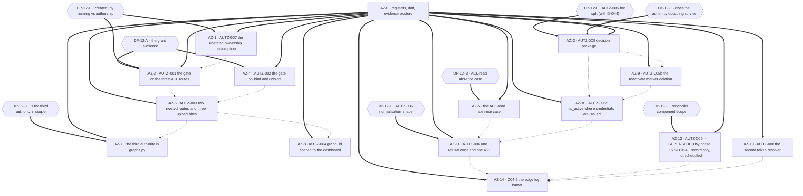

# Phase 12 — Authorization remediation execution plan

## Purpose

This plan decomposes the phase-12 authorization findings into dependency-safe execution blocks. It
fixes **order, risk containment and proof obligations**. It does **not** fix implementation choices
where technical uncertainty exists: `DP-12-A` … `DP-12-H` are carried open from the code context
§9, whose own instruction is *"This plan does not choose. I recommend."* — inherited verbatim, with
none of the eight resolved here.

Every block names a **semantic** target (route · dependency function · permission constant ·
repository method · DB table and column · role-or-tier enum · middleware), the `AUTZ-*` and
`VAL-12-*` identifiers it discharges, its `blocked_by`, its place in the single-implementor queue, a
risk view across implementation / rollout / regression / compatibility, the agents it needs, its
documentation impact, named verification, and its definition of done.

Scope discipline, inherited from phases 03, 07 and 08: **the audit corpus is not an implementation
target.** No block edits `.ai/audit/**`, `.ai/plans/_code-context/**`, or any sibling plan. **No
block in this plan mutates the running Docker state** — the only container interaction permitted
anywhere in this plan is the read-only `docker compose ps` posture check, because two findings
(`AUTZ-003`, `AUTZ-009`) are claims about what the proxy and the health surface *do in a running
stack*, and a plan that guesses at runtime posture is guessing. This plan's only writable artefact is
itself.

### The evidence posture every block inherits — and what it does not mean

**No runtime probe was executed.** The audit declined to start the stack; the Phase-1 code context
declined again and ran **only** static reads plus six read-only `Select-String`/AST queries and
`git log`/`git show`/`git blame`. This plan therefore has **zero reproduced runtime facts of its
own**, and the report's own live probes are the only runtime evidence in existence.

**What that forbids, in every block:**

- **No block may write "confirmed" about a status code a client observed.** `403` on
  `GET /graphs`, `200` with an empty array from `get_dashboard_filters_endpoint`, `422` on
  `grant_dashboard_access_endpoint` for an absent dashboard, `401` on `/auth/refresh` for a
  deactivated user, `401` on every request while `test-redis` is down — every one of these is the
  report's **static** reading of the code, not an observed response. Each block's verification row
  is where the observation has to happen for the first time, and each such row says so in those
  words.
- **No block may treat a green suite as confirmation of a runtime posture.** `ruff` and `mypy` are
  green at `df35d09` (the code context re-ran `.\Makefile.ps1 check` and recorded *"Backend quality
  checks passed"*). That is a precondition. None of the eleven substantiated defects is visible to a
  linter or a type checker.
- **The three "unsettled" rows stay unsettled.** `AUTZ-004`'s 200 outcome, `AUTZ-003`'s
  `/dashboards` nested-route behaviour under nginx, and `AUTZ-009`'s exception branch were each
  *named* unresolved by the audit itself. The blocks below do not resolve them by argument either;
  they schedule the probe.

**Where runtime posture matters, the plan says what evidence it needs and stops there.** The
`read-only docker compose ps` rows in `AZ-3`, `AZ-4`, `AZ-6`, `AZ-7` and `AZ-14` exist to establish
*whether the stack was ever observed in this programme at all* — a fact, not a finding.

### The verdicts this plan schedules on

| Verdict class | Count | Identifiers |
| -------------- | ----- | ----------- |
| **Substantiated** | **11** | `AUTZ-001`, `AUTZ-002`, `AUTZ-003`, `AUTZ-004`, `AUTZ-006`, `AUTZ-007`, `AUTZ-008`, `AUTZ-009`, `VAL-12-001`, `VAL-12-003`, `VAL-12-004` |
| **Drifted** | **1** | `AUTZ-005` — substantiated in substance, **rewritten** by `VAL-12-005` |
| **Report defect, stale** | **1** | `VAL-12-002` — true when filed, **retired** by `2174895` |
| **Refuted** | **0** | — |
| **Already fixed (half)** | **1** | `AUTZ-005a` — `TXN-001` landed as `2174895` |

**Zero refutations is itself load-bearing.** It means the audit's *findings* survived the
validation; what did not survive is one of its *pieces* (`AUTZ-005`) and one of the *report's own
defect records* (`VAL-12-002`). The remediation surface is therefore **not** smaller than filed — it
is **differently shaped**, and `AUTZ-005` is the only finding whose consequence inverted.

### What `VAL-12-005` does to `AUTZ-005` — the one reshaped finding

`AUTZ-005` was filed as three parts. `2174895` landed part (a) — the transaction ownership fix
(`TXN-001`, `DashboardService.update_user_active` no longer holds the session across the
`IntegrityError` retry). **Part (a) is fixed; parts (b) and (c) are not, and the consequence
inverted.**

| Part | Claimed consequence at filing | Actual state at `df35d09` |
| ---- | ---------------------------- | ---------------------------- |
| **`AUTZ-005a`** — transaction ownership around the retry | writes silently lost when the commit raises and the session rolls back | **DISCHARGED by `2174895`.** `tests/test_user_service.py::TestUserServiceCommitOwnership` now pins it. **No block exists** |
| **`AUTZ-005b`** — deactivation writes `user_tokens_revoked`, reactivate does not delete it | reactivated user locked out until the marker TTL expires | **Live, unchanged.** Same ordering in both directions, same missing call in the `True → False` branch |
| **`AUTZ-005c`** — `is_active` never read on the credential-issuing surfaces | refresh path issues a token to a deactivated user | **Live, unchanged.** `login_user` and `AuthService.refresh_token` both never read `is_active`. Neither calls `revoke_all_user_tokens` |

**The consequence inverted, and this is the single most important sentence in the plan.**
`2174895` also added `is_user_tokens_revoked` to the **authentication dependency**. So a
deactivated account can now **authenticate** — `POST /auth/login` returns 200 and mints a token pair
— and is then **refused at the gate** on every authorised request, while its own marker guarantees
it can never obtain a *new* token pair through refresh. **The account is locked out of the system
in a way that is invisible at the login surface and misdiagnosed by anyone reading the login
response.** Before `2174895`, `AUTZ-005c`'s absence was masked by the gate; now the gate is the
thing that refuses it, and the login surface actively reports success.

**Plan the inverted consequence, not the report's.** `AZ-10` (`AUTZ-005c`) is scheduled as a
**200 → 401 conversion on two credential-issuing surfaces**, with the `401`'s *message* load-bearing
(it must not distinguish "deactivated" from "wrong password" to an unauthenticated caller), and
`AZ-9` (`AUTZ-005b`) as the fix that makes reactivation usable again. The two are **hard-ordered
against each other**: landing (c) without (b) converts a working reactivation path into one that
still cannot obtain a token. That ordering constraint is `DP-12-E`'s first question.

### Files other phases own that this plan's blocks touch or read

`src/mkobi/api/deps.py` (**phase 08 `CQLT-4`**, **phase 04 `AB-5`/`AB-6`/`AB-7`**) ·
`src/mkobi/api/routes/admin.py` (`2174895`'s text; phase 04 `D-04-I`/`AB-4` co-owner on the
deactivation semantics) · `src/mkobi/core/security.py` (**phase 04 `AB-5`** — the revocation pair is
that block's file) · `src/mkobi/core/permissions.py` (phase 08 `CQLT-3`'s read-only reference;
`AUTZ-008`'s dead resolver is here) · `src/mkobi/api/routes/graphs.py` (phase 08 `CQLT-3` rewrote
the list endpoint; the third authority is in its list handler) · `src/mkobi/api/routes/layouts.py`
(phase 08 `CQLT-3`) · `src/mkobi/app.py` (phase 07 `EB-1`, `EB-7`; **phase 08 `CQLT-8`** decided the
`FastAPI(...)` constructor here; phase 10 `B4`/`B5`) · `src/mkobi/api/routes/data.py` (phase 11
`PRF-4` added `graph_id`) · `docker/nginx/nginx.conf` (**phase 04 `C04-5`** format directives,
**phase 10 `DP-10-8`**) · `frontend/src/**` (**phase 16** via phase 04 `C04-4`) · `docs/08-security/access-control.md`
(the error-code vocabulary — `models/enums.py::ErrorCode`; **no phase-09 block owns a register**, `C12-4`) · `tests/test_permissions.py::TestGetCurrentUser` (**no phase-09 block owns it** — plan 09 declares `TST-001`…`TST-018` / `TCO-0`…`TCO-11` and never names this file; routed to the **Coordinator**, `C12-5`).

## Anchor authority

> **The report's line numbers are not binding, and neither are the code context's.**
>
> **Every one of the report's ~94 cited anchors resolves.** No report anchor names a symbol that no
> longer exists, and no `VAL-12-*` record claims a dead anchor. The drift is **uniform and
> systematic**, not scattered:

| File | Report cites | Actual at `df35d09` | Drift | Shape |
| ---- | ------------ | ------------------- | ----- | ----- |
| `src/mkobi/api/deps.py` | `100`, `195`, `221`, `340`, `429` | `103`, `198`, `224`, `343`, `432` | **−3, five for five** | uniformly 3 lines high |
| `src/mkobi/app.py` | `44`, `88`, `143` | `93`, `137`, `192` | **+49, three for three** | uniformly 49 lines low |
| `src/mkobi/services/user_service.py` | `58` | `81` | **+23** | one-line slip |

The two remaining one-line slips are recorded **by the report itself**, not discovered here:
`db/repositories/user_repo.py`'s `update_active` commit at `user_repo.py:133` (actual `131`) and
`user_service.py`'s `commit` delegation at `user_service.py:33` (actual `58`) — the report cites each
and then flags it inline as ±1.

**Every anchor in this plan is a symbol, a route, a column, a method, a table or a file.**
Implementors resolve targets by symbol at the moment of work. **If a symbol named below does not
exist, that is a finding: stop and report it rather than substituting the nearest match.**

**The precedence rule, stated in words once, because it governs every anchor in this file.** Where
the report and the code context disagree about **where** something is, **what its name is**, or
**what the code does** — the **code context wins**: it was written against `df35d09`, after
`2174895`, and it is the only source that observed the landed state. Where they disagree about
**identity** — that is, about **which finding or defect an item is**, or about the **identifier set**
the phase works from — the **report's identity wins**, and the code context's alternative naming is
**recorded as a defect in the report**, not adopted. `VAL-12-005` is the worked example of both
halves at once: the *identifier* stays `AUTZ-005` (report), while its *content and consequence*
are the code context's. This rule resolves anchors and labels. **It changes no verdict in this
plan**, and it is the same rule the frontmatter's `code_context_authority` states in field form.

### Anchor authority over the three places the report and the code context disagree

1. **`VAL-12-002` is stale, not wrong.** It recorded that `DashboardService.update_user_active` held
   a session across the `IntegrityError` retry. `2174895` fixed exactly that. The defect record stays
   in the report; **its recommendation is discharged by history** and gets no block.
2. **`VAL-12-003` retires one of the report's own evidence lines.** `AUTZ-007`'s claim that
   `update_active` is inconsistent "because it commits when the value is unchanged" cited
   `user_repo.py:133` — a −1 slip. The claim itself survives; **only that citation is withdrawn.**
3. **`VAL-12-005` rewrites `AUTZ-005`.** Not a refutation of the finding: a rewrite of its shape.
   `AUTZ-005`'s own "Affected files" table remains accurate as written.

### The new item that post-dates the report

`app.py::detailed_health_check` publishes the reconciler's **lease state** and **`unprotected_ticks`
count** to an **anonymous** caller — the one endpoint the code context describes as *"reachable
without authentication"*. Both fields exist specifically to let an operator distinguish **"a loop
that has died"** from **"an idle one"**, per the module's own comment. That diagnostic value is real;
so is the fact that an unauthenticated observer learns the worker's lease ownership and backlog depth
from it. **This is not an `AUTZ-*` finding** — the report never filed it. It is handed to **phase 15's `SECB-4`** with `AUTZ-009` because it is the same endpoint, the same
disclosure class and the same coordinate with `docs/05-health/health-api.md`. It was raised here as
`DP-12-G` — **whether the component belongs in an anonymous payload at all** is a monitoring contract
question, not an authorization rule — and **`DP-12-G` is now withdrawn as a decision surface in favour
of phase 15's canonical `D-15-H`** (`C12-13`). Naming it here is the difference between a plan and a
checklist.

### `require_dashboard_admin_access` has **two** prospective owners — and this plan is not the tie-breaker

Phase 08's `D-08-4` — the live ID; plan 08's decision IDs were re-keyed out of the bare `D-N` form — is titled *"which layer enforces the declared audience"*, and phase 08's own plan
text claims the **enforcement point** as phase 08's (`CQLT-2`) while assigning the **rule** to phase
12. The code context §9 `D1` records the same collision from the other side and proposes resolving
it as *"phase 12 installs the enforcement point, phase 08 co-signs."* **Both readings are live in
material this plan is told to honour.** The plan therefore does the only defensible thing: `DP-12-A`
names the audience, `AZ-3` schedules the install in **this** phase because this phase's findings are
what make the gap urgent, and `C12-2` records the collision as **unresolved** with phase 08 as
co-signer. **If the owner rules that phase 08 installs instead, `AZ-3` becomes phase 08's `CQLT-2`
and this plan's coverage of `AUTZ-001` is a co-signature, not an implementation.** That is a
one-line change to this plan and it is the owner's call.

## Scope-ruling tables

### IN — owned by this plan

| Finding | Band | Short name | Block |
| ------- | ---- | ---------- | ----- |
| **`AUTZ-001`** | **CRITICAL** | The grant endpoint accepts any authenticated caller | **AZ-3** |
| **`AUTZ-002`** | **CRITICAL** | The filter-binding endpoints accept any authenticated caller | **AZ-4** |
| **`AUTZ-003`** | **HIGH** | Two nested routes and three upload sites bypass the ACL gate entirely | **AZ-6** |
| **`AUTZ-004`** | **HIGH** | `graph_id` is not constrained to the authorised dashboard | **AZ-8** |
| **`AUTZ-005a`** | HIGH | Transaction ownership around the retry — **discharged by `2174895`** | **no block** |
| **`AUTZ-005b`** | HIGH | Reactivate does not delete the revocation marker | **AZ-9** |
| **`AUTZ-005c`** | HIGH | `is_active` is never read where credentials are issued | **AZ-10** |
| **`AUTZ-006`** | MEDIUM | Six error codes for one refusal class; the client renders one message | **AZ-11** |
| **`AUTZ-007`** | MEDIUM | `created_by` is authorship, not a grant — the assumption is unstated | **AZ-1** · `DP-12-H` |
| **`AUTZ-008`** | MEDIUM | A second token resolver exists and nothing calls it | **AZ-13** |
| **`AUTZ-009`** | MEDIUM | The health surface discloses internals and leaks `str(e)` | **phase 15's `SECB-4`** — `AZ-12` is **superseded** and retained as the record only (`C12-13`); `DP-12-G` is withdrawn as a decision surface in favour of phase 15's `D-15-H` |
| **`VAL-12-001`** | — | The audit's own remedy list carries the rule into a wrong file (`dashboard_filter.py` instead of `dashboards_filters.py`) — **applied as a ruling**, no report edit | **AZ-4** |
| **`VAL-12-003`** | — | `AUTZ-007`'s `user_repo.py:133` evidence line retired — **applied as a ruling** | **AZ-1** |
| **`VAL-12-004`** | — | The audit's own remediation blocker list repeats `AUTZ-005a` six times and never lists (b) or (c) — **applied as a ruling** | **AZ-9** · **AZ-10** |
| **`VAL-12-005`** | HIGH | `AUTZ-005` is already half-fixed and its consequence inverted | **AZ-2** (decision) → **AZ-9**, **AZ-10** |
| **`C04-5`** (half) | — | The nginx `log_format` shape, which the ACL paths would otherwise log in the clear | **AZ-14** |
| **`VAL-12-002`** | — | **Stale** — discharged by `2174895` | **no block** |

### OUT — not owned here, with the named home

| Item | Home | Note for this phase |
| ---- | ---- | ------------------- |
| **`AUTZ-007`'s 1:1 creator-multiplicity assumption** — whether `dashboards.created_by` admits exactly one creator per dashboard | **phase 14** (schema-migrations) | This phase records the assumption and the blast radius. Under `DP-12-H`(b) it becomes the load-bearing semantic of an authorization rule, which is exactly why it is **not** decided here (`C12-6`) |
| **The error-code convention in `docs/08-security/access-control.md`** — the code strings themselves | **no owner — the register does not exist.** Plan 09's decisions are `DP-09-A`…`DP-09-H` and it declares **no** error-code register; plan 08's `C08-9` is the rules-file seam, not this one. The vocabulary's source of truth is `models/enums.py::ErrorCode` with `utils/exceptions.py`'s status mapping. **Routing the register itself is the Coordinator's** (`C12-4`) | Phase 12 files a *request* against the vocabulary and does **not** re-key it; `AZ-11` names the exact merge and records that the register has no owner |
| **The frontend double-rendering of the 403** — `axiosInstance.ts`'s toast and `DashboardView.tsx`'s inline alert | **phase 13** / phase 16 jointly | Phase 13's code context records the split explicitly. **The one-way notice is phase 12's** — see `C12-1` |
| **The unredactable query-string shape** — a redaction regex cannot recover a value a URL already logged | **phase 11** | Recorded, not re-litigated. `AZ-14` states the residual, not a fix |
| **`nginx.conf`'s format *destinations***, whether the file is templated, and whether it is relocated under `nginx` ownership | **phase 10 `DP-10-8`** (via phase 04 `D-04-K`) | `AZ-14` takes a **position on the sequencing** and does not re-decide the destination. `C04-5`'s compose-network CIDR half is **recorded, not scheduled** — no subnet is changed by this plan, so no CIDR value is phase 12's to publish |
| **The unrooted-container health-endpoint ACLs** — which probe can reach `/health/detailed` | **phase 07 (`HO-3`)** and **phase 10 `B9`** | Changing the probe contract is a monitoring-topology decision. `AZ-12` records the finding and the contract; it does **not** change which container may probe |
| **Authentication-session enforcement** — full session invalidation on deactivate, and refresh-token rotation | **phase 04** (`AB-1`…`AB-6`, `D-04-I`, `AB-4`) | Phase 12 owns the *authorization* consequence; phase 04 owns the *session* contract. `C12-3` |
| **`created_by` backfill / a rename migration** | **phase 14** | Out of scope under the minimal-scope rule; recorded as `DP-12-H`'s cost |
| **`require_dashboard_admin_access`'s own defects** — its admin path is narrower than `check_dashboard_access`'s | **recorded, not scheduled** | Re-derived by this plan from the code: the shared dependency returns 403 for an admin who is neither owner nor grantee, where `check_dashboard_access` returns access. **Fixing it is `DP-12-A`'s business**, not a separate block. `C12-2` |
| **The audit's remedy-list error and blocker-list duplication** (`VAL-12-001`, `VAL-12-004`) | **an authorised authoring task, not this phase** | Recorded with their mechanisms and **applied** as rulings. No audit file is edited |
| **`docs/09-database/enums.md`'s error-code table** if it grows a row | **phase 09's register** | Phase 12 requests, does not edit (`C12-4`) |
| **The four `bidb` rows and orphan `temp_pwd:` keys** phases 07/08 recorded | **Coordinator only** | A Planner must not create or delete database rows. Inherited verbatim. Nothing here touches the shared dev database |
| **`tests/test_permissions.py::TestGetCurrentUser`** | **the Coordinator** — plan 09 declares only `TST-001`…`TST-018` / `TCO-0`…`TCO-11` and never mentions this file, so **no phase-09 block owns it** | `AZ-13` deletes the resolver this class exercises and **may not modify the file**. The routing is registered (`C12-5`) |

### CONFLICT — between report, code context and landed work

| # | Subject | Report | Code context | Ruling |
| - | ------- | ------ | ------------ | ------ |
| **X-12-01** | **`AUTZ-005`'s shape** | Three parts, all live, blocked on `TXN-001` | `2174895` discharged (a); (b) and (c) remain; **the consequence inverted** | **Code context wins, and the plan changes.** `AZ-2` decides the split; `AZ-9` and `AZ-10` plan the two survivors against the **inverted** consequence. Part (a) gets no block |
| **X-12-02** | **`VAL-12-002`** | "the transaction fix is a blocker; schedule the whole finding after it" | The defect it describes is **fixed** by `2174895` | **Stale, not wrong.** Recorded, no block. A plan that scheduled "the transaction fix" would be re-fixing landed work |
| **X-12-03** | **The enforcement point for `AUTZ-001`** | Remedy: attach `require_dashboard_admin_access` in `deps.py` | Same remedy, plus: the function **exists, is dead (0 production references), and its admin path is wrong** | **Both agree on the remedy; both are silent on the deadness.** `AZ-3` carries the deadness as a first-class fact and makes `DP-12-A` a hard gate, because installing a dependency nobody has ever executed is how a wrong rule gets shipped silently |
| **X-12-04** | **Who installs the enforcement point** | Block 5's ownership: phase 08 owns the declaration-vs-enforcement contradiction, phase 12 owns the rule | §9 `D1`: resolve as *"phase 12 installs, phase 08 co-signs"*; **phase 08's own plan claims the enforcement point as its own** | **Unresolved, deliberately.** `C12-2` records two prospective owners. This plan schedules the install and states the one-line reversal if the owner rules otherwise |
| **X-12-05** | **`AUTZ-003`'s nested-route behaviour** | "The nested route inherits the parent's guard" | "Under `proxy_pass` without a URI part nginx strips the prefix and the route works" — then **with the caveat that nothing was probed** | **Both are static readings and they disagree.** Recorded as one of the three unsettled rows. `AZ-6` schedules the probe and treats the guard gap as real regardless of the proxy answer |
| **X-12-06** | **`AUTZ-008`'s test ownership** | The dead resolver should be deleted with its test | The class was assumed to be a phase-09 hand-over; **no phase-09 block names it** — `TST-020` does not exist, so the counterparty is the Coordinator | **Corrected, not merely accepted.** `AZ-13` deletes production code only and routes the test to the Coordinator in its commit body (`C12-5`) |
| **X-12-07** | **`AUTZ-007`'s evidence line** | `user_repo.py:133` shows the unconditional commit | A −1 slip; `VAL-12-003` withdraws the citation, the claim survives | **Code context wins.** `AZ-1` carries the claim without the citation |
| **X-12-08** | **The reconciler component's disclosure** | — (never filed) | An anonymous caller sees lease state and `unprotected_ticks` | **New, post-dating the report.** `AZ-12` folds it in as a third element; `DP-12-G` asks whether it belongs in an anonymous payload at all |
| **X-12-09** | **`docs/05-health/health-api.md`'s existing §5** | — | The doc already promises exactly the disclosure `AUTZ-009` calls a defect, including `lease_state` and `unprotected_ticks` | **The doc is not merely incomplete; it is the specification of the behaviour being called a defect.** That makes `DP-12-G` a contract question with a named doc, and it makes `AZ-12`'s documentation impact mandatory rather than advisory |

### VERIFICATION FINDING — the report's `VAL-12-*` records

Each is a defect **in the report**, not in the code. **No audit file is edited.** They are applied as
rulings inside this plan, following phase 04's `VAL-04-001` precedent (an audit record *applied*,
never *edited*).

| ID | Band | Subject | Ruling in this plan |
| -- | ---- | ------- | ------------------- |
| **`VAL-12-001`** | MEDIUM | `AUTZ-002`'s remedy names `dashboard_filter.py`; the module is `dashboards_filters.py` | **Substantiated.** Every implementor resolves by symbol, but the report's own blocker lists the wrong file, and an implementor searching for it would find nothing. `AZ-4` names `dashboards_filters.py` in its target and its commit body |
| **`VAL-12-002`** | HIGH | `AUTZ-005a`'s transaction defect — **stale** | **Recorded with its disposition: discharged by `2174895`.** No block. This plan does not "fix" landed work, and `AZ-2` states the history so no block is opened against it |
| **`VAL-12-003`** | LOW | `AUTZ-007`'s `user_repo.py:133` citation is a −1 slip | **Substantiated; applied.** The evidence line is withdrawn; the finding's claim and its consequence survive unchanged. `AZ-1` carries the claim without the line |
| **`VAL-12-004`** | MEDIUM | The audit's own remediation-blocker list repeats the `(a)` half six times and never lists `(b)` or `(c)` | **Substantiated and load-bearing.** A reader working the blocker list would fix `AUTZ-005` six times and never touch the two live halves. `AZ-9` and `AZ-10` are separate blocks with separate orders, and both commit bodies name `(a)` as already-landed |
| **`VAL-12-005`** | HIGH | `AUTZ-005` is half-fixed and the consequence inverted | **Substantiated; applied as a reshape.** `AZ-2` carries it as a decision record; `AZ-9`/`AZ-10` are planned against the **inverted** consequence — the account authenticates and is refused at the gate. `VAL-12-002` is retired by the same commit |

### Dead-code policy — applied, not paraphrased

The project's policy is that **a component documentation says should exist is future-proofing, not
dead code; recommend investigating purpose, not deletion.** Two candidates in this phase:

| Candidate | Documented as intended? | Verdict |
| --------- | ---------------------- | ------- |
| `core/permissions.py::get_current_user` and `::_get_current_user_with_session` — the second token resolver | **No.** Two call sites, both `tests/`. No doc names it; `deps.py::get_current_user_dependency` is the documented one | **Unreferenced dead code with no documented intent.** `AZ-13` deletes it. Under the policy the *recommendation* would be "investigate purpose" — and it was investigated: the only callers are a test class, and phase 09 already owns moving that coverage |
| `core/security.py`'s `revoke_all_user_tokens` | **Yes, and negatively** — its only production writer is `update_user_active`'s deactivate branch | **Live capability, under-used.** The gap is the *missing call*, not a missing capability. `AZ-9` adds the missing sibling operation; nothing is deleted |

## Block map

`==>` = hard dependency (a decision record or a register that must exist first). `-.->` = recommended
sequencing in the single-implementor queue, **not** a data dependency — the project permits one
implementor at a time, so these are ordered for review coherence, and a diff touching one file is
ordered against the other block that touches the same file. `DP-12-*` diamonds are owner rulings,
not phase-12 work.

### Coverage ledger

| Block | Findings discharged | Decisions gating it | Agents |
| ----- | -------------------- | -------------------- | ------ |
| **AZ-0** | every `VAL-12-*` as a ruling · the uniform drift · the inverted `AUTZ-005` consequence · the new reconciler item · the "no runtime probe" posture | — | **Planner** (owns the note) · **Auditor** (confirms the registers at `df35d09`) |
| **AZ-1** | **`AUTZ-007`** · `VAL-12-003` (applied) | `DP-12-H` | **Auditor, Planner** |
| **AZ-2** | **`AUTZ-005`** (the split) · `VAL-12-005` (applied) · `VAL-12-002` (recorded stale) · `VAL-12-004` (applied) | `DP-12-E`, `DP-12-F` | **Planner**, **Auditor** |
| **AZ-3** | **`AUTZ-001`** (CRITICAL) | `DP-12-A`, `DP-12-H` | **Auditor, Researcher, Planner, Validator — all four** |
| **AZ-4** | **`AUTZ-002`** (CRITICAL) · `VAL-12-001` (applied) | `DP-12-A` | **Auditor, Researcher, Planner, Validator — all four** |
| **AZ-5** | the ACL-read absence case (the report's `AUTZ-006` step 5 rider, separated) | `DP-12-B` | **Auditor, Planner, Validator** |
| **AZ-6** | **`AUTZ-003`** (HIGH) | `DP-12-A` | **Auditor, Researcher, Planner, Validator — all four** |
| **AZ-7** | the third authority in `graphs.py`'s list handler | `DP-12-D` | **Auditor, Planner, Validator** |
| **AZ-8** | **`AUTZ-004`** (HIGH) | — | **Planner, Validator** |
| **AZ-9** | **`AUTZ-005b`** · `VAL-12-004` (applied) | `DP-12-E` | **Auditor, Planner, Validator** |
| **AZ-10** | **`AUTZ-005c`** · `VAL-12-004` (applied) | `DP-12-E`, `DP-12-F` | **Auditor, Researcher, Planner, Validator — all four** |
| **AZ-11** | **`AUTZ-006`** | `DP-12-C` | **Auditor, Researcher, Planner, Validator — all four** |
| **AZ-12** | **SUPERSEDED — nothing discharged here.** `AUTZ-009`'s disclosure work is **phase 15's `SECB-4`** (`SEC-006`); this block is the authorization-phase record of the claim and is **not scheduled** | `DP-12-G` → **`D-15-H` canonical** | **Record only** — phase 15's `SECB-4` roster |
| **AZ-13** | **`AUTZ-008`** | — | **Planner, Validator** |
| **AZ-14** | **`C04-5`**'s format half | — (blocked on phase 04 `D-04-K`, sequenced against phase 10 `DP-10-8`) | **Auditor, Researcher, Planner, Validator — all four** |

**Splits and merges, with reasons.** `AUTZ-005` is **split three ways** — but only because
`VAL-12-005` split it: (a) is discharged by history and gets no block, (b) is `AZ-9`, (c) is `AZ-10`.
Those two are scheduled as separate blocks because they touch **different files** (`admin.py` +
`core/security.py` versus `user_service.py` + `auth.py` + `deps.py`), have **different reversibility**
(a lost key deletion is recoverable by TTL; a missing `is_active` read is a live credential-issuance
hole), and — decisively — `VAL-12-004` records that the audit's own blocker list never separated
them. **`DP-12-E` asks whether they should land as one commit; the plan schedules them apart and
says the merge is the owner's call.** `AUTZ-001` and `AUTZ-002` share the enforcement dependency and
are **not** merged: different routers, different rollback surfaces, different release-note
consequences, and `AZ-4` additionally carries an existence-normalisation change that `AZ-3` does not.
The ACL-read absence case is **separated from** `AUTZ-001` (which installs the gate) because the
report itself calls the refinement separable — folding it in would make the CRITICAL install wait on
a MEDIUM policy question. Nothing else is split or merged.

---

## Execution blocks

### AZ-0 — Registers, drift reconciliation and the evidence posture

| Field | Value |
| ----- | ----- |
| **Semantic target** | **No production code.** This plan's "Anchor authority", the uniform-drift table, the `VAL-12-*` ruling table, the inverted-`AUTZ-005` table and the `C12-*` seam register are the deliverable, carried into every block's `Definition of done`. |
| **Discharges** | Every `VAL-12-*` as a **ruling** — `VAL-12-001` (wrong filename), `VAL-12-002` (**stale**, discharged by `2174895`), `VAL-12-003` (retires one `AUTZ-007` evidence line), `VAL-12-004` (the blocker list repeats `(a)` six times), `VAL-12-005` (**reshapes** `AUTZ-005`) · the three unsettled rows · the new `app.py` reconciler item · the two-prospective-owners collision on `require_dashboard_admin_access`. |
| **blocked_by** | — |
| **Execution order** | **1.** Nothing else starts without it. |
| **Risk — implementation** | **None.** Nothing executes. |
| **Risk — rollout** | **None.** |
| **Risk — regression** | **None in code.** The real risk is **bookkeeping**: a later implementor reading the report's remediation-blocker list, which `VAL-12-004` shows repeats the already-fixed `(a)` half six times and never names `(b)` or `(c)` — a reader would fix landed work six times and never touch the two live halves. |
| **Risk — compatibility** | One real hazard: **this note can be mistaken for authority to edit `.ai/audit/**`.** It is not. Phase 03's `B0` convention — *no audit file is edited* — and phase 04's `VAL-04-001` precedent (an audit record **applied** as a ruling, never edited) are both inherited verbatim. |
| **Agents** | **Planner** — owns the note. **Auditor** — confirms at `df35d09` that the drift table names every file the report cited with an offset, that the `VAL-12-*` rulings name every defect record in the report, and that no *new* dead anchor appeared while the register was being written. **No Implementor, no Researcher, no Validator**: nothing here is a code claim a gate could check. |
| **Documentation impact** | **One** `docs/SPEC.md` version row naming this plan — house convention, matching every sibling plan. **Nothing else.** The doc work that *changes* a contract belongs to each block's own row. |
| **Verification** | `git rev-parse --short HEAD` recorded (expect `df35d09`) · `git status --porcelain` shows **no** modification under `src/`, `tests/`, `frontend/`, `alembic/`, `docker/` at block start · re-derive the drift table **by symbol**: confirm `require_dashboard_admin_access` exists and has **zero** production references; confirm `is_active` appears in **zero** service methods and exactly two repository methods; confirm `user_tokens_revoked` has exactly one writer · **read-only posture check, and this is the one place it is mandatory**: `.\Makefile.ps1 ps` (a `docker compose -p mkobi ps`) — recorded as an **observation of whether the stack has ever been observed in this programme**, not as evidence for any finding. **No test run required**; the gates are green and a green gate proves nothing here |
| **Definition of done** | The note exists and names: the `df35d09` baseline with the standing statement that **a green gate is a precondition and never evidence, and no runtime probe was run**; the uniform drift (`deps.py` −3 ×5, `app.py` +49 ×3, `user_service.py` +23) and the two one-line slips the report itself records; that **every report anchor resolves** and no finding is refuted; the verdict tally (11 substantiated · 1 drifted · 1 stale · 0 refuted · 1 half-fixed); the **inverted** `AUTZ-005` table with `2174895` named as the commit that inverted it; the three unsettled rows; the new `app.py` reconciler item and why it is not an `AUTZ-*`; that `require_dashboard_admin_access` has **two** prospective owners and this plan is not the tie-breaker; and that **no audit file, no code-context file and no sibling plan is edited, and no Docker state is mutated**. |

**Corrected-facts register this note carries into every block.** Each was re-derived by symbol at
`df35d09` while writing this plan, not only from the code context.

| Fact a reader would otherwise carry | Reality | Blocks that must not repeat it |
| ------------------------------------ | ------- | ------------------------------ |
| `AUTZ-005` needs three fixes | **One is already landed.** `TXN-001` → `2174895`; `TestUserServiceCommitOwnership` pins it | any |
| A deactivated user "gets a token at refresh and is treated as authenticated downstream" | **Refuted by the same commit that fixed (a).** The account now **authenticates** (login → 200) and is **refused at the gate**, while its own marker blocks refresh forever | **AZ-9**, **AZ-10** |
| `deps.py`'s anchors are correct | Uniformly **3 lines high**; five citations, five offsets | AZ-3, AZ-4, AZ-5 |
| `app.py`'s anchors are correct | Uniformly **49 lines low**; three citations, three offsets | AZ-14 (AZ-12 superseded) |
| `user_service.py:58` is `commit()` | **+23**; it is `update_user_active` | AZ-10 |
| `AUTZ-007` cites `user_repo.py:133` as evidence | **−1 slip**, retired by `VAL-12-003`; the claim survives | AZ-1 |
| `require_dashboard_admin_access` is a working shared dependency | It exists, has **zero** production references, and its admin path is **narrower** than `check_dashboard_access`'s: an admin who is neither owner nor grantee gets 403 where the check gives access | **AZ-3** |
| `revoke_all_user_tokens` is missing | It exists and is called by the **deactivate** branch; only the reactivate branch is missing its counterpart | AZ-9 |
| 2 × 4 routes rely on the admin role alone | **Confirmed, both roles included** | AZ-3, AZ-4 |
| 21 × 4 = 84 comparisons in `check_dashboard_access` | **Confirmed** — and phase 08 owns the duplicate ladder inside `_check_access_with_session` | AZ-3 (read-only reference) |
| The health surface leaks reconciler lease state and `unprotected_ticks` | **Confirmed, and it post-dates the report.** Anonymous caller; `docs/05-health/health-api.md` §5 **promises the disclosure** | **AZ-12** |

---

### AZ-1 — Name the unstated ownership assumption before the gate that depends on it (`AUTZ-007`)

| Field | Value |
| ----- | ----- |
| **Semantic target** | `db/models/dashboard.py::Dashboard.created_by` (the column) · `db/models/dashboard.py::Dashboard.owner` (the relationship) · `db/repositories/dashboard_repo.py::DashboardRepository.get_by_id`'s `owner` load path and the `selectinload("owner")` convention in `DashboardRepository.list_all`, `::get_by_user`, `::get_all_by_user` · `db/models/user.py`'s `dashboards` back-reference · `core/permissions.py::check_dashboard_access`'s owner branch (read-only) · `dashboards.created_by`'s **foreign key and its `RESTRICT` behaviour on delete** (the mechanism by which a one-owner model is currently enforced) · `services/dashboard_service.py::DashboardService.create_dashboard`'s owner-grant call site (read-only) |
| **Discharges** | **`AUTZ-007`** · `VAL-12-003` applied — the `user_repo.py:133` evidence line is retired and the claim is carried without it. |
| **blocked_by** | **`DP-12-H`** (hard — the naming choice decides whether `AZ-3`'s gate depends on a column nobody reads). Soft: `AZ-0`. Cross-phase: **`C12-6`** (the 1:1 multiplicity assumption is phase 14's). |
| **Execution order** | **2** — ahead of `AZ-3`, because under `DP-12-H`(b) the gate's semantics change and `AZ-3` would have to be re-derived after it landed. |
| **Risk — implementation** | **MEDIUM, and the risk is doing too much.** The defect is a *missing statement*, not a broken mechanism: the FK and its `RESTRICT` delete behaviour already make a second creator impossible. The tempting fix is to widen `created_by` into a grants table or add a `co_owners` array — **that is a schema redesign, and it is not this finding**. The block's job is to make the assumption explicit, decide what the column means, and hand the multiplicity question over. **The trap:** an implementor who reads "ownership is not a grant" and concludes ownership should be a grant lands a migration nobody asked for. |
| **Risk — rollout** | **None.** Under `DP-12-H`(a) this block changes a word in a spec and a name in a note. Under (b) it changes nothing at runtime and states that the schema ruling is a **precondition** for a future co-owner model — the cost is deferred, the decision is not. |
| **Risk — regression** | **None in code.** The regression risk is **narrative**: if this block writes "ownership is not a grant" and a future reader reads that as "the owner is not authorised", it will weaken a correct control. **The wording must say authorship, and it must not weaken the owner's existing authority.** |
| **Risk — compatibility** | **None** — no wire, storage or interface change. Under `DP-12-H`(b) the compatibility cost lands on **phase 14**, not here, and is recorded as such. |
| **Agents** | **Auditor, Planner.** **Auditor:** re-derive the by-symbol census — every site that treats `created_by` as an authority (owner grant, `check_dashboard_access`'s owner branch, the list filters, the delete guard) versus every site that treats it as provenance (audit columns, response payloads), plus the `RESTRICT` FK's actual delete behaviour and whether any shipped test depends on the one-creator assumption. **Planner:** the decision record's wording, the spec row, the hand-over text, and the option table. **No Researcher** (nothing external is uncertain) and **no Validator** (nothing executes). |
| **Documentation impact** | **Required, and it is the whole deliverable.** `docs/SPEC.md` gains a decision row naming `created_by` as **authorship** — the identity of the account that created the dashboard — and stating that authority over a dashboard comes from the `dashboard_access` grants or the administrator role, **not** from the `created_by` column. `docs/09-database/enums.md` is **not** touched. **No** other document changes, because no behaviour changes. |
| **Verification** | **No test run required** — this block touches no code. Evidence is the by-symbol census re-derived by the Auditor and recorded in the commit body: the FK's delete behaviour, the owner-branch call sites, and the count of sites that read `created_by` as provenance · `uv run ruff check src/mkobi/db/models/dashboard.py src/mkobi/core/permissions.py` (precondition only) · `uv run mypy src/mkobi/db/models/dashboard.py` (precondition only) · `docs/00-overview/doc-maintenance-rules.md` read before the edit, per `AGENTS.md` |
| **Definition of done** | `DP-12-H` is ruled and recorded with its options and its chooser · `docs/SPEC.md` carries one decision row naming `created_by` as authorship and stating that dashboard authority comes from grants or the administrator role · the wording does **not** weaken the owner's existing authority, and the commit body says so explicitly · the 1:1 creator-multiplicity assumption is handed to **phase 14** with the consequence stated: if `created_by` is re-read as authorship alone, ownership ceases to be *derived* from it and a dashboard must still be reachable by its creator through an explicit grant · **no migration, no schema change, no code change** · `VAL-12-003`'s withdrawal is recorded so the retired citation is not re-derived |

---

### AZ-2 — The `AUTZ-005` decision package: the b/c split and the landed docstring (`VAL-12-005`)

| Field | Value |
| ----- | ----- |
| **Semantic target** | `services/user_service.py::UserService.update_user_active` (the `db.commit()` delegation and the redis call, read-only here) · `db/repositories/user_repo.py::UserRepository.update_active` (the unconditional commit, read-only here) · `core/security.py::revoke_all_user_tokens` (the only writer of the marker) · `core/security.py::is_user_tokens_revoked` and its `user_tokens_revoked:<id>` key shape · `api/routes/admin.py::update_user_active_admin_endpoint` — specifically **the docstring landed by `2174895`** · `auth.py::_handle_login` → `services/auth_service.py::AuthService.login_user` · `auth.py::refresh` → `::AuthService.refresh_token` · `api/deps.py::get_current_user_dependency`'s `is_user_tokens_revoked` read (**read-only** — phase 04's `AB-5` file) |
| **Discharges** | **`AUTZ-005` as a decision** · **`VAL-12-005`** applied (the reshape) · **`VAL-12-002`** recorded **stale** — `2174895` discharged `AUTZ-005a` · **`VAL-12-004`** applied — the blocker list's six-fold repetition of `(a)` is retired and `(b)`/`(c)` are named as the live work. |
| **blocked_by** | **`DP-12-E`** (hard — the split) and **`DP-12-F`** (hard — whether the docstring is code or documentation). Soft: `AZ-0`. Cross-phase: **`C12-3`** (phase 04's `D-04-I` is the co-owner of `AUTZ-005c`'s semantics). |
| **Execution order** | **3.** Before `AZ-9` and `AZ-10`, because the split decides whether they are two commits or one, and `DP-12-F` decides whether `AZ-10` is a code change or a documentation change. |
| **Risk — implementation** | **None — nothing executes.** The risk is **mis-scheduling**, and it is severe in both directions. Scheduling `(a)` re-fixes `2174895`. Scheduling `(b)` and `(c)` as one commit without saying so fuses a `redis.delete` on a lockout marker with a credential-issuance gate into one rollback unit — and they have **opposite** failure directions: if only `(c)` lands, a reactivated account is refused at login; if only `(b)` lands, a deactivated account still authenticates. **Neither half is safe alone.** That is the finding `VAL-12-004` says nobody scheduled. |
| **Risk — rollout** | **None here.** The consequence is recorded for `AZ-9`/`AZ-10` to carry: this is the decision that determines whether the phase's deactivation remediation is one deployable unit or two. |
| **Risk — regression** | **None in code.** The regression risk is **cross-phase**: phase 04's `D-04-I`/`AB-4` may already be sequenced against the same two lines, and two phases landing `(c)` independently would produce two commits asserting different rules. This block's entire deliverable is that the ruling names phase 04 as co-signer before either lands. |
| **Risk — compatibility** | **None.** But the block's record must state the **inverted** consequence explicitly, because the natural reading of the report is that a deactivated user gets a token and stays authenticated — which `2174895` made false. A reader who plans from the report plans the wrong remediation. |
| **Agents** | **Planner, Auditor.** **Planner:** the two decision records, the option tables, and the commit body that states the history and the inversion. **Auditor:** re-derive, by symbol, the exact set of statements in `update_user_active_admin_endpoint`'s docstring that `2174895` added, and confirm which of them the two live halves falsify; confirm `is_active` is read in **zero** service methods and exactly two repository methods; confirm `revoke_all_user_tokens`'s only production caller is the deactivate branch. **No Implementor, no Researcher, no Validator.** |
| **Documentation impact** | **None in this block.** `DP-12-F`'s outcome decides whether the documentation impact lands here or in `AZ-10`: if the docstring survives, `AZ-10` corrects it in the same commit as the code; if it dies, `AZ-10` deletes it and `docs/02-authentication/` (if it carries the same claim) follows. **The decision is deferred, not the correction** — the docstring currently describes a behaviour that no longer exists, and it cannot stay that way whichever way `DP-12-F` rules. |
| **Verification** | **No test run required.** Evidence is the by-symbol re-derivation above, recorded in the commit body · `git log --oneline -- src/mkobi/api/routes/admin.py` and `git show --stat 2174895` to fix the provenance of the docstring text (read-only) · `uv run ruff check src/mkobi/services/user_service.py src/mkobi/api/routes/admin.py` and `uv run mypy src/mkobi/services/user_service.py` (preconditions only) |
| **Definition of done** | `DP-12-E` is ruled with its options and its chooser (phase 04's `D-04-I` named as co-signer) · `DP-12-F` is ruled with its options and its chooser · the commit body states, in one paragraph: `2174895` landed `AUTZ-005a`; `VAL-12-002` is therefore stale; `(b)` and `(c)` are the live work; and **the consequence is inverted — a deactivated account authenticates at `POST /auth/login` and is refused at the gate, while its own marker prevents it ever refreshing again** · the phase-09 `VAL-12-004` blocker-list defect is recorded so nobody works the audit's list · **no code, no doc and no test changed in this block** · if `DP-12-E` rules (a), `AZ-9` and `AZ-10` are re-sequenced as a single block and this plan is edited to say so before either starts |

---

### AZ-3 — Install the gate on the three ACL routes (`AUTZ-001`)

| Field | Value |
| ----- | ----- |
| **Semantic target** | `api/routes/dashboards_access.py` — the router declaration, and the three handlers `grant_dashboard_access_endpoint`, `get_dashboard_access_endpoint`, `revoke_dashboard_access_endpoint`, each with its `current_user` parameter and its OpenAPI `description` · `api/deps.py::require_dashboard_admin_access` — **the dead dependency: zero production references**; its `check_dashboard_access` call, its `except HTTPException` → 403 mapping and its 404 branch · `core/permissions.py::check_dashboard_access` (**read-only** — phase 08 `CQLT-3`'s reference, and the decision surface) · `docs/SPEC.md`'s admin-bypass decision row (**read-only** for this block) |
| **Discharges** | **`AUTZ-001`** (CRITICAL) · `VAL-12-001`'s rule applied by extension (resolve the gate by symbol, not by the report's filenames) |
| **blocked_by** | **`DP-12-A`** (hard — the audience; nothing installs until it is ruled) and **`DP-12-H`** (hard — under option (b) the gate's semantics depend on the `created_by` ruling `AZ-1` records). Soft: `AZ-0`, `AZ-1`. Cross-phase: **`C08-2` → `C12-2`** (phase 08 co-signs `DP-12-A` and may own the install), **`C12-9`** (persisted rows). |
| **Execution order** | **4.** The first gate install, and the **hard ordering gate for `AZ-6`** — widening the ACL's reach before the gate exists inverts the priority in `AUTZ-003`'s own favour, which is wrong. |
| **Risk — implementation** | **HIGH, and the shape of the mistake is narrow.** The change is one dependency per handler. **Three ways to get it wrong, all silent:** (i) **audience collapse** — reading only the route's prose ("All operations require admin role") and installing admin-only, which would lock every legitimate owner out of their own grant surface; (ii) **audience widening** — reading `AUTZ-003`'s "owners grant other users what they cannot do themselves" and installing a self-grant path, which reintroduces the finding; (iii) **trusting the dead dependency** — `require_dashboard_admin_access` has **never executed in production**, and its admin path is **narrower** than `check_dashboard_access`'s: an administrator who is neither owner nor grantee receives 403 where `check_dashboard_access` would grant access. Installing it without fixing or accounting for that asymmetry turns a privilege-escalation hole into a privilege-*denial* bug on the same commit. **`DP-12-A` must therefore rule the audience *and* say what happens to an administrator who is not the owner.** |
| **Risk — rollout** | **HIGH, asymmetric, and irreversible in one direction.** Today **any authenticated account of any role** can insert an `admin` grant for itself on any dashboard, and it is effective immediately on every read path that consults `check_dashboard_access`. The install turns **200 into 403** for every caller that is neither owner nor administrator, across **three documented endpoints** (`docs/02-dashboards/dashboards-api.md`'s access-management section documents all three as callable by any authenticated user). **Wrong grants already written persist** — the fix rewrites no stored row, so every `dashboard_access` row an authenticated stranger created **remains and must be reconciled by an operator** (`C12-9`). Before merging: an operator must enumerate the `dashboard_access` rows and classify them; a Planner cannot do this and this plan does not attempt it. |
| **Risk — regression** | **MEDIUM-HIGH, and the shipped suite is the hazard.** `tests/test_dashboards_api.py::TestAccessControl` and `::TestAdminBypass` exercise access control on the **CRUD** routes, not the ACL-management routes, and `tests/test_resource_access_control.py`'s four classes pin the **admin bypass over dashboard CRUD** — they must stay green **unmodified**, because they are the only shipped proof that an administrator's path survives. **Nothing in the shipped suite pins any of the three endpoints' current behaviour**, so nothing will catch an audience mistake in either direction; the new tests below are the only evidence that will exist. |
| **Risk — compatibility** | **HIGH.** 200 → 403 is wire-visible on three documented endpoints, in **both** directions of the published contract: the handlers' OpenAPI `description` strings are part of the document and are currently *narrower than the audience the path admits* — which is the finding. A route whose prose and behaviour disagree **is** the defect, so a fix that changes behaviour without changing prose has closed half of it. Any working client flow that relied on the unenforced rule is **a defect to fix, not a client to accommodate** — which is the report's own ruling, upheld verbatim. |
| **Agents** | **Auditor, Researcher, Planner, Validator — all four.** CRITICAL band, a security boundary, and a decision that has two prospective owners. **Auditor:** the complete inventory of consumers of the three endpoints — `frontend/src/**` (which access-management surfaces exist and which roles the SPA can present), `tests/`, `docs/`, and the `docs/SPEC.md` admin-bypass row — **by symbol**; plus a re-read of the three handler bodies to confirm `current_user` is referenced in **none** of them; plus the classification input an operator needs for `C12-9`. **Researcher** (narrow, and it decides shape rather than code): FastAPI `Depends` on a dependency that declares a `dashboard_id: UUID` path parameter the handler also declares — whether the parameter is satisfied from the path, whether declaring it twice is legal, and how the dependency's `HTTPException` mapping interacts with the handler's own; and **separately**, whether an installed dependency's OpenAPI `description` can carry the audience statement, or whether the audience must be stated in the route's own description to be visible in the published document. **Planner:** the enforcement point under `DP-12-A`, the administrator-path asymmetry in `require_dashboard_admin_access`, the `current_user` remove-or-use decision for all three handlers, and the reconciliation of the three prose declarations against the ruled audience. **Validator:** that the enforced rule matches the documentation **in the same commit**; that a non-owner, non-administrator caller receives 403 **and `dashboard_access` gains no row** — the acceptance criterion; that an administrator succeeds; that the owner succeeds; and that the four `test_resource_access_control.py` classes stayed green **unmodified**. |
| **Documentation impact** | **Required and inseparable from the code.** `api/routes/dashboards_access.py`'s module docstring and all three `description` strings must be reconciled with what the code enforces — **in the same commit**. `docs/02-dashboards/dashboards-api.md`'s access-management section gains the **403** row and the corrected auth level for all three endpoints. `docs/08-security/access-control.md` states the enforcement model and must agree. `docs/SPEC.md`'s **admin-bypass** decision row is **read-only for this block** — the rule is this phase's (`DP-12-A`), but if the ruling contradicts that row, that is `C12-2`, not an edit made here. `docs/SPEC.md` also gains a version row. `docs/09-database/enums.md`'s error-code table gains a row **only** if `DP-12-A` selects a new code — and then only through phase 09's register (`C12-4`). |
| **Verification** | **New** route-level tests — the three endpoints have **no** test module today. Grant as **owner** → success; grant as **administrator** → success; grant as a non-owner, non-administrator → **403** and **`dashboard_access` gains no row** (**the acceptance criterion**); grant as a `viewer` on a dashboard they cannot see → **403**, not 404 (**`docs/SPEC.md`'s 403/404 dual-signal rule must survive**); list and revoke under the same three roles; the path/body `dashboard_id` mismatch still returns **422**; an out-of-vocabulary `permission` still returns **422** (`AZ-11`'s territory must not regress here) · `.\Makefile.ps1 test-select -k "TestAccessControl" -v` · `.\Makefile.ps1 test-select -k "TestAdminBypass" -v` · `.\Makefile.ps1 test-select -k "TestResourceAccessControlUpdate" -v` · `.\Makefile.ps1 test-select -k "TestResourceAccessControlDelete" -v` · `.\Makefile.ps1 test-select -k "TestDashboardOwnerAccess" -v` · `.\Makefile.ps1 test-select -k "TestAccessControlListChecked" -v` · `.\Makefile.ps1 test-select -k "TestDashboardAccessCascadeDelete" -v` — **all seven must stay green unmodified**; the four `TestResourceAccessControl*`/`TestDashboardOwnerAccess`/`TestAccessControlListChecked` classes are the only shipped proof the administrator's path survives · `.\Makefile.ps1 test-select -k "TestDashboardAccessDependencies" -v` (**the dependency this block installs, for the first time, in production** — the existing tests exercise it directly and will not catch a wrong audience) · `.\Makefile.ps1 test-select -k "TestOpenAPIErrorSchemas" -v` · `.\Makefile.ps1 test-select -k "TestErrorResponseFormat" -v` · `uv run ruff check src/mkobi/api/routes/dashboards_access.py src/mkobi/api/deps.py src/mkobi/core/permissions.py` · `uv run mypy src/` — **precondition, not evidence** · **read-only posture check**: `.\Makefile.ps1 ps` before the block, recorded as an observation of whether the stack has ever been exercised in this programme; **this block's 200 → 403 claim has never been reproduced anywhere and the new tests above are its first evidence** |
| **Definition of done** | `DP-12-A` and `DP-12-H` are recorded with their options in the commit body · the three handlers carry the enforced dependency, and **the administrator path is explicitly accounted for** — either `require_dashboard_admin_access` is corrected or its asymmetry is named as a deliberate decision · `current_user` is either used or removed on all three handlers, and the choice is recorded · the module docstring and all three `description` strings match the enforced rule **in the same commit** · a non-owner, non-administrator caller gets **403** with **no** row written, proven by test · an administrator succeeds and the owner succeeds, proven by test · the four `test_resource_access_control.py` classes stayed green **unmodified** · `docs/02-dashboards/dashboards-api.md` gained the 403 row and the corrected auth level **in the same commit** · the release note states that **wrongly-created grants persist and require operator reconciliation** and that the fix rewrites no stored row · the commit body names phase 08 as co-signer of `DP-12-A` and records that `C12-2` may transfer the install |

**Three constraints this block must not lose.**

1. **`require_dashboard_admin_access` has never run in production.** Zero production references at
   `df35d09`. Installing it is installing untested-in-situ code on a CRITICAL path, which is why
   `DP-12-A` rules the audience *before* the install and why the block's own route-level tests are
   the deliverable rather than an extra.
2. **Its administrator path is narrower than the check it wraps.** An administrator who is neither
   owner nor grantee receives 403 where `check_dashboard_access` grants access. Either correct it or
   name it a deliberate decision — do not ship it as an accident.
3. **Wrong grants persist.** The fix rewrites no stored row. Every `dashboard_access` row an
   authenticated stranger created remains, and the release note must say so.

---

### AZ-4 — Install the gate on filter bind/unbind, and stop returning 500 for a missing dashboard (`AUTZ-002`)

| Field | Value |
| ----- | ----- |
| **Semantic target** | `api/routes/dashboards_filters.py` — **the module the report mis-names `dashboard_filter.py`** (`VAL-12-001`) — and its three handlers `bind_filter_endpoint`, `unbind_filter_endpoint`, `get_dashboard_filters_endpoint` · `services/dashboard_service.py::DashboardService.bind_filter` (the `ValueError` for a missing filter) and `::DashboardService.unbind_filter` · `db/repositories/dashboard_repo.py::DashboardRepository.get_by_id` (**the missing existence check** — the route goes straight to the access check and then to the service) · `api/deps.py::require_dashboard_write_access` (the dependency to install; also currently unreferenced outside its own tests) · `models/enums.py`'s error-code vocabulary as used by the route |
| **Discharges** | **`AUTZ-002`** (CRITICAL) · **`VAL-12-001`** applied (the wrong-filename remedy is corrected **by symbol**, and the correction is recorded so an implementor does not search for `dashboard_filter.py`) |
| **blocked_by** | **`DP-12-A`** (hard — the write audience is the same question as the grant audience; if `DP-12-A` says "owner grants, others do not write", the write gate follows). Soft: `AZ-0`. Cross-phase: **`C08-2` → `C12-2`**. |
| **Execution order** | **5.** The second gate install, and — together with `AZ-3` — a **hard ordering gate for `AZ-6`**. |
| **Risk — implementation** | **HIGH, and this block carries a second defect the report files separately but which is the same boundary.** Two elements: (i) the missing gate on two routes that accept any authenticated caller, and (ii) **a missing dashboard yields `500`, not `404`** — `DashboardService.bind_filter`'s `ValueError("Filter not found")` path is reachable for a dashboard that does not exist, because nothing between the route and the service checks the dashboard. **Element (ii) is the trap.** The obvious gate install routes the caller through `require_dashboard_write_access`, which raises `404` for an absent dashboard — so installing the gate **silently converts a 500 into a 404** and an implementor may believe they have changed only the authorization behaviour. That is a **wire-visible change the release note must state**, and it is the kind of accidental improvement that gets reverted by someone who reads the diff as authorization-only. |
| **Risk — rollout** | **HIGH.** Today **any authenticated account of any role** can bind and unbind filters on **any** dashboard — the write path to a dashboard's query configuration, with no gate at all. The install turns **200 into 403** across two endpoints the report notes are covered by `docs/07-frontend/pages.md`, and the fix **rewrites no stored row**: filter bindings an authenticated stranger created persist and must be reconciled (`C12-9`). Separately, the 500 → 404 conversion **removes a 5xx from the error rate**, which any alert keyed on 5xx will see as an improvement — good, and it must not be mistaken for the authorization fix landing. |
| **Risk — regression** | **MEDIUM.** `tests/test_dashboards_api.py` has **no** bind/unbind route-level class (its classes are `TestGetMyDashboards`, `TestGetDashboardDetail`, `TestCreateDashboard`, `TestUpdateDashboard`, `TestDeleteDashboard`, `TestAccessControl`, `TestGetDashboardsAdmin`, `TestAdminBypass`) — so nothing pins the current behaviour. `tests/test_filter_persistence.py::TestFilterStatePersistence` and `tests/test_filter_values_consistency.py::TestFilterValuesConsistency` exercise the filter stack below the route and must stay green. **The 500 → 404 conversion must be asserted explicitly**, because no shipped test currently sees the 500 and its disappearance would otherwise be invisible. |
| **Risk — compatibility** | **HIGH, on two axes.** 200 → 403 on two routes the documentation presents as generally available; and 500 → 404 on the absent-dashboard case, which changes an error code the client's error extractor may treat differently (phase 16 owns the extraction chain). A `500` today reaches the frontend's generic fallback; a `404` with an RFC 7807 body reaches the code-aware branch. That is a client-visible difference with **no** authorization content. |
| **Agents** | **Auditor, Researcher, Planner, Validator — all four.** CRITICAL band and a second security boundary. **Auditor:** the consumer census for the two routes — `frontend/src/**` (which pages call bind/unbind and under which roles the SPA can present them), `tests/`, `docs/` (`docs/07-frontend/pages.md` is named by the report) — **by symbol**; and confirmation that nothing between the route and the service checks dashboard existence today. **Researcher** (narrow): the same `Depends`/path-parameter question as `AZ-3`, **plus** the correct way to express a *pre-service* existence check that returns 404 without duplicating the access check's own 404 — i.e. whether the two 404s are distinguishable in the response body and whether they must be. **Planner:** the gate install, the existence check's placement, and the decision of whether the 500 → 404 conversion is folded into this commit or split out (it is a **different concern with a different client-visible effect**, and `R-11` argues against fusing them). **Validator:** that a non-owner, non-administrator gets **403** and no binding row is created; that the owner succeeds; that an administrator succeeds; that an absent dashboard now returns **404** and **not 500**; and that `TestFilterStatePersistence` and `TestFilterValuesConsistency` stayed green. |
| **Documentation impact** | **Required.** `docs/07-frontend/pages.md`'s pages section gains the corrected auth level for bind/unbind. `docs/02-dashboards/dashboards-api.md` gains the **403** row for both routes and, if the conversion is shipped here, the **404** row for the absent-dashboard case with the correction stated. `docs/08-security/access-control.md` states the enforcement model and must agree. `docs/SPEC.md` gains a version row. The report's filename error is recorded in the commit body so the correction is traceable without editing the report. |
| **Verification** | **New** route-level tests for the two handlers: bind as **owner** → success; bind as **administrator** → success; bind as a non-owner, non-administrator → **403** and **no binding row is created** (**the acceptance criterion**); the same three roles for unbind; **absent dashboard → 404, asserted explicitly and with a comment recording that it was 500 before this block**; an existing dashboard with a non-existent filter still returns the filter-not-found error unchanged · `.\Makefile.ps1 test-select -k "TestFilterStatePersistence" -v` · `.\Makefile.ps1 test-select -k "TestFilterValuesConsistency" -v` · `.\Makefile.ps1 test-select -k "TestAccessControl" -v` · `.\Makefile.ps1 test-select -k "TestAdminBypass" -v` · `.\Makefile.ps1 test-select -k "TestDashboardAccessDependencies" -v` · `.\Makefile.ps1 test-select -k "TestErrorResponseFormat" -v` · `.\Makefile.ps1 test-select -k "TestDashboardServiceIntegration" -v` · `.\Makefile.ps1 test-select -k "TestFilterServiceIntegration" -v` — **the last two pin the service layer this block's existence check sits above; they must stay green unmodified** · `.\Makefile.ps1 test-select -k "TestOpenAPIErrorSchemas" -v` · `uv run ruff check src/mkobi/api/routes/dashboards_filters.py src/mkobi/services/dashboard_service.py src/mkobi/api/deps.py` · `uv run mypy src/` — **precondition, not evidence** · **read-only posture check**: `.\Makefile.ps1 ps` before the block; **neither the 200 → 403 nor the 500 → 404 claim has ever been reproduced in this programme, and these tests are their first evidence** |
| **Definition of done** | `DP-12-A` recorded with its options in the commit body · both handlers carry the enforced dependency · a non-owner, non-administrator gets **403** with **no** binding row created, proven by test · an administrator and the owner both succeed, proven by test · an absent dashboard returns **404**, proven by test, and the commit body states that it previously returned **500** and that this conversion was **not** an authorization change · `TestFilterStatePersistence`, `TestFilterValuesConsistency`, `TestDashboardServiceIntegration` and `TestFilterServiceIntegration` stayed green **unmodified** · `docs/07-frontend/pages.md` and `docs/02-dashboards/dashboards-api.md` gained the 403 row, and the 404 row if the conversion shipped here, **in the same commit** · `VAL-12-001`'s filename correction is recorded, not written into the report · the release note states that wrongly-created filter bindings persist and require operator reconciliation |

---

### AZ-5 — The ACL-read absence case: 200-with-empty or 404 (`DP-12-B`)

| Field | Value |
| ----- | ----- |
| **Semantic target** | `api/routes/dashboards_access.py::get_dashboard_access_endpoint` (the handler `AZ-3` also installs on) · `core/permissions.py::check_dashboard_access`'s **404 branch** — the existence probe that raises `HTTPException(404)` for a dashboard the caller cannot see, which is what makes an ACL read on an absent dashboard indistinguishable from an ACL read on an invisible one · `db/repositories/access_repo.py::AccessRepository.list_for_dashboard` (the empty-list return) · `api/deps.py::require_dashboard_admin_access` (**read-only** — `AZ-3`'s install) · `docs/SPEC.md`'s 403/404 dual-signal rule (**read-only**) |
| **Discharges** | The ACL-read absence case the report files as `AUTZ-006`'s roadmap step 5 rider ("the `AUTZ-006` block should also settle this, or it will reappear") — **separated from `AZ-3` on purpose**, because the report itself calls the gate install and the refinement separable. No `AUTZ-*` identifier is consumed; `AZ-11` references this block as the precedent for its dual-signal decision. |
| **blocked_by** | **`DP-12-B`** (hard — this block *is* `DP-12-B`'s implementation) and **`AZ-3`** (hard — the gate must exist before the question "what does the endpoint return when there is no ACL row for an invisible dashboard" has a determined answer). Soft: `AZ-0`. |
| **Execution order** | **6.** After `AZ-3`, before `AZ-11`, which cites it. |
| **Risk — implementation** | **MEDIUM, and the trap is to read the question as a bug.** Two readings exist and both are defensible: (a) an ACL read on a dashboard the caller cannot see should return **404**, matching `check_dashboard_access`'s own signal and hiding existence; (b) it should return **200 with an empty list**, which is what it returns today and is *also* a non-disclosure — an empty list discloses nothing about the dashboard, only about the caller's grants. **Reading (a) is a security improvement in signalling; reading (b) is a smaller diff and a stable API.** This plan does **not** choose: `DP-12-B` does. **The mechanical trap:** an implementor who changes the handler's status code without the same-commit prose change re-creates `AUTZ-006` in miniature — a response whose code contradicts its documentation. |
| **Risk — rollout** | **MEDIUM.** Today the endpoint returns 200-with-empty for both "no grants yet" and "dashboard invisible". If (a) is ruled, an ACL read for an invisible dashboard becomes 404 — and the SPA's access-management surface, if it polls the list before deciding what to show, would change behaviour on a 404. `AZ-3` makes the endpoint owner-or-administrator-only, which **narrows who can reach this case at all** and therefore shrinks the blast radius — that is a second reason the two blocks are ordered. |
| **Risk — regression** | **LOW-MEDIUM.** No shipped test pins this endpoint's absent-dashboard behaviour. `AZ-3`'s new tests will create the fixture; this block adds the case to them. `docs/SPEC.md`'s 403/404 dual-signal rule is the constraint that must survive: a viewer must receive 403 for a dashboard they can see but not administer, and 404 for one they cannot see at all — **both**, and they must be distinguishable. |
| **Risk — compatibility** | **MEDIUM.** 200 → 404 on one endpoint, or **no change** under reading (b). `docs/02-dashboards/dashboards-api.md` documents all three endpoints' responses and would need the row either way (to record the *unchanged* case under (b), if that is the ruling). |
| **Agents** | **Auditor, Planner, Validator.** **Auditor:** establish, by symbol, which case the endpoint can actually reach after `AZ-3` lands — i.e. whether "no ACL row" and "dashboard invisible" are both still reachable for an owner or administrator, and what `check_dashboard_access` does for an administrator who is neither owner nor grantee (the `AZ-3` asymmetry). **Planner:** the decision record and, if ruled (a), the change. **Validator:** if a change ships, that the two signals remain distinguishable and that the dual-signal rule in `docs/SPEC.md` still holds; if (b) is ruled, that the block's deliverable is the record and the tests documenting the chosen signal. **No Researcher** — the question is a policy question, not a technical unknown. |
| **Documentation impact** | **Required either way.** Under (a), `docs/02-dashboards/dashboards-api.md` gains the 404 row and `dashboards_access.py`'s `get_dashboard_access_endpoint` `description` string changes **in the same commit**. Under (b), the endpoint's description states the chosen signal explicitly so the ambiguity is no longer implicit. `docs/SPEC.md`'s dual-signal row gains a reference to this endpoint. |
| **Verification** | If (a): a test asserting **404** for an ACL read on a dashboard the administrator cannot see, and **200 with an empty list** for a visible dashboard with no grants yet — **both halves, because the acceptance criterion is that they are distinguishable** · If (b): the existing tests from `AZ-3` document the 200-with-empty case, and `docs/02-dashboards/dashboards-api.md` records it · `.\Makefile.ps1 test-select -k "TestDashboardAccessDependencies" -v` · `.\Makefile.ps1 test-select -k "TestResourceAccessControlUpdate" -v` · `.\Makefile.ps1 test-select -k "TestAccessControl" -v` · `.\Makefile.ps1 test-select -k "TestOpenAPIErrorSchemas" -v` — **must stay green unmodified** · `uv run ruff check src/mkobi/api/routes/dashboards_access.py src/mkobi/core/permissions.py` · `uv run mypy src/` — precondition · `.\Makefile.ps1 ps` read-only, **only if (a) is ruled and the runtime surface matters** |
| **Definition of done** | `DP-12-B` is ruled with its options and its chooser · the chosen signal is **stated in the route's `description` and in `docs/02-dashboards/dashboards-api.md` in the same commit** as any behaviour change · if a behaviour change shipped, both signals are asserted by test and remain distinguishable · `docs/SPEC.md`'s 403/404 dual-signal rule survives intact and the endpoint is listed under it · `AZ-11` cites this block as the precedent for its own dual-signal decision, and this block's commit body names `AZ-11` as the citing consumer |

---

### AZ-6 — Two nested routes and three upload sites onto the ACL gate (`AUTZ-003`)

| Field | Value |
| ----- | ----- |
| **Semantic target** | `api/routes/dashboards.py`'s `include_router` calls — specifically the one mounting `dashboards_graphs.py` under `prefix=f"/{dashboard_id}/graphs"` and the one mounting `dashboards_access.py` under `prefix=f"/{dashboard_id}/access"` · `api/routes/dashboards_graphs.py::create_dashboard_graph_endpoint` (**no guard at all** — it is the worst site in the finding) · `api/routes/upload.py::upload_file_endpoint`, `::get_status_endpoint`, `::get_result_endpoint` — all three parse `dashboard_id` from `request.query_params` themselves, **all three** are covered by `UserRole.EDITOR` in `deps.py::require_editor_role`, and **none** consults the ACL · `api/deps.py::require_dashboard_write_access` (the dependency to install at all five sites) · `deps.py::require_editor_role`'s role list (**read-only** — the role gate is the floor, not the defect) |
| **Discharges** | **`AUTZ-003`** (HIGH) — including the report's own documented **working exploit**: create a graph on a foreign dashboard, upload a CSV into it, run processing, read the result. |
| **blocked_by** | **`AZ-3`** (hard — the ACL gate must exist on `dashboards_access.py` before the ACL's reach is widened; widening ahead of the gate inverts the priority) and **`AZ-4`** (hard — same reason, for `dashboards_access.py`'s sibling router). Soft: `AZ-0`, `DP-12-A`. |
| **Execution order** | **7.** The first block that **widens** the gate, and the one with the hardest ordering constraint in the plan. |
| **Risk — implementation** | **HIGH, and the three sites fail for three different reasons — which is the trap.** (i) The **nested route** inherits `dashboards_crud.py`'s router-level dependency `require_dashboard_read_access` **but not its path parameter**: FastAPI's dependency resolution is keyed on the declaring router's path params, so a nested router whose `dashboard_id` is in the parent's prefix declares no `dashboard_id` for the dependency to bind, and the guard therefore cannot apply. (ii) The **upload sites** are not nested at all — they are top-level routes under `/upload`, `/upload/status`, `/upload/result`, gated only by `require_editor_role`, so the role check is the **whole** authorization story there. (iii) `create_dashboard_graph_endpoint` has **no guard of any kind**, which means its correct remedy is not "install the write gate" but "install *any* gate" — and an implementor who assumes the read guard covers it, or who adds a role gate because the other upload routes have one, will leave the finding open. **One implementor, three shapes, one dependency.** |
| **Risk — rollout** | **HIGH, and the widest of the two gate blocks.** Before this lands, an account with the `EDITOR` role can write into **any** dashboard in the installation through the upload path, and **any** authenticated account can create a graph on any dashboard through the nested route. After it lands, both become 403/404 for callers without the grant. **The upload sites are the highest-consequence change in the whole phase** — a dashboard's data pipeline is the most sensitive surface in the product, and the three endpoints the report names are exactly the ones that can ingest into and read from it. **No stored row is rewritten**; processing configurations and uploaded artefacts an unauthorised caller created persist (`C12-9`). **The order matters twice:** landing the gates *before* the fixes are documented invites a support incident; landing them without the release note invites a silent one. |
| **Risk — regression** | **MEDIUM-HIGH, and the pinned suites are the evidence.** `tests/test_upload_api.py::TestUploadCSV` and `::TestTempFileCleanup` pin the upload path and exercise it as an editor — **they must stay green unmodified**, and if they were written with an editor token for a dashboard the editor does not own, **this block breaks them and the correct response is to give the test fixture a grant, not to weaken the guard.** `tests/test_graphs.py::TestGraphsAPI` pins the graphs surface; `tests/test_e2e_upload.py` pins the end-to-end flow and is the single most valuable regression signal in the plan. `tests/test_dashboards_api.py::TestCreateDashboard` pins the create path (which carries the owner grant `AZ-1` documented) and must stay green. **The report's own note that the nested route's guard gap may be masked by nginx is a claim, not evidence — nothing was probed** (`X-12-05`). |
| **Risk — compatibility** | **MEDIUM-HIGH.** 200 → 403 on three upload endpoints and one nested route. The upload path is the SPA's most-used authenticated write path, and `docs/07-frontend/pages.md` documents it as editor-scoped. **The 403/404 choice is the report's own open question** and this block must not decide it silently — it follows whichever rule `AZ-3`/`AZ-4` establish, or `DP-12-A`. |
| **Agents** | **Auditor, Researcher, Planner, Validator — all four.** HIGH band on five endpoints, three distinct failure shapes, and a documented exploit path. **Auditor:** the complete caller census by symbol — every production caller of the three upload endpoints and of `create_dashboard_graph_endpoint`, every test that exercises them and **with which user's token and against which dashboard's `created_by`**, and the `frontend/src/**` call sites; plus confirmation of the `require_editor_role` role list and whether any role is both editor and non-owner by construction. **Researcher** (narrow, and it decides the shape): FastAPI's resolution of a dependency's path parameters across **nested routers** — whether a dependency declaring `dashboard_id: UUID` binds to a `dashboard_id` contributed by a **parent** router's prefix, what the failure mode is when it does not (silent no-op versus `AssertionError` at import), and the supported ways to make a nested route's guard see the parent's path parameter — including whether moving the guard to a middleware or an explicit `Depends(...)` call at the handler is the idiomatic form; **and separately** whether `Depends` can read a query parameter for the three upload routes without restructuring their signatures. **Planner:** the enforcement point for each of the five sites, whether the three upload sites share one dependency or need a wrapper for the query-string shape, and whether the nested-route move is a **mount relocation** or a **per-handler guard** — the latter is smaller and the former is more uniform, and that is a choice. **Validator:** that an editor without the grant gets **403** on all three upload endpoints and on graph creation, with **no** processing configuration and **no** uploaded artefact created; that an editor **with** the grant succeeds on all three; that the owner succeeds; and that `TestUploadCSV`, `TestTempFileCleanup`, `TestGraphsAPI`, `test_e2e_upload.py` and `TestCreateDashboard` stayed green **unmodified**. |
| **Documentation impact** | **Required.** `docs/07-frontend/pages.md`'s pages section gains the corrected auth level for the upload endpoints. `docs/02-dashboards/dashboards-api.md` gains the 403/404 row for the nested graph-create route, and the module-level statement that dashboard routes are covered by the ACL. `docs/08-security/access-control.md`'s enforcement model gains the upload surface — **this is the document that currently makes the product's own data pipeline invisible to the authorization model, and leaving it un-updated would be the documentation half of the finding.** `docs/SPEC.md` gains a version row. |
| **Verification** | **New** tests, one per shape: an editor **without** the grant is refused on `create_dashboard_graph_endpoint` with **no** graph row created (**the acceptance criterion for the nested route**); an editor without the grant is refused on all **three** upload endpoints and **no** processing configuration and **no** stored artefact exist afterwards (**the acceptance criterion for the upload sites**); an editor **with** an `edit` grant succeeds on all three; the owner succeeds; **the nested route under the real path prefix** — the test must use the mounted path, not the handler's declared one, or the test proves nothing · `.\Makefile.ps1 test-select -k "TestUploadCSV" -v` · `.\Makefile.ps1 test-select -k "TestTempFileCleanup" -v` · `.\Makefile.ps1 test-select -k "TestGraphsAPI" -v` · `.\Makefile.ps1 test-select -k "TestGraphService" -v` · `.\Makefile.ps1 test-select -k "TestDashboardAccessDependencies" -v` · `.\Makefile.ps1 test-select -k "TestCreateDashboard" -v` · `.\Makefile.ps1 test-select -k "TestAccessControl" -v` · `.\Makefile.ps1 test-select -k "TestDashboardServiceIntegration" -v` — **must stay green unmodified; if a pinned test breaks, the fixture gets a grant, not the guard** · `.\Makefile.ps1 test-select -k "TestErrorResponseFormat" -v` · `uv run ruff check src/mkobi/api/routes/dashboards_graphs.py src/mkobi/api/routes/upload.py src/mkobi/api/routes/dashboards.py src/mkobi/api/deps.py` · `uv run mypy src/` — precondition, not evidence · **read-only posture check**: `.\Makefile.ps1 ps`, and the block's commit body records that the report's claim about the nested route's behaviour **under nginx was never probed** (`X-12-05`) — the guard gap is treated as real regardless, and the probe is named as the evidence still missing |
| **Definition of done** | `AZ-3` and `AZ-4` landed first, and the commit body says so · all **five** sites are guarded and each is enumerated in the commit body by route · the nested route's guard binds to the **parent** router's `dashboard_id` and the test uses the **mounted** path · the three upload endpoints read the dashboard from the query string under a guard that can see it · a caller without the grant is refused on all five, with **no** graph row, **no** processing configuration and **no** artefact created — proven by test · an editor with the grant, and the owner, succeed on all five · the seven named suites stayed green **unmodified**, and any fixture that broke got a grant rather than a relaxed guard · `docs/08-security/access-control.md` and `docs/07-frontend/pages.md` updated **in the same commit** · the release note states that wrongly-created processing configurations and artefacts persist and require operator reconciliation, and that the block was sequenced **after** the gate installs on purpose |

---

### AZ-7 — The third authority: the inline access set in the graphs list handler (`DP-12-D`)

| Field | Value |
| ----- | ----- |
| **Semantic target** | `api/routes/graphs.py::get_graphs_endpoint` — the inline access-set computation between the list call and the response construction, its own `AccessRepository()` construction, and the stale comment naming `check_dashboard_access` that the code never calls · `api/deps.py::require_dashboard_read_access` (**read-only** — the shared home that already exists) · `core/permissions.py::check_dashboard_access` (read-only) · `api/routes/graphs.py`'s sibling handlers — the single-graph read, update and delete endpoints (**read-only**: they already carry per-dashboard guards, and are evidence that the *list* handler is the outlier) |
| **Discharges** | **No `AUTZ-*` identifier.** This is the finding the report did **not** file: `AUTZ-003` names the two nested routes and the three upload sites, and the graphs list handler is a **third** implementation of the same rule — not one of the two. `DP-12-D`'s scope question is this block's subject. |
| **blocked_by** | **`DP-12-D`** (hard — whether this is in scope at all) and **`AZ-6`** (soft — the same router, and `AZ-6` hard-binds on the gate installs, so `AZ-6` first keeps one implementor out of `graphs.py` at a time). Soft: `AZ-0`. |
| **Execution order** | **8.** |
| **Risk — implementation** | **MEDIUM, and the trap is to treat it as obviously in scope.** It is *not* obviously in scope: the report did not file it, and its severity is genuinely lower than `AUTZ-003`'s — a viewer who owns nothing on a dashboard the caller can see still sees only the graphs they have a grant on. So the honest statement is **"the ACL is enforced by three different mechanisms across four surfaces, one of them hand-rolled and one of them not calling the function its own comment names"** — a maintainability and correctness-by-inspection defect, not a privilege escalation. **`DP-12-D` decides whether it is a block, a note, or nothing.** **The concrete hazard if it is ruled in scope:** the obvious fix — replace the inline set with `require_dashboard_read_access` — is the exact change phase 08's `CQLT-3` warns **silently drops the administrator bypass**, because the hand-rolled version appears to grant admins a wider view than the shared dependency does. Phase 08 rebuilt this handler; phase 12 must not undo that silently. |
| **Risk — rollout** | **LOW** under a "note only" ruling. **MEDIUM** under a "replace" ruling: an administrator's graph list narrows if the shared dependency's admin path is the narrower one (`AZ-3`'s asymmetry), which would be a **silently lost capability** — an admin sees fewer graphs and no error. |
| **Risk — regression** | **MEDIUM, and the shipped suite will not catch the regression.** `tests/test_graphs.py::TestGraphsAPI` exercises the list endpoint; whether it exercises it **as an administrator** is the question the Auditor must answer first. If it does not, a bypass-dropping change lands green. **The mitigation is not a caveat: the replacement must be specified with the bypass behaviour stated in the same commit that deletes the inline code, and an administrator-visibility assertion must exist and be proven to fail if the bypass is removed** — the phase 08 `CQLT-3` technique, reused deliberately. |
| **Risk — compatibility** | **LOW** under (b)/(c). **MEDIUM** under (a): an administrator's graph list may narrow. |
| **Agents** | **Auditor, Planner, Validator.** **Auditor:** whether `TestGraphsAPI` exercises the list endpoint as an administrator; what the inline computation actually returns for an administrator today versus what `require_dashboard_read_access` returns for the same caller — **this is the fact `DP-12-D` turns on**, and it is a code comparison, not a judgement; and whether the stale comment predates or postdates phase 08's `CQLT-3`. **Planner:** the decision record, and — if (a) is ruled — the shape of the change and its interaction with `AZ-3`'s administrator asymmetry. **Validator:** under (a), that an administrator's graph list is **unchanged**, asserted; under (b)/(c), that the block's deliverable is the record and `graphs.py` is **not** edited. **No Researcher** — the framework question phase 08 already answered for the sibling router is closed by that block. |
| **Documentation impact** | **Required under every ruling**, because the deliverable is a statement about which mechanism is authoritative. `docs/08-security/access-control.md` names **one** enforcement mechanism; if three survive, the document is incomplete and that is a defect in its own right. Under (a), the file is edited **in the same commit** as the code. Under (b)/(c), the document records that the inline computation is a known divergence and names its owner. `docs/SPEC.md` gains a version row only if behaviour changed. |
| **Verification** | Under (a): an assertion that an **administrator** sees the same graph set before and after — **captured as a test before the change**, which is the only way it can be evidence · `.\Makefile.ps1 test-select -k "TestGraphsAPI" -v` (**must stay green unmodified**, and the Auditor's answer on administrator coverage is recorded in the commit body) · `.\Makefile.ps1 test-select -k "TestGraphService" -v` · `.\Makefile.ps1 test-select -k "TestDashboardAccessDependencies" -v` · `.\Makefile.ps1 test-select -k "TestAccessControlListChecked" -v` · `.\Makefile.ps1 test-select -k "TestDashboardServiceIntegration" -v` — **must stay green unmodified** · `uv run ruff check src/mkobi/api/routes/graphs.py` · `uv run mypy src/` — precondition · `.\Makefile.ps1 ps` read-only **only if (a) is ruled** |
| **Definition of done** | `DP-12-D` is ruled with its options and its chooser · the Auditor's administrator-visibility comparison is recorded **in the commit body**, not only in the plan · under (a): the inline computation and its stale comment are deleted, the administrator's graph set is **unchanged and asserted**, and the deletion lands **in the same commit** as the replacement; under (b)/(c): `graphs.py` is **not** edited and the divergence is recorded with its owner · `docs/08-security/access-control.md` names the authoritative mechanism in either case, **in the same commit as any code change** · `TestGraphsAPI` and the four named suites stayed green **unmodified** |

---

### AZ-8 — Scope `graph_id` to the dashboard the caller is authorized for (`AUTZ-004`)

| Field | Value |
| ----- | ----- |
| **Semantic target** | `api/routes/data.py::get_aggregated_data_endpoint` — the `graph_id` optional query/body parameter and the two-branch dispatch that serves `GET /data/aggregated` versus `POST /data/aggregated` · `services/data_service.py::DataService.get_aggregated_data` (**read-only** — the method the endpoint delegates to; phase 11 `PRF-4` added the `graph_id` branch here) · `api/deps.py::require_dashboard_read_access` (**read-only** — the dashboard-scoped gate the endpoint will need to run per graph) · `models/data.py`'s aggregated-response schema (**read-only**) · `db/repositories/graph_repo.py::GraphRepository`'s dashboard-scoped read |
| **Discharges** | **`AUTZ-004`** (HIGH) |
| **blocked_by** | Soft: `AZ-0`. **No hard dependency** — this block is independent of every gate install, and its independence is deliberate: it is the one HIGH-band finding in the phase that can land at any point without waiting for a decision. |
| **Execution order** | **9.** Placed after the gate blocks so it does not compete for attention with the CRITICAL pair, and before the `AUTZ-005` pair so the credential changes have the queue to themselves. |
| **Risk — implementation** | **MEDIUM-HIGH, and the trap is a scope over-reach.** The defect is that `graph_id` is never checked against the caller's authorization on the dashboard it belongs to. The **minimum** fix is one conditional that resolves the graph's `dashboard_id` and runs the dashboard's read check when the two differ. The **temptation** is to make the endpoint require `dashboard_id` whenever `graph_id` is present, or to reject the combination outright — both change a working client flow, and phase 11 added `graph_id` for a reason. **The design constraint is explicit: both call shapes keep working; only the unauthorized pairing changes.** |
| **Risk — rollout** | **HIGH, because this endpoint is the product.** `GET /data/aggregated` and `POST /data/aggregated` are the read path for every rendered chart. The change is scoped to the case where the caller's dashboard and the graph's dashboard **disagree** — which is precisely the case that should be refused — but the failure mode of a wrong implementation is the whole dashboard rendering empty for authenticated callers who are legitimate, and nothing in the shipped suite covers the cross-dashboard pairing. **Wrong grants and wrongly-created rows persist** (`C12-9`). |
| **Risk — regression** | **MEDIUM, and the two existing suites are the evidence.** `tests/test_data_endpoint.py::TestAggregatedDataEndpointContract` pins the endpoint's contract and is the suite that would catch a shape change — it must stay green **unmodified**. `tests/test_data_service.py::TestDataServiceIntegration` and `tests/test_services_integration.py::TestDataServiceIntegration` pin the service layer below and must stay green. **The 200 outcome for the unauthorized pairing is one of the report's three "unsettled" rows** — the report records that the response for a mismatched pair was never observed. **The test must assert the settled outcome, and the commit body must say which outcome it settled and that the report had not.** |
| **Risk — compatibility** | **MEDIUM.** Both call shapes keep working; the refused pairing changes from **200 with data** to **403 or 404**. Which one is this block's decision under `AZ-3`'s settled rule, and it must not differ from `AZ-3`/`AZ-4` — three blocks inventing three signals for the same class of refusal would be a new `AUTZ-006`. |
| **Agents** | **Planner, Validator.** **Planner:** the enforcement point (inside the endpoint before dispatch, versus in the service where the graph is already loaded), the 403/404 choice under `AZ-3`'s rule, and the guarantee that both call shapes survive. **Validator:** that a `graph_id` whose `dashboard_id` differs from the authorized dashboard is refused; that a `graph_id` whose dashboard matches still succeeds on **both** the GET and POST shapes; that `graph_id` omitted still succeeds; that `TestAggregatedDataEndpointContract` and both `TestDataServiceIntegration` classes stayed green **unmodified**. **No Researcher** — the service and endpoint are read, and no external unknown decides the shape. **No Auditor**, because the block's census is three symbols and the code context already enumerated them; add an Auditor only if the `graph_id` threading turns out to have more entry points than the report and phase 11 recorded. |
| **Documentation impact** | **Required — re-targeted to a file that exists.** **`docs/07-frontend/data-api.md` does not exist on disk** (`docs/07-frontend/` holds only `architecture.md`, `auth-flow.md`, `frontend-security.md`, `fsd-structure.md`, `pages.md`, `upload-ui.md`), so this block's earlier target was unresolvable; phase 16 recorded the same absence as **`C16-10`** and the correction never reached this plan. **This block does not create the file** — creating a new document is a decision for the **documentation owner** under `docs/00-overview/doc-maintenance-rules.md`, and it is recorded as **`O-26`** for that owner rather than absorbed. **The two real targets, both on disk:** (i) **`docs/03-processing/processing-api.md`** §"Data Endpoints → Get Aggregated Data" — the endpoint's published contract, whose `graph_id` query-parameter row ("Specific graph (returns all graphs if omitted)") gains **"must belong to `dashboard_id`"**, and whose `Auth level` row and response section gain the refused-pairing row; (ii) **`docs/08-security/access-control.md`**, whose row for `GET /api/v1/data/aggregated` already reads *"Any authenticated · Validates dashboard access before returning data"* and is **made true by this block** rather than contradicted by it. `docs/07-frontend/pages.md`'s `:151` observation — the endpoint documented as taking an **optional** `graph_id` — is **phase 13's** (`C12-7`) and is named, not edited. `docs/SPEC.md` gains a version row. |
| **Verification** | **New** tests on the endpoint contract: matching dashboard → 200 with data, **on both the GET and POST shapes**; mismatched dashboard → **refused** with the settled status code, **and no data in the body**; `graph_id` omitted → 200 · `.\Makefile.ps1 test-select -k "TestAggregatedDataEndpointContract" -v` (**must stay green unmodified** — the contract suite) · `.\Makefile.ps1 test-select -k "TestDataServiceIntegration" -v` · `.\Makefile.ps1 test-select -k "TestDashboardAccessDependencies" -v` · `.\Makefile.ps1 test-select -k "TestErrorResponseFormat" -v` · `.\Makefile.ps1 test-select -k "TestOpenAPIErrorSchemas" -v` · `uv run ruff check src/mkobi/api/routes/data.py src/mkobi/services/data_service.py` · `uv run mypy src/` — precondition, not evidence. **No Docker posture check is required**: this block's evidence is entirely in-process and needs no running stack |
| **Definition of done** | The mismatched pairing is refused, proven by test, with **no data in the body** · both call shapes with a matching graph still succeed, proven by test · `graph_id` omitted still succeeds · the status code used is the same one `AZ-3`/`AZ-4` established, and the commit body names it · the commit body states that **the report recorded the 200 outcome for this case as unsettled and that this block settles it**, and states which way · `TestAggregatedDataEndpointContract` and both `TestDataServiceIntegration` classes stayed green **unmodified** · **`docs/03-processing/processing-api.md`'s `graph_id` row and auth-level row, and `docs/08-security/access-control.md`'s `/data/aggregated` row, are updated in the same commit** — **no non-existent document is created, and `docs/07-frontend/pages.md` is not edited** · the phase-13 documentation correction is named, not performed (`C12-7`) · the absent `docs/07-frontend/data-api.md` and its `C16-10` provenance are named in the commit body so the target is not re-derived wrongly |

---

### AZ-9 — Delete the revocation marker on the reactivate path (`AUTZ-005b`)

| Field | Value |
| ----- | ----- |
| **Semantic target** | `api/routes/admin.py::update_user_active_admin_endpoint` — the `is_active: bool` branch, the `UserService.update_user_active` call, and **the docstring text landed by `2174895`** (the subject of `DP-12-F`) · `services/user_service.py::UserService.update_user_active` — the `revoke_all_user_tokens` call that exists in the deactivate direction and **its absent counterpart** in the reactivate direction · `core/security.py`'s marker pair — `revoke_all_user_tokens` / `is_user_tokens_revoked`, the `user_tokens_revoked:<id>` key shape and its TTL, and **the missing sibling operation** (nothing in `src/` deletes this key) · `db/repositories/user_repo.py::UserRepository.update_active` (**read-only** — the unconditional commit is not this finding) |
| **Discharges** | **`AUTZ-005b`** · **`VAL-12-004`** applied — the audit's own blocker list never named this half, and it is half the live finding |
| **blocked_by** | **`DP-12-E`** (hard — whether this lands as its own commit or fused with `AZ-10`) and **`AZ-2`** (hard — the decision package that recorded the split and the history). Soft: `AZ-0`. Cross-phase: **`C12-3`** (`core/security.py`'s revocation pair is **phase 04 `AB-5`'s** file, and phase 07's `HO-2` recorded that the *revocation-read direction* is phase 04's). |
| **Execution order** | **10.** **After `AZ-2`, before `AZ-10`** — and this ordering is load-bearing in both directions (see the roll risks). |
| **Risk — implementation** | **MEDIUM, and the trap is adding the wrong operation.** The fix is a single missing call, but the operation to add does not exist: nothing in `src/` deletes `user_tokens_revoked:<id>`. **The obvious implementations differ in their blast radius.** A `delete` on the key is correct and minimal. Clearing it with `setex(..., 0)` or overwriting the marker is also correct and touches the same key. **Setting a fresh long TTL is a third shape and is wrong** — it converts a lockout into a delayed lockout. **And the `redis` client is not in scope for this block**: the question of whether the redis dependency should be optional (so a redis outage cannot block a deactivation) is phase 04's `D-04-I`, not this block's, and this plan records it rather than opening it. |
| **Risk — rollout** | **HIGH, and this is where the inverted consequence bites.** Today, reactivating a user leaves their marker in place, so **their existing access token keeps working but they can never obtain a new one** — until the TTL expires. After this block, reactivation makes them fully usable again, immediately. **The risk that must be in the release note: a user reactivated in error regains access, and there is no compensating control**, because the block's whole purpose is to stop the marker from outliving the deactivation. **Conversely, if `AZ-10` has not landed, a reactivated user still cannot log in** — which is why this block and `AZ-10` are hard-ordered and why `DP-12-E` must be ruled before either starts. **Reactivating is an operator action; the block must not change what "reactivating" means, only that it now works.** |
| **Risk — regression** | **MEDIUM, and the pinned suites here are unusually good.** `tests/test_admin_user_management.py::TestDeactivateUser` pins the deactivate direction and must stay green **unmodified** — the fix must not disturb the half that works. `tests/test_token_revocation.py::TestUserDeactivationRevocation` pins the marker semantics and `::TestBlacklistExpiry` pins the TTL; both must stay green. `tests/test_auth.py::TestDeactivatedUser` pins the **gate** refusal — the inverted consequence's other half — and **must not** be satisfied by reactivation logic, which is why `AZ-10` is a separate block. The new tests are the reactivate direction, which no shipped suite covers. |
| **Risk — compatibility** | **LOW** for any API. **HIGH** for behaviour: a reactivate now takes effect immediately, where it previously required the TTL to lapse. No stored row changes; the marker is a Redis key with a TTL and deleting it is the operator's intent expressed as code. |
| **Agents** | **Auditor, Planner, Validator.** **Auditor:** the complete by-symbol census of the marker — every writer and every reader of `user_tokens_revoked:<id>` across `src/` and `tests/`, the TTL's value and where it comes from, and whether `core/security.py` has an established idiom for a key deletion that this block should follow. **Planner:** the shape of the missing operation, the placement of the call (route versus service — `2174895` put ownership in the service, and this block should not move it back), and `DP-12-F`'s consequence for the docstring. **Validator:** that a deactivate → reactivate cycle leaves the user able to obtain a new token pair (proven through the login path, not through a direct redis read); that the deactivate direction still writes the marker and is still refused at the gate; that `TestDeactivateUser`, `TestUserDeactivationRevocation`, `TestBlacklistExpiry` and `TestDeactivatedUser` stayed green **unmodified**. |
| **Documentation impact** | **Required, and its content depends on `DP-12-F`.** `docs/02-authentication/` (or whichever document describes admin user lifecycle) must state that **deactivation revokes existing credentials immediately and reactivation restores them** — a behavioural statement that is currently false and was false before `2174895` too. If the `admin.py` docstring survives (`DP-12-F`(a)), it is corrected **in the same commit**; if it dies ((b)), it is deleted **in the same commit**. `docs/08-security/access-control.md` gains one sentence on the deactivation/reactivation credential lifecycle. `docs/SPEC.md` gains a version row. |
| **Verification** | **New** tests: deactivate → reactivate → **`POST /auth/login` succeeds and returns a token pair** (**the acceptance criterion**, and the test must go through the endpoint rather than assert on a redis key); deactivate → the marker exists and the gate refuses (**the already-working half, pinned to prove the block did not break it**); reactivate does **not** create an unlimited-TTL marker (assert the key is gone, not that it has a short TTL — this is the "wrong implementation" guard); `TestDeactivateUser` **unmodified** · `.\Makefile.ps1 test-select -k "TestDeactivateUser" -v` · `.\Makefile.ps1 test-select -k "TestUserDeactivationRevocation" -v` · `.\Makefile.ps1 test-select -k "TestBlacklistExpiry" -v` · `.\Makefile.ps1 test-select -k "TestDeactivatedUser" -v` · `.\Makefile.ps1 test-select -k "TestRefreshToken" -v` · `.\Makefile.ps1 test-select -k "TestUserServiceCommitOwnership" -v` (**`2174895`'s own test — must stay green; the block edits `user_service.py` and this is the pin**) · `.\Makefile.ps1 test-select -k "TestAdminResetPasswordEndpoint" -v` (the sibling admin-lifecycle endpoint) · `uv run ruff check src/mkobi/api/routes/admin.py src/mkobi/services/user_service.py src/mkobi/core/security.py` · `uv run mypy src/` — precondition, not evidence. **A running redis is required for this block's tests, which the test compose provides (`test-redis` on the host port named in the test compose file) — the block must start the test stack with `.\Makefile.ps1 test-up` and stop it with `.\Makefile.ps1 test-down`, and must **never** touch the development stack.** `.\Makefile.ps1 ps` records the dev stack's state **before** the block so the distinction is on the record |
| **Definition of done** | `DP-12-E` and `DP-12-F` recorded with their options in the commit body · `2174895` and `VAL-12-002` named as already-landed, so nobody re-fixes `(a)` · a deactivate → reactivate cycle yields a working login, proven **through the endpoint** · the marker is **deleted**, not re-TTL'd, and a test asserts the key is absent · the deactivate direction still writes the marker and is still refused at the gate · `TestDeactivateUser`, `TestUserDeactivationRevocation`, `TestBlacklistExpiry`, `TestDeactivatedUser` and `TestUserServiceCommitOwnership` stayed green **unmodified** · the docstring outcome per `DP-12-F` is applied **in the same commit** · the release note states that reactivation now takes effect immediately and that a reactivation in error regains access with no compensating control · phase 04's ownership of `core/security.py`'s revocation pair is named in the commit body (`C12-3`), and the redis-optionality question is recorded as phase 04's, not opened here |

---

### AZ-10 — Read `is_active` where credentials are issued (`AUTZ-005c`)

| Field | Value |
| ----- | ----- |
| **Semantic target** | `services/auth_service.py::AuthService.login_user` — the credential lookup and the token-pair minting · `services/auth_service.py::AuthService.refresh_token` — the same, on the refresh path · `api/routes/auth.py::_handle_login` (the shared handler for `login` and `login_form`) and `api/routes/auth.py::refresh` (**read-only** unless the refusal status is decided at the route) · `api/deps.py::get_current_user_dependency`'s `is_user_tokens_revoked` read (**read-only** — phase 04 `AB-5`'s file, and the *gate* that makes this finding's consequence visible) · `api/routes/admin.py::update_user_active_admin_endpoint`'s docstring (the `DP-12-F` subject) · `utils/exceptions.py`'s status mapping for the chosen refusal code |
| **Discharges** | **`AUTZ-005c`** · **`VAL-12-004`** applied (this half appears **nowhere** in the audit's blocker list) |
| **blocked_by** | **`AZ-9`** (**hard, and the constraint is not cosmetic** — see the roll risks) · **`DP-12-E`** and **`DP-12-F`** (hard) · **`AZ-2`** (hard). Soft: `AZ-0`. Cross-phase: **`C12-3`** (phase 04's `D-04-I`/`AB-4` — the code context names it the prospective owner of *exactly this change*). |
| **Execution order** | **11.** Last of the three `AUTZ-005` survivors, and the only block in the phase that converts a **success** into a **refusal** on a credential surface. |
| **Risk — implementation** | **HIGH, and the trap is the message.** The change is small: refuse when `is_active` is false, on both surfaces. **What decides whether it is correct is the refusal's shape.** Three requirements, all of which an implementor will get wrong at least once: (i) the `401` must **not** distinguish "deactivated" from "wrong password" to an unauthenticated caller — otherwise the endpoint becomes an account-enumeration oracle; (ii) it must be a **`401`, not a `403`** — there is no valid credential to present, so `403` would be incoherent on a login surface and would break the frontend's auth-failure branch; (iii) `refresh` must refuse **before** minting, not after — and the report's own note that `refresh_token` accepts either an access or a refresh token means the refusal must sit on the path that issues, not on the token kind. **And `DP-12-F` decides whether the docstring is corrected here or deleted here** — either way it is in this commit. |
| **Risk — rollout** | **HIGH, and this is the block that changes 200 into 401 on two credential-issuing surfaces.** Every client that logs in — form, JSON, refresh — gets 401 where it previously got 200 for a deactivated account. **Two consequences must be in the release note.** First, **`2174895` made this observable**: before it, a deactivated account's login returned 200 and the request was refused later at the gate; now the refusal moves to the surface that issued the credential, which is where an operator and a user will both look. Second, **landing `AZ-10` before `AZ-9` would make reactivation useless** — a reactivated user is no longer refused at login, but their marker still blocks refresh, so they authenticate once and are stranded. **That is why `AZ-9` is a hard predecessor and why `DP-12-E` must be ruled first.** No stored row changes; the refusal is a read of a column that already exists. |
| **Risk — regression** | **MEDIUM-HIGH, and the pinned suites are the constraint.** `tests/test_auth.py::TestLogin`, `::TestRefreshToken` and `::TestDeactivatedUser` pin the three surfaces this block changes — **all three must stay green unmodified**, and `TestDeactivatedUser` is the one that already asserts the **gate** refusal, so it must keep asserting a refusal (from a different site) rather than being satisfied by the new check. `tests/test_auth.py::TestGetMe` pins `/auth/me`. `tests/test_auth_service.py` and `tests/test_security.py::TestValidateRefreshToken` pin the token layer. `tests/test_token_revocation.py::TestUserDeactivationRevocation` pins the deactivate side. **The one suite expected to need new cases rather than to stay as-is** is any suite that currently logs in a user the fixture deactivated — and the correct response is a new test asserting the 401, not a relaxed fixture. |
| **Risk — compatibility** | **HIGH.** 200 → 401 on `POST /auth/login`, `POST /auth/login/form` and `POST /auth/refresh`. This is the most widely consumed surface in the product and the one the frontend's auth layer branches on; phase 13/16 own the client's reaction to a login 401, and `C12-1`'s one-way notice applies to the **code** side while the **status** side is this block's. `docs/08-security/error-format.md` and `docs/02-authentication/` document the auth failures and must gain the deactivated case — with the message deliberately generic. |
| **Agents** | **Auditor, Researcher, Planner, Validator — all four.** HIGH band, a credential boundary, two surfaces, a cross-phase prospective owner, and a message-shape requirement that is a security property. **Auditor:** the complete by-symbol census of both credential surfaces — every caller of `login_user` and `refresh_token`, every shipped test that logs a user in, and **whether any fixture deactivates and then logs in** (that is the test that will break); plus the `refresh_token`'s dual token-kind acceptance, and whether any other path mints tokens (registration, approval, admin reset) that would need the same check — **and that last question is `DP-12-F`'s hidden scope**. **Researcher** (narrow): how the two surfaces' error paths are wired — whether a service-level `AppException` with a chosen `ErrorCode` reaches the route's handler unchanged, and whether the route's own `except` clauses would mask it; and whether there is an established project idiom for a **generic** credential failure that a deactivated account can reuse without a new code (which would avoid touching phase 09's error-code register at all). **Planner:** the enforcement point, the refusal code and its message, and the interaction with `DP-12-F`. **Validator:** that a deactivated user gets **401** on login and on refresh, with **no** token pair minted — proven by test and by asserting the absence of a token in the body; that the response does **not** distinguish deactivated from wrong-password; that `TestLogin`, `TestRefreshToken`, `TestDeactivatedUser`, `TestGetMe`, `TestUserDeactivationRevocation` and `TestValidateRefreshToken` stayed green **unmodified**; and that `AZ-9`'s reactivate path still yields a working login. |
| **Documentation impact** | **Required, and the message is part of the requirement.** `docs/02-authentication/` gains the deactivated-account case on both surfaces, stating that the response is deliberately identical to a bad-credential response. `docs/08-security/error-format.md` gains the refusal code **only if** a new code is required — and if so, the addition goes through **phase 09's error-code register** (`C12-4`), not by a direct edit to the register. `docs/08-security/access-control.md` gains one sentence: credential issuance is an authorization surface, not only a validation one. `docs/SPEC.md` gains a version row. |
| **Verification** | **New** tests: a deactivated user gets **401** on `POST /auth/login` with **no** `access_token` and **no** `refresh_token` in the body; a deactivated user gets **401** on `POST /auth/refresh` with **no** token pair minted; **the login 401 body for a deactivated user is byte-identical to the body for a wrong password** (this is the enumeration-oracle guard, and it is the assertion most likely to be dropped by accident); an **active** user is unaffected on all three surfaces; a **reactivated** user (after `AZ-9`) logs in successfully · `.\Makefile.ps1 test-select -k "TestLogin" -v` · `.\Makefile.ps1 test-select -k "TestRefreshToken" -v` · `.\Makefile.ps1 test-select -k "TestDeactivatedUser" -v` · `.\Makefile.ps1 test-select -k "TestGetMe" -v` · `.\Makefile.ps1 test-select -k "TestUserDeactivationRevocation" -v` · `.\Makefile.ps1 test-select -k "TestValidateRefreshToken" -v` · `.\Makefile.ps1 test-select -k "TestCookieAuthFlow" -v` (**the cookie rotation flow — the refresh surface a browser actually calls**) · `.\Makefile.ps1 test-select -k "TestUserServiceCommitOwnership" -v` — **must stay green unmodified** · `.\Makefile.ps1 test-select -k "TestErrorResponseFormat" -v` · `.\Makefile.ps1 test-select -k "TestForcePasswordChange" -v` (**the registration-approval path mints tokens too**; if it is in scope under `DP-12-F`, it needs a case here) · `uv run ruff check src/mkobi/services/auth_service.py src/mkobi/api/routes/auth.py src/mkobi/utils/exceptions.py` · `uv run mypy src/` — precondition, not evidence · test stack only (`.\Makefile.ps1 test-up` / `test-down`); `.\Makefile.ps1 ps` read-only to record that the dev stack was not touched |
| **Definition of done** | `AZ-9` landed first and the commit body says so · a deactivated user is refused with **401** on login and refresh, with **no** token pair minted · the refusal body is **byte-identical** to the bad-credential body, asserted · the refusal uses a code that either already exists in phase 09's register or is requested from it — **never added to the register by this block** · every other path that mints a token has been enumerated and either brought in scope by `DP-12-F` or named as out of scope with the reason · `DP-12-F`'s docstring outcome applied **in the same commit** · `TestLogin`, `TestRefreshToken`, `TestDeactivatedUser`, `TestGetMe`, `TestUserDeactivationRevocation`, `TestValidateRefreshToken` and `TestCookieAuthFlow` stayed green **unmodified** · the release note states the **200 → 401 change on both credential-issuing surfaces** and names `2174895` as the commit that made the defect observable · phase 04's `D-04-I`/`AB-4` is named as co-owner in the commit body (`C12-3`), and if phase 04 has since landed an equivalent change, **this block is recorded as discharged by that landing, not applied twice** |

---

### AZ-11 — One refusal code for one refusal class, and the fifth rendering (`AUTZ-006`)

| Field | Value |
| ----- | ----- |
| **Semantic target** | The six refusal sites and their codes — `api/routes/dashboards_crud.py`'s two in-body `Depends(require_dashboard_read_access)` calls (documented as `ACCESS_DENIED`, already consistent) · `api/routes/layouts.py`'s inline `UserRole.ADMIN` branch and its own `AccessRepository()` construction (documented `FORBIDDEN`) · `api/deps.py::require_dashboard_read_access`'s 403 (`PERMISSION_DENIED`) · `api/routes/users.py::get_user_endpoint` (`NOT_FOUND`) · `api/deps.py::require_dashboard_write_access` (same `PERMISSION_DENIED`) · `api/deps.py::require_dashboard_admin_access` (same `PERMISSION_DENIED`) · `models/enums.py`'s error-code vocabulary — the **vocabulary is read-only here; the register is phase 09's** · `api/routes/dashboards_access.py::grant_dashboard_access_endpoint`'s `ValueError` → 422 catch (**the fifth rendering, and it is the block's second element**) · `services/dashboard_service.py::DashboardService.grant_access`'s two `ValueError` raises — the missing-dashboard case and the permission-validation case · `frontend/src/shared/api/errorHandler.ts` and `frontend/src/features/admin/model/errorMessages.ts` (**read-only** — phase 13/16's files; this is the notice's subject) |
| **Discharges** | **`AUTZ-006`** — both halves: the six-code set and the fifth rendering |
| **blocked_by** | **`DP-12-C`** (hard — the normalisation shape) · **`AZ-3`** and **`AZ-4`** (hard — file collision on `dashboards_access.py`, and the 422 catch's *meaning* depends on what the gate rejects first: **if `AZ-3` installs a gate that 404s an absent dashboard before the handler runs, the 422 case may already be unreachable**, which is a fact the implementor must establish first and record) · **`AZ-5`** (soft — the dual-signal precedent) |
| **Execution order** | **12.** After the gate installs, because **installing a gate changes which code a caller reaches** — normalisation applied before the gates would normalise the wrong set. |
| **Risk — implementation** | **MEDIUM-HIGH, and the trap is normalising to the wrong end.** Four codes carry one refusal class: `FORBIDDEN`, `ACCESS_DENIED`, `PERMISSION_DENIED` (×3) and one — `NOT_FOUND` on a user lookup — that carries a **different** class while reading identically. **Two defensible directions and the plan does not choose**: normalise to `PERMISSION_DENIED` (the dependency's code, three sites already agree, and the frontend's admin map already has a message for it) or normalise to `ACCESS_DENIED` (the code the two CRUD sites use and the one most narrowly named). **`DP-12-C` decides, and the decision's cost is measured in the client.** The frontend's `errorMessages.ts` maps five codes and **two of them are refusal codes** — so whichever way this goes, one client's message table changes. And the second element is a genuine correctness point, not cosmetics: the handler's `except ValueError → 422` maps a **missing dashboard** to a validation error, which is why `AUTZ-002`'s half reported a 500 (the service reached the filter check first) and why a client reading 422 concludes its request was malformed when the dashboard simply does not exist. |
| **Risk — rollout** | **MEDIUM.** No status code changes — every site already returns 403 — so this is the **lowest-rollout-risk** block in the plan, and that is precisely why it is late: it is cheap, it is purely informational to a client, and it cannot be the cause of an outage. The one client-visible change is the **`code` field** in the RFC 7807 body, and the frontend branches on it. **The wrong-client-code failure mode is silent**: a code the client's map does not know falls through to a generic message, and the user sees a less specific refusal with no error anywhere. |
| **Risk — regression** | **LOW-MEDIUM, and the pinned suites are exactly the ones that will notice.** `tests/test_error_response_format.py::TestErrorResponseFormat` and `tests/test_openapi.py::TestOpenAPIErrorSchemas` pin the error envelope and its published schema — **must stay green unmodified**, and a **new** code on a documented route changes the published schema, which is a contract change `TestOpenAPIErrorSchemas` is the pin for. `tests/test_resource_access_control.py`'s four classes pin the 403s themselves — **the status codes must not change here**, only the `code` inside them. `tests/test_permissions.py::TestCheckDashboardAccess` and `tests/test_deps.py::TestDashboardAccessDependencies` pin the dependency behaviour. **The assertion that matters most: after this block, no two sites returning 403 for the same class carry different codes** — and that is a property test over the six sites, which is the only shape that can prove it. |
| **Risk — compatibility** | **HIGH in kind, LOW in degree.** The HTTP status is unchanged; the **`code` in the body changes on three sites** and the client's `errorHandler.ts` switches on it. Phase 13's code context records the consequence precisely: `PERMISSION_DENIED` and `VALIDATION_ERROR` are two of the five codes in the admin map, and `errorHandler.ts` has a chain that falls through to a generic message. **This is the block the one-way notice is about.** |
| **Agents** | **Auditor, Researcher, Planner, Validator — all four.** The code touches a published contract, a live client switch and a cross-phase notice, and the decision has a measurable client cost. **Auditor:** the six-site census **by symbol** (not by the report's list) with each site's current code, its documented code, and whether each is reachable by an external caller; plus the complete client-side census of codes consumed today, from `errorHandler.ts` and `features/admin/model/errorMessages.ts` — **which codes exist, which are mapped to a message, and what happens to each unmapped one**. **Researcher** (narrow, and it decides the shape rather than the code): whether RFC 7807 and the prevailing authorization guidance distinguish **refusal** ("you may not") from **concealment** ("it is not there for you") as *different* problem types with different `type` URIs — because if they do, `NOT_FOUND`-as-refusal is not a naming inconsistency but a deliberate concealment, and this block must not collapse a signal someone built on purpose. **Planner:** the normalisation target, the fifth rendering's remedy, the phase-13 notice's wording, and the phase-09 register request. **Validator:** that every same-class 403 carries **one** code; that **no** status code changed; that `TestErrorResponseFormat` and `TestOpenAPIErrorSchemas` stayed green **unmodified** (and that the published schema change, if any, is asserted rather than incidental); that the missing-dashboard case on the grant endpoint returns the **settled** code and not 422, or that its unreachability after `AZ-3` is proven and recorded; and that the notice was issued **before** the mapping moved. |
| **Documentation impact** | **Required.** `docs/08-security/access-control.md` documents the **code strings** — this block's normalisation is a **request against phase 09's register**, and the register is **not** edited here (`C12-4`). `docs/02-dashboards/dashboards-api.md` gains the corrected code row for each affected route. `docs/08-security/error-format.md` gains the code table entry **only** through the register path. `docs/SPEC.md` gains a version row. **The doc-maintenance rule applies in full: `docs/00-overview/doc-maintenance-rules.md` is read before any of these edits.** |
| **Verification** | **New**, and the deliverable is a property assertion rather than six cases: a test that enumerates the same-class refusal sites and asserts **one** code across them — or, if the sites cannot be enumerated dynamically, six explicit assertions plus the property stated in the commit body · the missing-dashboard grant request returns the settled code (**or** its unreachability after `AZ-3` is proven) · every one of the six sites still returns **403** with an RFC 7807 body · `.\Makefile.ps1 test-select -k "TestErrorResponseFormat" -v` · `.\Makefile.ps1 test-select -k "TestOpenAPIErrorSchemas" -v` (**the published schema pin**) · `.\Makefile.ps1 test-select -k "TestResourceAccessControlUpdate" -v` · `.\Makefile.ps1 test-select -k "TestResourceAccessControlDelete" -v` · `.\Makefile.ps1 test-select -k "TestDashboardOwnerAccess" -v` · `.\Makefile.ps1 test-select -k "TestAccessControlListChecked" -v` — **the four must stay green unmodified and the 403s must be unchanged** · `.\Makefile.ps1 test-select -k "TestDashboardAccessDependencies" -v` · `.\Makefile.ps1 test-select -k "TestCheckDashboardAccess" -v` · `.\Makefile.ps1 test-select -k "TestLayoutsAPI" -v` (the inline branch site) · `.\Makefile.ps1 test-select -k "TestErrorResponseFormat" -v` · `.\Makefile.ps1 test-select -k "test_openapi" -v` · `uv run ruff check src/mkobi/api/routes src/mkobi/api/deps.py src/mkobi/utils/exceptions.py` · `uv run mypy src/` — precondition, not evidence · **the one-way notice is issued before the mapping moves, and the commit body carries its text and its date** · no `fe-lint`/`fe-test` gate is claimed here: **phase 13's code context records that `fe-lint` is already red at `ab76989`, before any phase-13 edit**, so a block that asserts "the frontend gates stay green" would be asserting something false |
| **Definition of done** | `DP-12-C` ruled with its options and its chooser · the six same-class refusal sites carry **one** code, proven by test, with **no status code changed** · `NOT_FOUND`-on-a-user-lookup is either left as a deliberate concealment with that reason stated, or folded in — and if folded, the concealment signal's consumers were enumerated first · the missing-dashboard case on the grant endpoint returns the settled code, **or** its unreachability after `AZ-3` is proven and recorded · the **one-way notice to phase 13 was issued before the mapping moved**, and the commit body carries its text and its date (`C12-1`) · the phase-09 error-code register **was not edited**; the change is filed as a request with the exact strings and the exact client cost (`C12-4`) · `TestErrorResponseFormat` and `TestOpenAPIErrorSchemas` stayed green **unmodified**, and any published-schema change is asserted · the four `test_resource_access_control.py` classes stayed green **unmodified** · no frontend file was edited by this phase, and the commit body says so explicitly |

---

### AZ-12 — SUPERSEDED BY PHASE 15's `SECB-4` — the health payload: no host path, no `str(e)`, and the reconciler question (`AUTZ-009`)

> ### ⚠ SUPERSEDED — phase 15 owns this work. **Do not schedule this block.**
>
> **This block is retained as the authorization phase's record of the claim, and nothing more. It
> must not be executed, must not be scheduled, and its `Definition of done` is void.** The three
> edits it names — removing `static_files`'s `"path": "frontend/dist"`, removing the database
> component's `"error": str(e)`, and moving `stale_processing_reconciler`'s `lease_state` /
> `unprotected_ticks` — are scheduled by **`.ai/plans/15-security-baseline-remediation-execution.md`
> §`SECB-4`**, which discharges **`SEC-006`**'s disclosure content. **`AUTZ-009`'s work is discharged
> there.**
>
> **Why phase 15 owns it:** the disclosure was **measured at runtime** there — an unauthenticated
> `200` disclosing `"path": "frontend/dist"` and `lease_state: "holder"` was observed against the
> live dev stack — and phase 15 additionally established that
> **`tests/test_health.py::TestHealthDetailedEndpoint` ships an assertion defending the disclosure**
> (`assert "path" in components["static_files"]`). That is a stronger position than this phase's,
> which is **static only** and said so in every row. A block premised on a static reading must yield
> to one premised on a measurement.
>
> **Two instruction conflicts are resolved by this supersession, and the resolution is phase 15's,
> not this phase's — and the two plans now AGREE on the documentation.** (i) Both plans required
> `docs/05-health/health-api.md` to match the shipped body **in the same commit**: phase 15's
> `SECB-4` documentation row states that as a decision taken **once, there** — *"There is no hand-over
> and no `C15-4` documentation delta"* — because the file currently **specifies** the disclosure as
> intended behaviour, so leaving it written down is what makes this a defect. **`C15-4` is retained as
> a seam row with its hand-over withdrawn**, and **`C15-18` is the seam row** that resolves this
> collision. **Phase 12 therefore has no documentation obligation here at all**: `AZ-12` is withdrawn,
> so it neither edits the document nor hands it over, and phase 12's earlier "edit it in the same
> commit" instruction is now satisfied by `SECB-4`, not by this plan. (ii) This block folded the
> reconciler counters in as a third element under its own `DP-12-G`; that question is **phase 15's
> `D-15-H`**, which is canonical (see `C12-13`).
>
> **What this block still owes, as a record:** the authorization-phase framing of the claim — that
> the reconciler's lease state and backlog depth reach a caller the code context describes as
> reachable **without authentication** — and the observation that `docs/05-health/health-api.md` §5
> **promises** that disclosure, which makes it a contract question rather than a cosmetic one. Both
> are carried into `SECB-4`'s hand-over via `C12-13`.

| Field | Value |
| ----- | ----- |
| **Semantic target** | **Read-only record; no block here edits it.** `app.py::detailed_health_check` — the `static_files` component's `"path": "frontend/dist"` field, the database component's `"error": str(e)` in its exception branch, and the `stale_processing_reconciler` component's `lease_state` and `unprotected_ticks` fields · `app.py::ReconcilerStatus` (**read-only** — phase 10's `B5`/`C10-6`) · `app.py::health_check` (untouched) · `docs/05-health/health-api.md`'s response example and §5 (**phase 07's** — `C15-4`) |
| **Discharges** | **Nothing here — `AUTZ-009`'s disclosure work is discharged in phase 15's `SECB-4`** (`SEC-006`). This block records the claim and hands it over. The only finding identifiers this block still carries as *record* are `AUTZ-009` and `X-12-09`. |
| **blocked_by** | **Not scheduled. Superseded by phase 15's `SECB-4`**, which itself blocks on phase 15's `D-15-G`, `D-15-H` and phase 07's `EB-1`. If this phase must act on `/health/detailed` for any reason, the action is a **hand-over to `SECB-4`, not an edit.** |
| **Execution order** | **Out of the queue.** Retained in the numbering as `AZ-12` so no other block's identifier moves and no sibling plan's reference to it breaks; it occupies no position in the single-implementor order. |
| **Risk — implementation** | **LOW-MEDIUM per element, MEDIUM as a block** — and the third element is the one that is not mechanical. `path` and `str(e)` are removals: one field, one expression. **`str(e)` is the risky one** — a bare exception's string can carry a DSN, a hostname, a database name or a driver-level connection detail, and **the branch has never been exercised in this programme** (the report marks the database-disconnected outcome as one of the three unsettled rows, and `TestHealthWithRedisDown` pins only the **redis** branch). **Removing the value without replacing it leaves `status: "disconnected"` with no detail, which is the right shape** — the operator's job is to alert on the status, not to read the reason from an unauthenticated endpoint. The reconciler component is different in kind: it is **not a defect in isolation**, it is a *monitoring contract question* (`DP-12-G`), because its diagnostic value — distinguishing a dead loop from an idle one — is real and an operator depends on it. |
| **Risk — rollout** | **LOW-MEDIUM.** No status code changes; `/health/detailed` returns 200 with a smaller or differently-shaped body. **The one real risk is `path`:** if the body is consumed by a probe or a dashboard that reads `components.static_files.path` to construct a link, removing it breaks something no shipped test covers. **And the one risk this block must not create:** if `DP-12-G` rules (b) or (c) and the reconciler component is removed from the anonymous payload, the operator loses the ability to distinguish a dead loop from an idle one — **which is the exact failure `C10-6`'s reconciler design was built to prevent.** That is why `DP-12-G` is a decision and not a deletion. |
| **Risk — regression** | **MEDIUM, and the shipped suite pins the element under debate.** `tests/test_health.py::TestDetailedHealthReconcilerComponent` **exists and asserts the reconciler component's shape** — so this block's third element cannot be removed without a test change, and under `DP-12-G`(b)/(c) that test change becomes an intended edit rather than a relaxation. **A `Validator` must state which of the three elements each of the three existing classes touches.** `tests/test_health.py::TestHealthDetailedEndpoint` pins the body shape; `::TestHealthEndpoint` pins `/health` and must be **completely untouched** — the liveness endpoint publishes nothing and this block changes nothing about it. `::TestHealthWithRedisDown` pins the redis branch. **No assertion may be weakened to let this block land.** |
| **Risk — compatibility** | **MEDIUM.** The response body shape changes. `docs/05-health/health-api.md` documents the full response **and §5 documents the reconciler component specifically**, so both elements and the question have a named document. **Which probe may read `/health/detailed` at all is NOT this block's decision** — phase 07's `HO-3` and phase 10's `B9` own the probe contract, and an "unauthenticated caller" that is only reachable *inside* the container is a different exposure from one reachable through the proxy. **The plan does not resolve which it is, because nothing was probed.** |
| **Agents** | **Record only — superseded.** The authorization-phase analysis is retained as the risk record; **the implementing agents are phase 15's `SECB-4` roster (all four)**. This phase's Auditor observation that survives and is handed over: **the reconciler's counters reach a caller the code context describes as reachable without authentication**, and **`docs/05-health/health-api.md` §5 promises the disclosure** — the two facts that made this a contract question rather than cosmetics. |
| **Documentation impact** | **NONE — this row is SUPERSEDED and void, and phase 12 has no documentation obligation.** `docs/05-health/health-api.md` is edited **by phase 15's `SECB-4`, in the same commit as the body change** — decided once, in `SECB-4`'s documentation row, with **no hand-over and no `C15-4` documentation delta**, because the file currently **specifies** the disclosure as intended behaviour and leaving it written down is what makes this a defect. **`C15-4`'s hand-over is withdrawn; `C15-18` is the seam row** (`C12-13`). Phase 12 therefore **neither edits that document nor hands it over**: `AZ-12` is withdrawn, and its earlier instruction — the same-commit edit — is satisfied by `SECB-4`. `docs/SPEC.md` gains a version row naming this plan, as every block does. **The unrooted-container ACLs are explicitly not edited** — phase 07/10's. |
| **Verification** | **Void — superseded. Retained as the record of what the authorization phase would have needed.** Phase 15's `SECB-4` carries the live verification, including the **runtime re-measurement** this plan could not perform and the **database-failure arm** this block would have had to induce artificially. Of the suites named above, `TestHealthEndpoint` and `TestHealthWithRedisDown` remain the untouched blockers, and `TestHealthDetailedEndpoint` is now known to **assert the disclosure** — which is why `SECB-4` updates those classes *with* the code and never weakens them. No `AZ-12` verification command is to be run by this phase. |
| **Definition of done** | **Void — closed by phase 15's `SECB-4`'s definition of done, not this one.** What this phase's record must show, and nothing more: the claim is stated in the authorization framing (an anonymous caller; the document **specifies** the disclosure) · the three named edits are handed to `SECB-4`, with the reason phase 15 owns it — **a runtime measurement and a shipped assertion defending the disclosure, against this phase's static reading** · `DP-12-G` is recorded as the same question as phase 15's `D-15-H`, with **`D-15-H` canonical** · **no `app.py`, no `docs/` file and no test is edited by this phase for `AUTZ-009`** · the four risk rows above are retained verbatim as **the authorization phase's risk record of a claim phase 15 has since measured** |

---

### AZ-13 — Delete the second token resolver (`AUTZ-008`)

| Field | Value |
| ----- | ----- |
| **Semantic target** | `core/permissions.py::get_current_user` and `core/permissions.py::_get_current_user_with_session` — the two functions, their signatures, their Redis revocation check, their database load and their error paths · `api/deps.py::get_current_user_dependency` (**read-only** — the documented, used resolver; `deps.py` is phase 08 `CQLT-4`'s and phase 04 `AB-5`/`AB-6`/`AB-7`'s) · `tests/test_permissions.py::TestGetCurrentUser` (**read-only — no phase-09 block owns this file, so its assignment is the Coordinator's (`C12-5`); not edited by this block**) · `core/permissions.py::check_dashboard_access` (**read-only** — the module's other resident) |
| **Discharges** | **`AUTZ-008`** |
| **blocked_by** | Soft: `AZ-0`. **No hard dependency** — deliberately last among the code blocks, because it is the only finding whose removal touches nothing at runtime. Cross-phase: **`C12-5`** (phase 09 owns the test). |
| **Execution order** | **14.** |
| **Risk — implementation** | **LOW in code, MEDIUM in judgement.** The finding is a verified 2-call-site dead resolver, both call sites in `tests/`. **The trap is the "under-investigate" trap.** The project's dead-code policy says a component *documentation says should exist* is future-proofing and the recommendation is *investigate purpose, never delete*. **This block does investigate first, and that investigation is the deliverable:** the audit's census plus the code context's confirmation that the only callers are a test class, and no document naming it. **The wrong outcome is deleting on the strength of a call-site count alone** — the right outcome is a census plus a stated purpose finding plus the deletion. **The second trap:** the two functions are *similar in name* to the live resolver, so a future reader may re-add them; the block should leave a one-line comment at the module level saying where the one resolver lives, so the gap does not look like an oversight. |
| **Risk — rollout** | **None.** Nothing imports them from `src/`. No wire, storage, interface or startup change. |
| **Risk — regression** | **LOW, and the risk is to the test rather than the code.** `tests/test_permissions.py::TestGetCurrentUser` exists **solely** to exercise the dead resolver. Deleting the resolver without the test makes that class fail at collection — **and this block may not fix it**, because the file is phase 09's. **Therefore the correct sequencing is: route the test to its owner first, and delete the resolver only in the same commit that names that routing.** No phase-09 block owns the file, so there is no phase-09 landing to wait for — when the Coordinator's assignment is undecided, the honest move is to record the residue and **not** delete, rather than to edit an unowned test. That is a real fork and the block's definition of done names both outcomes. |
| **Risk — compatibility** | **None.** Nothing external can see these functions: they are not registered with FastAPI, not exported through `models/__init__.py`, and not referenced from any interface module. |
| **Agents** | **Planner, Validator.** **Planner:** the census and the purpose finding, the module-level pointer comment, and the phase-09 sequencing fork. **Validator:** that no `src/` module imports either function (by symbol, at the moment of deletion); that `.\Makefile.ps1 test-select -k "TestGetCurrentUser" -v` either still passes (deletion deferred) or fails **for the single stated reason** and the commit body carries the phase-09 hand-over; and that `.\Makefile.ps1 test-select -k "TestCheckDashboardAccess" -v` and `-k "TestCheckRole" -v` stayed green — **those two classes share the module and are the only real regression surface.** **No Researcher** (nothing external), **no Auditor** (the census is two symbols and the code context already did it) |
| **Documentation impact** | **None required.** No document names either function; this is the one finding in the phase with no documentation surface, and inventing one would be documentation noise. `docs/SPEC.md` gains a version row as the plan's house convention. If any document *does* name the resolver after the census, that is a finding and the document is corrected **in the same commit**. |
| **Verification** | **New**, small: an assertion that neither symbol is imported anywhere under `src/` — a static check recorded in the commit body, not a runtime test · `.\Makefile.ps1 test-select -k "TestCheckDashboardAccess" -v` · `.\Makefile.ps1 test-select -k "TestCheckRole" -v` (**must stay green unmodified — same module**) · `.\Makefile.ps1 test-select -k "TestGetCurrentUser" -v` (**the fork's outcome must be stated explicitly: passes if deferred, fails-for-one-stated-reason if deleted, and the phase-09 hand-over is recorded either way**) · `.\Makefile.ps1 test-select -k "TestDashboardAccessDependencies" -v` · `.\Makefile.ps1 test-select -k "TestGetCurrentUserDependency" -v` (**the live resolver — must stay green; deleting its namesake must not touch it**) · `uv run ruff check src/mkobi/core/permissions.py` · `uv run mypy src/` — a green result here is **precondition only**, and this block is a good illustration: `mypy` reports nothing about an unreferenced function, so the census is the evidence · **no Docker posture check is required**: this block needs no running stack |
| **Definition of done** | The by-symbol census is recorded in the commit body, with the **purpose finding** stated — not only a call-site count · either the two functions are deleted and a module-level comment points at the one live resolver, **and** the phase-09 hand-over for `TestGetCurrentUser` is recorded in the same commit, **or** the block defers and says why · `tests/test_permissions.py` is **not edited by this phase** · `TestCheckDashboardAccess`, `TestCheckRole` and `TestGetCurrentUserDependency` stayed green **unmodified** · the outcome of the `TestGetCurrentUser` fork is stated in the commit body in one sentence, whichever way it went · no documentation was invented |

---

### AZ-14 — The edge log format: the ACL paths, redacted (`C04-5`'s format half)

| Field | Value |
| ----- | ----- |
| **Semantic target** | `docker/nginx/nginx.conf` — **the `log_format` directive and the `access_log` directive that references it**. **Format only.** Not the `location` blocks, not `client_max_body_size`, not the mount path, not any destination · `docker-compose.yml`'s `default` network declaration (**read-only — no `ipam`, no subnet; the compose-network CIDR half of `C04-5` is recorded, not scheduled**) · `docker/docker-compose.test.yml` and `docker/docker-compose.prod.yml` (**read-only** — the files that would have to carry the subnet if it ever changes) · `nginx.conf`'s current `location /api/v1/upload/` proxy stanza (**read-only** — phase 10's `B7`/`B8` own `/api/v1/upload`, so the *destination* of that upload path is phase 10's) |
| **Discharges** | **`C04-5`'s format half** — the obligation phase 04 handed to phase 12 (`C04-4`'s browser half is phase 16's). **No `AUTZ-*` identifier.** This block exists because the findings this phase fixes **put bearer tokens into URLs**: `upload_file_endpoint`, `get_status_endpoint` and `get_result_endpoint` all read `dashboard_id` from the query string (`AZ-6`), and the token also arrives in a header that the default `combined` format does not record. The format that would record those URLs is the format this block fixes. |
| **blocked_by** | **Phase 04's `D-04-K` ruling** (hard — whether nginx is templated at all decides whether the format can be a variable) and **`AZ-6`** (hard — the reason the block exists is `AZ-6`'s query-string sites, so `AZ-6` must have landed and its shape must be known). Soft: `AZ-0`. Cross-phase: **`DP-10-8`** (sequencing, not blocked — see below). |
| **Execution order** | **15.** Last in the queue, deliberately: it is the only block whose **file is never started in this environment**, and it is the one block where a mistake is invisible to every test in the repository. |
| **Risk — implementation** | **MEDIUM, and the risk is doing too much.** The obligation is narrow: a `log_format` that does not put bearer tokens or query strings into the access log. **Three ways to over-reach, each named:** (i) adding a `location` block or changing `proxy_pass` — phase 10's `B7`/`B8` own the upload path; (ii) **inventing a subnet** for the compose network because `C04-5` mentions a CIDR — **this plan changes no network and publishes no CIDR**; (iii) **changing where logs go** — phase 10's `DP-10-8`. And one way to do too little: **rewriting the format so the request URI is absent entirely**, which costs the operator the ability to see which endpoint was called — a genuine operational regression. |
| **Risk — rollout** | **HIGH and asymmetric, because it cannot be rolled back by revert.** Log lines already written contain whatever the old format recorded. Redaction is a **forward-only** property: once the format changes, no new sensitive value is logged, and the historical exposure is unchanged. **The honest statement, which belongs in the commit body and the release note: a redaction format cannot recover a value that has already been logged** — that residual is **phase 11's** (`C12-8`), and this block does not pretend to close it. Conversely, an over-broad redaction destroys operational evidence permanently, which is the harder failure to undo. |
| **Risk — regression** | **MEDIUM-HIGH, and no shipped test covers this file at all.** Nothing in the repository asserts an nginx configuration; `docker compose config` validates structure and interpolation, not log semantics. **The verification is therefore `nginx -t` inside a throwaway container, which phase 10's playbook already establishes** — and **this block cannot run it here**, because nginx has never been started in this environment and standing it up would mutate the running Docker state this plan is forbidden to touch. **The honest consequence: this block's verification is owed by whoever can run it, and its definition of done requires the command and its output to be recorded before merge, not after.** `.\Makefile.ps1 ps` and `docker compose config --quiet` are the only checks available in this environment, and neither validates a `log_format`. |
| **Risk — compatibility** | **MEDIUM.** Operators and any log-based tooling lose fields. The format must keep what an operator needs: method, path without query string, status, bytes, upstream time. Dropping the upstream timing or the status is an operational regression that no test would catch. |
| **Agents** | **Auditor, Researcher, Planner, Validator — all four.** A security-relevant change to a file **no test reaches**, in a service **never started in this environment**, touching an interface this phase cannot execute. **Auditor:** every place a credential can reach the request line at the proxy — the query-string sites `AZ-6` names, the refresh **cookie** if any cookie-based flow passes it as a query parameter, and whether any other route reads a secret from the query string; plus whether any logging elsewhere in the stack already records the raw URI, so the format fix is not defeated downstream; plus phase 10's inventory of what the log format is currently relied on for. **Researcher** (narrow, and it decides shape rather than code): nginx `log_format` semantics — whether `$request_uri` versus `$uri` is the correct variable to use for "path without query string", whether a `map` block can redact without discarding the field, and what nginx offers for truncating or omitting a variable in a format; **and** whether the format can be parameterised at all if `D-04-K` rules for templating. **Planner:** the format's field set, the boundary against phase 10's `B7`/`B8` and `DP-10-8`, the **explicit position on sequencing** (below), and the release note's forward-only statement. **Validator:** that `nginx -t` passes in a throwaway container with its output recorded; that the format retains method, path, status, bytes and upstream time; that **no query string and no token is present** in a sample rendered line — **a rendered sample, not an inspection of the directive**; and that `docker compose config --quiet` passes for all three compose files with no file edited. |
| **Documentation impact** | **Required, and it is the file's own documentation.** `docker/nginx/nginx.conf`'s header comment states the log format's fields; a change to the format must update it **in the same commit**. `docs/08-security/access-control.md` gains one sentence: credentials are excluded from the edge access log, and the exclusion is forward-only. `docs/10-deployment/deployment.md` gains a line **only** if the change is observable to an operator — and it is: *what is no longer in the log* is exactly that. `docs/SPEC.md` gains a version row. |
| **Verification** | `nginx -t` inside a throwaway container, with the **full output recorded in the commit body before merge** — this is the block's core deliverable and it **cannot be produced in this environment**; a rendered sample access-log line showing method, path, status, bytes and upstream time, and showing **no** query string and **no** token · `docker compose -p mkobi config --quiet` and the same for the test and prod compose files (**read-only, no mutation, no `up`) · `.\Makefile.ps1 ps` read-only, to record the dev stack's state and to confirm nothing was started · `uv run ruff check` — **not applicable to this file**; stated explicitly rather than claimed · a **Grep** over `src/mkobi/api/routes/**` for query-parameter reads of any credential-shaped name, recorded in the commit body (read-only) |
| **Definition of done** | The `log_format` excludes query strings and credentials, and **retains** method, path, status, bytes and upstream time · the directive's header comment matches the shipped format **in the same commit** · `nginx -t` passed in a throwaway container with its output recorded **before merge**, and the commit body names who ran it · a rendered sample line is recorded and contains no query string and no token · `docker compose config --quiet` passed for all three compose files with **no** compose file edited · **no `location` block, no `proxy_pass`, no `log_format` destination and no `client_max_body_size` was changed** — phase 10 owns all four · **no subnet, no `ipam` block and no CIDR value was added** — `C04-5`'s compose-network half is recorded as **not scheduled** because this plan changes no network · `docs/08-security/access-control.md` and `docs/10-deployment/deployment.md` carry the forward-only statement · phase 11's residual — that redaction cannot recover an already-logged value — is named as phase 11's (`C12-8`) |

**This plan's explicit position on the `DP-10-8` sequencing — a position on sequence only, not a re-decision.**
Phase 10's `DP-10-8` asks whether nginx templating or relocation is the answer, and moves **this
phase's file**. **This plan does not choose between templating and relocation and does not reopen
the destination question.** What it rules on is the only thing a plan two phases away can rule on:
**the format half lands first, as a direct edit to `nginx.conf`, and `DP-10-8` is sequenced
afterwards.** Three reasons, and they are the reasons phase 10 needs, not preferences. (i) **A format
edit is trivially re-appliable under either answer.** If `DP-10-8` rules for templating, the format
becomes a template value and this commit is its seed; if it rules for relocation, this commit moves
with the file. **Neither outcome invalidates it**, and in both outcomes the format is correct in the
interim — which it is not today. (ii) **Waiting means the exposure persists for the duration of
`DP-10-8`**, and the exposure is created by `AZ-6`, which is a block in *this* plan: sequencing the
format behind another phase's decision would make this plan's own HIGH-band fix ship its new query
string before its own mitigation. (iii) **The reverse order is the one that breaks**: relocating the
file first and editing a format in a moved file, in two phases, produces two diffs against one
config and a window where the served format and the tracked file disagree. **`AZ-14` therefore
carries one hard sequencing constraint on phase 10 — `DP-10-8` may not move or template this file
before this block lands, and if `DP-10-8` has already landed, this block edits the file in its
current location and says so in its commit body.** That is a position on ordering. The destination,
the template variable's home and the relocation target remain phase 10's.

---

## Open decisions — owner rulings required

**This plan chooses none of the eight.** The code context §9 stated the position and it is inherited
verbatim: *"This plan does not choose. I recommend."* Each record below carries the question, the
alternatives, the chooser, what it blocks, and the recommendation — **recommendations are marked as
recommendations and are not decisions.**

### DP-12-A — `AUTZ-001`/`AUTZ-002`: what is the correct audience for dashboard ACL mutation?

| Field | Value |
| ----- | ----- |
| **Question** | `dashboards_access.py`'s three handlers and `dashboards_filters.py`'s bind/unbind declare (inconsistently) *admin role*, *dashboard owner*, and *nothing*. Which is correct — and **what happens to an administrator who is neither owner nor grantee**? |
| **Blocked until ruled** | **`AZ-3`, `AZ-4`** — and therefore, transitively, **`AZ-6`** (which hard-orders behind both) and **`AZ-5`**. This is the phase's widest decision. |
| **Alternatives** | **(a)** Owner-or-administrator on all four write surfaces, matching the two nested routes' existing shape (`require_dashboard_read_access` admits admins). **(b)** Owner-only, with administrators having no path to manage grants. **(c)** Owner-or-administrator, plus an explicit rule for the administrator who is neither owner nor grantee — either grant them the administrative path (fixing `require_dashboard_admin_access`'s asymmetry) or exclude them deliberately. **(d)** Read-only listing for administrators, write operations for owners only — a two-tier surface. |
| **Chooser** | **Tech Lead, with phase 08 as co-signer** (`C08-2` → `C12-2`). Phase 08's `D-08-4` asked *which layer* enforces the declared audience; this decision is *what* the audience is, and it is phase 12's. |
| **Recommendation** *(not a decision)* | **(c).** It is the only option that leaves the report's own documented rule — *"an owner can grant what they cannot do themselves"* — intact, keeps the administrator's documented bypass, and forces the `require_dashboard_admin_access` asymmetry to be either fixed or named. **(a)** inherits the asymmetry silently; **(b)** contradicts `docs/SPEC.md`'s admin-bypass row; **(d)** adds a tier the project has no precedent for and increases the client surface. |
| **What must not happen** | **Installing the gate before this is ruled.** `require_dashboard_admin_access` has **zero production references** and has never executed in situ. An audience mistake is silent in both directions: owner-only locks out every legitimate owner; admin-only locks out every non-admin owner. **And the audience must not be inferred from the route's prose** — the prose is the defect. |

### DP-12-B — The ACL-read absence case: `200` with an empty list, or `404`?

| Field | Value |
| ----- | ----- |
| **Question** | `get_dashboard_access_endpoint` on a dashboard the caller cannot see: today it returns `200` with an empty list, because `AccessRepository.list_for_dashboard` returns an empty list and nothing distinguishes "no grants" from "not visible". Should the endpoint return `404`? |
| **Blocked until ruled** | **`AZ-5`** |
| **Alternatives** | **(a)** `404`, matching `check_dashboard_access`'s own concealment signal. **(b)** `200` with an empty list, retained — which is **also** a non-disclosure: an empty list reveals nothing about the dashboard, only about the caller's grants. **(c)** `403`, treating it as a refusal like every other site — the option the 403/404 dual-signal rule argues against. |
| **Chooser** | **Planner**, on the owner's behalf, with the finding that **`AZ-3` materially shrinks the question**: once the endpoint is owner-or-administrator-only, "dashboard invisible to an administrator" is a much narrower case. |
| **Recommendation** *(not a decision)* | **Rule it after `AZ-3` lands, not before** — and prefer **(b) unless `AZ-3` leaves a case where a legitimate caller cannot distinguish the two.** The security difference between (a) and (b) is small; the API-stability cost of (a) is not. **(c) is off the table** — it would contradict `docs/SPEC.md`'s dual-signal rule and it is the one option that discloses *more*. |
| **What must not happen** | Changing the status code without the same-commit prose change. **A response whose code contradicts its documentation is the defect `AUTZ-006` names, in miniature.** |

### DP-12-C — `AUTZ-006`: what is the correct normalisation for one refusal class?

| Field | Value |
| ----- | ----- |
| **Question** | Six sites return 403 for one refusal class carrying four codes: `FORBIDDEN` (the layouts inline branch), `ACCESS_DENIED` (two CRUD sites), `PERMISSION_DENIED` (three dependency sites), and `NOT_FOUND` (one user lookup). Which code is the class's code — and is `NOT_FOUND`-as-refusal a naming inconsistency or a deliberate concealment? |
| **Blocked until ruled** | **`AZ-11`**, and behind it **the `C12-1` notice to phase 13** |
| **Alternatives** | **(a)** Normalise to `PERMISSION_DENIED` — three sites already agree, and the client's admin map already has a message for it. **(b)** Normalise to `ACCESS_DENIED` — the two CRUD sites' code, and the most narrowly named. **(c)** Keep `FORBIDDEN` for the layouts branch as a documented exception, because that branch is a **role** check rather than a **grant** check. **(d)** Split the class deliberately: *grant refusal* and *role refusal* carry different codes, and the single-403 one-code property is abandoned on purpose. |
| **Chooser** | **Tech Lead + phase 13**, because the client's `errorMessages.ts` maps two of the codes and `errorHandler.ts` switches on `code`. **The notice must be issued before the mapping moves, whatever is ruled** (`C12-1`). |
| **Recommendation** *(not a decision)* | **(a), with `NOT_FOUND` left as a deliberate concealment and that reason written down.** `PERMISSION_DENIED` has the plurality, the existing client message, and the narrowest change. **(d) is the intellectually strongest option and is off the table for this phase** — it changes the client's model, which is phase 13/16's work and cannot be done in one commit. **(c) is a real exception, not a bug**, and the layouts branch genuinely checks a role rather than a grant. |
| **What must not happen** | **Editing phase 09's error-code register directly** (`C12-4`) · **changing any HTTP status code** — this block changes the `code` inside a 403 and nothing else · **normalising before the gates land** (`AZ-11` is sequenced after `AZ-3`/`AZ-4` for exactly this reason). |

### DP-12-D — The third authority: is `graphs.py`'s inline access set in scope for this phase?

| Field | Value |
| ----- | ----- |
| **Question** | `graphs.py::get_graphs_endpoint` computes its accessible-graph set inline, with its own `AccessRepository()` construction and a stale comment naming `check_dashboard_access` that the code never calls. The report did not file it — `AUTZ-003` named two nested routes and three upload sites. **Is this a block, a recorded note, or nothing?** |
| **Blocked until ruled** | **`AZ-7`** |
| **Alternatives** | **(a)** In scope: replace the inline computation with `require_dashboard_read_access`, deleting the inline code and the stale comment in the same commit. **(b)** Out of scope for phase 12: record the divergence in `docs/08-security/access-control.md` with its owner, and leave the code. **(c)** Out of scope entirely: file it as a new finding for whichever phase owns the graphs surface. |
| **Chooser** | **Planner**, on the finding's severity. **This is a scoping decision, not a technical unknown — there is no external question to research.** |
| **The fact it turns on** | **Whether an administrator sees a different graph set under the shared dependency than under the inline computation.** Phase 08's `CQLT-3` independently identified the admin-bypass-loss failure mode for exactly this replacement on the sibling router, and **the Auditor must answer this by code comparison before the ruling** — it is not a judgement call and it is not a guess. |
| **Recommendation** *(not a decision)* | **(a), with the bypass behaviour asserted before and after.** The inline version appears to grant administrators a wider view than `require_dashboard_admin_access` does (`AZ-3`'s asymmetry), so the obvious fix **silently narrows an administrator's view** — which is why the block requires the before/after assertion and requires the deletion to land in the same commit as the replacement. **(b)** is defensible if the Auditor finds the two paths diverge in a way that is not the asymmetry; in that case the divergence is a **finding**, not a nuisance, and (a) is deferred until it is understood. |
| **What must not happen** | **Landing (a) with an administrator-visibility test that does not exist beforehand.** Phase 08's `CQLT-3` technique applies exactly: prove the assertion fails when the bypass is removed, once, before merge. |

### DP-12-E — `AUTZ-005`: split or one commit? *(shared with phase 04's `D-04-I`)*

| Field | Value |
| ----- | ----- |
| **Question** | With `AUTZ-005a` landed by `2174895`, do the two live halves — **(b)** the missing revocation-marker deletion on the reactivate path, and **(c)** the missing `is_active` read on `login_user` / `/auth/refresh` — land as **one commit** or **two**? |
| **Blocked until ruled** | **`AZ-2`** (the decision package), **`AZ-9`** and **`AZ-10`** (both hard) |
| **Alternatives** | **(a)** One commit, one deployable unit: reactivation becomes usable and credential issuance becomes refused together. **(b)** Two commits, sequenced — which is what **this plan schedules** — so each half is independently revertible. **(c)** Two commits with a **feature flag** on (c), so a deployment can refuse at login without redeploying. |
| **Chooser** | **Tech Lead with phase 04's `D-04-I`.** The code context §2.3 names `D-04-I` the prospective owner of the `is_active` change, and **two phases landing (c) independently would produce two commits asserting different rules.** The ruling must be joint. |
| **Recommendation** *(not a decision)* | **(b), sequenced (b) → (c).** Landing (c) alone converts a working reactivation path into one that still cannot obtain a token — a strict regression with no offsetting benefit. Landing (b) alone is inert in practice (a reactivated user is still refused at login until (c) lands) and therefore harmless. **The ordering is the mitigation, not the commit count**, and (b) makes each revert independently meaningful. **(c)** adds a flag to a credential path — the project's smallest safe change, and the one the policy in `AGENTS.md` favours. |
| **What must not happen** | **Scheduling `AUTZ-005a` again.** It is landed. `VAL-12-002` is **stale** for exactly this reason, and `VAL-12-004` records that the audit's own blocker list repeats it **six times** while never naming (b) or (c) — which is how the live halves came to be unlisted. |

### DP-12-F — Does the `admin.py` docstring landed by `2174895` survive?

| Field | Value |
| ----- | ----- |
| **Question** | `update_user_active_admin_endpoint` carries a docstring added by `2174895`. Does it survive, be corrected, or be deleted — and does `AZ-10`'s scope widen to **every** path that mints a token? |
| **Blocked until ruled** | **`AZ-2`** (the decision package), **`AZ-9`** and **`AZ-10`** |
| **Alternatives** | **On the docstring:** **(a)** Survive, corrected in the same commit as the code it describes. **(b)** Deleted — its subject is a set of statements that no longer describes the endpoint's behaviour, and a docstring that must be edited on every behaviour change is a liability. **On the scope:** **(i)** `login_user` and `refresh_token` only — exactly what the report filed. **(ii)** Every path that mints a token: registration approval, admin password reset, registration itself — each would need the `is_active` read, and each is a place a deactivated account could obtain a credential. |
| **Chooser** | **Tech Lead**, jointly with `DP-12-E` — because the docstring's fate and the token-minting census are the same question asked about the same commit. |
| **The fact it turns on** | **Which paths mint tokens.** The Auditor's by-symbol census in `AZ-2` answers it; until it does, option (ii)'s size is unknown, and option (ii) under `AZ-10` is a **scope expansion with a security argument** — a deactivated account that cannot log in but *can* be approved or reset into a credential is exactly the hole `AZ-10` closes. |
| **Recommendation** *(not a decision)* | **(b) + (i), with (ii) recorded rather than absorbed.** Deleting a docstring whose subject has changed is cheaper than maintaining it, and the `ADMIN_API` docstring block it belongs to is a shared surface. **(i)** keeps `AZ-10` to the two surfaces the report filed and to the two the code context names. **But (ii) must be *enumerated* in `AZ-2`'s census and named explicitly as out of scope with a reason** — because "we only fixed the two the report named" is not an acceptable answer to "what about the third path that mints a token", and the enumeration is what makes the answer defensible. |
| **What must not happen** | **Leaving the docstring as it is under either option.** It currently describes a behaviour that does not exist, and that is a documented lie about code this phase changes — under (a) it is corrected, under (b) it is deleted, **in the same commit as the code change.** |

### DP-12-G — Is the reconciler component in scope for an anonymous health payload?

> **⚠ DUPLICATE OF ANOTHER PHASE'S DECISION — `D-15-H` is canonical. This record is retained, not
> ruled here.** `.ai/plans/15-security-baseline-remediation-execution.md`'s **`D-15-H`** asks *"do
> the reconciler counters stay in the public body?"* — **the same question, with a narrower and
> better-evidenced option set**, because phase 15 measured the unauthenticated body against the live
> stack and knows that `TestDetailedHealthReconcilerComponent` pins `lease_state` in four cases.
> **`D-15-H` is the record the owner rules. `DP-12-G` is withdrawn as a decision surface** and kept
> only as this phase's original framing, which is handed to `SECB-4` with `C12-13`. **Do not ask the
> owner to answer `DP-12-G` and `D-15-H` separately — that is the same decision asked twice.**

| Field | Value |
| ----- | ----- |
| **Question** | `/health/detailed` publishes the stale-processing reconciler's `lease_state` and `unprotected_ticks` to a caller the code context describes as **reachable without authentication**. Should the component be in that payload at all? |
| **Blocked until ruled** | **Nothing here — this decision surface is withdrawn.** The ruling is **phase 15's `D-15-H`**, paired with its `D-15-G` (`C12-13`). `AZ-12` no longer waits on anyone in this plan |
| **Alternatives** | **(a)** Keep it as it is: the disclosure is operational metadata with no secret in it, and the module's own comment states the diagnostic purpose — *a loop that has died must be distinguishable from an idle one*. **(b)** Move it behind authentication. **(c)** Remove it from the anonymous payload and expose it on a separate, protected endpoint. **(d)** Reduce it to a boolean liveness field and move the lease detail to operator logs. |
| **Chooser** | **Coordinator, in phase 15's `D-15-H` — not here.** Phase 12's original chooser was *Tech Lead + phase 10*; **that is superseded.** `D-15-H`'s chooser is the **Coordinator**, and it is coupled to `D-15-G` (gate versus reduce) because the two answers must agree. **This row's chooser field is retired, not overruled** (`C12-13`). |
| **The fact it turns on** | **Whether `/health/detailed` is reachable from outside the container in this deployment topology, or only from within it.** **This is the one exposure question in the phase where the runtime topology genuinely decides the answer, and it is obtained by read-only inspection** (`.\Makefile.ps1 ps`, the compose healthcheck declarations) — not by starting anything. **Nothing has been probed**, so the plan records the topology fact and does not resolve it. |
| **Recommendation** *(not a decision)* | **(d), with (a) as the status quo the plan does not assume is safe.** The reconciler's diagnostic value is real and the report never filed it, so deleting it outright would remove an operational capability nobody asked to lose. **(d) keeps the liveness signal in the payload and moves the lease detail where only an operator sees it** — which is the same shape as the `path` and `str(e)` removals in the same block. **(b) is the strongest answer to the exposure but the weakest to the diagnostic need**, and it collides with phase 07's `HO-3` probe contract. |
| **What must not happen** | **Treating this as `AUTZ-009`'s third element without a ruling.** It is folded into the block because it is the same endpoint and the same document — **not** because the plan has decided it is a defect. `docs/05-health/health-api.md` §5 **promises** the disclosure, which makes this a contract question, not a cosmetic one (`X-12-09`). |

### DP-12-H — `AUTZ-007`: is `created_by` authorship or authority?

| Field | Value |
| ----- | ----- |
| **Question** | `dashboards.created_by` is an authorship column with an FK whose `RESTRICT` delete behaviour makes a second creator impossible — yet it is read as an authority by `check_dashboard_access`'s owner branch and by `DashboardService.create_dashboard`'s owner grant. **Which word is correct, and what follows if it is "authorship"?** |
| **Blocked until ruled** | **`AZ-1`**, and — as a hard predecessor — **`AZ-3`** |
| **Alternatives** | **(a)** **Authorship**: the column records *who created the dashboard*. Authority comes from the `dashboard_access` grants or the administrator role, and the owner branch in `check_dashboard_access` is a **convenience grant created at creation time**. **(b)** **Authority**: the creator holds an enduring administrative claim on the dashboard, the column is load-bearing for authorization, and any future co-owner model must change the schema and this phase's gate. **(c)** Rename the column to `created_by_user_id` or similar to end the ambiguity, **without** changing behaviour. |
| **Chooser** | **Tech Lead**, with **phase 14** as the co-signer on anything schema-shaped. |
| **Why it blocks `AZ-3` and not merely `AZ-1`** | **Under (b), `AZ-3`'s gate semantics depend on a column nobody reads today** — and the block would have to be re-derived after any schema change. **Under (a), nothing changes at runtime** and the finding is a naming problem. The plan will not install a gate whose rule depends on an unstated reading of a column. |
| **Recommendation** *(not a decision)* | **(a), and (c) as a follow-up if (a) is ruled.** Authorship is what the FK and the `RESTRICT` delete behaviour actually enforce; authority is what the **grants table** enforces. Naming them the same thing is the defect. **(b) is the reading that has caused harm** — it is why `AUTZ-003` reads as a privilege escalation. **(c) is a rename with no behaviour change and belongs to phase 14 if it happens at all.** |
| **What must not happen** | **Widening `created_by` into a grants structure or adding a co-owner array.** That is a schema redesign, it is **not this finding**, and the minimal-scope rule forbids it. The 1:1 multiplicity assumption is **phase 14's** (`C12-6`); this phase records the assumption and the blast radius, and hands it over. |

---

## Out of scope for phase 12 — the home for everything this phase does not own

An item absent from this table **and** from the `C12-*` register below would be a gap in the plan,
not a silent omission.

| # | Item | Why not phase 12 | Home | What phase 12 owes instead |
| - | ---- | ---------------- | ---- | --------------------------- |
| **O-01** | **The `dashboard_access` grants an authenticated stranger already created** — every wrongly-created row persists, on the three ACL routes and the filter-binding routes alike | The fix rewrites no stored row, and a Planner must not create or delete database rows or reconcile an operator's data | **the operator**, via `C12-9`'s reconciliation note | `AZ-3`, `AZ-4` and `AZ-6` each state in their release notes that wrongly-created rows and bindings persist and require reconciliation, and that the fix stores nothing |
| **O-02** | **The `dashboard_access` table's contents as a schema question** — whether it should carry an expiry, an audit trail, or a grantor | A schema decision for a schema phase; no finding files it | **phase 14** | Record that no block in this plan changes the table's shape |
| **O-03** | **The `dashboards.created_by` 1:1 creator-multiplicity assumption** | It is a schema assumption with a migration cost, and no `AUTZ-*` finding depends on its resolution | **phase 14** (`C12-6`) | `DP-12-H` records the assumption and its blast radius; `AZ-1` states that under option (b) ownership ceases to be *derived* from the column |
| **O-04** | **The error-code vocabulary in `docs/08-security/access-control.md`** and the error-code register as a document | **No phase-09 block owns it** — plan 09's decisions are `DP-09-A`…`DP-09-H` and it declares no register; the strings' source of truth is `models/enums.py::ErrorCode` with `utils/exceptions.py`'s status mapping | **the Coordinator** — assigning the register (`C12-4`) | File the exact strings, the exact sites and the exact client cost as a request; **never edit the register**, and record that it has no owner |
| **O-05** | **The client-side consequences of the code and status changes** — `errorHandler.ts`'s switch, `features/admin/model/errorMessages.ts`'s five mapped codes, the toast-plus-inline double rendering of a 403 | Phase 13/16 own the client; phase 13's code context records the double rendering as phase 13's | **phase 13** / **phase 16** (`C12-1`) | **Issue the one-way notice before `AZ-11`'s mapping moves**, carrying the exact codes and the exact sites |
| **O-06** | **The unredactable query-string shape** — a format change cannot recover a value a URL already logged | It is a data-exposure residual, not a configuration defect; and no redaction regex can reach a URL nginx already wrote | **phase 11** (`C12-8`) | `AZ-14` states the forward-only property in the release note and does not claim to close it |
| **O-07** | **`nginx.conf`'s format destinations**, whether the file is templated, and whether it is relocated | Phase 04's `D-04-K` raised it and phase 10's `DP-10-8` owns the destination; **this plan rules on sequence only** | **phase 10** (`DP-10-8`), via phase 04 | `AZ-14`'s explicit position: **the format half lands first; `DP-10-8` may not move or template the file before it does**, and if `DP-10-8` already landed, `AZ-14` edits the file where it now is |
| **O-08** | **`C04-5`'s compose-network CIDR half** — the `default` network declares no `ipam` and therefore no subnet | **This plan changes no network**, so there is no CIDR value for it to publish; and inventing one would be a topology change nobody asked for | **phase 10** (deployment topology) | Record it as **not scheduled** and state the reason in `AZ-14`'s definition of done |
| **O-09** | **`nginx.conf`'s `location` blocks, `client_max_body_size`, and the mount path** | The report observed that nginx proxies `/health` with no auth and that the upload path is proxied to the backend — both are **deployment-topology** facts, and phase 10 owns the upload location | **phase 10** (`B7`, `B8`, `B9`) | Record the health observation in `AZ-12` as a topology fact obtained by read-only inspection, and **do not edit any `location` block** |
| **O-10** | **Which probe may reach `/health/detailed` at all** | It is a monitoring-topology contract, and phase 07's `HO-3` and phase 10's `B9` both bear on it | **phase 07** (`HO-3`) / **phase 10** (`B9`) | `AZ-12` records the exposure as **unprobed** and names both owners; it changes no ACL |
| **O-11** | **Full session invalidation on deactivate**, and refresh-token rotation | Authorization consequence is this phase's; the **session contract** is phase 04's (`AB-1`…`AB-6`) | **phase 04** (`C12-3`) | `AZ-9`/`AZ-10` plan the two authorization halves and name phase 04 as co-owner of the semantics |
| **O-12** | **Whether the redis dependency should be optional**, so a redis outage cannot block a deactivation | It is the same decision `2174895` escalated, phase 07's `HO-2` recorded, and phase 04's `D-04-I` carries | **phase 04** (`D-04-I`) | `AZ-9` records it as phase 04's question and opens nothing |
| **O-13** | **Registration, approval and admin-reset paths as token-minting surfaces** | `DP-12-F` option (ii) would pull them in; this phase **enumerates** them and does not absorb them | **`DP-12-F`** — owner ruling, this phase | `AZ-2`'s census enumerates every minting path by symbol and `AZ-10` names each as in or out of scope **with a reason** |
| **O-14** | **The stale comment naming `check_dashboard_access` in `graphs.py`'s list handler**, and the inline `AccessRepository()` constructions across route modules | Only `graphs.py`'s is a decision subject (`DP-12-D`); the others belong to whichever block owns the file | **`AZ-7`** (`DP-12-D`) · the rest recorded | `AZ-7` carries the `graphs.py` comment; every other inline construction is recorded so no block absorbs it silently |
| **O-15** | **`require_dashboard_admin_access`'s administrator asymmetry as a standalone defect** — it returns 403 for an admin who is neither owner nor grantee, where `check_dashboard_access` grants access | It is **not a finding of its own**; it is a fact that changes what `DP-12-A` must rule on | **`DP-12-A`** | `AZ-3` makes it a first-class constraint: fix it or name it a deliberate decision, never ship it as an accident |
| **O-16** | **`tests/test_permissions.py::TestGetCurrentUser`**, which exists only to exercise the resolver `AZ-13` deletes | **No phase-09 block owns it** — plan 09 declares `TST-001`…`TST-018` / `TCO-0`…`TCO-11` and never mentions `tests/test_permissions.py`; phase 12 edits the **resolver**, and the **test** is not this phase's | **the Coordinator** (`C12-5`) — the test has no phase owner | `AZ-13` does not edit the file and records the routing in the same commit; **if the Coordinator has not assigned it, the block defers rather than editing an unowned test** |
| **O-17** | **`docs/07-frontend/pages.md:151`** — the endpoint documented as taking an optional `graph_id`, which `AZ-8`'s constraint refines | Phase 11's plan raised the truncation requirement at that document and said *do not edit*; phase 13's code context assigns the document to phase 13 or 16 | **phase 13** (`C12-7`) | `AZ-8` names the correction and does not perform it |
| **O-26** | **`docs/07-frontend/data-api.md`, which does not exist** — `AZ-8` needed a home for the aggregated endpoint's contract, named a file that was never created, and phase 16 recorded the same absence as `C16-10` without the correction reaching this plan | **Creating a new document is a decision for the documentation owner** under `docs/00-overview/doc-maintenance-rules.md`, and this phase does not have that owner; the endpoint already has an on-disk home | **the documentation owner** (via `C12-7`) | `AZ-8` re-targets to **`docs/03-processing/processing-api.md`** and **`docs/08-security/access-control.md`**, both on disk, and states in its commit body that the named file does not exist and why it is not being created |
| **O-18** | **`FE-005`'s bundle-build prerequisite** — the served `frontend/dist` is untracked and built with `VITE_API_URL` absent, which throws at module evaluation | Not an authorization defect; phase 13 owns it and it was named by phase 13's own code context | **phase 13** | Record the interlock: **`AZ-12`'s `static_files` component reports `unavailable` in a stack whose bundle was never built**, so a health reading must not be read as an authorization signal |
| **O-19** | **The four `bidb` rows and orphan `temp_pwd:` keys** phases 07/08 recorded, one a live unrecoverable account | A Planner must not create or delete database rows | **Coordinator only** | Inherited verbatim; nothing in this plan touches the shared dev database |
| **O-20** | **The audit's remedy-list error** (`VAL-12-001`'s wrong filename) **and blocker-list duplication** (`VAL-12-004`'s six repetitions) | The audit corpus is not an implementation target; phase 04's `VAL-04-001` precedent **applies** an audit record, never edits it | **an authorised authoring task, not this phase** | **Record** both with their mechanisms and **apply** them as rulings — `AZ-4` resolves by symbol, `AZ-2` retires the repeated half |
| **O-21** | **The report's dead anchors and drifted coordinates** — `deps.py` −3 ×5, `app.py` +49 ×3, `user_service.py` +23, the two one-line slips | Same as `O-20` | **an authorised authoring task, not this phase** | Record in `AZ-0`; re-derive by symbol at implementation time |
| **O-22** | **`get_users_endpoint`'s broader information exposure** — the report observed that a non-admin sees all users while a forbidden single-user lookup does not | **No finding files it**, and changing a user-list contract is a separate decision with a client census | **nobody — recorded** | Recorded so it is not silently absorbed into `AZ-11`'s refusal-code work; **opening it here would be speculative scope** |
| **O-23** | **The `authenticated_client` / `test_user` fixture's role** — several access-control tests use the same fixture, and its role is what makes them pass | It is a test-design observation for the test-quality phase, not an authorization defect | **phase 09** | Record it; **no phase-12 block touches a fixture's role** |
| **O-24** | **`DEFAULT_TOKEN_TTL_MINUTES` and `REFRESH_TOKEN_TTL_DAYS`** — two token lifetimes with no configuration override | A configuration-surface question, and phase 01/02 own `config.py` | **phase 01** / **phase 02** | Record as the natural pairing of the revocation marker's TTL in `AZ-9`; **no block edits `config.py`** |
| **O-25** | **Unprotected read paths for analytics, layouts and graphs by design** — one dashboard's editor legitimately reads another's analytics and layouts | This is the product's model, not a defect, and no finding files it | **nobody — recorded** | Record it in `AZ-6`'s commit body so an implementor does not "fix" the read paths while widening the write gates — **which is exactly the over-reach the report warns about** |

---

## Cross-phase seam and hand-over register — `C12-*`

Every item is a seam with a **named owner**. **None is a phase-12 deliverable** unless stated. This
register **accepts** phase 04's `C04-5` (the format half), **inherits** phase 07's `HO-*` and
phase 08's `C08-*` positions where they bear on phase 12's files, **inherits** phase 10's `C10-6`
and `DP-10-8`, and **receives** phase 11's hand-back of the unredactable query-string residual.

| # | Seam | Symbols | Phase 12's half | Owner | What phase 12 owes | What phase 12 must not do |
| - | ---- | ------- | --------------- | ----- | ------------------- | -------------------------- |
| **C12-13** | **`AUTZ-009`'s work is phase 15's `SECB-4`** — this phase scheduled the same three edits to `app.py::detailed_health_check` and never named plan 15 | `app.py::detailed_health_check` · `tests/test_health.py::TestHealthDetailedEndpoint` / `::TestDetailedHealthReconcilerComponent` · `docs/05-health/health-api.md` — **the response example is `SECB-4`'s same-commit edit; only the probe contract stays phase 07's** · `DP-12-G` ↔ phase 15's `D-15-G` / `D-15-H` | **The record only** — `AZ-12` is **superseded**, retained, and **not scheduled** | **phase 15 `SECB-4`** — it measured the unauthenticated 200 and found the shipped assertion that defends the disclosure | State the collision and the direction in this plan. Record that `D-15-H` is canonical and `DP-12-G` is withdrawn as a decision surface. Hand over the two surviving facts: the counters reach an **anonymous** caller, and `docs/05-health/health-api.md` §5 **specifies** the disclosure | Do **not** edit `app.py`, `tests/test_health.py` or `docs/05-health/health-api.md` for `AUTZ-009`. Do **not** schedule `AZ-12`. Do **not** ask the owner to rule `DP-12-G` **and** `D-15-H` — one question, one answer |
| **C12-1** | **One-way notice: phase 13 must be told before `AUTZ-006`'s mapping moves** | `frontend/src/shared/api/errorHandler.ts` (switches on `code`) · `frontend/src/features/admin/model/errorMessages.ts` (five mapped codes, two of them refusal codes) · `frontend/src/shared/api/axiosInstance.ts`'s toast and `DashboardView.tsx`'s inline alert | **The notice** (`AZ-11`) | **phase 13** consumes; **phase 12** notifies | **Issue the notice before the mapping moves**, carrying the exact codes, the exact sites and the exact client cost, and record its text and date in the commit body. **Phase 13 owns no edit here; it owns the notification's receipt** | Do **not** edit any frontend file. Do **not** move the mapping before the notice is issued. Do **not** treat the notice as phase 13's approval |
| **C12-2** | **`require_dashboard_admin_access` has two prospective owners** | `api/deps.py::require_dashboard_admin_access` · phase 08's `CQLT-2` and its `D-08-4` · this plan's `AZ-3` | **The install, scheduled here** (`AZ-3`) | **unresolved — Tech Lead with phase 08** | Record the collision as unresolved. `DP-12-A` is co-signed by phase 08. State in `AZ-3`'s commit body that **if the owner rules phase 08 installs, `AZ-3` becomes phase 08's `CQLT-2` and this plan's coverage of `AUTZ-001` becomes a co-signature** | Do **not** treat phase 08's claim as settled. Do **not** edit `get_current_user_dependency`, the revocation reads or the Redis dependency — phase 04's `AB-5`/`AB-6`/`AB-7`. Do **not** widen the function's admin path without `DP-12-A` |
| **C12-3** | **`AUTZ-005`'s semantics are phase 04's, and `core/security.py` is phase 04's file** | `services/user_service.py::UserService.update_user_active` · `core/security.py`'s revocation pair · `api/routes/admin.py::update_user_active_admin_endpoint` · `services/auth_service.py`'s two credential surfaces · phase 04's `D-04-I` and `AB-4` | **The two authorization halves** (`AZ-9`, `AZ-10`) | **phase 04** — the session contract | `DP-12-E` and `DP-12-F` name phase 04's `D-04-I` as co-signer. `AZ-10` states that **if phase 04 has already landed an equivalent `is_active` change, this block is recorded as discharged by that landing, not applied twice** | Do **not** open full session invalidation. Do **not** decide whether the redis dependency is optional (`O-12`). Do **not** re-fix `AUTZ-005a` — it is landed |
| **C12-4** | **The error-code register has no owner** — plan 09 declares none | `docs/08-security/access-control.md`'s code strings · `docs/08-security/error-format.md` · `models/enums.py`'s code vocabulary (**read-only**) | **A request** (`AZ-11`) | **the Coordinator** — assigning the register, which does not exist today | File the exact strings, sites and client cost. State that the register was **not** edited, that `VALIDATION_ERROR` is already mapped client-side, and that **no phase-09 block owns an error-code register** (`DP-09-A`…`DP-09-H` are its only decisions) | Do **not** edit the register. Do **not** mint a new code without a register request. Do **not** add a row to `docs/09-database/enums.md` directly |
| **C12-5** | **`tests/test_permissions.py` has no phase owner** — `TST-020` does not exist; plan 09 declares `TST-001`…`TST-018` / `TCO-0`…`TCO-11` and never names this file | `tests/test_permissions.py::TestGetCurrentUser` (exercises the resolver `AZ-13` deletes) | **The resolver** (`AZ-13`) | **the Coordinator** — the test, by default | Record the routing in the same commit as the deletion. **If the Coordinator has not assigned the test, defer the deletion rather than edit an unowned test** | Do **not** edit `tests/test_permissions.py`. Do **not** delete the resolver without naming the routing. Do **not** weaken any assertion |
| **C12-6** | **The `created_by` multiplicity assumption is phase 14's** | `db/models/dashboard.py::Dashboard.created_by` and its FK · the `RESTRICT` delete behaviour | **The naming** (`AZ-1`, `DP-12-H`) | **phase 14** — the schema question | State the assumption and its blast radius: **if `created_by` is re-read as authorship alone, ownership must be reachable through an explicit grant, because it can no longer be derived from the column** | Do **not** migrate the column. Do **not** widen it into a grants structure. Do **not** rename it — that is phase 14's if it happens at all |
| **C12-7** | **`graph_id`'s documented shape** | `docs/03-processing/processing-api.md` §"Get Aggregated Data" (the endpoint's published contract, **on disk**) · `docs/08-security/access-control.md`'s `/data/aggregated` row · `docs/07-frontend/pages.md:151` (documents `graph_id` as optional) · **`docs/07-frontend/data-api.md` — DOES NOT EXIST** | **The constraint and its two on-disk targets** (`AZ-8`) | **phase 13** owns `docs/07-frontend/pages.md` (per phase 11's plan, which said *do not edit*) · **the documentation owner** owns whether the absent file is created (`O-26`) | State the constraint the endpoint now enforces, correct `processing-api.md`'s `graph_id` row and `access-control.md`'s row, and name the phase-13 correction | Do **not** edit `docs/07-frontend/pages.md`. Do **not** create `docs/07-frontend/data-api.md` — it does not exist, phase 16 already recorded that as `C16-10`, and creating a document is the documentation owner's call. Do **not** make `graph_id` required — phase 11 added it as optional |
| **C12-8** | **The unredactable query-string residual** | `docker/nginx/nginx.conf`'s `log_format` and `access_log` · the three upload routes' query-string reads | **The forward-only statement** (`AZ-14`) | **phase 11** | State in the release note that a redaction format **cannot recover a value already logged**, and do not claim the residual is closed | Do **not** claim the historical exposure is remediated. Do **not** edit any `location` block |
| **C12-9** | **Persisted wrongly-created grants, bindings, processing configurations and artefacts** | the `dashboard_access` table · `dashboard_filters` · `processing_configs` · stored uploads | **The reconciliation note** | **the operator** | `AZ-3`, `AZ-4`, `AZ-6` and `AZ-8` each state that the fix rewrites no stored row and that wrongly-created rows persist. Name the rows an operator must classify before the gate installs merge | Do **not** touch the shared `bidb` database. Do **not** write a migration or a data-repair script |
| **C12-10** | **`app.py` is shared with phases 07, 08 and 10** | `app.py::detailed_health_check` · `app.py::ReconcilerStatus` · `app.py::health_check` · `app.py::create_app`'s `FastAPI(...)` constructor | **`detailed_health_check` only** (`AZ-12`) | **phase 07** (`EB-1`, `EB-7`), **phase 08** (`CQLT-8`), **phase 10** (`B4`, `B5`) | Touch `detailed_health_check` and nothing else in the file. Record that `AZ-12` leaves `/health`, the lifespan and the `FastAPI(...)` constructor untouched | Do **not** edit the `FastAPI(...)` constructor — phase 08 `CQLT-8`'s decision site. Do **not** edit the lifespan or the reconciler's start-up. Do **not** edit `ReconcilerStatus` — phase 10's `C10-6` |
| **C12-11** | **The health probe contract** | `/health` · `/health/detailed` · the compose healthcheck declarations | **Nothing — the disclosure is phase 15's `SECB-4`** (`C12-13`) | **phase 07 `HO-3`** / **phase 10 `B9`** | Record the topology fact by read-only inspection and name both owners. State whether the endpoint is reachable from outside the container as **unprobed** | Do **not** change which container may probe. Do **not** change the probe's contract. Do **not** edit `docs/05-health/health-api.md`'s probe-authorship section |
| **C12-12** | **The third authority and the graphs list handler** | `api/routes/graphs.py::get_graphs_endpoint`'s inline access set and stale comment · `api/deps.py::require_dashboard_read_access` | **The scope ruling** (`AZ-7`, `DP-12-D`) | **phase 08 `CQLT-3`** rewrote this handler | Record the administrator-visibility comparison by symbol, and that the handler was rebuilt by phase 08 | Do **not** land a replacement that silently drops the administrator bypass. Do **not** treat the inline computation as a phase-08 deliverable |

**Reconciliation with the inherited `HO-*` / `C08-*` / `C04-*` / `C10-*` positions.**

| Inherited item | Bearing on phase 12 | Phase 12's position |
| ------------- | -------------------- | ------------------- |
| **Phase 04 `C04-5`** — the `log_format` half and the compose-network CIDR | `nginx.conf` is phase 12's for the **format directives only** | **Accepted.** `AZ-14` owns the format. **The CIDR half is recorded, not scheduled** — this plan changes no network, so there is no value for it to publish (`O-08`) |
| **Phase 04 `D-04-K`** — whether nginx is templated | Decides whether the format can be a template value | **A hard predecessor of `AZ-14`** and **not** this plan's decision. `AZ-14` edits the file in whichever location it currently occupies |
| **Phase 04 `AB-5`/`AB-6`/`AB-7`** — `deps.py`'s auth chain, and the revocation-read direction (phase 07's `HO-2`) | `deps.py` is phase 12's target for gate installs; `core/security.py`'s revocation pair is phase 04's | **Inherited and respected.** `AZ-3`/`AZ-4` install dependencies in `deps.py` and touch **nothing** in the auth chain; `AZ-9` adds a sibling operation to a phase-04 file and names the ownership (`C12-3`) |
| **Phase 04 `D-04-I`** — the deactivation/escalation semantics | The prospective owner of *exactly* `AUTZ-005c` | **Co-signer of `DP-12-E` and `DP-12-F`.** `AZ-10` records that it is discharged rather than applied twice if phase 04 lands first |
| **Phase 04 `C04-4`** — the frontend half, assigned to phase 16 | `errorMessages.ts` and `useAuth.ts` | Not reopened. Phase 12 owns the **notice** (`C12-1`), not the frontend edit |
| **Phase 07 `HO-2`** — the revocation-read direction and the credential-store contract | `deps.py`'s marker read is the gate that makes `AUTZ-005c` observable | Inherited as phase 04's. `AZ-9`/`AZ-10` touch the **write** and **issue** sides only |
| **Phase 07 `HO-3`** — the health probe contract | `AUTZ-009`'s exposure depends on it | Inherited. `AZ-12` records the topology and changes no ACL (`O-10`) |
| **Phase 07 `HO-7`** — the manifest residue | Nothing in phase 12's files | Not reopened. No phase-12 block edits `pyproject.toml` |
| **Phase 07 `DP-5`** — database hygiene | Nothing here touches the shared `bidb` database | Inherited verbatim (`O-19`) |
| **Phase 08 `C08-2`** — the grant audience is a rule, phase 08 owns the enforcement point | The direct ancestor of `C12-2` | **Inherited with its collision intact.** Both readings are recorded; the owner breaks the tie |
| **Phase 08 `CQLT-3`** — the accessible-dashboard rule's two inline implementations | `graphs.py`'s list handler is a **third** implementation the report did not file | Recorded (`C12-12`, `DP-12-D`). Phase 12 does **not** assume phase 08's block covered it |
| **Phase 08 `CQLT-4`** — `deps.py`'s repository providers | `deps.py` is shared | `AZ-3`/`AZ-4` add dependencies and **no** provider annotation. Phase 08's file, phase 08's block |
| **Phase 08 `CQLT-8`** — `app.py`'s `FastAPI(...)` constructor | `app.py` is shared | Untouched by `AZ-12` (`C12-10`) |
| **Phase 08 `C08-9` / `O-21`** — `AGENTS.md`'s language paragraph and the broken `map.md` link | Recorded, not acted on | Not reopened. No phase-12 block touches `AGENTS.md` |
| **An error-code register — which does not exist.** Plan 09's decisions are `DP-09-A`…`DP-09-H` and none is a register | `AUTZ-006`'s strings have no register to be filed against; the vocabulary lives in `models/enums.py::ErrorCode` | `AZ-11` files a request against the vocabulary and records that the register has no owner (`C12-4`) |
| **Phase 09's `TST-008`**, and **`TestGetCurrentUser`** — which **no** phase-09 block names | Both are pinned classes in blocks phase 12 changes | `AZ-12` and `AZ-13` keep them green **unmodified**; `TestGetCurrentUser`'s owner is the Coordinator's (`C12-5`) |
| **Phase 10 `C10-6`** — the reconciler's own surface and the health payload | `DP-12-G`'s alternative owner | Co-signer of `DP-12-G`; `AZ-12` does not edit `ReconcilerStatus` |
| **Phase 10 `DP-10-8`** — nginx templating or relocation | **Moves this phase's file** | `AZ-14` takes an explicit **position on sequencing only** and does not re-decide the destination (`O-07`) |
| **Phase 10 `B7`/`B8`/`B9`** — the `/api/v1/upload` location, health-check hardening | The report observed both in `nginx.conf` | Recorded; **no `location` block is edited** (`O-09`) |
| **Phase 11 `PRF-4`** — the `graph_id` branch in `data_service.py` | `AUTZ-004`'s endpoint reads it | Read-only reference in `AZ-8`; the block adds no parameter |
| **Phase 11** — the unredactable query-string residual | `C04-5`'s origin concern | `AZ-14` states the residual and hands it back (`C12-8`) |
| **Phase 13's code context** — records `AUTZ-001`/`AUTZ-003`'s 403 double rendering as phase 13's, and the `C12-1` one-way ordering | The client half of this phase's changes | Notification only. **Phase 13 owns no edit here** |

---

## Findings-coverage ledger

Every `AUTZ-*` and `VAL-12-*` identifier in the report, and where this plan accounts for it.

### `AUTZ-*` findings

| ID | Band | Disposition in this plan | Block / home |
| -- | ---- | ------------------------ | ------------- |
| **`AUTZ-001`** | **CRITICAL** | **Owned whole.** The gate install on the three ACL routes. `DP-12-A` is a hard predecessor; the deadness of `require_dashboard_admin_access` and its administrator asymmetry are first-class facts; **200 → 403 on three documented endpoints with wrongly-created grants persisting** (`C12-9`). **All four agents** | **AZ-3** · `DP-12-A` · `C12-2` |
| **`AUTZ-002`** | **CRITICAL** | **Owned whole, two elements.** The gate install on bind/unbind **and** the 500 → 404 conversion for an absent dashboard — which the gate install causes incidentally and which must not be mistaken for the authorization change. `VAL-12-001`'s wrong filename is corrected **by symbol**. **All four agents** | **AZ-4** · `DP-12-A` · `O-20` |
| **`AUTZ-003`** | **HIGH** | **Owned whole, all five sites.** The nested graph-create route and the three upload endpoints, across **three distinct failure shapes**. **Hard-ordered behind `AZ-3` and `AZ-4`** — widening the gate ahead of the gate inverts the priority. **All four agents** | **AZ-6** · `O-09` (unprotected reads, by design) |
| **`AUTZ-004`** | **HIGH** | **Owned whole.** `graph_id` constrained to the authorised dashboard, both call shapes preserved. The report's 200 outcome is one of the three **unsettled** rows; the block settles it by test. **No hard dependency — deliberately the phase's one independently executable HIGH-band block** | **AZ-8** · `C12-7` |
| **`AUTZ-005a`** | HIGH | **Discharged by history.** `TXN-001` landed as `2174895`; `TestUserServiceCommitOwnership` pins it. `VAL-12-002` is therefore **stale** | **no block** · `AZ-0`, `AZ-2` |
| **`AUTZ-005b`** | HIGH | **Owned whole.** The missing revocation-marker deletion on the reactivate path, including the **missing sibling operation** in `core/security.py`. Hard-ordered **before** `AZ-10` | **AZ-9** · `DP-12-E` · `C12-3` |
| **`AUTZ-005c`** | HIGH | **Owned whole, against the inverted consequence.** 200 → 401 on **two credential-issuing surfaces**, with a refusal body **byte-identical** to the bad-credential body. Hard-ordered **after** `AZ-9`. **All four agents** | **AZ-10** · `DP-12-E`, `DP-12-F` · `C12-3` |
| **`AUTZ-006`** | MEDIUM | **Owned whole, both halves.** The six-code refusal set **and** the fifth rendering (a missing dashboard mapped to 422). Sequenced **after** the gate installs, because installing a gate changes which code a caller reaches. **The `C12-1` one-way notice to phase 13 is issued before the mapping moves** | **AZ-11** · `DP-12-C` · `C12-1`, `C12-4` |
| **`AUTZ-007`** | MEDIUM | **Owned as a scoping decision, and it is scheduled *before* the gate that depends on it.** `VAL-12-003` applied — the `user_repo.py:133` citation is retired, the claim survives. The 1:1 multiplicity assumption is **phase 14's** | **AZ-1** · `DP-12-H` · `C12-6` |
| **`AUTZ-008`** | MEDIUM | **Owned whole.** The second token resolver, with the purpose investigation the project's dead-code policy requires **before** deletion, and a real fork over a test file **no phase-09 block owns** — routed to the Coordinator | **AZ-13** · `C12-5` |
| **`AUTZ-009`** | MEDIUM | **Handed over, not scheduled here.** The three elements — the host `path`, the raw `str(e)`, and the reconciler's `lease_state` / `unprotected_ticks` reaching an anonymous caller — are **phase 15's `SECB-4`** (`SEC-006`), which **measured** the unauthenticated 200 and found `TestHealthDetailedEndpoint`'s assertion defending the disclosure. `AZ-12` is **superseded and retained as the record**; `DP-12-G` is **withdrawn as a decision surface** in favour of `D-15-H`. This plan keeps only the framing: the counters reach an **anonymous** caller, and `docs/05-health/health-api.md` §5 **promises** the disclosure (`X-12-09`) | **phase 15 `SECB-4`** (`C12-13`) · `AZ-12` (record) |

### `VAL-12-*` report-level defects

**All five are applied as rulings. None is edited in the report** — following phase 04's `VAL-04-001`
precedent and the "audit corpus is not an implementation target" convention.

| ID | Band | Disposition | Block / home |
| -- | ---- | ----------- | ------------- |
| **`VAL-12-001`** | MEDIUM | **Substantiated.** `AUTZ-002`'s remedy names `dashboard_filter.py`; the module is `dashboards_filters.py`. Every implementor resolves by symbol, but an implementor searching for the named file finds nothing | **AZ-4** · `AZ-0` · `O-20` |
| **`VAL-12-002`** | HIGH | **Stale — discharged by `2174895`.** The defect it describes (a session held across the `IntegrityError` retry) is fixed, and its own recommendation ("schedule the whole finding after `TXN-001`") is satisfied by history. **No block schedules it, and no block re-fixes `AUTZ-005a`** | **AZ-0**, **AZ-2** (recorded) · **no block** |
| **`VAL-12-003`** | LOW | **Substantiated; applied.** The `user_repo.py:133` evidence line is withdrawn as a −1 slip. `AUTZ-007`'s claim and its consequence — ownership derived from an authorship column — survive unchanged | **AZ-1** |
| **`VAL-12-004`** | MEDIUM | **Substantiated and load-bearing.** The audit's own remediation-blocker list repeats `AUTZ-005a` **six times** and **never** lists `(b)` or `(c)`. A reader working that list would fix landed work six times and never touch the two live halves. `AZ-9` and `AZ-10` are **separate blocks with separate orders**, and both commit bodies name `(a)` as landed | **AZ-2** · **AZ-9** · **AZ-10** · `O-20` |
| **`VAL-12-005`** | HIGH | **Substantiated; applied as a reshape, and it retires `VAL-12-002` by the same commit.** `AUTZ-005a` is landed; the two live halves remain; **and the consequence inverted** — `2174895` added the marker read to the authentication dependency, so a deactivated account now **authenticates** and is **refused at the gate**, while its own marker prevents it ever refreshing again. `AZ-2` carries the decision; `AZ-9`/`AZ-10` plan against the inverted reality, not the report's | **AZ-2** → **AZ-9**, **AZ-10** · `DP-12-E`, `DP-12-F` |

**Tally.** Eleven `AUTZ-*` findings: **9 owned whole or in-part** (`AUTZ-001`, `AUTZ-002`,
`AUTZ-003`, `AUTZ-004`, `AUTZ-005b`, `AUTZ-005c`, `AUTZ-006`, `AUTZ-007`, `AUTZ-008`, `AUTZ-009` —
ten identifiers across nine findings), **1 half already fixed** (`AUTZ-005a`, no block), and `AUTZ-005`
itself **split three ways** by `VAL-12-005`. Zero refuted. Five `VAL-12-*` defects: **all five
applied**, none edited, with `VAL-12-002` recorded as **stale** and `VAL-12-005` applied as a
**reshape**. Blocks: **fifteen** (`AZ-0` … `AZ-14`), of which **two are register- or decision-only**
and require no product code (`AZ-0`, `AZ-2`), **one is a phase-04 hand-over** rather than an
`AUTZ-*` remediation (`AZ-14`), and **one is SUPERSEDED — `AZ-12`, retained as a record and not
scheduled, with `AUTZ-009`'s disclosure work discharged in phase 15's `SECB-4`** (`C12-13`).
Decision records: **eight** — `DP-12-A` … `DP-12-H`, **all carried
open; this plan chooses none**. Cross-phase seams: **twelve** (`C12-1` … `C12-12`), including the
**one-way notice** to phase 13. Out-of-scope items: **twenty-six** (`O-01` … `O-26`).

---

## Verification commands — the entry point

Tests run in **Docker only**; there is no test database on `localhost`. `.\Makefile.ps1` is the
canonical entry point and always runs `docker compose` against an explicit project name. **This plan
never mutates the running Docker state** — the only container interaction permitted anywhere in it
is a **read-only** `ps` / `config --quiet`, plus the `test-up`/`test-down` pair the test stack
itself requires.

| Purpose | Command |
| ------- | ------- |
| **Test stack (only for blocks needing redis or a database)** | `.\Makefile.ps1 test-up` before · `.\Makefile.ps1 test-down` after |
| **Targeted (the workhorse)** | `.\Makefile.ps1 test-select -k <name> -v` |
| **Full backend suite** | `.\Makefile.ps1 test` |
| **Fresh test schema** (after any migration change — none is planned here) | `.\Makefile.ps1 test-fresh` |
| **Backend lint** | `uv run ruff check <path>` · auto-fix incl. `I001`: `uv run ruff check --fix <path>` |
| **Backend typecheck** | `uv run mypy <path>` · whole tree: `uv run mypy src/` |
| **Read-only runtime posture** (blocks where exposure matters) | `.\Makefile.ps1 ps` |
| **Read-only compose validation** (`AZ-14`) | `docker compose -p mkobi config --quiet` · `docker compose -p mkobi-test -f docker/docker-compose.test.yml config --quiet` · `docker compose -p mkobi-prod -f docker/docker-compose.prod.yml config --quiet` |

**`fe-lint` and `fe-test` are deliberately absent from every row.** Phase 13's code context records
`fe-lint` as **already red at `ab76989`, before any phase-13 edit**, so any block asserting "the
frontend gates stay green" would be asserting something false. **No phase-12 block edits a frontend
file**, so no frontend gate is its evidence.

### The standing statement, binding on every block

**`ruff` and `mypy` are both green at `df35d09`** — the code context re-ran `.\Makefile.ps1 check`
and recorded *"Backend quality checks passed"*. **A green gate is a precondition of every block in
this phase and is never its evidence.** None of the eleven substantiated defects is visible to a
linter or a type checker: a missing authorization gate, an unenforced role rule, an unconstrained
query parameter, an unread `is_active`, a marker that is never deleted, six codes for one refusal
class, a `str(e)` in a response body and an unreferenced resolver are all invisible to both. **`AZ-13`
is the clean illustration:** `mypy` reports nothing about an unreferenced function, so its census is
the evidence and its gate result is not. Two further corollaries, both binding:

- **Do not widen a gate to make a defect visible.** A gate introduced failing gets disabled.
- **Do not narrow a gate to keep a change quiet.**

`uv run ruff check --fix` handles import sorting (`I001`); `ruff format` does not, and
`.\Makefile.ps1 format` runs `ruff check --fix`, not `ruff format`.

### The evidence statement, binding on every block

**No runtime probe was run in this programme.** Every status code, payload shape and header claim in
the report and the code context is a **static reading of the code**. Therefore:

- **Every block's new tests are the first evidence for their claim**, and the block's commit body
  says so. A block may not write "confirmed at runtime" for anything.
- **Three rows stay unsettled until a test settles them**: `AZ-8`'s 200 outcome for the mismatched
  `graph_id`/`dashboard_id` pairing; `AZ-6`'s nested-route behaviour under nginx (`X-12-05`, where
  report and code context disagree and neither probed); the health endpoint's database-disconnected branch, which
  no shipped test drives.
- **`.\Makefile.ps1 ps` is a posture record, never a finding.** Its purpose in `AZ-3`, `AZ-4`,
  `AZ-6`, `AZ-7` and `AZ-14` is to establish whether the stack has been exercised in this
  programme at all — a fact, not evidence.
- **`AZ-14` cannot verify itself in this environment.** nginx has never been started here, and
  standing it up would mutate Docker state. Its definition of done requires `nginx -t`'s output to
  be recorded **before merge by whoever can run it**, and the block states that this is owed, not done.

### Named suites that must stay green **unmodified**

These pin behaviour the blocks touch. None may be weakened, skipped or relaxed to let a change land.

| Suite | Pins | Block that must not touch it |
| ----- | ---- | ---------------------------- |
| `tests/test_resource_access_control.py::TestResourceAccessControlUpdate` / `::…Delete` / `::TestDashboardOwnerAccess` / `::TestAccessControlListChecked` | The **admin bypass** over dashboard CRUD — the only shipped proof it survives | **`AZ-3`, `AZ-11`** — the critical pins |
| `tests/test_dashboards_api.py::TestAccessControl` / `::TestAdminBypass` | Access control and the admin bypass on the CRUD routes | **`AZ-3`, `AZ-4`, `AZ-6`** |
| `tests/test_dashboards_api.py::TestCreateDashboard` | The create path and its owner grant (`AZ-1`'s documented site) | **`AZ-6`** |
| `tests/test_dashboard_access.py::TestDashboardAccessCascadeDelete` | The cascade on dashboard delete | **`AZ-3`** |
| `tests/test_deps.py::TestDashboardAccessDependencies` / `::TestGetCurrentUserDependency` | The gate dependencies this phase installs, and the live resolver | **`AZ-3`, `AZ-4`, `AZ-5`, `AZ-6`, `AZ-7`, `AZ-11`, `AZ-13`** |
| `tests/test_permissions.py::TestCheckDashboardAccess` / `::TestCheckRole` | `core/permissions.py`'s two residents — `AZ-13`'s entire regression surface | **`AZ-13`** · `AZ-11` |
| `tests/test_data_endpoint.py::TestAggregatedDataEndpointContract` | The aggregated endpoint's **contract** — `AZ-8`'s critical pin | **`AZ-8`** |
| `tests/test_data_service.py::TestDataServiceIntegration` · `tests/test_services_integration.py::TestDataServiceIntegration` | The service layer beneath the endpoint | **`AZ-4`, `AZ-8`** |
| `tests/test_upload_api.py::TestUploadCSV` / `::TestTempFileCleanup` | The upload path — `AZ-6`'s critical pin | **`AZ-6`** |
| `tests/test_graphs.py::TestGraphsAPI` · `tests/test_graph_service.py::TestGraphService` | The graphs surface `AZ-7` would replace | **`AZ-6`, `AZ-7`** |
| `tests/test_e2e_upload.py` | The end-to-end upload→process→read flow — the single most valuable regression signal in the plan | **`AZ-6`** |
| `tests/test_admin_user_management.py::TestDeactivateUser` | The **deactivate** direction `AZ-9` must not disturb | **`AZ-9`** |
| `tests/test_token_revocation.py::TestUserDeactivationRevocation` / `::TestBlacklistExpiry` / `::TestRefreshBlacklist` | The marker semantics and its TTL | **`AZ-9`, `AZ-10`** |
| `tests/test_auth.py::TestLogin` / `::TestRefreshToken` / `::TestDeactivatedUser` / `::TestGetMe` | The credential surfaces `AZ-10` changes — **`TestDeactivatedUser` must keep asserting a refusal, from the gate, not be satisfied by the new check** | **`AZ-9`, `AZ-10`** |
| `tests/test_auth_api.py::TestCookieAuthFlow` | The refresh surface a browser actually calls | **`AZ-10`** |
| `tests/test_user_service.py::TestUserServiceCommitOwnership` | **`2174895`'s own test** — the pin against re-fixing `AUTZ-005a` | **`AZ-9`, `AZ-10`** |
| `tests/test_error_response_format.py::TestErrorResponseFormat` · `tests/test_openapi.py::TestOpenAPIErrorSchemas` | The RFC 7807 envelope and its **published schema** | **`AZ-3`, `AZ-4`, `AZ-8`, `AZ-11`** |
| `tests/test_health.py::TestHealthEndpoint` | `/health` — **completely untouched**; it publishes nothing | **`SECB-4`** (phase 15; this phase edits nothing here) |
| `tests/test_health.py::TestHealthDetailedEndpoint` / `::TestDetailedHealthReconcilerComponent` / `::TestHealthWithRedisDown` | The detailed body — **and `TestHealthDetailedEndpoint` ships an assertion *defending* the disclosure**, found by phase 15 — plus the reconciler component's shape and the redis-down branch | **`SECB-4`** (phase 15; updated *with* the code, never weakened) |
| `tests/test_app_lifespan.py::TestAppLifespan` · `tests/test_data_worker.py::TestReconcilerLoop` / `::TestReconcilerLeaseOwnership` | The lifespan and the reconciler loop — phase 09's `TST-008` classes | **`SECB-4`** (phase 15) |
| `tests/test_filter_persistence.py::TestFilterStatePersistence` · `tests/test_filter_values_consistency.py::TestFilterValuesConsistency` | The filter stack beneath `AZ-4`'s routes | **`AZ-4`** |
| `tests/test_dashboards_api.py::TestDashboardServiceIntegration` · `tests/test_services_integration.py::TestDashboardServiceIntegration` / `::TestFilterServiceIntegration` | The service layer `AZ-4` and `AZ-6` sit above | **`AZ-3`, `AZ-4`, `AZ-6`** |
| `tests/test_layouts.py::TestLayoutsAPI` | The layouts inline-branch site `AZ-11` normalises | **`AZ-11`** |

---

## Rollout safety

**Six of the fifteen blocks change behaviour a client can observe: `AZ-3`, `AZ-4`, `AZ-6`, `AZ-8`,
`AZ-9`/`AZ-10`, `AZ-11`. They are the plan's entire risk surface, and they are deliberately not
adjacent in the queue.**

**The narrow change that is not narrow: `AZ-3` and `AZ-4` are the two CRITICAL gate installs, and
each turns 200 into 403 on documented endpoints that currently admit any authenticated caller.**
`AUTZ-001`'s is the larger: any authenticated account of any role can insert an `admin` grant for
itself on any dashboard, and it is effective immediately on every read path that consults
`check_dashboard_access`. `AUTZ-002`'s is the higher-consequence one: any authenticated account can
bind and unbind filters on any dashboard. **Wrong grants, wrong filter bindings, wrong processing
configurations and wrong uploaded artefacts all persist** — the fixes rewrite no stored row, so every
one an authenticated stranger created remains and is the operator's to classify before the gate
installs merge (`C12-9`). **That reconciliation is a precondition of the merge, not a follow-up,
and a Planner cannot perform it.**

**`AZ-6` must not land before `AZ-3` and `AZ-4`, and the reason is ordering, not difficulty.**
Widening the ACL's reach to five more endpoints before the gate exists inverts the priority inside
`AUTZ-003` itself: the gate installs are what make the *existing* surface safe, and extending the
unsafe surface first would multiply the exposure the CRITICAL pair exists to close. `AZ-6` also
carries the widest documented exploit in the phase — create a graph on a foreign dashboard, upload a
CSV into it, run processing, read the result — which is why it needs all four agents.

**`AZ-10` converts 200 into 401 on two credential-issuing surfaces, and `2174895` is why the change
is now observable.** Before that commit, a deactivated account's login returned 200 and the request
was refused later at the gate; now the refusal moves to the surface that issued the credential — where
an operator and a user will both look. **The release note must say that the refusal moved, not that it
appeared.** And `AZ-10` is **hard-ordered after `AZ-9`**: landing the `is_active` read without the
marker deletion converts a working reactivation path into one that authenticates once and is then
stranded, which is a strict regression with no offsetting benefit. That ordering is the mitigation for
the whole `AUTZ-005` remainder, and `DP-12-E` is where the owner confirms it.

**`AZ-6`'s and `AZ-8`'s change the product's most-used surfaces, and that is where a regression will
be reported from.** `GET /data/aggregated` renders every chart; the upload path is the SPA's most-used
authenticated write. **The mitigation is fixture shape, not a caveat:** if a pinned test breaks because
its fixture's user does not hold the grant, **the fixture gets a grant and the guard stays.** A relaxed
guard is the one outcome that would make these blocks worse than the findings they close, and every
definition of done states this rule in the block where it bites.

**`AZ-14` is the only block whose file has never been started in this environment, and the only one
that cannot verify itself here.** Its verification — `nginx -t` in a throwaway container, plus a
rendered sample access-log line — is **owed before merge by whoever can run it**, and the block says
so rather than implying the check happened. The failure mode is asymmetric: **an over-broad redaction
destroys operational evidence permanently** (method, path, status, bytes and upstream time must all
survive), while **an under-broad one leaves the exposure open**. And the property is **forward-only**:
a redaction format **cannot recover a value that was already logged**, which is phase 11's residual
(`C12-8`) and which no block in this plan claims to close.

**`AZ-11` is the lowest-rollout-risk code block and the highest-notice-cost block.** No status code
changes; only the `code` inside six 403 bodies does, and the client's `errorHandler.ts` switches on it.
The failure mode is **silent**: a code the client's map does not know falls through to a generic
message, and the user sees a less specific refusal with no error anywhere. **This is why `C12-1` is a
one-way notice issued *before* the mapping moves** — phase 13 owns no edit here and owns only the
notification's receipt, exactly as its own code context recorded.

**Sequencing is the main safety mechanism in this plan, and it has one implementor.** The dotted edges
are review-coherence edges ordered against file collisions: `AZ-1` before `AZ-3` (a gate whose rule
depends on an unstated column reading), `AZ-2` before `AZ-9`/`AZ-10` (the decision package), `AZ-3`
and `AZ-4` before `AZ-6` (the widening-after-the-gate rule), `AZ-3` before `AZ-5` (the absence question
needs the gate's determined answer), `AZ-6` before `AZ-7` (one implementor in `graphs.py`), `AZ-6`
before `AZ-8` and before `AZ-14` (both reasons `AZ-14` needs `AZ-6`'s query-string sites), `AZ-9`
before `AZ-10` (the reactivation ordering), `AZ-10` before `AZ-11` (normalise after the gates), `AZ-3`
and `AZ-4` before `AZ-11` (file collision on `dashboards_access.py` **and** the 422 case may already be
unreachable). **`AZ-12` is out of the queue as superseded**, so `AZ-14` has no `app.py` predecessor left to wait on. **`AZ-8` is the one block with no hard predecessor**,
which is deliberate: it is the phase's independently executable HIGH-band fix, and leaving it
ungated means a decision elsewhere cannot hold the whole phase.

**Nothing in this plan writes, migrates or deletes a stored row, and nothing touches the shared `bidb`
database.** `AZ-3`, `AZ-4` and `AZ-6` change **who may write**; `AZ-8` changes **what may be read**;
`AZ-9` deletes a **Redis key** (not a row); `AZ-10` changes **whether credentials are issued**; `AZ-11`
changes **what a refusal body says**; `AZ-13` changes **a module**; `AZ-14`
changes **a log format**. Phase 07's `DP-5` database hygiene is inherited verbatim and **nothing in
this plan performs it**.

**Documentation is not last here, because documentation is load-bearing in three blocks.**
`AZ-3`, `AZ-4` and `AZ-11` cannot land without their prose, because a route whose documentation and
behaviour disagree **is** the defect. `AZ-1`'s
deliverable *is* documentation. **And `DP-12-C` and `DP-12-G` have documentation consequences that are
contract decisions, not edits** — which is why the decisions come first and the edits follow.
**`DP-12-G` is now withdrawn as a decision surface** (its canonical form is phase 15's `D-15-H`,
`C12-13`), and the health document's obligation is **phase 15's `SECB-4` to discharge in the same
commit** — `docs/05-health/health-api.md` is edited there, not handed over, because it currently
specifies the disclosure (`C15-18`; `C15-4`'s hand-over withdrawn). **Phase 12 keeps no documentation
obligation for `AUTZ-009`.** This is the same-commit discipline the other three blocks here already
follow, and it is the reason the two plans needed no arbitration on this point: they had agreed and
only the seam row said otherwise.

**The plan's hardest boundary is its own.** A **Planner** may plan and may not execute: no block here
edits production code, an audit file, a sibling plan, or the running Docker state. Where the report's
own remedy list names the wrong file (`VAL-12-001`) or repeats an already-fixed half six times
(`VAL-12-004`), this plan **records** the defect and **applies** it as a ruling, and names the
correction as an authorised authoring task it does not perform. The same rule is why
`dashboards.created_by`'s multiplicity assumption is untouched despite being the assumption behind
one of the phase's findings: **phase 14 owns it**, and one schema question does not get two owners.

---

## Residual risk after the whole plan

- **The ACL's administrator asymmetry may survive if `DP-12-A` is ruled (a) or (b).** Those options
  install `require_dashboard_admin_access` without accounting for the fact that its admin path is
  narrower than `check_dashboard_access`'s. The block's definition of done requires the asymmetry to be
  fixed or named — but a ruling that names it is still a narrowing of what an administrator can do.
- **`AZ-6`'s three upload surfaces now depend on a guard that reads a query string.** A guard whose
  input is operator-supplied is a different risk class from one that reads a path parameter, and no
  shipped test pins the query-string form. The block's tests do; nothing pins it *after* a future change
  to the routes.
- **`AZ-10`'s scope may be incomplete.** `DP-12-F` option (ii) — every token-minting path — is
  enumerated in `AZ-2`'s census and named as out of scope with a reason, **but enumeration is not
  coverage.** If registration approval or admin reset can mint a credential for a deactivated account,
  that hole survives this plan by decision rather than by oversight. The enumeration is what makes the
  decision defensible; it is not the same as closing it.
- **`AZ-8`'s mismatch refusal may be the wrong status code.** If `AZ-3`/`AZ-4` settled on 403 and this
  block answers 404 for a case a client considers a refusal, the client gains an inconsistency this
  phase introduced.
- **`AZ-7` may be ruled out of scope**, leaving **three** implementations of the dashboard ACL in the
  codebase and `docs/08-security/access-control.md` describing one. That is a documented divergence, not
  a fixed defect, and it is the shape the report found — only named.
- **The health disclosure's residual now belongs to phase 15.** SECB-4's database-failure arm is still driven artificially. The test proves the payload shape when
  a failure is induced; **it does not prove what a real database outage emits.** The commit body must say
  how the branch was driven, and that limitation is permanent without a chaos test.
- **`AZ-13`'s deletion may be deferred indefinitely.** If the Coordinator has not assigned the test, the block
  defers and the dead resolver stays. That is the correct outcome — but it means the finding can be
  re-deferred repeatedly, and nothing in this plan prevents that.
- **`AZ-14` ships unverified if its `nginx -t` obligation is not met.** The block cannot verify itself
  in this environment, and a merge without the recorded output leaves the only security-relevant change
  in the plan with **no** evidence. The definition of done requires the output before merge; that
  requirement is the whole mitigation, and it is a human obligation.
- **The `202` from `PUT /processing-configs/{id}` remains.** With a bound, the upsert returns `202` and
  the caller cannot tell an update from a create. No block touches it (`O-14` territory, recorded).
- **The `dashboard_id` query parameter remains a cross-tenant oracle.** It reveals whether a dashboard
  exists, to any authorised caller, with no existence check on that parameter alone. `AZ-4` normalises
  the *service-layer* case; nothing adds a check on the query parameter itself. Recorded, not scheduled.
- **Wrongly-created rows persist** in `dashboard_access`, `dashboard_filters`, `processing_configs` and
  stored uploads. Every gate block says so in its release note and **none** performs the reconciliation
  (`C12-9`).
- **Report coordinates stay wrong.** `AZ-0` records that and does not repair the audit corpus. Anyone
  reading the report as a checklist must re-derive by symbol — and must re-derive the figures this plan
  corrected: `deps.py` **−3** across five citations, `app.py` **+49** across three,
  `user_service.py` **+23**, and the two one-line slips the report itself records.
- **Every claim in this plan is static.** The blocks schedule the first observations; they do not
  contain any. A reader expecting this plan to *confirm* a status code will not find one, and that is
  the plan's most important limitation, stated once and repeated in every block's `Definition of done`.

---

## Plan closure

**Nothing below this line is a deliverable of any block.**

- **Fifteen blocks**, `AZ-0` … `AZ-14`, in the single-implementor order **`AZ-0` → `AZ-1` → `AZ-2` →
  `AZ-3` → `AZ-4` → `AZ-5` → `AZ-6` → `AZ-7` → `AZ-8` → `AZ-9` → `AZ-10` → `AZ-11` → `AZ-13`
  → `AZ-14`**, with the block map's `==>` edges as the subset that must hold. **`AZ-8` is the only
  block with no hard predecessor**, deliberately.
- **Eight decision records**, `DP-12-A` … `DP-12-H` — all carried open from the code context §9
  ("This plan does not choose. I recommend."), with `DP-12-E` shared with phase 04's `D-04-I` and
  `DP-12-D`'s subject (`graphs.py`'s list handler) being the **third** authority the report did not
  file. **This plan chooses none of the eight.**
- **Thirteen cross-phase seams**, `C12-1` … `C12-13`, including the **one-way notice** to phase 13
  (`C12-1`) that phase 12's own code context required and phase 13's confirmed as *its* receipt.
- **Twenty-six out-of-scope items**, `O-01` … `O-26`, each with a named home.
- **Zero findings refuted**, one already fixed (`AUTZ-005a`, by `2174895`), one report defect stale
  (`VAL-12-002`), one report defect applied as a **reshape** (`VAL-12-005`), and the drift uniform
  across three files.
- **Six blocks require all four agents**: `AZ-3`, `AZ-4`, `AZ-6`, `AZ-10`, `AZ-11`, `AZ-14`.
- **Nothing here is executable as written for the `AUTZ-005` c-half** if phase 04 lands first: `AZ-10`
  is then recorded as discharged by that landing rather than applied twice (`C12-3`).
- **The verification entry point** is `.\Makefile.ps1 test-select -k <name> -v` against the test
  stack, with `uv run ruff check` / `uv run mypy` as **preconditions and never evidence**, and
  read-only `.\Makefile.ps1 ps` only where runtime posture is the fact under discussion.
- **This plan's only writable artefact is itself.** No production code, no audit file, no sibling plan,
  and no Docker state is modified by any block, any decision record, or this closure.