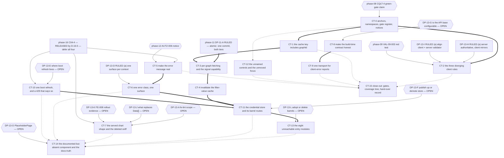

## Owner rulings applied

**`.ai/decisions/ADJUDICATED-2026-10-03-product-owner-rulings.md` — Product Owner, adjudicated by the
Tech Lead, 2026-10-03 — rules five of this plan's fifteen decision records, and its cluster 13 adds nine
rulings on this phase's surfaces.** That file is **the single
authority**: it merges two parallel owner registers and adjudicates every disagreement, and neither input
file may be cited as authority any more. **The clusters this plan consumes are Cluster 4 (cross-tier
ordering — phase 11's `DP-11-A` and phase 16's `D-16-5` — and `CT-3`'s two findings), Cluster 5
(`DP-13-H` and `DP-13-I`) and Cluster 13 (`P1`, `P2`, `P5`, `P6`, `P7`, `P8`, `P9`, `P10`, `P11`).**
**Option letters are not carried across:** the register's letters denote
which *input register* won each decision, not which option in *this plan's* tables was taken — **implement
the words**. Nothing below is this plan's choice, and no option was ruled by default.
**The other ten — `DP-13-A`, `DP-13-E`, `DP-13-F`, `DP-13-G`, `DP-13-J`, `DP-13-K`, `DP-13-L`,
`DP-13-M`, `DP-13-N`, `DP-13-O` — remain open by design and their choosers are untouched**, including
`DP-13-F`, whose ruling sits in Cluster 5 and which this plan deliberately does not consume.

| ID | Ruled | One-line rationale |
| -- | ----- | ----------------- |
| `DP-13-B` | **(a)** — the `queryKey` fix lands **WITH** the `graphId` threading, **in one commit** | Threading `graphId` without adding it to the cache key makes every per-graph fetch collide on one cache entry, and the dashboard then renders **one chart, silently**. **One commit also means the commit spans `src/mkobi` and `frontend/src`**, because phase 11's `DP-11-A` is **ruled atomic — one change spanning both tiers**, with no silent-truncation window |
| `DP-13-C` | **(b)** — render the server's count as **"showing N of M"** | The server is authoritative and **the client must not invent the field** (`R-13-4` stands): `CT-3`'s render path consumes `DP-11-B(c)`'s field and **ships inert if that field does not land** |
| `DP-13-D` | **(a)** — **one surface per context**: a persistent inline message for the main view, the **toast reserved for background refetches and mutations**, which have no inline surface | A user who currently gets both a toast and a banner gets **one**. The interceptor cannot see which surface is displaying a request, so the exemption is **per surface**, not per class |
| `DP-13-H` | **(a)** — the **server is authoritative**; the client mirrors it exactly, and the client's uppercase-only rule is **dropped from the client and NOT added to the server** | The client's rule is stricter than the server's. **No backend file is edited by a client finding** — the option that would have tightened `validate_password_or_raise` for every caller including admin resets is **forbidden**, so `C13-2`'s "nobody owns the backend option" row is **closed** |
| `DP-13-I` | **(a)** — align the client to the **create** rule **AND add a server validator** on the update path | No divergence survives the change. **This ruling's backend half collides with this plan's own `R-13-6` and has no owner** — recorded, not silently absorbed: see `CT-2` and **Conflicts requiring a Coordinator ruling** |

**Two things this note changes beyond the five records.**

1. **`C13-1` is RELEASED.** Plan 16's `D-16-5` (ruled: defer all four, held-by-decision) defers all four unnamed hand-overs, which releases
   phase 13's `CT-5` and `CT-10` from the `errorMessages.ts` / `useAuth.ts` `RATE_LIMIT_EXCEEDED`
   contention — because **there is no phase-16 work in those files for phase 13's work to be additive
   to**. `C16-1` confirms phase 16 executed its ten `CHT` findings and **none names either symbol**.
   **The register entry stays: the contention was real, it was resolved by ruling, and phase 13 must be
   told directly rather than infer the release from silence.**
2. **One cross-plan consistency requirement.** `DP-13-B`(a) and phase 11's `DP-11-A` (ruled: atomic — one change spanning both tiers) are **one
   commit spanning two tiers**. This plan states it; plan 11 must state the same, and the ruling file
   already binds it (*"hard requirement on phase 13's `CT-1` + `CT-3` as **one commit**"*).
3. **One dependency that had no owner on this side, now recorded.** Plan 18 points at **`C05-11`** —
   "the frontend's status renderer" — for the user-visible half of four of its own rulings. **Plan 13 had
   no `C05-*` identifier and no block for it**, so a dependency resolved to nothing. It is registered here
   as **`DP-13-P`**, with its own subsection, and cluster 13's `P1` and `P2` are what make the renderer
   mandatory rather than merely expected. **Nothing blocks on this**: the statuses it renders already
   exist in the shipped backend.

---

# Execution Plan — Phase 13: Client tier remediation

## Purpose

Turn the validated findings of audit phase **13-client-tier** into a dependency-safe execution
sequence. Every block names a **semantic target** (a component, a hook, an API-client function, a
query key, a shared type, an enum mirror, a theme token, a vitest test), the identifiers it
discharges from **both** namespaces, its `blocked_by` set, its execution order, its risk across
**implementation / rollout / regression / compatibility**, the agents it needs, its documentation
impact, its verification, and its definition of done.

The plan fixes **order, isolation and risk containment**. It does **not** fix **implementation
choices** where genuine technical uncertainty exists. Fifteen decision records — **DP-13-A** …
**DP-13-O** — were carried undecided; every block that depends on one states what stays blocked
while it is open and what may proceed under each option. **Five are now ruled by the Product Owner
(2026-10-03 — `DP-13-B`, `DP-13-C`, `DP-13-D`, `DP-13-H`, `DP-13-I`; see `Owner rulings applied`). The
other ten are still open and this plan still chooses none of them.**

**Two constraints shape everything below.**

1. **The frontend gates are red before this phase starts.** Neither `fe-lint` nor `fe-test` is a
   pass/fail gate here, and `check` never reaches the frontend suite at all. See *The frontend gate
   register*.
2. **Running `fe-test` destroys tracked files.** See the same section. It is a definition-of-done
   item on every block that runs the gate, and it is the reason no block in this plan may use a
   coverage number as evidence.

---

## Anchor authority

> **The report's line numbers are not binding.** The report cites `models/dashboard.py:58-64` for a
> character rule that is at `:65` (`VAL-13-001`); it names seven unreachable entry modules where
> there are **eight** (`FE-010`); it counts three `useAuth()` call sites on a route that mounts
> **four**; it says `/dashboards` exhausts the refresh budget in five reloads when it takes
> **six** (`VAL-13-004`); it understates `FE-004`'s credential edges as three where four symbols
> plus two withheld barrel exports have no permitted route; and it misses entirely that
> `GraphDataResponse.layout` is never populated by the server, which makes three of the nine
> `fe-lint` errors sit inside a function that can never run with input.
>
> **Every anchor in this plan is a symbol, a module, a contract, a query key, a type or a config
> key.** Implementors resolve targets by symbol at the moment of work, not by any number recorded
> here or in the report. If a symbol named below does not exist, that is a finding: stop and report
> it rather than substituting the nearest match.

**The Phase-1 code context is authoritative over the report on every location, count, filename and
behaviour**, and is the only document permitted to overrule the report's coordinates. The report
remains authoritative on identifier identity, bands and merge rulings. Where the two disagree about
*where* something is or *what it does*, the code context wins; where they disagree about *identity*,
the report's identifier set wins and the code context's numbering is recorded as a defect.

> **The precedence rule, stated in words because frontmatter alone does not enforce it.** Two
> different questions get two different winners, and conflating them is how a coordinate drift turns
> into an edit in the wrong file.
>
> | The disagreement is about | The authoritative source is | The loser's claim becomes |
> | -------------------------- | -------------------------- | ------------------------- |
> | **Where** something lives, or **what the code does** — a line range, a file, a function name, a count of sites, a row's value, whether a path is populated at all | **The Phase-1 code context** | Nothing. Apply the code context's version. A materially different report coordinate is logged in the drift list; the log records the correction, it does not create a remediation item. |
> | **Identity** — which finding exists, which band it carries, who owns it, which two findings are one finding | **The report's identifier set** | A recorded defect in the code context's numbering, not a licence to renumber. No `FE-*` or `VAL-13-*` identifier is renumbered, merged, re-typed or dropped; where the code context numbers something differently, that is a defect **in the code context** and is recorded as one. |
>
> The second row is what makes the first safe: because identity never moves, an implementor can
> correct every coordinate by symbol with no risk of fixing the wrong finding.

**Concurrent work is live in this repository.** At plan time `HEAD` was `ab76989`; the working tree
carried 15 deleted tracked `frontend/coverage/**` files and modifications confined to
`docs/06-backend/configuration.md`, `db/advisory_lock.py`, `workers/data_worker.py` and two
backend tests. **No `frontend/src/**` file was dirty** — every anchor below was read from disk at
`ab76989`. Re-check `git status` at each block start; a dirty `frontend/src` file means another
owner has landed something in this phase's territory and the block must re-read before editing.

### The phase-1 additions no report made, restated as anchors

| # | What the code context added | Where it lives |
| - | --------------------------- | ------------- |
| **A-1** | `useAuth()` returns `accessToken: getToken()` — a **plain render-time read that subscribes to nothing**. Only the four query hooks in `dashboardApi.ts` use the reactive `useAuthToken()`. | `features/auth/model/useAuth.ts::useAuth` |
| **A-2** | The refresh handler is registered as a **module side effect** at `features/auth/api/authApi.ts` (`registerRefreshHandler(refreshToken)`), not by `useAuth`. The 401 interceptor path (`getRefreshHandler()`) and the boot path (`apiRefreshToken()`) are **two different refresh mechanisms**. | `shared/api/refreshHandler.ts::registerRefreshHandler` / `::getRefreshHandler` |
| **A-3** | `useAggregatedData`'s `enabled` gate is `!!dashboardId && !!accessToken` — it does **not** include `graphId`. Threading a per-graph call site without extending the gate sends `graph_id=''` on the first render, and `graph_id` is a `UUID \| None` query parameter. | `features/dashboards/api/dashboardApi.ts::useAggregatedData` |
| **A-4** | The `useAuth` boot effect's `RATE_LIMIT_EXCEEDED` arm and its `else` arm are **byte-identical** (`removeToken(); setUser(null)`), and the toast the 429 arm's comment says it avoids is already suppressed by the interceptor. The class check buys nothing today. | `useAuth.ts` boot effect catch block |
| **A-5** | Five sibling `errorMessages.ts` files exist under `features/*/model/` and the interceptor **never passes one as `getErrorMessage`'s second argument**, so the feature-map tier of the message surface is **dead on the toast path**. FE-002's "record the decision in `errorMessages.ts`" is a **six-file** surface. | `shared/api/axiosInstance.ts` response interceptor · `shared/api/errorMessages.ts::getErrorMessage` |
| **A-6** | `features/dashboards/index.ts` **withholds** `useFilterValues` and `useInvalidateDashboard`, both of which internal paths consume. Under FE-004's own remedy ("publish what is actually consumed") these are two more symbols needing a barrel route. | `features/dashboards/index.ts` |
| **A-7** | `docs/07-frontend/fsd-structure.md` specifies a `PlaceholderPage` component with a full usage-guidelines section. The file **does not exist** and nothing imports it. Under the project's dead-code policy (`.kilo/agents/auditor.md`: *dead code is only when not documented*; *the recommendation should be to investigate purpose, not delete*) this is **future-proofing, not dead code**. | `docs/07-frontend/fsd-structure.md` |
| **A-8** | `api.types.ts` is **entirely hand-written** — 30 interfaces, nothing generated from OpenAPI, nothing validated at runtime. `AGENTS.md`'s "share types via OpenAPI" is satisfied in form, not in substance. `FE-007` is the chart-boundary instance; the same gap holds for every other response family and **no finding names it**. | `shared/types/api.types.ts` |
| **A-9** | `LogViewer`'s inline `useQuery` carries **no `enabled` gate and no token check** — the one query in the client that will fire unauthenticated. Named by no finding. | `features/admin/ui/LogViewer.tsx` |

---

## The two namespaces, and which is authoritative for what

`FE-001`…`FE-010` are the audited phase's own identifiers, preserved unrenumbered in the report's
Validated Findings table. `VAL-13-001`…`VAL-13-006` are the validation run's own findings; the flat
`VAL-` prefix was already occupied by phases 01 and 02 (`VAL-13-005`), so the compound form was
adopted and the deviation recorded. **The report's frontmatter says `findings: 6` and
`by-severity: CRITICAL:0 HIGH:0 MEDIUM:5 LOW:1`, which counts only the `VAL-13-` half. This plan
covers all sixteen.**

| question | authoritative source | rule this plan applies |
| -------- | --------------------- | ------------------------ |
| Does this defect exist, what is it called, which band does it carry, who owns it? | **`FE-*`** | No `FE-*` identifier is renumbered, reused, merged away or dropped. |
| Which recommendations are unsafe as filed, and which verification is wrong? | **`VAL-13-*`** | Each is applied as a ruling inside its block and repeated in that block's "does not do" line. |
| Where is everything, and what does it actually do? | **The Phase-1 code context** | It overrules every report coordinate, count and filename. |
| What must not be executed? | **`VAL-13-001`, `VAL-13-002`, `VAL-13-005`** | Three recommendations in the report are refuted or withdrawn; see the rulings table. |

**Construction rule for every block below:** a block's *Discharges* line names identifiers from
**both** namespaces where both apply, and every one of the sixteen appears in the coverage ledger.
The only identifier that discharges into no block is `VAL-13-005`, and that is a ruling, not an
omission.

---

## Scope rulings (binding on every implementor)

**In scope — sixteen identifiers.**

| Namespace | ID | Band carried | Short name | Blocks |
| --------- | -- | ------------ | ---------- | ------ |
| `FE-` | FE-001 | HIGH | Four independently-mounted `useAuth()` instances spend one server-side refresh budget; a 429 clears the session with no message | CT-10 |
| `FE-` | FE-002 | HIGH | One failed fetch raises a toast **and** an inline banner **and** leaves stale charts on screen | CT-5, CT-6 |
| `FE-` | FE-003 | MEDIUM | `ErrorBoundary` owns a second hard-coded API base and an unwatchable reporter | CT-9 |
| `FE-` | FE-004 | MEDIUM | The credential store is a feature's private module, reached into by shared code and two features | CT-11 |
| `FE-` | FE-005 | MEDIUM | `VITE_API_URL` is declared mandatory and consumed by nothing | CT-8 |
| `FE-` | FE-006 | MEDIUM | The client is stricter than the server in three places and looser in one | CT-2 |
| `FE-` | FE-007 | MEDIUM | The chart payload is declared as Plotly traces; the server sends row dictionaries | CT-7 |
| `FE-` | FE-008 | MEDIUM | A second conversion path taken by accident renders a wrong chart, silently | CT-7 |
| `FE-` | FE-009 | LOW | The account button and every range filter carry no accessible name; nothing moves focus on route change | CT-12 |
| `FE-` | FE-010 | MEDIUM | Eight of nine declared entry modules are imported by nothing | CT-13 |
| `VAL-13-` | VAL-13-001 | MEDIUM | `DashboardCreate` enforces the name character rule; FE-006's fourth row is refuted and Roadmap Step 4 inverts the divergence | CT-0, CT-2 |
| `VAL-13-` | VAL-13-002 | MEDIUM | The traces are not untyped, so they do not render blank — they render **wrong**, and "a chart appears" is not a verification | CT-0, CT-7 |
| `VAL-13-` | VAL-13-003 | MEDIUM | `['filterValues', …]` is a server-derived value the client never refetches and never invalidates | CT-4 |
| `VAL-13-` | VAL-13-004 | LOW | The headline is six reloads, not five; and `/` mounts four `useAuth()` instances, not two or three | CT-0, CT-10 |
| `VAL-13-` | VAL-13-005 | MEDIUM | The flat `VAL-` namespace collides across the phase-01 and phase-02 reports | **none** — `DP-13-M`, `C13-12` |
| `VAL-13-` | VAL-13-006 | MEDIUM | PERF-001's client half was assigned to phase 13 and never filed; FE-002 is a different concern | CT-1, CT-3 |

**Rulings applied by this plan (each restated in its block).**

| # | Ruling |
| - | ------ |
| **R-13-1** | **Neither frontend gate is a pass/fail gate.** `fe-lint` is a delta gate: the nine known errors must not change, and no block's own files may gain a new one. `fe-test` passes at **169 passed** and at **170/0** after CT-2; it is red on exactly one test until then. A green gate is never evidence for any block in this plan. |
| **R-13-2** | **The audit corpus is an input, never a target.** No block edits `.ai/audit/**` or any sibling plan. `VAL-13-005`'s remedy, `VAL-13-001`'s recommendation to strike a row from the report, and `VAL-13-002`'s recommendation to restate a title are **documentation-phase work this plan does not perform**; this plan records the corrected scope so the implementor cannot execute the unsafe instruction. |
| **R-13-3** | **The `queryKey` fix and any `graphId` threading are inseparable — RULED as ONE COMMIT on 2026-10-03 (`DP-13-B`(a)), not two blocks.** `C11-8` is the phase's highest-risk hand-in; the correctness trap is named in CT-1 and the ruling removed the sequence that contained it. **What the ruling does not remove is the requirement itself: the key must carry the parameter the request carries, and the key-shape test must be shown failing before the fix.** |
| **R-13-4** | **No truncation signal is planned that presumes a server `LIMIT`.** `data.py` has **no `LIMIT` anywhere** at `ab76989`; a client-only "partial graph set" affordance today signals a truncation the server is not performing and masks the CRITICAL that is. **RULED 2026-10-03: `DP-13-C` = (b) — the client renders the SERVER'S count as "showing N of M", and with phase 11's `DP-11-A` (ruled: atomic — one change spanning both tiers) the bound and the signal ship in the same commit. `R-13-4` is NOT relaxed by that: the count is `DP-11-B(c)`'s field, the client must not invent it, and if the field does not arrive the render path ships inert and says so.** |
| **R-13-5** | **`FE-006`'s Roadmap Step 4 is narrowed to three rules before it is executed.** The name-character rule is enforced server-side; executing "drop or serverise" literally **inverts** a closed divergence into a reachable 422. CT-2 carries the narrowed scope verbatim. |
| **R-13-6** | **No backend file is edited from a client finding.** `FE-006`'s `new_password` option (b) would edit `src/mkobi/utils/validators.py` and change `change_password` for every caller including admin-initiated resets. That is a backend change in another phase's territory; CT-2 records the boundary and takes the client-side options only. **RULED 2026-10-03: `DP-13-H` = (a), so this boundary is not crossed for `new_password` — the option is closed and needs no owner. `DP-13-I` = (a) does require a server validator, which is the one place the ruling crosses it; that half is recorded as unowned (`X-13-R1`) and this plan performs only the client half.** |
| **R-13-7** | **`FE-008`'s verification is replaced, not kept.** "Confirm the intended chart appears" passes in the broken case (a one-point `scatter` is a chart appearing). CT-7's roll-out check is a **trace-count and axis-category** assertion. |
| **R-13-8** | **Running `fe-test` wipes 15 tracked files and writes no replacement.** Restoring `frontend/coverage/` is a definition-of-done item on every block that runs the gate, and the phase's own close-out in CT-15 confirms it. **No block may commit the absence of the directory**, and no coverage percentage is admissible as evidence anywhere in this phase. |
| **R-13-9** | **The three `ChartRenderer.tsx` lint errors are unowned.** They sit in `convertChartLayoutToPlotly`, a function **no finding names** — and that function can never run with input, because the server never populates `GraphDataResponse.layout`. CT-7 must state explicitly whether they are in or out of its scope; `DP-13-A` is the gate and this plan does not pick. |
| **R-13-10** | **The `any` ban is a rule, not a gate.** `AGENTS.md` §9 and `.kilo/rules/project.md` §9 say "avoid `any` completely"; `.ai/context/react-code-standards.md` says "unless absolutely necessary and explicitly justified" — materially weaker; `eslint.config.js` carries **no** `no-explicit-any` rule. `frontend/src` has **zero** explicit `any` today. **A lint-config change is phase 08's file, not a client finding's** — see `C13-9` and the out-of-scope table. |
| **R-13-11** | **`PlaceholderPage.tsx` is documented-but-absent, therefore not dead code.** The project's policy is explicit: dead code is only dead when *not* documented, and a dead-code recommendation should investigate purpose rather than delete. CT-14 investigates; nothing in this plan deletes it. |
| **R-13-12** | **No new gate is added.** There is no `fe-typecheck` target and this plan does not create one; `Makefile.ps1` is a shared build surface. TypeScript is verified where it already is verified — by `npm run build`, which writes `frontend/dist`, the untracked host directory phase 10's `OPS-003` names. |
| **R-13-13** | **One implementor at a time, and shared files are serialised.** `DashboardView.tsx` is an edit target of CT-3, CT-4, CT-5, CT-6 and CT-11; `axiosInstance.ts` of CT-5, CT-6, CT-8 and CT-11; `dashboardApi.ts` of CT-1, CT-3, CT-4 and CT-11; `Header.tsx` of CT-5, CT-11 and CT-12; `ChartRenderer.tsx` of CT-7 alone. The execution order in this plan is the file-serialising order, not an arbitrary one. |
| **R-13-14** | **No coverage number, and no lint count, is a defect's evidence.** Phase 09 owns `vite.config.ts`'s thresholds and the tracked coverage report (`TST-004`, `TST-014`). A block that quotes a coverage percentage to justify a frontend change is out of contract. |

**Out of scope — do not implement here.**

| Item | Home | Note for this phase |
| ---- | ---- | ------------------- |
| **`PERF-001`'s server `LIMIT`** — the unbounded aggregate read | **phase 11** `PRF-4` + `DP-11-A`/`DP-11-B`, `C13-3` | `data.py` has no `LIMIT` at `ab76989`. The server half and the client half are one change, ordered by `DP-11-A`; phase 11's own `R-11-4` states that no `LIMIT` lands before the client can signal truncation. |
| **The truncation signal's data source** — a total-count field on the aggregated response | **phase 11** `PRF-4` under `DP-11-B(c)`, `C13-4` | `tests/test_openapi.py` and the response model are phase 11's. CT-3 builds the client's ability to render a signal; it must **not** invent a field. |
| **`new_password` option (b)** — add the uppercase rule to `validate_password_or_raise` | **forbidden by ruling 2026-10-03** (ADJUDICATED register, Cluster 5) — `DP-13-H`(a); `C13-2` seam, `R-13-6` | Edits `src/mkobi/utils/validators.py` and changes `change_password` for every caller, including admin-initiated resets. **The owner ruled (a): the server's rule is correct as it stands and the client's stricter rule is NOT added to it.** No backend finding is to be filed for this — the option is closed, not unowned. |
| **`updateDashboardSchema.name`** — the client is stricter than the server on the *update* path, which no finding names | **`DP-13-I`, ruled (a), 2026-10-03 — the client half is CT-2's; the server half is unowned** (`X-13-R1`) | `.min(1).max(100)` with no regex against `DashboardUpdate.name`, which has no bound at all, and `update_dashboard` does not re-run `validate_name`. **Ruled (a): align the client to `DashboardCreate`'s rule AND add the server validator.** The client half lands here; the server validator is a backend edit this plan may not make and no phase owns — **recorded as `X-13-R1`, not absorbed.** |
| **The chart *presentation* contract** — `xCol`/`metricCols`/`orientation`/`barmode` defaults living in the adaptation layer, and the dead `convertChartLayoutToPlotly` | **phase 16**, `C13-6` | `VAL-13-002`'s ownership ruling hands phase 16 the *consequence* of deleting the sniff, not the fix. CT-7 must read phase 16's material before designing, because both halves are one function. |
| **Generating `api.types.ts` from OpenAPI** (`DP-13-J` option (c)) | **nobody** | No generator exists, `AGENTS.md`'s "share types via OpenAPI" is aspirational, and adopting a generator is a build-surface change the project rules call overengineering for a MEDIUM finding. Recorded (`A-8`), not built. |
| **Enforcing the `any` ban** — adding `no-explicit-any` to `eslint.config.js` | **phase 08** (`CQLT-*`), `C13-9` | The wording conflict between `AGENTS.md` §9 and `react-code-standards.md` is a documentation defect CT-14 records; the rule change is a lint-config change, which is phase 08's subject. |
| **Adding a `fe-typecheck` target** to `Makefile.ps1` | **nobody; a build-surface change**, `R-13-12` | The gap is real and worth naming: TypeScript is checked only by `npm run build`. But `Makefile.ps1` is shared by every phase's verification and adding a target is not a client finding's remedy. |
| **`LogViewer`'s missing token gate** (`A-9`) | `CT-6`, by decision | The one query in the client that will fire unauthenticated. `FE-002` names `LogViewer` for the *failure-surfacing* class only. Adopting the token gate inside CT-6 is scope beyond the finding and needs the owner's word; recording it is not. |
| **The `VAL-` namespace collision across the phase-01 and phase-02 reports** | **the coordinating validator**, `DP-13-M`, `C13-12` | The report rules it out of phase 13's write scope and this plan accepts that ruling. **No block.** Recorded so no one opens one. |
| **Phase 07's `DP-6` frontend field census** | **phase 07's own block `EB-5`**, `C13-10` | A sibling plan mints `DP-6` twice for unrelated decisions. Neither is a hand-over to phase 13. |
| **Phase 08's `D-08-6` / `D-08-7`** | **phase 08, backend-only** | `pyproject.toml`, `app.py`, six route modules. Nothing in `frontend/src`. |
| **Frontend test coverage generally** | **phase 16**, via phase 09's `TST-004` and `TST-014`, `C13-8` | Blocks here add the specific tests their own fixes require and no others. |
| **`docs/07-frontend/architecture.md`'s other paragraphs** | **phase 16 / the documentation phase** | CT-14 edits only the interceptor description that FE-002's decision makes false. |
| **Any `fe-lint` repair not caused by a phase-13 edit** | `DP-13-A`, `C13-9` | The six non-`ChartRenderer` errors are in `DashboardView.tsx` and `filter-persistence.test.tsx`. CT-5, CT-6 and CT-12 edit those files and must state the delta; whether the phase *owns* the pre-existing errors is `DP-13-A`'s question and is not this plan's to answer. |

---

## The frontend gate register

**This section is binding on every block.** It is the precondition, not a starting position.

| Gate | Command | Result at `ab76989` | How this plan may use it |
| ---- | ------- | -------------------- | ------------------------- |
| `fe-lint` | `.\Makefile.ps1 fe-lint` → `npm --prefix frontend run lint` → `eslint .` | **RED — 9 errors, 0 warnings** | **Delta gate only.** Record the nine; require that they do not change and that the block's own files gain no new error. Never "pass/fail". |
| `fe-test` | `.\Makefile.ps1 fe-test` → `npm --prefix frontend run test` → `vitest run --coverage` | **RED — 1 failed / 169 passed, 13 files, 170 tests** | **Passes at 169 passed** until CT-2, then at **170/0**. The single red is phase 09's. |
| `check` | `.\Makefile.ps1 check` → `lint → typecheck → fe-lint → fe-test`, short-circuiting | **Stops at `fe-lint`; never reaches `fe-test`** | **Not evidence for anything in this plan.** A `check` that "passes" cannot happen at `ab76989` without CT-7's and CT-8's decisions landing. |
| frontend typecheck | **no target exists** | — | Verified only by `npm --prefix frontend run build` (`tsc -b && vite build`), which **writes `frontend/dist`** — phase 10's untracked host directory (`OPS-003`, `C13-11`). `R-13-12`. |
| `fe-install` | `.\Makefile.ps1 fe-install` → `npm --prefix frontend ci` | must have been run once per session | A precondition of both gates. |

**The nine `fe-lint` errors, by file and rule.**

| File | Rules | Owner |
| ---- | ----- | ----- |
| `shared/components/../features/dashboards/ui/charts/ChartRenderer.tsx` — 3 errors, all `no-unnecessary-type-assertion`, all inside `convertChartLayoutToPlotly` | the three `as Partial<Layout>['…']` assertions | **unowned** — no finding names this function, and the function cannot run with input (`R-13-9`, `DP-13-A`, CT-7) |
| `features/dashboards/ui/DashboardView.tsx` — 2 `no-unsafe-member-access` on the untyped `location.state.preserveFilters`, 1 `react-hooks/set-state-in-effect` | CT-5, CT-6, CT-11 and CT-12 all edit this file | pre-existing; the block that edits it must state the delta |
| `features/dashboards/__tests__/filter-persistence.test.tsx` — `no-unsafe-return`, `no-unsafe-assignment`, `require-await` | CT-7's fixture migration may touch this file | pre-existing; `R-13-D` is not claimed |

**The coverage hazard, stated once and binding everywhere.** `vite.config.ts` sets
`coverage.provider: 'v8'`, `coverage.reporter: ['text','json','html']` and thresholds. The reporter's
clean step empties the output directory before writing, and a **red** suite writes no report.
`frontend/coverage/` is **tracked — 15 files** — and all 15 are currently recorded as unstaged
deletions. **Running `fe-test` therefore removes the directory and leaves no replacement; it does
not restore it and does not create a new one.** The Phase-1 Auditor reproduced this twice.
Consequences, all binding:

- Every block that runs `fe-test` carries `git checkout -- frontend/coverage` in its definition of
  done, and must confirm `git status --porcelain -- frontend/coverage` is clean before it closes.
- `eslint.config.js` `globalIgnores(['dist','coverage'])` excludes the tracked report from `fe-lint`,
  so **a wiped coverage tree is invisible to the lint gate**. Only `git status` shows it.
- **No coverage percentage is admissible as evidence for any block in this plan** (`R-13-14`).
- A targeted run that must not touch the tree is
  `npm --prefix frontend exec -- vitest run <path>` — the same binary without `--coverage`, which
  skips the reporter's clean step entirely. `npm --prefix frontend run test -- <path>` keeps
  `--coverage` and **does** wipe.

**Toolchain friction every implementor will hit.**

- `tsconfig.app.json` has `verbatimModuleSyntax: true` — type-only imports must be `import type`, and
  an existing value import cannot be silently narrowed.
- `erasableSyntaxOnly: true` is why `shared/types/enums.ts` uses `as const` objects and derived
  union types rather than `enum`. The project rule "use `StrEnum` for all constants" is met on the
  client by this mirror, not by `enum` declarations.
- `noUnusedLocals` / `noUnusedParameters` are on: deleting a function or a destructure in
  `ChartRenderer.tsx` orphans imports and bindings, and `npm run build` is what will say so.
- `strict: true` with `noFallthroughCasesInSwitch` and `noEmit`. **Nothing enforces the `any` ban**
  (`R-13-10`). What *does* fire is the `no-unsafe-*` family — `any` **leaking through** a typed
  surface, which is exactly the `location.state` defect on `DashboardView.tsx`.

---

## Block map



`solid` = hard dependency (a blocker). `double` = hard sequencing required by the report, by a
ruling, or by file contention under `R-13-13`. `dotted` = recommended sequencing in the
single-implementor queue, **not** a data dependency. Decision nodes are gates, not blocks. **A diamond
means an OPEN decision: it is still a diamond on `DP-13-A`, `DP-13-E`, `DP-13-F`, `DP-13-G`,
`DP-13-J`, `DP-13-K`, `DP-13-L` and `DP-13-O`, and on the three cross-plan seams that are not
decisions.** **Five nodes lost their diamond on 2026-10-03** — `DP-13-D`, `DP-13-H`, `DP-13-I` and
phase 11's `DP-11-A` (all ruled) and `P16`, whose contention is **released** by plan 16's
`D-16-5` (ruled: defer all four, held-by-decision). **The edges are unchanged on purpose:** a ruled record is still a record that must exist
before the block it gates starts, and a released contention is still a position that must be recorded
in the commit body.

### Coverage ledger — all sixteen identifiers, both namespaces

| Block | Findings discharged | Root-cause group | Agents |
| ----- | ------------------- | ----------------- | ------ |
| CT-0 | VAL-13-001 (narrowing applied), VAL-13-002 (verification replaced), VAL-13-004 (headline corrected), VAL-13-005 (ruled: no block) | report integrity and gate baseline | — (delivered by this plan) |
| CT-1 | VAL-13-006 (key half), `C11-8` | cache identity | Auditor, Researcher, Planner, Validator |
| CT-2 | FE-006 (three of four rows), VAL-13-001 | client/server rule divergence | Auditor, Planner, Validator |
| CT-3 | VAL-13-006 (threading half) | cache identity + request shape | Auditor, Planner, Validator |
| CT-4 | VAL-13-003 | server-derived value lifetime | Planner, Validator |
| CT-5 | FE-002 (message half) | failure surfacing | Auditor, Planner |
| CT-6 | FE-002 (surfacing half) | failure surfacing | Auditor, Researcher, Planner, Validator |
| CT-7 | FE-007, FE-008, VAL-13-002 | declared-vs-served contract | Auditor, Researcher, Planner, Validator |
| CT-8 | FE-005 | build-time contract | Auditor, Planner, Validator |
| CT-9 | FE-003 | request path | Planner, Validator |
| CT-10 | FE-001, VAL-13-004 (mechanism note) | session continuity | Auditor, Planner, Validator |
| CT-11 | FE-004 | slice boundaries | Auditor, Planner, Validator |
| CT-12 | FE-009 | interactive semantics | Planner, Validator |
| CT-13 | FE-010 | reachability of declared surfaces | Auditor, Planner |
| CT-14 | documentation impact of FE-002, FE-004, FE-005, FE-010 + `A-7` | documentation truth | Auditor, Planner |
| CT-15 | the phase's exit criteria | gate restoration | Validator |

**Merges and splits, with reasons.**

- **FE-007 + FE-008 merge into CT-7.** Both are the same function. `FE-008`'s sniff sits *inside*
  `convertToPlotlyData`, and `FE-007`'s remedy deletes the two casts in the same function. Splitting
  them would produce two commits editing one function and two reviews of the same conversion path —
  and, worse, an intermediate state in which the type lies and the sniff has gone, so the wrong
  render survives with nothing left to explain it. The report's own ownership ruling says the same
  thing: routing FE-008 to phase 16 "would put two owners on one function in one commit and neither
  would finish it."
- **FE-002 splits into CT-5 and CT-6** because the report's own Rollout Safety names a hard coupling
  and a separable half. "If the toast is the one removed, the user's message gets worse unless those
  switch to `extractApiError` in the same change — do both or neither" couples the *message-quality*
  work to the *surface-exclusivity* work, in that order. The message half (two hard-coded English
  strings that bypass the extraction chain entirely) is **additive and correct under every option of
  `DP-13-D`**, so it can and must land first: after CT-5, whichever surface survives in CT-6 already
  carries the real message. Splitting here is what makes the "do both or neither" rule survivable.
- **FE-003 splits from FE-005 into CT-9 after CT-8** because the two are *the same one-line edit*
  only under `DP-13-G(b)`. Under `DP-13-G(a)` — delete the declaration and the consumer — there is no
  single declared source for `ErrorBoundary` to read, and `FE-003`'s independent half (a
  `.catch(() => {})` that makes the reporter unwatchable) still has to be fixed. Merging them would
  force CT-9 to wait on a decision it does not need.
- **FE-006 is not split** even though it has three surviving rows plus a test correction. All three
  rows are one file (`shared/types/formSchemas.ts`), one direction (the server's rule is the enforced
  one in every surviving case), and one test file. Splitting would produce three commits rewriting
  the same Zod object and would leave the suite red in between for no reviewable gain.
- **FE-010 is not merged into FE-004** even though they share every barrel file. `DP-13-F` (publish
  upward, or demote the credential store) and `DP-13-L` (adopt the barrels, or delete them) are
  **conflicting recommendations about the same files with opposite defaults**, and merging them
  would silently pick one. CT-13 is sequenced *after* CT-11 and must read its outcome.
- **`PlaceholderPage.tsx` is a decision, not a block.** CT-14 carries the documentation-truth work
  that is executable; whether to create the component, strike its documentation, or leave both
  standing is `DP-13-O`, and the project's dead-code policy forbids the deletion answer as a default.

---

## CT-0 — Anchors, namespaces, the gate register, and the two notifications

**Discharges:** VAL-13-001 (narrowing applied), VAL-13-002 (verification replaced), VAL-13-004
(headline corrected), VAL-13-005 (ruled: no block) · **Blocked by:** nothing · **Blocks:** nothing
(hard); every block (sequencing) · **Execution order:** 1 · **Risk:** none — it is a constraint on
later blocks, not work · **Agents:** none beyond Implementor

**Semantic target.** This plan's own frontmatter, *Anchor authority*, *Scope rulings* and *The
frontend gate register*; plus two notifications that are deliverables in their own right.

**What this block does.** It records, as a written note, everything an implementor must not
re-derive:

1. **The two namespaces and the sixteen identifiers**, and that the report's `findings: 6` counts
   only the `VAL-13-` half.
2. **The three refuted or withdrawn recommendations**, so nobody executes them:
   - `VAL-13-001` — FE-006's Roadmap Step 4 says *"drop or serverise the uppercase and name-character
     rules"*. `DashboardCreate` enforces the name-character rule character-for-character, message
     string included. Executing Step 4 as filed **inverts** a closed divergence into a reachable 422.
     Step 4 is narrowed to three rules in CT-2.
   - `VAL-13-002` — FE-008 does not render a blank plot area; by the sniff's own guard the objects
     carry `x` and `y` as **scalars**, and the trace `type` attribute has `dflt:"scatter"` in the
     shipped Plotly build, so they draw **one marker per graph inside a correctly-labelled frame**.
     The remedy is unchanged; the verification is replaced (CT-7, `R-13-7`).
   - `VAL-13-004` — the headline is **six** hard reloads on `/dashboards`, not five. The limiter
     refuses on `>=` *before* incrementing, so attempts 1–10 pass and **attempt 11** is refused.
     And the instance count is worse than either report's: `/` mounts **four** `useAuth()` copies
     (`AppLayout` → `Header` + `RootRedirect` as siblings, plus the route guards), so `/` reaches
     attempt 11 on the **third** reload. The cheapest route to exhaustion is the one neither report
     counted.
3. **`VAL-13-005` — no block.** The flat `VAL-` namespace is minted by both the phase-01 and the
   phase-02 validation reports, so `VAL-001`…`VAL-008` each name two different findings. The
   report rules the repair to the set-wide namespace block; the brief forbids editing audit files;
   this plan accepts the ruling and opens nothing. `DP-13-M`, `C13-12`.
4. **The gate register** — reproduced above and binding.
5. **Two notifications** (deliverables, not coordination items waiting for a reply):
   - **To phase 12, before `AUTZ-006`'s error-code mapping moves.** Phase 12's own code context
     requires phase 13 to be told first, because `errorHandler.ts` switches on `code` and
     `features/admin/model/errorMessages.ts` is the consuming side of `PERMISSION_DENIED` and
     `VALIDATION_ERROR`. **Phase 13 owns no edit there; it owns the notification.** CT-5 is the
     block that touches the code-consuming surface, so the notification precedes CT-5. `C13-2`.
   - **To phase 16 and plan-04, of the `C04-4` contention.** Phase 16 is handed
     `errorMessages.ts` and `useAuth.ts`'s `RATE_LIMIT_EXCEEDED` branch; those are **the exact two
     locations CT-5 and CT-10 must edit**. This plan does not resolve it and does not proceed past it
     silently — see `C13-1`, **whose hard block on two blocks was RELEASED by plan 16's `D-16-5` (ruled: defer all four, held-by-decision) on
     2026-10-03; the collision is recorded, not withdrawn.**
6. **The dead-code policy application** (`R-13-11`): `PlaceholderPage.tsx` is specified in
   `docs/07-frontend/fsd-structure.md` with a usage-guidelines section, is absent from disk and from
   every import. The project's policy is that dead code is only dead when **not** documented and that
   a recommendation should investigate purpose rather than delete. CT-14 investigates; `DP-13-O`
   decides.

**What this block explicitly does not do.** It does not edit
`.ai/audit/99-validation/13-client-tier-validated-findings.md` or
`.ai/audit/13-client-tier/findings.md`; it does not repair the report's coordinates, its title, or
its Step 4. **The audit corpus is an input, never a target** (`R-13-2`). It does not run Docker,
start the dev stack, or modify any environment. It does not run `fe-test` — CT-0 must not be the
run that wipes the coverage tree.

**Risk.** Implementation: none. Rollout: none. Regression: none. Compatibility: none.

**Documentation impact.** This plan only. `docs/SPEC.md` gains one version row per block that
changes behaviour, not one per block.

**Verification.** That all sixteen identifiers appear in the coverage ledger above; that each of the
three refuted recommendations appears as a "does not do" line inside its block; that the two
notifications have named recipients; and — re-read, do not re-run — that `git status --porcelain --
frontend/coverage` shows the 15 deletions as they were at `ab76989`, so CT-0 has changed nothing.

**Definition of done.** This section is read by every implementor. Both notifications sent and their
recipients named. No audit file, sibling plan, production file, or tracked file touched.

---

## CT-1 — The cache key includes `graphId` (VAL-13-006, the `C11-8` half that is a correctness defect)

**Discharges:** VAL-13-006 (**both halves under the ruled `DP-13-B`(a)** — the key fix and the `graphId`
threading, **in one commit**), `C11-8`, `A-3` · **Ruled by:** `DP-13-B` **(a), Product Owner 2026-10-03**
· **Blocked by:** nothing · **Blocks:** CT-3 (**which is now the same commit**, not a later one), CT-4
(sequencing) · **Execution order:** 2 · **Risk:** **HIGH implementation**, LOW rollout, MEDIUM
regression, MEDIUM compatibility · **Agents: all four**

> ### ⚠ RULED: `CT-1` and `CT-3` ARE ONE COMMIT — AND IT SPANS TWO TIERS.
>
> **`DP-13-B` is ruled (a) by the Product Owner on 2026-10-03: the `queryKey` fix lands WITH the
> `graphId` threading, in the same commit.** Phase 11's **`DP-11-A` is ruled — atomic, one change spanning both tiers** — the server bound and
> the client signal land **atomically, in one change**, with **no silent-truncation window and no
> unbounded interim** — so **this single commit spans `src/mkobi` and `frontend/src`**: two review
> surfaces, one revert taking both. **Neither implementor may assume a single-tier change**, and the
> ruling file states the cross-tier requirement itself: *"hard requirement on phase 13's `CT-1` +
> `CT-3` as **one commit**."*
>
> **`C11-8` — the `queryKey` omission — remains a hard requirement and is not softened by the merge.**
> It is *why* the two halves are one commit: threading without the key is the silent one-chart defect,
> and the key without the threading is inert. **Neither order is safe alone; together they are one
> change.**
>
> **`CT-3` is retained below as the design and verification record for the half that lands here**, not
> as a second step. Its three parts — the call site, the per-graph structure, and the `enabled` gate —
> are in this commit, and the key test and the N-graphs-N-entries check are **one test deliverable**.

**Semantic target.** `features/dashboards/api/dashboardApi.ts::useAggregatedData` — specifically its
`queryKey`, which today is `['aggregatedData', dashboardId, filters]`. The sibling
`invalidateAggregatedData` inside the same file's `::useInvalidateDashboard` uses the **prefix**
`['aggregatedData', dashboardId]` and is therefore already correct for per-graph entries; **only the
entry key is wrong.** New test: a vitest test that asserts the key's shape, placed in the feature's
existing test directory (`features/dashboards/__tests__/` — the hook has **no** test today, and
`queryKey` is unreachable from any test in the repository, which is exactly `C11-8`'s "no test
covers it"). **Plus, under the ruled `DP-13-B`(a), the threading half** named in `CT-3` below: the
`DashboardView.tsx` call site, the per-graph structure, and the `enabled` gate.

**Problem — named precisely, because it is the phase's highest-risk item.**
`useAggregatedData(dashboardId, filters?, graphId?)` already accepts `graphId` and already serialises
`graph_id: graphId` into the request. **The key omits it.** Threading `graphId` from the call site
without changing the key makes every per-graph fetch **collide on one cache entry**: graph 2's
response overwrites graph 1's, and `DashboardView` maps `aggregatedData.graphs` by
`key={graph.graph_id}` over a **one-element** array — so the dashboard renders **one chart,
silently**, with no error, no toast, no console message. `invalidateQueries` keeps working, because
its key is a prefix. Nothing surfaces the collision.

**The failure mode is a wrong number on screen.** It is not an error state, not a degraded state,
and not an empty state. If phase 11's server `LIMIT` lands first, the symptom a user reports is
*"my dashboard lost a chart"*, and the natural response is to look at the server rather than at the
key. This is the case the report itself warns about — a frontend fix disguising a backend
correctness bug — arriving in the direction nobody is looking.

**What this block does.** **Two things, in one commit, under the ruled `DP-13-B`(a).** First: it adds
`graphId` to the key array. Second — **newly in scope by ruling** — it threads `graphId` from the call
site, together with the `enabled` gate and the per-graph structure that `CT-3` specifies.

**The behaviour-neutrality argument that made the key fix landable on its own, and what survives it.**
At `ab76989` every call site passes two arguments, so `graphId` is `undefined` and the new element is
a stable `undefined` in the hash — which is why a key-only commit was provably safe and why
`CT-1`'s Researcher task was to **measure** how `@tanstack/query-core@5.101.0` hashes an explicit
`undefined` element. **Under (a) that interim state never exists**: the commit that changes the key
also supplies the argument, so the key and its consumer land together and there is no window in which
either is alone. **The measurement is still required and is now a precondition of the merged commit** —
it establishes that the *key shape* is right, and it is what lets the commit body state that the merge
introduced no silent behaviour change beyond the two declared hunks.

**What this block explicitly does not do.**

- It does **not** split the two halves across commits. That is not a preference under (a): it is the
  ruling. **A revert that takes the threading back also takes the key back, and that is correct.**
- It does **not** change the invalidation key, which is already a correct prefix.
- It does **not** change what the request sends. The request already sends `graph_id`; the fix is
  cache identity, not transport.
- It does **not** add a `LIMIT`, a count field, or a truncation affordance (`R-13-4`). **The server
  bound is phase 11's half of this same commit** (`DP-11-A` (ruled: atomic — one change spanning both tiers)) — it is not this plan's to write.
- It does **not** reorder `filters` in the key or introduce a key factory. The structural note that
  `filters` is a JS object in the key while `JSON.stringify(filters)` is a second, non-canonical
  serialisation of the same value is recorded for the future; changing it here would invalidate every
  cached entry for reasons unrelated to this finding.
- It does **not** ship a truncation signal. Under the ruled `DP-13-C`(b) the render path consumes
  **`DP-11-B(c)`'s** field as **"showing N of M"**, and **`R-13-4` stands**: if that field does not
  arrive, the capability renders nothing and the commit body says so.

**Options — `DP-13-B` (does the key fix land with the threading, or before it).** Carried verbatim
from the code context. **`DP-13-B` is RULED (a) by the Product Owner on 2026-10-03.** The *sequencing*
constraint is not in doubt and was never the question: option (a) — one commit, key and threading
together — also satisfies the ordering, because in that shape neither half exists without the other.
Options (b) and (c) are only safe in the order this plan used to give, and **both are now rejected**.

| Option | Shape | Trade-off |
| ------ | ----- | --------- |
| **(a) One commit: `graphKey = ['aggregatedData', dashboardId, graphId, filters]` and thread `graphId` together** — **CHOSEN, RULED 2026-10-03** | The two halves never exist apart | The only shape with no window at all, and with phase 11's `DP-11-A` (ruled: atomic — one change spanning both tiers) it is the only shape with no **silent-truncation** window either. **Accepted costs, recorded:** the two changes are unrelated in review — one is a cache-identity fix, one is a request-shape change — the commit spans **`src/mkobi` and `frontend/src`** (two review surfaces), and **a revert takes the threading back too, which is correct but larger.** |
| **(b) Key-only first, threading second** — rejected | CT-1 lands, then CT-3 | The smallest first commit; the key fix is provably behaviour-neutral before anything depends on it. Cost: two commits, and the intermediate state — a hook whose key carries a parameter no caller supplies — is correct but looks redundant to the next reader. **Rejected because the intermediate state is the one a reader would "clean up", and a key element dropped in that cleanup is a silent one-chart defect nobody detects.** |
| **(c) Abandon per-graph fetching for a total-count signal** — rejected | No per-graph key at all | Removes the class of defect. Cost: a server response-shape change (`DP-11-B(c)`), a new field, and a client that cannot render any single graph on demand — a **presentation** decision that `C13-6` records as phase 16's territory, and not phase 13's to take alone. **Rejected: the client still needs the key, because per-graph fetching is what the option abandons only on the server's side of a shared contract.** |

**Risk assessment.**

| Kind | Assessment |
| ---- | ---------- |
| Implementation | **HIGH — and the hazard MOVED with the ruling of 2026-10-03.** Before it, the hazard was threading `graphId` in the same commit **without** the key, which is a silent correctness defect. Under `DP-13-B`(a) that specific hazard is designed out: the key and the threading are one commit, and the two tests that can catch the collision — the key-shape test and the N-graphs-N-entries check — are **one test deliverable**. **The hazard now is the mirror image: splitting the commit back apart.** Two commits reintroduce the inert-key intermediate state; one commit with a forgotten `enabled` gate turns "every graph in one response" into **a 422 on the first render**. The Researcher's hash measurement and the Validator's per-state assertions are what settle both. |
| Rollout | LOW, **and now lower, and the reason is the ruling.** Under option (b) the key change was separately revertible and the interim state was inert. Under **(a)** there is no interim state at all, so the change is atomic — **and the accepted cost is that it is not separately revertible**: a revert takes phase 11's server bound and the client threading together. That is the trade `DP-11-A` (ruled: atomic — one change spanning both tiers) and `DP-13-B`(a) both make deliberately: **no silent-truncation window, no unbounded interim, one revert taking both.** |
| Regression | MEDIUM. **No test reaches `queryKey` today** — `DashboardView.test.tsx` and `filter-persistence.test.tsx` both `vi.mock` the module, so the hook is unreachable from the suite. A key change with no test is unpinned: a later "cleanup" that drops the element reintroduces the defect invisibly. CT-1 must add the assertion and CT-3 must keep it. |
| Compatibility | MEDIUM. Cache identity is not observable across a page load (the `QueryClient` is per session), so no user sees a stale entry. The compatibility surface is the *documented* key shape: a key that contains a parameter the request also contains is a contract a future reader will rely on, and it must be written down in the hook, not inferred. |

**Agents required — all four.**

- **Auditor** — the consumer census for the key: every call site of `useAggregatedData` and of
  `invalidateAggregatedData`, every `queryClient` interaction that names an `aggregatedData` key, and
  the two test files that mock the module away. Also: re-read phase 11's `PRF-4` and `DP-11-A` and
  state, from the current code, what the server does and does not bound today (`data.py` has **no
  `LIMIT`** at `ab76989`).
- **Researcher** — narrowly scoped and genuinely needed, because it is external-library behaviour no
  amount of in-repo reading settles: **how `@tanstack/query-core@5.101.0` hashes a key array
  containing `undefined`**, whether an explicit `undefined` element changes the hash of the remaining
  elements, and what `invalidateQueries` prefix matching does when the entry key is four elements
  deep and the invalidation key is two. The claim that option (b) is behaviour-neutral is only as
  good as this answer, and it should be **measured**, not reasoned.
- **Planner** — the key's final shape, its position in the array (does `graphId` precede or follow
  `filters`? the prefix-match argument works either way, but the position is a permanent convention),
  and the `enabled` gate question `A-3`: under a per-graph strategy, does the gate extend to
  `!!graphId`? If it does not, a first render with an empty id sends `graph_id=''` to a
  `UUID | None` query parameter. **This decision belongs to CT-3's design and must be made there,
  with CT-1's key shape as its input.**
- **Validator** — that the new test **fails before the fix and passes after**; that the invalidation
  prefix still matches; and — the one that matters — that **the commit contains BOTH halves and only
  these two halves**: the key carries `graphId`, and the call site supplies it, and the `enabled` gate
  cannot fire with an empty id. **The check that under the ruling reverses is the old one:** this block
  used to fail if the diff threaded `graphId` into any call site; under `DP-13-B`(a) the *absence* of
  threading is the failure, and a commit carrying only the key half is the defect `C11-8` exists to
  prevent. **The test must still be shown failing against the un-fixed key first — a test that never
  failed proves nothing.**

**Documentation impact.** `docs/07-frontend/pages.md` (`GET /data/aggregated` and its optional
`graph_id` parameter) — this is **phase 13's file** per plan 11's hand-over, and the truncation
requirement is **raised here, not written** (`C13-5`). `docs/SPEC.md` gains one version row. No
backend document moves: no contract changed.

**Verification.**

- `.\Makefile.ps1 fe-install` once, if not already run this session.
- `.\Makefile.ps1 fe-lint` — **delta only**: the nine known errors are unchanged, and
  `dashboardApi.ts` and its new test file appear in neither the nine nor a new ten.
- `.\Makefile.ps1 fe-test` — **169 passed / 1 failed**, the one failure still
  `formSchemas.test.ts:162` (CT-2 has not run yet). Then the targeted, coverage-free form for the
  new test: `npm --prefix frontend exec -- vitest run <the new test path>` — this form does **not**
  wipe `frontend/coverage/`.
- `npm --prefix frontend run build` — the only type verification that exists (`R-13-12`). It writes
  `frontend/dist`; note that in the block's notes (`C13-11`).
- **The new key test, shown failing first.** A test that never failed proves nothing; the block
  records the failing run's output.
- `git status --porcelain -- frontend/coverage` — unchanged from `ab76989`.

**Definition of done.** `graphId` is in `useAggregatedData`'s key array, positioned by a stated
convention · the hook's docstring or comment states that the key must carry every parameter the
request carries, with this finding as the reason · **the threading half lands in the SAME commit**
(call site, per-graph structure, `enabled` gate — `CT-3`'s three parts) · **the commit spans
`src/mkobi` and `frontend/src`** under phase 11's `DP-11-A` (ruled: atomic — one change spanning both tiers), and its body says so · the new
key-shape test exists, **failed before the fix and passes after** · the invalidation prefix still
matches, asserted · **the N-graphs-N-entries-N-cards check is recorded** · `fe-lint` delta unchanged ·
`fe-test` at the figure this commit produces, stated · `npm run build` clean · **no truncation signal
renders unless `DP-11-B`(c)'s field arrived** (`R-13-4`) · coverage tree intact.

---

## CT-2 — The three rules that really diverge, in the direction the server enforces

**Discharges:** FE-006 (three of four rows), VAL-13-001, `VAL-09-003`'s *consequence* (not its test)
· **Ruled by:** `DP-13-H` **(a)**, `DP-13-I` **(a)** — Product Owner, 2026-10-03 · **Blocked by:**
nothing (`C13-7` is a notification, not a gate) · **Blocks:** CT-15 (hard) · **Execution order:** 3 ·
**Risk:** MEDIUM implementation, LOW rollout, MEDIUM regression, **LOW compatibility** · **Agents:**
Auditor, Planner, Validator

> ### ⚠ RULED 2026-10-03 — `(a)` on both records, and they rule opposite halves of the boundary.
> **`DP-13-H` = (a): the server is authoritative and the client mirrors it exactly. The client's
> uppercase-only rule is DROPPED FROM THE CLIENT and is NOT added to the server. No backend file is
> edited by this row.** **`DP-13-I` = (a): align the client to `DashboardCreate`'s rule AND add a
> server validator on the update path — which IS a backend edit.**
> **The two rulings are not in tension; they split cleanly.** `DP-13-H` refuses to move the server
> *toward a stricter client rule*; `DP-13-I` moves the server *toward the client's create-path rule*,
> where the server enforces **nothing** today. **But `DP-13-I`'s backend half collides with this plan's
> own `R-13-6` and has no owning phase** — recorded in the boundary note below and in **Conflicts
> requiring a Coordinator ruling**, and **not** absorbed silently.

**Semantic target.** `shared/types/formSchemas.ts` — three schema members, and the test file
`shared/types/__tests__/formSchemas.test.ts` outside one specific block of it:
`updateDashboardSchema`'s `description` bound; `changePasswordSchema`'s `new_password` regex; the
`BLOCKED_DOMAINS` list and its case-sensitive membership test. **The `createDashboardSchema` /
`updateDashboardSchema` name rules are explicitly *not* targets** — see below.

**Why this block is second in the queue.** It is the only block in the phase whose completion
changes the **gate baseline** for every block after it: the one red test in the whole suite
(`formSchemas.test.ts`'s `changePasswordSchema > accepts matching passwords`, asserting that
`'newpassword123'` is accepted against a schema that requires an uppercase letter) is a consequence
of this finding. Landing it takes `fe-test` from **1 failed / 169 passed** to **170 / 0**. Every
later block's verification is legible once the suite is green, and *no other block* is this cheap or
this independent — it touches `formSchemas.ts` and one test file, and no other block edits either.

**`VAL-13-001` — the refuted row, and the corrected scope.** `FE-006`'s rule table carries the row
*"name on dashboard create — client `.min(3).max(100).regex(/^[a-zA-Z0-9\s-]+$/)` | server:
length 3..100 only, no character rule | diverges — client refuses, server accepts"*, and its
Consequence repeats it with the example `Q1 sales (EMEA)`. **Both halves are false.**
`DashboardCreate`'s `validate_name` has the character rule — the **identical** regex, with the
**identical** message string — and the report's cited range stopped one line short of the code it
claims is absent.

**Therefore this block does not touch the create-name rule, and the roadmap instruction it came from
is not executed.** `FE-006`'s Step 4 says *"drop or serverise the uppercase and name-character
rules"*. Executed literally, that deletes the client regex while the server keeps it — which does not
close a divergence, it **inverts** one, and it makes a previously-impossible 422 reachable with no
error the user can act on. `R-13-5`. `createDashboardSchema`'s name rule moves to the "matches" column
in this plan's reading and is a documentation-phase edit, not a code edit.

**The three surviving targets, each with its direction stated — not "drop or serverise".**

| # | Target | Client today | Server (the enforced side) | Direction | Ruled by |
| - | ------ | ------------ | -------------------------- | --------- | ------- |
| **1** | `updateDashboardSchema.description` | `.max(500)` | `DashboardUpdate.description` is `max_length=200` | **Client moves to the server's bound.** The server is the enforced one; the client is currently *looser*, so a user can compose 500 characters and be refused by a 422 with no field-level affordance. Tightening to the server's bound is the direction that makes the client a faithful mirror. | none — this is the one row with no genuine fork; it is a bug fix |
| **2** | `changePasswordSchema.new_password` | `.min(8).regex(/[A-Z]/).regex(/[0-9]/)` | `validate_password_or_raise` requires a **digit** and a **letter of any case**; **no uppercase rule** | **RULED (a) — the server is the enforced side; the client mirrors it exactly.** The client's uppercase regex is dropped, and it is **not** added to the server. See the boundary note below. | `DP-13-H` **(a), 2026-10-03** |
| **3** | `BLOCKED_DOMAINS` membership | a two-entry list, tested with a **case-sensitive** `includes` | the configured list, with the submitted domain **lower-cased** on input | **Client moves to the server's case handling.** The client is stricter-by-accident: `Foo@TempMail.com` passes the client's test and is refused by the server. Two readings — normalise the input before the membership test, or lower-case the list at declaration — and the second is a one-line change the first is not; that is a Planner detail, not an owner decision. | none |

**The `new_password` boundary — CLOSED by ruling, and closed on the client side only.**
`FE-006` offered two remedies: drop the client's uppercase rule, or **add the uppercase rule to
`validate_password_or_raise`**. **They are not equivalent.** The second edits
`src/mkobi/utils/validators.py` — a **backend** file — and it changes `change_password` for **every**
caller, including admin-initiated temporary-password resets, in a client-tier finding. `R-13-6`.

**`DP-13-H` is ruled (a): the server is authoritative and the client mirrors it exactly.** The client's
uppercase rule is **dropped from the client**, and it is **NOT added to the server**. So this row edits
`formSchemas.ts` and **no backend file**, and `R-13-6` holds.

**What that closes, stated precisely because it is easy to over-read.** `C13-2`'s register row says the
backend option *"has no phase owner today"*. **Under (a) that concern is CLOSED and needs no new
backend finding — because the backend is not being changed.** The alternative the ruling refused would
have required exactly that finding; refusing it removes the need. **A later reader must not file a
"tighten the password validator" finding on the strength of the old register row: the owner has
decided the server's rule is correct as it stands.**

| Option (`DP-13-H`) | Shape | Trade-off |
| ------------------ | ----- | --------- |
| **(a) Drop `.regex(/[A-Z]/)` from the client** — **CHOSEN, RULED 2026-10-03** | The client mirrors the server exactly | The one rule in the file that is currently *stricter* than the server disappears, and the suite's single red test goes green as a side effect. Cost, **accepted by the owner**: a user who typed a password the client used to reject is now refused by the server instead — a **different** error surface (a 422 from `change_password`, not a Zod message), which is a message-quality regression the CT-5 work does not reach. **The message-quality cost is real and is recorded, not argued away.** |
| **(b) Add the uppercase rule to `validate_password_or_raise`** — **FORBIDDEN by the ruling** | The server tightens to match the client | **Out of this plan's scope** (`R-13-6`): a backend file, every caller including admin resets, and no backend phase owns it. **The owner has now ruled it out explicitly** — and specifically has ruled that the stricter client rule is **not** added to the server. **This is the option `C13-2` recorded as unowned; it is no longer a possibility, so it needs no owner.** |
| **(c) Leave it and re-grade** — rejected | No edit | The divergence stands and the suite's one red test stays red, which makes every other block's `fe-test` verification read `1 failed` for a reason unrelated to that block. Honest, and expensive for the rest of the phase. |

**The unnamed fifth divergence — RULED (a), and its backend half has no owner.**
`updateDashboardSchema.name` is `.min(1).max(100)` with **no regex and no minimum of 3**, against
`DashboardUpdate.name`, which has **no bound at all**, and `update_dashboard` which does not re-run
`validate_name`. The client is stricter in two ways on a path where the server enforces nothing.

**`DP-13-I` is ruled (a): align the client to `DashboardCreate`'s rule AND add the server-side validator
to the update path.** Rationale: no divergence survives the change — the client becomes a faithful
mirror **and** the server stops being the side that enforces nothing. **CT-2's client half therefore
completes the way rows 1–3 do, and `DP-13-I` is no longer merely additive: it is in scope.**

**The collision, recorded and not silently absorbed.** The server half is a **backend edit inside a
client-tier plan**, which is precisely what `R-13-6` forbids and what `C13-2` records as having **no
owning phase**. **This plan does not perform that edit and does not pretend the row is finished without
it.** The owner has ruled the direction; the *implementation* needs an owner. The correct move, per
`R-13-6`, is a **new backend finding** — and it is filed as a conflict item below rather than created
here, because **this plan may not create findings and may not edit `src/mkobi/`.** What CT-2 does with
the ruling: the **client half lands**, and the commit body names the server half as **required by
`DP-13-I`(a), unowned, and blocked on that hand-over.**

**Test-file boundary — precise, because two owners share this file.** Phase 09 owns
`VAL-09-003`/`TST-015`, whose remedy is in the **test**: the `changePasswordSchema` block of
`formSchemas.test.ts`. Phase 13 owns the **production schema**. They are correctly split, not merged,
because they are different artefacts with different remedies, and they are causally linked — landing
this block's rule fix turns phase 09's red test green. So:

- CT-2 **may** edit `formSchemas.test.ts` **outside** the `changePasswordSchema` block, and **must**
  not touch it inside. Specifically CT-2 must correct the test named *"rejects description longer
  than 500 characters"*, which calls **`createDashboardSchema`** (whose real bound is 200) with 501
  characters — so it fails for the **wrong reason** and catches **neither** bound — and must **add**
  the missing `updateDashboardSchema` description-bound case, which does not exist.
- CT-2 **must not** edit the `changePasswordSchema` test block even though this block is what turns
  it green. Phase 09 owns it (`C13-7`).
- **The new `updateDashboardSchema` test must fail before the fix.** Changing `.max(500)` to
  `.max(200)` breaks nothing today, which is precisely why the change proves nothing without a test.

**The test that must be added, and the test that must not.** There is currently **no**
`updateDashboardSchema` description-bound test at all, so a bound change is unpinned; and the test
that exists asserts a bound the schema does not have, against the wrong schema, for the wrong
reason. Both are named by FE-006's own remediation blockers. One of them is also the subject of a
sibling report's finding, which is why the boundary above is stated in symbols.

**Risk assessment.**

| Kind | Assessment |
| ---- | ---------- |
| Implementation | MEDIUM and *asymmetric*. Targets 1 and 3 are one-line changes with no fork. **Target 2 is ruled** — `DP-13-H`(a), 2026-10-03 — and under (a) it is also the change that turns the suite green, which makes it the most likely to be argued about in review and, because the ruling is not this plan's, the most likely to be argued about **wrongly**. The real implementation risk is the **test file's** shared ownership, not the schema. **The second implementation risk is new: `DP-13-I`(a)'s server half cannot be performed here, and a commit that quietly omits it leaves a ruled requirement unbuilt while the client half looks complete.** |
| Rollout | LOW. Row 1 tightens a client-side bound: a user composing 201–500 characters of description now sees a Zod message instead of a server 422. That is the intended outcome and it is strictly more helpful. Row 3 stops accepting a mixed-case blocked domain locally. Row 2, under option (a), turns a local rejection into a server rejection — the only row whose user-visible direction gets *worse*, in message quality only, and it is the row that is decided by `DP-13-H`, not by the implementor. |
| Regression | MEDIUM. The suite is red before this block, so "the suite is green afterwards" is a **baseline change**, not evidence, and the block must say so. Conversely, a suite that is *still* red after this block under `DP-13-H(a)` means the rule change did not land. The corrected description test must be shown failing against the old bound first. |
| Compatibility | **LOW, and this is the one compatibility fact the report gets right by accident:** none of the three directions is a server change, so no response, status code, or API contract moves. The `new_password` row's *reported* consequence — the client accepting something the server refuses — is a client-only mismatch with no wire change, which is exactly why option (b) is a backend project rather than a compatibility concern. |

**Agents required.**

- **Auditor** — the complete rule table, re-derived against the current models, because `FE-006`'s
  own table is wrong on one of four rows and understates the fifth: `DashboardCreate`'s validators,
  `DashboardUpdate`'s fields, `validate_password_or_raise`'s two checks, the blocked-domain list and
  where the submitted domain is lower-cased, and `update_dashboard`'s (absent) re-validation. Also
  the census of **every** consumer of the three schemas — which forms call them, and whether any
  form's own validation or help text states the old bound in a way that would become a lie.
- **Planner** — the exact form of target 3 (normalise the input, or lower-case the declaration), the
  test-file edits with their symbols named, and the shape of the new `updateDashboardSchema`
  description test. **Researcher — not required:** there is no external behaviour to look up. Zod's
  chainable API and the server's two password checks are both in-repo and both authoritative; the
  question is a direction question, and the direction is settled for two of three rows.
- **Validator** — that the three schema members now agree with the models **field by field**, that
  the corrected description test asserts the schema it exercises, that the new test failed before the
  change, and that the `changePasswordSchema` test block is byte-unchanged (phase 09's).

**Documentation impact.** `docs/07-frontend/*` gains **one** paragraph stating that the client's
validation rules are a mirror of the server's models and that the server is the enforced side — the
sentence a future reader needs before proposing the opposite direction. No API document moves: no
contract changed. `docs/SPEC.md` one version row.

**Verification.**

- `.\Makefile.ps1 fe-test` — expect **170 / 0**; the ruled `DP-13-H`(a) is the only shape that produces
  it, and **170 / 0 is this block's proof that the ruling was applied** rather than assumed. A 169/1
  figure means row 2 did not land.
- Targeted, coverage-free, so the tree is not wiped for a two-file change:
  `npm --prefix frontend exec -- vitest run shared/types/__tests__/formSchemas.test.ts`.
- `.\Makefile.ps1 fe-lint` — delta only; `formSchemas.ts` and its test are in neither the nine nor a
  new ten.
- `npm --prefix frontend run build` for the Zod type surface (`R-13-12`).
- **The boundary check, stated as evidence:** `git diff --stat` on the test file shows changes
  **outside** the `changePasswordSchema` block and none inside it. This is the one place in the phase
  where a diff is itself the deliverable's proof.
- `git status --porcelain -- frontend/coverage` unchanged.

**Definition of done.** All three targets land in the direction stated — `DP-13-H`(a) and `DP-13-I`(a)
are ruled (2026-10-03) and this plan states neither · `createDashboardSchema`'s name rule is **byte-unchanged**
and that fact is in the commit message · the description test is corrected to exercise the schema it
names and asserts the real bound · the `updateDashboardSchema` description test **exists, failed
before the fix, and passes after** · **the client's `updateDashboardSchema.name` matches
`DashboardCreate`'s rule, and the commit body names the server-side validator that `DP-13-I`(a)
requires as unowned** · the `changePasswordSchema` test block is untouched ·
`fe-test` at **170 / 0** · `fe-lint` delta unchanged ·
coverage tree intact · **no file under `src/mkobi/` was edited by this plan** — with the single,
explicit exception that **`DP-13-I`(a) requires one and this plan cannot perform it**, so the
commit body names it as a hand-over rather than pretending the row is complete · one `docs/SPEC.md`
version row.

---

## CT-3 — Per-graph fetching, and the capability to signal truncation without pretending to

**Discharges:** the threading half of `VAL-13-006` — **which lands in `CT-1`'s commit under the ruled
`DP-13-B`(a)**, not as a step of its own · phase 11's client obligation under **`DP-11-A` (ruled: atomic — one change spanning both tiers)** ·
`A-3` · **Ruled by:** `DP-11-B`, `DP-11-A` (ruled: atomic — one change spanning both tiers), `DP-13-B`(a), `DP-13-C`(b) · **Blocked by:** nothing
independent — **`CT-1` is this commit** (`DP-13-B`(a)) · **Blocks:** CT-4 (sequencing), CT-11
(sequencing) · **Execution order:** **4 → executes with CT-1 at order 2** · **Risk:** **HIGH
implementation**, **HIGH rollout**, MEDIUM regression, HIGH compatibility · **Agents: all four**

> ### ⚠ `CT-3` IS EXECUTED WITH `CT-1`, IN ONE COMMIT — RULED 2026-10-03.
> **`DP-13-B` is ruled (a): the `queryKey` fix lands WITH the `graphId` threading, in one commit.**
> Phase 11's **`DP-11-A` is ruled — atomic, one change spanning both tiers**: the server bound and the client signal land **atomically, in
> one change**, so the commit **spans `src/mkobi` and `frontend/src`**. **`CT-1`'s block record is the
> governing one**; this section is the design and verification record for the half that lands in it.
> Nothing here is scheduled as a later step, and **`C11-8` stays a hard requirement** — it is the
> reason the two halves are inseparable rather than merely convenient.

**Semantic target.** The call site in `features/dashboards/ui/DashboardView.tsx` that invokes
`useAggregatedData` with **two** arguments against a **three**-parameter signature, and the hook's
`enabled` gate in `features/dashboards/api/dashboardApi.ts::useAggregatedData`. Plus
`docs/07-frontend/pages.md`'s `graph_id` documentation (phase 13's file, `C13-5`).

**The correctness trap, and why the two halves are one commit.** Phase 11's validator assigned the client
half of `PERF-001` to phase 13 and it was never filed (`VAL-13-006`). The hook already accepts
`graphId` and already serialises `graph_id`; before this change the call site did not supply it; so
**one response carried every graph** — a response measured at 31.82 MB in the report, and phase 11's
CRITICAL is about that read. FE-002 is **not** this: FE-002 is what the client does when the request
*fails*; this is what it does when the request *succeeds and returns more than one graph*.

Threading `graphId` **without** the key change makes every per-graph fetch collide on one cache entry;
the dashboard then renders **one chart, silently**, with no error and no console message, and
`invalidateQueries` keeps working throughout because its key is a prefix. `R-13-3`. **Under the ruled
`DP-13-B`(a) the trap is designed out by construction: the key and the threading are one commit, so
there is no order in which either exists alone.** The trap that remains is the reverse one — a commit
that carries the threading and forgets the key — and `CT-1`'s key-shape test, which **must be shown
failing before the fix**, is the only thing in the repository that catches it.

**The `enabled` gate — a hazard neither report names (`A-3`).** The gate today is
`!!dashboardId && !!accessToken`. A per-graph strategy means a render in which the graph id is not
yet known. If the gate is not extended, the query fires with `graph_id: ''`, and `graph_id` is a
`UUID | None` **query parameter** on the server — an empty string is not `None`, and the request
returns 422. So the per-graph design is **three** changes, not one: the key (CT-1), the call site,
and the gate. **Missing the third turns "every graph in one response" into "a 422 on the first
render"**, which is a louder failure and therefore a better one, but it is still a defect.

**Options — `DP-13-B` / `DP-13-C` / `DP-11-B` (how the client asks, and what truncation means).**
Carried verbatim. **Two of these three are ruled, and they answer two different questions — (a) for how
the client asks (`DP-13-B`), (b) for how truncation is signalled (`DP-13-C`). Both by the Product
Owner, 2026-10-03.** The table rows below are therefore marked against the question each answers, and
**the shape the ruling produces is a combination the table never had as a single row**: per-graph
fetching **and** a server-supplied total rendered as "showing N of M".

| Option | Shape | Trade-off |
| ------ | ----- | --------- |
| **(a) One hook call per graph in the render path** — **CHOSEN for *how the client asks*: `DP-13-B`(a)** | The graph list drives N `useAggregatedData` calls, each with a `graphId`, keyed distinctly (`CT-1`, same commit) | Directly matches what the server already supports (`graph_id: UUID \| None`, and a single-graph branch that exists and is populated). Cost: N requests instead of one, N cache entries, and a per-card loading and error state that must be designed — which is a **presentation** decision `C13-6` records as phase 16's. React's rules-of-hooks make this a *component-per-graph* or a `useQueries` shape, not a loop in one component. **The `C13-6` cost is accepted and does not move the ruling.** |
| **(b) One request, the client slices** — rejected | Keep the all-graphs call; have the client pick one graph's rows out of the payload | No new requests and no per-card state, but the **31.82 MB response is still fetched**, so `PERF-001`'s exposure is unchanged and the CRITICAL is not addressed. It is a rendering optimisation, not a performance fix. |
| **(c) Abandon per-graph fetching; the server sends a count and a bound** — **ADOPTED for *how truncation is signalled*, i.e. `DP-13-C`(b), and NOT for abandoning per-graph fetching** | A bounded response plus a total, rendered as **"showing N of M"** | The only shape in which truncation is **visible** rather than silent, which is what phase 11's `R-11-4` requires. Cost: a new field in a published response model (`tests/test_openapi.py` is the tripwire, `C13-4`), a second query for the count, and a **presentation** change. **Phase 11 owns the field; phase 13 owns the rendering.** **The owner took the *signal* from this row and the *fetching* from row (a)** — the two are separable questions and were ruled separately |

**The signal the ruling fixes — "showing N of M", rendered from the server's count.** `DP-13-C` is
ruled **(b)**: the client renders **the server's** count as **"showing N of M"**. **`R-13-4` stands and
is not relaxed by the ruling: the client MUST NOT INVENT THE FIELD.** The count is `DP-11-B(c)`'s
output in phase 11's `PRF-4` response; `tests/test_openapi.py` is the tripwire. **If that field does not
arrive, `CT-3`'s render path ships INERT** — the capability is present, nothing renders, and the commit
message says exactly that. **A client that computes the total by counting rows is not this ruling; it is
`R-13-4`'s violation with a user-facing label attached.**

**`R-13-4` — the signal this block must not build, and the capability it must.**
`data.py` has **no `LIMIT` anywhere** at `ab76989`; the all-graphs loop iterates every graph
unbounded. A "you are seeing a partial graph set" affordance built today would signal a truncation
the server is not performing — a fix for a bug that does not exist yet, and a **mask** on the CRITICAL
that does. So this block builds the **capability**: a single place in the render path that can
express "this response is bounded and here is the total", with the total read from a field that
**phase 11 adds**. Before `PRF-4` lands, that capability renders nothing, because there is nothing
to render. That is the correct interim state and it is stated in the commit message.

**Risk assessment.**

| Kind | Assessment |
| ---- | ---------- |
| Implementation | **HIGH.** Three coordinated changes (key-adjacent call site, per-graph structure, `enabled` gate) under a hook whose signature already implies a design its call site does not use. The hook-rules constraint turns option (a) into a component-structure change, not a one-line change, which is a larger diff than the finding's "one-line change" framing suggests. |
| Rollout | **HIGH, and now settled rather than spread across options — the ruling removes the branch.** Under the ruled combination the dashboard makes **N requests** (from `DP-13-B`(a)); on a dashboard with many graphs that is a visible change in network activity and in perceived load, and a per-card error state is a new user-visible surface that must be designed before it ships. **Under `DP-11-A` (ruled: atomic — one change spanning both tiers) the server bound ships in the same commit**, so there is **no unbounded interim**: `DP-11-B`(b) silent truncation and `(d)` server-side aggregation are both rejected — `(d)` is a semantic change to what a dashboard shows, not a performance fix. **The residual risk is therefore singular and it is the per-card surface**, and the report's instruction to stage per-graph fetching stands unchanged. |
| Regression | MEDIUM-HIGH. `DashboardView.test.tsx` and `filter-persistence.test.tsx` both `vi.mock` the API module, so **the call site's argument list is currently unpinned by any test** — a change to it is invisible to the suite. This block must add the assertion that the call site supplies the graph id, and must keep CT-1's key test green, because the two together are the only pair in the repository that can catch the collision. |
| Compatibility | **HIGH, and now the widest surface in the merged commit.** Under the ruled `DP-13-C`(b) the *signal* is a response-model change — a published contract, and `C13-4` records that **phase 11 owns the field** — and under the ruled `DP-13-B`(a) the *request* shape changes from one call to N, which is observable to the server's access log and to anyone counting requests. **Both land in one commit, so both are reviewed and reverted together.** That is the accepted cost of atomicity, and it is why `tests/test_openapi.py` is named in this block's verification even though the model it pins is phase 11's. |

**Agents required — all four.**

- **Auditor** — the call-site and consumer census, re-read against the current file; the complete
  list of what renders from `aggregatedData.graphs` and what a one-element array would silently break
  (the graph `key`, any count, any "showing N of M"); and a **phase-11 read**: `PRF-4`, `DP-11-A`,
  `DP-11-B`, and the current state of `data.py`'s aggregate route. The block must state from the code
  what the server bounds today, because the report's answer is stale.
- **Researcher** — narrowly scoped and genuinely needed: **the React rules-of-hooks shape for
  option (a)**. A list of per-item queries in one component is a hooks violation; the correct shapes
  are a child component per graph, a `useQueries` call, or a pre-fetch outside render. Which one
  survives `strict` mode, React 19, and the existing `Suspense`/`ErrorBoundary` nesting in
  `providers.tsx` and `routes.tsx` is a real question with more than one defensible answer, and
  getting it wrong means either a hooks violation in production or a state-per-item design that
  re-renders the whole dashboard on every filter change.
- **Planner** — the per-graph structure, the `enabled` gate, the ordering against phase 11's
  `DP-11-A`, and the **capability-not-signal** boundary of `R-13-4`. Also: whether the graph list
  comes from the dashboard detail response or from the first aggregate response, because under (a)
  that is a genuine ordering question (which query runs first).
- **Validator** — that the call site supplies the graph id **and** the key carries it **and** the
  gate does not fire with an empty id; that a dashboard with N graphs issues N distinct cache entries
  and renders N cards; that **"showing N of M" renders the server's count and never a client-computed
  one** (`DP-13-C`(b) and `R-13-4`); that **no truncation affordance renders while the server sends no
  bound**; and that the interim state — capability present, signal absent — is what shipped.

**Documentation impact.** `docs/07-frontend/pages.md` — this is **phase 13's file** and it already
documents `graph_id (optional)`. This block makes that true rather than aspirational, and states the
**"showing N of M"** affordance **and** that its total comes from the server's field (`C13-5`).
`docs/SPEC.md` one version row. **One backend document does move in this commit, and it is phase 11's:**
the published aggregated-response contract, because the server bound and the count field ship in the
same change under `DP-11-A` (ruled: atomic — one change spanning both tiers).

**Verification.**

- CT-1's key-shape test green — **in the same commit**, and **shown failing before the fix**: a
  temporary negative check that the key distinguishes two graph ids is recorded in the block's notes
  (not committed as a test if it would be a tautology).
- `.\Makefile.ps1 fe-test` — **170 / 0**, or 169/1 if CT-2 has not run. Both figures are acceptable
  here; which one is expected is stated.
- Targeted, coverage-free: `npm --prefix frontend exec -- vitest run features/dashboards`.
- `.\Makefile.ps1 fe-lint` — delta only. `DashboardView.tsx` carries **two pre-existing
  `no-unsafe-member-access` and one `set-state-in-effect`**; this commit's edit must not add a fourth.
- `npm --prefix frontend run build` (`R-13-12`) — for a two-tier commit this is the check that the
  client's read of the widened response type still compiles against the server's change.
- **`tests/test_openapi.py`** (`.\Makefile.ps1 test-select -k "test_openapi" -v`) — the tripwire on the
  response model phase 11 edits in this same commit. It is a backend gate, run because this commit is
  cross-tier; **it is not this plan's target** and a failure there is phase 11's to fix.
- **The negative check that matters:** with a dashboard seeded to N ≥ 2 graphs, the number of distinct
  `aggregatedData` cache entries is N, and the rendered chart count is N. A rendered count of 1 with a
  response of N graphs is the defect, and it is visible only in this check — every other signal is
  green in that state.
- `git status --porcelain -- frontend/coverage` unchanged.

**Definition of done.** **Landed with `CT-1`, in one commit spanning `src/mkobi` and `frontend/src`**
(`DP-13-B`(a) with `DP-11-A` (ruled: atomic — one change spanning both tiers)) · `DP-11-A`, `DP-11-B` and `DP-13-C` are ruled (2026-10-03), and the
commit names them · the call site supplies the graph id · the `enabled` gate cannot fire with an empty
graph id · the render path has **one** place that can express a bounded response and a total, and it
reads the **server's** count · **nothing renders a truncation signal while the server sends no bound** ·
the N-graphs-N-entries-N-cards check is recorded · the fixture census from CT-1 is
carried forward, not re-derived · `fe-lint` delta unchanged · coverage tree intact · one
`docs/SPEC.md` version row · `docs/07-frontend/pages.md` states what is true today and raises the
rest.

---

## CT-4 — Invalidate the filter-value cache, and add the test that does not exist yet

**Discharges:** VAL-13-003 · **Blocked by:** CT-3 (sequencing under `R-13-13`, not data) ·
**Blocks:** CT-11 (sequencing) · **Execution order:** 5 · **Risk:** LOW implementation, LOW rollout,
MEDIUM regression (the fix is *unpinned without a new test*), LOW compatibility ·
**Agents: Planner, Validator**

**Semantic target.** The `invalidateAggregatedData` member of
`features/dashboards/api/dashboardApi.ts::useInvalidateDashboard`, and the upload-completion handler
in `features/dashboards/ui/DashboardView.tsx` that calls it. New test: a vitest test for
`useFilterValues`' query key and its invalidation, which **does not exist at any level today**.

**Problem.** `useFilterValues(dashboardId, filterName)` is the query behind the filter menu, and its
result is the **entire option list** of every filter whose `config.source === 'data'`. The value is
**server-computed**: the distinct values of a column the operator named when the file was uploaded.
A client-wide enumeration of every `invalidateQueries` call returns five keys — two in
`dashboardApi.ts`, and three in admin surfaces that touch none of this — and **none names
`['filterValues', …]`**. The one event that provably changes the answer is a completed upload, and
the upload handler reacts to exactly that event by invalidating `aggregatedData` **and nothing else**.

So after any upload that introduces a new value in a `source: 'data'` column, the charts render the
new value and the filter menu **cannot select it**, silently, with no toast, no inline message and
no empty-state text — because from the client's point of view the list is valid. The defect never
self-heals, because nothing in the client ever issues the refetch.

**Why this is MEDIUM and not CRITICAL, stated because the band matters and the ceiling is a
server fact.** Choosing a filter value only narrows a chart the server has **already** authorised
for this user: the aggregate route re-checks dashboard access with `required_permission="view"` and
raises `ACCESS_DENIED` independently of anything the client renders. No client-only authorisation
decision rests on the cached list. That is the whole reason the phase's CRITICAL band is empty, and
this block is not the place to argue it.

**The fix is cheap, and the fix is why this block is here rather than folded into CT-3.** The key
`['filterValues', dashboardId, filterName]` already has the right shape: `filterName` is the last
element, so the **prefix** `['filterValues', dashboardId]` covers every filter under that dashboard.
One added invalidation call beside the existing one is the whole change. CT-3 already edits this
handler, so CT-4 runs immediately after it rather than in parallel — one file, one review, and the
block stays separately verifiable.

**What this block explicitly does not do.**

- It does not change the key's shape. The prefix argument already holds; narrowing the key to
  `['filterValues', dashboardId]` would also work and would be a *worse* change, because it would
  collapse per-filter entries into one entry and reintroduce exactly the collision class CT-1 exists
  to remove.
- It does not add `refetchOnMount` or a shorter `staleTime` to work around the missing invalidation.
  That would mask a real staleness bug with a polling cost, and `providers.tsx`'s defaults are a
  deliberate, declared surface.
- It does not add a visible "the list may be stale" message. The defect is that the refetch never
  happens; issuing it is the whole fix, and a message for a condition that no longer exists is
  noise.
- It does not touch the admin surfaces' own `invalidateQueries` calls, which name dashboard keys and
  are correct.

**Risk assessment.**

| Kind | Assessment |
| ---- | ---------- |
| Implementation | LOW. One call beside an existing call, plus a test that must be written from nothing. The only real implementation risk is the *shape* of the added call — a full key instead of the prefix would leave every other filter under the dashboard stale, and nothing would say so. |
| Rollout | LOW and strictly an improvement. The worst case is one extra refetch per filter per dashboard per upload, which is bounded by the number of `source: 'data'` filters. No user-visible layout, state or error change. |
| Regression | **MEDIUM, and inverted from the usual shape: the risk is *absence* of a regression guard, not a broken test.** `queryKey` and `useFilterValues` are **unreachable from every test in the repository** — both dashboard test files `vi.mock` the API module. A one-line cache fix with no test is unpinned: a later refactor that drops the invalidation restores the defect invisibly, and the symptom (a user cannot filter to a value they can see) is easy to misattribute to the data. The block **must** add the test, and it must be shown to fail first. |
| Compatibility | **None.** No response, status, request or contract changes. This is the smallest compatibility surface in the phase. |

**Agents required.**

- **Planner** — the exact invalidation call and where it lives (inside
  `useInvalidateDashboard`'s returned object beside `invalidateAggregatedData`, or inline in the
  upload handler); the test's shape, which needs a decision about whether to test the key, the
  invalidation, or the observable consequence; and the fixture that makes a *new* value appear.
- **Validator** — that the new test **fails before the fix and passes after**; that the added call
  uses the **prefix** and therefore covers every `filterName`; that no other filter source is
  affected; and that the chart invalidation beside it is unchanged.
- **Auditor — not required, and the reason is worth stating.** The finding is one line wide, the
  five existing invalidation sites are already enumerated exhaustively by the report **and**
  independently re-derived by the Phase-1 Auditor, and the server contract
  (`FilterValuesResponse`'s shape against the client's declared type) was already checked and
  **matches** — there is no divergence on the response side to find.
- **Researcher — not required.** No external behaviour is in question: prefix matching in TanStack
  Query is exercised by CT-1's key test and is the same primitive.

**Documentation impact.** None. A cache-invalidation fix changes no behaviour a user or an operator
can read in a document, and no contract moves. `docs/SPEC.md` gains **one** version row because the
phase tracks changed behaviour, not because a document needs correcting.

**Verification.**

- **The new test, shown failing first** — this is the block's whole evidence.
- `.\Makefile.ps1 fe-test` — 170/0, or 169/1 if CT-2 has not run.
- Targeted, coverage-free: `npm --prefix frontend exec -- vitest run features/dashboards`.
- `.\Makefile.ps1 fe-lint` — delta only. `DashboardView.tsx`'s three pre-existing errors unchanged.
- `git status --porcelain -- frontend/coverage` unchanged.

**Definition of done.** One invalidation covering the `['filterValues', dashboardId]` prefix, beside
the existing chart invalidation in the upload-completion path · the key's **three**-element shape
unchanged · a new test exists, **failed before the fix and passes after**, and asserts the prefix
covers more than one `filterName` · CT-1's key test still green · `fe-lint` delta unchanged ·
coverage tree intact · no documentation file edited.

---

## CT-5 — Make the error message real: the hard-coded strings become the extraction chain

**Discharges:** FE-002 (the message half), `A-5` · **Blocked by:** **`C13-1` RELEASED** — the `C04-4`
contention on `errorMessages.ts` was resolved by plan 16's `D-16-5` (ruled: defer all four, held-by-decision) on 2026-10-03, and this block's
commit body must name that ruling — and `C13-2` (the phase-12 `AUTZ-006` notification, **still owed and
unaffected by any ruling**) ·
**Blocks:** CT-6 (hard) · **Execution order:** 6 · **Risk:** MEDIUM implementation, MEDIUM rollout,
MEDIUM regression, MEDIUM compatibility · **Agents: Auditor, Planner**

**Semantic target.** Two hard-coded English strings in the client's failure path that bypass the
extraction chain entirely: the "failed to load" message rendered by
`features/dashboards/ui/DashboardView.tsx` and the one rendered by
`features/dashboards/ui/DashboardList.tsx`. Plus the toast path in
`shared/api/axiosInstance.ts`'s response interceptor, which calls
`getErrorMessage(code)` **without the feature-map tier** — the second argument is never passed at any
call site, which is why five of the six `errorMessages.ts` files in the repository are dead on the
path that matters.

**Why this block exists separately, and why it must land first.** `FE-002`'s Rollout Safety carries a
hard rule the report calls load-bearing: *"if the toast is the one removed, the user's message gets
worse unless those switch to `extractApiError` in the same change — do both or neither."* That rule
couples the **message-quality** work to the **surface-exclusivity** work, in that order. The
message-quality half is **additive and correct under every option of `DP-13-D`**: after this block,
whichever surface survives in CT-6 already carries the server's real message instead of a fixed
string. Doing it first is what makes "do both or neither" survivable instead of a race.

**The two strings, and what each is hiding.** The dashboard-load message and the dashboard-list
message are literals. The toast path beside them carries the real message: the interceptor extracts
the error through the five-layer chain, resolves it through `getErrorMessage`, and composes
`"${localizedMessage}: ${message}"`. So today a user can be told two different things about the same
failure by two surfaces, one of which is a constant. Two further literals exist in the **401** path —
the session-expired toast in the interceptor's missing-config branch and in its refresh-failure
branch — which bypass the `ErrorCode` → `getErrorMessage` chain in the same way. **Whether they
are in this block's scope is a scope question, not a technical one, and it is stated in the DoD
rather than decided here**; they are the same class and naming one and not the other needs a
reason.

**The dead feature tier (`A-5`), and why it is not a separate finding.** `getErrorMessage`'s
resolution order is **feature → shared → detail → default**, and its feature tier is tested. The
interceptor — the only caller that matters for the toast class — never passes it. So the tier is
**tested, working, and unreachable**: the highest-quality message surface in the repository is not
on the path a user ever sees. Six files are in the family (`shared/api/errorMessages.ts` plus one
per feature); this block does not rewrite six message maps, and the option that would is
`DP-13-D`'s to frame.

**The phase-16 contention — RESOLVED BY RULING on 2026-10-03, and the resolution is recorded here
rather than deleted (`C13-1`).** Phase 16 was handed `errorMessages.ts` — the exact file this block's
decision lands in — under plan-04's `C04-4`, and plan 04 explicitly reserved it. **This plan did not
proceed past that silently while it stood, and it does not proceed past it silently now.** The
contention was real; it is resolved by **plan 16's `D-16-5` (ruled: defer all four, held-by-decision)**, which **defers all four unnamed
hand-overs** — recorded as *"held by phase 16, deferred by decision"*, explicitly **not** "unowned" —
and phase 16's `C16-1` records that its ten `CHT` findings **name neither `errorMessages.ts` nor
`useAuth.ts`'s `RATE_LIMIT_EXCEEDED` branch**. **There is therefore no phase-16 work in these files
for this block's work to be additive to, and the contention has no subject left.**

**Two things follow, and both are obligations on this block.**

1. **Phase 13 must be told this directly.** The release is a ruling, not a silence, and **an implementor
   must not infer it from phase 16's not mentioning the files.** `CT-5`'s commit body names the ruling
   (`D-16-5` (ruled: defer all four, held-by-decision)), the date, and the fact that `C16-1` confirms the collision was empty — and the same
   for `CT-10`.
2. **The register entry stays.** `C13-1` is not withdrawn and must not be deleted: it records that the
   collision existed, how it was resolved, and who ruled. The three outcomes this block used to wait
   for are now: **(i) the deferral decision, taken by the owner**; **(ii) phase 16's confirmation,
   which `C16-1` supplies retroactively**; **(iii) the deferral-to-phase-16 outcome, which did not
   happen and is not available** — the work is phase 13's.

**The phase-12 one-way notice, discharged here (`C13-2`).** Phase 12 requires phase 13 to be told
**before** `AUTZ-006`'s error-code mapping moves, because `errorHandler.ts` switches on `code` and
`features/admin/model/errorMessages.ts` is the consuming side of `PERMISSION_DENIED` and
`VALIDATION_ERROR`. **Phase 13 owns no edit in that area; it owns the notification** — which CT-0
sends. What CT-5 must do is record, in its commit message, which codes it depends on and what it
assumes about the current mapping, so that a later mapping move is caught by a reader rather than by
a user.

**What this block explicitly does not do.**

- It does **not** remove, keep, or re-scope the toast. That is CT-6. **`DP-13-D` is ruled (a) — one
  surface per context** — and CT-6 executes it; this block still does not pre-empt it.
- It does **not** make the three rendering conditions in `DashboardView` exclusive. CT-6.
- It does **not** invent a new error message. Every string it renders comes from the existing
  `getErrorMessage` resolution; the block's job is to route the UI **through** that resolution, not
  to author content.
- It does **not** touch `mapErrorCode`'s silent coercion of an unrecognised server code to
  `INTERNAL_ERROR`. That is a real soft spot the code context names and **no finding names**;
  widening the block to fix it is scope creep, and it is recorded in the residual-risk list instead.

**Risk assessment.**

| Kind | Assessment |
| ---- | ---------- |
| Implementation | MEDIUM. The change is small; the *shape* is the work. Passing a feature map to `getErrorMessage` on the toast path means choosing **which** feature's map applies to **which** request, on a path that serves five features from one interceptor. There is no correct answer that is not a decision, which is `DP-13-D`'s second question. |
| Rollout | MEDIUM. The strings that change are user-visible. A dashboard that fails to load will start showing a specific server message instead of a constant; if `mapErrorCode`'s coercion is in play, that specific message may be "Internal server error" — which is *worse English* than the constant it replaces and **better information**. The block must not make the failure look more alarming than it is. |
| Regression | MEDIUM. `shared/api/__tests__/errorHandler.test.ts` and `errorMessages.test.ts` exist and cover the chain — **the cheapest available evidence in the whole phase**, per the code context. They must stay green, and they are the natural home for the feature-tier argument. Two dashboard test files `vi.mock` the API module, so a change to a *rendered* string is unpinned; the block should assert the rendered message, not only the helper's output. |
| Compatibility | MEDIUM. **No server contract changes.** The compatibility surface is entirely inside the client: which string a user sees, in which surface. It becomes genuinely compatibility-relevant only when CT-6 removes a surface, which is why CT-6 is hard-blocked on this block. |

**Agents required.**

- **Auditor** — the census of **every** call site that renders or toasts an error message today, and
  of every hard-coded string in the failure path that bypasses the chain. The code context names
  three; the block must confirm the list is exhaustive rather than trusting it, because the whole
  block is "make the message real" and a missed literal is a missed deliverable. Plus the phase-12
  dependency read: the codes this block's rendering depends on, and where each is consumed.
- **Planner** — the routing design: how a message reaches a surface from an `AxiosError` in one
  place, what the feature tier's argument is at each call site, and the smallest shape that does not
  require six message maps to change. Also the scope ruling on the two 401 literals, stated as a
  recommendation with a reason rather than applied silently.
- **Validator** — **not required for this block.** It changes no surface, adds no state, and its
  failure mode is a wrong string rather than a wrong behaviour; `fe-test` and the two existing chain
  tests are the sufficient evidence. The block's high-risk sibling is CT-6, which does need one.
  This asymmetry is deliberate: an agent set that is uniform across a phase is an agent set that was
  not thought about.
- **Researcher — not required.** The chain is five layers of in-repo code with two existing test
  files. There is no external behaviour to look up.

**Documentation impact.** `docs/07-frontend/architecture.md` — the interceptor description, which
documents the response interceptor as handling 401 alone and **does not mention** the
unconditional non-401/429 toast that is this finding's load-bearing half. That sentence is false
today and this block makes it truer; the full correction belongs to CT-14, which is placed last for
exactly this reason. `docs/SPEC.md` one version row.

**Verification.**

- `npm --prefix frontend exec -- vitest run shared/api/__tests__` — the two existing chain tests,
  coverage-free, and the first thing this block runs.
- `.\Makefile.ps1 fe-test` — 170/0 or 169/1, stated.
- `.\Makefile.ps1 fe-lint` — delta only.
- `npm --prefix frontend run build` (`R-13-12`).
- **The rendered-message assertion:** a failing dashboard render must surface the **extracted** message,
  asserted on the rendered output, not only on the helper's return value. The two dashboard test files
  mock the API module, so this assertion has to be written deliberately.
- `git status --porcelain -- frontend/coverage` unchanged.

**Definition of done.** **`C13-1` resolved in writing — resolved by plan 16's `D-16-5` (ruled: defer all four, held-by-decision) on 2026-10-03,
and the commit body names that ruling, its date, and `C16-1`'s confirmation that phase 16 lands nothing
in these files** · the phase-12 `AUTZ-006` notification is sent and its dependency recorded in
the commit message (**the notice is still owed and the ruling did not change its ordering**) ·
every hard-coded message literal in the block's declared scope now resolves
through `getErrorMessage` · the two dashboard messages render the extracted text · the feature tier's
availability at the toast path is stated, and either wired or recorded as a deliberate non-goal with
a reason · the two 401 literals are either in scope and fixed, or recorded as out with a reason ·
`errorHandler.test.ts` and `errorMessages.test.ts` green · `fe-lint` delta unchanged · coverage tree
intact · one `docs/SPEC.md` version row.

---

## CT-6 — One error class, one surface

**Discharges:** FE-002 (the surfacing half), `A-9` (by decision) · **Ruled by:** `DP-13-D` **(a),
Product Owner 2026-10-03 — ONE SURFACE PER CONTEXT** ·
**Blocked by:** **CT-5 (hard)** — the report's "do both or neither" rule. **The `DP-13-D` gate is
released** · **Blocks:** CT-11 (sequencing), CT-14 (sequencing) · **Execution order:** 7 · **Risk:**
MEDIUM
implementation, **HIGH rollout**, MEDIUM regression, **HIGH compatibility** · **Agents: all four**

**Semantic target.** Three independent rendering conditions that must become one, per surface:

- `features/dashboards/ui/DashboardView.tsx` — a skeleton driven by the query's loading state, an
  inline `<Alert severity="error">` driven by its error state, and the graph list gated **only** on
  the presence of rows. Three conditions, no exclusion between them, and the graph list's gate
  knows nothing about the error.
- `features/admin/ui/LogViewer.tsx` — the same shape: rows are built from **retained** `logs`, the
  error renders an inline alert, and the grid renders regardless. Same class, same pass.
- `features/dashboards/ui/DashboardFilters.tsx` — the dynamic option list reads
  `filterValuesData?.values || []`, so a failed refetch renders the **retained** list with no error,
  no empty state and no message.

**The mechanism, settled in the installed library rather than assumed.** A failed refetch in
`@tanstack/query-core@5.101.0` leaves **both `data` and `error` non-null** — the `error` action
returns the prior state with `status: "error"` — and `isLoading` is derived as
`isPending && isFetching`, so a refetch after a success shows **no** pending state. The client's
configured options make the collision certain: `retry: 1`, `staleTime: five minutes`, and **no
`placeholderData`** on the global defaults or on any of the affected queries. The consequence is
precise and is the finding: **one failed fetch produces a toast, an inline banner and the previous
charts, simultaneously**, and nothing on the page says which of the three is current.

**There is a correct pattern in the repository, and it is four lines away.** The dashboard list
replaces its grid on error rather than annotating it. **This block's job is to make the other three
surfaces behave like that one. `DP-13-D` is ruled (a), so the coexistence is not the outcome: the
ruling makes the pattern the rule.**

**Options — `DP-13-D` (which surface survives the class).** Carried verbatim. **RULED (a) by the
Product Owner on 2026-10-03 — one surface per context.** The answer changes `errorMessages.ts` — a
six-file surface, **`C13-1`, whose collision is released** — and it changes what a user sees, which is
why it was a product decision and not a Planner's. **The rejected options are retained below as
records; the trade-off the ruling accepts is stated in the chosen row and repeated nowhere else.**

| Option | Shape | Trade-off |
| ------ | ----- | --------- |
| **(a) Drop the interceptor's toast for codes a surface renders inline — CHOSEN, RULED 2026-10-03. The ruling's wording is "one surface per context": a persistent inline message carries the main view's errors, and the toast is RESERVED for background refetches and mutations, which have no inline surface.** | One surface per context; the toast survives only where nothing renders inline | The most coherent outcome and the one the report's Rollout Safety reaches for. Cost, **accepted**: the toast is the interceptor's only generic channel; dropping it for a code class means a **background** refetch of the same code would have **no** surface at all unless exempted — so **the exemption list must be per-surface, not per-class**, which the interceptor cannot see. **That design work is the block's deliverable and it is not a new decision.** A user who currently gets both a toast and a banner gets **one**. |
| **(b) Drop the inline alerts and keep the toast** — rejected | One surface, and it is the one the interceptor owns | Smallest diff, one place to change, and the message is already the real one after CT-5. Cost: the toast is **transient and out of context** — a user who looks away misses the error entirely, and a dashboard that fails to load shows a toast over an empty frame with no persistent explanation. It also removes the one surface a screen-reader user can reach on demand, in a phase whose other block (CT-12) is adding accessible names. |
| **(c) Keep both, and label the stale frame** — rejected | Both surface; the retained data is marked as stale with a visible, persistent affordance | Preserves information and both channels, and is the only option that does not lose a failure. Cost: the user is told about one problem twice, which is the finding's original complaint — it makes the duplication *coherent* rather than *absent*, and "coherent duplication" is a claim a usability pass has to accept. |

**`A-9` — the unnamed item this block touches, offered rather than adopted.** `LogViewer`'s query
carries **no `enabled` gate and no token check**; it is the one query in the client that will fire
unauthenticated. `FE-002` names `LogViewer` for the *failure-surfacing* class only. Adding a token
gate inside this block is **scope beyond the finding** and is not adopted by this plan; it is
**recorded**, because a block editing that query's error handling is the natural moment to say so,
and because leaving a note costs nothing while losing the observation costs a phase.

**Risk assessment.**

| Kind | Assessment |
| ---- | ---------- |
| Implementation | MEDIUM. Under (a) the interceptor needs to know something it structurally cannot know — which surface is displaying this request — so the change is a real design, not a conditional. Under (b) it is small. Under (c) it is a new persistent affordance, which is presentation work and touches phase 16's territory. The three conditions in `DashboardView` are independent booleans that a reader has never seen combined, so **the current behaviour must be characterised before it is changed**. |
| Rollout | **HIGH — the highest in the phase after CT-3, and for the same reason: it is the step the report itself says to stage.** A user who currently gets both a toast and a banner will get one, and which one they get is the whole point of the decision. Under (a) some failures become **silent**; under (b) some become **transient**; under (c) the same failure is reported twice with different urgency. All three are user-visible behaviour changes to the most common error path in the product. |
| Regression | MEDIUM, and there is a **silent** breakage already documented. The dashboard test fixtures carry **no `isFetching`**; a change from a loading-state read to a fetching-state read makes that state `undefined` in the mocks, which flips a guard — and the tests **still pass**, because nothing asserts the skeleton. The block must add that assertion rather than discover the flip later in production. |
| Compatibility | HIGH in the only sense that matters here: **the user-visible error contract changes.** No server contract moves, and no status code changes, but "what the user is told when data is wrong" is a contract users and support depend on. Under (a) the contract is *narrowed* and some cases become silent, which is a decision that needs the owner's signature, not a Planner's. |

**Agents required — all four.**

- **Auditor** — the full surface census, and the characterisation the implementation needs: for each
  of the three surfaces, what is rendered today in each of the four states (initial, loading, success,
  refetch-failure), read from the code rather than reasoned about. Also the `LogViewer` and admin
  surfaces the code context names as "the same pattern family" — the block must confirm or refute
  that they are in the same class rather than assume it.
- **Researcher** — narrowly scoped: **TanStack Query v5's own guidance on surfacing background-refetch
  errors**, and what the library's `isRefetching` / `isRefetchError` distinguish from `isError`. This
  is not a preference question alone — the four-state characterisation above is a function of the
  library's reducers, and getting it wrong means a fix that addresses a state the library never
  produces.
- **Planner** — the exclusivity design per surface, the exemption question under option (a), and the
  per-surface versus per-class decision. Also: which surface is authoritative for a **background**
  refetch, where the user is not looking at the affected region.
- **Validator** — that no state renders two contradictory surfaces · that no state renders **nothing**
  where the old build rendered something (a silent-failure regression, the risk of option (a)) · that
  the four-state characterisation is asserted, not eyeballed · that the fixtures' missing
  `isFetching` is fixed **before** the state read changes, so the guard flip is not silent · and that
  the staged rollout note names which option shipped.

**Documentation impact.** `docs/07-frontend/architecture.md`'s failure-surfacing description — the
interceptor paragraph CT-5 already flags as false. This block makes it false in a second way, so
CT-14 (last) owns the correction and this block **raises** it. `docs/SPEC.md` one version row.

**Verification.**

- **The four-state characterisation is written down before the change** and re-run after it, and the
  two tables are in the block's notes. This is the block's primary evidence.
- `.\Makefile.ps1 fe-test` — 170/0 or 169/1, stated. The two dashboard test files must be **fixed**,
  not deleted, if the state read changes.
- Targeted, coverage-free: `npm --prefix frontend exec -- vitest run features/dashboards
  features/admin`.
- `.\Makefile.ps1 fe-lint` — delta only; `DashboardView.tsx`'s three pre-existing errors unchanged,
  and **no new** `set-state-in-effect`.
- `npm --prefix frontend run build` (`R-13-12`).
- `git status --porcelain -- frontend/coverage` unchanged.

**Definition of done.** `DP-13-D` ruled — **(a), one surface per context, 2026-10-03** — and the ruling
named in the commit message · CT-5 landed and
green, so every surviving surface carries the real message · the four-state characterisation written
before and after · each of the three surfaces renders **one** surface for its context, with no
contradictory pair, and the toast is **reserved for background refetches and mutations** · **the
exemption list is written down**, because under the ruled (a) a background failure with no inline
surface must still reach the user somewhere · no failure state is silent that was not silent before,
**except where the written exemption list says so** · the fixtures carry the state the code now
reads · `A-9` recorded in the block's notes · `fe-lint` delta unchanged · coverage tree intact · the
documentation correction raised for CT-14 · one `docs/SPEC.md` version row.

---

## CT-7 — The served chart shape, and the conversion path that was taken by accident

**Discharges:** FE-007, FE-008, VAL-13-002, `R-13-7`, `R-13-9`, `A-8` (recorded) ·
**Ruled by:** `DP-13-J`, `DP-13-K` · **Blocked by:** `DP-13-A` (the three unowned lint errors in this
file), `DP-13-J`, `DP-13-K`, `C13-6` (phase 16's read) · **Blocks:** CT-14 (sequencing) ·
**Execution order:** 8 · **Risk:** **HIGH implementation**, **HIGH rollout**, **HIGH regression**,
MEDIUM compatibility · **Agents: all four**

**Semantic target.** `features/dashboards/ui/charts/ChartRenderer.tsx` — the module-scope
`convertToPlotlyData` function, its `makeTrace` builder, and the module-scope
`convertChartLayoutToPlotly` function — plus the shared type
`GraphDataWithConfig` in `shared/types/api.types.ts`, whose `data` member is declared as Plotly
traces. Fixtures: `features/dashboards/__tests__/DashboardView.test.tsx` and
`features/dashboards/__tests__/filter-persistence.test.tsx`, both of which mock the API module and
both of which carry **Plotly-trace fixtures**.

**The declared-vs-served gap (`FE-007`).** The shared type declares `data` as an array of Plotly
trace objects. The server's response model declares it as a list of **row dictionaries** — the
column names of the uploaded file, values `int | float | str`, populated by the aggregate rebuild
from the operator's own column names. **Two casts** — `row dictionaries as unknown as Record<string,
unknown>[]` — sit inside `convertToPlotlyData`, once in the colour-grouped branch and once in the
single-series branch. The casts exist because the declared type is a lie; delete the lie and they
go with it.

**The accidental second path (`FE-008`).** `convertToPlotlyData` begins by sniffing the first row:
if it carries `x` and `y`, it is returned **as traces** and the entire adaptation path — the
`config.x` mapping, the `config.metrics` selection, the colour grouping, the trace-type selection —
is skipped. **Reachable from configuration alone**: the uploaded file's column names are
operator-supplied, so a file whose first column is named `x` and second `y` triggers it with no
malformed data anywhere. It is the only place in the phase where the screen shows something
**plausible and wrong**, which is why its verification had to be replaced rather than kept.

**`VAL-13-002` — why "a chart appears" is not a verification, and what replaces it.** The report
asserted the traces render **blank**. They do not. By the sniff's own guard the objects carry `x`
and `y`; they carry them as **scalars**. The shipped Plotly build declares the trace `type` attribute
with `dflt: "scatter"`, so each row becomes a one-point scatter and the dashboard shows **one marker
per graph inside a correctly-labelled frame**. A reader who believed "blank" would size the
verification as *"confirm the intended chart appears"* — and a one-point plot **is** a chart
appearing. `R-13-7`. **The remedy is unchanged: delete the sniff.** Only the check changes.

**Three corrections the report does not make, all load-bearing for this block.**

1. **The `layout` half of the type is dead on this path.** The response model has a `layout` member;
   **neither server branch ever sets it**. So `graph.layout` is always `undefined`,
   `convertChartLayoutToPlotly` always returns `undefined`, and the function cannot run with input.
   **The three `fe-lint` errors in this file are all inside it.** So `DP-13-A` is not an abstract
   lint question here: if `DP-13-J(a)` deletes the dead converter, the three errors **disappear**;
   if `DP-13-J(b)` keeps it, they are either fixed or adopted. **This block must state which**, and
   `R-13-9` makes stating it mandatory.
2. **Half the file already models the served shape.** The table branch passes the rows straight
   through to `TableChart`, which types them as row dictionaries. So the table path is correct today
   and the chart path is not — the file is internally inconsistent, which is evidence for the type
   change rather than against it.
3. **The docstring that caused it is in the backend.** One route's docstring says the response is
   *"Data for charts in React (Plotly.js) format"*, which is false and is the sentence a future
   implementor would trust. It is a **backend** file, so this block raises the correction rather than
   editing it.

**Options — `DP-13-J` (what replaces the trace type, and what happens to the dead converter).**

| Option | Shape | Trade-off |
| ------ | ----- | --------- |
| **(a) Row-dictionary type, delete both casts, delete the dead layout converter** | `data` is declared as the served shape; the adaptation layer is the only place a trace is built; the dead function and its three lint errors go | The smallest honest state and the one that makes the file internally consistent. Cost: the layout path becomes permanently unreachable, so if the server ever populates `layout`, the client has to add the converter back — and **phase 16 owns the presentation contract**, so deleting a function another phase may be about to use is a coordination act, not a local one (`C13-6`). |
| **(b) As (a), but keep the converter for a future server field** | The row-dictionary type lands; the dead function stays | Keeps a code path no input can reach, which is exactly the class the project's code-quality phase owns (phase 08), and keeps three lint errors alive. **A function no input can reach is a finding in a project whose auditor rules documented-but-unused is future-proofing, not dead code** — so keeping it is defensible **only** if its documentation says what field would feed it. Recorded, not decided. |
| **(c) Generate the shared types from OpenAPI** | `api.types.ts` stops being hand-written | The long-term answer to `A-8` and to `AGENTS.md`'s "share types via OpenAPI". Cost: no generator exists, the build surface changes, and a code-generation step in a MEDIUM finding is precisely the overengineering the project rules forbid. **Recorded, not built.** |

**Options — `DP-13-K` (the roll-out evidence, given that no browser run exists).** `VAL-13-002`
settled the library default from the shipped bundle; nobody has **rendered** the broken case. The
pixel artefact is recorded as unsettled by the report, by the validator, and by the Phase-1
Auditor, and this plan keeps it unsettled rather than inventing a result.

| Option | Shape | Trade-off |
| ------ | ----- | --------- |
| **(a) A vitest assertion on the conversion's trace count and x categories, for a fixture whose columns are named `x` and `y`** | The exact check `VAL-13-002` demands, automated, in the suite | The only automated option, and it is checkable without a browser. It asserts the **output shape** of the adaptation layer, which is where the defect lives. Cost: it does not prove the pixels, and it pins a presentation contract that `C13-6` records as phase 16's — so the assertion must be written against the *served* shape, not against a rendering preference. |
| **(b) A browser render check** | The actual artefact | The only thing that settles the pixel question. Cost: **there is no browser-render harness in this repository** — the frontend's only browser-adjacent target is the dev server, and no plan in this programme runs one. Adopting it is a tooling project, not a check. |
| **(c) Rely on (a) and label the pixel artefact unsettled** | The honest interim | Records what is not known instead of implying it is. This plan's working reading, because (a) is the only option that can be executed and the unsettled label is already the audit's own position. |

**Risk assessment.**

| Kind | Assessment |
| ---- | ---------- |
| Implementation | **HIGH.** A type change at the client's only typed boundary, two casts to delete, a second code path to delete, a dead function whose ownership is cross-phase, and a set of test fixtures that **encode the defect as their happy path**. The fixtures are the sharpest part: `DashboardView.test.tsx` and `filter-persistence.test.tsx` both return `[{ x: [...], y: [...], type: 'bar' }]` — **exactly what the server never sends** — so the suite today passes against a shape that cannot occur. Under `verbatimModuleSyntax` those fixtures will not compile against the corrected type, which is the correct outcome and a *breaking* one. |
| Rollout | **HIGH, and the revert is not clean.** Deleting the sniff is correct for the served shape, and it is the only step in the phase that can turn a **working** chart into a **wrong** one if the conversion path is wrong in a way the deleted branch was accidentally compensating for. The report names this risk and scopes it to "render one such dashboard"; after `VAL-13-002` the check has to distinguish a **correct** render from a **plausible** one, which is the trace-count assertion and not an eyeball. **This is the one block in the phase whose rollback is a judgement call rather than a revert.** |
| Regression | **HIGH.** Two test files break at compile time, and the breakage is *desirable* — it is the fixtures' premise being corrected. The trap is editing the fixtures to match the new type **without** checking they still represent a served payload; a fixture rewritten as "whatever the function accepts" proves nothing. Both fixtures must be replaced with **row dictionaries whose column names are operator-supplied**, and one of them must carry columns named `x` and `y` so the deleted sniff's condition is exercised by the suite. |
| Compatibility | MEDIUM and **one-directional**: the client stops accepting a payload the server never sent. No server change, no status change, no response-shape change. The compatibility surface is the **fixtures**, which is to say the test suite — and any other consumer of the shared type, which the block's census must confirm is the chart path alone. **Narrowing the server's declared type to match the client's trace shape instead would make the casts honest and the pipeline wrong** — the inversion `A-8` warns about, and it is not an option here. |

**Agents required — all four.**

- **Auditor** — the consumer census of the shared type and of `ChartRenderer`'s exports: every
  component that reads `GraphDataWithConfig`, every fixture that constructs it, and the complete
  chart component set (`PlotlyChart`, `LineChart`, `TableChart`, `ChartRenderer`, `SkeletonChart`).
  Plus the **phase-16 read** (`C13-6`): what phase 16's presentation contract claims about the same
  function, read before the design, because two owners in one function in one commit is the outcome
  the report explicitly warns against.
- **Researcher** — genuinely needed, and it is the only block in the phase with a real external
  dependency: **how `react-plotly.js` and the shipped Plotly build require a trace to be built from
  arbitrary row dictionaries** — which attributes are mandatory for `bar`, `scatter`/`line` and
  `pie`, what a `pie` trace requires of its `labels`/`values` (which the current `makeTrace` does
  **not** provide for a row-dictionary payload), and whether the `type` mapping
  `pie → pie, line → scatter, else → bar` matches the backend's `GraphType` enum mirror. The last
  point is a real question: the enum mirror is the one place the hand-off is documented as correct,
  and a mapping that disagrees with it is a wrong chart in a *correct* code path.
- **Planner** — the type's final shape, the fixture migration, the ordering of the four changes
  (type, casts, sniff, dead converter) so that no intermediate state is worse than either endpoint,
  and the `DP-13-A` declaration: are the three lint errors in or out of this block's scope.
- **Validator** — that the trace-count and axis-category assertion **fails against the old code and
  passes against the new**, for a fixture with `x`/`y`-named columns · that the type no longer admits
  a Plotly trace · that both casts are gone and the function is reachable by exactly one path · that
  `convertChartLayoutToPlotly` is either deleted or documented with the field that would feed it ·
  and that the pixel artefact is still labelled **unsettled** in the block's notes rather than
  claimed.

**Documentation impact.** The backend route's docstring that says the response is in *"React
(Plotly.js) format"* is **raised for correction, not edited** (`R-13-6`: no backend file from a client
finding; and the file is phase 11's neighbourhood, `C13-3`). `docs/07-frontend/architecture.md`'s
chart-path description is phase 16's presentation surface and is **not** edited here. `docs/SPEC.md`
one version row.

**Verification.**

- **The new trace-count / axis-category assertion, shown failing against the un-fixed function and
  passing after it.** This is the block's primary evidence and the check `VAL-13-002` exists to
  demand. It must be recorded as a failing run, not asserted.
- `.\Makefile.ps1 fe-test` — 170/0 or 169/1, stated. The two fixture files are **replaced**, not
  deleted, and their replacements carry row dictionaries with operator-supplied column names.
- Targeted, coverage-free:
  `npm --prefix frontend exec -- vitest run features/dashboards`.
- `.\Makefile.ps1 fe-lint` — **this is the block where `DP-13-A` bites.** The delta must be stated as
  a number in both directions: the block either removes the three `ChartRenderer` errors (if the dead
  converter goes) or leaves them **explicitly adopted** with a reason. A block that silently leaves
  them is in breach of `R-13-9`.
- `npm --prefix frontend run build` — the only type check there is (`R-13-12`), and it is the gate
  that proves `verbatimModuleSyntax` has not been violated. `noUnusedLocals` is what catches the
  orphaned imports a deletion leaves behind.
- `git status --porcelain -- frontend/coverage` unchanged.

**Definition of done.** `DP-13-A`, `DP-13-J` and `DP-13-K` ruled, or the block records which option it
is written to survive · phase 16's presentation contract read and the read recorded · the shared type
declares the **served** shape · both casts deleted · the sniff deleted, and the function reachable
by exactly one path · `convertChartLayoutToPlotly` either deleted or documented with the field that
would feed it, and **the `DP-13-A` delta stated in both directions** · both fixture files replaced
with row dictionaries, one carrying `x`/`y`-named columns · the trace-count and axis-category
assertion present, **failing before the change and passing after** · the pixel artefact still
recorded as unsettled · `npm run build` clean · `fe-lint` delta stated · coverage tree intact · the
backend docstring correction raised, not applied · one `docs/SPEC.md` version row.

---

## CT-8 — Make the build-time contract honest: one declared base, or none

**Discharges:** FE-005 · **Ruled by:** `DP-13-G` · **Blocked by:** `DP-13-G` ·
**Blocks:** CT-9 (hard) · **Execution order:** 9 · **Risk:** MEDIUM implementation, **HIGH
rollout**, LOW regression, **HIGH compatibility** · **Agents: Auditor, Planner, Validator**

**Semantic target.** The declared-and-validated build-time contract in `shared/config/env.ts` —
`REQUIRED_ENV_VARS` and `validateEnv()` — its call site in `main.tsx` **before** the React root is
created, and the one place the API base is actually consumed: the `baseURL` literal in
`shared/api/axiosInstance.ts`'s `axios.create` options.

**Problem, and the evidence that makes it a finding rather than a style note.** The client declares
exactly one required build-time variable, names it in a mandatory list, and **consumes nothing from
it**: the base URL is the literal `'/api/v1'`, served by the dev proxy. The validator's early return
under `import.meta.env.DEV` means the declaration is only enforced in a production build — where the
container's frontend build passes **no** such variable: the Docker frontend build declares no
`ARG`/`ENV` for it, and no `.env` file exists in `frontend/`. The strongest evidence is a **shipped
artefact**, not a rule: the compiled production bundle already on disk contains the array
`['VITE_API_URL']` evaluated against a lookup object with **no such key**, which means a production
build **throws at module evaluation** — before `createRoot`, and therefore outside the error
boundary that `providers.tsx` mounts. A user gets a blank page with no error surface, because the
thing that would have reported the error is loaded by the code that failed.

**Two drags this block must not inherit silently.**

1. **This block and CT-9 are the same one-line edit in the same file, under one option.** `FE-005`'s
   "wire the declared base into the client" and `FE-003`'s "read the base from the single declared
   source" are one change — which is why `DP-13-G` is a shared decision and why the blocks are
   sequenced rather than merged. Merging them would force CT-9 to wait on a decision whose other
   branch it does not need.
2. **`docker/Dockerfile` is not phase 13's file.** The build stage that would have to declare the
   variable is the same file phase 08's `CQLT-4` block touches and that phase 10's `OPS-003` concerns.
   Under `DP-13-G(b)` this block acquires a **cross-phase file dependency for its own verification**,
   and that is a cost of the option, stated here so the chooser sees it.

**Options — `DP-13-G` (is the API base configurable at all).** Carried verbatim; **this plan picks
none.** It is a Tech Lead decision with phase 10 in it, because option (b) makes the Docker frontend
build a phase-13 dependency.

| Option | Shape | Trade-off |
| ------ | ----- | --------- |
| **(a) Delete the declaration** — remove `REQUIRED_ENV_VARS` and `validateEnv`, remove the `main.tsx` call, keep the literal base, and let CT-9 delete the second literal | The client declares nothing it does not consume; the production build cannot throw at module evaluation; no build-pipeline change | The smallest change and the one with **zero** cross-phase file dependencies. Cost: the base is still a literal in two places unless CT-9 is also done, and the deployment can never point the frontend at a different origin — which is correct **today**, because the frontend is always served behind the same origin by the proxy or nginx. This is the option the repository's architecture actually implies. |
| **(b) Wire `VITE_API_URL` through** — consume it as the base, set it in the Docker frontend build, have the error reporter read the same source | One declared source of truth for the base; a deployable can retarget the client | The option that makes the declaration real. Cost: **it must be set at build time or the production build still throws** — so this option is incomplete without a `docker/Dockerfile` change, which is phase 08's and phase 10's file (`C13-9`, `C13-11`); it adds a build-time coupling to a variable whose absence is currently a *loud* failure, so the failure mode moves rather than disappears; and it makes the dev story depend on the proxy staying the default. |
| **(c) Keep the declaration, make it optional, and warn** | The variable is declared best-effort with a dev default | Keeps a declaration nothing consumes — the finding's own subject — and keeps a build-time coupling without the benefit. Recorded to be rejected on the finding's own terms. |

**What this block explicitly does not do.**

- It does **not** add a `.env` file to `frontend/`. `.gitignore`d environment files are an
  operations surface, and no finding asks for one.
- It does **not** change the `import.meta.env.PROD` read in the credential store, the
  `import.meta.env.DEV` reads in the providers, the error boundary or the error page, or the dev
  proxy in `vite.config.ts`. Those are separate reads with separate reasons.
- It does **not** add a runtime configuration endpoint. That is a redesign, and the project rules
  forbid speculative abstraction.
- It does **not** edit `docker/Dockerfile` under any option in this plan; under (b) it records the
  requirement and hands it over.

**Risk assessment.**

| Kind | Assessment |
| ---- | ---------- |
| Implementation | MEDIUM and **inversely proportional to the size of the change**: deleting four declarations is trivial; consuming a build-time variable correctly — including what happens when it is absent at runtime versus at build time, and where the throw must land so the error boundary can see it — is not. The subtlety is that under (b) the *check* is the thing that must move: a variable validated at module scope of `main.tsx`, before the tree, is a variable whose absence is un-reportable. |
| Rollout | **HIGH under (b), LOW under (a).** Under (b) the Docker frontend build changes, so a build-pipeline change is on the critical path of a deploy, and a missing variable turns a working deployment into a blank page — the current behaviour, but now reachable through a new path. Under (a) the change is invisible to users and removes a failure mode. **This asymmetry is the strongest argument available and it belongs to the chooser, not to this plan.** |
| Regression | LOW. Nothing in the suite asserts the environment validation's behaviour; no test constructs `validateEnv` against a missing variable. The risk is not a broken test but an **unnoticed** one: after the change, a production build's health is proven by *inspecting the artefact*, which is the evidence the validator used and the check this block should repeat. |
| Compatibility | **HIGH under (b), NONE under (a).** A base URL that becomes configurable is a deployment contract: every environment that builds the frontend must set it, and every environment that does not gets a blank page. That is a change to how the artefact is produced, owned by phase 10's deployment surface. Under (a) there is no contract at all. |

**Agents required.**

- **Auditor** — the **complete** census of build-time and runtime configuration reads in the client:
  every `import.meta.env` read and what each one is for, the declared list, its validator, its call
  site and its position relative to the error boundary, the dev proxy, the Docker frontend build
  stage and its `ARG`s, and whether any `.env*` file exists or is gitignored. The claim that this
  variable is the only one declared is the claim the whole finding rests on.
- **Planner** — the choice of shape under the ruled option, the position of the validation relative
  to the error boundary (a failure that must be reportable cannot be thrown before the thing that
  reports it exists), and the handover text for the Docker build if (b) is ruled.
- **Validator** — that the chosen shape is internally consistent: under (a) nothing declares what it
  does not consume and the production build cannot throw at module evaluation; under (b) the
  variable is consumed by **one** module and that module is the single source the error reporter
  reads. Then the **artefact check**: build, and confirm the compiled bundle no longer carries an
  unresolvable key for a declared variable. **The validator cannot mark this block done on a source
  reading alone** — the finding was confirmed against a shipped artefact and must be discharged
  against one.
- **Researcher — not required.** Vite's `import.meta.env` substitution rules and the `DEV`/`PROD`
  semantics are already settled by evidence in this repository (the compiled bundle and the dev
  proxy); this is a project decision about whether a base should be configurable, not a question
  about how the tool behaves.

**Documentation impact.** `docs/10-deployment/deployment.md` is **phase 10's file** and the only
document that would need to state a required build variable under option (b) — this block records
the requirement and hands it over rather than editing it. `docs/07-frontend/architecture.md`'s
request-path paragraph is CT-14's, raised here. `docs/SPEC.md` one version row.

**Verification.**

- **`npm --prefix frontend run build`**, then inspect the emitted bundle for the declared variable:
  under (a) the literal array must be gone; under (b) the lookup must resolve. This is the check the
  validator used and the only one that discharges the finding.
- `.\Makefile.ps1 fe-test` — 170/0 or 169/1, stated.
- `.\Makefile.ps1 fe-lint` — delta only. `axiosInstance.ts` is not among the nine.
- Targeted, coverage-free: `npm --prefix frontend exec -- vitest run shared/config` if a test is
  added; a test that asserts the validator's behaviour under `DEV` and under `PROD` is worth writing
  and is the cheapest new test in the phase.
- `git status --porcelain -- frontend/coverage` unchanged, and `git status --porcelain -- frontend/dist`
  noted — the build writes it (`C13-11`).

**Definition of done.** `DP-13-G` ruled and the ruling named in the commit message · the client
declares nothing it does not consume, **or** consumes what it declares through exactly one module ·
the validation's position relative to the error boundary is stated and defensible · the **artefact
check is performed and recorded** · no `docker/Dockerfile` edit made by this block; under option (b)
the requirement is handed to phase 08 and phase 10 in writing · no `.env` file added · `fe-lint`
delta unchanged · coverage tree intact · one `docs/SPEC.md` version row.

---

## CT-9 — One transport for client-error reports, and a reporter anyone can watch

**Discharges:** FE-003 · **Blocked by:** **CT-8 (hard)** — under `DP-13-G(b)` the reporter must read
the same declared base, and under (a) it must read the same literal · **Blocks:** CT-15 (sequencing)
· **Execution order:** 10 · **Risk:** LOW implementation, LOW rollout, LOW regression, MEDIUM
compatibility · **Agents: Planner, Validator**

**Semantic target.** `shared/components/ErrorBoundary.tsx::ErrorBoundary`'s `private reportError`
method — its hard-coded base literal, its missing `Authorization` header, its missing
`withCredentials`, and its swallowed rejection. The class is mounted **twice** (`app/providers.tsx`
and `app/routes.tsx`), so the reporter is reached by two boundaries, and its DEV branch means a
developer sees a `console.error` instead of the report.

**Problem.** A transport enumeration over the client returns **exactly two** sites: the shared axios
instance, and this `fetch`. The second one bypasses the request interceptor (so it carries no
`Authorization` header), bypasses `withCredentials` (so it carries no cookie), repeats the base as a
literal, and — the load-bearing half — ends in `.catch(() => {})`, which makes the reporter
**unwatchable**: a reporting failure is indistinguishable from a reporting success. In development
it is skipped entirely.

**The validator's weakening is correct, and the block must not re-argue it.** The report framed the
missing credential as a loss. It is not: the receiving endpoint's own docstring declares **no
authentication required**, so the anonymity is the endpoint's contract, not an accident. **Adding a
credential here would be wrong** — it would attach an identity to an error report the server does not
ask for. What is actually lost is (a) the duplicated base literal and (b) the swallowed failure. The
block fixes those two and states the credential question as settled by the endpoint's contract.

**The constraint that decides the shape, which the report does not name.** `reportError` is a
`private` method on a `React.Component`. **It cannot use hooks.** So the natural refactor — a
custom hook that owns the reporting, mounted where the boundary is — does not fit without converting
the class to a function component or lifting the reporter out. That is a structural change to an
error boundary, i.e. the component that catches everything, and it is exactly the kind of change that
should not be a side effect of a MEDIUM finding about a base URL. **Any option below that requires
converting the class is out of proportion**, and the block's Planner should say so rather than
adopting it because it is elegant.

**Options.**

| Option | Shape | Trade-off |
| ------ | ----- | --------- |
| **(a) Route the report through the shared axios instance** | One transport; the base is read from the one declared source; the failure becomes loggable | The smallest diff that removes the duplicated literal, and the only option that makes future transport policy apply to error reports too. Cost: axios attaches whatever the instance's interceptors attach, so the block must decide whether the report should carry the session's `Authorization` and cookies at all — and the answer, per the endpoint's contract, is **no**. So this option is only correct with the request interceptor's credential attachment **suppressed** for this call, which is a real design point and not a free win. |
| **(b) Keep `fetch`, take the base from the single source, and make the failure visible** | One base, one literal fewer, `.catch` replaced with a logged failure | Smallest behavioural change and the one that fixes the two real losses (duplicated base, unwatchable failure) with **no** credential question. Cost: two transports remain, and the phase's own finding is that there should be one. Honest about the boundary, incomplete about the class. |
| **(c) Lift the reporter into a hook and convert the boundary** | A `useErrorReporter` hook, the boundary as a function component | The cleanest end state and the only option that removes the class permanently. Cost: a structural change to the component that catches everything, in a MEDIUM finding, with no test that a converted error boundary still catches. **Out of proportion on this finding's evidence.** Recorded, not recommended, and not chosen. |

**What this block explicitly does not do.** It does not add authentication to the report. It does not
change the endpoint, the payload shape, or the DEV/production split. It does not consolidate
`ErrorBoundary` and its second mount into one — the two mounts are a routing decision, and removing
one changes what is caught where. It does not convert the class to a function component.

**Risk assessment.**

| Kind | Assessment |
| ---- | ---------- |
| Implementation | LOW. One call site, one literal, one rejection handler. The only real work is the credential-suppression decision under option (a), and the fact that a `private` class method constrains every option. |
| Rollout | LOW. The report's content is unchanged. The only observable difference is that a report which previously failed silently now leaves a trace — which is the point, and is a strictly better failure mode. |
| Regression | LOW and worth stating precisely: **no test covers `reportError`**, and none of the three options changes the boundary's catching behaviour, so the absence of coverage is not made worse. The block should not add a test that asserts a class method's internals; what it should assert is that the shared transport is used and the base is not duplicated, and the cheapest form of that is the lint/build check below. |
| Compatibility | MEDIUM under option (a) and only there: routing through the shared instance means the request passes the shared client's configuration, so anything the instance does — timeouts, interceptors, `withCredentials` — now applies to error reports. That is a **transport** contract change for a diagnostic path, which is why the credential-suppression decision must be explicit and recorded rather than inherited. |

**Agents required.**

- **Planner** — the credential-suppression decision under option (a), the failure-visibility shape
  (log level, whether it is swallowed after logging, what a development-only report should do), and
  the handover text for the base. Also the explicit statement that option (c) is out of proportion on
  this finding's evidence, so a later reader does not treat it as an unexecuted recommendation.
- **Validator** — that the base literal appears in **exactly one** place in the client after the
  change, verified by a search over `frontend/src` for the base string and for every transport
  primitive, not by reading the diff · that a report failure is visible · that **no credential is
  attached** under the ruled option · and that the error boundary still catches, which is checkable
  without a browser by the existing suite's absence of coverage plus a manual read of the catch path.
- **Auditor — not required.** The transport enumeration is exhaustive, small, and was performed twice
  independently (the report and the Phase-1 Auditor) with the same result. There is nothing left to
  census.
- **Researcher — not required.** `fetch` and axios interception semantics are in-repo and the
  question is a project decision about which transport owns diagnostic traffic.

**Documentation impact.** `docs/07-frontend/architecture.md`'s error-boundary description, if it
describes the second transport — **raised for CT-14**, which is last. `docs/SPEC.md` one version row.

**Verification.**

- **A search, not a diff:** every occurrence of the API base string in `frontend/src`, and every
  occurrence of `fetch(`, `axios(`, `axios.create`, `XMLHttpRequest`, `EventSource`. After this
  block there is **one** transport and **one** base literal (under option (a)), and the enumeration
  is recorded in the block's notes.
- `.\Makefile.ps1 fe-test` — 170/0 or 169/1, stated.
- `.\Makefile.ps1 fe-lint` — delta only. `axiosInstance.ts` is not among the nine.
- `npm --prefix frontend run build` (`R-13-12`).
- `git status --porcelain -- frontend/coverage` unchanged.

**Definition of done.** CT-8 landed and its base shape known · one transport, or two with the reason
recorded · **one** base literal in the client, verified by enumeration and not by reading a diff ·
a report failure is visible, not swallowed · **no credential attached**, and the endpoint's
"no authentication required" contract is cited in the commit message as the reason · the boundary
still catches, and the class is **not** converted · `fe-lint` delta unchanged · coverage tree intact ·
the documentation correction raised for CT-14 · one `docs/SPEC.md` version row.

---

## CT-10 — One boot refresh, and a rate limit the user is told about

**Discharges:** FE-001, VAL-13-004 (mechanism note), `A-1`, `A-2`, `A-4` · **Ruled by:** `DP-13-E`
**— still open** · **Blocked by:** `DP-13-E` only. **`C13-1` is RELEASED** — the `C04-4` contention on
this exact branch was resolved by plan 16's `D-16-5` (ruled: defer all four, held-by-decision) on 2026-10-03, and this block's commit body
must name that ruling rather than assume it · **Blocks:** CT-11 (sequencing), CT-14 (sequencing) ·
**Execution order:** 11 · **Risk:** MEDIUM-HIGH
implementation, MEDIUM rollout, MEDIUM regression, LOW compatibility · **Agents: Auditor, Planner,
Validator**

**Semantic target.** The boot effect in `features/auth/model/useAuth.ts::useAuth` — specifically its
per-instance `useRef` guard, the token read, the silent-refresh call, and the **catch block's
`RATE_LIMIT_EXCEEDED` arm**. Plus, under option (b)/(c) of `DP-13-E`, a new home for the boot
refresh. The credential store `features/auth/model/authToken.ts` is a second target, and
`features/auth/api/authApi.ts` is a third — because the refresh handler is registered there as a
**module side effect** (`A-2`).

**Problem 1 — the budget is spent by mount count, not by need.** The guard is **per hook instance**,
so it prevents concurrent refreshes *within one component* and does nothing *between* components. The
client mounts `useAuth()` independently at the header, at the route guard, at the role guard, and at
the root redirect; on `/` all four can mount simultaneously as siblings under the layout. The server's
budget is a single per-client-IP allowance, and the limiter refuses when the counter is **at or above**
the maximum *before* incrementing — so ten attempts pass and the **eleventh** is refused. On
`/dashboards` (two instances) five reloads consume attempts one through ten and the **sixth** takes
attempt eleven; on `/admin` (three) the **fourth** takes attempt ten and the **fifth** takes eleven;
on `/` (four) the **third** takes eleven. `VAL-13-004` corrects the headline to **six** and the
Phase-1 Auditor adds that `/` is the cheapest route to exhaustion, which neither report counted.
**The number is the symptom; the defect is that a client-side ref-count is standing in for a
server-side budget.**

**Problem 2 — the refusal is silent, and the two arms are the same code.** The interceptor returns a
429 with no toast and no redirect by design, so nothing anywhere reports it. The boot effect's catch
block then branches on the error code — and its two arms are **byte-identical** (`removeToken();
setUser(null)`), because the toast the 429 arm's own comment says it is avoiding was already
suppressed upstream. So the class check buys nothing today, and a signed-in user is returned to the
login page with **no message at all**: no toast, no inline error, no explanation. The route guard
then redirects, and the redirect is what the user experiences as the whole event. `A-4`.

**The two refresh mechanisms, which is the finding the report does not name (`A-2`).** The 401 path
in the shared interceptor obtains a new token through the **registered handler**, and that handler is
registered as a module side effect when the auth API module is imported. The boot path calls the
refresh function **directly**. They are two mechanisms for one job, and a fix that guards only the
boot path leaves the interceptor's mechanism untouched. Any "one boot refresh" design has to say
which mechanism it is deduplicating, and whether the answer is "both, because they are the same
call" or "the boot path should route through the registered handler and inherit its guard".

**The credential read that is not reactive (`A-1`).** The hook's returned `accessToken` is a plain
render-time read of the store — it subscribes to nothing, so a token written by the interceptor's
refresh does not re-render a component reading it. Only the query hooks use the store's reactive
hook. This is adjacent to, not part of, the boot-refresh defect; it is recorded because a fix that
touches the store must not be surprised by a non-reactive reader, and because a reader of
`ProtectedRoute` gates on a value that does not update.

**Options — `DP-13-E` (where the single boot refresh lives).** Carried verbatim; **this plan picks
none.** Note that option (c) is `DP-13-F`'s alternative and the two interact — the Planner ruling
one without the other leaves the credential store in two homes.

| Option | Shape | Trade-off |
| ------ | ----- | --------- |
| **(a) A module-scope guard in the auth model** | One promise per module instance; every `useAuth()` awaits the same boot refresh | Smallest change that removes the per-instance duplication, and it is the shape the store's own module scope already implies. Cost: a module-scope promise is a **global mutable** whose failure handling must be exactly right, because every consumer inherits it; and in tests it is state that survives between cases unless explicitly reset — a real hazard, and the reason the test design below is a deliverable. |
| **(b) A single effect in the application providers, above the routes** | The boot refresh happens once, before any route mounts, and `useAuth()` becomes a consumer | The structurally correct home: one owner, above everything that needs a session. Cost: it moves auth state out of the hook that owns it, which changes the hook's contract and every consumer's mount behaviour; and the providers file is CT-11's territory for imports, so this creates a file overlap. |
| **(c) Demote the credential store to a shared location and own the session there** | The store becomes the session owner; boot refresh, guard and token all live in one place | The only option that removes the **class** — and it is the same move as `DP-13-F(b)`, so the two decisions must be taken together or the plan will move the file twice. Cost: the largest diff, it changes an import graph the whole client shares, and it is a phase-11/13/16-adjacent seam. **The two decisions interact and neither should be taken alone.** |

**What this block explicitly does not do.** It does not change the server's limiter, its window, or
its key — the budget is phase 07/02's configuration surface, and raising it would treat the symptom.
It does not change the interceptor's 429 bypass, which is deliberate and commented. It does not make
the 429 arm and the `else` arm differ in anything other than messaging unless `DP-13-E` requires it.
**It does not touch `errorMessages.ts`** — which was the collision `C13-1` recorded and the reason this
block was blocked. **That collision is resolved by ruling** (`D-16-5` (ruled: defer all four, held-by-decision), 2026-10-03: all four
hand-overs deferred, and `C16-1` confirms phase 16's ten findings name neither this branch nor that
file), **so the branch is now phase 13's to work in.** **The release must be stated in this block's
commit body — it is a ruling, not a silence, and an implementor must not infer it.**

**Risk assessment.**

| Kind | Assessment |
| ---- | ---------- |
| Implementation | MEDIUM-HIGH. The change is small in each option and the **test surface is the work**: `useAuth.test.tsx` already mocks the refresh handler's registration, which gives a seam, but a module-scope guard is state that outlives a test case, and a providers-level effect changes when the store is written relative to the first render. Getting this wrong produces a **flaky or falsely-green suite**, which is worse than no test. The block must design the test isolation explicitly, not discover it. |
| Rollout | MEDIUM. The user-visible change is the *message*: a signed-in user who hits the limit is told what happened instead of being silently returned to the login page. That is the finding's remedy and it is strictly an improvement — and it makes a previously-silent event visible, so a deployment that has been quietly doing this for months will start generating support reports about a rate limit. That is a rollout note, not a reason not to do it. |
| Regression | MEDIUM. The auth suite (`useAuth`, `ProtectedRoute`, `RoleBasedAccess`, `authFlow`) all mock their subjects, so a change to the boot path is mostly invisible. The specific hazard: a guard that is too aggressive skips a legitimate refresh and the user is logged out on a **fresh** page load; a guard that is too lax spends the budget as today. Both look identical in the suite unless the test asserts the *count* of refresh calls, which is the assertion this block must write. |
| Compatibility | LOW. No server contract, status code, or response shape changes. The only observable surface is the message and the redirect timing. |

**Agents required.**

- **Auditor** — the mount census, re-derived against the current files rather than inherited: every
  `useAuth()` call site, which of them can mount simultaneously on which route, and the resulting
  attempt arithmetic for each. Plus the **refresh-mechanism census** (`A-2`): the registered handler's
  registration site, its consumers, and whether the boot path and the 401 path can both fire for one
  page load. Plus the current auth test suite's mocking strategy, since the test design is a
  deliverable.
- **Planner** — the option shape, the **test isolation design** for whichever option is chosen, the
  message's routing (a toast, an inline notice, or a redirect carrying state — and the last is the
  one that needs `ProtectedRoute` to read it), and the interaction with `DP-13-F`. Also: whether the
  `A-1` non-reactive `accessToken` read is fixed here, fixed in CT-11, or recorded — it is adjacent,
  and adopting it inside this block is scope the finding does not name.
- **Validator** — that the refresh-call **count** is asserted, not merely that a refresh happened ·
  that a fresh page load with a valid token performs **zero** refreshes after the change (the
  over-aggressive-guard failure) · that the 429 path produces a **message** and does not produce a
  toast from the interceptor · that the attempt arithmetic recorded by the Auditor matches what the
  code now does, per route · and that the server's limiter is untouched.
- **Researcher — not required, and the reason is a real one.** Every element of the mechanism is
  in-repo: the limiter's compare-then-increment, the refresh budget's parameters, the interceptor's
  429 branch, the two refresh paths, and the test suite's mocking. There is no library behaviour to
  look up and no external best practice that would change the answer. A Researcher here would be
  decoration; the four-agent rule is for high risk, and this block's risk is in **test design**, which
  is a Planner's problem.

**Documentation impact.** `docs/07-frontend/auth-flow.md` — the boot-refresh description and whatever
it says about the rate limit. If the option changes where the refresh lives, the document changes
with it, and the doc is phase 13's. `docs/SPEC.md` one version row.

**Verification.**

- **The attempt arithmetic, per route, before and after.** Written down in the block's notes and
  derived from the limiter's own compare-then-increment, not from a rate-limit test — the Phase-1
  Auditor did not exhaust a live Redis quota and this plan does not either, because other phases
  depend on it.
- `.\Makefile.ps1 fe-test` — 170/0 or 169/1, stated. The auth selection is the one that matters:
  `npm --prefix frontend exec -- vitest run features/auth`.
- `.\Makefile.ps1 fe-lint` — delta only. `useAuth.ts` is not among the nine.
- `npm --prefix frontend run build` (`R-13-12`).
- **The count assertion:** a page load with a valid token issues **no** refresh; a page load without
  one issues **one**, regardless of how many `useAuth()` instances mount.
- `git status --porcelain -- frontend/coverage` unchanged.

**Definition of done.** `DP-13-E` ruled and the ruling named in the commit message · **`C13-1`
resolved in writing — by plan 16's `D-16-5` (ruled: defer all four, held-by-decision) on 2026-10-03, named in the commit body together with
`C16-1`'s confirmation; the 429 branch is phase 13's and no longer a contended location** · one boot
refresh per page load, with the **call count**
asserted · the 429 path produces a user-visible message and no interceptor toast · the attempt
arithmetic is written down per route and matches the code · the server's limiter untouched ·
`A-1` and `A-2` either fixed or recorded with a reason · `docs/07-frontend/auth-flow.md` updated if
the refresh's home moved · `fe-lint` delta unchanged · coverage tree intact · one `docs/SPEC.md`
version row.

---

## CT-11 — The credential store and the barrel routes that should have carried it

**Discharges:** FE-004, `A-6` · **Ruled by:** `DP-13-F` · **Blocked by:** `DP-13-F`; CT-4, CT-6,
CT-10 (sequencing under `R-13-13` — this block edits four files that three earlier blocks also edit)
· **Blocks:** CT-13 (hard — its ruling reads this block's outcome), CT-14 (sequencing) ·
**Execution order:** 12 · **Risk:** MEDIUM implementation, LOW rollout, **HIGH regression**,
MEDIUM compatibility · **Agents: Auditor, Planner, Validator**

**Semantic target.** Four import edges that have no permitted route, and the barrels that should
have provided them:

- `shared/api/axiosInstance.ts` reaching into a feature's credential store for three mutators.
- `shared/components/Header.tsx` reaching into a feature's hook by **internal path** while a
  neighbouring component reaches the same hook through the **barrel** — the same symbol, two routes,
  in the same directory tree.
- `features/dashboards/api/dashboardApi.ts` reaching into the auth feature's credential store.
- `features/users/api/userApi.ts` republishing another feature's API function by internal path.
- Plus, under the same remedy, the two dashboard hooks the dashboards barrel **withholds** while
  internal paths consume them (`A-6`), and the auth barrel's omission of a logout symbol the hook
  returns.

**Why this is the finding and not a preference.** The project's own documented rule is
unambiguous: `shared/` must never import from `features/` or `app/`, and features must not import
from each other's `model/` or `ui/` — a barrel's public API publishes only what other features may
import. **The report cites none of those lines; they are the strongest anchors in the finding.** And
the self-documenting sibling makes the violation visible in the repository's own words: the shared
refresh-handler module states that the shared layer never imports from feature modules, and its own
sibling — the axios instance — does exactly that, in the same directory. An enumeration of
cross-layer barrel imports returns **exactly four** hits, all of them reaching the auth feature, two
production and two test.

**The count is four, not three, and the barrels under-publish in a second direction (`A-6`).** The
report names three credential consumers. The census also finds the dashboards barrel withholding
two symbols that internal paths consume — so under the finding's own remedy ("publish what is
actually consumed") there are **six** symbols needing a route, not three, and "adopt the barrels
as they are" would publish **less** than consumers can already reach. A block that repoints four
imports to barrels and stops there would leave the rule enforceable only for the four.

**What this block explicitly does not do.** It does not delete or adopt the eight unreferenced
barrels — that is CT-13, and `DP-13-L` is a **conflicting** decision about the same files with the
opposite default. It does not move any file unless `DP-13-F(b)` is ruled, in which case the move is
this block's and CT-13 reads it. It does not introduce a new barrel, a new directory, or a build-time
alias. **It does not edit a backend file** (`R-13-6`).

**Options — `DP-13-F` (publish upward, or move the store down).** Carried verbatim; **this plan picks
none.** The Tech Lead's call, and the code context's own reading is that the second option is
smaller and is the only one that removes the class rather than its instances.

| Option | Shape | Trade-off |
| ------ | ----- | --------- |
| **(a) Publish what is actually consumed** — add the credential symbols and the two withheld dashboard hooks to their barrels, and repoint the four consumers at the barrel | The documented rule is satisfied; the public API becomes truthful; no file moves | The smallest diff and the one that makes the declared architecture real. Cost: it **routes the violation rather than removing it** — the shared layer would still be importing a feature's *state*, just through a sanctioned door, and a barrel in `features/auth` re-exported for `shared/`'s use is a feature's public API existing to serve a layer above it. It also grows the auth barrel's public surface, which is a contract other phases (16, 04) hold. |
| **(b) Demote the credential store to a shared location and own the session there** | The store becomes shared; the shared layer reaches sideways; features reach sideways through a shared API | The **only** option that removes the class, and the same move as `DP-13-E(c)` — the two decisions must be taken together or the store is moved twice. Cost: the largest diff, an import-graph change the whole client shares, and it interacts with CT-10 and CT-13. |
| **(c) Both, and rewrite the documented structure to match** | Option (a) plus option (b) plus the FSD document corrected to describe the result | The only option that leaves documentation and code agreeing. Cost: the largest surface, and the documentation rewrite is CT-14's job, so (c) as written is two blocks pretending to be one. **Recorded so the chooser sees that (c) is not free.** |

**Risk assessment.**

| Kind | Assessment |
| ---- | ---------- |
| Implementation | MEDIUM, and the risk is **incompleteness rather than error**: repointing four imports and stopping leaves the rule violated for the two withheld symbols, and a partial migration is harder to detect than none, because the codebase will look compliant at the four sites a reader checks. The block's deliverable is a **complete** edge census with every edge resolved to a barrel or recorded as an accepted exception. |
| Rollout | LOW. An import repointing changes no behaviour, **provided** it changes no module identity. The one thing that can break it: a barrel that re-exports a value **eagerly** pulls a module into a graph that previously loaded it lazily. The auth barrel is imported by the header, which is on every page, so a barrel that eagerly re-exports the auth API changes when that module is evaluated. The block must check for side effects on the import path — and the auth API module **has** one: it registers the refresh handler as a module side effect (`A-2`). |
| Regression | **HIGH, and it is the highest regression risk in the phase after CT-7's fixtures.** Four production files and two test files change their import specifiers. Both test files that import through internal paths must change with them, and a barrel whose export **names** change breaks them. The suite will catch a missing export; it will **not** catch a repointed import that changed module evaluation order, and the auth handler registration is order-sensitive by nature. |
| Compatibility | MEDIUM. No request, response or status changes. The compatibility surface is the **barrel's public API**, which is a contract other phases hold: phase 16 owns `errorMessages.ts` and the auth area, plan 04 reserves files in the same feature, and a barrel that grows is a surface two other plans are reading. The export list is therefore part of the hand-over, not an internal detail. |

**Agents required.**

- **Auditor** — the **complete** cross-layer edge census, not the report's four: every import in
  `frontend/src` that crosses a declared layer boundary, classified by kind (request plumbing,
  credential state, feature internals, presentation), each with the rule it violates and the barrel
  that would carry it. This census is the block's primary deliverable and it must be complete,
  because a partial migration is invisible. Plus: the eager/lazy evaluation check on the auth barrel
  given the handler-registration side effect.
- **Planner** — the export list, per barrel, for the ruled option; the order of the repointings
  within the block; the two withheld symbols' route; and the explicit scope ruling on the two test
  files, which change with the production files and are not a separate test decision.
- **Validator** — that the census is complete and every edge is resolved or recorded · that the
  suite is green **and** the module-evaluation order is unchanged, checked by the handler-registration
  test rather than by inspection · that no new cross-layer import was introduced by a barrel that
  re-exports too much · and that the export list is handed to phase 16 and plan 04 rather than
  changed silently beneath them.
- **Researcher — not required.** Layering rules and barrel mechanics are in-repo and the choice
  between them is a project convention decision, not a question with an external answer. If
  `DP-13-F(b)` is ruled, the *test-isolation* question it creates is a Planner's (and CT-10's), not
  a research one.

**Documentation impact.** `docs/07-frontend/fsd-structure.md` states the rule this block enforces, and
its component tree is **already wrong** in five ways the Phase-1 Auditor enumerated. **This block
does not edit that document** — CT-14 is last, for the reason the document describes code that other
blocks are still moving. This block **raises** the corrections it needs. `docs/SPEC.md` one version
row.

**Verification.**

- **The census, as a table, in the block's notes** — every cross-layer edge, its rule, and its
  resolution. A block that cannot produce the table has not finished the Auditor task.
- `.\Makefile.ps1 fe-test` — 170/0 or 169/1, stated. The two test files that import by internal path
  must be green, and the auth selection specifically:
  `npm --prefix frontend exec -- vitest run features/auth features/users`.
- `.\Makefile.ps1 fe-lint` — delta only.
- `npm --prefix frontend run build` (`R-13-12`) — this is the gate that catches a barrel exporting
  something it should not, because `verbatimModuleSyntax` and `noUnusedLocals` both fail on a
  re-export that is not a type.
- **The re-run of the cross-layer enumeration after the change:** the count must have gone to the
  ruled number, and the grep that produced the report's four is in the block's notes.
- `git status --porcelain -- frontend/coverage` unchanged.

**Definition of done.** `DP-13-F` ruled and the ruling named in the commit message · **the complete**
cross-layer edge census produced and recorded · every edge resolved to a permitted route or recorded
as an accepted exception with a reason · the two withheld dashboard symbols and the omitted logout
symbol routed · both test files updated in step with the production files · module-evaluation order
unchanged, proven by the handler-registration path rather than by inspection · the new export list
handed to phase 16 and plan 04 in writing · **no `docs/07-frontend/fsd-structure.md` edit by this
block** · `fe-lint` delta unchanged · coverage tree intact · one `docs/SPEC.md` version row.

---

## CT-12 — The unnamed controls, and the focus that never moves

**Discharges:** FE-009 · **Blocked by:** nothing (executable today; `R-13-13` sequences it after the
blocks that edit the header and the filters, which is review coherence, not a dependency) ·
**Blocks:** CT-15 (sequencing) · **Execution order:** 13 · **Risk:** LOW implementation, MEDIUM
rollout, MEDIUM regression, **MEDIUM compatibility** (DOM shape) · **Agents: Planner, Validator**

**Semantic target.** Three surfaces named by the finding and one path it does not name:

- The account control in `shared/components/Header.tsx` — a bare icon button with no accessible
  name, no `aria-haspopup`, no `aria-expanded` and no `aria-controls`. It is the **sole** route to
  the profile page and to logout. The state that would drive `aria-expanded` **already exists**.
- The range-filter control in `features/dashboards/ui/DashboardFilters.tsx` — a caption with no
  association to its control, and a slider with no name. **Two range filters announce identically**,
  which is the whole defect: not that a control is unnamed, but that two of them are indistinguishable.
- **The route-change focus path**, which the finding notes and which is the part with a structural
  cost. The layout component renders no focus effect and no focusable container of its own.

**What is already correct, and the block must not disturb it.** The select, multiselect and date
controls are named. The admin tab strip is labelled. The file dropzone has a role, a name, a
description, a live region and its own key handling. The data table has a grid role, a name and a
visually-hidden caption. The confirm dialog has a title and the framework's focus trap. **This
finding is a LOW band because no keyboard path is blocked** — every one of these is reachable and
operable. The block adds names to controls that have none; it does not re-architect the surface.

**The structural cost, stated as a constraint rather than an option.** The focus remedy requires a
focusable container, and the layout component currently renders **no DOM element of its own** — it
renders a redirect helper, a header and an outlet. Adding a container changes the DOM shape that the
route tree wraps, including the catch-all route's fallback. That is a **compatibility** consideration
for anything that queries the layout's structure — and, more practically, it is a change to the
component that every page renders, made for a LOW-band finding. The block's Planner should size it
honestly and, if the cost exceeds the benefit, say so and record the deferral rather than shipping a
half-measure.

**The lint trap, which is concrete.** A focus effect that sets state in an effect is exactly the
pattern that is **one of the nine pre-existing lint errors** in the neighbouring file. The
repository's own precedent for a legitimate case is an inline disable comment with a reason. So the
block must be written against that precedent deliberately: either the effect does not set state (a
ref plus a direct focus call is the usual shape), or it carries the established disable with a
reason. **A block that adds a tenth `fe-lint` error has failed, under `R-13-1`.**

**The theme-token question, answered before it is asked.** The remedy has no design token to reach
for: the theme is created with a light palette and **no** spacing scale, no typography scale and no
contrast tokens. So any contrast or spacing claim must be argued from the framework's defaults, and
the block must not invent a token to have something to use. Recorded because the project's standards
document asks for a token system that does not exist, and a LOW-band accessibility fix is not where
to start building one.

**What this block explicitly does not do.** It does not restyle the chart path's non-framework
markup — a tailwind class string on a raw element in the renderer, and raw table elements with inline
style objects in the table component. Both violate the project's "framework only" rule and both are
**phase 16's presentation contract** (`C13-6`). It does not build the token system. It does not
convert the layout component's structure beyond what the focus remedy requires.

**Risk assessment.**

| Kind | Assessment |
| ---- | ---------- |
| Implementation | LOW. Three small, local changes, plus one that needs a container. The `aria-expanded` case is a zero-new-state change because the state that drives it already exists, which is worth stating because it removes the most common source of scope creep in an accessibility fix. |
| Rollout | MEDIUM, and only for the focus part. **Moving focus on every route change can disorient**: it interrupts a keyboard user mid-interaction, it changes where a screen reader lands, and it can steal focus from a control the user is using when a background query resolves. A focus effect that fires on the wrong transition is a regression for the exact users the change is for. The block must state which transitions move focus. |
| Regression | MEDIUM. The header is on every page, so a change to it is the highest-reach edit in the phase by page count. Existing tests render the header's neighbourhood; a change to the account control's markup can break a query-based selector, and a11y additions that change accessible names can break a `getByRole`/`getByLabelText` query. The two auth-related test files are the ones most likely to be affected. |
| Compatibility | MEDIUM, and it is DOM shape: a new container in the layout, and a name added to a control that previously had none. Anything selecting the header's controls by role or label sees a **new** accessible name, which is the intended change and also a change. The layout's new container is the larger structural item. |

**Agents required.**

- **Planner** — the accessible-name strategy for each surface (a name, and for the account control
  the disclosure state that makes it a disclosure); the focus-move design, including **which**
  transitions move focus and which must not; the container's minimal shape; and an honest sizing of
  the focus part against a LOW band, with a deferral recorded if the cost exceeds the benefit.
- **Validator** — that every control named by the finding has a **non-empty** accessible name, and
  that **two range filters have different names** (the finding's actual defect, not "a name exists") ·
  that focus moves on the ruled transitions and not on the others · that **no new `fe-lint` error**
  was introduced, and specifically no new `set-state-in-effect` without the established precedent and
  a reason · that the surfaces already correct are unchanged · and that no contrast claim is made
  that the theme cannot support.
- **Auditor — not required.** The surface census is complete, the names are enumerable by inspection,
  and the "already correct" list is short and verified. What this block needs is design judgement,
  not investigation.
- **Researcher — not required.** Accessible-name and focus-management practice is settled and the
  repository's own components already demonstrate the target pattern (the dropzone, the grid, the
  dialog). There is no library behaviour in question — nothing about the focus API here is
  uncertain.

**Documentation impact.** `docs/07-frontend/frontend-design-standards.md` and
`.ai/context/react-code-standards.md` both ask for a token system and a focus-management practice;
the first does not exist and the second is what this block implements. The document's token
expectation is a **gap**, corrected in CT-14 if that is where the wording is settled — this block
records it and does not edit a standards document to match its own change. `docs/SPEC.md` one
version row.

**Verification.**

- `.\Makefile.ps1 fe-test` — 170/0 or 169/1, stated. The auth and header selections are the ones to
  watch: `npm --prefix frontend exec -- vitest run features/auth shared/components`.
- `.\Makefile.ps1 fe-lint` — **the primary gate for this block, as a delta.** The nine known errors
  must be the same nine.
- `npm --prefix frontend run build` (`R-13-12`).
- **The two-range-filter check:** the two controls have **different** accessible names. Not "each has
  a name".
- `git status --porcelain -- frontend/coverage` unchanged.

**Definition of done.** The account control has a non-empty name and its disclosure state · **both**
  range filters have **distinct** names · the focus path moves focus on the ruled transitions only,
  with the container's shape stated · **no new `fe-lint` error**, and any legitimate
  `set-state-in-effect` carries the established precedent and a reason · the already-correct surfaces
  are byte-unchanged · no design token invented · the non-framework markup in the chart path is
  recorded for phase 16 and untouched · `fe-lint` delta unchanged · coverage tree intact · one
  `docs/SPEC.md` version row.

---

## CT-13 — The eight declared entry modules that nothing imports

**Discharges:** FE-010 · **Ruled by:** `DP-13-L` · **Blocked by:** **CT-11 (hard)** — the ruling here
depends on whether the credential store moved, because option (b) of `DP-13-F` creates a new barrel
surface that this block then has to rule on · `DP-13-L` · **Blocks:** CT-14 (sequencing) ·
**Execution order:** 14 · **Risk:** MEDIUM implementation, MEDIUM rollout, **HIGH regression**,
**HIGH compatibility** (it changes the documented FSD contract) · **Agents: Auditor, Planner**

**Semantic target.** The nine barrel modules in the client, of which **eight** are imported by
nothing. The report says seven and six; the Phase-1 Auditor found **nine barrels, eight unreferenced**.
The two the report missed are the charts barrel — which is itself only reachable from the dashboards
barrel, which nothing imports — and the layout barrel, which one production file imports by a
different route. The single barrel with a reaching path is the auth barrel, imported by two
production files and two tests.

**Why this is a finding and not a style note.** A barrel that publishes nothing anyone imports is a
**declared surface with no reaching path** — the reachability defect the phase's own eleventh block
was written to catch. And the consequence is concrete rather than aesthetic: an unreferenced barrel
is a contract nothing checks, so a symbol a consumer needs is invisible until someone reaches past
it. The report's own example is `FE-004` itself: the auth barrel exports five symbols and **not one
of the five the consumers need**.

**The recommendation as filed cannot be executed, and the reason is a defect in the census.**
"Either adopt the remaining six barrels or delete them" is unusable twice over: there are **eight**,
not six; and "adopt as-is" would publish **less** than consumers can already reach, because the
dashboards barrel withholds two consumed symbols (`A-6`). Adopting an under-publishing barrel is
worse than not adopting it, because it converts a violation into a sanctioned one.

**Options — `DP-13-L` (adopt, delete, or rewrite the contract).** Carried verbatim; **this plan picks
none.** Note that every option **changes a documented contract** — `docs/07-frontend/fsd-structure.md`
publishes the barrel surface, so the documentation moves whichever way this goes. That is why the
block is sequenced after CT-11 and why CT-14 is last.

| Option | Shape | Trade-off |
| ------ | ----- | --------- |
| **(a) Repoint consumers at the barrels** | Largest diff, largest enforcement | Makes the declared architecture real and gives every future symbol a route. Cost: it touches every consumer of every unreferenced barrel, which is **most of the client** — the header, the layouts, every dashboard surface, the upload entry points, the user surfaces, the shared components. In a phase that has already edited most of those files, this is a second full pass over them, and the regression surface is the whole client. |
| **(b) Delete the unreferenced barrels, keep the two with a reaching path** | Smallest diff; the declared surface shrinks to what is used | The only option that removes the class rather than instantiating it. Cost: **it changes the documented FSD contract** — the structure document publishes those barrels, so the document must be rewritten, and the barrel-as-public-API pattern loses its declared basis. Under the project's dead-code policy, an **unreferenced barrel with no documentation** is genuinely dead; but every one of these barrels **is** documented, so the policy's exception may apply and deletion is not the automatic answer. |
| **(c) Delete all barrels, keep concrete paths, and rewrite the document to match** | No barrels; imports are concrete; the document describes what exists | Maximum honesty, minimum indirection, and the largest change to the declared architecture. Cost: it removes the mechanism the FSD document is built on, and the phase-11 sibling's own note that a feature barrel is the permitted import surface would need revisiting too. Speculative in the sense the project rules forbid: it redesigns a convention to fix a reachability finding. |

**What this block explicitly does not do.** It does not edit `docs/07-frontend/fsd-structure.md` —
CT-14 owns the document, and the document must describe the end state, not an intermediate one. It
does not create a new barrel. It does not touch the two auth barrel omissions, which are CT-11's.
It does not delete a barrel whose usage the project might need later **without** recording the
policy question, because under `.kilo/agents/auditor.md` a documented-but-unused surface is
future-proofing rather than dead code — and that policy is the reason option (b) is not the automatic
answer.

**Risk assessment.**

| Kind | Assessment |
| ---- | ---------- |
| Implementation | MEDIUM, and the size varies enormously by option — from "delete eight files" to "repoint most of the client". The block's first task is therefore to **size the option it is given**, because "adopt" and "delete" are not the same amount of work by an order of magnitude. |
| Rollout | MEDIUM, and the same asymmetry. Deleting a barrel nothing imports is invisible; repointing imports is invisible too, **provided** the repointing does not change module evaluation order — the same eager-versus-lazy hazard CT-11 faces, and the same side effect (the auth handler registration) is the reason it is real. |
| Regression | **HIGH.** Option (a) touches most of the client's import statements, and the suite's own test files import by internal path in at least two places. Option (b) and (c) touch fewer files but change a surface that nothing tests, so a barrel that *is* imported somewhere the census missed becomes a build error — caught, but only by the build. **Whichever option is ruled, the cross-layer enumeration from CT-11 is re-run afterwards**, because repointing and deleting are both ways of getting the census wrong. |
| Compatibility | **HIGH — this is the only block in the phase that changes a documented architectural contract.** The structure document publishes the barrel surface; whichever option is ruled, the document's claim changes, and the document is what the next phase reads. **That is why the documentation correction is a separate block placed after this one**, and why the documentation is not edited in parallel with the code. |

**Agents required.**

- **Auditor** — the definitive barrel census, re-derived: every barrel, its exports, and **every**
  importer including tests, with the route each importer takes (barrel, internal path, or a
  re-export). The report's four-hit enumeration and the phase's "seven" are both wrong and this
  census is the block's foundation. Plus, for each unreferenced barrel: whether anything **re-exports**
  it, because a barrel reached only through another barrel is a two-hop surface the report's grep
  would miss.
- **Planner** — the option shape, the ordering inside it, and the **explicit deletion-policy
  question**: for each barrel proposed for deletion under (b) or (c), whether the project's
  dead-code policy makes it dead (undocumented and unreferenced) or future-proofing (documented and
  unreferenced) — because on this evidence every candidate is documented, and the policy's own
  instruction is to investigate purpose rather than delete. That question is answered per barrel, in
  writing.
- **Validator** — **not required for this block.** The work is an enumeration and a decision
  application; the failure mode is a missed import, which `npm run build` and the re-run enumeration
  both catch mechanically. A Validator here would duplicate the build.
- **Researcher — not required.** Barrel semantics and module evaluation are in-repo; whether a
  documented-but-unused barrel is dead is a **project policy** question the repository's own auditor
  document already answers.

**Documentation impact.** `docs/07-frontend/fsd-structure.md` — the barrel tree, the component tree,
and the claim that barrels are the public API. **This block raises the required change and CT-14
applies it**, because the document must describe the end state of CT-11 *and* this block together.
`docs/SPEC.md` one version row.

**Verification.**

- **The census table, in the block's notes** — every barrel, its exports, and its importers, with the
  two-hop cases called out. The re-run enumeration after the change is in the same table.
- `.\Makefile.ps1 fe-test` — 170/0 or 169/1, stated.
- `.\Makefile.ps1 fe-lint` — delta only.
- `npm --prefix frontend run build` — the gate that catches a deleted barrel something still
  imported.
- `git status --porcelain -- frontend/coverage` unchanged.

**Definition of done.** CT-11 landed and its outcome read · `DP-13-L` ruled and the ruling named ·
the complete barrel census produced, with re-exported and two-hop cases identified · every barrel
accounted for: adopted, deleted with a per-barrel policy question answered, or recorded as an
accepted exception · the CT-11 cross-layer enumeration **re-run** and the result recorded ·
**no `docs/07-frontend/fsd-structure.md` edit by this block** · `fe-lint` delta unchanged · coverage
tree intact · one `docs/SPEC.md` version row.

---

## CT-14 — The component that is documented and absent, and the frontend documentation that is not true

**Discharges:** the `[DOC-UPDATE]` rows of the Phase-1 code context's drift table; `A-7`, `A-8`
(recorded), `R-13-11`; the documentation impact raised by CT-5, CT-6, CT-7, CT-8, CT-9, CT-10,
CT-11, CT-13 · **Ruled by:** `DP-13-N`, `DP-13-O` · **Blocked by:** CT-13, CT-11, CT-7, CT-6, CT-10
(sequencing — the documents must describe the **end state**, not an intermediate one);
`DP-13-N`; `DP-13-O` · **Blocks:** nothing · **Execution order:** 15 · **Risk:** LOW
implementation, none rollout, MEDIUM regression (the risk is *missing* a paragraph a still-moving
block changed), none compatibility · **Agents: Auditor, Planner**

**Semantic target.** Three documents, and one component that a document says should exist.

| Document | What is wrong with it | Which block raised it |
| -------- | --------------------- | --------------------- |
| `docs/07-frontend/fsd-structure.md` | Five enumerated defects: it specifies a `PlaceholderPage` component that **does not exist**; it describes a dashboards `model/` directory as **empty** when it holds a message map; its component tree omits the error handler, both message modules, the refresh handler, the configuration directory, two shared hooks, a formatting utility, the test setup file, and all five per-feature message maps; its charts-barrel line omits an export; and its barrel tree is the surface CT-13 has just changed. | CT-11, CT-13 |
| `docs/07-frontend/architecture.md` | The response-interceptor description documents the handler as acting on one status alone and **does not mention** the unconditional toast for every other status — which is the load-bearing half of the phase's second-largest finding. | CT-5, CT-6 |
| `docs/07-frontend/pages.md` | Documents an optional `graph_id` parameter that the client never sent and now sends; the truncation requirement is **raised** and written by phase 11. | CT-3, `C13-5` |

**Why this block is last, by rule.** Every sentence it would write describes code that CT-5 through
CT-13 are still moving. Writing the interceptor paragraph before CT-6 means writing it twice and
risking describing the behaviour a previous block removed; writing the barrel tree before CT-13 means
describing barrels that no longer exist. **This is the same rule phase 03's documentation block
followed, and the reason is the same: documentation that races the code is worse than documentation
that is late.**

**`PlaceholderPage.tsx` — investigate purpose, not delete (`R-13-11`).** The structure document
specifies this component, gives it a place in the tree, and carries a **whole usage-guidelines
section** for it. The file is absent from disk and nothing imports it. The project's dead-code policy
is explicit on both halves of the question:

- *Dead code is only dead when **not** documented* — "if a component/function exists but is unused and
  documentation specifies it should exist, this is future-proofing, not dead code." A component the
  documentation **specifies** and that does not exist is the mirror image: a documented surface with
  no implementation, which the same rule reads as an **unfulfilled intention**, not as dead code.
- *The recommendation should be to investigate purpose, not delete* — ask why the code exists before
  suggesting removal.

**So the three answers are not symmetric and the default is not deletion.** The block's job is to
**investigate**: what was the component for, is there a route that should render it, and is the
usage-guidelines section a specification of intended future work or a leftover from a removed screen?
Then `DP-13-O` chooses.

| Option (`DP-13-O`) | Shape | Trade-off |
| ------------------ | ----- | --------- |
| **(a) Create the component as specified** | The documentation becomes true | Honest, and it gives the catch-all and the empty states a shared surface. Cost: a component is added **for no current caller**, which is exactly the reachability defect CT-13 exists to reduce — unless a route is given one. Adding it with no caller makes this phase's own finding worse. |
| **(b) Strike the documentation** | The document matches the code | The smallest change and the one the "make it true" rule would suggest. Cost: it deletes a **specification**, and if the section describes a real intended surface it is a decision made by omission. The project rule is to investigate first, which is why deletion is not the automatic answer. |
| **(c) Record the gap and leave both standing** | A known, documented, unfulfilled intention | Nothing is deleted and nothing is invented, and the gap is visible. Cost: the document continues to describe a component that does not exist, which is a documentation defect CT-13's finding would classify as a declared surface with no implementation. **Honest, and the only option that adds no code and removes no specification.** |

**The other two documentation defects the phase found, and where they go.** The **conflict between
the two wordings of the `any` rule** — one says "avoid `any` completely", the other says "unless
absolutely necessary and explicitly justified" — is a standards-document conflict between a project
rule file and a context file. The **enforcement** question (adding the lint rule) is phase 08's file
(`C13-9`); the **wording** question is a documentation one and is escalated here rather than resolved
by a Planner. The **absent typecheck gate** is a build-surface gap; it is recorded in this plan's
frontmatter and in the verification section, and no block adds a target (`R-13-12`).

**What this block explicitly does not do.** It does not write the audit-report corrections — the
restated title, the struck rule-table row, the removed roadmap step. **The audit corpus is an input,
never a target** (`R-13-2`), and repairing it is a separate authoring task. It does not rewrite the
structure document's **architecture**, only its **facts**: where a claim is now false, the claim is
corrected; where a component is specified and absent, the gap is recorded; nothing is redesigned in
prose to match a design nobody chose. It does not create a component unless `DP-13-O(a)` is ruled and
the component is given a caller.

**Risk assessment.**

| Kind | Assessment |
| ---- | ---------- |
| Implementation | LOW for the corrections; MEDIUM for `DP-13-O` if option (a) is ruled, because a component with no caller is a code change hiding inside a documentation block. The block must not let that happen silently. |
| Rollout | None. Documentation and, under one option, an uncalled component. |
| Regression | MEDIUM, and the risk is **omission, not error**: eleven blocks have moved code, and each of them raised the paragraph it needed here. A block that forgot to raise one leaves a false sentence behind, and a false sentence about the interceptor's behaviour is how a reader concludes a client defect does not exist. The mitigation is mechanical — every block's *Documentation impact* line is the checklist, and this block walks it. |
| Compatibility | None. **Unless** `DP-13-O(a)` creates a component, which adds a module to the client's graph with no caller and therefore changes what a build emits. |

**Agents required.**

- **Auditor** — the documentation audit proper: every claim in the three documents checked against
  the code it describes, at the **end state** of CT-5 through CT-13. This is the same discipline
  phase 03's documentation block used, and it is mechanical once the code has stopped moving. Plus
  the `PlaceholderPage` investigation: what the component was for, whether any route should render
  it, whether its usage-guidelines section describes an intention or a leftover, and whether any
  string from it appears anywhere in the client.
- **Planner** — the decision framing for `DP-13-O` (the three options with the dead-code policy
  applied), the wording decision on the `any` rule escalated rather than resolved, and the ordering
  of the corrections so the documents stay internally consistent while they are being written.
- **Validator — not required.** Every sentence is checked against code by the Auditor, and the
  failure mode is a stale sentence, which the check itself catches. Pulling a Validator here would be
  ceremony.
- **Researcher — not required.** There is nothing external. The documents describe this repository.

**Documentation impact.** This block **is** the documentation impact:
`docs/07-frontend/fsd-structure.md` (the five defects, plus the barrel tree as CT-13 left it and the
`PlaceholderPage` gap as `DP-13-O` left it) · `docs/07-frontend/architecture.md` (the interceptor's
six branches, and the failure-surfacing contract as CT-6 left it) · `docs/07-frontend/pages.md`
(`graph_id` as CT-3 left it, with the truncation requirement **raised** for phase 11) · `docs/SPEC.md`
gains **one** version row per block above that changed behaviour, not one per correction, so the
changelog stays readable.

**Verification.**

- Every corrected sentence is checked against **the code it describes**, not against the report and
  not against this plan. Each check names the symbol that was read.
- Then a sweep: no other sentence in the same three files repeats a claim this block changed.
- `.\Makefile.ps1 fe-test` — 170/0 or 169/1, stated, in case `DP-13-O(a)` added a component.
- `.\Makefile.ps1 fe-lint` — delta only; an uncalled component would not be an error, but a
  duplicated export would be.
- `npm --prefix frontend run build` (`R-13-12`) if a component was created.
- `git status --porcelain -- frontend/coverage` unchanged.

**Definition of done.** Every `[DOC-UPDATE]` row the Phase-1 Auditor enumerated is either corrected or
recorded with a reason · every block above's *Documentation impact* line is walked item by item ·
`PlaceholderPage`'s purpose is **investigated and written down**, with the policy's two questions
answered per candidate · `DP-13-O` and `DP-13-N` ruled and the rulings reflected · the `any` rule's
wording conflict is escalated to the Tech Lead in writing, not resolved here · no audit file and no
sibling plan edited · `fe-lint` delta unchanged · coverage tree intact · `docs/SPEC.md`'s version
rows match the blocks that changed behaviour.

---

## CT-15 — Close-out: the gates, the coverage tree, and the hand-over record

**Discharges:** the phase's exit criteria; `R-13-1`, `R-13-8`, `R-13-14`; every open `C13-*` item's
notification half · **Blocked by:** CT-2 (hard — nothing is a green suite until it lands), CT-1,
CT-9, CT-12, CT-5 (sequencing) · **Blocks:** nothing · **Execution order:** 16 ·
**Risk:** LOW implementation · **Agents: Validator**

**Semantic target.** The two gates, the fifteen tracked coverage files, the decision register, and
the seam register. No production code. This block is the phase's own accounting.

**What it does.**

1. **Restores and verifies the coverage tree.** `R-13-8`. Fifteen tracked files under
   `frontend/coverage/` must be present and `git status --porcelain -- frontend/coverage` must be
   **clean** — not "the same deletions as before", **clean**. Every block that ran `fe-test` wiped
   them; this block is where the tree comes back and where the fact is confirmed rather than assumed.
   **If the phase's own runs destroyed tracked files, the phase restores them and says so.** It does
   not commit the absence, and it does not regenerate a report and commit that either — the tracked
   report is phase 09's artefact and regenerating it here would be a second, different change to a
   file another phase owns.
2. **States the phase's exit gate figures, and what they do and do not prove.** The expected end
   state is **`fe-test`: 170 / 0** and **`fe-lint`: 9 errors, unchanged** — unless `DP-13-A` moved the
   lint number, in which case the figure is the ruled one and the ruling is named. **`fe-test` being
   green proves CT-2's rule fix landed and nothing else** (`R-13-1`): none of the ten findings is
   visible to a passing suite, and CT-6's exclusivity, CT-7's trace-count assertion and CT-10's
   refresh count are the only three checks in the phase that could catch their own regressions.
3. **Records which of the nine `fe-lint` errors this phase is responsible for**, with the per-block
   deltas, so the next reader knows what is still pre-existing and unowned. `R-13-9` makes the
   `ChartRenderer` three an explicit per-block statement; this block aggregates them.
4. **Closes the seam register.** For every `C13-*` item: notified, answered, deferred, or still open
   — with the owner named. An open seam at the end of the phase is a legitimate outcome; an
   **unrecorded** one is not.
5. **Records what remains unowned after the phase**, which is a real and non-empty list: the
   `no-explicit-any` enforcement (phase 08), the absent frontend typecheck gate (nobody), the
   hand-written boundary types (`A-8`, nobody), the interceptor's credential attachment to the
   client-error report (nobody), the `LogViewer` token gate (`A-9`, recorded by CT-6), the
   `mapErrorCode` silent coercion (nobody), the error-code mapping's notification (phase 12), and
   the flat `VAL-` namespace collision (`C13-12`).

**What it explicitly does not do.** It does not make a red gate green by editing the gate. It does
not regenerate and commit the coverage report. It does not close a finding by assertion. It does not
edit any document other than `docs/SPEC.md`'s version rows.

**Risk assessment.**

| Kind | Assessment |
| ---- | ---------- |
| Implementation | LOW. Accounting, restoration and a record. |
| Rollout | None. |
| Regression | LOW, and the real risk is the opposite of the usual one: the temptation to **improve** the numbers at close-out. If the suite is still red at the end, the honest record is "170/0 expected, 169/1 actual, and here is why" — not a quiet extra fix that nobody reviewed. |
| Compatibility | None. |

**Agents required.**

- **Validator** — required, and it is the only agent this block needs: the close-out is a claim about
  the repository's state, and a claim about state needs an independent reader. Specifically: the
  coverage tree is clean, the gate figures are as stated, the lint deltas are attributed, and every
  open seam is recorded with an owner.
- **Auditor, Planner, Researcher — not required.** Nothing is decided, nothing is investigated and
  nothing external is consulted. A close-out block that pulls a Planner has usually found something
  it should have found earlier.

**Documentation impact.** `docs/SPEC.md` — the final version row. No other document.

**Verification.**

- `.\Makefile.ps1 fe-install`, then `.\Makefile.ps1 fe-lint` and `.\Makefile.ps1 fe-test`, with both
  figures recorded exactly.
- `git status --porcelain -- frontend/coverage` — **empty**. Not a shortened list; empty.
- `git status --porcelain` reviewed in full against the phase's declared scope: no production file
  outside the blocks' named targets, no audit file, no sibling plan, no `frontend/dist` addition
  staged, no configuration file.
- The seam register walked item by item, each with a state and an owner.

**Definition of done.** The coverage tree is restored and `git status --porcelain -- frontend/coverage`
is **empty** · both gate figures recorded exactly, with what they prove and what they do not ·
every `fe-lint` error attributed to this phase or declared pre-existing and unowned, per block ·
every `C13-*` seam in a recorded state with a named owner · the unowned-gaps list written down ·
`docs/SPEC.md`'s version rows match the blocks that changed behaviour · no fix smuggled into the
close-out.

---

## Decision records — five ruled, ten unpicked, plus cluster 13

Fifteen records. `DP-13-A` … `DP-13-N` are carried **verbatim** from the Phase-1 code context's §6
and keep their identity so a reader can move between the two documents without translating. Each
one's options and trade-offs are stated in full inside the block that is gated by it; this section
is the index, the chooser, and the statement of what stays blocked. **`DP-13-O` is this Planner's
and is the only new record of the fifteen. `DP-13-P` is a sixteenth, raised 2026-10-03** to give the
`C05-11` status-renderer dependency an owner on this side — it has its own subsection below because a
cross-plan dependency that resolves to nothing is a defect in the plans, not in the code.
**Five records are ruled by the Product Owner on 2026-10-03 —
`DP-13-B`, `DP-13-C`, `DP-13-D`, `DP-13-H`, `DP-13-I` — and the remaining ten are picked by nobody.
This plan chooses none of the ten, and re-decides none of the five.** **Cluster 13 of the same register
adds nine further rulings on this phase's surfaces and changes none of the fifteen.**

> **A note on `DP-13-M`'s identity.** The code context's `DP-13-M` is the question "does
> `VAL-13-005` get a phase-13 block?". That question has an answer — no, by the report's own ruling
> and the brief's prohibition on editing audit files — so it is carried here as a **record with a
> stated outcome**, not as an open fork. It is **not** repurposed for the `PlaceholderPage` question,
> because silently re-using an identifier for a different question is the exact defect `VAL-13-005`
> exists to report in the phase-01 and phase-02 reports. The `PlaceholderPage` question is
> **`DP-13-O`**, the next free letter in the sequence.

| # | Question | Chooser | Blocks | What stays blocked while it is open |
| - | -------- | ------- | ------ | ------------------------------------ |
| **DP-13-A** | Is `fe-lint` in scope for phase 13? It is red before any phase-13 edit, and **three of the nine errors are in a function no finding names**. (a) delta-gate only; (b) own the `ChartRenderer` three and land `fe-lint` green; (c) own all nine; (d) declare it not-a-gate and rely on `fe-test` | **Tech Lead** — it collides with plan-08 `CQLT-4`'s "must stay green" | **CT-7** (the only block whose file holds the three), and the *form* of every other block's lint verification | Nothing else. Every other block proceeds under the **delta reading**, which is the only option requiring no ruling, and states its own delta in both directions. **CT-0, CT-2 and CT-12 are executable today under any of the four options.** |
| **DP-13-B** | Does the `queryKey` fix land with the `graphId` threading, or before it? (a) one commit; (b) key-only first; (c) abandon per-graph fetching for a total-count signal | **Product Owner, 2026-10-03** — RULED **(a)**: one commit, and with phase 11's `DP-11-A` (ruled: atomic — one change spanning both tiers) that commit spans `src/mkobi` and `frontend/src` | **CT-1 + CT-3 as ONE commit** — **neither block is separately gated any more** | **Nothing.** `C11-8` remains a hard requirement inside the merged commit, and the key-shape test must still be shown failing before the fix. |
| **DP-13-C** | How does the client signal truncation? (a) a fixed alert when the graph count is short; (b) a count field from the server, rendered as "showing N of M"; (c) a per-graph query with a per-card error state | **Product Owner, 2026-10-03** — RULED **(b)**: render **the server's** count as **"showing N of M"** | **CT-3**'s signal half — **released to build; it consumes `DP-11-B(c)`'s field** | **Nothing is blocked.** `R-13-4` stands and is **not** relaxed: the client must not invent the field, and **CT-3's render path ships inert if `PRF-4`'s field does not arrive** — stated in the commit message. |
| **DP-13-D** | `FE-002`: which surface survives the error class? (a) drop the interceptor toast for codes a surface renders inline; (b) drop the inline alerts and keep the toast; (c) keep both and label the stale frame | **Product Owner, 2026-10-03** — RULED **(a)**: **one surface per context** — a persistent inline message for the main view, the **toast reserved for background refetches and mutations**, which have no inline surface | **CT-6** — **released to start once CT-5 has landed** (that predecessor is unchanged) | **Nothing beyond CT-5.** A user who currently gets both a toast and a banner gets **one**. The exemption is **per surface, not per class**, because the interceptor cannot see which surface is displaying a request — that design question is the block's work, not a new decision. |
| **DP-13-E** | `FE-001`: where does the single boot refresh live? (a) a module-scope guard in the auth model; (b) a single effect in the providers; (c) demote the credential store to shared and own the session there | **Planner** — and (c) is `DP-13-F`'s alternative, so the two interact | **CT-10** | CT-10 does not start. **The `C13-1` contention no longer blocks it independently — it was released by `D-16-5` (ruled: defer all four, held-by-decision) on 2026-10-03 — so this record is now the block's only gate.** |
| **DP-13-F** | `FE-004`: publish upward, or demote the credential store? (a) add the six missing symbols to the barrels and repoint four consumers; (b) move the store to a shared location; (c) both, plus the structure document rewritten | **Tech Lead** — (b) is smaller and is the only option that removes the class | **CT-11** | CT-11 does not start. **CT-13 is hard-blocked on CT-11**, so the whole layering half of the phase queues behind this one decision. That is the phase's widest single point of contention and it should be scheduled deliberately. |
| **DP-13-G** | `FE-005` + `FE-003`: is the API base configurable? (a) delete the declaration, keep the literal, delete the second literal; (b) wire `VITE_API_URL` through and set it in the Docker frontend build | **Tech Lead + phase 10** (`OPS-003`) — (b) makes the Docker frontend build a phase-13 dependency | **CT-8**, and **CT-9** transitively | **CT-9's independent half is arguably executable**, but it cannot read a base that CT-8 has not decided the source of, so in practice the pair waits. Both are otherwise ready. |
| **DP-13-H** | `FE-006`'s `new_password`: which side moves? (a) drop the client's uppercase rule; (b) add it to the server's validator; (c) leave it and re-grade | **Product Owner, 2026-10-03** — RULED **(a)**: the server is authoritative, the client mirrors it exactly, and the client's uppercase rule is **dropped from the client and NOT added to the server** | **CT-2**, the `new_password` row — **released; the whole block is unblocked** | **Nothing.** **This closes the concern in `C13-2`'s "nobody owns the backend option" row: no new backend finding is needed, because the backend is not being changed.** The suite's red count resolves, and every later block's cleanest `fe-test` figure is available. |
| **DP-13-I** | `FE-006`'s update-`name` divergence, which no finding names: align the client to the create rule and add a server validator; align the client down; or leave and record | **Product Owner, 2026-10-03** — RULED **(a)**: align the client to `DashboardCreate`'s rule **AND add the server validator** | **CT-2**, additively — **no longer additive: the client half is now in CT-2's scope** | **The client half is executable now.** **The server half is a backend edit this plan may not make (`R-13-6`) and no phase owns — recorded as a conflict item, not absorbed.** A commit that lands only the client half must say so in its body. |
| **DP-13-J** | `FE-007`: what replaces the trace type, and what happens to the dead layout converter? (a) row dictionaries, delete both casts, delete the dead converter; (b) as (a) but keep the converter; (c) generate the types from OpenAPI | **Planner + phase 16** — (a) touches phase 16's material | **CT-7** | CT-7 does not start. It is the phase's second-highest-risk block and the one with the least tolerance for an improvised shape. |
| **DP-13-K** | `FE-008`'s roll-out evidence, given no browser run exists. (a) a vitest assertion on trace count and axis categories; (b) a browser render check; (c) rely on (a) and label the pixel artefact unsettled | **Planner** | **CT-7** | **Executable today under (a) or (c)** — they are the same work with a different label on the residual. (b) is not executable at all: there is no browser-render harness in this repository. |
| **DP-13-L** | `FE-010`: adopt the unreferenced barrels, delete them, or delete all barrels and rewrite the contract? | **Planner** | **CT-13** | CT-13 does not start, and it is already hard-blocked on CT-11, so this ruling can be taken in parallel with `DP-13-F`. |
| **DP-13-M** | Does `VAL-13-005` — the flat `VAL-` namespace collision across the phase-01 and phase-02 reports — get a phase-13 block? | **Coordinator** | **nothing** | Nothing. **Ruled: no block.** The report assigns the repair to the set-wide namespace pass and the brief forbids editing audit files. Recorded here so nobody opens one. See `C13-12`. |
| **DP-13-N** | Does phase 13 fix `docs/07-frontend/` — the dead `PlaceholderPage` specification, the missing files, and the `:105` interceptor description — or leave it to phase 16? (a) phase 13 corrects `fsd-structure.md` and `architecture.md:105` as part of FE-004's and FE-010's documentation impact; (b) hand the question to phase 16 | **Tech Lead** — `doc-maintenance-rules.md` requires documentation to follow the code | **CT-14** | **CT-14's own per-block documentation corrections are executable today**, because they follow from CT-5 through CT-13's landed behaviour whatever the ruling. What waits is the **structural** question — whether the structural document's component tree, its missing entries and the interceptor paragraph are this phase's to correct, or phase 16's. Under (b) CT-14 becomes a recording block and the corrections queue behind phase 16. |
| **DP-13-O** | *(raised by this Planner)* `PlaceholderPage.tsx` is specified in the structure document with a full usage-guidelines section and is absent from disk and from every import. (a) create it as specified; (b) strike the documentation; (c) record the gap and leave both standing | **Tech Lead**, on CT-14's investigation | **CT-14** | **CT-14's documentation corrections are executable today.** Only the component's fate waits, and the project's dead-code policy makes **deletion the non-default**, which is why the record rather than a ruling is the honest state. |

**What is executable today, with no ruling at all:** CT-0, CT-2 (all rows, `DP-13-H` and `DP-13-I`
ruled), CT-1 + CT-3 (ruled, as one two-tier commit), CT-5 after `C13-2`, CT-12, CT-14's documentation
corrections, CT-15's accounting. **Six of
sixteen blocks need no decision to start** — the five owner rulings of 2026-10-03 and the release of
`C13-1` are what moved that number from six to ten — **and what remains gated is now concentrated:
`CT-6` on CT-5 only, and CT-7, CT-8, CT-9, CT-11, CT-13 and CT-14 on the ten records the owner did not
rule.**

---

## Cluster 13 — nine product-experience rulings on this phase's surfaces

`.ai/decisions/ADJUDICATED-2026-10-03-product-owner-rulings.md` **cluster 13**, Product Owner,
2026-10-03, rules nine questions this plan raised without owning. **Each is recorded here because this
phase owns the screen**, with the backend counterpart cited where one exists. **The acceptance criterion
in every row is what the user sees** — a plan that records a ruling as "the backend must return X" has
recorded the wrong thing.

**These are rulings, not blocks.** None of them creates work in a block that has no natural home, and
where one does, the owning block is named. **What they change is almost entirely the renderer**, which
is why they cluster in `CT-5`, `CT-6` and `CT-12` rather than in the blocks that fix transport.

| Ruling | Owning block | The acceptance criterion, as the user sees it | What was rejected, and why |
| ------ | ------------ | ------------------------------------------- | --------------------------- |
| **`P1`** — upload completion | `CT-12` (dashboard status surface) + `DP-13-P` below | **The user STAYS on the dashboard.** A **confirmation toast** appears, and the dashboard itself carries a **persistent status line** progressing **"Processing…" → "Updated at &lt;time&gt;"** | redirect to a separate processing-history page (it breaks the user's place and makes a completed upload look like a navigation); toast-only with no persistent indicator (a toast is gone in four seconds, and the answer to "did my upload land?" must outlive it) |
| **`P2`** — a distinct warnings state exists | `CT-12` + `CT-5` (the amber state is an extracted message) | **"Completed with warnings" is a DISTINCT AMBER STATE, separate from the green "Updated".** The user can **open it to see what the warnings were** | no separate state with an expandable warning link (then warnings are invisible by default, which is the same as log-only); log-only with nothing in the interface (**the current behaviour, and the one `D-05-F`'s capped `processing_logs.message` now feeds with nothing to render it**) |
| **`P5`** - an unrecognised setting key - **THIS PLAN IS THE RENDERING HALF** | `CT-5` (the failure surface) + **`DP-13-P`** (the control) | The run fails with a message **naming the exact key**, and the run **offers a route to remove it**. **Cluster 14 rules the shape, and the boundary is the ruling's substance: the backend supplies the fact, the client owns the affordance.** The key arrives as **structured data** in the RFC 7807 body (plan 18's `PB-8` emits it) and **this plan renders the control from it** - see `DP-13-P`. **The message text stays readable prose and carries no link-shaped string** | a message naming the key with no route to fix it (the user knows what is wrong and cannot do anything) - a generic validation message - **(cluster 14) an instruction in the message text with manual navigation**: works exactly once, then the user is guessing the path - **(cluster 14) literal link syntax in the message**: **rejected outright, and the option that must not reappear**. A link-shaped string inside a 1000-character `processing_logs.message` is prose another surface has to parse, and it must survive escaping, truncation, and log aggregation that strips markup. **A truncated link is worse than no link** |
| **`P6`** — session ended by a password change | `CT-10` (the login screen the user lands on) | The user sees the **normal login screen with no explanation** | "Your session was ended because your password was changed" (it is accurate and it is the wrong accuracy — it narrates a deliberate user-initiated action as a system event, and `D-04-J` revoked sessions precisely because the *user* did it); a generic "session expired" notice (same defect: it misreports why) |
| **`P7`** — rate limiting | `CT-5` + `CT-10` | The throttled user sees **"Too many attempts. Try again later"** — **no countdown, no remaining-attempts display**. **The bound is unchanged**: per-identifier primary with a per-IP ceiling (plan 17's `D-04-D`) | a countdown (it teaches an attacker the window and creates a second contract to keep correct); a remaining-attempts display (it turns a rate limit into an oracle) |
| **`P8`** — forced password change | `CT-2` (the redirect) + `CT-12` (the screen) | After login the user lands on a **single reachable screen, "Set a new password", which states the reason. The rest of the application is inaccessible** | a dashboard banner with the app still usable (it leaves a flagged user's other sessions and every screen reachable — the exposure the finding exists to close); login blocked with an error until an administrator resets the password (the user is stuck behind an operator who may not exist) |
| **`P9`** — temporary password unavailable | `CT-5` + `CT-11` (the admin surface) | The administrator sees **"Temporarily unavailable — try again in a minute. Your request was not applied"** with a **Retry** control. **503 is unchanged** (plan 17's `D-04-C`) | the same message with no Retry (the administrator cannot act on it); a message implying the reset may have succeeded — `D-04-C`'s residual says a 503 is indistinguishable from any other outage by status alone, so **the reassurance has to be in the text** |
| **`P10`** - non-admin on the admin address | **`CT-11`** (the administration area). **Its only blocker is plan 17's `AB-10`, and that blocker is now ruled out of the way - cluster 14, 2026-10-03** | A **startup log entry AND a persistent warning in the administration area**, until it is resolved. **The ruling that makes this buildable: startup NEVER blocks, in any environment** - so the surface this warning lives in is reachable. **Plan 17's `AB-10` must reverse the production branch of `34c9459` from a raise to a warning; until that lands, `P10` is unbuildable, and this is the one dependency `CT-11` picks up from it** | startup log only (an operator who is not watching logs at boot never learns the deployment is misconfigured) - nothing surfaced (the current behaviour) - **(cluster 14) refuse in production only** - it makes a misconfiguration an outage in the environment that matters most - **(cluster 14) refuse in every environment** - same objection, uniformly, and it also removes the operator's chance to fix the misconfiguration from inside the running system. **Both were available to the owner and both were rejected, which is why `P10``s administration-area surface exists at all** |
| **`P11`** — one canonical value everywhere | `CT-4` (the dropdown option list) | Dropdown options show the **same canonical text form** as chart axis labels and tooltips, so a category supplied two ways appears **once**, and **the value a user picks is exactly the value that is stored** | preserve the native type for display (same category twice, picked value ≠ stored value); preserve the native type and de-duplicate silently (the user cannot tell which form they are seeing); defer entirely (**what ships today**) |

**`P11-sub` and `P11-constraint`, and why this plan must not implement either of them.**

- **`P11-sub`: `1` and `1.0` stay distinct.** Numerically-equal values are **not** merged — `1` remains
  `"1"`, `1.0` remains `"1.0"`, because `1.0` **can legitimately be a different category.** **This is a
  ruling about display, and a plan that read `P11` as a numeric-collapse instruction would ship a silent
  data merge on the strength of it.** The dropdown half is therefore "show what is stored, once", never
  "show the canonical number".
- **`P11-constraint`: canonical text is identity and storage, NOT ordering.** `"1"`, `"2"`, `"10"`,
  `"20"` must present and order as **1, 2, 10, 20** — **never** as 1, 10, 2, 20 — and ordering is derived
  from the **semantic type of the source column**, not from the stored text. **Read this as a constraint
  on the presentation layer only: it does not reopen plan 18's `D-05-E` or the index identity.**
  **Where the type comes from is settled by cluster 14: the declared type is PERSISTED alongside each
  stored aggregate**, which is a schema change and therefore **plan 14's hand-over at `MIGB-4`** — it is
  **not** satisfied by `aggregated_data.ordinal`, which supplies position rather than type. **This plan's
  half is unchanged and narrow: render an order it is given, and compute none.** The backend work is
  plan 18's and it is the primary item: `extract_filter_values` sorts with
  `key=lambda v: (isinstance(v, str), v)`, which puts all non-strings before all strings and — once
  option values are derived from the canonical form — becomes text ordering, the exact defect the
  constraint forbids. Three edge cases are pinned by the owning block's Researcher, not assumed: leading
  zeros (`"007"` must not reorder as `7`), scientific notation (`"1e-07"`, which the shipped `D-05-E` rule
  produces deliberately, must not reorder as a float), and the empty string's position. **`P11-sub` is
  carried into any implementation of that ordering, and it is the trap: `"1"` and `"1.0"` remain distinct
  categories, so a numeric sort must present them as two values and must never normalise one to the
  other — the code that satisfies "sort numerically" is the same code that merges them.**

**`P13` is recorded in plan 16, not here**, because `D-16-4` gave the four empty/absent states and the
absent-graph card to phase 16 and `CHTB-5` owns them; the client half is the **dashboard-level** marker
and it is stated there so the two plans build one thing rather than two.

---

### `DP-13-P` — the status renderer, and the `C05-11` dependency that had no owner here

**Raised by this Planner on 2026-10-03. Chooser: Product Owner (already answered, in cluster 13).**

**The defect this record fixes is a plan-level one, not a code one.** Plan 18 names **`C05-11`** as
"the frontend's status renderer" and points at it for the user-visible half of `D-05-E`, `D-05-N`,
`D-05-F` and `P4`/`P5` — **and plan 13 had no `C05-*` identifier, no block, and no record for it.** A
cross-plan dependency that resolves to nothing is worse than one that is refused, because the reader who
follows it concludes the work is owned. **Plan 13 takes no `C05-*` identifier** (its namespace rule
excludes them), so the renderer is registered here instead, **and `C05-11` is cited from both sides.**

**What the renderer is.** One place that turns a dashboard's processing state into what the user sees:
`Processing…" → "Updated at &lt;time&gt;", plus the distinct amber "Completed with warnings" state, plus
the persistent line that must survive the toast's lifetime. **Three rulings land on it** — `P1`, `P2`
and `P4`'s history note — and **two of them are impossible without it.**

**Where it belongs.** A named seam on `CT-12` (the unnamed controls and the focus that never moves) is
the wrong home, because `CT-12` is about focus. **`CT-5` is the wrong home too**, because `CT-5` is the
error-extraction chain and the status line is not an error. **Recommendation, stated as a
recommendation because it is this Planner's to make and not the owner's: a new `CT-15`-adjacent block, or
an explicit extension of `CT-12`'s scope, decided by the Coordinator when the phase is scheduled.**
**What is not this Planner's decision is whether the renderer exists at all** — cluster 13's `P1` and `P2`
require it, so **that question is closed: a persistent status line with an amber warnings state is
mandatory.** Only its placement is open.

**Blocking.** Nothing — the backend behaviour it renders has already landed (`d865f2c`, `ed644e7`,
`b63589c`). **The renderer is buildable today against the shipped statuses.** **What it must not do** is
compute an ordering (`P11-constraint`) or invent an unrecognised settings key — the key arrives as
structured data (cluster 14) and the renderer draws a control from it.

**`P5`'s affordance, added to this record rather than to a new one — cluster 14, 2026-10-03.** `P5`
requires the run to offer a route to remove the offending setting, and cluster 14 rules the shape: **the
backend supplies the fact, the client owns the affordance.** Concretely, this record now carries two
obligations beyond the status line:

1. **Render the control from structured data.** Plan 18's `PB-8` emits the offending key as a **named
   field in the RFC 7807 body** — an `ErrorCode` plus the key. This renderer reads that field and draws
   the control that navigates to the settings screen and names the key. **The message text is not
   re-parsed and no link is extracted from prose.** That is the ruling's whole content: **the backend
   supplies the fact, the client owns the affordance**, and neither is asked to do the other's job.
2. **Keep the prose.** The message text naming the key stays exactly as it is, because it is what an
   operator reads in a log aggregator and it is what the `1000`-character column was sized for. **The two
   channels are additive.** A reader who "simplifies" by deleting the prose because the field exists has
   removed the only copy a human will see in a log.

**Why no second record.** The status line and this control are **the same component** rendering **the same
failure response**; splitting them across two records would give one surface two owners and two
definitions of done. **`DP-13-P` is extended, and that is the reason this record exists rather than a new
one** — the dependency had no owner at all until cluster 13, and giving it a second record would have
reproduced the defect at a smaller scale.

**A link-shaped string in the message is the rejected option and must not reappear.** Not because it is
untidy: because `processing_logs.message` is `String(1000)`, so a message long enough to be useful is
long enough to be truncated, and a truncated link is worse than no link — the user is told to go and fix
something and given a destination that no longer exists.

---

## Cross-phase seam and hand-over register — `C13-*`

None of these is a phase-13 deliverable. Each is a hand-off with a named owner. **Two directions
matter: seams where another phase is waiting on this one, and seams where this phase is waiting on
another.**

| # | Item | Owner | Blocking |
| - | ---- | ----- | -------- |
| **C13-1** | **Phase 16 / plan-04 `C04-4` — the two exact locations `FE-001` and `FE-002` need.** Phase 16 is handed `errorMessages.ts` and `useAuth.ts`'s `RATE_LIMIT_EXCEEDED` branch; plan 04 explicitly reserves both. Those are **precisely** the two locations CT-5 and CT-10 must edit: CT-5's decision lands in the message surface, and CT-10's 429 branch is the finding's own target. The report's *adjacency* between `FE-001` and phase 04's refresh-cookie finding is real and distinct; the **hand-over collision was real too**, and the code context recorded it as unresolved. **It was resolved by ruling, on 2026-10-03. —** | phase 16 (with plan 04) | **RELEASED — 2026-10-03. `CT-5` and `CT-10` are no longer blocked on it.** Plan 16's `D-16-5` (ruled: defer all four, held-by-decision) **defers all four unnamed hand-overs** (`H-1` … `H-4`), recorded as *"held by phase 16, deferred by decision"* and explicitly **not** "unowned"; `C16-1` states that phase 16 **executed its ten `CHT` findings and none of them names `errorMessages.ts` or `useAuth.ts`'s `RATE_LIMIT_EXCEEDED` branch**. **There is therefore no phase-16 work in these two files for phase 13's work to be additive to, and the contention has no subject.** **This entry is NOT withdrawn: it records that the collision existed, how it was resolved, and that phase 13 must be told directly** — it must **not** infer the release from silence, and CT-5's and CT-10's commit bodies must each name the ruling that released them |
| **C13-2** | **Phase 12's one-way notice, and the backend boundary.** Phase 12's code context requires phase 13 to be told **before** `AUTZ-006`'s error-code mapping moves, because the shared error handler switches on the code and the admin feature's message map is the consuming side of `PERMISSION_DENIED` and `VALIDATION_ERROR`. **Phase 13 owns no edit there; it owns the notification** — sent in CT-0. CT-5 must record which codes its rendering depends on. **The notification is still owed and is not affected by any ruling** — phase 12's `DP-12-C` was ruled (a) on 2026-10-03, and its own record keeps the ordering: *the notice must be issued before the mapping moves.* Separately: `FE-006`'s option (b) would edit `src/mkobi/utils/validators.py` and change `change_password` for every caller including admin resets. **That option is now FORBIDDEN**: `DP-13-H` is ruled (a), so the server is not changed and **no new backend finding is needed — the concern this row recorded is closed by the backend staying as it is.** (`R-13-6`) | phase 12 (notification) · **the backend option is CLOSED, not unowned** | **CT-5** (the notification half) — **the collision half is released** |
| **C13-3** | **Phase 11's `PERF-001` client half, and the ordering that makes it safe.** Phase 13 owns the client; phase 11 owns the server `LIMIT`, which **does not exist at `ab76989`** — the aggregate read is unbounded. Phase 11's own `R-11-4` states that no `LIMIT` lands before the client can signal truncation, and its `C11-8` names the `queryKey` omission as a correctness defect introduced by a fix that skips it. **Phase 13's answer is CT-1 then CT-3, in that order and in separate blocks.** | phase 11 (`DP-11-A`, `PRF-4`) | **CT-3 (hard) on CT-1 and on `DP-11-A`** |
| **C13-4** | **The response-shape change is phase 11's.** A count field on the aggregated response is `DP-11-B(c)`'s output, and `tests/test_openapi.py` is its tripwire. CT-3 builds the client's capability to render a signal and **must not invent the field** (`R-13-4`). If the field lands, CT-3's render path consumes it; if it does not, CT-3 ships inert and says so. | phase 11 (`PRF-4`) | CT-3's signal half |
| **C13-5** | **`docs/07-frontend/pages.md` is phase 13's file, and the truncation requirement is raised, not written.** Phase 11's plan states explicitly: raise the truncation-signal requirement in the frontend pages document, do not edit it. The document already describes an optional `graph_id` parameter the client never sent. | phase 13 (CT-3, CT-14) | — |
| **C13-6** | **Phase 16's chart *presentation* contract sits in the function CT-7 edits.** The validator's ownership ruling keeps `FE-008` in phase 13 and hands phase 16 the **consequence**: once the sniff is gone, the conversion function becomes the single untyped adaptation point through which every served row becomes a trace, and it carries **presentation defaults** — the category and metric column defaults, the orientation default, the bar-mode default — that belong to a presentation contract. **Both halves are one function.** Two owners in one function in one commit is the outcome the report explicitly warns against. CT-7 must **read** phase 16's material before designing. | phase 16 | **CT-7 (read before design)** |
| **C13-7** | **Phase 09's `TST-015` / `VAL-09-003` — the one red test in the suite, and the sequencing trap.** Phase 09 owns the **test**; phase 13 owns the **production schema**. They are correctly split, not merged: different artefacts, different remedies, causally linked. **The trap is ordering**: if phase 09 edits that test block before CT-2 changes the schema, the test goes green **for the wrong reason** and then breaks when CT-2 lands. CT-2's test-file boundary is stated in symbols for exactly this reason. | phase 09 (notification) | CT-2's test-file edit (boundary, not a gate) |
| **C13-8** | **A hand-over correction, and the coverage tree.** **`TST-017` has no frontend half.** It is a set of pytest markers in `pyproject.toml` and it belongs to phase 09's own block; the plan-09 frontmatter's *"TST-017's frontend half (phase 16)"* is a **mislabel**. What phase 16 is handed is **frontend test coverage**, which comes from **`TST-004` and `TST-014`** — the coverage configuration's thresholds and the tracked coverage report. Phase 16 is therefore the owner of the coverage gate question, not phase 13. Phase 13 owns **none** of it, blocks on **none** of it, and **must not use a coverage number as evidence** (`R-13-14`). The tracked report is also the fifteen files every `fe-test` run destroys (`R-13-8`). | phase 09 (artefacts) · phase 16 (the gate question) | — (recorded; CT-15 owns the restoration) |
| **C13-9** | **Phase 08's `CQLT-4` requires `fe-lint` and `fe-test` to "stay green", and both are red at `ab76989`.** That requirement is **unsatisfiable today** and any phase-13 block that makes them greenest does not thereby satisfy it. Two further facts attach here: the phase-08 block's **root `package.json` / lockfile** is a file CT-8 does **not** touch, and the **enforcement** of the project's `any` ban is a lint-configuration change, which is phase 08's subject — this plan records the wording conflict and adds no rule (`R-13-10`). | phase 08 (configuration) | `DP-13-A` (the collision it creates) |
| **C13-10** | **Two claims of hand-over that are not hand-overs.** Phase 07's `DP-6` is **its own census task** inside its own block, not a hand-over to phase 13; and phase 08's `D-08-6` and `D-08-7` are **backend-only** — a packaging manifest, the application factory and six route modules, nothing in the client. Both are recorded so a later reader does not treat them as reasons to touch the client. (Note also that two sibling plans mint `DP-6` for unrelated decisions; neither is this phase's, and the `D-08-*` form is used here to keep this phase's citations unambiguous against the other plans' bare `D-*` records.) | phase 07 / phase 08 | — |
| **C13-11** | **The only frontend type verification writes an untracked host directory.** There is **no** `fe-typecheck` target. TypeScript is checked only by `npm run build`, which emits `frontend/dist` — the untracked host directory phase 10's `OPS-003` names. Every block whose change is a type change must therefore run a build, and every build touches that directory. **This plan adds no target** (`R-13-12`); the absence is recorded as a build-surface gap with no owner. | phase 10 (`OPS-003`) · **nobody** (the missing target) | — (every type-changing block runs a build) |
| **C13-12** | **The `VAL-` namespace collision across the phase-01 and phase-02 reports.** `VAL-001`…`VAL-008` each name **two** different findings in two different reports, and `VAL-009` names one. Phases 03–14 use qualified forms and collide with nothing. **Phase 13 owns no block here** (`DP-13-M`): the report assigns the repair to the set-wide namespace pass, this plan may not edit audit files, and the correct repair is a single re-keying pass by the coordinating validator that updates every cross-reference inside those two files **without** renumbering the qualified identifiers phases 03–14 already minted. | **the coordinating validator** | — (no block by design) |

---

## Execution order

One implementor at a time (project rule). The order below is the queue; the dependency graph in the
block map is the subset that must hold. **`R-13-13`: this is also the file-serialising order** —
`DashboardView.tsx` is an edit target of CT-3, CT-4, CT-5, CT-6 and CT-11; `axiosInstance.ts` of
CT-5, CT-6, CT-8 and CT-11; `dashboardApi.ts` of CT-1, CT-3, CT-4 and CT-11; `Header.tsx` of CT-5,
CT-11 and CT-12.

| # | Block | Gate before it starts | Depends on |
| - | ----- | ---------------------- | ---------- |
| 1 | **CT-0** | none | — |
| 2 | **CT-1 + CT-3** | **`DP-13-B` RULED (a), 2026-10-03 — they are ONE commit.** `DP-11-A` RULED — atomic — the same commit spans `src/mkobi` and `frontend/src`. `DP-13-C` RULED (b) — the signal consumes `DP-11-B(c)`'s field and ships inert without it | CT-0 |
| 3 | **CT-2** | **`DP-13-H` RULED (a)** and **`DP-13-I` RULED (a)** — no gate remains · `C13-7` notified | CT-0 |
| 4 | **CT-4** | CT-1 + CT-3 landed (same file, one review) | CT-1/CT-3 (sequencing) |
| 5 | **CT-5** | **`C13-1` RESOLVED IN WRITING — released by `D-16-5` (ruled: defer all four, held-by-decision), 2026-10-03** · `C13-2` notification sent (**still owed**) | CT-0 |
| 6 | **CT-6** | **`DP-13-D` RULED (a)** — one surface per context · CT-5 landed and green | **CT-5 (hard)** |
| 7 | **CT-7** | `DP-13-A` ruled or the delta declared · `DP-13-J` and `DP-13-K` ruled · **phase 16's presentation contract read** | CT-0 |
| 8 | **CT-8** | `DP-13-G` ruled | CT-0 |
| 9 | **CT-9** | CT-8 landed and its base shape known | **CT-8 (hard)** |
| 10 | **CT-10** | `DP-13-E` ruled · **`C13-1` RESOLVED IN WRITING — released by `D-16-5` (ruled: defer all four, held-by-decision), 2026-10-03** | CT-0 |
| 11 | **CT-11** | `DP-13-F` ruled · and if `DP-13-E(c)` was ruled, the two must be decided **together** | CT-4, CT-6, CT-10 (sequencing) |
| 12 | **CT-12** | none | CT-0 |
| 13 | **CT-13** | CT-11 landed and its outcome read · `DP-13-L` ruled | **CT-11 (hard)** |
| 14 | **CT-14** | CT-5 … CT-13 landed · `DP-13-N` and `DP-13-O` ruled | CT-6, CT-7, CT-10, CT-11, CT-13 (sequencing) |
| 15 | **CT-15** | CT-2 landed, or the reason the suite is still red is recorded | **CT-2 (hard)** · CT-1/CT-3, CT-5, CT-9, CT-12 |

**Blocks 3, 8, 9 and 13 are the critical path to a schedule**: CT-2 is the only block that changes
the gate baseline, CT-7 and CT-11 are the two heaviest in the phase, and CT-11 is behind a single
Tech Lead decision that also blocks CT-13. **CT-2, CT-7, CT-8 and CT-12 need no prior block at
all** and are the right things to schedule first if the contested decisions are still open. **What the
2026-10-03 rulings changed in this queue:** `CT-5` and `CT-10` no longer wait on a cross-phase
reservation (**`C13-1` released**), `CT-2` waits on nothing (**`DP-13-H`, `DP-13-I` ruled**), and
`CT-1` + `CT-3` collapse into one two-tier commit instead of a sequence. **CT-7's three open decisions
and `DP-13-F` are untouched.**

---

## Verification entry point

### Commands

Frontend gates are **host-native** and need `.\Makefile.ps1 fe-install` to have been run once per
session. Backend tests run in Docker only — there is no test database on `localhost`, and
`uv run pytest` on the host is **never** evidence.

| Purpose | Command | What it proves here |
| ------- | ------- | ------------------- |
| Install the frontend toolchain | `.\Makefile.ps1 fe-install` | a precondition of both gates |
| Lint | `.\Makefile.ps1 fe-lint` | **a delta only.** The nine known errors, and whether this block's files gained one |
| Frontend suite | `.\Makefile.ps1 fe-test` | **170/0 expected, 169/1 before CT-2** — and **it destroys 15 tracked files** |
| Targeted suite, **no coverage, no wipe** | `npm --prefix frontend exec -- vitest run <path>` | the per-block selections below, with `frontend/coverage/` untouched |
| Targeted suite, with coverage | `npm --prefix frontend run test -- <path>` | **wipes the tree** — the same reporter clean step as the full run |
| Type check | `npm --prefix frontend run build` | the **only** type verification that exists; **writes `frontend/dist`** (`C13-11`) |
| Aggregate | `.\Makefile.ps1 check` | **stops at `fe-lint`**; it never reaches `fe-test`. Not evidence for anything in this plan |
| Backend suite (for cross-checks only) | `.\Makefile.ps1 test` · `.\Makefile.ps1 test-select -k <name> -v` | no block in this plan changes a backend file, so this is a **regression guard**, not a target |

### The three checks that are the only evidence in this phase

> **A passing `fe-test` proves CT-2's rule fix landed and nothing else.** None of the ten findings
> is visible to a green suite. Three assertions in this plan are the only ones in the repository that
> can catch their own defect's regression, and each must be shown **failing before its fix**:
> CT-1's cache-key test, CT-7's trace-count and axis-category test, and CT-10's refresh-call count.
> A test that never failed proves nothing.

### The coverage hazard, restated as a command

```powershell
# DESTRUCTIVE — restores nothing and, on a red suite, writes no replacement.
.\Makefile.ps1 fe-test
git checkout -- frontend/coverage
git status --porcelain -- frontend/coverage   # must be empty

# SAFE — the same runner without the coverage reporter, so no clean step runs.
npm --prefix frontend exec -- vitest run features/dashboards
```

---

## Tests that will break, and how

| Test | What happens | Required response |
| ---- | ------------ | ----------------- |
| `features/dashboards/__tests__/DashboardView.test.tsx` — the aggregated-data fixtures | They return `[{ x: [...], y: [...], type: 'bar' }]` — **Plotly traces, exactly what the server never sends**. The suite encodes `FE-008`'s refuted premise as its happy path. Under the corrected type they **do not compile**. | **Replace** with row dictionaries whose column names are operator-supplied. One replacement must carry columns named `x` and `y`, so the deleted sniff's condition is exercised by the suite. Rewriting a fixture as "whatever the function accepts" proves nothing. |
| `features/dashboards/__tests__/filter-persistence.test.tsx` — the same fixture shape, plus **3 of the 9 lint errors** (`no-unsafe-return`, `no-unsafe-assignment`, `require-await`) | Breaks at compile time under CT-7, exactly as the other fixture does. | Replace the fixture. The three lint errors are **pre-existing and unowned** unless `DP-13-A` says otherwise; if CT-7 touches this file it must state the delta in both directions. |
| `features/dashboards/__tests__/DashboardView.test.tsx` — the aggregated-data mock, **which carries no fetching state** | Switching the loading read to a fetching-state read makes that state `undefined`, which flips the guard that hides the chart list — and the tests **still pass**, because nothing asserts the skeleton. **The breakage is silent.** | **Assert the skeleton before changing the state read.** A silently-passing test here is how CT-6's fix becomes CT-6's regression. |
| `shared/types/__tests__/formSchemas.test.ts` — the case named *"rejects description longer than 500 characters"* | It calls the **create** schema (real bound 200) with 501 characters, so it fails for the **wrong reason** and catches **neither** bound. | **Correct** it: assert the schema it exercises, and the bound that schema has. Inside CT-2's boundary. |
| `shared/types/__tests__/formSchemas.test.ts` — the `changePasswordSchema` case, **the one red test in the suite** | Turns **green** when CT-2's `new_password` rule lands, taking the suite to 170/0. | **Do not touch it** — phase 09 owns it (`C13-7`). Its green is a *consequence* of CT-2, not an edit by CT-2. |
| `shared/types/__tests__/formSchemas.test.ts` — the update-description case | **Does not exist.** | CT-2 **adds** it, and it must fail before the bound change, because changing the bound breaks nothing today and therefore proves nothing. |
| **`queryKey` for `useAggregatedData`** | **No test exists at any level.** Both dashboard test files mock the API module, so the hook is unreachable. | CT-1 **adds** it. The trap it guards is a correctness defect introduced by the fix; without this test the defect is invisible forever. |
| **`useFilterValues` and its key** | **No test exists at any level.** | CT-4 **adds** it, and it must fail before the invalidation. |
| **`convertToPlotlyData`'s output shape** | No assertion on trace count or axis categories exists. | CT-7 **adds** it, for a fixture with `x`/`y`-named columns, per `VAL-13-002`. It must fail against the un-fixed function. |
| **`useAuth`'s boot refresh count** | No assertion on how many refreshes a page load performs exists. | CT-10 **adds** it. A guard that is too aggressive logs a user out on a fresh load and the suite cannot see it. |
| `features/auth/model/__tests__/useAuth.test.tsx` · `ProtectedRoute.test.tsx` · `RoleBasedAccess.test.tsx` · `authFlow.test.tsx` | All mock their subjects. `ProtectedRoute.test.tsx` and `RoleBasedAccess.test.tsx` import the auth feature **by internal path** and must change with CT-11's repointing — and **break if the barrel's export names change**. | **Must stay green.** They are the check that a repointing did not change module-evaluation order, and CT-11 must use them for that. |
| `shared/api/__tests__/errorHandler.test.ts` · `errorMessages.test.ts` | Cover the extraction chain. They are **the cheapest evidence in the phase**. | **Must stay green** through CT-5 and CT-6, and they are the natural home for the feature-tier argument. |
| `features/dashboards/__tests__/*` — the whole selection | Every edit in this phase lands here or in `shared/`. | `170/0` expected, `169/1` before CT-2. **A test deleted to make a block pass is a block failure.** |

---

## Rollout safety

**Two steps are staged, because they change what a user sees about data the client already has.**

1. **CT-6 — `FE-002`'s surface decision is the report's own "stage this one" step.** A user who
   currently receives a toast *and* a banner *and* stale charts will receive one. Under option (a)
   some failures become **silent**; under option (b) some become **transient**; under option (c) the
   same failure is reported twice with different urgency. **The release note names which option
   shipped**, because the support question afterwards is "I got an error this time and nothing last
   time" and the answer is a decision, not a bug.
2. **CT-3 — per-graph fetching changes request volume and the shape of what a user sees loading.**
   One request becomes N; a dashboard with many graphs issues many. Under option (c) the client is
   inert until phase 11 lands, which is the safest interim and the one `R-13-4` effectively forces.

**Two steps have a revert that is not clean, and both are the reason they need a Validator.**

- **CT-7 — the sniff deletion is the one step in the phase that can turn a working chart into a
  wrong one**, if the conversion path is wrong in a way the deleted branch was accidentally
  compensating for. The report names this and scopes the check to "render one such dashboard"; after
  `VAL-13-002` the check has to distinguish a **correct** render from a **plausible** one, which is
  the trace-count and axis-category assertion. **An eyeball is not an acceptable roll-out check
  here, and a green suite is not either.**
- **CT-10 — a guard that is too aggressive logs users out on fresh page loads.** The revert is one
  commit and the interim symptom is a support queue rather than an error, which is the worst
  relationship between a change and its symptom.

**One step acquires a new risk from nothing in the report (`VAL-13-001`).** Because the report told
the team the server has no dashboard-name character rule, executing its roadmap as written would
make a previously-impossible 422 reachable, and no rollback note covers it because the report does
not know the hazard exists. **CT-2 corrects the step before it ships, not after.**

**One ordering rule is load-bearing across two phases.** `R-13-3` and phase 11's `R-11-4` together
mean: the client's cache key is correct **first** (`CT-1`), the client can request per graph
**second** (`CT-3`), and the server may bound the response **only after** the client can signal
truncation. **A server `LIMIT` landing before CT-1 converts a CRITICAL performance finding into a
silent correctness defect in which a dashboard renders one chart and reports no error.** That is the
phase's single most dangerous sequence, and it is why CT-1 and CT-3 are separate blocks with a hard
edge between them rather than one block with a note.

**Everything else is either additive or invisible**, and the two rules that follow from that are
simple. **Revert is one commit** for CT-2, CT-4, CT-8, CT-9, CT-11, CT-12 and CT-13 — none of them
persists state, moves a file's ownership of data, or changes a server contract. **And no block in
this phase may be merged with a green-gate claim attached**: `fe-test` green means CT-2 landed, and
`fe-lint` unchanged means nothing at all, so a release note that cites either as evidence of
correctness is citing the wrong thing.

---

## Residual risk after the whole plan

- **Two frontend gates stay red, and a plan that leaves them red is not finished.** `fe-test` reaches
  170/0 and proves one thing. `fe-lint` stays at nine errors unless `DP-13-A` moves it, and three of
  the nine are in a function no finding names. **The honest end state of a phase whose gates are red
  on arrival is a recorded, attributed delta — not a green board.**
- **`C13-1` was the phase's widest contention and it is not technical — and it is RESOLVED, by ruling,
  on 2026-10-03.** Two blocks — the ones that discharge the phase's two HIGH findings — were blocked on
  a reservation held by two other plans over two specific locations. **Plan 16's `D-16-5` (ruled: defer all four, held-by-decision) defers all
  four unnamed hand-overs and `C16-1` confirms phase 16's ten `CHT` findings name neither symbol, so the
  collision had no subject.** `CT-5` and `CT-10` are released. **What replaces the residual is a
  discipline one: the release is a ruling, not a silence**, so both blocks' commit bodies must name
  `D-16-5` (ruled: defer all four, held-by-decision) and its date. An implementor who reads "phase 16 did not mention it" as permission has
  inverted the burden the ruling created.
- **`DP-13-F` is a single decision that blocks two blocks and a third indirectly.** It is the widest
  point of contention in the schedule, it interacts with `DP-13-E` (option (c) of each is the same
  move), and choosing "publish upward" leaves the class in place behind a sanctioned door.
- **The phase's own largest hand-in was never filed anywhere.** `VAL-13-006` is a real ownership gap
  in the audit set, not a defect in either report. Naming it was the work; the fix is CT-1 plus CT-3,
  and **under the ruled `DP-13-B`(a) those two are one commit that also spans `src/mkobi`** — so the
  server half is no longer "still phase 11's and still unlanded" as a separate future step but the
  **other tier of a commit phase 13 must not execute alone.** The residual is coordination, not scope:
  **one commit, two owners' files, and `tests/test_openapi.py` on the backend side as its tripwire.**
- **A green suite is not a regression guard for eight of the ten findings.** Only CT-1, CT-7 and
  CT-10 add assertions that can fail. CT-4's and CT-2's are new, so five of ten have a real guard at
  the end; `FE-003`, `FE-005`, `FE-009` and `FE-010` have **none**, and their verification is a
  search and a read.
- **Three query keys are still hand-built, and there is still no key factory.** `CT-1` adds an
  element to one of them. The structural note that the filter object is serialised twice — once by
  the query hasher for the key and once by `JSON.stringify` for the wire — is recorded and
  deliberately **not** fixed, because changing it would invalidate every cached entry for reasons
  unrelated to any finding in this phase.
- **The client's boundary types are still hand-written.** `A-8` is recorded, not fixed: 30 interfaces
  that nothing validates at runtime, and the chart boundary was only the instance a finding happened
  to name.
- **The pixel artefact of `FE-008` is still unsettled.** Three sources agree it needs a browser and
  a seeded column pair, no browser harness exists in this repository, and the plan records the
  residual rather than implying the assertion settled it. The **trace-count** assertion is what
  settles the part that can be settled.
- **A wrong number on screen remains the class with no loud failure.** `CT-1`'s collision, `CT-7`'s
  plausible chart, and `CT-6`'s stale frame are all "the screen looks right and is not". This phase
  addresses each at its own seam; nothing here makes that class loud in general, and a phase that
  verifies "charts render" catches none of the three.
- **Report coordinates and figures stay wrong.** CT-0 records that; it does not repair the audit
  corpus. **Anyone reading either document as a checklist must re-derive every location by symbol,
  every count from this plan's gate register, and every number in `VAL-13-004` from the limiter's
  own compare-then-increment.**
- **The coverage tree is a shared hazard, not a phase-13 one.** Every gate run in this phase
  destroyed fifteen tracked files, and the phase restores them. But nothing in the repository stops the
  next phase's gate run from destroying them again, and the configuration that does it is phase 09's
  (`TST-004`, `TST-014`) with the gate question handed to phase 16 (`C13-8`). **This plan mitigates
  the hazard; it does not remove it.**

---

## Conflicts requiring a Coordinator ruling

Recorded, not fixed. **In each case the required change lands in a file or a phase this plan does not
own, and this plan may not edit `src/mkobi/**` or create findings.**

| # | Conflict | File and anchor | What phase 13 did |
| - | -------- | -------------- | ----------------- |
| **X-13-R1** | **`DP-13-I`(a) requires a backend edit that `R-13-6` forbids and no phase owns.** The ruling says *align the client to the create rule **and add a server validator***. The server validator is `src/mkobi/`'s — on the `DashboardUpdate` path, which today enforces **no** name rule at all. This plan's own scope ruling (`R-13-6`, and `prohibitions` in the frontmatter) forbids editing a backend file from a client finding, and `C13-2` records that no phase owns the backend option. **Note the contrast with `DP-13-H`(a)**, which was chosen precisely so that *no* backend change is needed: the two rulings split cleanly, and only `DP-13-I` creates the orphan. | `src/mkobi/models/dashboard.py::DashboardUpdate` / the `update_dashboard` validator path · plan 13's `R-13-6` and `C13-2` | Recorded the ruling in `CT-2` and in the decision index; **performed the client half**; **named the server half in the commit body as required, unowned and blocked on a hand-over.** **No backend file was edited and no finding was created.** The Coordinator assigns the server half, or rules that the client's alignment alone discharges `DP-13-I`. |
| **X-13-R2** | **Plan 11 must state the same cross-tier commit requirement this plan now carries.** `DP-13-B`(a) + phase 11's `DP-11-A` (ruled: atomic — one change spanning both tiers) make `CT-1` + `CT-3` one commit spanning `src/mkobi` and `frontend/src`. The ruling file states it (*"hard requirement on phase 13's `CT-1` + `CT-3` as **one commit**"*), and this plan records it — **but this plan may not edit plan 11**, and a plan-11 implementor who reads only plan 11 could still stage the two tiers separately. | `.ai/plans/11-performance-remediation-execution.md` — `DP-11-A`, `PRF-4`, `R-11-4` | Recorded the requirement here in `CT-1`, `CT-3` and the execution-order table, and added `tests/test_openapi.py` to the merged commit's verification. **The corresponding edit to plan 11 is its owner's; the Coordinator should ensure it lands before either tier is scheduled.** |
| **X-13-R3** | **`DP-13-B` and `DP-13-C` are recorded as answers to questions this plan's text conflates.** `CT-3`'s option table carries `DP-13-B` (*how the client asks*) and `DP-11-B`/`DP-13-C` (*what truncation means*) in one three-row table, so the ruling `(a)`-for-asking and `(b)`-for-signalling reads as though two rows had been chosen, and the combination — per-graph fetching **and** a server total rendered as "showing N of M" — appears in **no row of the table**. | plan 13 `CT-3`'s option table · `ADJUDICATED-2026-10-03-product-owner-rulings.md`, **Cluster 4** (this row's "Cluster E" was the superseded input register's label; the adjudicated file renumbers the clusters) | Kept every row and annotated which question each answers, and stated the produced combination explicitly above the table. **The table's shape was not restructured.** If the Coordinator prefers two separate tables, that is a documentation change, not a ruling. |
