# Phase 14 — Schema and migrations remediation execution plan

## Purpose

This plan decomposes the phase-14 schema-and-migration findings into dependency-safe execution
blocks. It fixes **order, isolation, risk containment and proof obligations**. It does **not** fix
implementation choices where technical uncertainty exists: `D-14-A` … `D-14-H` are carried verbatim
from the code context's §8 — which states "Genuine technical uncertainty. **This context picks none of
them.**" — and `D-14-I`, `D-14-J` are raised here because two forks appear where the code context's
list is silent.

**One of the ten has since been ruled and one hand-over has arrived.** `D-14-J` is **RULED** by the
Product Owner on 2026-10-03, and phase 16's `D-16-2` makes this phase a **participant** in the `range`
filter disposition — both adjudicated in
`.ai/decisions/ADJUDICATED-2026-10-03-product-owner-rulings.md`. See `Owner rulings applied` below.
**The remaining nine are still open by design and their choosers are untouched.**

Every block names a **semantic** target (revision · migration module · model class · table · column ·
index · constraint · enum value · model-versus-chain mismatch — **never a line number**), the `MIG-*`
and `VAL-14-*` identifiers it discharges, its `blocked_by`, its place in the single-implementor queue,
a risk view across implementation / rollout / regression / compatibility, the agents it needs, its
documentation impact, named verification, and its definition of done.

**This plan's own boundaries are hard.** No block in it edits production code, an audit file, a code
context, or a sibling plan. No block runs a migration, alters a database, or changes Docker state.
The commands named in the verification rows are the **implementor's** to run; this plan was authored
without executing any of them. Where a report or a sibling plan instructs a repair of an audit
artefact, this plan **records** the correction and **applies** it as a ruling, and names the repair as
an authorised authoring task it does not perform — the phase-04 `VAL-04-001` and phase-08 `VAL-08-001`
precedents, applied.

## Owner rulings applied

**`.ai/decisions/ADJUDICATED-2026-10-03-product-owner-rulings.md` — Product Owner, adjudicated by the
Tech Lead, 2026-10-03 — decides `D-14-J`, and hands this phase one participation.** That file is **the
single authority**: it merges two parallel owner registers and adjudicates every disagreement, and neither
input file may be cited as authority any more. **The clusters this plan consumes are Cluster 1 (which
rules `D-14-J` together with phase 12's `DP-12-H`) and Cluster 4 (which rules phase 16's `D-16-2` and, in
doing so, makes this phase a participant in the stored-`range`-filter disposition).** Nothing below is
this plan's choice, and no option was ruled by default because a question went unanswered. The record
section below keeps every option and every trade-off; the ruled option is marked, and the rejected ones
are marked rejected rather than deleted.

**Option letters are not carried across.** The adjudicated register's letters denote which *input
register* won each decision, not which option in *this plan's* tables was taken — **implement the words.**

| ID | Ruled — by description | Consequence for this plan |
| -- | ---------------------- | ------------------------- |
| `D-14-J` | **Exactly one creator. `created_by` is provenance, not authority. NO rename migration and NO backfill.** **The 1:1 multiplicity assumption is UNCHANGED** — there is no co-owner model, no second-writer question, and nothing to migrate | **A SETTLED QUESTION, NOT A BLOCK.** It gates nothing, it creates no `MIGB-*`, and no revision is authored. Recorded here and in `C14-12` so no implementor opens a migration for it. **The blast radius statement in `D-14-J` still stands**: because ownership is no longer *derived* from the column, a dashboard must remain reachable by its creator through an explicit grant row |
| `D-16-2` (phase 16's, a **participation** for this phase) | **`range` is removed from the client filter control, and any stored `range` filter is REJECTED with a message naming the reason, until a definition exists.** Do not ship a control that either does nothing or silently fails | **This phase is a participant, not an owner.** Whether stored `range` filters need a migration, a quarantine, or a documented fallback is a schema question, and it is **named in the hand-over register as `C14-17`**. **No block is unblocked by it and no block is created for it now** — the disposition depends on whether such rows exist, which is a measurement, and the ruling fixes the *client* side while leaving the stored-row handling explicitly open to this phase's participation |

**Everything else stays open.** `D-14-A` … `D-14-I` are **still open** with their original choosers, and
**no option was ruled for any of them.** `D-14-A` … `D-14-H` continue to be carried verbatim from the
code context's §8.

---

## Anchor authority

> **The report's line numbers are not binding, and neither are the code context's where a number is
> used as a coordinate.** `VAL-14-005` records five of the report's mechanical citations landing
> elsewhere (`Makefile.ps1:221→222`, `:229→230`, `config.py:219→221`, `:222→224`,
> `alembic/env.py:114-127` → acquisition at `:115-117`). The code context's drift table records that
> **every** `db/starter.py` anchor in the report is stale, and that `MIG-001`'s and `MIG-002`'s
> repository anchors still hold. Both facts are absorbed here.
>
> **Every anchor in this plan is a revision, a migration module, a model class, a table, a column, an
> index, a constraint, an enum value, a function symbol or a config key.** Implementors resolve targets
> by symbol at the moment of work. **If a symbol named below does not exist, that is a finding: stop
> and report it** rather than substituting the nearest match.

> **The precedence rule, stated in words because frontmatter alone does not enforce it.** Two different
> questions get two different winners, and conflating them is how a coordinate drift turns into an edit
> in the wrong file.
>
> | The disagreement is about | The authoritative source is | The loser's claim becomes |
> | -------------------------- | -------------------------- | ------------------------- |
> | **Where** something lives, or **what the code does** — a line range, a file, a function, a table, an index name, a constraint's definition, a count of sites, a row's value | **The Phase-1 code context** | Nothing. Apply the code context's version. A materially different report coordinate is logged in the drift list below; the log records the correction, it does not create a remediation item. |
> | **Identity** — which finding exists, which band it carries, which two findings are one finding, which report defect a finding's claim rests on | **The report's identifier set** | A recorded defect in the code context's numbering, not a licence to renumber. **No `MIG-*` or `VAL-14-*` identifier is renumbered, re-typed, re-scoped or dropped by this plan**; where the code context numbers something differently, that is a defect **in the code context** and is recorded as one — as `VAL-14-005`'s offsets are, and as phase 01's own `VAL-002` is (`C14-1`). |
> | **Current state** — a runtime observation: the Alembic head, `alembic_version`, `pg_indexes`, `pg_constraint`, enum label sets, row counts | **Neither.** A measurement is **evidence about the state at the time it was taken**, not a third authority over the code context's verdicts. | A stale figure. **This phase measured against the live database and the tree has since moved.** When it moves again, the implementor **re-reads the named symbol and records the drift** — in `MIGB-0`'s table and the commit body — rather than silently re-ruling on a measurement, and a changed row count or head is a **precondition to re-confirm**, never a licence to re-decide `D-14-B`, `D-14-C` or `D-14-F`. |
>
> The second row is what makes the first safe: because identity never moves, an implementor can correct
> every coordinate by symbol with no risk of fixing the wrong finding. The third row is why the
> live-verified table below is a **baseline** and not a rule: it was read at `863b81b` against `bidb`, and
> `.\Makefile.ps1 test` alone never refreshes it.

### The live-verified state every block inherits

This is not a reading of the chain on disk. It was measured against the running dev stack
(`mkobi-db-1` / `bidb` / PostgreSQL 18.x, compose project `mkobi`) with read-only commands, and it is
the baseline against which every block's verification is written.

| Item | Measured value | How it was established |
| ---- | -------------- | ---------------------- |
| **Alembic head** | **`82739c97fde1`** | `.\Makefile.ps1 migration-status` (read-only `alembic current`) **and** `SELECT version_num FROM alembic_version`. Both agree. |
| **Chain shape** | **8 revisions, linear, single head** | Chain on disk read file by file; `000000000000` → `000000000001` → `000000000002` → `4479eb53fd4e` → `b749bc53b1ee` → `f47ac18b5b9e` → `c5d6e7f8a9b0` → `82739c97fde1`. No `branch_labels`, no `depends_on`. |
| **Tables** | **13** | `information_schema.tables` |
| **Foreign keys** | **13**, every `ON DELETE` action measured | `pg_constraint` — `SET NULL` ×2 on `dashboards`, `SET NULL` on `processing_logs` and `registration_requests`; `CASCADE` ×9 elsewhere. **All 13 agree with the model layer.** |
| **Enum types** | **6**, every label set measured | `pg_type` / `pg_enum`. `processing_status` holds **`started, uploaded, processing, completed, failed`** — five values. |
| **Index inventory** | measured per table | `pg_indexes`. `processing_logs` carries **4** (PK + three declared in `__table_args__`), **none leading with `started_at`**. `aggregated_data` carries **6**, including `idx_aggregated_data_dims_gin` (`USING gin (dims)`, resolving to `jsonb_ops`) and `uq_aggregated_data_dashboard_graph_dims` (`UNIQUE btree (dashboard_id, graph_id, ((dims)::text))`). `dashboard_filters` carries **exactly one**: `dashboard_filters_pkey`. |
| **Row counts** | `processing_logs` **5**, `aggregated_data` **0**, `users` **8** | Direct count. `aggregated_data` being empty is load-bearing twice below: it makes MIG-002's magnitude unmeasurable, and it makes MIG-002's post-change `EXPLAIN` confirmation **not executable today**. |
| **Source HEAD** | **`863b81b`** | `git rev-parse HEAD`. The brief's `ab76989` is the **parent**. `863b81b` is `test(advisory-lock): make the lock_timeout leak guard non-vacuous` and touches `db/advisory_lock.py`, `workers/data_worker.py`, `docs/06-backend/configuration.md`, `tests/test_advisory_lock.py`, `tests/test_config.py` — **no phase-14 symbol**. |
| **Dirty production files at audit start** | **none** | `git status --short -- src/ tests/ alembic/ frontend/src/ docs/ pyproject.toml Makefile.ps1` returned empty. A `workers/data_worker.py` edit appeared mid-audit (transaction + lock only, **no schema symbol**) — the tree moves; re-check at block start. |

**Any revision this phase authors must set `down_revision = "82739c97fde1"`.** Renaming or squashing an
existing identifier orphans its row in `alembic_version` on every deployed database. Three revisions
are zero-padded placeholders and five are generated 12-hex identifiers; the mix is load-bearing
because every deployed database holds the placeholders.

### The five facts that decide how this phase must be executed

These are not opinions. They change what a block's definition of done must contain.

**1. `.\Makefile.ps1 test` recreates the schema itself, every session, and only ever from `base`.**
`tests/conftest.py::setup_test_database` (`scope="session"`) builds a worker-isolated
`f"bidb_test{worker_suffix}"`, sets `recreate_test_db=True`, and calls
`DatabaseStarter(...).recreate_test_database()` **directly** — a door independent of the ASGI
lifespan. `recreate_test_database` drops and recreates the database and then replays the chain through
`_apply_migrations`. So a phase-14 revision lands in the test tier with no separate migration step, and
the suite exercises it on **every run** — **but only `upgrade`, only from `base` upward.** Never
incrementally from the current head. Never any `downgrade()`.
**An upgrade that works from `base` but fails from the current head passes the suite and fails in
production.** Every DDL block in this plan therefore carries a **from-current-head rehearsal as a
definition-of-done item**, not as an optional extra. The rehearsal procedure itself is `MIGB-2`'s
deliverable, and every DDL block cites it.

**2. `CREATE INDEX CONCURRENTLY` cannot run inside `env.py`'s transaction.** Both the offline and the
online `context.configure(...)` blocks are followed by `with context.begin_transaction():` — so every
migration body executes inside a transaction, which PostgreSQL forbids for `CONCURRENTLY`. On
`aggregated_data` (375 000 rows measured by phase 11, ~83 MB of index) a plain `CREATE INDEX` takes a
write lock for the whole build and blocks every UPSERT for that duration. **On `processing_logs`
(5 rows) the same statement is instantaneous.** The tension is therefore not "indexes are expensive";
it is "the same DDL is free on one table and blocking on another", which makes it a decision
(`D-14-F`) rather than a convention.

**3. One revision in the chain is irreversible and unguarded.** `4479eb53fd4e` performs **four**
statements — `ALTER TYPE processing_status RENAME`, `CREATE TYPE`, `ALTER … TYPE USING`, `DROP TYPE` —
with **no `IF EXISTS` on the rename**, and its `downgrade()` creates
`('started','uploaded','processing','success','failed','completed')` while its `upgrade()` creates
`('started','uploaded','processing','completed','failed')`: **the value order differs between the two
directions**, so a downgrade/re-upgrade cycle does not restore the original `enumsortorder`. **No test
anywhere exercises any `downgrade()`** — confirmed: no test file matches `migrat\|alembic\|index`, and
only `tests/test_starter.py` and `tests/test_enum_db_consistency.py` are schema-adjacent. This is an
undeclared hazard no report names; it is `MIGB-6`'s subject.

**4. Half a migration is worse than none.** An index added by a revision but **not** added to the
model's `__table_args__` leaves `alembic check` reporting drift forever, and the chain's own comment in
`000000000000` treats the two as a pair. Worse, **nothing in this repository would notice**: `alembic/`
sits outside both quality gates, so `uv run ruff check alembic/` is a command a human must remember,
and `alembic check` does not exist as a target until phase 08's `CQLT-6` lands one. Every index change
in this plan moves the model and the revision **in the same commit**, and `MIGB-2` defines the
post-landing drift assertion.

**5. `MIG-005` is half-fixed, and the remaining half has a hard ordering constraint.** Commit
**`8178610`** (`fix(starter): guard destructive test-database recreation`, confirmed an ancestor of
HEAD) already delivered the **environment gate** and the **database-name pattern gate**
(`TEST_DATABASE_NAME_PATTERN = ^bidb_test(_[A-Za-z0-9]+)?$`), both **before any statement is issued
against the target**, pinned by **five** tests in `tests/test_starter.py::TestRecreateTestDatabaseGuards`
and `::TestRecreateTestDatabaseCliGuard`. What is open is **only mutual exclusion**, and the report's
recommendation of a target-identity check in `config.py` is already delivered in shipped form. **The
lock must be acquired *after* those gates and *before* `pg_terminate_backend`** — `test_refuses_*`
assert `factory.calls == []` and `factory.statements == []`, so a lock taken ahead of the gate checks
breaks the refusal tests. This is `MIGB-9`, and it is the plan's first DDL-adjacent block in the
queue.

### Dead symbols the reports name — resolve by name, and do not go looking for them

| Named symbol | Reality |
| ------------ | ------- |
| `idx_dashboard_filters_dashboard_filter` (named in `docs/09-database/indexes.md`) | **Does not exist** in code or in the database. The real object is `dashboard_filters_pkey`. A documentation defect of its own (`MIGB-12`). |
| `alembic/versions/7130ecb0388c_true_initial_migration.py` (named in `docs/09-database/indexes.md` as the file that creates every index) | **Does not exist in this working tree** — only in an unrelated worktree and in old history. The real file is `000000000000_initial_migration.py`. |
| `docs/SPEC.md` §16.2 "7 core indexes" (cited twice by `indexes.md`) | **No such section.** `SPEC.md` has eight `##` headings: Purpose, Technology Stack, Architecture, Main Data Flow, Roles & Permissions, Documentation Index, Key Design Decisions, Version History. |
| `docs/14-schema-migrations/*` — plan 08's named SSOT for the manual migration workflow | **Directory does not exist.** Phase 14 owns the subject; `CQLT-6` (phase 08) creates the gate that documents it. Sequenced, not assumed. |
| `alembic/versions/20250915_0004_*.py` — phase 01's `VAL-002` cites it as the file holding the ruff errors | **Does not exist now or ever in this repository** — searched the working tree and full git history. Phase 01 owns the repair of its own report; `VAL-14-002` carries the correct file and rule composition. |

### Source tree state at plan time

`863b81b` introduces a **second, unrelated** advisory-lock subsystem (`db/advisory_lock.py`, for the
aggregate rebuild). It does **not** touch `alembic/env.py`'s `MIGRATION_ADVISORY_LOCK_KEY = 42` and
does **not** touch `db/starter.py`. **The two lock namespaces are unrelated and must not be merged** —
`MIGB-9`'s lock is a third, and it belongs to none of them. Phase 11's `PRF-10` must not introduce a
second wait ceiling against `ab76989`'s lock. Any block touching `workers/data_worker.py` or
`tests/test_data_worker.py` must read those files first; neither is a phase-14 target, and
`tests/test_data_worker.py`'s three `commit.assert_not_called()` assertions must stay green unmodified.

## Scope-ruling tables

### IN — owned by this plan

| Finding | Severity | Short name | Block |
| ------- | -------- | ---------- | ----- |
| `MIG-001` | HIGH | The admin processing-log list's date filter and default sort have no access path | **MIGB-1** |
| `MIG-002` | HIGH | The declared GIN index on `aggregated_data.dims` cannot serve the operator the code issues | **MIGB-3** (DDL half) · **MIGB-12** (documentation half) |
| `MIG-003` | MEDIUM | `f47ac18b5b9e` drops an object no revision creates, and its reverse restores a different object | **MIGB-5** |
| `MIG-004` | MEDIUM | The application role and every privilege are established outside the chain | **MIGB-10** |
| `MIG-005` | MEDIUM | The only path that creates a database is not in the chain, and nothing excludes two of them | **MIGB-9** (mutual-exclusion half only) |
| `MIG-006` | LOW | `000000000001` performs nothing in either direction | **MIGB-7** |
| `MIG-007` | LOW | `b749bc53b1ee` names, documents and performs three different index shapes | **MIGB-7** |
| `MIG-008` | LOW | `users_email_length_check` is chain-only, model-silent, and cannot fire | **MIGB-8** |
| `VAL-14-001` … `VAL-14-005` | LOW/MEDIUM | Defects in the report itself | **MIGB-0** (recorded and applied) |
| — | — | The model-versus-chain drift **question** (handed over by phase 08's `C08-4`; phase 08 forbids itself from answering it) | **MIGB-11** |
| — | — | The from-current-head rehearsal procedure and the index-DDL policy (`D-14-F`) | **MIGB-2** |
| — | — | `docs/09-database/` truth pass, including phase 05's `C05-6` debt | **MIGB-12** |
| — | — | Reserved DDL slots phase 06 (`C06-3`) and phase 05 (`C05-5`) hand to this phase | **MIGB-13** |

### OUT — not owned here, with the named home

An item absent from this table **and** from the `C14-*` register below would be a gap in the plan, not
a silent omission.

| # | Item | Why not phase 14 | Home | What phase 14 owes instead |
| - | ---- | ---------------- | ---- | --------------------------- |
| **O-01** | **MIG-002's repository half** — making `aggregated_data_repo.py` able to use *any* declared access path (an expression index on `(dims ->> 'k')`, a generated column, a normalised dimension table) | The report routes the smaller edit to phase 05 and keeps the DDL here. Changing the query shape is a data-model change, not a migration | **phase 05** (`DP-003`, `PB-5`, `PB-15`) | Keep the DDL and the model in the same commit; do not touch the repository |
| **O-02** | **Emitting `@>` from the repository so the GIN index becomes live** | Phase 11's `PERF-001` measurement **refuted** it: `->>` is **2.5×–8.1× faster** in both measured shapes, and neither operator reaches the GIN. This is the inversion `VAL-11-001` warns about | **nobody — recorded as not authorised** | Name it as rejected inside `D-14-B` so no implementor reinvents it |
| **O-03** | **Whether `alembic/` enters the `ruff` / `mypy` gates** | The report's TOPO-007 adjudication assigns gate coverage to phase 08; phase 14 does not re-file it | **phase 08** (`C08-4`, `CQLT-6`) | Run `uv run ruff check alembic/` by hand in every DDL block's verification; record the result |
| **O-04** | **Adding an `alembic check` target to `Makefile.ps1`** | Phase 08's `CQLT-6` owns the gate; phase 09 owns `Invoke-Check`'s aggregation (`C08-10`) | **phase 08 `CQLT-6`** | Until it lands, `MIGB-11` and `MIGB-2` invoke `uv run alembic check` directly and record the result |
| **O-05** | **Rewiring `db/starter.py` to consume a single referenced grant artefact** | `db/starter.py` is **phase 01's** (config/starter) and the phase-03/04 series' (`C08-5`) — the most contended file in the phase | **phase 01 + phase 03/04** (`C14-2`) | `MIGB-10` authors the artefact and the contract; the call-site rewiring is a hand-over, not a phase-14 edit |
| **O-06** | **Repairing phase 01's own report** — `VAL-002`'s wrong file path and its disagreement with `VAL-14-002` about the same command | The audit corpus is not an implementation target; phase 01 owns its own record | **phase 01** (`C14-1`) | `MIGB-0` records the correct measurement so phase 01 has the answer |
| **O-07** | **Correcting phase 01's `TOPO-004` record**, whose validated premise ("never executed by the harness") this phase's adjudication refutes | Phase 01 owns the correction; **no identifier is renumbered and no band is re-graded by this phase** | **phase 01** (`C14-1`) | State the correction and its consequence in `MIGB-0`; raise TOPO-004's exposure in `MIGB-9`'s commit body |
| **O-08** | **Flattening `dims` / `metrics` into columns** | A schema change requiring a rewrite of every write path; **not a performance fix** and not a finding | **phase 14, nobody now** (`C14-6`) | Record it as explicitly unfiled so a reader does not mistake the two-index problem for an invitation |
| **O-09** | **`aggregated_data` retention, ordinal semantics, and the cascade that destroys aggregates with a dashboard** | No phase-14 finding touches retention; the `ordinal` column's *rule* is phase 05's `DP-017` | **phase 05** (`C05-5` → `MIGB-13`) | Hold the DDL slot; do not define the column |
| **O-10** | **The retired `ProcessingStatus.SUCCESS` in `docs/03-processing/`, `docs/04-admin/`, `docs/07-frontend/`, `docs/00-overview/`, `docs/11-guides/`** | Phase 05 filed only `docs/09-database/` here (`C05-6`); the pipeline narrative is phase 05's `PB-16` and the client surfaces are phase 13's | **phase 05 `PB-16`** · **phase 13** | Correct `docs/09-database/enums.md` and `schema-processing.md` only (`MIGB-12`) |
| **O-11** | **`ProcessingStatusResponse`'s client rendering of a status the modal does not render** | Frontend; phase 13's client tier and phase 16's chart contract | **phase 13 / phase 16** | Nothing |
| **O-12** | **A new `ProcessingStatus` member** (if phase 05 or phase 06 proposes one) | The **migration** for a new enum value is this phase's (`C05-6`); the **member** is the requester's | **requester**, then `MIGB-13` or a new block | State the tripwire: `tests/test_enum_db_consistency.py` asserts **both** directions, so a member added without a migration fails the suite |
| **O-13** | **`docs/06-backend/architecture.md`'s migration and test-bootstrap paragraphs** | Phase 03 `B10`'s file (`C05-12`, `C06-5`) | **phase 03 `B10`** | Raise the required changes in `MIGB-9`'s and `MIGB-10`'s commit bodies; do not edit |
| **O-14** | **`Makefile.ps1::Invoke-Check` aggregation and `restore`'s monitoring** | Phase 09 `TST-002` owns the aggregation; the restore target's alerting is phase 10's | **phase 09** · **phase 10** | `MIGB-10` states the `--exit-on-error` hazard in its release note and hands it over |
| **O-15** | **Any row in the shared `bidb` database** | A Planner may not create, delete or reconcile database rows; the dev database is shared with peers | **the operator** | Every rehearsal runs against a **disposable** database (`MIGB-2`) |
| **O-16** | **`users.email`'s type constraint (`VARCHAR(255)`)** | The `CHECK` is unreachable *because* the type fires first; widening or dropping the type is a column decision no finding files | **nobody — recorded** | `MIGB-8` drops the dead constraint and states that the type constraint is the surviving guarantee |
| **O-17** | **Renumbering, squashing or renaming any revision identifier** | An identifier is a stamped row in `alembic_version` on every deployed database; `MIG-006` and `MIG-007` both correctly refuse it | **nobody — forbidden** | State the constraint in every block that touches a revision file |
| **O-18** | **`backend/src/mkobi/models/enums.py` and the other dead anchors in the report's paths** | Those paths do not exist in this repository | **nobody — recorded** | Resolve every target by symbol |

### CONFLICT — between the report, the code context, and landed work

| # | Conflict | Resolution applied in this plan |
| - | -------- | --------------------------------- |
| **X-01** | `MIG-003` offers two fixes; `VAL-14-003` **bars the first** — "change the reverse to single-column `(dashboard_id)`" would install the very asymmetry the finding alleges | **Branch one is struck.** The PK is `(dashboard_id, filter_id)`; the quoted docstring says "covers the same column set as the PK", which denotes the two-column set the reverse already creates. **`MIGB-5` may only retire the revision or reconcile the docstring** (`D-14-D`) |
| **X-02** | `MIG-004`'s evidence records "zero `ALTER DEFAULT PRIVILEGES`"; `VAL-14-004` measured **2**, and 22 `OWNER TO`, not 24 | **`VAL-14-004` applied.** The forward-looking default-privilege rule **survives** a dump/restore; the **role does not**. `MIG-004`'s second consequence is struck and narrowed; its **recommendation is unchanged** |
| **X-03** | `MIG-005` says "nothing checks that its target is a test database"; `8178610` already ships both guards, pinned by five tests | **Drift applied.** `MIG-005` is discharged as *half-fixed by history*; only mutual exclusion is this phase's work. **The report's proposed `config.py` equality check is explicitly forbidden** — it would refuse every xdist run |
| **X-04** | `MIG-001`'s proof is a `Sort`-survival argument; `VAL-14-001` shows it proves only that the *chosen* construction needed a sort | **Proof restated**: the four-index `pg_indexes` inventory is the evidence, and with `LIMIT 100` PostgreSQL top-N sorts. **The target and the band are unchanged.** `MIGB-1` cites the inventory, not the plan shape |
| **X-05** | `MIG-007` counts "three artefacts disagree"; the report itself shows the `upgrade()` docstring is **correct** | **Count corrected to two** — the filename and the module docstring title. Correcting the title is what changes `alembic history`'s output |
| **X-06** | Phase 01's `VAL-002` and phase 14's `VAL-14-002` reach **opposite conclusions** about the same `uv run ruff check alembic/` result | **Phase 14's measurement governs this plan**: 4 errors, **1 × `UP035` + 3 × `UP007`**, all in `82739c97fde1…py`. **Phase 01 owns the repair of its own report** (`C14-1`); neither identifier is renumbered |
| **X-07** | The report's Roadmap puts `MIG-005` first "ahead of the input's own ordering"; this plan schedules it third | **Honoured in substance, not in letter.** `MIGB-0` (a note, no code) and `MIGB-2` (the procedure `MIG-005`'s verification cites) precede it. `MIGB-9` is the **first block that changes shipped behaviour**, and it is scheduled ahead of every index change because it is the one that stops a session destroying a peer's work |
| **X-08** | Phase 11's `R-11-8` forbids phase 11 dropping the `uq_…dims::text` index while plan 11's `DP-11-J` says phase 14 owns any DDL on it | **Both recorded.** `MIGB-4` is blocked by `D-14-C`, which **is** `DP-11-J` — the same record, not a second one. The chooser is the **Coordinator**, with phase 05 and phase 14 as co-signers |
| **X-09** | Phase 05's `R-05-12` forbids phase 05 from authoring a migration, yet `C05-5` hands `aggregated_data.ordinal` DDL to phase 14 — a column that does not exist yet and whose rule phase 05 has not landed | **`MIGB-13` is a reserved slot, blocked by phase 05**, with the DDL discipline pre-written. It is not executable now and this plan does not pretend otherwise |
| **X-10** | The brief's `HEAD is ab76989`; the code context measures `863b81b` | **`863b81b`** (code context authority). `ab76989` is the parent. `863b81b` touches no phase-14 symbol |

### VERIFICATION FINDING — the report's own `VAL-14-*` records

**All five are applied as rulings. None is edited in the report** — the audit corpus is not an
implementation target.

| ID | Band | Applied as | Where it lands |
| -- | ---- | ---------- | -------------- |
| `VAL-14-001` | LOW | MIG-001's **justification** is restated as the static index inventory plus the counterfactual; the "only plan the planner can construct" claim and the "re-sorts the whole table" sentence are dropped. **Target and band unchanged.** | `MIGB-1` |
| `VAL-14-002` | LOW | The correct composition is **1 × `UP035` + 3 × `UP007`**, at the import and the three `Union[…]` annotations of `82739c97fde1…py`. Conclusion (`alembic/` outside both gates) and remedy (`ruff check --fix alembic/`) unaffected. **Phase 01 owns the conflicting claim** (`X-06`). | `MIGB-0` · `C14-1` |
| `VAL-14-003` | MEDIUM | **Decisive.** `MIG-003`'s fact 2 is refuted by its own quoted docstring, and branch one of its recommendation is **barred** — it would create the defect the finding alleges. | `MIGB-5` · `X-01` |
| `VAL-14-004` | MEDIUM | The dump carries **2** `ALTER DEFAULT PRIVILEGES` and **22** `OWNER TO`; the forward-looking rule **does** survive a restore. `MIG-004`'s second consequence is **struck and narrowed**; its recommendation **is unchanged**. | `MIGB-10` · `X-02` |
| `VAL-14-005` | LOW | All five offsets re-measured and confirmed as `VAL-14-005` states. No finding, recommendation or adjudication turns on any of them. | `MIGB-0` |

### The dead-symbol and dead-documentation policy — applied, not paraphrased

Four objects are named by a report or a document and do not exist. They are **recorded here and not
acted on as code work**: an index name that exists only in `docs/09-database/indexes.md`, a revision
file that exists only in another worktree and in old history, a `docs/SPEC.md` section that does not
exist, and a `docs/14-schema-migrations/` directory that does not exist. The one that is a
**documentation** defect is `MIGB-12`'s; the one that is a **code** defect is `MIGB-8`'s
(`users_email_length_check`). None is deleted, renamed or "repaired" in code, because none is in
code.

## Block map

```mermaid
flowchart TD
    MIGB0["MIGB-0 · anchors, live chain baseline, report defects"]
    MIGB1["MIGB-1 · processing_logs(started_at) access path"]
    MIGB2["MIGB-2 · index-DDL policy + head-rehearsal procedure"]
    MIGB3["MIGB-3 · idx_aggregated_data_dims_gin disposition"]
    MIGB4["MIGB-4 · uq_…dims::text disposition"]
    MIGB5["MIGB-5 · f47ac18b5b9e retire or reconcile"]
    MIGB6["MIGB-6 · 4479eb53fd4e the unguarded asymmetric reverse"]
    MIGB7["MIGB-7 · the two no-op / mis-described revisions"]
    MIGB8["MIGB-8 · users_email_length_check drop + conrelid guard"]
    MIGB9["MIGB-9 · mutual exclusion before the destructive drop"]
    MIGB10["MIGB-10 · one referenced role/privilege artefact"]
    MIGB11["MIGB-11 · the model-versus-chain drift answer"]
    MIGB12["MIGB-12 · docs/09-database truth pass"]
    MIGB13["MIGB-13 · reserved DDL slots (C05-5, C06-3)"]

    DA{{"D-14-A · MIG-005 mutual exclusion"}}
    DB{{"D-14-B · GIN drop or keep (DP-11-E)"}}
    DC{{"D-14-C · uq_…dims::text (DP-11-J)"}}
    DD{{"D-14-D · retire or reconcile"}}
    DE{{"D-14-E · edit an applied revision, or freeze"}}
    DF{{"D-14-F · CREATE INDEX CONCURRENTLY"}}
    DG{{"D-14-G · docs/09-database debt scope"}}
    DH{{"D-14-H · drift answer or decline"}}
    DI{{"D-14-I · grant-set canonical shape"}}
    DJ{{"D-14-J · dashboards.created_by multiplicity"}}

    MIGB0 ==> MIGB2
    MIGB2 ==> MIGB1
    MIGB0 ==> MIGB9
    DA ==> MIGB9
    MIGB0 ==> MIGB7
    DD ==> MIGB5
    DE ==> MIGB6
    DE ==> MIGB8
    MIGB0 ==> MIGB10
    DI ==> MIGB10
    MIGB0 ==> MIGB11
    DH ==> MIGB11
    DF ==> MIGB3
    DB ==> MIGB3
    MIGB3 ==> MIGB4
    DC ==> MIGB4
    MIGB2 -.-> MIGB13
    MIGB3 -.-> MIGB13
    MIGB4 -.-> MIGB13
    MIGB13 -.-> MIGB12
    MIGB1 -.-> MIGB12
    MIGB5 -.-> MIGB12
    MIGB6 -.-> MIGB12
    MIGB7 -.-> MIGB12
    MIGB8 -.-> MIGB12
    MIGB10 -.-> MIGB12
    MIGB11 -.-> MIGB12
    MIGB12 -.-> MIGB13
```

`solid` = hard dependency (a blocker). `double` = hard sequencing required by the report and by this
plan. `dotted` = recommended sequencing in the single-implementor queue, **not** a data dependency —
the project permits **one implementor at a time** (`.kilo/rules/commands.md`), so dotted edges are
ordered for review coherence and blast-radius isolation, not because a block needs another finished.

**Two merge/isolation rulings, stated so they are not re-litigated.** `MIG-006` and `MIG-007` are
**merged** into `MIGB-7` because they are two files, two revisions, zero DDL, zero downgrade, zero
model change and zero test change — two reviews of comment edits in a chain whose own reader-facing
output is the defect buys nothing. `MIGB-5` and `MIGB-6` are **not merged** although both are about a
revision's reverse: they touch different files, `MIGB-5` carries a decision (`D-14-D`) with two
genuinely different end states, and `MIGB-6` is about an **irreversible** revision whose four
statements and value-order asymmetry have no decision at all beyond `D-14-E`'s principle. Merging them
would put a comment-only decision in the same commit as an irreversibility repair.

### Coverage ledger

| Block | Findings discharged | Root-cause group | Agents |
| ----- | ------------------- | ---------------- | ------ |
| **MIGB-0** | `VAL-14-001` … `VAL-14-005` (recorded and applied) | report integrity + live baseline | — |
| **MIGB-1** | `MIG-001` | a declared access path that cannot serve the declared query | Planner, Validator |
| **MIGB-2** | none (procedure block) · carries `D-14-F` and the half-migration guard | how the chain is executed and proved | Researcher, Planner, Validator |
| **MIGB-3** | `MIG-002` (DDL half) | a declared access path that cannot serve the declared query | **Auditor, Researcher, Planner, Validator — all four** |
| **MIGB-4** | `MIG-002` (adjacent — the sibling access path named in its evidence) | write amplification on a hot table | **Auditor, Researcher, Planner, Validator — all four** |
| **MIGB-5** | `MIG-003` · `VAL-14-003` applied | the chain's own residue | Planner, Validator |
| **MIGB-6** | none filed — **undeclared hazard** from the code context | irreversibility and downgrade absence | Auditor, Planner, Validator |
| **MIGB-7** | `MIG-006`, `MIG-007` | the chain's own residue | Planner (short) |
| **MIGB-8** | `MIG-008` | schema objects with no model counterpart | Planner, Validator |
| **MIGB-9** | `MIG-005` (mutual-exclusion half) | authority outside the chain | **Auditor, Researcher, Planner, Validator — all four** |
| **MIGB-10** | `MIG-004` · `VAL-14-004` applied | authority outside the chain | Auditor, Planner, Validator |
| **MIGB-11** | none filed — the `C08-4` hand-over | model-versus-chain drift | Auditor, Planner, Validator |
| **MIGB-12** | `MIG-002` (documentation half) · `C05-6` accepted | documentation truth | — (Validator only) |
| **MIGB-13** | none filed — reserved `C05-5` / `C06-3` slots | reserved DDL | Researcher, Planner, Validator (once unblocked) |

**Blocks requiring all four agents: `MIGB-3`, `MIGB-4`, `MIGB-9`.** The band is not the criterion in
those three; the shape of the uncertainty is. `MIGB-3` and `MIGB-4` touch the only table in the
deployment where an index build blocks the write path, under two shared decisions that another phase
also owns. `MIGB-9` edits the most contended file in the phase, sits in front of five pinned refusal
tests, and is the only block whose failure destroys another session's work.

## Execution blocks

---

### MIGB-0 — Anchors, the live chain baseline, and the report defects recorded

| Field | Value |
| ----- | ----- |
| **Semantic target** | The **plan's own anchor discipline**, not a file: revision identifiers `000000000000` … `82739c97fde1` · model classes `ProcessingLog`, `AggregatedData`, `Dashboard` · tables `processing_logs`, `aggregated_data`, `dashboard_filters`, `users` · constraints `users_email_length_check`, `dashboard_filters_pkey` · the five guard tests in `tests/test_starter.py::TestRecreateTestDatabaseGuards` / `::TestRecreateTestDatabaseCliGuard` · `tests/test_enum_db_consistency.py::TestProcessingStatusEnumConsistency` · `tests/conftest.py::setup_test_database` · `Makefile.ps1`'s `lint` and `typecheck` targets · `pyproject.toml`'s `[tool.mypy] exclude` |
| **Discharges** | **`VAL-14-001` … `VAL-14-005`**, recorded and applied. No `MIG-*` finding is discharged here; `MIG-005`'s premise half is **recorded as already delivered by `8178610`**. |
| **blocked_by** | Nothing. **Blocks** every block as a note, and `MIGB-1` / `MIGB-2` as a hard dependency (they cite the baseline it fixes). |
| **Execution order** | **1.** It is free, it changes nothing, and every later block's verification row is written against it. |
| **Risk — implementation** | **None.** This block edits no production code and no audit file. Its only artefact is a written note inside this plan. |
| **Risk — rollout** | **None.** Nothing is deployed, nothing is migrated, no database is touched. |
| **Risk — regression** | **None**, and the block's value is precisely that it prevents regression-by-stale-anchor. The concrete trap it removes: an implementor resolves `db/starter.py`'s function span from the report and edits the wrong lines in the most contended file in the phase. |
| **Risk — compatibility** | **None.** |
| **Agents** | **None.** Delivered by this plan; it is a constraint on later blocks, not work. An Auditor would re-derive what the code context already measured against the live database. |
| **Documentation impact** | **This plan only.** No `docs/` file is opened. |
| **Verification** | Every anchor in this plan resolves by symbol at `863b81b` · `.\Makefile.ps1 migration-status` returns `82739c97fde1 (head)` · `.\Makefile.ps1 psql-c "SELECT version_num FROM alembic_version"` returns `82739c97fde1` · `.\Makefile.ps1 psql-c "SELECT count(*) FROM information_schema.tables WHERE table_schema='public'"` returns **13** · `.\Makefile.ps1 psql-c "SELECT conname, confdeltype FROM pg_constraint WHERE contype='f' ORDER BY conname"` returns **13** rows · `.\Makefile.ps1 psql-c "SELECT typname FROM pg_type WHERE typtype='e' ORDER BY typname"` returns **6** rows · `.\Makefile.ps1 psql-c "SELECT indexname, indexdef FROM pg_indexes WHERE tablename='processing_logs' ORDER BY indexname"` returns **4** rows, none leading with `started_at` · `uv run ruff check alembic/ --output-format concise` returns **4** errors (**1 × `UP035` + 3 × `UP007`**, all in `82739c97fde1…py`) — `VAL-14-002` applied |
| **Definition of done** | · The live table above is reproduced by the implementor before any later block starts · the report's coordinates are **not** used anywhere in this phase · `VAL-14-003`'s bar on `MIG-003` branch one is recorded and will be honoured by `MIGB-5` · `VAL-14-004`'s narrowing of `MIG-004` is recorded and will be honoured by `MIGB-10` · the phase-01 corrections (`O-06`, `O-07`) are filed in `C14-1` with the measurements phase 01 needs · no audit file was edited |

**Note shipped with this block (semantic, resolved at plan time).** The report's
`db/starter.py` anchors are all stale — the function now spans a different range, the environment gate,
the name gate, the injection-shape check, `pg_terminate_backend`, the `DROP`/`CREATE` pair, the grants
and `_apply_migrations` all sit elsewhere. **Every symbol the report names exists**; only the numbers
moved. `MIG-001`'s `ProcessingLogRepository.get_filtered` anchors and `MIG-002`'s two `->>` sites in
`aggregated_data_repo.py` **hold**. Phase 01 owns the env/db bootstrap and its own report; plan-03 owns
`TXN-001`, which **landed in `2174895`** and needs nothing from this phase.

---

### MIGB-1 — Give the admin processing-log list its ordering access path (MIG-001)

| Field | Value |
| ----- | ----- |
| **Semantic target** | A **new revision** on top of `82739c97fde1`, in `alembic/versions/`, authored with `.\Makefile.ps1 migration-new` and setting `down_revision = "82739c97fde1"`, creating a btree index leading with `started_at` on `processing_logs` · **`db/models/processing_logs.py::ProcessingLog.__table_args__`** — the same commit, adding the matching `Index(...)` alongside the three it already declares (`dashboard_id`, `(status, finished_at)`, `(status, started_at)`) · `ProcessingLogRepository.get_filtered`'s **unconditional** `order_by(ProcessingLog.started_at.desc())` (**read-only** — the predicate and the sort are not changed by this block) |
| **Discharges** | **`MIG-001`**, with `VAL-14-001` applied: the proof is the **four-index `pg_indexes` inventory**, not the survival of a `Sort` node, and the cost sentence is "reads every qualifying row and top-N sorts it", not "re-sorts the whole table". |
| **blocked_by** | **`MIGB-2`** (hard — the from-current-head rehearsal and the post-landing drift assertion are `MIGB-2`'s deliverable and this block's definition of done). Soft: **`MIGB-0`**. **`D-14-F` is not a hard blocker for this block** — see the options table; plain `CREATE INDEX` is safe on this table under every option, and `CONCURRENTLY` would be the *more* hazardous choice here. |
| **Execution order** | **3.** |
| **Risk — implementation** | **LOW.** Two lines in two files, and the shape is the one the chain already uses three times (`b749bc53b1ee`, `c5d6e7f8a9b0`, and `idx_aggregated_data_dashboard_id`). The one real trap is the **half migration**: adding the index by migration without adding it to `__table_args__` leaves `alembic check` permanently drifting, and nothing in this repository's gates would notice. The second trap is naming: the existing convention names the index after its **leading columns**, so the new object's name must lead with `started_at`, not be called `idx_processing_logs_date` or similar — a reader reconstructing the index set from `alembic history` is exactly the reader `MIG-007` shows to be misled. |
| **Risk — rollout** | **LOW, and additive in both directions.** No stored row changes; no column changes; no constraint changes. **Rollout order: none is required between the application deploy and the migration** — the index is used if present and ignored if absent, so the migration may be applied before or after the app is rolled out. **Lock duration: a plain `CREATE INDEX` takes `SHARE` on `processing_logs` for the whole build.** Measured: **5 rows** in `bidb`. The table is append-only and pruned by `cleanup_old_logs`, so the build is instantaneous at any row count this table plausibly reaches; the estimate is stated as *sub-second*, not as a number, because production's row count is not known to this plan. **Back-fill volume: zero rows.** |
| **Risk — regression** | **LOW, and asymmetric in a useful way.** No test file matches `migrat\|alembic\|index`; only `tests/test_starter.py` and `tests/test_enum_db_consistency.py` are schema-adjacent, and neither touches an index. **Nothing pins an index definition, a plan shape, a migration identifier or a `CHECK` constraint** — so nothing breaks, and equally **nothing verifies the fix landed correctly** except this block's own rehearsal and drift assertion. The suite recreates the schema from `base` every session, so the new index is exercised on every run — but only from `base`. |
| **Risk — compatibility** | **None.** No request, response, status code or column changes. The observable difference is a query plan, and the plan change is a performance property rather than a contract. |
| **Agents** | **Planner, Validator. Auditor: not required** — the defect, the predicate, the sort and the inventory are all re-derived by the code context against the live database, and there is no cross-phase premise at risk. **Researcher: not required** — an access path that leads with the sorted column is not an open question, and phase 03's `B2` research record explicitly forbids `PRF-10` from adding a *second* wait ceiling, which this block does not do. |
| **Documentation impact** | **`docs/09-database/indexes.md`** — the `processing_logs` index inventory gains one row, and **that file's index-attribution sentence is also wrong** (it names a revision file that does not exist). **Phase 11's `PRF-1` owns the GIN justification in the same file**; this block's row is additive and must not re-write that paragraph. The full documentation pass is **`MIGB-12`**. No `docs/SPEC.md` version row here — the phase records **one** row at closure, following phase 03's precedent. |
| **Verification** | `.\Makefile.ps1 migration-status` **before** applying — must read `82739c97fde1 (head)` · **from-current-head rehearsal, per `MIGB-2`'s procedure** (create a disposable database, stamp it at `82739c97fde1`, run the new revision against it, confirm `82739c97fde1 → <new head>` — **never against `bidb` or a live `bidb_test*`**) · `.\Makefile.ps1 migrate` **only** against that disposable database · `.\Makefile.ps1 psql-c "SELECT indexname, indexdef FROM pg_indexes WHERE tablename='processing_logs' ORDER BY indexname"` — the new row is present and leads with `started_at` · **`uv run alembic check` after landing** — must report no drift, which is the half-migration assertion (`MIGB-2`) · `.\Makefile.ps1 test` — the from-`base` path · `.\Makefile.ps1 test-select -k TestEnumDbConsistency -v` and `-k TestStarter -v` — must stay green **unmodified** · `uv run ruff check alembic/` and `uv run ruff check src/mkobi/db/models/processing_logs.py` · `uv run mypy src/` · **note that `.\Makefile.ps1 lint` and `.\Makefile.ps1 typecheck` do not reach `alembic/`** — they are preconditions here, never evidence |
| **Definition of done** | · `down_revision = "82739c97fde1"` — asserted, not assumed · the new revision's identifier is recorded in this plan's chain table · **the index and the `__table_args__` entry landed in the same commit** · **`uv run alembic check` reports no drift** after the rehearsal · the from-current-head rehearsal is **executed and its two version numbers recorded** in the commit body · `.\Makefile.ps1 test` green · the five `tests/test_starter.py` guard tests green **unmodified** · `uv run ruff check alembic/` result recorded · no line number from the report is used as an anchor · the commit body states that `VAL-14-001` was applied to the *justification* and that **the target and the band are unchanged** |

#### MIGB-1 options — the `D-14-F` question, answered only as far as this block needs

`D-14-F` is a real decision and is **not ruled here**. It is ruled for `MIGB-3`, `MIGB-4` and
`MIGB-13`. This block records why it does not block `MIGB-1`.

| Option | On `processing_logs` (measured 5 rows) | On `aggregated_data` (measured 375 000 rows, ~83 MB of index) |
| ------ | ------------------------------------ | ------------------------------------------------------------------ |
| **(a) plain `CREATE INDEX`, accept the write lock** | **Adopted by this block.** `SHARE` lock, sub-second build, zero rows to block. Nothing it blocks matters on a 5-row table. | **Rejected on its own terms**: `SHARE` lock blocks every UPSERT for the whole build, and no rehearsal makes that cheap. |
| **(b) `CONCURRENTLY` inside `autocommit_block()`** | **Rejected as the more hazardous option.** `env.py` wraps every migration body in `context.begin_transaction()`; escaping it for a 5-row table trades a guaranteed sub-second lock for a fragile autocommit escape and an `InvalidIndexOperation`-class failure mode with no operator to notice. | The only option that keeps the write path live. Needs a Researcher ruling on Alembic 1.x async `CONCURRENTLY` support before it is written. |
| **(c) plain `CREATE INDEX` plus an operator runbook window** | Overkill; the window would exceed the statement's runtime. | A legitimate alternative to (b) where the operator can hold an upload window; it converts a lock into an outage-by-schedule, which is a different operational cost, not a smaller one. |

**Note the asymmetry and do not generalise from `MIGB-1`.** The same DDL statement is free on one table
and blocking on the other. The lesson is not "this project uses plain `CREATE INDEX`"; it is **"index
DDL on `aggregated_data` is a decision and index DDL elsewhere is not."**

---

### MIGB-2 — The index-DDL policy, the from-current-head rehearsal, and the half-migration guard

| Field | Value |
| ----- | ----- |
| **Semantic target** | **`alembic/env.py::run_async_migrations`** — the `context.begin_transaction()` wrapper that makes `CREATE INDEX CONCURRENTLY` inexpressible (**read-only**; this block does not change `env.py`) · the new revision file authored under `MIGB-1`'s `down_revision` · **`ProcessingLog.__table_args__` / `AggregatedData.__table_args__` as the ORM half of every index change** · `alembic check` (invoked as `uv run alembic check` until phase 08's `CQLT-6` lands a `Makefile.ps1` target) · `Makefile.ps1::Invoke-TestFresh` (`.\Makefile.ps1 test-fresh` = `Invoke-TestReset` + `Invoke-Test`, which wipes the test **volumes** and rebuilds) · `pyproject.toml`'s mypy exclusion of `alembic/` (**read-only** — gate coverage is phase 08's, `O-03`) |
| **Discharges** | No `MIG-*` finding. It **carries `D-14-F`**, it discharges the *proof obligation* every DDL block inherits, and it records the half-migration hazard the code context names. |
| **blocked_by** | **`MIGB-0`** (the baseline it writes the procedure against). **Blocks `MIGB-1`** (hard — the rehearsal is that block's definition of done), **`MIGB-3`, `MIGB-4`, `MIGB-13`** (hard — the index-DDL policy). Soft: **`MIGB-11`**. |
| **Execution order** | **2.** Cheap, unblocks everything, and it must exist before the first revision is authored or the rehearsal obligation is unenforced. |
| **Risk — implementation** | **MEDIUM, and the risk is producing a procedure that is safe on paper and unusable in practice.** The rehearsal has one genuinely awkward requirement: the test tier **cannot host it**, because `.\Makefile.ps1 test` drops and rebuilds `bidb_test*` from `base` on every session. So the rehearsal must run against a **disposable database that is stamped at `82739c97fde1` first** — `alembic stamp` then `upgrade`. An implementor who skips the stamp and runs `upgrade head` from empty has reproduced the from-`base` path the suite already covers, and has verified nothing. The second requirement is that the rehearsal **never** runs against `bidb` or a live `bidb_test*`; both are shared, and the dev database is a peer surface. |
| **Risk — rollout** | **None for this block.** It writes a procedure, not code. Its *rollout* value is that it converts an invisible failure mode — an upgrade that works from `base` and fails from head — into a step that appears in five definitions of done. |
| **Risk — regression** | **None.** It must not edit `alembic/env.py`, must not widen the `alembic/` directory into either gate, and must not rewire `Makefile.ps1::Invoke-Check` (phase 09's, `C08-10`). |
| **Risk — compatibility** | **None.** |
| **Agents** | **Researcher, Planner, Validator. Auditor: not required** — the facts (the transaction wrapper, the gate exclusions, the fixture's from-`base` behaviour) are all in the code context. **Researcher is required here** because this is the one block where an external fact changes the answer: whether Alembic 1.x supports `CREATE INDEX CONCURRENTLY` through an async `env.py` at all, what `autocommit_block()` actually does inside `run_async_migrations`, and what its failure mode is when the escape does not hold. **That research is `D-14-F`'s input and it is the input to `MIGB-3` and `MIGB-4`.** |
| **Documentation impact** | `.\Makefile.ps1`'s own target list is self-documenting and needs no separate file. **`docs/14-schema-migrations/` is `CQLT-6`'s** (phase 08) — it does not exist, and phase 14 does **not** create it (`O-04`). The rehearsal procedure belongs in **`docs/09-database/`'s index reference** (`MIGB-12`) or in the block's own commit body; it is **not** a new top-level document. |
| **Verification** | The procedure is exercised **by `MIGB-1`**, not in isolation — that is the point of shipping it early · `uv run alembic --version` records the installed Alembic version, which `D-14-F`'s research turns on · `.\Makefile.ps1 migration-status` confirms `82739c97fde1 (head)` before and after · `.\Makefile.ps1 test-fresh` is **not** part of any block's normal path; it is the response to a phase-06-flagged condition (**"may be needed if a phase-14 migration lands mid-phase"**), and it **wipes test volumes** — record that it must not be run while a peer session holds the test stack |
| **Definition of done** | · The from-current-head rehearsal is written as numbered steps with its disposable target named · it states the **stamp-then-upgrade** order explicitly, and says why the un-stamped path proves nothing · it names `bidb` and `bidb_test*` as **forbidden** rehearsal targets · it names the post-landing drift assertion (`uv run alembic check`, no drift) as a **required** step, not an optional one · `D-14-F` is recorded with its research input attached, unruled · the half-migration hazard is stated in the words **"an index added without the matching `__table_args__` entry leaves `alembic check` reporting drift forever, and `alembic/` sits outside both quality gates"** · `alembic/env.py` is **not** edited · the `alembic/` directory is **not** widened into either gate · `Makefile.ps1` is **not** edited |

#### MIGB-2 options — where the rehearsal runs (procedural, not a Tech Lead ruling)

| Target | Verdict | Why |
| ------ | ------- | --- |
| **`bidb` (dev)** | **Forbidden** | Shared with peers. A rehearsal that applies a revision mutates the database other agents are reading, and `MIG-005` exists precisely because sessions destroy each other's databases. |
| **A live `bidb_test*`** | **Forbidden** | The fixture drops and rebuilds it on every session that requests it. A rehearsal holding an `ACCESS EXCLUSIVE`-adjacent lock would collide with the next session's `pg_terminate_backend`. |
| **A disposable database on the test stack's PostgreSQL, created and dropped by the rehearsal** | **Adopted.** The choice among safe targets is not load-bearing; the *refusal* of the two unsafe ones is. | `bidb_test` is published on host port 5434 and the test-db container is a peer surface, so the disposable database must be named with a unique suffix and dropped in the same script. It is stamped at `82739c97fde1` before `upgrade`, which is what makes the rehearsal from-current-head rather than from-`base`. |

---

### MIGB-3 — `idx_aggregated_data_dims_gin`: the disposition of an index nothing uses (MIG-002, DDL half)

| Field | Value |
| ----- | ----- |
| **Semantic target** | **`idx_aggregated_data_dims_gin`** — measured as `CREATE INDEX … ON public.aggregated_data USING gin (dims)`, no opclass named, resolving to **`jsonb_ops`** whose `pg_amop` membership is exactly `? ?& ?\| @> @? @@` and **contains no `->>`** · the operator the code actually issues: **`AggregatedData.dims[key].astext == str(value)`** in `AggregatedDataRepository`'s filter loop and **`select(distinct(AggregatedData.dims[dim_name].astext))`** in `::get_dims_values` (`aggregated_data_repo.py`, **read-only**) · **`db/models/aggregated_data.py::AggregatedData.__table_args__`** — the `Index("idx_aggregated_data_dims_gin", "dims", postgresql_using="gin")` declaration, **which names no `postgresql_ops` and therefore agrees with the chain** · a new revision on top of `82739c97fde1` |
| **Discharges** | **`MIG-002`'s DDL half** — under `D-14-B` option (b) only. Under option (a) this block's deliverable is the **recording** that the index stays, and the documentation half is `MIGB-12`'s. |
| **blocked_by** | **`D-14-B`** (hard — **co-signed with phase 11's `DP-11-E`**, not re-decided here) · **`MIGB-2`** (hard — the index-DDL policy and the rehearsal). Soft: **`MIGB-0`**. **Not blocked by any repository change**, because no repository change is required under option (b) — the code emits `->>` and will continue to. **Not blocked by phase 11's `PRF-1`**, which requires its documentation fix under every option and touches no DDL. |
| **Execution order** | **10**, and only after `MIGB-1`, `MIGB-7`, `MIGB-9`. One revision per commit, one `aggregated_data` lock window per commit, one implementor. |
| **Risk — implementation** | **HIGH, and concentrated in one statement.** Three traps, in order of severity. **(i) The `ON CONFLICT` coupling.** The aggregate UPSERT's conflict target **must** remain `text("((dims)::text)")`; a plain column reference raises `InvalidColumnReferenceError`. The index being dropped here is `idx_aggregated_data_dims_gin` — **not** the unique expression index — so option (b) does **not** break conflict detection, and an implementor who confuses the two ships an upload path that silently stops replacing rows. **`MIGB-4` is the block where that confusion is lethal.** **(ii) The half migration.** Dropping the index in a revision without removing it from `AggregatedData.__table_args__` leaves `alembic check` permanently drifting and, worse, leaves the **ORM** believing an index exists — which is a latent source of an autogenerated migration that re-creates it. **(iii) `jsonb_ops` versus an explicit opclass.** The index names no opclass today; recreating it must reproduce the *resolved* class, not the textual declaration, or the restored object is a different index. |
| **Risk — rollout** | **MEDIUM, and higher than the DDL suggests.** A `DROP INDEX` takes **`ACCESS EXCLUSIVE`** on `aggregated_data` for the duration of the drop. That duration is a **catalog operation with no index rebuild**, so it is **milliseconds, not minutes** — the cost of this statement is the lock, not the work. **`back-fill volume: zero rows; no data is written or rewritten by this revision under any option.** `CREATE INDEX CONCURRENTLY` is irrelevant to a drop. **Rollout order: the drop must land after `D-14-B` is ruled and after the operator has confirmed no query in the deployment emits `@>`, `?`, `?\|` or `?&` against `dims`** — the index becomes reachable the moment such a query appears, so the drop *forecloses* that option rather than closing it. Under option (a) there is no rollout at all. |
| **Risk — regression** | **MEDIUM, with one measured limit that changes the verification.** `aggregated_data` holds **0 rows** in `bidb` and **0** in `bidb_test` at this baseline. **No `EXPLAIN` on either database can confirm anything about the post-change plan**, and the report's own Rollout Safety says so. So the confirmation step is **not executable today** and this plan must not pretend it is. What *is* executable: the opclass-membership argument is a static catalog fact that does not depend on row count (`pg_opclass` → `pg_amop` for the GIN method), the UPSERT coupling is verifiable by inspection of `StorageManager._bulk_upsert` and `::upsert_aggregate`, and `alembic check` clean after landing is verifiable. **No test file pins an index definition**, so nothing breaks — and equally nothing would have noticed a wrong drop. |
| **Risk — compatibility** | **LOW on the API.** No request, response, status code or column changes. The compatibility surface is operational: a future maintainer who emits `@>` expecting the GIN index to serve it now gets a **sequential scan** on a 375 000-row table. That is the sentence `MIGB-12` must carry, and it is why `D-14-B` option (c) — changing the repository to emit `@>` so the index becomes live — is **rejected by phase 11's measurement** and is **not authorised by anything in this plan** (`O-02`). |
| **Agents** | **Auditor, Researcher, Planner, Validator — all four.** **Auditor:** the complete inventory of every predicate any code path emits against `aggregated_data.dims`, including paths outside `db/repositories/` (report generation, ad-hoc `psql`, a future endpoint), so the drop is made against evidence rather than against one repository file; plus `pg_opclass`/`pg_amop` re-read for the GIN method, and the **live row count**, because a table that has filled since the audit changes the option calculus. **Researcher:** the write-amplification cost of `jsonb_ops` versus the plain-drop alternative, and what a `DROP INDEX` on a 375 000-row table actually costs in lock terms and in `pg_class`/`pg_index` bloat reclamation — external facts that decide whether a `VACUUM FULL` or a `REINDEX` belongs in the runbook. **Planner:** the revision shape, the model edit, the `ON CONFLICT` invariant it must not disturb, and the ordering against `D-14-C`'s separate decision on the sibling index. **Validator:** that the drop is the index named and **not** `uq_aggregated_data_dashboard_graph_dims`; that `alembic check` is clean; that the UPSERT conflict target is unchanged; that `PRF-1`'s documentation fix is in place under the chosen option. |
| **Documentation impact** | **`docs/09-database/indexes.md`** — under every option, the paragraph asserting the index "enables efficient JSONB containment queries (`@>`, `?`, `?\|`, `?&`)" and that "the backend queries `dims` using JSONB containment operators" is **false today** and must go; under option (b) the index inventory also loses a row. **Phase 11's `PRF-1` requires that documentation fix under every option and is editing the same paragraph** — the edit must be made **once**, with `C14-3` recording which phase wrote it. `docs/09-database/schema-processing.md`'s repetition of the containment claim is `MIGB-12`'s. |
| **Verification** | `.\Makefile.ps1 migration-status` before · **from-current-head rehearsal per `MIGB-2`** — **mandatory here**, because this is the only table in the deployment where a plain `CREATE INDEX` blocks the write path · `.\Makefile.ps1 psql-c "SELECT amname, opcname FROM pg_opclass c JOIN pg_am am ON am.oid=c.opcmethod JOIN pg_type t ON t.oid=c.opcintype WHERE c.opcname='jsonb_ops'"` — the static fact, before and after · `.\Makefile.ps1 psql-c "SELECT count(*) FROM aggregated_data"` — **recorded, because 0 is what makes the `EXPLAIN` step unexecutable** · `.\Makefile.ps1 psql-c "SELECT indexname FROM pg_indexes WHERE tablename='aggregated_data' ORDER BY indexname"` — after, and the GIN row is gone under option (b) · `uv run alembic check` — clean · a source-level assertion that the conflict target is still `text("((dims)::text)")` in `StorageManager._bulk_upsert` and `::upsert_aggregate` · `.\Makefile.ps1 test` · `.\Makefile.ps1 test-select -k TestDataWorker -v` — **must stay green unmodified**; `ab76989`'s lock and bounded-wait assertions live there · `uv run ruff check alembic/` · `uv run mypy src/` |
| **Definition of done** | · `D-14-B` recorded with its ruling **and** phase 11's `DP-11-E` co-signature, or explicitly recorded as unruled with its options intact · **option (c) was not taken** — the commit body states why (phase 11's measurement, `VAL-11-001`) · under option (b): the model edit and the revision are in **one commit** · under option (b): `uq_aggregated_data_dashboard_graph_dims` **still exists** and the commit body says so in one sentence · under option (b): the UPSERT conflict target is **unchanged**, asserted by symbol · `uv run alembic check` clean · the from-current-head rehearsal executed, with both version numbers in the commit body · the **aggregate row count is recorded**, and the commit body states plainly that **no `EXPLAIN` could confirm the post-change plan because the table is empty** — that sentence is the finding's limit and it must not be dropped · the lock window is stated in the runbook (`ACCESS EXCLUSIVE`, milliseconds, no rebuild) · `C14-3` records which phase wrote the `indexes.md` containment paragraph |

---

### MIGB-4 — `uq_aggregated_data_dashboard_graph_dims`: 83 MB, ~8× the GIN, and the UPSERT's conflict target (MIG-002 adjacent, D-14-C)

| Field | Value |
| ----- | ----- |
| **Semantic target** | **`uq_aggregated_data_dashboard_graph_dims`** — measured `UNIQUE btree (dashboard_id, graph_id, ((dims)::text))`, **83 480 kB at 375 000 rows ≈ 8× the GIN's 9 872 kB, larger than the table's own data** · its counterpart declaration in **`db/models/aggregated_data.py::AggregatedData.__table_args__`** · its counterpart declaration in `000000000000` · **the UPSERT conflict target `text("((dims)::text)")`** in `data/storage/manager.py::StorageManager._bulk_upsert` and `::upsert_aggregate` — **read-only, and the invariant this block must not break** · phase 05's `DP-003` canonicalisation claim (whether `jsonb`'s canonical text rendering is a faithful identity, and whether `'1'` can be prevented from storing separately from `1`) — **read-only** |
| **Discharges** | **`D-14-C`'s resolution** — the same record as phase 11's **`DP-11-J`**, co-signed, not duplicated. It discharges **`MIG-002`'s adjacent half**: `MIG-002` names this index as the *sibling access path over the same column* and establishes that it, too, cannot serve `->> 'k'`. It discharges **no** `MIG-*` finding on its own, and this plan says so rather than manufacturing one. |
| **blocked_by** | **`D-14-C`** (hard — **this is `DP-11-J`**, whose chooser is the **Coordinator**, with phase 05 and phase 14 as co-signers) · **`MIGB-2`** (hard — the index-DDL policy) · **`MIGB-3`** (hard — same table, same lock window, one revision per commit; whichever lands second sees the other's state). Soft: **`MIGB-0`**. |
| **Execution order** | **11**, immediately after `MIGB-3` and never in parallel with it. |
| **Risk — implementation** | **HIGH, and the fatality is specific.** **Dropping this index silently breaks UPSERT conflict detection.** `ON CONFLICT` requires a unique index on the inferred target; without `uq_…dims::text` the statement fails outright with `InvalidColumnReferenceError` — which is *loud*, not silent — but a **narrowed** or **hashed** variant changes what "duplicate" means, and *that* degradation is silent: a dashboard that reports success while serving two rows for one `(graph, dims)` pair. The two failure modes must be told apart in the runbook, because they look the same in a code review and only one of them fails a test. The second trap is that a hash of `dims::text` is **not** a canonicalisation fix and **not** a conflict-target fix: it changes the index's key, and phase 05's `DP-003` is the only place that may decide whether canonical text is a faithful identity. |
| **Risk — rollout** | **The highest lock exposure in the phase, and it differs by option.** **(a) Leave** — no DDL, no lock, no exposure. **(b) Narrow the expression** — a **full index build** on 375 000 rows, `SHARE` lock, **blocking every UPSERT for the whole build**, in one transaction inside `env.py`, where `CONCURRENTLY` is not available (`D-14-F`). **(c) Hash instead of indexing `dims::text`** — the same full build and the same lock. **(d) Drop** — `ACCESS EXCLUSIVE`, milliseconds, **and the upload path breaks**. **`back-fill volume`: zero rows for (a) and (d); for (b) and (c) it is a full index build over the measured 375 000 rows, which is the phase's first non-trivial index rebuild and is the only reason `D-14-F` exists.** |
| **Risk — regression** | **MEDIUM-HIGH and concentrated on one test file.** The conflict target is spelled twice, and phase 11's `PRF-10` (the set-based aggregate write) is **already re-deriving both sites**. A change to either here collides with `PRF-10`'s diff on the same two lines. `tests/test_data_worker.py` must stay green **unmodified**. **Nothing in the suite would catch a semantic narrowing** — the conflict still fires, it fires on a different equality — so the validation must assert the **shape** of the conflict target, not its presence. |
| **Risk — compatibility** | **Option-dependent and the sharpest in the plan.** (a) none. (b)/(c): the **duplicate-detection semantics** of the aggregate table change, which is a data-correctness property observable as duplicated rows on a dashboard. (d): the upload path **fails outright**, which is loud and immediately visible — the reason `R-11-8` forbids phase 11 from doing it. None of these is an API contract change; all are data-integrity changes. |
| **Agents** | **Auditor, Researcher, Planner, Validator — all four.** **Auditor:** phase 05's `DP-003` status and whether its canonicalisation has landed, because option (a) exists precisely to let `DP-003` absorb the index; the live index size (`pg_relation_size`) at execution time, because 83 MB is a phase-11 measurement and the table grows; and the **complete** set of `ON CONFLICT` sites against `aggregated_data` — including any introduced by `PRF-10`, which may not have landed yet. **Researcher:** the external facts that decide (b) and (c) — what a hash index on a `text` expression buys and what it costs on this workload; whether `md5`/`hashtextextended`-style expressions are even eligible for a unique index; and the real duration of a 375 000-row expression-index build on this hardware, because no estimate in either report is measured for *this* statement. **Planner:** which option's revision shape, the ordering against `MIGB-3`, and the invariant list the commit body must carry. **Validator:** that the conflict target is byte-identical before and after under (a), (b) and (c); that it is *deliberately* absent under (d) with the failure mode named; that `PRF-10`'s diff and this block's do not collide. |
| **Documentation impact** | **`docs/09-database/indexes.md`** — the inventory row for this index changes under (b), (c) and (d), and under every option the file must state that this index **is** the aggregate UPSERT's conflict target, which no document states today. **`docs/09-database/schema-core.md`** is **phase 14's** (`C05-5`) and is where the canonicalisation rule statement belongs — but the **rule** is phase 05's (`PB-15`), so this block writes the *index* line only and raises the *rule* as `C14-5`. |
| **Verification** | `D-14-C` recorded with its ruling **and** its `DP-11-J` co-signature · `.\Makefile.ps1 psql-c "SELECT pg_size_pretty(pg_relation_size('uq_aggregated_data_dashboard_graph_dims'))"` — **re-measured at execution time**, not copied from phase 11 · `.\Makefile.ps1 psql-c "SELECT pg_size_pretty(pg_total_relation_size('aggregated_data'))"` for the comparison · `.\Makefile.ps1 psql-c "SELECT indexdef FROM pg_indexes WHERE indexname='uq_aggregated_data_dashboard_graph_dims'"` — the exact shape, recorded before and after · **from-current-head rehearsal per `MIGB-2`, mandatory** — the rehearsal is what proves the UPSERT still works at the new shape, and under (b)/(c) it is the only place that proof is obtainable without production data · a **source-level assertion** that `StorageManager._bulk_upsert` and `::upsert_aggregate` still spell the conflict target identically · `uv run alembic check` clean · `.\Makefile.ps1 test` · `.\Makefile.ps1 test-select -k TestDataWorker -v` **unmodified** · `uv run ruff check alembic/` · `uv run mypy src/` |
| **Definition of done** | · `D-14-C` recorded, **as `DP-11-J`**, with the Coordinator as chooser and phase 05 and phase 14 named as co-signers · `R-11-8` honoured: phase 11 did not do this, and the commit body says so · the **live index size is re-measured** and recorded, and the commit body states that the ~83 MB figure is phase 11's measurement at its baseline · under (a): no revision exists and the commit body says so · under (b)/(c): the **lock window is stated** in the runbook as a full rebuild on 375 000 rows in a transaction where `CONCURRENTLY` is unavailable, and the rehearsal's measured build duration is recorded · under (d): the failure mode is named in the release note as a **loud** `InvalidColumnReferenceError` on the aggregate write, the rollout order requires the repository change first, and the compensating procedure (recreate the index) is stated · under every option: `StorageManager`'s two conflict-target spellings are **unchanged** and asserted by symbol · `C14-5` records that the canonicalisation *rule* stays phase 05's |

---

### MIGB-5 — `f47ac18b5b9e`: retire the revision, or reconcile its prose with its reverse (MIG-003)

| Field | Value |
| ----- | ----- |
| **Semantic target** | **`alembic/versions/f47ac18b5b9e_remove_redundant_dashboard_filters_index.py`** — its module docstring (the sentence that "covers the same column set as the PK"), its `upgrade()`'s single `DROP INDEX IF EXISTS idx_dashboard_filters_dashboard_id`, and its `downgrade()`'s single `CREATE INDEX IF NOT EXISTS idx_dashboard_filters_dashboard_id ON dashboard_filters (dashboard_id, filter_id)` · **`dashboard_filters_pkey`**, measured `PRIMARY KEY (dashboard_id, filter_id)` and the **only** index on `dashboard_filters` · `000000000000`'s `dashboard_filters` creation and its comment "No additional index needed - PK index already covers all queries" · the two `dashboard_filters` foreign keys, both `ON DELETE CASCADE` |
| **Discharges** | **`MIG-003`**, with **`VAL-14-003` applied decisively**: fact 2 is struck, and **branch (c) — changing the reverse to single-column `(dashboard_id)` — is barred**, because it would install the very asymmetry the finding alleges. |
| **blocked_by** | **`D-14-D`** (hard — retire or reconcile). Soft: **`MIGB-0`**. |
| **Execution order** | **6.** |
| **Risk — implementation** | **LOW, and the risk is taking the barred branch.** The finding's own quoted docstring is the evidence that refutes the finding: "covers the same column set as the PK" denotes `(dashboard_id, filter_id)`, which is **exactly** what the reverse creates, so **the docstring and the reverse agree today**. The only support for the single-column reading is the index *name*, which the finding does not cite. An implementor who reads the name, decides the reverse is wrong, and narrows it has introduced a defect into a revision whose live blast radius is **nil**. The second trap is renumbering: the identifier is a stamped `alembic_version` row on every deployed database and **must not change** (`O-17`). |
| **Risk — rollout** | **None.** **There is no DDL in this block under either option**, and here is the compensating statement the plan owes: *if* an operator ever retires the revision by deleting its file, the compensating procedure is `INSERT INTO alembic_version (version_num) SELECT 'f47ac18b5b9e'` on any database whose chain skipped it — a manual ledger edit, which is why neither option here is deletion. **Lock duration: none. Back-fill volume: zero rows. No stored row, index or constraint is touched.** |
| **Risk — regression** | **None for the chain; the regression surface is the reader.** `idx_dashboard_filters_dashboard_id` has **five** repository-wide occurrences and **all five are inside this one file** — no model declares it and no other revision mentions it. Nothing pins it. The risk is that a future reader reconstructs the index set from `alembic history` and concludes a two-column index exists that no database this chain can build ever had; that is the same failure mode `MIG-007` names. |
| **Risk — compatibility** | **None.** No schema, no data, no API. |
| **Agents** | **Planner, Validator. Auditor: not required** — the five-hit census, the PK shape and the live single-index inventory are all re-derived. **Researcher: not required** — nothing external decides this. The Validator's job is narrow and important: confirm the chosen option's prose is **true of the object**, and confirm branch (c) was not taken in any form. |
| **Documentation impact** | **None in `docs/`.** Nothing in `docs/09-database/` names this index by this name — the file names a **different, non-existent** object (`idx_dashboard_filters_dashboard_filter`), which is `MIGB-12`'s. If `D-14-D` rules for retirement, the rationale is folded into **`000000000000`'s docstring** — a code comment, not a document. |
| **Verification** | `.\Makefile.ps1 psql-c "SELECT indexname, indexdef FROM pg_indexes WHERE tablename='dashboard_filters' ORDER BY indexname"` — **one row**, `dashboard_filters_pkey`, both before and after · a repository-wide search for `idx_dashboard_filters_dashboard_id` still returns **exactly the same occurrences, all inside this one file** — an implementor who "fixed" the name anywhere else has widened scope · `alembic history` output read for the revision's description under both options · `.\Makefile.ps1 migration-status` unchanged (`82739c97fde1 (head)`) · `.\Makefile.ps1 test` · `uv run ruff check alembic/` · the commit body records which option landed and states in one sentence that `VAL-14-003` barred the third |
| **Definition of done** | · `D-14-D` recorded with its ruling · **branch (c) was not taken**, in any form — the reverse still creates `(dashboard_id, filter_id)` or the revision is retired · the identifier `f47ac18b5b9e` is **unchanged**, and the file name is unchanged · `dashboard_filters_pkey` is the only index on `dashboard_filters` before and after · the chosen option's prose is **true of the object it describes** · `.\Makefile.ps1 migration-status` unchanged · `.\Makefile.ps1 test` green · no `docs/` file opened · the commit body names `VAL-14-003` and states that the report's branch one would have created the defect it alleges |

---

### MIGB-6 — `4479eb53fd4e`: the irreversible revision with an asymmetric reverse (undeclared hazard)

| Field | Value |
| ----- | ----- |
| **Semantic target** | **`alembic/versions/4479eb53fd4e_remove_unused_success_value_from_.py`** — its **four** unguarded statements (`ALTER TYPE … RENAME` with **no `IF EXISTS`**, `CREATE TYPE`, `ALTER … TYPE USING`, `DROP TYPE`), its `upgrade()`'s value list `('started','uploaded','processing','completed','failed')` and its `downgrade()`'s value list `('started','uploaded','processing','success','failed','completed')` · **`processing_status`** as a live type, measured at five labels · **`db/models/enums.py::ProcessingStatus`**, five members, **`SUCCESS` no longer in code** · `tests/test_enum_db_consistency.py::TestProcessingStatusEnumConsistency::test_processing_status_values_match`, which asserts **both** directions |
| **Discharges** | **No filed finding — and this is stated, not concealed.** The code context names this as "a `MIG-003`-class fact about a *different* revision" and explicitly records that **no report names it**. It is carried because it is the only irreversible, unguarded revision in the chain and the only `downgrade()` in the chain that does not restore what `upgrade()` established. **`D-14-E` gates its one decision** — whether an applied revision's text may be edited in place, or must be frozen and documented. |
| **blocked_by** | **`D-14-E`** (hard — edit-in-place versus freeze; the same decision `MIGB-8` needs, and the two blocks are sequenced so the ruling is made once). Soft: **`MIGB-0`**. |
| **Execution order** | **7**, after `MIGB-5` so the "how do we treat applied revisions" question is answered once, on the easy case, before it is applied to the irreversible one. |
| **Risk — implementation** | **MEDIUM, and the trap is that a clean fix looks like a behaviour change.** Aligning `downgrade()`'s value list with `upgrade()`'s is a text edit to an applied revision. It does **not** re-run anything on an existing database, because `downgrade()` only executes when an operator deliberately runs `alembic downgrade`. **It is safe — and it is also invisible**, which is exactly why it needs a Validator rather than an assumption. The second trap is **scope creep into `upgrade()`**: the four unguarded statements are the irreversibility hazard, and whether to add `IF EXISTS`/`IF NOT EXISTS` to them is a **different** change with a **different** risk profile (an `ALTER TYPE … RENAME` inside a transaction that already rolled back cannot fail on a re-run, so the guards buy documentation value rather than safety). **This plan does not choose that**, and `MIGB-6`'s options table prices it. |
| **Risk — rollout** | **None in the normal direction.** **There is no new DDL**: the block either corrects a `downgrade()` that no deployment has ever executed, or documents the hazard. **Lock duration: none. Back-fill volume: zero rows.** **The compensating procedure, stated because this is the truth here:** there is **no downgrade path** for this revision's forward direction — it renames and drops a type, and the four statements are not reversible as a group. If a future upgrade must be walked back, the procedure is a **new forward revision** that re-adds `success` and reorders the labels, not `alembic downgrade`. Any runbook that suggests otherwise would be wrong. |
| **Risk — regression** | **LOW, with one tripwire stated so it is not touched by accident.** `test_processing_status_values_match` asserts **both** `missing_in_db` and `extra_in_db` are empty, and it is green today because the code and the database both hold five values. **Re-adding `SUCCESS` to `models/enums.py` without a migration fails it** — which is exactly the sequencing constraint phase 05 records: a new `ProcessingStatus` member's **migration** is phase 14's (`C05-6`, `O-12`). This block must not touch `models/enums.py`. |
| **Risk — compatibility** | **None on the API.** No column, no row, no status value changes. The compatibility surface is the one every operator reads before pressing a button: the downgrade button does not do what its name implies. |
| **Agents** | **Auditor, Planner, Validator. Researcher: not required** — the asymmetry is a static, provable fact read from two source files; no external knowledge decides it. **Auditor:** establish whether **any** deployed environment has ever executed this revision's `downgrade()` — the phase cannot know, and the answer determines whether "safe to edit" is "safe" or merely "probably safe". **Validator:** confirm the edited `downgrade()` restores the value **order** as well as the value **set**, and confirm `upgrade()` was not touched. |
| **Documentation impact** | **None in `docs/`** — except that if `D-14-E` rules for freeze-and-document, the hazard belongs in the index/enum reference's **operational notes**, and `docs/09-database/enums.md` is **phase 14's** (`C05-6`). **`docs/09-database/enums.md`'s four places that still list `success`** are `MIGB-12`'s, and this block's commit body must say so rather than fixing them here. |
| **Verification** | `.\Makefile.ps1 psql-c "SELECT enumlabel, enumsortorder FROM pg_enum e JOIN pg_type t ON t.oid=e.enumtypid WHERE typname='processing_status' ORDER BY enumsortorder"` — five rows, order recorded before and after · `.\Makefile.ps1 psql-c "SELECT t1.typname FROM pg_type t1 JOIN pg_type t2 ON t1.oid=t2.typbasetype WHERE t1.typname='processing_status'"` returns **no row** — no live `processing_status_old` survives · a **diff assertion** that `upgrade()` is byte-identical to HEAD under the edit-in-place option · `.\Makefile.ps1 migration-status` unchanged · `.\Makefile.ps1 test-select -k TestEnumDbConsistency -v` — **must stay green unmodified** · `.\Makefile.ps1 test` · `uv run ruff check alembic/` |
| **Definition of done** | · `D-14-E` recorded with its ruling, and `MIGB-8` reuses it rather than re-deciding · under edit-in-place: `downgrade()`'s value **list and order** match `upgrade()`'s, and `upgrade()` is **byte-identical** to HEAD · under freeze: no revision file is edited and the hazard is documented where an operator reads it · the identifier `4479eb53fd4e` and its file name are **unchanged** · the commit body states plainly that **no deployment is known to have run this `downgrade()`**, or states who established that · the compensating procedure ("a new forward revision, not `alembic downgrade`") is written down · `models/enums.py` is **not** touched · `TestEnumDbConsistency` green **unmodified** |

#### MIGB-6 options — scope of the repair (no ruling required for the first two rows)

| Option | What it changes | Trade-off |
| ------ | ---------------- | --------- |
| **Align `downgrade()`'s value order with `upgrade()`'s** | The asymmetric list only | **The defect, removed.** One file, no DDL executed, no deployment affected. Leaves the four unguarded statements unguarded — which, inside a single transaction, is documentation debt rather than a live hazard. |
| **Document the asymmetry without editing the file** | A code comment beside the revision | Safe under any ruling, and it is the fallback if `D-14-E` rules freeze. Leaves the file's own prose contradicting its own behaviour, which is `MIG-007`'s failure mode in miniature. |
| **Add `IF EXISTS` / `IF NOT EXISTS` guards to the four forward statements** | `upgrade()` — an **applied** revision | **Not recommended in this block, and offered only so it is visibly declined rather than silently skipped.** A hard failure inside `env.py`'s transaction rolls back as a unit, so the guards buy almost no safety; and editing an applied revision's *forward* direction is a materially larger act than editing its reverse, because the forward is the thing every database has already executed. If `D-14-E` rules freeze, this row is foreclosed; if it rules edit, this row still needs its own ruling. |
| **Add `IF NOT EXISTS` semantics to the `CREATE TYPE`** | `upgrade()` | **Rejected.** Same objection as above, and a partially-guarded forward is worse than an unguarded one: it implies protection that does not exist for the rename. |

---

### MIGB-7 — The two revisions that assert nothing, or assert the wrong thing (MIG-006, MIG-007)

| Field | Value |
| ----- | ----- |
| **Semantic target** | **`alembic/versions/000000000001_add_missing_fk_indexes.py`** — its `upgrade()` (`pass`) and its `downgrade()` (`pass`), and the module docstring sentence "Kept for backward compatibility - existing databases may have already applied the indexes via this migration" · the indexes its predecessor already creates: `idx_dashboards_layout_id`, `idx_dashboards_created_by`, `idx_registration_requests_reviewed_by` and the five `aggregated_data` indexes, all in **`000000000000`** · **`alembic/versions/b749bc53b1ee_add_processing_logs_status_index.py`** — its **filename** (`…_status_index`), its **module docstring title** ("Add index on processing_logs.**status** for cleanup query performance" — which is what `alembic history` prints), and its `upgrade()`'s body, which creates `idx_processing_logs_status_finished_at` on **`(status, finished_at)`** |
| **Discharges** | **`MIG-006`** and **`MIG-007`**, with the report's own artefact count corrected: **two** artefacts disagree (the filename and the docstring title), not three — the `upgrade()` docstring is **correct** and is the one that must be left alone. |
| **blocked_by** | Nothing. Soft: **`MIGB-0`**. |
| **Execution order** | **5.** Two comment-only files, zero DDL, one review. |
| **Risk — implementation** | **LOW**, and the traps are all *renaming*. **The identifiers `000000000001` and `b749bc53b1ee` must not change, and neither must the file names.** `000000000001` is a stamped `alembic_version` row on every deployed database; a rename orphans that row. The second trap is "fixing" `b749bc53b1ee`'s **filename** to match the composite — which would be the *consistent* thing to do and is forbidden for the same reason. **The correction is to the docstring title only**, because the title is what `alembic history` prints; the filename stays wrong on purpose, and the docstring must therefore state why. |
| **Risk — rollout** | **None.** **There is no DDL, no downgrade to write and no model change** — both revisions' `upgrade()` bodies are untouched, so no database's executed history is touched. **Lock duration: none. Back-fill volume: zero rows. Compensating procedure: revert the comment; nothing was deployed.** |
| **Risk — regression** | **None.** No test pins an index definition, a migration identifier or a module docstring. The regression surface is entirely human: a reader who runs `alembic history` after this block lands must not be able to conclude a single-column `(status)` index exists — and `MIGB-1` adds a fourth index to this same table, so **this block and `MIGB-1` touch one reader's mental model**. |
| **Risk — compatibility** | **None.** |
| **Agents** | **Planner (short). Auditor, Researcher, Validator: not required** — no cross-phase premise, no irreversible effect, established in-repo convention, and the two revisions' bodies are one-line reads. A Validator **is** required if and only if `D-14-E` has ruled freeze, because then the *prose* is the only deliverable and its truth is the whole block. |
| **Documentation impact** | **`docs/09-database/indexes.md`** attributes the whole index set to a **non-existent revision file** (`7130ecb0388c_true_initial_migration.py`) and cites a **non-existent `SPEC.md` §16.2** for "7 core indexes". **That file's correction is `MIGB-12`'s, not this block's** — this block's commit body must say so, or two phases will write the same paragraph. |
| **Verification** | `.\Makefile.ps1 psql-c "SELECT indexname FROM pg_indexes ORDER BY indexname"` — the inventory is **unchanged** by this block, which is the point · `alembic history` output for both revisions, quoted in the commit body: `000000000001`'s description now matches a no-op, and `b749bc53b1ee`'s names the composite · a **diff assertion** that both files' `upgrade()` and `downgrade()` bodies are byte-identical to HEAD · `.\Makefile.ps1 migration-status` unchanged · `.\Makefile.ps1 test` · `uv run ruff check alembic/` |
| **Definition of done** | · the identifiers and **file names** are unchanged, and the commit body says why · `000000000001`'s docstring states that its predecessor creates every index the name refers to and that the revision is a **retained no-op** · `b749bc53b1ee`'s **docstring title** names the composite; the filename is left wrong deliberately and the reason is stated in the docstring · `upgrade()` and `downgrade()` bodies of both files are byte-identical to HEAD · the **live index inventory is unchanged** · `alembic history` no longer describes a `(status)` index that does not exist · `MIGB-12` is named as the owner of the `indexes.md` attribution defect · `.\Makefile.ps1 test` green |

---

### MIGB-8 — `users_email_length_check`: drop the constraint the type makes unreachable (MIG-008)

| Field | Value |
| ----- | ----- |
| **Semantic target** | **A new revision** on top of `82739c97fde1` that drops **`users_email_length_check`** (measured `contype = 'c'`, `CHECK ((length((email)::text) <= 255))`), with a `downgrade()` that re-adds it — **and re-adds it with a `conrelid` filter in its existence guard**, so the restored object is correct rather than merely present · **the `DO $$ … END $$` guard inside `000000000000`** that creates the constraint, whose `pg_constraint` filter keys on **`conname` alone with no `conrelid` filter** · **`users.email`** as `VARCHAR(255)` in the chain and `String(255)` in `db/models/user.py::User` · `CheckConstraint` — **zero occurrences across `src/mkobi/**`**, which is why the constraint is model-invisible |
| **Discharges** | **`MIG-008`**, all three parts: chain-only, model-silent, and unable to fire. **`D-14-E`** gates the second half. |
| **blocked_by** | **`D-14-E`** (hard — the `conrelid` guard fix is an edit to an applied revision's text, or a documentation note; the revision that drops the constraint lands either way, so only the guard half turns on this). Soft: **`MIGB-0`**, `MIGB-6` (same decision, made once, on the easy case first). |
| **Execution order** | **8**, after `MIGB-6` and `MIGB-7`. |
| **Risk — implementation** | **LOW-MEDIUM, and the trap is adding the constraint to the model.** The model layer needs **no** change — the constraint is model-silent *by design*, and **adding a `CheckConstraint` to `User.__table_args__` would make the object reappear in `alembic check`'s output** and defeat the block. The second trap is the `conrelid` filter itself: the original guard matches on `conname` alone, so it is **not** scoped to `users`, and a same-named constraint on another table would satisfy it. The fix is one extra predicate. The third is the reachability argument: `users.email` is `VARCHAR(255)`, the type constraint fires first, and a 256-character insert fails with "value too long for type character varying(255)" — so **the `CHECK` has no reachable input and dropping it changes no accepted write.** |
| **Risk — rollout** | **The lock this needs deserves stating precisely, because the table is the hottest in the system.** `ALTER TABLE … DROP CONSTRAINT` takes **`ACCESS EXCLUSIVE`** on `users` for the duration. The duration is a catalog operation — **milliseconds** — but `users` is read on **every authenticated request**: `api/deps.py::get_current_user_dependency` re-reads the user row per request. **So the rollout window is short and must not be scheduled.** **Lock duration: `ACCESS EXCLUSIVE` on `users`, milliseconds, zero rows scanned.** **Back-fill volume: zero rows; nothing is written, rewritten or deleted.** **Rollout order: none** — the constraint is unreachable, so application versions do not interact with it in either direction. |
| **Risk — regression** | **LOW, and asymmetric.** No test asserts the constraint's presence — confirmed: no test file matches `migrat\|alembic\|index`. So nothing breaks, and **nothing would have caught a wrong drop**. The regression that *is* real is losing the *surviving* guarantee: after this block, the length limit is enforced **only** by the column type, and the commit body must say so. A future reader who widens `users.email` must be told that the belt-and-braces check is gone. |
| **Risk — compatibility** | **None on the API.** No request, response or status code changes; a 256-character email was rejected before and is rejected after. The compatibility surface is a **schema-statement** change that any external consumer reading the schema (a report, an integration test in another repository) would observe as one fewer constraint. |
| **Agents** | **Planner, Validator. Auditor: not required** — the constraint's definition, the column type, the zero-occurrence `CheckConstraint` search and the live `pg_constraint` row are all re-derived. **Researcher: not required** — there is no open question; the only judgement is whether the block widens, and the minimal-scope rule forbids it. **Validator** is required because the half-migration trap here is inverse to `MIGB-1`'s: the failure mode is a model edit that must **not** be made, and only an independent read distinguishes "correctly untouched" from "accidentally untouched". |
| **Documentation impact** | **None in `docs/`** — `docs/09-database/` documents the `users` table's columns, not its `CHECK` constraints, and no document names this constraint. If `D-14-E` rules freeze, the hazard belongs in a code comment beside `000000000000`'s guard, not in a document. **No `docs/SPEC.md` version row** — the phase records one at closure. |
| **Verification** | `.\Makefile.ps1 migration-status` before and after · **from-current-head rehearsal per `MIGB-2`** — mandatory · `.\Makefile.ps1 psql-c "SELECT conname, pg_get_constraintdef(oid) FROM pg_constraint WHERE conrelid='users'::regclass AND contype='c'"` — **zero rows** after landing · `.\Makefile.ps1 psql-c "SELECT character_maximum_length FROM information_schema.columns WHERE table_name='users' AND column_name='email'"` — **255**, and this is the surviving guarantee · **a negative source assertion:** `CheckConstraint` still has **zero occurrences** under `src/mkobi/**` after the block · a **readiness probe:** a 256-character insert still fails with the *type* error, not a `CHECK` violation — the error class is the evidence that the guarantee survived · `uv run alembic check` clean · `.\Makefile.ps1 test` · `.\Makefile.ps1 test-select -k TestStarter -v` green **unmodified** · `uv run ruff check alembic/` · `uv run mypy src/` |
| **Definition of done** | · `D-14-E` recorded with its ruling · a **new revision** exists on top of `82739c97fde1`, with `down_revision` asserted · its `downgrade()` re-adds `users_email_length_check` **with a `conrelid` filter in the guard** · **no `CheckConstraint` was added to any model**, asserted as a negative · `users.email` remains `VARCHAR(255)` and the commit body names the type constraint as the surviving guarantee · `users` carries **zero** `CHECK` constraints after landing · the from-current-head rehearsal executed, both version numbers recorded · `.\Makefile.ps1 test` green · the five `tests/test_starter.py` guard tests green **unmodified** · no `docs/` file opened |

---

### MIGB-9 — Mutual exclusion before the destructive drop (MIG-005, the half that is still open)

| Field | Value |
| ----- | ----- |
| **Semantic target** | **`db/starter.py::DatabaseStarter.recreate_test_database`** — its order of operations as it stands: environment gate → parse URL → **name gate** → SQL-injection shape check → **`pg_terminate_backend`** → `DROP DATABASE IF EXISTS` / `CREATE DATABASE` → grants → `_apply_migrations`. The block inserts one acquisition **after both gates and before `pg_terminate_backend`** · `db/starter.py::UnsafeTestDatabaseRecreationError`, raised by both existing guards · `TEST_DATABASE_NAME_PATTERN = ^bidb_test(_[A-Za-z0-9]+)?$` · **`alembic/env.py`'s `MIGRATION_ADVISORY_LOCK_KEY = 42`** — the existing lock, acquired **inside the chain replay, strictly after the drop**, and by construction **not reusable here** · `db/starter.py::DatabaseStarter.startup` and the `python -m mkobi.db.starter --recreate-test-db` CLI — the other two doors · **`tests/test_starter.py::TestRecreateTestDatabaseGuards`** and `::TestRecreateTestDatabaseCliGuard` — five pinned tests, two of which assert **`factory.calls == []`** and **`factory.statements == []`** |
| **Discharges** | **`MIG-005`'s mutual-exclusion half.** Its premise half — "nothing checks that its target is a test database" — is **already delivered** by `8178610` (env gate + name-pattern gate, five pinned tests) and is recorded as **discharged by history**, not re-implemented. |
| **blocked_by** | **`D-14-A`** (hard — what mutual exclusion, and where it is acquired). Soft: **`MIGB-0`**. **Cross-phase and practically hard: `C08-5` — `db/starter.py` is phase 01's and the phase-03/04 remediation series', so this block must not edit it while that series is in flight, and `tests/test_starter.py` must not be edited at all except under this block's own change.** |
| **Execution order** | **4.** It is the **first block in the queue that changes shipped behaviour**, and the report's Roadmap puts it ahead of the input's own ordering because it is the one change that stops a session destroying a peer's work. It is scheduled after `MIGB-2` only because its verification cites the rehearsal's discipline, and after `MIGB-1` not at all. |
| **Risk — implementation** | **HIGH, and the trap is placement.** `tests/test_starter.py::TestRecreateTestDatabaseGuards::test_refuses_production_tier` and `::test_refuses_non_test_database_name` assert **`factory.calls == []`** and **`factory.statements == []`**. **A lock acquired before the gate checks breaks both**, and a lock acquired *after* `pg_terminate_backend` is worthless. The window between the two is narrow and the two gates must both be inside it. The second trap is the **xdist worker-suffixed names**: `tests/conftest.py` builds `f"bidb_test{worker_suffix}"`, so `bidb_test_gw0` and `bidb_test_gw1` are **different databases** — a lock keyed on the database serialises nothing between them, and a guard written as `db_name == config.database.test_dbname` (the report's own recommendation) **refuses every parallel run**. The report flagged this and it is the trap. The third is `pg_terminate_backend`: **it severs other sessions' connections, so acquiring the lock must precede it or the block is decorative.** |
| **Risk — rollout** | **MEDIUM, and the failure direction is deliberate.** The change can only make a destructive operation **wait**; it can never make anything succeed that previously failed. Its failure mode is a **test run that hangs**, not a corrupted database — provided the wait is bounded. **An unbounded wait is worse than no lock**: a crashed holder would wedge every subsequent session. **`Lock duration: the acquisition is a session-level or transaction-level advisory lock on the `postgres` admin connection, held across `pg_terminate_backend`, `DROP`, `CREATE` and `_apply_migrations`. Hold time equals the chain replay, which is seconds from `base` — the same order as the work it guards.** **Back-fill volume: zero rows — no database is created by this block; the drop already happens.** **`Rollout order: this is a code change, not a migration; there is no schema ordering.** **Rollout must run the suite **with and without** `-n` before and after, exactly as the report's Rollout Safety requires.** |
| **Risk — regression** | **MEDIUM, and the file's own test suite is the constraint.** The five pinned tests must stay green **unmodified** unless the change under `D-14-A` makes an assertion no longer true — and `factory.calls == []` is the shape that makes the ordering a hard requirement rather than a preference. `tests/test_starter.py`'s recording engine factory **tolerates any engine count and asserts nothing about isolation levels or grant strings**, so it will not catch a lock that leaks onto the pooled connection or that is taken at the wrong isolation level. Anything beyond the five guards needs a **new** assertion, not a relaxation. |
| **Risk — compatibility** | **None on the API.** No request, response, status code or column changes. The compatibility surface is **operational and CI-shaped**: two developers on a shared host, or two overlapping CI jobs against one `bidb_test`, now serialise instead of destroying each other — which is the fix — and a bounded wait becomes a new way for a test run to fail. That new failure must be **reported as itself**, not swallowed by a retry. |
| **Agents** | **Auditor, Researcher, Planner, Validator — all four.** **Auditor:** the contended-file census — `db/starter.py` and `tests/test_starter.py` are named in plan 08's `C08-5` as phase-03/04 territory, so the Auditor establishes whether that series has landed and re-reads both files immediately before the edit; plus the **complete** set of doors into `recreate_test_database` (`startup()`, the CLI, `conftest.py`, and anything a future phase adds). **Researcher:** the advisory-lock semantics on a **superuser admin connection** against a database that is about to be dropped — whether a session-scoped or transaction-scoped lock is correct across a `DROP DATABASE`, what happens if the holder's connection is itself terminated mid-hold, and how a bounded wait should be expressed (`lock_timeout` vs `statement_timeout`) without inheriting phase 03's `B2` finding about `lock_timeout` leaking onto a pooled connection. **Planner:** the insertion point, the wait bound, the refusal behaviour on a contended lock, and the test design for a race the current suite cannot express. **Validator:** that the **five guard tests are green**, that `factory.calls == []` still holds on both refusal paths, that the lock is **acquired after both gates and before `pg_terminate_backend`** (an assertion, not an inspection), and that the xdist-suffixed names are not serialised against each other. |
| **Documentation impact** | **`recreate_test_database`'s docstring** (inside the file this block edits, so it is in scope) · **`docs/06-backend/architecture.md`** — **phase 03 `B10`'s file (`C05-12`, `C06-5`, `O-13`): raise the required change, do not edit it.** `docs/99-reference/run-guide.md`'s test-bootstrap description, **only if phase 08's `CQLT-11` has not taken it** — cross-reference and serialise rather than edit concurrently. No `docs/SPEC.md` version row here. |
| **Verification** | `.\Makefile.ps1 test-select -k TestStarter -v` — **the five guard tests green unmodified** — plus `TestRecreateTestDatabaseCliGuard` · `.\Makefile.ps1 test` **with and without `-n`** — the report's explicit requirement, and the only way to see whether xdist workers still proceed in parallel · **a new assertion** that the lock is taken after the gates and before `pg_terminate_backend`: two concurrent sessions, one holding, one refused or waiting, with the refusal path's observable behaviour pinned · **a new assertion** that two different worker-suffixed names (`bidb_test_gw0`, `bidb_test_gw1`) do **not** serialise against each other, if `D-14-A` rules for a per-name key — this is the test that catches the silent "lock everything" mistake, and the phase-03 `B2` research record requires both directions to exist · **a leak assertion**: after the destructive path completes, the same connection carries no residual lock — this is phase 03 `B2`'s non-leak requirement, applied here · `.\Makefile.ps1 psql-c "SELECT count(*) FROM pg_stat_activity WHERE query LIKE '%DROP DATABASE%'"` — diagnostic only · `.\Makefile.ps1 lint` · `.\Makefile.ps1 typecheck` · `uv run mypy src/mkobi/db/starter.py` — note the shipped gates do not reach `alembic/`, and this block does not touch it |
| **Definition of done** | · `D-14-A` recorded with its ruling, and the alternatives stay in the block's options table as the reasoning of record · the acquisition is **after both guards and before `pg_terminate_backend`**, asserted by test · `tests/test_starter.py::TestRecreateTestDatabaseGuards`'s five tests and `TestRecreateTestDatabaseCliGuard` are green **unmodified**, including both `factory.calls == []` assertions · **the suite passes with and without `-n`**, and the parallel run's duration did not regress to serialisation · the wait is **bounded**, and the bound is expressed in a way that does not leak onto a pooled connection (phase 03 `B2`'s `set_config(…, true)` shape) · `db/starter.py` was **re-read for concurrent modification immediately before the edit**, and `C08-5` is discharged in the commit body · **`alembic/env.py` is not edited** and `MIGRATION_ADVISORY_LOCK_KEY = 42` is untouched — **the two lock namespaces are unrelated and are not merged** · the xdist-suffixed-name behaviour is pinned by a test · the commit body raises phase 01's `TOPO-004` record correction (`O-07`) because this block is the code the correction is about · `docs/06-backend/architecture.md` was **not** edited |

#### MIGB-9 options — what the mutual exclusion is (priced, not chosen)

| Option | What it is | Trade-off |
| ------ | ---------- | --------- |
| **(a) An advisory lock on the target, keyed on the database name, taken after both gates and before `pg_terminate_backend`** | The direct fix the report asks for, on the admin connection | **Strongest against the actual observed failure** (two sessions dropping one database). **Costs a serialisation between `bidb_test_gw0` and `bidb_test_gw1`** if the key is the full name only — which is harmless, because the workers target *different* databases and there is no contention to protect against between them. Preserves `factory.calls == []` **only because** the acquisition sits after the gate checks. |
| **(b) An advisory lock keyed so worker-suffixed targets do not serialise** | The same acquisition with a key derived from the target's identity | **Avoids a needless cross-worker wait** and is precise about what is being protected — the database, not the worker. **Adds a derivation** whose failure modes are silent: a derivation that collapses distinct names into one key serialises the whole suite; a derivation that produces a distinct key per *worker* rather than per *database* protects nothing. The two directions must be pinned by tests (phase 03 `B2`'s research made exactly this argument). |
| **(c) An idempotency marker — refuse to recreate a database already at head** | Refuse rather than wait | **Cheapest and safest in one sense:** it makes the destructive operation *fail* instead of *racing*, and it is the option with the smallest blast radius on a shared host. **Costs** a behavioural change to the path that runs on every session — a suite that finds a peer mid-run now errors rather than waits — and it does not by itself stop two sessions that both find the database *not* at head. It also needs a query against a database that may not exist, which is the shape the current code has no helper for. |
| **(Rejected) keying the lock on the `alembic/env.py` advisory lock** | Reuse `MIGRATION_ADVISORY_LOCK_KEY = 42` | **Rejected by construction**, and the report says so: that lock is acquired **inside the chain replay**, on a connection to a database that has by then already been dropped and recreated. It is also a **different namespace** from `db/advisory_lock.py`'s (`863b81b`), which belongs to the aggregate rebuild. Merging them would couple three unrelated subsystems. |

---

### MIGB-10 — One referenced privilege artefact, and the note that the role is not in a dump (MIG-004)

| Field | Value |
| ----- | ----- |
| **Semantic target** | **A single referenced SQL artefact** — one file both privilege paths read — holding `CREATE ROLE mkobi_app WITH LOGIN PASSWORD`, `GRANT CONNECT ON DATABASE …`, the schema grant, the table and sequence grants and the two `ALTER DEFAULT PRIVILEGES` · **the two current transcriptions**: **`docker/init-scripts/01-create-app-role.sh`** (grants `USAGE` on schema `public`) and **`db/starter.py::DatabaseStarter.recreate_test_database`** (grants **`USAGE, CREATE`**) — the divergence the finding names · **`docs/10-deployment/deployment.md`** — the note that the role is not part of a dump · `Makefile.ps1`'s `restore` target, which runs `pg_restore --clean --if-exists` **without `--exit-on-error`** (**read-only** — the alerting is phase 10's, `O-14`) |
| **Discharges** | **`MIG-004`**, with **`VAL-14-004` applied**: the dump carries **2** `ALTER DEFAULT PRIVILEGES` (not zero) and **22** `OWNER TO` (not 24), and the forward-looking default-privilege rule **does** survive a dump/restore. The **role does not**. `MIG-004`'s second consequence is **struck and narrowed**; its **recommendation is unchanged**. |
| **blocked_by** | **`D-14-I`** (hard — the canonical grant set's shape, because the two sites serve different tiers and the divergence may be explained rather than defective). Soft: **`MIGB-0`**. **Cross-phase: `C14-2` — rewiring `db/starter.py` to consume the artefact is phase 01's and the phase-03/04 series', not this phase's (`C08-5`, `O-05`).** |
| **Execution order** | **9.** |
| **Risk — implementation** | **MEDIUM, and the trap is "no migration can fix this".** The finding is correct: a revision cannot create a role, because the chain runs as `postgres` in every compose file and `mkobi_app` holds no DDL privilege — and a revision that issued `CREATE ROLE` would fail on exactly the least-privilege deployments this project wants. **The remedy is a referenced SQL artefact plus a deployment note, and the artefact must exist before any restore path is pointed at it.** The second trap is **where the artefact lives**: `docker/init-scripts/` is executed by the PostgreSQL image's entrypoint on **first volume initialisation only**, so a file that changes after the volume exists never runs — which is precisely why a restore onto a server whose volume was never initialised fails. The third is the `USAGE` / `USAGE, CREATE` divergence: it must be **explained**, not silently unified, because the test tier needs `CREATE` (the chain is replayed into the freshly created database) while the init-script tier does not. |
| **Risk — rollout** | **There is no DDL and no migration, and the compensating procedure is the whole point of this block.** A restore onto a server whose volume was never initialised fails on the **first** `GRANT … TO mkobi_app`, the role never comes into existence, and the application cannot connect — and because `Makefile.ps1::Invoke-Restore` runs `pg_restore` **without `--exit-on-error`**, the restore **continues and reports**, schema and data land, the role does not, and only a non-zero exit signals it. **Rollout order, stated as a hard constraint: the single referenced artefact must exist before the restore path is pointed at it.** **Lock duration: none. Back-fill volume: zero rows — no table, no row and no role's existing grants are rewritten by this block.** |
| **Risk — regression** | **LOW for this block, HIGH for the hand-over.** `db/starter.py`'s recording engine factory tolerates any engine count and asserts nothing about isolation levels or grant strings, so **it will not catch a bad grant-set change** — which is the argument for a referenced artefact rather than two transcriptions. Nothing asserts the role's existence; a broken artefact would surface as a permission error at application connect time, not in CI. |
| **Risk — compatibility** | **Operational, and it is the phase's sharpest operational note.** Once the artefact is referenced, changing a grant becomes a change to **one** file that both paths read — an improvement, and a **new single point of failure** that did not exist before. The deployment document must state what an operator does when a restore reports failed grants, and the run's monitoring must treat a **non-zero exit** as the signal, not the absence of visible errors (`O-14`). |
| **Agents** | **Auditor, Planner, Validator. Researcher: not required** — no external knowledge decides this; the facts are two source files and one measured dump. **Auditor:** the complete inventory of every site that grants to `mkobi_app` or assumes the role exists — including `docker/docker-compose*.yml`, `docker/Dockerfile`, `Makefile.ps1`'s `backup`/`restore`, and any documentation that instructs an operator to create the role by hand; plus whether the test tier's `USAGE, CREATE` is genuinely required (an `EXPLAIN`-free probe: attempt a `CREATE TABLE` as `mkobi_app` against a freshly created test database) so `D-14-I` is decided on evidence. **Planner:** the artefact's location and format, how a bash script and a Python `text()` call both consume one file without either becoming an interpolation hazard, and the ordering constraint against the restore path. **Validator:** that the divergence is **explained**, not unified blindly; that the deployment note exists; that `db/starter.py` was **not** edited by this block (`C14-2`); and that `VAL-14-004`'s narrowing is stated, so no implementor re-adds the refuted claim. |
| **Documentation impact** | **`docs/10-deployment/deployment.md`** — **required**: the note that the role is not part of a dump, plus what to do when a restore reports failed grants, plus the `--exit-on-error` signal. This is the finding's named home and the only document this block must open. **`docs/06-backend/configuration.md`** — cross-reference only if the artefact's path becomes an operator-visible thing (phase 01 owns that table; serialise, never edit in parallel). **No `docs/09-database/` edit** — that directory is `MIGB-12`'s and does not document roles. |
| **Verification** | `.\Makefile.ps1 psql-c "SELECT rolname, rolcanlogin FROM pg_roles WHERE rolname='mkobi_app'"` — the role exists on the dev database · `.\Makefile.ps1 psql-c "SELECT has_schema_privilege('mkobi_app','public','USAGE') AS usage, has_schema_privilege('mkobi_app','public','CREATE') AS create"` — the two sites' divergence, measured on the same server · **a source-level assertion:** zero occurrences of `GRANT\|REVOKE\|CREATE ROLE\|ALTER DEFAULT PRIVILEGES` inside `alembic/` — unchanged by this block, and that is the point · **a source-level assertion that exactly one artefact holds the grant set** after the block, and that the two sites reference it rather than transcribe it · **an artefact-load test:** the referenced SQL parses and executes against a **disposable** database, never `bidb` · a **fresh-volume rehearsal** for the restore half, or an explicit statement that it is not executable in this environment · `.\Makefile.ps1 test` · `.\Makefile.ps1 test-select -k TestStarter -v` green **unmodified** — the hand-over must not have altered the path · `uv run ruff check <artefact's Python consumer, if any>` · `uv run mypy src/` |
| **Definition of done** | · `D-14-I` recorded with its ruling · **one** referenced artefact exists and **both** sites reference it, or the hand-over is filed and stated — the block may not leave the two transcriptions in place **and** claim the recommendation is delivered · **the `USAGE` / `USAGE, CREATE` divergence is explained in the artefact's header comment**, per tier, and `D-14-I` records which is authoritative where · **no migration was authored** — a zero-match search of `alembic/` for `GRANT\|REVOKE\|CREATE ROLE\|ALTER DEFAULT PRIVILEGES` is asserted · `docs/10-deployment/deployment.md` states that the role is not part of a dump and what to do when a restore reports failed grants · the `--exit-on-error` hazard is stated and handed to phase 10 (`O-14`, `C14-4`) · **`db/starter.py` was not edited by this block** and `C14-2` is filed with phase 01 and the phase-03/04 series · `VAL-14-004`'s correction is stated in the commit body: **2** `ALTER DEFAULT PRIVILEGES`, **22** `OWNER TO`, and the rule **does** survive a restore · `tests/test_starter.py` green **unmodified** · `.\Makefile.ps1 test` green |

#### MIGB-10 options — what "one referenced artefact" means

**Priced in full in the `D-14-I` decision record.** Block-local shape, with the two-tier reading recorded
in the decision: **(a)** one `.sql` file consumed by the bash init script and read by `db/starter.py` —
the literal reading of the recommendation, the smallest behavioural surface, and **the only shape that
genuinely removes the duplication**; the cost is the `db/starter.py` rewiring, which is another phase's
file (`C14-2`), and a format a Python path must read without becoming an f-string-SQL violation.
**(b)** one `.sql` file for the deployment path only, with the test path keeping its own grants — **does
not discharge the finding**, and is honest only if `D-14-I` rules the two sets are different
requirements. **(c)** a documented operator procedure with no shared file — cheapest, and **does not fix
the divergence**; recorded so it is visibly declined rather than silently chosen.

---

### MIGB-11 — Answer the model-versus-chain drift question, without duplicating the gate (D-14-H)

| Field | Value |
| ----- | ----- |
| **Semantic target** | **The question, answered once:** does the applied chain agree with the model layer today? The two sides are `alembic/`'s eight revisions and the eleven model classes `alembic/env.py` imports into `target_metadata` — `12` tables, `13` foreign keys with their `ON DELETE` actions, `6` native enum types · **`alembic check`** (invoked as `uv run alembic check` until phase 08's `CQLT-6` lands a target; `alembic/env.py`'s `compare_type=True` shapes what it compares) · **`users_email_length_check`** — the one chain-only object, which `alembic check` **cannot** see because Alembic's autogenerate does not compare `CHECK` constraints · **`db/starter.py::DatabaseStarter._apply_migrations`** (read-only) · `Makefile.ps1` (**read-only** — phase 09 owns `Invoke-Check`'s aggregation, `C08-10`) |
| **Discharges** | **The `C08-4` hand-over** — phase 08's `CQLT-6` "adds a **gate** for the question; phase 14 owns **the answer**", and phase 08 forbids itself from answering it. **No `MIG-*` finding is discharged here**, and the plan says so rather than manufacturing one. `MIG-008`'s composed observation about the drift gate is *answered by* this block's result. |
| **blocked_by** | **`D-14-H`** (hard — answer, gate, or decline). Soft: **`MIGB-2`** (the half-migration guard is the same mechanism seen from the other side), **`MIGB-0`**. **Cross-phase: `C08-4` and `C08-10`.** |
| **Execution order** | **12.** After every revision this phase authors, because the answer is worthless if it is measured before the changes it describes have landed — and its value to phase 08's `CQLT-6` is highest when it is the **first** `alembic check` execution in this repository. |
| **Risk — implementation** | **LOW, and the risk is over-claiming.** The code context records the positive half as **unverified** — `alembic check` has **never been run** against a database in this repository — so the block's first execution is itself a finding, and the honest outcome is either "clean, and here is the output" or "drifting, and here is exactly what". The trap is answering a **broader** question than the one handed over: `alembic check` compares the **live database** against the **model layer**, **never the chain against either**, and it does **not** compare `CHECK` constraints. So "no drift" is a statement about one axis and says nothing about `users_email_length_check` (`MIG-008`) or about whether the chain *would* build the same schema the model describes on a fresh database. |
| **Risk — rollout** | **`uv run alembic check` is read-only** — it computes a diff and does not migrate. **Lock duration: none. Back-fill volume: zero rows.** It must **not** be added to the compose `migrate` service, because that service has to be able to run **against** a drifted database in order to repair it; that exclusion is phase 08's to assert and this block repeats it. |
| **Risk — regression** | **None.** The block must not edit `Makefile.ps1`, must not widen the `alembic/` directory into either gate, and must not edit `db/starter.py` (phase 03/04's, `C08-5`). |
| **Risk — compatibility** | **None on the API.** The compatibility surface is the one phase 08's ruling already names: the answer changes **when a deployment discovers drift**, from a per-column runtime failure to a reported diff — and if the answer is "drifting today", that is an operational finding for the coordinator, not something this block fixes. |
| **Agents** | **Auditor, Planner, Validator. Researcher: not required** — phase 08's `CQLT-6` already scoped `alembic check` semantics as **its** research input, and this block consumes that result rather than repeating it; if phase 08's block has not run, this block **waits for its finding** or records the limitation. **Auditor:** re-read the chain and the model layer and enumerate every divergence by hand — a recorded census is the deliverable, because `alembic check` only sees what autogenerate can express. **Planner:** how to record the answer so phase 08's `CQLT-6` can consume it without re-deriving it, and where the answer lives. **Validator:** that the check actually **ran** and its output is quoted; that it is absent from the `migrate` service; that the claim is scoped to what the check compares. |
| **Documentation impact** | **`docs/14-schema-migrations/` is `CQLT-6`'s and does not exist** (`O-04`) — this block does **not** create it. The answer itself belongs in **`docs/09-database/`'s index/schema reference** (`MIGB-12`'s file) as one statement, or in this plan's own closure section; **the choice is not load-bearing and is left to `MIGB-12`**. **`docs/06-backend/architecture.md` is phase 03 `B10`'s (`O-13`)** — raise, do not edit. |
| **Verification** | `uv run alembic check` — **executed at least once against a real database, against the dev database and the test database, and the output quoted in the commit body, clean or drifting either way** · a hand-written census of chain-versus-model: `information_schema.tables` against the model classes' `__tablename__` values, `pg_constraint` `contype='f'` with `confdeltype` against the models' `ondelete=`, and `pg_type` `typtype='e'` against `models/enums.py`'s six `StrEnum` families — **the three comparisons `alembic check` cannot make** · a **negative assertion** that the `migrate` compose service does not invoke a drift check · `.\Makefile.ps1 migration-status` · `.\Makefile.ps1 test-select -k TestEnumDbConsistency -v` — green **unmodified** · `.\Makefile.ps1 test` · `.\Makefile.ps1 lint` · `.\Makefile.ps1 typecheck` · `uv run ruff check alembic/` |
| **Definition of done** | · `D-14-H` recorded with its ruling · `uv run alembic check` has been **executed at least once against a real database** and the output is quoted in the commit body · the hand census of the three axes `alembic check` cannot see is recorded, and `users_email_length_check` is named in it as **invisible to the check by construction** · the answer is **scoped in the commit body** to "does the live database agree with the model layer", and says plainly what it does **not** answer · the drift check is **absent from the `migrate` service**, asserted rather than asserted-in-prose · `Makefile.ps1` and `db/starter.py` are **not** edited · the answer is handed to phase 08's `CQLT-6` through `C08-4`, recorded as such · if the check reports drift, the drift is **reported, not fixed** — fixing it is another block's or another phase's work |

#### MIGB-11 options — answer, gate, or decline (`D-14-H`)

**Priced in full in the `D-14-H` decision record.** Block-local: **(a)** run `uv run alembic check` once
against the dev database **and** the test database, quote the output in the commit body — clean or
drifting, either way recorded, because the check has **never been run in this repository** and the
positive half is therefore unverified — and answer only "does the live database agree with the model
layer". **(b)** add a gate as well: **duplicates `CQLT-6`**, collides with phase 09's `Invoke-Check`
(`C08-10`), and is not available to this phase. **(c)** decline: honest and free, but `C08-4` stays open.

---

### MIGB-12 — The `docs/09-database/` truth pass (`C05-6` accepted, `D-14-G`)

| Field | Value |
| ----- | ----- |
| **Semantic target** | **`docs/09-database/indexes.md`** — the paragraph asserting the GIN index "enables efficient JSONB containment queries (`@>`, `?`, `?\|`, `?&`)" and that "the backend queries `dims` using JSONB containment operators" (**false today**) · the index attribution sentence naming **`7130ecb0388c_true_initial_migration.py`** (**file does not exist**) · the two citations of **`docs/SPEC.md` §16.2 "7 core indexes"** (**no such section exists**) · the row naming **`idx_dashboard_filters_dashboard_filter`** (**object does not exist**; the real object is `dashboard_filters_pkey`) · the `processing_logs` inventory, which `MIGB-1` adds a row to · **`docs/09-database/enums.md`** — the retired `ProcessingStatus.SUCCESS` in **four** places in one file (reference-table row, the code block, the value table, the bottom "PostgreSQL ENUM Types" table) · **`docs/09-database/schema-processing.md`** — the `processing_status` value list and the status-lifecycle diagram · `docs/09-database/schema-core.md` and `schema-access.md` — **read-only** unless `D-14-G` widens scope |
| **Discharges** | **`MIG-002`'s documentation half** · **`MIG-006`'s index attribution** (the same phantom file) · **phase 05's `C05-6` debt, accepted**: the retired `success` in `enums.md` and `schema-processing.md`, assigned here by phase 05's `D-05-L` default routing. The phantom revision file, the phantom `SPEC.md` section and the phantom index name are **unowned by any report** and are the substance of `D-14-G`. |
| **blocked_by** | **`D-14-G`** (hard — does this phase absorb the whole directory's debt, only `C05-6`'s two files, or defer the containment claim to phase 11's `PRF-1`). Soft, **by rule**: **`MIGB-1`, `MIGB-3`, `MIGB-5`, `MIGB-6`, `MIGB-7`, `MIGB-8`, `MIGB-10`, `MIGB-11`** — all of them must have landed, because a document written before the code stops moving is a document written twice. |
| **Execution order** | **13 — last, by rule**, after every block whose behaviour it describes. |
| **Risk — implementation** | **LOW as code, MEDIUM as an ownership conflict.** Three files are edited and four defects are corrected, and the risk is not effort — it is **writing a paragraph another phase is also writing**. Phase 11's `PRF-1` owns the GIN justification in `indexes.md` and requires that fix **under every option of `D-14-B`**; phase 05's `PB-16` owns the pipeline narrative and has explicitly recorded that `docs/09-database/**` is not its file. **This block must serialise, not duplicate.** |
| **Risk — rollout** | **None at runtime.** No code, no migration, no database. |
| **Risk — regression** | **None in code. The regression is in review**, and it is the same failure mode `MIG-007` names: a document that describes an operator the code never issues becomes a standing instruction to refuse a correct future change. Under `D-14-B` option (b) it gets sharper — a maintainer who reads "the index enables containment" and then finds the index dropped concludes the drop was a mistake. |
| **Risk — compatibility** | **None.** Documentation against final code. |
| **Agents** | **None beyond Implementor**, plus a **Validator** for the truth of each corrected sentence. **No Planner by rule** — this block writes down what already landed, and the only judgement is whether a sentence is true against the code, which is a comparison rather than a design. **Auditor: not required; Researcher: not required.** |
| **Documentation impact** | **This block is the documentation impact.** `docs/09-database/indexes.md` · `docs/09-database/enums.md` · `docs/09-database/schema-processing.md` · **`docs/03-processing/`, `docs/04-admin/`, `docs/07-frontend/`, `docs/00-overview/`, `docs/11-guides/` are NOT this phase's** (`O-10`): phase 05's `PB-16` owns the pipeline narrative and phase 13 the client surfaces. **No `docs/06-backend/architecture.md`** (phase 03 `B10`'s, `O-13`). |
| **Verification** | Each corrected sentence checked **against the code it describes**, not against the report — the live index inventory via `.\Makefile.ps1 psql-c "SELECT indexname, indexdef FROM pg_indexes ORDER BY indexname"`, the live enum labels via `.\Makefile.ps1 psql-c "SELECT typname, enumlabel FROM pg_enum e JOIN pg_type t ON t.oid=e.enumtypid ORDER BY typname, enumsortorder"`, and the absence of the three phantom objects by name · a repository-wide search proving **no sentence anywhere under `docs/09-database/` repeats the discarded containment claim** · `.\Makefile.ps1 migration-status` and the recorded chain table agree with the file's revision attributions · a Validator assertion that each of the four `success` sites in `enums.md` is corrected — **four, not one**, which is where the finding's own count is easy to get wrong · `.\Makefile.ps1 test` (documentation-only, but the suite must stay green) |
| **Definition of done** | · `D-14-G` recorded with its ruling · **`C05-6` is discharged**: the retired `success` is gone from **all four** sites in `enums.md` and from `schema-processing.md`'s value list **and** its lifecycle diagram · the phantom revision file `7130ecb0388c_true_initial_migration.py` is replaced with the real attribution (`000000000000`, plus the two later index revisions) · the phantom `docs/SPEC.md` §16.2 citation is removed or replaced with a real citation · the phantom index name `idx_dashboard_filters_dashboard_filter` is replaced with `dashboard_filters_pkey` · the GIN containment claim is corrected **under every `D-14-B` option**, and `C14-3` records which phase wrote that paragraph · `MIGB-1`'s new index row is present in the inventory, and `MIGB-3`'s drop (if ruled) has removed its row · `MIGB-11`'s scoped answer is stated once · **no file outside `docs/09-database/` is edited** · no `docs/06-backend/architecture.md` edit · the commit body names `C14-3`, `C14-5` and `C14-7`, and states which edits are serialisations rather than new work |

---

### MIGB-13 — Reserved DDL slots: `aggregated_data.ordinal` and the two `ProcessingLog` columns

| Field | Value |
| ----- | ----- |
| **Semantic target** | **Slot 1 — `aggregated_data.ordinal`**: a new nullable-then-populated column on `aggregated_data`, declared in **`db/models/aggregated_data.py::AggregatedData.__table_args__`'s sibling `mapped_column` set**, with `StorageManager`'s two UPSERT sites and `AggregatedDataRepository`'s read paths affected by the ordering change · **Slot 2 — `ProcessingLog.artifact_filename`** and, only under phase 06's `D-06-D`(a), **`ProcessingLog.cleanup_error`**: nullable `String` columns on `processing_logs`, declared in **`db/models/processing_logs.py::ProcessingLog`** — the same model class `MIGB-1` edits, so the two must not be authored in parallel |
| **Discharges** | **No filed finding.** These are **hand-overs whose DDL is this phase's and whose requirement is not**: **`C05-5`** (phase 05's `DP-017` / `PB-15` / `D-05-K` owns the *defect* and the canonicalisation *rule statement*; phase 14 owns the column and `docs/09-database/schema-core.md`) and **`C06-3`** (phase 06's `FAB-3` / `FAB-4` own the requirement and the rule statement; phase 14 owns the migration and `docs/09-database/schema-processing.md`). **This plan reserves the slot and pre-writes the DDL discipline; it does not define either column.** |
| **blocked_by** | **`MIGB-2`** (hard — no revision is authored without its DDL policy and rehearsal procedure). Cross-phase and hard: **phase 05's `PB-15` / `DP-017` / `D-05-K`** for Slot 1, and **phase 06's `FAB-3` / `FAB-4` / `D-06-N` / `D-06-D`** for Slot 2 — **in both cases the requirement must land first**, because the column's type, nullability, index and read paths are the requesting phase's ruling and not this plan's. Soft: `MIGB-3`, `MIGB-4` (same table, same lock window), `MIGB-1` (same model class, Slot 2 only). |
| **Execution order** | **14 — when unblocked**, which may be after this phase's own close. **It is in this plan because a reserved DDL slot with no DDL discipline is how a 375 000-row back-fill gets applied as an afterthought.** |
| **Risk — implementation** | **MEDIUM for Slot 2, HIGH for Slot 1, and the difference is the table.** Slot 2 is two nullable columns on a table measured at **5 rows** — the same profile as `MIGB-1`, and the same discipline applies. Slot 1 is the phase's **first real back-fill**, on a table measured at **375 000 rows** and ~83 MB of index, and it touches the ordering semantics of every aggregate row — which is phase 05's claim to reason about and phase 14's to encode. The trap in Slot 1 is that an `ordinal` column added and back-filled in one statement is an `ACCESS EXCLUSIVE` lock held across the **entire back-fill**, in one transaction inside `env.py`. |
| **Risk — rollout** | **Slot 1 is where this plan's lock estimate stops being comfortable, so it is stated rather than softened.** **Add column, nullable, no default:** `ACCESS EXCLUSIVE` on `aggregated_data`, **milliseconds**, because PostgreSQL ≥ 11 adds a nullable column without a default as a catalog operation. **Back-fill: 375 000 rows**, ordered by the current `id` sequence, in batches small enough to keep each transaction's lock hold short — **the batch size is `D-14-F`'s adjacent question and is part of the DDL policy `MIGB-2` records**, because a single-statement back-fill blocks every UPSERT for its full duration. **Downgrade: `ALTER TABLE … DROP COLUMN`** — mechanical and safe, because the back-filled values are derived from `id` order and carry no independent meaning. **Adding the column `NOT NULL DEFAULT 0` instead would rewrite the whole table and hold the lock for the duration: rejected on these grounds, and the decision belongs to the requesting phase's rule, not to this block.** **Slot 2: `ADD COLUMN … NULL`, `ACCESS EXCLUSIVE` on `processing_logs`, milliseconds, zero back-fill rows, `downgrade()` is `DROP COLUMN`.** |
| **Risk — regression** | **Slot 1 MEDIUM-HIGH, Slot 2 LOW.** Every read path that returns aggregate rows observes the new column: `AggregatedDataRepository::get_by_graph_id` and `::get_by_dashboard_id`, the Pydantic response models, and the frontend's aggregate payload. **An added column is additive on the database side and potentially breaking on the wire side** if a response model becomes strict. Slot 2 changes `ProcessingStatusResponse`'s shape, which phase 06 already recorded as a **compatibility risk** and filed with phase 16's client owner (`C06-16`). |
| **Risk — compatibility** | **Slot 1: LOW** if the column is not in any response model and not in the `ON CONFLICT` target — and **the `ON CONFLICT` target must remain `text("((dims)::text)")`**, which is `MIGB-4`'s invariant and would be violated by an implementor who "improves" the conflict target to include `ordinal`. Slot 2: **MEDIUM** — a shared status payload's shape changes, and the client is another phase's (`C06-16`). |
| **Agents** | **Researcher, Planner, Validator — once unblocked. Auditor: not required**, because the requirement phase hands over is precisely what the Auditor would re-derive. **Researcher is required for Slot 1** on one specific external question: what batch size keeps a `UPDATE` back-fill's lock hold acceptable against a live UPSERT workload, and whether a `NOT VALID`/`VALIDATE` pattern or a batched `UPDATE` is the right shape. **Planner** for the revision shape, the batch loop inside a migration (which is genuinely awkward inside `env.py`'s single transaction), and the ordering against `MIGB-3`/`MIGB-4`. **Validator** that the back-fill is complete and correct, that the `ON CONFLICT` target is unchanged, and that the model column and the migration landed together. |
| **Documentation impact** | **`docs/09-database/schema-core.md`** — the `ordinal` column and the `dims` canonicalisation rule **reference**, per `C05-5`. But the **rule** is phase 05's (`PB-15`), so this block writes the *column* line and raises the *rule* as `C14-5`. **`docs/09-database/schema-processing.md`** — the `processing_logs` column list gains `artifact_filename` (and possibly `cleanup_error`), per `C06-3`; this block's edit **serialises with phase 05's `PB-16`**, which also owns that file's status vocabulary. |
| **Verification** | Nothing is executable until the requesting phase lands — this is a **reservation**, and the verification row is the procedure the block will run **when it is** · `.\Makefile.ps1 migration-status` before and after · **from-current-head rehearsal per `MIGB-2`, mandatory, and mandatory a second time against a table populated to the measured 375 000 rows**, because a back-fill that is fast on an empty table proves nothing · `.\Makefile.ps1 psql-c "SELECT count(*) FROM aggregated_data WHERE ordinal IS NULL"` — **zero** after the back-fill · `.\Makefile.ps1 psql-c "SELECT count(*) FROM aggregated_data"` — recorded before and after, so the rehearsal's own row count is visible · a source-level assertion that the `ON CONFLICT` target in `StorageManager::_bulk_upsert` and `::upsert_aggregate` is **unchanged** · `uv run alembic check` clean · `.\Makefile.ps1 test` · `.\Makefile.ps1 test-fresh` **if** the requirement landed mid-phase (phase 06's recorded condition) · `.\Makefile.ps1 test-select -k TestEnumDbConsistency -v` and `-k TestStarter -v` green **unmodified** · `uv run ruff check alembic/` · `uv run mypy src/` |
| **Definition of done** | · the requesting phase's requirement has landed and is **cited by identifier** in this block's commit body (`PB-15`/`DP-017`/`D-05-K` or `FAB-3`/`FAB-4`/`D-06-N`) · `C05-5` and `C06-3` are each discharged **in the commit body of the revision that implements them** · the model column and the revision are in **one commit** · Slot 1: the back-fill is **batched**, its batch size and its measured lock hold recorded, `ordinal IS NULL` returns **zero** rows afterwards, and the `ADD COLUMN … NULL` (not `NOT NULL DEFAULT`) shape is used · Slot 1: the `ON CONFLICT` target is **unchanged**, asserted by symbol · Slot 2: both columns are **nullable**, and `cleanup_error` exists **only** if `D-06-D` ruled option (a) · `.\Makefile.ps1 migration-status` moved by exactly the number of revisions authored · the from-current-head rehearsal executed against a **populated** table for Slot 1 · `tests/test_data_worker.py` green **unmodified** (phase 11's `PRF-10` collides there) · `docs/09-database/schema-core.md` and `schema-processing.md` updated, **serialised** with `PB-16` · one `docs/SPEC.md` version row for the phase, not one per slot |

---

## Open decisions — owner rulings required

**Ten decision records. Nine are picked by nobody; one is ruled.** `D-14-A` … `D-14-H` are carried
**verbatim** from the code context's §8, which states "Genuine technical uncertainty. **This context picks
none of them.**" `D-14-I` and `D-14-J` are **raised by this Planner**, marked as such, following phase
04's `D-04-I` … `D-04-L` and phase 08's `D-10`/`D-11` precedent. **`D-14-J` has since been RULED by the
Product Owner (2026-10-03)** — see `Owner rulings applied` — **and it remains a settled question rather
than a block: it gates no `MIGB-*` and authors no revision.** `D-14-A` … `D-14-I` stay open with their
original choosers. Options already priced inside a block are **not** repeated here — they are pointed at.

| # | Question | Chooser | Blocks |
| - | -------- | ------- | ------ |
| **`D-14-A`** | `MIG-005`'s remaining work: what mutual exclusion, and where is it acquired? | **Tech Lead** (the file is phase-01 / phase-03-04 territory, `C08-5`) | **MIGB-9** |
| **`D-14-B`** | `MIG-002` / phase 11 `DP-11-E`: drop `idx_aggregated_data_dims_gin`, or keep it? | **Tech Lead**, with phase 05 and phase 11 | **MIGB-3** |
| **`D-14-C`** | `uq_aggregated_data_dashboard_graph_dims` (83 MB, ~8× the GIN) — narrow, hash, drop, or leave? | **Coordinator**, with phase 05 and phase 14 (**= plan-11 `DP-11-J`**) | **MIGB-4** |
| **`D-14-D`** | `MIG-003`: retire `f47ac18b5b9e`, or keep it and reconcile the docstring? | **Tech Lead** | **MIGB-5** |
| **`D-14-E`** | `MIG-008`: is the `conrelid` guard fix an edit to `000000000000`, or a new revision? | **Tech Lead** | **MIGB-6**, **MIGB-8** |
| **`D-14-F`** | Does a phase-14 revision need `CREATE INDEX CONCURRENTLY`, and how does that survive `env.py`'s transaction? | **Tech Lead**, with a Researcher on Alembic 1.x async `CONCURRENTLY` support | **MIGB-3**, **MIGB-4**, **MIGB-13** (not **MIGB-1**) |
| **`D-14-G`** | The `docs/09-database/` debt exceeds `C05-6` — does this phase absorb it all? | **Tech Lead** | **MIGB-12** |
| **`D-14-H`** | Does the phase write a drift answer, or only take phase 08's gate? | **Tech Lead**, with phase 08 | **MIGB-11** |
| **`D-14-I`** | The two privilege sites transcribe **different** grant sets — `USAGE` versus `USAGE, CREATE`. Which is canonical, and is the divergence a defect or two tiers' requirements? *(raised by this Planner)* | **Tech Lead**, with phase 01 and phase 10 | **MIGB-10** |
| **`D-14-J`** | `dashboards.created_by`: does it mean **authorship** or **ownership**, and does the 1:1 multiplicity survive? *(raised by this Planner — the hand-over is phase 12's `C12-6`)* | **Product Owner — RULED 2026-10-03** (ADJUDICATED register, **Cluster 1**): **exactly one creator; `created_by` is provenance, not authority; NO rename migration and NO backfill; the 1:1 multiplicity assumption is UNCHANGED.** *While open, the chooser was **Tech Lead**, with **phase 12** as co-signer — its `DP-12-H` depended on the answer and has now been ruled alongside it* | **nothing — a settled question, not a block.** It gates no `MIGB-*` and authors no revision |

### D-14-A — `MIG-005`: what mutual exclusion, and where is it acquired?

**The premise has drifted and this ruling is smaller than the report assumes.** The report's
observation "nothing checks that its target is a test database" is **no longer true**: commit
`8178610` shipped **both** guards — an environment gate and `TEST_DATABASE_NAME_PATTERN =
^bidb_test(_[A-Za-z0-9]+)?$` — **before any statement is issued against the target**, pinned by **five**
tests. **The first half of `MIG-005` is discharged by history and is not this plan's work.** The
report's recommended "target-identity check in `config.py`" is largely delivered, in shipped form,
though as a *regex gate on the name* rather than an *equality check in config*.

**What stays blocked:** the mutual-exclusion half.

**Alternatives — priced with trade-offs in `MIGB-9`'s options table, not repeated here:** **(a)** an
advisory lock keyed on the target, acquired **after both gates and before `pg_terminate_backend`** —
the direct fix and the only placement that preserves `factory.calls == []`; it serialises
`bidb_test_gw0` against `bidb_test_gw1`, which is harmless because they are different databases.
**(b)** a key derived so worker-suffixed targets do not serialise — precise about what is protected, at
the cost of a derivation whose failure modes are silent in both directions, so **both** directions need
tests. **(c)** an idempotency marker — refuse to recreate a database already at head: smallest blast
radius and it fails rather than races, but it changes the behaviour of a path that runs every session
and does not stop two sessions that both find the database *not* at head. **Rejected by construction:
reusing `alembic/env.py`'s lock** — acquired *inside* the chain replay, on a connection to a database
that has by then already been dropped and recreated.

### D-14-B — `MIG-002`: drop the GIN index, or keep it?

**Shared with phase 11's `DP-11-E`. This plan records the co-signature and does not re-decide.** The
documentation fix is **required under every option** — phase 11's `PRF-1` demands it, and two phases
touch `docs/09-database/indexes.md` (`C14-3`).

**Alternatives — priced in `MIGB-3`:** **(a)** documentation only, phase 11 `PRF-1`'s default reading —
zero risk and zero runtime change, but it leaves an unused index and unspent write cost with no
recorded reason it is kept. **(b)** drop it, a migration here — reclaims the write cost under
`ACCESS EXCLUSIVE` for milliseconds, needs `MIGB-2`'s policy and rehearsal, and **forecloses** the
containment option rather than closing it, because the index becomes reachable the moment any query
emits `@>`. **(c)** change the code to emit `@>` so the index becomes live — **rejected by phase 11's
measurement (`->>` is 2.5×–8.1× faster in both shapes) and not authorised by anything in this plan**
(`O-02`).

### D-14-C — `uq_…dims::text`: narrow, hash, drop, or leave?

**This is plan-11's `DP-11-J` — the same record, not a second one.** The chooser is the **Coordinator**,
with phase 05 and phase 14 as co-signers; `R-11-8` currently forbids **phase 11** from doing it, and
this plan does not change that.

**Alternatives — priced in `MIGB-4`:** **(a)** leave it and let phase 05's `DP-003` canonicalisation
absorb it — zero cost, zero lock, dependency on another phase's ruling. **(b)** narrow the expression —
a full 375 000-row rebuild under a `SHARE` lock inside a transaction where `CONCURRENTLY` is
unavailable, and it changes what "duplicate" means **silently**, which is the fatality. **(c)** hash it
instead of indexing `dims::text` — the same build and lock; a hash is **not** a canonicalisation fix and
**not** a conflict-target fix. **(d)** drop it — **breaks the UPSERT conflict target** that phase 11's
`PRF-10` relies on; the failure is in fact **loud** (`InvalidColumnReferenceError`), which is why it is
(d) and not a default.

### D-14-D — `MIG-003`: retire, or keep and reconcile?

`VAL-14-003` **bars one branch outright**: changing the reverse to single-column `(dashboard_id)` would
make the reverse contradict the docstring the finding relies on, and would install a narrower index than
the prose claims existed. **The remaining two options are the whole ruling.**

**Alternatives — priced in `MIGB-5`:** **(a)** retire the revision and fold its rationale into
`000000000000`'s docstring — the smaller end state and the report's own second branch; comment-only, no
DDL and no downgrade to write, and the identifier stays in the ledger because it is a stamped row on
every deployed database. **(b)** keep it and reconcile the docstring with the reverse — the docstring is
the sloppier of the two, so correcting it leaves the revision honest, at the cost of a second
comment-only edit and a revision whose remaining purpose is only its own rationale.

### D-14-E — edit an applied revision in place, or freeze it?

This is not only `MIG-008`'s question. It also governs `MIGB-6`'s `downgrade()` alignment, and it is
the reason those two blocks are sequenced so the ruling is made **once, on the easy case, before the
irreversible one**.

**Alternatives — priced in `MIGB-6`'s and `MIGB-8`'s rows:** **(a)** edit the text in place — the `DO
$$` guard does not re-run `upgrade` on an existing database, so the edit is a no-op there and a
correction for every future one; safe for a **guard** and for a **`downgrade()``**, and **not**
automatically safe for an applied `upgrade()`, which is a materially larger act. **(b)** freeze the
revision and document the defect — zero risk of touching history, at the cost of leaving the chain's
own prose contradicting its behaviour (`MIG-007`'s failure mode in miniature) and the unguarded
`conname`-only filter in place forever.

### D-14-F — `CREATE INDEX CONCURRENTLY`, and how it survives `env.py`

**Both the offline and the online `context.configure(...)` blocks are followed by
`context.begin_transaction()`,** so every migration body runs inside a transaction, which PostgreSQL
forbids for `CONCURRENTLY`. **The decision is cheap on `processing_logs` and expensive on
`aggregated_data`** — which is why it blocks `MIGB-3`, `MIGB-4` and `MIGB-13` and **not** `MIGB-1`.

**Alternatives — priced in `MIGB-2`'s policy, with `MIGB-1`'s table showing the per-table split:**
**(a)** plain `CREATE INDEX` and accept the write lock — correct for a 5-row table, and on
`aggregated_data` it blocks every UPSERT for a full 375 000-row build. **(b)** `CONCURRENTLY` inside
`autocommit_block()` — the only option that keeps the write path live on a large table, supported by
Alembic but fragile in an **async** `env.py`, with a failure mode nothing in this repository would
notice; **needs the Researcher input `MIGB-2` commissions.** **(c)** plain `CREATE INDEX` plus an
operator runbook window — converts a lock into a scheduled outage, a different operational cost rather
than a smaller one.

### D-14-G — does this phase absorb the whole `docs/09-database/` debt?

The debt exceeds `C05-6`'s two files. **Unowned by any report:** the phantom `7130ecb0388c` revision
file, the non-existent `SPEC.md` §16.2, the non-existent `idx_dashboard_filters_dashboard_filter`, and
the GIN containment claim.

**Alternatives — priced in `MIGB-12`:** **(a)** absorb all — the directory is phase 14's and the claims
are false today; one block, one commit, one place where a reader is corrected. **(b)** absorb only
`C05-6`'s two files and file the rest — smaller scope, at the cost of leaving three false claims in the
file a maintainer reads before changing an index, which is precisely the reader `MIG-007` shows to be
misled. **(c)** treat the containment claim as phase 11 `PRF-1`'s — correct in principle, since that plan
requires the fix under every option, but then `MIGB-12` must **not** touch that paragraph and the
`C14-3` serialisation becomes load-bearing rather than advisory.

### D-14-H — write the drift answer, or take the gate?

plan 08's `C08-4` hands the **question** here and forbids itself from answering it; `CQLT-6` adds the
**gate**.

**Alternatives — priced in `MIGB-11`:** **(a)** run `alembic check` once, record it, and answer only
"does the chain match the model today" — answers exactly what was handed over and gives `CQLT-6` its
starting point; the check **has never been run in this repository**, so the answer may be "drifting",
which is a finding to report and not to fix here. **(b)** add a gate as well — **duplicates `CQLT-6`**
and collides with phase 09's `Invoke-Check` aggregation (`C08-10`) and phase 08's `D-10`; not available
to this phase. **(c)** decline and say so — honest and free, but it leaves `C08-4` open and the positive
half unverified for the whole programme.

### D-14-I — which grant set is canonical? *(raised by this Planner)*

Two sites transcribe one grant set and **differ**: the shell script grants `USAGE` on schema `public`;
`db/starter.py` grants **`USAGE, CREATE`**. `MIG-004` calls the duplication real and the divergence
confirmed; it does not say which is correct. **The evidence suggests they are two tiers' requirements,
not one set transcribed twice** — the test tier replays the chain into a freshly created database and
therefore needs `CREATE` on the schema (PostgreSQL 15+ no longer grants it on `public` to `PUBLIC`),
while the init-script tier receives its tables from the `migrate` service running as `postgres`. **That
is a reading, not a ruling**, and it is priced rather than chosen.

**Alternatives — priced in `MIGB-10`:** **(a)** two tiers, two grant sets, one file expressing both with
the divergence documented — matches the evidence, at the cost of a tier-parameterised file. **(b)** one
flat set, the union — simplest artefact, and it hands the application role `CREATE` on `public` in
every tier, which production should not have. **(c)** one flat set, the intersection — least privilege
everywhere, and it **breaks the test tier**, which must create tables in the database it just created.

### D-14-J — does `dashboards.created_by` mean authorship or ownership? *(raised by this Planner)* — **RULED**

**RULED by the Product Owner, 2026-10-03**, and adjudicated in
`.ai/decisions/ADJUDICATED-2026-10-03-product-owner-rulings.md` (**Cluster 1**, where it is ruled
**together with phase 12's `DP-12-H`**). **Exactly one creator. `created_by` is provenance, not
authority. NO rename migration and NO backfill. The 1:1 multiplicity assumption is UNCHANGED** — no
co-owner model, no second-writer question, and nothing to migrate. **It is recorded here as a SETTLED
QUESTION, NOT A BLOCK** (`O-09`): it gates no `MIGB-*`, it authors no revision, and no implementor may
open a migration for it. **Its content is recorded by description, not by an option letter** — the
register's letters denote which input register won the decision, not which row of the table below was
taken.

Accepted from **phase 12's `C12-6`**, whose own text is precise: *"State the assumption and its blast
radius: **if `created_by` is re-read as authorship alone, ownership must be reachable through an
explicit grant, because it can no longer be derived from the column.**"* And its prohibitions: **do
not migrate the column, do not widen it into a grants structure, and do not rename it — that is phase
14's if it happens at all.** **The ruling satisfies all three prohibitions, which is why it is recorded
here rather than executed: it authorises no DDL at all.**

**The blast-radius statement still stands, and phase 12 carries it.** Because ownership is no longer
*derived* from the column, a dashboard must remain reachable by its creator **through an explicit grant
row** — the creator's automatic owner grant at creation, revocable by a later administrator. **That is
phase 12's `DP-12-H` implementation, not this phase's**, and this plan's part is only to record that the
schema question is closed and closed *cheaply*.

**The options, all three retained with their trade-offs — one chosen by description:**

| Option | What it is | Status |
| ------ | ---------- | ------ |
| **Ownership** — `created_by` is authority and the FK's `RESTRICT` behaviour is the enforcement | Zero schema change; confirms what the model already enforces; **leaves the name ambiguous, which is the defect phase 12 named** | **Rejected.** It is the reading the column's name suggests and the reading the authorization code must *not* rely on |
| **Authorship** — `created_by` records who created the dashboard, and ownership lives in `dashboard_access` | The honest reading. It would **require a data migration and a code change across phase 12's authorization rules** if it were adopted as a *change* — which is exactly why phase 12 filed it here instead of deciding it. **As a ruling it is chosen, and it costs nothing: the creator already receives an automatic owner grant at creation, so there is no row to backfill and no authorization rule to rewrite** | **CHOSEN — by description.** `created_by` is **authorship only**, ownership lives as an **explicit grant row**, and **the 1:1 multiplicity assumption is unchanged** |
| **Rename** — rename the column to say which it is | The only option whose DDL is this phase's: a rename on a hot table (`ACCESS EXCLUSIVE` for milliseconds, every read path that selects `created_by` affected) — and **still not an answer to the multiplicity question** | **Rejected, explicitly: NO rename migration.** Phase 12's prohibition on renaming stands, and the ruling records that no DDL is authorised |

**What the ruling forecloses, stated so nothing is opened later:** no co-owner column, no
creator-to-grant backfill, no `created_by` rename revision, and no second-writer constraint. **What it
does not do:** it does not migrate anything, and it does not create a block.

---

## Out of scope for phase 14 — items added during decomposition

The authoritative out-of-scope table is **`O-01` … `O-18`** in the scope-ruling tables above. These are
the items that surfaced while the blocks were written. An item absent from **both** tables **and** from
the `C14-*` register below would be a gap in the plan, not a silent omission.

| # | Item | Why not phase 14 | Home | What phase 14 owes instead |
| - | ---- | ---------------- | ---- | --------------------------- |
| **O-19** | **`db/advisory_lock.py`** and `MIGRATION_ADVISORY_LOCK_KEY = 42` as *one* lock namespace | `863b81b` introduced the former for the aggregate rebuild; phase 03 `B2` owns the latter's shape; phase 11 `PRF-10` must not add a third | **phase 03** · **phase 11** (`C14-11`) | `MIGB-9` opens a **separate** acquisition and states in its commit body that the three are unrelated |
| **O-20** | **Batching a back-fill inside a migration** — the general problem, beyond `MIGB-13`'s reserved slot | Only one back-fill is even contemplated in this phase and its rule is another phase's | **`MIGB-2`'s policy**, executed by **`MIGB-13`** | Record the batch-size question in `MIGB-2`'s DDL policy so the first implementor does not invent it |
| **O-21** | **`users_email_length_check` in `docs/09-database/`** | No document names it; a dropped constraint needs no documentation | **nobody — recorded** | `MIGB-8`'s commit body names the type constraint as the surviving guarantee |
| **O-22** | **The `alembic_version` ledger as a manual repair surface** | A Planner may not edit a deployed database's ledger; `MIGB-5` records the compensating procedure instead of performing it | **the operator** | `MIGB-5` writes the procedure down and performs nothing |
| **O-23** | **`dashboard_access`'s table shape** — expiry, an audit trail, a grantor | Phase 12 filed it to phase 14 as a **question** and explicitly recorded that no block changes the table's shape | **nobody now** (`O-02` of plan 12's table) | State in `MIGB-12` that no phase-14 block changes it |
| **O-24** | **The three compose files' one-shot `migrate` service** and `AUTO_MIGRATE` | Deployment topology is phase 10's; `CQLT-6`'s drift check must specifically **not** be added there | **phase 10** · **phase 08** | `MIGB-11` repeats the exclusion as an assertion |
| **O-25** | **`make_test_media_dash`'s writes into `dashboards`/`graphs`/`processing_configs` on every dev boot** | Phase 03 `B8`'s territory; no phase-14 finding touches it, and it writes rows to the shared dev database | **phase 03** | Record so an implementor does not attribute a dev-database row to a rehearsal (`O-15`) |
| **O-26** | **`EXPLAIN` against production-shaped `aggregated_data` data** | **`aggregated_data` holds 0 rows** in both live databases; the measurement is unexecutable, not merely unrun | **nobody until data exists** | `MIGB-3` and `MIGB-4` record the row count and **say in the commit body that no `EXPLAIN` could confirm the post-change plan** |
| **O-27** | **A fresh-volume restore rehearsal for `MIGB-10`** | It would wipe a volume peers use; the constraint forbids altering Docker state | **the operator**, in a maintenance window | `MIGB-10` states the rehearsal as the verification an operator performs, and records that this phase did not perform it |
| **O-28** | **The `dashboards.created_by` 1:1 creator-multiplicity assumption** — **and the `D-14-J` ruling that settles it** | No phase-14 finding touches it, and the schema-shaped action available here is the one phase 12 forbade | **phase 14's `D-14-J` — now RULED, 2026-10-03** | **Nothing, and deliberately so.** **Exactly one creator; `created_by` is provenance, not authority; NO rename migration and NO backfill; the 1:1 multiplicity assumption is UNCHANGED.** It is a **settled question, not a block** — no `MIGB-*` is gated on it and no revision is authored. **What phase 14 owes is the record**, so that no implementor later reads the unresolved name as an invitation to migrate it. **`D-14-J`'s own text cites `O-09`, which is a pre-existing mis-citation** — `O-09` is the retention row, and this is the row the ruling belongs to

---

## Cross-phase seam and hand-over register — `C14-*`

Every item is a seam with a **named owner**. **None is a phase-14 deliverable** unless stated. This
register **accepts** phase 05's `C05-6` documentation debt and phase 12's `C12-6`, **co-signs** (and
does not duplicate) phase 11's `DP-11-E` and `DP-11-J`, and **inherits** phase 08's `C08-4` hand-over of
the drift question without taking phase 08's gate.

| # | Seam | Symbols | Phase 14's half | Owner | What phase 14 owes | What phase 14 must not do |
| - | ---- | ------- | --------------- | ----- | -------------------- | -------------------------- |
| **C14-1** | **Two of phase 01's own records are wrong about this phase's subject** | phase 01's `VAL-002` (cites `alembic/versions/20250915_0004_*.py`, which **does not exist** in the tree or in history) · phase 01's `TOPO-004` premise ("never executed by the harness" — refuted: `tests/conftest.py::setup_test_database` calls `recreate_test_database()` directly) | **The measurements** (`MIGB-0`) | **phase 01** — it owns the repair of its own validated report | State the correct file and rule composition (**1 × `UP035` + 3 × `UP007`** in `82739c97fde1…py`); state that `TOPO-004`'s correction **raises** the exposure rather than lowering it; name neither identifier as renumbered | Do **not** edit phase 01's report. Do **not** re-grade `TOPO-004`. Do **not** re-file either finding under a `MIG-*` identifier |
| **C14-2** | **`db/starter.py` and `tests/test_starter.py` are the most contended files in the phase** | `db/starter.py::DatabaseStarter.recreate_test_database` · `tests/test_starter.py::TestRecreateTestDatabaseGuards` (five tests, two asserting `factory.calls == []`) | **The mutual-exclusion acquisition** (`MIGB-9`) | **phase 01** (config/starter bootstrap) and the **phase-03/04 remediation series** (`C08-5`) | Re-read both files immediately before any edit; discharge `C08-5` in the commit body; state the ordering against phase 03 `B10` and the series | Do **not** edit `db/starter.py` while the phase-03/04 series is in flight. Do **not** weaken, skip or relax any of the five guard tests |
| **C14-3** | **`docs/09-database/indexes.md`'s GIN containment paragraph has two would-be owners** | `indexes.md`'s "enables efficient JSONB containment queries (`@>`, `?`, `?\|`, `?&`)" and "the backend queries `dims` using JSONB containment operators" · `schema-processing.md`'s repetition | **The index-inventory correction** (`MIGB-12`) | **phase 11 `PRF-1`** — it requires the documentation fix **under every `D-14-B` option** and is editing the same paragraph | Record **which phase wrote it**; make **one** edit; require `D-14-B`'s ruling before the sentence is written | Do **not** write a containment justification. Do **not** re-tune one — `R-11-5` deletes it. Do **not** touch it twice |
| **C14-4** | **A restore that reports failed grants and continues** | `Makefile.ps1::Invoke-Restore` — `pg_restore --clean --if-exists` **without `--exit-on-error`** | **The deployment note** (`MIGB-10`) | **phase 10** — restore monitoring and alerting | State that a non-zero exit is the signal, not the absence of visible errors; state the schema-and-data-land / role-does-not outcome | Do **not** edit `Makefile.ps1`'s restore target. Do **not** add `--exit-on-error` — that changes a deployment behaviour phase 10 owns |
| **C14-5** | **`aggregated_data.dims` canonicalisation: the rule is phase 05's, the index line is this phase's** | `docs/09-database/schema-core.md` · `uq_aggregated_data_dashboard_graph_dims` · `phase-05 DP-003`, `PB-15`, `D-05-K` | **The index line and any DDL** (`MIGB-4`, `MIGB-13`) | **phase 05 `PB-15`** | Raise the *rule* as a hand-over; write only the *index* line; state in `D-14-C` that option (a) exists precisely to let `DP-003` absorb the index | Do **not** define the canonicalisation rule. Do **not** treat phase 05's canonicalisation as this phase's decision |
| **C14-6** | **`aggregated_data` is the write-amplification and memory problem's shared object** | `idx_aggregated_data_dims_gin` · `uq_aggregated_data_dashboard_graph_dims` · `idx_aggregated_data_graph_id` | **Any DDL** (`MIGB-3`, `MIGB-4`) | **phase 11 `PERF-001`** · **phase 05 `DP-003`** · **`DP-11-J` (co-signed, not duplicated)** | Record that phase 11's **83 MB / ~8× GIN** figure is a **phase-11 measurement at its baseline** and re-measure before acting; record that three published GIN write-cost figures disagree by **3×** so **no per-volume constant exists** | Do **not** quote a GIN write-cost constant as fact. Do **not** re-file `PERF-001` under a `MIG-*` identifier. Do **not** touch `R-11-8`'s prohibition on phase 11 |
| **C14-7** | **`docs/09-database/schema-processing.md` has three would-be editors** | the `processing_logs` column list · the retired `success` value and the lifecycle diagram · `MIGB-13`'s new columns | **The retired `success` correction** (`MIGB-12`) and the new column rows (`MIGB-13`) | **phase 05 `PB-16`** (status vocabulary, pipeline narrative) and **phase 06 `FAB-9`** (documentation pass) | Serialise, do not parallelise: `MIGB-12` and `MIGB-13` both touch this file and must not run concurrently with either phase | Do **not** edit it concurrently with `PB-16` or `FAB-9`. Do **not** correct the `docs/03-processing/` half (phase 05's) |
| **C14-8** | **The drift question and the drift gate are different objects** | `alembic check` · `Makefile.ps1` (no drift target exists) · `AGENTS.md` rule 13 · `docs/14-schema-migrations/*` (**does not exist**) | **The answer** (`MIGB-11`) | **phase 08 `CQLT-6`** — the **gate** | Record that `MIGB-11` answers the question and adds **no** gate; scope the answer to what `alembic check` compares | Do **not** add a target to `Makefile.ps1` (`O-04`, `C08-10`). Do **not** create `docs/14-schema-migrations/` (`CQLT-6`'s). Do **not** rewire `Invoke-Check` |
| **C14-9** | **`alembic/` sits outside both quality gates** | `Makefile.ps1` (`ruff check src/ tests/`, `mypy src/`) · `pyproject.toml`'s `[tool.mypy] exclude` · the 4 current errors in `82739c97fde1…py` | **Manual `uv run ruff check alembic/` in every DDL block's verification** | **phase 08** — the TOPO-007 adjudication assigns gate coverage there | Record the error count and composition in each block's definition of done; state that a green gate is a **precondition, never evidence** | Do **not** widen the `alembic/` directory into either gate. Do **not** edit `82739c97fde1…py` to clear its errors — it is an applied revision |
| **C14-10** | **`StorageManager`'s two UPSERT conflict-target spellings are another phase's diff** | `data/storage/manager.py::StorageManager._bulk_upsert` and `::upsert_aggregate`, both spelling `text("((dims)::text)")` | **The invariant `MIGB-3` and `MIGB-4` must not break** | **phase 11 `PRF-10`** (the set-based aggregate write, re-deriving both sites) | Assert the conflict target is **byte-identical** before and after; name `PRF-10` in the commit body so the two diffs are reconciled rather than merged | Do **not** "improve" the conflict target. Do **not** edit `StorageManager` in this phase |
| **C14-11** | **Three advisory-lock namespaces now exist and are unrelated** | `alembic/env.py::MIGRATION_ADVISORY_LOCK_KEY = 42` (chain replay) · `db/advisory_lock.py` (`863b81b`, aggregate rebuild) · `MIGB-9`'s (database recreation) | **The third** (`MIGB-9`) | **phase 03** (`B2`/`B9`) · **phase 11** (`PRF-10`) | Open a separate acquisition with its own key space; state the separation in the commit body | Do **not** merge them. Do **not** reuse key `42`. Do **not** add a second wait ceiling against `ab76989`'s lock |
| **C14-12** | **`dashboards.created_by`'s multiplicity assumption was this phase's question — and it is now RULED** | `db/models/dashboard.py::Dashboard.created_by` and its FK · the `RESTRICT` delete behaviour · `core/permissions.py::check_dashboard_access`'s owner branch (read-only) | **The question only** (`D-14-J`) — **now a settled question, not a block** | **phase 12** — `C12-6`, `DP-12-H`, `AZ-1` | Record the assumption and its blast radius; state that if `created_by` is authorship, ownership must become an explicit grant. **RULED 2026-10-03 (ADJUDICATED register, **Cluster 1**): exactly one creator; `created_by` is provenance, not authority; NO rename migration and NO backfill; the 1:1 multiplicity assumption is UNCHANGED.** The blast-radius statement is **confirmed**, not retired — ownership now lives as an explicit grant row (`O-28`) | Do **not** migrate the column. Do **not** widen it into a grants structure. **And do not rename it** — the ruling rejected the rename explicitly, so it is no longer awaiting a decision |
| **C14-13** | **`tests/test_data_worker.py` carries two other phases' assertions** | the three `commit.assert_not_called()` assertions · `ab76989`'s advisory-lock and bounded-wait assertions | **Read-only** | **phase 03 `B3`** · **phase 11 `PRF-10`** · **phase 05** | State in every affected block's commit body that this file must stay green **unmodified** | Do **not** edit it. Do **not** relax an assertion to let an index change land |
| **C14-14** | **`test-fresh` may be needed if a phase-14 migration lands mid-phase** | `Makefile.ps1::Invoke-TestFresh` (`Invoke-TestReset` + `Invoke-Test` — **wipes test volumes**) | **The sequencing note** (`MIGB-13`'s verification row) | **phase 06** — it recorded the condition | State the condition in `MIGB-2`'s procedure and in `MIGB-13`; warn that it **must not** run while a peer session holds the test stack | Do **not** run it as a routine step. Do **not** mutate Docker state |
| **C14-15** | **A new `ProcessingStatus` member's migration is this phase's; the member is the requester's** | `models/enums.py::ProcessingStatus` · the native `processing_status` type · `tests/test_enum_db_consistency.py::TestProcessingStatusEnumConsistency` (asserts **both** directions) | **The migration** (`MIGB-13` or a new block, once requested) | **the requester** — phase 05 (`PB-16`) or phase 06 | Record the tripwire: adding a member **without** a migration **fails the suite**; adding a member **with** the migration this phase writes is the only supported order | Do **not** add a member to `models/enums.py`. Do **not** edit `TestEnumDbConsistency` to accommodate a status value |
| **C14-16** | **Two documentation homes for the migration workflow, neither existing** | `docs/14-schema-migrations/*` (**does not exist**, phase 08's named SSOT) · `docs/09-database/`'s index reference (this phase's) | **`docs/09-database/`** (`MIGB-12`) | **phase 08 `CQLT-6`** creates the migration-workflow directory | Keep the phase-14 rehearsal procedure and the scoped drift answer in `docs/09-database/`, cross-referenced rather than duplicated | Do **not** create `docs/14-schema-migrations/` (`O-04`) |
| **C14-17** | **Stored `range` filters are a PHASE-14 PARTICIPATION — arrived by ruling, not by request** | `models/filters.py`'s `FilterConfigDict`'s `type` field and its `range` member (if one is declared) · `db/models/dashboard.py`'s stored filter rows · any `aggregated_data`-adjacent column a range would have read | **The disposition of the stored rows — nothing yet** | **phase 16** (`CHTB-6`, `D-16-2`) for the **client** side; **this phase** for the **stored-row** side | **`D-16-2` is RULED (Product Owner, 2026-10-03; ADJUDICATED register, **Cluster 4**): `range` is REMOVED from the filter control, and any stored `range` filter is REJECTED with a message naming the reason, until a definition exists.** *"Do not ship a control that either does nothing or silently fails."* The ruling fixes the **client** surface and deliberately leaves the **stored-row handling to this phase as a participation.** **What this phase owes, now: the record, not a revision.** Whether stored `range` rows need a migration, a quarantine, or a documented fallback depends on **whether such rows exist**, which is a measurement — and this plan's standing rule is that a Planner may not create, delete or reconcile database rows (`O-15`). **The `multiselect` half of `CHTB-6` is independently unblocked and must not wait** for this row, and nothing here gates it | Do **not** author a `range`-related migration on the strength of this row alone — **first measure whether the rows exist**, and record the count. Do **not** treat "no definition yet" as "delete the rows": a rejection that names its reason is phase 16's client behaviour, and any **data** disposition is this phase's and needs the measurement. Do **not** let this participation delay `CHTB-6`'s `multiselect` half, which is the type dashboards actually use |

---

## Findings-coverage ledger

Every `MIG-*` and `VAL-14-*` identifier in the report, and where this plan accounts for it.

### `MIG-*` findings

| ID | Disposition in this plan | Block / home |
| -- | ------------------------ | ------------- |
| **`MIG-001`** | **Owned whole.** One additive revision leading with `started_at`, plus the matching `__table_args__` entry **in the same commit**. `VAL-14-001` applied: the proof is the four-index inventory, not the `Sort` survival, and the cost sentence is top-N, not full-sort. **HIGH** band; Planner + Validator. | **MIGB-1** |
| **`MIG-002`** | **Split by layer, as the report itself splits it.** The **DDL half** — the disposition of `idx_aggregated_data_dims_gin` — is `MIGB-3` under `D-14-B` (co-signed with `DP-11-E`), and the **documentation half** is `MIGB-12`. The **repository half** — making the code able to use any declared access path — is **phase 05's** (`O-01`), and option (c), emitting `@>` so the GIN becomes live, is **not authorised** (`O-02`). The **adjacent** `uq_…dims::text` question is `MIGB-4` under `D-14-C`. **HIGH** band; two blocks need all four agents. | **MIGB-3** · **MIGB-12** · **MIGB-4** · `O-01`, `O-02` |
| **`MIG-003`** | **Owned whole, with `VAL-14-003` applied decisively.** Fact 2 is struck and **branch (c) is barred**. Two options remain — retire, or keep and reconcile — and both are comment-level with **no DDL**. Live blast radius is nil: the index exists on no database this chain can build. | **MIGB-5** · `D-14-D` |
| **`MIG-004`** | **Owned whole, with `VAL-14-004` applied.** The load-bearing half stands: **no revision creates a role or states a grant**, and a restore onto an uninitialised volume fails on the first `mkobi_app` grant while `pg_restore` continues and reports. The **second consequence is struck and narrowed** — the forward-looking default-privilege rule **does** survive a restore. The **recommendation is unchanged**, and `D-14-I` is raised for the `USAGE` / `USAGE, CREATE` divergence. **No migration can fix it**; the compensating procedure is the deployment note. | **MIGB-10** · `D-14-I` · `C14-2`, `C14-4` |
| **`MIG-005`** | **Owned as a half.** The premise — "nothing checks that its target is a test database" — is **discharged by history**: `8178610` shipped both guards, before any statement, pinned by five tests. **The report's proposed `config.py` equality check is explicitly forbidden** (it refuses every xdist run; the shipped regex is the answer to that trap). Only the **mutual-exclusion half** is this phase's work, and it must be acquired **after both gates and before `pg_terminate_backend`**. | **MIGB-9** · `D-14-A` · `C14-1`, `C14-2` |
| **`MIG-006`** | **Owned whole.** Comment-only, **identifier not renumbered** because it is a stamped ledger row on every deployed database. No DDL, no downgrade, no model change, no test change. | **MIGB-7** (merged with `MIG-007`) |
| **`MIG-007`** | **Owned whole, with the report's own artefact count corrected to two** — the filename and the docstring title. The `upgrade()` docstring is **correct** and is left alone. Correcting the title is what changes `alembic history`'s output; the **filename stays wrong on purpose** and the reason is stated. | **MIGB-7** (merged with `MIG-006`) |
| **`MIG-008`** | **Owned whole, all three parts.** A new revision drops `users_email_length_check` with a `downgrade()` that re-adds it **with a `conrelid` filter**; `D-14-E` decides whether the guard fix is an in-place edit or a documented freeze. **No model change** — adding a `CheckConstraint` would make the object reappear in `alembic check`'s output. The `ACCESS EXCLUSIVE` lock on `users` is short and must not be scheduled, because `get_current_user_dependency` re-reads that row on every authenticated request. | **MIGB-8** · `D-14-E` |

### `VAL-14-*` report-level defects

**All five are applied as rulings. None is edited in the report** — the audit corpus is not an
implementation target (phase 04's `VAL-04-001` and phase 08's `VAL-08-001` precedent).

| ID | Band | Disposition | Block / home |
| -- | ---- | ----------- | ------------- |
| **`VAL-14-001`** | LOW | **Substantiated; documentation-of-evidence only.** MIG-001's target and band are unchanged. The block cites the static inventory and the counterfactual; the "only plan the planner can construct" claim and the "re-sorts the whole table" sentence are not carried. | **MIGB-1** |
| **`VAL-14-002`** | LOW | **Substantiated; re-measured.** 4 errors = **1 × `UP035` at the import + 3 × `UP007`** at the three `Union[…]` annotations, all in `82739c97fde1…py`. Conclusion and remedy unaffected. **Phase 01's `VAL-002` cites a file that does not exist** and reaches the opposite conclusion; phase 01 owns the repair. | **MIGB-0** · `C14-1`, `C14-9` |
| **`VAL-14-003`** | MEDIUM | **Substantiated and decisive.** MIG-003's fact 2 is refuted by its own quoted docstring, and **branch (c) would install the defect the finding alleges**. The plan bars it in the block's risk row, its options table, its definition of done **and** the decision record. | **MIGB-5** · `D-14-D` |
| **`VAL-14-004`** | MEDIUM | **Substantiated; consequence struck and narrowed.** 2 `ALTER DEFAULT PRIVILEGES`, 22 `OWNER TO`; the forward-looking rule **does** survive a restore, the **role does not**. MIG-004's recommendation is **unchanged**. The block's definition of done requires the correction to be stated so no implementor re-adds the refuted claim. | **MIGB-10** · `D-14-I` |
| **`VAL-14-005`** | LOW | **Substantiated; re-measured.** All five offsets confirmed. No finding, recommendation or adjudication turns on any of them; the plan carries only the rule that **anchors are symbols**. | **MIGB-0** |

### Undeclared hazards carried without a finding

| Hazard | Where it came from | Block |
| ------ | ------------------ | ------ |
| **`4479eb53fd4e` is irreversible and unguarded** — four statements, no `IF EXISTS` on the `ALTER TYPE … RENAME`, and a `downgrade()` that restores a **different value order** | The code context, §1.3 / §5.4 / §7.5 — "no report names this" | **MIGB-6** |
| **No test anywhere exercises any `downgrade()`** | The code context, §7.5 — "a new revision with a hand-written `downgrade()` is unverifiable by the suite" | Every DDL block's verification row states the rehearsal as the **only** downgrade-adjacent proof |
| **An upgrade that works from `base` but not from the current head passes the suite and fails in production** | The code context, §7.5 — `.\Makefile.ps1 test` exercises **only `upgrade`, only from `base`** | **MIGB-2**'s deliverable, in **five** definitions of done |
| **`aggregated_data` holds 0 rows**, so MIG-002's post-change `EXPLAIN` confirmation is unexecutable | The code context, §2 and the report's own Rollout Safety | **MIGB-3**, **MIGB-4** · `O-26` |
| **Phase 05's `DP-017` / `C05-5` and phase 06's `FAB-3` / `C06-3` both hand DDL to this phase** | Phase 05's and phase 06's seam registers | **MIGB-13** · `C14-5`, `C14-15` |
| **Phase 12's `C12-6` hands over the `created_by` multiplicity assumption** | Phase 12's out-of-scope table | **`D-14-J` — RULED, 2026-10-03** · `C14-12` (**a settled question, not a block**) · `O-28` |

**Tally.** Eight `MIG-*` findings: **7 owned whole** (`MIG-001`, `MIG-003`, `MIG-004`, `MIG-006`,
`MIG-007`, `MIG-008`, and `MIG-002` across two blocks) and **1 owned as a half** (`MIG-005`, the other
half discharged by history). Five `VAL-14-*` defects: **all five applied**, none edited, with
`VAL-14-003` and `VAL-14-004` changing targets rather than prose. Blocks: **fourteen**
(`MIGB-0` … `MIGB-13`), of which **two require no product code at all** (`MIGB-0`, `MIGB-12`), **one is
a reserved slot** (`MIGB-13`), and **three require all four agents** (`MIGB-3`, `MIGB-4`, `MIGB-9`).
Decision records: **ten**, none picked.

---

## Verification commands — the entry point

Tests run in **Docker only**; there is no test database on `localhost`. `.\Makefile.ps1` is the canonical
entry point and always runs `docker compose` against an explicit project name.

| Purpose | Command |
| ------- | ------- |
| **Full backend suite** | `.\Makefile.ps1 test` |
| **Targeted (the workhorse)** | `.\Makefile.ps1 test-select -k <name> -v` |
| **Apply migrations** | `.\Makefile.ps1 migrate` — **only against a disposable database** (`MIGB-2`) |
| **Author a revision** | `.\Makefile.ps1 migration-new "<message>"` |
| **Chain status (read-only)** | `.\Makefile.ps1 migration-status` |
| **Catalog introspection (read-only)** | `.\Makefile.ps1 psql-c "<query>"` |
| **Fresh test schema — wipes test volumes** | `.\Makefile.ps1 test-fresh` — **not** a routine step; it destroys volumes peers use (`C14-14`) |
| **Drift check — no script target exists yet** | `uv run alembic check` — until phase 08's `CQLT-6` lands one (`O-04`) |
| Backend lint (script spelling) | `.\Makefile.ps1 lint` |
| Backend typecheck (script spelling) | `.\Makefile.ps1 typecheck` |
| **Lint (direct) — the one that reaches `alembic/`** | `uv run ruff check alembic/` |
| Lint (direct, auto-fix incl. `I001`) | `uv run ruff check --fix <path>` |
| Typecheck (direct) | `uv run mypy <path>` |
| Everything the script aggregates | `.\Makefile.ps1 check` |

### The standing statement, binding on every block

**`.\Makefile.ps1 test` is not evidence that a migration works.** It drops and recreates `bidb_test*`
**every session** and replays the chain **from `base`**. A revision is therefore exercised on every run —
and **only** `upgrade`, **only** from the bottom. **Every DDL block in this plan therefore carries a
from-current-head rehearsal in its definition of done**, per `MIGB-2`'s procedure, with the
**stamp-then-upgrade** order named so the rehearsal is not silently replaced by a from-`base` run.

**A green gate is a precondition of every block and is never its evidence.** And the corollary is
specific to this phase: **the gates do not look at `alembic/` at all.** `.\Makefile.ps1 lint` is
`ruff check src/ tests/`; `.\Makefile.ps1 typecheck` is `mypy src/`; `pyproject.toml` excludes
`alembic/` from mypy. `uv run ruff check alembic/` returns **4 errors today** (`VAL-14-002`) and is a
command a human must remember. Two further corollaries, both binding:

- **Do not widen `alembic/` into either gate.** Phase 08's `C08-4` and `C08-10` own that, and an applied
  migration has to stay byte-identical.
- **Do not clear `82739c97fde1…py`'s four ruff errors.** The file is an applied revision; fixing its
  lint is a different, unauthorised act.

`uv run ruff check --fix` handles import sorting (`I001`); `ruff format` does not, and
`.\Makefile.ps1 format` runs `ruff check --fix`.

### Named suites and files that must stay green **unmodified**

| Suite / file | Pins | Blocks that must not touch it |
| ------------ | ----- | --------------------------- |
| **`tests/test_starter.py::TestRecreateTestDatabaseGuards`** (5 tests, incl. `test_refuses_production_tier` and `test_refuses_non_test_database_name` asserting **`factory.calls == []` / `factory.statements == []`**) and `::TestRecreateTestDatabaseCliGuard` | The delivered half of `MIG-005`: the env gate and the name-pattern gate | **MIGB-9** — this is its critical pin · **MIGB-10** — the hand-over must not alter the path |
| `tests/test_starter.py`'s recording engine factory | Tolerates any engine count; asserts nothing about isolation levels or grant strings | `MIGB-9`, `MIGB-10` — anything beyond the five guards needs a **new** assertion, not a relaxation |
| **`tests/test_enum_db_consistency.py::TestProcessingStatusEnumConsistency::test_processing_status_values_match`** | Asserts **both** directions (`missing_in_db` and `extra_in_db` empty) | **MIGB-6**, `MIGB-13`, `C14-15` — must **not** be edited to accommodate a status value |
| `tests/test_enum_db_consistency.py::TestAllMappedEnumsConsistency` | The three mapped enum families | Same |
| **`tests/test_data_worker.py`** — three `commit.assert_not_called()` assertions and `ab76989`'s lock/bounded-wait assertions | Phase 03 `B3`'s transaction contract and phase 11 `PRF-10`'s `ab76989` work | **`MIGB-3`, `MIGB-4`, `MIGB-13`** (`C14-13`) |
| `tests/conftest.py::setup_test_database` and `::async_db_session`'s SAVEPOINT pattern | The worker-isolated database build and the per-test isolation | Every block — and **do not edit it to host a rehearsal** (`MIGB-2`'s forbidden targets) |
| `tests/test_advisory_lock.py` | `863b81b`'s non-vacuous leak guard | `MIGB-9` (`C14-11`) — a *different* lock subsystem |

---

## Rollout safety

**Five of the fourteen blocks change something observable. Three of those are DDL, one is a code change
in front of pinned refusal tests, and one is documentation.**

**The asymmetry that governs this entire phase: the suite cannot see a migration's real failure mode.**
`.\Makefile.ps1 test` recreates the schema from `base` on every session, so a revision is exercised
constantly — and never incrementally from `82739c97fde1`, and never downwards. **An upgrade that
succeeds from `base` and fails from the current head passes the full suite and fails in production.**
Every DDL block's definition of done therefore names a from-current-head rehearsal, and `MIGB-2` writes
the procedure once so five definitions of done cite one thing. The rehearsal's second half is equally
mandatory and just as invisible: **`uv run alembic check` after landing**, because an index added
without its `__table_args__` twin drifts forever and **nothing in this repository's gates would notice**.

**The DDL blocks' lock exposure, stated as a table so no implementor has to derive it.**

| Block | Statement | Lock | Duration | Back-fill |
| ----- | --------- | ---- | -------- | --------- |
| **MIGB-1** | `CREATE INDEX (started_at)` on `processing_logs` | `SHARE` | **Sub-second.** Measured **5 rows**; the table is append-only and pruned by `cleanup_old_logs` | **0 rows** |
| **MIGB-3** | `DROP INDEX idx_aggregated_data_dims_gin` (under `D-14-B`(b)) | **`ACCESS EXCLUSIVE`** on `aggregated_data` | **Milliseconds** — a catalog operation with no rebuild | **0 rows** |
| **MIGB-4** | Leave / narrow / hash / drop `uq_…dims::text` (`D-14-C`) | (a) none · (b)/(c) **`SHARE`** full build · (d) **`ACCESS EXCLUSIVE`** | (a)/(d) milliseconds · (b)/(c) a **full rebuild of 375 000 rows**, in one transaction where `CONCURRENTLY` is unavailable | (a)/(d) **0 rows** · (b)/(c) a **375 000-row index rebuild** |
| **MIGB-8** | `ALTER TABLE users DROP CONSTRAINT users_email_length_check` | **`ACCESS EXCLUSIVE`** on `users` | **Milliseconds** — and **must not be scheduled**, because `get_current_user_dependency` re-reads that row on every authenticated request | **0 rows** |
| **MIGB-13** Slot 1 | `ALTER TABLE aggregated_data ADD COLUMN ordinal` (nullable) + batched back-fill | `ACCESS EXCLUSIVE` per batch | Add: milliseconds · back-fill: **batched**, batch size is `MIGB-2`'s policy and `MIGB-13`'s open question | **375 000 rows** — the phase's **first real back-fill** |
| **MIGB-13** Slot 2 | `ADD COLUMN artifact_filename` / `cleanup_error` (nullable) on `processing_logs` | `ACCESS EXCLUSIVE` | **Milliseconds** | **0 rows** |

**Every non-DDL block's reversibility, stated because "there is none" is an answer.** `MIGB-5`, `MIGB-6`
and `MIGB-7` carry **no DDL at all**; their compensating procedure is *revert the comment*. `MIGB-8` is
reversible by its own `downgrade()`. `MIGB-9` can only make a destructive operation **wait**; reverting
it is removing the acquisition, and the wait **must be bounded** — an unbounded wait is worse than no
lock. `MIGB-10` **has no migration and cannot have one**: a revision cannot create a role without a
superuser the chain does not assume, so the compensating procedure is the deployment note, and the
hard ordering constraint is that **the referenced artefact must exist before any restore path is pointed
at it**.

**The one genuinely irreversible object in the chain is `4479eb53fd4e`, and it is pre-existing.**
`MIGB-6` touches its `downgrade()`, which no deployment is known to have executed — and that is exactly
the sentence `D-14-E` and `MIGB-6`'s Auditor are there to establish rather than assume. **There is no
downgrade path for its forward direction**: it renames and drops a type as a group of four statements, so
the compensating procedure is **a new forward revision**, never `alembic downgrade`. Any runbook that
suggests otherwise would be wrong, and `MIGB-6`'s definition of done writes that down.

**Sequencing is the main safety mechanism, and there is one implementor.** The dotted edges in the block
map are review-coherence and blast-radius edges, not data dependencies. Three of them are load-bearing
and are restated here so they are not treated as optional: **`MIGB-1` before `MIGB-12`** (the
documentation must describe the index that exists); **`MIGB-3` before `MIGB-4`** (one table, one lock
window, one revision per commit — and `MIGB-4` is where a mistake is fatal); **`MIGB-6` before
`MIGB-8`** (the same `D-14-E` decision is made once, on the easy case, before it is applied to the
irreversible one). **`MIGB-12` is last by rule** — a document written before the code stops moving is a
document written twice, and phase 03 `B10`, phase 05 `PB-16` and phase 08 `CQLT-11` all set that
precedent.

**Two shared files are the phase's merge points.** `db/starter.py` carries `MIGB-9` and is **phase
01's and the phase-03/04 series'** (`C14-2`); `docs/09-database/schema-processing.md` carries `MIGB-12`
and `MIGB-13` and is **phase 05 `PB-16`'s and phase 06 `FAB-9`'s** (`C14-7`). Both are serialised, never
parallel.

**Nothing in this plan writes production code, migrates a database, alters Docker state, or edits an
audit file, a code context or a sibling plan.** Its only writable artefact is itself. Every verification
command above is the **implementor's** to run; this plan was authored without executing any of them, and
it names the limits honestly — `aggregated_data` is empty, `alembic check` has never been run in this
repository, `bidb_test` was found in a torn-down state by the auditor and **deliberately left as found**,
and the fresh-volume restore rehearsal is recorded as the **operator's** procedure rather than performed
(`O-27`).

---

## Residual risk after the whole plan

- **`alembic check` has still never run in a gate.** `MIGB-11` runs it **once** and records the answer;
  phase 08's `CQLT-6` is what makes it a gate. Until that lands, the half-migration hazard is mitigated
  by five definitions of done and not by anything automatic.
- **The chain stays outside both quality gates.** Four ruff errors sit in an applied revision that this
  plan deliberately does not touch. A new revision written in the modern style adds zero — but nothing
  enforces that either (`C14-9`).
- **`MIG-002`'s magnitude is still unquantified**, and `O-26` records why: `aggregated_data` holds zero
  rows in both live databases. A decision taken on `D-14-B` and `D-14-C` today is taken on an opclass
  catalogue fact and a phase-11 measurement, not on a plan measured against real data. Both blocks'
  definitions of done require that sentence to be written down.
- **`4479eb53fd4e` stays irreversible.** `MIGB-6` makes its reverse honest and its hazard written down.
  It does not make the forward reversible, and no revision can.
- **Downgrades remain unverifiable by the suite.** A hand-written `downgrade()` is only as good as the
  rehearsal nobody runs. Five blocks' rehearsals cover the `upgrade` direction; none of them exercises
  `downgrade()`, and this plan does not pretend otherwise.
- **`MIGB-9`'s wait becomes a new failure mode.** A bounded wait that times out is a test run that
  fails for a reason no test names. It must be reported as itself.
- **Report coordinates stay wrong.** `MIGB-0` records that and does not repair the corpus. Anyone
  reading `14-schema-migrations-validated-findings.md` as a checklist must re-derive locations by symbol.
- **Phase 01's record is still wrong** until phase 01 repairs it. `C14-1` gives it the measurements;
  the correction is not this plan's to make.
- **`MIGB-13` may outlive this phase.** It is a reservation with a pre-written DDL discipline and two
  blockers owned elsewhere. That is deliberate: a 375 000-row back-fill applied as an afterthought is
  the failure this plan most wants to prevent, and a reservation is the cheapest way to prevent it.

---

## Plan closure

**Nothing is closed by this plan.** Fourteen blocks, **nine open decision records and one ruled** (`D-14-J`, 2026-10-03), three blocks requiring all
four agents, two blocks requiring no product code, one reserved slot, and one question that is deliberately not a block.
**Recorded here and settled, not worked:** `D-14-J` (`dashboards.created_by` — exactly one creator, provenance not authority, **no rename migration and no backfill**, the 1:1 multiplicity assumption unchanged) and phase 16's `D-16-2` participation for stored `range` filters (`C14-17`). **Neither creates a block or a revision.**

**The order a single implementor works in is:** `MIGB-0` → `MIGB-2` → `MIGB-9` → `MIGB-1` →
`MIGB-7` → `MIGB-5` → `MIGB-6` → `MIGB-8` → `MIGB-10` → `MIGB-3` → `MIGB-4` → `MIGB-11` →
`MIGB-12` → `MIGB-13` (when unblocked). The first three are the ones to start with: the note costs
nothing, the procedure makes five later definitions of done enforceable, and `MIGB-9` is the only block
whose failure destroys another session's work.

**Executable today with no ruling at all:** `MIGB-0`, `MIGB-2` (the procedure part), `MIGB-7`, and the
`D-14-D`-independent half of `MIGB-12`'s work is blocked by `D-14-G`, so **`MIGB-0`, `MIGB-2` and
`MIGB-7`** are the three that need nothing from anyone.

**Ruled before they can start:** everything else needs at least one of `D-14-A` … `D-14-I`. **`D-14-J` is already ruled and gates nothing** — it is a settled question, not a block, and its answer authorised no DDL (`O-28`).

**Carried forward, not done here:** the two `MIG-*` findings' other layers (`O-01`, `O-02`), the drift
**gate** (`O-04`, phase 08's `CQLT-6`), the `db/starter.py` rewiring (`O-05`, `C14-2`), phase 01's report
repairs (`O-06`, `O-07`, `C14-1`), the restore-path alerting (`O-14`, `C14-4`), the pipeline narrative's
retired `success` rows (`O-10`, phase 05 `PB-16`), and the two DDL slots whose requirements have not
landed (`MIGB-13`, `C14-5`, `C14-15`).

**Documentation.** **One** `docs/SPEC.md` version row for the phase, at closure — not one per block,
following phase 03's precedent. `docs/09-database/` is edited in exactly **two** blocks (`MIGB-12`,
`MIGB-13`), both last-ish, both serialised against phase 05 `PB-16`, phase 06 `FAB-9` and phase 11
`PRF-1`. `docs/06-backend/architecture.md` is **never** edited by this phase (phase 03 `B10`'s, `O-13`).
`docs/10-deployment/deployment.md` is edited in exactly **one** block (`MIGB-10`). `docs/14-schema-migrations/`
is **never created** by this phase (phase 08 `CQLT-6`'s, `O-04`).
