# Phase 15 — Security baseline remediation execution plan

## Purpose

This plan decomposes the phase-15 security-baseline findings into a dependency-safe
execution sequence. It fixes **order, isolation, risk containment and proof obligations**.
It does **not** fix implementation choices where technical uncertainty exists:
`D-15-A` … `D-15-O` are carried verbatim from the code context's §6 — which states
"Genuine technical uncertainty. **This run picks none of them.**" — and every one of
them is recorded below with its alternatives, its chooser, and **what stays blocked**
until it is ruled.

**Ten of the fifteen have since been ruled and five remain open.** The rulings are in
`.ai/decisions/ADJUDICATED-2026-10-03-product-owner-rulings.md`, which is **the single
authority**: it merges two parallel owner registers and adjudicates every disagreement, and
neither input file may be cited as authority any more. See `Owner rulings applied` below.

## Owner rulings applied

**`.ai/decisions/ADJUDICATED-2026-10-03-product-owner-rulings.md` — Product Owner, adjudicated
by the Tech Lead, 2026-10-03 — rules ten of this plan's fifteen decision records.** That file is
**the single authority**: it merges two parallel owner registers and adjudicates every
disagreement, and neither input file may be cited as authority any more. **The clusters this plan
consumes are Cluster 6 (credential storage, `SEC-002`), Cluster 7 (health-check disclosure,
`SEC-006`), Cluster 8 (`bcrypt`'s 72-byte ceiling and the development token store) and Cluster 9
(graph-config reconciliation direction, `SEC-004`, plus the host-configuration seams).** Nothing
below is this plan's choice, and **no option was ruled by default because a question went
unanswered.** The record sections keep every option and every trade-off; the ruled content is
marked **by description**, and the rejected options are marked rejected rather than deleted.

**Option letters are not carried across.** The adjudicated register's letters denote which *input
register* won each decision, not which option in *this plan's* tables was taken — **implement the
words.** Where this plan's own option table has a matching row, that row is marked chosen and the
row's letter is *this plan's*, not the register's.

| ID | Ruled — by description | Gates released |
| -- | ---------------------- | -------------- |
| `D-15-G` + `D-15-H` **together, as one merge** | **`/health/detailed` BECOMES ADMIN-GATED using the existing `require_admin_role`** — the route's own docstring already claims admin-facing, **so the code contradicting it is the defect** — **AND the body is REDUCED REGARDLESS**: the filesystem path, the raw database driver text and the reconciler's `lease_state` / `unprotected_ticks` all leave the anonymous payload, with **a single alive/degraded flag surviving**. **The rationale to record: doing both means that if the gate causes a false outage, the fallback surface has already been reduced.** **`/health` stays unauthenticated and database-only, so no load balancer, compose dependent or external monitor ever gets a `401`.** Release note: **an unauthenticated external monitor must poll `/health` or authenticate.** The keeping-everything answer is **off the table**: an anonymous reachability probe is the wrong default for an endpoint whose route docstring already denies it | **`SECB-4`** |
| `D-15-I` | **The backend becomes the SUPERSET** — accept and **honour** `metrics`, `orientation`, `barmode`, `title`, `x`, `y`, `color` — **and refuse genuinely unknown keys with a message naming the key.** **The client half is not a removal: those keys become honoured.** Release note: **existing charts that stored `orientation` / `barmode` change rendering, intended, and must be announced.** **Standing constraint: re-make the "no graph editor exists in the shipped UI" pre-check immediately before editing and RECORD ITS DATE; re-make it if a graph editor is added.** **Plan 16's `D-16-1` is this same ruling seen from the other tier — one decision, two ends** | **`SECB-5`** |
| `D-15-C` + `D-15-D` | **The store holds ONLY a random per-token key. The credential never enters Redis. Retrieval is routed to the issuing process.** **AEAD is closed, and derivation-plus-second-channel is closed** — both are the right instinct pointed at the wrong surface, and closing them is what makes "the credential never enters the store" achievable. Rollout: **a bounded loss window is accepted and there is no drain**, and authenticated Redis lands as **ONE commit spanning app, worker and healthcheck**. **The accepted loss window must be stated as a NUMERIC COMMITMENT in the release note, derived from the current TTL.** **Approved-but-unclaimed registration requests take the identical path and must be named** | **`SECB-12`** |
| `D-15-A` + `D-15-B` | **Reject a password past 72 bytes AT THE BOUNDARY ON MINTING. Verification keeps truncating, so stored credentials still verify.** **The asymmetry is deliberate and is written down: if verification also refused, every already-stored credential at or above the ceiling would become unusable. REMOVING TRUNCATION IS FORBIDDEN.** Residual: a stored credential above the ceiling has only its 72-byte prefix as effective entropy — **the inventory is an OPERATOR STEP (`C15-1`), owned by phase 04's follow-on, not a phase-15 deliverable.** **`SALT_ROUNDS` unchanged** | **`SECB-10`** |
| `D-15-M` | **The rate limiter FAILS CLOSED, and the shipped default is now an intentional documented posture.** **Do not conflate this with plan 17's `D-04-F`** - a different surface, the revocation read. **⚠ CORRECTED 2026-10-03: this row used to say `D-04-F` "fails open". That is no longer true - cluster 14 struck the cluster-2 fail-open ruling and rules fail-closed with a dedicated 503, which is what shipped.** **The two must still never be merged into one sentence about "failure mode", and the reason has CHANGED: both now fail closed, so "they agree" would be a coincidence of direction rather than a shared decision.** A reader must not cite one as precedent for the other | **`SECB-2`** |
| `D-15-N` | **Production asserts MEMORY-ONLY token storage. The development branch is RETAINED behind an explicit named opt-in flag — not deleted.** **The shipped development-branch test is NOT a defect-encoding test to invert**, and **the corrected 15-minute lifetime ships with it** | **`SECB-11`** |
| `D-15-O` | **Take ALL THREE seams** — Redis container hardening, **the absent allowed-hostnames policy configured from the deployment's real host list**, and pinned `FROM` tags. **Verification consequence, and it is the block's real cost: taking the allowed-hosts seam means every module driving the app through `http://testserver` fails wholesale, and THAT COUNT IS `SECB-13`'s verification** | **`SECB-13`** |

**What stays open.** `D-15-E`, `D-15-F`, `D-15-J`, `D-15-K` and `D-15-L` are **still open**, with
their original choosers, and **no option was ruled for any of them.** Their blocks stay gated and
their records keep every alternative priced.

---

**This plan's own boundaries are hard.** No block in it edits production code, an
environment variable · header · cookie attribute · TLS-or-CORS setting · dependency
pin · Dockerfile-or-compose instruction — **never a line number**), the `SEC-*` and
`VAL-15-*` identifiers it discharges, its `blocked_by`, its place in the
single-implementor queue, a risk view across implementation / rollout / regression /
compatibility, the agents it needs, its documentation impact, named verification, and
its definition of done.

**This plan's own boundaries are hard.** No block in it edits production code, an
audit file, a code context, or a sibling plan. No block mutates Docker state: no
container is started, stopped or reconfigured, no service is re-deployed, no secret
value is read or printed. The commands named in the verification rows are the
**implementor's** to run; this plan was authored without executing any of them. Where
the report or the code context instructs a repair of an audit artefact, this plan
**records** the correction and **applies** it as a ruling, and names the repair as an
authored task it does not perform — the phase-01 `VAL-002`, phase-04 `VAL-04-001` and
phase-14 `VAL-14-001` precedents, applied.

## Anchor authority

> **The report's line numbers are not binding, and neither are the code context's
> where a number is used as a coordinate.** The code context's §5.1 records **13 line
> anchors drifted** and **1 symbol location moved** between the report's baseline and
> its own; `SEC-002`'s `admin.py` store call site is no longer in `admin.py` at all —
> it is in `AuthService.approve_registration_request`, after `2174895` and `2de4156`.
> `VAL-15-001` deletes a whole clause; `VAL-15-002` inverts a risk framing;
> `VAL-15-003` re-types a count; `VAL-15-004` widens a consequence and names a
> cross-tier reconciliation surface the report left open.
>
> **Every anchor in this plan is a symbol, a module, a contract, a table, a column, a
> config key, an environment variable, a header, a cookie attribute or a compose
> instruction.** Implementors resolve targets by symbol at the moment of work. **If a
> symbol named below does not exist, that is a finding: stop and report it** rather
> than substituting the nearest match.

**The precedence rule, stated in words once, because it governs every anchor in this file.**
Where the report and the code context disagree about **where** something is, **what its name
is**, or **what the code does** — the **code context wins**, and the report's coordinate
becomes an entry on this plan's drift list rather than a remediation target. Where they
disagree about **identity** — that is, about **which finding or defect an item is**, or about
the **identifier set** this phase works from — the **report's identifier set wins**, and the
code context's alternative numbering is **recorded as a defect**, not adopted. **No `SEC-*` or
`VAL-15-*` identifier is renumbered, re-typed or re-scoped by this plan**, and the
`code_context_authority` frontmatter key states this in field form.

**A runtime observation is current-state evidence, not a third authority.** Where this plan
cites a measurement taken through `docker compose ps` or `docker inspect` — the container
security posture, the unauthenticated `/health/detailed` body — that establishes **what was
true when it was read**. It never outranks either document about what the code *does*. When
the tree has moved on, the implementor **re-reads the named symbol and records the drift in the
commit body**; they do **not** silently re-rule a `D-15-*` record off a fresh observation. If a
re-measurement would change a decision record, it is raised as a new question, not applied in
place of the ruling.

### The tree moved twice after the code context was written — this is the single most important ordering fact

The code context's **R1** — "`workers/data_worker.py` collision: the file is dirty with
the in-flight durable-transition work" — was correct when it was written and **is
closed by landing**:

| Item | Code context (at `863b81b`) | Re-measured by this Planner |
| ---- | --------------------------- | ---------------------------- |
| HEAD | `863b81b` | **`907e052`** (`fix(worker): make the processing-log transitions durable`) |
| `git status --porcelain -- src/ tests/ docker/ frontend/src/ docs/` | `workers/data_worker.py`, `tests/test_processing_logs.py`, `tests/test_data_worker.py`, `tests/test_file_cleanup.py` dirty | **empty** |
| `.ai/tasks/B3-txn-003-durable-processing-transitions.yaml` | queued | the work it describes has **landed** as `907e052` |

**Ruling — `SECB-8`'s gate, stated once so no implementor re-derives it:** SEC-008 Path B
may edit `workers/data_worker.py` **now**, and **must** re-run
`git status --porcelain -- src/ tests/` immediately before it does. The two
`message=f"Processing failed: {error_msg}"` sites are still inside
`_process_csv_file_async` and its production arm, and both still derive `error_msg`
from `str(e)`, so the anchor survives the landing. The residue of the landing is that
**the file is the most recently touched file in the tree**, which is a different risk
from "dirty": a stale re-application of `907e052`'s own transition logic is now the
failure mode, not a lost edit.

### Six facts this Planner measured at plan time that the code context did not have

Each is load-bearing for a block below. Each was established by reading the tree — **no
container was touched**.

| # | Fact established | Where it lands |
| - | ---------------- | -------------- |
| **F1** | **`RedisSettings.password` already exists and is already secret-bearing.** `config.py::RedisSettings` declares `password: str \| None = None`, and `config.py::SECRET_FIELD_REGISTRY` already registers `("redis", RedisSettings, ("password",))` — so `REDIS__PASSWORD` **and** `REDIS__PASSWORD_FILE` are already reachable through phase 01's `SecretsFileSource`. SEC-002's `requirepass` option therefore needs **no new setting and no new `_FILE` allow-list entry**. | `SECB-12` |
| **F2** | **The worker's consumer side drops the store password.** `rq_worker_wrapper.py::_build_redis_url` builds `redis://{host}:{port}/{db}` from `RedisSettings.host/port/db` and **never reads `config.redis.password`**, while `core/redis_client.py`'s two client factories pass `password=config.redis.password`. With a password-configured store the application would authenticate and **the worker would not**. | `SECB-12` · `C15-12` — **phase 10 `B11` already owns this** as one of its two unfiled production facts |
| **F3** | **A fourth, unnamed SEC-008 write site exists.** `DataService.trigger_processing`'s enqueue-failure arm writes `message=f"Failed to enqueue processing job: {exc}"` into the durable `processing_logs.message` — where `exc` is the enqueue exception, whose measured text is the Redis endpoint with its port. `DataService.get_processing_status` then serves that column back as **both** `filename` and `message`. The report and the code context name only the two `workers/data_worker.py` sites. | `SECB-8` — added to the inventory, size raised from 2 sites to **3** |
| **F4** | **The test tier's store has the same two defects, plus a published port.** `docker/docker-compose.test.yml`'s `test-redis` carries a bare `["CMD","redis-cli","ping"]` healthcheck with no auth and **publishes `${TEST_REDIS_HOST_PORT:-6381}:6379`**, and neither `test-app` nor `test-rq-worker` passes `REDIS__PASSWORD`. So SEC-002's compose work is **three compose files**, not one. | `SECB-12` |
| **F5** | **The suite mocks the store client by default.** `tests/conftest.py::_auto_mock_redis` monkeypatches both `get_async_redis_client` and `get_redis_client` with an in-memory `MockRedis` for the session. **No shipped test can observe whether `requirepass` works.** The proof is a deployed-posture check, not a test. | `SECB-12` · `SECB-2` |
| **F6** | **`tests/test_health.py` pins the disclosure.** `TestHealthDetailedEndpoint::test_health_detailed_endpoint_returns_components` asserts `assert "path" in components["static_files"]` — the filesystem-path disclosure has a **shipped assertion defending it** — and `TestDetailedHealthReconcilerComponent` pins the reconciler fields including `lease_state`. SEC-006 is therefore a test-contract change under either option, not a one-line edit. | `SECB-4` |

### Runtime posture — measured by the Phase-1 Auditor with read-only commands, to be re-measured at block time

These are the facts several blocks cite. **This Planner did not re-run them** and must
not: re-measurement is the implementor's step, against the same read-only commands.

| Fact | Value | Used by |
| ---- | ----- | ------- |
| `GET /health/detailed`, **no credentials** | **200**, disclosing `"path": "frontend/dist"` and `lease_state: "holder"` | `SECB-4` |
| `redis` container | `Cmd: ["redis-server"]` — the **image default**, no `command:` override, no `requirepass`, no ACL, no TLS · `172.21.0.2` | `SECB-12` |
| `app` container | `172.21.0.3` · `CapDrop=[ALL]` · `no-new-privileges:true` · `User=app` | `SECB-4` · `SECB-13` |
| `rq-worker`, `redis`, `db` | **no** `CapDrop`, **no** `security_opt`; `redis` and `db` run as the image default user | `SECB-13` |
| uvicorn trust gate | `FORWARDED_ALLOW_IPS` unset → effective trusted set `{"127.0.0.1"}`; the app's peer is a **bridge address**, so the gate never opens and `request.client.host` is the proxy's address for every request | `SECB-2` · `SECB-9` |

### Anchors re-resolved at plan time (semantic, and the complete list this plan uses)

| Finding | Semantic anchors — resolve by symbol |
| ------- | ------------------------------------ |
| `SEC-001` | `core/security.py::{SALT_ROUNDS, MAX_PASSWORD_LENGTH, _truncate_password, hash_password, verify_password}` · `models/auth.py::{RegisterRequest.password, ChangePasswordRequest.{current_password,new_password,confirm_password}}` · `utils/validators.py::validate_password_or_raise` · `services/auth_service.py::AuthService.change_password` (its verify-then-compare pair) · `tests/test_security.py::TestTruncatePassword` · `config.py::Settings.access_token_expire_minutes` · `core/security.py::create_access_token`'s docstring |
| `SEC-002` | `core/temp_password_store.py::TempPasswordStore.{store,retrieve}` · `services/auth_service.py::{AuthService.reset_password_admin, AuthService.approve_registration_request}` · `config.py::Settings.temp_password_ttl_seconds` and its validator · `config.py::RedisSettings.password` · `config.py::SECRET_FIELD_REGISTRY` · `rq_worker_wrapper.py::_build_redis_url` · `core/redis_client.py`'s two factories · the `redis` / `test-redis` **compose service bodies** and their healthchecks |
| `SEC-003` | `core/security.py::AsyncRateLimiter.__init__` (and its sync twin `RateLimiter.__init__`) and its Redis-error arm · `config.py::Settings.rate_limiter_fail_closed` · `services/auth_service.py::AuthService.__init__`'s `_rate_limiter` construction · the five limiter **construction sites** in `api/routes/auth.py`, `api/routes/client_errors.py`, `api/routes/upload.py` · `RATE_LIMITER_FAIL_CLOSED` in the base compose file's `app` and `rq-worker` service blocks · its **absence** from `docker/docker-compose.override.yml` · `tests/test_rate_limiting.py::TestRateLimitingIntegration` |
| `SEC-004` | `models/types.py::GraphConfigDict` · `models/graph.py::{GraphBase.config, GraphUpdate.config}` · `models/graph.py::GraphCreate.model_config` · the graph routes in `api/routes/graphs.py` and `api/routes/dashboards_graphs.py` · `models/enums.py::ErrorCode.VALIDATION_ERROR` · `utils/exceptions.py::AppException` |
| `SEC-005` | `utils/exceptions.py::add_exception_handlers` → its nested `request_validation_exception_handler` (the `logger.error(… exc.errors())` call, the `clean_err = dict(err)` shallow copy, the `errors` array it returns) · `models/auth.py::{LoginRequest.password, RegisterRequest.password, ChangePasswordRequest}` (its `model_validator(mode="after")` and its `field_validator` on `new_password`) · `core/logging_config.py`'s rotating file handler · `LOGGING__LOG_FILE` in the base compose file's `app` and `rq-worker` blocks · `docs/08-security/error-format.md` · `tests/test_auth_api.py::TestRegistrationApprovalForcePasswordChange::test_password_change_mismatch_returns_422` |
| `SEC-006` | `app.py::detailed_health_check` (its `components["database"]["error"]` interpolation, its `components["static_files"]` block, its `stale_processing_reconciler` block and the comment that declares the component's contract) · `app.py::health_check` (the sibling that returns a constant, read-only) · `app.py::create_app`'s router/handler registration · `docker/nginx/nginx.conf`'s health location — **read-only; phase 10 / 12 territory** · `tests/test_health.py::{TestHealthDetailedEndpoint, TestDetailedHealthReconcilerComponent, TestHealthWithRedisDown}` |
| `SEC-007` | `app.py::SecurityHeadersMiddleware.dispatch` and the three headers it sets unconditionally · `app.py::create_app`'s `add_middleware` order · `utils/exceptions.py::add_exception_handlers` → its nested `global_exception_handler` · `docker/nginx/nginx.conf`'s `add_header … always` block — **read-only** |
| `SEC-008` | the **23 route sites** of `detail=str(` across 11 modules (`api/routes/admin.py`, `auth.py`, `dashboards_access.py`, `dashboards_crud.py`, `dashboards_graphs.py`, `data.py`, `graphs.py`, `layouts.py`, `processing_configs.py`, `upload.py`, `users.py`) · `api/deps.py`'s authentication-dependency site · `utils/exceptions.py::starlette_exception_handler`'s `detail=str(exc.detail)` · `utils/exceptions.py::get_error_title` · `core/task_queue.py::enqueue_job`'s raised `AppException` · `services/file_processing.py::enqueue_processing_job` · `workers/data_worker.py::_process_csv_file_async`'s two failure arms · `services/data_service.py::{DataService.trigger_processing, DataService.get_processing_status}` |
| `SEC-009` | `frontend/src/features/auth/model/authToken.ts`'s `USE_MEMORY_STORAGE`, its module-level `memoryToken`, its four `sessionStorage` accesses, its cross-tab `storage` listener and its invariant comment · `frontend/src/features/auth/model/__tests__/authToken.test.ts` (the `__tests__` segment the report omitted) · `core/security.py::set_secure_cookie` / `::delete_secure_cookie` and the three cookie constants · `config.py::Settings.cookie_secure` · `APP__COOKIE_SECURE` in the dev overlay |

**One stale number survives in the corpus and is recorded, not fixed:** the *evidence*
figure is `core/security.py::create_access_token`'s docstring, which still says "default
30 minutes" while `config.py` declares **15**. ADR-004 records 15 correctly. The fix is
`SECB-14`'s, because it is a documentation-truth edit and the docstring is not a
security control.

## Scope-ruling tables

### IN — owned by this plan

| Finding | Severity | Short name | Block |
| ------- | -------- | ---------- | ----- |
| `SEC-001` | MEDIUM | Passwords past 72 **bytes** are silently aliased to their first 72 | **SECB-10** (accepted from phase 04) |
| `SEC-002` | HIGH | A delegated credential is stored **as the credential itself** | **SECB-12** |
| `SEC-003` | HIGH | The limiter's posture is a class default its settings contradict | **SECB-2** (backend half) · **SECB-9** (environment half) |
| `SEC-004` | MEDIUM | A `total=False` TypedDict silently discards undeclared chart keys | **SECB-5** (backend half) · `C15-6` (frontend half) |
| `SEC-005` | HIGH | A rejected password change writes three plaintexts to the log **and** the response | **SECB-1** |
| `SEC-006` | MEDIUM | `/health/detailed` returns driver text, a filesystem path and lease state unauthenticated | **SECB-4** |
| `SEC-007` | MEDIUM | A 500 from the project's own handler carries none of the three headers | **SECB-3** |
| `SEC-008` | HIGH | Exception text reaches the response on 23 sites and a durable column on 3 | **SECB-6** (Path A) · **SECB-7** (Path C) · **SECB-8** (Path B) |
| `SEC-009` | LOW | The access token sits in `sessionStorage` in every non-production build | **SECB-11** (invariant + hand-over; the code is phase 13/16's) |
| `VAL-15-001` … `VAL-15-004` | report defects | Defects in the report itself | **SECB-0** (recorded and applied) |
| — | — | The three un-assigned seams (store container boundary · trusted-host policy · floating image tags) | **SECB-13** (routing by `D-15-O`) |
| — | — | The two documentation-truth edits this phase owns, and the phase-close row | **SECB-14** |

### OUT — not owned here, with the named home

An item absent from this table **and** from the `C15-*` register below would be a gap in
the plan, not a silent omission.

| # | Item | Why not phase 15 | Home | What phase 15 owes instead |
| - | ---- | ---------------- | ---- | --------------------------- |
| **O-15-01** | **SEC-003's key-derivation clause** — "the caller chooses the bucket" and the `scope["client"]` fix offered for it | `VAL-15-001` **deletes** the clause: the gate is closed, so the header is never read and the fix is a no-op. Phase 04's command text assigns key identity to phase 04 in terms | **phase 04** (`AUTH-001`, `D-04-E`, `D-04-D`) · phase 07 (`EXT-004`) for the budget | `SECB-0` records the deletion and the runtime corroboration; `SECB-2` and `SECB-9` do not touch the key |
| **O-15-02** | **Which surfaces are rate-bounded at all, and the ingress budget** | Phase 07's zone | **phase 07** (`EXT-004`) | Name the five bounded surfaces and the two unbounded ones in `SECB-2`'s commit body |
| **O-15-03** | **The health *contract*** — what the probe measures, whether `/health/detailed` gains a store component, and `docs/05-health/health-api.md`'s **substantive** content | Phase 07 owns both handlers; phase 10 explicitly declines a second `app.py` edit to them (`C10-3`). **The `/health/detailed` response *shape* is not out of scope: `SECB-4` edits that document in the same commit as the body (`C15-18`), because it currently specifies the disclosure** | **phase 07** (`EB-1`) · **phase 10** (`C10-3`, `C10-4`) | `SECB-4` serialises after `EB-1` and changes **disclosure only**, not the contract — and it writes the response example it makes true |
| **O-15-04** | **`X-Frame-Options` and CSP in the dev tier** — the application sets neither anywhere | A **deployment decision**, and the middleware's own docstring is accurate | **phase 10** | Record it in `SECB-13`'s routing; do not edit the middleware |
| **O-15-05** | **`docker/nginx/nginx.conf`'s `log_format`, and the retrieval handle in the access log** | Phase 04's `D-04-K` decides whether redaction is needed; phase 12 owns the format directives; phase 10 owns the destinations | **phase 12** (`C04-5`, `C10-11`) · **phase 04** (`D-04-K`) | `C15-5` states the interaction and forbids the edit |
| **O-15-06** | **All of `frontend/src/**`** — `api.types.ts::GraphDataWithConfig`, `ChartRenderer.tsx`, `authToken.ts`, `errorHandler.ts::extractApiError`, `ValidationFieldError.input` | Phase 04's out-of-scope table assigns the frontend consequence of its own options to phase 16 (`C04-4`); plan 13 splits the surface between its client-tier blocks and phase 16's chart contract | **phase 13** (`shared/types/**`, `shared/api/**`) · **phase 16** (`ChartRenderer.tsx`, `authToken.ts` consequence) | `SECB-5` and `SECB-11` deliver the **census** and the **direction**; the edit is theirs |
| **O-15-07** | **The `processing_logs` schema** — `artifact_filename`, `cleanup_error` — and any Alembic revision | Phase 06 owns the requirement and the rule; phase 14 owns the DDL (`C06-3` → `MIGB-13`) | **phase 06** (`C06-3`) · **phase 14** (`MIGB-13`) | `SECB-8` writes **content only**. The `message` column is free-form and needs no migration — which is what makes option (a) of `D-15-L` executable today |
| **O-15-08** | **The `filename` substitution** in `DataService.get_processing_status` (`filename=log.message or "unknown"`) | Phase 06's `ART-002` establishes that substitution as its own defect — the record never names the artefact | **phase 06** (`ART-002`) | `C15-7` states that `SECB-8` changes what the column **contains** and does not change which column is read |
| **O-15-09** | **A new `ErrorCode` member** | The error-vocabulary register is not this phase's; and a member without a migration fails `tests/test_enum_db_consistency.py`, which asserts **both** directions | **the register owner** (phase 09) · **phase 14** (`C05-6` tripwire) | `SECB-7`'s definition of done names the tripwire and requires an existing code at every site |
| **O-15-10** | **`docs/06-backend/configuration.md`'s environment-variable table** | Phase 01 owns the table (`C04-3`); `config.py` is phase-01's file under active work | **phase 01** | `SECB-12` states that **`REDIS__PASSWORD` already exists** (`F1`), so the likeliest outcome is **no new key and no new table row** |
| **O-15-11** | **`TempPasswordStore`'s fail-open write, and the retrieval endpoint's single-404 collapse** (`AUTH-002`, `AUTH-006`) | Phase 04 owns what a store **failure** does to the write and to the report | **phase 04** | `SECB-12` must not widen into failure semantics; the encoding is the only half here |
| **O-15-12** | **DB role privileges and read-only separation** — the single `mkobi_app` role can read `users.password_hash` | Phase 14's `MIGB-10` owns the grant artefact; phase 12 owns authorization | **phase 14** · **phase 12** | `SECB-13`'s routing names it as adjacent, not as this phase's work |
| **O-15-13** | **The store container boundary** — `redis` carries no `cap_drop`, no `security_opt`, no `read_only`, no non-root user (runtime-confirmed) | No plan owns it; plan 10's `B8` names `rq-worker` and `migrate` only | **`D-15-O` routes it** — phase 15 takes it, or phase 10's `B8` widens | `SECB-13` produces the routing decision, not the edit |
| **O-15-14** | **The absent trusted-host policy** — no `TrustedHostMiddleware`, no `allowed_hosts` setting | No plan owns it; it is the structural twin of the rate-limit key defect, which is phase 04's | **`D-15-O` routes it** — phase 15, or phase 04 with `D-04-E` | `SECB-13` produces the routing decision |
| **O-15-15** | **Floating image tags** (`python:3.12-slim-bookworm`, `node:20-alpine`, `redis:7.4-alpine`) | Plan 10's `B5` pins the build inputs "as tag **and** digest" | **phase 10** (`B5`) | `SECB-13` cross-references and does not touch a `FROM` |
| **O-15-16** | **`LOGGING__LOG_FILE`'s removal**, which deletes SEC-005's file sink outright | Phase 10's `B10` ("one rotating log writer, not four") removes the key from both service blocks | **phase 10** (`B10`) | `C15-11` makes `SECB-1`'s guard test sink-agnostic so it survives either order |
| **O-15-17** | **Any row in the shared `bidb` or `bidb_test*` database**, including the five orphan `temp_pwd:` keys phase 07's `VAL-07-011` recorded | A Planner and an implementor may not create or delete database rows; the dev database is a peer surface | **the operator / Coordinator** | `C15-15` records the drain obligation as an operator step |
| **O-15-18** | **The audit corpus itself** — `.ai/audit/**`, the code context, any sibling plan | Not an implementation target, by the programme-wide rule | **nobody in execution** | `SECB-0` records the four `VAL-15-*` corrections and applies them; it edits no audit file |

### CONFLICT — between the report, the code context, landed work and sibling plans

| # | Conflict | Resolution applied in this plan |
| - | -------- | --------------------------------- |
| **X-01** | SEC-003 asserts a caller-chosen rate-limit bucket and offers "resolve the peer from `scope["client"]` before any header middleware has touched it" as the fix. `VAL-15-001` finds that a **no-op today** — the gate is closed — and that the rollout paragraph warns against a transition whose destination is the present state | **Clause deleted, not reworded.** `VAL-15-001` upheld. The surviving substance — the two-defaults disagreement, the dead instance, the dev-overlay gap — stays here. `SECB-0` records it; `SECB-2`/`SECB-9` are the whole of what remains |
| **X-02** | SEC-005 presents its own fix as a possible break of the RFC 7807 contract, and names a remediation blocker ("any shipped test asserting the current `errors[].input` shape must change") that does not exist | **`VAL-15-002` applied, and it inverts the risk.** `docs/08-security/error-format.md` documents `errors[]` as `{loc, msg, type}` — `input` is nowhere in the documented shape, so the handler is the deviation and the fix is a **conformance fix**. The named blocker is replaced by the opposite instruction: **add** the guard, because nothing currently guards either property |
| **X-03** | SEC-008's headline says "25 route sites across ten route modules". `VAL-15-003` re-types it to **23 sites across 11 modules**, plus one dependency site and one non-member | **`VAL-15-003` applied exactly.** Re-measured at `907e052` and unchanged: 25 occurrences of the token, 23 instances of the mechanism, 11 route modules, `api/deps.py`'s dependency site, and `utils/exceptions.py::starlette_exception_handler`'s developer-supplied detail. `admin.py`'s third site binds to `exc`, not `e`, so a search for the literal token misses it — `SECB-7` plans against **23** |
| **X-04** | SEC-004's recommendation closes with an undischarged conditional ("check for frontend chart builders that rely on the silent drop"). `VAL-15-004` discharges it: the **shipped** client reads three undeclared keys back on every render | **`VAL-15-004` applied, and the consequence widened.** `SECB-5` becomes a backend↔frontend reconciliation, and the plan states plainly that a refusing validator turns today's silent mismatch into a **422 on a path the shipped client walks** — a behaviour change, not a validation nicety |
| **X-05** | SEC-009's consequence says the token is "short-lived (30 minutes)". `config.py::Settings.access_token_expire_minutes` is **15**; `create_access_token`'s docstring still says 30; ADR-004 says 15 | **Stale claim recorded.** No band moves — the finding is LOW and the figure is a consequence sentence, not a mechanism. `SECB-14` corrects the docstring; `SECB-11`'s hand-over carries **15**, not 30, to phase 13/16 |
| **X-06** | The report says the store call site is in `api/routes/admin.py`; the code context records it as **moved** to `AuthService.approve_registration_request` after `2174895` / `2de4156` | **Code context wins.** `SECB-12` names `services/auth_service.py::AuthService.{reset_password_admin, approve_registration_request}`. The report's anchor is recorded as stale, not repaired |
| **X-07** | The report cites the auth-token test as `authToken.test.ts`; the file is under a `__tests__/` segment the report omitted | **Resolved by symbol.** `SECB-11` names the full path |
| **X-08** | The code context's ownership count reads "5 of 9 partially owned" and then lists **six** | **Six.** This plan uses 6 throughout (`SEC-003`, `SEC-004`, `SEC-006`, `SEC-007`, `SEC-008`, `SEC-009`) and treats the code context's "5" as an arithmetic slip, not a scope difference |
| **X-09** | **Plan 14 landed mid-run** and the code context's `R6` asks the Planner to check whether it now owns part of SEC-008's column fix | **Reconciled and decided: it does not, and it may not.** Plan 14's `MIGB-13` is a **reserved DDL slot** for `ProcessingLog.artifact_filename` / `cleanup_error`, routed there by phase 06's `C06-3`; it is explicitly *blocked by phase 06*, and plan 14's out-of-scope table refuses a re-scope. The `message` column is **free-form text and already exists**: SEC-008 Path B's content fix therefore needs **no revision, no column and no phase-14 slot**, which is what makes option (a) of `D-15-L` executable today. `C15-7` |
| **X-10** | The code context's `R1` treats `workers/data_worker.py` as actively being edited | **Closed by landing.** `907e052` landed the durable transitions and the tree is clean. `SECB-8` is unblocked with a **re-check** obligation rather than a wait — see the ruling above |
| **X-11** | The brief's and the code context's HEAD is `863b81b`; the tree is now at `907e052` | **`907e052`** governs this plan. The two commits in between touch no phase-15 symbol except by landing SEC-008 Path B's own neighbourhood, and the report's baseline (`4a5db54`) is older still |
| **X-12** | Phase 10's `B11` and this phase both need `core/task_queue.py` — `B11` for the producer/consumer credential parity, `SECB-6` for the enqueue failure detail | **Serialised, not merged, and not parallel.** `SECB-6` is one line and touches the raise site; `B11` restructures connection construction. `SECB-6` lands **before** `B11` so `B11`'s implementor reads a file whose error vocabulary is already closed. `C15-12` |

### The four report defects — all upheld, all applied, none edited in the corpus

| ID | Band | Applied as | Where it lands |
| -- | ---- | ---------- | -------------- |
| **`VAL-15-001`** | MEDIUM | **Decisive for SEC-003's scope.** The key-derivation clause is struck from this phase's scope, the `scope["client"]` no-op is struck from the remedies, and the inverted rollout paragraph is replaced with the true transition (the collapse is today's state; enabling the gate is the change; `*` is the bypass). Merge ruling: **into phase 04's `AUTH-001`**, which already owns and measured it | `SECB-0` · `C15-2` · `SECB-2` |
| **`VAL-15-002`** | MEDIUM | SEC-005's fix is reclassified from "possible contract break" to **conformance fix against `docs/08-security/error-format.md`**, the non-existent remediation blocker is deleted, and the opposite instruction replaces it: add a test proving a `ChangePasswordRequest` 422 carries no `input` and that neither password reaches the log record | `SECB-1` · `SECB-14` |
| **`VAL-15-003`** | LOW | SEC-008 is planned against **23 sites in 11 route modules**, with `api/deps.py` and `utils/exceptions.py` decided **separately on their own merits** (`D-15-K`) and the latter removed from the inventory | `SECB-7` · `D-15-K` |
| **`VAL-15-004`** | LOW | SEC-004's fix must cover `api.types.ts::GraphDataWithConfig.config` and `ChartRenderer.tsx`'s presentation defaults **in the same change as the backend**, in whichever direction the product rules — and the plan states that refusing undeclared keys is a **behaviour change on a client-walked path** | `SECB-5` · `D-15-I` · `C15-6` |

## Block map

```mermaid
flowchart TD
    SECB0["SECB-0 · anchors, VAL-15-001…004 recorded and applied"]
    SECB1["SECB-1 · SEC-005 credential material in the 422 surface"]
    SECB2["SECB-2 · SEC-003a the limiter's posture becomes structural"]
    SECB3["SECB-3 · SEC-007 the 500-path header stamp"]
    SECB4["SECB-4 · SEC-006 /health/detailed disclosure"]
    SECB5["SECB-5 · SEC-004 the graph-config boundary + hand-over"]
    SECB6["SECB-6 · SEC-008 Path A the enqueue failure detail"]
    SECB7["SECB-7 · SEC-008 Path C the closed vocabulary at 23 sites"]
    SECB8["SECB-8 · SEC-008 Path B the durable processing_logs.message"]
    SECB9["SECB-9 · SEC-003b the dev-overlay environment reach"]
    SECB10["SECB-10 · SEC-001 the byte bound at mint time"]
    SECB11["SECB-11 · SEC-009 the invariant and the missing assertion"]
    SECB12["SECB-12 · SEC-002 the delegated-credential re-encoding"]
    SECB13["SECB-13 · three un-assigned seams: take or hand over"]
    SECB14["SECB-14 · documentation truth + phase-close record"]

    DA{{"D-15-A · SEC-001 enforcement surface"}}
    DB{{"D-15-B · SEC-001 truncation asymmetry"}}
    DC{{"D-15-C · SEC-002 store shape"}}
    DD{{"D-15-D · SEC-002 rollout window"}}
    DE{{"D-15-E · SEC-005 order"}}
    DF{{"D-15-F · SEC-005 guard + spec sentence"}}
    DG{{"D-15-G · /health/detailed: gate or reduce"}}
    DH{{"D-15-H · the reconciler counters"}}
    DI{{"D-15-I · graph-config reconciliation direction"}}
    DJ{{"D-15-J · SEC-004 enforcement shape"}}
    DK{{"D-15-K · SEC-008 closed vocabulary"}}
    DL{{"D-15-L · processing_logs.message versus phase 06/14"}}
    DM{{"D-15-M · SEC-003 fail_closed shape + dead instance"}}
    DN{{"D-15-N · SEC-009 flag name and test shape"}}
    DO{{"D-15-O · the three un-assigned seams"}}

    EB1{{"phase 07 EB-1 · the health handlers"}}
    B10{{"phase 10 B11 · producer/consumer credential parity"}}
    B3{{"phase 03 B3 · landed as 907e052"}}

    SECB0 ==> SECB1
    SECB0 -.-> SECB2
    SECB0 -.-> SECB9
    SECB1 ==> SECB3
    SECB1 ==> SECB7
    SECB1 ==> SECB10
    SECB1 ==> SECB14
    SECB0 ==> SECB4
    DG ==> SECB4
    DH ==> SECB4
    EB1 ==> SECB4
    SECB0 -.-> SECB5
    DI ==> SECB5
    DJ ==> SECB5
    SECB3 -.-> SECB7
    DK ==> SECB7
    SECB6 -.-> SECB8
    DL ==> SECB8
    B3 ==> SECB8
    SECB0 ==> SECB11
    DN ==> SECB11
    SECB0 ==> SECB12
    DC ==> SECB12
    DD ==> SECB12
    B10 ==> SECB12
    DO ==> SECB13
    SECB8 -.-> SECB14
    SECB10 -.-> SECB14
    SECB12 -.-> SECB14
    SECB13 -.-> SECB14
```



`solid` = hard dependency (a blocker). `double` = hard sequencing required by the
report's roadmap and by this plan. `dotted` = recommended sequencing in the
single-implementor queue, **not** a data dependency — the project permits **one
implementor at a time** (`.kilo/rules/commands.md`), so dotted edges are ordered for
review coherence and blast-radius isolation, not because a block needs another
finished.

### Coverage ledger

| Block | Findings discharged | Root-cause group | Agents |
| ----- | ------------------- | ---------------- | ------ |
| **SECB-0** | `VAL-15-001` … `VAL-15-004` (recorded and applied) · `SEC-003`'s deleted clause · `SEC-009`'s stale figure | report integrity + anchor discipline | — |
| **SECB-1** | **`SEC-005`** with `VAL-15-002` applied | an internal value copied into a caller- or log-visible string with no closed set | Auditor, Planner, Validator |
| **SECB-2** | **`SEC-003`** (backend half: the two defaults, the dead instance) | a security property expressed as a call-site convention | Auditor, Planner, Validator |
| **SECB-3** | **`SEC-007`** | middleware ordering in the framework | Planner, Validator |
| **SECB-4** | **`SEC-006`** | an internal value copied into an unauthenticated response | **Auditor, Researcher, Planner, Validator — all four** |
| **SECB-5** | **`SEC-004`** (backend half) with `VAL-15-004` applied · `C15-6` accepted | a security property expressed as prose rather than a validated boundary | **Auditor, Researcher, Planner, Validator — all four** |
| **SECB-6** | **`SEC-008` Path A** | the same copy, one interpolating site | Planner (short) |
| **SECB-7** | **`SEC-008` Path C** with `VAL-15-003` applied | the same copy, the class | **Auditor, Planner, Validator** |
| **SECB-8** | **`SEC-008` Path B** (+ the site this Planner added, `F3`) | the same copy, into a durable column | Auditor, Planner, Validator |
| **SECB-9** | **`SEC-003`** (environment half: the dev-overlay gap) | configuration reach | Auditor, Planner, Validator |
| **SECB-10** | **`SEC-001`** (accepted from phase 04) | a security property expressed as a caller's care | Auditor, Researcher, Planner, Validator — all four |
| **SECB-11** | **`SEC-009`** (invariant + the absent production-memory assertion); the code change is **not** discharged here | a security property expressed as a build flag | Planner (short) |
| **SECB-12** | **`SEC-002`** | storage encoding | **Auditor, Researcher, Planner, Validator — all four** |
| **SECB-13** | none filed — the three un-assigned seams | un-owned seams | Auditor, Planner |
| **SECB-14** | `VAL-15-002`'s spec sentence · `SEC-009`'s stale figure (docstring half) | documentation truth | — (Validator only) |

**Blocks requiring all four agents: `SECB-4`, `SECB-5`, `SECB-10`, `SECB-12`.** The band
is not the criterion in those four; the shape of the uncertainty is.

- **`SECB-4`** — an unauthenticated surface whose **shipped tests assert the disclosure**
  (`F6`), whose edit sits behind two unresolved Coordinator decisions (`D-15-G`,
  `D-15-H`), and whose file is owned by another phase's open block (`EB-1`).
- **`SECB-5`** — the largest finding by surface area after `VAL-15-004`, and the only one
  whose fix cannot be written on the backend alone: the direction is a product decision
  (`D-15-I`) that involves another phase's files.
- **`SECB-10`** — a credential-encoding change accepted from another phase, with a
  shipped test that **encodes the defect**, a floor value whose unit (bytes vs
  characters) is the whole difficulty, and an operational consequence no code fixes.
- **`SECB-12`** — a storage-encoding change scheduled against a deployment, whose
  alternatives are ranked by an analysis only the Coordinator can weigh, and which
  depends on another phase's unlanded block for its own prerequisite (`F2`).

### Split rulings — why six findings are not one block each

| Finding | Split | Why not one block |
| ------- | ----- | ----------------- |
| `SEC-003` | **`SECB-2`** (backend: the class default, the settings default, the dead instance) · **`SECB-9`** (the dev overlay's missing environment entry) | Different files, different risk, different counterparties. `SECB-2` touches `core/security.py` + `config.py` + `services/auth_service.py` and **no compose file at all**; `SECB-9` touches `docker/docker-compose.override.yml` and inherits the compose triple-claim (`C15-9`). Merging them would put the clean, independent, high-value half behind the contended one |
| `SEC-004` | **`SECB-5`** (the backend boundary + the hand-over record) · `C15-6` (the frontend reconciliation) | The frontend half is **not this phase's** — phase 13 owns the types, phase 16 the chart contract. Splitting the *ownership*, not the work, is what "honest partial ownership" means here |
| `SEC-008` | **`SECB-6`** (Path A: one interpolating raise site) · **`SECB-7`** (Path C: the class of 23) · **`SECB-8`** (Path B: a durable column) | Three different blast radii, three different files, three different failure modes on revert. Path A is one line and revertible by one line; Path C changes user-visible strings on the login and upload screens; Path B writes durable rows that do not un-write. Merging them would make the cheapest fix wait on the most expensive decision |
| `SEC-006` | **`SECB-4`** (this phase) · `O-15-03` (the contract, phase 07's) | The report's own boundary: block 5's text says "The health surface's own contract … is 10's; **what it discloses is this block's**" |
| `SEC-007` | **`SECB-3`** (this phase: the 500-path stamp) · `O-15-04` (the dev-tier header decision, phase 10's) | The report states the deployment half is "deliberately not re-litigated": the middleware's docstring is accurate, so the gap is a deployment decision |
| `SEC-009` | **`SECB-11`** (the invariant, the missing assertion, the hand-over) · `O-15-06` (the code) | Phase 15 owns the **statement** of the invariant; `frontend/src/**` is not this phase's file |

**One merge ruling.** `VAL-15-002`'s two halves — the handler change and the guard test —
are **merged** into `SECB-1` and not split into a separate block. They are the same
commit: a fix with no guard is a fix that silently regresses, and `VAL-15-002` says so
in terms. Splitting them would produce two reviews of one behaviour.

## Standing rules (binding on every block)

1. **No secrets, ever, in an output channel.** No block's verification or documentation
   step may print, echo, cat, or paste a secret value. Deployed-posture checks use the
   **name-only projection**: take the container's environment, split each entry at the
   first `=`, and emit **only the key names**. `REDIS__PASSWORD` must be asserted
   **present**; its value must never be observed by this phase. The same rule applies to
   `JWT__SECRET_KEY`, `DATABASE__PASSWORD`, `ADMIN_PASSWORD` and any `*_FILE` target.
2. **No Docker mutation while planning or decomposing.** Read-only `docker compose ps`
   and `docker inspect` are permitted to *establish* posture and are named as
   implementor steps below. `up`, `down`, `restart`, `config` with secret-bearing
   interpolation, and any `--env-file` dump that resolves secrets are **not**.
3. **One implementor at a time**, per `.kilo/rules/commands.md`. The order in
   *Execution order* is the queue.
4. **No audit file, code context or sibling plan is edited** by any block. Corrections
   are recorded here and applied as rulings.
5. **Resolve by symbol, never by line.** If a symbol named in this plan does not exist,
   that is a finding: stop and report it rather than substituting the nearest match.
6. **English only** in code, comments, docstrings, log text and every artefact this
   plan produces (`AGENTS.md`, `.kilo/rules/project.md`).
7. **Re-check `git status --porcelain -- src/ tests/ docker/ frontend/src/ docs/` at
   every block start.** The tree moved twice during the audit of this phase.

## Execution blocks

---

### SECB-0 — Anchors, the four report defects recorded and applied

| Field | Value |
| ----- | ----- |
| **Semantic target** | The **plan's own anchor discipline**, not a file: the resolved-anchor table above · the six plan-time facts `F1`–`F6` · the runtime posture table above · the four `VAL-15-*` rulings · `git status --porcelain -- src/ tests/ docker/ frontend/src/ docs/` and `git rev-parse HEAD` as the re-measurement step every later block performs first |
| **Discharges** | **`VAL-15-001`, `VAL-15-002`, `VAL-15-003`, `VAL-15-004`** — recorded and applied as rulings, **not** as edits. It also records `SEC-003`'s deleted key-derivation clause, `SEC-009`'s stale "30 minutes" figure, the **13 drifted line anchors** and the **one moved symbol location**. No `SEC-*` finding is discharged here |
| **blocked_by** | Nothing. **Blocks `SECB-1`** (hard — the anchor table and the `F`-facts are its baseline) and every other block as a note |
| **Execution order** | **1.** It is free, it changes nothing, and every later block's verification row is written against it |
| **Risk — implementation** | **None.** This block edits no production code and no audit file. Its only artefact is a written note inside this plan. The trap it removes: an implementor resolves `services/auth_service.py`'s credential write from the report's `admin.py` anchor, edits the wrong file, and concludes SEC-002 is already fixed because the code they edited is the user-activation path |
| **Risk — rollout** | **None.** Nothing is deployed, nothing is migrated, no database and no container is touched |
| **Risk — regression** | **None**, and the block's value is precisely that it prevents regression-by-stale-anchor. Two concrete traps it removes: (a) planning SEC-008 against 25 sites and editing `utils/exceptions.py`'s developer-supplied detail, which `VAL-15-003` removes from the inventory; (b) implementing SEC-003's `scope["client"]` fix, which `VAL-15-001` shows is a **no-op** — the header middleware never touches `scope["client"]` because uvicorn's trust gate is closed |
| **Risk — compatibility** | **None** |
| **Agents** | **None.** Delivered by this plan; it is a constraint on later blocks, not work. An Auditor would re-derive what the code context already measured against the live stack |
| **Documentation impact** | **This plan only.** No `docs/` file is opened |
| **Verification** | `git rev-parse --short HEAD` — recorded against this plan's `source_head`, and any difference is reported before any later block starts · `git status --porcelain -- src/ tests/ docker/ frontend/src/ docs/` — the `R1` ruling above is confirmed or revised in writing · `uv run ruff check src/` and `uv run mypy src/` are **green as a precondition** for every later block, never as evidence · `SELECT-String` (or `rg`) over `src/` for `detail=str(` returns **25** occurrences in **12** files — 23 in route modules across **11**, one in `api/deps.py`, one in `utils/exceptions.py` — re-proving `VAL-15-003` at the current HEAD · `Select-String` over `docker/docker-compose*.yml` for `RATE_LIMITER_FAIL_CLOSED` returns hits in the base file's `app` and `rq-worker` blocks and **zero** in the override · a repository-wide search for `FORWARDED_ALLOW_IPS` returns **zero** in `docker/`, `src/`, `docs/` — the `VAL-15-001` refutation, re-proved · read-only `docker compose ps` and `docker inspect` re-establish the runtime posture table (**never** a mutation) |
| **Definition of done** | · the anchor table is reproduced by the implementor by symbol before any later block starts · the report's coordinates are **not** used anywhere in this phase · `VAL-15-001`'s deletion of the key clause is recorded and will be honoured by `SECB-2` and `SECB-9` · `VAL-15-002`'s reclassification is recorded and will be honoured by `SECB-1` · `VAL-15-003`'s count is recorded and `SECB-7` is planned against **23** · `VAL-15-004`'s widened consequence is recorded and `SECB-5` names the frontend surface · `X-09`'s reconciliation with plan 14 is recorded: **Path B needs no revision and no column** · the `R1`/`X-10` ruling is recorded with the landed commit named · `F1`–`F6` are re-proved or corrected in writing · **no audit file was edited** |

---

### SECB-1 — Stop the 422 surface from carrying three plaintext passwords (SEC-005)

**Severity HIGH** · the most consequential claim in the set, and the smallest diff in it

| Field | Value |
| ----- | ----- |
| **Semantic target** | **`utils/exceptions.py::add_exception_handlers` → its nested `request_validation_exception_handler`** — three specific statements: the `logger.error(… exc.errors())` call that formats the whole error list including the `input` payload, the `clean_err = dict(err)` shallow copy with its `ctx["error"]` rewrite, and the `JSONResponse` whose `errors` array is that list verbatim · **`models/auth.py`**'s password fields: `LoginRequest.password`, `RegisterRequest.password`, `ChangePasswordRequest.{current_password, new_password, confirm_password}` — the two validators that produce the failures (`ChangePasswordRequest`'s `model_validator(mode="after")` and its `field_validator` on `new_password`), plus `RegisterRequest`'s strength `field_validator` · **`utils/validators.py::validate_password_or_raise`** (read-only; unchanged) · **`frontend/src/shared/types/api.types.ts::ValidationFieldError.input`** — **hand-over only; `C15-6`** · **`docs/08-security/error-format.md`** — the `errors[]` shape, conditional on `D-15-F` |
| **Discharges** | **`SEC-005`**, with **`VAL-15-002` applied**: this is a **conformance fix against the project's own specification**, not a contract change; the "a shipped test must change" blocker `VAL-15-002` refuted is **deleted**, and the opposite instruction replaces it — **add** the guard |
| **blocked_by** | **`SECB-0`** (hard — its anchor table). **`D-15-E`** (hard — the order of the two halves changes what has to be unwrapped where). **`D-15-F`** (hard for the guard test and the spec sentence; the handler edit itself is not blocked by it). Serial: must land **after nothing and before `SECB-3`, `SECB-7`, `SECB-10`** — it is the first of the three `utils/exceptions.py` commits (`C15-10`) and the first of the three 422-surface re-baselinings |
| **Execution order** | **2.** The report's own roadmap puts this first, and the reason is not priority-squeezing: nothing else in the phase is more urgent than a working password in a **rotated** log file, and this is the only block whose effect is a plaintext that stops being produced rather than a string that stops being returned |
| **Risk — implementation** | **MEDIUM, and the mechanism is three different shapes, not one.** Pydantic builds `input` differently per trigger: a `model_validator(mode="after")` failure carries the **whole validated body dict**, a `field_validator` failure carries the **offending field's value alone**, and a `missing`-field failure carries the **whole body minus the missing key**. The fix removes the **key**, not the value, so all three are covered by one change — but an implementor who removes the value instead leaves the shape intact and the guard test must catch that. Two traps after the fact: (a) if `D-15-E` is ruled (a) and the fields become `SecretStr`, every consumer must unwrap — `hash_password(password)` in the credential-creation path takes a `str`, so `services/auth_service.py` and `services/user_service.py` change shape, and any `model_dump()` that reaches a log line now emits a `SecretStr` repr instead of the value, which is the desired direction but is a **behaviour change on the dump**, not a no-op; (b) the `ctx["error"]` rewrite is the one transformation the block must **preserve** — it exists so a `ValueError` in `ctx` is JSON-serialisable, and it is unrelated to `input` |
| **Risk — rollout** | **LOW-MEDIUM, and the honest part is that the fix does not un-write history.** The response loses a field no consumer reads. The log stops recording values from this moment. **What already reached the rotating file stays there** — `core/logging_config.py`'s handler is a `RotatingFileHandler` with `maxBytes` 10 MB and `backupCount` 5 on a path inside the artefact volume, so up to five 10 MB generations of prior plaintext exist on any deployment that has served ordinary typos. **No block in this plan removes that**, and no block may: it is an operator decision (`C15-14`), not a code change — and a rotation is destructive to other records on the same path |
| **Risk — regression** | **MEDIUM, and asymmetric in a useful way.** `tests/test_auth_api.py::TestRegistrationApprovalForcePasswordChange::test_password_change_mismatch_returns_422` matches on `msg` (`"do not match"`) and therefore **passes unchanged** — verified. So the ordinary 422 path has one pin and it stays green. But **nothing guards either property this block fixes**, which is the finding: neither "no `input` key in the body" nor "neither password in the log record" is asserted anywhere. The new guard must therefore be shown to **discriminate** — confirmed to fail against the pre-fix shape — or it proves nothing. One live interaction: **phase 10's `B10` removes `LOGGING__LOG_FILE` and the file handler outright** (`O-15-16`), so the log-side assertion must capture the **record**, not the file, or it becomes unrunnable the day `B10` lands (`C15-11`) |
| **Risk — compatibility** | **LOW on the wire, MEDIUM on the client's error object.** `docs/08-security/error-format.md` documents `errors[]` as `{loc, msg, type}` — `input` is nowhere in the documented shape, so removing it makes the implementation conform. But the frontend's extraction result still ships the **whole** array as `details.validation_errors`, and its `ValidationFieldError.input` is declared `string` while the backend sends a **dict** for a whole-body failure — an inaccuracy that is already wrong today and that `C15-6` hands to phase 13. If `D-15-E` is ruled (a), the `SecretStr` half **fixes** that declaration's premise, which is a hand-over with content |
| **Agents** | **Auditor, Planner, Validator. Researcher: not required** — nothing external decides this. The specification is in `docs/`, the leak shapes are properties of the installed Pydantic, and the alternatives are in-repo design choices. **Auditor:** the complete census of **every** request model in `src/mkobi/models/` whose validation failure could carry a secret into this handler — the report names three fields on three models, and the census must establish that no fourth model can reach the same path (a model with a secret-bearing field and any validator is a candidate); plus every consumer of `errors[]` in `tests/`, `frontend/src/**` and `docs/`, so the hand-over in `C15-6` is complete. **Planner:** the removal shape and, under `D-15-E`(a), the full unwrap inventory. **Validator:** the guard discriminates; the log record contains neither password; **no fixture value in the new test is anything but an obvious dummy**, and no assertion message prints one |
| **Documentation impact** | **`docs/08-security/error-format.md`** — one explicit sentence that a validation-error entry carries `loc`, `msg` and `type` and **never** `input` (the documented shape already omits it; the sentence makes the prohibition testable). **Only if `D-15-F` rules it** — that is the decision's question. **`docs/99-reference/error-handling-guide.md`** — only if it reproduces the `errors[]` entry shape or the handler's body. **`docs/08-security/client-error-reporting.md`** — only if it describes what the client may receive. **`frontend/src/shared/api/errorHandler.ts` and `api.types.ts::ValidationFieldError`** are **phase 13's** (`O-15-06`). No `docs/SPEC.md` row here — `SECB-14` records **one** row for the phase |
| **Verification** | `.\Makefile.ps1 test-select -k test_password_change_mismatch_returns_422 -v` — **green unchanged**; this is the proof that the fix is contract-neutral · `.\Makefile.ps1 test-select -k TestRegistrationApprovalForcePasswordChange -v` · `.\Makefile.ps1 test-select -k test_admin_reset_password -v` (the four admin-reset cases, because the same models validate on that route) · **new**, the discriminating guard: a `ChangePasswordRequest` rejection whose body is asserted to carry **no** `input` key on any entry, **and** whose captured log record is asserted to contain neither the submitted current password nor the new one — captured through a **handler on the logger**, not by reading a file · **new**, the other two input shapes: a `field_validator` rejection (the new password alone) and a `missing`-field rejection, because the three shapes are different code paths in Pydantic and one test proves only one · `uv run ruff check src/mkobi/utils/exceptions.py src/mkobi/models/auth.py` · `uv run mypy src/mkobi/utils/exceptions.py src/mkobi/models/auth.py` · under `D-15-E`(a) additionally: every `SecretStr`-bearing field's consumer compiles and the credential-creation path still hashes the **unwrapped** value · `.\Makefile.ps1 test` before the phase closes |
| **Definition of done** | · **no** `input` key reaches the response on any of the three input shapes, asserted · **neither** password reaches any log record, asserted through a handler · the guard is shown to **discriminate** — it fails against the pre-fix handler · `test_password_change_mismatch_returns_422` is green **unmodified**, and if it needed editing the design is wrong · `D-15-E` and `D-15-F` are recorded with their rulings · the `ctx["error"]` rewrite survives · the `docs/08-security/error-format.md` sentence is written **iff** `D-15-F` ruled it · the prior-plaintext residue is filed as `C15-14` and **no** rotation, truncation or log deletion is performed by this block · no consumer census is left open · no secret value appears in any test output, assertion message or commit message |

#### SECB-1 options — the two halves, and the trap in the recommended order

| Option | What it changes | Cost |
| ------ | --------------- | ---- |
| **(a) `SecretStr` on the password fields first** — the report's and the validator's preference | Removes the value **at the source**, so the handler has nothing to leak even if a future error path regresses; simultaneously makes the frontend's `input?: string` declaration's premise moot | Touches every consumer of those fields: the credential-creation path passes the value to `hash_password`, and any `model_dump()` reaching a log line changes representation. **This is why `D-15-E` is a real decision and not a formality** |
| **(b) strip `input` in the handler first** — one line in the existing loop | Smallest possible blast radius; the response and the log both stop carrying it immediately; zero downstream change | The value is still present in the handler's memory when the error is constructed, so a *future* regression elsewhere in the error path re-opens the hole. It also leaves the frontend's inaccurate `input?: string` declaration standing |
| **(c) both, handler first, then `SecretStr`** | Closes the visible leak in one line, then makes it structurally impossible | Two commits on one behaviour, and the interim state is the one `(b)` describes. It is the order the validator recommended *only* as "take the `SecretStr` step first and keep it" — the sequencing between the two halves is what `D-15-E` rules |
| **(d) `exc.errors()` sanitised once, centrally** | One transformation at the source of the array, reused by both the log call and the response | A shared helper is a new abstraction in the project's most contended error module, where three blocks already land. The house rule ("avoid overengineering") argues against it for one call site |

**Not chosen here.** `D-15-E` is carried open with its chooser named.

---

### SECB-2 — Make the limiter's outage posture structural, and delete the dead instance (SEC-003, backend half)

| Field | Value |
| ----- | ----- |
| **Semantic target** | **`core/security.py::AsyncRateLimiter.__init__`** — the `fail_closed` parameter and its default, which is the **opposite** of `config.py::Settings.rate_limiter_fail_closed`'s · the limiter's **Redis-error arm** (the `except` that returns *admit* when the flag is falsey and *reject* when truthy) · **`core/security.py::RateLimiter.__init__`** — the sync twin, which carries the same contradictory default and must move together or not at all · **`services/auth_service.py::AuthService.__init__`'s `_rate_limiter` construction** — the instance is built and **never read** (a repository-wide search for `_rate_limiter` in that file returns exactly one hit: the construction) · the **five** construction sites that already pass the settings value explicitly (`api/routes/auth.py`'s three, `api/routes/client_errors.py`'s one, `api/routes/upload.py`'s one) — **read-only**, these are the census that proves the default is currently unreachable in production · **`config.py::Settings.rate_limiter_fail_closed`** — **read-only**, its value must not change |
| **Discharges** | **`SEC-003`**'s surviving substance: clause 1 (the two-defaults disagreement) and clause 2's dead instance. **`VAL-15-001`'s clause 4 is deleted and is not discharged here** — it is merged into phase 04 (`C15-2`) |
| **blocked_by** | **`SECB-0`** (hard). **`D-15-M` — RELEASED, RULED 2026-10-03**: the rate limiter **FAILS CLOSED**, and **the shipped default is now**Do NOT conflate this with plan 17's `D-04-F`** - a different surface, the revocation read. **⚠ CORRECTED 2026-10-03: `D-04-F` no longer fails open**; cluster 14 struck the cluster-2 fail-open ruling and confirmed the shipped fail-closed-with-503. Both surfaces are now fail-closed **by coincidence of direction, not by shared decision**, so the prohibition on merging them into one sentence about "failure mode" is unchanged in force and changed in reason
| **Execution order** | **3.** Independent of steps 1–2 in the report's roadmap and runnable in parallel with them; placed here because it is small, has no cross-phase file claim, and discharges a HIGH finding's surviving half cheaply |
| **Risk — implementation** | **LOW-MEDIUM. The change is a signature and a deletion; the risk is picking the shape that leaves the next caller ambiguous.** Three traps. (a) **The two classes must move together.** Changing `AsyncRateLimiter`'s default and leaving `RateLimiter`'s leaves two contradictory answers to one question in the same module, which is the defect the block exists to remove. (b) **A required positional argument is a breaking signature change for every constructor**, including any in `tests/` and including the dead `AuthService` instance — so "required keyword argument" and "delete the dead instance" are coupled: making the argument required is what turns the dead instance into a compile error rather than a silent no-op. (c) **Inverting the parameter name** (`admit_on_redis_error: bool = False`) is a different remedy with the same effect, and it changes the *reading* of every existing call site from "fail closed" to "admit on error" — which is the same instruction with opposite polarity and is easy to get backwards in six places. **`D-15-M` chooses between these; this plan does not** |
| **Risk — rollout** | **LOW, and it is a no-op on today's deployed behaviour** — which is the point of the change and must be stated in the commit body so nobody mistakes it for a posture change. All five production construction sites already pass the settings value explicitly, so removing the class default changes **no** resolved posture anywhere; what it removes is the *possibility* of the wrong posture for the next caller. The live behaviour that does change is only what happens when a constructor **omits** the argument, which is nowhere in `src/` today |
| **Risk — regression** | **LOW, and the interesting surface is elsewhere.** `tests/test_rate_limiting.py::TestAsyncRateLimiterUnit` drives the limiter directly and is the file that must be read first; `TestRateLimitingIntegration` pins keys, which this block does not touch (`O-15-01`). One trap: `tests/conftest.py::_auto_mock_redis` replaces the store client for the session (`F5`), so the **Redis-error arm is exercised only by the `strict_redis` fixture**, not by the ordinary integration tests. A change to the posture argument that is only covered by the default path is therefore **untested**, and the block must add or keep an assertion that drives the error arm with each polarity |
| **Risk — compatibility** | **None on any wire.** No request, response, status code or environment key changes. The observable difference is the signature, which is an internal contract with exactly the callers this block enumerates |
| **Agents** | **Auditor, Planner, Validator. Researcher: not required** — this is a signature and a deletion whose alternatives are in-repo design choices; no external knowledge changes the answer. **Auditor:** the complete constructor census **at implementation time** — every `AsyncRateLimiter(` and `RateLimiter(` call in `src/`, `tests/` and any script, plus a re-proof that `_rate_limiter` in `services/auth_service.py` still has no reader (the census is what makes the deletion safe, and it is the step that would catch a peer's new caller). **Planner:** the shape under `D-15-M` and the coupling to the dead instance's removal. **Validator:** the error arm behaves correctly under **both** polarities; the five call sites are unchanged in what they pass; no new reader of the deleted instance appeared |
| **Documentation impact** | **`docs/08-security/security-overview.md`** only if it documents the limiter's outage posture — verify, and if it does, one sentence stating that the posture is now a required argument rather than a class default. **No new environment key is created** (`config.py::Settings.rate_limiter_fail_closed` already exists), so **`docs/06-backend/configuration.md`'s table is phase 01's** (`O-15-10`, `C04-3`) and is not touched |
| **Verification** | `.\Makefile.ps1 test-select -k TestAsyncRateLimiterUnit -v` · `.\Makefile.ps1 test-select -k TestRateLimitingIntegration -v` (**must stay green unmodified** — its key assertions are phase 04's, not this block's) · a source-level assertion that `AuthService` contains **no** `_rate_limiter` attribute after the change and **no** remaining construction · `.\Makefile.ps1 test-select -k TestConfig -v` (the settings default is unchanged) · `uv run ruff check src/mkobi/core/security.py src/mkobi/services/auth_service.py` · `uv run mypy src/mkobi/core/security.py src/mkobi/services/auth_service.py` — **the strongest available evidence**, because a required argument surfaces every omitted caller as a type error · `.\Makefile.ps1 test` |
| **Definition of done** | · `D-15-M` recorded with its ruling · **both** limiter classes carry the same, non-contradictory posture · no constructor can reach the wrong posture by omitting an argument, or the omitting form **is** the safe one · `AuthService._rate_limiter` is gone (deleted, or given a reader **and** the reader is named) · the five existing call sites are unchanged in what they pass, asserted by symbol · the Redis-error arm is exercised under **both** polarities · `TestRateLimitingIntegration` green **unmodified** · `uv run mypy` clean · the commit body states in one sentence that today's deployed posture did not change · **no** key-derivation change appears anywhere in the diff — that is phase 04's (`O-15-01`) |

#### SECB-2 options — the posture argument's shape (`D-15-M`, **RULED 2026-10-03 — fails closed**; the shipped default is an intentional documented posture)

| Option | Trade-off |
| ------ | --------- |
| **`fail_closed` as a required keyword argument** | Removes the default, so every call site is forced to state a posture. Matches the finding's framing exactly and makes the dead `AuthService` instance a type error rather than a silent no-op. Cost: a signature change with a real caller census, and the name still describes the mechanism rather than the decision |
| **Invert to `admit_on_redis_error: bool = False`** | The default is the **safe** one, so omitting the argument fails closed without any census being required — a genuinely stronger guarantee than a required argument, because a required argument protects only against a caller who has been type-checked. Cost: every existing call site reads backwards, and the meaning of an existing line of source changes without its text changing |
| **Keep the parameter, make the default fail-closed, and delete the dead instance** | Smallest diff; the disagreement disappears. Cost: a future caller who omits the argument gets fail-closed **silently** and by accident rather than by decision — which is a weaker version of the invariant than either option above |

**The dead instance, separately, because `D-15-M` also asks:** **delete** it (the report's
preference; it has no reader, and a constructed-but-unused limiter is a second, silent
copy of a security control) **or** give it a reader (only if an implementor can name the
call site that should use it — which today is `create_registration_request`, whose
surface is phase 04's `AB-10`/`AB-1` territory and therefore **not** this block's).

---

### SECB-3 — Stamp the security headers on the 500 the project's own handler produces (SEC-007)

| Field | Value |
| ----- | ----- |
| **Semantic target** | **`utils/exceptions.py::add_exception_handlers` → its nested `global_exception_handler`** — the `JSONResponse` it builds for the 500 class, which currently carries no header of its own · **`app.py::SecurityHeadersMiddleware.dispatch`** — **read-only**; the three headers it sets unconditionally (`X-Content-Type-Options`, `X-XSS-Protection`, `Referrer-Policy`) are the source of truth this block copies, and the middleware must **not** be reordered · **`app.py::create_app`'s `add_middleware` sequence** — **read-only**, read to confirm the ordering that produces the defect · `docker/nginx/nginx.conf`'s `add_header … always` block — **read-only**, and the reason production is unaffected |
| **Discharges** | **`SEC-007`**'s application half. The dev-tier framing-header decision is **not** discharged (`O-15-04`) |
| **blocked_by** | **`SECB-0`** (hard). **Serial:** must land **after `SECB-1`** and **before `SECB-7`** — it is the second of the three `utils/exceptions.py` commits (`C15-10`) and it touches the same module `SECB-7` then restructures. **No compose file, no environment key, no decision record** gates it |
| **Execution order** | **4.** Three lines, no dependency, and it is the smallest complete fix in the phase |
| **Risk — implementation** | **LOW, and the mechanism is the framework's, which is what makes the fix small and the verification sharp.** Starlette's `ServerErrorMiddleware` is outermost and is the component that invokes the `Exception` handler; `SecurityHeadersMiddleware` is added last and therefore sits **inside** it, so any 500 the handler builds never passes through the header middleware. The fix is to stamp the headers on the handler's own response. Two traps: (a) **the handler must set exactly the headers the middleware sets** — a hand-copied list that drifts from the middleware is a second source of truth, and the drift is invisible until someone adds a header to one and not the other; (b) `add_middleware` order must not change, because moving the header middleware **outside** `ServerErrorMiddleware` would fix this class and break the middleware's own contract for every other response. **Stamping is the right remedy and reordering is not** — say so in the code comment |
| **Risk — rollout** | **LOW and additive.** In production, nginx sets the framing and CSP headers with `always` and already covers this class, so **the observable production change is a duplicated header** from the application layer — which must be checked for conflict rather than assumed harmless: if the middleware and nginx disagree on a value, a duplicated header is a client-visible inconsistency. In dev there is no nginx (`nginx` is gated behind the production profile), so this class is where the dev tier actually gains a header. **Do not measure the dev gain as the production effect** |
| **Risk — regression** | **LOW.** No test asserts the 500 body's header set today — which is the finding's other half: there is **no guard** on the 500 path's headers at all. The new guard must **discriminate**: it must fail against the pre-fix handler, and it must assert on the **header set of a 500**, not on the presence of the route |
| **Risk — compatibility** | **LOW.** Headers on a response body that is unchanged. No status code, no body shape, no schema. The one conditional: a duplicated `X-Frame-Options` between the app and nginx would be a **client-visible** difference, and whether nginx's value is overridden or the first wins is client-dependent — so the duplicate is a thing to verify, not a thing to assume |
| **Agents** | **Planner, Validator. Auditor: not required** — the middleware order, the handler and nginx's block are all re-derived by the code context. **Researcher: not required** — this is not a question about how frameworks propagate headers; the mechanism was read from Starlette's own stack construction and reproduced |
| **Documentation impact** | **None required.** The application's response contract does not change; the header set on a 500 class becomes *true* rather than different. If `docs/08-security/security-overview.md` states which headers the application sets, no edit is needed — the statement becomes accurate. **`docs/10-deployment/deployment.md`'s** header inventory is phase 10's and is not touched |
| **Verification** | **new**, the discriminating guard: a request that reaches the project's own `Exception` handler asserts the response carries the same three headers as a successful response from the same process · a sibling assertion that `/health` still carries them (the existing positive control) · `.\Makefile.ps1 test-select -k test_health -v` and `.\Makefile.ps1 test-select -k TestHealthDetailedEndpoint -v` — **green unmodified**; these are not this block's tests and must not be edited to accommodate it · `uv run ruff check src/mkobi/utils/exceptions.py` · `uv run mypy src/mkobi/utils/exceptions.py` · `.\Makefile.ps1 test` · **read-only** `docker inspect` on a production-profile `nginx` container is **not** required and **not** to be run to satisfy a gate; if an operator runs the production tier, the duplicate-header question is answered there and nowhere else |
| **Definition of done** | · a 500 produced by the project's own handler carries the three unconditional headers, asserted · the guard **discriminates** · the header list is derived from one place, or the code comment states in one line that the two must move together · **`add_middleware` order is unchanged** and the commit body says why · `/health` and the detailed endpoint stay green **unmodified** · the production duplicate-header question is **stated** in the commit body as a thing to verify in the production tier, not asserted as harmless · no compose file, no environment key and no nginx file is edited |

---

### SECB-4 — Stop the unauthenticated `/health/detailed` from disclosing driver text, a path and lease state (SEC-006)

#### SECB-4 supersession — phase 12's `AZ-12` is not runnable

| Field | Value |
| ----- | ----- |
| **Supersession** | **`SECB-4` supersedes phase 12's block `AZ-12`, which discharges phase 12's `AUTZ-009`.** `AZ-12` schedules **the same three edits** to `app.py::detailed_health_check` — remove `components["static_files"]["path"]`, remove the database component's `"error": str(e)`, and move `stale_processing_reconciler`'s `lease_state` / `unprotected_ticks`. **Two blocks, one symbol, three identical edits, and until this row neither plan named the other.** |
| **Direction** | **Phase 15 owns the work, and `SECB-4` is the block that lands.** The grounds are in this plan's own evidence, not a preference: the exposure was **measured at runtime** (an unauthenticated 200 disclosing a filesystem path and `lease_state: "holder"` was read off the live dev stack), the **disclosure half is a security finding** (`SEC-006`) rather than an authorization surface (`AUTZ-009` is the same defect filed from the authorization phase), and this is the phase that re-measures it before and after. Phase 12's `AZ-12` and its `AUTZ-009` item are therefore **discharged by `SECB-4`**; phase 12 records no second edit to this symbol. |
| **Execution rule** | **`AZ-12` and `SECB-4` must never be in flight at the same time, and neither may be run without reading the other.** `SECB-4` re-resolves `app.py::detailed_health_check` **by symbol** immediately before editing, not from any line number. If `AZ-12` has already landed when this block starts, `SECB-4` is **already satisfied** and records that outcome instead of re-editing. If `AZ-12` is queued to run after `SECB-4`, phase 12 withdraws it. This is `C15-18`, and it is what phase 12's `C12-10` (`app.py` is shared) now points at for this particular symbol. |
| **What phase 12 keeps** | Everything that is **not** this symbol: `AZ-13` and `AZ-14` (`app.py`'s other modules), `C12-11`'s probe-topology fact (which probe may reach the endpoint at all — a monitoring-topology contract that phase 15's block explicitly does **not** change), and phase 10's `B9`. The **gate** is not a disclosure edit: under `D-15-G` a gate changes *who may call*, and the reader-facing monitor reachability stays with phase 07's `HO-3` and phase 10's `B9`. |

| Field | Value |
| ----- | ----- |
| **Semantic target** | **`app.py::detailed_health_check`** — its `components["database"]` failure arm, whose `error` member interpolates the driver's exception text (`password authentication failed for user "mkobi_app"` is the measured body) · its `components["static_files"]` block, which publishes `"path": "frontend/dist"` and a bundle-presence flag · its `components["stale_processing_reconciler"]` block, which publishes `lease_state`, `last_success_at`, `sweep_count`, `last_swept_count` and `unprotected_ticks` — **and the comment immediately above it, which declares the component's contract** ("This component never changes the overall status … the production healthcheck and nginx gate on `/health`, which must keep meaning 'database reachable'") · the route's **absence of any `Depends`** — the gate itself · `docker/nginx/nginx.conf`'s health location — **read-only**; it routes `/health(/detailed)?` with the comment "no auth required", and that routing is phase 10/12 territory |
| **Discharges** | **`SEC-006`**'s disclosure content. The **contract** — what the probe measures, whether it gains a store component — is **not** discharged (`O-15-03`, phase 07's `EB-1`) |
| **blocked_by** | **`SECB-0`** (hard). **`D-15-G` and `D-15-H` — RELEASED, RULED 2026-10-03 AS ONE MERGE, and the merge is the whole ruling**: `/health/detailed` **becomes admin-gated using the existing `require_admin_role`**, **AND the body is reduced regardless** — the filesystem path, the raw database driver text and the reconciler's `lease_state` / `unprotected_ticks` all leave the anonymous payload, with **a single alive/degraded flag surviving**. **The rationale to record in the commit body: doing both means that if the gate causes a false outage, the fallback surface has already been reduced.** **The route's own docstring already claims admin-facing — so the code contradicting it is the defect, and that is the finding, not a preference.** **`/health` stays unauthenticated and database-only, so no load balancer, compose dependent or external monitor ever gets a `401`** — that invariant is asserted, not assumed. **Cross-phase: phase 07's `EB-1`** (hard — it owns *both* health handlers and phase 10 explicitly declines a second edit to them via `C10-3`; this block must land **after** `EB-1`, and must re-resolve by symbol immediately before editing). Soft: **`SECB-13`**, which may route the store boundary |
| **Execution order** | **5.** It is first in the queue that is not free, because it is the only finding whose **runtime exposure is confirmed by measurement** rather than derived from source: an unauthenticated 200 disclosing a filesystem path and `lease_state: "holder"` was observed against the live dev stack |
| **Risk — implementation** | **HIGH, and the reason is that both remedies are behaviour changes on an unauthenticated surface a deployment depends on.** (a) **Gating is one line and changes who can call the endpoint** — and the endpoint's own docstring already says "This endpoint is intended for **admin use** and monitoring systems", which is evidence for gating and is *not* the same as a decision. Every monitoring consumer that calls it unauthenticated breaks. (b) **Reducing the body changes what monitoring can see**, and the reconciler block's shipped comment argues for its existence in a way the finding does not answer. The two options also disagree about whether the **third-party** information is the path, the driver text, or the lease state. The real implementation trap is subtler than either: the error interpolation is inside a `try` whose `except` already logs the full text server-side, so the fix is a **deletion of the member**, not a redaction — and an implementor who replaces it with a "reason-free value" of their own invention has invented a vocabulary nobody maintains |
| **Risk — rollout** | **HIGH, asymmetric with the implementation risk, and this is the block's defining hazard.** Gating an endpoint that a load balancer, an orchestrator probe or a monitoring stack calls unauthenticated turns a 200 into a 401/403 and the symptom is a **health monitor reporting the application down** — a false outage, in the one tier where a false outage is most expensive to diagnose. Reducing the body turns a monitoring consumer's expectations into missing fields, which is quieter and usually more survivable. **Which is why `D-15-G` and `D-15-H` are Coordinator calls and not Planner's**, and why this plan refuses to choose. Ordering constraint: if gating is ruled, the nginx location that routes the health paths is **phase 10/12's** to change, so the ruling has a second consumer this phase does not own |
| **Risk — regression** | **HIGH against a shipped test, and the tests are the reason this block cannot be small.** `tests/test_health.py::TestHealthDetailedEndpoint::test_health_detailed_endpoint_returns_components` asserts `assert "path" in components["static_files"]` — **the disclosure has a shipped assertion defending it** (`F6`) — and the class also asserts the 200 and the component keys. `tests/test_health.py::TestDetailedHealthReconcilerComponent` pins the reconciler fields including `lease_state`, in four cases. Under `D-15-H` option (b) those fields move and the class must move with them. `tests/test_health.py::TestHealthWithRedisDown::test_health_still_healthy_when_redis_down` asserts **`/health`'s** body by exact-dict equality — plan 10 and plan 07 both record it as a blocker that must **never** be weakened, and this block does not touch `/health`, which is precisely why the sibling test is listed here: to be confirmed untouched |
| **Risk — compatibility** | **HIGH, and it is the finding's whole content.** This is an externally observable change to an unauthenticated HTTP surface: a status code change (gating) or a body-shape change (reduction). Any consumer — a compose healthcheck, an nginx gate, a monitoring system, an operator's `curl` — is a consumer this plan cannot enumerate from the repository. `docs/05-health/health-api.md` is the published contract **and it currently documents the disclosure as intended behaviour**, so it is edited in this block's commit (see the documentation row) — which makes this block's documentation exposure a **second** compatibility surface, not a mitigation |
| **Agents** | **Auditor, Researcher, Planner, Validator — all four.** **Auditor:** the complete census of `/health/detailed` consumers — every compose `healthcheck`, every `condition: service_healthy` dependent, nginx's location, every documented consumer, and every shipped test asserting either handler's shape — plus a re-measurement of the current unauthenticated body against the live stack, because the exposure claim is only as good as its measurement. **Researcher:** the operational difference between gating an unauthenticated diagnostic endpoint and reducing its body, as orchestrators and load balancers actually treat them — specifically what a probe that gains a 403 does to a tier whose whole design keeps "database reachable" as the meaning of `/health`. This is the one block where external knowledge changes the recommendation's cost. **Planner:** the body shape under whichever option is ruled, the coupling of `D-15-G` and `D-15-H`, and the ordering against `EB-1`. **Validator:** that the driver text is gone from **every** failure arm and not only the observed one; that the disclosure is gone unauthenticated and **not** merely moved behind a gate that a future edit could remove; that the reconciler component either stays intact or moves as one unit with its comment; and that `/health`'s exact-dict test is green **unmodified** |
| **Documentation impact** | **DECIDED ONCE, HERE: `docs/05-health/health-api.md` is edited in the SAME COMMIT as the body change.** There is no hand-over and no `C15-4` documentation delta. The reason is that the document is not a bystander to this change but its **specification**: its `/health/detailed` response example already **promises** the `static_files` path and, under `D-15-H`(b)/(c), the reconciler fields this block removes. A commit that removes a field the published contract still documents leaves the vulnerability written down, and `SECB-14`'s "no file owned by another phase was edited" cannot be honoured for a document this block is changing the meaning of. `docs/05-health/health-api.md` remains **phase 07's file** for the *contract* — what the probe measures, whether it gains a store component — and this block touches **only** the `/health/detailed` response shape. `docker/nginx/nginx.conf` is **phase 10/12's**. `docs/10-deployment/deployment.md`'s probe inventory is phase 10's (`B14`). **`C15-4` is retained as a seam row but its hand-over is withdrawn** and replaced by this ruling, so plan 12 has a row to point at and nothing left to reconcile. |
| **Verification** | `.\Makefile.ps1 test-select -k TestHealthDetailedEndpoint -v` — the three cases, **updated with the code** and never weakened · `.\Makefile.ps1 test-select -k TestDetailedHealthReconcilerComponent -v` — the four reconciler cases · `.\Makefile.ps1 test-select -k TestHealthWithRedisDown -v` and `.\Makefile.ps1 test-select -k test_health_still_healthy_when_redis_down -v` (**the blocker; green and not weakened** — it asserts `/health`, which this block must not change) · `.\Makefile.ps1 test-select -k test_app_metadata_comes_from_settings -v` — the same file's unrelated assertion, a cheap guard against an `app.py` constructor slip · **new**, a test that drives the database-failure arm and asserts the response carries **no** driver text — the arm the runtime observation did not fire because the database was healthy · **new** under `D-15-G`(a): a test that an unauthenticated caller does **not** receive the detailed body, and that an admin session does · **new** under `D-15-H`(b): a test that the moved counters are absent from the public body · **read-only, and the direct re-measurement**: `GET /health/detailed` with no credentials against the dev stack, before and after, with the two bodies recorded in the commit body — **a status code and a body shape, never a secret** · `uv run ruff check src/mkobi/app.py` · `uv run mypy src/mkobi/app.py` · `.\Makefile.ps1 test` |
| **Definition of done** | · `D-15-G` and `D-15-H` recorded with their rulings, and the commit body names both · the commit body states that this block **supersedes phase 12's `AZ-12` / `AUTZ-009`** and that `AZ-12` is withdrawn · phase 07's `EB-1` has landed, or the implementor has recorded why it has not and why the edit is safe anyway · the driver's exception text appears in **no** response body from this route, asserted on the failure arm and not only on the healthy arm · the filesystem path is either gone or is a deliberate, documented part of an **admin-gated** body · the reconciler counters either stay with their shipped comment intact, or move as one unit and the comment moves with them · `TestHealthWithRedisDown`'s exact-dict assertion is green **unmodified** · the before/after unauthenticated bodies are recorded in the commit body · **`docs/05-health/health-api.md`'s `/health/detailed` response example matches the shipped body in this same commit**, and the diff shows no other section of that file changed · `C15-4`'s withdrawn hand-over is confirmed withdrawn in this plan's diff, and `C15-18` is filed for phase 12 · **no nginx file and no compose file is edited**; **`docs/05-health/health-api.md` is the single `docs/` file this block edits**, and it is an **exception to `SECB-14`'s no-other-phase-document rule, recorded here** |

#### SECB-4 options — `D-15-G` and `D-15-H`, **RULED 2026-10-03 AS ONE MERGE — both halves taken**

`D-15-G` — what happens to an unauthenticated diagnostic endpoint:

| Option | Closes | Costs | Note |
| ------ | ----- | ----- | ----- |
| **Gate** | All three disclosures at once | Every unauthenticated consumer; a probe that gains a 403 can read as an outage | Gating via the existing `require_admin_role` is one line; the nginx location is another phase's |
| **Reduce** | The driver text and the path; the lease state survives unless `D-15-H` moves it | Monitoring loses fields | The gentler failure mode, and it leaves the diagnostic surface useful to whoever finds it |
| **Both** | Everything | Two changes, two reversals, and an observable ordering between them | The only option leaving no unauthenticated diagnostic content at all |

**RULED 2026-10-03, and the ruling takes BOTH — this row is the chosen one.** The route **becomes
admin-gated using the existing `require_admin_role`**, and the body is **reduced regardless**.
**Rationale to record: doing both means that if the gate causes a false outage, the fallback
surface has already been reduced.** The two costs above are the ones the ruling accepted, and the
second cost's "observable ordering" is real and is why the reduction is not conditional on the gate
working. **Keeping the counters as-is is not adopted.** **`/health` stays unauthenticated and
database-only**, which is what guarantees **no load balancer, compose dependent or external monitor
ever gets a `401`** — that is the invariant that makes the gate's cost survivable, and it is
asserted, not assumed. **Release note: an unauthenticated external monitor must poll `/health` or
authenticate.**

`D-15-H` — the reconciler counters, separately. **`D-15-H` is the canonical record of this question.** Phase 12's
`DP-12-G` asks the **same question** under a second ID — whether the reconciler component belongs in an anonymous
payload — and `DP-12-G` is therefore **read as answered by `D-15-H`**: one question, one ruling, one commit. Phase 12 is
not asked to rule a second time and no implementor may answer the two options differently. `DP-12-G`'s own options are
subsumed by the three below; where they differ in wording, **`D-15-H`'s wording governs**. `C15-18` is the seam row.

| Option | Trade-off |
| ------ | --------- |
| **Keep them** | `lease_state` tells an operator which replica holds the cleanup lease — genuine diagnostic value, and the shipped comment defends the component's purpose. Against it: it discloses *this* replica's role to any caller, which is reconnaissance. **REJECTED** |
| **Move them behind the same gate as `D-15-G`** | One mechanism, one place. Against it: it makes `D-15-H` dependent on `D-15-G`, so a "reduce" ruling must still decide about them. **CHOSEN, by description** — `lease_state` and `unprotected_ticks` leave the anonymous payload |
| **Keep the component, drop the lease identity** | Preserves the liveness signal (`last_success_at`, `sweep_count`) and drops the identity signal (`lease_state`). The narrowest reduction, and it edits the shipped comment's meaning without editing the code it describes — a documentation obligation this phase would then own. **REJECTED as the ruled shape**: the ruling reduces the body **regardless** of the gate, so nothing needs to hide behind a second mechanism |

**What the ruling takes out of the anonymous payload, named:** the filesystem path, the raw database
driver text, and the reconciler's `lease_state` / `unprotected_ticks`. **What survives: a single
alive/degraded flag.** `::TestDetailedHealthReconcilerComponent`'s four cases **move as one unit with
the component's comment** — they are not split, not partially updated, and not weakened.

### SECB-5 — Make the graph-config boundary refuse what it does not declare (SEC-004, backend half)

**Severity MEDIUM** · **the largest surface in the phase after `VAL-15-004`** — it is not a
one-file validator change, it is a schema reconciliation with another tier's code

| Field | Value |
| ----- | ----- |
| **Semantic target** | **`models/types.py::GraphConfigDict`** — the `total=False` TypedDict and its eleven declared keys (`x`, `y`, `color`, `xaxis`, `yaxis`, `title`, `layout`, `yoy`, `secondary_y`, `sort_x`, `sort_color`) · **`models/graph.py::GraphBase.config` and `::GraphUpdate.config`** — the two field annotations that make the TypedDict a boundary contract · **`models/graph.py::GraphCreate.model_config`** — which sets only `from_attributes`, so **no `extra` policy exists at the model level either**, and a model-level `extra="forbid"` would **not** catch this because the excess keys are nested inside a TypedDict value · the graph handlers in **`api/routes/graphs.py`** and **`api/routes/dashboards_graphs.py`** · **`models/enums.py::ErrorCode.VALIDATION_ERROR`** and **`utils/exceptions.py::AppException`** — the raise shape a refusing validator uses · **`frontend/src/shared/types/api.types.ts::GraphDataWithConfig.config`** and **`frontend/src/features/dashboards/ui/charts/ChartRenderer.tsx`'s presentation defaults** (`metrics`, `orientation`, `barmode`, `layout.showlegend`) — **census and hand-over only; `C15-6`** |
| **Discharges** | **`SEC-004`**'s backend half, with **`VAL-15-004` applied**: the reconciliation surface is named (`api.types.ts::GraphDataWithConfig.config`, `ChartRenderer.tsx`), and the plan states that a refusing validator turns today's **silent** mismatch into a **422 on a path the shipped client walks** |
| **blocked_by** | **`SECB-0`** (hard). **`D-15-I` — RELEASED, RULED 2026-10-03**: **the backend becomes the SUPERSET** — it accepts and **honours** `metrics`, `orientation`, `barmode`, `title`, `x`, `y`, `color`, **and refuses genuinely unknown keys with a message naming the key.** **The client half is NOT a removal: those keys become honoured** — so the hazard this row named is gone by ruling, because the backend no longer refuses what the shipped client sends. **Plan 16's `D-16-1` is this same ruling from the other tier — one decision, two ends — and its `CHTB-1` is the client-side consequence.** **`D-15-J` remains OPEN** (hard — the enforcement shape). **Cross-phase: phase 13** (`shared/types/**`) and **phase 16** (`ChartRenderer.tsx`) own the client half (`C15-6`), and under this ruling their half is *honouring* the widened set rather than deleting from it |
| **Execution order** | **6.** It follows `SECB-4` because both are "behaviour change on a live surface" and because neither should be the implementor's first exposure to this phase's discipline. It precedes `SECB-7` because `GraphCreate`/`GraphUpdate` are not among the 23 `detail=str(` sites, so the two do not overlap in file — and stating that is what keeps `SECB-7`'s census honest |
| **Risk — implementation** | **HIGH, and the difficulty is not the validator — it is agreeing on the key set.** Six keys the shipped client reads (`metrics`, `orientation`, `barmode`, `plot_type`, `stacked`, `showlegend`) are absent from a contract that declares eleven others. `D-15-I` option (a) makes the backend the superset; option (b) makes the client the authority and is a **frontend behaviour change** (the chart stops reading `orientation` and `barmode`, so charts render with defaults). Two traps: (a) **`extra="forbid"` on the model does not work** — it does not descend into a TypedDict value — so an implementor who reaches for the obvious knob ships no fix and a green suite; (b) the annotation is on **`GraphUpdate` as well as `GraphCreate`**, so a **read-modify-write** cycle through the update endpoint compounds the loss: a client that round-trips a config it read has its undeclared keys dropped **on the write**, and the config it reads back differs from the one it sent with no error at any point |
| **Risk — rollout** | **HIGH, and this is the block's defining hazard.** Today a client that sends an undeclared key gets **201** and a config that silently lost it. After the fix it gets **422**. On a path the **shipped client walks** — `ChartRenderer.tsx` reads `config.metrics`, `config.orientation` and `graph.config?.barmode` on every render, and `api.types.ts` declares all three as expected — that is a **behaviour change on a live request path**, not a validation nicety. The blast radius depends entirely on `D-15-I`: option (a) is additive to the backend contract and the client keeps working; option (b) makes the client's declared expectations wrong and any client that sends those keys starts receiving 422. **This must be stated in the release note before rollout, not discovered after it** |
| **Risk — regression** | **MEDIUM-HIGH.** `tests/test_graphs.py::TestGraphsAPI` is the pin set: `test_create_graph_admin_success` and `test_update_graph_admin_success` are the round-trip assertions, and the class also covers the permission and not-found cases. Plan 03's `B5` owns the graph-create **contract** and may have added its own assertions to the same class — so this block must read the file, not assume its shape. Nothing today asserts that an undeclared key is **dropped**, which is fortunate: there is no defect-encoding test to invert, and equally **no guard** — the new test must be shown to discriminate |
| **Risk — compatibility** | **HIGH.** A new **422** on a route that previously answered **201/200** for a payload the shipped client produces. Any consumer that sends chart config — including anything built outside this repository — changes behaviour. The documented error table for these endpoints is `docs/02-dashboards/dashboards-api.md`'s, which is **phase 03's `B5` document**; this block therefore has a **serialised documentation obligation, not an edit** (see the documentation row and `C15-17`) |
| **Agents** | **Auditor, Researcher, Planner, Validator — all four.** **Auditor:** the **complete** set of config keys any shipped path sends and reads — the chart builders, the dashboard save flows, the seeder, any fixture or script that creates a graph — so `D-15-I` is decided on evidence and not on the report's list of three keys; plus every shipped test asserting a graph config round trip; plus the current state of `ChartRenderer.tsx` and `api.types.ts`, which another phase may have changed since the code context read them. **Researcher:** whether Pydantic v2 has a supported way to reject unknown keys inside a `TypedDict`-typed field — or whether the only honest answers are a `field_validator(mode="before")` and replacing the TypedDict with a model — because the choice determines whether the client contract can stay a plain dict, and that is an external framework fact with real consequences for the API's shape. **Planner:** the enforcement shape under `D-15-J`, the coupling to `D-15-I`, and the read-modify-write behaviour. **Validator:** that an undeclared key is **refused** with a message naming the key and not silently dropped; that a declared key still round-trips; that `GraphCreate` **and** `GraphUpdate` are both covered; and that the release note names the 422 |
| **Documentation impact** | **No `docs/` file is edited by this block**, for two independent reasons. **`docs/02-dashboards/dashboards-api.md`** is **phase 03's `B5` document** (its graph-create error table is `B5`'s to write) — this block files `C15-17` with the exact status-code delta so the table is written once against final code. **`docs/09-database/`** is phase 14's and phase 05's, and this block changes no table. The client-side types and the renderer are **phase 13's and phase 16's** (`O-15-06`) — `C15-6` carries the census and the direction |
| **Verification** | `.\Makefile.ps1 test-select -k TestGraphsAPI -v` — the whole class, **read before editing**; `test_create_graph_admin_success` and `test_update_graph_admin_success` must stay green **unmodified** under option (a), and be **updated with the code** under option (b) · **new**, the discriminating test: a create (and a separate update) whose `config` carries an undeclared key, asserting **422** and asserting the response names the offending key · **new**, the round-trip test: a declared key set survives create → read → update → read unchanged — this is the test that would have caught the read-modify-write compounding · **new**, the direction test: under option (a), the keys the client declares are **accepted**; under option (b), the client's declared keys are **refused** and the client's declaration is what must change · `.\Makefile.ps1 test-select -k TestGraphCreateContract -v` **if** phase 03's `B5` has landed and added that class — read the file first · `uv run ruff check src/mkobi/models/types.py src/mkobi/models/graph.py` · `uv run mypy src/mkobi/models/types.py src/mkobi/models/graph.py` · `.\Makefile.ps1 test` · **frontend verification is phase 13's and phase 16's** (`.\Makefile.ps1 fe-test` is not this block's gate) |
| **Definition of done** | · `D-15-I` and `D-15-J` recorded with their rulings, and the commit body names both · the key-set census is complete and is filed as `C15-6` for phase 13 and phase 16 · **an undeclared key is refused on both `GraphCreate` and `GraphUpdate`**, asserted, with the offending key named in the response · a declared key set round-trips create → read → update → read unchanged, asserted · the new tests **discriminate** · `TestGraphsAPI` is green, unmodified under option (a) and updated with the code under option (b) · **the release note states that a previously-accepted payload now answers 422** · the "a model-level `extra="forbid"` does not catch this" fact is recorded in the commit body so the next implementor does not reach for it · `C15-17` is filed for phase 03's `B5` · **no** `frontend/src/**` file, **no** `docs/` file and **no** compose file is edited |

#### SECB-5 options — `D-15-I` (**RULED 2026-10-03 — the backend becomes the superset**) and `D-15-J` (enforcement, **still open**)

`D-15-I` — which component is authoritative for the chart-config key set:

| Option | What the client sees | Cost | Who is affected |
| ------ | -------------------- | ---- | -------------- |
| **Add the client's keys to `GraphConfigDict`** | Everything it reads and sends becomes real; charts begin honouring `orientation` and `barmode` instead of falling back to defaults | Widens the accepted contract, and each newly-honoured key changes rendering for dashboards that have been storing values that were dropped | Backend only, in code. But the **rendering change** is client-visible the moment the keys start being stored — so phase 16 still has a presentation question even though it has no code change. **CHOSEN — by description** |
| **Remove them from the client and from `GraphDataWithConfig`** | Sends become 422 for keys the type used to advertise | A **frontend behaviour change** that loses three presentation controls unless the product replaces them | Phase 16's chart contract. This is the option `VAL-15-004` calls "a product decision", and it is the one with a user-visible cost. **REJECTED** |
| **Land the refusal with the keys already agreed, in either direction** | — | Requires `D-15-I` first, and requires phase 13/16 to have shipped their half | This is the sequencing constraint, not an option |

**RULED 2026-10-03 — the backend becomes the SUPERSET, and it is stated in full because the ruling
widened this option rather than simply picking it.** It accepts and **honours** `metrics`,
`orientation`, `barmode`, `title`, `x`, `y` and `color`, **and refuses genuinely unknown keys with a
message naming the key** — the refusal is aimed at keys no shipped path uses, not at the client's own
vocabulary. **The client half is therefore NOT a removal: those keys become honoured**, which is what
removes the 422-on-a-shipped-path hazard this row was written about.

**Release note, and it is part of the ruling:** **existing charts that stored `orientation` or
`barmode` change rendering. That is intended, and it must be announced** — not as a defect and not as
a surprise. **Standing constraint, carried into the block: re-make the "no graph editor exists in the
shipped UI" pre-check immediately before editing and RECORD ITS DATE; re-make it if a graph editor is
added.** Without that re-check the widening's reachability claim is an assumption, and the assumption
is what makes the change safe. **Plan 16's `D-16-1` is this same ruling from the other tier** — one
decision, two ends — and its `CHTB-1` carries the client-side half.

**`D-15-J` — the enforcement shape — remains OPEN**, and it is what still gates `SECB-5`.

`D-15-J` — how the refusal is expressed:

| Option | Trade-off |
| ------ | --------- |
| **`field_validator(mode="before")` raising `AppException(code=ErrorCode.VALIDATION_ERROR)`** | Smallest diff and reuses the project's own error vocabulary and handler, so the response is RFC 7807 by construction. Against it: the validation runs as a Pydantic validator but raises an application exception, which crosses the boundary between the two error mechanisms the project already has |
| **Replace the `TypedDict` with a Pydantic model carrying `extra="forbid"`** | The boundary becomes structural rather than a check, which is the shape the finding asks for and the house rules prefer. Against it: `config` is persisted as JSONB and read back into the same annotation, so a model changes the **serialisation and read path** as well as validation — a larger blast radius touching `db/models/graphs.py` and the read-back, and a schema-adjacent change with no migration but a real read-path consequence |
| **A shared pre-check helper invoked by both models** | One implementation, two call sites. Against it: a new abstraction for two call sites, against the house rule on overengineering, and it does not close the class for the next model |

---

### SECB-6 — Stop the enqueue failure from carrying the internal store endpoint (SEC-008 Path A)

**One line.** It is a separate block because the file has another owner and the revert is
one line.

| Field | Value |
| ----- | ----- |
| **Semantic target** | **`core/task_queue.py::enqueue_job`** — the `AppException` it raises when submission fails, whose `detail` interpolates the raw RQ/store exception (`Error 11001 connecting to redis:6379` is the measured text, so the **service name and port** reach the uploading caller) · `services/file_processing.py::enqueue_processing_job` — **read-only**; it is the caller and it is where phase 15's own census of enqueue-failure paths starts · the **existing chained-raise shape** in `api/routes/upload.py`'s enqueue arm — **read-only precedent**: it already uses `raise … from e`, which is the idiom this block adopts |
| **Discharges** | **`SEC-008` Path A in full.** This is the only interpolating site of the finding that is not one of the 23 `detail=str(` sites |
| **blocked_by** | **`SECB-0`** (hard). **Serial, and the order matters: this block lands BEFORE phase 10's `B11`** (`C15-12`) — `B11` restructures connection construction in the same module, and an implementor who reads the file after `B11` lands sees a different error vocabulary than the one this block closed. **`D-15-K` does not gate this block**, but its ruling may be applied to this site's message afterwards |
| **Execution order** | **7.** Cheapest complete leak closure in the phase, and it sits on the authenticated upload path where an editor learns an internal endpoint today |
| **Risk — implementation** | **LOW.** One raise site. The two traps are both about the fix being *incomplete* rather than wrong: (a) **the full text must survive server-side** — if the interpolation is simply deleted and nothing logs the cause, the operator loses the diagnostic and the finding's own recommendation ("keep the full text in the log") is unmet, so the cause must be chained **and** logged with its traceback; (b) `raise … from e` must be present, or the chain is broken and the cause is unreachable from the response object's context — the report notes it is already present at this site, which an implementor must **verify by reading the current source**, not assume |
| **Risk — rollout** | **LOW.** The uploader stops learning the store endpoint. The failure is still a failure, with the same status and the same code. Revert is one line and one redeploy |
| **Risk — regression** | **LOW.** `tests/test_task_queue.py` is the pin and **phase 10's `B11` names it explicitly** — so this block must read it first and leave it green. The absence of a guard is the finding: nothing asserts that a submission failure's response detail is free of an internal endpoint, so the new test must be shown to discriminate |
| **Risk — compatibility** | **LOW-MEDIUM, and it is user-visible by design.** An editor who today sees a specific reason sees a fixed message instead. That is the intent; it should be checked against the upload screen specifically, which is where this message surfaces |
| **Agents** | **Planner (short). Auditor, Researcher and Validator: not required** — the site is one function, the idiom is already in the repository, and there is no cross-phase premise at risk. **Not required does not mean not run**: the full suite must be green |
| **Documentation impact** | **None, unless** a document quotes the interpolated detail — check `docs/03-processing/` and `docs/02-dashboards/` for an example of this message, and if one exists it is the message's **documentation** obligation, filed as `C15-7`'s sibling rather than edited if the file is another phase's |
| **Verification** | **new**, the discriminating test: a submission failure whose raised exception's `detail` is asserted to contain **no** store host, **no** port and no interpolated exception text, while the response's status and `code` are unchanged · a sibling assertion that the full cause text **is** present in the log record · `.\Makefile.ps1 test-select -k TestTaskQueue -v` (**must stay green unmodified** — phase 10's pin) · `.\Makefile.ps1 test-select -k TestUploadApi -v` — the upload surface that surfaces this message · `uv run ruff check src/mkobi/core/task_queue.py` · `uv run mypy src/mkobi/core/task_queue.py` · `.\Makefile.ps1 test` |
| **Definition of done** | · the response detail carries **no** interpolated exception text at this site, asserted · the cause is chained (`raise … from e`, verified in the current source) **and** logged with its traceback · status and `code` unchanged · the guard **discriminates** · `TestTaskQueue` green **unmodified** · the release note states that an editor no longer sees the store endpoint · `C15-12` records that this block landed **before** phase 10's `B11` so `B11`'s implementor reads a closed vocabulary · **no** migration, **no** compose edit and **no** new error code |

---

### SECB-7 — Give failures a closed vocabulary at the 23 route sites (SEC-008 Path C)

| Field | Value |
| ----- | ----- |
| **Semantic target** | **The 23 `detail=str(` sites in 11 route modules** — resolved by module and by handler, not by number: `api/routes/admin.py` (three, one of which binds the exception to `exc` rather than `e`), `api/routes/auth.py` (three, one of which is `change_password`'s own `except ValueError` — **the same route as SEC-005**), `api/routes/dashboards_access.py` (one), `api/routes/dashboards_crud.py` (two), `api/routes/dashboards_graphs.py` (one), `api/routes/data.py` (two), `api/routes/graphs.py` (two), `api/routes/layouts.py` (two), `api/routes/processing_configs.py` (two), `api/routes/upload.py` (one), `api/routes/users.py` (four) · **`utils/exceptions.py::get_error_title`** — the closed mapping the replacement strings derive from · **`models/enums.py::ErrorCode`** · **`api/deps.py`'s authentication dependency site** — **a separate decision on its own merits** (`D-15-K`) · **`utils/exceptions.py::starlette_exception_handler`'s `detail=str(exc.detail)`** — **removed from the inventory** by `VAL-15-003`: it stringifies a **developer-supplied** detail, which is a style question, not this mechanism |
| **Discharges** | **`SEC-008` Path C**, with **`VAL-15-003` applied**: the count planned against is **23 in 11 modules**, and the two non-members are decided separately rather than edited as if they were instances |
| **blocked_by** | **`SECB-0`** (hard). **`D-15-K`** (hard — derive from `ErrorCode` at each site, versus one sanitising helper the sites call; and the two separate decisions for `api/deps.py` and for `starlette_exception_handler`). **`SECB-1`** (hard — the 422 surface is re-baselined **once**, here, not three times; this is the report's own `R3` finding). **`SECB-3`** (hard — serialisation on `utils/exceptions.py`, the second and third commits in one file, `C15-10`) |
| **Execution order** | **8.** After `SECB-1` and `SECB-3` because it shares their file, and before `SECB-8` because `SECB-8`'s durable-column message should be phrased in the same vocabulary the routes now use |
| **Risk — implementation** | **MEDIUM-HIGH, and the number is the risk.** Twenty-three sites across eleven modules, each needing a judgement about whether **that** exception's text is safe. They are not uniform: some wrap a `ValueError` this codebase raises with a caller-facing message (safe today, and closing them changes what a user reads); one is `change_password`'s own validator failure, which is SEC-005's route; one is `register-request`, where the service raises **byte-identical** messages on four conditions precisely so the endpoint does not enumerate — and its `detail=str(e)` is therefore currently **not** a leak, which an implementor sweeping "all 23" will happily break by making the messages distinguishable. **A mechanical sweep is the wrong method and a source-level assertion that none remain is the right check.** Two further traps: a new `ErrorCode` member needs the vocabulary register and a migration (the tripwire: `tests/test_enum_db_consistency.py` asserts **both** directions, so a member added without a migration **fails the suite**) — `O-15-09`; and `auth.py`'s `change_password` site overlaps `SECB-1`'s route, so the two must not be re-based independently |
| **Risk — rollout** | **MEDIUM, and it is user-visible in exactly two places.** `get_error_title`-derived strings are more generic than the interpolated ones, so a user who today sees a specific reason sees a fixed message. That is the intent, and the report's own instruction is right that it must be checked against the **login and upload screens specifically** — two screens, not one. The third surface is the **admin** surface, where a generic message removes an operator's diagnostic; the trade is deliberate and belongs in the release note |
| **Risk — regression** | **MEDIUM, concentrated and enumerable.** Every affected module has its own test file, and several assert on message content: `tests/test_graphs.py`, `tests/test_layouts.py` (whose error assertions the code context names as phase 09's, and whose three specific assertions **must not be swept along**), `tests/test_users_api.py`, `tests/test_upload_api.py`, `tests/test_processing_configs.py`, `tests/test_auth_api.py`. The census is the work: assert the message **shape** per handler rather than deleting assertions to make a change land. One regression that must be proved rather than assumed: `change_password`'s 422 path, where `SECB-1` already changed the surface |
| **Risk — compatibility** | **MEDIUM.** No status code changes — the same `ErrorCode` is passed at every site today, and the change is the **`detail` string**. Any client keying on `detail` text (rather than on `code`) changes behaviour; the project's own frontend keys on `code` and on `msg`, which is why the blast radius is bounded |
| **Agents** | **Auditor, Planner, Validator. Researcher: not required** — the closed vocabulary already exists in `get_error_title`, and the alternatives are in-repo design choices. **Auditor:** the **per-site** census at implementation time — for each of the 23 sites, the exception type, what this codebase raises in it, and whether the current text is caller-safe (the `register-request` case is the one that decides whether a sweep is safe at all); plus every test that asserts on `detail` text in the eleven modules; plus confirmation that no shipped exception class carries a message the new vocabulary would silently discard. **Planner:** the shape under `D-15-K`, the per-site grouping into commits, and the message the operator keeps. **Validator:** that **zero** `detail=str(` occurrences remain in route modules (a mechanically checkable source assertion), that the two non-members are treated per `VAL-15-003`, that no site's status code changed, and that the `register-request` endpoint still returns one indistinguishable body |
| **Documentation impact** | **`docs/99-reference/error-handling-guide.md`** — if it quotes an interpolated detail or reproduces a `detail` that is now generic, it moves with the code. **`docs/08-security/error-format.md`** — the *principle* (a failure response's `detail` is drawn from a closed vocabulary keyed on `code`) is a new documented property and belongs to `SECB-14`, written once against final code. The documentation inventory phase 04's `VAL-04-010` opened should be extended to cover the 23 sites — **a notification to phase 04, not an edit to its report** |
| **Verification** | **the class-closing assertion, and it is the one that matters**: a repository-wide search for `detail=str(` across `src/mkobi/api/routes/` returns **zero** occurrences, and across `src/` returns exactly the two named non-members · `.\Makefile.ps1 test-select -k TestGraphsAPI -v` · `.\Makefile.ps1 test-select -k TestLayouts -v` (**phase 09's three assertions must not be swept along** — if they fail, the message changed, and the fix is the message not the assertion) · `.\Makefile.ps1 test-select -k TestUsersApi -v` · `.\Makefile.ps1 test-select -k TestUploadApi -v` · `.\Makefile.ps1 test-select -k TestProcessingConfigs -v` · `.\Makefile.ps1 test-select -k test_password_change_mismatch_returns_422 -v` — `SECB-1`'s pin, **still green and unmodified** · `.\Makefile.ps1 test-select -k test_create_registration_request -v` — the non-enumeration negative: the endpoint must still return one indistinguishable body · `uv run ruff check src/mkobi/api/routes/` · `uv run mypy src/mkobi/api/routes/` · `.\Makefile.ps1 test` |
| **Definition of done** | · `D-15-K` recorded with its ruling, **including its two separate sub-decisions** (`api/deps.py`, `starlette_exception_handler`) · **zero** `detail=str(` remain in route modules, asserted by a source-level check recorded in the commit body · every one of the 23 sites is enumerated in the commit body with the code it now carries · **no status code changed** at any site, asserted · the `register-request` non-enumeration negative is green · `SECB-1`'s 422 pin is green **unmodified** · phase 09's three layout assertions are green **and not weakened** · **no new `ErrorCode` member** is introduced, or — if one is — the vocabulary register and the migration obligation are filed as `O-15-09`'s tripwire and the suite's enum-consistency test is green · the release note names the **login** and **upload** screens as the user-visible deltas · the documentation obligation is filed for `SECB-14` and notified to phase 04 |

#### SECB-7 options — `D-15-K`, carried open

| Option | What it looks like | Trade-off |
| ------ | ------------------ | --------- |
| **Derive `detail` from `ErrorCode` at each site** — 23 explicit edits, each naming the code it already passes | The response text is written next to the code that selects it; no new abstraction; each site is reviewable on its own | 23 edits is 23 opportunities to be inconsistent, and the same `VALIDATION_ERROR` yields different strings at different sites unless the implementor is disciplined |
| **One sanitising helper the sites call** — the sites pass a code and the helper produces the text | One definition of the rule; 23 one-line edits | A new abstraction the house rules warn about, and the sites become less readable at the point where the message matters to an operator. It also invites the helper to grow into a second error system |
| **`api/deps.py`'s dependency site — decided alone** | Whether a curated JWT-library message is an acceptable response string | `VAL-15-003` is explicit that this is **not** an instance of the mechanism and must be decided on its own merits; a swept edit here would discard an upstream-curated message for no security gain |
| **`starlette_exception_handler`'s `detail=str(exc.detail)` — decided alone** | Whether a developer-supplied detail is a string that needs sanitising | It is **not** an internal exception leaking; it is the project's own text. The likely answer is "no change", and `VAL-15-003` says it should be **removed from the inventory** rather than changed |

---

### SECB-8 — Keep server-side exception text out of the durable processing log (SEC-008 Path B)

| Field | Value |
| ----- | ----- |
| **Semantic target** | **The three durable writes**, resolved by symbol: (1) `workers/data_worker.py::_process_csv_file_async`'s **test-arm** failure write — `message=f"Processing failed: {error_msg}"` with `error_msg = str(e)`, already accompanied by a `logger.exception` carrying the same text; (2) the same function's **production-arm** failure write, same shape, also already accompanied by a `logger.exception`; (3) **`services/data_service.py::DataService.trigger_processing`'s enqueue-failure arm** — `message=f"Failed to enqueue processing job: {exc}"` written into the same column, where `exc` is the enqueue exception whose measured text is the store endpoint and port. **This third site is added by this Planner (`F3`); neither the report nor the code context names it, and the finding's size is therefore 3 write sites, not 2** · **`workers/data_worker.py::_map_processing_error_to_code`** — the existing classifier that already produces a stable, frontend-known `error_code` per failure class, and the natural source of a stable per-failure-class message · **`ProcessingLog.error_code`** — the column that **already exists** and needs **no migration** · **`DataService.get_processing_status`** — **read-only**: its `filename=log.message or "unknown"` substitution is **phase 06's `ART-002`** (`O-15-08`), and this block must not touch which column is read |
| **Discharges** | **`SEC-008` Path B**, at three sites |
| **blocked_by** | **`SECB-0`** (hard). **`D-15-L`** (hard — stable per-failure-class message now, versus waiting for phase 06's `artifact_filename` requirement and phase 14's `MIGB-13` DDL). **`SECB-6`** (soft sequencing — the same vocabulary, and `SECB-6` should land first). **The `R1`/`X-10` ruling**: phase 03's durable-transition work has **landed** as `907e052` and the tree is clean, so this block is **not waiting** — but it **must** re-run `git status --porcelain -- src/ tests/` immediately before editing, because the file is the most recently touched in the tree and a stale re-application of `907e052` is now the live failure mode |
| **Execution order** | **9.** |
| **Risk — implementation** | **MEDIUM, and it is a usefulness-versus-safety balance, not a technical difficulty.** A durable row that says only "processing failed" helps an operator far less than one that says why, and the whole point of the column is to be read. The finding's own resolution — a stable per-failure-class message with the full text only in the log — is correct and the classifier already exists to produce the class, so the implementation is a mapping rather than a design. Two traps: (a) **the log side must actually keep the full text**, and the two worker sites already have `logger.exception`, so the block's real obligation is to **not remove it** and to add it at the `data_service.py` site, where today the text is logged with `logger.error` and no traceback; (b) `error_msg` is also used by the classifier and by the log line, so narrowing its use must not narrow the classifier's input — the class is derived from the exception, not from the message |
| **Risk — rollout** | **MEDIUM-HIGH, and the part that is genuinely irreversible in one direction: the column is durable.** New rows are clean; **rows written before this block keep their path text and keep serving it** on every status poll until they are pruned by the existing log-retention path. The fix therefore does not retroactively clean, and whether historical rows are pruned, rewritten or left is **not this block's decision** — it is phase 06's retention question and phase 10's backup story (`C15-7`, phase 10's `C10-1`). Saying so in the release note is part of the block |
| **Risk — regression** | **MEDIUM-HIGH, and it concentrates on three files that phase 03 has just re-baselined.** `tests/test_data_worker.py::TestDataWorker::test_update_processing_log_status_failed` was verified: it passes a **literal** message and asserts only that `execute` was called once and that `commit` was not — so it does **not** pin the interpolated content and will stay green. But `tests/test_data_worker.py` and `tests/test_processing_logs.py` were **both** touched by the landing work, and `tests/test_processing_logs.py::TestDurableProcessingTransitions` (four tests, including the independent-connection visibility assertions) plus `::TestStateTransitionValidation` and `::TestProcessingLogsService::test_update_to_failed` **must be read before this block edits anything**. One further surface: `tests/test_file_cleanup.py` drives the production arm through an `AsyncMock` session and is the most likely test to notice a change in how many statements the failure write issues |
| **Risk — compatibility** | **MEDIUM, and there are three consumers of one column.** The status endpoint returns the column as **both** `message` and (via the substitution phase 06 owns) `filename`; `/api/v1/admin/logs` renders the same column; and the frontend's upload modal maps the status. All three see a more generic string. That is the intent, and the report's own instruction — check the **upload polling** and the **admin log list** — is what this block's verification must honour |
| **Agents** | **Auditor, Planner, Validator. Researcher: not required** — the classifier exists and the alternatives are in-repo. **Auditor:** the **complete** census of writes to `ProcessingLog.message` across `src/` — this Planner found a third site the two prior passes missed, which is the evidence that the census must be redone rather than inherited — plus every read of that column (`get_processing_status`, `get_processing_result`, the admin log list) and every shipped test asserting on message content; plus the **current** state of the worker and its three test files, since `907e052` changed all of them. **Planner:** the per-failure-class message set, the coupling to `_map_processing_error_to_code`, and the `data_service.py` site's separate treatment. **Validator:** that no stored `message` contains a filesystem path or a store endpoint, asserted against a **row read**; that the full text is still in the log record at **all three** sites; that the classifier still receives the exception rather than the narrowed message; and that `TestDurableProcessingTransitions` is green **unmodified** |
| **Documentation impact** | **No `docs/` file is edited.** `docs/03-processing/processing-api.md` and the pipeline narrative are **phase 05's `PB-16`**; `docs/09-database/schema-processing.md` is **phase 14's and phase 06's** (`C14-7`'s three-way serialisation); `docs/04-admin/`'s log-list description is **phase 06's** (`ART-002`). `C15-7` carries all three, plus the historical-rows question. **No `docs/SPEC.md` row here** — `SECB-14` records one for the phase |
| **Verification** | `.\Makefile.ps1 test-select -k TestDataWorker -v` · `.\Makefile.ps1 test-select -k TestDurableProcessingTransitions -v` (**must stay green unmodified** — these are `907e052`'s pins and they are the reason the landing work is safe to build on) · `.\Makefile.ps1 test-select -k TestStateTransitionValidation -v` · `.\Makefile.ps1 test-select -k TestProcessingLogRepository -v` · `.\Makefile.ps1 test-select -k TestProcessingLogsService -v` · `.\Makefile.ps1 test-select -k TestProcessingFailureReportedOnOwnSession -v` — the test that drives the production arm through a mocked session and is the most likely to notice a statement-count change · `.\Makefile.ps1 test-select -k TestFileCleanup -v` · **new**, the discriminating test: a failure reaching each of the **three** sites stores a `message` containing **no** path separator, **no** `tmp_uploads` fragment and **no** `redis`/port fragment, asserted against the **row** · a sibling assertion that the same test's captured log record **does** contain the full text · a source-level assertion that no `message=f"Processing failed: {error_msg}"` and no `message=f"Failed to enqueue processing job: {exc}"` remain in `src/` · `uv run ruff check src/mkobi/workers/data_worker.py src/mkobi/services/data_service.py` · `uv run mypy src/mkobi/workers/data_worker.py src/mkobi/services/data_service.py` · `.\Makefile.ps1 test` |
| **Definition of done** | · `D-15-L` recorded with its ruling, and `C15-7` filed for phase 06 and phase 14 · the **write-site census is redone and its result recorded** — including the site this Planner added, so the next reader does not inherit a two-site inventory · **no** stored `message` from any of the three sites carries a path or a store endpoint, asserted · the full text is present in the log record at **all three** sites · the classifier's input is unchanged · `TestDurableProcessingTransitions` green **unmodified** · **no Alembic revision was authored** and `processing_logs`' schema is unchanged — asserted, because this block's whole executability rests on `message` being free-form (`X-09`) · the release note states that rows written before the change keep their text until retention prunes them · `DataService.get_processing_status` was **not** edited by this block (`O-15-08`) · `git status --porcelain -- src/ tests/` was re-run immediately before the edit and its result recorded |

#### SECB-8 options — `D-15-L`, carried open, and reconciled with plan 14

| Option | What it does | Requires | Cost |
| ------ | ------------ | -------- | ---- |
| **(a) A stable per-failure-class message now, full text only in `logger.exception`** | Closes the disclosure at all three sites today. The `error_code` column already carries the class and is already returned to the client, so **nothing is lost to the operator** who has the logs | **Nothing.** No migration, no column, no schema change, no phase-14 slot | The message is less specific; the operator's route to the cause is the log, not the row |
| **(b) Wait for `ProcessingLog.artifact_filename`, then stop overloading the message** | Fixes the root shape: the record names the artefact and the message stops carrying anything else | Phase 06's `C06-3` requirement **and** phase 14's `MIGB-13` DDL, which plan 14 states is **blocked by phase 06** and is a **reserved slot**, not a scheduled block | Leaves three live disclosure sites open for an unbounded period, for a fix that is strictly larger than the disclosure it addresses |
| **(c) (a) now, with (b) as the follow-on** | Closes the exposure this phase is responsible for; the schema question is settled on its own schedule by its own owners | Nothing now | Two changes to the same column at different times — which is acceptable **only** if this block's message is written so that (b)'s column does not have to un-write it |

**Reconciliation ruling (`X-09`, decided).** Option (b) is **not** phase 15's to schedule and
phase 15 **must not** author the column. Plan 14's `MIGB-13` is a reserved slot for
`artifact_filename` / `cleanup_error` routed there by phase 06's `C06-3`, and it is
explicitly blocked by phase 06. **The `message` column is free-form text and already
exists**, so Path B's content fix needs **no revision at all** — which is what makes
option (a) executable today and option (b) unnecessary as a *precondition*. Phase 15 takes
the disclosure half; phase 06 and phase 14 take the schema half; `C15-7` is the seam.

---

### SECB-9 — Make the limiter's posture reachable in the dev tier (SEC-003, environment half)

| Field | Value |
| ----- | ----- |
| **Semantic target** | **`docker/docker-compose.override.yml`'s `app` service block and its `rq-worker` service block** — each gains `RATE_LIMITER_FAIL_CLOSED: ${RATE_LIMITER_FAIL_CLOSED:-true}`, the exact form the base file already uses for both · **`docker/docker-compose.yml`'s `app` and `rq-worker` blocks** — **read-only**; the two existing entries are the template · **`docker/.env.production`'s existing entry** — **read-only** · **`tests/test_config.py::TestRqWorkerComposeWiring`** — the shipped test that reads **both** compose files **as text** and forbids `Redis(`, `redis-cli` and `disable: true` inside the `rq-worker` block; it is the shared contract test every compose edit in this programme is measured against |
| **Discharges** | **`SEC-003`**'s environment half — the third surviving clause |
| **blocked_by** | **`SECB-0`** (hard). **`C15-9`** (hard — the compose triple-claim must be settled before this block edits either file: phase 01's `B2` and phase 10's `B8` edit the same files). **`D-15-M`** does **not** gate this block: the value it resolves to is the same `true` either way, which is exactly why the gap has gone unnoticed |
| **Execution order** | **10.** After the two clean, uncontended backend blocks, because the value of taking it early is low and the cost of colliding with a peer's compose diff is high |
| **Risk — implementation** | **LOW.** Two lines in one file, in a form that already exists twice. The trap is **custodial, not technical**: three phases want these files and the base file's `rq-worker` block is inside a shipped text contract test. An implementor who reads the compose file, edits the overlay, and runs the suite will find out about `B8` only from a failing test — which is the correct outcome, but the block's definition of done should require reading `C15-9`'s ruling first |
| **Risk — rollout** | **LOW, and the resolved value does not change.** Today the dev overlay resolves the posture from `Settings.rate_limiter_fail_closed`'s `Field(default=True)`, which is the same `true` the explicit entry would set. **That is the whole finding**: the posture is invisible in the dev tier's configuration and therefore unchangeable there. Nothing observable moves; what changes is that an operator can now read and set the dev tier's posture |
| **Risk — regression** | **MEDIUM, entirely because of the shared contract test.** `tests/test_config.py::TestRqWorkerComposeWiring` reads both compose files as text and its failure modes are structural (a renamed or moved service fails it with "rq-worker service not found"). This block must **not** introduce `redis-cli`, `Redis(` or `disable: true` anywhere — it introduces one environment key. Equally: **no test guards this key's presence**, so nothing would notice its removal again; the new guard is part of the block |
| **Risk — compatibility** | **None.** The resolved configuration value is identical; the declaration is new |
| **Agents** | **Auditor, Planner, Validator. Researcher: not required** — nothing external decides this. **Auditor:** the compose-text contract test read **before** the edit (its four conditions, its service-name sensitivity), and a re-confirmation that the base file's two entries still hold the form this block copies — both files may have moved since the code context read them. **Planner:** the placement, and the decision whether to add the key to one block or both (the answer must be **both**, because the base file declares it for both services that construct a limiter, and declaring it for one is a new inconsistency). **Validator:** the key is present in both overlay blocks; the resolved posture is unchanged; `TestRqWorkerComposeWiring` is green **unmodified**; no forbidden token entered either file |
| **Documentation impact** | **No `docs/` file is edited.** `docs/06-backend/configuration.md`'s environment-variable table is **phase 01's** (`C04-3`); the key already exists, so the likelihood is a **missing table row** rather than a new key, and the row is phase 01's to add (`O-15-10`). `docs/08-security/security-overview.md` needs no edit: the posture does not change, only its reachability |
| **Verification** | **new**, the guard this finding is really about: a test asserting `RATE_LIMITER_FAIL_CLOSED` is declared in **both** the `app` and `rq-worker` blocks of the **dev overlay** — the assertion whose absence let the gap survive · `.\Makefile.ps1 test-select -k TestRqWorkerComposeWiring -v` (**green unmodified** — the shared contract) · `.\Makefile.ps1 test-select -k TestConfig -v` · `.\Makefile.ps1 test-select -k TestAsyncRateLimiterUnit -v` — `SECB-2`'s limiter unit tests must stay green after both halves land · **read-only deployed-posture check, using the name-only projection** (standing rule 1): read the running `app` container's environment, split each entry at the first `=`, and assert the **key name** `RATE_LIMITER_FAIL_CLOSED` is present — **the value is never printed, echoed or compared** · `docker compose ps` (read-only) confirms the stack is unaffected · no `docker compose config` invocation, which would resolve and print the whole environment · `uv run ruff check` is **not** applicable to YAML; the relevant gates are the tests and a manual read of the diff |
| **Definition of done** | · the key is declared in **both** the `app` and `rq-worker` blocks of the dev overlay, in the same form the base file uses · the **resolved posture is unchanged** and the commit body says so · `TestRqWorkerComposeWiring` green **unmodified**, and no forbidden token entered either compose file · the new presence guard **discriminates** (it fails if the key is removed) · `C15-9`'s ruling is recorded and this block's edit was made **after** the files were read · the name-only projected environment check is recorded as **key names only** · **no** `docs/` file and **no** base-compose change is made by this block, and the base file's two existing entries are untouched |

### SECB-10 — Bound the credential at mint time, in bytes (SEC-001, accepted from phase 04)

**Severity MEDIUM** · **accepted, not inherited as an assumption**: phase 04's out-of-scope
table hands "password hashing cost, at-rest policy, credential rotation periods" to
**phase 15**, because its own findings touch *when* a credential is issued, withdrawn and
reported — never *how* it is stored or how long it must be strong

| Field | Value |
| ----- | ----- |
| **Semantic target** | **The two fields that create a credential**: `models/auth.py::RegisterRequest.password` and `::ChangePasswordRequest.new_password` — the bound belongs on these **only** · **`utils/validators.py::validate_password_or_raise`** — the project's existing strength check, currently a **lower bound only**, and the natural home for a byte-length check · **`core/security.py::_truncate_password`** and its **two** call sites, `::hash_password` and `::verify_password`, whose symmetry is the finding's proof · **`core/security.py::MAX_PASSWORD_LENGTH`** · **The two fields explicitly excluded**: `models/auth.py::LoginRequest.password` and `::ChangePasswordRequest.current_password` — the validator's correction stands, and a byte bound on either converts a **wrong-credential** login into a 422 with a length complaint · **`tests/test_security.py::TestTruncatePassword`** — its two cases **encode the defect** and change **with** the fix · `services/auth_service.py::AuthService.change_password`'s verify-then-compare pair, which compares the two values as plain strings and therefore cannot notice a prefix collision |
| **Discharges** | **`SEC-001`** in full, as accepted by phase 04 |
| **blocked_by** | **`SECB-0`** (hard). **`D-15-A` and `D-15-B` — RELEASED, RULED 2026-10-03**: **reject a password past 72 bytes at the boundary ON MINTING**, while **verification keeps truncating so stored credentials still verify**. **The asymmetry is deliberate and is written down: if verification also refused, every already-stored credential at or above the ceiling would become unusable.** **REMOVING TRUNCATION IS FORBIDDEN.** **The residual is not this block's:** a stored credential above the ceiling has only its 72-byte prefix as effective entropy, and **the inventory of those credentials is an OPERATOR STEP (`C15-1`), owned by phase 04's follow-on — not a phase-15 deliverable.** **`SALT_ROUNDS` is unchanged.** **Sequencing, soft but deliberate: after `SECB-1` and `SECB-7`** — the report's own roadmap requires step 4 to follow step 2 because both re-baseline the 422 surface, and by queue position **both are already done**. This block produces a **new** 422 on the very surface they changed, and doing it third would re-baseline it a third time |
| **Execution order** | **11.** |
| **Risk — implementation** | **MEDIUM-HIGH, and the entire difficulty is one unit.** `max_length` on a `str` in Pydantic is a **character** count. A 72-character passphrase in a three-byte-per-character script is **216 UTF-8 bytes** and sails through a naive bound, which is precisely the shape the validator identified. A correct implementation must measure **UTF-8 bytes**, and the discriminating test is a multi-byte case where the character count is under the bound and the byte count is over it — if that test is missing, an implementation that used `max_length` is indistinguishable from a correct one by every other assertion in the file. Two further traps: (a) the bound must not land on the two excluded fields (a length oracle on a wrong-credential login, and a behaviour change on the most-used surface in the product); (b) under `D-15-B`, making `_truncate_password` raise is **safe on the verification side precisely because of the asymmetry** — existing over-length credentials must continue to authenticate, and applying the raise symmetrically locks every user whose stored credential was minted under the old rule |
| **Risk — rollout** | **MEDIUM, and it is a new rejection on a live path.** Registration and password change begin answering **422** for over-length input where they answered 201/200 before. The frontend renders it through the existing `VALIDATION_ERROR` + field-extraction branch, so no client change is required — and `SECB-1`'s removal of `input` is what keeps the value out of that response. **What this block does not do:** it does **not** invalidate credentials already stored, does **not** change `SALT_ROUNDS`, and does **not** audit what is already hashed. The operational follow-on — an inventory of credentials minted at or above the ceiling, whose 72-byte prefix is now the whole of their effective entropy — is an **operator** action and is filed as `C15-1`'s second half. **A remediation that stops minting aliases and leaves every existing alias in place is half a fix, and the release note must say so** |
| **Risk — regression** | **MEDIUM, concentrated on one file and one behaviour.** `tests/test_security.py::TestTruncatePassword` has two cases — a long password and a unicode password — that **assert truncation happens**. They must be **rewritten with the fix** to assert the new contract, and must not be deleted or loosened. Every auth test that constructs a password now runs through a validator with a new bound, so the fixtures across `tests/test_auth_api.py` and any registration test must be re-read for length before they are run. One property needs an explicit test rather than an assumption: **an over-length credential that already exists still authenticates** — that is the asymmetry, and nothing today asserts it |
| **Risk — compatibility** | **MEDIUM.** No schema change, no status-code change, and **verification behaviour is deliberately unchanged** — an existing over-length credential keeps working, which is what makes the change backward-compatible and also what makes it half a fix. The new 422 on registration and password change is user-visible and belongs in the release note |
| **Agents** | **Auditor, Researcher, Planner, Validator — all four.** **Auditor:** the census of **every** field that mints or verifies a password across `src/mkobi/models/` — the bound must land on exactly the minting fields and no others, and the census is what proves the two exclusions · every consumer of `MAX_PASSWORD_LENGTH` (a shared constant used as a default somewhere is a third enforcement surface nobody declared) · every shipped fixture whose password would now violate the bound. **Researcher:** the external fact that decides `D-15-A` — whether Pydantic v2 offers a constraint that counts **bytes** rather than characters, what `Annotated[..., StringConstraints(max_length=…)]` actually measures, and what a `field_validator` costs in error-message shape relative to a constraint. This is the one block where a framework fact changes which implementation is available, so it is a Researcher's question, not a guess. **Planner:** `D-15-B`'s asymmetry — where the mint-side enforcement sits and how verification is kept truncating without a second code path. **Validator:** the **byte-versus-character** proof — a multi-byte passphrase under the character bound and over the byte bound is rejected · the boundary cases at exactly the ceiling and one byte past it · an over-length stored credential still verifies · the two rewritten `TestTruncatePassword` cases assert the **new** contract · no fixture in the suite now violates the bound |
| **Documentation impact** | **`docs/08-security/security-overview.md`** — this is the **at-rest policy** statement phase 04 handed over: the ceiling, that it is measured in **UTF-8 bytes**, that it is enforced at **mint** time only, that verification keeps accepting legacy over-length credentials, and — explicitly — **that `SALT_ROUNDS` is unchanged by this work and why**. Deferred to **`SECB-14`** so the sentence is written once against final code. `docs/06-backend/configuration.md` gains nothing: no new key. `docs/90-adr/adr-004-cookie-refresh-tokens.md` is **phase 04's / the Coordinator's** (`C04-7`) and is not amended by this block |
| **Verification** | `.\Makefile.ps1 test-select -k TestTruncatePassword -v` — the two cases **rewritten with the code**, asserting the new contract · **new**, the discriminating case: a passphrase whose **character** count is within the ceiling and whose **UTF-8 byte** count is over it is **rejected**, on both `RegisterRequest.password` and `ChangePasswordRequest.new_password` · **new**, the boundary pair: exactly at the ceiling is accepted, one byte past is rejected · **new**, the asymmetry: a credential hashed from an over-length input **still verifies** through `verify_password` · **new**, the exclusions: an over-length `LoginRequest.password` and an over-length `ChangePasswordRequest.current_password` are **not** rejected on length (they fail or succeed on their own terms, not with a length complaint) · `.\Makefile.ps1 test-select -k TestAuthApi -v` · `.\Makefile.ps1 test-select -k TestRegistration -v` · `.\Makefile.ps1 test-select -k test_password_change_mismatch_returns_422 -v` — **`SECB-1`'s pin, still green and unmodified** · `.\Makefile.ps1 test-select -k test_long_password_truncated -v` and `-k test_unicode_password_truncated -v` (named individually so neither can be missed in a rewrite) · `uv run ruff check src/mkobi/core/security.py src/mkobi/models/auth.py src/mkobi/utils/validators.py` · `uv run mypy src/mkobi/core/security.py src/mkobi/models/auth.py src/mkobi/utils/validators.py` · `.\Makefile.ps1 test` |
| **Definition of done** | · `D-15-A` and `D-15-B` recorded with their rulings · the bound is on **UTF-8 bytes** and the multi-byte discriminating case proves it · the bound is on the **two minting fields only**, and the two exclusions are asserted · the byte ceiling is accepted and one byte past is rejected · a legacy over-length credential **still verifies** — the asymmetry, asserted · `tests/test_security.py::TestTruncatePassword`'s two cases are **rewritten with the fix**, asserting the new contract, and neither is deleted · no fixture in the suite violates the bound · **`SALT_ROUNDS` is unchanged** and the commit body says so in one sentence · `SECB-1`'s 422 pin is green **unmodified** · the operational follow-on over already-stored credentials is filed as `C15-1` and **no** inventory is invented by this block · `docs/08-security/security-overview.md`'s at-rest statement is **deferred to `SECB-14`**, not written twice · no config key, no migration, no compose edit, no `docs/` edit in this block |

#### SECB-10 options — `D-15-A` and `D-15-B`, **RULED 2026-10-03 — asymmetric: refuse on minting, keep truncating on verification**

`D-15-A` — where the byte bound is enforced:

| Option | Trade-off |
| ------ | --------- |
| **A `field_validator` on the two minting fields, delegating to `validate_password_or_raise`** | Reuses the project's existing strength check and its existing error vocabulary, so registration and password change fail **the same way** they already fail for a too-short password — one message shape, one code path, one place to look. Costs a function call per request and a hand-written message |
| **`Annotated[..., StringConstraints(...)]` on the two fields** | Declarative and cheap, and impossible to forget at a call site. Against it: the constraint is **character-based**, so it does not express the requirement at all without a byte-aware validator underneath — which means it is the wrapper around option (a), not an alternative to it |
| **A shared annotated alias reused by both models** | One declaration, two fields. Against it: an alias whose semantics are byte-length is surprising on a `str` field, and a reader will assume characters |

`D-15-B` — what `_truncate_password` does:

| Option | Trade-off |
| ------ | --------- |
| **Raise on the minting side; verification keeps truncating** | The asymmetry is the whole safety argument: existing over-length credentials keep working, and no new one can be minted. Costs two behaviours in one function, which must be explicit at both call sites and documented, because a reader who "fixes" the asymmetry locks every legacy user |
| **Keep truncating everywhere; enforce only at the boundary** | One behaviour, one place. Against it: a caller that reaches `hash_password` from somewhere other than the two models still gets a silent alias, so the invariant lives in caller discipline — which is the shape the finding objects to |
| **Remove truncation entirely and rely on the bound** | Simplest mental model. Against it: **breaks every credential already stored** whose password exceeded 72 bytes, and the block is explicitly not allowed to do that |

---

### SECB-11 — State the client-storage invariant and hand the code over (SEC-009)

**A record block.** The finding is LOW, the production build is unaffected, and the code is
**not this phase's**. What phase 15 owns is the invariant's statement and the fact that
nothing mechanical enforces it.

| Field | Value |
| ----- | ----- |
| **Semantic target** | **`frontend/src/features/auth/model/authToken.ts`** — **read-only**: the `USE_MEMORY_STORAGE = import.meta.env.PROD` expression that selects the storage mode, the module-level `memoryToken` the production path uses, the four `sessionStorage` accesses the development path uses, the development-only cross-tab `storage` listener, and the **invariant comment** asserting this mode must never ship in a production build · **`frontend/src/features/auth/model/__tests__/authToken.test.ts`** — **read-only**: the whole file runs on the **development** branch (the report omitted the `__tests__` segment, `X-07`), its `beforeEach`/`afterEach` clear `sessionStorage`, and its round-trip case asserts **through** `sessionStorage` · **`core/security.py::set_secure_cookie`** and `::delete_secure_cookie` — **read-only**: the contrast the invariant rests on (HttpOnly, `SameSite=strict`, `Secure` from `config.app.cookie_secure`) · **`config.py::Settings.access_token_expire_minutes`** — **15**, and the corrected figure the hand-over carries (`X-05`) · `docker/docker-compose.override.yml`'s frontend service block and its `APP__COOKIE_SECURE` entry — **read-only**, the reason the development tier is the live path |
| **Discharges** | **`SEC-009`'s invariant statement and the census of what phase 13/16 must change.** It does **not** discharge the code change, which is **not this phase's file** (`O-15-06`) |
| **blocked_by** | **`SECB-0`** (hard). **`D-15-N` — RELEASED, RULED 2026-10-03**: **production asserts MEMORY-ONLY token storage**, and **the development branch is RETAINED behind an explicit named opt-in flag — not deleted.** **The shipped development-branch test is NOT a defect-encoding test to invert**, so the validator's original preference to invert it is **overruled by the ruling**, and an implementor who inverts it has implemented a rejected option. **The corrected 15-minute lifetime ships with this block** — `SEC-009`'s stale "30 minutes" figure is part of the same change, not a follow-up |
| **Execution order** | **12.** |
| **Risk — implementation** | **None for this phase** — no `frontend/src/**` file is edited. The block's value is that it stops two plausible wrong moves: **deleting the development branch** (which removes a deliberate development convenience for no production gain) and **"inverting" the shipped test** (the validator's correction: the development behaviour is the *intended* behaviour there, so its test is not defect-encoding — the file's storage fixture would have to be re-plumbed, not flipped) |
| **Risk — rollout** | **None.** Nothing is deployed from this block |
| **Risk — regression** | **None**, and one trap named so it is not rediscovered: the shipped test file runs on the development branch, so any implementor who "makes it green under the memory path" has changed the wrong thing. The missing test is one that asserts the **production** build takes the memory path — which today **does not exist** |
| **Risk — compatibility** | **None from this block.** For the hand-over: adding an opt-in flag is a **client-visible build-time** change, because a developer who wants `sessionStorage` in a production-like build must now say so explicitly |
| **Agents** | **Planner (short). Auditor, Researcher and Validator: not required** — the census is a grep and a file read, and the alternatives are in-repo. **Not required does not mean the front-end suite is skipped**: phase 13 owns that gate |
| **Documentation impact** | **Deferred to `SECB-14`**: one sentence in `docs/08-security/security-overview.md` stating the client-storage invariant, that nothing mechanical enforces it, and that the development-only lifetime is **15 minutes** — with the stale 30-minute figure corrected in the same pass (`X-05`). No `docs/07-frontend/` file is edited: the client's own documentation is **phase 13's** |
| **Verification** | **No code is changed, so no test is this block's.** The census is the verification: a search across `frontend/src/` for `sessionStorage` returns exactly the four accesses in `authToken.ts` and no other module · a search for `import.meta.env.PROD` shows the other development-flag readers, so the storage mode is not read anywhere else · **read** `authToken.test.ts` in full and record that its **whole** body is on the development branch · **read** `authToken.ts`'s comment block and record what it claims versus what enforces it · record the corrected lifetime from `config.py` rather than from any document or report · **no** `.\Makefile.ps1 fe-test` run is required of this block — phase 13's gate |
| **Definition of done** | · `D-15-N` recorded with its ruling · the census is complete and filed as `C15-6` for phase 13 and phase 16, including the **corrected 15-minute** lifetime · the hand-over states explicitly that the shipped test is **not** a defect-encoding test and must not be inverted · the missing assertion is specified precisely enough for phase 13 to write: **the production build takes the memory path** · the hand-over states that deleting the branch is **not** the recommendation · the deferred documentation sentence is listed in `SECB-14`'s inventory · **no `frontend/src/**` file and no `docs/` file is edited by this block** |

#### SECB-11 options — `D-15-N`, **RULED 2026-10-03 — production memory-only, development branch retained behind an explicit named opt-in flag**

| Option | Trade-off |
| ------ | --------- |
| **An opt-in environment flag** (`VITE_ALLOW_INSECURE_TOKEN_STORAGE`), asserted by a test | Keeps the development convenience, makes the insecure path something a build must ask for, and gives the missing assertion something to assert. The validator's preference. Costs a second boolean in a file whose whole point is that one boolean governs the mode |
| **Delete the development branch** | Removes the class rather than the instance. Against it: removes a deliberate development convenience for **no production gain**, in the tier where the storage path is the intended behaviour — and it is the option the validator explicitly argues against |
| **Keep the branch and add the missing production-path assertion only** | The smallest change that closes the real gap (nothing asserts the production path) while leaving the flag as loose as it is today. Leaves the invariant enforced by a comment and a test on the *other* branch, which is a weaker guarantee than the opt-in |

---

### SECB-12 — Re-encode the delegated credential so the store no longer holds it (SEC-002)

**Severity HIGH** · the only block in the phase that **cannot be reverted by redeploying**

| Field | Value |
| ----- | ----- |
| **Semantic target** | **`core/temp_password_store.py::TempPasswordStore.store`** — the `set(key, password, ex=ttl)` write whose argument **is** the credential, with no transformation anywhere between the call boundary and the stored value (the only transformation on this path is the hash that goes to PostgreSQL and is never related to the Redis value) · **`::retrieve`** — the `GET`+`DELETE` in one `pipeline(transaction=True)`, which is **single-read by design** and is the only part the tests actually pin · **the two mint sites**, resolved by symbol: `services/auth_service.py::AuthService.reset_password_admin` and `::AuthService.approve_registration_request` (**the report's `admin.py` anchor is stale** — `X-06`) · `config.py::Settings.temp_password_ttl_seconds` and its floor validator — **read-only** · **`config.py::RedisSettings.password`** and **`config.py::SECRET_FIELD_REGISTRY`** — **both already exist** (`F1`), so a `requirepass` needs **no new setting and no new `_FILE` allow-list entry** · **`rq_worker_wrapper.py::_build_redis_url`** — the consumer that **omits** the store password (`F2`), owned by **phase 10's `B11`** · **`core/redis_client.py`'s two factories** — read-only; they already pass the password · **the `redis` and `test-redis` compose service bodies**, their bare `["CMD","redis-cli","ping"]` healthchecks, and the `REDIS__HOST/PORT/DB` environment in the `app`, `rq-worker`, `test-app` and `test-rq-worker` blocks (`F4`) |
| **Discharges** | **`SEC-002`** — the encoding. The store's **failure** semantics are **phase 04's** (`AUTH-002`, `AUTH-006`, `O-15-11`) and this block must not widen into them |
| **blocked_by** | **`SECB-0`** (hard). **`D-15-C` and `D-15-D` — RELEASED, RULED 2026-10-03**: **the store holds only a random per-token key; the credential never enters Redis; retrieval is routed to the issuing process.** **AEAD is CLOSED and derivation-plus-second-channel is CLOSED** — the validator had already shown that AEAD leaves every outstanding credential recoverable by anyone who reaches Redis *and* the app's environment, which is the same reachability that motivated the change. **Rollout: a bounded loss window is accepted and there is NO drain**, and authenticated Redis lands as **ONE commit spanning app, worker and healthcheck** — not two. **The accepted loss window must be stated as a NUMERIC COMMITMENT in the release note, derived from the current TTL** — a qualitative "a small window" is not acceptable. **Approved-but-unclaimed registration requests take the identical path and must be named by symbol.** **Cross-phase: phase 10's `B11`** (hard — the consumer-side omission is a **prerequisite** for any `requirepass`, and `B11` owns it). **Cross-phase: phase 01's `B4`** (soft — the `_FILE` secret mechanism; with AEAD closed it is no longer on this block's critical path, and the row is retained so the hand-over is not lost) |
| **Execution order** | **13.** The last code block, deliberately. It is the largest, the most irreversible, and the one whose alternatives are ranked by an analysis only the Coordinator can weigh |
| **Risk — implementation** | **HIGH, and it is four separate obligations that must all hold.** (a) **The store must stop carrying the credential.** (b) **The retrieval contract must survive** — one read, then gone — because that is the only behaviour the tests pin and the only thing a client depends on. (c) **The key's sourcing and rotation** for the AEAD option, and the `_FILE` mechanism is phase 01's. (d) **`requirepass` is not independently deployable**: the application, the worker **and any local tooling** need the credential at once, the healthcheck runs a bare `redis-cli ping` with no `REDISCLI_AUTH` and therefore fails the moment a password is set, and `restart: unless-stopped` **does not act on `unhealthy`** — so the visible outcome of getting this wrong is a stack that looks healthy and processes no job. The trap that makes (d) worse: **`_build_redis_url` omits the password today** (`F2`), so a `requirepass` landed without `B11` authenticates the application and **silently fails the worker** |
| **Risk — rollout** | **HIGH, and this is the block's defining property: it is the one change here that a redeploy does not undo.** Existing `temp_pwd:*` entries are **unrecoverable** under a new encoding, so the rollout **accepts a bounded loss window and there is NO DRAIN** — a decision now taken by ruling, not left open. **The release note must state the accepted loss window as a NUMERIC COMMITMENT derived from the current TTL — 24 hours at the TTL this plan measured — and a qualitative "a small window" is not acceptable.** The coordination is not only the store: **approved-but-unclaimed registration requests take the IDENTICAL path and must be named**, as must pending admin resets, so the operational pre-step is "no outstanding delegated credentials, or accept that they are lost". That pre-step is an **operator** action (`C15-15`), it touches rows this phase may not create or delete (`O-15-17`), and its absence is what makes the change unsafe rather than merely inconvenient. **Authenticated Redis lands as ONE commit spanning app, worker and healthcheck** (`D-15-D`) — the two-commit split is rejected, so there is no intermediate state with a password-protected store and an unauthenticated healthcheck. |
| **Risk — regression** | **MEDIUM, and the trap is that the suite cannot see it.** `tests/conftest.py::_auto_mock_redis` monkeypatches both store-client getters with an in-memory `MockRedis` for the session (`F5`), so **no shipped test can observe whether `requirepass` works at all**. The store's *contract* is testable — the value written is not the credential, and retrieval stays single-read — but the *deployment* is not, and the proof has to be a rehearsal against a **throwaway** store container. Second trap: the store's own tests, if any, may pin the stored shape; the census is the implementor's first step |
| **Risk — compatibility** | **MEDIUM.** The retrieval endpoint's contract must not change — same route, same one-shot semantics, same failure collapse (which is **phase 04's**, `O-15-11`). The compatibility surface that *does* change is operational: the store now requires a credential, every client of it must present one, and the test tier's store — which **publishes a host port** (`F4`) — must carry it too or `.\Makefile.ps1 test-fresh` breaks |
| **Agents** | **Auditor, Researcher, Planner, Validator — all four.** **Auditor:** the complete store census — every writer, every reader, every caller of the two mint sites, and every store client in the module family (`core/redis_client.py`'s two factories, `core/task_queue.py::get_rq_queue`, `rq_worker_wrapper.py`'s three URL-built connections) with each one's credential posture; the test module list for the store; and the **current** state of `compose.yml`, `compose.override.yml` and `compose.test.yml`, since all three are contended. **Researcher:** what AEAD actually buys and costs for a credential that must be recovered **once** by a different process — key distribution across two containers and two processes, rotation, the failure mode when the key is wrong (a silent retrieval failure vs a loud one), and whether a per-token derivation the retrieving process can reconstruct is a smaller key surface than a shared secret. This is the question that decides `D-15-C`'s option (c). **Planner:** the encoding shape under `D-15-C`, the `requirepass` commit split under `D-15-D`, and the three-compose-file wiring. **Validator:** the value written to the store is **not** the credential, asserted through a spy on the write and **without printing it**; retrieval remains single-read; the **throwaway-store rehearsal** is recorded; `rq_worker_wrapper.py::_build_redis_url` is confirmed to have been fixed **by phase 10's `B11`** and not by this block; the healthcheck change is in the **same commit** as any password |
| **Documentation impact** | **`docs/08-security/security-overview.md`** — the delegated-credential storage statement, deferred to **`SECB-14`**. **`docs/10-deployment/deployment.md`** (the store's authentication requirement, the secret it needs, the healthcheck consequence) is **phase 10's `B14` document**; **`docs/11-guides/docker.md`**'s service table is **phase 10's `B13`**. Both are **hand-overs** (`C15-12`), not edits. **`docs/06-backend/configuration.md`** needs **no new row**: `REDIS__PASSWORD` already exists (`F1`), and whether the table carries it is phase 01's (`O-15-10`) |
| **Verification** | **the store-contract guard, and it is the only one that can be a test**: a spy on the store's write asserting the value written is **not** the credential — asserted by shape, never by printing either value · a sibling assertion that retrieval still consumes the entry exactly once and a second retrieval finds nothing · a test that a legacy plaintext entry is **not** retrievable under the new encoding — this is what makes the drain requirement testable rather than a note · the **throwaway-store rehearsal**: a disposable store container with a password, the worker connecting to it with a password, and the healthcheck passing — **never** the shared stack · **read-only deployed-posture checks using the name-only projection** (standing rule 1): the key **names** `REDIS__PASSWORD` present in the app, worker and test-app environment projections, and the store's compose block carrying a credential-bearing instruction — **the value is never printed, echoed or compared** · `docker compose ps` (read-only) · the store's test module, located by census: `.\Makefile.ps1 test-select -k temp_password -v` · `.\Makefile.ps1 test-select -k TestTaskQueue -v` and `-k TestRqWorker -v` and `-k check_redis_connection -v` and `-k check_worker_registered -v` (**phase 10's pins — read before changing anything, green afterwards**) · `uv run ruff check src/mkobi/core/temp_password_store.py src/mkobi/services/auth_service.py` · `uv run mypy src/mkobi/core/temp_password_store.py src/mkobi/services/auth_service.py` · `.\Makefile.ps1 test` |
| **Definition of done** | · `D-15-C` and `D-15-D` recorded with their rulings · **the stored value is not the credential**, asserted without printing either · retrieval remains **single-read**, asserted · the **drain procedure is written** and the loss window (the current TTL) is stated as an accepted consequence with the outstanding-credentials pre-step named · the `requirepass` change, the three environment blocks and the **healthcheck** landed in **one commit**, or the ruling explicitly chose two commits and states the intermediate state · `rq_worker_wrapper.py::_build_redis_url` was fixed by **phase 10's `B11`** — recorded, not done here · the **throwaway-store rehearsal** is recorded with its outcome · **no secret value was printed, echoed or pasted** at any step, and the name-only projection is used for every environment check · the retrieval endpoint's failure collapse was **not** changed (`O-15-11`) · no migration, no audit file, no `docs/` file and no `frontend/src/**` file is edited |

#### SECB-12 options — `D-15-C`, **RULED 2026-10-03 — only a random per-token key is stored; AEAD and derivation-plus-second-channel are CLOSED**, with the validator's finding attached

| Option | What the store holds | Recoverable by | Cost |
| ------ | -------------------- | -------------- | ---- |
| **(a) Keep the password in the issuing process's memory; put only a random per-token key in the store** | Nothing sensitive | Nobody who reaches the store | Requires the minting process to stay alive and reachable until the credential is claimed, and the retrieval to be routed to the process that issued it — a real architectural consequence, and two processes of the same kind (app replicas) must be able to answer for each other or the key must name an instance |
| **(b) AEAD under a `_FILE`-sourced key** | The credential, encrypted | Anyone who reaches the store **and** the environment | **The validator has already measured this as weaker than the report states**: it leaves every outstanding credential recoverable by exactly the reachability that motivated the change. Cheap, needs no new machinery, and `RedisSettings.password`'s sibling mechanism already exists |
| **(c) Store a derivation and route retrieval through a second channel** | A derivation | Nobody who reaches the store; the second channel is the weak link | The smallest cryptographic surface and the largest operational one — a second channel is a new availability and a new failure mode |

**`D-15-D` separately**, because it is a rollout question and not an encoding question: **drain
the store or accept the bounded loss window**, and **one commit or two** for `requirepass`
plus its ACL user. The healthcheck constraint makes the two-commit option fragile: between
the two commits the store is password-protected and its own healthcheck is unauthenticated.

---

### SECB-13 — Route the three un-assigned seams: take them or hand them over

| Field | Value |
| ----- | ----- |
| **Semantic target** | **Three seams, all read-only in this block.** (1) **The store container's boundary** — the `redis` service body in `docker/docker-compose.yml`: no `read_only`, no `cap_drop`, no `security_opt`, no non-root `user`, runtime-confirmed as the only store container carrying none of the four, while `app` carries `CapDrop=[ALL]` and `no-new-privileges`. (2) **The absent trusted-host policy** — no `TrustedHostMiddleware` installed, no `allowed_hosts` setting, no `ProxyHeadersMiddleware` install; the structural twin of the rate-limit key defect, which is phase 04's. (3) **The five floating `FROM` tags** in `docker/Dockerfile` — a supply-chain seam whose only pins are `uv.lock` and the pinned `UV_VERSION` build argument. Under `D-15-O` = *take*, the relevant targets become: the `redis` service body (compose instruction), `app.py::create_app`'s middleware registration plus a new `allowed_hosts` setting, and the `FROM` instructions |
| **Discharges** | **Nothing filed.** This block **routes** three seams that no plan owns. It is a decision-execution block, not a remediation block |
| **blocked_by** | **`SECB-0`** (hard). **`D-15-O` — RELEASED, RULED 2026-10-03: TAKE ALL THREE SEAMS** — Redis container hardening, **the absent allowed-hostnames policy configured from the deployment's real host list**, and pinned `FROM` tags. **Taking none and handing them all to phases 10 / 04 / 01 are both off the table.** **The verification consequence is the block's real cost and it is `SECB-13`'s verification: taking the allowed-hosts seam means every module driving the app through `http://testserver` fails wholesale, and THAT COUNT is the deliverable** — a number, not a narrative. Soft: **`SECB-14`** (its outcome is recorded in the phase-close inventory) |
| **Execution order** | **14.** After every finding-bearing block, because a seam with no finding behind it is the lowest-value work in the phase and must not compete with `SECB-1` for a slot |
| **Risk — implementation** | **The seams are TAKEN, so the severities diverge sharply and this block's single risk row cannot cover all three.** (1) The store boundary is the smallest edit and inherits plan 10's `B8` reasoning: a `read_only` service that mounts `/data` read-write needs the same tmpfs treatment `B8` applies to `rq-worker`, and flipping `read_only` without it in the same commit breaks the store on its first write. (2) **The trusted-host policy is the trap this block exists to make visible, and it is now taken rather than routed: `TrustedHostMiddleware` with an allowed-hosts list configured from the deployment's real host list turns every shipped test red**, because the suite drives the application through an `http://testserver` base URL and the middleware rejects the host — so a security improvement lands as a wholly failing suite and gets reverted. **The implementor must fix the fixtures in the test tier, NOT by admitting `testserver` to the production allowed-hosts list** — admitting it would defeat the seam this ruling took, and the count of affected modules is the block's verification, not a licence. (3) Image pinning is phase 10's `B5`, which already states the intent ("as tag **and** digest"); taking it here would duplicate another phase's block |
| **Risk — rollout** | **Low for (1); HIGH for (2) if the allowed-hosts list is too strict** — it rejects requests at the edge of the application, and the symptom is a total outage whose cause is one middleware. **Low for (3)** — a digest pin is inert until the digest is refreshed, and the runtime cost is a failed pull, not a behaviour change |
| **Risk — regression** | **Zero for (1) and (3).** For (2): **HIGH and total** — every module in `tests/` that builds an `AsyncClient` over `ASGITransport` with `base_url="http://testserver"` is affected, which is most of the suite. That is a property of the seam, not of any implementation, and it is why (2) is the one that most needs an owner who can sequence it against the suite |
| **Risk — compatibility** | **(1)** none — an internal container posture. **(2)** HIGH — an externally observable request filter; every client, probe and proxy becomes a consumer whose `Host` header must be allowed. **(3)** none — an artefact identity change with a stated failure mode |
| **Agents** | **Auditor, Planner. Validator only if a seam is taken. Researcher: not required** — none of the three is an open external question; (2)'s framework behaviour is a property of Starlette's middleware, and (3)'s answer is already written down in plan 10's `B5`. **Auditor:** re-confirm each seam's current state at implementation time, because all three are the kind of thing another phase's block could have closed — and read plan 10's `B8` and `B5` block tables before taking either, so this phase does not duplicate them. **Planner:** under *take*, one coherent change per seam with its own verification; under *hand over*, the seam register entry with a named owner and a named first action |
| **Documentation impact** | **Under *hand over*: none here.** Under *take*: `docs/10-deployment/deployment.md` is **phase 10's `B14`**, `docs/11-guides/docker.md` is **phase 10's `B13`**, and a new `allowed_hosts` setting would need a row in `docs/06-backend/configuration.md`, which is **phase 01's** (`C04-3`). **This block therefore has no `docs/` file it may edit under any ruling**, and its documentation obligation is a hand-over in every case |
| **Verification** | **RULED: all three seams are TAKEN, so each seam's own verification is the deliverable — and seam (2)'s is the count.** Read-only `docker inspect` re-establishes the store container's posture **before** the edit (no `cap_drop`, no `security_opt`, no non-root user, `read_only` false) and the hardened posture **after** it · **the absent policy is now configured**: a search across `src/` returns the `TrustedHostMiddleware` registration and the `allowed_hosts` value, **configured from the deployment's real host list** — not from a test fixture, and **not** extended to admit `testserver` · a search across `docker/Dockerfile` for `FROM` returns **pinned** references, not the five floating tags · **AND THE COUNT: the number of shipped test modules that drive the app through `http://testserver` and therefore fail wholesale under the allowed-hosts policy.** That count **is `SECB-13`'s verification** — it is produced by the run, stated as a number, and not estimated. **Under the *hand over* branch the census was the verification; that branch is rejected, and the count is now a cost to be absorbed rather than an argument for sequencing** |
| **Definition of done** | · `D-15-O` recorded with its ruling, and the ruling's chosen answer named **by description** — **all three seams taken** · **each of the three seams has an executed edit with its own verification recorded** — **none is handed over, and none is left as "nobody, recorded" without a reason** · **the absent allowed-hostnames policy is configured from the deployment's real host list**, and the `testserver` count is stated as a **number produced by the run** · plan 10's `B5` and `B8` block tables were **read** before the seams were taken, and this phase's non-duplication is stated in the commit body · seam (2)'s `testserver` trap is stated **wherever the seam is taken**, in the same commit that takes it, and the fixtures are fixed **without** widening the production allowed-hosts list · **no `docs/` file is edited**, and any documentation consequence is a hand-over |

#### SECB-13 options — `D-15-O`, **RULED 2026-10-03 — take all three seams**

| Option | Consequence |
| ------ | ----------- |
| **Take all three** | Phase 15's scope grows by three unfiled items, one of which (trusted-host) has a suite-wide regression surface and a new configuration key in a file phase 01 owns |
| **Take the store boundary; hand the other two over** | The one with a direct SEC-002 blast radius stays here; the two that duplicate plan 10's `B5`/`B8` and phase 04's proxy trust go to their owners |
| **Hand all three over** | The phase's scope stays at nine findings; the store boundary goes to plan 10's `B8` (widened), trusted-host to phase 04 with `D-04-E`, image pinning to plan 10's `B5` (already stated) |
| **Record as unowned** | Accepts that three seams have no phase. This is the only option that is **wrong by default**, and it is listed so that choosing it is a recorded decision rather than an omission |

---

### SECB-14 — Documentation truth, the stale figures, and the phase-close record

**Last, by rule.** Every sentence here describes behaviour another block changed, and the
exemplar's precedent (phase 03's `B10`) is that writing such a sentence before the code
stops moving writes it twice and risks describing the old behaviour.

| Field | Value |
| ----- | ----- |
| **Semantic target** | **`docs/08-security/security-overview.md`** — the five deferred statements: the at-rest password policy (the ceiling, **UTF-8 bytes**, enforced at mint only, verification unchanged, `SALT_ROUNDS` deliberately unchanged), the delegated-credential storage statement, the limiter's outage posture and its **reachability**, the client-token-storage invariant, and the corrected access-token lifetime · **`docs/08-security/error-format.md`** — the prohibition that a validation-error entry carries `loc`, `msg` and `type` and **never** `input`, **iff `D-15-F` ruled it**; plus the closed-vocabulary principle for `detail` (a failure response's `detail` is drawn from the `code`, not from the exception) · **`core/security.py::create_access_token`'s docstring** — the one stale figure in the code, "default 30 minutes" against a configuration value of **15**; a **docstring** edit, not a behaviour change · **`docs/SPEC.md`'s Version History** — **one** row for the phase, naming the plan path, not one row per block · every file an earlier block deferred: `docs/99-reference/error-handling-guide.md`, `docs/03-processing/`, `docs/02-dashboards/dashboards-api.md` (**phase 03's `B5` document**), `docs/10-deployment/deployment.md` (**phase 10's `B14`**) — **`docs/05-health/health-api.md` is no longer in this list: `SECB-4` edited its `/health/detailed` response example in the same commit as the body (`C15-18`), so this block neither defers nor revisits it** |
| **Discharges** | The documentation residue of `SEC-001`, `SEC-002`, `SEC-003`, `SEC-005`, `SEC-008` and `SEC-009` — including `SEC-009`'s stale figure (`X-05`) and `VAL-15-002`'s spec sentence |
| **blocked_by** | **`SECB-1`** (hard — the `input` sentence), **`SECB-7`** (hard — the vocabulary principle), **`SECB-10`** (hard — the at-rest policy), **`SECB-11`** (hard — the client-storage invariant), **`SECB-0`** (hard). Soft: **`SECB-12`**, **`SECB-3`**, **`SECB-4`**, **`SECB-6`**, **`SECB-8`**, **`SECB-9`**, **`SECB-13`** — each contributes inventory |
| **Execution order** | **15** |
| **Risk — implementation** | **None.** One docstring plus documentation. The one code-adjacent edit is a comment that is **already wrong** |
| **Risk — rollout** | **None** |
| **Risk — regression** | **LOW, and the real risk is the opposite of a regression: a missing paragraph.** Five blocks change behaviour that is documented somewhere or nowhere, and this block is where it is written down. A document edited before its code lands describes the old behaviour — which is the entire reason for the last-in-queue placement. The one live regression surface is **any test or doc that quotes a string this phase changed**; those are found by search, not by the suite |
| **Risk — compatibility** | **None** |
| **Agents** | **None beyond Implementor; Validator only.** Documentation against final code, checked against the code and not against the report — exactly phase 03's `B10` ruling. **This block must not pull a Planner**: once the code has stopped moving the work is a mechanical comparison |
| **Documentation impact** | **This block is the documentation impact.** The list above is the whole of it. **Standing rule 1 applies to documentation examples**: no documented example may contain a real or plausible secret value — password examples are obvious dummies, and no environment-variable example shows a value |
| **Verification** | **every corrected sentence is checked against the code it describes**, not against the report or the code context · a search for the stale "30 minutes" claim across `docs/` and `src/` returns **nothing** after the docstring edit · a search for any documented example quoting a `detail` string that is now generic, and for any document reproducing the `errors[]` entry **with** an `input` field · the at-rest statement names **bytes** and says the bound is enforced at mint only · `docs/SPEC.md` gains **one** version row naming this plan path and the phase, following phase 03's and phase 14's precedent · **no `docs/` file outside the list above is edited**, and every file another phase owns is confirmed **untouched** in the diff · `.\Makefile.ps1 test` is green, because a documentation edit that breaks a doc-derived test is a finding |
| **Definition of done** | · the five deferred statements are written in `docs/08-security/security-overview.md`, each checked against final code · the `errors[]`-carries-no-`input` sentence exists **iff `D-15-F` ruled it** · the closed-vocabulary principle for `detail` is documented once · `create_access_token`'s docstring says **15** and no "30 minutes" claim survives anywhere in `docs/` or `src/` · `docs/SPEC.md` has **one** row for the phase · **no file owned by another phase was edited** — `docs/02-dashboards/dashboards-api.md`, `docs/10-deployment/deployment.md`, `docs/09-database/**`, `docs/11-guides/docker.md`, `docs/06-backend/configuration.md` — and each of those is confirmed in the diff; **`docs/05-health/health-api.md` is the single recorded exception, edited by `SECB-4` in the same commit as the body (`C15-18`), and this block does not touch it** · every hand-over filed by an earlier block (`C15-1` … `C15-18`) is named in the phase-close note with its owner · no documentation example contains a secret value · `.\Makefile.ps1 test` green |

## Decision records — owner rulings required

**Ten are ruled by the Product Owner (2026-10-03) and five are not picked.** Each is carried from
the code context's §6 with its alternatives, its chooser and **what stays blocked** until it is
ruled. Where a block's own options table carries the trade-off in full, this section is the index
and not a duplicate. **The rulings are in
`.ai/decisions/ADJUDICATED-2026-10-03-product-owner-rulings.md` and are recorded below by
description, not by letter** — see `Owner rulings applied`. **`D-15-E`, `D-15-F`, `D-15-J`,
`D-15-K` and `D-15-L` stay open with their original choosers, and no option was ruled for any of
them.**

| ID | The question | Alternatives | Chooser | What stays blocked |
| -- | ------------ | ------------ | ------- | ------------------ |
| **D-15-A** | `SEC-001`: where is the byte bound enforced? | (a) a `field_validator` on the two minting fields delegating to `validate_password_or_raise` · (b) `Annotated[..., StringConstraints(max_length=…)]`, which is a **character** count and therefore wraps (a) rather than replacing it | **RULED 2026-10-03 — the bound is rejected AT THE BOUNDARY ON MINTING** (Product Owner; ADJUDICATED register, **Cluster 8**). *While open, Planner + Tech Lead* | **`SECB-10` — RELEASED** |
| **D-15-B** | `SEC-001`: does `_truncate_password` raise on the **minting** side while verification keeps truncating, or is the asymmetry maintained by caller discipline? | (a) asymmetric raise · (b) caller discipline · (c) remove truncation — **forbidden**, it locks every credential already stored | **RULED 2026-10-03 — verification KEEPS TRUNCATING so stored credentials still verify; the asymmetry is DELIBERATE and written down (if verification also refused, every already-stored credential at or above the ceiling would become unusable); REMOVING TRUNCATION IS FORBIDDEN.** The residual — a stored credential above the ceiling has only its 72-byte prefix as effective entropy — makes the inventory an **operator step (`C15-1`)** owned by phase 04's follow-on, **not a phase-15 deliverable**. `SALT_ROUNDS` unchanged. *While open, Planner* | **`SECB-10` — RELEASED** |
| **D-15-C** | `SEC-002`: what does the delegated store hold? | (a) nothing — the credential stays in the issuing process's memory and only a random key is stored · (b) AEAD under a `_FILE` key — **the validator has already shown this leaves every outstanding credential recoverable by anyone with the store *and* the environment**, which is the reachability that motivated the change · (c) a derivation plus a second retrieval channel | **RULED 2026-10-03 — the store holds ONLY a random per-token key; the credential NEVER enters Redis; retrieval is routed to the issuing process. AEAD is CLOSED and derivation-plus-second-channel is CLOSED.** *While open, **Coordinator** (deployment-scheduled)* | **`SECB-12` — RELEASED** |
| **D-15-D** | `SEC-002`: the rollout window and the commit split | drain the store **or** accept the bounded loss window · and `requirepass` + ACL as **one** commit with the app, the worker and the healthcheck, **or** two (in which case the intermediate state has a password-protected store and an unauthenticated healthcheck) | **RULED 2026-10-03 — a BOUNDED LOSS WINDOW IS ACCEPTED and there is NO DRAIN; authenticated Redis lands as ONE commit spanning app, worker and healthcheck. The accepted loss window must be stated as a NUMERIC COMMITMENT in the release note, derived from the current TTL. Approved-but-unclaimed registration requests take the IDENTICAL PATH and must be named.** *While open, **Coordinator*** | **`SECB-12` — RELEASED** |
| **D-15-E** | `SEC-005`: which half lands first? | (a) `SecretStr` first — removes the value at source and fixes the client's `input?: string` premise, at the cost of an unwrap inventory · (b) handler strip first — one line, zero downstream change, leaves the value in the handler's memory · (c) both, in a stated order | Planner + Tech Lead | `SECB-1` |
| **D-15-F** | `SEC-005`: which layer pins "no `input`, and neither password in the log record", and does `docs/08-security/error-format.md` gain an explicit prohibition? | the guard test in `tests/test_auth_api.py`'s class, or in a new dedicated module · and the spec sentence written **or** left to the existing field table | Planner + docs owner | `SECB-1`'s guard and spec sentence (the handler edit is not gated) |
| **D-15-G** | `SEC-006`: gate `/health/detailed`, or reduce it? | (a) gate with the existing `require_admin_role` — one line, and the route's own docstring already calls it admin-facing, which is **evidence and not a decision** · (b) reduce the body to readiness | **RULED 2026-10-03 — TOGETHER WITH `D-15-H`, as ONE MERGE, and both halves were taken: the route BECOMES ADMIN-GATED using the existing `require_admin_role` AND the body is REDUCED REGARDLESS. The route's own docstring already claims admin-facing, so the code contradicting it is the defect.** *While open, **Coordinator** — the validator explicitly declined it* | **`SECB-4` — RELEASED** |
| **D-15-H** | `SEC-006`: do the reconciler counters stay in the public body? | keep them · move them behind whatever `D-15-G` rules · keep the component but drop `lease_state` | **RULED 2026-10-03 — JOINTLY WITH `D-15-G`, as ONE MERGE.** The filesystem path, the raw database driver text and the reconciler's `lease_state` / `unprotected_ticks` **all leave the anonymous payload**, with **a single alive/degraded flag surviving**. **`/health` stays unauthenticated and database-only, so no load balancer, compose dependent or external monitor ever gets a `401`.** **Rationale to record: doing both means that if the gate causes a false outage, the fallback surface has already been reduced.** Release note: **an unauthenticated external monitor must poll `/health` or authenticate.** "Keep the counters as-is" is **not adopted**. *While open, **Coordinator*** | **`SECB-4` — RELEASED** |
| **D-15-I** | `SEC-004`: which component is authoritative for the chart-config key set? | (a) add the client's `metrics`/`orientation`/`barmode`/`showlegend` to the backend contract · (b) remove them from the client — a **product decision** and a real frontend behaviour change | **RULED 2026-10-03 — the BACKEND BECOMES THE SUPERSET: accept and HONOUR `metrics`, `orientation`, `barmode`, `title`, `x`, `y`, `color`, and REFUSE GENUINELY UNKNOWN KEYS with a message naming the key. The client half is NOT a removal — those keys become honoured.** **This record has TWO cross-plan counterparts in plan 16, not one — `D-16-1` and `D-16-2` — and the second half of that pair had no cross-reference from this side until 2026-10-03.** `D-16-1` is the **key set**: which `GraphConfigDict` keys are nameable, which are honoured, and which are refused by name — this is this record, seen from the client. **`D-16-2` is the other end of the same product decision**: **the value a user attaches to a dimension**, ruled *"range is REMOVED from the filter control, and any stored range filter is REJECTED with a message naming the reason, until a definition exists."* **One decision about what a graph configuration may say — read from the schema side (which keys are nameable) and from the filter side (which values are expressible).** **Nothing is merged and nothing is renumbered:** `D-15-I` stays this plan's record, `D-16-1` and `D-16-2` stay plan 16's, and both pairs are now cited from each side. **What this plan owns of the pair is the key vocabulary and the server-side 422** (via `SECB-5` and `CHK-2`); **the range half is plan 16's `CHTB-6`, and phase 14 participates in it** (`C14-17`) because a stored `FilterConfigDict` carrying `type: "range"` needs a migration or a documented fallback. *While open, **Coordinator** with phase 13 as co-signer* | **`SECB-5` — RELEASED on `D-15-I`; `D-15-J` still open** |
| **D-15-J** | `SEC-004`: how is the refusal expressed? | (a) `field_validator(mode="before")` raising `AppException(code=ErrorCode.VALIDATION_ERROR)` · (b) replace the `TypedDict` with a model carrying `extra="forbid"` — which also changes the JSONB read path | Planner | `SECB-5` |
| **D-15-K** | `SEC-008`: how is the closed vocabulary applied at the 23 sites? | derive `detail` from the `ErrorCode` at each site · one sanitising helper the sites call · and **two separate decisions on their own merits**: `api/deps.py`'s curated JWT-library message, and `utils/exceptions.py`'s developer-supplied detail (**removed from the inventory** by `VAL-15-003`) | Planner | `SECB-7` |
| **D-15-L** | `SEC-008`: the durable `processing_logs.message` | (a) a stable per-failure-class message now, full text only in the log — **no migration, executable today** · (b) wait for phase 06's `artifact_filename` and phase 14's `MIGB-13` · (c) (a) now with (b) as the follow-on | **Coordinator** (cross-phase) | `SECB-8` |
| **D-15-M** | `SEC-003`: the shape of the limiter's posture, and the dead instance | `fail_closed` as a **required keyword argument** · invert to `admit_on_redis_error: bool = False` · keep the parameter with a fail-closed default · and separately: **delete** `AuthService._rate_limiter` or **give it a reader** | **RULED 2026-10-03 — the rate limiter FAILS CLOSED, and the shipped default is now an INTENTIONAL DOCUMENTED POSTURE rather than an accident of library defaults. DO NOT CONFLATE with plan 17's `D-04-F`** — a different surface, the revocation read. **⚠ CORRECTED 2026-10-03: this row used to end "which **fails open**". That is no longer true — cluster 14 struck the cluster-2 fail-open ruling and confirmed the shipped fail-closed-with-503.** The prohibition on conflating the two is **unchanged in force and changed in reason**: both now fail closed, so citing one as precedent for the other would be citing a coincidence of direction as a decision. *While open, Planner* | **`SECB-2` — RELEASED** (`SECB-9` is not gated — its resolved value is the same either way) |
| **D-15-N** | `SEC-009`: the opt-in flag's name and the shape of the missing test | a `VITE_ALLOW_INSECURE_TOKEN_STORAGE` opt-in asserted by a test (**the validator's preference**) · delete the development branch (**argued against**) · keep the branch and add only the missing production-path assertion | **RULED 2026-10-03 — production asserts MEMORY-ONLY token storage, and the DEVELOPMENT BRANCH IS RETAINED behind an explicit named opt-in flag, NOT DELETED. The shipped development-branch test is NOT a defect-encoding test to invert** — so the validator's preference is overruled on that point — **and the corrected 15-MINUTE lifetime ships with it.** *While open, Planner + phase 13* | **`SECB-11` — RELEASED** |
| **D-15-O** | Do phase 15 take the three un-assigned seams (the store container boundary · the absent trusted-host policy · the floating image tags), hand them to phases 10 / 04 / 01, or record them as unowned? | take · hand over · record as unowned — the last is the only option that is wrong by default, and listing it makes choosing it a recorded decision | **RULED 2026-10-03 — TAKE ALL THREE: Redis container hardening, THE ABSENT ALLOWED-HOSTNAMES POLICY configured from the deployment's real host list, and pinned `FROM` tags.** Handing them all away and taking none are both off the table. **Verification consequence: taking the allowed-hosts seam means every module driving the app through `http://testserver` fails wholesale, and THAT COUNT IS `SECB-13`'s VERIFICATION.** *While open, **Coordinator*** | **`SECB-13` — RELEASED** |

**Four decisions were worth the Coordinator's attention first**, because they are the ones a
Planner cannot settle from the repository: **`C`** (the store shape — the validator had already
shown one option is weaker than advertised), **`G` and `H`** (an unauthenticated surface a
deployment depends on, where the remedy's cost is a possible false outage), **`I`** (a schema
reconciliation that is a product decision across two tiers), and **`L`** (a cross-phase sequencing
choice against a schema owner whose slot is itself blocked).

**Three of those four have now been ruled by the Product Owner (2026-10-03)** — `C` (with `D`),
`G` (with `H`) and `I` — and all three rulings **release their blocks**. **`L` is still open**, and
it is now the only one of the four that still gates anything, along with `D-15-E`, `D-15-F`,
`D-15-J` and `D-15-K`. **What stays open, exactly:** `D-15-E` and `D-15-F` (`SECB-1`),
`D-15-J` (`SECB-5`, alongside the released `D-15-I`), `D-15-K` (`SECB-7`) and `D-15-L`
(`SECB-8`). **Seven of fifteen blocks are therefore executable with no ruling outstanding:
`SECB-0`, `SECB-3`, `SECB-4`, `SECB-6`, `SECB-10`, `SECB-11`, `SECB-12`, `SECB-13`** — and
`SECB-2`, whose gate the ruling released.

## Cross-phase seam and hand-over register

Each is a hand-over with a named owner. **None is a phase-15 deliverable.** IDs are `C15-*`
because `C-1 … C-7` are taken by plan 03, `C04-*` by phase 04, `C05-*` by phase 05,
`C06-*` by phase 06, `C10-*` by phase 10 and `C14-*` by phase 14.

| # | Item | Seam / symbols | What phase 15 owes | Owner | What phase 15 must not do |
| - | ---- | -------------- | ------------------ | ----- | ------------------------ |
| **C15-1** | **`SEC-001` is accepted from phase 04.** Phase 04's own out-of-scope table hands "password hashing cost, at-rest policy, credential rotation periods" to **phase 15**, because `AUTH-002`/`003`/`004` touch *when* a credential is issued, withdrawn and reported — never *how* it is stored | `core/security.py::{SALT_ROUNDS, MAX_PASSWORD_LENGTH, _truncate_password, hash_password, verify_password}` · `models/auth.py`'s minting fields · `docs/08-security/security-overview.md` | Discharges the finding in `SECB-10`; states that **`SALT_ROUNDS` is unchanged** and why; hands over the **operational follow-on** — an inventory of credentials already stored at or above the ceiling, whose effective entropy is their 72-byte prefix | **phase 04** (must not touch the cost or the policy) · **the operator** (the inventory) | Touch the hashing cost; invent the inventory; edit `ADR-004` (phase 04's `C04-7`) |
| **C15-2** | **The rate-limit key derivation.** `VAL-15-001` merges the clause into phase 04's `AUTH-001`, which already owns and already measured it; the phase-15 report's own remedy is a no-op and its second remedy is a brute-force bypass | `core/security.py`'s limiter key (`request.client.host`) · uvicorn's `forwarded_allow_ips` / trust gate | Records the deletion in `SECB-0`; states in `SECB-2`'s commit body that the **collapse is today's state** (the gate is closed, the peer is a bridge address), that **enabling** the gate is the change, that `*` is the bypass, and that the transition needs its own deploy with a peer check and a multi-caller key observation | **phase 04** (`AUTH-001`, `D-04-E`, `D-04-D`) | Change the key; implement the `scope["client"]` no-op; set any forwarded-allow value |
| **C15-3** | **The ingress budget and which surfaces are bounded at all** | the five bounded surfaces and the two unbounded ones | Names them in `SECB-2`'s commit body | **phase 07** (`EXT-004`) | Add or remove a bound |
| **C15-4** | **The health contract — and the documentation ruling that resolves the `AZ-12` collision.** Phase 07's `EB-1` owns **both** health handlers; phase 10 explicitly declines a second `app.py` edit to them (`C10-3`) and co-signs the probe contract (`C10-4`) | `app.py::{health_check, detailed_health_check}` · `tests/test_health.py` · `docs/05-health/health-api.md` · nginx's health location | `SECB-4` lands **after** `EB-1`, changes **disclosure only**, and — **the ruling, decided in `SECB-4` — edits `docs/05-health/health-api.md` in the same commit**, because the document currently specifies the disclosure as intended behaviour. **The former hand-over is withdrawn.** | **phase 07** (`EB-1`, owns the contract) · **phase 10** (`C10-3`, `C10-4`) · **phase 12** (the nginx location; and `AZ-12`, superseded — see `C15-18`) | Define what the probe measures; add a store component; touch `/health`; **write `docs/05-health/health-api.md` a second time** |
| **C15-5** | **The retrieval handle in the access log, and nginx's `log_format`** | `docker/nginx/nginx.conf`'s `access_log` (the **default combined** format writes the full request line, including the retrieval-token path) · `core/temp_password_store.py`'s truncated-token log lines | Records the interaction in `SECB-0`; forbids the edit | **phase 12** (the format directives, `C04-5` / `C10-11`) · **phase 04** (`D-04-K`, whether redaction is required) | Edit `nginx.conf`; add URI redaction; change any log format |
| **C15-6** | **All of `frontend/src/**`** — `api.types.ts::GraphDataWithConfig.config`, `ChartRenderer.tsx`'s presentation defaults, `authToken.ts` and the missing production-memory assertion, `errorHandler.ts::extractApiError`, `ValidationFieldError.input` | the five files above | `SECB-5` and `SECB-11` deliver the **census**, the **direction** (`D-15-I`, `D-15-N`) and the **corrected 15-minute lifetime** — nothing else | **phase 13** (`shared/types/**`, `shared/api/**`) · **phase 16** (`ChartRenderer.tsx`, the chart presentation contract — phase 04's `C04-4` routes the frontend consequence of its own options there) | Edit any file under `frontend/src/**`; run the front-end gate as this phase's evidence; treat the shipped token-storage test as a defect-encoding test to invert |
| **C15-7** | **`processing_logs`: the schema, the substitution and the narrative** — plus the rows this phase cannot clean | `ProcessingLog.message` (free-form, **this phase's content only**) · `ProcessingLog.artifact_filename` / `.cleanup_error` (**phase 06's requirement, phase 14's DDL**) · `DataService.get_processing_status`'s `filename=log.message or "unknown"` (**phase 06's `ART-002`**) · the pre-existing rows that keep their text until retention prunes them | `SECB-8` authors **no revision** and **no column** — asserted in its definition of done; states the historical-rows position in its release note | **phase 06** (`C06-3`, `ART-002`) · **phase 14** (`MIGB-13`, which is **blocked by phase 06**) · **phase 05** (`PB-16`, the pipeline narrative) · **phase 10** (`C10-1`, the volume's backup story) | Author a migration; add a column; change which column is read; prune or rewrite rows |
| **C15-8** | **The error-vocabulary register, and any new `ErrorCode` member** | `models/enums.py::ErrorCode` · `utils/exceptions.py::get_error_title`'s closed mapping | `SECB-7` requires an **existing** code at every one of the 23 sites, and names the tripwire in its definition of done | **phase 09** (the register) · **phase 14** (`C05-6` for the migration obligation) | Mint a member — `tests/test_enum_db_consistency.py` asserts **both** directions, so a member added without a migration **fails the suite** |
| **C15-9** | **`docker/docker-compose*.yml` has three claimants** | the base file's `app` and `rq-worker` blocks · the dev overlay's `app` and `rq-worker` blocks · `tests/test_config.py::TestRqWorkerComposeWiring`, which reads **both** files as text and forbids `Redis(`, `redis-cli` and `disable: true` in the `rq-worker` block | `SECB-9` reads the ruling **first**, edits the **overlay only**, introduces one environment key and no forbidden token, and files the base file's two existing entries as **untouched** | **phase 01** (`B2`) · **phase 10** (`B8`) · **this phase** (`SECB-9`) | Edit the base file in `SECB-9`; introduce `redis-cli` or `Redis(` anywhere; weaken the contract test |
| **C15-10** | **`utils/exceptions.py` has three claimants** — and it is one file of four handlers | the nested `request_validation_exception_handler` (`SECB-1`) · the nested `global_exception_handler` (`SECB-3`) · the 23 sites' target vocabulary and the `starlette_exception_handler`'s detail (`SECB-7`) | The **serialisation order is recorded in this plan** — `SECB-1` (2) → `SECB-3` (4) → `SECB-7` (8) — so one file receives three commits in a known order and no two are ever in flight | **this phase**, serialised | Edit the file from two blocks at once; let `SECB-7` re-baseline the 422 surface a second time |
| **C15-11** | **`LOGGING__LOG_FILE` is being removed by phase 10's `B10`** — which deletes `SEC-005`'s file sink outright | `core/logging_config.py`'s rotating handler · `LOGGING__LOG_FILE` in the base file's `app` and `rq-worker` blocks | `SECB-1`'s log-side guard captures the **record through a handler**, not the file, so it stays runnable whichever order the two land in | **phase 10** (`B10`) | Assert on the log **file**; assume the file handler exists |
| **C15-12** | **`core/task_queue.py` and `rq_worker_wrapper.py::_build_redis_url`** — the store's producer/consumer credential divergence is phase 10's | `core/task_queue.py::{get_rq_queue, enqueue_job}` · `rq_worker_wrapper.py::{_build_redis_url, check_redis_connection, check_worker_registered}` | `SECB-6` lands **before** `B11` so `B11`'s implementor reads a file whose error vocabulary is already closed; `SECB-12` records that the password omission is `B11`'s to fix and treats it as a **prerequisite** | **phase 10** (`B11`, blocked by `DP-10-4`) | Fix `_build_redis_url` in this phase; land a `requirepass` before `B11` |
| **C15-13** | **`workers/data_worker.py` and its three test files** | `workers/data_worker.py::_process_csv_file_async` · `tests/test_data_worker.py` · `tests/test_processing_logs.py` · `tests/test_file_cleanup.py` | `SECB-8` re-runs `git status --porcelain -- src/ tests/` immediately before editing, reads all three test files first, and keeps `TestDurableProcessingTransitions` green **unmodified** — the landing work (`907e052`) is the reason the block is unblocked and the reason a stale re-application is now the live failure mode | **phase 03** (`B3`, landed) · **phase 05** and **phase 06** own the pipeline's follow-on work in the same neighbourhood | Edit the worker without re-checking the tree; weaken the transition pins |
| **C15-14** | **The already-persisted plaintext in the rotated log** — and the artefact volume's bounds | the rotating handler's five 10 MB generations on a path inside the artefact volume | Records the residue; states plainly that **no block removes it** | **the operator** · **phase 10** (`B14`, the runbook's log collection) · **phase 07** (`EB-3`, the volume bound — explicitly **not** a sink fix) | Rotate, truncate or delete a log; treat the volume bound as a sink fix |
| **C15-15** | **The store drain and the outstanding delegated credentials** — including approved-but-unclaimed registration requests, which take the identical path | `temp_pwd:*` entries in the store · the two mint sites · the test tier's store, which publishes a host port | `SECB-12` **writes** the drain procedure and states the loss window as an accepted consequence; it does **not** perform the drain | **the operator / Coordinator** | Create or delete any database row (`O-15-17`); drain the store |
| **C15-16** | **The three un-assigned seams** | the store's container boundary · the absent trusted-host policy · the five floating `FROM` tags | `SECB-13` produces the routing decision and, under *take*, the per-seam edit with its own verification | **phase 10** (`B5`, `B8`) · **phase 04** (`D-04-E`) · **this phase** (if *take*) | Duplicate a sibling plan's block; leave a seam as "nobody" without a recorded reason |
| **C15-18** | **`SECB-4` and phase 12's `AZ-12` schedule the same edits to `app.py::detailed_health_check`, and duplicate one question under two decision IDs.** `AZ-12` (discharging phase 12's `AUTZ-009`) removes `components["static_files"]["path"]`, removes the database component's `"error": str(e)`, and moves `stale_processing_reconciler`'s `lease_state` / `unprotected_ticks`. Phase 12 required `docs/05-health/health-api.md` to match the shipped body in the **same commit**; this plan originally forbade the edit and filed `C15-4` as a hand-over instead. Phase 12's `DP-12-G` and this plan's `D-15-H` are the **same question** | `app.py::detailed_health_check` · `tests/test_health.py::{TestHealthDetailedEndpoint, TestDetailedHealthReconcilerComponent}` · `docs/05-health/health-api.md`'s `/health/detailed` example **and its auth level** | **Phase 15 owns the work and `SECB-4` is the block that lands** — the exposure was measured at runtime here and the disclosure half is a security finding. `SECB-4` names `AZ-12` and `AUTZ-009`, states the supersession, and records that the two blocks must never be in flight together. **`D-15-G` and `D-15-H` were ruled ONCE, jointly, on 2026-10-03, as a MERGE — both halves taken: the route becomes admin-gated via the existing `require_admin_role`, AND the body is reduced regardless. The documentation contradiction is therefore moot in the direction that matters: the body change lands either way, and `docs/05-health/health-api.md` must match it — the same commit, now including the auth level. `C15-4`'s hand-over stays withdrawn, and `D-15-H` is canonical with `DP-12-G` read as answered by it and withdrawn as a decision surface.** `/health` is untouched and stays unauthenticated and database-only | **phase 12** (withdraw `AZ-12`; read `DP-12-G` as answered) · **phase 07** (`EB-1`, still owns the contract) · **phase 10** (`C10-3`, `C10-4`) | Schedule a second `detailed_health_check` edit; run the two blocks in parallel; rule `DP-12-G` and `D-15-H` differently; hand over `docs/05-health/health-api.md` instead of editing it; **and treat the gate as optional because the reduction happened first** |
| **C15-17** | **Documentation contention** — five documents have would-be editors in other phases | `docs/02-dashboards/dashboards-api.md` (phase 03's `B5`) · `docs/05-health/health-api.md` (phase 07's `EB-1`) — **the one exception, edited by `SECB-4` per `C15-18`** · `docs/10-deployment/deployment.md` (phase 10's `B14`) · `docs/11-guides/docker.md` (phase 10's `B13`) · `docs/06-backend/configuration.md` (phase 01's `C04-3`) · `docs/09-database/schema-processing.md` (three-way, `C14-7`) | `SECB-5` and `SECB-12` each file the exact delta their block produces, so each document is written **once**, against final code; **`SECB-4` edits `docs/05-health/health-api.md` itself, in the same commit as the body, because that document specifies the disclosure as intended behaviour** (`C15-18`); `SECB-14` confirms in its diff that **the other five** were not edited by this phase | **phase 03** · **phase 07** · **phase 10** · **phase 01** · **phase 14** · **phase 05** · **phase 06** | Edit any of the five the matrix reserves; write a document twice; treat `docs/05-health/health-api.md` as a hand-over again |

## Findings-coverage ledger

### `SEC-*` — every finding, and where each part lands

| Finding | Verdict | Owned here | Handed over | Discharged by |
| ------- | ------- | ---------- | ----------- | ------------- |
| **`SEC-001`** | substantiated | **whole** (accepted from phase 04) | the operational inventory of already-stored credentials (`C15-1`) | **`SECB-10`** |
| **`SEC-002`** | substantiated, re-typed | the encoding | the store's failure semantics (phase 04) · the drain (operator) | **`SECB-12`** |
| **`SEC-003`** | substantiated on substance; **key clause refuted** | clause 1 (the two defaults) · clause 2's dead instance · clause 3 (the dev-overlay gap) | clause 4 (the key) → phase 04 · the ingress budget → phase 07 | **`SECB-2`** (clauses 1–2) · **`SECB-9`** (clause 3) |
| **`SEC-004`** | substantiated, consequence widened | the backend boundary and the reconciliation direction | the client types (phase 13) · the chart presentation contract (phase 16) | **`SECB-5`** (+ `C15-6`) |
| **`SEC-005`** | substantiated, **conformance fix** | whole | the client's `ValidationFieldError.input` declaration (phase 13) | **`SECB-1`** |
| **`SEC-006`** | substantiated, anchors drifted | the **disclosure** | the health *contract*, its document, nginx's location (phase 07 / 10 / 12) | **`SECB-4`** (+ `C15-4`) |
| **`SEC-007`** | substantiated | the 500-path header stamp | the dev-tier framing-header decision (phase 10) | **`SECB-3`** |
| **`SEC-008`** | substantiated on substance, count re-typed | **Path A** (`SECB-6`) · **Path C**, 23 sites (`SECB-7`) · **Path B**, 3 durable writes (`SECB-8`) | the schema and the `filename` substitution (phase 06 / 14) · a new error code (register owner) | **`SECB-6`** · **`SECB-7`** · **`SECB-8`** |
| **`SEC-009`** | substantiated; the 30-minute figure is **stale** | the invariant statement and the census | all of `frontend/src/**` (phase 13 / 16) | **`SECB-11`** (the code is **not** discharged here) |

### `VAL-15-*` — all four upheld, all applied, none edited in the corpus

| ID | Band | Applied as | Lands in |
| -- | ---- | ---------- | -------- |
| **`VAL-15-001`** | MEDIUM | SEC-003's key clause **struck**, the `scope["client"]` no-op **struck**, the inverted rollout paragraph **rewritten**, merge ruling into phase 04's `AUTH-001` | `SECB-0` · `C15-2` · `SECB-2` |
| **`VAL-15-002`** | MEDIUM | SEC-005 reclassified as a **conformance fix** with `docs/08-security/error-format.md` as the authority; the non-existent blocker deleted; the **guard test added** | `SECB-1` · `SECB-14` |
| **`VAL-15-003`** | LOW | SEC-008 planned against **23 sites in 11 route modules**; the dependency site and the non-member decided separately and the latter removed from the inventory | `SECB-7` · `D-15-K` |
| **`VAL-15-004`** | LOW | SEC-004's fix must cover the client reconciliation surface **in the same change**, and the plan states that a refusing validator turns a silent mismatch into a **422 on a client-walked path** | `SECB-5` · `D-15-I` · `C15-6` |

### Blocks without a finding

| Block | What it carries instead |
| ----- | ------------------------ |
| **`SECB-0`** | The four report defects, the 13 drifted anchors, the moved symbol, the landed-window ruling and the six plan-time facts |
| **`SECB-13`** | Three un-assigned seams, routed by `D-15-O` — no finding, by construction |
| **`SECB-14`** | The documentation residue of six findings, plus the phase-close record |

## Execution order

One implementor at a time (`.kilo/rules/commands.md`). The order below is the **queue**; the
dependency graph in the block map is the subset that must hold.

| # | Block | Gate before it starts | Depends on |
| - | ----- | ---------------------- | ---------- |
| 1 | **SECB-0** | none | — |
| 2 | **SECB-1** | `SECB-0` done · `D-15-E` ruled · `D-15-F` ruled for the guard | **SECB-0** |
| 3 | **SECB-2** | **`RELEASED` — `D-15-M` is RULED (2026-10-03): the rate limiter FAILS CLOSED and the shipped default is an intentional documented posture.** Nothing else gates it | SECB-0 (note) |
| 4 | **SECB-3** | none | SECB-0 · **SECB-1** |
| 5 | **SECB-4** | **`RELEASED` — `D-15-G` + `D-15-H` are RULED (2026-10-03) as ONE MERGE: the route becomes admin-gated via the existing `require_admin_role` AND the body is reduced regardless.** Residual gate: phase 07's `EB-1` landed or its absence recorded | SECB-0 · **D-15-G** · **D-15-H** |
| 6 | **SECB-5** | **`D-15-I` is RULED (2026-10-03): the backend becomes the SUPERSET and honours `metrics`/`orientation`/`barmode`/`title`/`x`/`y`/`color`, refusing genuinely unknown keys with a message naming the key; the client half is not a removal but those keys becoming honoured.** Residual gate: **`D-15-J` still open** — the client half's direction | SECB-0 (note) |
| 7 | **SECB-6** | none | SECB-0 |
| 8 | **SECB-7** | `D-15-K` ruled, including its two sub-decisions | SECB-0 · **SECB-1** · **SECB-3** |
| 9 | **SECB-8** | `D-15-L` ruled · `git status` re-run · the three test files read | SECB-0 · **D-15-L** |
| 10 | **SECB-9** | `C15-9`'s compose contention settled | SECB-0 · **C15-9** |
| 11 | **SECB-10** | **`RELEASED` — `D-15-A` and `D-15-B` are RULED (2026-10-03): reject past 72 bytes at the boundary ON MINTING, verification keeps truncating, the asymmetry is deliberate, and REMOVING TRUNCATION IS FORBIDDEN** | SECB-0 · SECB-1 and SECB-7 **landed** (one re-baselining of the 422 surface) |
| 12 | **SECB-11** | **`RELEASED` — `D-15-N` is RULED (2026-10-03): production asserts memory-only token storage, the development branch is RETAINED behind an explicit named opt-in flag, and the corrected 15-minute lifetime ships with it** | SECB-0 |
| 13 | **SECB-12** | **`RELEASED` — `D-15-C` and `D-15-D` are RULED (2026-10-03): only a random per-token key is stored, the credential never enters Redis, retrieval is routed to the issuing process, AEAD and derivation-plus-second-channel are CLOSED; bounded loss window accepted with no drain** Residual gate: phase 10's `B11` landed | SECB-0 · **D-15-C** · **D-15-D** · **B11** |
| 14 | **SECB-13** | **`RELEASED` — `D-15-O` is RULED (2026-10-03): TAKE ALL THREE seams** (Redis hardening, the absent allowed-hostnames policy configured from the deployment's real host list, pinned `FROM` tags). Residual gate: plan 10's `B5` and `B8` block tables read | SECB-0 · **D-15-O** |
| 15 | **SECB-14** | every earlier block landed or its deferral recorded | SECB-1 · SECB-7 · SECB-10 · SECB-11 |

**Why this order, in one paragraph.** `SECB-1` is first among the code blocks because it is
the smallest diff that stops a **working password** reaching a sink, and because two later
blocks re-baseline the same 422 surface and must inherit one re-baselining rather than
create three (`R3`). `SECB-2` and `SECB-3` follow because they are uncontended and cheap.
The four high-uncertainty blocks (`SECB-4`, `SECB-5`, `SECB-10`, `SECB-12`) sit where their
**decisions** gate them, never before. `SECB-6` before `SECB-7` before `SECB-8` because the
vocabulary is fixed before the durable column is phrased in it, and because `SECB-6` must
land before phase 10's `B11` touches the same module. `SECB-9` sits after the clean blocks
because its value is low and its contention cost is high. `SECB-13` and `SECB-14` are last:
an unfiled seam must never outrank a finding, and a document must never be written before
the code it describes.

## Verification entry point

**Tests run in Docker only — there is no test database on `localhost`.**

| Purpose | Command |
| ------- | ------- |
| Full suite | `.\Makefile.ps1 test` |
| Targeted (the entry point every block uses) | `.\Makefile.ps1 test-select -k <name> -v` |
| Fresh test schema | **not used by this phase** — no migration is authored; it is the response to a sibling phase landing one mid-run, and it **wipes test volumes** |
| Lint (a path, not the whole phase) | `uv run ruff check src/mkobi/<path>` · `.\Makefile.ps1 format` auto-fixes |
| Typecheck (a path, not the whole phase) | `uv run mypy src/mkobi/<path>` |
| Everything | `.\Makefile.ps1 check` |
| Stack status (read-only) | `.\Makefile.ps1 ps` · `docker compose ps` |
| Front-end gates | **phase 13's and phase 16's** — `.\Makefile.ps1 fe-lint` / `fe-test` are not this phase's evidence |

`ruff check --fix` handles import sorting (I001); `ruff format` does not.

### The name-only projection — the only permitted way to inspect a deployed secret's presence

Deployed posture is a fact several blocks cite, and the secret's **value** is never observed.
Take the container's environment, split each entry at the first `=`, and emit **key names
only**:

```powershell
docker inspect mkobi-app-1 --format '{{range .Config.Env}}{{println .}}{{end}}' |
  ForEach-Object { ($_ -split '=', 2)[0] } | Sort-Object
```

This proves `REDIS__PASSWORD` or `RATE_LIMITER_FAIL_CLOSED` is **present**. It cannot leak
one, and it is the only environment-inspection form any block in this plan may use.

### Forbidden verification commands — and why

| Command | Why it is forbidden here |
| ------- | ------------------------ |
| `docker compose config` (with or without `--env-file`) | It resolves and prints the **whole** environment, including every secret, into the terminal and the transcript |
| `docker inspect … --format '{{json .Config}}'` unprojected | Prints environment **values** |
| `docker compose up` / `down` / `restart` / `pull` | **Docker-state mutation.** This phase does not reconfigure a running stack; posture is read, never changed |
| `.\Makefile.ps1 backup` / `restore` / `prune-backups` | Mutates artefacts and, for `restore`, the database |
| Any command whose output includes a password, key or token | Standing rule 1. Includes `redis-cli` against a configured store and any log tail containing a request body |

## Tests that will break, and how

| Test | What happens | Required response |
| ---- | ------------ | ----------------- |
| `tests/test_security.py::TestTruncatePassword` — both cases | They **assert truncation happens**. They encode the defect | **Rewrite with the fix** to assert the new contract. Never delete, never loosen. Both named cases must be re-run individually so neither is missed |
| `tests/test_rate_limiting.py::TestRateLimitingIntegration` (`test_login_rate_limit_exceeded`, `test_register_request_rate_limit_exceeded`) | Hardcode a `login:127.0.0.1` key and pop it. They break **only** on the key change, which `VAL-15-001` moved to phase 04 | **`SECB-2` and `SECB-9` leave them green unmodified.** Already recorded as phase 04's `VAL-04-002`. If they fail, a key change was made here — that is the defect |
| `tests/test_auth_api.py::TestRegistrationApprovalForcePasswordChange::test_password_change_mismatch_returns_422` | Matches on `msg`, so it **passes unchanged** under `SECB-1` — verified, not assumed | **Must stay green unmodified.** If it needed editing, `VAL-15-002`'s conformance claim is wrong |
| `tests/test_health.py::TestHealthDetailedEndpoint` (3 cases) | One asserts `"path" in components["static_files"]` — it **pins the disclosure**. **Under the ruled merge it breaks on BOTH axes: the status changes (the route is now admin-gated) and the body changes (the reduction happens regardless)** | **Update WITH the code, never weaken.** Under the merge the class's expectations change on status **and** on body, and the weakening failure mode is a test that still asserts a field the ruling removed. **`/health` and its exact-dict assertion stay green unmodified** |
| `tests/test_health.py::TestDetailedHealthReconcilerComponent` (4 cases) | Pins the reconciler fields including `lease_state` | **RULED: it moves.** `lease_state` and `unprotected_ticks` leave the anonymous payload, so the four cases **move as ONE UNIT with the component's comment** — not split, not partially updated, not weakened, and the comment travels with them because the component's documented purpose is what the ruling changes |
| `tests/test_health.py::TestHealthWithRedisDown::test_health_still_healthy_when_redis_down` | Asserts `/health`'s body by **exact dictionary equality**; plan 07's `EB-1` and plan 10 both record it as a blocker | **Must stay green and must never be weakened.** `SECB-4` does not touch `/health`, which is exactly why this row is here |
| `tests/test_config.py::TestRqWorkerComposeWiring` | Reads **both** compose files as text; a renamed or moved service fails it with its own "not found" message | Every compose edit in this programme is measured by it. `SECB-9` introduces one environment key and **no** forbidden token |
| `tests/test_data_worker.py` · `tests/test_processing_logs.py::TestDurableProcessingTransitions` | `907e052`'s own pins, landed days ago | **Green unmodified.** `SECB-8` reads all three worker test files **before** editing anything |
| `tests/test_task_queue.py::TestTaskQueue` · `tests/test_rq_worker.py` | Phase 10's `B11` names them explicitly | **Green after `SECB-6`**, and **not changed** by `SECB-12`. Read before either |
| `tests/test_graphs.py::TestGraphsAPI` | The round-trip pins for `SECB-5`; phase 03's `B5` may have added assertions to the same class | Read the file. Unmodified under `D-15-I`(a); updated **with** the code under (b) |
| `tests/test_layouts.py` (three specific assertions) | Phase 09's, named as **must not be swept along** | If they fail, a **message** changed. The fix is the message, not the assertion |
| Every module that drives the app through `http://testserver` | **RULED: they fail wholesale — `SECB-13` takes the allowed-hosts seam.** A trusted-host policy configured from the deployment's real host list does not include `testserver`, so every such module breaks | **THE COUNT IS `SECB-13`'s VERIFICATION, not a caveat.** It must be stated as a number produced by the run, not estimated, and the fixtures are fixed by the block's own scope — **not** by adding `testserver` to the production allowed-hosts list, which would defeat the seam |
| `frontend/src/features/auth/model/__tests__/authToken.test.ts` | Runs on the **development** branch | **Not** a defect-encoding test. Phase 13's; must not be inverted (`C15-6`) |
| `tests/conftest.py::_auto_mock_redis` | Monkeypatches both store-client getters for the session | **The suite cannot observe whether `requirepass` works** (`F5`). The proof is the throwaway-store rehearsal, not a test |

## Rollout safety

**The four changes whose consequences do not revert with the deploy.** Everything else in
this phase reverts with its commit.

| Block | What does not revert | What the release note must say | Precondition |
| ----- | -------------------- | ---------------------------- | ------------ |
| **`SECB-12`** | **The store's contents.** Existing entries are unrecoverable under a new encoding | The drain or the loss window, stated in hours, and the fact that outstanding admin resets and approved-but-unclaimed registrations take the same path | The store drained, or the loss window accepted **in writing** (`C15-15`) |
| **`SECB-8`** | **The rows already written.** They keep serving path text until retention prunes them | That historical rows are unaffected and where the retention decision lives | None — but the note is not optional |
| **`SECB-4`** | Nothing in the data; the change is **monitoring-visible** | Whether the remedy was a gate or a reduction, and that a probe which gains a 401/403 will read as an outage | `D-15-G` and `D-15-H` ruled, and the consumer census completed |
| **`SECB-5`** | Nothing in the data; the change is **client-visible** | That a payload which previously answered 201 now answers **422**, and that the shipped client walks this path | `D-15-I` ruled with phase 13, and the client's half agreed |
| **`SECB-10`** | **The credentials already stored** with a 72-byte prefix that is now their whole effective entropy | That the fix stops minting aliases and does **not** repair existing ones, and that the operational inventory is outstanding | The inventory's owner named (`C15-1`) |

**Three transitions whose hazard is not where the report puts it.**

1. **`SECB-7` changes user-visible strings, in two named places.** The login and upload
   screens, not one of them — and the admin surface loses an operator's diagnostic, which is
   the deliberate trade. The report's own instruction is followed here: both screens are
   checked, and the release note names them.
2. **The rate limiter's genuinely dangerous transition is in a block this phase does not
   contain.** `VAL-15-001` corrected the direction: the collapse — every caller behind a
   proxy sharing one bucket — is **today's state**, because `FORWARDED_ALLOW_IPS` is unset
   and uvicorn's trust gate never opens; enabling the gate is the **change**; a `*` value at
   that moment is the brute-force bypass phase 04's `VAL-04-001` already ruled out. That
   transition belongs to phase 04, needs **its own deploy**, and needs a peer check plus a
   multi-caller key observation in the deployed topology. `SECB-2` and `SECB-9` change
   **nothing observable**, and their commit bodies must say so, or a reader will assume a
   posture change that did not happen.
3. **`SECB-2`'s signature change and `SECB-9`'s new entry are both no-ops on today's
   behaviour** — all five production call sites already pass the posture explicitly, and the
   overlay's resolved value is already the same `true`. The value of both blocks is that the
   next caller cannot get it wrong, which is invisible in a diff and must be stated in prose.

## What is not executable as a block in this phase

Named here so that "not planned" is never read as "not thought about". Each has an owner.

| # | Not executable here | Why | Owner |
| - | ------------------- | --- | ----- |
| 1 | **The rate-limit key derivation** and the forwarded-header trust gate | `VAL-15-001` deleted the clause and merged it | phase 04 (`AUTH-001`, `D-04-E`, `D-04-D`) |
| 2 | **Any edit under `frontend/src/**`** | Phase 04's out-of-scope table assigns the frontend consequence of its options to phase 16; plan 13 splits the surface between its own blocks and phase 16's chart contract | phase 13 · phase 16 |
| 3 | **A `processing_logs` migration or a new column** | Phase 06 owns the requirement; phase 14 owns the DDL in a slot that is itself blocked | phase 06 (`C06-3`) → phase 14 (`MIGB-13`) |
| 4 | **The `filename` substitution** in the status response | Phase 06's `ART-002` established it as its own defect | phase 06 |
| 5 | **A new `ErrorCode` member** | The vocabulary register is not this phase's, and a member without a migration fails the suite's enum-consistency test | the register owner (phase 09) · phase 14 |
| 6 | **The health contract** — what the probe measures, a store component, and `docs/05-health/health-api.md`'s substantive content; nginx's health location | Phase 07 owns both handlers; phase 10 declines a second edit. **The document's response *example* is `SECB-4`'s** (`C15-18`) | phase 07 (`EB-1`) · phase 10 (`C10-3`) |
| 7 | **The dev-tier `X-Frame-Options` / CSP decision** | A deployment decision, and the middleware's docstring is accurate — the gap is not a code defect | phase 10 |
| 8 | **nginx's `log_format` and the retrieval handle in the access log** | Phase 12 owns the format directives; phase 04's `D-04-K` decides whether redaction is required | phase 12 (`C04-5`) · phase 04 |
| 9 | **`rq_worker_wrapper.py::_build_redis_url`'s password omission** | Phase 10's `B11` owns the producer/consumer divergence — this Planner found the gap independently and it is already claimed | phase 10 (`B11`) |
| 10 | **`LOGGING__LOG_FILE`'s removal** | Phase 10's `B10` deletes the file handler, and with it `SECB-1`'s file sink | phase 10 (`B10`) |
| 11 | **Pinning the `FROM` tags as digests** | Plan 10's `B5` states the intent in those words | phase 10 (`B5`) |
| 12 | **DB role privileges and read-only separation** | Phase 14's `MIGB-10` owns the grant artefact; phase 12 owns authorization | phase 14 · phase 12 |
| 13 | **The store's failure semantics** (fail-open write, single-404 collapse) | Phase 04 owns what a store failure does to a write and to a report | phase 04 (`AUTH-002`, `AUTH-006`) |
| 14 | **Draining the store, deleting orphan keys, rewriting historical rows, auditing already-stored credentials** | Rows in a shared database are the operator's; this phase creates and deletes none | the operator · the Coordinator |
| 15 | **Rotating or truncating the application log** | Destructive to other records on the same path, and an operational judgement | the operator (`C15-14`) |
| 16 | **Editing any audit file, code context or sibling plan** | The programme-wide rule; corrections are recorded here and applied as rulings | nobody in execution |
| 17 | **Adding an environment-variable table row** | `docs/06-backend/configuration.md` is phase 01's, and this phase creates no new key — `REDIS__PASSWORD` already exists | phase 01 (`C04-3`) |

## Residual risk after the whole plan

- **Three of the nine findings stop a leak; none of them cleans up after itself.** `SECB-1`
  leaves prior plaintext in rotated log files, `SECB-8` leaves prior path text in durable
  rows, and `SECB-10` leaves every existing 72-byte-prefix alias intact. Each residue has an
  owner (`C15-1`, `C15-14`, `C15-15`) and none is a code change. **The `C15-1` half is now
  fixed in scope by the `D-15-A`/`D-15-B` ruling: the inventory of already-stored credentials
  above the 72-byte ceiling is an OPERATOR STEP owned by phase 04's follow-on, not a
  phase-15 deliverable — so this phase states the residual and does not attempt it.**
- **`SECB-5`'s widened contract will make the client's declared keys load-bearing — and that is
  now the ruled shape, not one branch of a fork.** `D-15-I` is ruled: the **backend becomes the
  superset**, honouring `metrics` / `orientation` / `barmode` / `title` / `x` / `y` / `color` and
  refusing genuinely unknown keys with a message naming the key. **The client half is not a
  removal — those keys become honoured**, so charts begin honouring `orientation` and `barmode`
  instead of falling back to defaults. **That is a rendering change with no client code change,
  it is intended, and it must be announced in the release note.** It belongs to a tier this
  phase does not own, which is why plan 16's `D-16-1` is filed as the same ruling from the other
  end. **The residual that replaces the old two-branch row is the reachability assumption:** the
  change is only safely unreachable from the product because no graph editor exists in the
  shipped UI, so **the pre-check is re-made immediately before editing, its date is recorded, and
  it is re-made again if a graph editor is added.**
- **`SECB-4`'s remedy is now BOTH halves, and that is what makes it survivable.** The route
  becomes admin-gated **and** the body is reduced regardless — so **if the gate causes a false
  outage, the fallback surface has already been reduced.** What remains is the deployment this
  phase cannot enumerate: a gate that is correct for an operator and an orchestrator is an
  outage for a monitoring script nobody wrote. The consumer census reduces the risk; it does not
  remove it. **`/health` staying unauthenticated and database-only is the invariant that keeps the
  blast radius at the detailed endpoint**, so no load balancer, compose dependent or external
  monitor ever gets a `401` — and an unauthenticated external monitor must now poll `/health` or
  authenticate, which is a release-note item.
- **`SECB-7`'s vocabulary is only as closed as the corpus.** A `detail` string quoted in a
  document, a test or a screenshot drifts out of agreement the moment it is written down,
  which is why the documentation obligation is filed rather than discharged.
- **The rate limiter will still count on the wrong key.** `SECB-2` and `SECB-9` make the
  posture structural and reachable; they do not touch the key, so the global-count
  consequence survives until phase 04's transition lands in its own deploy. **That is the
  single largest security gap this phase knowingly leaves open**, and it is a gap the
  validated report itself created by filing it in the wrong phase.
- **Six seams stay contested or unowned after the phase closes.** The frontend half of two
  findings, the health contract, the schema, the failure semantics, the store's failure
  behaviour, the log residue and the drain — nine hand-overs in the `C15-*` register, each
  with a named owner and none of them this phase's to complete.
- **The report's coordinates stay wrong.** `SECB-0` records that; it does not repair the
  audit corpus. Anyone reading the report as a checklist must re-derive locations by symbol,
  and the report's `admin.py` store call site no longer exists in `admin.py` at all.
- **The single most-recently-touched file in the tree is one `SECB-8` block must edit.**
  `907e052` landed the durable transitions days ago; the residue is that a stale
  re-application of that landing is now the plausible failure mode rather than a lost edit.
  The re-check is in the block's definition of done for that reason.
