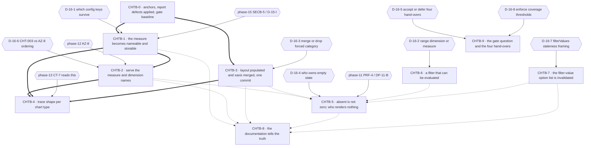

# Phase 16 — Chart presentation contract: remediation execution plan

## Purpose

Turn the sixteen substantiated findings of audit phase 16 into a dependency-safe rollout sequence.
Every block names a **semantic** target (component · chart-config type · aggregate payload shape ·
Plotly option or trace · transform hook · shared type · endpoint response — **never a line
number**), the `CHT-*` and `VAL-16-*` identifiers it discharges, its `blocked_by`, its place in the
single-implementor queue, a risk view across implementation / rollout / regression / compatibility,
the agents it needs, its documentation impact, named verification, and its definition of done.

This plan fixes **order, isolation, risk containment and proof obligations**. It does **not** fix
implementation choices where genuine uncertainty exists: `D-16-1` … `D-16-8` are carried open, each
with its alternatives, its chooser, and **what stays blocked** until it is ruled.

**Six of the eight have since been ruled and two remain open.** The rulings are in
`.ai/decisions/ADJUDICATED-2026-10-03-product-owner-rulings.md`, which is **the single authority**:
it merges two parallel owner registers and adjudicates every disagreement, and neither input file may
be cited as authority any more. See `Owner rulings applied` below. **`D-16-6` and `D-16-7` stay open
with their original choosers, and no option was ruled for either.**

## Owner rulings applied

**`.ai/decisions/ADJUDICATED-2026-10-03-product-owner-rulings.md` — Product Owner, adjudicated by the
Tech Lead, 2026-10-03 — rules six of this plan's eight decision records.** That file is **the single
authority**: it merges two parallel owner registers and adjudicates every disagreement, and neither
input file may be cited as authority any more. **The clusters this plan consumes are Cluster 4
(`CT-3`'s two findings, `D-16-2` and `D-16-5`) and Cluster 5 (`D-16-1`, `D-16-3`, `D-16-4`,
`D-16-8`).** Nothing below is this plan's choice, and **no option was ruled by default because a
question went unanswered.** The record sections keep every option and every trade-off; the ruled
content is marked **by description**, and the rejected options are marked rejected rather than
deleted.

**Option letters are not carried across.** The adjudicated register's letters denote which *input
register* won each decision, not which option in *this plan's* tables was taken — **implement the
words.** Where this plan's own option table has a matching row, that row is marked chosen and the
row's letter is *this plan's*, not the register's.

| ID | Ruled — by description | Gates released |
| -- | ---------------------- | -------------- |
| `D-16-1` | **Widen to what the product uses** — `metrics`, `orientation`, `barmode`, `title`, `x`, `y`, `color` — **and refuse genuinely unknown keys with a message naming the key.** **`CHT-004`'s remaining declared-but-unread keys — `yoy`, `secondary_y`, `xaxis`, `yaxis`, `layout`, `sort_x`, `sort_color` — are RECLASSIFIED AS RESERVED AND DOCUMENTED AS SUCH, not silently ignored.** **Acceptance criteria: a declared key set SURVIVES create → read → update → read UNCHANGED, and a bar graph's trace `y` array CONTAINS A VALUE GREATER THAN ZERO on a fixture whose measure is non-zero.** **Phase 15's `D-15-I` is this same ruling from the other tier — one decision, two ends** | **`CHTB-1`**; soft-blocks **`CHTB-4`**, **`CHTB-8`** |
| `D-16-2` | **`range` is REMOVED from the filter control, and any stored `range` filter is REJECTED with a message naming the reason, until a definition exists.** *"Do not ship a control that either does nothing or silently fails."* | **The `range` half of `CHTB-6` only. The `multiselect` half is INDEPENDENTLY UNBLOCKED and MUST NOT WAIT** |
| `D-16-3` | **`'category'` SURVIVES as the bar chart's default axis type unless a stored layout overrides it.** The bar branch **merges `xaxis`** per `VAL-16-003` | **`CHTB-3`** |
| `D-16-4` | **This phase owns ALL FOUR empty/absent states, distinguishes ABSENT from ZERO ON THE WIRE, and adds an absent-graph card.** **Acceptance criteria: a `null` measure and a `0` measure are distinguishable ON THE WIRE; an empty `data` array still reaches the empty branch; an absent graph is distinguishable from an empty one.** **Release note: dashboards quietly drawing flat zeros will warn for the first time, and the number affected is UNKNOWN and must be stated as unknown, NOT estimated** | **`CHTB-5`** |
| `D-16-5` | **DEFER ALL FOUR hand-overs (`H-1` … `H-4`), recorded as "held by phase 16, deferred by decision" — explicitly NOT "unowned".** **This RELEASES phase 13's `CT-5` and `CT-10`** | **`CHTB-9`**, and phase 13's `CT-5` / `CT-10` |
| `D-16-8` | **Enforce the frontend coverage thresholds AFTER this phase's blocks land tests** — the only ordering in which enforcement is meaningful. **No block may restore `frontend/coverage/`** — that is phase 13's `CT-15` | **`CHTB-9`** |

**What stays open.** `D-16-6` (`CHT-003` versus phase 12's `AZ-8`: serialise, co-commit, or defer) and
`D-16-7` (the `filterValues` staleness framing) are **still open**, with their original choosers —
**Coordinator**, and **Planner with product sign-off** respectively — and **no option was ruled for
either.**

**The correctness risks are the substance here, not the styling.** Six of the ten `CHT` findings are
about a figure that is drawn as though it were complete when it is not:

| Defect | What the reader sees | What is true |
| --- | --- | --- |
| `Number(row[metricCol] ?? 0)` | Correct categories over a flat zero line | The measure column is absent — an unevaluable filter (CHT-009), or a metric with no matching source column |
| The graph is skipped upstream | **Nothing at all** — no card, no placeholder | `AggregationService.aggregate_for_dashboard` `continue`s when a metric matches no column in the frame |
| `convertToPlotlyData(graph)[0]` on the line branch | A legend with one entry | N−1 series exist and are discarded |
| A future server `LIMIT` | The first N categories as if complete | The response declares no count field; no client code path could detect truncation |
| No `ORDER BY` on the aggregate read | Two requests plot the same data differently | `AggregatedDataRepository.get_by_graph_id` issues a bare `select(...)` |
| A graph omitted from the response is indistinguishable from an empty one | The same "no data" alert | `DashboardView`'s `graphs.length > 0` gate falls to the dashboard-scope message |

**A page load proves nothing.** A complete-looking frame is the *output* of four of these defects.
The verification rows below therefore specify **quantitative** pass conditions — a trace's `y` array
containing a value greater than zero, a trace count equal to the group count, a comparison against
a fixture's key set — and never "the chart appears".

## Anchor authority

> **Two sources, in this order — one sentence for a disagreement: the code context wins on *where*
> something is and *what the code does*; the report's identifier set wins on *identity*, with the code
> context's own numbering recorded as a defect where it differs.** **No `CHT-*` or `VAL-16-*`
> identifier is renumbered, re-typed or re-scoped by this plan.**
>
> **The report's line numbers are not binding.** `VAL-16-004` re-derived four references that do not
> resolve as written, and `VAL-16-005` recorded a fifth defect in its own evidence — the two
> `data_worker.py` call sites it cites moved from `:701`/`:782` to **`:781`/`:862`** after
> `ab76989` landed. Two of the four sit in load-bearing citations: grepping for
> `AggregationService.aggregate_graphs` returns **nothing tree-wide**, because the method is
> `aggregate_for_dashboard`.
>
> **Every anchor in this plan is a symbol, a module, a contract, a table or a config key.**
> Implementors resolve targets by symbol at the moment of work. If a symbol named below does not
> exist, that is a finding: stop and report it rather than substituting the nearest match.

**A tree re-check is an operational instruction, not a third authority.** This plan re-read the tree
at `907e052` to confirm its own coordinates, and the re-check is what produced the positions in the
table below. That re-check **cannot overturn a ruling** and did not: every entry there is a correction
of a **report** coordinate already recorded by `VAL-16-004`/`VAL-16-005` and re-derived by the code
context, which is exactly the case the precedence rule hands to the code context in the first place.
**Where the tree contradicts a code-context claim, the implementor records it as drift against the
code context** — in the same ledger that already carries the report's drift entries — **and continues
under the code context's ruling until the code context is re-issued.** This plan invents no
`code-context-vs-tree` disagreement of its own: the Phase-1 Auditor's §5.1 recorded the
`data_worker.py` drift without re-stating its coordinates, and this plan's re-check resolves it as
that entry's position rather than as a new ruling.

**Dead and moved symbols this plan corrects.** These are recorded once, by `CHTB-0`, and every
block below uses the corrected form. The middle column is the report's coordinate; the third is the
position the code context rules, confirmed by this plan's re-check:

| Symbol | Report says | Position under the code context's ruling | Correction |
| --- | --- | --- | --- |
| `AggregationService.aggregate_graphs` | CHT-001, CHT-003 | **does not exist** — the method is `aggregate_for_dashboard` | grep returns nothing; use `aggregate_for_dashboard` |
| `DashboardFilters`' multiselect `onChange` | `:162` | **`:160`** | `:162` is the `renderValue` `<Box>` |
| `invalidateQueries` census | "nine call sites" | **ten** — `['admin','users']`×3, `['admin','registration-requests']`×2, `['admin','dashboards']`×3, `['dashboards', id]`, `['aggregatedData', dashboardId]` | ten, and the enumeration in the report is correct and complete |
| CHT-009's binding types | "the one type that binds" | **two of four** — `select` and `date` both send scalars | `multiselect` and `range` do not bind |
| `data_worker.py` call sites | `:701`, `:782` | **`:781`**, **`:862`** | both read `metric_agg` from `processing_config_dict["settings"]`, default `"sum"` |
| `docs/07-frontend/data-api.md` | phase-12 `AZ-8`'s documentation target | **does not exist** — that directory holds `architecture, auth-flow, frontend-security, fsd-structure, pages, upload-ui` | there is no data-API doc to correct; a new one is required, and `AZ-8` names a file that is not there (`C16-10`) |

**Re-check record.** `HEAD` is `907e052`, one commit past the brief's baseline and two past the
report's. `src/mkobi/**` and `frontend/src/**` are **both clean** — every file this phase's findings
name is at its committed state, and every anchor resolves against committed content. The only drift
in scope is **positional** (`ChartRenderer.tsx` and `DashboardFilters.tsx` are cited correctly; the
`data_worker.py` sites are not, and that is `VAL-16-005`'s own recorded drift) and
`frontend/coverage/**`, which is deleted and stays deleted. **No identifier, verdict, band or scope
changes on the strength of this re-check.**

**A third-phase collision the code context could not see.** The code context records: *"Phase 15
could not be checked — no `15-*.md` was on disk at `907e052`."* **Plan 15 has since landed**, and it
owns a **third** claim on `models/types.py::GraphConfigDict`: `SEC-004`'s backend half, `SECB-5`,
ruled to *refuse* undeclared chart-config keys, with `D-15-I` choosing the direction and `C15-6`
routing the client half to "**phase 16** (`ChartRenderer.tsx`, the chart presentation contract)**".
`CHTB-1` is therefore blocked by a phase-15 decision as well as by `D-16-1`, and the two phases are
answering the same question from opposite ends. See `C16-6`.

**Concurrent work is live.** Fourteen sibling plans are untracked and phase 15 was being authored
while this plan was written. `git status` must be re-read at each block's start.

## Gate baseline — re-verified, and it did not move

| Gate | Command | Result at `907e052` | Evidence quality |
| --- | --- | --- | --- |
| `fe-lint` | `.\Makefile.ps1 fe-lint` | **RED — 9 errors** | Reproduced exactly. A precondition, never evidence. |
| `fe-test` | `.\Makefile.ps1 fe-test` | **RED — 1 failed / 169 passed of 170, 13 files** | The single red is phase-09's `changePasswordSchema` case. **Not** a phase-16 test. |
| `check` | `.\Makefile.ps1 check` | **Short-circuits at `fe-lint`**; never reaches `fe-test` | A `check` that "passes" cannot happen without phase 13's `DP-13-A`/`CT-7` and phase 08's `CQLT-*` landing first. |
| `fe-typecheck` | — | **The target does not exist** | No `typecheck` script in `frontend/package.json`. The only frontend type check is `npm --prefix frontend run build`, which **writes `frontend/dist`** — phase 10's untracked host directory (`C13-11`, `OPS-003`). |

`fe-lint` — 9 errors, by file:

| File | Count | Rule | Phase-16 exposure |
| --- | --- | --- | --- |
| `charts/ChartRenderer.tsx` | 3 | `@typescript-eslint/no-unnecessary-type-assertion` | **Correction to the brief.** These are *not* "in a function no finding names": they sit in `convertChartLayoutToPlotly`, which `CHT-002` names and `CHT-006` names. What no finding names is the **redundant type assertion itself** (`as Partial<Layout>['title' \| 'xaxis' \| 'yaxis']`). Every change that repopulates `layout` must decide these three deliberately — keep them, or delete them as part of the same commit. |
| `ui/DashboardView.tsx` | 3 | `no-unsafe-member-access` (×2, on the inferred `any` from `useLocation().state.preserveFilters`), `react-hooks/set-state-in-effect` | Pre-existing. Any block editing this file must state its delta. |
| `__tests__/filter-persistence.test.tsx` | 3 | `no-unsafe-return`, `no-unsafe-assignment`, `require-await` | Pre-existing. Any block adding a filter test must state its delta. |

**`frontend/coverage/` — confirmed destroyed, and the destruction predates every gate.** The 15 ` D`
deletions were present in the first `git status` taken before any gate ran. After running `fe-test`:
still ` D` for all 15, and **0 files on disk** — the red run wrote **no replacement**, because
`vite.config.ts`'s `['text','json','html']` reporters do not emit while the run is red. `eslint.config.js`
globalIgnores `coverage`, so `fe-lint` is unaffected. **This plan does not restore that directory and
no block may.** It is phase-13 `CT-15`'s restoration, and phase 16 owns only the *gate question*
(`D-16-8`).

**The `any`-ban claim, resolved and not this phase's.** `no-explicit-any` **is** enabled
(`eslint.config.js` extends `recommendedTypeChecked`) and `tsconfig.app.json` sets `strict`. The ban
still does not bite in substance because no source file writes a literal `any` — `ChartRenderer.tsx`
uses `as unknown as Record<string, unknown>[]` — and every observed violation is an **inferred** `any`
that the `no-unsafe-*` rules catch. **Enforcement is a lint-configuration change → phase 08**
(`C13-9`). Recorded so no block absorbs it.

## Scope rulings — binding on every implementor

**In scope — the sixteen validated identifiers.** Per-finding detail is in the **findings-coverage
ledger** in the back matter; this table is the ownership split and nothing else.

| ID | Band | What this phase owns |
| --- | --- | --- |
| `CHT-001` | CRITICAL | **The measure-name half only.** The *shape* half is **phase 13's** (`FE-007`/`FE-008`), ruled. |
| `CHT-002` | HIGH | The `xaxis` overwrite — **not as its own step**; a hard co-requisite of `CHT-006`, one commit, `xaxis` merged (`VAL-16-003`). |
| `CHT-003` | HIGH | `GraphDataResponse` declares no `metrics`/`dimensions`; neither construction site serves them. **Collides with `AZ-8`.** |
| `CHT-004` | MEDIUM | 11 declared · 5 read · **intersection 2** · 8 live unrendered. The remedy is `D-16-1`. |
| `CHT-005` | HIGH | `orientation`/`barmode` are read on every render and **stripped at write**. |
| `CHT-006` | HIGH | `GraphDataResponse.layout` is declared, advertised and **populated by neither** site — eleven mapped fields unreachable. |
| `CHT-007` | HIGH | `pie` gets `x`/`y` and never `labels`/`values`, anywhere in the file. |
| `CHT-008` | HIGH | **Presentation half only**: the `[0]` index and `LineChart`'s single-`Data` prop. Typing half → phase 13's `CT-7`. |
| `CHT-009` | MEDIUM | `dims[key].astext == str(value)` — an array value stringified into a comparison that can never match. **Two of four** types bind. |
| `CHT-010` | MEDIUM | **Finding of record** (`VAL-16-002`): ten invalidation sites, none names the `filterValues` key. |
| `VAL-16-001` | MEDIUM | The "merge, not adjacency" label mints nothing. Applied: shape-gap ownership stays phase 13. |
| `VAL-16-002` | MEDIUM | `CHT-010` re-files `VAL-13-003` with a different prescription. Applied: `CHT-010` is the record; phase 13's amendment is **filed, not performed**. |
| `VAL-16-003` | MEDIUM | **The one target-changing defect.** `CHT-002` leaves its step → **hard co-requisite of `CHT-006`, one commit, `xaxis` merged.** |
| `VAL-16-004` | LOW | Four unresolvable references, one wrong count. Applied in the anchor table above. |
| `VAL-16-005` | LOW | The deferral's "discarded alias" premise is refuted; the deferral stands. `aggregate_for_dashboard` consults no alias, and a second naming path exists upstream. |
| `VAL-16-006` | LOW | `CHT-006`'s line-branch mechanism is backwards. Applied so a fixer does not re-state `LineChart`'s defaults after `CHT-006` lands. |

**Out of scope — do not implement here.** The full 22-row table is in the back matter; the four rows
a reader is most likely to expect here are `CHT-001`'s shape half (**phase 13**), `CHT-008`'s typing
half (**phase 13 `CT-7`**, with the deletion hazard in `C16-2`), `CHT-004`'s `yoy`/`secondary_y`
structural unusability (**phase 05 `DP-009`**) and measure-name derivation (**phase 05
`DP-002`/`DP-018`/`b4`**, which `CHT-001` leans on as *evidence*, not as a target).

**The four unnamed hand-overs are not in that table.** They are real, they are phase-16-held, no
`CHT` finding names any of them, and accepting them would roughly double the phase. They are the
subject of a single accept/defer decision — **`D-16-5`**, `CHTB-9` — not of a block.

## Block map

`solid` / `double` = a hard dependency (a blocker or a required sequencing). `dotted` = recommended
sequencing in the single-implementor queue, **not** a data dependency — the project permits one
implementor at a time, so these are ordered for review coherence and for file serialisation.

### Coverage ledger

| Block | Discharges | Agents |
| --- | --- | --- |
| **CHTB-0** | `VAL-16-001`, `VAL-16-002`, `VAL-16-004`, `VAL-16-005`, `VAL-16-006`; `VAL-16-003` recorded and applied as the `CHTB-3` edge | none — the Planner owns the note |
| **CHTB-1** | `CHT-001` (measure-name half), `CHT-005`, `CHT-004` (the decision and the inventory) | **all four** |
| **CHTB-2** | `CHT-003` | **all four** |
| **CHTB-3** | `CHT-006`, `CHT-002`, `VAL-16-003` applied | **all four** |
| **CHTB-4** | `CHT-007`, `CHT-008` (presentation half) | Auditor, Planner, Validator |
| **CHTB-5** | the `?? 0` collapse (the common terminus of `CHT-001`, `CHT-009`, `CHT-010`), the three empty states, truncation presentation | Auditor, Planner, Validator |
| **CHTB-6** | `CHT-009` | **all four** |
| **CHTB-7** | `CHT-010` | Planner, Validator |
| **CHTB-8** | the documentation halves of `CHT-004`, `CHT-006`, `CHT-001` | none beyond Implementor |
| **CHTB-9** | the four unnamed hand-overs (`D-16-5`), the coverage gate (`D-16-8`) | Planner (short) · Coordinator ruling |

**Merges and splits, with reasons.**

- **`CHT-002` merges into `CHTB-3` with `CHT-006`** — not a separate step: standalone, it ships a fix with **zero observable effect** and no recorded reason why, and it would mean two commits editing one six-line object literal. Mandatory, not convenient.
- **`CHT-005` merges into `CHTB-1`** — same `GraphConfigDict` key-set edit, same `Literal` behaviour change.
- **`CHT-004` merges into `CHTB-1` as its decision** — its remedy *is* `D-16-1`; a block cannot own a decision it does not execute. Its documentation half lands in `CHTB-8`.
- **`CHT-008`'s halves split across owners, not across blocks** — presentation half to `CHTB-4`, typing half to phase 13's `CT-7`. Doing both would be two owners in one function in one commit.
- **`CHT-010` does *not* merge into `CHTB-6`**, though the validator notes they compose (a stale option list hands the user a value the current data lacks, and selecting it produces `CHT-009`'s empty frame). Different tiers, different reversibility: `CHTB-6` can 422 across a whole dashboard; `CHTB-7` cannot.
- **`VAL-16-001` … `VAL-16-006` merge into `CHTB-0`** as rulings — defects in the report, not code work, and this plan may not edit the audit corpus.

**Two facts that decide the block graph.** (1) **`CHT-007` alone yields an all-zero pie** — the traces are `y: [0,0]` already because of `CHT-001`, so fixing trace shape before the measure is nameable converts an empty pie into a *complete-looking* one. `CHTB-4` is hard-ordered after `CHTB-1`/`CHTB-2`. (2) **`CHTB-1` is independently executable and `CHTB-2` is not** — `CHT-001`'s minimal path needs nothing from `CHT-003`, which is why `D-16-6` blocks exactly one block and not the phase's headline finding.

---

## CHTB-0 — Anchors, report defects applied, and the gate baseline this phase inherits

| Field | Value |
| --- | --- |
| **Semantic target** | None — this block edits **no** production file, no test, no `docs/` file and no audit artefact. It is the note this plan carries and the rulings every block below must obey: the corrected symbol table (`aggregate_for_dashboard`; `DashboardFilters`'s multiselect producer; the ten-site invalidation census; two-of-four filter types; the moved `data_worker.py` sites; the absent `docs/07-frontend/data-api.md`) · the finding-ownership split table · the gate baseline · the eight decision records. |
| **Discharges** | **`VAL-16-001`** (a deferral labelled a merge; no `CHT` ID minted; ownership of the shape gap stays phase 13) · **`VAL-16-002`** (`CHT-010` is the finding of record; the phase-13 roadmap amendment is **filed as `C16-8`, not performed** — phase 16 must not edit `.ai/audit/99-validation/13-…`) · **`VAL-16-004`** (four unresolvable references and one wrong count, applied in the anchor table above) · **`VAL-16-005`** (the deferral's "discarded alias" premise is refuted; `aggregate_for_dashboard` consults no alias, and the legacy `calculate_aggregations` path honours one where it is reachable — a second naming path the renderer also cannot name) · **`VAL-16-006`** (`LineChart`'s `{title, xaxis, yaxis}` defaults **survive** the spread of `undefined`; they do not need re-stating after `CHT-006` lands). **`VAL-16-003` is recorded here and *applied* on `CHTB-3`** as a hard graph edge, not as a paragraph. |
| **blocked_by** | Nothing. **`blocks`** every other block as a note — `CHTB-1` and `CHTB-3` are hard-ordered after it; the rest are soft. |
| **Execution order** | **1.** |
| **Risk — implementation** | **None.** No code. The risk that matters is the opposite one: an implementor who does not read this block greps for `aggregate_graphs`, finds nothing, and concludes the audit was fabricated. |
| **Risk — rollout** | **None.** |
| **Risk — regression** | **None.** |
| **Risk — compatibility** | **None.** |
| **Agents** | **None.** The Planner authors this note; it is delivered with the plan. It must not pull an Auditor: every claim it records was re-derived by the Phase-1 Auditor and re-verified against committed source for this plan. |
| **Documentation impact** | **This plan only.** No `docs/` file is edited. **In particular this block does not repair the audit corpus** — `VAL-16-001`'s "relabel the entry" and `VAL-16-002`'s "amend the phase-13 roadmap" are both writes into files this phase may not touch. `VAL-16-001` is applied *as a ruling inside this plan*; `VAL-16-002`'s amendment is `C16-8`. |
| **Verification** | A grep for `aggregate_graphs` returns nothing and this plan contains no occurrence of it except in the correction table above · a grep for `AggregationService.aggregate_for_dashboard` returns a hit · the invalidation census re-counts to **ten** · the filter-type census re-counts to **two of four** binding · `.\Makefile.ps1 fe-lint` re-counts to **9** errors before any block lands · `.\Makefile.ps1 fe-test` re-counts to **1 failed / 169 passed** · `git status --short frontend/coverage` still reports the 15 deletions and `frontend/coverage/` still holds 0 files. |
| **Definition of done** | The note ships with the plan and every block below cites it · the corrected symbol table is reproduced in each block that needs it, never as a line number · `VAL-16-003`'s edge is present in the block map and in `CHTB-3`'s `blocked_by` · `VAL-16-002`'s amendment is filed as a coordination item with its target file named and **not performed** · `frontend/coverage/` is untouched. |

**The two report defects whose remedy is a write into another phase's space.** Neither is performed by
any block, and both are **in the out-of-scope table** with their homes: `VAL-16-001`'s "relabel the
merge entry" is a write into the phase-16 report, and `VAL-16-002`'s "amend the phase-13 roadmap" is a
write into `.ai/audit/99-validation/13-…`. `VAL-16-001` is applied *as a ruling inside this plan*;
`VAL-16-002`'s amendment is filed as **`C16-8`**, addressed to phase 13.

---

## CHTB-1 — Make the measure nameable and storable, and let the renderer honour the keys it declares

| Field | Value |
| --- | --- |
| **Semantic target** | `models/types.py::GraphConfigDict` — the `total=False` TypedDict and its **eleven** declared keys (`x`, `y`, `color`, `xaxis`, `yaxis`, `title`, `layout`, `yoy`, `secondary_y`, `sort_x`, `sort_color`; **no `metrics`, no `orientation`, no `barmode`**) · `models/graph.py::GraphBase.config` and `::GraphUpdate.config` — the two annotations that make the TypedDict a boundary contract, and the reason the drop happens at **write** time · `models/graph.py::GraphCreate` / `GraphUpdate` — the `Literal` tightening surface, if `D-16-1` selects it · `frontend/src/features/dashboards/ui/charts/ChartRenderer.tsx::convertToPlotlyData` — the four presentation defaults (`xCol`, `metricCols`, `orientation`, and the bar branch's `barmode` read) and the two shape casts · `frontend/src/shared/types/api.types.ts::GraphDataWithConfig.config` — the client mirror, which today **declares three keys the server strips** · `DashboardView`'s `Typography variant="h6"` heading, which renders `graph.name` and is the only title surface in the client. |
| **Discharges** | **`CHT-001`, measure-name half** — `const metricCols = config.metrics \|\| ['y']` names a column no served row can carry, so `Number(row[metricCol] ?? 0)` coerces every row to `0` while the categories render correctly · **`CHT-005`** — `orientation` and `barmode` are read on every render and dropped on every write, so the defaults are the only values that can ever arrive · **`CHT-004`'s decision and inventory** — eleven declared, five read, **intersection two**, eight live unrendered (`y` is read by nothing; `yoy` is deferred to phase 05, leaving eight). |
| **blocked_by** | **`D-16-1` (hard — which keys survive).** Cross-phase: **phase 15 `SECB-5` / `D-15-I` (hard — see below).** Soft: `CHTB-0`. |
| **Execution order** | **2.** Ahead of `CHTB-2` because the minimal path needs nothing from it, and ahead of `CHTB-4` because a pie trace built from an unnameable measure is all zeros. |
| **Risk — implementation** | **HIGH, and the trap is picking the wrong half of the fix.** Two remedies exist and they are not variants of each other. The **minimal** one makes the name *specifiable*: declare `metrics` (or promote `y`) as an honoured key and have the renderer read it — the operator then writes `revenue_sum`, the suffixed name, and it round-trips. The **structural** one is `CHTB-2`: serve the measure names so the renderer never has to guess. **The minimal path does not depend on phase 05's naming question being closed**, which is why it is first in the queue. Two second-order traps the block must state in its commit body: (a) `extra="forbid"` on `GraphCreate.model_config` **does not catch** this — Pydantic v2 does not descend into a `TypedDict`-typed field, so an implementor who reaches for the obvious knob ships no fix and a green suite; (b) the annotation is on **`GraphUpdate` as well as `GraphCreate`**, so a read-modify-write cycle compounds the loss — a client that round-trips a config it read loses its undeclared keys **on the write**, and the config it reads back differs from the one it sent with no error at any point. |
| **Risk — rollout** | **MEDIUM-HIGH, and it is not in the direction people expect.** Adding keys to the contract is render-neutral for **existing** graphs, because nothing backfills `orientation`/`barmode`/`metrics` on any stored graph and the renderer's current defaults are what those graphs are already drawn with. That is the good half. The other half: a `Literal` narrowing turns a previously **stripped-and-ignored** key into a **rejected** one — a **422** on `POST /graphs`. **The shipped UI cannot reach it** (a whole-tree search for the keys a graph editor would send returns nothing outside `ChartRenderer.tsx`; there is no graph editor in `frontend/src`), so the tightening is currently unreachable from the product. **Re-make that check if a graph editor is ever added.** And if `D-16-1` chooses to *narrow* rather than *promote*, the rollback story changes completely: every stored graph carrying one of the eight unrendered keys would start failing to update. |
| **Risk — regression** | **MEDIUM-HIGH.** `tests/test_graphs.py::TestGraphsAPI` is the pin set — `test_create_graph_admin_success` and `test_update_graph_admin_success` are the round-trip assertions, and the class also covers permission and not-found cases. **Phase 03's `B5` owns the graph-create contract and may have added assertions to the same class — read the file, do not assume its shape.** Phase 15's `SECB-5` plans against the same class. **The good news: nothing today asserts that an undeclared key is dropped**, so there is no defect-encoding test to invert — and equally **no guard**, so the new tests must be shown to discriminate. `tests/test_openapi.py` is the tripwire if the published `config` schema changes shape. |
| **Risk — compatibility** | **HIGH in kind.** The direction `D-16-1` picks is visible: *promote* is additive to the backend and render-changing the moment a stored value starts being honoured; *narrow* is breaking for any stored graph and any caller; *document-as-reserved* changes nothing and keeps eight accepted-and-ignored keys, which is the finding's own subject. `docs/02-dashboards/dashboards-api.md`'s graph-`config` example is currently **doubly false** — it shows `y_axis` and `colors`, which are **not `GraphConfigDict` keys at all**, alongside `orientation` and `barmode`, which are stripped at write — and that document is **phase 03's `B5` table** (`C16-11`). |
| **Agents** | **Auditor, Researcher, Planner, Validator — all four.** HIGH band, a published boundary contract, three phases claiming the same TypedDict, and a decision whose cost is measurable. **Auditor:** the **complete** by-symbol census of config keys any shipped path *sends* and *reads* — chart builders, dashboard save flows, the dev seeder, every fixture or script that creates a graph, every shipped test asserting a config round trip — so `D-16-1` is decided on evidence and not on the report's list; plus the current state of `ChartRenderer.tsx` and `api.types.ts`, which another phase may have changed since the Phase-1 Auditor read them. **Researcher** (narrow, and it decides the shape): whether Pydantic v2 offers a supported way to reject unknown keys **inside** a `TypedDict`-typed field, or whether the only honest answers are a `field_validator(mode="before")` and replacing the TypedDict with a model — because that decides whether the client contract can stay a plain dict. **Planner:** which side of the vocabulary is authoritative under `D-16-1`; the naming path (`metrics` versus promoted `y`); the commit shape; and the read-modify-write behaviour. **Validator:** that a declared key round-trips create → read → update → read **unchanged**; that an undeclared key's fate is the ruled one and the tests discriminate; that both `GraphCreate` **and** `GraphUpdate` are covered; that `TestGraphsAPI` is green. |
| **Documentation impact** | **Deferred, and this block must not edit `docs/02-dashboards/dashboards-api.md`.** It is **phase 03's `B5` table** and phase 15 files the same contention as `C15-17`. This block's **exact delta** — which keys become honoured, which become rejected, what the 422 does to a previously-accepted payload — is recorded in its commit body for `CHTB-8` to write **once, against final code**. `docs/09-database/schema-core.md`'s `config` schema table is the second false document; it is named in `CHTB-8` with the same rule. `docs/SPEC.md` gains one version row. |
| **Verification** | **Quantitative, and the pass condition is not "the chart appears".** After this block, a bar graph's trace `y` array **must contain a value greater than zero** on a fixture whose measure is non-zero — that is the only assertion that distinguishes a fixed renderer from the defect. · **New:** a create and a separate update whose `config` carries each newly-honoured key, asserted to round-trip · **New:** a round-trip test — a declared key set survives create → read → update → read unchanged (this is the test that would have caught the read-modify-write compounding) · **New, under a narrowing `D-16-1`:** an undeclared key is refused with a message **naming the key**, and the refusal is shown to discriminate from the previous silent-drop behaviour · `.\Makefile.ps1 test-select -k TestGraphsAPI -v` — the whole class, **read before editing** · `.\Makefile.ps1 test-select -k TestGraphCreateContract -v` **if** phase 03's `B5` landed and added that class · `.\Makefile.ps1 test-select -k test_openapi -v` · `uv run ruff check src/mkobi/models/types.py src/mkobi/models/graph.py` · `uv run mypy src/mkobi/models/types.py src/mkobi/models/graph.py` · frontend: `.\Makefile.ps1 fe-test` (baseline red — see the block-level caveat) and `npm --prefix frontend exec -- vitest run src/features/dashboards` (the coverage-free targeted form). **A build is required for any type change**, because no `fe-typecheck` target exists — and the build writes `frontend/dist`. |
| **Definition of done** | `D-16-1` is ruled and the ruling is named in the commit body · the by-symbol key census is complete and **filed as `C16-6`** for phase 15 and `C16-2` for phase 13 · the measure is nameable by a declared key that **round-trips** — proven by the trace-`y`-contains-a-positive-value assertion, not by a page load · `orientation` and `barmode` are either storable or explicitly named as deliberately unstoreable with the reason · a declared key set survives create → read → update → read unchanged, asserted · the "a model-level `extra="forbid"` does not descend into a TypedDict value" fact is recorded in the commit body so the next implementor does not reach for it · the read-modify-write compounding is either fixed or named as out of scope with the reason · `TestGraphsAPI` is green · `tests/test_openapi.py` is green, or its delta is asserted rather than incidental · **no** `docs/` file is edited by this block, and its doc delta is filed for `CHTB-8` · the "no graph editor exists in the shipped UI" pre-check is **re-made and its date recorded**, with the instruction to re-make it if one is added. |

**Options — `D-16-1` (which `GraphConfigDict` keys survive).** Carried open. **This plan picks none
of them.** Chooser: **Tech Lead + product**, with phase 15's `D-15-I` as co-signer, because the two
phases are choosing from opposite ends of the same vocabulary.

| Option | Shape | Cost | What it does to `CHT-001` |
| --- | --- | --- | --- |
| **(a) Narrow** the contract to `x`, `y`, `color` | The API rejects the other eight with a 422 | Removes the false affordance immediately. **Breaking** for any stored graph carrying one of the eight and for any caller that sends one. **Hard constraint: this must not ship before `CHT-003`'s response shape lands** (`CHTB-2`), or narrowing turns a silently-ignored key into a rejected one exactly when the client loses its only workaround. | Does not close it. `y` would be the only measure key and would still have to carry the `_{agg}` suffix. |
| **(b) Promote** `title` and `y` to honoured keys; delete the other six | Smaller blast radius | Two real changes. `y` alone still does not close `CHT-001` — the name is still `revenue_sum`. | Partially: the measure becomes *specifiable*. It does not become *known*. |
| **(c) Keep all eleven, document as reserved** | No code change | Keeps eight accepted-and-ignored keys — the finding's own subject. | Does not close it. |
| **(d) Widen** the contract to include what the client already reads (`metrics`, `orientation`, `barmode`, and whatever else `D-15-I`'s census finds) | The backend becomes the superset | Backend-only in code, but **render-changing the moment a stored value starts being honoured** — which is a *presentation* consequence this phase must then own. | Closes the specifiability half directly, and composes with `CHTB-2` to close the rest. This is phase 15's `D-15-I` option (a). |

**`blocks`:** `CHTB-2` and `CHTB-4` (hard — a pie trace built on an unnameable measure is all zeros,
which is worse than empty), `CHTB-8` (soft — the documentation delta). **`CHTB-0`** (soft).

**The phase-15 collision, stated.** `SECB-5` plans to make `GraphCreate`/`GraphUpdate` **refuse**
undeclared chart-config keys, with `D-15-I` choosing whether the backend becomes the superset or the
client becomes the authority, and `C15-6` routing the client half to "phase 13 (`shared/types/**`,
`shared/api/**`) · **phase 16 (`ChartRenderer.tsx`, the chart presentation contract)**". Two phases
are therefore about to edit the same TypedDict in the same release window, from opposite directions.
**Sequence, do not merge:** phase 15's backend ruling lands first (it is the contract; the
presentation cannot follow a contract that is still moving), and `CHTB-1` lands on top of the ruled
key set. If they are ever proposed as one commit, the commit must carry both rulings by name —
`C16-6`.

### CHTB-0 / CHTB-1 boundary — what each owns

`CHTB-1` edits `ChartRenderer.tsx::convertToPlotlyData`. **It does not touch
`convertChartLayoutToPlotly`** — that is `CHTB-3`'s function, it carries the three `fe-lint` errors,
and two blocks editing one file in one commit is the "two owners in one commit" hazard this plan
exists to avoid. Where `CHTB-1` and `CHTB-3` both land in the same file, they land in separate
commits, sequentially, and each states the other's function as read-only.

---

## CHTB-2 — Serve the measure and dimension names the renderer has to guess today

| Field | Value |
| --- | --- |
| **Semantic target** | `models/data.py::GraphDataResponse` — six declared fields (`graph_id`, `type`, `name`, `data`, `layout`, `config`); **no `metrics`, no `dimensions`**; `config: dict[str, Any] \| None` is **untyped**, which is why nothing downstream can be checked · its `json_schema_extra` example and its class docstring, both of which describe a payload the model does not produce · **exactly two construction sites, both in `api/routes/data.py::get_aggregated_data_endpoint`** — the single-graph branch and the all-graphs branch — and neither passes `layout` or a measure list · `db/models/graphs.py::Graph.dimensions` / `::Graph.metrics` — the **source of truth**, required on create and update and already consumed by `AggregationService.aggregate_for_dashboard` · `frontend/src/shared/types/api.types.ts::GraphDataWithConfig` — the client mirror, which declares neither. |
| **Discharges** | **`CHT-003`** — "`metrics`/`dimensions` never served". The whole-tree search for `GraphDataResponse` returns exactly these two construction sites; neither is in a test; neither passes either member; **"never" is sustained**. Also closes the structural half of `CHT-001`: with the served measure list present, the renderer has a name that is **correct by construction** and the `_{agg}` suffix stops mattering to the presentation tier. |
| **blocked_by** | **`D-16-6` (hard — the `AZ-8` ordering. See below; this is a decision, not a preference.)** Soft: `CHTB-0`. **Preferred ordering:** after `CHTB-1`, so the minimal naming path is already shipped when the structural one arrives and no window exists in which neither works. |
| **Execution order** | **3** (or **2** if the owner rules `D-16-6` to serialise phase 12 first — see the block's ordering note). |
| **Risk — implementation** | **MEDIUM-HIGH, and the trap is adding a field that promises more than it delivers.** Two fields are additive in JSON and simple to add. The trap is *populating them honestly*: the served names must be the names the renderer will actually find on a row, which means the value has to come from the same derivation the aggregate used — `AggregationService.aggregate_for_dashboard` aliases each metric as `f"{m}_{metric_agg}"` where `metric_agg` is read from `processing_config_dict["settings"]["metric_agg"]` (default `"sum"`). **Serving `graph.metrics` verbatim would serve `["revenue"]` against a row keyed `revenue_sum` and reproduce `CHT-001` through a new mechanism.** That derivation is phase 05's naming question (`DP-002`/`DP-018`/`b4`), and this block must either reproduce it faithfully or serve nothing and say why. **Second trap:** the response already declares `config` untyped; adding typed `metrics`/`dimensions` makes the model *partly* typed, which invites the reader to assume the rest is too. |
| **Risk — rollout** | **HIGH, because this endpoint is the product.** `GET /data/aggregated` renders every chart on every dashboard. The change is **additive in JSON** — an existing client that ignores the new fields is unaffected — but the failure mode of a wrong implementation is not "an extra field": it is a client that starts reading `metrics` and finds a name that does not match a row, which is `CHT-001` with better branding. **Wrong grants and wrongly-created rows persist** (`C12-9`). |
| **Risk — regression** | **MEDIUM-HIGH, and the pins are named and non-negotiable.** `tests/test_data_endpoint.py::TestAggregatedDataEndpointContract` **must stay green unmodified** — phase 12's `AZ-8` holds it as its critical pin and this block changes what it sees. `tests/test_data_service.py::TestDataServiceIntegration` and `tests/test_services_integration.py::TestDataServiceIntegration` pin the layer below. `tests/test_openapi.py` is the tripwire for a published schema change, and a response-model change is exactly that. **The correct response to a fixture that breaks is a fixture that grants what the gate needs, never a relaxed assertion** — a relaxed guard is the one outcome that would make this block worse than the finding it closes. |
| **Risk — compatibility** | **MEDIUM.** Additive in the body; visible in OpenAPI. `docs/02-dashboards/dashboards-api.md`, `docs/09-database/schema-core.md` and `models/data.py`'s own `json_schema_extra` all describe a response shape that does not match — **`CHTB-8` writes them once, after this block lands.** A later phase-11 `DP-11-B(c)` adds a **count** to this same model; two fields added to one published model by two phases in one window is the second `AZ-8`-class hazard. |
| **Agents** | **Auditor, Researcher, Planner, Validator — all four.** HIGH band, the product's most-used read path, a read-only pin held by another phase, and a cross-phase ordering decision. **Auditor:** the complete by-symbol census of everything that constructs, consumes or asserts on `GraphDataResponse` and on `AggregatedDataResponse`, in `src/`, `tests/`, `docs/` and the frontend — including anything in the dev stack's own scripts — plus the current state of `api/routes/data.py` and `TestAggregatedDataEndpointContract`, both of which another phase may have changed since the Phase-1 Auditor read them. **Researcher** (narrow): whether Pydantic v2 has a shape for "this field is a list of the column names actually present in the payload" that can be derived at construction time without re-reading the rows — the answer decides whether the block recomputes or the repository carries it. **Planner:** the field names and their exact types; where the derivation lives (route construction site versus service); the honest treatment of a metric that matched no source column; and the `D-16-6` outcome. **Validator:** that the served names are **present on the served rows** — asserted by intersecting the served list against a row's own key set, not by eyeballing; that a graph whose metric matched nothing is either served with an empty list or omitted, and that whichever was ruled is what the test asserts; that `TestAggregatedDataEndpointContract` and both `TestDataServiceIntegration` classes stayed green **unmodified**; that `tests/test_openapi.py`'s schema change is asserted rather than incidental. |
| **Documentation impact** | **Deferred to `CHTB-8`, and this block must not edit it.** `docs/02-dashboards/dashboards-api.md` has **three** would-be editors (phase 03 `B5`, phase 15 `C15-17`, this phase) — `C16-11` · `docs/09-database/schema-core.md`'s schema table is phase 14's and phase 05's · `docs/07-frontend/data-api.md` **does not exist**, and phase 12's `AZ-8` names it as its own documentation target — `C16-10`. This block's exact delta is recorded in its commit body for `CHTB-8`. |
| **Verification** | **Quantitative.** The pass condition the report demands: **`/data/aggregated` must carry a non-empty `metrics` per graph *and* the names it carries must appear as keys on at least one served row of that graph** — intersected in the test, not eyeballed. · **New:** per graph, `set(response.metrics) & set(row_keys) != ∅`, asserted against the real aggregate path, not a hand-built fixture · **New:** a graph whose configured metric matches **no** source column is either omitted from the response (today's behaviour, upstream `continue`) or served with an empty list — whichever `D-16-6` settles, asserted · **New:** both construction sites carry the new fields — the single-graph branch **and** the all-graphs branch, because "never" means the test must check each · `.\Makefile.ps1 test-select -k TestAggregatedDataEndpointContract -v` — **must stay green unmodified** · `.\Makefile.ps1 test-select -k TestDataServiceIntegration -v` (both classes) · `.\Makefile.ps1 test-select -k test_openapi -v` · `.\Makefile.ps1 test-select -k TestErrorResponseFormat -v` · `uv run ruff check src/mkobi/models/data.py src/mkobi/api/routes/data.py` · `uv run mypy src/mkobi/models/data.py src/mkobi/api/routes/data.py` · `.\Makefile.ps1 test` for the backend half. **No Docker posture check is required**: this block's evidence is entirely in-process. |
| **Definition of done** | `D-16-6` is ruled and the ruling is named in the commit body · the served names are **correct by construction** — intersected against a served row's key set in a test, and the intersection is non-empty for every graph the fixture intends to render · **both** construction sites are covered by an assertion, not by inspection · a graph with an unmatched metric has a settled, asserted outcome · `TestAggregatedDataEndpointContract` and both `TestDataServiceIntegration` classes stayed green **unmodified** · `tests/test_openapi.py` is green with its schema delta asserted · the naming derivation used is named in the commit body **by symbol**, and if it duplicates phase 05's derivation that duplication is stated rather than hidden · **no** `docs/` file is edited by this block, and its delta is filed for `CHTB-8` · `frontend/coverage/` is untouched. |

**Options — `D-16-6` (`CHT-003` versus phase 12's `AZ-8`: serialise, co-commit, or defer).** Carried
open. **This plan picks none of them.** Chooser: **Coordinator**. The factual input is in
`C16-4`; the collision is not a preference because both findings are HIGH, they touch the same
model, the same endpoint, the same two construction sites, and the same contract suite.

| Option | Shape | Trade-off |
| --- | --- | --- |
| **(a) Serialise — phase 12's `AZ-8` lands first, `CHTB-2` follows** | One implementor, two commits, strictly ordered | **The default reading, and the one this plan's block graph encodes** (`D-16-6 --> B2`). `AZ-8` holds `models/data.py` read-only *only because it is adding a check*, and the check is independent of the fields. Cost: this block waits on another phase, and `CHT-003` is a HIGH that no one is executing meanwhile. Also: after `AZ-8` lands, the refusal status for a mismatched pairing is **settled**, which changes what a new field has to survive. |
| **(b) One joint commit** | `AZ-8`'s authorization check and `CHTB-2`'s fields land together | No window, no wait, one review. Cost: two phases, two owners, two review surfaces in one commit — the exact hazard the phase-13 validator named, on the **server** side this time. Revert takes both. |
| **(c) Phase 16 defers `CHT-003` to phase 12's block** | `AZ-8` grows the fields | Ownership moves wholesale. Cost: phase 12's block is already HIGH-band and agent-loaded; adding a response-shape change to it makes an authorization block carry a presentation decision, and `CHT-003` would depend on a decision recorded in a block this phase does not control. |

**What is *not* blocked by `D-16-6`, stated so a decision elsewhere cannot hold the phase.**
`CHTB-1` is **independent**: `CHT-001`'s minimal path reads a declared key that round-trips and needs
nothing from `GraphDataResponse`. `CHTB-3`, `CHTB-6`, `CHTB-7` and `CHTB-8` are all independent. Only
`CHTB-2` — and therefore the *structural* half of `CHT-001` — waits.

**`blocks`:** `CHTB-4` (hard), `CHTB-5` (soft — its zero/absent split improves once names are served),
`CHTB-8` (soft).

---

## CHTB-3 — Populate `layout`, and merge the `xaxis` the bar branch currently replaces (one commit)

| Field | Value |
| --- | --- |
| **Semantic target** | `api/routes/data.py::get_aggregated_data_endpoint` — **both** `GraphDataResponse(...)` construction sites, each of which must start passing `layout` · `models/data.py::GraphDataResponse.layout`'s declared type, its `json_schema_extra` example (`{"layout": {"title": "Sales Chart"}}`) and its class docstring ("graph metadata … and Plotly.js data" — it is row dicts, not Plotly traces) · `frontend/src/features/dashboards/ui/charts/ChartRenderer.tsx::convertChartLayoutToPlotly` — the early `return undefined`, and the **three `fe-lint` `no-unnecessary-type-assertion` errors inside it** · `ChartRenderer.tsx::ChartRenderer`'s bar branch — the object literal whose `xaxis` key is written **after** the `...convertedLayout` spread, replacing the converted object wholesale · `ChartRenderer.tsx`'s line branch, which passes the converted layout straight into `LineChart` and whose defaults therefore **survive** the spread of `undefined` (`VAL-16-006`) · `models/types.py::AxisConfig.label` — the twelfth dead field, declared and mirrored in `api.types.ts` while the converter reads `title` only. |
| **Discharges** | **`CHT-006`** — `layout` is declared, advertised in its own schema example, promised by its own docstring, and populated by **neither** construction site; it resolves to `None` on every response, `convertChartLayoutToPlotly` returns `undefined` before reading anything, and **all eleven mapped fields are unreachable**. **`CHT-002`** — the bar branch's `xaxis: {type: 'category'}` written after the spread replaces the converted `{title, type, range}` object, while the pie branch at the same site passes the converted layout through and keeps it. **`VAL-16-003`, applied as an edge rather than as a paragraph** — see below. |
| **blocked_by** | **Nothing.** `CHTB-0` (soft, the note). **This block is the phase's one independently executable HIGH-band pair**, and that is deliberate: a ruling elsewhere must not be able to hold it. |
| **Execution order** | **4** — after `CHTB-1` (one implementor, one file, sequential commits) and independent of `CHTB-2`'s ruling. |
| **Risk — implementation** | **MEDIUM-HIGH, and the trap is reverting the pair by half.** `CHT-002`'s discard is real and was re-derived by execution — the bar layout built from a real `layout` is `{"title":…,"xaxis":{"type":"category"},"yaxis":…,"barmode":"group"}` with the converted `xaxis.title` and `xaxis.range` gone — but **the value cannot arrive today**. Populating `layout` is additive and safe; **the entire risk is in the second half of the same commit.** Reverting the server half alone leaves the client half inert *if the merge is present* and live *if it is absent*. **The commit therefore reverts whole or not at all**, and `VAL-16-003` makes that a hard rule, not a review preference. The merge shape is `{type: 'category', ...convertedLayout?.xaxis}` — the converted keys win where they exist, the constant supplies the default. The residual question — whether the constant should survive at all as a *default* — is `D-16-3`, not this block's to close. **Third trap:** the three lint assertions sit **inside the function this block makes live**, and keeping them requires a justification while removing them is a one-line change — an implementor who "fixes the lint" and deletes the converter would convert a HIGH into unimplementable (`C16-2`). |
| **Risk — rollout** | **MEDIUM.** `GraphDataResponse.layout` becoming populated is additive in JSON. The client-visible change is that **eleven previously-unreachable fields start taking effect** on any graph that stored a `config.layout` — titles, axis titles, axis types, axis ranges, `showlegend`, `height`, `width`, `template`. A stored `height`/`width` that was silently ignored will now size the frame; a stored `xaxis.range` that was discarded will now clip the axis. **That is the intended direction and it is a rendering change for every dashboard that stored a `layout`, with no test anywhere asserting what they now draw.** The three `fe-lint` errors are the only automated signal that this code region changed at all. |
| **Risk — regression** | **MEDIUM.** `tests/test_openapi.py` is the tripwire (the `json_schema_extra` example is now true, and the schema is published). `tests/test_data_endpoint.py::TestAggregatedDataEndpointContract` sees both construction sites change. **Nothing in the frontend suite touches `ChartRenderer.tsx`** — 13 test files, 170 tests, zero of which touch `ChartRenderer.tsx`, `LineChart.tsx` or `TableChart.tsx` (`D-16-8`). **A green frontend suite is therefore not evidence that this block worked**, and the block must not cite it as such. |
| **Risk — compatibility** | **MEDIUM.** The response gains a populated optional field; the client's mirror already declares `layout?`. The compatibility risk is entirely on the **presentation** side and is invisible to any type checker: `convertChartLayoutToPlotly` returns `Partial<Layout> \| undefined`, and `LineChart`'s defaults lose to whatever the spread now carries — which is correct, but it means the line chart's axis titles stop being the hard-coded empty strings **for every line graph that stored a `layout`**. |
| **Agents** | **Auditor, Researcher, Planner, Validator — all four.** A paired commit that must not be split, a function that has never run with input and is about to, and eleven fields whose effect has never been observed. **Auditor:** re-confirm by symbol that there are **exactly two** `GraphDataResponse` construction sites and that nothing else in `src/`, `tests/` or the frontend reads or writes `GraphDataResponse.layout`; enumerate every stored graph whose `config.layout` is non-empty in the **dev** stack only (read-only — no row is created or deleted by this phase); and confirm `AxisConfig.label`'s two mirrors and that nothing reads either. **Researcher** (narrow, and it feeds `D-16-3`): whether `react-plotly.js` passes `layout` through to `Plotly.react` without coercion, and whether Plotly.js v3's bar renderer requires an explicit `xaxis.type` at all. **The factual input is already established and recorded here**: `PlotlyChart.tsx` is a two-line re-export of `react-plotly.js`'s component, the bar branch's `{type: 'category'}` is a **local choice made in this file**, **no comment in the codebase claims it is load-bearing**, and the library imposes nothing — so the constant is removable on library grounds and only a product preference keeps it. **Planner:** the commit shape that makes half-revert impossible; the merge-versus-drop framing under `D-16-3`; whether `AxisConfig.label` is honoured, documented as reserved, or removed (a `D-16-1`-adjacent call, recorded here rather than reopened); and the treatment of the three lint assertions. **Validator:** that `layout` is non-`None` on **both** branches after the change and on a graph that stored one; that the bar branch's converted `xaxis.title` **and** `xaxis.range` survive (asserted on the layout object the branch builds, not on rendered pixels); that the line branch's declared title wins the spread **and that `LineChart`'s defaults are not re-stated** (`VAL-16-006` — the most likely wrong turn here); that the pie branch still passes the converted layout through; that the three lint assertions were kept or removed **deliberately** and that `.\Makefile.ps1 fe-lint` reports the same 9 errors minus whatever this block deliberately resolved, with the count stated. |
| **Documentation impact** | **Required, but deferred to `CHTB-8`** — with one exception: `models/data.py::GraphDataResponse`'s own docstring, which says "and Plotly.js data" for a payload that is row dicts, moves with the code in **this** commit, as `doc-maintenance-rules.md` requires. `docs/07-frontend/pages.md` and any `docs/` file describing the layout contract: `CHTB-8`'s, after this block lands. `docs/SPEC.md` gains one version row. |
| **Verification** | **Quantitative, and the pass condition must be about the layout object, not the picture.** **New:** both construction sites return a non-`None` `layout` for a graph that stored one, asserted per branch · **New:** the bar branch's built layout object **retains** the converted `xaxis.title` and `xaxis.range` while `type` still defaults to `'category'` when the converted layout supplies none — asserted by object comparison, because no render harness exists · **New:** the line branch's layout object carries the declared title (i.e. it wins the spread) · `.\Makefile.ps1 test-select -k TestAggregatedDataEndpointContract -v` · `.\Makefile.ps1 test-select -k test_openapi -v` · `uv run ruff check src/mkobi/api/routes/data.py src/mkobi/models/data.py` · `uv run mypy src/mkobi/api/routes/data.py src/mkobi/models/data.py` · frontend: `npm --prefix frontend exec -- vitest run src/features/dashboards` (**coverage-free**, the targeted form) · `.\Makefile.ps1 fe-lint` — compare against the **9-error baseline** and state the delta · **a build is required** (`npm --prefix frontend run build`) because the type of the layout object changes and no `fe-typecheck` target exists; it writes `frontend/dist`, which is untracked. **A page load is not a verification.** There is no browser-render harness in this repository; phase 13's `DP-13-K` option (b) records the same fact on the client side. |
| **Definition of done** | `layout` is populated on **both** construction sites, asserted per branch, with a graph that stored one · the bar branch **merges** `xaxis` rather than replacing it, asserted by object comparison on the built layout · **the commit is one commit** and the commit body says so, states that it is not revertible by half, and states which half is the risky one · `VAL-16-003`'s mechanism correction is quoted in the commit body so the next reader does not "fix" `CHT-002` separately · `LineChart`'s defaults were **not** re-stated, and the commit body says why not (`VAL-16-006`) · the three lint assertions were kept or removed **deliberately**, with the reason, and the `fe-lint` delta is stated against the 9-error baseline · `AxisConfig.label`'s two mirrors are either honoured or named as reserved with the reason · `tests/test_openapi.py` and `TestAggregatedDataEndpointContract` are green · `models/data.py`'s own docstring is corrected **in this commit** · **no** `docs/` file is edited by this block · no browser-render claim is made. |

**`VAL-16-003`, applied — the one target-changing defect in this phase.** The report's roadmap put
`CHT-002` in its own step, gated only on the measure-name step, and that gate does not hold it: with
`GraphDataResponse.layout` never populated, `convertChartLayoutToPlotly` returns `undefined`,
`{...convertedLayout}` is empty, and the `xaxis` write **changes nothing observable** — a team
following the report lands a fix, reloads, sees no difference, and concludes the fix failed. The
reverse order is what matters: **`CHT-006` must not ship without `CHT-002`**, or populating `layout`
converts a latent discard into a live one. Hence a hard co-requisite inside one block, `xaxis` merged,
never revertible by half. Not a recommendation; not to be re-litigated.

**Options — `D-16-3` (merge or drop the forced `category`).** Carried open, **narrower than the
code context states it**, because `VAL-16-003` has already settled half of it. Chooser:
**Planner**, with product sign-off if the answer changes what a chart looks like.

| Question | Status |
| --- | --- |
| Does the bar branch merge `xaxis` instead of replacing it? | **Settled by `VAL-16-003`: it merges.** Not an option. `{type: 'category', ...convertedLayout?.xaxis}` is the required shape. |
| Does the constant `'category'` survive as the **default** when the converted layout supplies no `type`? | **`D-16-3` — open.** Three shapes: **(a)** keep the constant as the default (converted `type` wins where present, `'category'` otherwise); **(b)** drop the constant entirely and let the converted layout be the only source, so a graph with no `config.layout.xaxis` gets Plotly's own inference; **(c)** keep the constant only when the bar is ungrouped. |

**The factual input the code context asked for, resolved.** `PlotlyChart.tsx` is a two-line
re-export of `react-plotly.js`'s component; nothing in this repository asserts that a bar trace
requires a categorical axis; and **no comment anywhere in the codebase claims the constant is
load-bearing**. So the constant is removable on library grounds alone. What remains is a product
question: today every bar chart is *guaranteed* a categorical x-axis, and a graph that stored
`xaxis: {type: 'linear'}` was having that silently discarded — after this block it would be honoured,
which is option (a). Under (b) a graph with no stored `layout` would start relying on Plotly's
inference, which is a rendering change with no test anywhere behind it.

**`blocks`:** `CHTB-4` (hard — the converter being live is what makes a per-type layout meaningful),
`CHTB-5` (soft), `CHTB-8` (soft).

---

## CHTB-4 — Give each chart type the trace shape it actually needs

| Field | Value |
| --- | --- |
| **Semantic target** | `ChartRenderer.tsx::convertToPlotlyData::makeTrace` — the local `trace: Record<string, unknown>` that is the escape hatch `tsc` accepts, the unconditional `x`/`y` assignment, and the `type` ternary that emits `'pie'` for a pie · the file's **complete absence** of any `labels` or `values` assignment · `ChartRenderer.tsx::convertToPlotlyData`'s grouped-colour branch — the `groups` accumulator built on **insertion order** over an unordered result set, which is what makes the surviving trace nondeterministic · `ChartRenderer.tsx::ChartRenderer`'s **line branch** — `convertToPlotlyData(graph)[0]`, the index that discards traces 1..N−1 · `LineChart.tsx`'s `LineChartProps` — `data: Data` (not `Data[]`), the `title`/`xAxisLabel`/`yAxisLabel` props that are never passed by any caller, and the `[data]` re-wrap at its render · `frontend/src/shared/types/api.types.ts::GraphDataWithConfig.config` where the client declares the server-stripped `metrics`. |
| **Discharges** | **`CHT-007`** — a `pie` trace is handed `x`/`y` and never `labels`/`values`; the shipped `@types/plotly.js` `PieData` populates from `labels` and declares `values`, and the only `x`/`y` in that file belong to `PieDomain`, which this code never sets. **`CHT-008`, presentation half** — the line branch indexes `[0]` and `LineChart` types its prop as a single `Data` and re-wraps it, so N−1 series are dropped while the legend shows one entry. |
| **blocked_by** | **`CHTB-1` (hard — the ordering is the substance).** **`CHTB-2` (soft — strictly better once names are served, but not required).** Cross-phase: **phase 13's `CT-7` (hard read — see `C16-2`).** `CHTB-0` (soft). |
| **Execution order** | **5.** After `CHTB-3` in the same file, one implementor at a time. |
| **Risk — implementation** | **HIGH, and the ordering is not a convention.** The pie traces are `y: [0,0]` **today**, because the measure is unnameable. Building a pie's `values` from `Number(row['y'] ?? 0)` produces an **all-zero pie** — correct categories, every slice zero — which is *worse* than the empty pie that exists now, because it looks like data. `CHT-007` alone is a regression in honesty even though it is a fix in shape. The line branch's fix has a second trap: **the surviving trace is whichever colour key was inserted first into `groups`**, and `groups` is built by iterating `graph.data`, which comes back from a bare `select(...)` with **no `ORDER BY`**. So `[0]` is not merely arbitrary, it is **nondeterministic across requests** — two identical requests can plot differently. A fix that preserves `[0]` and merely types it correctly has fixed nothing. The third trap is `Record<string, unknown>`: it is why the compiler never caught any of this, and removing it is what makes the next mistake impossible — but removing it before the types agree turns a running page into a build failure. |
| **Risk — rollout** | **MEDIUM-HIGH.** Both changes alter what users see, in opposite directions. A pie stops rendering a malformed trace and starts rendering a real one — for every pie graph, from the first render, with no feature flag. A line graph with grouped colours stops dropping series — the legend gains entries, the plot gains lines, and for a high-cardinality colour column the picture becomes materially busier. **The second is a visible change to charts that some users have learned to read as single-series.** Neither is gated by anything. |
| **Risk — regression** | **MEDIUM, and the honest position is that there is nothing to regress against.** Zero of the 13 frontend test files touch `ChartRenderer.tsx`, `LineChart.tsx` or `TableChart.tsx`. A green `fe-test` after this block is a **baseline fact**, not evidence. The nearest neighbours are `PlotlyChart.test.tsx` (which tests the two-line re-export) and `DashboardView.test.tsx`. `.\Makefile.ps1 fe-lint` is red on arrival with 9 errors, and this block's file carries 3 of them — which are `convertChartLayoutToPlotly`'s, i.e. `CHTB-3`'s function, **read-only to this block**. |
| **Risk — compatibility** | **MEDIUM.** `LineChartProps.data` narrowing or widening is a **shared-type change** with one caller in this repository and unknown callers outside it — `LineChart` is not exported from a barrel, but the component is reachable by import path. A change from `Data` to `Data[]` is source-compatible for the existing caller and behaviour-changing for any caller that relied on the re-wrap. |
| **Agents** | **Auditor, Planner, Validator.** **Auditor:** the complete by-symbol caller census for `LineChart` (in-repo, tests, docs, and any barrel or import path); confirmation that no source assigns `labels` or `values` anywhere in `charts/`; and the current state of `ChartRenderer.tsx` and `LineChart.tsx`, which phase 13's `CT-7` may have changed since the Phase-1 Auditor read them — **read them, do not assume the Phase-1 snapshot**. **Planner:** the per-type trace builders (whether one builder with a type branch or three builders — the project rule is small focused functions, and this is the one place where the shapes genuinely differ); whether the `Record<string, unknown>` escape hatch is removed and what that requires; how the nondeterministic `[0]` is replaced (merge all traces, render a `Data[]` prop, or render a chart-per-trace — a decision with real UI consequences); and the interaction with phase 13's `CT-7`. **Validator:** that a pie trace carries `labels` **and** `values` and **no** `x`/`y`; that the pie's `values` are **not** all zero on a fixture whose measure is non-zero (the assertion that would have caught the ordering regression); that a grouped-colour fixture produces **N** traces for N groups and the line branch renders **all N** (assert the trace count, not that "a chart appeared"); that the surviving trace is no longer dependent on insertion order — asserted by **reversing the served row order in the fixture** and asserting an identical result. **No Researcher** — the pie contract is settled by the shipped typings, which the validator already re-derived; the external unknown was closed. |
| **Documentation impact** | `docs/11-guides/extend-graphs.md` gains its correction in `CHTB-8`, **not here** — and the correction is not cosmetic: it currently claims bar, line and pie graphs "**all work**" with logic that "**extracts x values from the first dimension column and y values from the first metric column**". Neither half is true: the renderer reads `config.x` (defaulting to the literal `'x'`) and `config.metrics[0]` (defaulting to the literal `'y'`), never "the first column", and bar/line/pie are **exactly the three types this phase finds broken**. If `CHTB-4` lands before `CHTB-8`, the document is describing a fixed renderer with a wrong mechanism — which is a smaller lie than today's, and still a lie. `docs/SPEC.md` version row. |
| **Verification** | **Quantitative, three assertions that a page load cannot make.** **New:** a pie fixture yields a trace with `labels` and `values` present and `x`/`y` absent · **New:** that pie's `values` array contains a value greater than zero on a fixture whose measure is non-zero · **New:** a grouped-colour line fixture with N distinct colour values yields **N** traces through the line branch — assert the count · **New:** the same fixture served with its rows **reversed** yields an identical trace set and an identical first trace (the nondeterminism guard) · `npm --prefix frontend exec -- vitest run src/features/dashboards` (**coverage-free**, the targeted form; new tests live under `__tests__/`) · `.\Makefile.ps1 fe-test` — baseline comparison against **1 failed / 169 passed**, with the count stated and the phase-09 red named as pre-existing · `.\Makefile.ps1 fe-lint` — the delta against the 9-error baseline, and **confirmation that this block introduced no new error in the file** · a build, because `LineChartProps` is a type change and no `fe-typecheck` target exists. **Coverage caveat, binding:** running `.\Makefile.ps1 fe-test` rewrites `frontend/coverage/` if the suite goes green, and that directory is currently **deleted and must stay deleted** — prefer the targeted `vitest run` form for iteration and record which form was used. |
| **Definition of done** | A pie trace carries `labels` and `values`, and carries neither `x` nor `y` · the pie's values are **not** all zero on a non-zero fixture, asserted · a grouped-colour line fixture yields N traces for N groups and the line branch renders **all N**, asserted by count · the surviving trace is **order-independent**, proven by reversing the served rows and asserting an identical result · the `Record<string, unknown>` escape hatch is removed, or its retention is stated with the reason · `LineChart`'s unpassed `title`/`xAxisLabel`/`yAxisLabel` props are either wired or **deleted** (a props surface nobody passes is a lie a reader will trust) · the fixture used for the ordering assertion is committed, so the ordering bug cannot return silently · `fe-test` was run or not run, and **which form** is recorded in the commit body, together with the baseline it is compared against · `fe-lint`'s delta is stated against the 9-error baseline and the three `convertChartLayoutToPlotly` assertions are named as `CHTB-3`'s, **untouched by this block** · phase 13's `CT-7` is named in the commit body as a reader of this block's result (`C16-2`), and the commit states that `convertToPlotlyData`'s **typing** remains phase 13's · `docs/11-guides/extend-graphs.md` is **not** edited by this block; its correction is filed for `CHTB-8` · `frontend/coverage/` is untouched. |

**The cross-phase read this block owes.** `C13-6` (phase 13) records that the validator's ownership
ruling keeps `FE-008` in phase 13 and hands **phase 16 the consequence**: once the shape sniff is
gone, `convertToPlotlyData` becomes the single adaptation point through which every served row
becomes a trace, and it carries presentation defaults that belong to a presentation contract.
**Both halves are one function.** Phase 13's `CT-7` is blocked pending "phase 16's read" — **this
block and `CHTB-1` together are that read.** The specific hazard, stated once: **`CT-7` option (a)
deletes the dead layout converter**, which is the exact function `CHT-006` requires to start working.
If `CT-7` adopts option (a), `CHT-006` becomes unimplementable as written and the ordering has to be
re-cut. `CHTB-3` therefore lands its server half before `CT-7` can delete anything, and this block's
commit body says so.

---

## CHTB-5 — Make "absent" stop looking like zero, and settle who renders nothing

| Field | Value |
| --- | --- |
| **Semantic target** | `ChartRenderer.tsx::convertToPlotlyData` — the two `Number(row[metricCol] ?? 0)` coercions, in the grouped-colour branch and in the single-series branch. **This is the line where "absent" becomes "zero."** · `ChartRenderer.tsx::ChartRenderer`'s empty-data branch — the `h-64` div with the grey text "No data available for this chart" · `DashboardView.tsx`'s dashboard-scope error alert and its `graphs.length > 0` gate with the "No data available for this dashboard" message, and its per-graph `<Paper>` + `Typography variant="h6"` heading — the **only** place a graph can be shown as absent, which today it never is, because an absent graph is simply not in the array · `TableChart.tsx::getDisplayValue` — the client's **entire** transform/format layer: null/undefined → `''`, object → `JSON.stringify`, date-shaped strings → `formatDate`, else `String(value)`; **no number formatting, no locale, no unit, no percent, no currency, no null-versus-zero distinction anywhere** · `models/data.py::GraphDataResponse` — the absence of any count field, which is what makes a future server `LIMIT` undetectable. |
| **Discharges** | The `?? 0` collapse itself, which is **not a numbered finding** and is the common terminus of three that are: `CHT-001`'s consequence (a measure column that is absent because it cannot be named), `CHT-009`'s terminus (a filter that matched nothing, so every row is returned with the measure untouched — or, in the whole-dashboard failure mode, a 422) and `CHT-010`'s terminus (a stale option list hands the user a value the current data lacks, and selecting it produces exactly this state). Also the **truncation presentation** that plan 11's `DP-11-B` OUT row hands to this phase and **no `CHT` finding names**. |
| **blocked_by** | **`D-16-4` (hard — who owns empty-state rendering; three phases have a claim and none names it).** Soft: `CHTB-2`, `CHTB-3`, `CHTB-6`, `CHTB-7`. `CHTB-0` (soft). |
| **Execution order** | **6** — after the naming and layout blocks, because a correct zero/absent split is unobservable while the measure is unnameable. |
| **Risk — implementation** | **MEDIUM-HIGH, and the trap is picking a default that lies in a new direction.** Three states must be distinguishable: **a genuine zero**, **an absent measure**, and **no rows at all**. Today `?? 0` renders the second as the first, and the two are not separable without a source of truth — either the served row must carry an explicit null (it does: a JSONB `null` arrives as `null`, and `?? 0` discards it) or the response must declare which measure columns are expected (which is `CHTB-2`'s `metrics`). **Choosing "treat absent as zero and say nothing" is a legitimate option and it is a decision, not a default** — but choosing it silently is what produced the finding. **Second trap:** an empty-state string is a product string. Changing "No data available for this chart" to "The measure X is missing from this dataset" changes what users read on every dashboard that hits it, and there is no test anywhere asserting the current wording. **Third trap — the one with a blast radius:** a future server `LIMIT` truncates with **no client detection** available: `GraphDataResponse` declares six fields and none is a total, so nothing in the client could tell N-of-M from all-of-them. Building the capability before phase 11's `LIMIT` lands means it renders nothing today, and building it after means `PRF-4` can ship first and create a silent window. **Today's behaviour at that call site is already that truncation** — the line branch's `[0]` drops N−1 series without a word. |
| **Risk — rollout** | **MEDIUM.** Purely presentational; nothing is refused and nothing is fetched differently. The risk is **volume**: if the absent-measure state becomes visible for the first time, dashboards that have been quietly drawing flat zeros will start showing warnings, and the number of affected dashboards is unknown to this plan. **No stored row is read differently.** |
| **Risk — regression** | **LOW-MEDIUM.** `TableChart.tsx`'s formatting is pinned by nothing; `DashboardView.test.tsx` is the nearest frontend neighbour and may assert the "no data" text. `filter-persistence.test.tsx` carries 3 pre-existing lint errors and is the file any new filter-adjacent test lands beside. The regression surface is **assertion text**, not behaviour. |
| **Risk — compatibility** | **LOW.** No API change, no schema change, no status code. The one compatibility concern is forward-looking: whatever signal this block builds for truncation must be **the same signal phase 11's `DP-11-B(c)` count field and phase 13's `CT-3` render path produce**, or the client will have two ways to say the same thing. |
| **Agents** | **Auditor, Planner, Validator.** **Auditor:** the complete by-symbol census of **every** user-visible state string on the dashboard — the three empty/zero/error messages, the per-graph heading, and any `TableChart` formatting assertion — across `frontend/src` and `docs/`; plus a confirmation of which of the three empty states is reachable from which code path, because the answer decides whether a fourth string is needed. **Planner:** the absent/zero/no-rows split; where the "expected measure" fact comes from (`CHTB-2`'s served list versus a new response field); the truncation-signal design under `D-16-4`; and the string set, which is a product artefact. **Validator:** that a row carrying `null` for the measure renders differently from a row carrying `0` — asserted on the emitted trace, e.g. a null entry that is `null` or omitted rather than `0`; that a genuine zero still renders as `0`; that an empty `data` array still reaches the empty branch; that a graph absent from the response is **distinguishable from** an empty one, if that is what `D-16-4` rules; and that the strings asserted are the ruled strings. **No Researcher** — the formats are local conventions and Plotly's `null` handling in a trace is documented in the shipped typings. |
| **Documentation impact** | `docs/07-frontend/pages.md` describes the dashboard's rendered states; if the strings change, that document moves with them — **`CHTB-8`'s**, and it is **phase 13's file** for the `graph_id` half (`C11-8`, `C13-5`, `C12-7`), so this block records its delta for `CHTB-8` and edits nothing itself. `docs/11-guides/extend-graphs.md`'s "all work" claim cannot be corrected until this block's states are settled. `docs/SPEC.md` version row. |
| **Verification** | **Quantitative.** **New:** a row whose measure is `null` produces a trace entry that is **not** `0` (either `null` or omitted — whichever was ruled) · **New:** a row whose measure is `0` produces `0` — the two must be distinguishable, and that is the assertion the `?? 0` line fails today · **New:** a fixture with no `metrics` match produces the ruled state (absent card, or a stated message), not a silent omission · **New, truncation:** with a hypothetical total supplied, the trace renders the ruled text — asserting that the client **can** render "showing N of M" once the field exists, so phase 11's `DP-11-B(c)` does not have to invent the wording · `npm --prefix frontend exec -- vitest run src/features/dashboards` (**coverage-free** targeted form) · `.\Makefile.ps1 fe-lint` — delta against the 9-error baseline · `.\Makefile.ps1 fe-test` — baseline comparison, with which form recorded. **Coverage caveat as in `CHTB-4`.** |
| **Definition of done** | `D-16-4` is ruled and the ruling is named in the commit body · **a genuine zero and an absent measure are distinguishable on the wire**, asserted · a graph absent from the response is either distinguishable from an empty one or its indistinguishability is **named as accepted with the reason** — silently shipping the third state is the outcome this block exists to prevent · the empty-state string set is enumerated, and each string's owning component is named · the truncation signal is designed against phase 11's `DP-11-B(c)` field and phase 13's `CT-3` path by name, and **no second, competing signal was invented** · the volume of dashboards newly showing an absent-measure state is stated in the release note as an unknown · **no `docs/` file is edited by this block** · `frontend/coverage/` is untouched. |

**Options — `D-16-4` (who owns empty-state rendering).** Carried open. **This plan picks none of
them.** Chooser: **Coordinator** — this is the seam where three phases' blocks meet and none of them
names it. The three states, and the three claimants:

| State | Today | Claimed by | This phase's exposure |
| --- | --- | --- | --- |
| `graphs.length === 0` | `DashboardView`'s dashboard-scope info alert | nobody names it | `CHT-009` and `CHT-010` both terminate near it |
| `graph.data.length === 0` | `ChartRenderer`'s `h-64` grey text | nobody names it | — |
| Rows present, measure missing | **a frame with correct categories and a flat zero series** | nobody names it | **`CHT-001`'s terminus, and the only state that looks like data** |
| Graph absent from the response | **nothing renders at all** — no card, no placeholder | phase 13 `CT-7` / `DP-13-G(c)` calls this "absent data rendering distinguishably" | The report treats it as nobody's; phase 13 treats it as its own |

| Option | Shape | Trade-off |
| --- | --- | --- |
| **(a) Phase 16 owns all four states now** | One coherent empty-state component; all four states rendered by one owner | **The only option in which the four states are distinguishable from each other**, which is the actual requirement. Cost: three of the four are not named by any phase-16 finding, so this is scope no finding asked for — exactly what `D-16-5` is about, and accepting it should be recorded there rather than smuggled in. |
| **(b) Phase 13 owns the absent-graph state; phase 16 owns the three data states** | Split by claim: phase 13's `CT-7` already says "absent data rendering distinguishably" | Respects the claims as they stand. Cost: **the four states are then owned by two phases in two files**, and nothing in either phase's block requires them to be mutually distinguishable — so the actual requirement goes unmet. |
| **(c) Phase 16 owns the three data states; the absent-graph state is deferred to whoever builds a per-graph fetch** | Phase 16 takes only what its findings terminate in | Minimal, honest, and leaves a known hole explicitly deferred rather than implicitly covered. Cost: the "no card at all" state survives this phase and someone must be named for it later. |

---

## CHTB-6 — Make a filter value something the repository can actually evaluate

| Field | Value |
| --- | --- |
| **Semantic target** | `db/repositories/aggregated_data_repo.py::AggregatedDataRepository.get_by_graph_id` — the `filters` loop, whose condition is `AggregatedData.dims[key].astext == str(value)`: a **stringified Python repr compared for equality** against a JSONB dimension · `api/routes/data.py::get_aggregated_data_endpoint`'s `filters` parameter and its `json.loads` parse (which raises `VALIDATION_ERROR` → 422 only on malformed JSON) · `frontend/src/features/dashboards/ui/DashboardFilters.tsx::handleFilterChange` — the 300 ms debounce that feeds the chain · its four producer branches: the `select` control (scalar), the `multiselect` control (`onChange(e.target.value)` → **array**), the `range` control (`onChange((_, newValue) => …)` → `[number, number]`), the `date` control (scalar) · `models/types.py::FilterConfigDict`'s `type` field, whose declared vocabulary is `"select" \| "multiselect" \| "range" \| "date"`. |
| **Discharges** | **`CHT-009`** — `str(['North'])` is `"['North']"`, which matches no `dims` value; `str([0,100])` is `"[0, 100]"`. The full binding path is live: the debounce → `DashboardView`'s `filters` state → `useAggregatedData` → the query key → `JSON.stringify` → the route's parse → the repository's comparison. **Two of four** filter types bind (`select`, `date`); `multiselect` and `range` do not. |
| **blocked_by** | **`D-16-2` (hard for the `range` half only).** The **`multiselect` list case needs no decision and must not wait for one.** Soft: `CHTB-0`. |
| **Execution order** | **7.** |
| **Risk — implementation** | **MEDIUM-HIGH, and the trap is solving the wrong half.** The obvious fix — shape-branch the comparison so a list value produces `.in_([])` and a range produces `BETWEEN` — is **wrong for `range`**, because the repository only ever reads **`dims`**, and `BETWEEN` on a JSONB dimension is not a numeric range test. The report is explicit: option (b), "range targets a measure", is **a new capability, not a fix**, because the repository would then have to read `metrics` too. **Three traps beyond that:** (a) an unevaluable filter must be **rejected**, not silently ignored — a filter the user believes is applied and the query ignores is the exact CRITICAL clause the audit tested `CHT-009` against and correctly found absent, but only because the result happens to be visibly empty; a silently-ignored filter on a filter that *does* match nothing visible is a different failure; (b) `str(value)` is also wrong for **scalars** whose JSONB form is a number rather than a string — `astext` on a JSONB number yields its text form, so `1` and `"1"` compare differently, and a `date` filter sending a string against a stored number never matches; (c) **the shape branch belongs in the repository, not the route** — putting it in the route would duplicate it for every future caller and put a query decision in the transport layer, against the project's API → Service → Repository rule. |
| **Risk — rollout** | **MEDIUM, and the blast radius is the real finding here.** A 422 from `/data/aggregated` renders at **dashboard** scope — `DashboardView`'s single `Alert severity="error"` covering **every** chart — so one bad filter blanks the whole dashboard, not one graph. The report's prescription is the right one and this block adopts it: **the rejection must be raised at filter-change time, not as a 422 on the combined data request.** That means either the client validates the shape before it ever reaches the request (a client change in `DashboardFilters`) or the server validates it in a place that can answer per-filter. Both are in this block's scope; neither is a styling change. |
| **Risk — regression** | **MEDIUM-HIGH, and two suites are named as the pins.** `tests/test_data_service.py::TestDataServiceIntegration` and `tests/test_services_integration.py::TestDataServiceIntegration` both sit below this method and **will** see a new 422 path — the report names them as breaking. `tests/test_filter_persistence.py::TestFilterStatePersistence` and `tests/test_filter_values_consistency.py::TestFilterValuesConsistency` pin the filter stack beneath. **Nothing today asserts that a `multiselect` filter returns zero rows** — fortunate, because that behaviour is the defect, and equally a warning that the fix's new behaviour is unpinned. |
| **Risk — compatibility** | **MEDIUM.** `select` and `date` keep working unchanged — **that is the backward-compatibility floor and it must be asserted, not assumed**. `multiselect` starts matching rows it did not match before, which is the fix and is also a visible change on any dashboard using one. `range` is the only genuinely breaking half and its fate is `D-16-2`. |
| **Agents** | **Auditor, Researcher, Planner, Validator — all four.** A backend repository method, a 422 whose blast radius is the whole dashboard, and a decision half the block depends on. **Auditor:** the complete by-symbol census of **every** producer of the `filters` dictionary — the four `DashboardFilters` branches plus any seeder, script or test that sends one — and **every** consumer of `AggregatedData.dims` in a comparison anywhere in `src/`, so a shape branch cannot change an unrelated query. **Researcher** (narrow, and it decides the `multiselect` shape): how a JSONB text-extract comparison behaves across scalar types in PostgreSQL 18 via asyncpg — whether `->>`-equivalent text extraction on a JSONB number equals its string form, and what the correct containment expression is for a list membership test on a JSONB value (`@>`, `jsonb_exists_any`, or a text-anchored `IN`) with the index implications for the existing GIN index. **Planner:** where the shape branch lives; how an unevaluable filter is rejected at filter-change time; and the `D-16-2` framing for `range`. **Validator:** that a `multiselect` filter with two values returns the union of the two single-value results; that a `select` and a `date` filter behave **identically to today**; that a numeric dimension filters correctly through `astext`; that an unevaluable filter is **refused with a message naming the filter and the reason**, not silently dropped; and that the two `TestDataServiceIntegration` classes are green with their fixture changes explained. |
| **Documentation impact** | `models/types.py::FilterConfigDict`'s `type` field's declared vocabulary and `docs/`'s filter documentation must agree about what `range` means — **`D-16-2`'s output**, so this is `CHTB-8`'s, written once. `docs/07-frontend/pages.md`'s filter section is **phase 13's file** (`C13-5`) and must not be edited here. `docs/SPEC.md` version row. |
| **Verification** | **Quantitative and behavioural.** **New:** a `multiselect` filter selecting two values returns the row set equal to the union of the two `select` filters — asserted as set equality, not a count · **New:** a `select` filter's result is **byte-identical** before and after this block (the backward-compatibility floor) · **New:** a numeric dimension filtered by a scalar matches · **New:** an unevaluable filter is refused with a message naming the filter, at the surface the report prescribes, and **the rest of the dashboard is not blanked** — which is the assertion that proves the dashboard-scope blast radius is closed · **New:** an array-valued filter with a single element matches that element · `.\Makefile.ps1 test-select -k TestFilterStatePersistence -v` · `.\Makefile.ps1 test-select -k TestFilterValuesConsistency -v` · `.\Makefile.ps1 test-select -k TestDataServiceIntegration -v` (**both** classes) · `uv run ruff check src/mkobi/db/repositories/aggregated_data_repo.py src/mkobi/api/routes/data.py` · `uv run mypy src/mkobi/db/repositories/aggregated_data_repo.py` · `.\Makefile.ps1 test` for the backend half · frontend: `npm --prefix frontend exec -- vitest run src/features/dashboards` for the filter-change-time half. |
| **Definition of done** | `D-16-2` is ruled **for the `range` half**, and the ruling is named in the commit body — **or the `range` half is explicitly deferred with the reason and the `multiselect` half landed anyway**, which is the permitted shape · a `multiselect` filter's result equals the union of its single-value results, asserted as set equality · `select` and `date` behaviour is **byte-identical** to before, asserted · a numeric dimension filters correctly · an unevaluable filter is **refused with a named reason at filter-change time**, and **the dashboard-scope blast radius is closed** — proven by a test showing other charts still render · the shape branch lives in the repository, not the route, and the commit body says why · both `TestDataServiceIntegration` classes are green, with any fixture change explained rather than relaxed · **no `docs/` file is edited by this block** · `frontend/coverage/` is untouched. |

**Options — `D-16-2` (does a `range` filter target a dimension or a measure?).** Carried open.
**This plan picks none of them.** Chooser: **Tech Lead + product**. This is recorded nowhere in the
repository, which is precisely why it is a decision and not a bug fix.

| Option | Shape | Trade-off |
| --- | --- | --- |
| **(a) `range` targets a **dimension** | Needs a documented string-range encoding, or the filter is rejected as unevaluable | Cheapest if the answer is "reject it". A lexicographic range over dimension strings is a semantic that **nothing in this system has ever agreed to**, so honouring it without a product definition invents one. |
| **(b) `range` targets a **measure** | The repository must read `metrics` as well as `dims` | **A new capability, not a fix.** The repository has never read `metrics` in a filter; the aggregate read's column projection would widen; and the answer interacts with phase 05's naming question, because the measure's *stored* column name and the measure's *configured* name differ by the `_{agg}` suffix. |
| **(c) `range` is removed** from the client switch | `DashboardFilters`'s range branch and `FilterConfigDict.type`'s vocabulary lose the case | **The only option that removes an unimplementable control rather than implementing it.** Cost: a control that exists today stops existing — a visible product change — and any stored `FilterConfigDict` carrying `type: "range"` needs a migration or a documented fallback, which makes **phase 14** a participant. |

**Independently unblocked, and it must not wait.** The `multiselect` list case needs `.in_([])` and no
decision. Shipping it alone closes the majority of `CHT-009`'s user-visible harm — the type a
dashboard actually uses — while `range` waits for its product definition. The block's definition of
done permits exactly this split, and says so explicitly so a ruling on `range` cannot hold the whole
finding.

---

## CHTB-7 — Make the filter-value option list invalidate when the data it describes is replaced

| Field | Value |
| --- | --- |
| **Semantic target** | `frontend/src/features/dashboards/api/dashboardApi.ts::useInvalidateDashboard` — the hook that today exposes `invalidateDashboard` and `invalidateAggregatedData` and **no third method** · `dashboardApi.ts::useFilterValues`'s query key `['filterValues', dashboardId, filterName]`, which declares **no `staleTime`** · `frontend/src/features/dashboards/ui/DashboardFilters.tsx`'s per-filter call to `useFilterValues`, which is **unconditional** and, for `source === 'data'`, uses the response as the **entire** option list · `DashboardView.tsx`'s `onUploadComplete` handler, which calls `invalidateAggregatedData` and nothing else · the **complete** `invalidateQueries` census over `frontend/src` — **ten** sites (`['admin','users']`×3, `['admin','registration-requests']`×2, `['admin','dashboards']`×3, `['dashboards', id]`, `['aggregatedData', dashboardId]`), **none of which names the `filterValues` key** · `frontend/src/app/providers.tsx::queryClient`'s `defaultOptions.queries.staleTime`. |
| **Discharges** | **`CHT-010`** — no invalidation site names the key that backs every `source: 'data'` filter's option list, so a re-upload refreshes the frames and leaves the options stale, handing the user a value the current data does not contain. **And it records `VAL-16-002`'s ruling**: `CHT-010` is the finding of record; the phase-13 roadmap entry that prescribes a second call site is **filed as `C16-8`, not performed**. |
| **blocked_by** | **`D-16-7` (hard for the finding's *framing*; soft for the one-line invalidation itself, which is correct under every option).** `CHTB-0` (soft). |
| **Execution order** | **8.** |
| **Risk — implementation** | **LOW, and the trap is only about what gets claimed.** The remedy is a prefix-keyed `invalidateQueries({ queryKey: ['filterValues', dashboardId] })` exposed as a third method on the existing hook and called from the existing `onUploadComplete` handler — a few lines, no new dependency, no new abstraction. **The real implementation question is scope**: adding it to the *hook* (this finding's prescription) and adding it inline at the call site (`VAL-13-003`'s prescription) are two places, and doing both leaves one cache key invalidated twice with no recorded reason — the double-filing's practical failure, which is what `VAL-16-002` describes. |
| **Risk — rollout** | **LOW.** No request shape changes, no status changes. A refetch of the option lists after an upload is one extra small request per filter on a dashboard. **The user-visible change is that a previously-persistent stale option disappears** — which is the fix, and which a user who had learned to trust the stale list will notice. |
| **Risk — regression** | **LOW-MEDIUM.** `DashboardView.test.tsx` and `filter-persistence.test.tsx` are the neighbours; the latter carries 3 pre-existing lint errors (`no-unsafe-return`, `no-unsafe-assignment`, `require-await`) and is **phase 13's** fixture territory for `CT-7`'s own migration. Nothing asserts the current (absent) invalidation behaviour, so nothing has to be inverted. |
| **Risk — compatibility** | **LOW.** None. No API, no schema, no status code, no public type. |
| **Agents** | **Planner, Validator.** **Planner:** the placement of the new method on the existing hook versus at the call site, and — under `D-16-7` — whether the key should also carry an explicit `staleTime` so its freshness is declared at the query rather than inherited. **Validator:** that after an upload the `['filterValues', …]` entries are refetched — asserted on the query client's state, not by counting network calls in a browser; that a dashboard with **no** `source: 'data'` filters issues no extra request; that the **ten**-site census still numbers ten after the change and that exactly one new site names the `filterValues` key. **No Auditor** — the census is already complete and re-verified, and the code context names the key and all ten sites. **No Researcher** — this is TanStack Query's invalidation contract and the in-repo idiom is `invalidateAggregatedData`, which this method mirrors. |
| **Documentation impact** | **None, and that is correct.** The change adds no capability a document should describe and alters no contract. If `D-16-7` rules for an explicit `staleTime`, the freshness contract of the option list becomes a documented behaviour and belongs in `CHTB-8`'s pass with one sentence. `docs/SPEC.md` version row. |
| **Verification** | **Quantitative and state-based.** **New:** a test that calls the upload-completion handler and asserts the `['filterValues', dashboardId, …]` entries are **invalidated** on the query client · **New:** a dashboard with no `source: 'data'` filters issues no `filter-values` request after an upload · **New:** the invalidation census over `frontend/src` re-counts to **eleven** sites after this change, with **exactly one** naming `filterValues` · **New:** if `D-16-7` rules for an explicit `staleTime`, a test asserts the query's declared freshness · `npm --prefix frontend exec -- vitest run src/features/dashboards` (**coverage-free** targeted form) · `.\Makefile.ps1 fe-test` — baseline comparison against **1 failed / 169 passed**, which form recorded · `.\Makefile.ps1 fe-lint` — delta against the 9-error baseline, and specifically whether the new lines in `filter-persistence.test.tsx` added any of the three pre-existing errors' cousins. **Coverage caveat as in `CHTB-4`.** |
| **Definition of done** | `D-16-7` is ruled and the ruling — **including the narrowed consequence** — is quoted in the commit body · the `filterValues` key is invalidated after an upload, asserted on the query client · **exactly one** invalidation site names that key, and the commit body states why the second prescription was not also applied · the census is re-counted and the number recorded · a dashboard with no data-source filters issues no extra request · no `docs/` file is edited unless `D-16-7` made the freshness contract documentable, in which case the sentence is filed for `CHTB-8` · `C16-8` is named in the commit body as filed-not-performed · `frontend/coverage/` is untouched. |

**Options — `D-16-7` (the staleness window).** Carried open. Chooser: **Planner, with product
sign-off.** The code context assigned the *factual* half to the Planner; **it is now read, and the
answer is stated here rather than left to the implementor**:

> `frontend/src/app/providers.tsx` constructs the `QueryClient` with
> `defaultOptions: { queries: { retry: 1, staleTime: 5 * 60 * 1000 } }`. **The global default is
> finite: five minutes.** `useFilterValues` declares no `staleTime` of its own, so it inherits it.

**What that changes about the finding.** The mechanism is fully substantiated and the remedy is
unchanged: **no invalidation site names the key**, and that is not softened by any global default.
But `CHT-010`'s consequence framing — that the defect is **"session-scoped"** — does not survive. It
is now a **bounded window**, and the bound is worth stating precisely because it changes the severity
a reader should assume:

- A mount or focus-triggered refetch inside the window serves the cached list (stale).
- After five minutes the query is stale and TanStack's default `refetchOnMount`/`refetchOnWindowFocus`
  behaviour refetches it, **but only if something triggers a refetch** — a user who stays on one
  dashboard without refocusing sees the stale list **indefinitely**, because no polling
  `refetchInterval` is configured anywhere.
- So the window is *not* reliably five minutes. It is five minutes **plus whatever the user does next**,
  which ranges from a refocus to nothing.

| Option | Shape | Trade-off |
| --- | --- | --- |
| **(a) Invalidate only; inherit the global `staleTime`** | `invalidateFilterValues` on the existing hook, called from `onUploadComplete`; nothing else changes | **The minimum that closes the finding's mechanism.** Correct for every writer that goes through the upload path. Cost: any *other* writer of `aggregated_data` — a dev seeder, a script, a future API — still leaves the list stale, and nothing declares that the list's freshness is event-driven rather than time-driven. |
| **(b) Invalidate *and* pin an explicit `staleTime` on this key** | The freshness of the option list becomes a **declared property of the query** rather than an inherited accident | Makes the contract legible: a reader sees that this list is refreshed by invalidation, not by a timer. Cost: an explicit `staleTime: Infinity` would make the invalidation **load-bearing** — the right dependency direction, and one that converts any future second writer into a visible bug rather than a silent one. An explicit finite value would be redundant with the global default and adds a number to maintain. |
| **(c) Invalidate, and add a `refetchInterval`** | The list polls | A self-healing list with no dependency on any writer being remembered. Cost: polling a small endpoint on every open dashboard forever, to solve a problem an event already solves; and it makes the invalidation partly redundant, which weakens the signal that a re-upload changed the data. |

---

## CHTB-8 — Make the documentation describe the contract that exists

| Field | Value |
| --- | --- |
| **Semantic target** | `docs/11-guides/extend-graphs.md` — the passage claiming bar, line and pie graphs "**all work**" with logic that "**extracts x values from the first dimension column and y values from the first metric column**" · `docs/02-dashboards/dashboards-api.md`'s graph-`config` example, which shows `y_axis`, `orientation`, `barmode` and `colors` · `docs/09-database/schema-core.md`'s `config` schema table, which repeats the same example · `docs/07-frontend/pages.md`'s `graph_id`-optional claim and its dashboard-state descriptions · `models/data.py::GraphDataResponse`'s `json_schema_extra` example and class docstring (**corrected by `CHTB-3` in its own commit**, not here) · `models/types.py::GraphConfigDict`'s and `::FilterConfigDict`'s own docstrings. |
| **Discharges** | The documentation halves of `CHT-004` (a `config` schema that documents `y_axis` and `colors`, which are **not `GraphConfigDict` keys at all**, and `orientation`/`barmode`, which are stripped at write), `CHT-006` (the schema example advertising a `layout` the model never emits — corrected in `CHTB-3`) and `CHT-001` (the guide's "first metric column" mechanism, which the renderer never implemented). |
| **blocked_by** | **`CHTB-1`, `CHTB-2`, `CHTB-3`, `CHTB-5`, `CHTB-7`** (hard — the doc must describe final code) · **`D-16-1` and `D-16-2`** (hard — the key sets they decide are what the documents state). **Placed last, by rule.** |
| **Execution order** | **9.** |
| **Risk — implementation** | **None.** This is a comparison of prose against code. |
| **Risk — rollout** | **None.** |
| **Risk — regression** | **MEDIUM, and it is the only risk that matters here: the risk of *missing* a paragraph that a block changed while this block waited.** Every block above that touches a documented surface deferred its exact delta here. If one of those deltas is missing from this block's diff, the repository ships a document describing the old behaviour with nothing recording that it is stale. |
| **Risk — compatibility** | **None.** |
| **Agents** | **None beyond Implementor.** Documentation against final code, with the runtime checks below. **This block must not pull a Planner** — it is a mechanical comparison once the code has stopped moving, and an open question here is a signal that a block above did not land. |
| **Documentation impact** | **This block *is* the documentation impact**, with four named ownership collisions it must respect: `docs/02-dashboards/dashboards-api.md` has **three** would-be editors — phase 03 `B5` (its graph-create error table), phase 15 `C15-17` (its documentation contention file), and this phase's `config`-schema section (`C16-11`) — so **only the `config`-schema section is edited here**, and the graph-create error table is left to `B5`; `docs/09-database/schema-core.md`'s schema table is **phase 14's and phase 05's** (`C14-7`) — this block corrects **its own `config` rows only**; `docs/07-frontend/pages.md` is **phase 13's** for the `graph_id` half (`C11-8`, `C13-5`, `C12-7`) and phase 11 raised the truncation requirement there and said *do not edit* — this block records the requirement and does not write it; and **`docs/07-frontend/data-api.md` does not exist**, so if this phase needs a data-API document it is a **new file** under `doc-maintenance-rules.md`, and phase 12's `AZ-8` has named that same absent file as its own target (`C16-10`). `docs/SPEC.md` gains **one** version row per block in this plan, not one per document corrected, so the changelog stays readable. |
| **Verification** | Every corrected sentence is checked **against the code it describes, not against the report or against this plan.** `GraphConfigDict.__annotations__` resolves to the ruled key set; `convertToPlotlyData`'s defaults are the ruled ones; the guide's "first dimension/metric column" claim is either true after `CHTB-1`/`CHTB-2` or **deleted**; `y_axis` and `colors` are **removed** from both documents, since neither is a key in any variant of the contract. Then confirm no other sentence in the same files repeats either claim, with a whole-file grep for `y_axis`, `colors`, `orientation`, `barmode` and "first metric". Each block above's commit-body delta is matched against a line in this block's diff. |
| **Definition of done** | Every delta filed by `CHTB-1`, `CHTB-2`, `CHTB-3`, `CHTB-5` and `CHTB-7` has a corresponding line in this block's diff · `extend-graphs.md` no longer claims a mechanism the renderer does not implement, and no longer claims bar/line/pie "all work" if any of them still does not · `y_axis` and `colors` are absent from `dashboards-api.md` and `schema-core.md` · `docs/07-frontend/pages.md` is **not** edited; the truncation requirement it needs is recorded for phase 13 · `docs/02-dashboards/dashboards-api.md` is edited **only** in its `config`-schema section, and the graph-create error table is untouched (`C16-11`) · `docs/09-database/schema-core.md` is edited **only** in its `config` rows (`C14-7`) · whether a new `docs/07-frontend/data-api.md` is created is recorded as a decision with its owner named, not done silently (`C16-10`) · the version rows exist, one per block. |

**The rule this block obeys.** Per `docs/00-overview/doc-maintenance-rules.md`, a doc correction
belongs in the **same commit as the code it describes** — which is why every block above files its
delta here instead of writing prose twice, and why the two exceptions (a docstring inside the file
being edited, and a schema example inside the model being edited) move with their own commits. The
deferral is not a licence to forget: **each block's definition of done requires the delta to be
recorded**, and this block's first verification step is to reconcile them.

---

## CHTB-9 — Rule on the gate, and accept or defer the four hand-overs no finding names

| Field | Value |
| --- | --- |
| **Semantic target** | `frontend/vite.config.ts`'s `test.coverage.thresholds` — statements 50, branches 40, functions 45, lines 50, configured and **never gating anything**, because the suite is red and the coverage tree is deleted · `frontend/package.json`'s test script (`vitest run --coverage`) and the **absence** of any `typecheck` script · `Makefile.ps1`'s `Invoke-Check` target chain (`lint → typecheck → fe-lint → fe-test`) and its short-circuit at `fe-lint` · `frontend/coverage/**` — 15 tracked files, deleted, 0 on disk, **not restored by this phase** · the four phase-16-held hand-over surfaces with no `CHT` finding naming any of them: the **six** `errorMessages.ts` files (`shared/api/`, `features/{auth,admin,dashboards,upload,users}/model/`), `useAuth.ts`'s `RATE_LIMIT_EXCEEDED` branch, the four `force_password_change` redirect sites, `adminApi.ts::retrieveTempPassword`, `UserManagement.tsx`, `RegistrationRequests.tsx` (plan 04 `C04-4`); `errorHandler.ts`'s switch, `features/admin/model/errorMessages.ts`'s code map and the 403 toast-plus-inline double render (plan 12 `O-05`/`C12-1`); the presentation of a bounded or aggregated response (plan 11's OUT row → `DP-11-B`); and **frontend test coverage** (plan 09's OUT row, **unnumbered**). |
| **Discharges** | **No finding.** This block exists because four hand-overs and one gate question are **phase-16-held and unclaimed by any `CHT` finding**, and because the report names none of them. `VAL-16-002`'s amendment is filed from `CHTB-0`; this block is where the resulting coordination state is stated once. |
| **blocked_by** | **`D-16-5` (hard — the accept/defer ruling).** **`D-16-8` (hard — the coverage-gate ruling).** `CHTB-0` (soft). |
| **Execution order** | **10.** Last. A block that records a scope decision must run after the blocks whose scope it is deciding. |
| **Risk — implementation** | **None** — this block writes no code. **The risk is deferral by silence**: if `D-16-5` is never ruled, the four hand-overs stay "phase-16-held, unclaimed", which means phase 13's `CT-5` and `CT-10` stay blocked **on a phase that has not been told it owns them**, and phase 04's `C04-4` stays unexecuted. That is the outcome this block exists to prevent, and it is cheaper to prevent than to discover later. |
| **Risk — rollout** | **None.** |
| **Risk — regression** | **None.** |
| **Risk — compatibility** | **None.** |
| **Agents** | **Planner (short), Coordinator ruling.** No Auditor — the census is complete and re-verified by the Phase-1 Auditor. No Researcher. No Validator — there is nothing to validate; this block's output is a decision record and a set of coordination items. |
| **Documentation impact** | **None by default.** If `D-16-5` **accepts** any hand-over, the accepted ones acquire their own documentation impact and their own blocks — which do not exist yet, and which is the point of stating the cost. If `D-16-8` rules the thresholds advisory, that ruling is recorded here and in the plan's frontmatter; **the thresholds themselves are not edited by this block** unless the ruling explicitly says so. |
| **Verification** | `.\Makefile.ps1 fe-lint` reproduces **9** errors · `.\Makefile.ps1 fe-test` reproduces **1 failed / 169 passed** · `.\Makefile.ps1 check` short-circuits at `fe-lint` and does not reach `fe-test` · `Test-Path frontend/package.json` is true and it declares **no** `typecheck` script · `git status --short frontend/coverage` reports the 15 deletions and `Get-ChildItem frontend/coverage` returns **0 items** — before and after this phase · `D-16-5` and `D-16-8` are recorded with their options, their choosers and their outcomes. |
| **Definition of done** | `D-16-5` is ruled, with the **scope cost of each option stated in files and in blocks** and the outcome named · `D-16-8` is ruled, and the ruling states plainly that enforcing the thresholds **would fail** — `ChartRenderer.tsx` has **zero** test coverage and **six of the ten** findings land in that file · the corrected hand-over is recorded **once**: **`TST-004` is 34 backend `pytest` `xfail` timeouts and `TST-014` is `test_auth_service.py::test_register`'s tautology — both are backend pytest findings owned by phase 09's `TCO-2` and `TCO-8`**, so plan-13's claim that they hand this phase **frontend** test coverage is wrong, and plan-09's own OUT table hands frontend test coverage over **unnumbered** · `C13-8` and this block agree on that correction, and phase 13 is told · `frontend/coverage/` is **not** restored and the instruction to phase 13's `CT-15` is recorded · no threshold, no lint config and no `package.json` script is edited by this block. |

**Options — `D-16-5` (accept or defer the four hand-overs).** Carried open. **This plan picks none of
them.** Chooser: **Coordinator**. **The factual input to the ruling, stated once:** the phase-16
report names **none** of the reserved symbols — not `errorMessages.ts` in any of its six files, not
`useAuth.ts`'s 429 branch, not `errorHandler.ts`, not `adminApi.ts::retrieveTempPassword`, not
`UserManagement.tsx`, not `RegistrationRequests.tsx` — so the contention with `C13-1` is **nominal
for the chart work** and becomes **real only if the hand-overs are accepted**.

| # | Hand-over | Home | Unblocks | Cost if accepted |
| --- | --- | --- | --- | --- |
| **H-1** | Six `errorMessages.ts` files, `useAuth.ts`'s `RATE_LIMIT_EXCEEDED` branch, the four `force_password_change` redirect sites, `adminApi.ts::retrieveTempPassword`, `UserManagement.tsx`, `RegistrationRequests.tsx` | plan 04 `C04-4` → **phase 16** | **phase 13's `CT-5` and `CT-10` (hard-blocked on `C13-1`)**, plan 04's `AB-1`/`AB-3`/`AB-5`/`AB-9` | **The largest.** Six files in five features plus two components, an error-message taxonomy that phase 13's `CT-5` also wants, a 429 branch whose semantics depend on phase 04's `D-04-D`/`D-04-F` rulings, and a redirect set that depends on phase 04's `D-04-B` gate. Accepting it means this phase inherits four other phases' open decisions. |
| **H-2** | `errorHandler.ts`'s switch, `features/admin/model/errorMessages.ts`'s code map, the 403 toast-plus-inline double render | plan 12 `O-05`/`C12-1` → phase 13 / phase 16 | phase 13's `CT-5`/`CT-6` | **Overlaps `H-1` on the admin message map** — two hand-overs, one file. Accepting both without a merge order is how the same defect gets fixed twice. |
| **H-3** | Presentation of a bounded or aggregated response | plan 11's OUT row → phase 16; **no `CHT` finding names it** | phase 11's `PRF-4` under `DP-11-B(c)`; phase 13's `CT-3` | **The smallest and the most coherent.** `CHTB-5` already designs the client-side capability as part of its truncation work; accepting `H-3` converts that design from "build the capability" into "own the presentation", which is a naming change more than a scope change. |
| **H-4** | Frontend test coverage | plan 09's OUT table, **unnumbered** | nothing directly; every client block's evidence | **The largest and the vaguest.** 13 files, 170 tests, **zero** touching `ChartRenderer.tsx`, `LineChart.tsx` or `TableChart.tsx`. Accepting it means writing a frontend test programme for a file with no harness, plus deciding `D-16-8` — and the thresholds, if enforced, would fail immediately. |
| | **Total if all four are accepted** | | | **Roughly doubles the phase's scope**, takes on four other phases' open decisions, and puts two hand-overs on one file. **Declining all four leaves plan-13's `CT-5`/`CT-10` hard-blocked and plan-04's `C04-4` unexecuted — and the honest state is "named as phase-16-held, deferred by decision", not "unowned".** |

**Options — `D-16-8` (do the never-gating coverage thresholds get enforced?).** Carried open.
Chooser: **Tech Lead**, jointly with `D-16-5`'s `H-4`.

| Option | Shape | What happens |
| --- | --- | --- |
| **(a) Enforce them as written** | Nothing to do — `vite.config.ts` already declares them | **They fail.** `ChartRenderer.tsx` has zero test coverage and **six of the ten** `CHT` findings land in that file, so the file holding most of the phase's defects is the file the gate would measure at zero. Enforcement also converts `fe-test` red into a *harder* red, which interacts with phase 08's `CQLT-4` requirement that `fe-lint` and `fe-test` "stay green" — **already unsatisfiable today**. |
| **(b) Enforce them after this phase's blocks have landed tests** | Sequence the enforcement behind `H-4` | The only ordering in which enforcement is meaningful. Cost: the thresholds' values (50/40/45/50) were chosen against a codebase that had coverage at some point; with `frontend/coverage/` deleted they are **unmeasured**, so "after" is a real number, not a guess — and `TST-003` (phase 09) records that a coverage floor has already failed to run on `test`. |
| **(c) Record them as advisory** | Remove the gating behaviour, keep the numbers as a target | Honest, cheap, and it stops a green-looking number from being mistaken for a guarantee. Cost: the file holding 60 % of the findings stays unmeasured until someone owns the measurement. |

**The correction that must be recorded once, correctly.** Plan 13's `C13-8` and the phase-16 brief
both state that this phase is handed frontend test coverage "via `TST-004` and `TST-014`". **Both IDs
are backend `pytest` findings** — `TST-004` is 34 integration tests with `xfail` timeout markers they
do not control (phase 09's `TCO-2`), and `TST-014` is `test_auth_service.py::test_register` asserting
against its own input (phase 09's `TCO-8`). Plan-09's frontmatter **also** mislabels `TST-017` — a
backend router/service/repository boundary list (`TCO-4`) — as having a frontend half. **What plan 09's
OUT table actually hands over, at line 213, is "Frontend test coverage → phase 16" with no ID
attached**, and the same unattached hand-over appears twice more in that plan. The hand-over is
therefore **real in substance and unnumbered in form** — there is no `TST-*` identifier a phase-16
block can discharge, which is exactly why it is `H-4` in a decision rather than a finding in a block.
Recorded once, here; **`C16-3` is the register entry.**

---

## Open decisions — owner rulings required

**Six records are ruled; two are not picked anywhere in this plan.** Each is stated once with its
alternatives, its chooser, and **what stays blocked** until it is ruled. The options tables live in
their blocks; this section is the index and the ruling sheet. **The rulings are in
`.ai/decisions/ADJUDICATED-2026-10-03-product-owner-rulings.md` and are recorded below by
description, not by letter** — see `Owner rulings applied`. **`D-16-6` and `D-16-7` stay open with
their original choosers.**

### D-16-1 — Which `GraphConfigDict` keys survive? · **RULED — `chooser: Tech Lead + product`, with phase 15's `D-15-I` as co-signer**

Options: **(a)** narrow to `x`/`y`/`color` · **(b)** promote `title` and `y`, delete six · **(c)** keep all eleven, document as reserved · **(d)** widen to include what the client already reads (phase 15's `D-15-I` option (a)). Full table in `CHTB-1`.

**RULED 2026-10-03 (Product Owner, adjudicated; Cluster 5): WIDEN TO WHAT THE PRODUCT USES — `metrics`, `orientation`, `barmode`, `title`, `x`, `y`, `color` — AND REFUSE GENUINELY UNKNOWN KEYS WITH A MESSAGE NAMING THE KEY.** **This is phase 15's `D-15-I` from the other tier: one decision, two ends.** The narrowing options are therefore not merely rejected — **the chosen answer is the opposite direction from both of them.** **`CHT-004`'s remaining declared-but-unread keys — `yoy`, `secondary_y`, `xaxis`, `yaxis`, `layout`, `sort_x`, `sort_color` — are RECLASSIFIED AS RESERVED AND DOCUMENTED AS SUCH**, not silently ignored and not deleted.

**The hard constraint the report set is satisfied by the ruling's shape:** because the ruling *widens*
rather than narrows, a client that loses a workaround is not turned into a rejection — the widened
keys are honoured. **The refusal that remains is aimed at keys no shipped path uses.**

**Acceptance criteria, both of them and neither is optional:** (i) **a declared key set SURVIVES
create → read → update → read UNCHANGED**; (ii) **a bar graph's trace `y` array CONTAINS A VALUE
GREATER THAN ZERO on a fixture whose measure is non-zero.**

**Blocks released:** **`CHTB-1` entirely.** Soft-blocks: **`CHTB-4`**, **`CHTB-8`**. Does not block: `CHTB-3`, `CHTB-6`, `CHTB-7`.

### D-16-2 — Does a `range` filter target a dimension or a measure? · **RULED — `chooser: Tech Lead + product`**

Options: **(a)** a dimension, needing a documented string-range encoding or an outright rejection · **(b)** a measure, which requires the repository to read `metrics` — **a new capability, not a fix** · **(c)** remove `range` from the client switch, which makes phase 14 a participant for any stored `FilterConfigDict`. Full table in `CHTB-6`.

**RULED 2026-10-03 (Product Owner, adjudicated; Cluster 4): `range` IS REMOVED FROM THE FILTER CONTROL, AND ANY STORED `range` FILTER IS REJECTED WITH A MESSAGE NAMING THE REASON, UNTIL A DEFINITION EXISTS.** **The rationale is the ruling's own sentence: do not ship a control that either does nothing or silently fails.** Option (b) is therefore not merely deferred — it is **out of scope until someone defines what a range over a measure means**, and option (a)'s string-range encoding is not adopted in its place.

**The stored-row half is a PHASE-14 PARTICIPATION and is named in that plan's hand-over register as `C14-17`** — a schema question this phase does not answer and does not block on. **What this phase owns is the client surface and the rejection message.**

**The `multiselect` half of `CHTB-6` is INDEPENDENTLY UNBLOCKED AND MUST NOT WAIT** — it is the type dashboards actually use, and holding it for a product definition leaves the finding open for no gain.

**Blocks released:** the `range` half of `CHTB-6`. **Does not block:** anything else.

### D-16-3 — Does the forced `category` survive as the default? · **RULED — `chooser: Planner`, with product sign-off**

**RULED 2026-10-03 (Product Owner, adjudicated; Cluster 5): `'category'` SURVIVES as the bar chart's default axis type UNLESS A STORED LAYOUT OVERRIDES IT.** The bar branch **merges `xaxis`** per `VAL-16-003` — that half was never an option and is unaffected.

Options: **(a)** keep as default · **(b)** drop entirely, let Plotly infer · **(c)** keep only for ungrouped bars. Full table in `CHTB-3`. **Chosen by description: (a), with the override condition stated — a stored layout that supplies its own `type` wins.** Option (b) is rejected on the factual ground this record already read: nothing in this repository asserts a bar trace needs a categorical axis. **Option (c) is rejected** because it makes the default depend on a grouping flag, which is a rule a reader cannot check by looking at the chart.

**Blocks released:** **`CHTB-3`.** Nothing else.

### D-16-4 — Who owns empty-state rendering? · **RULED — `chooser: Coordinator`**

Four states, three claimants, none naming it. Options: **(a)** phase 16 owns all four now · **(b)** phase 13 takes the absent-graph state, phase 16 the three data states · **(c)** phase 16 takes the three data states, the absent-graph state deferred to whoever builds a per-graph fetch. Full table in `CHTB-5`.

**RULED 2026-10-03 (Product Owner, adjudicated; Cluster 5): THIS PHASE OWNS ALL FOUR STATES, DISTINGUISHES ABSENT FROM ZERO ON THE WIRE, AND ADDS AN ABSENT-GRAPH CARD.** **Chosen by description: (a) — and the note this record already carried is the reason: option (b) leaves the actual requirement unmet, because no block in either phase enforces that the four states are mutually distinguishable.**

**Acceptance criteria, all three:** (i) **a `null` measure and a `0` measure are distinguishable ON THE WIRE** — not only after the client has computed something; (ii) **an empty `data` array still reaches the empty branch**; (iii) **an absent graph is distinguishable from an empty one.**

**Release note, and the unknown must stay unknown:** **dashboards quietly drawing flat zeros will warn for the first time. The number affected is UNKNOWN to this plan and MUST BE STATED AS UNKNOWN, NOT ESTIMATED** — an estimate here would be a number nobody measured, and this plan has already recorded that its own `:8010` probe examined zero aggregate rows.

**Blocks released:** **`CHTB-5`.**

### D-16-5 — Accept or defer the four unnamed hand-overs? · **RULED — `chooser: Coordinator`**

`H-1` (six `errorMessages.ts` files, `useAuth.ts`'s 429 branch, the four forced-password redirects, `adminApi.ts::retrieveTempPassword`, `UserManagement.tsx`, `RegistrationRequests.tsx`) · `H-2` (the `errorHandler.ts` switch, the admin code map, the 403 double render) · `H-3` (presentation of a bounded response) · `H-4` (frontend test coverage, **unnumbered**). Full table with per-item cost in `CHTB-9`.

**RULED 2026-10-03 (Product Owner, adjudicated; Cluster 4): DEFER ALL FOUR, RECORDED AS "held by phase 16, deferred by decision" — EXPLICITLY NOT "unowned".** The distinction is the ruling's own wording and it is load-bearing: *"unowned"* would describe an omission, and what happened here is a decision.

**The scope cost is stated, not estimated away:** accepting all four roughly doubles the phase, takes on four other phases' open decisions, and puts `H-1` and `H-2` on **one file**. Deferring leaves plan 04's `C04-4` unexecuted — and the honest state is the one the ruling names.

**Blocks released:** **`CHTB-9`, and therefore the release of phase 13's `CT-5` and `CT-10`** — see `C16-1`, which records that phase 13 was blocked on a **ruling, not on work**.

### D-16-6 — `CHT-003` versus phase 12's `AZ-8`: serialise, co-commit, or defer? · **chooser: Coordinator**

Options: **(a)** serialise, phase 12 first · **(b)** one joint commit · **(c)** phase 16 defers `CHT-003` into phase 12's block. Full table in `CHTB-2`.

**Blocks:** `CHTB-2` only. **`CHTB-1` — the phase's headline finding's minimal path — is independent**, so this decision cannot hold the phase.

### D-16-7 — What is the `filterValues` staleness framing? · **chooser: Planner, with product sign-off**

**The Planner-owed factual half is read and recorded:** `app/providers.tsx` sets `defaultOptions.queries.staleTime = 5 * 60 * 1000` — finite, five minutes — and `useFilterValues` declares none of its own. **`CHT-010`'s "session-scoped" consequence framing is therefore narrowed to a bounded-and-user-dependent window**, while its mechanism (no invalidation site names the key) is untouched and its remedy unchanged. Options: **(a)** invalidate only · **(b)** invalidate and pin an explicit `staleTime` on the key · **(c)** invalidate and add a `refetchInterval`. Full table in `CHTB-7`.

**Blocks:** `CHTB-7`'s framing. **The one-line invalidation is correct under every option** and does not wait.

### D-16-8 — Do the never-gating coverage thresholds get enforced? · **RULED — `chooser: Tech Lead`, jointly with `D-16-5`'s `H-4`**

Options: **(a)** enforce as written — **they fail**: `ChartRenderer.tsx` has zero coverage and holds six of the ten findings · **(b)** enforce after this phase's blocks have landed tests — the only ordering in which enforcement is meaningful, and "after" is a measured number because the coverage tree is deleted · **(c)** record them as advisory. Full table in `CHTB-9`.

**RULED 2026-10-03 (Product Owner, adjudicated; Cluster 5): ENFORCE THE THRESHOLDS AFTER THIS PHASE'S BLOCKS LAND TESTS — chosen by description: (b), and it is the only ordering in which enforcement is meaningful.** Option (a) is rejected because it converts `fe-test` red into a *harder* red against a file the gate would measure at zero. Option (c) is rejected because it leaves the file holding 60 % of the findings unmeasured until someone owns the measurement.

**The constraint that travels with it, and it is not this plan's to lift:** **no block may restore `frontend/coverage/`** — that is phase 13's `CT-15`. And because the thresholds' values were chosen against a codebase that had coverage at some point, **"after" is a real measured number and not a guess.**

**Blocks released:** **`CHTB-9`.**

---

## Cross-phase coordination register `C16-*`

**Nothing below this line is a deliverable of any block.** Each item is a hand-off with a named
owner, a blocking direction, and — where the direction matters — what phase 16 says plainly.

| # | Item | Owner | Blocking |
| --- | --- | --- | --- |
| **C16-1** | **The `C13-1` contention, resolved in words.** Plan 13 records `C13-1` as a **hard blocker on its own `CT-5` and `CT-10`**, because plan 04's `C04-4` reserved `errorMessages.ts` and `useAuth.ts`'s `RATE_LIMIT_EXCEEDED` branch — *precisely the two locations `CT-5` and `CT-10` must edit* — to this phase. **What this phase now owns, plainly:** (i) all **six** `errorMessages.ts` files — `shared/api/` and `features/{auth,admin,dashboards,upload,users}/model/`; (ii) `useAuth.ts`'s `RATE_LIMIT_EXCEEDED` branch, i.e. the `removeToken()`-with-no-toast path; (iii) the four `force_password_change` redirect sites (`useAuth.ts`×3, `LoginForm.tsx`×1); (iv) `adminApi.ts::retrieveTempPassword`; (v) `UserManagement.tsx` and `RegistrationRequests.tsx`. **What phase 13 must stop waiting for, and why:** **phase 13 was blocked on a RULING, NOT ON WORK.** Phase 16 has executed its ten `CHT` findings, and **none of them names a single one of these symbols**; the reservation is held by plan 04's out-of-scope row, not by a phase-16 finding. **The block is RELEASED — `D-16-5` is RULED (2026-10-03, Cluster 4) and it DEFERS ALL FOUR hand-overs, recorded as *"held by phase 16, deferred by decision"* and explicitly NOT *"unowned".** It is released **against** the plan-13 requirement to proceed "only once phase 16 confirms the work is additive" — because as of this plan, **there is no phase-16 work in those files to be additive to.** **Phase 13 must be told this DIRECTLY rather than inferring the release from silence**, and its `C13-1` register entry is **not withdrawn**: it records that the contention existed, how it resolved, and that fact. | **Coordinator** (`D-16-5`, now RULED) | **phase 13's `CT-5` and `CT-10` — RELEASED 2026-10-03** |
| **C16-2** | **`ChartRenderer.tsx::convertToPlotlyData` has two owners and one function.** `C13-6` and `VAL-16-001` point the same way and should be read as **one ruling**: the *typing* of the payload is phase 13's (`FE-007`/`FE-008` → `CT-7`); the *presentation defaults* — `xCol`, `metricCols`, `orientation`, `barmode` — are phase 16's. **This plan is the "read" `CT-7` waits on**, and it is delivered by `CHTB-1` and `CHTB-4`. **The hazard, stated once and for the last time: `CT-7` option (a) deletes the dead `convertChartLayoutToPlotly` — the exact function `CHT-006` requires to start working.** Deleting it would convert a HIGH into unimplementable. `CHTB-3` therefore lands **before** `CT-7` can delete anything. **Also re-derived for phase 13:** plan-13's `R-13-9` and the phase-16 brief both say the three `ChartRenderer.tsx` lint errors sit "in a function no finding names". **Wrong on the function** — `convertChartLayoutToPlotly` is named by `CHT-002` and `CHT-006`. **Right on the assertion**: what no finding names is the **redundant `as Partial<Layout>['title' \| 'xaxis' \| 'yaxis']` assertion**. Every fix that repopulates `layout` must decide those three deliberately. | **phase 13** (`CT-7`) · phase 16 delivers the read | **`CT-7` (read before design)** |
| **C16-3** | **The frontend-coverage hand-over correction, recorded once.** Plan 13's `C13-8` and the phase-16 brief both claim `TST-004` and `TST-014` hand this phase **frontend** test coverage. **Both are backend `pytest` findings** — `TST-004` is 34 integration tests with `xfail` timeout markers they do not control (phase 09's `TCO-2`), and `TST-014` is `test_auth_service.py::test_register` asserting against its own input (phase 09's `TCO-8`). Plan 09's frontmatter **also** mislabels `TST-017` — a backend router/service/repository boundary list (`TCO-4`) — as having a frontend half. **What plan 09's OUT table actually hands over is "Frontend test coverage → phase 16" with no ID attached**, and the same unattached hand-over appears twice more in that plan. **Consequence for phase 13:** it must **not** use a coverage number as evidence (`R-13-14` holds) and it is correct that it owns none of this. **Consequence for this phase:** `H-4` is unnumbered, which is why it is a decision (`D-16-5`) rather than a finding. | **phase 09** (artefacts) · **phase 16** (the gate question) | — (recorded; `CT-15` owns the restoration) |
| **C16-4** | **`CHT-003` collides with phase 12's `AZ-8`.** Both HIGH, one model, one endpoint, one contract suite. `AZ-8` holds `models/data.py`'s aggregated-response schema **read-only** and edits `get_aggregated_data_endpoint`'s two construction sites; `CHT-003`'s remedy edits the same model, the same two sites, and changes the shape that `tests/test_data_endpoint.py::TestAggregatedDataEndpointContract` — `AZ-8`'s critical pin — **must keep green unmodified**. This is the "two owners in one commit" hazard the phase-13 validator warned about, on the **server** side. **Phase 16 states its position on the facts, not the preference:** `AZ-8`'s read-only pin exists *because it is adding a check*, and the check is independent of the fields; therefore the read-only pin is a sequencing artefact, not a permanent ownership claim, and `D-16-6` is the Coordinator's call. **Phase 16 also notes that `CHT-003` is not phase 12's to absorb** — an authorization block growing a response-shape change makes it carry a presentation decision. | **Coordinator** (`D-16-6`) | **`CHTB-2` (hard)** · not phase 12's `AZ-8`, which is deliberately ungated on its side |
| **C16-5** | **What the client does when a server `LIMIT` lands.** Phase 11's `PRF-4` adds the bound and `DP-11-B` decides what it means; phase 13's `C11-8`/`C13-4` own the query key and the render signal; **`tests/test_openapi.py` is the tripwire and phase 12's `AZ-8` holds the model read-only.** Today the read is **unbounded** — no `limit`, no `LIMIT`, no `head(`, no pagination parameter on `GET /data/aggregated`. **The boundary that would break, in order of arrival:** `PRF-4`'s `LIMIT` shortens the response and **`GraphDataResponse` declares no count field, so no client code path could detect it**; `DP-11-B(a)`'s `ORDER BY` changes row order, which today is **already nondeterministic** and which both the grouping loop and the `[0]` index depend on; `DP-11-B(c)`'s count field is a second addition to a model phase 12 already holds. **Phase 16's claim, narrow and precise:** the *presentation* of a bounded response is this phase's by plan 11's OUT row, **and no `CHT` finding names it.** `CHTB-5` builds the client-side capability; `H-3` in `D-16-5` decides whether this phase *owns* the presentation or merely prepares for it. **Today's behaviour at that call site is already that truncation** — the line branch's `[0]` drops N−1 series without a word. | **phase 11** (`PRF-4`, `DP-11-B`) · **phase 13** (`C11-8`, `C13-4`) | **`CHTB-5`'s truncation half** · `PRF-4` is hard-blocked on a client signal per phase 11's own `R-11-4` |
| **C16-6** | **`GraphConfigDict` now has a third claimant, and the two claims turned out to be one decision.** Plan 15 has landed since the Phase-1 Auditor's snapshot. `SEC-004`'s backend half is `SECB-5`, which plans to make `GraphCreate`/`GraphUpdate` **refuse** undeclared chart-config keys, with `D-15-I` choosing whether the backend becomes the superset or the client becomes the authority, and `VAL-15-004` widening the consequence: **the shipped client reads `metrics`, `orientation` and `barmode` back on every render**, so a refusing validator turns today's silent mismatch into a **422 on a path the shipped client walks**. `C15-6` routes the client half to "phase 13 (`shared/types/**`, `shared/api/**`) · **phase 16 (`ChartRenderer.tsx`, the chart presentation contract)**". **Two consequences for this plan, and the first is now settled:** (i) **`D-16-1` and `D-15-I` were ruled as ONE decision seen from two ends — the backend becomes the SUPERSET, honouring `metrics`, `orientation`, `barmode`, `title`, `x`, `y`, `color` and refusing genuinely unknown keys with a message naming the key — so `CHTB-1` is RELEASED and its remedy is decided;** (ii) **`CHTB-1` becomes the PRESENTATION consequence**: charts begin honouring `orientation` and `barmode` instead of falling back to defaults, and **that rendering change is phase 16's** — intended, and it must be announced. Also re-derived from phase 15 and worth stating once: **a model-level `extra="forbid"` on `GraphCreate` does not catch this**, because Pydantic v2 does not descend into a `TypedDict`-typed value — so the obvious knob ships no fix and a green suite. | **phase 15** (`SECB-5`, `D-15-I` — **RULED 2026-10-03, same ruling**) · phase 16 owns the rendering consequence | **`CHTB-1` — RELEASED** |
| **C16-7** | **`yoy` and `secondary_y`'s structural unusability.** Counted in `CHT-004`'s inventory only — two of the eight live unrendered keys. Phase 16 records them as declared-but-unread and does not repair or re-file them. | **phase 05** (`DP-009`) | — |
| **C16-8** | **`VAL-13-003`'s roadmap amendment.** `VAL-16-002` rules `CHT-010` the finding of record and asks that phase 13's roadmap entry point at it instead of prescribing a second call site at `DashboardView`'s upload handler. **The correction is a write into `.ai/audit/99-validation/13-…`, which this phase must not make.** The realistic failure is both prescriptions landing and one cache key being invalidated from two sites with the redundancy unrecorded — which is why `CHTB-7`'s definition of done requires **exactly one** invalidation site naming the key, asserted by a re-count. | **phase 13** | — (phase 16 applies the ruling; phase 13 performs the edit) |
| **C16-9** | **`fe-lint` is red on arrival and `fe-typecheck` does not exist.** Nine errors; `check` short-circuits at `fe-lint`. **Any claim in any plan that the frontend gates "stay green" is asserting something false**, and phase 08's `CQLT-4` requirement is unsatisfiable today. The `any`-ban is a **rule, not a gate**: `no-explicit-any` is enabled and `strict` is on, but no source writes a literal `any`, so the ban fails in substance while every observed violation is an **inferred** `any` the `no-unsafe-*` rules catch. **Enforcement is a lint-configuration change — phase 08's (`C13-9`).** Every type-changing block in this plan must run a build, and every build writes the untracked `frontend/dist`. | **phase 08** (`CQLT-*`, `C13-9`) · **phase 10** (`OPS-003`, `frontend/dist`) | — (recorded; every block states its own delta against the 9-error baseline) |
| **C16-10** | **The data-API document does not exist.** `docs/07-frontend/data-api.md` is named as phase 12's `AZ-8` documentation target and as `C12-7`'s reference. **That directory holds `architecture, auth-flow, frontend-security, fsd-structure, pages, upload-ui` — there is no data-API document.** So phase 12 has a documentation target that is not there, and phase 16 has a contract (`/data/aggregated`) with **no document at all**. **A new file is required**, not a correction, and `doc-maintenance-rules.md` governs its creation. Whether phase 16 creates it, or records the requirement for phase 12, is a `CHTB-8` decision that must be made **explicitly** rather than by omission. | **Coordinator** · **phase 12** (`AZ-8`, `C12-7`) | `CHTB-8`'s data-API row |
| **C16-11** | **`docs/02-dashboards/dashboards-api.md` has three would-be editors.** Phase 03's `B5` owns its graph-create error table; phase 15's `C15-17` files it as contended documentation; **this phase's `config`-schema section** is the third. **Rule: `CHTB-8` edits only the `config`-schema section and leaves `B5`'s error table untouched**, and `CHTB-1`/`CHTB-2` file their deltas rather than writing prose twice. Any block that finds itself writing this file outside that section has gone wrong. | **phase 03** (`B5`) · **phase 15** (`C15-17`) | — (recorded; enforced by `CHTB-8`'s definition of done) |
| **C16-12** | **The four `CHT` findings whose ownership is split, restated as one register.** `CHT-001`'s **shape** half → phase 13 `FE-007`/`FE-008`; its **measure-name** half → `CHTB-1` and `CHTB-2`. `CHT-008`'s **typing** half → phase 13 `CT-7`; its **presentation** half → `CHTB-4`. `CHT-010` → **this phase is the finding of record**, with `C16-8` filed for phase 13's roadmap. `CHT-003` → **collides** with `C16-4` rather than being owned. **The re-derived reason `FE-007` cannot close `CHT-001`:** its remedy retypes `GraphDataWithConfig.data` and deletes the two casts in `convertToPlotlyData`, after which `row[metricCol]` is *statically typed present* while still `undefined` at runtime — **the fix removes the compiler's only leverage over `CHT-001`.** That is why the naming and the typing must be different owners and different commits. | **phase 13** · **phase 12** · **this phase** | — (recorded so no block absorbs a foreign half) |

---

## Out of scope — every item this phase does not own, with its home

| Item | Home | Note for this phase |
| --- | --- | --- |
| **`CHT-001`'s shape half** — `GraphDataWithConfig.data` typed `Data[]` against a `list[dict]` payload | **phase 13** — `FE-007`/`FE-008` → `CT-7` | Phase 13's validator ruled `FE-008` stays there and phase 16 carries **the consequence**. `FE-007`'s remedy retypes `data` and deletes the two casts, after which `row[metricCol]` is *statically typed present* while still `undefined` at runtime — **the fix removes the compiler's only leverage over `CHT-001`**, which is why naming and typing must be different owners and different commits. `VAL-16-001`, `C16-2`, `C16-12`. |
| **`CHT-008`'s typing half** — the grouping loop's typing and the shape sniff | **phase 13** — `CT-7` | `C13-6` names the presentation half as this phase's. **The deletion hazard — `CT-7` option (a) removes the converter `CHT-006` needs — is recorded in `C16-2`.** |
| **`CHT-004`'s `yoy` and `secondary_y` structural unusability** | **phase 05** — `DP-009` | Two of the eight live unrendered keys. Counted, not repaired. `C16-7`. |
| **Measure-name derivation** (`_{agg}` aliasing) | **phase 05** — `DP-002`/`DP-018`/`b4` | `CHT-001` leans on it as *evidence*, not a target. `VAL-16-005`: `aggregate_for_dashboard` consults **no alias at all**, and legacy `calculate_aggregations` **honours** one where reachable — a second naming path the renderer also cannot name. |
| **`CHT-010`'s second prescription** — the inline call site `VAL-13-003` names | **nobody performs it twice** | `VAL-16-002` rules `CHT-010` the record. `CHTB-7` asserts **exactly one** invalidation site names the key. `C16-8`. |
| **The audit corpus** — `.ai/audit/16-…/findings.md`, `.ai/audit/99-validation/16-…` | **an authorised authoring task** | `VAL-16-001`'s relabel and `VAL-16-004`'s corrections are **applied as rulings inside this plan**, not as edits to the report (phase 03 `B0`'s rule; phase 15's own boundary). |
| **Phase 15's `SECB-5` backend half** — refusing undeclared chart-config keys | **phase 15** | Phase 16 is the *client* half (`C15-6`). `CHTB-1` is blocked on `D-15-I` and does not implement the refusal. `C16-6`. |
| **Phase 12's `AZ-8`** — `graph_id` scoped to the authorised dashboard | **phase 12** | Deliberately the phase's one ungated HIGH. `CHTB-2` waits on the ordering only. `C16-4`. |
| **Phase 11's server `LIMIT`** and `DP-11-B(c)`'s count field | **phase 11** (`PRF-4`) | `CHTB-5` builds the client capability and **must not invent the field** (phase 13's `R-13-4` says the same from the other side). `C16-5`. |
| **Phase 11's `ORDER BY`** and `aggregated_data_repo.py`'s missing `ORDER BY` and `LIMIT` as *server* defects | **phase 11** (`C11-16`) | The read is unordered today, so series order is nondeterministic and feeds both the grouping loop and the `[0]` index. `CHTB-4` makes the *client* order-independent and asserts it by reversing the fixture; it does **not** order the read. No phase-16 finding names it as a server defect. |
| **The graph-skip upstream** — `aggregate_for_dashboard` `continue`s when a metric matches no column | **nobody, by decision** | The consequence is `CHTB-5`'s question and `D-16-4`. The **skip itself** is phase 05's pipeline behaviour; this phase does not change it. |
| **The six `errorMessages.ts` files**, `useAuth.ts`'s 429 branch, the four forced-password redirects, `adminApi.ts::retrieveTempPassword`, `UserManagement.tsx`, `RegistrationRequests.tsx` | **phase 16 via plan 04 `C04-4`** — **HELD BY PHASE 16, DEFERRED BY DECISION** (`D-16-5`, RULED 2026-10-03). **Explicitly NOT "unowned"** — the distinction is the ruling's own wording, and an omission would have been described differently | No `CHT` finding names any of them; the reservation is held by plan 04's out-of-scope row. `D-16-5`'s `H-1`. `C16-1`. **And `D-16-5`'s ruling RELEASES phase 13's `CT-5` and `CT-10` against that reservation** |
| **`errorHandler.ts`'s switch**, the admin code map, the 403 double render | **phase 13 / phase 16 via plan 12 `O-05`/`C12-1`** — **HELD BY PHASE 16, DEFERRED BY DECISION** (`D-16-5`, RULED 2026-10-03), **not "unowned"** | No `CHT` finding names them. `D-16-5`'s `H-2` — and **it overlaps `H-1` on one file**, which is part of why the ruling deferred rather than accepted |
| **Frontend test coverage, and the coverage gate** | **phase 16 via plan 09's OUT row** — *unnumbered* | `D-16-5`'s `H-4` and `D-16-8`. The correction that `TST-004`/`TST-014` are **backend** is recorded once, in `C16-3`. |
| **The `any`-ban enforcement and any lint-config change** | **phase 08** (`C13-9`) | `no-explicit-any` is on and `strict` is on; the ban fails because no source writes a literal `any`. `C16-9`. |
| **`docs/07-frontend/pages.md`'s `graph_id`-optional claim** | **phase 13** (`C11-8`, `C13-5`, `C12-7`) | Phase 11 raised the truncation requirement there and said *do not edit*. `CHTB-8` records it and does not write it. |
| **Generating `api.types.ts` from OpenAPI** | **nobody** — filed, not built | 30 hand-written interfaces; "share types via OpenAPI" is aspirational (phase 13's `DP-13-J` option (c) records the same). A generator is a build-surface change the project rules call overengineering. |
| **A browser-render harness; a dev-stack probe graph** | **nobody** — recorded | No harness exists, which is why every presentation verification here asserts on the emitted trace or layout object rather than pixels (phase 13's `DP-13-K` option (b) records the same). The report's own `:8010` probe examined **zero** aggregate rows and reported clean — a control green over zero items; **no block may repeat it.** |

---

## Findings-coverage ledger

Every one of the sixteen validated identifiers has a home. **Nothing is left unruled and nothing is
absorbed from another phase.**

| ID | Band | Verdict | Block | Note |
| --- | --- | --- | --- | --- |
| `CHT-001` | CRITICAL | substantiated | **`CHTB-1`** (measure-name half) + **`CHTB-2`** (structural half) | **Shape half is phase 13's** (`FE-007`/`FE-008`). The minimal path is a declared key that round-trips; the structural path is the served measure list. Neither depends on phase 05's naming question being closed. |
| `CHT-002` | HIGH | substantiated, **latent** | **`CHTB-3`** — with `CHT-006`, one commit | `VAL-16-003`: the observable effect is refuted today; `graph.layout` is never populated and `{...undefined}` is empty. **Not a separate step.** |
| `CHT-003` | HIGH | substantiated | **`CHTB-2`** | **Collides with `AZ-8`** (`C16-4`). Blocked by `D-16-6`. |
| `CHT-004` | MEDIUM | substantiated | **`CHTB-1`** (decision + inventory) + **`CHTB-8`** (documentation) | 11 declared · 5 read · **intersection 2** · 9 unrendered · `yoy` deferred ⇒ **eight live**. Remedy is `D-16-1`. |
| `CHT-005` | HIGH | substantiated | **`CHTB-1`** | Same `GraphConfigDict` edit and the same `Literal` behaviour change as `CHT-001`'s naming half — hence one block. |
| `CHT-006` | HIGH | substantiated | **`CHTB-3`** | Eleven mapped fields unreachable. `VAL-16-006` applied: `LineChart`'s defaults **survive** and must not be re-stated. |
| `CHT-007` | HIGH | substantiated, **upgraded** to a shipped-artefact claim | **`CHTB-4`** | **Hard-ordered after `CHTB-1`**: an all-zero pie is worse than an empty one. |
| `CHT-008` | HIGH | substantiated | **`CHTB-4`** (presentation half) | **Typing half is phase 13's `CT-7`** (`C16-2`). Plus the unfiled nondeterminism from the missing `ORDER BY`, guarded by a reversed-fixture assertion. |
| `CHT-009` | MEDIUM | substantiated, **two of four** types bind | **`CHTB-6`** | The `multiselect` half is independently unblocked; `range` waits on `D-16-2`. The dashboard-scope 422 blast radius is the block's defining risk. |
| `CHT-010` | MEDIUM | substantiated, **ten** sites not nine | **`CHTB-7`** | Finding of record per `VAL-16-002`. Consequence framing **narrowed** by `D-16-7`'s factual read. |
| `VAL-16-001` | MEDIUM | substantiated | **`CHTB-0`** (ruling) | The "merge, not adjacency" label is corrected to a deferral; ownership of the shape gap stays phase 13. **No target changes.** |
| `VAL-16-002` | MEDIUM | substantiated | **`CHTB-0`** (ruling) + **`CHTB-7`** (implementation) | `CHT-010` is the record; phase 13's roadmap amendment is **filed as `C16-8`, not performed**. |
| `VAL-16-003` | MEDIUM | substantiated | **`CHTB-3`** — **applied as an edge** | **The one target-changing defect in the phase.** `CHT-002` leaves its step and becomes a hard co-requisite of `CHT-006`, one commit, `xaxis` merged, never revertible by half. |
| `VAL-16-004` | LOW | substantiated (four refs) | **`CHTB-0`** (anchor table) | `aggregate_for_dashboard`; the multiselect producer; ten not nine; two of four. **No band moves, no claim changes.** |
| `VAL-16-005` | LOW | substantiated; **its own anchors drifted** | **`CHTB-0`** (ruling) | `_apply_groupby_aggregations` **honours** a configured alias; `aggregate_for_dashboard` consults none. The deferral stands. The call sites are `data_worker.py`'s two, at `:781` and `:862`. **Strengthens phase 16:** a second naming path the renderer cannot name. |
| `VAL-16-006` | LOW | substantiated | **`CHTB-3`** | The line branch's defaults **survive** the spread of `undefined`. Applied so a fixer does not re-state them after `CHT-006` lands. **The declared title wins the spread the moment `layout` is populated.** |

**Tally — 16 of 16 discharged.** 10 `CHT-*` across 8 blocks; 6 `VAL-16-*` recorded as rulings, with
`VAL-16-003` applied as a graph edge and `VAL-16-002` as a filed coordination item. **No identifier is
left with no block, and no block absorbs a half another phase owns.**

---

## Execution order

One implementor at a time (project rule). The order below is the **queue**; the block map's `==>` and
solid edges are the subset that must hold.

| # | Block | Gate before it starts | Depends on | Independent of every ruling? |
| --- | --- | --- | --- | --- |
| 1 | **`CHTB-0`** | none | — | **yes** |
| 2 | **`CHTB-1`** | **`RELEASED` — `D-16-1` RULED (2026-10-03): widen to `metrics`/`orientation`/`barmode`/`title`/`x`/`y`/`color`, refuse genuinely unknown keys naming the key, reclassify the seven as reserved and documented. `D-15-I` is the same ruling, also RULED.** Residual gate: the phase-16 key census complete | `CHTB-0` | **yes** |
| 3 | **`CHTB-2`** | `D-16-6` **still OPEN** · `CHTB-1` landed (preferred) | `CHTB-0` | **no** |
| 4 | **`CHTB-3`** | **`RELEASED` — `D-16-3` RULED (2026-10-03): `'category'` survives as the bar chart's default axis type unless a stored layout overrides it; the bar branch merges `xaxis` per `VAL-16-003`** | `CHTB-0` | **yes** |
| 5 | **`CHTB-4`** | `CHTB-1` landed · phase 13's `CT-7` **read** this plan | `CHTB-1` (hard), `CHTB-3` (file) | **no** |
| 6 | **`CHTB-5`** | **`RELEASED` — `D-16-4` RULED (2026-10-03): this phase owns all four empty/absent states, distinguishes absent from zero on the wire, and adds the absent-graph card** | `CHTB-0`; soft on 2, 3, 6, 7 | **yes** |
| 7 | **`CHTB-6`** | **`RANGE HALF RELEASED — `D-16-2` RULED (2026-10-03): `range` removed from the control and any stored `range` filter rejected with a message naming the reason. The `multiselect` half was never gated and MUST NOT WAIT** | `CHTB-0` | **yes** |
| 8 | **`CHTB-7`** | `D-16-7` **still OPEN** (framing only) | `CHTB-0` | **yes** |
| 9 | **`CHTB-8`** | blocks 1–8 landed · **`D-16-1` and `D-16-2` both RULED (2026-10-03)** | **`CHTB-1` … `CHTB-7`** | **no** |
| 10 | **`CHTB-9`** | **`RELEASED` — `D-16-5` RULED (2026-10-03): defer all four hand-overs, "held by phase 16, deferred by decision", not "unowned". `D-16-8` RULED (2026-10-03): enforce the coverage thresholds AFTER this phase's blocks land tests** | `CHTB-0` | **no** |

**Seven of the ten blocks are executable today with no outstanding ruling: `CHTB-0`, `CHTB-1`,
`CHTB-3`, `CHTB-4`, `CHTB-5`, `CHTB-6`, `CHTB-7`.** `CHTB-2` and `CHTB-8` remain gated — `CHTB-2` on
the still-open `D-16-6`, `CHTB-8` on the other blocks landing. **`D-16-6` and `D-16-7` are the only two
open records in this plan**, and both gate at most one block each.

**Before the rulings, two blocks were executable with no ruling at all: `CHTB-0` and `CHTB-3`.** That
was the phase's release valve — `CHT-006` and `CHT-002` are HIGH-band, they touch the
product's most-visible surface, and they must not be held hostage to a decision about which chart
config keys survive. **`CHTB-7`** was a third: its one-line invalidation is correct under every option
of `D-16-7` and only its *framing* waits. **The 2026-10-03 rulings have since widened that valve to
seven of ten blocks**, and `D-16-6` and `D-16-7` are the only two open records left.

**What the phase looks like if no further ruling ever arrives:** `CHTB-2` does not start, `CHTB-8`
waits on it, and `CHTB-7`'s framing stays unwritten while its one-line invalidation lands. **That is
the honest floor, and it is much higher than it was before the rulings: seven of ten blocks are
unblocked, including the phase's headline finding `CHTB-1`.**

---

## Verification commands

**Tests run in Docker only** — there is no test database on `localhost`.

| Purpose | Command |
| --- | --- |
| Backend suite | `.\Makefile.ps1 test` |
| Backend targeted | `.\Makefile.ps1 test-select -k <name> -v` |
| Backend lint | `uv run ruff check <path>` |
| Backend typecheck | `uv run mypy <path>` |
| Frontend suite | `.\Makefile.ps1 fe-test` — **baseline RED: 1 failed / 169 passed of 170, 13 files** |
| Frontend targeted, **coverage-free** | `npm --prefix frontend exec -- vitest run <path>` — **the preferred iteration form for this phase** |
| Frontend lint | `.\Makefile.ps1 fe-lint` — **baseline RED: 9 errors** |
| Frontend typecheck | **no such target.** Use `npm --prefix frontend run build`, which writes `frontend/dist` |
| Everything | `.\Makefile.ps1 check` — **short-circuits at `fe-lint` and never reaches `fe-test`** |

### The coverage-wipe caveat — binding on every block

`.\Makefile.ps1 fe-test` runs `vitest run --coverage`. `vite.config.ts` configures the `text`,
`json` and `html` reporters against the v8 **default** `reportsDirectory`, which is
`frontend/coverage`. **That directory is currently deleted** — 15 tracked files, ` D` in
`git status`, **0 files on disk** — and the destruction **predates every gate this phase ran**: the
reporters do not emit while the run is red, so the red run wrote no replacement.

- **No block may restore `frontend/coverage/`.** Its restoration is phase 13's `CT-15`.
- **Prefer `npm --prefix frontend exec -- vitest run <path>`** for iteration: it is the targeted
  form and it does **not** rewrite the coverage tree.
- If a block runs `.\Makefile.ps1 fe-test` and the suite goes green as a side effect of that block,
  the run **will** recreate `frontend/coverage/` and those files will show as untracked. **That
  outcome must be reported, not committed and not deleted** — deletion is phase 13's call, and a
  block that silently `git checkout`s the directory has undone an instruction.
- `eslint.config.js` globalIgnores `coverage`, so `fe-lint` is unaffected either way.

### Baseline facts every block states in its commit body

`fe-lint` **9** errors (3 per file across `ChartRenderer.tsx`, `DashboardView.tsx`,
`filter-persistence.test.tsx`) · `fe-test` **1 failed / 169 passed** of 170 in 13 files, the single
red being phase 09's, not a phase-16 test · **zero** frontend tests touching `ChartRenderer.tsx`,
`LineChart.tsx` or `TableChart.tsx` — so a green `fe-test` after a chart change is a **baseline fact**,
never evidence · the three `ChartRenderer.tsx` lint errors sit **inside
`convertChartLayoutToPlotly`**, which `CHT-002` and `CHT-006` both name; what no finding names is the
**redundant assertion** (correcting plan 13's `R-13-9` and the brief's identical claim, once) ·
`src/mkobi/**` and `frontend/src/**` both **clean**, so every anchor resolves against committed content.

---

## Tests that will break, and how

| Test | What happens | Required response |
| --- | --- | --- |
| `tests/test_data_endpoint.py::TestAggregatedDataEndpointContract` | `CHTB-2` changes the response shape; `CHTB-3` populates a field on both construction sites | **Must stay green unmodified** — it is phase 12's `AZ-8` critical pin and phase 16's own pin. If a fixture breaks because its user does not hold the grant, **the fixture gets a grant and the guard stays.** A relaxed guard is the one outcome that would make these blocks worse than the findings they close. |
| `tests/test_data_service.py::TestDataServiceIntegration` · `tests/test_services_integration.py::TestDataServiceIntegration` | `CHTB-6` adds a shape branch and a 422 path | Strengthen with the new cases; do not weaken. Both classes sit below `get_by_graph_id`. |
| `tests/test_openapi.py` | `CHTB-2`, `CHTB-3` and a future `DP-11-B(c)` all change a published schema | **The tripwire.** A published-schema change must be **asserted**, not incidental. Three phases touching this file in one window is the second `AZ-8`-class hazard. |
| `tests/test_graphs.py::TestGraphsAPI` | `CHTB-1` changes what a `config` round trip returns | **Read the file before editing** — phase 03's `B5` owns the graph-create contract and may have added assertions to the same class, and phase 15's `SECB-5` plans against it. **Nothing today asserts an undeclared key is dropped**, so there is no defect-encoding test to invert — and equally **no guard**, so the new tests must be shown to discriminate. |
| `tests/test_filter_persistence.py` · `tests/test_filter_values_consistency.py` | `CHTB-6` changes what a `multiselect` filter returns | Strengthen. `TestFilterStatePersistence` is phase 12's `AZ-4` pin. |
| `frontend/.../__tests__/formSchemas.test.ts` | **Already red** — phase 09's `changePasswordSchema` case | **Not this phase's.** Phase 09's `C13-7` records the ordering trap around it. Name it as pre-existing in any baseline comparison; do not fix it here. |
| `frontend/.../__tests__/filter-persistence.test.tsx` | Carries 3 pre-existing lint errors; `CHTB-6`/`CHTB-7` may add tests beside them | State the delta. The file is phase 13's fixture territory for `CT-7`'s migration. |
| `frontend/.../__tests__/DashboardView.test.tsx` | `CHTB-5`'s strings and `CHTB-7`'s invalidation may change assertions | Strengthen with the ruled strings; do not weaken to a substring match. |
| `tests/test_error_response_format.py` · `tests/test_enum_db_consistency.py` | Only if `CHTB-6` introduces a new `ErrorCode` | **A new code needs phase 09's error-code register** (phase 12's `C12-4` precedent), and `test_enum_db_consistency` asserts **both** directions — a member added without its enum sync **fails the suite**. Prefer an existing code. |
| `frontend/coverage/**` (15 tracked files) | Deleted, 0 on disk, and **must stay deleted** | **No block restores it.** Phase 13's `CT-15`. If a green `fe-test` recreates it, that is **reported**, not committed and not deleted. |

---

## Rollout safety

**Six of the ten blocks change something a user can see. They are the plan's entire risk surface and
they are deliberately not adjacent in the queue.**

**The common failure mode across four blocks is a figure that looks complete when it is not.** A zero
series over correct categories, a pie with no slices that renders as a disc, a legend with one entry
for N groups, the first N categories of a truncated set, and a graph that is simply absent — **none
of these announces itself.** That is why every verification row specifies a **trace count**, an
**array containing a value greater than zero**, an **intersection against a row's own key set**, or a
**reversed fixture** — never a page load. There is **no browser-render harness in this repository**,
so the emitted trace and layout objects are the furthest the evidence can honestly reach, and no block
may claim pixels.

**`CHTB-3` is not revertible by half, and that is the plan's sharpest edge.** Populating
`GraphDataResponse.layout` is additive and safe; the entire risk is the client merge in the same
commit. Reverting the server half alone leaves the client half inert if the merge is present and live
if it is absent. **The commit reverts whole or not at all** — and this is the *direct* consequence of
`VAL-16-003`, applied as a hard edge rather than a paragraph.

**`CHTB-1` is NOT render-neutral for existing graphs, and the ruling says so.** `D-16-1` chose to
**widen** the contract to what the product already uses — `metrics`, `orientation`, `barmode`,
`title`, `x`, `y`, `color` — so the newly-honoured keys **change rendering for charts that have been
storing values that were silently dropped**. Nothing backfills those keys on any stored graph, and the
renderer's current defaults are what those graphs are already drawn with, so the change appears the
moment a value is stored. **This is intended and it must be announced in the release note** — it is
also phase 15's `D-15-I`, the same ruling from the backend end.

**The refusal that remains is narrower than it was.** It targets **genuinely unknown keys** and its
message **names the key**, so a client that sends the shipped vocabulary is no longer on the failure
path. **The seven remaining declared-but-unread keys — `yoy`, `secondary_y`, `xaxis`, `yaxis`,
`layout`, `sort_x`, `sort_color` — are RECLASSIFIED AS RESERVED AND DOCUMENTED AS SUCH**: reserved is
a statement, silence is not, and this plan has already recorded that a silently-ignored key is how a
future reader re-opens the question.

**Standing constraint, carried by both rulings: the "no graph editor exists in the shipped UI"
pre-check must be RE-MADE immediately before editing and its DATE RECORDED — and re-made again if a
graph editor is ever added.** It was the assumption that made a narrowing answer safe to reach for;
under a widening answer it is what bounds the reachability claim, and an undated pre-check is not
evidence.

**`CHTB-2` and `CHTB-6` both touch the endpoint that renders every chart.** `CHTB-2` is additive in
JSON, but a client that starts reading `metrics` and finds a name that is not on any row reproduces
`CHT-001` through a new mechanism — **so the derivation must be correct by construction, proven by
intersecting the served names against a served row's key set.** `CHTB-6` is the opposite: its failure
mode is a **422 that renders at dashboard scope and blanks every chart on the page**, which is why
the rejection must be raised at **filter-change time** and why a test must show that the other charts
still render.

**`CHTB-4` changes two chart types in opposite directions and neither is gated.** A pie stops being
malformed and starts being real. A grouped line chart stops dropping series — **the legend gains
entries and the picture gets busier**, which is a visible change to charts some users have learned to
read as single-series. And the ordering is not a convention: **an all-zero pie is worse than an empty
one**, because it looks like data. `CHTB-1` lands first.

**`CHTB-5` will make a silent class of dashboards loud for the first time, and the release note must
say the number is UNKNOWN.** If the absent-measure state becomes visible, dashboards that have been
quietly drawing flat zeros will start showing a warning or a placeholder. **The number of affected
dashboards is unknown to this plan and MUST BE STATED AS UNKNOWN, NOT ESTIMATED** — an estimate would
be a figure nobody measured, and this plan has already recorded that its own `:8010` probe examined
**zero** aggregate rows and reported clean.

**The three acceptance criteria are the ruling's, and none of them is satisfied by a page load:** a
`null` measure and a `0` measure must be distinguishable **on the wire** — not only after the client
has computed a value; an empty `data` array **still reaches the empty branch**; and an absent graph
is distinguishable from an empty one. **Phase 16 owns all four states under `D-16-4`** — the
three-phase split is rejected, and the reason is the one this plan already recorded: **no block in
either phase would have enforced mutual distinguishability**, which is the actual requirement.

**Nothing in this plan writes, migrates or deletes a stored row.** `CHTB-1` and `CHTB-2` change what
may be **stored** and what may be **read**; `CHTB-3`, `CHTB-6` and `CHTB-7` change what is **returned**,
**filtered**, and **refetched**; `CHTB-4` and `CHTB-5` change what is **drawn**. Phase 07's `DP-5`
database hygiene is inherited verbatim and **nothing in this plan performs it**. The shared `bidb`
development database is never touched, and no database row is created, read for content, or deleted by
any block.

**The gate never moves during this phase without a statement.** `fe-lint` is red with 9 errors,
`fe-test` is red with 1 failure, `check` short-circuits at `fe-lint`, no `fe-typecheck` target exists,
and `frontend/coverage/` is deleted and stays deleted. **Every block states its delta against that
baseline in its commit body**, and any claim of the form "the frontend gates stay green" is asserting
something false — which is exactly what phase 08's `CQLT-4` requirement would say.

---

## Residual risk after the whole plan

- **"Nameable" and "known" are two claims, not one.** `CHTB-1` ships a name that is *specifiable*; `CHTB-2` ships one that is *known*. If only the first lands, `CHT-001`'s mechanism closes but an operator is still writing `revenue_sum` by hand and the `_{agg}` suffix stays a client-facing concept. A verifier must require both assertions.
- **`GraphConfigDict` has three owners in one release window.** Phase 16 (`CHTB-1`), phase 15 (`SECB-5`) and phase 13 (`shared/types/**`) touch the same vocabulary from three directions. `C16-6` records the sequence; the residual is that an unplanned fourth claim arrives unnoticed.
- **`D-16-4`'s answer may leave the four empty states mutually indistinguishable** — option (b), the split that respects the claims as they stand, does exactly that, and no block in either phase enforces mutual distinguishability.
- **The `ORDER BY` gap is not this phase's and will still be there.** `CHTB-4` makes the *client* order-independent; the server read stays unordered, so another client could still plot two identical requests differently. Phase 11's `C11-16` owns it, and its `DP-11-B(a)` notes an `ORDER BY` is itself a semantics change the response never made.
- **The file holding 60 % of the findings still has zero measured coverage after this phase.** `CHTB-1`/`CHTB-3`/`CHTB-4` add real tests, but the thresholds in `vite.config.ts` remain **unmeasured** while the coverage tree is deleted, and `D-16-8` decides whether they ever gate anything again.
- **The graph that silently disappears is still unexplained.** `CHTB-5` can render something for a graph it is *given*; it cannot render one the server never sent. Whether the upstream skip should happen at all is phase 05's pipeline behaviour and remains nobody's.
- **Report coordinates stay wrong.** `CHTB-0` records the corrections; it does not repair the audit corpus. Anyone reading the report as a checklist must re-derive every location by symbol — `aggregate_graphs` returns nothing.
