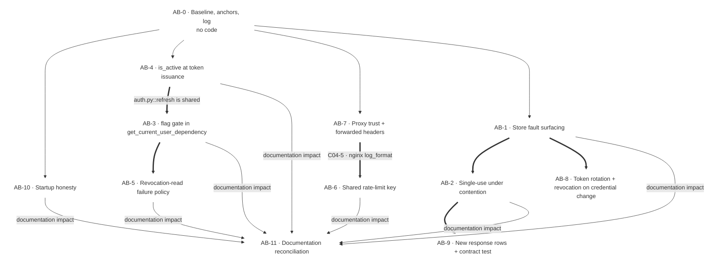

# Phase 04 — Authentication: Implementation Execution Plan

- **Status:** **EXECUTED.** Every block has landed. This plan is the phase's record, not its queue —
  §(d).1 is the per-record register and §(e)'s `blocked_by` lines are the gates **as they stood**.
- **Written:** 2026-10-02 · **Corrected:** 2026-10-03 (second session)
- **Base HEAD at writing:** `cea2d06` · **Verified at:** `29683df` · **HEAD now:** `474fd76`
- **Adjudicated owner rulings applied:** `.ai/decisions/ADJUDICATED-2026-10-03-product-owner-rulings.md`,
  clusters **2**, **10** (superseded in part), **11**, **12** and **13**.
- **Decision records: thirteen, not the twelve this plan declared.** `D-04-M` was **raised by the Tech
  Lead during `AB-8`** and landed with it (`4600e5d`). **Nothing is renumbered.**

## (a) Purpose and source anchor authority

This plan executes `.ai/plans/04-authentication-remediation-execution.md` (blocks `AB-0`…`AB-11`, decisions `D-04-A`…`D-04-L`) against the **verified** state of the tree at `29683df`. The Step-1 Auditor's verdict is **`matches-with-drift`**: every one of the twelve blocks' primary semantic target resolves at HEAD; nothing is absent, moved or renamed. Where the Auditor, the validated findings report and the source plan disagree, **the Step-1 Auditor's verified-at-HEAD result is authoritative** and the source plan's anchor is corrected in place.

Targets in this plan are always **symbols, modules, routes, config keys or tables — never line numbers**. Line numbers appear only inside quoted tool diagnostics, as evidence. **No audit file is ever edited**: `.ai/audit/**`, the sibling plans `00-`…`16-` and the code-context files are read-only references for this phase.

The phase discharges **8 `AUTH-*` findings** and **10 `VAL-04-*` records**, and raises no new finding of its own.

---

## (b) Drift reconciliation — `D1`–`D21` applied

The source plan was written against a tree that has since moved **15 commits past `2174895`** and **14 past `cea2d06`**. Each row below was re-measured against the tree at `29683df`; the "Verified" column is the result of that re-measurement, not a restatement of the plan.

| # | Item | Plan claims | Verified at `29683df` | Correction applied in this plan |
|---|---|---|---|---|
| **D1** | `mypy` baseline over the 8 named files | **19** pre-existing errors; gates "compare the count" | **1** error — `src/mkobi/api/routes/admin.py`, `no-any-return` on `get_users_admin_endpoint`. The plan's predicted categories (`AsyncClient.redis.pipeline`, `Dict`/`cast` union-attr) **do not fire**. | Every `mypy` gate re-baselined to **1**. Gates compare error **text**, not count. The single debt sits in `admin.py`, a module AB-1 / AB-2 / AB-9 all edit, and **must not** be silently cleaned inside an auth commit. |
| **D2** | `VAL-04-004` — `revoke_all_user_tokens` caller count | **8** src-level callers | **Exactly 1**: `api/routes/admin.py::update_user_active_admin_endpoint`, inside the `if not user_data.is_active:` branch. `revoke_refresh_token` → 1 caller (`auth.py::logout`); `revoke_token` → 1 caller (`auth.py::logout`). | **Report was right; reclassify `VAL-04-004` as report-correct.** AB-8's regression-risk and Agents rows are rewritten: the anchor is not fan-out inside phase 04 but phase-12's `AZ-9`, which plans to add the missing **reactivate** counterpart. |
| **D3** | `Z-10` / anchor authority — `core/permissions.py::get_current_user` | "does not exist"; module "139 lines" | The **symbol exists** (`get_current_user`); the module is **353 lines**. | Strike **only** the existence claim; keep `VAL-04-009` in full — the report's cited location really is past EOF, and the src-level caller census is **zero** (only `tests/test_permissions.py` imports it). |
| **D4** | `Z-08` / AB-4 Agents — `confirm_registration_endpoint` | "Live" | **Absent repo-wide.** | Deleted from `Z-08` and from AB-4's Agents row. AB-4's real token-issuing census is `login`, `login_form` (both via `_handle_login`), `refresh`, `register`. |
| **D5** | `test_x_forwarded_for_spoofing_ignored` | Cited by AB-6, AB-7 and the break table | **Absent repo-wide, no equivalent.** | AB-6 and AB-7 **must not cite it**. Its absence is itself a coverage gap and is the justification for AB-6's new test. |
| **D6** | `test_rate_limit_headers` | Cited as a symbol by AB-6 | Absent as a symbol; its assertions (429, `Retry-After` present) live **inside** `test_rate_limit_reset_allow_writes`'s sibling `test_login_rate_limit_exceeded`. | Re-cited to `test_login_rate_limit_exceeded`. AB-6's new assertions join that existing test rather than a phantom one. |
| **D7** | `tests/test_auth_me.py` + `test_token_expired_clears_state` / `test_falls_back_to_login_on_profile_failure` | Cited by AB-3 as the SPA gate | The **file does not exist**. The behaviours live in `frontend/src/shared/api/axiosInstance.ts` (phase 16) and in `tests/test_auth_api.py::TestCookieAuthFlow`. | Gates void; re-cited to `tests/test_auth.py::TestGetMe` and to the real `useAuth.test.tsx` `it(...)` names. |
| **D8** | `tests/api/test_force_password_change.py::TestForcePasswordChange` | Cited by AB-3 | Module absent; the real module is `tests/test_force_password_change_backend.py::TestForcePasswordChangeBackend` (four cases asserting the flag is present in the login body). | Re-cited — **the contract AB-3 must keep green exists under another name**, so AB-3's no-change verdict remains provable. |
| **D9** | `tests/test_change_password.py` + `test_wrong_current_password` / `test_same_password_rejected` | Cited by AB-8 | The **file does not exist**; the real coverage is `TestRegistrationApprovalForcePasswordChange` and `TestAdminResetPasswordEndpoint`. | Re-cited. The current-password-mismatch behaviour is pinned by `test_password_change_mismatch_returns_422`. |
| **D10** | `test_revoked_token_rejected` | Cited by AB-4, AB-5 and the break table | Real name is **`test_revoked_token_returns_401`** (`tests/test_token_revocation.py::TestTokenRevocation`). | Re-cited in all three places. |
| **D11** | `tests/test_starter.py::test_ensure_admin_user` | Cited as AB-10's coverage | **No such symbol.** The two nearest — `test_ensure_admin_user_rejects_placeholder_password` and `test_ensure_admin_user_warns_and_proceeds_in_development` — cover **only** the weak-credential guard. **Nothing covers the `ON CONFLICT (email) DO NOTHING` insert or the unconditional success log**, i.e. nothing covers AB-10's target. | AB-10's coverage note now says so explicitly: `-k "test_ensure_admin_user"` matches **two** tests while proving **nothing** about the inserted-vs-conflicted distinction. AB-10's evidence is therefore a **new** test, not an extension. |
| **D12** | Nine further absent `-k` symbols | `TestLoginEndpoint`, `TestRegistrationRequest`, `TestPasswordResetEndpoints`, `TestRegistrationEndpoints`, `test_refresh_token_flow`, `test_refresh_token_revoked`, `test_wrong_current_password`, `test_same_password_rejected`, `test_password_reset_admin` | All nine resolve to **zero tests**. Each has a named live replacement (see the corrected verification census). `test_register_request_rate_limit_exceeded` **does** still match the source plan's `-k "test_register_request_rate_limit"` prefix. | Every such gate rebuilt against a live symbol. Where a prefix still matches, that fact is stated rather than assumed. |
| **D13** | Frontend `test_on_user_init_redirect` / `test_after_refresh_redirect` | Cited as test names | They are `it(...)` cases inside `describe('force_password_change redirect')` in `frontend/src/features/auth/model/__tests__/useAuth.test.tsx` — **three** cases. | Re-cited to the real `it(...)` names. Frontend gates use vitest's `-t` filter, **not** pytest's `-k`. |
| **D14** | `C04-2` recorded open (the `architecture.md` SAVEPOINT and warning-scope sentences) | "correction required by phase 03" | **Discharged by `7feb3b6`**, which corrected *both* the SAVEPOINT sentence and the production-raise-vs-warn scope sentence. | Removed from the seam register; **AB-11's `architecture.md` row is removed from R9**. Handing phase 03 a fixed defect would be worse than silence (same principle as D16). |
| **D15** | R9 omits a doc claim AB-4 falsifies | Not listed | `7feb3b6` added `docs/06-backend/architecture.md` §"Account Deactivation: Two Authorities", whose `POST /auth/login`, `POST /auth/login/form` row reads authority **"neither"** and states `is_active` is compared nowhere in `src/mkobi` except the one dependency. Its `POST /auth/refresh` row also becomes incomplete once AB-4 lands, and its third ordered reason names the login gap as the phase-04 finding. | **Added to R9, owned by AB-4** — both the `login` row and the `refresh` row. |
| **D16** | `Y-02` / `C04-6` — the `rollback()` docstring is "factually wrong" | "correction required by phase 03" | At HEAD the endpoint has a **separately guarded** revoke block that raises `AppException`, and the handler's `except AppException: raise` clause means that exception **never reaches** the `await db.rollback()`. The comment is therefore **accurate**. | **Re-verify before any hand-over.** The source plan's premise is refuted; handing phase 03 a non-defect is worse than silence. The genuine adjacent gap is that the **reactivate branch never clears the marker** — phase-12's `AZ-9`. |
| **D17** | Out-of-scope row — `config.py`'s inline weak-username copy "inside `ensure_admin_user`" | "the inline copy the plan describes as a phase-01 hand-over" | The method **imports and calls** `is_weak_admin_username(admin_email)`. No inline copy survives. | Row dropped/re-worded — a hand-over must not name code that is gone. |
| **D18** | AB-4 priced — "`refresh` must add a row read it currently does not perform — the only real work" | A new query on `refresh` | `refresh` **already** loads the row and has `user` in hand at the `create_access_token` call. | **AB-4 re-priced**: the `refresh` half is a **two-line comparison, no new query**. AB-4 becomes the cheapest **code** block in the phase; its documentation cost rises (D15). |
| **D19** | `VAL-04-002` — the hard-coded key literal | "a literal copied from the route; fragile" | Stronger: `async_client`'s `MockRedis` and `strict_redis`'s `MockRedis` are **different instances** with independent `_data` dicts, so `_data.pop(...)` **cannot** clear the bucket the route filled **whatever the key string is**. `tests/conftest.py::async_client` already publishes the app's instance as `app.state.mock_redis`. | AB-6's remedy must reach **the app's instance or share the fixture, in addition to** deriving the key. **A literal-only fix leaves a vacuous test.** `tests/conftest.py` ownership is named explicitly in AB-6. |
| **D20** | "HEAD has moved 6 commits" | 6 past the anchor | **15** past `2174895`, **14** past `cea2d06`. Nine further commits audited: **none touches a phase-04 semantic target.** Three touched `src/mkobi/config.py` adding `DATABASE__LOCK_TIMEOUT_MS`; `rate_limiter_fail_closed` is unchanged at `default=True`. | Anchor re-stated. Phase-01's `C04-3` surface is named as the only boundary that moved. |
| **D21** | `Y-09` — `AuthService._rate_limiter` | confirmed live | Confirmed live. `AsyncRateLimiter(` construction sites in `src/`: **6** — three route-owned in `api/routes/auth.py` (`_handle_login`, `refresh`, `register_request`), one private in `services/auth_service.py`, plus `api/routes/client_errors.py` and `api/routes/upload.py` (phase-07's `C04-9`). | Keep `C04-9`'s scope statement honest if `D-04-D` rules a shared key helper. *(The step-1 brief said "5" against a six-item breakdown; the verified count is 6 and is used here.)* |

**Departures from the source plan are recorded, never silently applied.** Every row above maps to a named section of this plan; none changes a block's identity, a decision's identity, or an `AUTH-*` / `VAL-04-*` record's identity.

---

## (c) Verified target census at `29683df`

All twelve blocks' primary targets are present. Nothing is absent, moved or renamed.

| Module | Phase-04 semantic targets | Status |
|---|---|---|
| `src/mkobi/services/auth_service.py` | `AuthService.{__init__, login_user, register_user, create_user, change_password, reset_password_admin, approve_registration_request}` | Present. `login_user` has **zero** `is_active` occurrences module-wide. `change_password` touches **no** revocation state. `__init__` takes `temp_password_store: TempPasswordStore \| None` and owns a private `self._rate_limiter`. |
| `src/mkobi/api/routes/auth.py` | `_handle_login`, `login`, `login_form`, `register`, `refresh`, `logout`, `change_password`, `register_request`, `get_current_user_info` | Present. `_handle_login` is shared by `login` and `login_form`, keys `login:{client_ip}`, 5/300 s, charged **before** `login_user`. `refresh` keys `refresh:{client_ip}`, 10/300 s, calls `is_refresh_token_revoked` then `is_user_tokens_revoked`, **already loads the user row**, and returns `Token(access_token=…)` with **no** `set_secure_cookie`. `set_secure_cookie` appears **exactly once**, in `_handle_login`. `register_request`'s limiter is built from `get_async_redis_client()`, **not** the DI dependency. |
| `src/mkobi/api/routes/admin.py` | all nine endpoints: `get_users_admin_endpoint`, `update_user_role_admin_endpoint`, `delete_user_admin_endpoint`, `update_user_active_admin_endpoint`, `reset_user_password_admin_endpoint`, `get_registration_requests_admin_endpoint`, `approve_registration_request_admin_endpoint`, `reject_registration_request_admin_endpoint`, `retrieve_temp_password_admin_endpoint` | Present, exact names. The `no-any-return` mypy debt (D1) sits in `get_users_admin_endpoint`. |
| `src/mkobi/api/deps.py` | `get_current_user_dependency`, `get_auth_service`, `get_temp_password_store`, `get_redis_client_dependency`, `require_admin_role`, `AdminUser` | Present. `get_current_user_dependency` takes `(token, db, redis_client)` — **`Request` is not a parameter**. Order: `is_token_revoked` → `is_user_tokens_revoked` → `UserRepository().get` → `is_active` → `return cast(UserRead, …)`; terminal `except Exception` → `AUTHENTICATION_FAILED` / 401. `get_auth_service` is the **single** src-level `AuthService` construction site. `get_redis_client_dependency` is the suite's override seam. |
| `src/mkobi/core/security.py` | `is_token_revoked`, `is_user_tokens_revoked`, `is_refresh_token_revoked`, `revoke_token`, `revoke_refresh_token`, `revoke_all_user_tokens`, `AsyncRateLimiter` | Present. **All three revocation reads are unguarded** — no `try`/`except` around the Redis `exists(key)`. `revoke_all_user_tokens` writes `setex(key, max(access_ttl, refresh_ttl), "revoked")`. `AsyncRateLimiter.__init__(redis_client, fail_closed=False)`. |
| `src/mkobi/core/temp_password_store.py` | `TempPasswordStore.{store, retrieve}` | Present. `store` returns `None`, docstring "Fails open on Redis errors", `except Exception` → `logger.error`, **no re-raise**. `retrieve` returns **`str \| None`** (not a 3-tuple), `pipeline(transaction=True)` with `get` + `delete`, `except Exception` → `logger.error` → `return None`. **Two** collapsed states; no expiry concept. |
| `src/mkobi/core/permissions.py` | `_get_current_user_with_session`, `get_current_user` | Present (**both**). Module is 353 lines. Src-level caller census for `get_current_user` is **zero**. |
| `src/mkobi/db/starter.py` | `DatabaseStarter.ensure_admin_user` | Present. `async with db.begin():` → a single `INSERT … ON CONFLICT (email) DO NOTHING` with **no result object captured and no `rowcount`**; `logger.info("Admin user ensured: %s", admin_email)` is logged **unconditionally** after the block. Calls the shared predicate `is_weak_admin_username(admin_email)` — the inline weak-username copy the source plan describes as a phase-01 hand-over **no longer exists** (D17). |
| `src/mkobi/api/schemas/responses.py` | `auth_public_responses`, `auth_protected_responses`, `admin_responses` | Present. `admin_responses = {401,403,404,422,429,500}` — **no 503**. `auth_protected_responses` and `auth_public_responses` likewise carry no 503. |
| `src/mkobi/models/enums.py` + `src/mkobi/utils/exceptions.py` | `ErrorCode.{SERVICE_UNAVAILABLE, RATE_LIMIT_EXCEEDED, AUTHENTICATION_FAILED, TOKEN_REVOKED, PERMISSION_DENIED}`; `AppException`; `add_exception_handlers` | Present and mapped: 503 / 429 / 401 / 401 / 403. |
| `frontend/src/shared/api/errorMessages.ts` | `SERVICE_UNAVAILABLE`, `TOKEN_REVOKED` | **Already present.** No phase-04 frontend edit is required to surface either code. |
| `docker/Dockerfile` | dev target `CMD` (uvicorn, port 8000), prod target `CMD` (adds `--workers 4`), test target `CMD` (`pytest tests/ -v`) | Present. **No proxy argv at any of the three sites.** |
| `docker/docker-compose.override.yml` | `app.command` (`--reload --reload-exclude /app/tests/`) | Present. **No proxy argv.** |
| `docker/docker-compose.yml` | `app` service `command:` | **Absent** — the image `CMD` is authoritative. The two `command:` entries present belong to `migrate` and `rq-worker`. |
| `docker/nginx/nginx.conf` | `access_log`; `location /api` header block | Present. **No `log_format` anywhere.** `location /api` sets `X-Real-IP` / `X-Forwarded-For` / `X-Forwarded-Proto`. |
| `frontend/vite.config.ts` | `server.proxy['/api']` | Present: `{ target: 'http://app:8000', changeOrigin: true }` and **nothing else** — confirms `VAL-04-003`. |

### The six unguarded revocation-read sites

Every call site of the three unguarded reads in `core/security.py`. This is the complete implementation surface of `VAL-07-004` as it lands in phase 04.

| Reader | Call sites |
|---|---|
| `is_token_revoked` | `deps.py::get_current_user_dependency`, `permissions.py::_get_current_user_with_session` |
| `is_user_tokens_revoked` | `deps.py::get_current_user_dependency`, `auth.py::refresh`, `permissions.py::_get_current_user_with_session` |
| `is_refresh_token_revoked` | `auth.py::refresh` |

### `revoke_all_user_tokens` caller census — the `D2` reclassification

| Function | src-level callers |
|---|---|
| `revoke_all_user_tokens` | **1** — `admin.py::update_user_active_admin_endpoint`, inside `if not user_data.is_active:` |
| `revoke_refresh_token` | 1 — `auth.py::logout` |
| `revoke_token` | 1 — `auth.py::logout` |

The phase-04 code context independently concurs on this count. There is **no fan-out inside phase 04** to fear: the only schedule change is phase-12's `AZ-9`, which plans to add the **reactivate** counterpart — and phase-12's `AZ-13` plans to **delete** both `permissions.py` identity symbols. Both are recorded in the seam register and re-anchored in AB-8.

---

## (d) Verification baseline, measured at `29683df`

| Command | Source plan's claim | **Measured** |
|---|---|---|
| `uv run ruff check src/mkobi/` | "sees none of the defects" | ✅ `All checks passed!` — **0 findings** |
| `uv run mypy src/mkobi/` | clean | ✅ `Success: no issues found in 118 source files` — **0 errors** |
| `uv run mypy` over the 8 named files | **19** pre-existing errors | ❌ **1** error: `src/mkobi/api/routes/admin.py`, `Returning Any from function declared to return "list[Any]"  [no-any-return]`, in `get_users_admin_endpoint`. The plan's predicted categories **do not fire**. |
| Test stack | — | ❌ **DOWN.** `docker compose -p mkobi-test -f docker/docker-compose.test.yml ps` → **empty**; `test-db` and `test-redis` are not running. |

**Entry point.** `.\Makefile.ps1 test-up` must run **before any block in this phase**. Every per-block test gate in this plan is unrunnable until the test stack answers. AB-0 owns bringing it up and recording the result; no other block may start first.

**The standing rule is do-not-regress, not make-it-green.** `uv run mypy src/mkobi/` and `uv run ruff check src/mkobi/` are **clean at HEAD** and must stay clean. They are stated here as the floor, not as the goal.

**A green corpus `mypy` and a clean `ruff` are not verification statements for any block in this phase.** Both tools are structurally blind to every defect this phase discharges: an unguarded Redis `exists`, a swallowed `store` fault, a hard-coded rate-limit key, an unconditional startup log, and a `permission_error` raise inside `login_user` all lint and type-check clean. Per-block verification in this plan is therefore **behavioural** — a named test that fails before the block and passes after, or a named test that must keep passing.

**On the single `mypy` debt.** It sits in `admin.py`, a module AB-1, AB-2 and AB-9 all edit, which makes it tempting to clean in passing. It must not be: the debt predates the phase and belongs to no `AUTH-*` finding, so fixing it inside an auth commit would attribute unrelated change to a security fix and enlarge every review of AB-1 / AB-2 / AB-9. `mypy` gates in this plan compare **error text**, not count — if a block's diff makes the count two, the new error is the finding.

---

---

## (d).1 Decision records

**This section did not exist in this plan's body. Its frontmatter declared twelve records and its block
map referenced five of them; nothing restated them.** That is a defect in the plan, not in the phase, and
a register a reader cannot find is worse than a wrong one — because it sends the Implementor looking for
decisions in a place the answer has just been given.

**What this section restores, and what it corrects at the same time.** Thirteen records, not twelve, and
**every one is RULED and LANDED**. Two facts make that necessary rather than tidy:

1. **Phase 04 executed while this plan was being written.** Every `AB-0`…`AB-11` block is in the tree,
   and each commit body names the `D-04-*` ruling it executed. This plan is the phase's record, not its
   queue, and §(b)'s "pending" markers are historical.
2. **The tree disagreed with two of the rulings.** `D-04-F` and `D-04-L` were ruled one way and shipped
   another. **Both were arbitrated by the Product Owner on 2026-10-03 (register cluster 14) and neither
   divergence remains open.** `D-04-F` is confirmed as shipped; `D-04-L` is confirmed as ruled and the
   shipped production branch is **reversed by scheduled work** — see the two rows below. **The
   prohibition that stood here while the questions were open is lifted, and it is replaced by something
   narrower and more useful: the divergence is settled, and the *shape* of what remains is stated per
   record.**

**A thirteenth record, `D-04-M`, exists in the tree and is absent from this plan's declared twelve.** It
was **raised by the Tech Lead during `AB-8`** (`4600e5d`), because the first implementation of the
`D-04-J` revocation could not express credential rotation. **Nothing is renumbered**: `D-04-M` is
appended at the end, exactly as the tree appended it.

| ID | Subject | Chooser of record | Status — ruled, landed, and the correction |
| - | ------- | ----------------- | -------------------------------------------------- |
| `D-04-A` | Whether a temporary password can ever be reported as issued | **Tech Lead** | **RULED (a), reporting — LANDED `7cf0623`.** Both issuance routes keep **HTTP 200**; only the body becomes truthful. `TempPasswordStore.store` returns `bool`; both services propagate it as `credential_stored` and emit an ERROR naming the affected **user id and admin id** when it is `False`. **Two distinct messages**, because a swallowed Redis fault and a missing store are different defects and one message would send an operator to the wrong component. **`True` means no client-visible Redis error occurred — not that the value is durable and readable**, which is why the key is named `credential_stored` rather than something like `credential_retrievable`. The commit-then-store ordering is unchanged, and its rationale is unchanged: Redis is not transactional, so a credential written before the commit becomes durable independently of the database. **Residual, by design:** an administrator still holds a `retrieval_token` for a credential that was never stored. **What improved is that the response and the log now say so.** |
| `D-04-B` | Where `force_password_change` is enforced | **Tech Lead + Coordinator** — it is a published-contract change | **RULED (e), a blend — LANDED `1fd6e69`.** **403 `PERMISSION_DENIED`, no new `ErrorCode`.** 401 was rejected because the SPA's axios interceptor answers any 401 with a silent refresh and, on failure, signs the user out through `/login`, **turning the refusal into a redirect loop**; middleware was rejected as duplicating the token decode outside the `ErrorCode`/`AppException` chain; a per-route dependency was rejected as the highest churn for the same policy. The gate is the single dependency every protected route passes — `get_current_user_dependency` — running **after** the `is_active` check and immediately before the return. The allow-list is **four entries, each with a stated reason** (change-password, refresh, logout, `/auth/me`), the predicate is **named** `is_password_change_completion_path` and unit-tested directly with no request pipeline, and the flag is read from the already-loaded `UserRead`, so **no query was added**. **The user-visible outcome is cluster 13 `P8`** — a single reachable "Set a new password" screen — and the four-entry allow-list *is* that contract server-side. **The finding is inherited from the UI half and is NOT a phase-03 gate**, as §(e) says. |
| `D-04-C` | Whether the single-use guarantee is real, and what a store fault reports | **Tech Lead** (shared with `VAL-04-008`) | **RULED per sub-question, both LANDED — `478015b`, corrected by `70cb9fd` and `87dd36d`.** *(Not the "investigate-first gate" this plan called it: the gate ran, passed, and is closed.)* **Sub-question 1 — is the single-use guarantee real?** **Yes, verified before any production change.** The in-process `test_retrieve_concurrent_claimants_single_winner` **demonstrates the call sequence and cannot fail by construction** — `MockRedis.pipeline` accepts `transaction` and discards it, so GET-then-DELETE is serialised by the absence of an `await`. A genuine two-claimant script against the **live test Redis**, using a real `redis.asyncio` pipeline with `transaction=True`, returned exactly one winner. `70cb9fd` **committed** that as `test_retrieve_concurrent_claimants_single_winner_real_redis` — which skips cleanly when no server is reachable — and rewrote the SPEC row and the security-overview table to say **which** test observes the guarantee and **which** cannot. **No unconditional claim was restored.** **Sub-question 2 — what does a store fault report?** **503, and fails loudly.** **404 is rejected**: it reads as "no temporary password exists" and hides an outage. `TempPasswordStoreUnavailableError` is declared **co-located above the class**, mirroring `core/permissions.py` — `core/` never imports `mkobi.utils.exceptions` or `mkobi.models.enums`, and **no shared `core/errors.py` was created**. The 503 is applied to the retrieval route only, via `responses={**admin_responses, 503: error_503}`, **never by mutating the shared dict**, which is the phase's own rule. `87dd36d` later **removed** the 503 that `407d770` had wrongly added to `auth_public_responses`, because login, login-form and register-request fail **closed** on a Redis fault and can never produce a 503. **The asymmetry with `store` is deliberate and is a function of blast radius**: `store` fails open because by the time it runs the caller has already committed the credential; `retrieve` fails loud because a fault there costs nothing to surface and reporting "not found" is a lie the caller cannot detect. **Residual, stated in the commit body:** a 503 is indistinguishable from any other upstream outage by status alone — the detail string is the only discriminator. |
| `D-04-D` | How the abuse rate limit is keyed | **Tech Lead** | **RULED, and LANDED in two commits — `659734e` then `5ac2ea3`.** **Keyed per identifier as the primary bound, plus a generous per-IP ceiling. Per-IP-only is rejected**: an office NAT or a shared egress would lock out many legitimate users. Adjudicated register **cluster 12** confirms the landed shape; cluster 13 `P7` adds only what the user is shown and **does not change the bound**. **`659734e` shipped the dual bound and `5ac2ea3` corrected it — and the correction is the substance of the ruling:** the first pass set both bounds to the same number, which did **not** deliver the availability property the finding asks for. Exhausting one identifier's budget also exhausted the shared peer bound, and a sixth legitimate login behind one NAT was denied. The peer ceiling is now **10× the identifier bound at every site** (login 5/300 s vs 50/300 s, refresh 10/300 s vs 100/300 s, register-request 3/3600 s vs 30/3600 s), expressed as a **stated ratio** rather than three unrelated literals, so the tuning decision stays reviewable. Both numbers remain **literals in `api/routes/auth.py`, adjacent to each other**, with the ratio in a comment; **no new `Settings` key**, so no other phase's config file is touched. The derivation lives in **one** place — `_rate_limit_keys` — used by all three sites. **Excluded by name:** `api/routes/client_errors.py` and `api/routes/upload.py` derive IP keys the same way but belong to another phase (`C04-9`), and the helper's docstring says so. **`407d770` closed a bypass found on the way:** `register_request` used `str(ip_address(request.client.host))`, which **raises on a non-IP peer** and produced a 500 where a 429 was intended. `_resolve_client_ip` now falls back to a sentinel that still rate-limits. **No `ErrorCode` was added** — `RATE_LIMIT_EXCEEDED` already exists. |
| `D-04-E` | Trusted-proxy configuration and `POST /auth/refresh` | **Coordinator** — the `nginx.conf` half is phase 10's | **RULED, and LANDED `01ea7e4`, on option (a) in substance.** `FORWARDED_ALLOW_IPS` is set through the **compose environment** (`"${FORWARDED_ALLOW_IPS:-172.21.0.0/16}"`), **not** a `CMD` argv: it is tier-scoped without duplicating the value across three argv lists, operator-overridable without an image rebuild, and need not be known at build time. The development override sets `"127.0.0.1"` — **trust nothing, explicitly** — so the tier difference stays visible. **Wildcard trust (`*`) was considered and rejected as worse than the defect**: it returns the left-most, fully client-controlled forwarded entry with no untrusted-hop walk, converting an availability defect into a brute-force bypass at internet scale. **`docker/nginx/nginx.conf` and `Dockerfile` were deliberately not touched**, and this plan's line that `nginx.conf` needs no change is **correct and recorded as verified**. **Residual, stated not solved:** the subnet is still auto-assigned by Docker, so the default is a property of the *reference host*; a deployment on a different subnet must set the variable explicitly, **and a mismatch produces no log output**, because uvicorn's `proxy-headers` module does not log. A wrong value fails **safe** (no peer trusted, one bucket), not open. The durable fix — an explicit `ipam` subnet in `docker/docker-compose.yml` — was **handed over, not done**, because it would force recreation of a shared network that other work depends on. **No pytest can observe this change and none pretends to**: the middleware is installed by `uvicorn Config.load`, which pytest never invokes. |
| `D-04-F` | What happens when Redis is unreachable | **Product Owner — cluster 2 ruled fail-open; cluster 14 confirms the shipped fail-closed** | **RULED (cluster 14, Product Owner, 2026-10-03): FAIL CLOSED with a dedicated 503 — the shipped behaviour, confirmed.** Cluster 2's fail-open entry is **struck in place** in the register, with its reasoning retained and its reasoning's flaw named: **the session store is the session boundary, and a refusal is visible while a bypass is silent.** Landed as `5b6cceb` plus `87dd36d` for the OpenAPI half. The three revocation readers in `core/security.py` raise a co-located `RevocationStoreUnavailableError`; `get_current_user_dependency` maps it to **503 `SERVICE_UNAVAILABLE`** and `POST /auth/refresh` likewise. A genuine revocation over a healthy store still answers 401 `TOKEN_REVOKED`, so **only the unreachable case is in scope** and the revoked case is unchanged. **No new `ErrorCode`** — `SERVICE_UNAVAILABLE` already exists, already maps to 503, and needed no frontend entry. **The one requirement that survives from cluster 2 is the logging one and it is load-bearing: every revocation-read store fault must be logged at WARNING or above.** "Fail loud" means the operator is told, not only that the user is refused; a 503 with no log line is an outage nobody can diagnose. **REJECTED, and kept visible:** **(b) fail open with a logged degraded mode** — it is what cluster 2 said, it is intuitive on availability grounds, and its cost is *silent*: a revoked or deactivated user keeps access for the duration of an outage with nothing anywhere recording it. **(c) fail closed plus a bounded degraded mode** — the report flagged this as acceptable and it was put to the owner for exactly that reason; it is rejected because the bound is a TTL on the revocation marker, and **a TTL is precisely the defect `D-04-M` exists to fix** (a bare existence marker cannot distinguish an already-issued credential from one minted afterwards). **Option (c) is not rejected as a bad idea; it is rejected as a collision with a ruling this same register made the same day, and that collision is the reason.** **Residual: documentation only** — `AB-11`'s scope, plus the rate-limiter non-conflation note, which now says the two surfaces are both fail-closed **by coincidence of direction and not by shared decision** |
| `D-04-G` | What lands first: the docstring correction or the core block | **Planner** | **OPEN — and this plan's own reduction of it stands, unchanged.** Largely **moot**: the phase's block order decided it, because `AB-3`, `AB-4`, `AB-5` and `AB-6` **all landed before** the documentation correction, which is why `70cb9fd` and `57064fa` exist as separate follow-on commits. What actually survives is the governance question `C04-6` names: **does `AB-4`'s docstring correction ride with `AB-4`, or as a phase-03 follow-up?** It rode with neither — it rode with `70cb9fd`, two commits later. **`blocked_by` on `AB-4` is retained**, for the same reason as `D-04-F`: the record is open, and the work finishing does not close a question. |
| `D-04-H` | Whether there is any usable `docs/08/security/access-control.md` content | **Coordinator** | **CLOSED — answered by the tree, not by a decision.** `70cb9fd` and `57064fa` **verified the existing file against the landed code** and found it already describing the `AB-3` gate and the four-entry allow-list accurately — **including** the fact that `core/permissions.py` has **zero production callers** (verified: only `tests/test_permissions.py`). Nothing needed writing; the decision was only ever "create the file or not". |
| `D-04-I` | Where `is_active` is checked on token issuance | **Product Owner — cluster 2, merged from `DP-12-E`; carried here unchanged** | **RULED, and LANDED `62b859a`.** Behaviour: **`is_active` is authoritative on both token-issuing paths** (INPUT B's "every request" merged with `DP-12-E`; the authoritative scope is the token-issuing surface and `deps.py`, which was already covered). Commit shape: **two commits** (INPUT A). Code: **`AUTHENTICATION_FAILED`**, **no new `ErrorCode`**. *(Cluster 2 rules `D-04-F` and `D-04-I` together; this row carries the `D-04-I` half unchanged, and `D-04-F` is carried above.)* **Two different treatments, and the difference is the point.** `login_user` returns `None` for a deactivated row after `verify_password` and **before** the success log, so `None` is already what a wrong password produces — the deactivated account is refused with 401 and the existing `"Invalid credentials"`, and **is not an account-existence oracle**. **No `AppException`/`ErrorCode` dependency was added to `login_user`**; one separate logger line keeps operator visibility. `refresh` is **co-authoritative** with the marker: the check sits **strictly after** the `is_user_tokens_revoked` branch, so a deactivated-**and**-marked user keeps receiving `TOKEN_REVOKED` byte-identically, mirroring `get_current_user_dependency`'s ordering. It uses the **same detail string** `deps.py` uses and does **not** call `delete_secure_cookie`. The Redis user-level-marker path and the `TOKEN_REVOKED` contract are **unchanged**, and the pinned `TestUserDeactivationRevocation`, `TestRefreshBlacklist`, `TestDeactivation` and `TestForcePasswordChangeBackend` classes stay green **unmodified**. **Rollout consequence, stated honestly in the commit body:** accounts deactivated **before** this change whose Redis marker has since expired or been flushed **will now stop working** — the intended outcome, which will be reported as "users got logged out". **A `reactivate`-branch marker gap exists and is not fixed here**; it belongs to a later phase and is named as such. |
| `D-04-J` | Whether session revocation follows a credential rotation | **Tech Lead** (shared with `D-04-M`) | **RULED per sub-question, and LANDED `4600e5d`.** **Changing one's own password DOES end that user's other sessions; an administrative reset DOES end all of that user's sessions; refresh DOES NOT rotate the cookie.** *(Cluster 2's earlier "option (a) on all three" predates these sub-answers; the cluster-12 ruling is operative and is what shipped.)* Revocation runs **after** the service commit on both paths, following `update_user_active_admin_endpoint`, so the credential change is **durable before** the non-transactional marker write. **The presented refresh token is deliberately NOT revoked on rotation**; reuse detection is deferred because its cross-tab false-positive risk is **a client decision owned by the frontend's phase**, and the residual is stated: the previous cookie stays valid until its own TTL. The per-`jti` blacklists are untouched — `revoke_token`, `revoke_refresh_token`, `is_token_revoked` and `is_refresh_token_revoked` keep storing and testing the literal `'revoked'` with `exists()`, because they are per-token, have no ordering problem, and `logout` depends on them. **The user-visible outcome is cluster 13 `P6`.** |
| `D-04-K` | Where a retrieval handle may travel | **Tech Lead** | **RULED per sub-question, and LANDED `be0d779`.** **The handle leaves the request line; the legacy `GET` still serves and is deprecated for one release — removal named: release 1.0.9.** A `POST /api/v1/admin/temp-passwords` takes the handle from a request body field; both operations enforce the `AdminUser` guard and share one implementation, so the 404 (expired, already-retrieved, never-existed), 403 (non-admin) and 503 (store fault) behaviour is byte-identical. **No new `ErrorCode` was added** — `NOT_FOUND`, `PERMISSION_DENIED` and `SERVICE_UNAVAILABLE` already cover the three refusal states. **The frontend moved in the same commit rather than being handed over**, and the reason is stated rather than assumed: `retrieveTempPassword` in `adminApi.ts` is the operation's only caller, and two admin routes serving one resource over divergent transports would have left the old call exercising only the deprecated path. **Hand-over, not fixed here:** the `nginx` half is `C04-5`. `docker/nginx/nginx.conf` declares no `log_format` and writes the full request line in the default combined format, so a legacy `GET` path still appears in its access log while a `POST` body does not. **The documentation, not just the code, says so** — in `admin-api.md`, `security-overview.md` and the `AB-9` SPEC row — so the finding is registered as **open** rather than implied closed. |
| `D-04-L` | How a non-admin occupying the configured admin address is treated | **Tech Lead; confirmed by the Product Owner, cluster 14** | **RULED (cluster 12, confirmed and extended by cluster 14, Product Owner, 2026-10-03): WARN NAMING THE ACCOUNT AND ITS ROLE, AND STARTUP CONTINUES — IN EVERY ENVIRONMENT, INCLUDING PRODUCTION. Refusing to start is rejected outright.** **The shipped `34c9459` is REVERSED BY SCHEDULED WORK: its production branch, which raises `ValueError`, must become a warning.** That branch is one conditional in `services/starter.py::ensure_admin_user`; it touches **no stored row** and no query shape, which is why the reversal is cheap and was never worth a migration debate. **`src/` is out of scope for this document pass, so this plan records the obligation and names its owner — it does not perform it.** **Owner of the reversal: `AB-10`, the same block that shipped it.** The `SELECT` stays minimal — `role` and `id` only, **no `password_hash` read or comparison, and no credential logged.** `created` and `already existed` are distinguishable by `rowcount`, which is what makes the pre-deploy false-success log correctable: the old unconditional `"Admin user ensured: <email>"` was identical whether a row was created or the conflict clause matched. **Why warning-and-continue is right, and `P10` is the reason that decided it:** cluster 12's own argument is that a boot failure on a configuration that is wrong *today and wrong invisibly* converts a misconfiguration into an outage. **The stronger reason is that `P10` requires a persistent warning in the administration area, and an administration area is unreachable in a deployment that refuses to boot — so the two rulings are mutually exclusive and cluster 14 chooses `P10`.** **REJECTED, and kept visible:** **(b) refuse in production only** — the objection in its most concentrated form, since the environment that matters most is the one that would refuse to boot, and a development environment that continues would teach an operator the check is advisory. **(c) refuse in every environment** — same objection uniformly, and strictly worse, because it also removes the operator's chance to fix the misconfiguration from inside the running system |
| `D-04-M` | *(raised during `AB-8`; absent from this plan's declared twelve)* | **Tech Lead**, raised mid-implementation | **RULED and LANDED `4600e5d`.** The first implementation of `D-04-J` used `revoke_all_user_tokens` as a **bare user-level marker**, whose value was the literal `'revoked'` and whose reader tested only key existence. **That cannot distinguish an already-issued credential from one minted afterwards**, so after a password change every later login was refused for the marker's full 7-day TTL. **The Implementor HOLDed and the Tech Lead ruled.** The marker is now **timestamped to the epoch at which the revocation happened**, and `is_user_tokens_revoked(redis_client, user_id, issued_at)` reports *revoked* only when the credential's `iat` is **at or before** that instant. **Precision is milliseconds, not seconds**: at one-second granularity a re-login in the same second as the change shares the marker's instant, and the fail-closed `<=` comparison rejects it — which made the registration-flow canary flaky. `create_access_token` and `create_refresh_token` now carry an `int iat` in epoch milliseconds. **Three fail-closed arms, all tested:** a missing key is **not** revoked; a value that is not a parseable integer (for example the legacy `'revoked'` literal left by a deployment that has not restarted) **is** revoked, so a rolling deploy never re-admits withdrawn sessions; a credential with **no** `iat` is revoked. **Nothing is renumbered** — `D-04-M` is appended at the end, as the tree appended it. |

### (d).1.1 Records cluster 13 added to this phase's surfaces

Four rulings from `.ai/decisions/ADJUDICATED-2026-10-03-product-owner-rulings.md` **cluster 13** bear on
this phase. **None changes a bound, a status code or a stored value; each is the user-visible outcome
the corresponding mechanism now has to produce.** They are recorded here because this phase owns the
backend behaviour they describe, and in plan 13 because it owns the screen.

| Ruling | Surface | The acceptance criterion, stated as the user sees it |
| ------ | ------- | -------------------------------------------- |
| **`P6`** | `AB-8` (`D-04-J`) | The user sees the **normal login screen with no explanation.** **Rejected:** "Your session was ended because your password was changed"; a generic "session expired" notice. **The generic notice is also wrong, and this is the reason the ruling is narrower than it looks:** a "session expired" message would misreport a deliberate, user-initiated action as a session fault. |
| **`P7`** | `AB-6` (`D-04-D`) | The throttled user sees **"Too many attempts. Try again later"** — **no countdown, no remaining-attempts display.** **Rejected:** a countdown (it teaches an attacker the window and creates a second contract to keep correct); a remaining-attempts display (it turns a rate limit into an oracle). **The bound is unchanged** — per-identifier primary with a per-IP ceiling. |
| **`P8`** | `AB-3` (`D-04-B`) | After login the user lands on a **single reachable screen, "Set a new password", which states the reason. The rest of the application is inaccessible.** **Rejected:** a dashboard banner with the app still usable (it leaves a flagged user's other sessions and every screen reachable, which is the exposure the finding exists to close); login blocked with an error until an administrator resets the password (the user is stuck behind an operator who may not exist). **This rules the user-visible half of `D-04-B`, not the enforcement point**, which was already ruled (e) and landed — and the four-entry allow-list in `1fd6e69` *is* that contract server-side: those four routes are the "single reachable screen". |
| **`P9`** | `AB-2` (`D-04-C`) | The administrator sees **"Temporarily unavailable — try again in a minute. Your request was not applied"** with a **Retry** control. **Rejected:** the same message with no Retry (the administrator cannot act on it); a message implying the reset may have succeeded — `D-04-C`'s residual says a 503 is indistinguishable from any other outage by status alone, so **the reassurance has to be in the text**. **"Not applied" is a claim, and it is true only because the failed retrieval cannot have written a credential.** |

**And one that bears on this phase without landing in it — `P10`**, recorded against `D-04-L` above and
repeated here because the ordering is now settled rather than conditional: **`AB-10`'s reversal unblocks
it, and nothing else does.** `P10` requires a **persistent warning in the administration area** until the
misconfiguration is resolved. **That surface could not exist while a production startup refusal was
shipped, because an administration area is unreachable in a deployment that will not boot.** Cluster 14
settles the direction — *warn in every environment, never block startup* — so `AB-10`'s production branch
becomes a warning, and `P10` becomes buildable. **The owner of the surface is plan 13's `CT-11`; the owner
of the unblocking change is `AB-10`; neither is plan 13's and neither is the Product Owner's.**

---

## (e) Block map

The twelve blocks and their dependencies. `==>` is a **hard** sequencing edge (a shared symbol or a genuine semantic dependency). `-->` is a **soft** edge (the block's validation depends on a code edit elsewhere; the commit itself does not).

Reading the map:

- **`AB-0` is the only node with no inbound edge.** It is the phase's precondition, not its work.
- **Three chains dominate.** `AB-1 → AB-2 → AB-9` is the store chain, forced by a contract decision (`D-04-C`) then an API-surface decision (`D-04-B`). `AB-4 → AB-3 → AB-5` is the enforcement-depth chain, forced by a shared symbol (`routes/auth.py::refresh`) then by `D-04-F`'s dependency on AB-3's semantics. `AB-7 → AB-6` is forced by `C04-5` (phase 10's `nginx.conf` edit), not by phase 04.
- **`AB-5` is the terminal code block.** Nothing in phase 04 depends on it. **As written this map said it "exists because `D-04-F` cannot be ruled until AB-3's actual mechanism is chosen" — that is now historical in both directions**: `AB-3` was ruled (e) and landed (`1fd6e69`), `AB-5` landed (`5b6cceb`), and `D-04-F` itself is **settled — cluster 14 confirms the shipped fail-closed direction**, so `AB-5`'s `blocked_by` on it is released rather than merely satisfied.
- **`AB-10` is the block that now carries scheduled work rather than a divergence.** It shipped `34c9459`, whose production branch cluster 14 **reverses**. **`AB-10` is therefore not "done" — it has a one-branch correction outstanding**, and that correction is what unblocks plan 13's `P10`. **A block that shipped and then had its shipped behaviour overruled is not a finished block, and this map is the place that fact is visible.**
- **`AB-11` has six inbound soft edges and no hard one.** It is last because it reconciles documentation *after* every code decision has landed and committed; reconciling earlier would describe code that does not yet exist. It landed as `57064fa`, and `70cb9fd` precedes it.

<!-- PLAN-COMPLETE -->