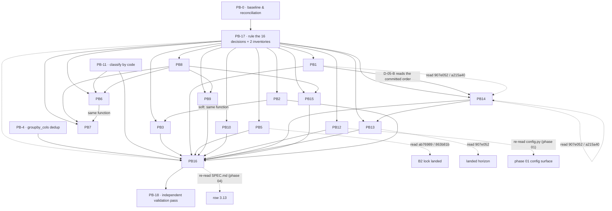

# Phase 05 — Data pipeline remediation: implementation and execution plan

- **Status:** ready for Coordinator ruling on PB-17
- **Date:** 2026-10-02
- **Repository:** `C:\py_dev\mkobi`
- **Branch:** `feat/react`
- **Base HEAD:** `d454603`
- **Upstream plan:** `.ai/plans/05-data-pipeline-remediation-execution.md` (17 blocks `PB-0`…`PB-16`, 16 decision records `D-05-A`…`D-05-P`, 13 seams `C05-1`…`C05-13`)
- **Current-state fact report:** `.ai/plans/_code-context/05-data-pipeline-current-state.md` (sections 1–8) — **authoritative on every question of what the code does**
- **Audit inputs:** `.ai/audit/reports/05-data-pipeline.md` (19 findings `DP-001`…`DP-019`), `.ai/audit/validation/05-data-pipeline.md` (5 records `VAL-05-001`…`VAL-05-005`)
- **Phases:** 19 → **19 blocks** (16 carried forward, 2 new, 1 replaced-in-part)
- **Coordinator rulings applied:** `R-18-1` … `R-18-7` (binding, non-negotiable)
- **Scope:** backend only. No frontend change, no new runtime dependency, no Alembic migration, no `print()`, English only, `StrEnum` for every new constant.

---

## 1. Anchor authority and the verified baseline

**This plan is anchored to symbols, not coordinates.** Every target below is a file, module, class,
function, method, config key, Pydantic field, enum member, test class, test function or doc file section.
Any coordinate appearing in an upstream artefact is a **research pointer only** and must be re-derived
by symbol before an edit. The upstream plan's own *Anchor authority* section records that its
coordinates were written against an earlier tree; the code context records that they no longer resolve.

**Precedence, in order:**

1. **This plan** — the decomposition, the ordering, the gates, the agent allocation.
2. **`.ai/plans/_code-context/05-data-pipeline-current-state.md`** — what the code *does*, at `d454603`.
   It overrides the upstream plan on every factual question about the tree.
3. **Coordinator rulings `R-18-1` … `R-18-7`** — where they speak, they override both.
4. **`.ai/plans/05-data-pipeline-remediation-execution.md`** — the defect analysis, the decision-record
   option sets, the `C05-*` seam table. Carried forward wherever nothing above contradicts it.
5. **`.ai/audit/**` — the original findings. An input, never an edit target.

### 1.1 Facts re-verified directly against the tree for this re-plan

Each was read, not inherited. The anchors are the citations the Implementor must re-read before editing.

| # | Fact | Anchor | Consequence |
| - | ---- | ------ | ----------- |
| V-1 | `mark_orphaned_uploaded_logs_failed` has no `timedelta(minutes=1)`. It declares `timeout_minutes: int \| None = None` and reads `get_config().stale_processing_timeout_minutes` when the argument is absent, then computes `datetime.now(UTC) - timedelta(minutes=horizon)`. | `src/mkobi/workers/data_worker.py::mark_orphaned_uploaded_logs_failed` | `R-18-2` confirmed. `D-05-I`'s key sub-question is **moot**. PB-13's remaining scope is placement only. |
| V-2 | `ProcessingStatus` has exactly five members — `STARTED`, `UPLOADED`, `PROCESSING`, `COMPLETED`, `FAILED` — and **no** `SUCCESS`. The only `SUCCESS` member in `models/enums.py` is `ButtonVariant.SUCCESS`, an unrelated UI enum. | `src/mkobi/models/enums.py::ProcessingStatus`, `::ButtonVariant` | `R-18-5` confirmed. Any option costing a new status value is a hand-over, not a phase-05 change. |
| V-3 | `tests/test_app_lifespan.py` contains **five** occurrences of `mark_orphaned_uploaded_logs_failed`, not six. | `tests/test_app_lifespan.py` | PB-13's regression gate count is **five**, verified before and after. |
| V-4 | `CSVLoader.load_csv` calls `_validate_file_type` (which raises `FileNotFoundError`) and `_validate_file_size` **before** the blanket `try:` that wraps into `ValueError`. The `except Exception` sits inside that `try`. | `src/mkobi/data/loaders/loader.py::CSVLoader.load_csv`, `::_validate_file_type`, `::_validate_file_size` | `R-18-7(a)` confirmed. A missing file reaches the consumer **unwrapped** and maps to `FILE_UPLOAD_ERROR`, not to `"encoding"`. D-05-A(b) and PB-11 must be costed on this. |
| V-5 | `_store_aggregates` declares `db_session: AsyncSession \| None = None`; its docstring states "If None, creates a new session". The `metric_agg` read appears twice, once per branch. | `src/mkobi/workers/data_worker.py::_store_aggregates` | `R-18-7(b)` confirmed. The `None` branch opens its own session, bypassing phase-03 B2's advisory lock and splitting the aggregate write from the `COMPLETED` update. `D-05-H` is not a dead-code question. |
| V-6 | `Settings.max_file_size` is a **derived property**: `self.upload.max_file_size_mb * 1024 * 1024`, with `UploadSettings.max_file_size_mb` defaulting to `100`. `Settings.lazy_threshold_mb` is likewise a property. | `src/mkobi/config.py::Settings.max_file_size`, `::Settings.lazy_threshold_mb`, `::UploadSettings.max_file_size_mb` | D-05-O's "which key owns the ceiling" has no third option: there is no literal to move. It is reuse or a new key. |
| V-7 | `ProcessingSettingsDict` has **thirteen** usage references across three files (not "six" as the upstream plan states); `ProcessingSettingsModel` still has **zero** references. | `src/mkobi/models/types.py::ProcessingSettingsDict`, `::ProcessingSettingsModel`; `services/processing_config_service.py`; `models/processing_configs.py`; `interfaces/service_interfaces.py` | D-05-G(a)'s blast radius is larger than the upstream plan says. Read `interfaces/service_interfaces.py` before D-05-G is decided. |
| V-8 | `tests/test_openapi.py` contains three tests, all asserting the shape of `ErrorResponse`'s JSON schema. It has **no** test over `app.openapi()`. | `tests/test_openapi.py::TestOpenAPIErrorSchemas` | The upstream plan's `test_openapi.py` tripwire under D-05-G(a) **does not exist** and must be written by PB-8. |
| V-9 | `docs/SPEC.md` carries two current-tense `TaskQueue` claims (the "Background task queue" architecture bullet and the "Task Queue Migration" guide link) and version row `3.13`, which records the phase-02 process-architecture migration. | `docs/SPEC.md` | `R-18-3` confirmed. PB-16 **merges** its row into an existing row; it never overwrites `3.13`. |
| V-10 | The retired-queue symbol literals `TaskQueue`, `default_queue`, `get_task_queue`, `process_next`, `ProcessingStatus.SUCCESS` occur in `docs/` in exactly five files: `docs/00-overview/data-flow.md`, `docs/03-processing/task-queue.md`, `docs/03-processing/processing-api.md`, `docs/11-guides/task-queue-migration.md`, `docs/SPEC.md`. | `docs/**/*.md` | PB-16's post-condition grep is `docs/`-scoped with an explicit exclusion set, not repository-wide. See §11 and `R-18-4`. |

### 1.2 Working-tree note — not this plan's business

The tree carries a large set of pre-existing unstaged deletions (` D`) under `.ai/audit/templates`,
`.ai/builders`, `.ai/structure`, `.ai/models` and `frontend/coverage`, plus untracked `.ai/plans/17-*.md`
and `.ai/tasks/*.yaml`. They are **not** phase-05 artefacts. No block stages, reverts, restores or
otherwise touches them. PB-0's baseline is scoped to `-- src/ tests/ docs/`, which is clean
(`R-18-1`).

---

## 2. Corrections to the upstream plan

Every place the code context, a Coordinator ruling or a direct read contradicts
`.ai/plans/05-data-pipeline-remediation-execution.md`. **In each row the last column wins.**

| # | Upstream says | Reality at `d454603` | Winning instruction |
| - | ------------- | -------------------- | ------------------- |
| X-1 | `api/deps.py`, `db/session.py`, `interfaces/service_interfaces.py` "carry uncommitted phase-03 B1 work"; `src/mkobi/config.py` "is under active phase-01 work" (`PB-8` regression row, `PB-12` concurrency note, and the definition-of-done of PB-8, PB-10, PB-12, PB-14). | All false. B1 landed in `2174895`; `git diff --stat -- src/ tests/ docs/` is empty at HEAD. | **`R-18-1`.** Delete every "preserve the uncommitted phase-03 work" clause. Replace with a **re-read-before-edit** rule for the three files genuinely shared with another phase: `src/mkobi/config.py` (phase 01), `docs/06-backend/configuration.md` (phase 01), `docs/SPEC.md` (phase 04). |
| X-2 | `PB-13` replaces a `timedelta(minutes=1)` literal; `R-05-3` forbids PB-13 touching it; `D-05-I` weighs a new `STALE_UPLOADED_TIMEOUT_MINUTES` against reuse. | `907e052` already replaced it with `get_config().stale_processing_timeout_minutes` plus a `timeout_minutes: int \| None = None` override. Verified (`V-1`). | **`R-18-2`.** The literal question is **moot** — reuse has already happened. PB-13's entire remaining scope is `DP-015`'s **placement**. `D-05-I` reduces to option (a) into the lease-guarded loop vs (b) a separate task. |
| X-3 | `PB-13`'s regression gate is "**six** `mark_orphaned_uploaded_logs_failed` patch sites in `tests/test_app_lifespan.py`", to be verified six before and after. | Five (`V-3`). | **`R-18-2`.** The gate count is **five**. A count of six is a copied error and a block must not "restore" it. |
| X-4 | `PB-16` owns `docs/03-processing/task-queue.md` outright; the block is "blocked by B3/B10". | `docs/SPEC.md` version row `3.13` assigns the file to phase 10 / `OPS-002`. B3 and B10 have landed (`R-18-6`). | **`R-18-3`.** Split by concern. Phase 05 owns the **accuracy defect**; phase 10 keeps the substantive operational content (seam `C05-9`). PB-16 **merges** its `docs/SPEC.md` row and never overwrites row `3.13`. |
| X-5 | PB-16's definition of done: "a repository-wide grep asserts no remaining occurrence … except the two files that exist to describe the migration as history". | Unsatisfiable as written — the literals legitimately occur in phase-owned files (`V-10`). | **`R-18-4`.** A `docs/**/*.md` grep for the five literals must return **zero occurrences outside** the phase-excluded set. See §11. |
| X-6 | `D-05-F(a)`, `D-05-A.2` and `D-05-N(a)` are costed as in-phase options. | `processing_logs.processing_status` is a **native PostgreSQL ENUM**, so any new status value requires an Alembic migration, which `R-05-12` forbids. | **`R-18-5`.** Any option whose cost is a migration is a **hand-over**, costed as such by `D-05-A.2`, `D-05-F(a)` and `D-05-N(a)`. `ProcessingStatus` has five members and no `SUCCESS` (`V-2`). |
| X-7 | PB-1, PB-5, PB-14 and PB-16 are **hard-blocked** on phase-03 B2 / B3 / B10. | B1 (`2174895`), B2 (`ab76989` + `863b81b`), B3 (`907e052` + `a215a40`) and B10 (`7feb3b6`) are all ancestors of HEAD. | **`R-18-6`.** The blocks no longer gate start. They remain **read-first obligations**: each affected Implementor must `git show` and read the landed phase-03 commit before editing the shared symbol. |
| X-8 | `D-05-A(b)` and `PB-11`'s problem statement assert a missing file reaching the consumer becomes `FileNotFoundError` classified as `"encoding"`. | `_validate_file_type` / `_validate_file_size` run **before** the blanket `try:` in `load_csv`, so `FileNotFoundError` is **not** wrapped and maps to `FILE_UPLOAD_ERROR` (`V-4`). | **`R-18-7(a)`.** Re-evaluate `D-05-A(b)`'s trade-off on this basis. PB-11's problem statement is rewritten in §4. |
| X-9 | `D-05-H` is a "dead-code policy" question about `_store_aggregates`' `db_session is None` branch. | That branch opens its own session, which **bypasses phase-03 B2's advisory lock** and **splits the aggregate write from the `COMPLETED` update** (`V-5`). | **`R-18-7(b)`.** `D-05-H` is costed as a lock-bypass and split-commit question, not a style question. See §5. |
| X-10 | `PB-8`'s tripwire is "`tests/test_openapi.py` — a new 422 on a documented route is OpenAPI-visible". | `test_openapi.py` has no `app.openapi()` test at all (`V-8`). | **The code context wins.** PB-8 must **write** the tripwire, and must prove it fails before the change. |
| X-11 | `PB-2`'s break table omits `test_aggregation_service.py::test_aggregate_for_dashboard_unknown_agg_falls_back_to_sum`, which encodes DP-018's fallback. | The code context §5 lists it as a `PASS_TO_PASS` that changes. | **The code context wins.** Added to PB-2's break table in §4. |
| X-12 | `PB-3`'s break table lists only the `test_data_worker.py` commit assertions. | `tests/test_data_service.py::TestJsonbKeyNormalization::test_save_aggregates_dims_keys_are_sorted` and `::test_save_aggregates_nested_dims_keys_are_sorted` also cover `_store_aggregates` and are `PASS_TO_PASS`. | **The code context wins.** Both added to PB-3's break table in §4. |
| X-13 | `PB-9`: "`ValidationResult.warnings` has **no consumer anywhere in `src/`**." | Accurate as to a **production** path — `DataValidator.get_validation_summary` is the only `src/` reader and has no production caller — but it is covered by four tests in `tests/test_data_validator.py`. | **The code context wins.** Restated as "no consumer on any production path", and PB-9's break table gains the `TestDataValidator::test_get_validation_summary_*` tests. |
| X-14 | `D-05-J` evaluates `cleanup_task_files`, `cleanup_old_processing_logs` and `cleanup_stale_temp_files`. | `tests/test_upload_api.py::test_cleanup_task_files_called_during_processing` mocks the symbol and **asserts it is called during processing** — a live test contract that D-05-J's wire-in option would falsify. | **The code context wins.** `D-05-J` gains that test as a third option constraint (§5). |
| X-15 | `PB-10` cites "`_add_computed_fields`" as a unique function name. | The name exists in **both** `services/filter_transforms.py` and `data/processing/aggregate_transforms.py`. | **The code context wins.** Any grep-driven or find-by-name change must be qualified by module (§4, PB-10). |
| X-16 | `D-05-O` offers "which key owns the ceiling" as a three-way fork. | `Settings.max_file_size` is a **derived property** over `UploadSettings.max_file_size_mb` (`V-6`); there is no third place a ceiling can hide. | **The code context wins.** D-05-O's first sub-question is a two-way fork (§5). |
| X-17 | `PB-3`: "no `save_aggregates` coverage in `tests/test_storage_manager.py`" ⇒ "this block must create the first". | True of that file; **not** true of `tests/test_data_service.py`, which covers `_store_aggregates` today. | **The code context wins.** The claim is re-scoped: `test_storage_manager.py` still gets its first coverage, but "the first" is corrected. |

---

## 3. Re-planning verdict per upstream block

Nineteen blocks. Sixteen carried forward on their upstream `PB-*` identifiers, two new, one replaced
in part. **No `PB-*` identifier is renumbered and no new finding identifier is minted.**

| ID | Upstream block | Verdict | Change |
| - | -------------- | ------- | ------ |
| `PB-0` | Baseline and reconciliation | **carried** | Unchanged. One clarification on where the note goes (`.ai/structure/` is deleted). |
| `PB-1` | Commit → move → enqueue | **carried, materially corrected** | `PASS_TO_PASS` split corrected; two omitted tests added; `C05-2` re-cast against landed B3; `D-05-A.2` re-costed. |
| `PB-2` | `metric_agg` string vs enum | **carried, materially corrected** | Missing break test added; `D-05-H` upgraded from dead-code policy to lock-bypass; Researcher's ten-function question retired. |
| `PB-3` | Empty-selection guard | **carried, corrected** | Two `PASS_TO_PASS` tests added; DP-005 scope restated; the "first coverage" claim scoped. |
| `PB-4` | `groupby_cols` de-duplication | **carried unchanged** | None. |
| `PB-5` | `dims` canonicalisation | **carried unchanged** | None. D-05-E re-costed with its migration implication. |
| `PB-6` | `groupby` without `aggregations` | **carried unchanged** | Agent allocation narrowed (Researcher and Auditor dropped). |
| `PB-7` | `limit` before aggregation | **carried unchanged** | Agent allocation narrowed. |
| `PB-8` | Validation order and settings boundary | **carried, materially corrected** | The `test_openapi.py` tripwire must be written, not merely referenced; the reference count is corrected. |
| `PB-9` | Warnings have no consumer | **carried, corrected** | "Zero consumers" restated as "no production consumer"; `D-05-F(a)` re-costed as a hand-over; the break table gains four tests. |
| `PB-10` | `yoy_config` / `share_config` / `custom_metrics` | **carried, corrected** | `_add_computed_fields` module-collision warning added; void DoD clause removed. |
| `PB-11` | Classify by code, not message | **carried, problem statement rewritten** | Both factual claims about the wrapping and the `"encoding"` mislabel are wrong (`X-8`); the block survives, its rationale does not. |
| `PB-12` | Byte ceiling and the "lazy" branch | **carried, corrected** | `D-05-O` first sub-question reduced to two options; the ceiling is a derived property (`V-6`). |
| `PB-13` | Orphan sweep placement | **carried, materially corrected** | Half the block's premise is discharged by `907e052`; scope is placement only; the gate count is five. |
| `PB-14` | Unlink compensation and the two helpers | **carried, materially corrected** | The transaction shape it reasons about is B3's *landed* shape; `D-05-J` gains a test contract. |
| `PB-15` | Row order | **carried unchanged** | Agent allocation narrowed. |
| `PB-16` | Documentation truth | **carried, materially corrected** | Ownership of `task-queue.md` split; the grep post-condition rescoped; two unlisted defects added; a revert guard added. |
| `PB-17` | — | **NEW** | Decision-and-inventory pre-work. Sixteen open `D-05-*` records are the phase's critical path; this block is where they are answered. |
| `PB-18` | — | **NEW** | Independent final validation pass. Required by the original task context and by `VAL-05-005`'s lesson. |

**Nothing is retired.** `PB-13` is *half discharged by a landed commit*, not retired: `DP-015`'s
placement defect is live and the block still lands a commit. `DP-005`'s production fix is discharged by
`8953bf7`; PB-3 keeps only its verification half. Both are recorded as **discharged-by-commit** in §9
rather than deleted.

---

## 4. Execution blocks

One Implementor at a time. Every block lands as its own commit. Risk is stated in all four kinds.
"Read-first" is a landed commit the Implementor must `git show` and read **before** editing the named
symbol. "Re-read" is a file another phase also edits: read it immediately before the edit, never edit
from a remembered copy.

Severity is carried from the upstream plan and is not re-graded here (`VAL-05-001` is the only
re-grade, and it is applied in PB-0).

---

### PB-0 — Baseline, reconciliation note, phase opening

**None** · **Findings discharged:** none of its own · **Applies:** `VAL-05-001`, `VAL-05-002`,
`VAL-05-003`, `VAL-05-004`, `VAL-05-005` · **Blocked by** nothing · **Blocks** everything ·
**Queue position** 1

**Scope.** Record the test baseline; write the reconciliation note that states the anchor drift and the
severity re-grades; open the phase's `docs/SPEC.md` version row.

**Out of scope.** It does **not** edit `.ai/audit/**`, any sibling plan, the code context, or any task
file. It does **not** repair the audit corpus — `VAL-05-003`'s two miscounts and three unattributed
findings are *recorded*, not fixed.

**Clarification against the upstream text.** The code context records that the governance set the
upstream plan names as the note's destinations — `.ai/audit/00-reconciliation/session-continuity.md`,
`decision-log.md`, `evidence-index.md`, `validation-index.md` — **does not exist**, and `.ai/structure/`
is among the pre-existing unstaged deletions. The Coordinator must therefore name the note's actual
path in PB-17. The block does not create a directory tree to host it.

**Dependencies.** `blocked_by:` none. `blocks:` PB-1 … PB-18 (the baseline is the reference every later
commit body compares against).

**Risk.**
*Implementation* — none; no production code is touched.
*Rollout* — none; nothing that runs changes.
*Regression* — none.
*Compatibility* — none.

**Required agents — none beyond Implementor.** There is no uncertainty, no fork and no shared file.
`Auditor`, `Researcher`, `Planner` and `Validator` are all unearned: the block's entire job is running
`.\Makefile.ps1 test` and writing down what it printed.

**Verification.** `.\Makefile.ps1 test` (the phase baseline) and `.\Makefile.ps1 check`. Neither
`ruff` nor `mypy` is a defect detector for this phase; they are only import-order and syntax gates.

**Definition of done.** The commit body states the exact baseline counts — collected, total, passed,
failed, errors, skipped — and the exact command that produced them, so a later delta is comparable. The
commit body states, as a **re-grade and not an audit edit**, that `DP-002` is MEDIUM and `DP-018` was
raised from nothing, that `DP-005` is MEDIUM and its premise is superseded by `8953bf7`, and that
`DP-016`'s second half is re-typed to a unit-of-atomicity defect (`VAL-05-004`). The commit body
names the two audit miscounts and the three unattributed findings it is recording rather than
repairing. The commit body's "Files changed" list is documentation-only.

---

### PB-1 — Commit → move → enqueue, and a zero-row `UPDATE` means something (DP-001, TXN-002)

**CRITICAL** · **Findings:** `DP-001`, `TXN-002` · **Seam:** `C05-1` (discharged), `C05-10` (read-only) ·
**Blocked by** `D-05-A`, `D-05-A.2` (both hard) · **Blocks** PB-14, PB-16 · **Queue position** 15
· **Read-first:** `907e052`, `a215a40` (phase-03 B3) on `workers/data_worker.py::_update_processing_log_status`

**Problem, unchanged.** `process_upload_with_session` enqueues the RQ job **before**
`await db.commit()`, carrying two comments that assert an atomicity the code does not have. The
committed-but-unenqueued window survives; the comments are the documented falsehood `C05-1` hands
back to phase 05.

**Corrections to this block's break table** (`X-10`…: code context §5):
- `tests/test_data_service.py::TestProcessUploadWithSession::{test_enqueue_failure_after_upload_leaves_processing_log,test_file_rename_error_does_not_enqueue,test_upload_succeeds_when_redis_unavailable}` **cross the seam PB-1 reorders** and are **not** green-unmodified candidates. The other three patch-site tests in that file (`test_upload_with_missing_processing_config`, `test_upload_with_empty_payload`, `test_upload_with_text_csv_succeeds`) patch `data_service.enqueue_processing_job`, which PB-1 does not touch, and **are** green-unmodified.
- `tests/test_data_worker.py::TestUnlinkAfterProcessing::{test_cancelled_await_leaves_no_temp_file,test_cancelled_after_transform_preserves_file_for_0717b65,test_cancelled_during_cleanup_preserves_file}` **do not exercise** `_run_with_transaction` — they cancel inside the transform, after `_run_with_transaction` has already returned. They are green-unmodified.
- `tests/test_data_worker.py::TestProcessCsvWorker::{test_missing_file_raises_early_without_dequeuing,test_worker_missing_file_marks_failed}` **run through the RQ wrapper** and assert the `"error"` class is a string — they survive a code change to a message-derived class string and are therefore **weak assertions**. PB-1 must re-read them and state whether they still discriminate after the change.

**Scope.** Rule and implement the order in `services/file_processing.py::process_upload_with_session`;
add the `rowcount` check inside `workers/data_worker.py::_update_processing_log_status`; remove the two
false atomicity comments.

**Out of scope.** `api/deps.py::get_db_dependency` and `db/session.py` — `C05-10` makes them read-only.
It does not touch `workers/data_worker.py::_run_with_transaction`'s own-session `FAILED` compensation
(that is PB-14's). It does not add an `ErrorCode` member. It does not author a status value.

**Dependencies.** `blocked_by:` `D-05-A`, `D-05-A.2` (ruled in PB-17). `blocks:` PB-14 (its
`D-05-B` ruling must know the committed order), PB-16 (C05-3 receipt).
**Read-first.** `git show 907e052` and `git show a215a40` before touching
`_update_processing_log_status`; the landed two-commit shape is B3's and PB-1 adds the `rowcount`
check without altering the commit boundary.

**Risk.**
*Implementation* — **High.** Reordering a producer's three effects across an `await` boundary while a
second phase's commit structure sits inside the consumer. The `rowcount` policy interacts with where
in `_run_with_transaction` the check can sit.
*Rollout* — **Medium, and it changes what clients are told.** Under D-05-A(a) a failure between the
commit and the move leaves a committed `uploaded` row with no file and no job, reclaimed only by the
boot-only orphan sweep. Under D-05-A.2's "raise" policy the first time this system reports a phantom
run is this block.
*Regression* — **High.** The `PASS_TO_PASS` split above is wrong in the upstream plan and would have
been executed as written; three of the six `test_data_service.py` patch-site tests cross the seam.
*Compatibility* — conditional on `D-05-G`'s ruling for `test_openapi.py`; error codes here are a
published contract (`docs/08-security/error-format.md`).

**Required agents — all four.** *Auditor*: the seam census is a real uncertainty (which patch sites
cross it) and it must be re-derived, not trusted. *Researcher*: cross-container failure modes for
commit-move-enqueue with a non-transactional message broker — the pattern literature decides whether
a compensating write is meaningful. *Planner*: two coupled designs (the order, and where a zero-row
`UPDATE` can be detected without disturbing B3's boundary). *Validator*: CRITICAL, on a transaction
another phase already restructured, against a break table that is known-wrong upstream.

**Verification.** `.\Makefile.ps1 test-select -k test_upload_api -v` ·
`.\Makefile.ps1 test-select -k test_data_service -v` · `.\Makefile.ps1 test-select -k test_data_worker -v` ·
`.\Makefile.ps1 test-select -k test_rq_worker -v` · `.\Makefile.ps1 test-select -k test_error_response_format -v` ·
`.\Makefile.ps1 test` (mandatory — this is a CRITICAL block) · `uv run ruff check src/mkobi/services/file_processing.py src/mkobi/workers/data_worker.py` ·
`uv run mypy src/mkobi/services/file_processing.py src/mkobi/workers/data_worker.py`.
Tripwires: `test_upload_api.py::test_upload_submits_job_with_correlated_task_id` (green unmodified
under D-05-A(a); changes **with** the code under (b) — never around it) and
`test_rq_worker.py::TestRegisteredJobCallable` (asserts the **source text** of `enqueue_processing_job`).
New tests must be proven to **fail against the unfixed code** before the fix is accepted.

**Definition of done.** `D-05-A` and `D-05-A.2` ruled; the mutation order is asserted by a test, not
by a comment; both false atomicity comments are gone (`C05-1` closed); the `rowcount` check sits where
the ruling places it and has an `else` that states what it does; the six `test_data_service.py`
patch-site tests are individually classified as seam-crossing or not, and the classification is in the
commit body; the two `TestUnlinkAfterProcessing` tests are recorded as not exercising the reordered
site; `test_openapi.py` shows the change if the route's responses changed; `ruff`/`mypy` clean.
**The commit body must state the residual failure in the chosen option's own terms** — upstream
requirement, still in force — and must record, if `D-05-A.2` selected a new status value, that the
value is **handed over** to phase 14 rather than shipped here (`R-18-5`).

---

### PB-2 — The stored `metric_agg` string is read into an `AggregationFunctionEnum` (DP-002, DP-018)

**MEDIUM** + **raised** · **Findings:** `DP-002`, `DP-018` · **Seam:** `D-05-H`, `C05-13` ·
**Blocked by** `D-05-H` (hard) · **Blocks** PB-3 (softly, same function), PB-16 ·
**Queue position** 5

**Problem, unchanged.** `AggregationService._aggregate_for_dashboard` reads
`processing_config_dict["settings"]["metric_agg"]` as a bare string and `AggregationService.get_agg_function`
maps it to `AggregationFunctionEnum`. Any dashboard configured with a non-`sum` function is stored in a
shape the read path cannot consume.

**Corrections to this block.**
- **Break test added** (`X-11`): `tests/test_aggregation_service.py::TestAggregationService::test_aggregate_for_dashboard_unknown_agg_falls_back_to_sum` encodes DP-018's fallback and must be read before the change.
- **`D-05-H` is not a dead-code policy question** (`X-9`, `R-18-7(b)`). The `db_session is None` branch of `workers/data_worker.py::_store_aggregates` opens its **own** session. That is two facts, not one: it **bypasses phase-03 B2's advisory lock** (the whole point of which is to serialise a dashboard's rebuild), and it **splits the aggregate write from the `COMPLETED` update** into two transactions. Leaving it in the tree is a live hazard for any future caller that passes `db_session=None`.
- **Researcher's ten-function question is retired.** `AggregationService.AGG_FUNC_MAP` already maps **all ten** `AggregationFunctionEnum` members to callable expressions, each consuming the declared parameters. The question is answered by the code; nothing external decides it.

**Scope.** Make the stored `metric_agg` read consume a shape the enum mapper accepts; make every
`AggregationFunctionEnum` member reachable with its own value; handle an unknown name explicitly.
Handle the `db_session is None` branch per `D-05-H`.

**Out of scope.** It does not author an Alembic migration; it does not widen `C05-13`'s supported
function set beyond what is already declared; it does not touch `workers/data_worker.py::_run_with_transaction`
or the advisory lock (B2's, landed); and it does not decide PB-3's dtype matrix — it decides whether
PB-3's fixture is needed.

**Dependencies.** `blocked_by:` `D-05-H` (ruled in PB-17). `blocks:` PB-3 — **softly**; PB-3 must read
this block's commit before choosing between the repository-side coercion and the worker-side cast
(normalisation point (c) in the upstream plan). `R-05-10` holds: `D-05-H` is decided **once**, here, and
PB-3 obeys the decision.
**Read-first:** none. No phase-03 block touched this function (the upstream seam table records it).

**Risk.**
*Implementation* — **Medium.** A shape conversion at one read site plus, under `D-05-H`(b), the
deletion of a ~40-line branch whose only protection is a call-graph inference.
*Rollout* — **Medium, and it changes stored values.** Every dashboard configured for a non-`sum`
function changes what is stored. The pre-deploy `aggregated_data` dump remains the only rollback,
because the retention sweep is the only code that removes those rows.
*Regression* — **Medium.** `test_aggregation_service.py` and `test_e2e_upload.py` both exercise this path.
*Compatibility* — Low. No stored schema changes.

**Required agents — Planner, Auditor, Validator. Researcher is dropped.** The upstream plan asked a
Researcher to survey ten aggregation implementations; `AGG_FUNC_MAP` has already implemented them, so
there is no external question left to answer and the agent cannot earn its place.
*Auditor* — the enumeration is one call site, but the **caller census** under `D-05-H`(b) is not:
who could pass `db_session=None`, and does `DataService::trigger_processing` (no route caller today)
constitute a live path. *Planner* — the shape at the boundary and the `D-05-H` consequence.
*Validator* — a change whose only rollback is a database dump, with a hidden second defect in a branch
nobody calls.

**Verification.** `.\Makefile.ps1 test-select -k test_aggregation_service -v` ·
`.\Makefile.ps1 test-select -k test_filter_values_consistency -v` ·
`.\Makefile.ps1 test-select -k test_e2e_upload -v` ·
`uv run ruff check src/mkobi/services/aggregation_service.py src/mkobi/workers/data_worker.py` ·
`uv run mypy src/mkobi/services/aggregation_service.py src/mkobi/workers/data_worker.py`.
Tripwires: `test_aggregation_service.py::TestAggregationService::test_aggregate_for_dashboard_unknown_agg_falls_back_to_sum`;
the `test_filter_values_consistency.py` and `test_filter_persistence.py` suites must stay green
**unmodified** — they are the independent confirmation that the read path was not broken. A new test
for the stored-string case must be **proven to fail against the unfixed code**.

**Definition of done.** `D-05-H` ruled **with the lock-bypass and split-commit facts attached**;
`metric_agg` is stored and read in one shape; all ten enum members are reachable with their own values;
an unknown name is handled explicitly rather than by accident; the `db_session is None` branch's fate is
recorded against the lock-bypass fact, and if it survives, the commit body says **why a future caller
must not use it**; `test_aggregation_service`, `test_filter_values_consistency`,
`test_filter_persistence`, `test_e2e_upload` green; `ruff`/`mypy` clean.

---

### PB-3 — A selection that matches no graph is not a success (DP-004, DP-005, TXN-004)

**HIGH** · **Findings:** `DP-004`, `DP-005` (verification only), `TXN-004` · **Seam:** `C05-2`, `C05-11` ·
**Blocked by** `D-05-N` (hard) · **Blocks** PB-16 · **Queue position** 6

**Two findings with different natures — do not conflate them.**

- **`DP-005` is discharged by a landed commit.** The production fix landed in `8953bf7`. PB-3's
  contribution to it is the **dtype-matrix regression test**, which the upstream report's own
  recommendation makes the deliverable, plus a record of the residual gap. The code context is
  explicit: `_store_aggregates` no longer coerces dtypes before `save_aggregates`, so the residual
  guard is a **`list[str]` annotation in `DataService.save_agents`** plus a green gate that cannot see
  across a thread hop. PB-3 records the gap; it does **not** close it inside the repository, because
  that would create a second owner for the same contract.
- **`DP-004` is a live decision, not a placement.** `StorageManager.save_aggregates` returns `0`
  before its own clear, so an overwrite matching no graph dimension keeps stale rows, clears filter
  values, and the run reports `COMPLETED`.

**Corrections to this block's break table** (`X-12`, `X-17`): add
`tests/test_data_service.py::TestJsonbKeyNormalization::test_save_aggregates_dims_keys_are_sorted` and
`::test_save_aggregates_nested_dims_keys_are_sorted` — both cover `_store_aggregates` and both are
`PASS_TO_PASS`. And: `tests/test_storage_manager.py` has **no** `save_aggregates` coverage, which is
true; "this block must create the first" is false, because `test_data_service.py` covers
`_store_aggregates` today. The block adds `test_storage_manager.py`'s first coverage **and** the
`save_agents` matrix.

**Scope.** Put the empty-selection guard where it precedes **both** clears — `save_aggregates`' own
clear and `DataService.clear_dashboard_values` — and implement the ruled status outcome; add the
`DataService.save_agents` dtype-matrix test; record `DP-005`'s residual gap.

**Out of scope.** It does not change `DataService.save_agents`' signature to take a typed frame; it
does not add a `ProcessingStatus` member; and it does not make a frontend change — if `D-05-N` needs
one, that is `C05-11` and the frontend owner's.

**Dependencies.** `blocked_by:` `D-05-N` (ruled in PB-17). `blocks:` PB-16.
**Read-first:** PB-2's commit, before choosing the normalisation point — the upstream plan's
normalisation point (c) is only available if PB-2 ruled the `db_session is None` branch deleted
(`R-05-10`).

**Risk.**
*Implementation* — **Medium.** A guard whose position relative to two independent clears is the whole
correctness argument, plus a small fixture.
*Rollout* — **Medium, and client-visible under `D-05-N`(a).** A silently-successful upload becomes a
**failed** run for dashboards whose upload does not match their chart dimensions. That is the finding
being fixed, and it needs the frontend's `failed` rendering to already exist (`C05-11`).
*Regression* — **Medium.** The two `TestJsonbKeyNormalization` tests and the `test_storage_manager.py`
gap.
*Compatibility* — conditional. Under `D-05-N`(a) or (c), if a new status value were required, it is a
**hand-over** to phase 14 (`R-18-5`) and the block must say so rather than ship it.

**Required agents — Planner only. Validator and Researcher are dropped.** *Validator* is earned only
if `D-05-N` selects a client-visible status change; if the ruling is a message change, the block's
check is a string assertion and the upstream plan itself declines the agent. *Researcher* is not
required: the finding is a transaction-order fact plus a message, and no external practice decides it.
*Planner* designs the guard's position against two clears and the interaction with PB-2.

**Verification.** `.\Makefile.ps1 test-select -k test_data_service -v` ·
`.\Makefile.ps1 test-select -k test_storage_manager -v` ·
`.\Makefile.ps1 test-select -k test_data_worker -v` · `.\Makefile.ps1 test-select -k test_e2e_upload -v` ·
`uv run ruff check src/mkobi/services/storage_manager.py src/mkobi/services/data_service.py src/mkobi/workers/data_worker.py` ·
`uv run mypy src/mkobi/services/storage_manager.py src/mkobi/services/data_service.py`.
Tripwires: `test_data_worker.py::TestProcessCsvWorker::test_3_commit_assertions` (the three
`commit.assert_not_called()` assertions) and the two `TestJsonbKeyNormalization` tests. The new
`save_agents` matrix test must be **proven to fail against the unfixed code** — reverting `8953bf7`'s
coercion must make it fail, and that is the demonstration.

**Definition of done.** `D-05-N` ruled; the guard precedes both clears; the dtype-matrix test exists
and is proven to fail without the `8953bf7` coercion; `DP-005`'s residual gap — the `list[str]`
annotation and the thread-hop blindness of the gate — is written down; `test_data_service`,
`test_storage_manager`, `test_data_worker`, `test_e2e_upload` green; `ruff`/`mypy` clean.
**The commit body must state whether any production code changed for `DP-005`** — the honest answer is
"none, `8953bf7` shipped it" — and must name, in the chosen option's terms, which status text a
client now sees for an unmatched selection.

---

### PB-4 — `groupby_cols` must be a set with order (DP-006)

**HIGH** · **Findings:** `DP-006` · **Blocked by** nothing · **Blocks** PB-16 ·
**Queue position** 3

**Problem.** `workers/data_worker.py::_process_csv_file_async` calls
`polars.col(x) for x in groupby_cols` where `groupby_cols` is `list(processing_config_dict.get("groupby", []))`.
When a dashboard's `groupby` list repeats a dimension — which a filter named like a graph dimension
produces — the resulting `Expr` list contains duplicates, `df.group_by` raises `DuplicateError`, and
the run fails with no configuration cause. De-duplicating with order preserved closes it.

**Scope.** The single real call site: de-duplicate `groupby_cols` preserving first-occurrence order
before the `polars.col` expansion.

**Out of scope.** It does not deduplicate the `groupby` list in the stored configuration, does not
change `groupby`'s type, does not touch `_apply_transformations` (PB-6 and PB-7's site), and does not
make any run that fails for another reason succeed.

**Dependencies.** `blocked_by:` none. `blocks:` PB-16. **No phase-03 overlap** — this block touches no
transaction boundary, no `session.begin()` and no sweep, which is why it can run in the first wave.

**Risk.**
*Implementation* — **Low.** One comprehension.
*Rollout* — **Low, and the effect is that an error disappeared.** Dashboards whose filter was named
like a graph dimension start ingesting instead of failing. It is the safest change in the phase.
*Regression* — **Low.** `test_e2e_upload.py` and `test_aggregation_service.py` are the surfaces;
`test_data_transformations.py` does not reach this site.
*Compatibility* — Low.

**Required agents — none beyond Implementor.** The fix site is a single call site, the condition is
locally checkable (`polars` raises `DuplicateError` on the current code), and the remedy is
unambiguous. There is no architecture question, no external best practice, no design to review. An
Auditor would search for a second site the code context has already declared unique; a Planner would
design a one-line comprehension.

**Verification.** `.\Makefile.ps1 test-select -k test_data_worker -v` ·
`.\Makefile.ps1 test-select -k test_e2e_upload -v` ·
`uv run ruff check src/mkobi/workers/data_worker.py` · `uv run mypy src/mkobi/workers/data_worker.py`.
Tripwire: a new test that passes a `groupby` list with a duplicated dimension through
`_process_csv_file_async` and asserts the run **completes** and the aggregate has one row per unique
dimension. It must be **proven to fail against the unfixed code** — against the current tree it raises
`DuplicateError`, which is the demonstration.

**Definition of done.** `groupby_cols` is de-duplicated with first-occurrence order preserved at the one
real site; the new test fails on the unfixed code and passes after; `test_data_worker` and
`test_e2e_upload` green; `ruff`/`mypy` clean; the commit body states that the visible effect is
dashboards beginning to ingest, not dashboards changing.

---

### PB-5 — One canonical `dims` key per value (DP-003)

**CRITICAL** · **Findings:** `DP-003` · **Seam:** `C05-5` (hand-over), `C05-13` ·
**Blocked by** `D-05-E` (hard) · **Blocks** PB-16 · **Queue position** 10 ·
**Read-first:** `ab76989`, `863b81b` (phase-03 B2) on `db/repositories/aggregated_data_repo.py`

**Problem, unchanged.** `_coerce_dim_value` preserves a value's **native** type in stored `dims` for
correct frontend sorting, while the read path compares `dims[key].astext == str(value)`. Two values that
render identically as text but differ as JSONB keys produce two rows where one is meant — and
`_upsert_aggregated_data` `on_conflict_do_update` on `(dashboard_id, graph_id, dims)` then **splits**
rather than merges, and the report states the split pair is not recorded anywhere.

**Why B2 matters now.** The advisory lock landed. The canonicalisation changes **which rows collide**,
and it must not do so on a table with no exclusion. This is a precondition, not a gate (`R-18-6`); the
read-first obligation stands.

**Scope.** Under `D-05-E`: the ruled canonicalisation point (the write-side `_coerce_dim_value`, the
read-side filter comparison, or the worker-side cast loop); both conflict targets consistent; the rule
stated precisely enough that a later reader can distinguish it from an arbitrary pick.

**Out of scope.** It does not author the `dims` canonicalisation index (that is `C05-5`, phase 14); it
does not run a one-off remediation query to un-split rows that are already split; it does not change
`AggregationService._coerce_dim_value`'s frontend-sort rationale unless `D-05-E` says to; and it does
not touch `_apply_transformations`.

**Dependencies.** `blocked_by:` `D-05-E` (ruled in PB-17). `blocks:` PB-16.
**Read-first:** `git show ab76989` and `git show 863b81b` before editing
`db/repositories/aggregated_data_repo.py::_upsert_aggregated_data` — the exclusion B2 added is the
surface the canonicalisation changes.

**Risk.**
*Implementation* — **High.** The rule must be stated exactly (`True` vs `"True"` vs `1` is a real
question under option (a)), and option (c) couples identity to the optional `column_types`, so an
unconfigured dashboard gets no canonicalisation and the defect returns.
*Rollout* — **High, and irreversible without a dump.** The change **adds and removes stored rows with
no record of which pairs were split**. The pre-deploy `aggregated_data` dump is the only rollback. This
is the phase's widest stored-data blast radius after PB-2.
*Regression* — **High.** `test_aggregation_service.py` and `test_e2e_upload.py` both read stored
aggregates; `test_filter_values_consistency.py` and `test_filter_persistence.py` must stay green
unmodified.
*Compatibility* — conditional on `D-05-E`: option (a) reverses a deliberate design decision
(`_coerce_dim_value` preserves native type **for** frontend sorting), so the frontend sort path is part
of the caller inventory; any option implying an index change is an explicit hand-over to phase 14.

**Required agents — all four.** *Auditor*: the frontend sort consumer inventory the upstream report
never produced, and the caller census for whichever option `D-05-E` selects. *Researcher*: JSONB
key-identity canonicalisation is a design question with a forward-compatible answer space, and under
option (a) the reviewer needs a defensible rule for the boolean/integer collision. *Planner*: the rule
statement, the two conflict targets, and the append-versus-overwrite behaviour under each option.
*Validator*: CRITICAL, stored-data-changing, with a rollback that is a database dump, and the
"already-split rows are not repaired" limitation that must ship with the change rather than be
discovered.

**Verification.** `.\Makefile.ps1 test-select -k test_aggregation_service -v` ·
`.\Makefile.ps1 test-select -k test_e2e_upload -v` ·
`.\Makefile.ps1 test-select -k test_filter_values_consistency -v` ·
`.\Makefile.ps1 test-select -k test_filter_persistence -v` · `.\Makefile.ps1 test` (mandatory) ·
`uv run ruff check src/mkobi/services/aggregation_service.py src/mkobi/db/repositories/aggregated_data_repo.py src/mkobi/workers/data_worker.py` ·
`uv run mypy src/mkobi/services/aggregation_service.py src/mkobi/db/repositories/aggregated_data_repo.py`.
Tripwires: a new test with two dim values that collide under one representation and not the other,
asserting one row after the change and two before — **proven to fail against the unfixed code**. The
`test_filter_*` suites must remain green **unmodified**.

**Definition of done.** `D-05-E` ruled and the rule statement written into the code where the next
reader will find it; the conflict target is consistent on both write paths; a new test is proven to fail
before the change; `test_aggregation_service`, `test_e2e_upload`, `test_filter_values_consistency`,
`test_filter_persistence` green; the phase-14 hand-over (`C05-5`) recorded; `ruff`/`mypy` clean.
**The commit body must state the first-change-scope figure** — upstream requirement, still in force: the
number of dashboards whose stored rows change, or an explicit statement that the figure could not be
determined. The commit body must also state that **already-split rows are not repaired** and are
corrected by the next overwrite-mode upload per dashboard.

---

### PB-6 — What `groupby` without `aggregations` means (DP-007)

**HIGH** · **Findings:** `DP-007` · **Seam:** `D-05-C`, `VAL-05-005` (applied here) ·
**Blocked by** `D-05-C` (hard); PB-8 (same function, `apply_transformations`) ·
**Blocks** PB-7, PB-16 · **Queue position** 11

**Problem, unchanged.** `data/processing/transformations.py::apply_transformations` collapses
`group_cols` to a **single** `pl.all().first()` when `groupby` is configured without `aggregations`.
Every `sum` over that collapsed frame is the first row of the whole dataset: a real aggregate, stored
as a chart series, and a number no one can reconstruct.

**`VAL-05-005` is applied by this block.** The transcript test is replaced by the identical-value
forward-and-reversed pair: the same input row order, and its reverse, must produce the **same**
aggregate. It is the test that distinguishes "an arbitrary pick" from "a rule".

**Scope.** Under `D-05-C`: a deterministic rule, a validation rejection, or a deletion of the
collapsed-`pl.all().first()` branch at its one real site.

**Out of scope.** It does not change `TransformationConfig`'s `extra="forbid"` behaviour; it does not
touch PB-8's validation-order work; it does not touch the group-by-input frame `worker_transform`;
and under option (c) it does not delete the branch before the caller census is complete, because the
branch exists **because** the worker passes
`groupby=config.groupby if not config.aggregations else None` — deleting it changes which frames reach
`calculate_aggregations`, which is a pipeline-order change and not a dead-code removal.

**Dependencies.** `blocked_by:` `D-05-C` (ruled in PB-17) and PB-8 landed.
`blocks:` PB-7 (same function; a later diff must be re-read), PB-16.

**Risk.**
*Implementation* — **Medium.** The rule must be stated precisely enough to be reproducible; a
"deterministic pick" that is not a rule reproduces the defect with better manners.
*Rollout* — **Medium, and immediately visible.** Existing charts' numbers change for dashboards
configured this way. Correct, and it will be reported as "the numbers changed" by someone who does not
know why.
*Regression* — **Medium.** `test_data_transformations.py`'s existing `groupby` cases encode the current
arbitrary behaviour and must be updated to the ruled semantics — **updated, never deleted**.
*Compatibility* — conditional on `D-05-C` and `PB-11`. Under option (b) the rejection surfaces through
`workers/data_worker.py::_map_processing_error_to_code`, which today overwrites the
`AppException(VALIDATION_ERROR)` from `_validate_processing_config` with a substring result.

**Required agents — Planner and Validator. Auditor and Researcher are dropped.**
*Planner* designs the rule and its statement, and the interaction with PB-8's validation order.
*Validator* reviews it because a wrong rule is **indistinguishable from the defect by construction** —
the block's only evidence is the test it writes. *Auditor* is unearned: the `pl.all().first()` collapse
is a single occurrence in `transformations.py` and the code context has already established it.
*Researcher* is unearned: this is a product-semantics decision about a product's own data, not a
technical-practice question, and `D-05-C`'s owner is the domain owner.

**Verification.** `.\Makefile.ps1 test-select -k test_data_transformations -v` ·
`.\Makefile.ps1 test-select -k test_e2e_upload -v` ·
`uv run ruff check src/mkobi/data/processing/transformations.py` ·
`uv run mypy src/mkobi/data/processing/transformations.py`.
Tripwires: the **identical-value forward/reversed pair** from `VAL-05-005` — same rows, two orders,
asserted equal — and a grouped case with two entities asserting each entity's aggregate is its own.
Both must be **proven to fail against the unfixed code**; the reversed pair fails today precisely
because the aggregate depends on row order.

**Definition of done.** `D-05-C` ruled; `pl.all().first()` is gone or is a rule, and the rule is
written down; the forward/reversed pair test is green and proven to have failed before;
`test_data_transformations` and `test_e2e_upload` green; the commit body states, **under `D-05-C`'s
chosen terms, what error code a rejected configuration surfaces given PB-11's state at the time of the
commit**; `ruff`/`mypy` clean.

---

### PB-7 — `limit` must not be applied before aggregation (DP-008)

**HIGH** · **Findings:** `DP-008` · **Seam:** `D-05-D` · **Blocked by** `D-05-D` (hard), PB-6 and PB-8
landed · **Blocks** PB-16 · **Queue position** 12

**Problem, unchanged.** `transformations.py::apply_transformations` applies the configured `limit` to
the **input frame** before aggregating, so a "top 3 regions by revenue" chart stores the aggregate of
three arbitrarily-selected rows. With no `sort_by` in play the selection is whatever the frame's first
rows are.

**Scope.** Under `D-05-D`: move the limit after aggregation, reject the `limit`-without-determining-
`sort_by` pair at validation, or require `sort_by` whenever `limit` is set.

**Out of scope.** It does not change `ProcessingSettingsDict` — the fact that `limit` is not declared
there is PB-8's `D-05-G`; it does not touch `AggregationService._apply_chart_sorting` (PB-15's, and
correct as documented); it does not change the `column_types` cast loop.

**Dependencies.** `blocked_by:` `D-05-D` (ruled in PB-17), PB-6 landed, PB-8 landed.
`blocks:` PB-16. **Read-first:** PB-6's commit — both blocks edit
`data/processing/transformations.py::apply_transformations`, and PB-6 lands first so each reverts
alone (`R-05-11`).

**Risk.**
*Implementation* — **Medium.** The interaction with PB-6's ruling lands in the same function, and
"after aggregation" needs a defined post-aggregation frame.
*Rollout* — **Medium, and stored values change.** Under option (a) every configured dashboard begins
storing the aggregate of the whole frame, not of its first N rows. This is the semantically obvious
meaning of "top N by this metric" and it is a value change, not a row-count change.
*Regression* — **Medium.** `test_data_transformations.py`'s `limit` cases encode the current premature
truncation and must be updated with the ruling.
*Compatibility* — conditional on `D-05-D`. Under (b) or (c) a class of configurations that work today
becomes invalid, and under (b) the rejection is on a key the settings type does not even declare —
which is a `D-05-G` interaction the ruling must acknowledge.

**Required agents — Planner and Validator.** *Planner* designs the post-aggregation placement and the
`sort_by` requirement's interaction with PB-6's ruling in the same function. *Validator* reviews
because the change is a silent value replacement whose only evidence is a new test. *Auditor* is
unearned: one real site, already established. *Researcher* is unearned: no external practice decides
whether a limit belongs before or after aggregation in a product's own pipeline.

**Verification.** `.\Makefile.ps1 test-select -k test_data_transformations -v` ·
`.\Makefile.ps1 test-select -k test_e2e_upload -v` ·
`uv run ruff check src/mkobi/data/processing/transformations.py` ·
`uv run mypy src/mkobi/data/processing/transformations.py`.
Tripwires: a stored-value fixture — a frame where the correct "top 3 by revenue" and the current
first-three-rows aggregate **differ**, asserted equal to the correct one and proven to fail before the
change; and a `limit`-without-`sort_by` rejection test under options (b)/(c) that names the missing key
in the message. `test_e2e_upload.py` must be proven to fail before and pass after.

**Definition of done.** `D-05-D` ruled; the limit applies where the ruling says; the stored-value
fixture is proven to fail against the unfixed code; `test_data_transformations` and `test_e2e_upload`
green; the commit body states **in the chosen option's terms where the limit now applies relative to
aggregation and to `sort_by`**; `ruff`/`mypy` clean.

---

### PB-8 — Put the validation result's first half where somebody sees it, and bound the settings payload (DP-014)

**MEDIUM** (conditional HIGH under `D-05-G`(a)) · **Findings:** `DP-014` ·
**Seam:** `C05-1` (interaction), `C05-10` (read-only) · **Blocked by** `D-05-G` (hard) ·
**Blocks** PB-6, PB-7, PB-9, PB-15, PB-16 · **Queue position** 8 ·
**Read-first:** none for `interfaces/service_interfaces.py` — the file is **clean** (`R-18-1`)

**Problem, two halves, and both are live.**

1. `workers/data_worker.py::_process_csv_file_async` casts a `list[str]` through `typing.cast` into
   `LoaderConfig(**casted)` **before** the validator runs, so a `column_types` mapping that is wrong for
   the frame produces a **cast** failure rather than a **validation** failure. The `except` clause has
   no `else`, so the fall-through is silent.
2. `ProcessingSettingsDict` is a `total=False` `TypedDict` with `extra="forbid"` **unavailable** on it,
   and the existing `**` splat already turns a misspelled key into a worker-side `ValueError` →
   `PROCESSING_FAILED`. The report's premise ("`extra="forbid"` is available; adopt it") is **not
   available as written** — see §5.

**Corrections to this block.**

- **The OpenAPI tripwire does not exist** (`X-10`, `V-8`). `tests/test_openapi.py` contains three
  `ErrorResponse` schema assertions and no test over `app.openapi()`. PB-8 must **write** it under
  `D-05-G`(a), and it must be proven to fail before the change.
- **The reference count is thirteen, not six** (`V-7`). `ProcessingSettingsDict` is used in
  `services/processing_config_service.py` (including `_validate_settings`), `models/processing_configs.py`
  and `interfaces/service_interfaces.py`; `ProcessingSettingsModel` in `models/types.py` still has
  **zero** references. Adopting it as-is makes DP-014 worse (`extra="allow"`); **completing** it is a
  third shape `D-05-G` must weigh.
- **The concurrent-phase clause is void** (`X-1`). The upstream "the uncommitted
  `interfaces/service_interfaces.py` changes preserved" definition-of-done is deleted.

**Scope.** Under `D-05-G`: the mutation order (validation before or after casts) with the cast guard's
`else` stating what it does; the settings boundary at the storage edge, worker, or
`ProcessingConfig`-only; the fate of `ProcessingSettingsModel` recorded explicitly.

**Out of scope.** It does not change `required_columns`' absence from `ProcessingSettingsDict` (that is
the `D-05-F` interaction PB-9 records); it does not add a configuration key; it does not fix or remove
the never-true `column_types` check (that is PB-9's, and the two blocks must not both fix it); and it
does not edit `docs/06-backend/configuration.md` — the boundary is a model, not a setting.

**Dependencies.** `blocked_by:` `D-05-G` **ruled with its caller inventory** (PB-17).
`blocks:` PB-6, PB-7 (same function `apply_transformations`), PB-9, PB-15, PB-16.

**Risk.**
*Implementation* — **High under (a).** Seven steps in one function with a nested import and a thread hop;
moving validation across the cast changes which failures are loud and which are silent. Under (a) it
additionally changes a stored JSONB's validated surface across every dashboard.
*Rollout* — **High under (a)**: any dashboard whose stored settings carry an undeclared key starts
failing, and no operator can know which until one uploads. Medium under (b) — the failure moves from the
API to the worker, still loud. Low under (c).
*Regression* — **Medium-High.** Thirteen references across three files, one of them an interface that
other phases' Implementors read.
*Compatibility* — **Conditional, and the highest of any non-CRITICAL block.** Under (a) the settings API
gains a documented 422 and every existing stored payload becomes subject to it.

**Required agents — all four.** *Auditor* is required here, unlike in PB-6 and PB-7: the
`PUT /processing-configs/{dashboard_id}` caller and frontend-form inventory under `D-05-G` was
deferred to a Researcher upstream, and it is genuinely a census question — thirteen references, three
files, two of them shared with other phases. *Researcher* owns the shape of a validated-JSONB boundary
in Pydantic v2: how `extra="forbid"` interacts with a `TypedDict`-typed field, whether
`ProcessingSettingsModel` can be completed rather than replaced, and what a forward-compatible
migration looks like for a column already holding nineteen keys across every dashboard. The answer
changes (a)'s cost by an order of magnitude. *Planner* owns two coupled designs (order and boundary),
the cast guard's `else`, and the orphaned model's fate. *Validator* owns a stored-data contract change
under (a).

**Verification.** `.\Makefile.ps1 test-select -k test_data_validator -v` ·
`.\Makefile.ps1 test-select -k test_pydantic_models -v` ·
`.\Makefile.ps1 test-select -k processing_config -v` ·
`.\Makefile.ps1 test-select -k test_openapi -v` ·
`uv run ruff check src/mkobi/workers/data_worker.py src/mkobi/services/processing_config_service.py src/mkobi/models/types.py` ·
`uv run mypy src/mkobi/workers/data_worker.py src/mkobi/services/processing_config_service.py src/mkobi/models/types.py`.
Tripwires: a test asserting the run **fails loudly** rather than succeeding silently as it does today;
an unknown-settings-key test asserting the **ruled** outcome only — 422 under (a), worker-side
`ValueError` under (b) — which **must not accept both**; a test proving the validator's `column_types`
check is no longer permanently false, **or** an explicit record that PB-9 owns it, so the two blocks do
not both "fix" it; and the **newly written** `test_openapi.py` tripwire asserting that the documented
route carries the new 422 — proven to fail before the change.
**Note:** `uv run mypy src/mkobi/workers/data_worker.py` is clean today and stays clean through this
finding, because the `asyncio.to_thread` boundary erases the argument types. A green `mypy` is **not**
evidence for this block or for PB-2, PB-6, PB-7, PB-9, PB-10 or PB-14.

**Definition of done.** `D-05-G` ruled **with** its caller inventory; the mutation order is asserted by
a test, not by a comment; the cast guard has an `else`; the settings boundary implements the ruling;
`ProcessingSettingsModel`'s fate is recorded explicitly; the OpenAPI tripwire exists and was proven to
fail before the change; `test_data_validator`, `test_pydantic_models`, `test_validators`,
`test_openapi` green; `ruff`/`mypy` clean. The void "preserve uncommitted phase-03 work" clause is
**deleted** (`R-18-1`); in its place, if `interfaces/service_interfaces.py` is edited, the commit body
records `git diff --stat` for that file alone immediately before the edit.

---

### PB-9 — Make the validation result's second half reach somebody (DP-013)

**MEDIUM** · **Findings:** `DP-013` · **Blocked by** `D-05-F` (hard), PB-8 ·
**Blocks** PB-16 · **Queue position** 9 · **Read-first:** PB-8's commit

**Problem, unchanged.** `DataValidator._validate_column_types` returns `(errors, warnings)` and only
ever `warnings.append(...)`. `_validate_data_quality` and `_validate_duplicates` are warning-only by
design. `ValidationResult.warnings` has **no consumer on any production path** — the worker's only reads
are `is_valid` and `errors`. Two facts compound it: `required_columns` is **absent from
`ProcessingSettingsDict`**, so an unconfigured dashboard runs **no schema check at all**; and the cast
loop skips `float` and casts `date` only when `date_format` is present, so a declared
`{"revenue": "float"}` produces a type warning on **every** run and can never become true.

**Corrections to this block.**
- **"Zero consumers anywhere in `src/`" is imprecise** (`X-13`). `DataValidator.get_validation_summary`
  is the only `src/` reader and it has no production caller, but it is covered by four tests in
  `tests/test_data_validator.py`. Those go on the break table, and "no production consumer" is the
  statement the commit body may make.
- **`D-05-F`(a) is no longer an in-phase option** (`X-6`, `R-18-5`). `processing_logs.processing_status`
  is a **native PostgreSQL ENUM**, so a new status value requires an Alembic migration, which
  `R-05-12` forbids. Option (a) is therefore a **hand-over to phase 14**, costed as one. `D-05-F`
  reduces to (b) a capped summary into `processing_logs.message`, or (c) dropping the never-true
  `column_types` check.

**Scope.** One warning consumer under the ruled landing; and, per `D-05-F`, either fix the `float` cast
so the `column_types` check can become true, or remove the check.

**Out of scope.** It does not add a `ProcessingStatus` member; it does not widen
`ProcessingStatusResponse` beyond what the ruling requires; it does not change `required_columns`'
absence from `ProcessingSettingsDict` (that is PB-8's `D-05-G`); and it does not touch the column_types
check's *order*, which is PB-8's.

**Interaction with PB-8, stated so neither block double-fixes it.** PB-8 owns the **order** and the cast
guard's `else`; PB-9 owns the **never-true `column_types` check**. If `D-05-G` moves validation after
the casts, the `float` gap may close as a side effect and `D-05-F`(c) becomes moot. **PB-9's
Implementor must read PB-8's commit and record which it chose.**

**Dependencies.** `blocked_by:` `D-05-F` (ruled in PB-17), PB-8 landed. `blocks:` PB-16.
**Read-first:** PB-8's commit, before touching the cast loop.

**Risk.**
*Implementation* — **Low-Medium.** A capped summary is a small function; a hand-over is a note.
*Rollout* — **Medium, and client-visible under any surviving (a) shape.** Under (b) the change is a log
message with a cap that must not displace the completion sentence a client renders.
*Regression* — **Medium.** `test_enum_db_consistency.py` and any status-enumeration test must be updated
**with** the enum if a status is ever added — and per `R-05-5` such a test is **not** to be edited to
accommodate a phase-05 value, because the value is phase 14's.
*Compatibility* — conditional on `D-05-F`; under the hand-over shape it is schema-visible in phase 14,
not here.

**Required agents — Auditor, Planner, Validator. Researcher is dropped.**
*Auditor* (narrow) — whether `processing_status` is a native PostgreSQL enum, and the status-keyed
consumer inventory. **This narrow question is now answered: it is a native ENUM** (`V-2`, `R-18-5`),
so the Auditor's deliverable reduces to the consumer inventory only. *Planner* — the summary's cap and
truncation rule under (b); the hand-over statement under the migration-costed option. *Validator* — the
interaction with PB-8 that can silently make one of the two blocks' fixes redundant. *Researcher* is
unearned: `processing_logs.message`'s type and length are already declared, and the migration cost is a
fact, not a research question.

**Verification.** `.\Makefile.ps1 test-select -k test_data_validator -v` ·
`.\Makefile.ps1 test-select -k test_processing_logs -v` · `.\Makefile.ps1 test-select -k test_validators -v` ·
`uv run ruff check src/mkobi/data/loaders/validator.py src/mkobi/workers/data_worker.py` ·
`uv run mypy src/mkobi/data/loaders/validator.py`.
Tripwires: a data-quality warning (duplicates, or a declared-but-unreachable `column_types` entry)
asserting the ruled destination; under (b) the `String(1000)` **cap** — an overflowing warning set must
truncate in a defined way, which is a test, not a comment; a negative test that truncation does **not**
corrupt the completion sentence (`tests/test_processing_logs.py` asserts on message content); under (c)
the removed check is gone and no other caller depended on it. `test_data_validator.py` and
`test_validators.py` are the existing coverage of the check under decision and must be updated **with**
the ruling, and the four `TestDataValidator::test_get_validation_summary_*` tests go on the break table.

**Definition of done.** `D-05-F` ruled, and if the ruling's cost is a migration, the commit body
records it as a **hand-over to phase 14** rather than a phase-05 change (`R-18-5`); warnings reach the
ruled destination with a tested cap; the never-true `column_types` check is fixed or removed **and the
choice is recorded against PB-8's landed state**; `test_data_validator`, `test_validators`,
`test_processing_logs` green; `ruff`/`mypy` clean.

---

### PB-10 — Make `yoy_config`, `share_config` and `custom_metrics` usable (DP-009)

**HIGH** · **Findings:** `DP-009` · **Seam:** `D-05-P` · **Blocked by** `D-05-P` (hard) ·
**Blocks** PB-16 · **Queue position** 13

**Problem, unchanged.** `ProcessingConfig` declares `yoy_config: YoyConfig | None`,
`share_config: ShareConfig | None` and `custom_metrics: list[CustomMetricConfig] | None`. The worker
forwards the **models** into `calculate_aggregations`, which does `_calculate_yoy(result, **yoy_config)`,
`_calculate_share(result, **share_config)` and `_add_computed_fields(result, custom_metrics)`. The first
two raise `TypeError: argument after ** must be a mapping, not YoyConfig`; the third reads
`field.get("name")` and raises `AttributeError: 'CustomMetricConfig' object has no attribute 'get'`. All
three fields are **structurally unusable**: no dashboard can store and use them.

**The load-bearing fact is a verification instruction, not background.**
`uv run mypy src/mkobi/workers/data_worker.py` is **clean** — the `asyncio.to_thread` boundary erases
the argument types, so neither `ruff` nor `mypy` can see this. **The only detector is a test.**

**The second, order-dependent defect, in `_calculate_yoy`.** With no `group_cols` it sorts by
`[year_column]` and applies an **ungrouped** `shift(1)`, so year-over-year is computed against the
globally preceding row rather than the same entity's preceding row — DP-007's defect class in a second
function, reachable the moment `yoy_config` works.

**Correction added** (`X-15`): **`_add_computed_fields` is not a unique name.** It exists in both
`services/filter_transforms.py` and `data/processing/aggregate_transforms.py`. Any find-by-name or
grep-driven change must be qualified by module, and the commit body must name the module it edited.

**Scope.** Convert the three models to the shape `calculate_aggregations` expects — `model_dump` at the
call boundary, with the shape of the dump (notably `exclude_none`) the Implementor's call under the
ruling. Under `D-05-P`(a), the group-less `yoy` case.

**Out of scope.** It does not change `_calculate_yoy`'s arithmetic unless `D-05-P` rules it in scope;
it does not change `TransformationConfig`'s `extra="forbid"` behaviour; it does not add a configuration
key; and it does not touch the same-named `services/filter_transforms.py::_add_computed_fields`.

**Dependencies.** `blocked_by:` `D-05-P` (ruled in PB-17). `blocks:` PB-16.
**Read-first:** none — no phase-03 block touched this path.

**Risk.**
*Implementation* — **Medium.** Three call sites, one dump shape, and a nested-model dump whose
`exclude_none` behaviour is easy to get subtly wrong.
*Rollout* — **Medium, and a newly-reachable path rather than a changed one.** Nothing breaks; what
lands is behaviour the system has never executed. That is a **bigger** risk than a change to a live path,
because there is no production evidence for any of it.
*Regression* — **Low, and the gates cannot help.** `mypy` is clean before and after by construction, so
the risk lives entirely in the tests, which are therefore the block's real deliverable.
*Compatibility* — Low. No dashboard that does not configure these fields changes.

**Required agents — Planner only. Validator is dropped, Auditor and Researcher are dropped.**
The upstream plan asks a Validator on the grounds of "a newly-reachable path with no static detection
and no production history". That risk is discharged **in the verification section**, not by an agent:
the block's whole deliverable is three tests that must each be **proven to fail against the unfixed
code**, and the review of that proof is the commit body, not a review pass. A Planner is earned and
sufficient: the dump shape and `D-05-P`'s consequence are the design. *Researcher* is unearned —
Pydantic v2 `model_dump` semantics are settled and the in-repo precedent is `TransformationConfig`.
*Auditor* is unearned — the three call sites are stated in full by the upstream plan and the code
context.

**Verification.** `.\Makefile.ps1 test-select -k test_data_transformations -v` ·
`.\Makefile.ps1 test-select -k test_pydantic_models -v` · `.\Makefile.ps1 test-select -k test_e2e_upload -v` ·
`uv run ruff check src/mkobi/data/processing/aggregate_transforms.py src/mkobi/workers/data_worker.py` ·
`uv run mypy src/mkobi/workers/data_worker.py` **(run for the record, and explicitly noted in the commit
body as a non-detector for this finding)**.
Tripwires: a test storing each of the three fields and asserting the run **completes** and the expected
derived column exists — all three fail today; a test asserting the chosen `exclude_none` behaviour is
asserted, not assumed; under `D-05-P`(a), a grouped `yoy` case with two entities interleaved by year,
asserting each entity's YoY is computed against **its own** previous year; and
`calculate_aggregations` still callable with the **dict** shape, so `aggregate_data`'s positional call is
unaffected.

**Definition of done.** `D-05-P` ruled; all three fields store and run; the three tripwire tests are
**proven to fail against the unfixed code**; the `group_cols` case is fixed or filed per the ruling — a
filed finding takes a **new** identifier minted by this phase, and no existing `DP-*` or `VAL-05-*` is
reused or renumbered; `test_data_transformations` and `test_e2e_upload` green; the commit body records
that `mypy` is not a detector here **and names the module whose `_add_computed_fields` it edited**;
`ruff`/`mypy` clean. The void "preserve the uncommitted `interfaces/service_interfaces.py`" clause is
**deleted** (`R-18-1`).

---

### PB-11 — Classify failures by their code, not by their message (DP-010)

**HIGH** · **Findings:** `DP-010` · **Blocked by** nothing · **Blocks** PB-6 (compatibility note),
PB-16 · **Queue position** 4

**Problem, rewritten** (`X-8`, `R-18-7(a)`, verified at `V-4`). Two classifiers, neither reading an
error's own code.

`workers/data_worker.py::_map_processing_error_to_code` is
`isinstance(FileNotFoundError)` → `"encoding"` → `"csv" and ("read"|"parse")` → `"missing required
columns"` → `"validation failed"` → `"too large"|"size"` → default `PROCESSING_FAILED`. It **never reads
`error.code`**, so the `AppException(VALIDATION_ERROR)` raised by `_validate_processing_config` is
overwritten with a substring result on every configuration defect — which is the finding, and it is
live. `api/routes/upload.py::_handle_value_error` has the same shape and the same omission.

**The two facts the upstream plan got wrong.**

1. **A missing file is not wrapped.** `CSVLoader._validate_file_type` (which raises `FileNotFoundError`)
   and `::_validate_file_size` run **before** the blanket `try:` in `CSVLoader.load_csv`. The
   `except Exception` that wraps into `ValueError(f"Failed to load file …")` therefore never sees a
   missing file. A `FileNotFoundError` reaches the consumer **unwrapped** and maps to
   `FILE_UPLOAD_ERROR`, not to `"encoding"`.
2. **The `FileNotFoundError` branch is therefore not dead — it is merely mislabelled.** The branch is
   correct in shape and wrong in its target. That is a smaller fix than "delete a dead branch", and it
   changes the `D-05-A(b)` trade-off: option (b)'s residual failure is a **loud, correctly categorised
   report of a transient filesystem state**, not a mislabelled `"encoding"`. The option's argument for
   being loud survives; its stated mechanism does not.

**Scope.** Make the code the primary signal at both classifiers, with the substring table demoted to a
**documented fallback** for exceptions that genuinely carry no code — a driver's `SQLAlchemyError`, a
Polars exception. Correct the `FileNotFoundError` branch's target per the ruling.

**Out of scope.** It does **not** redesign the error taxonomy, add an `ErrorCode` member, or change
`utils/exceptions.py`'s status mapping. It does **not** change `CSVLoader.load_csv`'s wrapping: that
wrapper is the loader's public contract (`ValueError` for a bad file) and its callers and tests rely on
it, so the classifier must be robust to it either way. It does not change the HTTP admission path that
`tests/test_streaming_size_limit.py` covers.

**Dependencies.** `blocked_by:` none. `blocks:` PB-6 (the `D-05-C`(b) rejection path's code), PB-16.
**No phase-03 overlap** — this is one of the three blocks the upstream plan places in the pre-B2/B3
interleave, and `R-18-6` makes that interleave unnecessary to justify.

**Risk.**
*Implementation* — **Medium.** The risk is over-correcting: code-only loses the fallback for driver
exceptions; substring-only is the defect.
*Rollout* — **Medium, and it changes what clients are told.** Existing failure classes acquire more
accurate codes, and a client keying on the old, wrong code changes behaviour.
*Regression* — **Medium.** `test_mime_validation.py` and `test_streaming_size_limit.py` assert on
classification outcomes and must be updated **with** the code, not around it.
*Compatibility* — **Medium.** Error codes are a published contract (`docs/08-security/error-format.md`,
`docs/99-reference/error-handling-guide.md`) and the frontend's `errorHandler.ts` extracts them through
a five-step chain whose first two branches are format-shape checks. Phase 05 makes no frontend change;
the chain is **read**, not edited.

**Required agents — Planner and Validator. Auditor and Researcher are dropped.**
*Planner* owns the primary/fallback rule and which exception types carry a usable code.
*Validator* owns a published error contract changing, against a five-step client extraction chain that
must be re-read rather than assumed. *Auditor* is unearned — the two classifier sites are stated in full
and the loader's wrapping order is now verified fact (`V-4`). *Researcher* is unearned — the taxonomy
is the project's and `ErrorCode` already carries the mapping.

**Verification.** `.\Makefile.ps1 test-select -k map_processing_error -v` ·
`.\Makefile.ps1 test-select -k test_error_response_format -v` ·
`.\Makefile.ps1 test-select -k test_mime_validation -v` ·
`.\Makefile.ps1 test-select -k test_streaming_size_limit -v` ·
`uv run ruff check src/mkobi/workers/data_worker.py src/mkobi/api/routes/upload.py` ·
`uv run mypy src/mkobi/workers/data_worker.py src/mkobi/api/routes/upload.py`.
Tripwires: a table-driven `(exception, expected code)` test for `_map_processing_error_to_code`
covering at minimum an `AppException` carrying `VALIDATION_ERROR` → `VALIDATION_ERROR` (**this row is
the finding and fails today**), a `FileNotFoundError` → its own code per the ruling, a `ValueError` whose
text contains "too large" → `FILE_TOO_LARGE`, an `AppException` carrying `FILE_TOO_LARGE` →
`FILE_TOO_LARGE`, and an unclassifiable exception → `PROCESSING_FAILED`; the equivalent table for
`_handle_value_error`, including an `AppException` carrying a code the substring table would mislabel;
and a test that every code either classifier can emit is a mapped `ErrorCode` member, so classifier and
enum cannot drift. Every row is **proven to fail against the unfixed code**.

**Definition of done.** The `(exception, code)` table tests exist at both sites and each row is proven
to fail before the change; the substring table is a documented fallback with its trigger conditions
written down; every emitted code is a mapped `ErrorCode` member; the `FileNotFoundError` branch's
target is corrected per the ruling and the commit body says which classification it now produces;
`test_error_response_format`, `test_mime_validation`, `test_streaming_size_limit` green under the new
classification; `ruff`/`mypy` clean.

---

### PB-12 — One byte ceiling, and a "lazy" branch honest about itself (DP-011, DP-012)

**MEDIUM** · **Findings:** `DP-011`, `DP-012` · **Seam:** `D-05-O`, `C05-7`, `C05-8` ·
**Blocked by** `D-05-O` (hard) · **Blocks** PB-16 · **Queue position** 14 ·
**Re-read:** `src/mkobi/config.py` (phase 01) · **Read-first:** none

**Problem — two ceilings and a mislabelled branch.** `CSVLoader._read_csv_lazy` ends
`pl.scan_csv(...).collect()`: it returns a materialised `pl.DataFrame`, not a `LazyFrame`, so the branch
selected by `lazy_threshold_mb` (default `10.0`) changes only how the frame is built, not whether it is
materialised. `CSVLoader._get_file_size_mb` measures `st_size`, so for a `.csv.gz` the ceiling applies
to the **compressed** bytes while `_read_csv` opens `gzip.open(file_path, "rb")` for the decompressed
path — a 50 KiB gzip of a multi-gigabyte CSV passes the check and is then fully expanded. And
`workers/data_worker.py` constructs `CSVLoader()` with **no argument**, so `LoaderConfig.max_file_size`
takes its hard-coded default even though the ceiling is already derived from configuration.

**Correction** (`X-16`, `V-6`): `Settings.max_file_size` is a **property**,
`self.upload.max_file_size_mb * 1024 * 1024`, over `UploadSettings.max_file_size_mb` (default `100`).
There is no third location where a ceiling can hide, so `D-05-O`'s "which key owns the ceiling" is a
**two-way** fork — reuse `UploadSettings.max_file_size_mb`, or add a worker-specific key — not a
three-way one.

**Scope.** Under the ruling: make the ceiling reachable from configuration with an unchanged default;
make the branch's name and behaviour agree (delete it, make the threshold meaningful for expansion, or
rename it); rule the `.csv.gz` interpretation and make the loader's
`required_columns` / `column_types` / `strict_schema` checks either live or explicitly declared dead.

**Out of scope.** It does not measure memory cost, size the pool, or decide the replica count —
**phase 11's** (`C05-8`). It does not change `max_file_size_mb`'s default. It does not remove the
worker's casting loop; under the one-`LoaderConfig` option the loop and
`DataValidator`-side casting must not both cast. It does not edit
`tests/test_streaming_size_limit.py`'s subject, which is the **HTTP** admission path this block does not
change.

**Dependencies.** `blocked_by:` `D-05-O` (ruled in PB-17). `blocks:` PB-16.
**Re-read obligation** (`R-18-1`): `src/mkobi/config.py` and
`docs/06-backend/configuration.md` are **phase 01's**. If `D-05-O` introduces a key, re-read both
immediately before editing and **serialise** with phase 01 — never parallel. The upstream "phase-01's
concurrent state preserved" clause is deleted; the re-read rule replaces it.

**Risk.**
*Implementation* — **Medium-High.** The config is threaded through a thread hop, the worker builds a
second `LoaderConfig`, and the decompressed-size check is a genuine measurement problem, not a lookup.
*Rollout* — **Medium, asymmetric by direction.** Raising the ceiling admits files the system has not
admitted; lowering it rejects files that work today. The default stays `100 MB` under the ruling, which
keeps rollout neutral; changing the *interpretation* for `.csv.gz` **is** a rejection of files that work
today.
*Regression* — **Medium.** `test_data_csv_loader.py` needs updating under two of the three sub-rulings,
and the separation from the HTTP admission path must be preserved.
*Compatibility* — Low-Medium. A new environment key is a new configuration surface that phase 01 also
edits.

**Required agents — Researcher, Planner, Validator. Auditor is dropped.**
*Researcher* earns its place on two external questions that change the ruling: a defensible admission
ceiling for a **decompressed** CSV in a fixed-memory container, and the right mechanism to bound it (a
streaming row-count or byte guard in Polars, a compressed-ratio check, or both). *Planner* owns the
`LoaderConfig` threading, the one-vs-two question, and the branch's fate. *Validator* owns an admission
ceiling: a wrong default or a wrong unit rejects real uploads, and a `.csv.gz` check wrong in the
permissive direction is a memory incident in a worker container. *Auditor* is unearned — both anchors
are exact and the inventory of the loader's three gated checks is complete from the code context.

**Verification.** `.\Makefile.ps1 test-select -k test_data_csv_loader -v` ·
`.\Makefile.ps1 test-select -k test_streaming_size_limit -v` · `.\Makefile.ps1 test-select -k test_config -v` ·
`uv run ruff check src/mkobi/data/loaders/loader.py src/mkobi/workers/data_worker.py src/mkobi/config.py` ·
`uv run mypy src/mkobi/data/loaders/loader.py src/mkobi/workers/data_worker.py`.
Tripwires: a supplied ceiling reaching `CSVLoader`'s construction from configuration, **and** a
default-value test asserting the default is unchanged; a file above the supplied ceiling raising and
classifying `FILE_TOO_LARGE` through the **real worker path** — the assertion that proves the ceiling is
no longer a literal; the `.csv.gz` case asserting **one or the other**, never both (the ceiling applies
to the decompressed form, **or** the documentation says it applies to the compressed form); and the
loader's `required_columns` / `column_types` / `strict_schema` checks under the one-or-two ruling,
asserting the ruled source of truth for a column that is both declared and cast.

**Definition of done.** `D-05-O` ruled; the ceiling is reachable from configuration with an unchanged
default; the `.csv.gz` interpretation is ruled and tested; the branch's name matches its behaviour; the
loader's three gated checks are live or declared dead with the declaration written down;
`test_data_csv_loader` and `test_streaming_size_limit` green; the `config.py` and
`docs/06-backend/configuration.md` re-read is recorded in the commit body; `ruff`/`mypy` clean. The void
"phase-01's concurrent state preserved" clause is **deleted** (`R-18-1`).

---

### PB-13 — Move the orphan sweep onto the periodic loop (DP-015, remainder)

**MEDIUM** · **Findings:** `DP-015` (placement only) · **Seam:** `D-05-I`, `C05-4` (now discharged),
`C05-12` (phase-03 B10's file) · **Blocked by** `D-05-I` (hard) · **Blocks** PB-16 ·
**Queue position** 17 · **Read-first:** `907e052` on
`workers/data_worker.py::mark_orphaned_uploaded_logs_failed`

**Half this block's premise is void** (`R-18-2`, verified at `V-1`).
`mark_orphaned_uploaded_logs_failed` already declares `timeout_minutes: int | None = None` and, when the
argument is absent, reads `get_config().stale_processing_timeout_minutes` before computing
`datetime.now(UTC) - timedelta(minutes=horizon)`. `907e052` landed it. Upstream ruling `R-05-3`
("PB-13 must not touch the literal") is **satisfied by a landed commit** and is now a **no-op
constraint**. `D-05-I`'s key sub-question — new `STALE_UPLOADED_TIMEOUT_MINUTES` versus reuse — is
**moot; reuse has already happened**. `C05-4` is discharged.

**What remains is `DP-015`'s placement, and it is live.** The sweep is called from **two** places, both
inside `app.py::lifespan` — the `ACQUIRED` branch and the `UNREACHABLE` fail-open branch — so it runs
**once per lease holder, or on every replica when Redis is unreachable**.
`app.py::start_stale_processing_cleanup_task` calls `cleanup_stale_processing_logs` and nothing else.
A process that dies an hour after boot therefore leaves its row at `uploaded` until the next restart.

**`D-05-I` reduces to one question.** (a) into the lease-guarded periodic loop — one task, one
cancellation path, **but it changes the fail-open behaviour**: today every replica sweeps when Redis is
unreachable, under a lease one does. Or (b) a separate periodic task — preserves fail-open exactly, at
the cost of a second task, a second tick, and a second place where the two sweeps can race, which is
the condition `C-3` existed to prevent. **Not chosen here.** Owner: domain owner, in PB-17.

**Scope.** Move the invocation onto the periodic path; reconcile the **five**
`tests/test_app_lifespan.py` patch sites and the "exactly once per process lifetime" claim.

**Out of scope.** It does not change the horizon — that is landed and `R-05-3` is a no-op; it does not
change `cleanup_stale_processing_logs`' own interval or timeout, already threaded from
`Settings.stale_processing_cleanup_interval_seconds` and `Settings.stale_processing_timeout_minutes`;
it does not change the lease's fail-open semantics, which the code context records as **by design** and
which phase 01/02 landed; and it does not edit `docs/06-backend/architecture.md` (phase-03 B10's,
`C05-12`).

**The inherited guard is a property of the ruling and must be stated either way.** Any move into the
periodic loop **inherits** `core/reconciler_lease.py::ReconcilerLease`'s guard and its skip case. Under
option (a) the orphan sweep stops running on every replica when Redis is unreachable. **That is a
behaviour change in the failure mode, and the commit body must say which direction it moves.**

**Dependencies.** `blocked_by:` `D-05-I` (ruled in PB-17). `blocks:` PB-16.
**Read-first:** `git show 907e052` on `mark_orphaned_uploaded_logs_failed` and on
`app.py::start_stale_processing_cleanup_task`, so the Implementor writes against the landed shape and
does not re-apply a change that already exists.

**Risk.**
*Implementation* — **Medium.** The loop is lease-guarded with renewal during sleep, and a sweep running
*inside* the sleep is different from one running *around* it.
*Rollout* — **Medium, and it changes the fail-open behaviour of a recovery path.** Orphaned-`uploaded`
rows are reclaimed on a tick rather than at boot, and a genuinely-stuck consumer's row is now marked
`failed` on a clock, which the system has never done for this class.
*Regression* — **High against `tests/test_app_lifespan.py`.** Five patch sites pin exactly what this
block changes. They must be updated one at a time with the count **verified to be five before and
after** (`V-3`, `R-18-2`). A count of six means a copied number was pasted in and the diff is
unverified.
*Compatibility* — Low on the wire, Medium on operations. The sweep becomes periodic, so
`/health/detailed`'s reconciler reporting now covers a second concern, and phase 01/02 own that surface.
If a reconciler rebuild appears in the diff, the block has gone wrong — `tests/test_health.py` asserts
key **membership**, never an exact key set, and will not catch it.

**Required agents — Planner and Validator. Auditor and Researcher are dropped.**
*Planner* owns placement inside a lease-guarded loop with renewal, and the fail-open consequence.
*Validator* owns a recovery path whose behaviour changes in its failure mode, guarded by lease machinery
landed by three other phases. *Auditor* is unearned — the two call sites and the five patch sites are
enumerated and verified. *Researcher* is unearned — the lease primitive is in-repo and its contract is
written down in `core/reconciler_lease.py`.

**Verification.** `.\Makefile.ps1 test-select -k test_app_lifespan -v` ·
`.\Makefile.ps1 test-select -k test_data_worker -v` · `.\Makefile.ps1 test-select -k test_health -v` ·
`uv run ruff check src/mkobi/workers/data_worker.py src/mkobi/app.py` ·
`uv run mypy src/mkobi/workers/data_worker.py src/mkobi/app.py`.
Tripwires: a test asserting the sweep runs on the **periodic tick**, not only at boot — this **replaces**
the boot-only pin, and **all five patch sites must be re-read**, because updating one and leaving four is
how a regression ships; under option (a), a test asserting the lease's skip case is honoured (no sweep
on a non-holder); and a test asserting the horizon is read from configuration
(`get_config().stale_processing_timeout_minutes`), which is now a **positive** assertion rather than an
"unchanged literal" assertion. `Select-String` count of the symbol in `tests/test_app_lifespan.py`
recorded as five before and five after, in the commit body.

**Definition of done.** `D-05-I` ruled; the sweep runs on the periodic path; the horizon is read from
configuration and this block's diff contains **no** horizon change (the landed `907e052` shape is
exercised, not re-applied); all five `tests/test_app_lifespan.py` patch sites re-read and updated
deliberately, count verified before and after; the lease skip case asserted under option (a); the
**fail-open direction stated in the commit body**; `test_data_worker` and `test_health` green;
`ruff`/`mypy` clean.

---

### PB-14 — Compensate the file unlink, and settle the two uncalled helpers (DP-016, DP-019)

**MEDIUM** (both; `DP-016`'s second half re-typed by `VAL-05-004`) · **Findings:** `DP-016`, `DP-019` ·
**Seam:** `D-05-B`, `D-05-J`, `C05-7` · **Blocked by** `D-05-B` (hard), `D-05-J` (hard), PB-1 ·
**Blocks** PB-13, PB-16 · **Queue position** 16 ·
**Read-first:** `907e052`, `a215a40` (phase-03 B3) on
`workers/data_worker.py::_run_with_transaction`

**`DP-016` — two halves.** The success path unlinks the file **inside** `_run_with_transaction`, before
the `COMPLETED` update and before the commit. The two failure handlers that also unlink are
`except Exception`, and `asyncio.CancelledError` inherits `BaseException`, so a cancelled run keeps its
file. The second half, re-typed by `VAL-05-004`: a process killed between the unlink and the commit
leaves the file gone, the transaction uncommitted, and the row stranded at `processing` naming a file
that no longer exists. `services/file_cleanup.py::cleanup_stale_temp_files` selects on
`upload_temp_dir.glob("*.csv*")` plus `st_mtime` and never consults `processing_logs`; its bound is age
only, with no byte or count ceiling.

**The transaction this block reasons about is B3's landed shape** (`R-18-6`). `_process_csv_file_async`
now has **two ordered commits**: `PROCESSING` on a short-lived session before the lock, then
`async with session.begin()` → `acquire_dashboard_rebuild_lock` → `_run_with_transaction`. `PB-14` must
read B3's commits before editing, and the "wait for B3" gate is now a read-first obligation.

**`DP-019` — why it is in the same block.** `cleanup_task_files` has **no production caller** (tests
only). `cleanup_stale_temp_files` has one (`DatabaseStarter.startup`) **plus a session-scoped caller in
`tests/conftest.py`**. `cleanup_old_processing_logs` has **no production caller** and is duplicated by
`DatabaseStarter.cleanup_old_logs`, which **is** called from `startup`. The code context's instruction
is binding: **investigate purpose before proposing removal** — and it names the reason this is one
block: `cleanup_task_files` is the plausible home for `DP-016`'s deletion. If the investigation confirms
that, the two findings are one change; if not, the block splits there and the split is recorded.

**Correction to `D-05-J`** (`X-14`): `tests/test_upload_api.py::test_cleanup_task_files_called_during_processing`
mocks the symbol and **asserts it is called during processing**. `D-05-J`'s "wire it into the consumer"
option is constrained by that live test contract, and the ruling must weigh it. `cleanup_task_files` also
constructs an `ASGITransport` in its tests, which is a design smell the investigation should record.

**Scope.** Under `D-05-B`, both halves move together — delete after the commit, catch `BaseException` for
cleanup only, re-raise. Under `D-05-J`, each helper's fate follows the ruling and
`tests/test_file_cleanup.py` follows it; it is **updated, not deleted**.

**Out of scope.** It does not touch `_update_processing_log_status`'s commit boundary (PB-1 / B3), the
advisory-lock placement (B2), or the queue submission (PB-1). It does not add a byte or count ceiling
to `cleanup_stale_temp_files` — that is **phase 06's / phase 10's** (`C05-7`), and the sweep's
*selection* is not this block's.

**Dependencies.** `blocked_by:` `D-05-B` and `D-05-J` (ruled in PB-17), PB-1 landed.
`blocks:` PB-13 (both edit `app.py` / the worker's periodic surface), PB-16.
**Read-first:** `git show 907e052` and `git show a215a40` before editing `_run_with_transaction`, and
PB-1's commit before editing the failure-path unlink, because PB-1 settles the committed order the
unlink must follow.

**Risk.**
*Implementation* — **High.** Two `except` clauses, a `finally` that must catch `BaseException` **for
cleanup only** and re-raise, and an ordering relative to a commit another phase already restructured. A
`finally` that swallows the cancellation is **worse than the defect**: the job would report success on a
cancelled task.
*Rollout* — **Medium, and the direction is safe.** Files stop surviving cancellation and stop leaking on
commit failure. `cleanup_stale_temp_files`' behaviour changes only under `D-05-J`, and deleting an
uncalled helper changes nothing at runtime.
*Regression* — **High against phase-03 B3 and `0717b65`.** The own-session `FAILED` compensation is the
only thing between a failed run and a row stranded at `processing` forever, and it survives only if the
handler chain is preserved exactly.
*Compatibility* — None on the wire. Under `D-05-J` the observable effect of deleting a helper is on the
documentation that claims it runs.

**Required agents — Auditor, Planner, Validator. Researcher is dropped.**
*Auditor* is required **and first**: investigate the purpose of `cleanup_task_files` and
`cleanup_old_processing_logs` before any removal is proposed — the project's dead-code rule. That means
git history for both, the callers that existed when they were written, and whether
`DatabaseStarter.cleanup_old_logs` replaced one or merely duplicates it. The investigation is the input
to `D-05-J` and decides whether this block splits. *Planner* owns the cleanup-versus-cancellation
ordering, the `finally` shape, and the interaction with B3's boundary — the narrow window between a
cleanup after the commit and a commit that can fail **is** the whole design. *Validator* owns a
compensation path a plausible-looking edit silently breaks, in a transaction another phase edited,
with a regression guard (`0717b65`) whose only coverage is what this block must keep green.
*Researcher* is unearned — `VAL-05-004` already records the executed MRO evidence and
`BaseException`-catching-for-cleanup is a settled idiom.

**Verification.** `.\Makefile.ps1 test-select -k test_file_cleanup -v` ·
`.\Makefile.ps1 test-select -k test_data_worker -v` · `.\Makefile.ps1 test-select -k test_e2e_upload -v` ·
`.\Makefile.ps1 test-select -k test_data_service -v` · `.\Makefile.ps1 test-select -k test_upload_api -v` ·
`.\Makefile.ps1 test` (mandatory) ·
`uv run ruff check src/mkobi/workers/data_worker.py src/mkobi/services/file_cleanup.py` ·
`uv run mypy src/mkobi/workers/data_worker.py src/mkobi/services/file_cleanup.py`.
Tripwires: the file is removed on **cancellation** — `VAL-05-004`'s first half, failing today because
`except Exception` cannot reach `CancelledError`; a mocked `CancelledError` is acceptable if the test
asserts the handler's behaviour rather than asyncio's. When the commit **fails**, the file is still
removed — otherwise the move to "unlink after commit" leaks a file on every commit failure, and the
failure path *does* unlink today. The `0717b65` compensation still reports on a session that has
actually rolled back — **do not weaken it**. The three `commit.assert_not_called()` assertions in
`test_data_worker.py` stay green, which B3's chosen shape preserves and which this block must not break.
The process-kill residue is **reachable by a lever**: either it is impossible (the unlink cannot precede
the commit) or a named mechanism reclaims the row; if the ruling leaves it reachable and uncompensated,
the commit body must say so **and a new finding is recorded under a freshly minted identifier** — no
existing `DP-*` or `VAL-05-*` is reused.

**Definition of done.** B3 landed and read; PB-1 landed and read; `D-05-B` and `D-05-J` ruled (the
latter with `test_upload_api.py::test_cleanup_task_files_called_during_processing` weighed); the unlink's
placement implements the ruling; a cancellation test and a commit-failure test exist, are **proven to
fail against the unfixed code**, and are green; the `0717b65` compensation is asserted unchanged; the
process-kill residue is closed or explicitly recorded as a new finding; each helper's fate is recorded
and `test_file_cleanup` is updated with it; `test_data_worker`, `test_upload_api` and `test_e2e_upload`
green; `ruff`/`mypy` clean. The void "preserve the uncommitted phase-03 work" clause is **deleted**
(`R-18-1`).

---

### PB-15 — Pin the stored row order, and hand the DDL to phase 14 (DP-017)

**MEDIUM** · **Findings:** `DP-017` · **Seam:** `D-05-K`, `C05-5` (hand-over) ·
**Blocked by** `D-05-K` (hard) · **Blocks** PB-16 · **Queue position** 7

**Problem, unchanged.** `AggregationService._apply_chart_sorting` is the **only** ordering decision in
the pipeline, and its docstring states the rationale honestly. It sorts the aggregated frame and
`_store_aggregates` inserts in that order. `AggregatedData` has an autoincrement `BigInteger` `id` and
**no `ordinal` column**. `AggregatedDataRepository.get_by_graph_id`, `::get_by_dashboard_id` and
`::get_dims_values` have **no `order_by`**. The ordering is real at write time, destroyed at read time,
and survives only because PostgreSQL returns rows in insertion order for a simple scan — an
implementation detail, not a contract.

**Scope.** Under `D-05-K`: the three read methods gain a deterministic `order_by` (interim), or the rule
statement is written and the DDL is handed to phase 14, or both.

**Out of scope.** It does not author a migration (phase 14 owns the DDL — `C05-5`); it does not change
`_apply_chart_sorting`'s rule, which is the *reason* the order matters and is correct as documented; and
it does not change chart presentation (phase 16 owns that).

**Dependencies.** `blocked_by:` `D-05-K` (ruled in PB-17). `blocks:` PB-16.
**Read-first:** none for the repository file; PB-8's commit if the block also touches the
`ProcessingSettingsDict`-adjacent read path, which it should not.

**Risk.**
*Implementation* — **Low-Medium.** Three `order_by` clauses or a documented limitation; the risk is an
ordering that is *deterministic but different* from today's incidental one, which changes what every
chart renders.
*Rollout* — **Low**, and the visible effect is a chart re-ordering for any dashboard whose current order
was incidental. No stored data changes.
*Regression* — **Low-Medium.** A test asserting an *unordered* result set's order is a latent flake, and
finding those is part of this block's job; fix them deliberately.
*Compatibility* — Low. Ordering is a presentation property.

**Required agents — Auditor and Planner. Planner and Validator are dropped.**
*Auditor* earns its place on the reader inventory the upstream report never did: every consumer of the
three repository methods across routes, services and the `/data/aggregated` response assembly, plus any
frontend code that sorts client-side and would now disagree with the server. *Planner* owns the
interim-versus-migration shape and the append-mode divergence. *Validator* is **not** earned — the
upstream plan asked for one on the grounds that "an ordering rule no test currently asserts" makes the
change risky, but that is a **coverage** fact discharged by writing the three assertions, not an
independent-review need; the block changes no stored data and no status. *Researcher* is not earned —
the choice is a scope-and-sequencing call, not a technical-practice question.

**Verification.** `.\Makefile.ps1 test-select -k test_data_endpoint -v` ·
`.\Makefile.ps1 test-select -k test_repositories -v` ·
`.\Makefile.ps1 test-select -k test_aggregation_service -v` ·
`uv run ruff check src/mkobi/db/repositories/aggregated_data_repo.py` ·
`uv run mypy src/mkobi/db/repositories/aggregated_data_repo.py`.
Tripwires: the **read order** of all three methods under the ruling — under interim `ORDER BY id`,
insertion order; under the migration, the ordinal. **Today there is no assertion at all**, which is why
nothing caught this. The order survives a **re-upload** in overwrite mode (rows deleted and re-inserted,
so the order regenerates) **and** in append mode (new rows upserted among existing ones, where a
monotonic `id` and an `ordinal` diverge — the case the DDL exists for). Any test that currently passes
*because* of incidental insertion order is re-checked under the ruled ordering and its change is stated
in the commit body rather than absorbed by loosening the assertion.

**Definition of done.** `D-05-K` ruled; the three read methods assert a deterministic order under the
ruling; the overwrite and append cases are both tested; any test relying on incidental order is
identified and fixed deliberately; the phase-14 hand-over (`C05-5`) is recorded; `ruff`/`mypy` clean.
**The commit body must state the append-mode limitation in the chosen option's own terms** — upstream
requirement, still in force — so it ships with the interim rather than being discovered.

---

### PB-16 — Make the documentation tell the truth

**Documentation** · **Findings** none of its own; discharges the documentation debt of PB-1, PB-2, PB-3,
PB-4, PB-5, PB-8, PB-9, PB-11, PB-12, PB-13, PB-14, PB-15 · **Seam:** `C05-3`, `C05-6`, `C05-9`, `C05-12` ·
**Blocked by** `D-05-L` (routing confirmation only) and by every block whose behaviour it describes ·
**Placed last, by rule** · **Queue position** 18

**Scope, split by concern under `R-18-3`.**

**Phase 05 owns the accuracy defect** — false current-tense claims about `TaskQueue`, `default_queue`,
`get_task_queue`, `process_next` and `ProcessingStatus.SUCCESS`, plus the claim that the current
implementation uses an in-memory queue. **Phase 10 keeps the substantive operational content** it will
eventually replace `docs/03-processing/task-queue.md` with (`C05-9`); PB-16 marks
`docs/03-processing/task-queue.md` explicitly as a **historical record of a completed migration** and
cross-references `docs/11-guides/task-queue-migration.md`, which it does not rewrite.

**The correction set, as it stands in `docs/` at `d454603` (verified, `V-10`):**

| File | Defect | Owner |
| ---- | ------ | ----- |
| `docs/00-overview/data-flow.md` | The ASCII flow diagram's "Processing task queued (**TaskQueue**)" node, and the architecture bullet "in-memory `TaskQueue` for MVP; Redis + RQ for production" | **PB-16** |
| `docs/00-overview/data-flow.md` | "**Transaction safety**: File move to final path occurs **after** DB commit … On commit failure, the file remains at the temp path" — the opposite of the landed code; `DP-001`'s contradicted artefact. **Must be rewritten against PB-1's landed order, not the pre-PB-1 one** | **PB-16**, after PB-1 |
| `docs/00-overview/data-flow.md` | "**Full recalculation (all aggregates rebuilt)**" — not true for an empty selection until `D-05-N` lands; the statement becomes true *because of* the block that precedes it | **PB-16**, after PB-3 |
| `docs/03-processing/processing-api.md` | "The current implementation uses an in-memory `TaskQueue` (MVP). For production, a migration to Redis/RQ is planned" | **PB-16** |
| `docs/03-processing/processing-api.md` | The status example response carrying `"status": "success"` | **PB-16** |
| `docs/03-processing/task-queue.md` | Documents `TaskQueue`, `default_queue`, `enqueue_job` as a wrapper, `get_task_queue`, `process_next`, `ProcessingStatus.SUCCESS` as current | **PB-16** for the accuracy defect; **phase 10** for the substantive content (`C05-9`) |
| `docs/04-admin/admin-api.md` | `status_filter` lists `success`; an example response carries `"status": "success"`; the capabilities list repeats `success` | **PB-16** |
| `docs/09-database/enums.md`, `docs/09-database/schema-processing.md` | `success` listed as a `ProcessingStatus` member | **phase 14** (`C05-6`) — hand over, do not edit |
| `docs/11-guides/task-queue-migration.md` | Already carries a historical-marker banner; its substantive content is phase 10's | **phase 10** (`C05-9`) — cross-reference only |
| `docs/06-backend/architecture.md` | Stale-processing and transaction-ownership paragraphs | **phase-03 B10** (`C05-12`) — must not edit |
| `docs/SPEC.md` | The "Background task queue" architecture bullet and the "Task Queue Migration" guide link; the phase's own version row | **PB-16** — the bullet and the link are PB-16's; the version row is **merged** into the existing row `3.13`, never overwriting it (`R-18-3`) |

**Revert guard** (`R-18-4`). PB-16 **must not revert** the status-table corrections `907e052` landed in
`docs/03-processing/processing-api.md` and `docs/00-overview/data-flow.md`. `docs/SPEC.md` is **phase
04's** and PB-16 merges rather than overwrites.

**Out of scope.** It does not edit `.ai/audit/**`, any sibling plan, `docs/06-backend/architecture.md`,
`docs/09-database/**`, or `docs/11-guides/task-queue-migration.md`. It does not document a behaviour that
has not landed: every sentence is checked against the code **after** the block that changed it.

**Dependencies.** `blocked_by:` `D-05-L` confirmed; PB-1, PB-2, PB-3, PB-4, PB-5, PB-8, PB-9, PB-11,
PB-12, PB-13, PB-14, PB-15 all landed. `blocks:` PB-18.
**Re-read:** `docs/SPEC.md` (phase 04), immediately before the version-row merge (`R-18-1`).

**Risk.**
*Implementation* — None.
*Rollout* — None.
*Regression* — **Medium.** The risk is *missing* a paragraph that PB-1, PB-2, PB-5, PB-8, PB-9, PB-13,
PB-14 or PB-15 changed while this block waited, and writing a sentence a deferred phase will contradict.
*Compatibility* — None.

**Required agents — none beyond Implementor, plus the Coordinator for `D-05-L`.** The upstream plan is
right to withhold all four, and the re-plan agrees: the comparison is mechanical once the code has
stopped moving, and the check is the grep plus the code read. A Planner here would produce a plan for a
comparison. A Validator would review a diff that contains no code.

**Verification.** Each corrected sentence is checked against the code it describes, not against the
report or this plan: `ProcessingStatus`'s members from `models/enums.py`; the enqueue path from
`core/task_queue.py` and `enqueue_processing_job`; the commit-and-move order from
`process_upload_with_session`; the recalculation claim from `StorageManager.save_aggregates`. Then the
**phase-scoped** grep (`R-18-4`): a `docs/**/*.md` grep for `TaskQueue`, `default_queue`,
`get_task_queue`, `process_next` and `ProcessingStatus.SUCCESS` returns **zero occurrences outside** the
phase-excluded set — `docs/09-database/**` (phase 14, `C05-6`), `docs/06-backend/architecture.md`
(phase-03 B10, `C05-12`), `docs/11-guides/task-queue-migration.md` (phase 10, `C05-9`), `docs/SPEC.md`
(phase-ledger rows, not symbol claims), plus the two files that exist to describe the migration as
history. Finally, confirm no sentence written here contradicts one a deferred phase owns.
`.\Makefile.ps1 test-select -k test_enum_db_consistency -v` is the enum-versus-doc tripwire. `ruff` and
`mypy` are **not applicable** — and that is the verification: `git diff --stat` must show only
`docs/**/*.md` and `docs/SPEC.md`.

**Definition of done.** Every row above is corrected here or handed over with the hand-over ID recorded;
the **phase-scoped** grep returns zero occurrences outside the excluded set; the contradicted
`data-flow.md` sentences describe the landed code, not the intended code; the `907e052` status-table
corrections are intact; `D-05-L` confirmed; `git diff --stat` shows no code file; one merged
`docs/SPEC.md` version row. **The commit body must name, per file, whether the change is a correction or
a hand-over, with the hand-over ID** — upstream requirement, still in force.

---

### PB-17 — Rule the sixteen open decisions and produce the two inventories (no finding)

**Coordination** · **Findings** none · **Blocked by** PB-0 (the baseline must exist before a ruling
changes a stated gate) · **Blocks** PB-1, PB-2, PB-3, PB-5, PB-6, PB-7, PB-8, PB-9, PB-10, PB-12, PB-13,
PB-14, PB-15, PB-16 · **Queue position** 2

**Why this block exists.** Sixteen `D-05-*` records are open, and **nine of the nineteen blocks cannot
start without one**. That is the phase's critical path, and the upstream plan leaves it as prose in an
"Open decisions" section with no owner, no order and no place for the two prerequisite investigations it
defers mid-decision. This block makes that work schedulable.

**Scope.**
1. Rule `D-05-A`, `D-05-A.2`, `D-05-B`, `D-05-C`, `D-05-D`, `D-05-E`, `D-05-F`, `D-05-H`, `D-05-I`,
   `D-05-J`, `D-05-K`, `D-05-L`, `D-05-N`, `D-05-O`, `D-05-P` — and **close** `D-05-G` on its caller's
   inventory and `D-05-M` as settled by `R-18-6`.
2. Produce the two prerequisite inventories: the `PUT /processing-configs/{dashboard_id}` caller and
   frontend-form census for `D-05-G` (thirteen `ProcessingSettingsDict` references across three files,
   `V-7`), and the git-history investigation of `cleanup_task_files` and `cleanup_old_processing_logs`
   for `D-05-J` — **investigate before proposing removal**, per the project's dead-code rule, and
   weighed against `tests/test_upload_api.py::test_cleanup_task_files_called_during_processing`.
3. Name the path PB-0's reconciliation note goes to, given that `.ai/structure/` and the reconciliation
   set do not exist.
4. Assign the `docs/SPEC.md` version-row number and confirm it merges into row `3.13`.

**Out of scope.** It does not touch production code, tests, or any audit file. It does not choose an
implementation where technical uncertainty exists without the block's Researcher first — the ruling
record must name **which agent's input the choice rests on**.

**Risk.** *Implementation* — None. *Rollout* — None. *Regression* — None.
*Compatibility* — **Medium**: a ruling made without the prerequisite inventory is the single most
likely way this phase ships a wrong answer with full confidence. That is the reason the block exists.

**Required agents — Coordinator, plus the two named Implementor-side investigations.** The rulings
themselves are the Coordinator's: cross-phase ownership and sequencing. `D-05-E`, `D-05-F`, `D-05-O`
and `D-05-P` carry a **technical selection** component and are the block's **Researcher** deliverables —
the Coordinator must not choose those alone. `D-05-C`, `D-05-D`, `D-05-N` carry **product-visible
behaviour** and belong to the **domain owner**. `D-05-L` and the phase-14 hand-over sequencing are the
Coordinator's alone. An **Auditor** produces the two inventories. A **Validator** is not required: this
block produces decisions, and decisions are reviewed by their owners, not by an independent pass.

**Verification.** Every `D-05-*` record in §5 has a ruling, a named owner, a date and — where the choice
was technical — the named Researcher deliverable it rests on. Both inventories exist as written
artefacts. Each ruling is recorded in the block it blocks, with its residual cost stated.

**Definition of done.** Sixteen records ruled or closed; two inventories written; PB-0's note path named;
`docs/SPEC.md` row confirmed; the ruling log is a file in `.ai/plans/`, not a chat transcript. **The
commit body is a pointer to that log**, because a decision log that lives in a commit message cannot be
read by the next Implementor cheaply.

---

### PB-18 — Independent final validation pass

**Validation** · **Findings** none of its own; validates every `DP-*` and `VAL-05-*` discharge recorded
in §9 · **Blocked by** PB-16 (documentation is the last block that changes the tree) ·
**Blocks** phase exit · **Queue position** 19

**Why this block exists.** The original task context requires "a final independent validation pass",
and `VAL-05-005` records the reason it is not a formality: *a test that passes against unfixed code is
worse than no test*. The upstream plan has no block for it, which means the phase would end with
seventeen implementation commits and no independent check that any of them was actually a fix.

**Scope.**
1. Re-run `.\Makefile.ps1 test` and compare against PB-0's recorded baseline. The rule is **do not
   regress**, not *make it green* — the tree was inherited red.
2. For every tripwire this plan names, confirm the Implementor's recorded proof that it fails against the
   unfixed code. Where the proof is absent, the test is **rejected**, not accepted with a note.
3. Confirm every `D-05-*` ruling landed in the commit the block owns, in the option's own terms.
4. Confirm no block's commit touched a file outside its declared scope, and that `ruff` and `mypy` are
   clean on every touched path.
5. Confirm the ledger in §9: every `DP-001`…`DP-019` and every `VAL-05-001`…`VAL-05-005` is discharged,
   and every "handed over" row names a real destination.
6. Confirm the phase's four forbidden things did not appear: no frontend change, no new runtime
   dependency, no Alembic migration, no `print()`.

**Out of scope.** It does not fix anything. A defect found here is recorded against the owning block
and re-queued, not patched in this pass — otherwise the pass stops being independent.

**Risk.** *Implementation* — None. *Rollout* — None. *Regression* — None. *Compatibility* — None.
The block's only risk is being softened into a rubber stamp, which is why the acceptance criterion is
binary per item.

**Required agents — Validator only.** A **Validator** is the entire point: independence from the
Implementors who wrote the blocks. A **Planner** is unearned — there is nothing to design.
A **Researcher** is unearned — no external question is open. An **Auditor** is unearned — the census
work is already done in PB-17 and per block. The **Coordinator** chairs the outcome but does not
author the verdict.

**Verification.** `.\Makefile.ps1 test` · `.\Makefile.ps1 check` ·
`uv run ruff check src/ tests/` · `uv run mypy src/ tests/`.
The validation report is a file in `.ai/plans/`, listing each item as **accepted** or **rejected** with
the evidence. A pass with any item unevidenced is not a pass.

**Definition of done.** The report exists as a file; every item in scope is accepted or rejected; every
rejection names the owning block and is re-queued; the ledger in §9 is confirmed complete; the four
forbidden things are confirmed absent; the phase's residual risks (§14) are restated as **what the next
reader must know**, not as a list of untested assumptions.

**How to read this section.** Every block above is self-contained: an Implementor needs the block, its
`blocked_by` set and its read-first list — nothing else. §6 through §15 are for the Coordinator and for
PB-18. **No block may be started by reading only its own entry**: the gate in §7 is part of the block,
and two gates in §7 (PB-1's status-vocabulary re-record, PB-13's horizon read) exist only because a
Coordinator ruling invalidated an upstream premise.

---

## 5. Decision records

**This plan chooses none of them.** `D-05-A` … `D-05-P` are carried forward with their option sets
intact. What changed is (a) three of them are **re-costed against verified facts**, (b) two are
**closed by `R-18-6` or `R-18-2`**, and (c) every one has a **named resolving agent** in PB-17.

| ID | Subject | Resolved by | Status after re-plan |
| - | ------- | ----------- | --------------------- |
| `D-05-A` | Order of commit / move / enqueue | Coordinator (cross-container failure policy) | **Re-costed.** Option (b)'s trade-off text is wrong: a missing file is **not** wrapped and does **not** map to `"encoding"` (`V-4`, `R-18-7(a)`). Option (b)'s residual failure is a loud, correctly categorised `FILE_UPLOAD_ERROR` about a transient filesystem state. The *option* survives; its stated mechanism does not. |
| `D-05-A.2` | What a zero-row status `UPDATE` means | Coordinator | **Re-costed as a possible hand-over** (`R-18-5`): if any option introduces a new `ProcessingStatus` value, `processing_status` being a native ENUM makes it a migration, therefore **phase 14's**. |
| `D-05-B` | Where the file unlink goes | Coordinator, constrained by B3's landed boundary | Unchanged. B3 has landed, so the constraint is a read-first obligation, not a wait (`R-18-6`). |
| `D-05-C` | What `groupby` without `aggregations` means | **Domain owner** — it decides which dashboards keep working | Unchanged. Option (b) depends on PB-11, which lands in the first wave. |
| `D-05-D` | `limit` without a fully-determining `sort_by` | **Domain owner** | Unchanged. |
| `D-05-E` | The `dims` identity canonicalisation rule | **Domain owner + phase 14** for the index implication | Unchanged. Any option implying an index change is an explicit hand-over to phase 14 (`C05-5`); PB-5 must not author a migration. |
| `D-05-F` | Where validation warnings land | Domain owner + frontend consumer | **Re-costed** (`R-18-5`). Option (a) — a new status value — is a **migration hand-over to phase 14**, because `processing_status` is a native PostgreSQL ENUM (`V-2`). The live choice is (b) a capped summary into `processing_logs.message`, or (c) dropping the never-true `column_types` check. **The block's Researcher is dropped accordingly.** |
| `D-05-G` | Where the settings boundary lives | Domain owner; **needs the `PUT /processing-configs/{dashboard_id}` caller and frontend-form inventory first** | Unchanged in substance, **widened in cost**: thirteen `ProcessingSettingsDict` references, not six (`V-7`); and `ProcessingSettingsModel` still has zero references, so adopting it as-is makes the finding worse. The third shape — **completing** that model — must be weighed explicitly. |
| `D-05-H` | The `db_session is None` branch in `_store_aggregates` | **Domain owner + Coordinator** (it is no longer a style question) | **Materially re-scoped** (`R-18-7(b)`). The branch opens its own session, so it **bypasses phase-03 B2's advisory lock** and **splits the aggregate write from the `COMPLETED` update** into two transactions. Option (c) "leave it" is no longer merely inelegant; it leaves a lock bypass and a split commit one argument away from being live. Ruled **once** and obeyed by whichever of PB-2/PB-3 lands second (`R-05-10`). |
| `D-05-I` | Orphan-sweep placement | Domain owner | **Reduced to one question** (`R-18-2`). The key sub-question is **moot** — `907e052` already reused `Settings.stale_processing_timeout_minutes` (`V-1`). The live choice is (a) into the lease-guarded periodic loop, with the fail-open behaviour change stated in the commit body, or (b) a separate periodic task, which preserves fail-open and adds a second place for the two sweeps to race. |
| `D-05-J` | `cleanup_task_files` and `cleanup_old_processing_logs` | Domain owner, **on the Auditor's investigation** | **Widened** (`X-14`): `tests/test_upload_api.py::test_cleanup_task_files_called_during_processing` mocks the symbol and asserts it is called during processing, so the "wire it into the consumer" option is constrained by a live test contract. The investigation must run first, and `cleanup_task_files`'s `ASGITransport`-constructing tests are part of what it records. |
| `D-05-K` | `aggregated_data.ordinal` migration, or an interim ordering | Domain owner + phase 14 sequencing | Unchanged. Both options produce a phase-14 hand-over (`C05-5`). |
| `D-05-L` | Who owns the `success` documentation | **Coordinator** — routing only | **Narrowed** (`R-18-3`): the split by file is the plan's default and is now the instruction. The only open question is the `docs/SPEC.md` row, where PB-16 **merges** rather than overwrites row `3.13`. |
| `D-05-M` | Sequencing against phase 03 | Coordinator | **Closed** by `R-18-6`: B1, B2, B3 and B10 are all ancestors of HEAD, so the interleave question is moot. The surviving content is the coordination discipline it encoded: PB-4, PB-3 and PB-11 must not touch `services/file_processing.py`, `_process_csv_file_async` or the cleanup task — which the re-plan's queue already guarantees. |
| `D-05-N` | What an empty selection reports | **Domain owner + the frontend's `failed` renderer** | **Re-costed as a possible hand-over** (`R-18-5`), as `D-05-A.2`. Under (a) and (b) the guard must precede **both** `save_aggregates`' clear and `DataService.clear_dashboard_values`. |
| `D-05-O` | Byte-ceiling ownership and the "lazy" branch | Domain owner + phase 11 for the cost side | **Reduced** (`V-6`, `X-16`): `Settings.max_file_size` is a derived property over `UploadSettings.max_file_size_mb`, so "which key owns the ceiling" is a **two-way** fork — reuse it, or add a worker key — not a three-way one. The other two sub-questions (one `LoaderConfig` or two; delete / make meaningful / rename the branch) are unchanged. |
| `D-05-P` | Is the group-less `yoy` case fixed here or filed? | **Domain owner** | Unchanged in substance, **strengthened by `X-15`**: the block must qualify `_add_computed_fields` by module, because `services/filter_transforms.py` declares a same-named function. Under option (b) the new finding takes a **freshly minted** identifier; no existing `DP-*` or `VAL-05-*` is reused or renumbered. |

### 5.1 New decision records this plan adds

Two, for questions the upstream plan never raised. Both are **Coordinator** decisions, and both exist
because the tree says something the upstream plan does not.

**D-05-Q — where does PB-0's reconciliation note live?**
The code context records that `.ai/audit/00-reconciliation/session-continuity.md`, `decision-log.md`,
`evidence-index.md` and `validation-index.md` **do not exist**, and `.ai/structure/` is among the
pre-existing unstaged deletions. The upstream plan names those four paths as the note's destinations.
Options: **(a)** create `.ai/audit/00-reconciliation/` and the four files — restores a governance
structure the tree does not have, which is scope the phase did not ask for; **(b)** one note file inside
`.ai/plans/` alongside this plan, with the four governance topics as sections — minimal, and the next
Implementor finds it; **(c)** PB-0's commit body only — cheapest, and the note becomes unreadable the
moment anyone needs it. **Recommendation: (b)**, and the choice belongs to the Coordinator in PB-17.

**D-05-R — is the phase's final validation pass a block or a gate?**
The original task context requires "a final independent validation pass"; the upstream plan has no block
for it. Options: **(a)** PB-18 as specified — a Validator-owned block with a written report;
**(b)** fold the checks into PB-16's definition of done — cheaper, but PB-16's Implementor grades their
own work, which defeats the purpose; **(c)** run it as a phase-exit gate outside the block queue — no
artefact, no record. **Recommendation: (a)**, and the Coordinator confirms in PB-17 that PB-18 is in
scope for the phase.

---

## 6. Dependency graph

Solid edges are **hard** blocks. Dotted edges are **read-first** obligations — the later block must
`git show` and read the named landed commit before editing the shared symbol; they do not delay start
(`R-18-6`). `R-*` labels mark rulings that gate the edge's target.

**Wave shape.** `PB-0 → PB-17` is the trunk. Everything else is either a leaf that needs no ruling
(`PB-4`, `PB-11`), a node waiting only on PB-17, or the two chains `PB-8 → PB-6 → PB-7` and
`PB-1 → PB-14 → PB-13`. The graph is shallow by design: the longest path is four blocks
(`PB-0 → PB-17 → PB-8 → PB-6 → PB-7`).

---

## 7. Linear execution queue

One Implementor at a time. **The queue is the plan**; the graph is the subset that must hold. Each
row states the gate that must be satisfied *before* the block starts.

| # | Block | Gate before it starts | `blocked_by` |
| - | ----- | ---------------------- | ----------- |
| 1 | **PB-0** | none | — |
| 2 | **PB-17** | PB-0's baseline recorded | PB-0 |
| 3 | **PB-4** | none — no ruling, no phase-03 overlap, no shared file | — |
| 4 | **PB-11** | none — no ruling; `loader.py`'s wrapping order verified (`V-4`) | — |
| 5 | **PB-2** | `D-05-H` ruled **with the lock-bypass and split-commit facts attached** | PB-17 |
| 6 | **PB-3** | `D-05-N` ruled; **PB-2 landed and read** (the normalisation point depends on it) | PB-17, PB-2 |
| 7 | **PB-15** | `D-05-K` ruled; the phase-14 hand-over (`C05-5`) written | PB-17 |
| 8 | **PB-8** | `D-05-G` ruled **with** its caller inventory (thirteen references, three files) | PB-17 |
| 9 | **PB-9** | `D-05-F` ruled — and re-costed: option (a) is a **hand-over** (`R-18-5`); **PB-8 landed and read** | PB-17, PB-8 |
| 10 | **PB-5** | `D-05-E` ruled; phase-03 B2 (`ab76989`, `863b81b`) **read**; the first-change-scope plan exists | PB-17 |
| 11 | **PB-6** | `D-05-C` ruled; **PB-8 landed** (same function) | PB-17, PB-8 |
| 12 | **PB-7** | `D-05-D` ruled; **PB-6 landed and read** (same function); **PB-11 landed** (the rejection's code) | PB-17, PB-8, PB-6 |
| 13 | **PB-10** | `D-05-P` ruled | PB-17 |
| 14 | **PB-12** | `D-05-O` ruled; `src/mkobi/config.py` **re-read** for phase 01's current state | PB-17 |
| 15 | **PB-1** | `D-05-A` and `D-05-A.2` ruled; `C05-2` re-recorded against B3's **landed** status vocabulary; phase-03 B3 (`907e052`, `a215a40`) **read** | PB-17 |
| 16 | **PB-14** | `D-05-B` and `D-05-J` ruled; the `D-05-J` **Auditor investigation complete**; **PB-1 landed and read**; B3 **read** | PB-17, PB-1 |
| 17 | **PB-13** | `D-05-I` ruled; `907e052`'s landed horizon **read**; **PB-14 landed and read** | PB-17, PB-14 |
| 18 | **PB-16** | `D-05-L` confirmed; every block whose behaviour it describes has landed; `docs/SPEC.md` **re-read** and row `3.13` identified | PB-1 … PB-15 (all) |
| 19 | **PB-18** | PB-16 landed; PB-0's baseline available for comparison | PB-16 |

**Executable today without any ruling: PB-0, PB-4, PB-11.** PB-17 then converts positions 5 through 17
from blocked to executable, because every one of those blocks' hard gates is a `D-05-*` ruling that
PB-17 produces.

**What unblocks the most.** A single PB-17 session answering **`D-05-H`, `D-05-N`, `D-05-F`, `D-05-G`,
`D-05-P`** converts positions 5, 6, 8, 9 and 13 — five blocks, including the two that unblock the whole
`PB-8 → PB-6 → PB-7` chain.

**Why positions 5, 6 and 7 are not simply 1, 2, 3.** PB-2 precedes PB-3 because PB-3's normalisation
point depends on `D-05-H`'s ruling about the `db_session is None` branch (`R-05-10`: decided once,
obeyed by the later block). PB-15 is placed here rather than at the end because it is independent of
everything except its own ruling, is low-risk, and touches a file no other block in flight touches —
it uses the single Implementor's time while the next heavy block waits on something else.

**What must not be reordered.** PB-6 before PB-7 (same function, so each reverts alone). PB-1 before
PB-14 (PB-14 moves the unlink relative to the order PB-1 settles). PB-14 before PB-13 (both edit the
worker's periodic and failure surface). PB-16 last among the code blocks, always.

---

## 8. Findings-coverage ledger

Nineteen `DP-*` findings and five `VAL-05-*` records. **Nothing dropped, renumbered or reused.**

### 8.1 Findings

| Identifier | Band | Block | How it is discharged |
| ---------- | ---- | ----- | --------------------- |
| **DP-001** (+TXN-002) | CRITICAL | **PB-1** | Order ruled (`D-05-A`), zero-row `UPDATE` policy (`D-05-A.2`, re-costed as a possible hand-over), false atomicity comments removed (`C05-1`). |
| **DP-002** | MEDIUM | **PB-2** | The stored `metric_agg` string is read in a shape `get_agg_function` accepts. |
| **DP-003** | CRITICAL | **PB-5** | Canonicalisation rule ruled (`D-05-E`) and implemented at the ruled point; both conflict targets consistent. |
| **DP-004** (+TXN-004) | HIGH | **PB-3** | The empty-selection guard precedes **both** clears; its status outcome is `D-05-N`. PB-3 carries it because the fix is a decision, not a placement. |
| **DP-005** | MEDIUM | **PB-3** | **Production fix already landed in `8953bf7`.** PB-3 delivers the dtype-matrix regression test and records the residual gap — the `list[str]` annotation in `DataService.save_agents` and the thread-hop blindness of the gate. **Discharged by commit `8953bf7` for the code; verification-only here.** |
| **DP-006** | HIGH | **PB-4** | `groupby_cols` de-duplicated with order preserved at the one real site; a `DuplicateError` test is added and proven to fail before. |
| **DP-007** | HIGH | **PB-6** | Meaning ruled (`D-05-C`) and implemented at the single real site; the `VAL-05-005` forward/reversed pair is the test. |
| **DP-008** | HIGH | **PB-7** | Order or validation ruled (`D-05-D`); a stored-value fixture is added and proven to fail before. |
| **DP-009** | HIGH | **PB-10** | Three fields made usable at the call boundary; the group-less `yoy` case per `D-05-P`. |
| **DP-010** | HIGH | **PB-11** | Code-first classification at both sites; the substring table is a documented fallback; the `FileNotFoundError` branch's target is corrected. |
| **DP-011** | MEDIUM | **PB-12** | The branch's name and behaviour reconciled (`D-05-O`); the `.csv.gz` interpretation ruled and tested. |
| **DP-012** | MEDIUM | **PB-12** | The ceiling is reachable from configuration with an unchanged default; the loader's three dead checks get a ruled source of truth. |
| **DP-013** | MEDIUM | **PB-9** | Warnings reach a ruled destination (`D-05-F`, re-costed) with a tested cap; the never-true `column_types` check fixed or removed. |
| **DP-014** | MEDIUM | **PB-8** | Mutation order asserted by test; the settings boundary ruled (`D-05-G`) with its caller inventory. |
| **DP-015** | MEDIUM | **PB-13** | **Split.** The **horizon** is **discharged by commit `907e052`** — `mark_orphaned_uploaded_logs_failed` already reads `get_config().stale_processing_timeout_minutes` and takes a `timeout_minutes: int \| None = None` override (`V-1`, `R-18-2`). **The placement** is PB-13's entire remaining scope, ruled by `D-05-I`. |
| **DP-016** | MEDIUM | **PB-14** | Unlink placement ruled (`D-05-B`); the process-kill residue closed or explicitly filed under a new identifier. |
| **DP-017** | MEDIUM | **PB-15** | Order pinned (`D-05-K`); the DDL handed to phase 14 (`C05-5`). |
| **DP-018** | LOW (raised) | **PB-2** | All ten `AggregationFunctionEnum` members reachable with their own values; unknown names handled explicitly. Ships with `DP-002` per `VAL-05-001`. |
| **DP-019** | LOW | **PB-14** | Helper purposes investigated first, then ruled (`D-05-J`, widened by `X-14`); `test_file_cleanup.py` follows. |

### 8.2 Validation records

| Identifier | Band | Block | How it is discharged |
| ---------- | ---- | ----- | --------------------- |
| **VAL-05-001** | MEDIUM | **PB-0** (applied) · **PB-2** | `DP-002` → MEDIUM and `DP-018` → raised, **recorded as a re-grade**; the two ship as one commit. |
| **VAL-05-002** | MEDIUM | **PB-0** (applied) · **PB-3** | `DP-005` → MEDIUM; its premise is superseded by `8953bf7`, and the recommendation's second half (the dtype matrix) is PB-3's deliverable. |
| **VAL-05-003** | MEDIUM | **PB-0** | The two miscounts and the three unattributed findings corrected in PB-0's note; **no audit file is edited**. |
| **VAL-05-004** | LOW | **PB-0** (recorded) · **PB-14** | `DP-016`'s second half re-typed to unit-of-atomicity and kept **in** PB-14, cross-referenced to PB-1. PB-14's cancellation test is `VAL-05-004`'s first half. |
| **VAL-05-005** | LOW | **PB-0** (recorded) · **PB-6** · **PB-18** | The transcript is replaced by the identical-value forward/reversed pair, and the test is written against that. **PB-18 generalises it**: every tripwire in the phase must be proven to fail against the unfixed code. |

**Tally.** 19 `DP-*` → 15 implementation blocks, none unplanned. 5 `VAL-05-*` → 2 applied as re-grades,
3 recorded and discharged by PB-0 plus the block that inherits the consequence. Two findings are
partly **discharged by landed commits** — `DP-005` by `8953bf7`, `DP-015`'s horizon by `907e052` — and
in both cases the remaining work stays with the block rather than disappearing. Zero findings dropped,
zero renumbered, zero identifiers reused.

### 8.3 Cross-phase hand-overs raised by this phase

Not phase-05 deliverables. None may be actioned inside this phase.

| ID | Item | Destination | Raised by |
| - | ---- | ----------- | --------- |
| `C05-5` | `aggregated_data.ordinal` DDL and the `dims` canonicalisation index; `docs/09-database/schema-core.md` | phase 14 | PB-5, PB-15 |
| `C05-6` | The retired `ProcessingStatus.SUCCESS` in `docs/09-database/enums.md` and `schema-processing.md` | phase 14 | PB-16 |
| `C05-7` | The upload temp dir as a shared compose volume, and a byte/count ceiling on `cleanup_stale_temp_files` | phase 06 + phase 10 | PB-12, PB-14 |
| `C05-8` | The loader memory ceiling, the `.csv.gz` expansion ratio, the worker replica count | phase 11 | PB-12 |
| `C05-9` | `docs/11-guides/task-queue-migration.md`'s substantive content, and the replacement for `docs/03-processing/task-queue.md` | phase 10 | PB-16 |
| `C05-11` | The frontend's status renderer and every status-keyed branch | frontend owner / phase 16 | PB-3, PB-9 — **only** if `D-05-N`(a) or a status-valued `D-05-F` is ruled |
| `C05-12` | `docs/06-backend/architecture.md`'s stale-processing and transaction-ownership paragraphs | phase 03 (B10) | PB-13, PB-16 |
| `C05-13` | The end-to-end supported aggregation-function set | phase 14 | PB-2, PB-5 |
| **new** | Any new `ProcessingStatus` value required by `D-05-A.2`, `D-05-F`(a) or `D-05-N`(a) — a migration, because `processing_status` is a native ENUM | phase 14 | PB-1, PB-9, PB-3 |

---

## 9. Cross-block integration

Symbols two or more blocks touch, the order they touch them in, and what the later block must read
before editing. **This section is the handoff contract between Implementors** — one Implementor at a
time means there is no merge, only succession.

| # | Shared symbol | Blocks, in order | What the later block must read before editing |
| - | ------------- | ---------------- | -------------------------------------------- |
| I-1 | `workers/data_worker.py::_process_csv_file_async` | PB-4 → PB-8 → PB-1 → PB-14 → PB-13 | PB-8 owns the validation/cast order and the cast guard's `else`. PB-1 adds the `rowcount` check inside `_update_processing_log_status` **without** changing the commit boundary, and must read `907e052` and `a215a40` first. PB-14 moves the unlink relative to that boundary and reads both B3 commits **and PB-1's commit**. PB-13 touches only the sweep's call sites in `app.py`, but reads PB-14 because both edit the worker's failure and periodic surface. |
| I-2 | `workers/data_worker.py::_store_aggregates` | PB-2 → PB-3 → PB-5 | `D-05-H` is ruled **once** and obeyed by whichever lands second (`R-05-10`). PB-3's normalisation point (the worker-side cast loop) is only available if `D-05-H` ruled the `db_session is None` branch deleted. PB-5 reads PB-3's commit before touching the write side. |
| I-3 | `data/processing/transformations.py::apply_transformations` | PB-8 → PB-6 → PB-7 | PB-8 owns the validation order; PB-6 and PB-7 both rewrite the body. They land **one at a time** so each reverts alone (`R-05-11`), and each reads the previous one's commit. |
| I-4 | `workers/data_worker.py::_map_processing_error_to_code` | PB-11 → PB-1 → PB-6 | PB-11 lands in the first wave. PB-1's commit body references it when stating the residual failure's classification. PB-6's `D-05-C`(b) rejection surfaces **through** this classifier, so PB-6 reads PB-11's commit and states the code its rejection produces. |
| I-5 | `ProcessingSettingsDict` (`models/types.py`) | PB-8 → PB-9 | PB-8 owns the boundary. PB-9 records `required_columns`' absence from the type as PB-8's `D-05-G` item and must **not** add it. Reads PB-8's commit. |
| I-6 | `StorageManager.save_aggregates` and `DataService.clear_dashboard_values` | PB-3 → PB-5 → PB-15 | PB-3's guard sits before both clears. PB-5 changes what is written. PB-15 changes the order rows are read in. Each reads the previous commit before touching the read or write path. |
| I-7 | `app.py::lifespan` and `app.py::start_stale_processing_cleanup_task` | PB-14 → PB-13 | Both edit the periodic and failure surface. PB-13 reads PB-14's commit and **all five** `tests/test_app_lifespan.py` patch sites, verifying the count before and after (`V-3`). |
| I-8 | `CSVLoader` construction in `workers/data_worker.py` and `LoaderConfig` in `data/loaders/loader.py` | PB-12 alone | No other phase-05 block touches the loader. PB-12 alone re-reads `src/mkobi/config.py` (phase 01) immediately before editing. |
| I-9 | `services/file_processing.py::process_upload_with_session` | PB-1 → PB-16 | PB-16's `data-flow.md` "transaction safety" paragraph must describe PB-1's **landed** order, not the intended one. PB-16 reads PB-1's commit body, which by requirement states the residual failure. |
| I-10 | `docs/03-processing/processing-api.md` and `docs/00-overview/data-flow.md` | `907e052` (landed) → PB-16 | PB-16 **must not revert** the status-table corrections `907e052` landed. PB-16 re-reads both files and PB-1's/PB-3's commit bodies before writing the transaction-safety and recalculation paragraphs. |
| I-11 | `docs/SPEC.md` | phase 04 (row `3.13`) → PB-16 | PB-16 **re-reads** `docs/SPEC.md` immediately before editing and **merges** its version row. It never overwrites row `3.13`, and it never edits the architecture bullet that row `3.13` contradicts without naming the contradiction in the commit body. |
| I-12 | `tests/test_data_worker.py` (three `commit.assert_not_called()` assertions) | PB-1 → PB-14 | Both must keep them green. B3's chosen shape preserves a non-committing
`_update_processing_log_status`, and PB-14's `finally` must not introduce a commit. |

### 9.1 Cross-phase seams this phase re-reads rather than edits

| File | Owner | Rule |
| ---- | ----- | ---- |
| `src/mkobi/config.py` | phase 01 | **Re-read immediately before editing.** PB-12 only, and only if `D-05-O` introduces a key. Serialised with phase 01, never parallel. |
| `docs/06-backend/configuration.md` | phase 01 | **Re-read immediately before editing.** PB-12 only, same condition. |
| `docs/SPEC.md` | phase 04 | **Re-read immediately before editing.** PB-16 only, and the edit is a merge. |
| `api/deps.py::get_db_dependency`, `db/session.py` | phase 03 (B1, landed) | **Read-only** (`C05-10`). PB-1 reads them; it does not change them. |
| `interfaces/service_interfaces.py` | phase 03 (B1, landed) | **Clean** (`R-18-1`). PB-8 may edit it; the commit body records `git diff --stat` for that file alone before the edit. |
| `db/repositories/aggregated_data_repo.py::_upsert_aggregated_data` | phase 03 (B2, landed) | **Read-first** for PB-5 (`ab76989`, `863b81b`) — the exclusion B2 added is the surface the canonicalisation changes. |
| `docs/06-backend/architecture.md` | phase 03 (B10, landed) | **Must not edit** (`C05-12`). PB-13 and PB-16 raise required changes through the seam. |
| `docs/09-database/**` | phase 14 | **Must not edit** (`C05-5`, `C05-6`). |
| `docs/11-guides/task-queue-migration.md` | phase 10 | **Cross-reference only** (`C05-9`). |
| `tests/test_task_queue.py::TestRetiredSymbolsRemoved` | a guard | Green through every block. A firing is a **correct** tripwire, not a regression. |

---

## 10. Documentation ledger

Documentation is edited in **exactly two blocks** plus **one phase row** in `docs/SPEC.md`. That rule
is upstream's and is preserved.

### 10.1 The two documentation-editing blocks

| Block | What it may edit | What it may not edit |
| ----- | ---------------- | ------------------- |
| **PB-12** (narrow) | `docs/06-backend/configuration.md`'s environment-variable table — **only** if `D-05-O` rules a new key. **Serialised with phase 01** (`R-18-1`); re-read before editing. | Anything else in that file. The other doc PB-12 touches is recorded as an impact for PB-16, not edited by PB-12. |
| **PB-16** (the documentation block) | `docs/00-overview/data-flow.md`, `docs/03-processing/processing-api.md`, `docs/03-processing/task-queue.md` (accuracy defect and historical marking only), `docs/04-admin/admin-api.md`, `docs/08-security/error-format.md` and `docs/99-reference/error-handling-guide.md` **if PB-11's taxonomy mapping changed**, and **one merged row in `docs/SPEC.md`**. | `docs/06-backend/architecture.md` (phase-03 B10), `docs/09-database/**` (phase 14), `docs/11-guides/task-queue-migration.md` (phase 10), any `.ai/**` file, and the `907e052` status-table corrections. |

### 10.2 Documentation impact recorded by each block, discharged by PB-16

Each block below states what PB-16 must say once the code has stopped moving. **No block edits its own
prose.**

| Block | Documentation impact PB-16 must write |
| ----- | ------------------------------------- |
| PB-1 | The landed commit → move → enqueue order, replacing `data-flow.md`'s contradicted "transaction safety" paragraph; the residual failure the commit body names. |
| PB-2 | `DP-018`'s supported-function set, or the hand-over note for it (`C05-13`). |
| PB-3 | What an unmatched selection now reports, and the recalculation statement's new truth value. |
| PB-4 | That a duplicated `groupby` dimension is de-duplicated, if the pipeline narrative names it. |
| PB-5 | The canonicalisation **rule statement** — in `data-flow.md`, not in `docs/09-database/schema-core.md`, which is phase 14's (`C05-5`). |
| PB-8 | The declared settings key set and the validation order, in the file that **owns** the `PUT /processing-configs/{dashboard_id}` route — not a second, new file. Under `D-05-G`(a) that route gains its 422 row. **No `docs/06-backend/configuration.md` edit**: the boundary is a model, not a setting. |
| PB-9 | What a warning does after the change. Under a status-valued ruling the status table changes, and `docs/09-database/enums.md` is **phase 14's** (`C05-6`). |
| PB-11 | `docs/08-security/error-format.md` and `docs/99-reference/error-handling-guide.md` **if any mapping changed**, plus `processing-api.md`'s error table. **Record the outcome either way** — an unchanged taxonomy is itself a documented decision, and phase 03 set that precedent. |
| PB-12 | `docs/03-processing/file-cleanup.md`; the `.csv.gz` interpretation stated as one or the other, never both. The `docs/10-deployment/` alert side is **phase 10's** (`C05-7`). |
| PB-13 | `docs/03-processing/file-cleanup.md` — what reclaims an abandoned accepted input, and on which clock — plus the lease/sweep statement. `docs/06-backend/architecture.md` is phase-03 B10's; raise through `C05-12` and write only the pipeline-facing statement. |
| PB-14 | `docs/03-processing/file-cleanup.md` is this block's primary doc: both halves change what reclaims an input, and the byte/count ceiling is **phase 10's** (`C05-7`). |
| PB-15 | The ordering **rule statement** in `data-flow.md`. If `D-05-K` routes the DDL to phase 14, the schema statement belongs to `docs/09-database/schema-core.md` — **phase 14's** file. |
| PB-16 | The `docs/SPEC.md` version row: **one row, not one per block**, merged into row `3.13`. |

### 10.3 Doc-maintenance rules the Implementor must honour

- Every file in `docs/` has a `last-updated` blockquote; PB-16 bumps the date **once per file it
  touches**, not once per edit.
- Internal links must stay relative to the file that holds them. PB-16 verifies every link it adds or
  rewrites resolves.
- `docs/SPEC.md` is a **ledger**, not a narrative: version rows are append-in-order, and the "two rows
  above are maintained, not append-only" convention applies to rows that are *corrected in place*.
  PB-16's merge into row `3.13` must be justified against that convention in the commit body.
- The `docs/06-backend/architecture.md` and `docs/11-guides/task-queue-migration.md` cross-references
  PB-16 adds must be marked as pointing at another phase's file, not as endorsing its current content.

---

## 11. Verification entry point

Tests run in **Docker only** — there is no test database on `localhost` (`.kilo/rules/commands.md`).
The `mkobi-test` stack is up at the time of writing.

| Purpose | Command |
| ------- | ------- |
| **Phase baseline (once, in PB-0)** | `.\Makefile.ps1 test` and `.\Makefile.ps1 check`; counts recorded in PB-0's commit body |
| **Per-block gate** | `.\Makefile.ps1 test-select -k <name> -v` — forwards every argument to `pytest` verbatim |
| **Per-block lint** | `uv run ruff check <paths>` · auto-fix `uv run ruff check --fix <paths>` (handles import sorting, `I001`; `ruff format` does **not** sort imports) |
| **Per-block typecheck** | `uv run mypy <paths>` |
| **Full suite before a high-risk block** | `.\Makefile.ps1 test` — mandatory before PB-1, PB-5, PB-14 |
| **Everything** | `.\Makefile.ps1 check` |
| **Frontend** | not in scope; `.\Makefile.ps1 fe-lint` / `fe-test` are not this plan's gates |
| **Test services** | `.\Makefile.ps1 test-up` once per session · `.\Makefile.ps1 test-down` when done |
| **Fresh schema** | `.\Makefile.ps1 test-fresh` — **not needed by this phase** (`R-05-12` forbids authoring a migration). Needed only if `C05-5`'s phase-14 work lands mid-phase. |

**The rule is *do not regress*, not *make it green*.** The tree was inherited with a phase-01
programme's own red baseline. PB-0 records the counts; every block compares against them and states
any delta in its commit body.

### 11.1 Gates that cannot be used as evidence in this phase

Stated so that no block claims them as verification:

- **`uv run mypy src/mkobi/workers/data_worker.py` is clean today and stays clean through `DP-009`.**
  The `asyncio.to_thread` boundary erases the argument types, so `mypy` cannot see `DP-009` and cannot
  see a regression in it. **A green `mypy` is not a verification statement** for PB-2, PB-6, PB-7,
  PB-8, PB-9, PB-10 or PB-14.
- **`ruff` sees none of this phase's defects.** They are type, ordering and data-contract defects.
  Lint's role is import ordering and syntax.
- **`tests/test_openapi.py` sees no route** (`V-8`). It asserts `ErrorResponse`'s schema and nothing
  else, so under `D-05-G`(a) it is **not** a tripwire until PB-8 writes one.
- **`tests/test_task_queue.py::TestRetiredSymbolsRemoved`** must stay green through every block, but a
  firing is a correct detection, not a failure to fix.
- **`tests/test_health.py`** asserts key **membership**, never an exact key set, so it will not catch
  PB-13 adding reconciler reporting. A reconciler rebuild in PB-13's diff is the manual check.

### 11.2 The tripwire-proof rule (`VAL-05-005`, generalised)

Every test this phase adds that guards a defect must be **proven to fail against the unfixed code**:
revert the fix locally, run the test, observe the failure, restore, run it again. The observation is
recorded in the block's commit body. **A test that passes against unfixed code is worse than no
test** — it converts a live defect into a permanent false assurance.

PB-18 (§4, PB-18) audits this rule across the whole phase. A test whose proof is absent is
**rejected**, not accepted with a note.

### 11.3 Tests that will break, consolidated

Scoping corrections relative to the upstream table are marked.

| Test | Block | What happens |
| ---- | ----- | ------------ |
| `test_upload_api.py::test_upload_submits_job_with_correlated_task_id` | PB-1 | Green unmodified under `D-05-A`(a); changes **with** the code under (b). Never around it. |
| `test_upload_api.py::test_upload_submission_failure_is_rfc7807` | PB-1 | Green; if the failure path changes, update it **with** the code. |
| `test_upload_api.py::test_cleanup_task_files_called_during_processing` | **PB-14** | **Added to the table** (`X-14`). Mocks the symbol and asserts it is called during processing — a live contract that constrains `D-05-J`. |
| `test_rq_worker.py::TestRegisteredJobCallable` (2 tests) | PB-1 | Asserts the **source text** of `enqueue_processing_job` contains the callable and each kwarg name. Read before editing. Do **not** weaken it into a behavioural assertion as a drive-by. |
| `test_data_service.py` (6 enqueue patch sites) | PB-1 | **Reclassified** (`X-10`): **three** cross the seam PB-1 reorders and are not green-unmodified candidates; the other three patch a function PB-1 does not touch and are. |
| `test_data_worker.py` — 3 × `commit.assert_not_called()` | PB-1, PB-14 | A real contract on `_update_processing_log_status`. Must stay green. |
| `test_data_worker.py::TestUnlinkAfterProcessing` (3 tests) | PB-1 | **Reclassified** (`X-10`): cancel inside the transform, **after** `_run_with_transaction` returns. They do **not** exercise the reordered site and are green-unmodified. |
| `test_data_worker.py::TestProcessCsvWorker::{test_missing_file_raises_early_without_dequeuing,test_worker_missing_file_marks_failed}` | PB-1, PB-11 | Run through the RQ wrapper and assert the `"error"` **class is a string** — a weak assertion that survives a message-derived class change. Re-read and state whether they still discriminate. |
| `test_app_lifespan.py` — **five** `mark_orphaned_uploaded_logs_failed` patches | PB-13 | Pins boot-only invocation. Re-read all **five**; verify the count is five before and after (`V-3`, `R-18-2`). |
| `test_health.py` | PB-13 | Asserts key membership only. If a reconciler rebuild appears in the diff, the block has gone wrong. |
| `test_file_cleanup.py` | PB-14 | Covers all three helpers. Follows `D-05-J`; updated, not deleted. |
| `test_storage_manager.py` | PB-3, PB-5 | Has no `save_aggregates` coverage. `DP-004` has no test to break and none to lean on; PB-3 creates the first **in this file** (`X-17`). |
| `test_data_service.py::TestJsonbKeyNormalization` (2 tests) | **PB-3** | **Added to the table** (`X-12`). Cover `_store_aggregates`; `PASS_TO_PASS`. |
| `test_aggregation_service.py::TestAggregationService::test_aggregate_for_dashboard_unknown_agg_falls_back_to_sum` | **PB-2** | **Added to the table** (`X-11`). Encodes `DP-018`'s fallback. |
| `test_aggregation_service.py` | PB-2, PB-4, PB-5, PB-15 | Covers `_agg_fn_map`, `groupby_cols`, `_apply_chart_sorting`, `_coerce_dim_value`. Update with each ruling. |
| `test_data_transformations.py` | PB-6, PB-7 | Existing `groupby` and `limit` cases encode the current arbitrary and premature-truncation behaviour. Update to the ruled semantics, **never delete**. |
| `test_enum_db_consistency.py` | PB-9, PB-16 | The tripwire for the `ProcessingStatus` vocabulary. Green, and **not** edited to accommodate a new status value — that is a migration, therefore phase 14's (`C05-6`). |
| `test_data_validator.py` — incl. 4 × `TestDataValidator::test_get_validation_summary_*` | **PB-8, PB-9** | **Added** (`X-13`). The validator's half-result is what PB-9 changes. |
| `test_validators.py`, `test_pydantic_models.py` | PB-8, PB-9 | The existing coverage of the check under decision. Update **with** the ruling. |
| `test_openapi.py` | **PB-8** | **No route is asserted** (`V-8`). PB-8 must **write** the tripwire under `D-05-G`(a) and prove it fails before. |
| `test_mime_validation.py`, `test_streaming_size_limit.py` | PB-11, PB-12 | Assert on classification and admission outcomes. Update **with** the code. `test_streaming_size_limit` covers the **HTTP** admission path, which PB-12 does **not** change — keep that separation. |
| `test_error_response_format.py` | PB-11 | The RFC-7807 contract PB-11's output feeds. Green; the `(exception, code)` tables are PB-11's own addition. |
| `test_processing_logs.py` | PB-9 | Asserts on `processing_logs.message` content. Under a capped summary the truncation must not corrupt the completion sentence. |
| `test_data_endpoint.py`, `test_repositories.py` | PB-15 | Read aggregates in whatever order the query returns. A test relying on incidental insertion order is a latent flake; find and fix it deliberately. |
| `test_filter_values_consistency.py`, `test_filter_persistence.py` | PB-2, PB-3, PB-5 | Green **unmodified** — the independent confirmation that no block broke the read path. |
| `test_data_csv_loader.py` | PB-12 | The loader's existing coverage and PB-12's main regression surface. Update with the ruling. |
| `test_config.py` | PB-12 only | Phase 01's file. Re-read before editing, and only if `D-05-O` introduces a key. |
| `test_e2e_upload.py` | PB-4, PB-7, PB-10, PB-14 | Drives the whole path. A failure here is the phase's best single signal. |
| `test_task_queue.py::TestRetiredSymbolsRemoved` | guard | Asserts the retired in-process queue stays gone. Green through every block. |

---

## 12. Rollout safety

**PB-0** changes nothing that runs; every decision below inherits its baseline.

**Nothing in this phase ships in the same release as phase-03 B3's commits.** B3 restructured the
worker transaction that PB-1 and PB-14 both edit and made a committed `processing` state exist for the
first time, which changes the status vocabulary PB-3's fixture and PB-16's prose both depend on. This
is now a **release-sequencing** constraint rather than a work-ordering one, because B3 has landed
(`R-18-6`).

| Block | Rollout posture |
| ----- | --------------- |
| **PB-0, PB-17** | No runtime effect. |
| **PB-4** | The safest change in the phase, and the only one whose visible effect is **"an error disappeared"**: dashboards whose filter was named like a graph dimension start ingesting. |
| **PB-11** | Changes what clients are **told** about existing failure classes. A client keying on the old, wrong code changes behaviour. No stored data moves. |
| **PB-2** | **Changes every stored metric on every dashboard configured for a non-`sum` function.** The pre-deploy `aggregated_data` dump remains the only rollback, because the phase-03 retention sweep is the only code that removes those rows. `DP-018`'s half must ship in the same commit or the newly-reachable path stores mislabelled aggregates under the requested name. |
| **PB-3** | Test-only for `DP-005` — nothing to roll back. If a repository-side coercion is added, dashboards whose numeric filters were failing **begin succeeding and start writing filter-value rows they have never written**: a new data surface on a `String(1024)` column whose reader is unchanged; no `aggregated_data` dump is involved. For `DP-004`, a silently-successful upload becomes a **failed** run for dashboards whose upload does not match their chart dimensions — correct, visible, and requiring that the frontend's `failed` rendering already exist (`C05-11`). Under the delete-and-complete option it destroys data on a mis-typed upload, the most destructive outcome in the phase, and it must be a deliberate ruling. |
| **PB-15** | Changes no stored data. Its visible effect is a chart re-ordering for any dashboard whose order was incidental, and its correct interim form is **wrong for append mode** — the documented limitation must ship with it, not be discovered. |
| **PB-8** | The widest **conditional** blast radius. Under `D-05-G`(a) every stored settings payload across every dashboard becomes subject to a new model and no operator can learn which are affected until one fails. **Sequence it alone; take a dump of `processing_configs` as well as `aggregated_data`; read the caller inventory before the ruling** — the difference between (a) and (b) is an order of magnitude, and the report's "422 at the API" outcome exists only under (a). |
| **PB-5** | **Adds and removes stored rows with no record of which pairs were split** — the report's own words, and the only rollback is a pre-deploy `aggregated_data` dump. The first-change-scope figure in the commit body is not optional: it is the difference between "a known number of dashboards changed" and "someone opened a dashboard and the numbers were wrong". |
| **PB-6, PB-7** | Both replace an arbitrary stored value with a defined one. Both are visible in charts immediately, both are correct, and both will be reported as "the numbers changed" by someone who does not know why. They touch the same function; land them **one at a time** so each reverts alone. |
| **PB-9** | Under a capped summary the change is a log message with a cap that must not displace the completion sentence. Under a status-valued ruling the value is **handed to phase 14**, which makes the block schedule-dependent and adds a migration — the **owner's** trade-off to weigh, not the Implementor's. |
| **PB-10** | Lands a **newly-reachable path** with no production history and no static detector. Nothing breaks; what ships is behaviour the system has never executed, and the three storage tests are the only evidence that will ever exist for it — which is why they must be proven tripwires. |
| **PB-12** | The default ceiling stays at `100 MB` under the ruling, so the admission surface is unchanged — unless the ruling changes the *interpretation* for `.csv.gz`, which rejects files that work today. A new environment key is a configuration surface **phase 01 also edits**; serialise. |
| **PB-14** | Moves the file unlink across a commit that **can fail**. Both halves move together (`VAL-05-004`): the failure path must keep unlinking or every commit failure leaks a file. The `0717b65` own-session `FAILED` compensation is the regression guard for the phase's whole reclamation story and must not be touched. `cleanup_stale_temp_files`' behaviour changes only if `D-05-J` deletes or rewires a helper, and deleting an uncalled function changes nothing at runtime. |
| **PB-1** | Reorders the accepting path every other block's tests exercise. Its residual failure is the one `D-05-A` leaves open and must be in the commit body **in the option's own terms**. Under a "raise" `D-05-A.2` policy, a phantom run becomes a loud failure — correct, and the first time this system will report one. |
| **PB-13** | Changes the fail-open behaviour of a recovery path: orphaned-`uploaded` rows are reclaimed on a tick rather than at boot, and a genuinely-stuck consumer's row is now marked `failed` on a clock, which the system has never done for this class. Under the lease option, a non-holder replica stops sweeping when Redis is unreachable. |
| **PB-16** | Last by rule. A sentence written before the code stops moving is a sentence written twice. `docs/06-backend/architecture.md`, `docs/09-database/**` and `docs/11-guides/task-queue-migration.md` must not be edited here at all. |
| **PB-18** | No runtime effect. |

**Rollback asymmetry, stated once.** Two blocks (`PB-2`, `PB-5`) change stored data with a **database
dump as the only rollback**. Every other block's rollback is `git revert`. Any deployment sequence that
separates those two dumps from their blocks has no rollback for them.

**Release-shipping note.** The upstream plan's "nothing in this phase may ship in the same release as
phase-03 B3" is now a **Co-coordinator** decision, since B3 is already an ancestor of HEAD. The
residual requirement is that PB-1, PB-2, PB-5, PB-8, PB-9, PB-12, PB-13, PB-14 and PB-15 are
**not batched into a single release** with each other — each reverts alone, and two of them cannot
revert at all without a dump.

---

## 13. Residual risk after the whole plan

- **Fourteen rulings are open and nine blocks wait on them.** `R-18-5` pre-decides two of the sixteen —
  `D-05-F` and `D-05-N` lose their status-value options to a migration hand-over — and `R-18-2` closes
  `D-05-I`'s key sub-question outright, so the live set is fourteen. That still leaves `D-05-A`,
  `D-05-A.2`, `D-05-B`, `D-05-C`, `D-05-D`, `D-05-E`, `D-05-G`, `D-05-H`, `D-05-I`(placement),
  `D-05-J`, `D-05-K`, `D-05-L`, `D-05-N`(b/c), `D-05-O` and `D-05-P`. **PB-17 is the critical path**,
  and a ruling made without its two prerequisite inventories is the single most likely way this phase
  ships a confidently wrong answer.
- **Two findings are only half fixed and say so.** `DP-005`'s production fix is landed (`8953bf7`) but
  its residual guard is a `list[str]` annotation and a green gate that cannot see across a thread hop.
  Closing it inside the repository would create a second owner for the same contract. `DP-015`'s horizon
  is landed (`907e052`) and its placement is not.
- **`DP-003` cannot un-split rows that are already split.** PB-5 prevents future splits; existing
  duplicates are corrected by the next overwrite-mode upload per dashboard, and the commit body must say
  so rather than implying a repair. A one-off remediation query is **not** in this plan's scope.
- **The `db_session is None` branch is a dormant lock bypass.** If `D-05-H` rules (c) "leave it", the
  tree retains a path that bypasses phase-03 B2's advisory lock and splits the aggregate write from the
  `COMPLETED` update. Nothing detects a future caller passing `None`; only the commit body's warning
  does. This is a risk the phase **inherits and mitigates by writing**, not by testing.
- **Neither quality gate can see most of this phase.** `mypy` is clean across the defect that makes
  three configuration fields unusable, and `ruff` sees none of them. Every block rests on a test it must
  write, and a test that passes against unfixed code is worse than no test — `VAL-05-005`'s lesson,
  which PB-18 generalises to the whole phase.
- **`mypy` is not a detector for seven blocks.** PB-2, PB-6, PB-7, PB-8, PB-9, PB-10 and PB-14 all have
  defects the `asyncio.to_thread` boundary hides from type checking, so the test suite is the only gate
  and the tripwire-proof rule is load-bearing.
- **Two stored-data blocks have no code rollback.** PB-2 and PB-5's only rollback is an
  `aggregated_data` dump, and PB-8 under `D-05-G`(a) adds `processing_configs` to that list. A
  deployment that forgets the dump has no recovery.
- **Documentation stays wrong in the files this phase may not edit.** `docs/09-database/` (phase 14),
  `docs/06-backend/architecture.md` (phase-03 B10) and
  `docs/11-guides/task-queue-migration.md` (phase 10) still describe retired symbols after this phase
  lands. The hand-overs are recorded (`C05-5`, `C05-6`, `C05-9`, `C05-12`); the debt is not this phase's,
  and PB-16 marking `task-queue.md` as history is a partial fix that phase 10 must complete (`R-18-3`).
- **Report coordinates stay wrong.** PB-0 records that and does not repair the corpus. Anyone reading
  the audit report as a checklist must re-derive locations by symbol — and must read §2 of this plan
  before doing anything at all.
- **Onboarding is impaired.** `.ai/structure/` is among the pre-existing unstaged deletions, and the
  PB-0 reconciliation target does not exist. A new Implementor has no structure map and no
  reconciliation set, which raises the cost of every "investigate before changing" obligation in this
  plan. `D-05-Q` decides where the note goes; it does not restore the structure map, and that is
  someone else's decision.
- **Three upstream option sets rest on a fact that was wrong at the time of writing.** `D-05-A`(b),
  `D-05-F`(a) and `D-05-H` were all costed against assumptions about error wrapping, the enum
  representation and the branch's harmlessness that the tree contradicts (§2, `X-8`, `X-9`, `X-6`).
  The options survive; **the trade-off text attached to them does not**, and PB-17 must re-cost them
  rather than re-read them.
- **Naming is a live hazard in PB-10.** `_add_computed_fields` exists in two modules. A future
  find-by-name change in either direction hits the wrong function, and nothing detects it.
- **The five-versus-six patch-site count in PB-13 is a trap.** A block that "restores" six is pasting a
  copied number; a block that finds four is skipping a site. The count is verified in both directions
  and recorded.
- **PB-18 can be softened.** Its acceptance criterion is binary per item precisely because a
  "reasonable-effort" pass on a test whose tripwire proof is missing is the same failure as no test,
  one layer up. The Coordinator chairs it; the Validator authors it.

---

## 14. First-wave recommendation

**The first wave is PB-0 → PB-17 → PB-4, PB-11.** Four blocks, then the queue is unblocked.

### 14.1 Why these four, in this order

| Position | Block | Why it is here |
| -------- | ----- | -------------- |
| 1 | **PB-0** | Everything compares against its baseline. It touches no production code, and it is the only block that can run with no ruling and no context. |
| 2 | **PB-17** | The critical path. Fourteen live rulings and two inventories sit here, and nine blocks cannot start without one. Running it second means the Implementor has the baseline in hand while the decisions are taken. |
| 3 | **PB-4** | The only **ungated implementation** block. No ruling, no phase-03 overlap, no shared file with any other block in flight, and the highest severity-to-effort ratio in the phase. It also produces a proven tripwire, which sets the pattern `VAL-05-005` demands. |
| 4 | **PB-11** | The other **ungated implementation** block. It shares no symbol with PB-4, its problem statement is now factually correct, and it is the prerequisite for `D-05-C`(b)'s rejection path — so it unblocks a ruling as well as a block. |

### 14.2 Why nothing else goes first

- **PB-2, PB-8, PB-9, PB-10, PB-12, PB-15 and PB-3** all wait on a PB-17 ruling. Starting them before
  PB-17 means guessing.
- **PB-1, PB-5, PB-6, PB-7, PB-13, PB-14** are the highest-risk blocks and must follow a ruling, a
  read-first obligation, or both. None is a candidate for an improvised first commit.
- **PB-16** is last by rule.
- **PB-18** is last by construction.

### 14.3 Sequencing notes for the first wave

- **PB-4 before PB-11, or either order.** They touch disjoint symbols. PB-4 first because it is the
  cheaper block and its tripwire proof calibrates the Implementor for the seven blocks where `mypy`
  cannot help.
- **PB-11 before PB-2 and PB-6.** PB-2 and PB-6 both state, in their commit bodies, what error code a
  rejected configuration surfaces. That statement is only accurate if PB-11 has landed.
- **Neither PB-4 nor PB-11 may touch `services/file_processing.py`,
  `workers/data_worker.py::_process_csv_file_async`'s transaction structure, or the cleanup task.**
  That is `D-05-M`'s surviving coordination discipline, and PB-4's edit to
  `workers/data_worker.py` is confined to the `groupby_cols` comprehension.
- **Both may run before or after any phase-03 or phase-01 work**, because neither reads nor writes a
  file another phase owns.

### 14.4 Decision records the first wave needs

| Block | Decisions needed before it starts | Resolver | Pre-work |
| ----- | --------------------------------- | -------- | -------- |
| **PB-0** | `D-05-Q` — where the reconciliation note lives, given `.ai/structure/` and the reconciliation set are absent. `D-05-R` — confirm PB-18 is in phase scope. The `docs/SPEC.md` row number. | **Coordinator** | None. |
| **PB-17** | `D-05-A`, `D-05-A.2`, `D-05-B`, `D-05-C`, `D-05-D`, `D-05-E`, `D-05-F`, `D-05-H`, `D-05-I`, `D-05-J`, `D-05-K`, `D-05-L`, `D-05-N`, `D-05-O`, `D-05-P`; `D-05-G` on its inventory; `D-05-M` closed by `R-18-6`. | **Coordinator** for cross-phase ownership and sequencing · **domain owner** for `D-05-C`, `D-05-D`, `D-05-N` · **Researcher** for the technical-selection component of `D-05-E`, `D-05-F`, `D-05-O`, `D-05-P` · **Auditor** for the two inventories | The `PUT /processing-configs/{dashboard_id}` caller and frontend-form census (thirteen `ProcessingSettingsDict` references across three files, `V-7`) · the git-history investigation of `cleanup_task_files` and `cleanup_old_processing_logs`, weighed against `tests/test_upload_api.py::test_cleanup_task_files_called_during_processing` · the **status-keyed consumer inventory** required only if a status value is still in play under any ruling, which `R-18-5` has largely made moot |
| **PB-4** | none | — | none |
| **PB-11** | none | — | none. Its problem statement is corrected in §4; the Implementor does not need a ruling, only the corrected facts. |

**The single highest-leverage action in the phase is PB-17's first session.** Answering
**`D-05-H`, `D-05-N`, `D-05-F`, `D-05-G` and `D-05-P`** — five records, three of them re-costed by
`R-18-5` so the option set is already narrower than the upstream plan wrote — converts queue positions
5, 6, 8, 9 and 13 from blocked to executable, and unblocks the whole `PB-8 → PB-6 → PB-7` chain.

---

## 15. Phase exit

The phase is complete when all of the following hold. PB-18 checks each one and records it as
**accepted** or **rejected**.

1. Every one of the nineteen blocks has landed as its own commit, or is recorded as **discharged by a
   landed commit** with that commit's identifier (`DP-005` by `8953bf7`; `DP-015`'s horizon by
   `907e052`).
2. `.\Makefile.ps1 test` shows no regression against PB-0's recorded baseline, and every delta is
   stated in a commit body.
3. Every tripwire in §11.2 is proven to fail against the unfixed code, and the proof is in the
   relevant commit body.
4. Every `D-05-*` record is ruled, closed, or recorded as a hand-over with a real destination.
5. `ruff` and `mypy` are clean on every touched path.
6. The four forbidden things are absent: no frontend change, no new runtime dependency, no Alembic
   migration, no `print()`. English only. `StrEnum` for every new constant.
7. No block's commit touched a file outside its declared scope, and no phase-owned file
   (`docs/06-backend/architecture.md`, `docs/09-database/**`,
   `docs/11-guides/task-queue-migration.md`, `api/deps.py`, `db/session.py`) was edited by this phase.
8. The §8 ledger is confirmed complete: nineteen `DP-*`, five `VAL-05-*`, zero dropped, zero
   renumbered, zero reused.
9. PB-16's phase-scoped `docs/**/*.md` grep returns zero occurrences of `TaskQueue`, `default_queue`,
   `get_task_queue`, `process_next` or `ProcessingStatus.SUCCESS` **outside** the phase-excluded set.
10. The §13 residual risks are restated as **what the next reader must know**, in PB-18's report, not
    as a list of untested assumptions.

**What "done" does not mean.** It does not mean the pipeline is defect-free: `DP-005`'s annotation gap,
the dormant `db_session is None` lock bypass, the already-split `dims` rows and the documentation in
phase-owned files all survive by decision, and §13 says which. It does not mean the phase is
independent of phase 03 or phase 14: seven hand-overs leave this phase. And it does not mean the suite
is green — the phase inherits a red baseline and its contract is **do not regress**.

---

## 16. Commit-body requirements, consolidated

Upstream required several commits to state a residual risk, a first-change-scope figure, or which
option was chosen in the option's own terms. Those requirements are carried forward unchanged; this is
the single place an Implementor checks them.

| Block | The commit body must state |
| ----- | -------------------------- |
| **PB-0** | The exact baseline counts and the exact command that produced them · the re-grades, as re-grades, not audit edits · the two audit miscounts and three unattributed findings being recorded rather than repaired |
| **PB-1** | **The residual ordering failure, in `D-05-A`'s chosen option's own terms** · that a zero-row `UPDATE` is now loud, silent, or aborting per `D-05-A.2` · the seam-crossing classification of all six `test_data_service.py` patch sites · that `test_data_worker.py::TestUnlinkAfterProcessing` does **not** exercise the reordered site · if a new status value is involved, that it is **handed to phase 14** (`R-18-5`) |
| **PB-2** | That the change alters every stored metric for a dashboard configured for a non-`sum` function · the fate of the `db_session is None` branch **with the lock-bypass fact attached** (`R-18-7(b)`) |
| **PB-3** | **Whether any production code changed for `DP-005`** — the honest answer is "none, `8953bf7` shipped it" · which status text a client now sees for an unmatched selection, in `D-05-N`'s terms · the residual annotation gap |
| **PB-4** | That the visible effect is dashboards **beginning to ingest**, not dashboards changing |
| **PB-5** | **The first-change-scope figure** — the number of dashboards whose stored rows change, or an explicit statement that it could not be determined · that **already-split rows are not repaired** |
| **PB-6** | **What error code a rejected configuration surfaces, given PB-11's state at the time of the commit** (`D-05-C`(b)) · the rule, stated so a later reader can distinguish it from an arbitrary pick |
| **PB-7** | **Where the limit now applies relative to aggregation and to `sort_by`**, in `D-05-D`'s terms |
| **PB-8** | That `test_openapi.py`'s tripwire is **new** and was proven to fail first · `ProcessingSettingsModel`'s fate · `git diff --stat` for `interfaces/service_interfaces.py` alone, if it was edited |
| **PB-9** | That the choice between fixing and removing the `column_types` check is recorded **against PB-8's landed state** · if a migration is involved, that it is a **hand-over to phase 14** (`R-18-5`) |
| **PB-10** | That `mypy` is **not a detector** for this finding · **which module's** `_add_computed_fields` was edited · that each of the three tripwire tests was proven to fail first |
| **PB-11** | The `(exception, code)` table in full · the `FileNotFoundError` branch's new target and why · that the substring table is a fallback and under what conditions it fires |
| **PB-12** | That the default ceiling is **unchanged** at `100 MB` · the `.csv.gz` interpretation, stated as **one or the other** · that `config.py` and `docs/06-backend/configuration.md` were re-read immediately before editing |
| **PB-13** | **The fail-open direction the move changes** · that the horizon is landed by `907e052` and this block's diff contains **no** horizon change · the patch-site count: **five before, five after** |
| **PB-14** | That the process-kill residue is closed or **explicitly filed under a new identifier** · that the `0717b65` compensation is asserted unchanged · whether the block **split** on `D-05-J`, and if so where |
| **PB-15** | **The append-mode limitation, in `D-05-K`'s chosen terms** · any test that changed because it relied on incidental order, and why |
| **PB-16** | Per file, whether the change is a correction or a **hand-over, with the hand-over ID** · that `D-05-L` was confirmed · that the `907e052` status-table corrections are intact · `git diff --stat` showing only `docs/**/*.md` and `docs/SPEC.md` |
| **PB-17** | A pointer to the written ruling log, **not** the rulings themselves |
| **PB-18** | The accept-or-reject verdict per item, with evidence · every rejection's owning block |

**Universal, for every block in the phase.** English only. No `print()`. `StrEnum` for every new
constant. No frontend change, no new runtime dependency, no Alembic migration. Semantic anchors only —
if a commit body or a diff comment cites a line number, it is wrong and the reference must be
re-expressed as a symbol.
